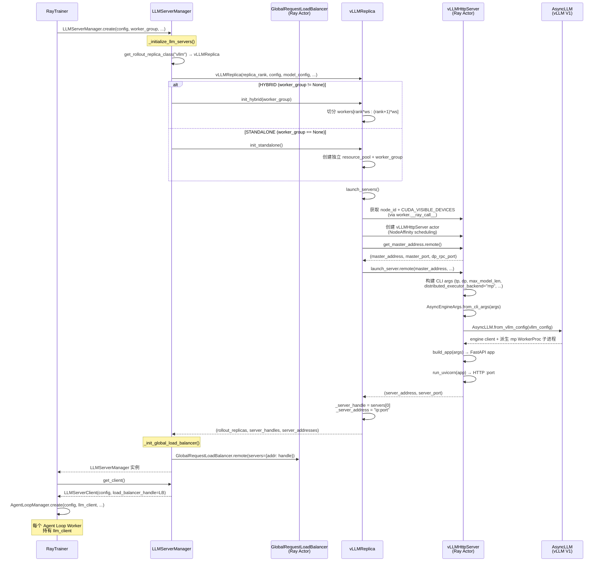
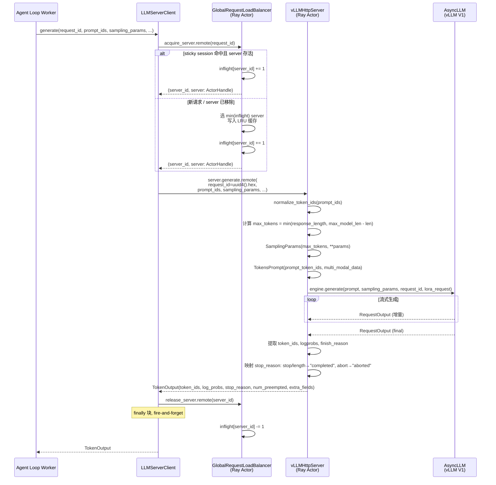
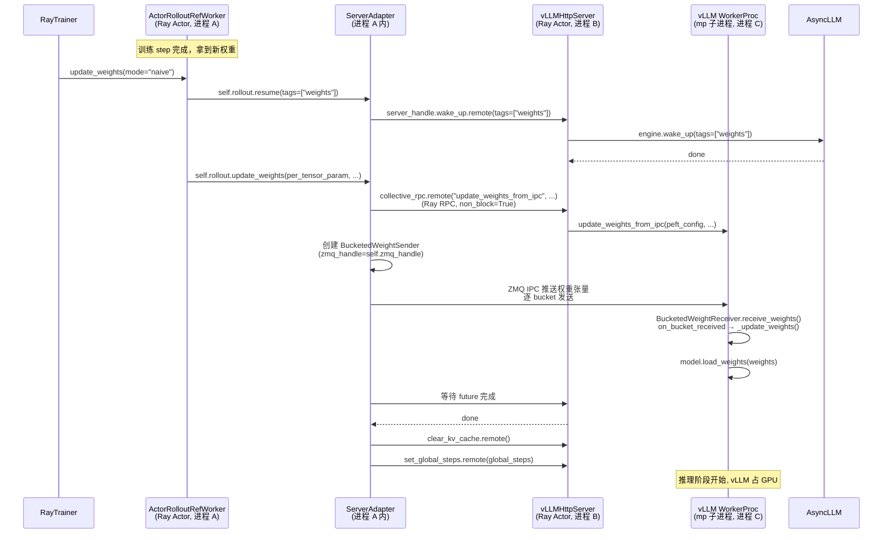
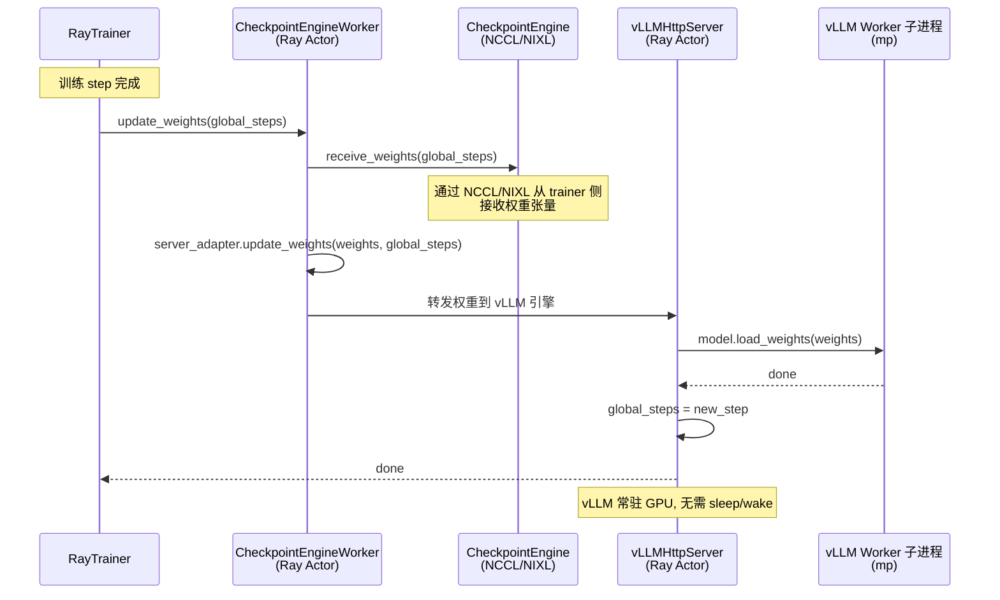

# LLMServerClient 与 vLLM 推理后端交互分析

> 范围：仅讨论 rollout 使用 vLLM 后端、`distributed_executor_backend="mp"` 的场景，部署模式仅覆盖 HYBRID 和 STANDALONE。
>
> 源码路径前缀：`verl/workers/rollout/`、`verl/experimental/agent_loop/`、`verl/trainer/ppo/`

## 1. 整体架构

verl 的推理（rollout）子系统采用三层解耦设计：**管理器 → 负载均衡器 → 客户端代理**。vLLM 作为可插拔后端之一，通过 `vLLMReplica` → `vLLMHttpServer` → `AsyncLLM` 三层接入。

```
┌─────────────────────────────────────────────────────────────┐
│  RayTrainer (verl/trainer/ppo/ray_trainer.py)               │
│    self.llm_server_manager: LLMServerManager                │
│    self.async_rollout_manager: AgentLoopManager              │
└──────────────┬──────────────────────────┬───────────────────┘
               │ create()                 │ get_client()
               ▼                          ▼
┌──────────────────────────┐   ┌────────────────────────────┐
│  LLMServerManager         │   │  AgentLoopManager           │
│  (llm_server.py:222)      │   │  (agent_loop.py:1044)       │
│                           │   │                            │
│  rollout_replicas:        │   │  agent_loop_workers_class:  │
│    list[RolloutReplica]   │   │    ray.remote(AgentLoopWorker) │
│  server_handles:          │   │                            │
│    list[ActorHandle]      │   │  每个 worker 持有:           │
│  server_addresses:        │   │    llm_client: LLMServerClient │
│    list[str]              │   │                            │
│  global_load_balancer:    │   │                            │
│    GlobalRequestLoadBalancer│  │                            │
│    (Ray Actor)            │   │                            │
└──────────┬───────────────┘   └─────────────┬──────────────┘
           │                                 │ generate()
           │ get_client()                    ▼
           ├────────────────────► ┌──────────────────────────┐
           │                      │  LLMServerClient          │
           │                      │  (llm_server.py:146)      │
           │                      │   _load_balancer:         │
           │                      │     GlobalRequestLoadBalancer│
           │                      └──────────┬───────────────┘
           │                                 │ Ray RPC: server.generate.remote()
           ▼                                 ▼
┌──────────────────────────────────────────────────────────────┐
│  vLLMReplica (vllm_async_server.py:952)                      │
│    server_class: ray.remote(vLLMHttpServer)                  │
│    servers: list[ActorHandle]   # 每个 node 一个              │
│    _server_handle: ActorHandle  # node_rank=0 的 server       │
│    _server_address: str         # "ip:port"                  │
│                                                              │
│  └─ vLLMHttpServer (vllm_async_server.py:69)                 │
│       engine: AsyncLLM           # vLLM V1 异步引擎           │
│       config: RolloutConfig                                    │
│       model_config: HFModelConfig                             │
│       rollout_mode: RolloutMode   # HYBRID 或 STANDALONE     │
│       workers: list[ActorHandle]  # hybrid 模式下的训练 worker │
│       global_steps: int|None       # 权重版本号               │
└──────────────────────────────────────────────────────────────┘
```

## 2. 核心类详解

### 2.1 `LLMServerManager` — 后端生命周期管理

**文件**：`verl/workers/rollout/llm_server.py:222`

| 属性 | 类型 | 说明 |
|---|---|---|
| `config` | `DictConfig` | 整个训练入口配置 |
| `rollout_config` | `RolloutConfig` | rollout 子配置（从 `config.actor_rollout_ref.rollout` 取） |
| `model_config` | `HFModelConfig` | 模型配置 |
| `worker_group` | `RayWorkerGroup \| None` | hybrid 模式下复用的训练 worker 组；`None` 时走 standalone |
| `rollout_replica_class` | `type[RolloutReplica]` | 由 `get_rollout_replica_class("vllm")` 解析为 `vLLMReplica` |
| `rollout_replicas` | `list[RolloutReplica]` | 所有 replica 实例 |
| `server_handles` | `list[ActorHandle]` | 每个 replica 的 node-0 server actor |
| `server_addresses` | `list[str]` | 对应的 `"ip:port"` 地址 |
| `global_load_balancer` | `ActorHandle` | `GlobalRequestLoadBalancer` 的 Ray actor |

**创建流程**（`create()` 工厂方法，`llm_server.py:260`）：

1. `_initialize_llm_servers()`（`llm_server.py:267`）
   - 计算 `rollout_world_size = tp × dp × pp`
   - `num_replicas = world_size // rollout_world_size`
   - 根据 `worker_group` 是否为 `None` 分派：
     - `worker_group` 非空 → `init_hybrid(worker_group)` — rollout 与训练同进程，共享 GPU（on-policy）
     - `worker_group` 为 `None` → `init_standalone()` — 独立 GPU 资源（off-policy）
   - 每个 replica 执行 `launch_servers()` 启动 HTTP 服务，收集 `server_handles` / `server_addresses`

2. `_init_global_load_balancer()`（`llm_server.py:331`）
   ```python
   self.global_load_balancer = GlobalRequestLoadBalancer.remote(
       servers=dict(zip(self.server_addresses, self.server_handles))
   )
   ```

### 2.2 `GlobalRequestLoadBalancer` — 全局负载均衡器

**文件**：`verl/workers/rollout/llm_server.py:43`（`@ray.remote` Ray Actor）

| 属性 | 类型 | 说明 |
|---|---|---|
| `_servers` | `dict[str, ActorHandle]` | server_id → actor handle |
| `_inflight_requests` | `dict[str, int]` | server_id → 在途请求计数 |
| `_request_id_to_server` | `LRUCache` | request_id → server_id（sticky session 缓存） |

**关键方法**：

- `acquire_server(request_id: str) -> tuple[str, ActorHandle]`（`llm_server.py:54`）
  1. 先查 sticky session：若 `request_id` 命中且 server 仍存活 → 复用，`inflight += 1`
  2. 否则选 `min(inflight)` 的 server，写入缓存，`inflight += 1`
  3. 原子返回 `(server_id, handle)`

- `release_server(server_id: str) -> None`（`llm_server.py:72`）— `inflight -= 1`

- `add_servers(servers: dict[str, ActorHandle])` / `remove_servers(server_ids: list[str])`（`llm_server.py:81, 92`）— 弹性扩缩容

### 2.3 `LLMServerClient` — 请求代理

**文件**：`verl/workers/rollout/llm_server.py:146`

| 属性 | 类型 | 说明 |
|---|---|---|
| `config` | `DictConfig` | 全局配置 |
| `_load_balancer` | `ActorHandle \| None` | `GlobalRequestLoadBalancer` 的 Ray actor handle |

**核心方法 `generate()`**（`llm_server.py:192`）：

```python
async def generate(
    self,
    request_id,                       # str: 粘性会话 key
    *,
    prompt_ids: list[int],            # 输入 token ids
    sampling_params: dict[str, Any],  # 采样参数
    image_data: Optional[list[Any]] = None,
    video_data: Optional[list[Any]] = None,
    audio_data: Optional[list[Any]] = None,
    mm_processor_kwargs: Optional[dict[str, Any]] = None,
    **kwargs: Any,
) -> TokenOutput:
```

流程：
1. `_acquire_server(request_id)` → Ray RPC 到 load balancer，拿到 `(server_id, server: ActorHandle)`
2. `server.generate.remote(request_id=uuid4().hex, prompt_ids, sampling_params, ...)` → 直接 Ray RPC 到后端 actor
3. `finally: _release_server(server_id)` — fire-and-forget 减计数

### 2.4 `vLLMReplica` — vLLM 后端 replica

**文件**：`verl/workers/rollout/vllm_rollout/vllm_async_server.py:952`，继承 `RolloutReplica`

| 属性 | 类型 | 说明 |
|---|---|---|
| `replica_rank` | `int` | replica 编号 |
| `config` | `RolloutConfig` | rollout 配置（`omega_conf_to_dataclass` 转换后） |
| `model_config` | `HFModelConfig` | 模型配置 |
| `world_size` | `int` | `tp × dp × pp` |
| `nnodes` | `int` | 该 replica 跨节点数 |
| `gpus_per_replica_node` | `int` | 每节点 GPU 数 |
| `rollout_mode` | `RolloutMode` | `HYBRID` 或 `STANDALONE` |
| `workers` | `list[ActorHandle]` | 复用的训练 worker（hybrid 模式） |
| `servers` | `list[ActorHandle]` | 每个 node 一个 `vLLMHttpServer` actor |
| `_server_handle` | `ActorHandle` | `node_rank=0` 的 server actor |
| `_server_address` | `str` | `"ip:port"` |
| `server_class` | `ray.remote(vLLMHttpServer)` | 用于创建 actor 的 remote class |

**`launch_servers()`**（`vllm_async_server.py:960`）：

1. 通过 `worker.__ray_call__.remote(...)` 获取每个 worker 的 `(node_id, CUDA_VISIBLE_DEVICES)`
2. 对每个 `node_rank`：
   - 用 `NodeAffinitySchedulingStrategy(node_id=node_id, soft=False)` 创建 `vLLMHttpServer` actor
   - 设置环境变量 `RAY_EXPERIMENTAL_NOSET_CUDA_VISIBLE_DEVICES=1`、`NCCL_CUMEM_ENABLE=0`
3. `servers[0].get_master_address.remote()` → 拿 master 地址端口
4. `asyncio.gather(*[server.launch_server.remote(...) for server in self.servers])` — 启动所有节点
5. `servers[0].get_server_address.remote()` → 拿 HTTP 地址，写入 `_server_handle` / `_server_address`

### 2.5 `vLLMHttpServer` — 实际推理服务

**文件**：`verl/workers/rollout/vllm_rollout/vllm_async_server.py:69`

| 属性 | 类型 | 说明 |
|---|---|---|
| `config` | `RolloutConfig` | rollout 配置 |
| `model_config` | `HFModelConfig` | 模型配置 |
| `rollout_mode` | `RolloutMode` | `HYBRID` 或 `STANDALONE` |
| `workers` | `list[ActorHandle]` | 训练 worker（hybrid 模式下权重共享用） |
| `replica_rank` | `int` | replica 编号 |
| `node_rank` | `int` | 节点编号 |
| `gpus_per_node` | `int` | 本节点 GPU 数 |
| `nnodes` | `int` | 总节点数 |
| `engine` | `AsyncLLM` | vLLM V1 异步引擎（`vllm.v1.engine.async_llm.AsyncLLM`） |
| `global_steps` | `int \| None` | 权重版本号，更新权重时设置 |
| `_server_address` | `str` | 本节点 IP |
| `_server_port` | `int \| None` | HTTP 服务端口 |

**`launch_server()`**（`vllm_async_server.py:199`）：

1. 构建 vLLM CLI 参数 dict `args`，关键参数包括：
   - `distributed_executor_backend: "mp"`（`vllm_async_server.py:257`，硬编码）
   - `worker_extension_cls: "verl.workers.rollout.vllm_rollout.utils.vLLMColocateWorkerExtension"`（`vllm_async_server.py:258`）
   - `tensor_parallel_size`, `max_model_len`, `enable_prefix_caching`, `enable_sleep_mode`, `gpu_memory_utilization`, ...
2. 通过 `FlexibleArgumentParser` 解析为 `argparse.Namespace`
3. `node_rank == 0` → `run_server(args)`；否则 `run_headless(args)`
4. `run_server()`（`vllm_async_server.py:347`）：
   - `AsyncEngineArgs.from_cli_args(args)` → `engine_args`
   - `engine_args.create_engine_config()` → `vllm_config`
   - `AsyncLLM.from_vllm_config(vllm_config, ...)` → `self.engine: AsyncLLM`
   - `build_app(args)` → FastAPI app
   - `run_uvicorn(app, args, ...)` → 启动 HTTP 服务，返回 `(port, task)`

**`generate()`**（`vllm_async_server.py:456`）— Token-in-Token-out 生成：

```python
async def generate(
    self,
    prompt_ids: list[int],
    sampling_params: dict[str, Any],
    request_id: str,
    image_data: Optional[list[Any]] = None,
    video_data: Optional[list[Any]] = None,
    audio_data: Optional[list[Any]] = None,
    mm_processor_kwargs: Optional[dict[str, Any]] = None,
    priority: int = 0,
) -> TokenOutput:
```

1. `normalize_token_ids(prompt_ids)` — 标准化 token ids
2. 计算 `max_possible_tokens = max_model_len - len(prompt_ids)`，clamp `max_tokens`
3. `sampling_params = SamplingParams(max_tokens=max_tokens, **sampling_params)` — 转为 vLLM 的 `SamplingParams`
4. 构建 `TokensPrompt(prompt_token_ids=..., multi_modal_data=...)`
5. `generator = self.engine.generate(prompt, sampling_params, request_id, lora_request, priority)` — 调 vLLM AsyncLLM
6. `async for output in generator: final_res = output` — 取最终结果 `RequestOutput`
7. 从 `final_res.outputs[0]` 提取 `token_ids`、`logprobs`、`finish_reason`、`routed_experts`、`num_preempted`
8. 返回 `TokenOutput(token_ids=..., log_probs=..., stop_reason=..., ...)`

### 2.6 `vLLMColocateWorkerExtension` — mp Worker 扩展（Hybrid 权重同步）

**文件**：`verl/workers/rollout/vllm_rollout/utils.py:106`

vLLM 的 mp worker 子进程通过 `worker_extension_cls` 参数（`vllm_async_server.py:258`）继承此类，获得与 verl 训练侧（FSDP/Megatron）共享权重的能力：

- `update_weights_from_ipc(peft_config, base_sync_done, use_shm)` — 通过 ZMQ IPC socket / 共享内存接收训练侧推送的权重张量
  - 内部创建 `BucketedWeightReceiver`（`bucketed_weight_transfer.py:233`），逐 bucket 接收
  - 回调 `_update_weights(weights, peft_config, base_sync_done)` → `model.load_weights()` 加载
  - 若为 LoRA 则构造 `TensorLoRARequest`
- `monkey_patch_model(vocab_size)` — patch `compute_logits` 防止采样 OOV token，patch MoE 模型 weight loader

## 3. 两种部署模式

### 3.1 HYBRID 模式（on-policy）

**触发条件**：`LLMServerManager` 构造时传入 `worker_group`（非 `None`）

**特征**：
- 训练和推理**共享同一批 GPU**，时分复用（非同进程，见下方说明）
- 同一 GPU 上有三个进程：`ActorRolloutRefWorker`（Ray Actor，含训练引擎 + `ServerAdapter` 代理）、`vLLMHttpServer`（Ray Actor）、vLLM WorkerProc（mp 子进程）
- `ServerAdapter`（[vllm_rollout.py:61](file:///Users/nyp/Documents/verl/verl/workers/rollout/vllm_rollout/vllm_rollout.py#L61)）是 `ActorRolloutRefWorker` 内的代理，通过 Ray RPC 调 `vLLMHttpServer`，通过 ZMQ IPC 推送权重到 vLLM WorkerProc
- 训练和推理**时分复用**：训练时 vLLM `engine.sleep(level=2)` 释放显存；推理前 `engine.wake_up(tags=["kv_cache","weights"])` 恢复
- 权重同步通过 `BucketedWeightSender`（训练侧）→ ZMQ IPC → `BucketedWeightReceiver`（vLLM WorkerProc 侧），每 GPU 1:1 对应

> **注意**：`RolloutMode.HYBRID` 的 docstring（[replica.py:53](file:///Users/nyp/Documents/verl/verl/workers/rollout/replica.py#L53)）写的是"fused in same process"，这是遗留的理想化描述。实际 async server mode 实现中，训练和推理是**不同进程**，共享同一 GPU，通过 ZMQ IPC + CUDA IPC 传输权重。

### 3.2 STANDALONE 模式（off-policy）

**触发条件**：`LLMServerManager` 构造时 `worker_group=None`，此时要求 `rollout_config.nnodes > 0`

**特征**：
- vLLM 独占 GPU 资源，与训练进程完全分离
- 无需 sleep/wake 时分复用，推理引擎常驻
- 权重同步通过 `CheckpointEngineWorker` + NCCL/NIXL 从 trainer 侧传输（非 IPC）
- 适合 off-policy 训练，rollout 和训练可并行

### 3.3 模式对比

| 维度 | HYBRID | STANDALONE |
|---|---|---|
| GPU 共享 | 训练 + 推理共享同一批 GPU | 推理独占 GPU |
| 显存管理 | 时分复用（sleep/wake） | 常驻 |
| 权重同步 | ZMQ IPC + CUDA IPC（`update_weights_from_ipc`） | NCCL/NIXL（`CheckpointEngineWorker`） |
| 策略 | on-policy | off-policy |
| `rollout_mode` 值 | `RolloutMode.HYBRID` | `RolloutMode.STANDALONE` |
| init 方法 | `init_hybrid(worker_group)` | `init_standalone()` |

## 4. mp 执行器进程模型

vLLM 硬编码使用 `distributed_executor_backend="mp"`（`vllm_async_server.py:257`）。在此模式下，`vLLMHttpServer` Ray Actor 作为父进程，通过 Python `multiprocessing` 派生 `world_size` 个 `WorkerProc` 子进程，每个子进程绑定 1 GPU。

```
┌─ vLLMHttpServer (Ray Actor) ──────────────────────┐
│  AsyncLLM 引擎                                      │
│  ├─ EngineCore (调度器)                              │
│  └─ Executor: MultiprocExecutor                      │
│       ├─ WorkerProc_0 (mp 子进程) → GPU0  ← 继承 vLLMColocateWorkerExtension
│       ├─ WorkerProc_1 (mp 子进程) → GPU1
│       └─ ...                                        │
└─────────────────────────────────────────────────────┘
```

**特性**：
- worker 子进程直接继承父 actor 的 `CUDA_VISIBLE_DEVICES`
- 单节点 TP 场景下最简单高效
- 多节点靠 verl 在每节点创建独立的 `vLLMHttpServer` actor + `run_headless()` 实现，节点间通过 NCCL 通信（需 vLLM ≥ 0.11.1，见 `vllm_async_server.py:1117-1120`）
- hybrid 模式下 `vLLMColocateWorkerExtension.update_weights_from_ipc()` 通过 ZMQ IPC 与同 GPU 的 Training Worker 同步权重

## 5. 数量关系

### 通用公式

| 实体 | 数量公式 | 说明 |
|---|---|---|
| **GlobalRequestLoadBalancer** | 恒为 **1** | 全局唯一 Ray Actor |
| **vLLMReplica** | `num_replicas = world_size ÷ (tp × dp × pp)` | 每个是一个独立推理实例 |
| **节点（node）** | `nnodes_per_replica = rollout_world_size ÷ gpus_per_replica_node` | 单个 replica 跨多少节点 |
| **vLLMHttpServer** | `num_replicas × nnodes_per_replica` | 每个 replica 在每个节点上创建 1 个 Ray Actor |
| **AsyncLLM** | `num_replicas` | 每个 replica **1 个**引擎（仅 `node_rank=0` 持有引用） |
| **vLLM Worker 进程（mp）** | `num_replicas × rollout_world_size` | 每GPU 1 个 mp 子进程 |
| **LLMServerClient** | **1** | 全局共享，所有 AgentLoopWorker 持有同一份 `_load_balancer` 句柄 |

> **关键**：`GlobalRequestLoadBalancer` 注册的是每个 replica 的 **node_rank=0** 的 server handle（`vllm_async_server.py:829`），所以 LB 里的 entry 数 = replica 数，而非 server actor 总数。

### 具体例子

**集群**：4 节点 × 8 GPU = 32 GPU

**配置**：`tensor_model_parallel_size=16, data_parallel_size=1, pipeline_model_parallel_size=1`

```
rollout_world_size   = 16 × 1 × 1 = 16
gpus_per_replica_node = min(8, 16) = 8
nnodes_per_replica    = 16 ÷ 8 = 2
num_replicas          = 32 ÷ 16 = 2
```

| 实体 | 数量 | 说明 |
|---|---|---|
| GlobalRequestLoadBalancer | **1** | 全局唯一 |
| vLLMReplica | **2** | replica-0（node-0,1）、replica-1（node-2,3） |
| 节点 | **4** | 每节点 8 GPU |
| vLLMHttpServer | **4** | 每节点 1 个 Ray Actor |
| AsyncLLM | **2** | 每 replica 1 个引擎 |
| vLLM Worker 进程 | **32** | 每 GPU 1 个 mp 子进程 |
| ActorRolloutRefWorker (hybrid) | **32** | 仅 HYBRID 模式，每 GPU 1 个 Ray Actor（含训练引擎 + ServerAdapter 代理） |
| LLMServerClient | **1** | 全局共享 |

### 进程拓扑（HYBRID 模式）

HYBRID 模式下有**五类进程**，下图展示完整的进程布局、类名和相互引用关系（以 4 节点 × 8 GPU = 32 GPU，TP=16, DP=1, PP=1 → 2 个 replica 为例）：

```
┌─────────────────────────────────────────────────────────────────────────┐
│                        全局协调进程 (跨节点)                              │
│                                                                         │
│  ┌─ RayTrainer (verl/trainer/ppo/ray_trainer.py)                      │
│  │    self.llm_server_manager: LLMServerManager                        │
│  │    self.async_rollout_manager: AgentLoopManager                      │
│  │    self.actor_rollout_wg: RayWorkerGroup                             │
│  └───────┬──────────────────────────────┬──────────────────────────────┘
│          │ create(config, worker_group)  │ create(config, llm_client, ...)
│          ▼                               ▼
│  ┌─ LLMServerManager ──────┐  ┌─ AgentLoopManager ─────────────────────┐
│  │ (llm_server.py:222)      │  │ (agent_loop.py:1044)                   │
│  │  rollout_replicas:       │  │  agent_loop_workers_class:             │
│  │    list[vLLMReplica]      │  │    ray.remote(AgentLoopWorker)         │
│  │  server_handles:          │  │  agent_loop_workers:                  │
│  │    list[ActorHandle]      │  │    list[ActorHandle]                   │
│  │  server_addresses:        │  └───────────┬───────────────────────────┘
│  │    list[str]              │              │ .remote(config, llm_client, ...)
│  │  global_load_balancer ────┼──┐           ▼
│  │    : ActorHandle           │  │  ┌─ AgentLoopWorker (Ray Actor) ───────┐
│  │  worker_group:             │  │  │ (agent_loop.py:393)                 │
│  │    RayWorkerGroup          │  │  │  self.llm_client: LLMServerClient    │
│  └───────────────────────────┘  │  │    ._load_balancer: ActorHandle ─────┼──┐
│                                  │  └────────────────────────────────────┘  │
│                                  │                                          │
│  ┌─ GlobalRequestLoadBalancer ───┼──────────────────────────────────────────┘
│  │ (llm_server.py:43, @ray.remote)│
│  │  _servers: dict[str, ActorHandle]  ← server_id("ip:port") → vLLMHttpServer handle
│  │  _inflight_requests: dict[str, int]
│  │  _request_id_to_server: LRUCache   ← request_id → server_id
│  └─────────────────────────────────┘
└─────────────────────────────────────────────────────────────────────────┘

================= Replica-0 (16 GPU, 跨 node-0 + node-1) =================

Node-0 (8 GPU)                              Node-1 (8 GPU)
┌────────────────────────────────────┐     ┌────────────────────────────────────┐
│ 进程 A: ActorRolloutRefWorker_0..7  │     │ 进程 A: ActorRolloutRefWorker_8..15 │
│  (engine_workers.py:434, Ray Actor) │     │  (engine_workers.py:434, Ray Actor) │
│  每 GPU 1 个，共 8 个                │     │  每 GPU 1 个，共 8 个                │
│                                     │     │                                    │
│  ├─ self.actor: FSDPWorker         │     │  ├─ self.actor: FSDPWorker         │
│  │   └─ FSDP 训练引擎               │     │  │   └─ FSDP 训练引擎               │
│  │      self.actor.engine:         │     │  │      self.actor.engine:         │
│  │        TorchWFEngine            │     │  │        TorchWFEngine            │
│  │                                 │     │  │                                 │
│  ├─ self.rollout: ServerAdapter    │     │  ├─ self.rollout: ServerAdapter    │
│  │   (vllm_rollout.py:61)          │     │  │   (vllm_rollout.py:61)          │
│  │   ├─ server_handle: ActorHandle─┼──→进程B  │   ├─ server_handle: ActorHandle─┼──→进程B
│  │   │   (ray.get_actor(            │     │  │   │   (ray.get_actor(            │
│  │   │    "vllm-server_0_0"))       │     │  │   │    "vllm-server_0_1"))       │
│  │   ├─ zmq_handle: str             │     │  │   ├─ zmq_handle: str             │
│  │   │   "ipc:///tmp/rl-colocate   │     │  │   │   "ipc:///tmp/rl-colocate   │
│  │   │    -zmq-{job}-r0-rank0.sock"│     │  │   │    -zmq-{job}-r0-rank8.sock"│
│  │   └─ self.checkpoint_engine:    │     │  │   └─ self.checkpoint_engine:    │
│  │       CheckpointEngine          │     │  │       CheckpointEngine          │
│  │       (backend="naive")         │     │  │       (backend="naive")         │
│  │                                 │     │  │                                 │
│  └─ 进程 A 内调用链:                │     │  └─ 进程 A 内调用链:                │
│     update_weights(mode="naive")   │     │     update_weights(mode="naive")   │
│     → self.rollout.resume(tags)    │     │     → self.rollout.resume(tags)    │
│     → self.rollout.update_weights  │     │     → self.rollout.update_weights  │
│       (创建 BucketedWeightSender,  │     │       (创建 BucketedWeightSender,  │
│       → ZMQ IPC 推送张量)           │     │       → ZMQ IPC 推送张量)           │
│                                     │     │                                    │
│ 进程 B: vLLMHttpServer_0 (Ray Actor)│     │ 进程 B: vLLMHttpServer_1 (Ray Actor)│
│  (vllm_async_server.py:69)          │     │  (vllm_async_server.py:69)          │
│  node_rank=0, replica_rank=0        │     │  node_rank=1, replica_rank=0        │
│                                     │     │                                    │
│  ├─ engine: AsyncLLM (vLLM V1)     │     │  └─ run_headless() (join cluster)    │
│  ├─ config: RolloutConfig          │     │                                    │
│  ├─ rollout_mode: RolloutMode.HYBRID│     │                                    │
│  ├─ workers: list[ActorHandle]     │     │                                    │
│  │   = 进程 A 的 handle 列表        │     │                                    │
│  ├─ global_steps: int | None       │     │                                    │
│  ├─ _server_address: str (本机 IP)  │     │                                    │
│  └─ _server_port: int (动态分配)    │     │                                    │
│                                     │     │                                    │
│  ┌─ MultiprocExecutor ─────────┐   │     │  ┌─ MultiprocExecutor (join) ──┐   │
│  │  (distributed_executor_     │   │     │  │                              │   │
│  │   backend="mp")             │   │     │  │                              │   │
│  │                              │   │     │  │                              │   │
│  │  进程 C: WorkerProc_0 (mp)   │   │     │  │  进程 C: WorkerProc_8 (mp)   │   │
│  │   → GPU0                     │   │     │  │   → GPU0                     │   │
│  │   继承 vLLMColocateWorker   │   │     │  │   继承 vLLMColocateWorker   │   │
│  │   Extension                  │   │     │  │   Extension                  │   │
│  │   (utils.py:106)            │   │     │  │   (utils.py:106)            │   │
│  │   ├─ model_runner            │   │     │  │   ├─ model_runner            │   │
│  │   ├─ BucketedWeightReceiver  │   │     │  │   ├─ BucketedWeightReceiver  │   │
│  │   │  (接收 ZMQ IPC 权重)     │   │     │  │   │  (接收 ZMQ IPC 权重)     │   │
│  │   └─ model.load_weights()    │   │     │  │   └─ model.load_weights()    │   │
│  │                              │   │     │  │                              │   │
│  │  进程 C: WorkerProc_1 (mp)   │   │     │  │  进程 C: WorkerProc_9 (mp)   │   │
│  │   → GPU1 (同上)              │   │     │  │   → GPU1 (同上)              │   │
│  │  ...                         │   │     │  │  ...                         │   │
│  │  进程 C: WorkerProc_7 (mp)   │   │     │  │  进程 C: WorkerProc_15 (mp)  │   │
│  │   → GPU7                     │   │     │  │   → GPU7                     │   │
│  └──────────────────────────────┘   │     │  └──────────────────────────────┘   │
│                                     │     │                                    │
│  HTTP :port (master)                │     │                                    │
└────────────────────────────────────┘     └────────────────────────────────────┘

  引用关系 (进程 A → 进程 B → 进程 C):
  ─────────────────────────────────────────────────────────────────────────
  1. ServerAdapter.server_handle ──Ray RPC──→ vLLMHttpServer
     (ray.get_actor("vllm-server_0_0"))
     调用: collective_rpc("update_weights_from_ipc", ...)
           wake_up.remote(), sleep.remote(), clear_kv_cache.remote()

  2. ServerAdapter.zmq_handle ──ZMQ IPC──→ WorkerProc.BucketedWeightReceiver
     BucketedWeightSender → ZMQ socket → BucketedWeightReceiver
     (CUDA IPC 传张量句柄)

  3. AgentLoopWorker.llm_client._load_balancer ──Ray RPC──→ GlobalRequestLoadBalancer
     acquire_server(request_id) → (server_id, vLLMHttpServer handle)
     → server.generate.remote(prompt_ids, sampling_params, ...)

  4. vLLMHttpServer.workers = ActorRolloutRefWorker 的 handle 列表
     (init_hybrid 时从 worker_group.workers 切片得到)
     用于: 获取 node_id, CUDA_VISIBLE_DEVICES (launch_servers)

  GPU0 上的三个进程:
  ┌──────────────┐     ┌──────────────┐     ┌──────────────┐
  │ 进程 A_0     │     │ 进程 B_0     │     │ 进程 C_0     │
  │ ActorRollout │     │ vLLMHttpServ │     │ WorkerProc   │
  │ RefWorker    │     │ er           │     │ (mp 子进程)   │
  │ (训练+代理)  │     │ (推理引擎)   │     │ (GPU 计算)   │
  └──────────────┘     └──────────────┘     └──────────────┘
   ← sleep/wake 时分复用 GPU0 →
```

**关键引用关系总结**：

| 源 (进程/类) | 属性 | 目标 (进程/类) | 通信方式 | 用途 |
|---|---|---|---|---|
| `ServerAdapter` (进程 A) | `server_handle: ActorHandle` | `vLLMHttpServer` (进程 B) | Ray RPC | sleep/wake/collective_rpc |
| `ServerAdapter` (进程 A) | `zmq_handle: str` | `WorkerProc` (进程 C) | ZMQ IPC + CUDA IPC | 权重张量传输 |
| `AgentLoopWorker` | `llm_client._load_balancer: ActorHandle` | `GlobalRequestLoadBalancer` (全局) | Ray RPC | acquire/release server |
| `GlobalRequestLoadBalancer` | `_servers: dict[str, ActorHandle]` | `vLLMHttpServer` (进程 B) | Ray RPC 句柄注册 | 路由 generate 请求 |
| `vLLMHttpServer` (进程 B) | `workers: list[ActorHandle]` | `ActorRolloutRefWorker` (进程 A) | Ray RPC 句柄引用 | 获取 node/GPU 信息（仅初始化时） |
| `vLLMHttpServer` (进程 B) | mp 父进程 | `WorkerProc` (进程 C) | multiprocessing | 引擎内部派生 |

**关键点**：
- **同一 GPU 上有三个进程**：`ActorRolloutRefWorker`（进程 A，含训练引擎 + `ServerAdapter` 代理）、`vLLMHttpServer`（进程 B）、`WorkerProc`（进程 C，mp 子进程）
- 训练引擎在进程 A 中，推理引擎（AsyncLLM）在进程 B 中，它们是**不同进程**
- `ServerAdapter`（进程 A 内）通过 Ray RPC 调 `vLLMHttpServer`（进程 B），通过 ZMQ IPC 推送权重到 `WorkerProc`（进程 C）
- 训练和推理**交替使用 GPU**——靠 `engine.sleep()` / `engine.wake_up()` 切换
- 权重同步是 1:1 per GPU：进程 A 的 `BucketedWeightSender` → 进程 C 的 `BucketedWeightReceiver`

#### 在同卡上增加 replica 的可行性分析（结合上图）

假设在 Replica-0 所在的 16 张卡上再创建一个 Replica-2（同样 16 GPU, TP=16），逐环节评估：

**1. `vLLMHttpServer` actor 命名 — ✅ 支持**

actor 名 `f"vllm-server_{replica_rank}_{node_rank}"`（[vllm_async_server.py:1011](file:///Users/nyp/Documents/verl/verl/workers/rollout/vllm_rollout/vllm_async_server.py#L1011)），`replica_rank=2` 与 `replica_rank=0` 不冲突。

**2. HTTP 端口分配 — ✅ 支持**

`get_free_port()`（[vllm_async_server.py:160](file:///Users/nyp/Documents/verl/verl/workers/rollout/vllm_rollout/vllm_async_server.py#L160)）动态分配，同一节点上多个 server actor 各拿不同端口。

**3. `_server_address` + LB 注册 — ✅ 支持**

`"ip:port"` 因 port 不同而唯一，`GlobalRequestLoadBalancer._servers` dict 的 key 不冲突（[llm_server.py:333](file:///Users/nyp/Documents/verl/verl/workers/rollout/llm_server.py#L333)）。LB 会把 Replica-0 和 Replica-2 当作两个独立 server，自动做负载均衡。

**4. `num_replicas` 计算 — ❌ 阻碍**

[llm_server.py:297](file:///Users/nyp/Documents/verl/verl/workers/rollout/llm_server.py#L297)：`num_replicas = world_size // rollout_world_size`，算出来永远是 1。需覆盖此计算逻辑。

**5. `init_hybrid` worker 切片 — ❌ 阻碍**

[replica.py:137](file:///Users/nyp/Documents/verl/verl/workers/rollout/replica.py#L137)：`self.workers = worker_group.workers[ws*rank : ws*(rank+1)]`，`replica_rank=2` 时切片 `[16:32]` 越界（训练只有 16 workers）。需改为复用 Replica-0 的同一批 workers（取模或手动覆盖）。

**6. ZMQ socket 路径 — ❌ 阻碍**

[vllm_rollout.py:107](file:///Users/nyp/Documents/verl/verl/workers/rollout/vllm_rollout/vllm_rollout.py#L107)：`f"ipc:///tmp/rl-colocate-zmq-{job_id}-replica-{replica_rank}-rank-{local_rank}.sock"`，`replica_rank` 不同所以路径不冲突——**实际上这个不阻碍**。但进程 A 的 `ServerAdapter` 是从 `ActorRolloutRefWorker` 内部创建的（[engine_workers.py:609](file:///Users/nyp/Documents/verl/verl/workers/engine_workers.py#L609)），每个 `ActorRolloutRefWorker` 只有一个 `self.rollout: ServerAdapter`，它只指向一个 `replica_rank`。要支持两个 replica 复用同一进程 A，需要让进程 A 持有两个 `ServerAdapter` 实例（两个 `zmq_handle`、两个 `server_handle`），这需要改 `ActorRolloutRefWorker` 的结构。

**7. vLLM CUDA context — ❌ 潜在阻碍**

vLLM 的 `gpu_memory_utilization` 是独占语义（从 `cudaMemGetInfo` 看到的总显存中分配比例），两个 vLLM 引擎在同一 GPU 上会各自按比例预分配显存。vLLM 不原生支持"从剩余显存中分配"。需要手动调小 `gpu_memory_utilization`（如 0.25），但这属于显存管理范畴（假设已解决）。

**结论**：现有接口在 actor 命名、端口分配、LB 注册、ZMQ socket 路径层面**不冲突**；硬阻碍在 `num_replicas` 计算、`init_hybrid` 切片逻辑、以及 `ActorRolloutRefWorker` 只持有一个 `ServerAdapter`（需改为持多个）。前两个可通过继承 `LLMServerManager` 覆盖方法解决，第三个需改 `ActorRolloutRefWorker` 结构。

#### 同卡多 Replica 方案：接口串联分析

在忽略 ZMQ 权重同步（新 replica 不需要以这种方式同步参数）和显存分配（通过精细化休眠/唤醒释放显存）的前提下，现有接口可以串联起完整的创建-注册-调度流程。

**涉及接口清单**：

| 步骤 | 接口 | 位置 | 作用 |
|---|---|---|---|
| 1 | `vLLMReplica.__init__(replica_rank, config, model_config, gpus_per_node)` | [replica.py:95](file:///Users/nyp/Documents/verl/verl/workers/rollout/replica.py#L95) | 构造 replica 对象 |
| 2 | 手动设置 `replica.workers` + `replica.rollout_mode` | [replica.py:133](file:///Users/nyp/Documents/verl/verl/workers/rollout/replica.py#L133) | 复用已有训练 worker handle 列表（绕过 `init_hybrid` 切片越界） |
| 3 | `replica.launch_servers()` | [vllm_async_server.py:960](file:///Users/nyp/Documents/verl/verl/workers/rollout/vllm_rollout/vllm_async_server.py#L960) | 创建 vLLMHttpServer actors、启动引擎、拿到 address + handle |
| 4 | `global_load_balancer.add_servers.remote({address: handle})` | [llm_server.py:81](file:///Users/nyp/Documents/verl/verl/workers/rollout/llm_server.py#L81) | 注册到 LB，立即开始接收请求 |
| 5 | `replica.sleep()` / `replica.wake_up()` | [replica.py:255-258](file:///Users/nyp/Documents/verl/verl/workers/rollout/replica.py#L255-L258) | 精细化休眠/唤醒，释放/恢复显存 |
| 6 | `global_load_balancer.remove_servers.remote([address])` | [llm_server.py:92](file:///Users/nyp/Documents/verl/verl/workers/rollout/llm_server.py#L92) | 从 LB 移除（不需要时） |

**串联流程伪代码**：

```python
# 前提: 已有 LLMServerManager 实例 mgr，已有 Replica-0 运行在同卡上
# 目标: 在同一批 GPU 上创建 Replica-2

# --- 步骤 1: 构造新 replica ---
from verl.workers.rollout.vllm_rollout.vllm_async_server import vLLMReplica

replica_2 = vLLMReplica(
    replica_rank=2,                          # 不与 Replica-0 冲突
    config=mgr.rollout_config,
    model_config=mgr.model_config,
    gpus_per_node=mgr.rollout_replicas[0].gpus_per_node,
)

# --- 步骤 2: 手动设置 workers，复用 Replica-0 的同一批训练 worker ---
# 绕过 init_hybrid 的切片越界问题
replica_2.rollout_mode = RolloutMode.HYBRID
replica_2.workers = mgr.rollout_replicas[0].workers    # ← 复用同一批 worker handles

# --- 步骤 3: 启动 vLLM 引擎 ---
await replica_2.launch_servers()
# 此时:
#   - vLLMHttpServer actor 名为 "vllm-server_2_0" (不冲突)
#   - 端口动态分配 (不冲突)
#   - replica_2._server_handle = ActorHandle
#   - replica_2._server_address = "ip:port" (不冲突)

# --- 步骤 4: 注册到全局负载均衡器 ---
await mgr.global_load_balancer.add_servers.remote({
    replica_2._server_address: replica_2._server_handle
})
# 现有 LLMServerClient 无需任何改动，自动通过 LB 路由到新 replica

# --- 步骤 5: 精细化休眠/唤醒 (推理与训练交替) ---
# 训练阶段: 让 Replica-2 休眠释放显存
await replica_2.sleep()       # engine.sleep(level=2), 释放 KV cache + 权重显存

# 推理阶段: 唤醒 Replica-2
await replica_2.wake_up()     # engine.wake_up(tags=["kv_cache","weights"])

# --- 步骤 6: 不需要时移除 ---
await mgr.global_load_balancer.remove_servers.remote([replica_2._server_address])
```

**为什么这条路走得通**：

1. **`launch_servers()` 只依赖 `self.workers`（`list[ActorHandle]`），不需要 `RayWorkerGroup`**

   [vllm_async_server.py:976-987](file:///Users/nyp/Documents/verl/verl/workers/rollout/vllm_rollout/vllm_async_server.py#L976-L987) 通过 `self.workers[i].__ray_call__.remote(...)` 获取 `node_id` 和 `CUDA_VISIBLE_DEVICES`。只要 `self.workers` 非空且是有效的 Ray Actor handle，就能拿到正确的 node/GPU 信息——**不关心这些 worker 是否属于自己，只关心它们跑在哪些卡上**。所以复用 Replica-0 的 workers 不会报错。

2. **`add_servers()` 是运行时接口，不需要重启**

   [llm_server.py:81-87](file:///Users/nyp/Documents/verl/verl/workers/rollout/llm_server.py#L81-L87) 原子地往 `_servers` 和 `_inflight_requests` 里加 entry。这是 `FullyAsyncLLMServerManager.add_replicas()` 用的同一个接口（[fully_async_rollouter.py:273](file:///Users/nyp/Documents/verl/verl/experimental/fully_async_policy/fully_async_rollouter.py#L273)），已经在生产路径中验证过。

3. **`LLMServerClient` 无需改动**

   client 通过 `_load_balancer.acquire_server(request_id)` 拿到 server handle，不关心有多少个 replica。LB 自动把请求分到新 replica（sticky session miss 时走 least-inflight）。

4. **sleep/wake 是 per-replica 的**

   [replica.py:255-258](file:///Users/nyp/Documents/verl/verl/workers/rollout/replica.py#L255-L258) 的 `sleep()` / `wake_up()` 遍历 `self.servers` 调 `server.sleep.remote()` / `server.wake_up.remote()`。可以独立控制 Replica-0 和 Replica-2 的休眠状态，实现交替推理。

**唯一需要绕过的阻碍**：

| 阻碍 | 原因 | 绕过方式 |
|---|---|---|
| `init_hybrid` 切片越界 | [replica.py:137](file:///Users/nyp/Documents/verl/verl/workers/rollout/replica.py#L137) `workers[ws*rank : ws*(rank+1)]`，rank=2 越界 | **不调 `init_hybrid`**，手动设 `replica.workers = replica_0.workers` + `replica.rollout_mode = HYBRID`，然后直接调 `launch_servers()` |

`num_replicas` 计算（[llm_server.py:297](file:///Users/nyp/Documents/verl/verl/workers/rollout/llm_server.py#L297)）只在 `_initialize_llm_servers` 里用，如果不走这个方法、而是手动创建 replica 并 `add_servers`，就不受这个限制。

**`actor_rollout_wg` 不需要参与**：

`self.actor_rollout_wg`（`RayWorkerGroup` 对象本身）不需要参与新 replica 的创建和运行。原因如下：

| `RayWorkerGroup` 的职责 | 新 Replica-2 是否需要 | 原因 |
|---|---|---|
| `execute_all_sync("sleep")` — fan-out 到所有 worker | 否 | Replica-2 自己调 `replica_2.sleep()` → `vLLMHttpServer_2.sleep.remote()` |
| `execute_all_sync("wake_up")` — 唤醒 vLLM | 否 | Replica-2 自己调 `replica_2.wake_up()` |
| `execute_all_sync("update_weights")` — 权重同步 | 否 | 已忽略 ZMQ 权重同步 |
| `execute_all_sync("generate_sequences")` — 生成 | 否 | 走 `AgentLoopWorker` + `LLMServerClient` → LB → `vLLMHttpServer_2` |
| `.workers` 属性 — 提供 handle 列表 | **仅需列表本身** | 初始化时取 `replica_0.workers`（`list[ActorHandle]`），拿到后即脱离 `RayWorkerGroup` |

`RayWorkerGroup` 是一个**任务分发器**——它把方法调用 fan-out 到所有 worker。但新 Replica-2 的所有操作（generate、sleep、wake）都通过 `vLLMHttpServer` actor 直接进行，不经过 `ActorRolloutRefWorker`，所以不需要这个任务分发器。

数据流对比：

```
正常 Replica-0 的数据流:
  Trainer → actor_rollout_wg → ActorRolloutRefWorker.rollout(ServerAdapter) → vLLMHttpServer_0
  Trainer → actor_rollout_wg → ActorRolloutRefWorker.update_weights() → ZMQ → WorkerProc

新 Replica-2 的数据流 (不经过 actor_rollout_wg):
  AgentLoopWorker → LLMServerClient → GlobalRequestLoadBalancer → vLLMHttpServer_2
  独立调度 → replica_2.sleep() / replica_2.wake_up() → vLLMHttpServer_2
```

唯一需要 `actor_rollout_wg` 的地方是**初始化时取 `.workers` 列表**，拿到后就可以脱离它独立运行。这也是 `FullyAsyncLLMServerManager.add_replicas()` 的模式——它只操作 `replica._server_handle` 和 `replica._server_address`，不经过 `actor_rollout_wg`。

**完整调用链**：

```
vLLMReplica.__init__(replica_rank=2, ...)
    │
    ├─ 手动: replica.workers = replica_0.workers  (复用同卡 workers)
    ├─ 手动: replica.rollout_mode = RolloutMode.HYBRID
    │
    ▼
replica.launch_servers()
    │
    ├─ worker.__ray_call__.remote() → 获取 node_id, CUDA_VISIBLE_DEVICES
    ├─ ray.remote(vLLMHttpServer)
    │   .options(name="vllm-server_2_0", NodeAffinity)
    │   .remote(...)
    ├─ server.launch_server.remote(master_address, ...)
    │   └─ AsyncLLM.from_vllm_config() → engine
    │   └─ run_uvicorn() → HTTP :port
    ├─ replica._server_handle = servers[0]
    └─ replica._server_address = "ip:port"
    │
    ▼
global_load_balancer.add_servers.remote({address: handle})
    │
    └─ _servers[address] = handle
    └─ _inflight_requests[address] = 0
    │
    ▼ (立即生效)
LLMServerClient.generate(request_id, ...)
    │
    └─ LB.acquire_server → 可能返回 Replica-2 的 handle
       └─ server.generate.remote(prompt_ids, ...)
```

### 进程拓扑（STANDALONE 模式）

```
================= Replica-0 (16 GPU, 跨 node-0 + node-1) =================

Node-0 (8 GPU)                              Node-1 (8 GPU)
┌────────────────────────────────────┐     ┌────────────────────────────────────┐
│ vLLMHttpServer_0 (Ray Actor)        │     │ vLLMHttpServer_1 (Ray Actor)        │
│  ├─ AsyncLLM 引擎 (node_rank=0)     │     │  └─ run_headless (node_rank=1)      │
│  ├─ MultiprocExecutor               │     │  ├─ MultiprocExecutor (join)        │
│  │   ├─ WorkerProc_0 (mp) → GPU0   │     │  │   ├─ WorkerProc_8 (mp) → GPU0  │
│  │   └─ ...                        │     │  │   └─ ...                        │
│  └─ HTTP :port                      │     │  └─                                │
│                                     │     │                                    │
│ CheckpointEngineWorker_0..7          │     │ CheckpointEngineWorker_8..15        │
│  (Ray Actor, 独立 GPU)              │     │  (Ray Actor)                       │
│  └─ CheckpointEngine                │     │  └─ CheckpointEngine              │
└────────────────────────────────────┘     └────────────────────────────────────┘
        ↑ NCCL / NIXL                           ↑ NCCL / NIXL
        └─────────── 权重同步 ─────────────────────┘

（无 Training Worker 共享 GPU，vLLM Worker 独占 GPU）
```

## 6. 调用时序图

### 6.1 初始化时序



### 6.2 生成样本时序



### 6.3 权重同步时序（HYBRID 模式）



### 6.4 权重同步时序（STANDALONE 模式）



## 7. 数据结构

### `TokenOutput`（`verl/workers/rollout/replica.py:36`）

| 字段 | 类型 | 说明 |
|---|---|---|
| `token_ids` | `list[int]` | 响应 token ids |
| `log_probs` | `list[float] \| None` | 响应 token 的 logprobs |
| `routed_experts` | `Any \| None` | MoE 路由专家（开启 routing replay 时） |
| `stop_reason` | `str \| None` | `"completed"` / `"aborted"` / 其它 |
| `num_preempted` | `int \| None` | 抢占次数 |
| `extra_fields` | `dict[str, Any]` | 动态扩展字段（含 `global_steps`、spec decode stats 等） |

### `RolloutMode`（`verl/workers/rollout/replica.py:51`）

vLLM 主推理只使用以下两种模式。分派逻辑在 [`LLMServerManager._initialize_llm_servers`](file:///Users/nyp/Documents/verl/verl/workers/rollout/llm_server.py#L313-L325)：

```python
if self.worker_group:                    # vLLM → HYBRID
    → init_hybrid(worker_group)
else:                                    # worker_group=None → STANDALONE
    → init_standalone()
```

| 值 | init 方法 | 说明 |
|---|---|---|
| `HYBRID` | `init_hybrid()` | rollout 与训练同进程，共享 GPU，靠权重同步切换 |
| `STANDALONE` | `init_standalone()` | 独立 GPU 资源，解耦架构，off-policy |

## 8. 关键设计要点

1. **Token-in-Token-out**：全链路传递 token id 列表而非文本，避免 tokenizer/detokenizer 开销，对 RL 训练至关重要。

2. **Sticky Session + Prefix Caching**：同一 `request_id` 的多轮对话路由到同一 server，利用 vLLM 的 `enable_prefix_caching` 自动复用 KV cache。

3. **全局负载均衡**：`GlobalRequestLoadBalancer` 是 Ray Actor，所有 `AgentLoopWorker` 共享同一份 in-flight 状态，避免局部不均。

4. **两种部署模式**：
   - `HYBRID`：on-policy，权重通过 `vLLMColocateWorkerExtension.update_weights_from_ipc()` 的 ZMQ IPC + CUDA IPC 同步，训练和推理时分复用 GPU
   - `STANDALONE`：off-policy，独立 GPU，权重通过 `CheckpointEngineWorker` + NCCL/NIXL 同步

5. **弹性扩缩**：`FullyAsyncLLMServerManager` 继承 `LLMServerManager`，通过 `add_servers()` / `remove_servers()` 运行时动态增减 replica，LB 自动失效 stale sticky session。

6. **Sleep/Wake 机制**（仅 HYBRID）：训练时 `engine.sleep(level=2)` 释放 KV cache 显存给训练侧；推理前 `engine.wake_up(tags=["kv_cache","weights"])` 恢复，配合 `enable_sleep_mode` 实现显存时分复用。

7. **mp 执行器**：vLLM worker 是 `vLLMHttpServer` Ray Actor 的 mp 子进程，直接继承父进程的 GPU 环境。hybrid 模式下通过 `vLLMColocateWorkerExtension` 扩展获得 ZMQ IPC 权重同步能力。
