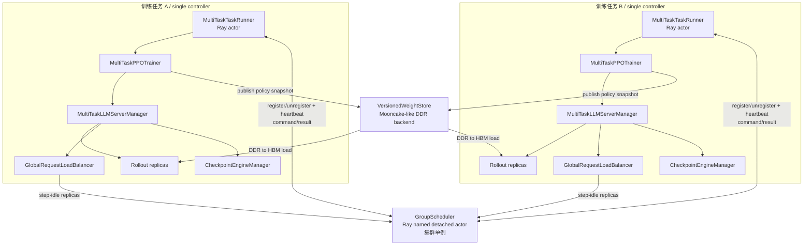

# 多任务推理资源共享 — 背景与目标架构

> 当前约束的单一事实来源，更新于 2026-08-17。历史讨论保留在
> [`99-alignment-raw-archive.md`](./99-alignment-raw-archive.md) 和 Git 历史中。

## 1. 项目目标

以独立子仓的形式为 verl v0.8.0 增加多任务推理资源共享能力，并向社区提交 RFC。

第一阶段基于 verl 原生 `GRPO + on-policy + sync + HYBRID` 路径。多个训练任务加入同一个 Ray
集群，由一个全局 `GroupScheduler` 统一生成跨任务推理实例调度策略；每个任务使用
`MultiTaskTaskRunner` 作为任务控制面 endpoint，`MultiTaskPPOTrainer` 暴露 phase/policy-version
边界并把 committed 权重发布到版本化 DDR store，`MultiTaskLLMServerManager` 实时执行该任务的实例
增减，并让新实例直接从 DDR 加载目标权重到 HBM。

一句话职责划分：

```text
GroupScheduler = 全局大脑：维护任务/资源、决定谁增/谁减、放到哪些 worker
MultiTaskTaskRunner = 每任务控制面 endpoint：注册/注销、响应心跳、接收并转交命令
MultiTaskLLMServerManager = 每任务本地手脚：管理 rollout replica，执行并确认生命周期事务
GlobalRequestLoadBalancer = rollout 事实源：直接向 GS 上报本 step 已完全消耗且空闲的实例
VersionedWeightStore = 权重数据面：保存 immutable DDR 快照，供动态 replica 按版本加载到 HBM
```

## 2. 已确认边界

| 项 | 当前结论 |
|---|---|
| verl 基线 | 精确 v0.8.0 tag，commit `7aed6b23` |
| 训练/推理模式 | 第一阶段使用 sync + HYBRID，不以 STANDALONE 为前置 |
| 全局调度器 | `GroupScheduler`，整个 Ray 集群单例 |
| GS/任务关系 | 一个 GS 对多个 TaskRunner；TaskRunner 持有 GS handle，GS 持有每个已注册 TaskRunner handle |
| trainer 扩展 | `MultiTaskPPOTrainer(PPOTrainer)`，每任务一个 |
| 任务级执行器 | `MultiTaskLLMServerManager(LLMServerManager)`，每任务一个 |
| 初始化资源 | 任务按自己的 ResourcePool/WorkerGroup 和 rollout 配置创建初始 replicas；GS 不参与初始 placement |
| GS 注册时机 | 初始 replicas、LB 和 CE 完成且 sleep 后，注册实际 committed 资源状态 |
| 基线实例 | 每任务 `base_instances > 1`，与实际初始 replica 数一致；它是原生规模/活动 ROLLOUT 需求基线，不是永久不可借 ownership |
| 运行期调度 | rollout 尚未结束时实时扩缩，不等待 step 边界 |
| 空闲上报 | GlobalRequestLoadBalancer 持有 GS handle，直接上报本 step 样本已完全消耗且 `inflight == 0` 的实例 |
| 权重数据面 | trainer 在 policy commit 时发布 Mooncake-like DDR 快照；动态 replica 不依赖 rollout 阶段的训练侧在线参与，直接 DDR→HBM 加载 |
| 任务感知边界 | PPO/GRPO、dataset 和 AgentLoop 不感知 owned/borrowed 资源；trainer bridge 和 manager 控制面感知 |
| 代码归属 | GS、MultiTask runner/trainer/manager/LB、版本化 weight store、协议模型、策略和 recipe 均放在独立子仓 |
| verl 修改原则 | 优先新增通用扩展点；真正动态创建/销毁 replica 所需的底层能力允许作为 RFC 中的最小上游改动提出 |
| 调度粒度 | 完整推理实例，所需 worker 数由 TP/DP/PP 等并行配置决定，不在线修改并行度 |
| 正确性 | on-policy 权重版本、资源账本和命令幂等是硬约束 |

暂不展开 STANDALONE 裸卡池化、复杂调度公式和 benchmark 参数调优。这些不属于当前架构对齐的主线。

## 3. 目标架构



### 3.1 GroupScheduler

`GroupScheduler` 是子仓实现的 Ray Actor：

- 使用固定名称、固定 namespace 和 detached lifetime，所有任务的 single controller 都执行原子的 create-or-get，最终获得同一 actor handle。
- 保存任务表、TaskRunner handles、worker/placement 表、心跳租约、状态版本和待执行决策。
- 接收 TaskRunner 注册/注销；主动探测 TaskRunner，获取最近 committed 资源快照。
- 接收各任务 GlobalRequestLoadBalancer 直接上报的 step-idle replicas 事实。
- 运行可替换的调度策略，生成 `ASSIGN` / `RECLAIM` 命令；ASSIGN 携带已提交的
  `WeightSnapshotRef`，但 GS 不处理 tensor 或物理 DDR 地址。
- 只有收到任务侧执行结果后才更新已提交资源状态；计划不等于提交。
- 任务超时、退出或 session 变化时使旧状态与旧命令失效，并触发资源核对。

### 3.2 MultiTaskTaskRunner

`MultiTaskTaskRunner` 是每个任务的 Ray Actor，也是 GS 唯一的任务级命令入口：

- create-or-get GS 并持有其 actor handle；注册时把自身 actor handle 和实际初始资源提交给 GS。
- GS 保存该 handle，并主动调用 TaskRunner heartbeat；正常结束时 TaskRunner 主动注销。
- 接收 GS 的 versioned command，通过本地 trainer 调用 manager，并把实际结果返回 GS。
- 使用独立 `training`、`heartbeat`、`command` concurrency groups，避免 `trainer.fit()` 或耗时扩缩阻塞活性探测。
- 不持有 manager；manager 始终由 trainer 所有，TaskRunner 只通过 trainer 的窄接口访问。

### 3.3 MultiTaskLLMServerManager

`MultiTaskLLMServerManager` 是子仓中对 verl `LLMServerManager` 的扩展，每任务一个：

- 由 trainer 持有，不是 Ray Actor，也不承担跨 Actor 通信。
- 维护本任务 phase、policy version、replica 状态及实际 worker binding，并生成只读 committed snapshot。
- 通过 trainer 窄接口幂等执行 TaskRunner 转交的 GS 命令。
- 扩容时创建或唤醒 replica，按 command 中的 snapshot ref 从 DDR 加载目标权重到 HBM，校验后再
  注册到本任务 load balancer；训练 worker 不参与这次加载。
- 缩容时先从 load balancer 摘流，再 drain/abort 请求，移出 checkpoint manager，最后 sleep 或销毁 replica。
- 返回实际 committed/rejected 结果和新的 `state_version`，不以 GS 的期望数量冒充实际执行数量。

初始化阶段，manager 复用父类逻辑在本任务 workers 上创建自定义规模的初始 replicas；运行期才执行
GS 经 TaskRunner 下发的跨任务 placement。manager 内不再运行 heartbeat/poll 控制循环。

### 3.4 MultiTaskPPOTrainer

`MultiTaskPPOTrainer` 继承 verl `PPOTrainer`：

- 接收 TaskRunner create-or-get 的 GS handle，但不负责注册任务成员关系；
- 在 policy version 提交后、进入下一轮 rollout 前将 rollout-format 权重发布为 immutable DDR
  snapshot，只有 manifest committed 后才发布 `ROLLOUT_READY`；
- 通过 manager factory 创建 `MultiTaskLLMServerManager`；
- 在原生 `init_workers()` 完成后绑定 CE，并向 TaskRunner 暴露 committed snapshot；
- 向 manager 通知 `ROLLOUT_READY/ROLLOUT_RUNNING/ROLLOUT_DRAINED/TRAIN/WEIGHT_SYNC/EXITING`；
- 将 GS 命令转交 manager，并返回 committed/rejected 结果；
- 不读取 GS placement，不直接执行 add/remove，不改变 PPO/GRPO 算法。

### 3.5 GlobalRequestLoadBalancer 与 verl 原生组件

- `PPOTrainer` 基类仍负责训练主循环和 step 内算法。
- 扩展后的 `GlobalRequestLoadBalancer` 持有 GS handle 和不可变 TaskContext；它仍负责单任务内部请求路由，
  并在 SINGLE_GENERATE 下直接上报“该 step 输入已取尽且 inflight 为零”的实例。它不接收调度命令。
- `CheckpointEngineManager` 第一阶段仍可负责已有本地 replicas 的 native 更新和 replica 集合管理；
  动态 replica 的首次加载必须通过版本化 DDR snapshot，后续目标是所有 rollout replicas 统一使用该快照。
- `RolloutReplica/vLLMReplica` 仍负责具体 server actor 和 vLLM engine。
- Ray 仍是资源执行面；GS 维护的是逻辑归属和调度状态，不替换 Ray scheduler。

### 3.6 VersionedWeightStore

`VersionedWeightStore` 是 Mooncake-like 权重数据后端，不是新的调度组件：

- trainer publisher 把 committed policy 从 HBM 复制为 DDR shards，最后原子提交 manifest；
- snapshot 以 task/session/policy-version/model-fingerprint 标识，并具有 digest、read lease 和 GC；
- 新 rollout workers 按 rank load plan 从 DDR 直接写入 HBM；
- publisher 在 snapshot commit 后不再参与读路径，因此 rollout 中训练侧不可用不影响动态扩容；
- 当前 verl Mooncake checkpoint engine 可复用 TransferEngine，但其临时 P2P 拓扑不是现成的版本化 store。

详细设计见 [`08-versioned-ddr-weight-store.md`](./08-versioned-ddr-weight-store.md)。

## 4. 控制闭环

### 4.1 初始化

1. 训练任务的 single controller 连接公共 Ray 集群。
2. `MultiTaskTaskRunner` 从子仓 create-or-get 全局 GS actor，并把 handle 传给 trainer。
3. `MultiTaskPPOTrainer` 复用原生初始化，创建本任务 ResourcePool、WorkerGroups 和条件 managers。
4. 创建 `MultiTaskLLMServerManager`；父类逻辑按本任务自定义规模创建初始 replicas 和任务内 LB。
5. 创建 AgentLoopManager 和 CheckpointEngineManager，绑定 CE，sleep 初始 replicas。
6. TaskRunner 向 GS 注册 task/session、自身 actor handle、实际 worker inventory、实际初始 replica
   bindings 和本地能力；GS 开始主动 heartbeat。
7. `fit()` 加载 checkpoint 后，trainer 将初始 policy version 发布到 DDR；snapshot manifest committed
   后，上报 `ROLLOUT_READY`、policy version 和 `WeightSnapshotRef`。

GS 在任务本地初始化完成前不返回 placement，也不改变任务初始 replica 数量。第 6 步注册成功后，
这些资源进入全局可共享 inventory；具体 ASSIGN/RECLAIM 仍受 phase、GPU 占用和权重版本约束，任务作为
receiver 接收可服务容量前必须达到 `ROLLOUT_READY`。

### 4.2 成员关系、心跳与 rollout 空闲上报

GS 通过注册表中的 TaskRunner handle 主动 heartbeat。TaskRunner 返回的只读 committed snapshot 至少包含：

- `task_id/session_id/state_version`；
- `phase` 与当前 `policy_version`；
- 当前 committed `WeightSnapshotRef`；
- active/idle/busy/draining replica 数；
- 每个 replica 的 worker binding、server 状态、loaded policy version/snapshot digest；
- 本任务可用于创建实例的 worker 能力；
- 最近命令及执行结果摘要。

状态必须是单调版本的完整快照；heartbeat timeout 先标记 suspect/fenced 并核对资源，不能直接把资源复用。
正常退出由 TaskRunner 主动注销。

GlobalRequestLoadBalancer 另持有 GS handle。对于 SINGLE_GENERATE，当唯一 generation 内该 step 的
预期 `(prompt_uid, rollout_index)` 已全部至少获取一次，且某实例 `inflight == 0` 时，LB 直接向 GS
发送幂等、带 session/generation/server-load-version 的 `STEP_IDLE_REPLICAS` 事件。该事件是低延迟事实，
不是资源账本提交；多轮 AgentLoop 在 batch terminal 前不能复用这一语义。

### 4.3 决策与执行

1. GS 基于最新 committed snapshot 生成带 `decision_id`、`expected_state_version` 的命令；ASSIGN 还
   携带与目标 generation 匹配的 committed `WeightSnapshotRef`。
2. GS 通过已注册的 TaskRunner handle 下发命令。
3. TaskRunner 经 trainer 调用 MultiTaskLLMServerManager；manager 检查版本、phase 和幂等性，创建
   replica 并完成 DDR→HBM 加载、digest 校验、warmup 后才加入 LB。
4. 结果沿 manager→trainer→TaskRunner→GS 返回，包含实际成功的 replica/worker、失败原因和新状态版本。
5. GS 根据执行结果提交账本；部分成功或失败时重新规划。

GS 不直接 RPC 本地 Python manager，而是调用 TaskRunner Ray Actor，再由它通过 trainer 的线程安全窄接口
进入 manager。LB→GS 只上报事实，命令始终沿 GS→TaskRunner→trainer→manager 执行。ASSIGN/RECLAIM
可以在本轮 rollout 尚未结束时生效。

## 5. 子仓与 verl 的边界

### 5.1 完全放在子仓

- GroupScheduler actor、create-or-get helper 和高可用/租约逻辑；
- 注册/注销、heartbeat、step-idle 事件、命令和执行结果的数据模型；
- 调度算法、拓扑放置和公平策略；
- MultiTaskTaskRunner、MultiTaskPPOTrainer、MultiTaskLLMServerManager 和扩展 LB；
- VersionedWeightStore 协议、Mooncake-like backend、publisher/loader、manifest/lease/GC；
- GS create-or-get、TaskRunner endpoint、manager 生命周期事务和自定义 recipe；
- 配置、指标、日志、模拟器适配和测试。

### 5.2 可能需要 verl 提供的通用扩展点

| 能力 | v0.8.0 现状 | 期望的最小上游改动 |
|---|---|---|
| 选择 trainer | sync TaskRunner 直接构造 PPOTrainer，且导出符号已是 Ray ActorClass | trainer FQN/factory，或暴露未 remote 的可继承 implementation |
| 替换 LLMServerManager | 新 sync trainer 直接引用内置类 | 增加 manager factory/FQN，或允许 recipe 注入 manager class |
| 替换 GlobalRequestLoadBalancer | manager 内直接创建已 remote 的内置 ActorClass | 增加 LB factory/FQN，并允许注入 GS handle 和 TaskContext |
| step/request 标识 | LB 只见 request_id，不能证明预期 trajectories 已全部 acquire | 透传 generation key、prompt uid 和 rollout index |
| 运行时新增 replica | base manager 只在初始化时按固定 worker group 创建 | 提供显式 placement/worker handles 的 add-replica 生命周期原语，并支持 deferred-weight source，避免先从磁盘加载再覆盖 |
| 运行时删除 replica | load balancer 能移除地址，但无通用 shutdown | 为 RolloutReplica 增加 drain/shutdown，并保证子进程与 actor 清理 |
| 同步配套状态更新 | LB 和 CheckpointEngineManager 各有局部 add/remove 能力 | 提供统一事务顺序，避免 replica、LB、checkpoint manager 三份状态分裂 |
| phase/版本通知 | sync trainer 没有通用 lifecycle hook | 增加轻量 hook，或由子仓 PPOTrainer 子类覆盖关键边界 |
| 任意 HYBRID worker binding | `init_hybrid()` 按 replica rank 切固定本任务 worker group | 支持以显式 worker handles 初始化 replica，并定义跨任务 worker lease |
| 动态 replica 权重 | naive 路径绑定本任务 ActorRolloutRefWorker/ServerAdapter；现有 Mooncake backend 仍要求 trainer 与 rollout 同时参与临时 P2P 拓扑 | 提供 versioned DDR snapshot publish/load hook；trainer 发布后退出读路径，rollout worker 按 ref 直接 DDR→HBM 并校验 digest |

在没有上游扩展点时，可以通过自定义 recipe、remote runner、MultiTaskPPOTrainer 和 manager 完成
原型，但会移植 controller 并复制 `init_workers()`/step 编排逻辑，长期维护成本较高。RFC 应优先
提出窄接口，而不是把 GS 策略合入 verl。

## 6. 必须正面验证的技术风险

1. **HYBRID 资源互斥**：模拟器把 worker 视为可分配 GPU；真实 HYBRID GPU 同时受训练 worker、PG 和显存状态约束。GS 分配前必须确认 donor phase 与 worker lease，不能仅根据“rollout idle”判断 GPU 可用。
2. **版本化 DDR 权重数据面**：借入 worker 上的新 replica 必须从本任务 committed snapshot 加载正确
   policy version。需要 PoC 验证 HBM→DDR 发布、DDR→HBM 加载、rank shard plan、digest、lease/GC，
   以及 Mooncake backend 在训练侧不参与读路径时的生命周期和吞吐。
3. **动态销毁安全性**：v0.8.0 没有通用 vLLM replica teardown。直接 `ray.kill` 可能遗留 mp 子进程、socket、缓存和本地账本。
4. **控制面一致性**：reclaim 完成后必须使用新 worker snapshot 做 placement；模拟器已经出现过使用旧快照导致计划无法交付的问题。
5. **命名与隔离**：多任务共享 namespace 后，vLLM server actor 名、replica rank 和临时 IPC 路径必须包含 task/session 标识。
6. **故障恢复**：GS detached actor、TaskRunner/LB 重连和任务重启时，需要 session fencing，避免旧 endpoint、旧事件或旧命令更新状态。

## 7. 当前实施顺序

1. 增加 MultiTaskTaskRunner、MultiTaskPPOTrainer 和 manager factory，保持单任务行为不变。
2. 复用父类初始化初始 replicas，完成 TaskRunner 注册/注销和 GS 主动 heartbeat。
3. 增加 phase/policy-version hook、LB→GS step-idle 上报和 GS→TaskRunner 命令通路。
4. 实现版本化 DDR weight store 的 publish/load 最小闭环，先验证单 snapshot、多 reader 和版本校验。
5. 实现预创建 replica 的实时 activate/deactivate，验证 LB、CE、drain 和并发顺序。
6. 实现显式 worker placement 的动态 create/shutdown，并从 DDR snapshot 加载权重。
7. 接入完整 ASSIGN/RECLAIM、session fencing、调度算法和多任务 benchmark。

## 8. 验收标准

- 多个任务获取的是同一个 GS actor；任务退出不会误销毁全局 GS。
- 心跳乱序、重复命令和任务重启不会破坏资源账本。
- 初始化期间无跨任务 placement，初始规模与原生任务配置一致。
- GS 的 assign/reclaim 决策能经对应 TaskRunner 由 MultiTaskLLMServerManager 在 rollout 中实时执行并确认。
- SINGLE_GENERATE 中，LB 仅在该 step 输入取尽后上报零 inflight 实例；上报不会直接提交资源账本。
- 动态变化后，replica 列表、load balancer、checkpoint manager、weight snapshot pin 和实际 server actor 一致。
- 新 replica 产出的样本使用正确 policy version。
- trainer 发布完成并进入 rollout 后，新 replica 仍能独立从 DDR 加载；snapshot digest 与目标
  generation policy version 一致后才可进入 LB。
- 单任务关闭此能力时保持 verl 原路径行为。

## 9. 决策记录

- 2026-08-14：第一阶段由 STANDALONE 调整为 HYBRID-first。
- 2026-08-17：明确双层架构：GroupScheduler 是全局大脑，MultiTaskLLMServerManager 是每任务执行器；
  MultiTaskPPOTrainer 提供 lifecycle bridge。三者主要实现在独立子仓；训练中真正动态创建/销毁
  推理实例可能需要向 verl 提交通用生命周期扩展。
- 2026-08-17：统一命名为 MultiTaskPPOTrainer 和 MultiTaskLLMServerManager；GS 不参与初始 replica
  placement，任务完成原生初始化后注册实际资源；运行期采用 rollout 中实时扩缩。
- 2026-08-17：确定 GS 与 TaskRunner 是一对多且互持 actor handle。TaskRunner 承担注册/注销、响应
  GS 主动 heartbeat 和命令转交；GlobalRequestLoadBalancer 持有 GS handle 并直接上报本 step 已完全
  消耗的空闲实例；manager 只做任务内生命周期执行，不再 heartbeat/poll。
- 2026-08-17：动态实例权重改为版本化 DDR 数据面。trainer 在 policy commit 时发布 Mooncake-like
  immutable snapshot；ASSIGN 携带 snapshot ref，新 replica 直接 DDR→HBM 加载，训练侧不需要在
  rollout 阶段重新参与权重同步。
