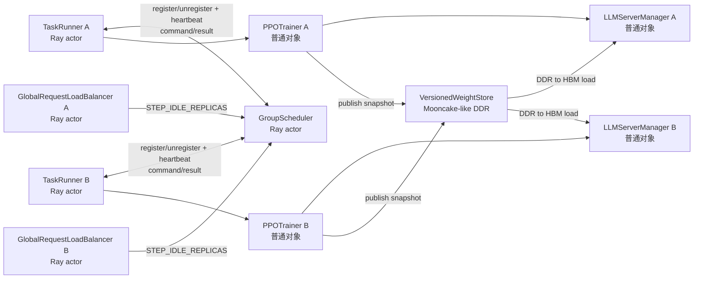

# GroupScheduler 控制协议与模拟器映射

> 本文定义目标协议：一个 `GroupScheduler` 对多个 `MultiTaskTaskRunner`，双方持有对方的 Ray
> ActorHandle；`GlobalRequestLoadBalancer` 另持有 GS handle 并直接上报 rollout 空闲事实。初始化基线与
> 实时扩缩约束以 [`00-project-alignment.md`](./00-project-alignment.md) 为准。
>
> 本文是子仓目标设计，**模拟器当前未实现** heartbeat、`apply_schedule_command`、
> `STEP_IDLE_REPLICAS`、`session_id` 与 `task_runner_handle`/ActorHandle；下文"模拟器原有"指
> `/Users/nyp/Documents/multi-rl-task-scheduler` 中的**协议骨架** `src/multi_rl_task_scheduler/`，而非
> 生产模拟器 `group_scheduler/`（后者接口形态不同，见 §1）。

## 1. 模拟器原型到 verl 的映射

`/Users/nyp/Documents/multi-rl-task-scheduler` 下有两个 `GroupScheduler` 实现：

| 实现 | 位置 | 接口形态 |
|---|---|---|
| 生产模拟器 | `group_scheduler/group_scheduler.py`（`@yr.instance`） | `register_task(config)` 单参数；assign/reclaim 走 `TaskInfo.assign.invoke` yr callable，方法名 `concurrent_assign/concurrent_reclaim`；**无 `unregister_task`**；状态被动 `report_state`，空闲由 GS 内部按 `idle_instances` 计算；决策标识为 `action_id` |
| 协议骨架 | `src/multi_rl_task_scheduler/`（对齐 spec 的最小骨架） | `register_task(config, scheduler)` callback 模式；`InferScheduler.assign/reclaim` 回调；有单参数 `unregister_task(task_id)`；`workers_per_instance = tp×pp` |

两者的算法和账本语义一致；下文"模拟器原有接口"指**骨架**。在 verl 中不能直接复制其 callback：
`LLMServerManager` 是 TaskRunner 进程内普通对象，不是 Ray Actor。目标映射为：

| 骨架概念 | verl 目标组件 |
|---|---|
| `GroupScheduler` | 子仓中的集群级 named detached Ray Actor |
| task endpoint / callback | `MultiTaskTaskRunner` Ray Actor |
| `InferScheduler`（仅骨架抽象基类） | trainer 内的 `MultiTaskLLMServerManager` 本地执行器 |
| 生产侧 `GSAdapter` 的 `expand/reclaim_callback` | 不进入生产；协议转换由 GS→TaskRunner→trainer→manager 链路承担 |
| `TaskModel` | trainer committed snapshot 与 LB generation 事实 |
| `Instance` | `RolloutReplica/vLLMReplica` |
| `ClusterModel/WorkerTable` | Ray worker/PG/GPU binding 的控制面投影 |

生产模拟器的 `InferScheduler`/`RlxfScheduler` 并非真实类名（`RlxfScheduler` 在仓库中不存在；
`InferScheduler` 仅是骨架抽象基类），不作为映射对象。模拟器没有验证 HYBRID 权重同步、Ray PG lease、
vLLM 子进程 teardown 和跨任务 worker handles；这些仍需 verl PoC 验证。

## 2. 句柄、所有权与唯一通信路径



约束如下：

1. 每个 TaskRunner create-or-get GS，因此持有同一个 GS ActorHandle。
2. TaskRunner 注册时把自身 ActorHandle 交给 GS；GS 以 `(task_id, session_id)` 保存 endpoint。
3. GS 只经 TaskRunner 下发规模调整命令，不直接调用 trainer、manager 或 LB。
4. TaskRunner 不持有 manager；它只调用 trainer 的线程安全窄接口。
5. LB 持有 GS handle 和不可变 `TaskContext`，只上报事实，不领取或执行命令。
6. manager 不持有 GS handle，也没有 heartbeat/poll 循环。
7. WeightStore 是版本化权重数据面；GS 只转发 snapshot ref，训练侧发布后不参与动态 replica 读取。

## 3. 协议对象

### 3.1 TaskRegistration

```text
task_id
session_id                    # 每次任务启动唯一，用于 fencing
task_runner_handle            # GS 后续 heartbeat/command 的 Ray ActorHandle
controller_id
model_fingerprint
tp / dp / pp / workers_per_replica
base_instances / max_instances
actual_initial_instances      # 初始化后的实际数量；注册不是 placement 请求
worker_inventory[]            # 稳定 worker id、node/GPU、可解析 handle 信息
initial_replica_bindings[]     # 原生初始化结果
capabilities[]                # sleep/wake、dynamic_create、graceful_drain、DDR load 等
weight_store_backend / format_version
state_version
initial_snapshot
```

同 task/session 重试必须幂等。同 task 的新 session 注册后，旧 session 的 heartbeat reply、LB 事件、
命令结果和注销请求全部被 fencing。普通 rollout 的 `workers_per_replica` 至少按真实 TP/DP/PP 拓扑计算；
不能沿用模拟器中的简化卡数模型。

### 3.2 HeartbeatProbe / HeartbeatReply

GS 主动发出：

```text
HeartbeatProbe:
  task_id / session_id
  probe_seq
  scheduler_epoch
  deadline
```

TaskRunner 返回：

```text
HeartbeatReply:
  task_id / session_id
  probe_seq
  endpoint_health
  state_version
  snapshot                    # 最近一次 committed 的不可变完整快照
  pending_command_summary
```

snapshot 至少包含 phase、policy version、当前 committed `WeightSnapshotRef`、replica
lifecycle/worker binding/loaded snapshot digest、最近执行结果和 worker 能力。heartbeat endpoint 不等待
manager 实时扫描；它读取 manager 在事务提交点发布的 immutable snapshot，因此长 create/destroy 期间
仍可及时响应。

### 3.3 StepIdleReplicasEvent

```text
event_type = STEP_IDLE_REPLICAS
task_id / session_id
generation_key               # partition/global_steps/dispatch_id
generation_capability        # 第一阶段必须是 SINGLE_GENERATE
input_exhausted = true
event_seq
replicas[]:
  replica_id
  server_id
  inflight_requests = 0
  server_load_version
observed_at
```

事件由 LB 直接调用 GS。`input_exhausted` 表示该 generation 的预期
`(prompt_uid, rollout_index)` 已全部至少 acquire 一次；只有同时满足 server ACTIVE 且 inflight 为零，
才可进入列表。事件只说明“该 step 已完全消耗且此刻空闲”，不是 reclaim commit，也不授权 LB 摘流。
详细判定见
[`07-rollout-instance-idle-detection.md`](./archive/verl-v0.8.0/07-rollout-instance-idle-detection.md)。

### 3.4 WeightSnapshotRef

```text
task_id / session_id
policy_version
model_fingerprint
manifest_id
content_digest
store_backend / weight_format_version
```

trainer 在 policy commit 时把权重发布到 Mooncake-like DDR store，manifest 完整提交后才生成 ref。GS
只保存和转发 ref，不解析 tensor shard 或持久保存物理 DDR 地址。snapshot 发布、load lease 和 GC 见
[`08-versioned-ddr-weight-store.md`](./archive/verl-v0.8.0/08-versioned-ddr-weight-store.md)。

### 3.5 SleepingInferenceSlotLease

donor 原 replica 从本任务 LB 摘流、drain 并实际 sleep 后，manager 返回：

```text
lease_id / lease_epoch
owner_task_id / owner_session_id / owner_phase_epoch
sleeping_replica_id / donor_sleep_epoch
TP / DP / PP
ordered_placement_anchors[]          # 原 replica 已选中的 WorkerDict ActorHandles
node_id / accelerator_id per rank
placement_group_id / bundle_index per rank  # ownership provenance
donor_server_handles[]
measured_free_hbm_bytes[] / safety_margin
reclaim_deadline
```

GS 和 receiver 传递的是 selected ActorHandles 与不可变 placement metadata，不传递 donor 的
`RayResourcePool`/`RayWorkerGroup` 普通对象。handles 只用于存活与 node/GPU 定位；receiver 不调用 donor worker
中的训练、adapter 或 checkpoint 方法。Ray resource/PG ownership 始终属于 donor session。

### 3.6 ScheduleCommand

> `decision_id` 是子仓目标协议字段，对应生产模拟器的 `action_id`（`V2ActionRecord.action_id`、
> `_next_v2_action_id`），概念一致、命名不同。

```text
decision_id
task_id / session_id
scheduler_epoch                 # fence GS 重启前发出的旧命令
expected_state_version
action                         # ASSIGN / RECLAIM
replica_specs[]                # replica id、TP/DP/PP、CREATE_BORROWED/RETURN_TO_OWNER
sleeping_slot_leases[]         # donor 已摘流、drain、sleep 后实际返回的同卡 HBM leases
weight_snapshot_ref           # CREATE_BORROWED 必填；owner 恢复推理时携带其当前版本
replica_ids[]                  # RECLAIM: 明确目标
expected_server_load_versions  # 防止空闲观察后的竞争 acquire
drain_policy                   # WAIT / ABORT_AND_RESUME / FORCE
deadline
```

GS 只决定运行期共享，不参与初始 placement。donor RECLAIM 先从 donor LB 原子摘流、drain 并 sleep 原
replica，再返回 `SleepingInferenceSlotLease`；原 server/backend、training workers 和 PG 仍归 donor。receiver
ASSIGN 在 slot 的相同物理卡上新建 replica，并从 ref 指向的 committed DDR snapshot 加载到 HBM。receiver
RECLAIM 必须摘流并销毁新 backend，确认 HBM 释放后才能把 slot 归还 owner。任何 RECLAIM 都必须在 LB 内执行
`try_mark_draining(replica_id, expected_load_version)`；若观察后已有新 acquire，则返回 BUSY/STALE。

### 3.7 CommandResult

```text
decision_id
task_id / session_id
status                         # COMMITTED / PARTIAL / REJECTED / FAILED
requested_replicas
committed_replicas[]
loaded_policy_version / loaded_snapshot_ref / loaded_content_digest
released_slots[]               # sleep 后产生或 receiver 销毁后归还的 slot leases
new_state_version
reason_code / message
snapshot                       # 执行后的完整 committed 状态
```

GS 只能根据实际 result 提交账本，不能根据计划数量推测执行完成。重复 decision 返回缓存结果，不重复
创建或销毁。

## 4. 两类 GS↔TaskRunner 交互

### 4.1 成员、资源与活性

1. TaskRunner 连接公共 Ray 集群并 create-or-get GS。
2. 任务仍按自身配置完成 WorkerGroup、初始 replicas、LB、CE 和初始 sleep；GS 不分配初始化 replicas。
3. TaskRunner 从 trainer 读取 committed snapshot，调用 `GS.register_task(registration)`。
4. GS 保存 TaskRunner handle，并周期性并发调用 `TaskRunner.heartbeat(probe)`。
5. TaskRunner 正常退出时先完成本地清理，再调用 `GS.unregister_task(task_id, session_id)`
   （子仓目标接口；生产模拟器无此方法，骨架仅有单参数 `unregister_task(task_id)`）。
6. heartbeat timeout 只将 session 标记为 suspect/fenced 并启动 Ray 资源核对，不能立即把资源借给其他任务。

资源变化通过 heartbeat 的最新 committed snapshot 对账。TaskRunner 注册/注销表达任务成员关系；LB 空闲
事件表达 step 内的低延迟数据面事实，二者不能混为同一个协议。

### 4.2 规模调整命令

1. GS 基于 committed snapshot 和有效 LB 空闲事件生成 versioned command。
2. GS 调用注册表中的 `TaskRunner.apply_schedule_command.remote(command)`。
3. TaskRunner 在独立 command concurrency group 中调用 trainer 窄接口。
4. trainer 与 manager 串行化生命周期事务，返回实际结果。
5. TaskRunner 将结果作为 RPC 返回值交给 GS；GS 才提交资源账本或重新规划。

TaskRunner 的 training、heartbeat、command 三个 concurrency group 必须隔离。heartbeat 只读 immutable
snapshot；command 可以耗时，但不能阻塞 `fit()` 或 heartbeat。

## 5. 完整调度时序

```mermaid
sequenceDiagram
    participant LBA as LB A
    participant TRA as TaskRunner A
    participant GS as GroupScheduler
    participant TRB as TaskRunner B
    participant WS as Versioned DDR WeightStore

    TRA->>GS: register_task(session A, TRA handle, snapshot v10)
    TRB->>GS: register_task(session B, TRB handle, snapshot v21)
    GS->>TRA: heartbeat(probe 31)
    TRA-->>GS: reply(snapshot v10)
    GS->>TRB: heartbeat(probe 32)
    TRB-->>GS: reply(snapshot v21)
    LBA->>GS: STEP_IDLE_REPLICAS(generation g7, A-r3, load v44)
    GS->>GS: plan reclaim A-r3, then assign B
    GS->>TRA: apply(RECLAIM d7, expected state v10/load v44)
    TRA->>TRA: trainer→manager→A-LB mark draining→drain→sleep A-r3
    TRA-->>GS: COMMITTED d7, SleepingSlotLease, snapshot v11
    GS->>GS: commit slot AVAILABLE; PG/worker owner remains A
    GS->>TRB: apply(ASSIGN d8, CREATE_BORROWED, slot, snapshot ref V)
    TRB->>WS: manager pin and load snapshot V
    WS-->>TRB: DDR→HBM complete, digest verified
    TRB->>TRB: manager warmup→LB add
    TRB-->>GS: COMMITTED d8, snapshot v22
    GS->>GS: commit assignment
    GS->>TRB: apply(RECLAIM d9, B borrowed replica, slot epoch)
    TRB->>TRB: B-LB drain/remove→destroy B backend→verify HBM free
    TRB-->>GS: COMMITTED d9, slot RELEASED
    GS->>TRA: apply(ASSIGN d10, RETURN_TO_OWNER, slot)
    TRA->>TRA: unblock training phase or restore original A-r3
    TRA-->>GS: COMMITTED d10, owner slot restored
```

reclaim 和 assign 不能基于同一份旧 slot snapshot 盲目同时提交。donor sleep 成功后，placement 必须读取
不早于 reclaim commit 的 slot/state version。

## 6. 一致性不变量

1. **一任务一 endpoint**：当前 session 只绑定一个 TaskRunner handle。
2. **session fencing**：旧 session 不能 heartbeat、上报 LB 事件、提交结果或注销新 session。
3. **单调状态**：GS 丢弃倒退的 state/load/event version。
4. **幂等命令**：重复 decision 只能返回上次结果。
5. **执行确认后提交**：plan、candidate placement 和 committed allocation 是三种状态。
6. **数据面权威**：manager 以实际 replica/server/worker 重建 snapshot；LB 只报告自身可证明的负载事实。
7. **空闲观察不是锁**：RECLAIM 必须通过 LB 的版本化原子摘流重新验证。
8. **先摘流后销毁**：仍可被 LB 选中的 replica 不得销毁。
9. **权重就绪后接流**：新 replica 的所有 ranks 加载 command 指定的 DDR snapshot，并确认 policy
   version/content digest 后才能加入 LB。
10. **snapshot 生命周期**：current、active replica 或在途 ASSIGN 引用的 snapshot 不能 GC。
11. **超时不等于释放**：heartbeat 或命令超时后先查询和对账，不能推测资源已经可用。
12. **Ray ownership 不转移**：sleeping slot 只授权 receiver 使用同卡可用 HBM；donor 的 PG、Worker Actors 和
    原 server/backend 始终归 donor session。
13. **owner phase gate**：receiver backend 未摘流、销毁并确认释放 HBM 前，donor 不能开始会占用这些卡的训练，
    也不能 wake 原 replica。
14. **借用实例必须销毁**：归还 slot 时不能只 sleep receiver replica；必须清理其 backend/server Actors，再把
    slot 提交为 owner available。

## 7. 故障语义

| 情况 | GS / 任务侧行为 |
|---|---|
| TaskRunner 短暂无心跳 | GS 标记 suspect，暂停新命令；保留账本 ownership |
| 超过 lease timeout | fencing session，核对 Ray actor、server 与 worker 后再决定资源状态 |
| TaskRunner 重启 | 新 session 重新注册；旧 LB 事件和旧命令结果失效 |
| slot owner TaskRunner 失效 | 停止续租并回收 receiver；旧 owner handles 不再作为 placement anchors |
| GS 重启/恢复 | TaskRunner 重新注册/响应探测；GS 以完整 snapshot 重建任务视图 |
| LB→GS 事件重复/乱序 | 按 session、generation、event/load version 幂等去重 |
| 命令超时 | 继续 heartbeat 并查询 decision 结果；不得直接假设成功或失败 |
| 部分 create/destroy | 按实际 committed 结果更新，其余重新规划 |
| snapshot 缺失/校验失败 | ASSIGN 失败且 replica 不加入 LB；释放 read lease、销毁 receiver 半成品并归还 slot |
| 正常退出 | TaskRunner 完成本地清理并注销当前 session；不销毁 detached GS |

## 8. 当前不展开

- legacy/v2 评分公式；
- sleep reserve HBM 淘汰算法；
- STANDALONE 与 DDR store 的额外拓扑差异；
- 具体 heartbeat 周期、超时秒数和公平参数。

这些可以在 TaskRunner 控制面与 LB 空闲判定稳定后独立演进。
