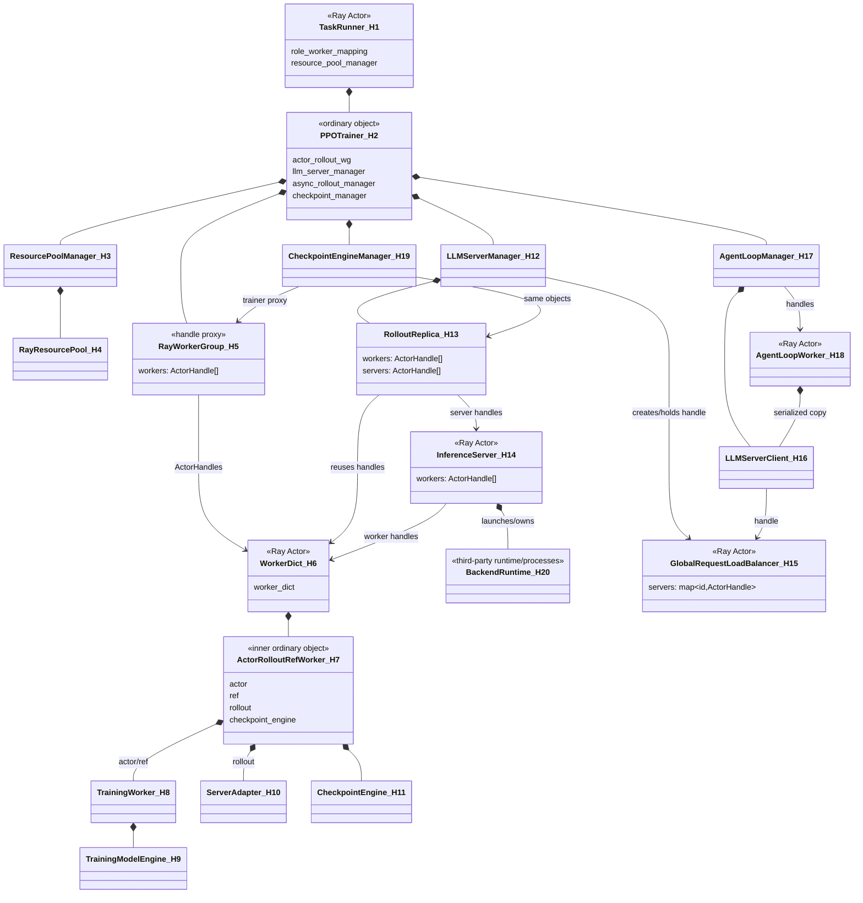
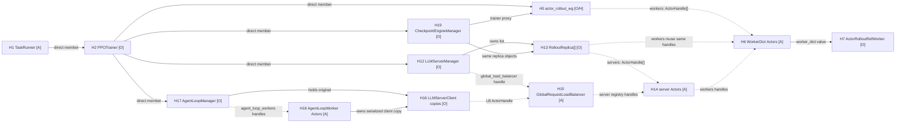
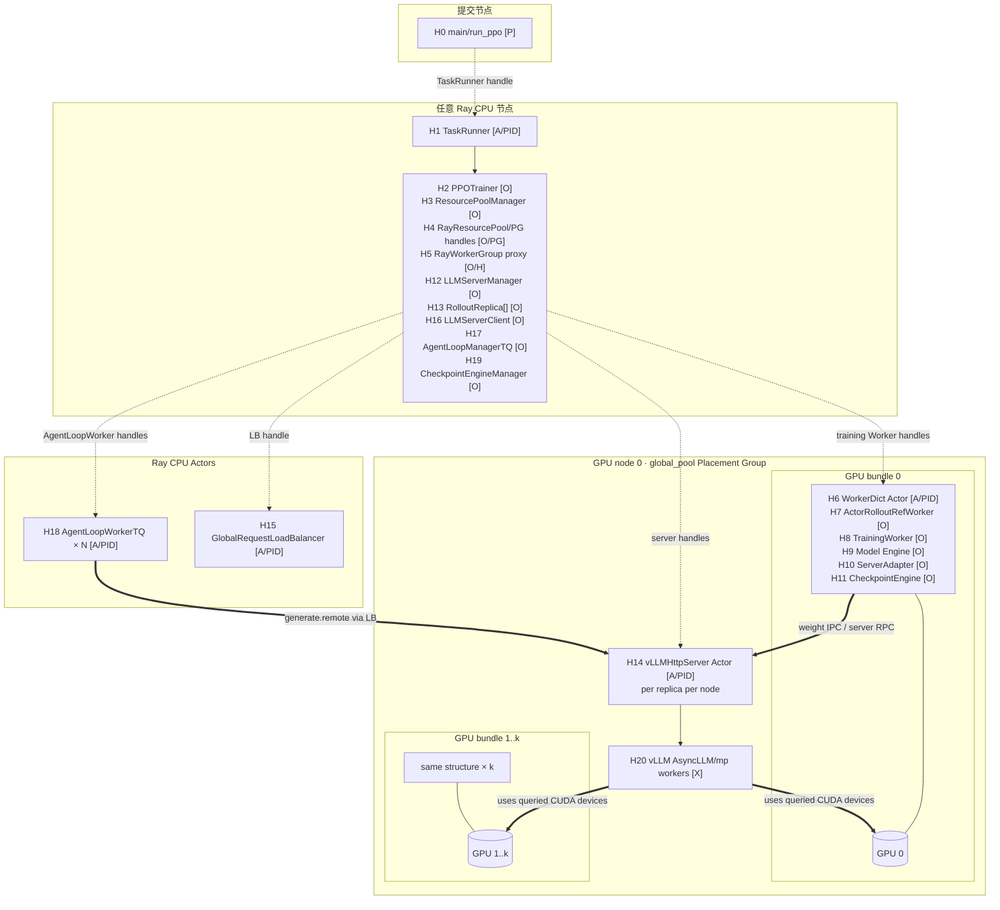
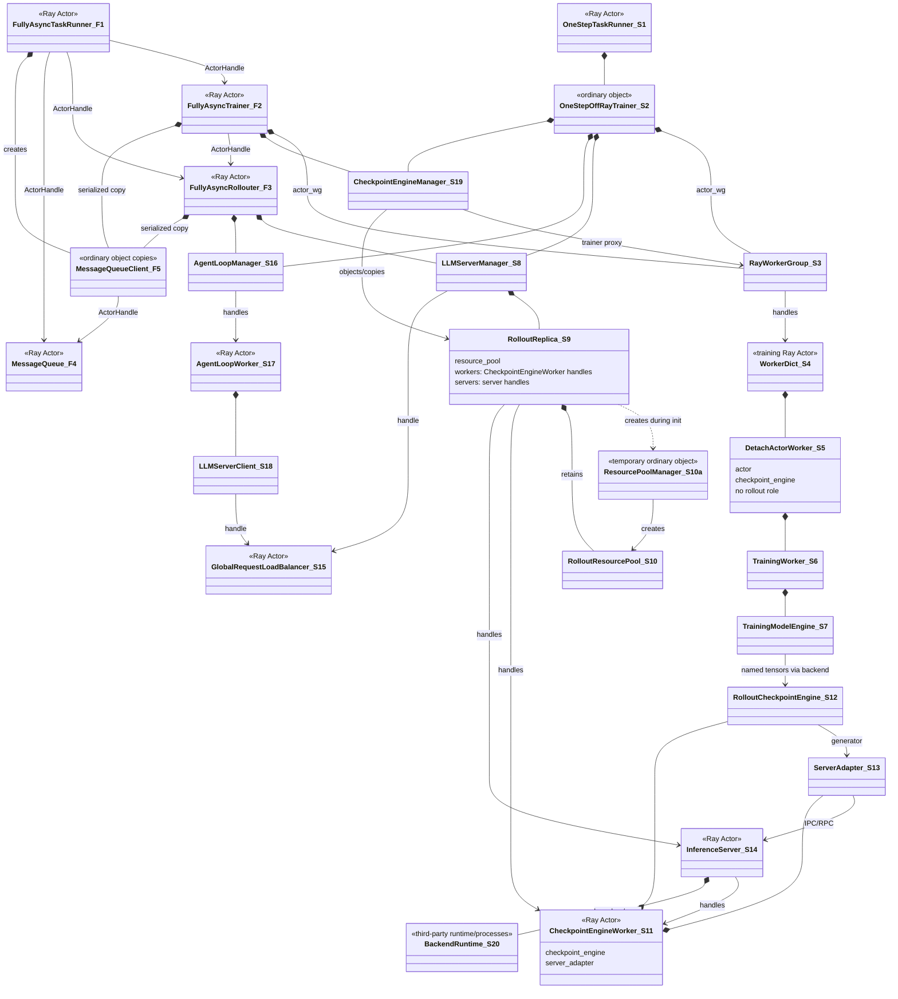
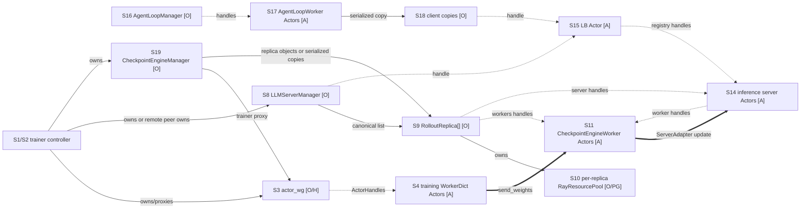
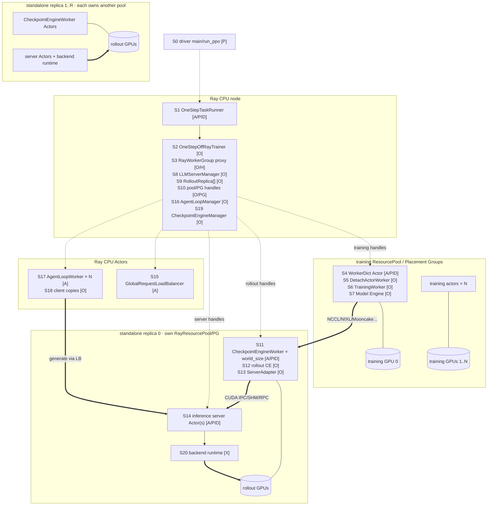
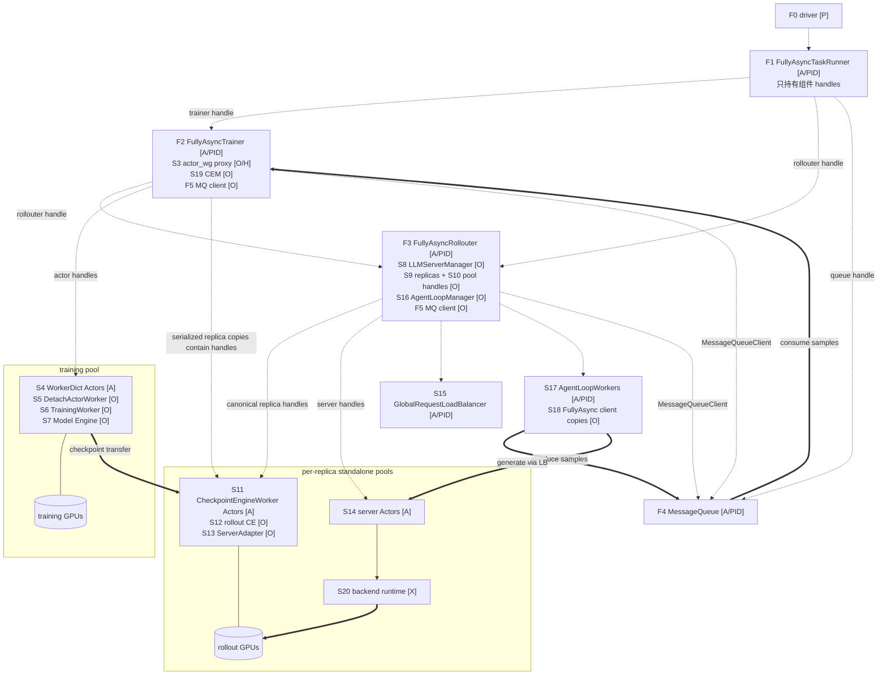

# verl HYBRID 与 STANDALONE 组件和运行实体拓扑

> 状态：待评审。
> 代码基线：`/Users/nyp/Documents/verl`，tag `v0.8.0`，commit `7aed6b23`。
> 本文只分析已经确认进入范围的 `RolloutMode.HYBRID` 和 `RolloutMode.STANDALONE`；不分析
> `RolloutMode.COLOCATED`、GRM、Reward/Teacher 共置部署。

## 1. 阅读约定与分析边界

### 1.1 图例

| 标记 | 含义 |
|---|---|
| `[P]` | 普通 OS 进程，不是 Ray Actor，例如提交任务的 driver |
| `[A]` | Ray Actor；通常对应一个独立 Ray worker 进程 |
| `[O]` | 普通 Python 对象，随其 owner 所在进程存在 |
| `[H]` | `ray.actor.ActorHandle` 或包含 handles 的 controller-side proxy；只是引用，不是执行实体 |
| `[PG]` | Ray Placement Group/资源调度对象；不是进程 |
| `[X]` | vLLM/SGLang/TRT-LLM 内部运行时或子进程；由第三方 backend 创建，不是 verl Ray 类 |

实线表示对象持有或包含；虚线表示 ActorHandle/proxy 引用；粗线表示请求或权重数据通道。

### 1.2 “全部实体”的范围

本文穷举 actor training→actor rollout 主链中的 controller、training workers、rollout workers、请求路由、
inference servers、checkpoint engine 和资源对象。以下实体不展开：

- Ray GCS、raylet、object store、dashboard 等 Ray 基础设施；
- DataLoader 子进程、日志器、profiler 和文件 checkpoint 辅助线程；
- 已排除的 Reward/Teacher/GRM；
- 第三方推理 backend 内部每一种 multiprocessing worker class。

第三方推理 runtime 仍会作为 `[X]` 标到部署图中，因为它实际占用 GPU。

### 1.3 一个容易误画的事实

`RolloutMode.HYBRID` 的接口注释称 training engine 与 rollout engine “fused in same process”，且
`init_hybrid()` 确实复用训练 worker handles。但 v0.8.0 已切换到 native server mode：

- `ActorRolloutRefWorker` 进程内包含 actor `TrainingWorker`、rollout `ServerAdapter` 和 trainer-side
  checkpoint engine；
- `vLLMHttpServer`/`SGLangHttpServer`/`TRTLLMHttpServer` 仍是单独的 Ray Actor；
- server Actor 根据 training/rollout worker 的 node 和 GPU ID 设置可见设备，在同一 GPU 上运行推理 backend。

因此本文不会把 HTTP server Actor 错画进 training worker 进程。

## 2. 两种模式共同使用的类

| 类/抽象 | 类型 | 共同职责 | 代码位置 |
|---|---|---|---|
| `LLMServerManager` | `[O]` | 创建 replicas、server Actors、LB 和 client | `verl/workers/rollout/llm_server.py:223-363` |
| `RolloutReplica` | `[O]` | 保存一个 replica 的 worker/server handles 与资源信息 | `verl/workers/rollout/replica.py:70-300` |
| `GlobalRequestLoadBalancer` | `[A]` | 保存 server handles，执行 sticky + least-inflight 路由 | `verl/workers/rollout/llm_server.py:43-143` |
| `LLMServerClient` | `[O]` | 持有 LB handle，先 acquire，再调用 server Actor | `verl/workers/rollout/llm_server.py:146-220` |
| `AgentLoopManager` | `[O]` | 创建和持有 AgentLoopWorker handles | `verl/experimental/agent_loop/agent_loop.py:1044-1118` |
| `AgentLoopWorker` | 运行时 `[A]` | 普通 class 由 manager 通过 `ray.remote()` 转为 Actor，执行 sample/多轮 agent loop并持有序列化后的 client | `verl/experimental/agent_loop/agent_loop.py:393-470,1064-1099` |
| `CheckpointEngineManager` | `[O]` | 持有 trainer WG proxy 和 replicas，编排权重/显存生命周期 | `verl/checkpoint_engine/base.py:345-515` |
| `RayResourcePool` | `[O]/[PG]` | 延迟创建并保存 Placement Groups | `verl/single_controller/ray/base.py:112-160` |
| `ResourcePoolManager` | `[O]` | 从 resource spec 创建/索引 `RayResourcePool` | `verl/single_controller/ray/base.py:181-221` |
| `RayWorkerGroup` | `[O]/[H]` | controller-side ActorHandle 集合与分发代理 | `verl/single_controller/ray/base.py:416-485,672-680` |

共同的生成请求链是：

```text
AgentLoopWorker Actor
  → local LLMServerClient
  → GlobalRequestLoadBalancer Actor.acquire_server()
  ← (server_id, server ActorHandle)
  → inference server Actor.generate.remote()
  → GlobalRequestLoadBalancer Actor.release_server()
```

实现位于 `verl/workers/rollout/llm_server.py:170-220`。HYBRID 与 STANDALONE 的区别不在这条请求链，
而在 replica 的 workers 从哪里来、GPU/PG 属于谁以及权重怎样到达 server。

---

## 3. HYBRID：组件类图



### 3.1 类图解释

1. `TaskRunner` 是 Ray Actor，但 `PPOTrainer` 不是 Actor；trainer 在 TaskRunner Actor 进程内直接构造。
2. `RayWorkerGroup` 不是一组进程本身，而是 TaskRunner 进程中的普通代理对象；其 `workers` 才是
   `WorkerDict` Ray Actor handles。
3. `WorkerDict` Ray Actor 内直接实例化 `ActorRolloutRefWorker`，不是再启动一个内层 Ray Actor。
4. `ActorRolloutRefWorker` 在同一进程中持有 actor/ref `TrainingWorker`、rollout `ServerAdapter` 和
   checkpoint backend 普通对象。
5. `RolloutReplica.init_hybrid()` 只把已有 training worker handles 切片保存到 `replica.workers`；没有创建
   `CheckpointEngineWorker` Actors。
6. `InferenceServer` 是单独 Ray Actor。它也保存 worker handles，用于定位 node/GPU、控制或权重更新。
7. `LLMServerManager`、`AgentLoopManager`、`CheckpointEngineManager` 都在 TaskRunner 进程内；LB 和
   AgentLoopWorkers 才是独立 Ray Actors。

## 4. HYBRID：组件引用关系



### 4.1 引用关系解释

- `PPOTrainer.llm_server_manager.get_replicas()` 返回原列表；HYBRID 的 manager 与 checkpoint manager 位于
  同一进程，因此它们引用同一批 `RolloutReplica` 普通对象。
- `RolloutReplica.workers`、`RayWorkerGroup.workers` 和 server Actor 内的 `workers` 是多份 ActorHandle 列表，
  但都指向同一批 training `WorkerDict` Actors。
- `LLMServerClient` 被作为构造参数发送给每个 AgentLoopWorker，Ray 序列化后各 Actor 得到普通对象副本；
  副本中的 LB handle 指向唯一 `GlobalRequestLoadBalancer` Actor。
- LB 持有 server Actor handles，所以新增/移除 server 不需要逐个修改 AgentLoopWorker；client 每次 acquire
  都向 LB 查询。

## 5. HYBRID：组件部署关系与运行实体

### 5.1 组件到运行位置的映射

| 逻辑组件 | controller 进程 | training worker 进程 | 独立 CPU Actor 进程 | inference server/backend 进程 | GPU/PG 关系 |
|---|---|---|---|---|---|
| 训练控制 | `TaskRunner`、`PPOTrainer`、`RayWorkerGroup` proxy | `WorkerDict`、`ActorRolloutRefWorker`、`TrainingWorker`、Model Engine | 无 | 无 | `WorkerDict` 按 training PG bundle 放置并占 GPU |
| rollout 生命周期 | `LLMServerManager`、`RolloutReplica` | `ServerAdapter`、trainer-side `CheckpointEngine` | 无 | server Actor、backend runtime | server/backend 复用 replica 对应 training GPUs |
| 请求执行 | `AgentLoopManager`、原始 `LLMServerClient` | 无 | LB、AgentLoopWorkers（各有 client 副本） | server Actor 执行 `generate` | 请求侧 Actors 不进入 training PG |
| 权重同步 | `CheckpointEngineManager` | Model Engine→Checkpoint Engine/ServerAdapter | 无 | server/backend 接收更新 | naive 路径不创建 rollout checkpoint worker |
| Ray 资源控制 | `ResourcePoolManager`、`RayResourcePool`、PG handles | Ray 根据 bundle 启动 workers | Ray 自由调度到 CPU 节点 | server 按 worker node/GPU 定位 | 一个 `global_pool` 覆盖本任务 training GPUs |

这里的“组件部署关系”描述逻辑组件最终落在哪一类进程；下一张图进一步展开为具体 PID、ActorHandle
与 GPU 设备关系。

以下以 vLLM 为代表；SGLang/TRT-LLM 的 server Actor 类不同，但进程和引用分层相同。



### 5.2 运行实体部署图解释

1. `main_ppo_sync.main()` 在 driver 进程调用 `run_ppo()`，后者创建 `TaskRunner` Ray Actor并等待其
   `run.remote()`。
2. `global_pool` 为每张 GPU 创建一个 Placement Group bundle；`RayWorkerGroup` 将一个 `WorkerDict` Actor
   放入每个 bundle。
3. 未启用 P/D disaggregation 时，一个 HYBRID replica 使用 `TP×DP×PP` 个已有 WorkerDict handles；启用
   P/D 后 footprint 按 prefill/decode replicas 分别计入。多节点时每个 node 启动一个 server Actor。
4. vLLM server Actor 通过 `worker.__ray_call__` 查询 worker 的 node ID 和 GPU ID，再用硬 NodeAffinity
   启动。server Actor 创建时没有额外申请 `num_gpus`，而是设置 `CUDA_VISIBLE_DEVICES`，让 backend 与
   training workers 使用同一批 GPU。
5. 因而“HYBRID 共进程”成立在 verl training worker/rollout adapter 层；真实 native inference server 和
   backend runtime 是独立进程实体，与 training worker 共 GPU。
6. AgentLoopWorkers 与 LB 是 CPU Ray Actors，不占 actor training 的 GPU bundles。

### 5.3 HYBRID 图中实体代码索引

| ID | 实体 | 类型/所在进程 | 代码位置 |
|---|---|---|---|
| H0 | `main()`/`run_ppo()` | driver `[P]` | `verl/trainer/main_ppo_sync.py:1843-1866`; `verl/trainer/main_ppo.py:52-103` |
| H1 | `TaskRunner` | controller `[A]` | `verl/trainer/main_ppo_sync.py:1756-1836` |
| H2 | `PPOTrainer` | H1 进程内 `[O]` | `verl/trainer/main_ppo_sync.py:501-742` |
| H3 | `ResourcePoolManager` | H1 进程内 `[O]` | `verl/single_controller/ray/base.py:181-221`; 创建于 `verl/trainer/main_ppo_sync.py:1781-1816` |
| H4 | `RayResourcePool`/PGs | H1 进程内对象 + Ray `[PG]` | `verl/single_controller/ray/base.py:112-160` |
| H5 | `RayWorkerGroup` | H1 进程内 `[O/H]` | `verl/single_controller/ray/base.py:416-485`; 使用于 `verl/trainer/main_ppo_sync.py:653-676` |
| H6 | 动态 `WorkerDict` | GPU `[A]` | `verl/single_controller/ray/base.py:986-1027` |
| H7 | `ActorRolloutRefWorker` | H6 进程内 `[O]` | `verl/workers/engine_workers.py:434-500` |
| H8 | actor/ref `TrainingWorker` | H6 进程内 `[O]` | `verl/workers/engine_workers.py:76-430`; 构造于 `verl/workers/engine_workers.py:500-588` |
| H9 | Training Model Engine | H6 进程内 `[O]` | FSDP `verl/workers/engine/fsdp/transformer_impl.py:85`; Megatron `verl/workers/engine/megatron/transformer_impl.py:76`; AutoModel `verl/workers/engine/automodel/transformer_impl.py:71`; VeOmni `verl/workers/engine/veomni/transformer_impl.py:62`; TorchTitan `verl/workers/engine/torchtitan/transformer_impl.py:73` |
| H10 | backend `ServerAdapter` | H6 进程内 `[O]` | vLLM `verl/workers/rollout/vllm_rollout/vllm_rollout.py:61-195`; SGLang `verl/workers/rollout/sglang_rollout/sglang_rollout.py:103-175`; TRT-LLM `verl/workers/rollout/trtllm_rollout/trtllm_rollout.py:268-340` |
| H11 | trainer-side `CheckpointEngine` | H6 进程内 `[O]` | 构造于 `verl/workers/engine_workers.py:618-629`; 抽象位于 `verl/checkpoint_engine/base.py:96-200` |
| H12 | `LLMServerManager` | H1 进程内 `[O]` | `verl/workers/rollout/llm_server.py:223-363`; 构造于 `verl/trainer/main_ppo_sync.py:711-714` |
| H13 | `RolloutReplica` 子类实例 | H1 进程内 `[O]` | `verl/workers/rollout/replica.py:70-141`; 创建于 `verl/workers/rollout/llm_server.py:276-325` |
| H14 | inference server | GPU node `[A]` | vLLM class `verl/workers/rollout/vllm_rollout/vllm_async_server.py:84-205`、remote/launch `verl/workers/rollout/vllm_rollout/vllm_async_server.py:952-1054`; SGLang class `verl/workers/rollout/sglang_rollout/async_sglang_server.py:111-190`、remote/launch `verl/workers/rollout/sglang_rollout/async_sglang_server.py:721-825`; TRT-LLM `verl/workers/rollout/trtllm_rollout/trtllm_async_server.py:78-155` |
| H15 | `GlobalRequestLoadBalancer` | CPU `[A]` | `verl/workers/rollout/llm_server.py:43-143`; 创建于 `verl/workers/rollout/llm_server.py:337-341` |
| H16 | `LLMServerClient` | H1/AgentWorker 进程内 `[O]` | `verl/workers/rollout/llm_server.py:146-220,343-355` |
| H17 | `AgentLoopManagerTQ` | H1 进程内 `[O]` | `verl/trainer/main_ppo_sync.py:452-490`; 基类 `verl/experimental/agent_loop/agent_loop.py:1044-1118` |
| H18 | `AgentLoopWorkerTQ` | CPU `[A]` | `verl/trainer/main_ppo_sync.py:297-449`; 创建逻辑 `verl/experimental/agent_loop/agent_loop.py:1079-1099` |
| H19 | `CheckpointEngineManager` | H1 进程内 `[O]` | `verl/checkpoint_engine/base.py:345-515`; 构造于 `verl/trainer/main_ppo_sync.py:730-736` |
| H20 | backend runtime/子进程 | H14 创建的 `[X]` | vLLM `AsyncLLM`：`verl/workers/rollout/vllm_rollout/vllm_async_server.py:385-440`; SGLang engine subprocesses：`verl/workers/rollout/sglang_rollout/async_sglang_server.py:382-412`; TRT-LLM `AsyncLLM`：`verl/workers/rollout/trtllm_rollout/trtllm_async_server.py:184-318` |

---

## 6. STANDALONE：组件类图

STANDALONE 的请求侧类不变，差异集中在 training worker、replica workers、资源池和 checkpoint 数据面。



### 6.1 类图解释

1. One-Step 中 `OneStepOffRayTrainer` 是 TaskRunner Actor 内的普通对象；Fully Async 则把 Trainer、Rollouter
   和 MessageQueue 拆成三个独立 Actors，TaskRunner 只持有它们的 handles。
2. STANDALONE actor worker 使用 `DetachActorWorker(role="actor")`；它继承 `ActorRolloutRefWorker`，但 role
   不包含 rollout，因此不会在 training worker 内构造 rollout `ServerAdapter`。
3. 每个 `RolloutReplica.init_standalone()` 创建自己的 `ResourcePoolManager`/`RayResourcePool`，然后在该 pool
   上创建 `CheckpointEngineWorker` Ray Actors。
4. `CheckpointEngineWorker` 是真实独立 rollout worker/control anchor，内部持有 rollout-side checkpoint
   backend 和 `ServerAdapter` 普通对象。
5. inference server Actor 与 `CheckpointEngineWorker` 位于相同 node、使用相同 GPU IDs，但仍是独立进程。
6. 非 naive 权重路径分两跳：training model engine→rollout checkpoint worker→inference server。

## 7. STANDALONE：共同引用关系



### 7.1 引用关系解释

- One-Step 中 trainer、LLMServerManager 和 CheckpointEngineManager 位于同一个 `OneStepTaskRunner` Actor
  进程，checkpoint manager 与 LLM manager 引用同一批 replica 普通对象。
- Fully Async 中 `LLMServerManager` 位于 `FullyAsyncRollouter` Actor，`CheckpointEngineManager` 位于
  `FullyAsyncTrainer` Actor。Trainer 调用 `rollouter.get_replicas.remote()` 后拿到的是 Ray 序列化形成的
  `RolloutReplica` 普通对象副本；副本内 ActorHandles 仍指向同一批 checkpoint/server Actors。
- 修改 Rollouter 中 canonical replica 列表不会自动修改 Trainer 中已有副本。若未来动态增删，必须显式
  同步两侧集合；ActorHandle 可跨进程传递，但普通对象身份不可跨 Ray RPC 共享。
- 每个 STANDALONE replica 当前持有一个独立 resource pool，而不是所有 replicas 共享一个公共 rollout pool。

## 8. STANDALONE：组件部署关系与 One-Step/Separated 实体部署图

### 8.1 组件到运行位置的映射

| 逻辑组件 | controller 进程 | training worker 进程 | rollout checkpoint worker 进程 | 独立 CPU Actor 进程 | server/backend 进程 | GPU/PG 关系 |
|---|---|---|---|---|---|---|
| 训练控制 | One-Step 中为 `TaskRunner`+trainer；Fully Async 中为 Trainer Actor | `WorkerDict`、`DetachActorWorker`、`TrainingWorker`、Model Engine | 无 | Fully Async 另有 TaskRunner/Rollouter | 无 | training pool 独立占用 training GPUs |
| rollout 生命周期 | One-Step 由本地 `LLMServerManager` 管理；Fully Async 由 Rollouter 管理 | 无 | `CheckpointEngineWorker`、rollout CE、`ServerAdapter` | 无 | server Actor、backend runtime | 每个 replica 新建并持有独立 rollout pool |
| 请求执行 | `AgentLoopManager` 在 One-Step controller 或 Rollouter 内 | 无 | 无 | LB、AgentLoopWorkers；Fully Async 另有 MessageQueue | server Actor 执行 `generate` | 请求侧 Actors 不占 rollout GPU bundles |
| 权重同步 | `CheckpointEngineManager` 在 trainer owner 内 | training CE 发送 | rollout CE 接收并调用 adapter | 无 | server/backend 接收 adapter 更新 | 传输跨 training/rollout 两套 GPU pools |
| Ray 资源控制 | training pool 和 replica pool 的 handles 分属 owner | 按 training PG 放置 | 按 per-replica PG 放置 | Ray 调度 CPU Actors | server 按 rollout workers/PG 定位 | train、rollout 资源彼此独立 |

STANDALONE 的关键不是“server 在独立进程”——HYBRID 的 native server 同样如此——而是
`replica.workers` 不再引用 training workers，而是引用单独占用 rollout GPU bundle 的
`CheckpointEngineWorker` Actors。

### 8.2 One-Step/Separated 运行实体部署图



### 8.3 One-Step 部署解释

- `OneStepTaskRunner` 是 controller Actor；`OneStepOffRayTrainer` 及三个 managers 是其进程内普通对象。
- training pool 只创建 actor/ref/critic training actors，不创建 rollout role。
- `LLMServerManager.create(config=self.config)` 没有传 `worker_group`，因此走 `init_standalone()`。
- 每个 replica 创建一个新 `RayResourcePool`。`init_standalone()` 构造 `RayWorkerGroup` 时固定
  `use_gpu=True`，所以所有 backend 的 `CheckpointEngineWorker` Actors 都按 GPU bundles 放置并占用 Ray
  GPU resource。
- server Actor 根据 checkpoint workers 查询到的 node/GPU 启动 backend runtime；server 不代替
  CheckpointEngineWorker，二者分别承担推理服务和权重接收/适配职责。

## 9. STANDALONE：Fully Async 部署图

Fully Async 的数据面实体与上一节相同，但 controller 被拆成多个 Ray Actors。



### 9.1 Fully Async 部署解释

1. `FullyAsyncTaskRunner` 只做总编排并持有 trainer、rollouter、queue handles。
2. `FullyAsyncTrainer` 和 `FullyAsyncRollouter` 是两个可并发运行的 Ray Actors；其 `fit.remote()` 由 TaskRunner
   同时启动并通过 `ray.wait` 监控。
3. actor training WorkerGroups 由 Trainer 创建；STANDALONE replicas、LB 和 AgentLoopWorkers 由 Rollouter
   创建。
4. `MessageQueue` 是独立 Ray Actor，Rollouter 生产 sample，Trainer 消费 sample；`MessageQueueClient` 是
   两侧进程中的普通对象，只持有同一个 queue handle。
5. Trainer 中的 checkpoint manager 通过 Rollouter RPC 获取 replica 副本和 handles，再驱动 training
   workers 与 rollout checkpoint workers 同步权重。
6. `use_trainer_do_validate=true` 时 Fully Async 还可额外注册 HYBRID validation replicas；这是 HYBRID 子图，
   不改变主 rollout 的 STANDALONE 部署，本图未展开该可选支路。

## 10. STANDALONE 图中实体代码索引

| ID | 实体 | 类型/所在进程 | 代码位置 |
|---|---|---|---|
| S0 | One-Step `main()`/`run_ppo()` | driver `[P]` | `verl/experimental/one_step_off_policy/main_ppo.py:110-125`; `verl/trainer/main_ppo.py:52-103` |
| S1 | `OneStepTaskRunner` | controller `[A]` | `verl/experimental/one_step_off_policy/main_ppo.py:34-107` |
| S2 | `OneStepOffRayTrainer`/`SeparateRayPPOTrainer` | S1 内 `[O]` | `verl/experimental/one_step_off_policy/ray_trainer.py:61-205`; `verl/experimental/separation/ray_trainer.py:36-131` |
| S3 | actor `RayWorkerGroup` | trainer controller 内 `[O/H]` | `verl/single_controller/ray/base.py:416-485`; separation 初始化 `verl/experimental/separation/ray_trainer.py:106-131` |
| S4 | training `WorkerDict` | training GPU `[A]` | `verl/single_controller/ray/base.py:986-1027` |
| S5 | `DetachActorWorker` | S4 内 `[O]` | `verl/experimental/separation/engine_workers.py:36-95`; remote mapping `verl/experimental/separation/utils.py:62-90` |
| S6 | actor `TrainingWorker` | S4 内 `[O]` | `verl/workers/engine_workers.py:76-430` |
| S7 | Training Model Engine | S4 内 `[O]` | FSDP `verl/workers/engine/fsdp/transformer_impl.py:85`; Megatron `verl/workers/engine/megatron/transformer_impl.py:76`; AutoModel `verl/workers/engine/automodel/transformer_impl.py:71`; VeOmni `verl/workers/engine/veomni/transformer_impl.py:62`; TorchTitan `verl/workers/engine/torchtitan/transformer_impl.py:73` |
| S8 | `LLMServerManager` | One-Step controller 或 FullyAsyncRollouter 内 `[O]` | `verl/workers/rollout/llm_server.py:223-363`; One-Step 构造 `verl/experimental/one_step_off_policy/ray_trainer.py:170-196` |
| S9 | `RolloutReplica` 子类 | S8 owner 内 `[O]` | `verl/workers/rollout/replica.py:70-129,189-225` |
| S10 | per-replica `ResourcePoolManager`/`RayResourcePool`/PGs | manager 是 `init_standalone()` 的临时 `[O]`；pool 被 S9 持有 `[O]/[PG]` | `verl/workers/rollout/replica.py:189-208`; pool 类 `verl/single_controller/ray/base.py:112-221` |
| S11 | `CheckpointEngineWorker` | rollout node `[A]`；STANDALONE 固定 `use_gpu=True` | `verl/checkpoint_engine/base.py:278-342`; actor class/worker group 由 `verl/workers/rollout/replica.py:217-239` 创建 |
| S12 | rollout-side `CheckpointEngine` | S11 内 `[O]` | `verl/checkpoint_engine/base.py:299-308`; 抽象 `verl/checkpoint_engine/base.py:96-200` |
| S13 | rollout-side `ServerAdapter` | S11 内 `[O]` | 构造于 `verl/checkpoint_engine/base.py:311-318`; vLLM `verl/workers/rollout/vllm_rollout/vllm_rollout.py:61-195`; SGLang `verl/workers/rollout/sglang_rollout/sglang_rollout.py:103-175`; TRT-LLM `verl/workers/rollout/trtllm_rollout/trtllm_rollout.py:268-340` |
| S14 | inference server | rollout GPU node `[A]` | vLLM `verl/workers/rollout/vllm_rollout/vllm_async_server.py:84-205,952-1054`; SGLang `verl/workers/rollout/sglang_rollout/async_sglang_server.py:111-190,721-825`; TRT-LLM `verl/workers/rollout/trtllm_rollout/trtllm_async_server.py:78-155`; TRT GPU bundle 映射 `verl/workers/rollout/trtllm_rollout/trtllm_async_server.py:500-565` |
| S15 | `GlobalRequestLoadBalancer` | CPU `[A]` | `verl/workers/rollout/llm_server.py:43-143,337-341` |
| S16 | `AgentLoopManager`/FullyAsync variant | controller/Rollouter 内 `[O]` | 基类 `verl/experimental/agent_loop/agent_loop.py:1044-1118`; FullyAsync `verl/experimental/fully_async_policy/fully_async_rollouter.py:369-390,775-812` |
| S17 | `AgentLoopWorker` | CPU `[A]` | `verl/experimental/agent_loop/agent_loop.py:393-470`; 创建 `verl/experimental/agent_loop/agent_loop.py:1079-1099`; FullyAsync 仍使用该 worker，扩展的是 manager：`verl/experimental/fully_async_policy/fully_async_rollouter.py:369-390` |
| S18 | `LLMServerClient`/FullyAsync variant | AgentLoopWorker 内 `[O]` | 基类 `verl/workers/rollout/llm_server.py:146-220`; FullyAsync subclass `verl/experimental/fully_async_policy/fully_async_rollouter.py:51-152` |
| S19 | `CheckpointEngineManager` | One-Step controller 或 FullyAsyncTrainer 内 `[O]` | `verl/checkpoint_engine/base.py:345-515`; separated 创建 `verl/experimental/separation/ray_trainer.py:106-131`; Fully Async 创建 `verl/experimental/fully_async_policy/fully_async_trainer.py:167-174` |
| S20 | backend runtime/子进程 | S14 创建的 `[X]` | vLLM `AsyncLLM`：`verl/workers/rollout/vllm_rollout/vllm_async_server.py:385-440`; SGLang engine subprocesses：`verl/workers/rollout/sglang_rollout/async_sglang_server.py:382-412`; TRT-LLM `AsyncLLM`：`verl/workers/rollout/trtllm_rollout/trtllm_async_server.py:184-318` |
| F0 | Fully Async `main()`/`run_ppo()` | driver `[P]` | `verl/experimental/fully_async_policy/fully_async_main.py:212-233`; `verl/trainer/main_ppo.py:52-103` |
| F1 | `FullyAsyncTaskRunner` | top controller `[A]` | `verl/experimental/fully_async_policy/fully_async_main.py:35-115` |
| F2 | `FullyAsyncTrainer` | trainer controller `[A]` | `verl/experimental/fully_async_policy/fully_async_trainer.py:52-174` |
| F3 | `FullyAsyncRollouter` | rollout controller `[A]` | `verl/experimental/fully_async_policy/fully_async_rollouter.py:392-455` |
| F4 | `MessageQueue` | CPU `[A]` | `verl/experimental/fully_async_policy/message_queue.py:26-178` |
| F5 | `MessageQueueClient` | F2/F3 内 `[O]` | `verl/experimental/fully_async_policy/message_queue.py:180-205`; 创建/分发 `verl/experimental/fully_async_policy/fully_async_main.py:94-103` |

## 11. 两种模式的实体级差异

| 维度 | HYBRID | STANDALONE |
|---|---|---|
| training controller | `TaskRunner` Actor 内的 `PPOTrainer` | One-Step 同类结构；Fully Async 拆为 Trainer/Rollouter Actors |
| actor worker | `WorkerDict` Actor 内含 `ActorRolloutRefWorker(actor+rollout)` | `WorkerDict` Actor 内含 `DetachActorWorker(actor only)` |
| `replica.workers` | 复用 training WorkerDict handles | 新建 CheckpointEngineWorker handles |
| rollout worker进程 | 无额外 checkpoint worker进程 | 每 GPU 一个 CheckpointEngineWorker Actor进程 |
| server Actor | 有，native server mode 下独立 | 有，独立 |
| resource pool | training `global_pool` | training pool + 每 replica 独立 rollout pool |
| trainer-side adapter | training worker 内存在 | actor-only worker 内不存在 rollout adapter |
| rollout-side adapter | training worker 内的 adapter | CheckpointEngineWorker 内的 adapter |
| checkpoint manager replicas | 与 LLM manager 同进程、同对象 | One-Step 同对象；Fully Async 是跨 Actor 序列化副本 |
| 默认权重路径 | naive/direct：actor engine→local adapter→server | non-naive：actor CE→rollout CE worker→adapter→server |
| 训练/生成资源并行 | 同 GPU，生命周期互斥 | 独立 GPU，资源上可并行 |

## 12. 供评审的关键判断

1. **HYBRID 不能简化成“所有训推组件同一 PID”**：training worker 与 rollout adapter 同进程，但 native
   inference server Actor/backend runtime 是独立实体。
2. **STANDALONE 当前是 per-replica resource pool**：不是预先存在的全局 rollout 裸卡池。多任务全局调度若
   要在任务间迁移资源，必须决定继续创建/销毁 PG，还是引入外部共享 pool/worker lease。
3. **`RayWorkerGroup`、`RolloutReplica` 和 managers 都不是 Actors**：GS 不能把普通对象引用当作可跨进程直接
   调用的 handle；指令必须先到它们所在的 controller Actor。
4. **Fully Async 有两个 replica 集合副本**：Rollouter 拥有路由侧 canonical objects，Trainer checkpoint
   manager 拥有序列化副本。动态扩缩必须显式维护两侧集合一致性。
5. **server Actor 与 worker Actor 是两层实体**：资源分配、健康检查、创建/销毁和权重同步设计必须分别说明
   哪一层成功，不能只记录一个 `server_address` 就认为整个 replica 生命周期已完成。

以上判断只描述现有代码边界，尚未提出多任务调度改造方案。
