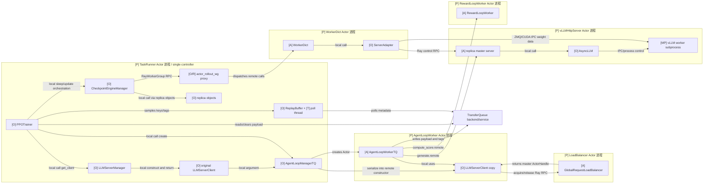
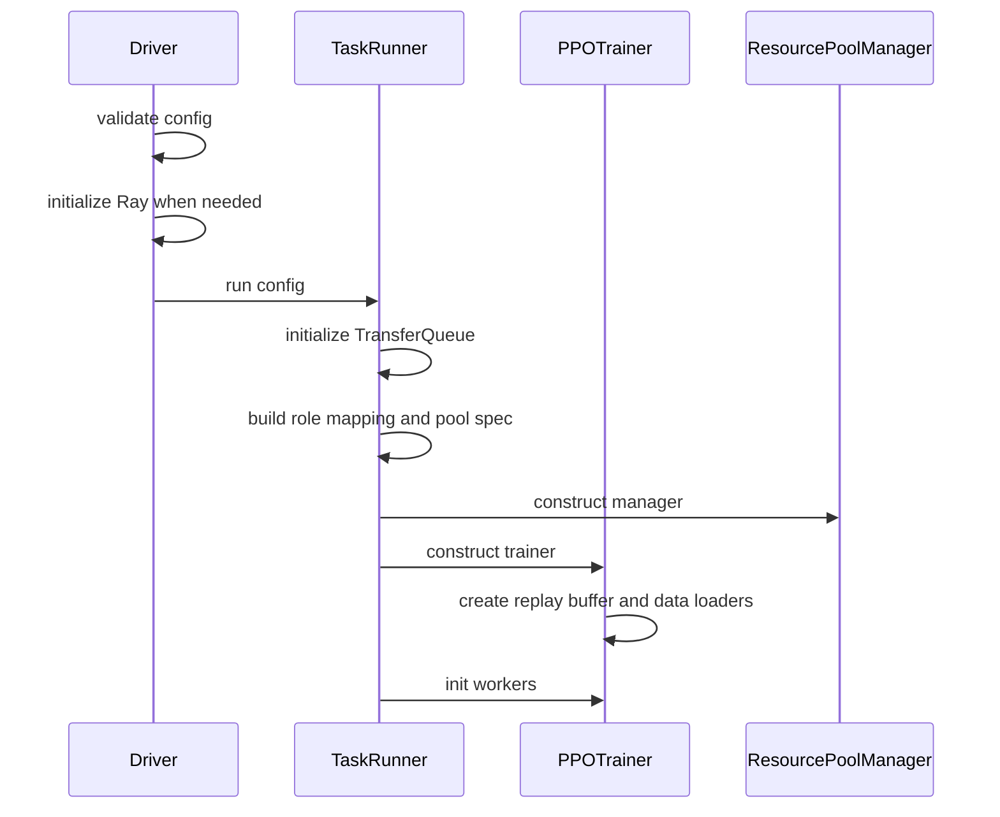
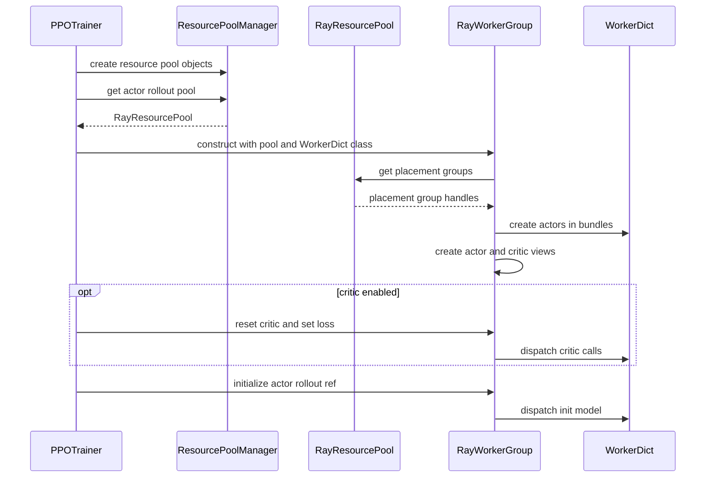
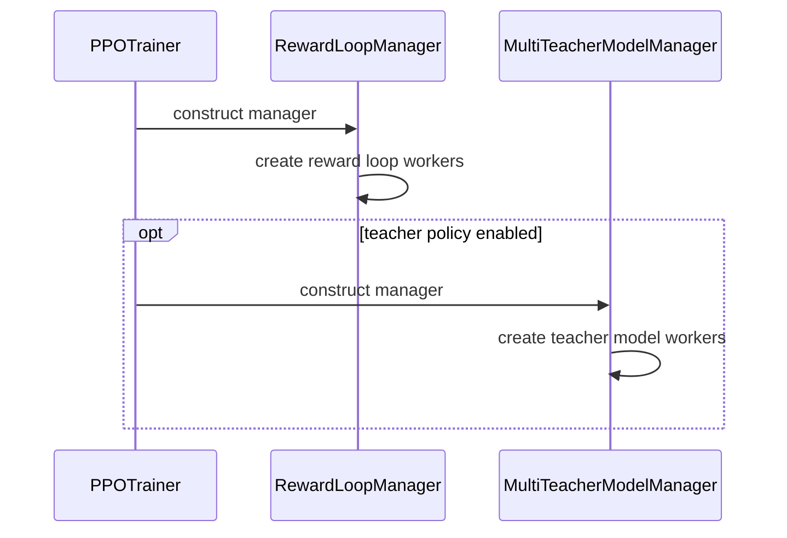
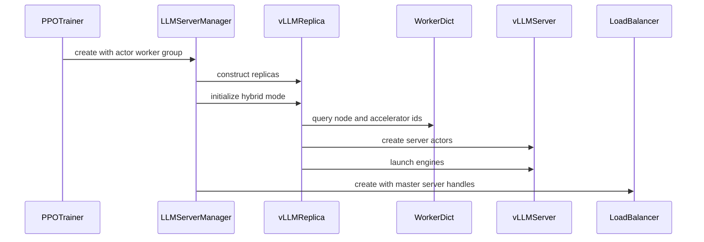
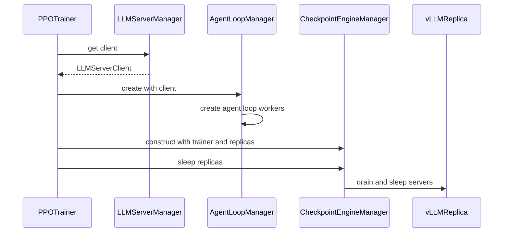
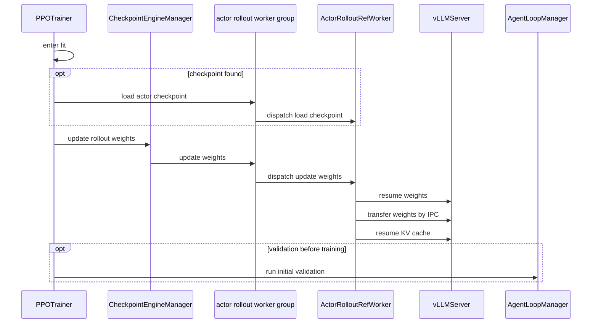
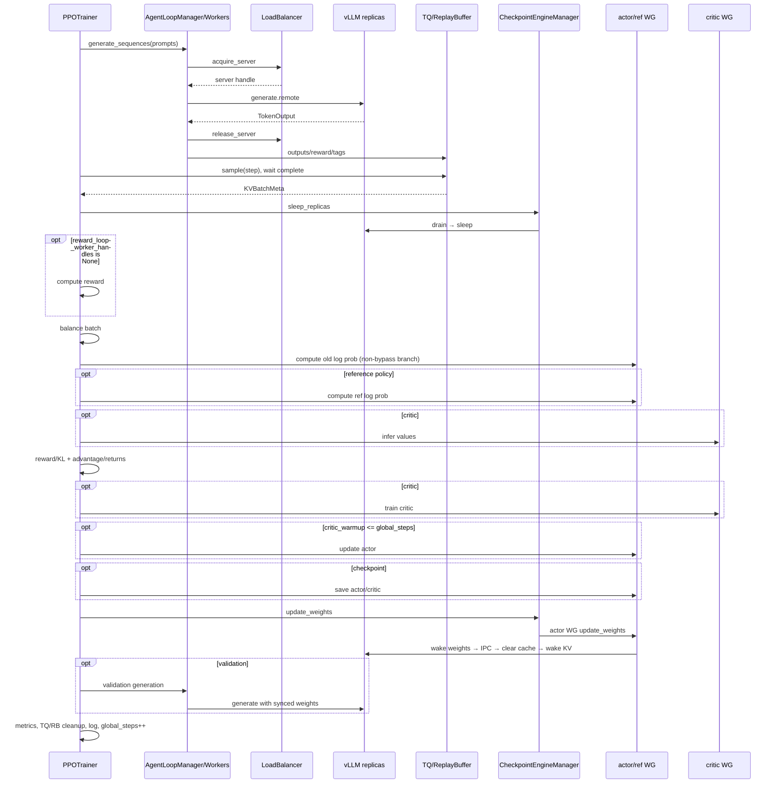

# verl v0.8.0 HYBRID 未改造基线：资源启动与单轮迭代全景

> 代码基线：`/Users/nyp/Documents/verl`，tag `v0.8.0`。主路径限定为
> `verl.trainer.main_ppo_sync` + native async rollout + vLLM + HYBRID。主链按普通（非 PD）
> vLLM replica 展开；critic、reference policy、reward model、teacher 和 validation 作为条件分支列出。
>
> 本文只记录代码中已经存在的对象、资源、依赖和调用关系，并据此标出子仓边界、
> verl 代码落点和现有扩展点。本文不评估实现完整性，不分析改造方案，也不列实现 gap。

## 1. 路径、术语与迭代边界

### 1.1 实际入口

```text
main_ppo_sync.main(config)
  └─ main_ppo.run_ppo(config, task_runner_class=main_ppo_sync.TaskRunner)
       ├─ ray.init(...)
       ├─ TaskRunner.remote()
       └─ ray.get(runner.run.remote(config))
```

`run_ppo()` 定义在 `verl/trainer/main_ppo.py:52`，但实际 TaskRunner、PPOTrainer 和 step
实现来自 `main_ppo_sync.py`，不是旧的 `ray_trainer.RayPPOTrainer`。

### 1.2 两种不同的 mode

| 维度 | 当前值/判定 | 代码作用 |
|---|---|---|
| `actor_rollout_ref.rollout.mode` | 默认 `async` | 选择 rollout API/adapter 形态 |
| `RolloutMode.HYBRID` | `RolloutReplica.init_hybrid()` 设置 | 选择训练与推理共用 GPU 的部署形态 |

`PPOTrainer.init_workers()` 创建 LLMServerManager 时传入非空
`worker_group=self.actor_rollout_wg`，因此运行时进入 HYBRID。`async` 和 `HYBRID` 不矛盾：
前者描述服务调用形态，后者描述物理资源部署。

本文把 `PPOTrainer.fit()` 内一次 dataloader batch 定义为一轮迭代：

```text
读取 prompt → rollout → reward/log-prob/value/advantage
→ critic update（条件）→ actor update（warmup 条件）→ checkpoint（条件）
→ 权重同步到 rollout → validation（条件）→ metrics/cleanup
```

## 2. 进程、Actor 与普通对象拓扑

原代码同时存在 OS 进程、Ray Actor、Actor handle、普通 Python 对象、线程和 vLLM 自建子进程。
必须先区分“对象是什么”与“对象运行在哪个进程”：普通对象可以运行在 Ray Actor 的 worker 进程里，
但它不会因此变成 Ray Actor，也不能被其他进程用 `.remote()` 直接调用。

本节使用以下标记：

| 标记 | 含义 |
|---|---|
| `[P]` | OS 进程或进程边界 |
| `[A]` | Ray Actor 实例；运行在 Ray 管理的 actor worker 进程中 |
| `[O]` | 普通 Python 对象/函数；只能在所在进程内直接调用 |
| `[T]` | 所在进程内的线程，不是独立进程 |
| `[MP]` | 由 vLLM/router 等库创建的非 Ray 子进程 |
| `[R]` | Ray placement group、handle 或调用代理；不是独立执行单元 |

### 2.1 类型与运行位置清单

| 组件 | 类型 | 实际运行位置 | 代码事实 |
|---|---|---|---|
| Hydra `main()`、`run_ppo()` | `[O]` 普通函数 | `[P]` 用户启动的 driver 进程 | driver 执行 `ray.init()`，创建 `TaskRunner` Actor 并 `ray.get()` 等待 |
| `TaskRunner` | `[A]` Ray Actor | `[P]` 每任务一个 TaskRunner actor worker 进程，即 single controller | sync 入口类有 `@ray.remote` |
| `PPOTrainer` | `[O]` 普通对象 | TaskRunner Actor 进程 | 由 `TaskRunner.run()` 直接 `PPOTrainer(...)` 构造 |
| `ResourcePoolManager`、`RayResourcePool` | `[O]/[R]` 本地对象和资源描述 | TaskRunner Actor 进程 | 创建/缓存 placement group handle，自身不是 Actor |
| `RayWorkerGroup` (`actor_rollout_wg/critic_wg`) | `[O]/[R]` 本地调用代理 | TaskRunner Actor 进程 | 保存一组 WorkerDict Actor handles；自身不是 Actor |
| `LLMServerManager` | `[O]` 普通对象 | TaskRunner Actor 进程 | `create()` 只是 `auto_await` classmethod，不是 Ray remote constructor |
| `RolloutReplica/vLLMReplica` | `[O]` 普通对象 | TaskRunner Actor 进程 | 保存 worker/server Actor handles并编排 server 生命周期 |
| `CheckpointEngineManager` | `[O]` 普通对象 | TaskRunner Actor 进程 | 保存 trainer proxy 和 replica 普通对象列表 |
| `AgentLoopManagerTQ` | `[O]` 普通对象 | TaskRunner Actor 进程 | 创建并持有 AgentLoopWorker Actor handles |
| `RewardLoopManager`、`RewardModelManager` | `[O]` 普通对象 | TaskRunner Actor 进程 | 条件创建 reward inference actors/router |
| `MultiTeacherModelManager/TeacherModelManager` | `[O]` 普通对象 | TaskRunner Actor 进程 | 条件创建 teacher inference actors 和每 teacher LB Actor |
| `ReplayBuffer` | `[O]` 普通对象 | TaskRunner Actor 进程 | 它的 poll loop 是同一进程内的 `[T]` 后台线程 |
| placement group | `[R]` Ray 调度资源 | Ray control plane | 约束 Actor 放置，不是进程或 Actor |
| `WorkerDict` | `[A]` Ray Actor | `[P]` GPU worker actor 进程，通常每个 PG bundle 一个 | `create_colocated_worker_cls()` 最后执行 `ray.remote(WorkerDict)` |
| `ActorRolloutRefWorker` | `[O]` 普通对象 | WorkerDict Actor 进程 | WorkerDict 解包 remote class 后直接实例化到 `worker_dict` |
| actor/ref `TrainingWorker` | `[O]` 普通对象 | ActorRolloutRefWorker 所在 WorkerDict Actor 进程 | 由 ActorRolloutRefWorker 直接构造 |
| critic `TrainingWorker` | `[O]` 普通对象 | 对应 WorkerDict Actor 进程 | colocated WorkerDict 内的一个 role 对象，不是额外 Actor |
| `ServerAdapter`、trainer-side `CheckpointEngine` | `[O]` 普通对象 | ActorRolloutRefWorker 所在 WorkerDict Actor 进程 | 训练 worker 内本地对象 |
| `vLLMHttpServer` runtime instance | `[A]` Ray Actor | `[P]` vLLM server actor 进程；每 replica 每 node 一个 | 源码类无装饰器，但 `vLLMReplica` 执行 `ray.remote(vLLMHttpServer)` 后再 `.remote()` 创建 |
| `AsyncLLM`、HTTP server state | `[O]` 普通对象 | vLLMHttpServer Actor 进程 | 由该 Actor 初始化和持有 |
| vLLM `EngineCore/WorkerProc` | `[MP]` 非 Ray 子进程 | vLLMHttpServer 所在节点 | 由 vLLM multiprocessing 启动，不是 Ray Actor |
| `GlobalRequestLoadBalancer` | `[A]` Ray Actor | `[P]` 独立 CPU actor worker 进程 | 类有 `@ray.remote`；任务内一个，teacher 场景每 teacher 一个 |
| `AgentLoopWorkerTQ` | `[A]` Ray Actor | `[P]` 独立 CPU actor worker 进程 | 类有 `@ray.remote`；通常有多个实例 |
| `RewardLoopWorker` runtime instance | `[A]` Ray Actor | `[P]` 独立 CPU actor worker 进程 | manager 运行时执行 `ray.remote(RewardLoopWorker)` |
| `LLMServerClient` | `[O]` 普通对象 | 原件在 TaskRunner Actor 进程；序列化副本在各 AgentLoopWorker Actor 进程 | 内部只保存 LB ActorHandle 等客户端状态 |
| reward/teacher rollout workers | `[A]` Ray Actors | 条件 inference worker actor 进程 | colocated/standalone 路径使用 remote `CheckpointEngineWorker` |
| reward router | `[MP]` 非 Ray 子进程 | TaskRunner Actor 所在节点 | `RewardModelManager` 在 controller 内调用 `multiprocessing.Process(...)` 启动，不是 Ray Actor |
| TransferQueue | 外部库/runtime | TaskRunner、AgentLoopWorker 及启用 tqbridge 的调用进程内有 client；服务位置取决于 backend 配置 | 不是 verl 定义的 Ray Actor，不能固定画成 TaskRunner 内普通对象 |

这里最容易混淆的是 single controller：它不是 Hydra driver 进程，而是每个任务的 `TaskRunner`
Ray Actor 进程。`PPOTrainer`、`LLMServerManager` 和其他任务级 managers 都是这个 Actor 进程里的
普通对象。

### 2.2 部署位置与所有权

```mermaid
flowchart TB
    subgraph DRIVER_PROCESS["[P] Hydra driver 进程（非 Ray Actor）"]
        ENTRY["[O] main_ppo_sync.main<br/>main_ppo.run_ppo"]
        TASK_HANDLE["[R] TaskRunner ActorHandle"]
    end

    subgraph TASK_ACTOR_PROCESS["[P] TaskRunner Ray actor worker 进程 / single controller / 每任务一个"]
        TASK["[A] TaskRunner"]
        TRAINER["[O] PPOTrainer"]
        RPM["[O] ResourcePoolManager"]
        RPS["[O/R] RayResourcePool"]
        AWG["[O/R] actor_rollout_wg<br/>RayWorkerGroup proxy"]
        KWG["[O/R] critic_wg proxy<br/>条件"]
        LSM["[O] LLMServerManager"]
        REPS["[O] vLLMReplica objects"]
        CEM["[O] CheckpointEngineManager"]
        ALM["[O] AgentLoopManagerTQ"]
        RB["[O] ReplayBuffer<br/>[T] poll thread"]
        RLM["[O] RewardLoopManager"]
        RMM["[O] RewardModelManager<br/>条件"]
        TMM["[O] MultiTeacherModelManager<br/>+ TeacherModelManagers / 条件"]
    end

    subgraph RAY_CONTROL["Ray control plane（无业务 Python 进程）"]
        PGS["[R] Placement Groups<br/>global/reward/teacher pools"]
    end

    subgraph WORKER_ACTOR_PROCESSES["[P] GPU WorkerDict actor worker 进程集合 / 通常每 PG bundle 一个"]
        WD["[A] WorkerDict"]
        ARW["[O] ActorRolloutRefWorker"]
        ACTOR["[O] actor TrainingWorker"]
        REF["[O] ref TrainingWorker / 条件"]
        ADAPTER["[O] vLLM ServerAdapter"]
        TCE["[O] trainer-side CheckpointEngine"]
        CRITIC["[O] critic TrainingWorker / 条件"]
    end

    subgraph VLLM_ACTOR_PROCESSES["[P] vLLMHttpServer Ray actor 进程集合 / 与训练 worker 同节点和可见 GPU"]
        MASTER["[A] vLLMHttpServer node_rank=0<br/>master + HTTP API"]
        HEADLESS["[A] vLLMHttpServer node_rank>0<br/>headless / 条件"]
        ASYNC["[O] AsyncLLM"]
        VPROC["[MP] vLLM EngineCore / WorkerProc"]
    end

    subgraph LB_PROCESS["[P] LoadBalancer actor worker 进程"]
        LB["[A] GlobalRequestLoadBalancer"]
    end

    subgraph AGENT_PROCESSES["[P] AgentLoopWorker actor worker 进程集合"]
        ALW["[A] AgentLoopWorkerTQ"]
        CLIENT_COPY["[O] serialized LLMServerClient copy"]
    end

    subgraph REWARD_PROCESSES["[P] RewardLoopWorker actor worker 进程集合"]
        RLW["[A] RewardLoopWorker"]
    end

    subgraph CONDITIONAL_INFERENCE["条件 reward-model / teacher inference runtime"]
        INF_WORKER["[A] CheckpointEngineWorker actors"]
        INF_SERVER["[A] rollout server actors"]
        INF_LB["[A] per-teacher LoadBalancer actors"]
        ROUTER["[MP] reward router process"]
    end

    TQ["TransferQueue clients + backend service<br/>非 verl Ray Actor"]

    ENTRY -->|creates and waits| TASK_HANDLE
    TASK_HANDLE --> TASK
    TASK -->|local construct| TRAINER
    TASK -->|local construct| RPM
    RPM -->|local construct| RPS
    RPS -->|creates/holds handle| PGS
    TRAINER -->|local construct| AWG
    TRAINER -->|local construct| KWG
    AWG -->|holds ActorHandles| WD
    KWG -->|shares ActorHandles| WD
    PGS -->|bundle scheduling constraint| WD
    WD -->|local contains| ARW
    WD -->|local contains| CRITIC
    ARW -->|local contains| ACTOR
    ARW -->|local contains| REF
    ARW -->|local contains| ADAPTER
    ARW -->|local contains| TCE

    TRAINER -->|local construct| LSM
    LSM -->|local construct and hold| REPS
    LSM -->|holds proxy| AWG
    REPS -->|stores subsets of ActorHandles| WD
    REPS -->|creates and holds ActorHandles| MASTER
    REPS -->|creates and holds ActorHandles| HEADLESS
    WD -.node and accelerator identity.-> MASTER
    WD -.node and accelerator identity.-> HEADLESS
    MASTER -->|local contains| ASYNC
    HEADLESS -->|local contains| ASYNC
    ASYNC -->|multiprocessing starts| VPROC
    LSM -->|creates and holds ActorHandle| LB
    LB -->|stores routable master ActorHandles| MASTER
    TRAINER -->|local construct| CEM
    CEM -->|holds proxy| AWG
    CEM -->|holds ordinary object list| REPS

    TRAINER -->|local construct| ALM
    ALM -->|creates and holds ActorHandles| ALW
    ALW -->|local contains| CLIENT_COPY
    TRAINER -->|local construct| RB
    TRAINER -->|local construct| RLM
    RLM -->|creates and holds ActorHandles| RLW
    RLM -->|local construct when enabled| RMM
    RMM -->|creates| INF_WORKER
    RMM -->|creates| INF_SERVER
    RMM -->|starts| ROUTER
    TRAINER -->|local construct when enabled| TMM
    TMM -->|creates| INF_WORKER
    TMM -->|creates| INF_SERVER
    TMM -->|creates| INF_LB
    TASK -->|tq.init / tq.close| TQ
    ALW -->|tq.init / data access| TQ
```



`actor_rollout_wg` 与 `critic_wg` 是共享同一批 WorkerDict handles 的不同本地调用视图。
`ActorRolloutRefWorker`、actor/ref/critic `TrainingWorker`、ServerAdapter 和 trainer-side
CheckpointEngine 都不是独立 Ray Actor；它们由 `WorkerDict` Actor 在自己的进程中直接实例化。

同理，`RolloutReplica/vLLMReplica` 本身不是 vLLM server Actor，而是 single controller 内保存并编排
server Actor handles 的普通对象。源码中的 `vLLMHttpServer` 类虽然没有 `@ray.remote`，但
`vLLMReplica.__init__()` 将它包装为 `ray.remote(vLLMHttpServer)`，所以运行时 server instance 是
Ray Actor。

### 2.3 跨进程调用与数据关系



`LLMServerClient` 不是 `LLMServerManager` 持有的长期对象。`PPOTrainer` 调用 `get_client()` 得到普通
client，把它交给 `AgentLoopManager`；manager 创建 `AgentLoopWorker` Actor 时再把 client 序列化到
各 Actor 进程。因此各 AgentLoopWorker 使用的是普通 client 副本，client 内部的 LB handle 才是
可跨进程调用的 Ray ActorHandle。

这个边界对后续多任务扩展有直接影响：用 `MultiTaskLLMServerManager` 替换基类后，它仍然只是
TaskRunner Actor 进程内的普通对象；独立的 `GroupScheduler` 才是 Ray Actor。GS 不能直接对 manager
执行反向 `.remote()`，必须由 manager 所在 controller 主动领取命令并在本地调用生命周期方法。
目标设计见 [`04-multitask-hybrid-runtime-design.md`](./04-multitask-hybrid-runtime-design.md) 和
[`05-multitask-llm-server-manager.md`](./05-multitask-llm-server-manager.md)。

## 3. 全量组件与直接依赖

### 3.1 控制、资源和训练组件

| 组件 | 运行位置 | 创建者 | 直接依赖/持有 |
|---|---|---|---|
| Hydra `main()` | driver | Python 入口 | 配置树；调用 `run_ppo()` |
| `run_ppo()` | driver | `main()` | Ray runtime env；控制 TaskRunner 生命周期 |
| `TaskRunner` | Ray Actor；sync 入口未显式传资源 options | `run_ppo()` | role mapping、ResourcePoolManager、PPOTrainer；调用 `tq.init/close` |
| `PPOTrainer` | TaskRunner 内 | `TaskRunner.run()` | 所有任务内 manager、WorkerGroup、数据和训练循环 |
| `ResourcePoolManager` | TaskRunner 内 | TaskRunner | resource spec、role→pool mapping、RayResourcePool |
| `RayResourcePool` | TaskRunner 内代理 | ResourcePoolManager | Ray placement groups |
| `RayWorkerGroup` | TaskRunner 内代理 | PPOTrainer | resource pool、remote actor handles、分布式调用封装 |
| `WorkerDict` | GPU 节点 Ray Actor | RayWorkerGroup | 同进程 colocated role workers |
| `ActorRolloutRefWorker` | WorkerDict 内 | WorkerDict | actor、可选 ref、ServerAdapter、CheckpointEngine |
| actor `TrainingWorker` | ActorRolloutRefWorker 内 | `init_model()` | model engine、optimizer、loss、参数导出 |
| ref `TrainingWorker` | 同上，条件 | `init_model()` | reference model engine |
| critic `TrainingWorker` | WorkerDict 内，条件 | WorkerDict | value model engine、optimizer、loss |

### 3.2 rollout、请求和权重组件

| 组件 | 运行位置 | 创建者 | 直接依赖/持有 |
|---|---|---|---|
| `LLMServerManager` | TaskRunner 内 | PPOTrainer | config、actor_rollout_wg、replicas、server handles/addresses、LB handle；`get_client()` 按调用创建 client |
| `vLLMReplica` | TaskRunner 内 | LLMServerManager | 固定 worker slice、每节点 server actor |
| `vLLMHttpServer` | accelerator 节点 Ray Actor；不申请 Ray GPU | vLLMReplica | worker 节点/GPU 信息；node rank 0 运行 AsyncLLM+HTTP，其他节点运行 headless |
| EngineCore/WorkerProc | server 的 mp 子进程 | vLLM | 同一组可见 GPU、worker extension |
| `vLLMColocateWorkerExtension` | vLLM worker 子进程 | vLLM loader | IPC receiver、model runner |
| `GlobalRequestLoadBalancer` | Ray Actor，任务内一个 | LLMServerManager | address→server handle、sticky cache、in-flight count |
| `LLMServerClient` | 先在 TaskRunner 内创建，随后序列化到 AgentLoopWorkers | `LLMServerManager.get_client()` | LB actor handle；由 AgentLoopManager/Workers 持有 |
| `CheckpointEngineManager` | TaskRunner 内 | PPOTrainer | actor_rollout_wg、replica list、backend |
| trainer-side `CheckpointEngine` | ActorRolloutRefWorker 内 | `init_model()` | 非 naive 权重传输 backend |

### 3.3 数据、Agent 与条件组件

| 组件 | 运行位置 | 创建者 | 作用/依赖 |
|---|---|---|---|
| Dataset / StatefulDataLoader | TaskRunner 内 | PPOTrainer | tokenizer、processor、data config；产生 prompts |
| `AgentLoopManagerTQ` | TaskRunner 内 | PPOTrainer | LLM client、reward handles、teacher clients、ReplayBuffer |
| `AgentLoopWorkerTQ` | CPU Ray Actor | AgentLoopManager | concrete AgentLoop、LLM client、tools、TQ |
| concrete AgentLoop | AgentLoopWorker event loop | Hydra instantiate | client、tokenizer、processor、tools |
| `TransferQueue` | 跨进程数据服务 | `tq.init()` | 保存 rollout 和训练 payload |
| `ReplayBuffer` | TaskRunner 内 | PPOTrainer | 保存 uid/global_steps/status，返回 TQ keys/tags |
| `RewardLoopManager/Worker` | TaskRunner 内 manager + 无显式 GPU 资源的 Ray actors | PPOTrainer / RewardLoopManager | 每次都会创建；reward function、可选 reward model/router |
| `RewardModelManager` | TaskRunner 内，条件 | RewardLoopManager | RM resource pool、server/router |
| `MultiTeacherModelManager` | TaskRunner 内，条件 | PPOTrainer | teacher resource pool、servers、LB、clients |
| Tracking / validation logger | TaskRunner 内 | `fit()` | 指标、样本和 experiment logger |
| profiler controllers | controller/worker/server | 各组件 | profiling step 配置 |

### 3.4 reward model 与 teacher 条件分支

这两条分支不属于 actor rollout 的 HYBRID replica，但会参与同一训练任务的资源和请求拓扑：

- RewardLoopManager 无条件创建 RewardLoopWorkers；启用 reward model 时，它另外创建
  RewardModelManager。sync TaskRunner 会把 Role.RewardModel 映射到 global pool 或独立 reward
  pool，RewardModelManager 对该 pool 做 split，创建 colocated rollout replicas/server actors，
  再启动一个 naive router process。RewardLoopWorker 通过 router address 请求 reward server。
- 启用 distillation 时，TaskRunner 创建独立 teacher pool。MultiTeacherModelManager 按 teacher
  world size 切分 pool，为每个 teacher 创建一个 TeacherModelManager；后者创建 colocated rollout
  replicas/server actors 和独立 GlobalRequestLoadBalancer。生成阶段的 teacher client 被传入
  AgentLoopWorkers，用于计算 teacher log-probs。

## 4. GPU 资源启动和 HYBRID 绑定

### 4.1 TaskRunner 声明资源规格

`TaskRunner.init_resource_pool_mgr()` 生成：

```python
{"global_pool": [n_gpus_per_node] * nnodes}
```

actor/rollout/ref 和 critic 映射到 `global_pool`；reward model 和 teacher 可以进入额外 pool。
此时只创建 ResourcePoolManager，placement group 在 WorkerGroup 初始化时按需创建。

### 4.2 placement group 与 WorkerDict

`ResourcePoolManager.create_resource_pool()` 创建 RayResourcePool。随后 RayWorkerGroup 调用
`get_placement_groups()`；每个 bundle 包含一张 GPU 和 `max_colocate_count` 个 CPU。
默认 `max_colocate_count=3`，worker actor 向 bundle 申请 `1/3` GPU，而 placement group 已经把
整张 GPU 纳入该任务资源池。

PPOTrainer 把同一 resource pool 上的 role class 收集到 `class_dict`：

```text
create_colocated_worker_cls(class_dict)
→ 动态 WorkerDict Ray Actor class
→ WorkerDict 同进程实例化各 role worker
→ RayWorkerGroup.spawn(prefix_set)
→ 多个逻辑 WorkerGroup view 共享相同 Ray actor handles
```

因此 actor_rollout_wg 和 critic_wg 可以是不同调用视图，但指向同一批 WorkerDict actors。

### 4.3 训练 worker 内部初始化

`actor_rollout_wg.init_model()` 在每个 ActorRolloutRefWorker 中按顺序：

1. 条件创建 ref TrainingWorker；
2. 创建 actor TrainingWorker；
3. 创建 rollout `ServerAdapter` 和 device mesh；
4. 为 actor 创建 trainer-side CheckpointEngine；
5. 注册 dispatch/collect 规则；
6. 清理 GPU cache，为 vLLM colocated 进程准备显存。

reference policy 相关代码分布在两个位置：TaskRunner 在需要 reference policy 且未启用 LoRA/
`lora_adapter_path` 时选择 `Role.ActorRolloutRef`，对应 ActorRolloutRefWorker 内创建独立 ref
TrainingWorker；否则选择 `Role.ActorRollout`。另外，`_compute_ref_log_prob()` 本身包含
`ref_in_actor=True` 时调用 actor WG 并设置 `no_lora_adapter=True`、否则调用 ref WG 的两个分支。

### 4.4 replica 数量和 worker slice

LLMServerManager 收到 actor_rollout_wg 后计算：

```text
rollout_world_size = TP × DP × PP
num_replicas = actor_rollout_wg.world_size // rollout_world_size
```

每个 replica 在 `RolloutReplica.init_hybrid()` 中按 replica rank 取得固定连续 slice：

```python
worker_group.workers[world_size * replica_rank : world_size * (replica_rank + 1)]
```

### 4.5 vLLM server 如何复用同一 GPU

`vLLMReplica.launch_servers()` 对 worker slice 查询 node ID 和 accelerator ID。每个 replica 节点
随后创建一个 vLLMHttpServer Ray actor：

- hard node affinity 到训练 worker 节点；
- actor options 不额外申请 GPU；
- 手工设置与训练 workers 对应的 `CUDA_VISIBLE_DEVICES`；
- vLLM 使用 `distributed_executor_backend="mp"` 启动 EngineCore/WorkerProc。

因此共卡的资源事实是：WorkerDict/placement group 占有 GPU，vLLM server actor 和子进程按相同
设备编号进入这些 GPU，并依靠 sleep/wake 在 rollout 与训练阶段切换显存占用。

### 4.6 任务内请求面和权重面

replica 启动后：

1. LLMServerManager 收集 master server handles/addresses；
2. 创建任务内 GlobalRequestLoadBalancer；
3. PPOTrainer 调用 `LLMServerManager.get_client()` 创建 LLMServerClient，将其传给
   AgentLoopManager；AgentLoopManager 再把它传入每个 AgentLoopWorker；
4. CheckpointEngineManager 持有 actor_rollout_wg 和当前 replicas；
5. `init_workers()` 结尾 sleep 全部 replicas；
6. `fit()` 加载 checkpoint 后 update weights，并恢复 rollout weights/KV cache。

## 5. 完整启动调用时序

下面严格按 `TaskRunner.run()` 和 `PPOTrainer.init_workers()` 的代码顺序，将启动过程拆成六段。
每张图只保留当前阶段的参与者，避免 Mermaid 因横向参与者过多而显示不全。

### 5.1 controller 构造任务内对象



### 5.2 资源池和训练 workers



### 5.3 reward 和 teacher managers



### 5.4 actor rollout 服务启动



### 5.5 rollout client 和任务内 managers



### 5.6 fit 初始化和首次权重同步



## 6. rollout 请求逐层调用链

```text
PPOTrainer.step
└─ AgentLoopManagerTQ.generate_sequences(batch)
   ├─ ReplayBuffer.add(uid → running)
   └─ AgentLoopWorkerTQ.generate_sequences.remote(chunk)
      └─ background asyncio task per prompt/session
         └─ concrete AgentLoop.run(...)
            └─ LLMServerClient.generate(...)
               ├─ GlobalRequestLoadBalancer.acquire_server.remote(request_id)
               ├─ vLLMHttpServer.generate.remote(...)
               │  └─ AsyncLLM.generate → EngineCore/WorkerProc
               └─ GlobalRequestLoadBalancer.release_server.remote(server_id)
```

同一上层 request ID 支持 LB sticky session；发送到 server 的底层 request ID 每 turn 重新生成。
`LLMServerClient.release_server()` 是 fire-and-forget Ray RPC。AgentLoop 完成后，AgentLoopWorker
在 reward score 尚未由具体 AgentLoop 提供时调用 RewardLoopWorker，并在启用 distillation 时计算
teacher log-probs；随后把输出字段和 success tags 写入 TransferQueue，并把原 prompt uid 标为
finished。ReplayBuffer 的后台线程轮询 TQ metadata；`sample()` 等到本 step 没有 running 项后，
返回所有 success 输出的 KVBatchMeta。

### 6.1 rollout 过程中各层可见的完成状态

当前 batch 只按 `AgentLoopWorkerTQ` 数量切块，不按 `RolloutReplica` 划分。每次具体的
`LLMServerClient.generate()` 才通过任务内 `GlobalRequestLoadBalancer` 动态选择 server，因此基线中
不存在“某 replica 已取尽分配给自己的 batch 分片”这一状态。

| 组件 | 当前代码可见状态 | 不能推导出的状态 |
|---|---|---|
| `PPOTrainer` | `ReplayBuffer.sample()` 是否返回，即本 `global_steps` 是否已无 `running` prompt | 哪个 replica 先空闲 |
| `ReplayBuffer` | prompt uid 的 `running/success/finished` 和 `global_steps` | prompt/trajectory 与 replica 的映射 |
| `AgentLoopWorkerTQ` | 本 worker 的后台 prompt/trajectory 是否完成 | 所有 workers 的全局状态及每个 replica 的负载 |
| `LLMServerClient` | 当前一次 generate 选择的 server；调用返回后发出 release | 该 server 后续是否还会收到请求 |
| `GlobalRequestLoadBalancer` | 每个 server 当前的 in-flight generate 调用数 | 未完成 AgentLoop 将来还会产生多少次 generate |
| `vLLMHttpServer` | 本 engine 当前执行/排队的请求 | 其他 servers 和上层 AgentLoop 的未来需求 |
| `LLMServerManager` | replica、server、LB 的拓扑和生命周期 | 请求路径中的实时 per-server 负载；除非主动查询 LB |

这里的“sample”还需要区分三种基数：

```text
prompt 数       = 进入 AgentLoopManagerTQ 的 uid 数；ReMax 会额外拼接 baseline prompts
trajectory 数   = Σ 每个 prompt 的 __rollout_n__；缺省为 rollout.n/val_kwargs.n
output row 数   = trajectory 产出的 AgentLoopOutput 数；自定义 AgentLoop 可返回多个 output
```

因此不能用 `len(batch)` 直接代表将进入推理侧的 trajectory 数。当前代码中与“所有 sample 被取完”
接近的四个时刻如下：

| 时刻 | 当前信号 | 精确含义 |
|---|---|---|
| 所有 prompts 已分发 | `AgentLoopManagerTQ.generate_sequences()` 中的 `ray.get()` 返回 | 所有 prompt chunk 已被 AgentLoopWorker 接收，每个 prompt 的 `_run_prompt` 后台任务已创建；不表示 trajectory 已调用 LB |
| 所有 trajectories 已创建 | 无聚合信号 | 每个 `_run_prompt` 已按 `n` 创建全部 `_run_agent_loop` task；不同 worker 各自知道局部状态 |
| 所有 trajectories 已首次进入推理 | 无现成信号 | 每个 `(prompt_uid, rollout_index)` 至少执行过一次 LB acquire；这是 single-turn 下最接近“batch 输入已取尽”的时刻 |
| 所有 prompts 已终止 | `ReplayBuffer.sample(global_steps)` 返回 | 本 step 所有已注册 uid 都不再是 `running`，可能是 finished 或 failure；这是现有唯一的全 batch terminal barrier |

对于 single-turn Agent，每个 trajectory 只调用一次 `LLMServerClient.generate()`，所以“所有
trajectories 已首次 acquire”也意味着本 batch 不会再产生新的 rollout acquire。对于 tool/multi-turn
Agent，首次 acquire 后还可能经历 `PROCESSING_TOOLS → GENERATING`；在所有 trajectories 终止前，
无法从 batch 数量静态推导“所有未来 generate 都已经发出”。

`GlobalRequestLoadBalancer` 是唯一集中维护 per-server in-flight 计数的现有节点：

```text
acquire_server(request_id)  → selected_server.inflight += 1
server.generate.remote(...) → await TokenOutput
release_server(server_id)   → selected_server.inflight -= 1
```

所以它能够观察某 server 的计数从 `1 → 0`，但这个零值只表示“当前没有尚未返回的 generate
调用”。尤其在多轮 Agent 中，trajectory 可以在 `PROCESSING_TOOLS` 阶段暂时不占用任何 server，
随后再次进入 `GENERATING`。least-inflight 路由也会优先把新请求分给刚降到零的 server。因此，基线
中的零 in-flight 集合在 rollout 尾部通常会扩大，但不保证单调增加；只有整轮
`ReplayBuffer.sample()` 返回时才能确认本 batch 全局完成。

基于该代码事实的 batch 输入取尽判断、推理侧事件上报、generation epoch 和原子摘流方案见
[`07-rollout-instance-idle-detection.md`](./07-rollout-instance-idle-detection.md)。

## 7. 一轮完整迭代调用关系



### 7.1 step() 精确顺序

1. 分配 uid/global_steps；ReMax 条件下加入 greedy baseline；
2. AgentLoopManager 分发 rollout；
3. ReplayBuffer 等待并采样本 step 输出；
4. `checkpoint_manager.sleep_replicas()`；
5. 条件执行 colocated reward 和 ReMax baseline 处理；
6. balance batch；
7. old log-prob stage：rollout-correction bypass 模式直接复制 rollout log-probs；否则由 actor WG
   重新计算；
8. 条件计算 ref log-prob：独立 ref worker 或 actor 的 no-LoRA 路径；
9. 条件由 critic WG 推理 values；
10. controller 计算 reward/KL、advantage 和 returns；
11. 条件更新 critic；
12. warmup 条件满足后更新 actor；
13. 返回 KVBatchMeta。

`fit()` 随后条件保存 checkpoint，无条件同步 actor→rollout 权重，再条件 validation，最后记录指标、
清理 TransferQueue/ReplayBuffer 并递增 global_steps。

`fit()` 在进入 epoch loop 前还会按 `val_before_train` 执行一次 initial validation。`_validate()`
同样通过 AgentLoopManager→LLM client→LB→vLLM server 生成；当
`reward_loop_manager.reward_loop_worker_handles is None` 时，每个 validation batch 在生成后执行
`sleep_replicas()`、colocated reward 和 `update_weights()`。

### 7.2 HYBRID 显存状态时间线

| 阶段 | vLLM 状态 | actor/ref/critic | 关键调用 |
|---|---|---|---|
| 权重同步后 | weights/KV active | 等待 batch | CE manager update_weights 完成 |
| rollout | active、接收请求 | 不做训练更新 | client→LB→generate |
| rollout 收齐 | drain 后 sleep | 准备训练 | `sleep_replicas()` |
| log-prob/value/train | 已释放相应显存 | 顺序 compute/update | WorkerGroup calls |
| training stage 结束 | sleep | actor 可能已更新；随后导出当前参数 | actor WG update_weights |
| 权重同步 | resume weights、IPC、resume KV | ServerAdapter 发送 | CheckpointEngineManager |
| 下一轮/validation | active | 不做训练更新 | generate |

## 8. 共卡权重同步调用链

默认 `checkpoint_engine.backend=naive` 时：

```text
PPOTrainer.fit
└─ CheckpointEngineManager.update_weights()
   └─ actor_rollout_wg.update_weights(mode="naive")
      └─ ActorRolloutRefWorker.update_weights()
         ├─ ServerAdapter.resume(["weights"])
         ├─ actor.engine.get_per_tensor_param()
         ├─ ServerAdapter.update_weights(weights)
         │  ├─ server collective_rpc("update_weights_from_ipc")
         │  ├─ BucketedWeightSender / ZMQ IPC
         │  └─ vLLMColocateWorkerExtension receives and loads
         ├─ server.clear_kv_cache()
         └─ ServerAdapter.resume(["kv_cache"])
```

IPC identity 由 Ray job ID、replica rank 和 node-local rank 构成。ServerAdapter 从训练 worker 的 rank
推导 replica rank；vLLM 子进程从 server actor 注入的环境变量构造同一地址。

CheckpointEngineManager 还存在非 naive backend 分支：它从 `replica.workers` 创建临时 WorkerGroup，
建立 trainer/rollout process group 并并行 send/receive weights。本文只记录该调用分支。

## 9. 当前对象所有权边界

| 层级 | 当前对象 | 当前 owner |
|---|---|---|
| Ray cluster | nodes、GCS、全局资源视图 | Ray |
| 训练任务 controller | TaskRunner；其进程内的 PPOTrainer、各 manager | 每个 verl 任务独立创建 |
| 任务资源 | global/reward/teacher placement groups | ResourcePoolManager |
| 任务训练面 | actor/ref/critic WorkerGroups | PPOTrainer |
| 任务 rollout 控制面 | LLMServerManager、CE manager、AgentLoopManager | PPOTrainer |
| 任务请求路由 | GlobalRequestLoadBalancer actor handle | LLMServerManager；server handles 保存在 LB actor 内 |
| 任务请求 client | LLMServerClient | AgentLoopManager 和各 AgentLoopWorker |
| replica 描述与 worker slice | RolloutReplica objects | LLMServerManager |
| rollout server handles | vLLMHttpServer actors | 对应 RolloutReplica object |
| rollout engine 进程 | EngineCore/WorkerProc | vLLMHttpServer 内的 vLLM runtime |
| 请求/session | AgentLoop task、LB sticky entry、TQ keys | AgentLoop/TQ/LB |

当前代码中没有跨训练任务共享的 verl 内部 owner；多任务全局 owner 是已对齐架构中 GroupScheduler
所在的新层级。

### 9.1 已对齐的子仓/verl 责任边界

这里只标责任归属，不定义接口：

| 能力 | 子仓边界 | verl 边界 |
|---|---|---|
| 跨任务状态、inventory、调度决策 | GroupScheduler/协议 | 暴露任务内资源和生命周期事实 |
| 每任务命令执行编排 | MultiTaskLLMServerManager | 提供 manager/replica/LB/CE 原语 |
| 调度策略、租约、跨任务账本 | 子仓 | 不进入训练算法 |
| PG、worker、distributed engine 创建 | 调用/组合 | single-controller/worker 实现 |
| vLLM server、sleep/wake、权重 IPC | 调用/组合 | rollout/checkpoint-engine 实现 |
| PPO/GRPO 数据和优化算法 | 不接管 | PPOTrainer/TrainingWorker |

## 10. v0.8.0 已有扩展点

| 扩展点 | 代码位置 | 当前语义 |
|---|---|---|
| 自定义 TaskRunner | `run_ppo(..., task_runner_class=...)` | 替换 single controller actor class |
| TaskRunner role mapping | `TaskRunner.add_*_worker()` | 决定 role worker class 和 pool mapping |
| TaskRunner 选择 trainer class | `TaskRunner.run()` | TaskRunner 直接构造具体 trainer |
| AgentLoopManager FQN | `rollout.agent.agent_loop_manager_class` | 配置替换 manager |
| Agent loop registry/config | `agent_loop_config_path` | 配置 trajectory 执行逻辑 |
| RolloutReplica registry | `RolloutReplicaRegistry.register/get` | 按 backend 选择 replica class |
| `rollout_replica_class` 属性 | `LLMServerManager.__init__()` | 子类可预设 replica class |
| client class 参数 | `LLMServerManager.get_client(client_cls=...)` | 替换请求 client |
| LB 活跃集合 | `add_servers/remove_servers` | 修改任务内可路由 servers |
| CE replica 集合 | `add_replicas/remove_replicas` | 修改 CE manager 使用的 replica list |
| WorkerGroup existing handles | `RayWorkerGroup(worker_handles=...)` | 对已有 actors 创建调用视图 |
| Checkpoint backend plugin | `custom_backend_module` + registry | 注册权重 backend |
| Reward resolver/config | RewardLoopManager | 选择 reward manager/路径 |
| replica lifecycle methods | sleep/wake/abort/resume/clear KV | 控制已持有 replica |

## 11. 改变现有行为时对应的代码落点

只标“行为在哪里发生”，不提出修改方案。

| 关注行为 | 当前主要落点 | 关联对象 |
|---|---|---|
| 每任务启动/退出 | `run_ppo()`、`TaskRunner.run()` | Driver、TaskRunner、TQ、trainer |
| 集群级对象接入 | TaskRunner 构造 trainer 前后 | TaskRunner |
| 训练任务资源规格 | `TaskRunner.init_resource_pool_mgr()` | ResourcePoolManager |
| PG 创建 | ResourcePoolManager、RayResourcePool | Ray PG |
| worker 创建/colocate | PPOTrainer `init_workers()`、WorkerGroup、WorkerDict factory | workers |
| LLMServerManager 类选择 | `PPOTrainer.init_workers()` 固定 create 调用 | trainer、manager |
| 初始 replica 数量 | `LLMServerManager._initialize_llm_servers()` | manager |
| replica→worker 映射 | `RolloutReplica.init_hybrid()` | replica、actor WG |
| server→节点/GPU 映射 | `vLLMReplica.launch_servers()` | replica、server |
| 请求可见 server 集合 | GlobalRequestLoadBalancer | LB、client |
| AgentLoop 使用的 client | manager get_client→AgentLoopManager create | clients/workers |
| rollout sleep phase | `PPOTrainer.step()` rollout 收齐后 | trainer、CE manager |
| 训练 phase | `PPOTrainer.step()` compute/update 顺序 | actor/ref/critic WG |
| rollout 权重恢复 | `PPOTrainer.fit()` 的 update_weights | CE、actor WG、replicas |
| 权重→replica rank 映射 | ActorRolloutRefWorker、ServerAdapter | trainer/vLLM workers |
| CE 参与集合 | `CheckpointEngineManager.replicas` | CE manager |
| manager server/replica 账本 | LLMServerManager fields | manager |
| 物理 server/engine 生命周期 | vLLMReplica、vLLMHttpServer | Ray actor、mp children |
| 任务结束清理 | TaskRunner `finally` 与 Ray job/actor 生命周期 | TQ、RB、所有 actors |
| actor/server/IPC 命名 | WorkerGroup、vLLMReplica、ServerAdapter | Ray names、IPC paths |

## 12. 本轮不进入的分析

- 上述落点是否存在实现 gap；
- GroupScheduler 最终协议和 RPC 方向；
- 动态增删 replica 的事务设计；
- worker lease、placement、回收算法；
- 具体 verl patch 和接口签名；
- 故障恢复、幂等和并发控制实现；
- 调度收益与性能参数。

评审时先确认：运行基线是否准确、条件组件是否覆盖实际 recipe、以及第 9～11 节是否足以作为
下一轮边界与改造设计的输入。

## 13. 主要代码索引

| 主题 | 文件与位置 |
|---|---|
| Ray 初始化/TaskRunner 注入 | `verl/trainer/main_ppo.py:52-108` |
| sync TaskRunner | `verl/trainer/main_ppo_sync.py:1757-1840` |
| worker 初始化 | `verl/trainer/main_ppo_sync.py:599-743` |
| fit/step | `verl/trainer/main_ppo_sync.py:1589-1754` |
| ReplayBuffer/AgentLoop TQ | `verl/trainer/main_ppo_sync.py:194-493` |
| ResourcePool/WorkerGroup | `verl/single_controller/ray/base.py:112-231,416-759` |
| WorkerDict factory | `verl/single_controller/ray/base.py:986-1040` |
| ActorRolloutRefWorker | `verl/workers/engine_workers.py:434-739` |
| LLM manager/client/LB | `verl/workers/rollout/llm_server.py:44-378` |
| RolloutReplica binding | `verl/workers/rollout/replica.py:70-300` |
| vLLM server/replica | `verl/workers/rollout/vllm_rollout/vllm_async_server.py:84-1076` |
| ServerAdapter/IPC sender | `verl/workers/rollout/vllm_rollout/vllm_rollout.py:58-203` |
| vLLM IPC receiver | `verl/workers/rollout/vllm_rollout/utils.py:106-304` |
| CheckpointEngineManager | `verl/checkpoint_engine/base.py:345-509` |
| AgentLoopManager/Worker | `verl/experimental/agent_loop/agent_loop.py:393-1161` |
| RewardLoopManager | `verl/experimental/reward_loop/reward_loop.py:273-359` |
| RewardModelManager | `verl/experimental/reward_loop/reward_model.py:27-124` |
| TeacherModelManager / MultiTeacherModelManager | `verl/experimental/teacher_loop/teacher_model.py:34-204` |
