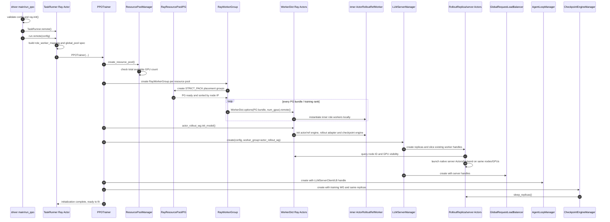
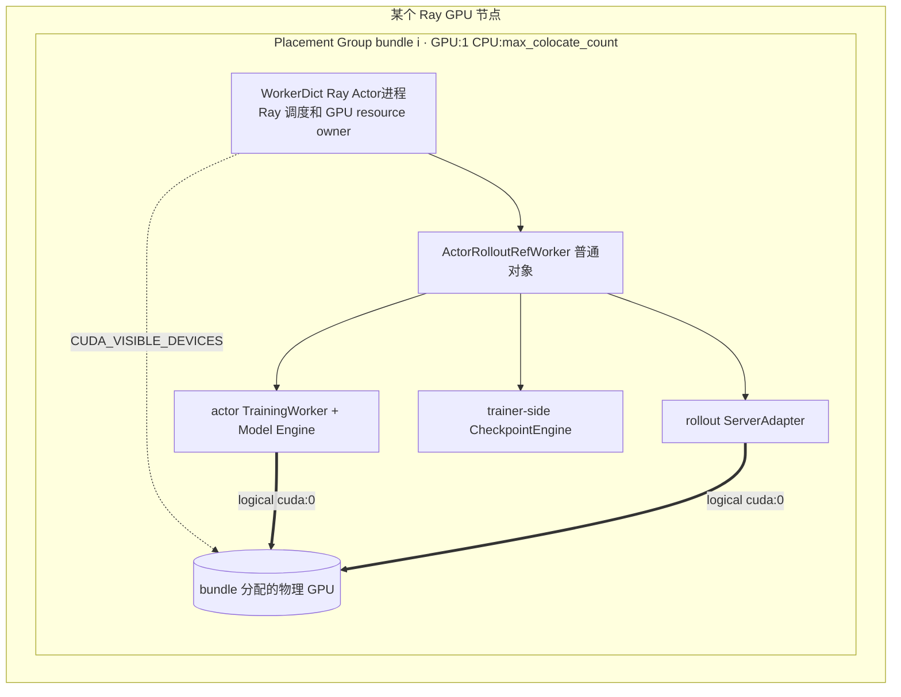
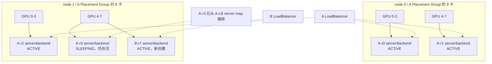
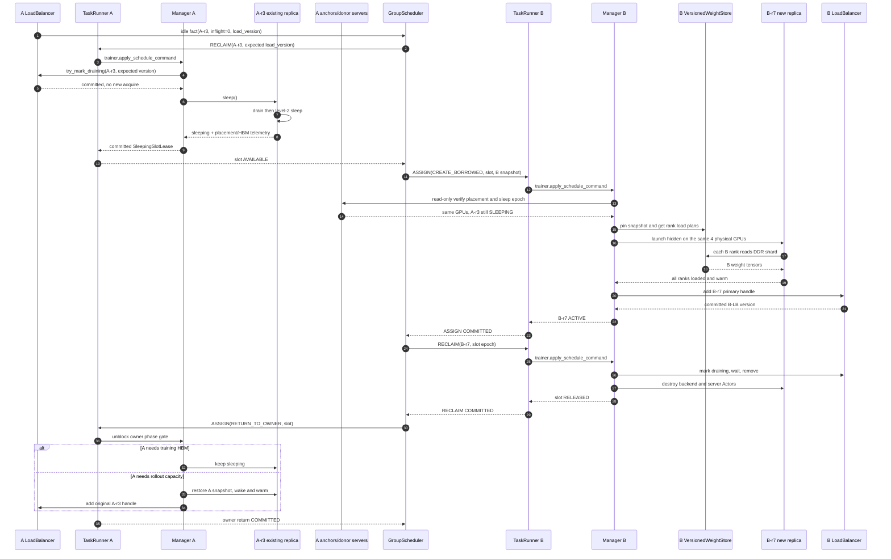
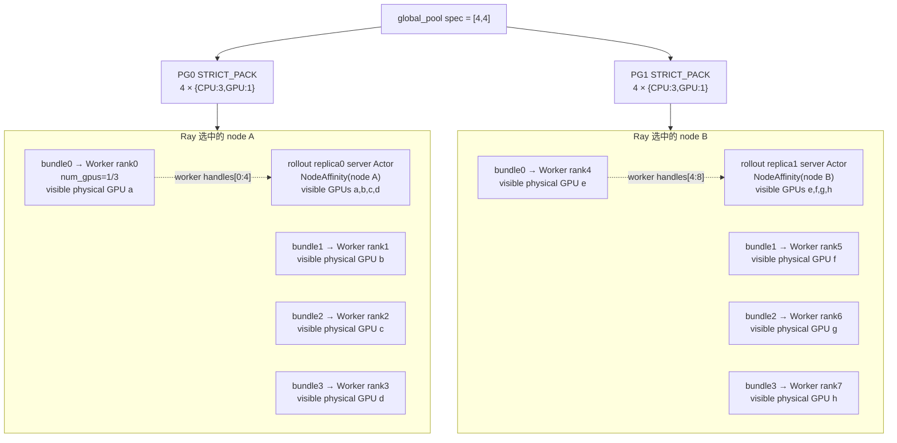
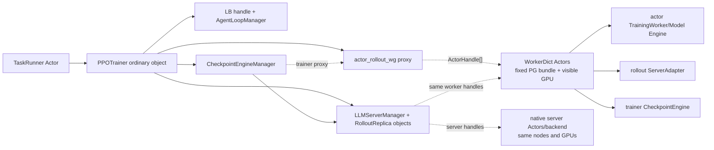

# verl v0.8.0 HYBRID 初始化与训练运行期动态扩容

> 状态：待评审。
> 代码基线：`/Users/nyp/Documents/verl`，tag `v0.8.0`，commit `7aed6b23`。
> 除第 7.4 节外，本文描述 `RolloutMode.HYBRID` 的现有代码事实；第 7.4 节在这些代码边界上给出
> 多任务共享场景的训练运行期动态扩容目标设计，所有新增类和接口均明确归属子仓或候选上游扩展点。

## 1. 先给出结论

HYBRID 初始化不是“启动一个同时做训练和推理的 Ray Actor”这么简单，而是分成两层：

1. 每个训练 rank 对应一个 `WorkerDict` Ray Actor。Ray 通过 Placement Group bundle 把它调度到某个节点，
   并给它分配一个 GPU 的可见性；`ActorRolloutRefWorker`、actor `TrainingWorker`、训练 Model Engine、
   rollout `ServerAdapter` 和 trainer-side `CheckpointEngine` 都是在这个 Ray Actor 进程内创建的普通对象。
2. native vLLM/SGLang/TRT-LLM server 仍然是独立 Ray Actor/第三方 runtime。它不重新申请一套 rollout GPU，
   而是从上述 training workers 查询节点和设备信息，再在相同节点上复用同一组 GPU。

因此需要区分：

| 名称 | 实际类型 | 是否单独进程 |
|---|---|---|
| policy actor/model | `TrainingWorker` + Model Engine 普通对象 | 否，位于 `WorkerDict` Actor 进程内 |
| `ActorRolloutRefWorker` | `WorkerDict` 内层普通对象 | 否 |
| training worker | 动态生成的 `WorkerDict` Ray Actor | 是，每个 rank 一个进程 |
| rollout adapter | `ServerAdapter` 普通对象 | 否，位于 training worker 进程内 |
| native inference server | vLLM/SGLang/TRT-LLM server Ray Actor | 是 |
| inference backend workers | backend 创建的 runtime/子进程 | 是或由 backend 管理 |

## 2. 初始化总调用链



主入口位于：

- `main()`：`verl/trainer/main_ppo_sync.py:1843-1866`；
- `run_ppo()`：`verl/trainer/main_ppo.py:52-103`；
- `TaskRunner.run()`：`verl/trainer/main_ppo_sync.py:1818-1840`；
- `PPOTrainer.init_workers()`：`verl/trainer/main_ppo_sync.py:599-742`。

## 3. 阶段一：driver 和 TaskRunner

### 3.1 driver 初始化 Ray

`main_ppo_sync.main()` 先进行设备类型和配置校验，然后调用 `run_ppo(config,
task_runner_class=TaskRunner)`。`run_ppo()` 在 Ray 尚未初始化时：

1. 合并默认 runtime env 与 `config.ray_kwargs.ray_init.runtime_env`；
2. TransferQueue 启用时添加 `TRANSFER_QUEUE_ENABLE=1`；
3. 调用 `ray.init(...)` 加入或创建 Ray 集群；
4. 调用 `TaskRunner.remote()` 创建 controller Actor；
5. 调用并同步等待 `ray.get(runner.run.remote(config))`。

对应代码：`verl/trainer/main_ppo.py:61-102`。

`TaskRunner` 本身没有 GPU 请求，因此 Ray 只需要为它找到满足默认 CPU 资源的节点。它不是决定 training
workers 落在哪些 GPU 节点上的组件。

### 3.2 TaskRunner 建立角色和资源规格

`TaskRunner.run()` 依次执行：

1. `add_actor_rollout_worker()`：把 `Role.ActorRollout` 或 `Role.ActorRolloutRef` 映射到
   `ray.remote(ActorRolloutRefWorker)`，并映射到 `global_pool`；
2. 可选地把 critic 映射到同一个 `global_pool`；
3. `init_resource_pool_mgr()`：生成 `global_pool` 规格；
4. 在 TaskRunner Actor 进程内构造普通对象 `PPOTrainer`；
5. 调用 `trainer.init_workers()`。

角色注册位于 `verl/trainer/main_ppo_sync.py:1764-1779`，资源规格位于
`verl/trainer/main_ppo_sync.py:1781-1816`。

主资源规格为：

```python
{"global_pool": [n_gpus_per_node] * nnodes}
```

例如 `nnodes=2, n_gpus_per_node=4` 得到 `{"global_pool": [4, 4]}`。列表元素表达每个目标节点需要放置
多少个 GPU worker，但此时还没有绑定到具体 node ID 或 IP。

## 4. 阶段二：从资源规格到 Placement Group

### 4.1 ResourcePoolManager 只先构造逻辑资源池

`PPOTrainer.init_workers()` 首先调用 `ResourcePoolManager.create_resource_pool()`。每个资源规格被转换成
`RayResourcePool`：

- `process_on_nodes=[4, 4]`；
- `use_gpu=True`；
- `max_colocate_count` 默认是 3；
- `name_prefix="global_pool"`。

代码位于 `verl/single_controller/ray/base.py:181-217`。

随后 `_check_resource_available()` 读取 Ray 集群各节点的可用资源，但这里只比较**集群 GPU 总数**与需求总数，
不在这一阶段确定具体节点，也不验证每个节点分别有几张卡；代码位于
`verl/single_controller/ray/base.py:223-239`。

### 4.2 RayWorkerGroup 触发真正的 PG 创建

`PPOTrainer` 按 resource pool 聚合 role classes，然后：

1. 通过 `create_colocated_worker_cls(class_dict)` 生成动态 `WorkerDict` Ray class；
2. 构造 `RayWorkerGroup(resource_pool=..., ray_cls_with_init=...)`；
3. `RayWorkerGroup._init_with_resource_pool()` 调用 `resource_pool.get_placement_groups()`。

调用代码：`verl/trainer/main_ppo_sync.py:609-663`。

`RayResourcePool.get_placement_groups()` 为 `process_on_nodes` 的每个元素创建一个 PG。每个 PG 包含
`process_count` 个相同 bundle，每个 bundle 为：

```python
{"CPU": max_colocate_count, "GPU": 1}
```

HYBRID training 路径默认使用 `STRICT_PACK`，所以一个 PG 的所有 bundles 必须放在同一个 Ray node；两个
PG 可以被放到两个不同节点。创建后同步等待全部 `pg.ready()`，再按 node IP 排序。代码位于：

- bundle 和 PG 创建：`verl/single_controller/ray/base.py:130-160`；
- `STRICT_PACK` 选择与等待使用：`verl/single_controller/ray/base.py:536-579`。

### 4.3 节点是谁选的

节点由 Ray Placement Group scheduler 选择，不是 verl 用 `node_id` 手工指定。约束来自：

- 每个 bundle 需要 1 个 GPU；
- 每个 PG 必须 `STRICT_PACK` 到单节点；
- PG 内 bundle 数量等于 `n_gpus_per_node`；
- 集群当时的可用资源。

只有 PG ready 以后，bundle 才已经对应到具体节点和物理 GPU。verl 后续通过 PG 和 worker runtime context
反查这些结果。

## 5. 阶段三：training Ray Actor 如何拉起并绑定 GPU

### 5.1 真正被 Ray 拉起的是 WorkerDict

`TaskRunner` 最初注册的是 `ray.remote(ActorRolloutRefWorker)`，但 `PPOTrainer` 不会直接为每个 rank 创建
该 Actor。`create_colocated_worker_cls()` 会：

1. 定义一个动态 `WorkerDict` class；
2. 在 `WorkerDict.__init__()` 内把各 role class 解包为普通 class；
3. 直接实例化 `ActorRolloutRefWorker`、可选 critic 等内层对象；
4. 最后只对外层 `WorkerDict` 调用 `ray.remote()`。

代码位于 `verl/single_controller/ray/base.py:985-1027`。

所以运行时拓扑是：



### 5.2 一个 rank 如何指定到某个 bundle

`RayWorkerGroup._init_with_resource_pool()` 遍历排序后的 PG：

- `pg_idx` 表示节点对应的 PG 序号；
- `local_rank` 遍历 `0..n_gpus_per_node-1`；
- 全局 `rank` 连续递增；
- rank 0 先在第一个 PG 的 bundle 0 上创建 master address/port；
- 每个 `(pg, local_rank)` 调用一次 `_create_worker()`。

代码位于 `verl/single_controller/ray/base.py:536-579`。

`_create_worker()` 写入以下关键环境变量：

| 环境变量 | 来源/含义 |
|---|---|
| `WORLD_SIZE` | resource pool 的总 worker 数 |
| `RANK` | 当前全局 training rank |
| `RAY_LOCAL_WORLD_SIZE` | 每个目标节点上的 worker 数，rollout adapter 会使用 |
| `MASTER_ADDR/MASTER_PORT` | rank 0 所在 PG 中临时任务提供的 rendezvous 地址 |
| `WG_PREFIX/WG_BACKEND` | verl WorkerGroup 元信息 |

然后调用：

```text
RayClassWithInitArgs(
  placement_group=pg,
  placement_group_bundle_idx=local_rank,
  use_gpu=True,
  num_gpus=1 / max_colocate_count
)
```

代码位于 `verl/single_controller/ray/base.py:621-680`。

### 5.3 Placement Group 约束和 num_gpus 各自做什么

`RayClassWithInitArgs.__call__()` 同时设置：

1. `PlacementGroupSchedulingStrategy(placement_group=pg, bundle_index=local_rank)`：强制 Actor 消耗指定 PG
   bundle 的资源，因此固定到该 bundle 所在节点和 GPU；
2. `num_gpus=1/max_colocate_count`：从该 bundle 的 1 个 GPU resource 中记账一部分。

代码位于 `verl/single_controller/ray/base.py:366-413`。

需要注意：fractional `num_gpus` 只是 Ray 调度资源记账，不表示 CUDA 或模型只能使用相同比例的显存。
实际显存占用仍由 training engine、offload、rollout sleep/wake 和 backend 自己控制。PG 本身已经从集群层面
预留整个 `GPU:1` bundle。

### 5.4 物理 GPU 与逻辑 cuda:0

正常 CUDA 路径下，Ray 根据 Actor 分配到的 GPU 设置 `CUDA_VISIBLE_DEVICES`。每个 training Actor 通常只看见
一张物理卡，因此进程内部 PyTorch 设备编号为逻辑 `cuda:0`；不同 Actor 的 `cuda:0` 可以映射到不同物理 GPU。

`Worker.__init__()`：

1. 规范化 CUDA/HIP/ROCR visible-device 环境；
2. 读取 `WORLD_SIZE/RANK/MASTER_ADDR/MASTER_PORT`；
3. 当前 Ray 运行方式下 `LOCAL_RANK` 默认是 0；
4. 把这些值写回 Worker 元数据和进程环境。

代码位于 `verl/single_controller/base/worker.py:181-216,231-294`。

随后内层 `TrainingWorker` 调用 `initialize_global_process_group_ray()`，使用全局 `RANK/WORLD_SIZE` 建立
Gloo+NCCL process group；FSDP 等 engine 使用 `get_device_id()` 取得当前逻辑设备。对应代码：

- process group：`verl/workers/engine_workers.py:83-134`、`verl/utils/distributed.py:80-96`；
- 当前设备 ID：`verl/utils/device.py:107-113`；
- FSDP 将模型绑定到当前设备的示例：`verl/workers/engine/fsdp/transformer_impl.py:392-404`。

如果显式设置 `RAY_EXPERIMENTAL_NOSET_*_VISIBLE_DEVICES`，Worker 会从 Ray runtime context 读取 accelerator
ID，并显式设置 `LOCAL_RANK` 和 torch current device；这是另一条兼容分支，代码位于
`verl/single_controller/base/worker.py:273-281`。

## 6. 阶段四：Worker 进程内初始化 policy actor 和 rollout adapter

`PPOTrainer` 从 `spawn()` 返回的多个 role proxy 中取得 `actor_rollout_wg`，然后调用
`actor_rollout_wg.init_model()`。proxy 把调用分发到同一批 `WorkerDict` Actor handles，最终执行内层
`ActorRolloutRefWorker.init_model()`。代码位于：

- proxy 产生和方法重绑定：`verl/single_controller/ray/base.py:716-749`；
- 调用入口：`verl/trainer/main_ppo_sync.py:674-677`；
- 内层初始化：`verl/workers/engine_workers.py:499-632`。

每个 worker rank 内按以下顺序创建：

1. 可选 reference `TrainingWorker`，并调用 `reset()`；
2. actor `TrainingWorker`，创建所选 FSDP/Megatron/AutoModel/VeOmni/TorchTitan engine，再调用 `reset()`；
3. rollout device mesh `(dp, infer_tp, infer_pp)`；
4. 根据 rollout backend 创建本地 `ServerAdapter`；
5. 创建 trainer-side `CheckpointEngine`；
6. 清理 CUDA cache，为随后启动的 native inference backend 腾出可见显存。

`TrainingWorker.__init__()` 创建 distributed process group 和 engine；`reset()` 才调用
`engine.initialize()` 真正构造模型、优化器等，代码位于 `verl/workers/engine_workers.py:76-170`。

以 FSDP 为例，`initialize()` 调用 `_build_model_optimizer()`、创建 checkpoint manager，并按 offload 配置移动
模型/优化器；代码位于 `verl/workers/engine/fsdp/transformer_impl.py:183-209`。

## 7. 阶段五：创建 HYBRID rollout replicas

### 7.1 LLMServerManager 复用 training worker handles

training workers 完成 `init_model()` 后，`PPOTrainer` 才创建：

```python
LLMServerManager.create(
    config=config,
    worker_group=actor_rollout_wg,
    rollout_resource_pool=actor_rollout_resource_pool,
)
```

因为传入了 `worker_group`，manager 进入 HYBRID 分支。它计算单个 rollout replica footprint 和
`num_replicas`，创建普通 `RolloutReplica` 对象，再并发调用 `init_hybrid()`。代码位于
`verl/workers/rollout/llm_server.py:257-325`。

未启用 P/D disaggregation 时：

```text
rollout_world_size = TP × DP × PP
num_replicas = training_worker_group.world_size / rollout_world_size
```

每个 replica 只切片已有 handles：

```text
workers[replica_rank * rollout_world_size : (replica_rank + 1) * rollout_world_size]
```

它不会创建新的 rollout resource pool 或 `CheckpointEngineWorker`。代码位于
`verl/workers/rollout/replica.py:107-141`。

### 7.2 vLLM/SGLang server 如何复用节点和 GPU

vLLM 和 SGLang 的基本步骤相同：

1. 对 replica 内每个 training Worker handle 发起 RPC，查询 node ID 和设备可见信息；
2. 按 node 切分 workers 和 GPU IDs；
3. 每个 node 创建一个 server Ray Actor；
4. server 使用硬 `NodeAffinitySchedulingStrategy(node_id, soft=False)` 固定到 worker 所在节点；
5. server Actor 本身不传 `num_gpus`，并设置 `RAY_EXPERIMENTAL_NOSET_*_VISIBLE_DEVICES=1`；
6. 构造 server 时手工写入从 training workers 收集到的 visible devices；
7. server 再创建 vLLM/SGLang backend runtime。

vLLM 对应代码：

- worker node/GPU 查询：`verl/workers/rollout/vllm_rollout/vllm_async_server.py:976-989`；
- NodeAffinity 和 server Actor 创建：`verl/workers/rollout/vllm_rollout/vllm_async_server.py:991-1034`；
- 多节点 server 启动与地址获取：`verl/workers/rollout/vllm_rollout/vllm_async_server.py:1036-1054`；
- server 写入 visible devices：`verl/workers/rollout/vllm_rollout/vllm_async_server.py:91-140`。

SGLang 对应代码：`verl/workers/rollout/sglang_rollout/async_sglang_server.py:721-828`，visible devices 写入位于
`verl/workers/rollout/sglang_rollout/async_sglang_server.py:126-164`。

这是一种“复用设备”而不是“Ray 再分配设备”：native server/backend 使用 training PG 已经占住的 GPU，
server Actor 不额外消耗 Ray GPU resource。

### 7.3 TRT-LLM 的 HYBRID 特例

TRT-LLM 在 `LLMServerManager` 中调用名为 `init_hybrid_colocated()` 的 helper，但该 helper 明确设置
`rollout_mode=HYBRID`；这里不是第三种部署模式。它额外保存 training `RayResourcePool` 和当前 replica 对应的
bundle indices，以便 TRT-LLM 内部 Ray executor 精确复用 PG bundles。

代码位置：

- HYBRID 分支选择：`verl/workers/rollout/llm_server.py:314-323`；
- helper：`verl/workers/rollout/replica.py:143-157`；
- PG/bundle 映射：`verl/workers/rollout/trtllm_rollout/trtllm_async_server.py:505-567`；
- server 和内部 engine 启动：`verl/workers/rollout/trtllm_rollout/trtllm_async_server.py:569-629`、
  `verl/workers/rollout/trtllm_rollout/trtllm_async_server.py:184-318`。

### 7.4 donor replica sleep 后在同卡创建 receiver replica

#### 7.4.1 目标和边界

本节只讨论如下确定场景：任务 A 初始化时占用 2 个节点、每节点 8 卡，每个 rollout replica 使用 4 卡。某个
时刻 A 的 replica `A-r3` 已经没有 in-flight request，GS 命令 A 将它从 A 的 LB 摘流并执行 `sleep()`；
`A-r3` 的原 vLLM server Actors/backend、training Worker Actors 和 Placement Group 都保留，但 4 张物理卡上
由其权重和 KV cache 占用的 HBM 被释放。GS 随后把这组卡的**临时 HBM 使用权**分配给任务 B；B 在完全相同的
4 张物理卡上新建 `B-r7` 的 vLLM backend/HTTP server，从 B 的 DDR snapshot 装载权重，最后加入 B 的 LB。

因此转移的不是 Ray GPU resource、Placement Group bundle 或 training worker ownership，而是由 GS 管理的
`SleepingInferenceSlotLease`：它证明 A 的原实例已经摘流、drain、sleep，并在 A 下次需要这些卡之前，授权 B
占用这 4 卡的可用 HBM。睡眠中的 `A-r3` 与运行中的 `B-r7` 会在一段时间内同时保留 server Actor/backend
进程，但同一时刻只有 B 的模型权重和 KV cache 可以驻留在这部分 HBM。

完整的借出链路是：

```text
A-r3 idle observation
  → GS 对 A 下发 RECLAIM(A-r3)
  → A-LB 原子摘流、drain、A-r3.sleep()
  → A 返回 SleepingInferenceSlotLease(4 physical GPUs)
  → GS 对 B 下发 ASSIGN(B-r7, slot lease, B snapshot)
  → B 在同卡隐藏创建 vLLM replica/server
  → B-r7 从 B 的 DDR 快照装载并校验权重
  → warmup 后最后加入 B-LB
  → B 返回实际提交结果，GS 再提交 allocation
```

##### 精确控制链路

本方案应统一表述为：

> GS 经 donor TaskRunner 命令 donor `MultiTaskLLMServerManager` 将空闲 replica 摘流并 sleep；donor manager
> 根据该 replica 的 worker binding 生成同卡 HBM slot；GS 再经 borrower TaskRunner 命令 borrower
> `MultiTaskLLMServerManager`，根据这个 slot 在相同物理 GPU 上创建新的 vLLM replica/HTTP server，加载
> borrower 权重并加入 borrower LB。

这里的“GS 指示 manager”是逻辑关系，不是直接 Python/Ray 调用。两个 manager 都是各自 TaskRunner 进程内的
普通对象，完整调用链必须是：

```text
donor 空闲与借出：
donor LB
  → GroupScheduler
  → donor TaskRunner.apply_schedule_command(RECLAIM)
  → donor MultiTaskPPOTrainer.apply_schedule_command()
  → donor MultiTaskLLMServerManager
  → donor LB 摘流、replica.sleep()、生成 slot
  → 原路径返回 GroupScheduler

borrower 创建与接流：
GroupScheduler
  → borrower TaskRunner.apply_schedule_command(ASSIGN)
  → borrower MultiTaskPPOTrainer.apply_schedule_command()
  → borrower MultiTaskLLMServerManager
  → 创建 vLLM replica 和 HTTP server
  → borrower DDR snapshot 加载、校验、warmup
  → borrower LB.add_servers(primary_server_handle)
  → 原路径返回 GroupScheduler
```

donor manager 在 sleep 完成后返回的不是简单的“4 张空闲卡”，而是
`SleepingInferenceSlotLease`。其中至少包含原 replica 的有序 WorkerDict ActorHandles、node/GPU IDs、
PG/bundle provenance、拓扑、sleep/lease epoch、HBM telemetry 和归还 deadline。borrower 使用这些 handles
做 placement 和存活校验，但不调用 donor worker 内的 `ServerAdapter`、训练方法或 checkpoint 通道；donor 的
ResourcePool、WorkerGroup、Placement Group 和原 replica ownership 始终不变。

在假设每个 4 卡 replica 都位于单节点内时，借出后的实体关系如下；A 的 PG 和 16 个 training Worker Actors
完全没有变化：



图中的 `A-r3` 和 `B-r7` 使用同一组 physical GPUs，但 A-r3 只保留进程/runtime，B-r7 才持有本轮可服务的
weights/KV cache。若 A 的 4 卡 replica 跨节点，slot placements 和 B-r7 也必须使用完全相同的跨节点拓扑。

“实时扩容”表示不必等 step boundary，但并不表示任何时刻都能创建。至少要同时满足：

- A-LB 已原子阻止 `A-r3` 接收新请求，已有请求为零，且 `sleep()` 已完成；
- A 的 training thread 尚未进入需要这 4 卡 HBM 的阶段，并受 slot lease/fence 约束；
- slot 恰好覆盖 B 所需的完整 `TP×DP×PP` footprint，拓扑和显存预算兼容；
- B 当前 phase 仍允许新增 rollout capacity；
- 目标 `WeightSnapshotRef` 与当前 generation 的 policy version 完全一致；
- 扩容事务从校验到 B-LB commit 期间没有被新的 phase epoch、session epoch 或 slot lease epoch 淘汰。

#### 7.4.2 sleep 释放的是 HBM，不改变 Ray 资源归属

原生 `vLLMReplica.sleep()` 先在 primary server 上等待请求 drain，再让各 node-level server 执行 sleep，见
`verl/workers/rollout/vllm_rollout/vllm_async_server.py:1056-1060`。HYBRID 全量权重场景最终调用
`engine.sleep(level=2)`；代码注释明确该路径释放 weights 和 KV cache，见同文件 `:928-947` 以及
`verl/checkpoint_engine/base.py:431-439`。

该方案要求 donor rollout 配置 `free_cache_engine=true` 且 vLLM `enable_sleep_mode=true`。前者在
`verl/workers/config/rollout.py:196` 默认开启，后者在同文件 `:276` 默认开启；server 在
`verl/workers/rollout/vllm_rollout/vllm_async_server.py:625-632` 会在 `free_cache_engine=false` 时直接跳过
sleep。manager 必须把“sleep 实际释放成功”作为 slot commit 条件，不能只把 RPC 正常返回当作成功。

但 sleep 不会做以下事情：

- 不会从 `GlobalRequestLoadBalancer` 删除 server；
- 不会销毁 vLLM server Actor/backend；
- 不会销毁 training Worker Actor 或改变它的 Placement Group bundle；
- 不会把 Ray 视角下的 GPU ownership 从 A 转给 B；
- 不保证 GPU 上所有字节都归零，CUDA context、runtime 和 sleeping backend 仍可能保留固定开销。

所以“`A-r3` 已空闲”只是触发条件，不是可复用承诺。A 的 manager 必须先通过带
`expected_server_load_version` 的 LB 操作把 `A-r3` 标记为 DRAINING 并禁止新 acquire，确认 inflight 为零后才
调用 `sleep()`。sleep 返回后还要读取实际 free/used HBM telemetry；只有满足 B 的模型、KV cache 和安全余量预算，
才生成 `SleepingInferenceSlotLease`。原生 `remove_servers()` 只是直接删除条目，并不提供 compare-and-set、drain
状态或 HBM 证明，因此这里需要子仓的扩展 LB/manager 事务。

#### 7.4.3 为什么不能复用 donor 的 ServerAdapter

verl v0.8.0 的原生 HYBRID 初始化把 training workers 按连续 slice 分给 rollout replicas。每个 training worker
里的 `ServerAdapter` 在 `init_model()` 时就固定了 replica rank、server actor name 和 ZMQ 权重通道。因此，
动态借来的 GPU 即使附带 donor task 的 worker handles，也不能复用 donor 的 `ServerAdapter`：

- donor adapter 只认识 donor 的 server name 和 replica rank；
- donor adapter 连接的是 donor 的权重发送通道；
- 接收任务不能加入 donor 的训练进程组，也不能把 donor 权重装进自己的 rollout replica；
- 训练侧在 rollout 期间可能不可用，不能要求接收任务的 training workers 参与一次即时同步。

在本设计中，A 的 worker Actor handles 只作为**物理放置和存活锚点**：B 的 manager 通过它们确认 node ID、
physical accelerator ID 和 slot lease 所覆盖的设备，但不调用 A 的 `ServerAdapter`。`B-r7` 从 B 已经提交的
DDR 权重快照直接执行 DDR→HBM 装载。A 的原 `A-r3`、adapter 和 checkpoint 关系全部保持不变，以便资源归还
后恢复原实例。

这仍属于项目对 HYBRID 共享卡模式的扩展，不新增第三种公开 `RolloutMode`；区别只是新 replica 的首次权重来源
由“本地 training adapter 推送”改为“版本化快照拉取”。

原生约束可在以下代码中看到：

- adapter 的 replica rank、server name 和 ZMQ 路径：
  `verl/workers/rollout/vllm_rollout/vllm_rollout.py:77-108,119-153,169-200`；
- replica 从 worker handles 查询 node/GPU 并创建 server：
  `verl/workers/rollout/vllm_rollout/vllm_async_server.py:968-1054`；
- vLLM worker 的当前 IPC 权重加载入口：
  `verl/workers/rollout/vllm_rollout/utils.py:197-288`。

#### 7.4.4 控制命令和 sleeping slot 描述

GS 不能只传一个 node ID。A 执行 `RECLAIM(A-r3)` 成功后返回的核心对象应是：

```python
SleepingInferenceSlotLease(
    lease_id=...,
    lease_epoch=...,
    owner_task_id="A",
    owner_session_id=...,
    sleeping_replica_id="A-r3",
    owner_phase_epoch=...,
    topology=ReplicaTopology(tp=4, dp=1, pp=1),
    ordered_placement_anchors=[worker_actor_handle, ...],
    placements=[
        GpuPlacement(
            rank_indices=[...],
            node_id=...,
            accelerator_ids=[...],
            placement_group_id=...,
            bundle_indices=[...],
        ),
    ],
    donor_server_handles=[...],       # 仍存活，但已从 A-LB 摘流并 sleep
    measured_free_hbm_bytes=[...],
    hbm_safety_margin_bytes=...,
    reclaim_deadline=...,
)
```

GS 再把这份不可变 slot lease 放入给 B 的 `ASSIGN`：

```python
AssignCommand(
    decision_id=...,
    task_id=...,
    session_id=...,
    scheduler_epoch=...,
    expected_task_state_version=...,
    target_phase_epoch=...,
    replica_id=...,
    topology=ReplicaTopology(tp=..., dp=..., pp=...),
    sleeping_slot_lease=...,
    weight_snapshot=WeightSnapshotRef(
        task_id=...,
        session_id=...,
        policy_version=...,
        model_fingerprint=...,
        manifest_id=...,
        content_digest=...,
        store_backend=...,
        weight_format_version=...,
    ),
    deadline=...,
)
```

slot 必须恰好覆盖 B 的完整 replica footprint，且所有 device 唯一。`ordered_placement_anchors` 不是权重通道，而是让
B 验证并定位仍被 A 的 placement group 占住的物理卡。GS 只能转发 A manager 已实际提交的 slot lease，不能根据
idle event 自行构造；lease 有效期间，A 的 `fit()` 在进入会使用这些 GPU HBM 的 phase 前必须等待 slot 归还或
触发 B 的限时 RECLAIM。

#### 7.4.5 子仓中的实现分层

| 组件 | 类型 | 动态扩容职责 |
|---|---|---|
| `GroupScheduler` | 单例 Ray Actor | 先让 A 摘流/sleep，再把 A 实际返回的 slot lease 分配给 B；维护借出、占用和归还状态 |
| `MultiTaskTaskRunner` | 每任务 Ray Actor | 持有 GS handle；接收、去重和 fence 命令，再调用 trainer 窄接口；不持有 manager |
| A 的 `MultiTaskPPOTrainer` | TaskRunner A 内普通对象 | 在训练进入需占用 HBM 的 phase 前检查 outstanding slot leases；必要时要求 GS 回收并等待归还 |
| A 的 `MultiTaskLLMServerManager` | trainer A 持有的普通对象 | A-LB 摘流、drain、sleep 原 replica，测量 HBM并发布 slot；归还后恢复同一个原 replica |
| B 的 `MultiTaskPPOTrainer` | TaskRunner B 内普通对象 | 冻结 B 的 phase/policy snapshot，委托 B manager 创建动态 replica |
| B 的 `MultiTaskLLMServerManager` | trainer B 持有的普通对象 | 校验 slot、创建/装载 B replica、B-LB commit、回滚、销毁和归还 slot |
| `MultiTaskVLLMReplica` | B manager 内普通对象 | 根据显式 slot placements 在 A 的 node/GPU 上启动和销毁全部 B node-level server Actors |
| `MultiTaskVLLMHttpServer` | 每节点 Ray Actor | 使用 deferred/dummy weight 初始化 backend；在加入 LB 前保持不可路由 |
| `MultiTaskVLLMWorkerExtension` | vLLM worker 进程内扩展对象 | 接收 collective RPC，按 manifest/load plan 把本 rank 的 DDR shard 装进 HBM并返回校验结果 |
| `VersionedWeightStore/WeightSnapshotLoader` | 子仓数据面组件 | pin immutable snapshot，生成 rank load plan，执行/验证 DDR→HBM 装载 |
| A/B `GlobalRequestLoadBalancer` | 每任务 Ray Actor | A-LB 负责原子摘流，B-LB 只在新 replica ready 后接流；二者不互相引用 |

建议让 `MultiTaskLLMServerManager` 在构造原生 manager 前设置自定义 replica class，动态路径直接构造
`MultiTaskVLLMReplica`。自定义 replica 覆盖 server actor 的创建逻辑，使用自定义 HTTP server/worker extension；
这样 PoC 的大部分逻辑可以留在子仓。若上游不允许注入 server class 或 worker extension FQN，再向 verl 提交最小
factory hook，而不是把 GS 协议写进 verl。

由于 `worker_extension_cls` 最终由 vLLM backend 子进程按 FQN import，子仓必须以 wheel/环境依赖安装到所有
Ray 节点，或通过统一 runtime env 发布；只在 controller 的本地 `PYTHONPATH` 中可见不够。自定义 server Actor
启动时也要继承 store client 所需的 endpoint、认证和网络配置，但不能携带可变 tensor 数据。

`MultiTaskTaskRunner` 只新增 `self.group_scheduler`、不可变 `self.task_context`、`self._trainer`、endpoint
状态和保护这些引用的锁；不新增 `self.manager`、replica 或 LB 成员。`self._trainer` 只是让 command thread 调用
trainer 的窄接口，manager 仍只有 trainer 一个 owner。A/B 的命令分别走各自 TaskRunner，GS 不跨过
TaskRunner 直接调用任一 manager：

```text
RECLAIM A: GS → TaskRunner A → trainer A → manager A → A-LB/A-r3.sleep
ASSIGN B:  GS → TaskRunner B → trainer B → manager B → create B-r7 → B-LB
RECLAIM B: GS → TaskRunner B → trainer B → manager B → B-LB/destroy B-r7
RETURN A:  GS → TaskRunner A → trainer A → manager A → release phase gate/optional wake A-r3
```

这里有一个必须实现的 controller 改造：v0.8.0 的 `TaskRunner.run()` 是覆盖整个训练周期的同步方法，且 trainer
只是局部变量；默认单并发 Actor 在 `run()` 返回前无法处理 GS RPC。`MultiTaskTaskRunner` 必须是 threaded Ray
Actor，把 `run`、`heartbeat`、`apply_schedule_command` 分到 `training/heartbeat/command` concurrency groups，
其中 command group 的并发度为 1。当前 `TaskRunner` 符号已经被 `@ray.remote` 包装，子仓不能直接把它当普通
Python class 继承；PoC 需要在子仓复制最小 controller 编排，RFC 则应让 verl 导出未 remote 的
`TaskRunnerImpl`，再由不同 recipe 选择 Ray 包装参数。当前代码位于
`verl/trainer/main_ppo_sync.py:1756-1841`。

同一任务的 lifecycle 命令还要在 manager 内串行；training thread 只在短临界区发布 phase/policy snapshot，
heartbeat thread 只读取不可变的 committed snapshot，因此二者都不应被长时间 server launch 阻塞。

#### 7.4.6 能否使用 donor 的 ResourcePool 和 WorkerGroup

结论是：**复用 donor ResourcePool 已绑定的物理节点/GPU，以及 donor 原 replica 选中的 Worker Actor handles；
不共享 donor 的 `RayResourcePool`/`RayWorkerGroup` Python 对象，也不把这些对象安装成 B 的本地资源管理器。**

| donor 侧实体 | B 是否直接使用 | 原因与用法 |
|---|---|---|
| `RayResourcePool` 普通对象 | 否 | 对象只存在于 TaskRunner A 进程，保存 A 的资源规格和 PG handles；B 不应创建、删除或修改 A 的 PG |
| A 的 Placement Groups | 物理上复用，逻辑上不重新申请 | GPU 仍被 A 的 PG 保留；B server Actor 沿用原生 HYBRID 方法，以 NodeAffinity 落到相同节点，不向 Ray 再申请 GPU bundle |
| `RayWorkerGroup` 普通对象 | 否 | 它是 A controller 内的 proxy，包含 A 的 world size、rank dispatch、method binding 和全部 16 个 worker handles |
| `A-r3.workers` 中的 4 个 `WorkerDict` ActorHandle | 是，只读 | 作为强引用、存活探针和 node/GPU placement anchors；B 不调用其中的 A `ServerAdapter` 或训练方法 |
| A worker 内的 policy/adapter/process group | 否 | 全部属于 A 的 rank、权重和通信域，B 不能加入或重绑定 |
| `SubRayResourcePool` / `init_colocated()` | 否 | 会把问题变成在 A PG 内创建另一组 rollout workers，并改变 rollout mode/资源记账，不是本场景的 vLLM HYBRID server 启动路径 |

代码依据如下：

- `RayResourcePool` 只是 controller 进程内普通对象，`get_placement_groups()` 创建并缓存 `self.pgs`：
  `verl/single_controller/ray/base.py:112-160`；
- `RayWorkerGroup` 保存 `_workers` 并通过 `workers` property 暴露 ActorHandle 列表：
  `verl/single_controller/ray/base.py:416-520,899-905`；
- 原生 `RolloutReplica.init_hybrid()` 并不使用 ResourcePool，而是按
  `replica_rank × world_size` 从 `worker_group.workers` 切一段 handles：
  `verl/workers/rollout/replica.py:131-141`；
- vLLM launch 对这些 handles 发 `__ray_call__` 查询 node ID/accelerator ID，然后以 hard NodeAffinity 和显式
  visible devices 创建 server Actor；`.options()` 没有请求 `num_gpus` 或指定 donor PG：
  `verl/workers/rollout/vllm_rollout/vllm_async_server.py:968-1054`。

这意味着 B-r7 对 Ray GPU resource accounting 是不可见的：Ray 不会替项目阻止第二个 receiver 再使用同一组卡。
slot 的唯一占用、lease epoch、donor phase gate 和回收顺序必须由 GS/两个 manager 保证；不能把 NodeAffinity
成功或 server Actor 创建成功当作资源互斥证明。

##### A. donor 初始化时保存精确 binding

假设 A rollout `TP×DP×PP=4`，training WorkerGroup world size 为 16。原生初始化会得到 4 个 replicas：

```text
A-r0 ← A worker handles[0:4]
A-r1 ← A worker handles[4:8]
A-r2 ← A worker handles[8:12]
A-r3 ← A worker handles[12:16]
```

A manager 应在初始化时把每个 replica 的**有序** binding 保存进 committed snapshot：

```text
replica_id
ordered_worker_actor_handles[]
node_id / accelerator_id per handle
placement_group_id / bundle_index per handle
server_actor_handles[]
```

slot 必须保留 `A-r3.workers` 的稳定顺序，因为它记录了 donor rank 与物理卡的原始关系。B manager 再根据 B 的
TP/DP/PP 生成显式 `receiver_rank_anchors`；在本例同节点 4 卡、拓扑相同时就是原顺序。sleep 时不能只上报
`node_id + {GPU ids}` 后按字符串重新排序，否则跨节点 TP/PP 或非连续 GPU 场景可能得到错误 rank topology；
若 A 的物理分布不满足 B 的 topology，ASSIGN 必须拒绝。PG/bundle 信息是 ownership provenance 和对账字段，
vLLM 创建 B server 时不直接消费它。

##### B. donor sleep 后形成 handle-based slot

A-r3 完成 A-LB 摘流和 sleep 后，A manager 从自己的 canonical binding 生成 slot：

```python
slot = SleepingInferenceSlotLease(
    ...,
    ordered_placement_anchors=tuple(a_r3.workers),
    placement_group_ids=(...),
    bundle_indices=(...),
    node_and_accelerator_ids=(...),
    donor_sleep_epoch=...,
)
```

Ray ActorHandle 可以随 TaskRunner→GS→TaskRunner B 的 Ray RPC 参数传递；这只给 B 增加对 A Worker Actors 的
强引用，不会转移 actor ownership、PG ownership 或训练进程组成员关系。A session 失效时，这些 handles 也必须
被 slot fencing 判为失效。

##### C. B 不调用原生 `init_hybrid(donor_worker_group)`

不能直接把整个 A WorkerGroup 传给下面的原生接口：

```python
await replica.init_hybrid(donor_worker_group)
```

原因有三点：

1. `RayWorkerGroup` 是 A TaskRunner 进程内 proxy，不是 Ray Actor；GS 设计中也不保存这个普通对象；
2. `init_hybrid()` 根据 B 的 `replica_rank` 对全部 A workers 做切片。若 B 的动态 rank 是 7，会读取
   `workers[28:32]`，得到空列表；
3. 即使人为把 rank 改成 0，它仍会让“B 使用 A WorkerGroup”成为错误的 ownership 表达，并诱导后续代码通过
   A 的 method binding、adapter 或 checkpoint 通道做操作。

可以用 `RayWorkerGroup.from_detached(worker_handles=selected_handles)` 在 B 本地构造只含 4 个 handles 的 proxy，
但这只适合作为兼容 shim；它不会创建新 workers，也不能解决 `replica_rank` 切片和权重通道问题。正式接口应直接
接收 ordered handles。方法名中的 `from_detached` 也不会把 A 的非 detached workers 改成 detached lifetime；
A owner/session 失效后，这个本地 proxy 不能继续使用。该 helper 位于
`verl/single_controller/ray/base.py:687-714`。

##### D. 推荐新增 `init_borrowed()`，复用原生 launch

子仓的 `MultiTaskVLLMReplica` 继承 `vLLMReplica`，新增一个不做 WorkerGroup slice 的入口：

```python
class MultiTaskVLLMReplica(vLLMReplica):
    def __init__(self, *, replica_rank, config, model_config, name_suffix):
        super().__init__(
            replica_rank=replica_rank,
            config=config,
            model_config=model_config,
            name_suffix=name_suffix,
        )
        self.server_class = ray.remote(MultiTaskVLLMHttpServer)

    async def init_borrowed(self, slot, receiver_rank_anchors):
        self.rollout_mode = RolloutMode.HYBRID
        self.borrowed_slot = slot
        self.workers = list(receiver_rank_anchors)
        assert len(self.workers) == self.world_size
        await self.launch_servers()
```

这里仍复用 `vLLMReplica.launch_servers()` 的 node/GPU 查询、NodeAffinity、多节点 rendezvous、server readiness 和
primary address/handle 收集；只替换三点：

- handles 由 B 根据 slot 生成显式 receiver-rank mapping，不按 B replica rank 从 A WorkerGroup 切片；
- `name_suffix` 至少包含 B task/session/replica，避免与 A server actor 名称冲突；
- `server_class` 使用 B 的 `MultiTaskVLLMHttpServer`，其 worker extension 从 B 的 DDR snapshot 装载权重。

原生 `vLLMHttpServer.collective_rpc()` 在
`verl/workers/rollout/vllm_rollout/vllm_async_server.py:191-203` 只 `await` engine 调用而没有返回 rank results。
因此自定义 server 还需要提供 `load_snapshot_from_store()`：内部调用 engine collective RPC，并把每个 rank 的
version/digest/tensor count 回传 manager；不能仅复用原 wrapper 后假设已经取得校验回执。

如果上游愿意提供通用扩展点，可把它收敛为
`RolloutReplica.init_hybrid_with_workers(worker_handles, replica_identity)`；其中 handles 已按 receiver rank
排序。该接口不接受
其他任务的 ResourcePool/WorkerGroup，也不包含 GS 协议类型。

##### E. B 侧具体创建调用链

```text
Manager B.assign_borrowed_replica(command)
  1. validate slot/session/epoch/HBM/topology and build receiver_rank_anchors
  2. create MultiTaskVLLMReplica(B dynamic rank, B config, unique suffix)
  3. await replica.init_borrowed(slot, receiver_rank_anchors)
       ├─ query A-r3 WorkerDict handles for node/GPU
       ├─ create B server Actors with NodeAffinity, no Ray GPU request
       ├─ pass the same 4 handles to B server only as topology anchors
       ├─ launch B vLLM backend on those physical devices
       └─ obtain B primary HTTP address/ActorHandle
  4. pin B WeightSnapshotRef and collective DDR→HBM load
  5. verify all B ranks and warmup
  6. B-LB.add_servers({stable_B_replica_id: B_primary_handle})
  7. publish B replica ACTIVE and return committed result
```

因此可以概括为：**B 使用 A WorkerGroup 中选出的 handles，但不使用 A WorkerGroup；B 复用 A ResourcePool
已经占住的卡，但不使用 A ResourcePool 对象。**

##### F. 为什么不能全部绕过 ResourcePool/PG，只使用 node ID 和 GPU ID

`node_id + accelerator_id` 只能表达“希望把进程放在哪里”，不能表达“资源已经被谁预留、能否整组获得、生命周期
归谁管理”。verl 初始化仍然需要 ResourcePool/Placement Group，原因包括：

1. **资源预留**：PG bundle 向 Ray 申请 GPU/CPU 逻辑资源，防止其他正常 Ray workload 再申请同一份资源；
2. **gang scheduling**：TP/PP 等多个 ranks 在整组资源 ready 后再启动，避免只拉起部分 ranks 后永久等待；
3. **稳定 ownership**：Worker Actor 与 PG/bundle、任务 session 建立生命周期关系，便于退出和节点故障清理；
4. **统一基础记账**：WorkerGroup、Ray scheduler、autoscaler 和初始化可行性检查共享同一份物理资源视图；
5. **设备可见性**：Worker 从 Ray runtime 获得实际 accelerator IDs，避免把宿主机、容器、MIG 或逻辑设备编号
   混为同一个 GPU ID。

HYBRID vLLM server 使用 NodeAffinity 和显式 visible devices 是建立在上述 ownership 已经存在的前提上。由于
training Worker 已占住 PG GPU，server 再向 Ray 申请一份完整 GPU 会造成重复申请，所以它只复用 handles 查询
物理位置，并绕过第二次 GPU resource request。这个特例不能反推为“所有组件都不需要 PG”。

如果完全绕过 PG、所有组件都按 node/GPU ID 手工启动，就必须在 Ray scheduler 之外重新实现 GPU 锁、整组预留、
故障恢复和 gang scheduling，并会产生以下风险：

- 多个任务或多个 receiver 同时选择同一张 GPU；
- 多卡 replica 只成功启动部分 ranks，其他 ranks 等待或超时；
- Ray 仍把手工占用的 GPU 判断为可分配，继续向其调度 workload；
- node/container 重建后原 GPU ID 指向不同设备；
- owner 退出后遗留 server/backend、socket 或 HBM 占用；
- Ray autoscaler、资源可行性检查、配额和计费全部看到错误利用率。

##### G. 当前共享卡方案确实存在三张不同的视图

当 A-r3 sleep、B-r7 在同卡接流后，三张视图分别是：

| 权威视图 | 看到的状态 | 负责回答的问题 |
|---|---|---|
| Ray/PG resource view | 4 张 GPU 仍属于任务 A 的 PG/Workers | 物理 GPU 和 Worker 生命周期由谁拥有 |
| GS HBM slot ledger | 这 4 卡的可用 HBM lease 当前分配给 B-r7 | 此刻谁被授权占用 sleeping replica 释放的 HBM |
| B/A LoadBalancer view | A-r3 不可路由，B-r7 可路由 | 哪些 server 当前可以接收请求 |

因此当前状态是：

```text
physical/Ray ownership = A
temporary HBM usage right = B
serving traffic ownership = B-LB
```

这是一种有意设计的分层，不要求三张表内容完全相同；但必须明确各自权威范围，并以相同
`task/session/replica/slot epoch` 关联。任何组件都不能只看其中一张视图推导另外两张视图。

##### H. 视图错位会造成的具体问题

| 错位情况 | 后果 |
|---|---|
| Ray 仍显示 A owner，A 未检查 GS slot 就进入训练 | A training 与 B-r7 同时占 HBM，导致 OOM、CUDA/NCCL 冲突或 B 请求失败 |
| B-LB 已 remove，但 B backend 尚未销毁 | 流量已经停止但 HBM/runtime 仍占用；GS 过早归还 slot 后 A 仍可能 OOM |
| B-r7 在 B-LB ACTIVE，但 GS slot 已过期或归还 | B 继续接流，同时 A 可能开始训练或 wake A-r3 |
| GS slot 分给 B，但 B-LB commit 实际失败 | GS 账本虚增 serving capacity，资源被占住却不能处理请求 |
| A owner session 退出，B-LB 仍保留 B-r7 | donor PG/anchors 失效，B 请求被路由到即将失败或已经失效的 backend |
| B-r7 不申请 Ray GPU，GS 又把同卡 slot 分给 C | Ray 不会阻止重叠创建，最终发生显存争抢和不可预测故障 |
| 计费只读取 Ray 或只读取 LB | GPU 成本记在 A、服务收益记在 B，公平性、配额和利用率统计失真 |

特别地，LB remove 只证明“不再接收新流量”，不证明 backend 已销毁或 HBM 已释放；`sleep()` 只证明 vLLM 已
执行显存释放动作，不改变 Ray ownership；Ray PG ownership 也不证明该 GPU 当前没有 borrower backend。

##### I. 三视图之间的强制提交顺序

借出时必须按以下顺序推进：

```text
A-LB: ACTIVE → DRAINING → removed
→ A-r3: drain → sleep
→ GS slot: DONOR_PREPARING → AVAILABLE
→ B-r7: create → load B snapshot → verify → warmup
→ B-LB: add B-r7
→ GS slot: AVAILABLE → ASSIGNED_TO_B
```

归还时必须反向收敛：

```text
B-LB: ACTIVE → DRAINING → removed
→ B-r7: drain → destroy backend/server Actors
→ telemetry: confirm HBM released
→ GS slot: ASSIGNED_TO_B → OWNER_AVAILABLE
→ A trainer: release phase gate
→ A 按 phase 进入训练，或恢复 A-r3 后重新加入 A-LB
```

关键不变量是：

- B-r7 未从 B-LB 摘流、销毁并确认释放 HBM前，A 不能进入使用这些 GPU 的训练，也不能 wake A-r3；
- B-r7 未完成权重校验和 B-LB commit 前，GS 不能把计划容量计为已服务容量；
- owner A 的 session/PG/anchors 失效时，GS 必须停止续租并优先回收 B-r7；
- 因为 B-r7 对 Ray GPU accounting 不可见，GS slot CAS 是防止同卡重复 borrower 的唯一资源互斥点。

#### 7.4.7 完整的 sleep、借用、创建和归还事务

两个任务分别维护状态，GS 维护它们之间的 slot 关联：

```text
A-r3: ACTIVE → DRAINING → SLEEPING → LENT
                                  ↘ OWNER_AVAILABLE → ACTIVE（需要恢复推理时）

B-r7: RECEIVED → VALIDATING → STARTING → LOADING → WARMING
               → COMMITTING_B_LB → ACTIVE → DRAINING → DESTROYING → RELEASED
```

##### A. A 将原 replica sleep 并产生 slot

1. A-LB 发现 `A-r3` 对当前 generation 已 input-exhausted 且 inflight 为零，只向 GS 上报带
   `server_load_version` 的 idle fact；此时 `A-r3` 仍在 A-LB 中。
2. GS 根据 A 的 phase、B 的需求和预计可借时长，对 A 下发 `RECLAIM(A-r3,
   expected_server_load_version)`。
3. TaskRunner A 做 session/state/decision fence，调用 trainer A，再由 manager A 执行事务。
4. manager A 调用扩展 A-LB 的 `try_mark_draining()`。只有 server 仍为 ACTIVE、load version 未变化且 inflight
   仍为零才成功；成功后新 acquire 不再选择 `A-r3`。一次旧 idle 事件不能跳过这次 CAS。
5. manager A 调用原 `A-r3.sleep()`。replica 会再次等待请求 drain，然后让各 node-level server sleep。
   full-weight HYBRID 通常使用 level 2，释放 weights 和 KV cache，但保留 server/backend 进程。
6. manager A 查询 4 张卡的实际 node/device、sleep generation、HBM 可用量和原 server handles，发布
   `SleepingInferenceSlotLease`；trainer A 同时登记 outstanding lease，使 `fit()` 在进入需要这些卡 HBM 的
   training/update phase 前必须等待归还。
7. A 将 committed slot 返回 GS；GS 只有此时才把 slot 状态从 `DONOR_PREPARING` 改为 `AVAILABLE`。

##### B. B 在相同 4 卡上创建新的 vLLM replica

8. GS 对 B 下发 `ASSIGN(materialization=CREATE_BORROWED, slot, B WeightSnapshotRef)`。TaskRunner B、trainer B
   和 manager B 依次检查 decision、task/session、scheduler epoch、phase epoch 和 state version。
9. manager B 对 A 的 placement anchors 发只读 RPC，核对实际 node ID/accelerator IDs；再校验 slot 仍为当前
   lease epoch、A 原 server 仍处于 SLEEPING、4 卡没有被其他 receiver 占用、B 的 `TP×DP×PP` 正好为 4，且
   measured free HBM 能覆盖 B 的模型、KV cache、CUDA graph 和安全余量。
10. B 的 loader pin 当前 generation 的 committed snapshot，校验 model fingerprint、dtype、tensor layout 和
    TP/PP sharding，并生成每个 vLLM rank 的 load plan。
11. `MultiTaskVLLMReplica` 按 slot placements 创建 B 的 server Actors：使用 hard NodeAffinity 固定到 A 的节点，
    显式设置同一组 physical accelerator IDs，不申请新的 Ray GPU bundle。A 的 sleeping server Actors 继续存在；
    B 的 actor name、端口、NCCL rendezvous 和 IPC key 必须包含 `B task/session/replica`，不能与 A 冲突。
12. B backend 以 dummy/deferred weights 启动，但保持隐藏。manager B 调用自定义 server 的
    `load_snapshot_from_store()`；server 内部再执行 engine collective RPC，让每个 B vLLM rank 从 DDR 读取自己的
    shard、装入 HBM并返回逐 rank receipt。
    该路径不调用 A/B training worker 的 `ServerAdapter`，也不加入 A 的训练进程组。
13. manager B 聚合所有 rank 返回的 policy version、content digest、model fingerprint、tensor/byte count；全部
    一致后执行 warmup，并再次 fence A 的 slot epoch、A owner phase epoch、B phase epoch 和 deadline。
14. manager B 先写 `PREPARED`，最后才把 `B-r7` primary server ActorHandle 加入 B-LB，再发布 `ACTIVE` 和
    immutable manager snapshot。现有 `LLMServerClient` 每次请求都会向 B-LB acquire，因此无需通知已有
    AgentLoopWorkers。
15. B 把实际 server IDs、slot lease、loaded snapshot digest、B-LB version 和 manager state version返回 GS；
    GS 再把 slot 从 `AVAILABLE` 提交为 `ASSIGNED_TO_B`。

##### C. B 释放 slot，A 收回 HBM 使用权

16. A 即将进入 training/update phase、lease deadline 到达或调度策略决定归还时，GS 对 B 下发
    `RECLAIM(B-r7, slot_lease_epoch, expected_B_LB_version)`。
17. manager B 先在 B-LB 原子标记 DRAINING，等待 in-flight requests 归零并 remove；随后**销毁** `B-r7` 的
    vLLM backend 和全部 server Actors、释放 snapshot pin，并确认 4 卡 HBM 已释放。这里只让 B sleep 不够，
    因为 A 后续还要训练或恢复原 inference backend，继续保留 B backend 会积累 CUDA/runtime 开销和冲突风险。
18. B 返回 `RELEASED`；GS 把 slot 归还 owner A，并对 A 下发
    `ASSIGN(materialization=RETURN_TO_OWNER, slot)`，唤醒 trainer A 中等待该 lease 的条件变量。
19. 如果 A 接下来进入训练，`A-r3` 继续保持 sleep，A 的 training workers 使用归还的 HBM；如果 A 仍需 rollout
    capacity，则 manager A 恢复同一个 `A-r3`。由于 full-weight level-2 sleep 可能丢弃权重，恢复前必须验证或
    重新装载 A 当前 committed snapshot，warmup 后再把原 primary handle 加回 A-LB，不能假设一次 `wake_up()`
    自动得到正确版本。

当前 server 的 collective RPC 位于
`verl/workers/rollout/vllm_rollout/vllm_async_server.py:191-203`；worker extension 的 IPC load 和
`model.load_weights()` 语义位于 `verl/workers/rollout/vllm_rollout/utils.py:197-288`。B 的扩展复用 model
load/post-load 语义，但把数据源替换为版本化 DDR store。

完整时序如下：



#### 7.4.8 失败、超时和恢复语义

LB 注册是最重要的原子性边界：

- **A-LB 摘流后、A sleep 失败**：A manager 尝试恢复原 replica 并重新加入 A-LB，不发布 slot；GS 仍把资源记在
  A 名下，不能继续向 B 下发 ASSIGN。
- **A 已发布 slot、B-LB 注册前失败**：终止 B 已启动的 backend/server，释放 B snapshot pin，确认 HBM 已释放，
  再把 slot 归还 A；A-r3 在归还确认前保持 sleep。
- **LB 注册请求超时**：不能直接重建。manager 先按稳定 replica ID 查询 LB 和本地事务；若实际已经注册，继续
  完成 `ACTIVE` 发布并返回原结果，否则才重试同一个 commit。
- **LB 已注册、manager 发布前抛错，但 TaskRunner 仍存活**：manager 根据调用 LB 前已写入的 `PREPARED`
  内存记录对照 LB membership，补交 `ACTIVE`；若决定回滚，则先 drain/remove，再清理实例。
- **TaskRunner B 进程崩溃**：GS fence B 的旧 session，核对/终止 B server Actors 并确认 HBM 释放后才能把 slot
  归还 A。基础 LB 不是 detached actor，不能当成跨 TaskRunner 重启的 durable journal。
- **TaskRunner A 进程崩溃**：slot owner session 失效；GS 停止给 B 续租并回收 B-r7，不能把 A 的旧 worker/server
  handles 继续当成稳定 placement anchors。
- **LB 注册后发现故障**：必须先从 LB 移除并等待 in-flight requests drain，再销毁 backend；不能先 kill server。
- **A 已到 training phase、B 仍有请求**：A 的 phase gate 必须继续阻塞。按命令中的 drain policy 等待或中止 B
  请求；只有 B backend 已销毁且 HBM telemetry 确认释放后，A 才能启动会占用这些卡的训练操作。
- **GS 调用超时**：相同 `decision_id` 的重试查询原事务。TaskRunner 超时不等同于 manager 子事务被取消。

若一个 `ASSIGN` 包含多个 replicas，建议每个 replica 使用独立子事务，返回逐 replica 结果；GS 只提交成功项，
失败项归还对应 slots，避免一个慢实例让已成功实例失去容量。

#### 7.4.9 与 CheckpointEngineManager 的关系

`CheckpointEngineManager.add_replicas()` 只会扩展其 replica 列表，代码位于
`verl/checkpoint_engine/base.py:414-420`；它本身不能解决动态 replica 的首次权重来源。更不能在 rollout 期间
调用原生 `update_weights()` 强制 training workers 参与同步，这与“训练侧权重当时可能不可用”的前提冲突。

因此本场景的职责划分是：

- **A-r3**：仍是 A 初始化时创建的原 replica，继续保留在 A 的 manager/CEM 中；sleep 借出时不能从 A CEM
  删除，也不能把它登记给 B。A manager 直接调用目标 `A-r3.sleep()`，不能使用会影响全部 replicas 的
  `CheckpointEngineManager.sleep_replicas()`。
- **B-r7 首次装载和版本正确性**：以 `VersionedWeightStore + WeightSnapshotLoader` 为数据面；不能借用 A 的
  adapter，也不能依赖 B training workers 在扩容时可用。
- **B-r7 生命周期 canonical state**：只由 B 的 `MultiTaskLLMServerManager` 维护。即使后续为兼容接口把它加入
  B CEM bookkeeping，也不能让原生 `update_weights()` 覆盖其已验证的 DDR 版本。
- **slot 归还**：先把 B-r7 从 B-LB 摘流并销毁，再由 A 根据自身 phase 决定保持 A-r3 sleep、用 HBM 训练，或
  恢复 A-r3。CEM 不能跳过 GS slot fence 直接 wake A-r3。

#### 7.4.10 需要复用和扩展的 verl 接口

| 能力 | v0.8.0 现状 | 动态扩容处理 |
|---|---|---|
| donor replica sleep | `vLLMReplica.sleep()` 已有 drain + server sleep | 复用；外层必须先从 donor LB 原子摘流并在完成后发布 slot |
| sleeping 状态/HBM 证明 | 原生没有跨任务 slot 结果 | 子仓新增 sleep epoch、placement、HBM telemetry 和 slot lease |
| donor ResourcePool/WorkerGroup | controller 内普通对象，绑定 donor PG、rank 和 method dispatch | 不跨任务传对象；slot 只传原 replica 的有序 WorkerDict ActorHandles 与 PG/bundle provenance |
| 按 worker 拓扑启动 vLLM | `vLLMReplica.launch_servers()` 已有 | 复用编排思路；子仓新增接受 `SleepingInferenceSlotLease` 的 replica 实现 |
| 指定 node/GPU | 已使用 NodeAffinity 和显式 visible devices | 复用，但来源改为 A 的 slot placements 并做二次校验 |
| vLLM rank 广播调用 | server 有 `collective_rpc()`，但当前 wrapper 不返回 rank results | 自定义 server 新增可返回逐 rank load receipt 的 DDR snapshot 方法 |
| vLLM model load/post-load | worker extension 已有 IPC load | 复用模型装载语义；替换数据源和版本校验 |
| LB 动态增加 server | `add_servers()` 已有 | PoC 可复用；RFC 建议增加稳定 ID、CAS 和查询接口 |
| LB 安全摘流 | `remove_servers()` 直接删除，无 CAS/draining | 子仓扩展 `try_mark_draining(expected_load_version)`、wait-drain、remove |
| client 发现新实例 | 每次请求都调用 LB `acquire_server()` | 直接复用，无需通知 client/AgentLoopWorker |
| 动态 replica 生命周期 | 原生 manager 只在初始化时创建固定 replicas | 子仓 `MultiTaskLLMServerManager` 新增事务状态机、幂等、回滚和恢复 |
| 运行期首次权重装载 | 原生依赖 training adapter/checkpoint engine | 子仓新增 versioned DDR snapshot loader |
| 动态关闭 server/backend | 原生缺少完整事务化 shutdown | 优先子仓封装；若 backend 无法可靠释放资源，再补最小上游 hook |
| donor training phase gate | 原生 trainer 不知道 slot 被其他任务占用 | `MultiTaskPPOTrainer` 在进入用卡 phase 前等待 outstanding slot 归还 |

实现时最先验证的垂直切片应是：A-r3 从 A-LB 摘流并 level-2 sleep、生成单节点 4 卡 slot、B-r7 在相同卡上
从固定 DDR snapshot 装载、加入 B-LB、完成真实 rollout 请求、从 B-LB 摘流并销毁、确认 HBM 释放、slot
归还 A。该闭环跑通后，再扩展跨节点 TP/PP、批量 slots 和崩溃恢复；这不会改变上述控制面和 commit 边界。

## 8. 阶段六：请求面和权重控制面收尾

server replicas 启动完成后，初始化继续：

1. `LLMServerManager` 收集每个 replica 的 primary server handle/address；
2. 创建唯一 `GlobalRequestLoadBalancer` Ray Actor；
3. 创建 `LLMServerClient` 普通对象；
4. 创建 `AgentLoopManagerTQ` 和多个 `AgentLoopWorkerTQ` CPU Ray Actors；
5. 创建 `CheckpointEngineManager(trainer=actor_rollout_wg, replicas=同一批 replica 对象)`；
6. 调用 `sleep_replicas()`，让 rollout backend 释放权重/KV cache，为 checkpoint load 和训练阶段准备显存；
7. 标记初始化结束，进入 `fit()`。

代码位于：

- LB 和 client：`verl/workers/rollout/llm_server.py:327-355`；
- PPOTrainer 收尾：`verl/trainer/main_ppo_sync.py:711-742`；
- CheckpointEngineManager sleep：`verl/checkpoint_engine/base.py:431-439`。

本地 `ServerAdapter` 创建时 native server 尚未存在，因此采用 lazy lookup：需要执行控制/权重操作时，
rank leader 根据约定的 Ray Actor name 调用 `ray.get_actor()` 获取 server handle。vLLM 示例位于
`verl/workers/rollout/vllm_rollout/vllm_rollout.py:119-152`。

## 9. 节点和 GPU 绑定示例

假设：

```text
trainer.nnodes = 2
trainer.n_gpus_per_node = 4
rollout TP = 4, DP = 1, PP = 1
ResourcePoolManager.max_colocate_count = 3
```

初始化结果为：



此例中：

- training world size 为 8；
- rollout world size 为 4；
- `num_replicas=2`；
- replica 0 复用 ranks 0～3，replica 1 复用 ranks 4～7；
- 每个 Worker 进程内部通常使用逻辑 `cuda:0`，但分别映射到物理 a～h；
- server Actor 与 Worker PID 不同，但 server/backend 的可见 GPU 集合来自对应 workers；
- `num_gpus=1/3` 不限制模型只能使用三分之一显存。

如果 `TP×DP×PP=8`，则只有一个 replica，它跨两个节点，vLLM/SGLang 会在每个节点各启动一个 server Actor，
由 node-rank 0 暴露 primary address。

## 10. 初始化后的最终状态



初始化完成时，training Actor、rollout adapter、server/backend 都已经创建，但 rollout replicas 已被
`sleep_replicas()` 切到释放显存的状态。后续训练/生成阶段通过 checkpoint manager 和 server adapter 执行
sleep、wake、权重更新和上下文切换。

## 11. 对后续多任务设计最重要的现有边界

1. **节点/GPU owner 是 training PG 和 WorkerDict Actor**。HYBRID replica 没有独立 rollout pool。
2. **policy actor 不是可单独迁移的 Ray Actor**。它是 WorkerDict 进程内的普通对象。
3. **`RolloutReplica` 只持有 handles**。它不能改变已有 Worker Actor 的 PG/bundle 绑定。
4. **server 扩缩与 training worker 扩缩不是同一操作**。原生启动路径要求一组已存在且拓扑匹配的
   training worker handles/GPU；第 7.4 节把借入 worker handles 限定为 placement anchors，并另建 DDR 权重路径。
5. **Ray GPU resource 与显存生命周期不同**。PG/`num_gpus` 决定调度和可见性；sleep/wake/offload 决定
   HBM 是否真正可用。
6. **native server 的 GPU 复用绕过额外 Ray GPU 申请**。健康检查和回收必须同时考虑 server Actor、backend
   runtime 以及其依赖的 training Worker Actor。

这些代码边界也是第 7.4 节动态扩容事务和最小上游扩展点的依据。

## 12. 关键初始化实体源码索引

| 初始化实体/动作 | 类型 | 代码位置 |
|---|---|---|
| `main()` | driver 函数 | `verl/trainer/main_ppo_sync.py:1843-1866` |
| `run_ppo()`/创建并等待 TaskRunner | driver 函数 | `verl/trainer/main_ppo.py:52-108` |
| `TaskRunner` | Ray Actor | `verl/trainer/main_ppo_sync.py:1756-1840` |
| `PPOTrainer`/`init_workers()` | TaskRunner 内普通对象 | `verl/trainer/main_ppo_sync.py:501-742` |
| `ResourcePoolManager` | controller 普通对象 | `verl/single_controller/ray/base.py:181-239` |
| `RayResourcePool`/创建 PG | controller 普通对象 + Ray PG | `verl/single_controller/ray/base.py:112-160` |
| `RayClassWithInitArgs`/Actor options | controller 普通对象 | `verl/single_controller/ray/base.py:336-413` |
| `RayWorkerGroup`/逐 bundle 创建 worker | controller proxy | `verl/single_controller/ray/base.py:416-680` |
| `create_colocated_worker_cls()`/`WorkerDict` | 动态 class/Ray Actor | `verl/single_controller/ray/base.py:985-1027` |
| `Worker` 环境与设备初始化 | WorkerDict 及内层 worker 基类 | `verl/single_controller/base/worker.py:168-308` |
| `ActorRolloutRefWorker`/`init_model()` | WorkerDict 内普通对象 | `verl/workers/engine_workers.py:434-632` |
| actor/ref `TrainingWorker` | WorkerDict 内普通对象 | `verl/workers/engine_workers.py:76-170` |
| `LLMServerManager` | PPOTrainer 内普通对象 | `verl/workers/rollout/llm_server.py:223-363` |
| `RolloutReplica.init_hybrid()` | PPOTrainer 内普通对象 | `verl/workers/rollout/replica.py:70-157` |
| vLLM server launch | server Ray Actors | `verl/workers/rollout/vllm_rollout/vllm_async_server.py:952-1054` |
| SGLang server launch | server Ray Actors | `verl/workers/rollout/sglang_rollout/async_sglang_server.py:721-828` |
| TRT-LLM server launch | server Ray Actor + inner runtime | `verl/workers/rollout/trtllm_rollout/trtllm_async_server.py:484-629` |
| `GlobalRequestLoadBalancer`/client | Ray Actor/普通对象 | `verl/workers/rollout/llm_server.py:43-220` |
| `AgentLoopManagerTQ`/workers | 普通对象/CPU Ray Actors | `verl/trainer/main_ppo_sync.py:297-490` |
| `CheckpointEngineManager` | PPOTrainer 内普通对象 | `verl/checkpoint_engine/base.py:345-515` |
