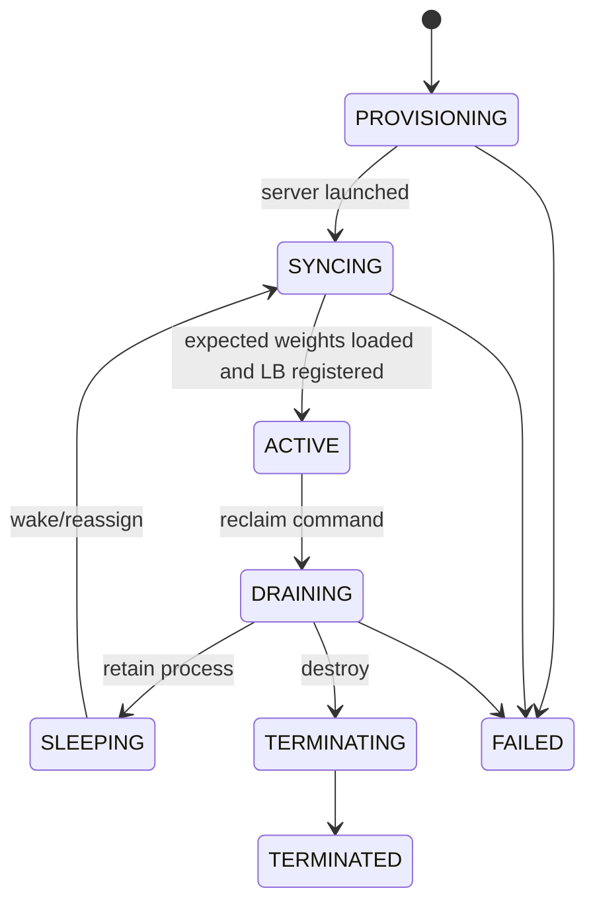

# MultiTaskLLMServerManager 详细设计

> 本文下钻 [`04-multitask-hybrid-runtime-design.md`](./04-multitask-hybrid-runtime-design.md) 中的任务级
> 执行器，描述它如何扩展 verl v0.8.0 `LLMServerManager`，以及 rollout 中实时增删推理实例的边界。
> 版本化 DDR snapshot 的对象和存储生命周期见
> [`08-versioned-ddr-weight-store.md`](./08-versioned-ddr-weight-store.md)。

## 1. 职责

`MultiTaskLLMServerManager` 继承 verl `LLMServerManager`，但不承担全局策略：

- 管理本任务 `RolloutReplica` 的生命周期；
- 维护 replica、server address/handle、load balancer 和 checkpoint manager 的一致状态；
- 通过 trainer 窄接口接收 TaskRunner 转交的命令，并发布 immutable committed snapshot；
- 通过 `WeightSnapshotLoader` 让新 replica 从版本化 DDR snapshot 直接加载到 HBM，并校验 policy
  version/content digest；
- 对重复、过期或不可执行的命令返回确定结果。

manager 不持有 GS handle，也不是 Ray Actor。GS 不直接操作 vLLM server；命令经
GS→TaskRunner→trainer 到达 manager。请求仍通过原
`LLMServerClient → GlobalRequestLoadBalancer → vLLMHttpServer` 链路；扩展 LB 单独持有 GS handle
并直接上报空闲事实。

## 2. 类结构草案

```python
class MultiTaskLLMServerManager(LLMServerManager):
    # 初始化阶段继承父类 create，使用本任务 worker group 创建初始 replicas。
    def bind_checkpoint_manager(self, checkpoint_manager) -> None: ...
    def bind_weight_snapshot_loader(self, loader) -> None: ...
    def apply_schedule_command(self, command) -> CommandResult: ...
    def on_phase_change(self, phase, policy_version, weight_snapshot_ref=None) -> None: ...
    def on_policy_version_committed(self, policy_version, snapshot_ref) -> None: ...

    async def provision_replicas(self, specs) -> list[ReplicaResult]: ...
    async def reclaim_replicas(self, replica_ids, drain_policy) -> list[ReplicaResult]: ...

    def publish_committed_snapshot(self) -> None: ...
    def get_committed_snapshot(self) -> TaskStateSnapshot: ...
    def rebuild_from_runtime(self) -> None: ...
```

内部至少维护：

```text
task_id / session_id / state_version / last_applied_decision_id
replicas_by_id
replica lifecycle states
server address/handle registry
worker leases/bindings
current policy_version / committed WeightSnapshotRef
replica loaded snapshot refs / content digests
checkpoint_manager / load_balancer / WeightSnapshotLoader references
lifecycle lock / immutable committed snapshot / command result cache
```

## 3. 初始化与注册

初始化阶段不执行跨任务共享：

```text
父类 LLMServerManager.create
→ 按本任务 actor_rollout_wg 和 TP/DP/PP 创建初始 replicas
→ 创建本任务 GlobalRequestLoadBalancer
   └─ 把 GS handle 和 TaskContext 注入 LB actor
→ MultiTaskPPOTrainer 创建 CheckpointEngineManager
→ bind_checkpoint_manager / bind_weight_snapshot_loader
→ sleep 初始 replicas
→ manager 发布实际 worker inventory、replica bindings 和 capabilities snapshot
→ TaskRunner 把自身 ActorHandle 与 snapshot 注册到 GS
→ trainer 发布初始 policy 到 DDR，并得到 committed WeightSnapshotRef
→ 已有 replicas 更新完成后，manager 发布 ROLLOUT_READY/policy_version/ref snapshot
```

GS 不返回初始 placement。注册中的 `base_instances` 严格大于 1，并与实际初始 replica 数一致；
它是原生规模和活动 ROLLOUT 的需求基线，不是永久不可借 ownership。TaskRunner 注册成功后资源进入
GS 全局共享 inventory；实际命令仍受 phase 与 GPU 安全条件限制，任务作为 receiver 接收可服务容量前
必须达到 `ROLLOUT_READY`。

## 4. 生命周期状态机



对 GS 而言，只有 `ACTIVE` replica 算作可服务容量；只有 `SLEEPING/TERMINATED` 且对应 worker lease 已释放后，worker 才能重新分配。

## 5. 实时扩容事务

```text
1. 校验 command 的 task/session/decision/state version
2. 校验完整 placement、worker lease，以及 ASSIGN 中的 committed WeightSnapshotRef 与当前 generation
3. 为 replica 分配全局唯一 id、rank 与 task/session name suffix
4. 用显式 worker handles 创建 RolloutReplica，优先使用 deferred-weight/empty-target 模式
5. 启动 vLLM server actors，但在权重校验前不接流
6. 将 replica 加入 CheckpointEngineManager
7. pin snapshot read lease，按 rank load plan 从 DDR 直接加载到 replica HBM
8. 所有 ranks 校验 expected_policy_version 和 content digest
9. warmup，并验证 server health
10. 最后 add_servers 到本任务 LB
11. 将 read lease 转为 active-replica pin，发布新 snapshot，回报实际 loaded version/ref/digest
```

为什么 LB 必须最后加入：一旦进入 LB，AgentLoopWorker 就可能把真实请求路由过去；尚未完成 DDR→HBM
加载或 digest 校验的 replica 会破坏 on-policy 正确性。训练侧只负责预先发布 snapshot，不参与第 7 步。

失败处理：

- 第 10 步前失败：清理已创建 server，释放 snapshot read lease 和 worker lease，不对外提供服务；
- LB add 失败：replica 保持非 ACTIVE，清理或进入可恢复状态；
- 部分 replica 成功：只回报实际 committed 集合，GS 重新规划剩余请求。

## 6. 实时缩容事务

```text
1. 校验 command 的 task/session/decision/state version 与目标 replica
2. 调用 LB `try_mark_draining(replica_id, expected_server_load_version)` 原子验证并摘流
3. 查询并处理 in-flight 请求
4. WAIT：等待自然完成；或 ABORT_AND_RESUME：中断并让请求重新路由
5. 从 CheckpointEngineManager 移除 replica
6a. deactivate：sleep，保留 server/process/binding
6b. destroy：graceful shutdown vLLM engine、Ray actor 和 mp 子进程
7. 清理 address/handle/name/IPC 资源
8. 释放该 replica 的 active snapshot pin
9. 释放 worker lease
10. 发布新 snapshot，回报 committed
```

普通 `remove_servers()` 只能停止未来路由，不能防止“GS 观察空闲后、命令到达前”的竞争 acquire；
因此需要版本化 `try_mark_draining`。摘流成功也不代表完整缩容。

## 7. activate/deactivate 与 create/destroy

必须区分两层能力：

| 能力 | 含义 | v0.8.0 可复用程度 |
|---|---|---|
| activate/deactivate | replica 已存在，只切 LB membership 和 sleep/wake | 较高；可参考 fully-async 实现 |
| create/destroy | 训练过程中创建/终止 server actor、vLLM mp worker 和绑定 | 较低；缺少通用 shutdown 和显式 placement API |

预创建 replica 的 activate/deactivate 只作为分阶段 PoC，用于先验证控制闭环；目标行为仍是在 rollout
尚未结束时真正动态 create/destroy。两者使用同一 GS 协议，但成本模型和 worker lease 状态不同。

## 8. TaskRunner 本地执行接口与 snapshot

manager 只暴露给 trainer，不直接与 GS 通信：

```python
def apply_schedule_command(self, command):
    with self.lifecycle_lock:
        self._validate_session_version_and_idempotency(command)
        result = self._apply_assign_or_reclaim(command)
        self._commit_runtime_state(result)
        self._committed_snapshot = self._build_immutable_snapshot()
        self._command_results[command.decision_id] = result
        return result.with_snapshot(self._committed_snapshot)

def get_committed_snapshot(self):
    return self._committed_snapshot
```

TaskRunner 的 command concurrency group 调用 trainer，再进入 `apply_schedule_command`；heartbeat
concurrency group 只读取 `_committed_snapshot`。长 create/destroy 期间 heartbeat 可以返回上一版 snapshot
和 pending 摘要，不能读取半提交列表。phase、policy snapshot ref 切换、已有 replica 更新与 command
共用同一生命周期锁或串行执行器。DDR store 的耗时 read 可以由事务内部异步执行，但 COMMIT/LB add
仍需在锁保护的版本复核后完成。

## 9. phase 与 policy version

manager 至少需要接收以下通知：

```text
on_phase_change(
    INITIALIZED | ROLLOUT_READY | ROLLOUT_RUNNING |
    ROLLOUT_DRAINED | WEIGHT_SYNC | TRAIN | EXITING
)
on_policy_version_committed(global_step, committed_weight_snapshot_ref)
```

新 replica 的 `expected_policy_version` 和 `WeightSnapshotRef` 来自命令，但最终必须由 manager/rollout
workers 校验实际 loaded version/digest。GS 可以检查元数据，不能替任务保证 tensor 已写入 HBM。

HYBRID 下 donor/receiver 的安全条件也不能只用 phase 字符串表达：worker lease 只有在训练计算、权重同步和 rollout server 都不会访问该 GPU 时才能转交。

`ROLLOUT_RUNNING` 中允许实时 ASSIGN/RECLAIM；`ROLLOUT_DRAINED` 开始收敛进行中的生命周期事务；
`WEIGHT_SYNC` 覆盖 HBM→DDR publish、当前 ref 切换和已有 replicas 更新，并冻结 CE 集合变化。TRAIN
阶段 LB 可以暂时无活跃 server，但下一次 ROLLOUT 前必须
恢复至少一个加载正确 policy version 的可路由 replica。

## 10. 需要向 verl 暴露的机制

子仓负责上述具体类；verl 只需提供通用机制：

1. 让 sync TaskRunner 通过 trainer FQN/factory 选择 `MultiTaskPPOTrainer`；
2. 在 sync trainer 中注入自定义 LLMServerManager class；
3. 注入自定义 GlobalRequestLoadBalancer class，并透传 GS/TaskContext 和 generation/request identity；
4. 提供 rollout-format tensor export 与 policy commit 后的 snapshot publish hook；
5. 让 rollout adapter 按 manifest/load plan 从 DDR 写入 HBM，并返回 version/digest；
6. 以显式 worker handles/placement 和 deferred-weight source 初始化 HYBRID replica；
7. 为 replica 提供 graceful drain/shutdown；
8. 允许 manager 一致地更新 LB 与 CheckpointEngineManager；
9. 提供 phase/policy version 的轻量通知点；
10. 支持 task/session name suffix，避免多任务 actor 命名冲突。

这些接口不包含 GroupScheduler 算法，也不要求 verl 自身理解多租户策略。

## 11. 第一批测试

- 两个 single controller 获取同一 GS actor；
- GS 保存每个 session 的 TaskRunner handle，TaskRunner 保存同一 GS handle；
- manager 不持有 GS handle，且不存在 manager poll/control-loop；
- 重复 decision 不会重复创建 replica；
- 过期 `expected_state_version` 命令被拒绝；
- trainer 发布完成后不参与读路径，新 replica 仍能从 DDR 独立加载；
- replica 未完成所有 rank 的 DDR→HBM 加载和 digest 校验前不会进入 LB；
- STAGING、缺 shard、旧 session 或错误 policy version snapshot 均使 ASSIGN 失败；
- duplicate ASSIGN 不会重复 pin snapshot；destroy/update 后旧 active pin 被释放；
- `try_mark_draining` 在 server-load-version 匹配时原子摘流；竞争 acquire 后返回 BUSY/STALE；
- abort/drain 后请求不丢失或有明确失败语义；
- create 中途失败不泄漏 actor、子进程、server name 或 worker lease；
- destroy 后 replica/LB/checkpoint manager/GS/weight-store pin 五方状态一致；
- task 重启后旧 session 无法提交结果；
- 初始化阶段 GS 不改变本任务 replica 数量或 placement；
- rollout 尚未完成时，实时 ASSIGN 可以在权重就绪后加入 LB；
- rollout 尚未完成时，实时 RECLAIM 不阻断其他 replicas 的请求；
- 关闭功能后保持 verl 原生单任务行为。
