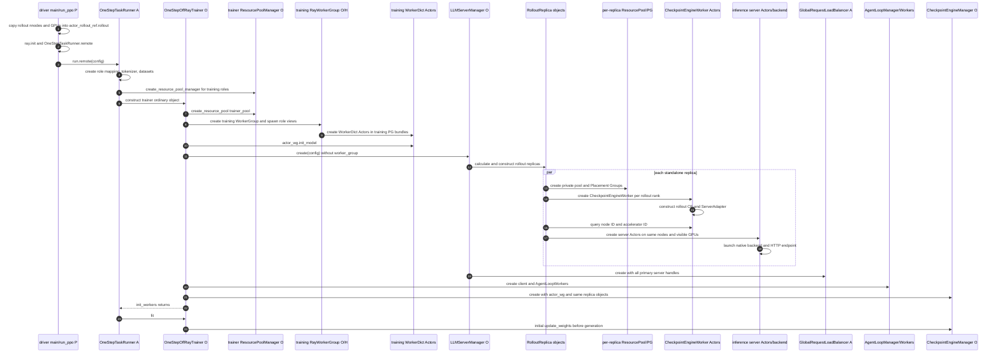
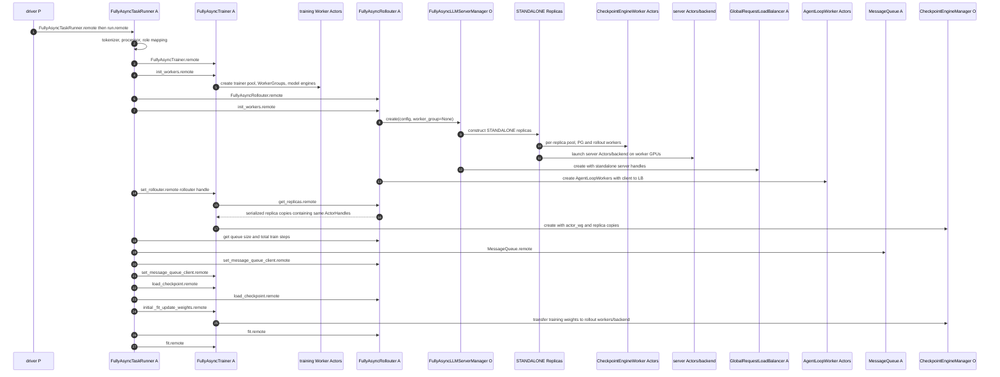
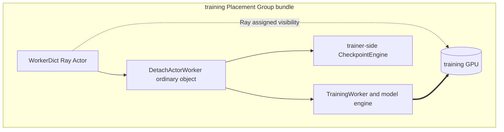
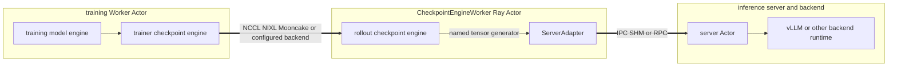
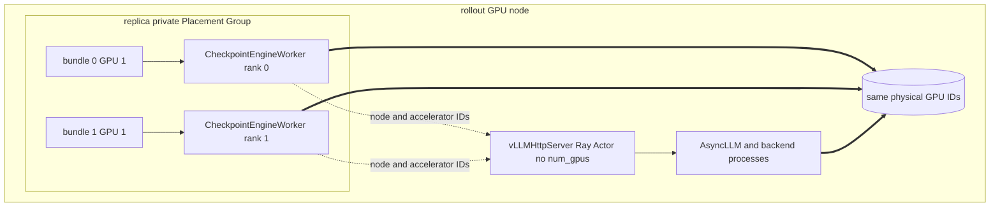
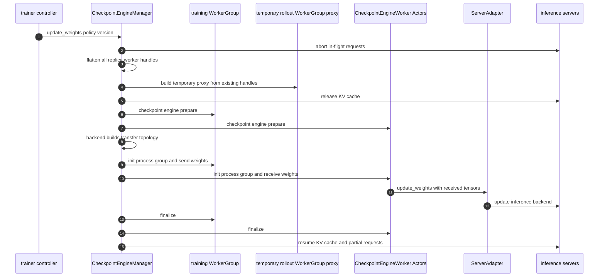
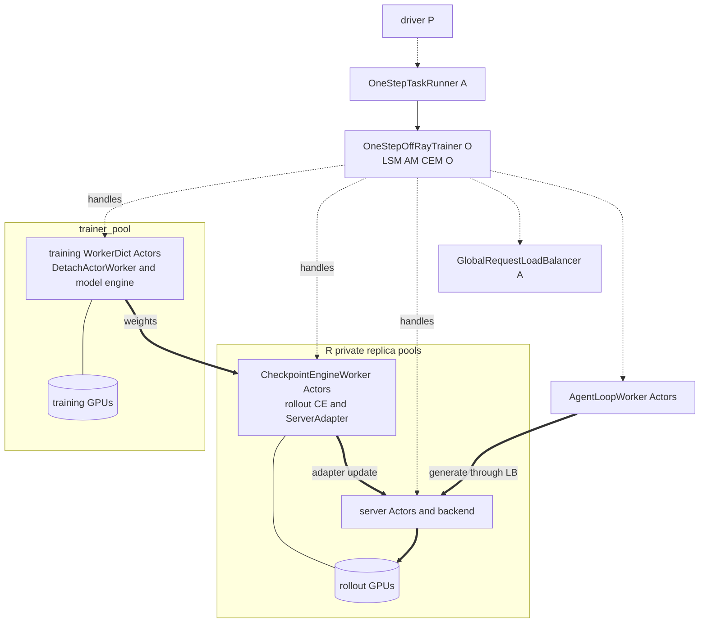
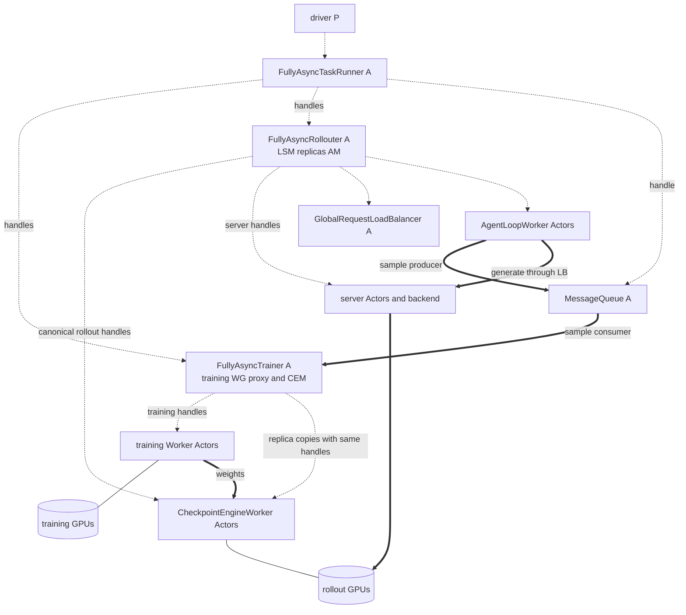
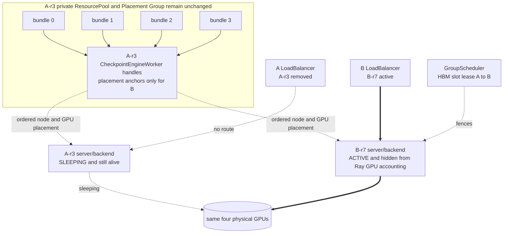
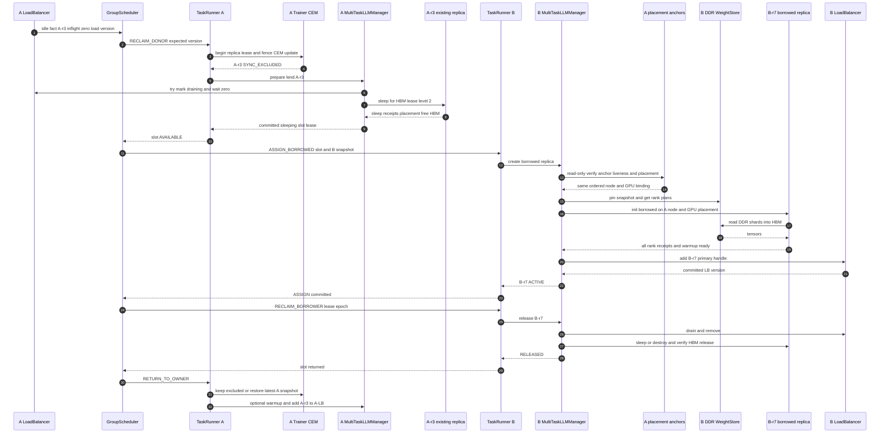

# verl v0.8.0 STANDALONE 初始化与训练运行期动态扩容

> 状态：待评审。
> 代码基线：`/Users/nyp/Documents/verl`，tag `v0.8.0`，commit `7aed6b23`。
> 第 1～10 节描述 `RolloutMode.STANDALONE` 的初始化代码事实，并分别覆盖 One-Step Off-Policy 与 Fully Async
> 两条入口。第 11 节在这些代码边界上给出多任务场景的训练运行期动态扩容目标设计，所有新增类和接口均明确
> 归属子仓或候选上游扩展点，不把目标设计写成 verl 当前能力。
> 本文不分析 `RolloutMode.COLOCATED`；Fully Async 可选的 trainer-side HYBRID validation replica 只作为旁支说明。

## 1. 先给出结论

STANDALONE 的核心不是“HTTP server 是独立进程”——HYBRID 的 native server 同样是独立 Ray Actor——而是
**training 与 rollout 分别创建和占用不同的 Ray GPU 资源**：

1. training controller 根据 `config.trainer.nnodes × n_gpus_per_node` 创建 `trainer_pool`、training Placement
   Groups 和 training Worker Actors；training actor 使用 `DetachActorWorker`，不把主 rollout replica 放进
   training worker 进程。
2. `LLMServerManager.create(config=...)` 没有收到 `worker_group`，于是按
   `config.rollout.nnodes × n_gpus_per_node` 计算 replica 数，并让**每个 replica**执行 `init_standalone()`。
3. 每个 replica 都临时创建自己的 `ResourcePoolManager`，并保留一个独立 `RayResourcePool`；在该 pool 上创建
   `CheckpointEngineWorker` Ray Actors。该 worker 是 rollout GPU 的 Ray 资源锚点，同时包含 rollout-side
   `CheckpointEngine` 和 `ServerAdapter` 普通对象。
4. vLLM server 再查询这些 checkpoint workers 的实际 `node_id` 和 accelerator ID，以 hard node affinity 和
   显式 visible devices 在同节点、同 GPU 上创建 server Actor/backend。server Actor 本身没有向 Ray 申请
   `num_gpus`，物理 GPU 的预约来自前面的 per-replica Placement Group。
5. 初始化末尾创建 `GlobalRequestLoadBalancer` 和 AgentLoopWorkers。Checkpoint Engine Manager 持有 training
   WorkerGroup proxy 和 rollout replicas，在训练开始前或训练过程中把 training 权重发送到 rollout workers，
   再由其 `ServerAdapter` 更新 inference backend。

### 1.1 实体类型总览

| 实体                                             | 类型                          | owner/所在进程                      | 是否独占一个进程             |
| ---------------------------------------------- | --------------------------- | ------------------------------- | -------------------- |
| 提交任务的 `main()/run_ppo()`                       | 普通 OS 进程 `[P]`              | driver                          | 是，但不是 Ray Actor      |
| `OneStepTaskRunner`                            | Ray Actor `[A]`             | Ray CPU node                    | 是                    |
| `OneStepOffRayTrainer`                         | 普通对象 `[O]`                  | `OneStepTaskRunner` 进程          | 否                    |
| `FullyAsyncTaskRunner`                         | Ray Actor `[A]`             | Ray CPU node                    | 是                    |
| `FullyAsyncTrainer`                            | Ray Actor `[A]`             | Ray CPU node                    | 是                    |
| `FullyAsyncRollouter`                          | Ray Actor `[A]`             | Ray CPU node                    | 是                    |
| `MessageQueue`                                 | Ray Actor `[A]`             | Ray CPU node                    | 是                    |
| `LLMServerManager` / Fully Async 子类            | 普通对象 `[O]`                  | One-Step controller 或 Rollouter | 否                    |
| `RolloutReplica`                               | 普通对象 `[O]`                  | manager owner 进程                | 否                    |
| `ResourcePoolManager`                          | 临时普通对象 `[O]`                | `init_standalone()` 调用栈         | 否                    |
| `RayResourcePool`                              | 普通对象及 PG handles `[O]/[PG]` | 被 replica 保留                    | 否                    |
| `RayWorkerGroup`                               | ActorHandle 代理 `[O]/[H]`    | 创建它的 controller                 | 否                    |
| training `WorkerDict`                          | Ray Actor `[A]`             | training GPU node               | 是，每个 rank 一个         |
| `DetachActorWorker` / `TrainingWorker`         | 普通对象 `[O]`                  | training `WorkerDict` 进程        | 否                    |
| `CheckpointEngineWorker`                       | Ray Actor `[A]`             | rollout GPU node                | 是，每个 rollout rank 一个 |
| rollout CE / `ServerAdapter`                   | 普通对象 `[O]`                  | `CheckpointEngineWorker` 进程     | 否                    |
| vLLM/SGLang/TRT-LLM server                     | Ray Actor `[A]`             | rollout GPU node                | 是                    |
| inference backend runtime                      | 第三方进程/runtime `[X]`         | server 创建或管理                    | 是或由 backend 管理       |
| `GlobalRequestLoadBalancer`                    | Ray Actor `[A]`             | Ray CPU node                    | 是                    |
| `AgentLoopManager` / `CheckpointEngineManager` | 普通对象 `[O]`                  | controller、Rollouter 或 Trainer  | 否                    |
| `AgentLoopWorker`                              | Ray Actor `[A]`             | Ray CPU nodes                   | 是                    |

## 2. STANDALONE 有两条主要 controller 初始化链

在 v0.8.0 中，`RolloutMode.STANDALONE` 不是某个唯一 `main()` 的同义词。当前调研范围内有两条主要入口：

| 入口 | controller 组织 | rollout owner | training owner | 初始化完成后的运行关系 |
|---|---|---|---|---|
| One-Step Off-Policy | 一个 `OneStepTaskRunner` Ray Actor 内含 trainer 普通对象 | trainer 内的 `LLMServerManager` | 同一个 trainer | 单 controller 内交错 generation/training |
| Fully Async | `FullyAsyncTaskRunner` 创建独立 Trainer、Rollouter、MessageQueue Actors | `FullyAsyncRollouter` | `FullyAsyncTrainer` | Rollouter 与 Trainer 的 `fit.remote()` 并发，通过 MessageQueue 解耦 |

两条路径共用第 5～9 节的 rollout 初始化基础设施。主要差异是 managers 属于哪个进程、replica 普通对象是否跨
Ray RPC 复制，以及初始化权重同步由谁触发。

## 3. One-Step Off-Policy 完整初始化时序



### 3.1 driver 与 TaskRunner

`one_step_off_policy.main()` 先把顶层 `config.rollout.nnodes/n_gpus_per_node` 复制到
`config.actor_rollout_ref.rollout`，然后复用通用 `run_ppo()`：初始化 Ray、创建 `OneStepTaskRunner.remote()`，并
同步等待 `runner.run.remote(config)`。对应代码：

- `verl/experimental/one_step_off_policy/main_ppo.py:110-125`；
- `verl/trainer/main_ppo.py:52-103`。

`OneStepTaskRunner` 声明为 `@ray.remote(num_cpus=10, max_concurrency=100)`。其 `run()` 在 Actor 进程内创建
tokenizer、dataset、training resource pool manager 和 `OneStepOffRayTrainer` 普通对象，随后依次调用
`trainer.init_workers()` 与 `trainer.fit()`：

- `verl/experimental/one_step_off_policy/main_ppo.py:34-107`。

### 3.2 role mapping 只创建 training roles

`create_role_worker_mapping()` 把 actor 映射为 `ray.remote(DetachActorWorker)`，critic 映射为
`ray.remote(TrainingWorker)`，并按需添加 ref。它没有创建主 rollout role；One-Step trainer 还会防御性删除
`Role.Rollout`。对应代码：

- `verl/experimental/separation/utils.py:62-92`；
- `verl/experimental/one_step_off_policy/ray_trainer.py:88-99`。

`create_resource_pool_manager()` 因此只生成：

```python
{"trainer_pool": [config.trainer.n_gpus_per_node] * config.trainer.nnodes}
```

顶层 `config.rollout.*` 在这里仅被校验，不会生成共享 rollout pool；真正 rollout pools 由每个 replica 稍后各自
创建。对应代码：`verl/experimental/separation/utils.py:22-59`。

## 4. Fully Async 完整初始化时序

以下主链假设 `async_training.use_trainer_do_validate=false`，因此是纯 STANDALONE 训推分离。第 4.3 节再说明
该开关为 true 时额外出现的 HYBRID validation 旁支。



### 4.1 为什么先创建 Trainer，再创建 Rollouter

`FullyAsyncTaskRunner._initialize_components()` 的代码顺序是：

1. 创建 role mapping；
2. 创建并初始化 `FullyAsyncTrainer`；
3. 可选提取 trainer WorkerGroup，供 trainer-side validation 使用；
4. 创建并初始化 `FullyAsyncRollouter`；
5. 把 Rollouter handle 注入 Trainer；
6. 创建 MessageQueue 并把同一个 queue handle 的 client 副本注入两侧；
7. 两侧恢复 checkpoint；
8. 触发一次初始参数同步；
9. 同时启动 Rollouter 与 Trainer 的 `fit.remote()`。

代码位于 `verl/experimental/fully_async_policy/fully_async_main.py:46-181`。`FullyAsyncTaskRunner`、Trainer、
Rollouter 和 MessageQueue 分别是四个 Ray Actors，彼此只通过 ActorHandle/RPC 关联；它们不是同一进程内对象。

### 4.2 Rollouter 不创建 training WorkerGroup

`FullyAsyncRollouter.init_workers()` 只初始化 asyncio 对象、可选 reward/teacher manager，以及异步 rollout
manager；其 `_create_actor_rollout_classes()` 是空实现。纯 STANDALONE 路径调用：

```python
FullyAsyncLLMServerManager.create(
    config=self.config,
    worker_group=None,
)
```

于是父类 `LLMServerManager` 走 `init_standalone()`。对应代码：

- `verl/experimental/fully_async_policy/fully_async_rollouter.py:692-703,758-760,775-812`；
- `verl/workers/rollout/llm_server.py:297-325`。

### 4.3 `use_trainer_do_validate=true` 是附加 HYBRID 旁支

启用该开关时，TaskRunner 会从 Trainer RPC 取回 trainer WorkerGroup，再在 Rollouter 初始化之前注入。随后
`FullyAsyncLLMServerManager` 分两阶段创建：

1. 用 trainer WorkerGroup 创建并预注册 HYBRID validation replicas；
2. 临时把 `self.worker_group` 设为 `None`，再调用父类创建主 STANDALONE replicas。

HYBRID replicas 初始不在主 LB active set 中，并由 Trainer 的另一个 naive `CheckpointEngineManager` 管理 sleep/
validation。该分支不改变主 rollout replicas 的 STANDALONE 资源池与权重通道。对应代码：

- WorkerGroup 提取与注入：`verl/experimental/fully_async_policy/fully_async_main.py:126-174`；
- 两阶段 manager：`verl/experimental/fully_async_policy/fully_async_rollouter.py:153-226`；
- validation checkpoint manager：`verl/experimental/fully_async_policy/fully_async_trainer.py:176-254`。

## 5. training pool、Worker Actors 与 GPU 绑定

One-Step 与 Fully Async Trainer 最终都复用 `SeparateRayPPOTrainer` 的资源池和 WorkerGroup 构造逻辑。

### 5.1 从配置到 training Placement Groups

`ResourcePoolManager.create_resource_pool()` 把 `trainer_pool` 转成 `RayResourcePool`。它先检查 Ray 集群可用 GPU
总数是否大于等于总需求，但不在此时选择具体 node ID。`RayWorkerGroup` 随后调用
`resource_pool.get_placement_groups()`，实际创建 Placement Groups。对应代码：

- `verl/single_controller/ray/base.py:181-239`；
- `verl/experimental/separation/ray_trainer.py:106-135,197-230`。

### 5.2 training rank 的真实进程层次

`create_colocated_worker_cls()` 创建动态 `WorkerDict` Ray class。Ray 真正拉起的是每 rank 一个 `WorkerDict`
Actor；`DetachActorWorker` 和其内部 `TrainingWorker`/Model Engine 都是该 Actor 进程内的普通对象。



`ActorRolloutRefWorker.init_model()` 对 role 中含 `actor` 的 worker 构造 training model 和 trainer-side
Checkpoint Engine；只有 role 中含 `rollout` 时才构造进程内 rollout adapter。纯 One-Step 的 role 是 `actor`，
所以主 rollout 不在 training Actor 内。代码：

- outer/inner Actor 构造：`verl/single_controller/ray/base.py:985-1027`；
- role 判定与模型构造：`verl/workers/engine_workers.py:434-455,500-632`；
- `DetachActorWorker`：`verl/experimental/separation/engine_workers.py:36-58`。

### 5.3 Placement Group bundle 如何绑定 GPU

`RayWorkerGroup` 为每个 rank 写入 `WORLD_SIZE/RANK/RAY_LOCAL_WORLD_SIZE/MASTER_ADDR/MASTER_PORT`，并用
`PlacementGroupSchedulingStrategy` 指定 PG 与 bundle index。Actor 的 `num_gpus` 为
`1 / resource_pool.max_colocate_count`；这是 Ray 记账比例，不是显存上限。对应代码：
`verl/single_controller/ray/base.py:536-579,621-680`。

## 6. rollout replica 数量和 per-replica 资源池

### 6.1 replica 数量计算

普通非 PD-disaggregation 情况下：

```text
rollout_world_size = TP × DP × PP
total_rollout_gpus = rollout.n_gpus_per_node × rollout.nnodes
num_replicas = total_rollout_gpus // rollout_world_size
```

每个 `RolloutReplica` 再计算：

```text
gpus_per_replica_node = min(rollout.n_gpus_per_node, rollout_world_size)
replica_nnodes = rollout_world_size // gpus_per_replica_node
```

代码位于：

- `LLMServerManager`：`verl/workers/rollout/llm_server.py:266-312`；
- `RolloutReplica`：`verl/workers/rollout/replica.py:93-129`。

### 6.2 每个 replica 都创建一个私有 pool

`init_standalone()` 为 replica `r` 构造：

```python
resource_pool_spec = {
    f"rollout_pool_{r}": [gpus_per_replica_node] * replica_nnodes,
}
ResourcePoolManager(..., max_colocate_count=2)
```

随后保存 `replica.resource_pool`，并创建：

```python
RayWorkerGroup(
    resource_pool=replica.resource_pool,
    ray_cls_with_init=ray.remote(CheckpointEngineWorker)(...),
    bin_pack=False,
    use_gpu=True,
)
```

对应代码：`verl/workers/rollout/replica.py:189-239`。

这里有四个必须准确理解的事实：

1. `ResourcePoolManager` 只是初始化过程中的临时普通对象；replica 最终保留的是 `RayResourcePool`。
2. 当前没有一个任务级公共 rollout pool；replica 0、1、2……分别拥有各自的 pool/PG handles。
3. `bin_pack=False` 使 `RayWorkerGroup` 请求 `PACK`，不是 HYBRID training 路径常见的 `STRICT_PACK`。PACK 会
   尽量把 bundles 放在一起，但不是显式 node-ID 绑定。
4. `max_colocate_count=2` 使每个 `CheckpointEngineWorker` 对 bundle 消耗 `num_gpus=1/2`；PG bundle 本身仍按
   `{"CPU": 2, "GPU": 1}` 预约一整张 GPU。fractional GPU 只是 Ray 调度记账，不限制 CUDA 显存。

PG bundle 和 actor 创建代码：`verl/single_controller/ray/base.py:112-160,536-579,621-680`。

### 6.3 一个 2 节点、每节点 8 卡、每 replica 4 卡的例子

假设：

```text
rollout.nnodes = 2
rollout.n_gpus_per_node = 8
TP = 4, DP = 1, PP = 1
```

则总 rollout world size 为 16，单 replica world size 为 4，共构造 4 个 replicas。每个 replica 的
`gpus_per_replica_node=4`、`replica_nnodes=1`，因此得到四个彼此独立的资源池：

```text
rollout_pool_0 = [4]
rollout_pool_1 = [4]
rollout_pool_2 = [4]
rollout_pool_3 = [4]
```

Ray 决定这四个 4-bundle PG 最终落在哪些可用节点。通常可形成每节点两个 replicas，但配置和 pool 名称本身不
表达“r0/r1 必须在 node0、r2/r3 必须在 node1”；实际放置要等 PG ready 和 workers 创建后再反查。

## 7. CheckpointEngineWorker 的创建和进程内对象

每个 rollout rank 创建一个 `CheckpointEngineWorker` Ray Actor。其构造函数在 Actor 进程内：

1. 读取 rollout/model config；
2. 从 `CheckpointEngineRegistry` 创建 rollout-side checkpoint backend；
3. 创建与 backend 对应的 `ServerAdapter`；
4. 初始化 CPU Gloo 全局进程组辅助通信。

`CheckpointEngineWorker.update_weights()` 从 checkpoint engine 接收 named tensor generator，再调用
`server_adapter.update_weights()`。因此它不是“只为了占卡而存在”的 dummy actor，而是 training→inference
权重数据面的接收端和适配端。代码：`verl/checkpoint_engine/base.py:278-342`。



## 8. inference server 如何复用 rollout worker 的节点和 GPU

以下以 vLLM 为例；SGLang/TRT-LLM 采用各自 server 实现，但共同边界仍是“replica 先有 rollout worker handles，
server 再根据这些 handles 启动”。

### 8.1 查询实际 placement

`vLLMReplica.launch_servers()` 对每个 checkpoint worker 调用 `__ray_call__`，查询：

```text
ray runtime node ID
ray runtime accelerator ID
```

随后按 `gpus_per_replica_node` 对 workers 分段；每一段创建一个 node-level server Actor。代码位于
`verl/workers/rollout/vllm_rollout/vllm_async_server.py:968-1005`。

### 8.2 server Actor 的 placement 与 GPU 可见性

server Actor 创建参数包括：

- `NodeAffinitySchedulingStrategy(node_id=..., soft=False)`，强制落到 checkpoint workers 所在 node；
- runtime env 中设置 `RAY_EXPERIMENTAL_NOSET_CUDA_VISIBLE_DEVICES=1`；
- 构造参数显式传入有序 `cuda_visible_devices`；
- `workers` 参数保存该 node 上的 checkpoint worker handles；
- 没有设置 `num_gpus`，也没有把 server Actor 加入 replica PG bundle。

代码位于 `vllm_async_server.py:991-1033`。之后第一个 server 提供 master address/ports，所有 node-level servers
并发启动，最后只把 node rank 0 的 server handle/address 作为该 replica 的 primary endpoint：
`vllm_async_server.py:1036-1054`。



这里 Ray 资源视图的 owner 是 private PG/CheckpointEngineWorker 路径；server/backend 的同卡使用主要依靠 hard
node affinity、显式设备可见性以及 verl 自己的生命周期约束，而不是 server Actor 的 Ray GPU request。

### 8.3 STANDALONE server 初始权重来源

vLLM server 构造时，如果 STANDALONE 配置仍为 `load_format=dummy`，代码会把它改为 `auto`，因此 native backend
先从 model path 加载可用初始权重，而不是像 HYBRID 那样依赖 dummy model 后立即在同进程同步。代码：
`verl/workers/rollout/vllm_rollout/vllm_async_server.py:128-139`。

训练侧随后仍会通过 Checkpoint Engine 同步当前 training 权重：One-Step 在 `fit()` 开始、恢复 checkpoint 后调用
`_fit_update_weights()`；Fully Async 的 TaskRunner 在两侧恢复 checkpoint 后显式调用 Trainer 的
`_fit_update_weights.remote()`。对应代码：

- One-Step：`verl/experimental/one_step_off_policy/ray_trainer.py:266-287`；
- Fully Async：`verl/experimental/fully_async_policy/fully_async_main.py:105-113`。

## 9. LB、AgentLoop 与 Checkpoint Engine 的初始化收尾

### 9.1 GlobalRequestLoadBalancer

所有 replicas 完成 server 启动后，`LLMServerManager` 收集 primary handles/addresses，并创建
`GlobalRequestLoadBalancer.remote()`。LB 内保存 `server_id → ActorHandle`、inflight 计数和 sticky-session
LRU。`LLMServerClient.generate()` 先 acquire，再调用 server Actor，最后 release。代码：

- manager 创建：`verl/workers/rollout/llm_server.py:327-355`；
- LB：`verl/workers/rollout/llm_server.py:43-143`；
- client 请求链：`verl/workers/rollout/llm_server.py:146-220`。

### 9.2 AgentLoopWorkers

`AgentLoopManager.create()` 创建 `rollout.agent.num_workers` 个 CPU Ray Actors，并把包含同一个 LB handle 的 client
序列化给每个 worker。workers 以 soft NodeAffinity 在所有存活 CPU nodes 间 round-robin 放置；它们不占用
rollout PG 的 GPU bundles。代码：`verl/experimental/agent_loop/agent_loop.py:1044-1118`。

### 9.3 CheckpointEngineManager 与 replica 身份

One-Step 中 manager、trainer 和 checkpoint manager 都在 `OneStepTaskRunner` 进程内，所以
`CheckpointEngineManager.replicas` 与 `LLMServerManager.rollout_replicas` 是同一批普通对象。

Fully Async 中 canonical replicas 位于 Rollouter 进程。Trainer 通过 `rollouter.get_replicas.remote()` 收到 Ray
序列化后的普通对象副本；副本内的 checkpoint worker/server ActorHandles 仍指向同一批远程 Actors，但普通对象
身份和 list 修改不会跨进程自动共享。代码：

- One-Step manager 创建：`verl/experimental/separation/ray_trainer.py:106-131`；
- Fully Async manager 创建：`verl/experimental/fully_async_policy/fully_async_trainer.py:167-174,249-254`。

### 9.4 非 naive 权重同步时序



实现位于 `verl/checkpoint_engine/base.py:387-515`。在 STANDALONE 下 native vLLM `sleep()/wake_up()` 是 skip，
但 checkpoint manager 仍会执行 abort、process-group、weight transfer、adapter update 和 resume 流程；vLLM 的
STANDALONE 分支见 `vllm_async_server.py:604-634`。

## 10. 初始化完成后的部署结果

### 10.1 One-Step



### 10.2 Fully Async



## 11. 训练运行期动态创建 borrower replica：目标设计

本节是目标设计，不是 v0.8.0 现状。设计选择与 HYBRID 动态扩容保持一致：**不改 donor 已创建的
ResourcePool、Placement Groups、resource bundles 和 checkpoint workers；donor replica 真正 sleep 后，borrower
复用这组 worker handles 提供的物理 placement，直接创建自己的 server/backend，并绕过第二次 Ray GPU 申请。**

这里的“绕过资源视图”只表示 borrower server 不再申请一份 Ray GPU resource，不表示完全抛弃 Ray：

- donor 私有 PG 继续向 Ray 预留整组物理 GPU；
- donor `CheckpointEngineWorker` Actors 继续维持 PG/bundle 与实际 node/GPU 的绑定；
- GroupScheduler 维护 sleeping replica 释放出来的临时 HBM lease；
- donor/borrower LoadBalancer 分别维护各自可接流的 server 集合。

### 11.1 目标场景和结论

沿用前文示例：任务 A 的 STANDALONE rollout 占 2 节点、每节点 8 卡，每个 replica 使用 4 卡。初始化后 A 有
4 个独立 replica pools。某时刻 `A-r3` 已完成本轮 sample 消耗且 inflight 为零，目标过程是：

```text
A-r3 保留原 private ResourcePool/PG/bundles/CheckpointEngineWorkers
  → A-LB 摘流并 drain
  → A-r3 server/backend 执行真实 level-2 sleep
  → A 返回带有 ordered worker handles、node/GPU 和 PG provenance 的 slot lease
  → GS 把临时 HBM 使用权分配给 B
  → B 根据同一组 handles 创建 B-r7 server/backend，不申请新的 Ray GPU bundle
  → B-r7 从 B 的版本化 DDR snapshot 加载权重并 warmup
  → B-r7 最后加入 B-LB
```

结论是：**该方案在 STANDALONE 下可行，并且是当前最小侵入的推荐方案。**它不要求初始化阶段改造成公共 rollout
pool；初始 replica 数量、private pools 和 placement 仍完全由各任务原配置决定。代价是 borrower lease 的生命期
不能超过 donor session/PG 的生命期，GS 需要为绕过 Ray 二次记账的 HBM lease 提供严格互斥和故障回收。

运行时部署关系如下：



### 11.2 三张权威视图及其边界

动态借用后有三张不同但有意分层的视图：

| 权威视图 | 借出后的状态 | 只负责回答的问题 |
|---|---|---|
| Ray/PG resource view | 4 张 GPU 仍属于 A-r3 的 private PG/bundles | 谁预留物理资源、anchors 与 PG 何时失效 |
| GS HBM slot ledger | A-r3 已 sleeping，临时 HBM lease 分配给 B-r7 | 此刻谁被授权使用释放的 HBM |
| A/B LoadBalancer view | A-r3 不可路由，B-r7 可路由 | 哪个 server 当前允许接收请求 |

因此状态应表述为：

```text
physical Ray reservation owner = task A / A-r3 PG
temporary HBM usage right      = task B / B-r7 lease
serving traffic owner          = task B / B-LB
```

三张表必须使用同一组 `task_id/session_id/replica_id/slot_id/lease_epoch` 关联。GS 不能根据一条旧 idle event 直接
推导 HBM 可用；只有 donor manager 完成摘流、CEM 隔离、真实 sleep 和 HBM 验证后，才能提交 slot。Ray 也不能
感知 B-r7 的额外 HBM 使用，防止同卡出现第二个 borrower 的唯一互斥点是 GS 的 slot CAS。

### 11.3 为什么原生 launch 路径允许这样创建

STANDALONE donor 的 `replica.workers` 是 `CheckpointEngineWorker` ActorHandles。原生
`vLLMReplica.launch_servers()` 已经对这些 handles 执行以下步骤：

1. 通过 `__ray_call__` 查询每个 worker 的 node ID 和 accelerator ID；
2. 按 `gpus_per_replica_node` 保留有序 rank 分组；
3. 以 hard `NodeAffinitySchedulingStrategy(node_id, soft=False)` 创建 node-level server Actor；
4. 设置 `RAY_EXPERIMENTAL_NOSET_CUDA_VISIBLE_DEVICES=1` 并传入有序 visible devices；
5. server Actor `.options()` 不设置 `num_gpus`，也不进入 donor PG；
6. 启动全部 node-level backend，最后取得 primary server handle/address。

代码位于 `verl/workers/rollout/vllm_rollout/vllm_async_server.py:968-1054`。因此 B 可以复用 launch 编排，但
handles 只作为 placement anchors，不作为 B 的权重接收端或 Ray resource owner。

这并不是“只保存 node ID 和 GPU ID 就够了”。slot 仍要保存 ordered ActorHandles、PG IDs 和 bundle indices：

- handles 是 donor PG/worker 存活探针；
- PG/bundle 是物理 reservation 的 provenance；
- 有序 placement 是 TP/DP/PP rank mapping；
- node/GPU 是创建 B server 时实际消费的 location。

### 11.4 HYBRID 与 STANDALONE 动态借用的差异

| 维度 | HYBRID donor | STANDALONE donor |
|---|---|---|
| placement anchor | training `WorkerDict` handles | rollout `CheckpointEngineWorker` handles |
| PG owner | donor training pool | donor replica private rollout pool |
| donor 后续竞争者 | training engine、donor rollout | donor rollout 与 donor CEM 权重同步 |
| native sleep | HYBRID vLLM 会调用 engine sleep | STANDALONE vLLM 当前直接 skip |
| 必须增加的 fence | donor training phase gate | donor CEM update gate |
| borrower 权重入口 | DDR snapshot loader | 同样使用 DDR snapshot loader |
| borrower 是否加入原 CEM | 否 | 否；否则会误用 donor checkpoint workers |
| lease 最大生命期 | donor training workers/PG session | donor checkpoint workers/private PG session |

STANDALONE 不需要阻止 donor training model 使用 rollout GPU，因为 training 与 rollout pools 物理分离；但必须阻止
donor `CheckpointEngineManager` 在 A-r3 借出期间通过 A-r3 checkpoint workers/adapter 更新 A server 权重，否则
可能重新占用 weights HBM，与 B-r7 冲突。

### 11.5 STANDALONE 原生 sleep 是 no-op，必须扩展

`vLLMReplica.sleep()` 会先在 primary server 等待请求 drain，再调用各 node-level server 的 `sleep()`，见
`verl/workers/rollout/vllm_rollout/vllm_async_server.py:1056-1060`。但 server 的 STANDALONE 分支只是记录
`skip sleep in standalone mode`，不会调用 `engine.sleep()`；wake 同样跳过，见同文件 `:604-634`。

因此不能把原生 `await A_r3.sleep()` 正常返回当作 HBM 已释放。子仓的 `MultiTaskVLLMHttpServer` 需要新增显式
lease 生命周期接口，例如：

```text
sleep_for_hbm_lease(expected_policy_version)
  → verify primary and no new acquire
  → wait all in-flight requests to drain
  → engine.sleep(level=2)
  → reset stale prefix/encoder caches as required
  → query per-rank HBM and runtime state
  → return SleepReceipt[]

restore_from_snapshot(snapshot, expected_lease_epoch)
  → restore/load weights
  → restore KV allocation
  → reset prefix cache
  → warmup
  → return WeightReceipt[]
```

donor rollout 配置和自定义 server 必须允许 level-2 sleep；One-Step 示例配置当前还把
`free_cache_engine=false`，见 `verl/experimental/one_step_off_policy/config/one_step_off_ppo_trainer.yaml:16-25`，
多任务 recipe 需要覆盖该配置或提供不依赖此开关的专用方法。

sleep 后 donor server/backend、private pool、PG、bundles 和 checkpoint workers 都继续存活。固定 CUDA context、
NCCL communicator、checkpoint backend buffer 等残余显存必须计入 `measured_free_hbm` 和安全余量，不能假设
level-2 sleep 后整卡 100% 可用。

### 11.6 donor Checkpoint Engine 必须与借出事务隔离

原生 `CheckpointEngineManager.update_weights()` 会：

1. 遍历 `self.replicas`，把每个 `replica.workers` 合并成临时 rollout WorkerGroup；
2. 建立 training/rollout checkpoint process group；
3. 调用 training workers 发送权重；
4. 调用 rollout `CheckpointEngineWorker.update_weights()`；
5. 后者再调用其 task-specific `ServerAdapter` 更新 inference backend。

代码位于 `verl/checkpoint_engine/base.py:470-515`。A-r3 已借出时，如果它仍在本次同步集合，A 的 adapter 可能在
B-r7 ACTIVE 期间把 A weights 重新装进 A-r3 HBM。因此发布 slot 前必须完成：

```text
block new donor CEM update for A-r3
  → wait an already-running update to finish
  → mark A-r3 SYNC_EXCLUDED for the current lease epoch
  → drain and sleep A-r3
  → only then publish slot AVAILABLE
```

v0.8.0 的 `CheckpointEngineManager.add_replicas()/remove_replicas()` 只是直接修改 list，见
`verl/checkpoint_engine/base.py:414-429`，没有 stable replica ID、并发锁或与 `update_weights()` 的 barrier。目标扩展
应提供基于稳定 ID 的接口：

```text
begin_replica_lease(replica_id, expected_sync_epoch)
end_replica_lease(replica_id, lease_epoch)
get_replica_sync_state(replica_id)
```

借出期间 donor training 继续把每个 policy version 发布到版本化 DDR store，但不推送到 A-r3。slot 归还后：

- 若 A 仍不需要 A-r3，保持 sleeping 和 `SYNC_EXCLUDED`；
- 若 A 需要恢复它，先从 A 最新 committed snapshot 加载、校验和 warmup，再恢复同步资格并加入 A-LB；
- 不能只调用 wake 并假设 sleeping replica 仍是最新 policy。

### 11.7 sleeping slot 描述和命令语义

donor manager 成功 sleep 后返回的不是简单的“4 张空闲卡”，而是不可变 lease：

```python
SleepingStandaloneSlotLease(
    slot_id=...,
    lease_epoch=...,
    owner_task_id="A",
    owner_session_id=...,
    owner_replica_id="A-r3",
    owner_replica_rank=3,
    topology=ReplicaTopology(tp=4, dp=1, pp=1),
    ordered_placement_anchors=(checkpoint_worker_handle_0, ...),
    placements=(
        GpuPlacement(
            rank_indices=(0, 1, 2, 3),
            node_id=...,
            accelerator_ids=(...),
            placement_group_id=...,
            bundle_indices=(...),
        ),
    ),
    donor_server_handles=(...),
    donor_sleep_epoch=...,
    donor_sync_epoch=...,
    measured_free_hbm_bytes=(...),
    hbm_safety_margin_bytes=...,
    reclaim_deadline=...,
)
```

GS 再把该 lease 和 borrower snapshot 放入 ASSIGN：

```python
AssignBorrowedStandaloneReplica(
    decision_id=...,
    borrower_task_id="B",
    borrower_session_id=...,
    scheduler_epoch=...,
    expected_task_state_version=...,
    slot_lease=...,
    borrower_replica_id="B-r7",
    topology=ReplicaTopology(tp=4, dp=1, pp=1),
    weight_snapshot=WeightSnapshotRef(
        task_id="B",
        policy_version=...,
        model_fingerprint=...,
        manifest_id=...,
        content_digest=...,
        store_backend=...,
    ),
    deadline=...,
)
```

slot 必须覆盖一个完整 borrower replica footprint，并保持 rank 顺序。GS 只能转发 donor manager 已提交的 lease，
不能根据 LB idle report 自行拼装 node/GPU。所有 heartbeat、command 和 result 都要带 session/lease epoch，防止
donor 重启后相同 replica rank 或 GPU ID 被旧命令误用。

### 11.8 borrower 不调用 `init_standalone()`，新增 `init_borrowed()`

B 不能调用原生 `init_standalone()`，否则会再创建 ResourcePool、PG 和 `CheckpointEngineWorker` Actors，并因 donor
PG 已预留 GPU 而无法得到预期资源。B 也不能把 A 的整个 WorkerGroup 当成自己的 WorkerGroup；它只消费 slot 中
已按 B rank 排序的 handles。

建议在子仓中实现：

```python
class MultiTaskVLLMReplica(vLLMReplica):
    def __init__(self, *, replica_rank, config, model_config, replica_identity):
        super().__init__(
            replica_rank=replica_rank,
            config=config,
            model_config=model_config,
            name_suffix=replica_identity,
        )
        self.server_class = ray.remote(MultiTaskVLLMHttpServer)

    async def init_borrowed(self, slot, receiver_rank_anchors):
        self.borrowed_slot = slot
        self.workers = list(receiver_rank_anchors)
        assert len(self.workers) == self.world_size
        await self.launch_servers()
```

公开部署模式仍然是 STANDALONE；`BORROWED_PLACEMENT` 只是子仓内部的 materialization type，不建议伪装成
`RolloutMode.HYBRID`：HYBRID/STANDALONE 会改变 dummy load 和 sleep/wake 分支。自定义 server 应显式接受
`borrowed_placement=True`，允许 dummy/deferred backend 启动，并覆盖 STANDALONE 原生 sleep/wake。

复用原生 `launch_servers()` 的部分包括 node/GPU 查询、NodeAffinity、多节点 rendezvous、server readiness 和
primary handle/address 收集。需要替换的部分包括：

- server actor name/IPC key 必须包含 B task/session/replica，避免与 A 冲突；
- B server 不调用 A `CheckpointEngineWorker` 的 checkpoint/adapter 方法；
- B server 从 B DDR snapshot 装载权重；
- 加入 B-LB 前保持不可路由；
- 任一 node/rank 启动失败时清理已经创建的 B server Actors/backend，不改变 donor slot owner 状态。

### 11.9 borrower 权重加载和后续版本更新

borrowed replica 不加入 B 的原生 `CheckpointEngineManager`。否则 CEM 会把
`borrowed_replica.workers`——实际为 A 的 checkpoint worker handles——当成 B 的 rollout CE workers，最终错误调用
A 的 checkpoint backend/adapter。

B-r7 的首次装载和后续 policy version 更新统一走：

```text
B training side publishes immutable snapshot to DDR
  → B MultiTaskLLMServerManager pins WeightSnapshotRef
  → generate per-rank TP/PP load plan
  → B server collective RPC
  → each B backend rank reads its DDR shard into HBM
  → return version/digest/tensor count/byte count receipt
  → manager verifies all ranks
  → reset cache and warmup
  → LB commit
```

原生 `vLLMHttpServer.collective_rpc()` 只 await backend 调用而不返回 rank results，见
`verl/workers/rollout/vllm_rollout/vllm_async_server.py:191-203`。自定义 server 需要新增
`load_snapshot_from_store()` 并返回逐 rank receipts。borrowed replica ACTIVE 期间如果 B 发布新 policy version，
仍使用相同 loader 更新；不能临时要求 B training workers 与 A 的 checkpoint workers 建进程组。

### 11.10 One-Step 与 Fully Async 的控制链

`MultiTaskLLMServerManager` 是 controller 进程内普通对象，不是 Ray Actor。GS 对 manager 的逻辑指令仍必须经
TaskRunner 转发。每个 TaskRunner 持有 `self.group_scheduler` 并在启动时向 GS 注册自身 ActorHandle；GS 反向保存
一组 TaskRunner handles，用于 heartbeat 和 schedule command。扩展 LB 也持有 GS handle，只负责直接上报 idle/
inflight facts，不执行跨任务创建；真正的 lend/borrow 命令仍走 GS→TaskRunner→trainer/rollouter→manager。

#### 11.10.1 One-Step

One-Step 的 trainer、LLM manager 和 CEM 都在 `OneStepTaskRunner` Actor 进程内，控制链可以收敛为：

```text
GS
  → MultiTaskOneStepTaskRunner.apply_schedule_command()
  → OneStepOffRayTrainer narrow lifecycle interface
  → donor/borrower MultiTaskLLMServerManager
  → local CheckpointEngineManager lease fence
  → LB/server/store actions
```

`OneStepTaskRunner` 当前声明 `max_concurrency=100`，但 trainer 只是 `run()` 局部变量，见
`verl/experimental/one_step_off_policy/main_ppo.py:34-107`。子仓 controller 必须把 trainer 保存为
`self._trainer`，新增 `self.group_scheduler`、不可变 task context 和串行 command lock；不新增 manager 成员，manager
仍由 trainer 单一持有。

#### 11.10.2 Fully Async

Fully Async 中 rollout canonical objects 和 LB 位于 Rollouter Actor，CEM 位于 Trainer Actor，因此 donor 借出不是
对单个 manager 的一次调用，而是 TaskRunner 编排的跨 Actor 事务：

```text
GS
  → MultiTaskFullyAsyncTaskRunner.apply_schedule_command()
  → FullyAsyncTrainer.begin_replica_lease()      # fence CEM update
  → FullyAsyncRollouter.prepare_lend_replica()   # LB drain + real sleep
  → TaskRunner returns committed slot to GS
```

borrower 创建主要落在 Rollouter：

```text
GS
  → borrower TaskRunner
  → borrower Rollouter.MultiTaskLLMServerManager
  → create/load/warm/B-LB commit
```

`FullyAsyncTaskRunner` 当前是默认单并发 Actor，且 `run()` 在 `ray.wait` 中覆盖整个训练周期，见
`verl/experimental/fully_async_policy/fully_async_main.py:35-209`。子仓必须使用 concurrency groups 或 threaded
Actor，使 run、heartbeat 和串行 command RPC 可以并发；Trainer/Rollouter 的 RPC 结果共同组成一个事务，任一侧
失败都要回滚另一侧。

Fully Async Trainer 现有 CEM 持有 Rollouter RPC 返回的 replica 普通对象副本，见
`verl/experimental/fully_async_policy/fully_async_trainer.py:167-174,249-254`。不能把 Rollouter canonical object
直接传给 `remove_replicas()` 后依赖 Python identity 匹配；扩展接口必须以稳定 `replica_id` 查找 Trainer 本地副本。

### 11.11 完整的借出、创建、归还事务

状态机如下：

```text
A-r3: ACTIVE → SYNC_FENCING → DRAINING → SLEEPING → LENT
       LENT → RETURNED_SLEEPING → RESTORING → ACTIVE

B-r7: RECEIVED → VALIDATING → STARTING → LOADING → WARMING
       → COMMITTING_B_LB → ACTIVE → DRAINING → RELEASING → RELEASED
```

#### A. donor 产生 slot

1. A-LB 识别 `A-r3` 当前 generation input-exhausted 且 inflight 为零，向 GS 上报 idle fact；这只是事实，不是
   lease commit。
2. GS 对 TaskRunner A 下发 `RECLAIM_DONOR(A-r3, expected_load_version)`。
3. TaskRunner A 先让 Trainer/CEM 阻止 A-r3 参加新的权重同步，并等待已在执行的同步完成。
4. A manager 对 A-LB 执行带 expected version 的 `try_mark_draining()`；成功后新 acquire 不再选 A-r3。
5. manager 再次等待 inflight 归零，调用自定义 `sleep_for_hbm_lease(level=2)`。
6. 各 rank 返回 sleep epoch、当前 policy version、node/GPU、free HBM 和 runtime receipt。
7. manager 从 canonical ordered worker binding 生成 `SleepingStandaloneSlotLease`，经 TaskRunner 返回 GS。
8. GS 只有在收到 committed result 后才把 slot 从 `DONOR_PREPARING` 改为 `AVAILABLE`。

#### B. borrower 在同卡创建 replica

9. GS 对 TaskRunner B 下发 `ASSIGN_BORROWED(slot, B WeightSnapshotRef)`，并以 slot CAS 暂占 lease。
10. B manager 验证 donor session、lease epoch、anchors 存活、ordered placement、TP/DP/PP、free HBM 和 deadline。
11. B pin snapshot 并生成逐 rank load plan。
12. `MultiTaskVLLMReplica.init_borrowed()` 根据 A checkpoint worker handles 查询 node/GPU，以 hard NodeAffinity 和
    相同 visible devices 创建 B server Actors；不请求 Ray GPU，不调用 A checkpoint worker 方法。
13. B backend 以 dummy/deferred weights 启动并保持隐藏，逐 rank 从 DDR 装载 B snapshot。
14. manager 校验所有 rank 的 policy version、digest、fingerprint、tensor/byte count，执行 cache reset 和 warmup。
15. 最后才调用 B-LB `add_servers()`，发布 B-r7 ACTIVE 和 immutable manager snapshot。
16. B 把实际 server handle/address、loaded digest、B-LB version 和 manager state version 返回 GS；GS 再把 slot
    提交为 `ASSIGNED_TO_B`。

#### C. borrower 释放，donor 恢复

17. deadline、A 需要容量或调度策略触发时，GS 对 B 下发 `RECLAIM_BORROWER(slot_lease_epoch)`。
18. B manager 在 B-LB 标记 DRAINING，等待 inflight 为零并 remove。
19. B-r7 释放 weights/KV HBM。PoC 默认销毁临时 B backend/server Actors；如果保留为 dormant replica，必须受每
    slot resident cap、TTL 和 CPU/DDR/端口预算限制。
20. B 返回逐 rank HBM release receipt，GS 把 slot 归还 A。
21. A 若暂时不需要该 replica，保持 A-r3 sleeping 和 CEM `SYNC_EXCLUDED`；若需要恢复，则加载 A 最新 snapshot、
    warmup、恢复同步资格，最后把原 A-r3 handle 加回 A-LB。

完整控制时序如下：



图中的 B manager 只对 slot 携带的 A anchor handles 做只读存活和 placement 验证；A/B 两个普通 manager 不直接
通信，也不跨任务互相持有。所有状态变更仍经各自 TaskRunner 和 GS 已签发的 lease 完成。

### 11.12 提交顺序和关键不变量

必须遵守以下提交顺序：

```text
donor CEM fenced
  → donor LB DRAINING
  → inflight zero
  → real sleep and HBM proof
  → GS slot AVAILABLE
  → borrower hidden launch
  → borrower snapshot verified
  → borrower warmup
  → borrower LB ACTIVE
  → GS assignment COMMITTED
```

归还顺序相反：

```text
borrower LB DRAINING
  → inflight zero and remove
  → borrower HBM released
  → GS slot RETURNED
  → donor optional restore and warmup
  → donor LB ACTIVE
```

核心不变量：

- 同一个 `slot_id + lease_epoch` 同时最多一个 ACTIVE HBM holder；
- A-r3 未真实 sleep 前 B-r7 不能启动；
- B-r7 未从 B-LB 摘流并释放 HBM前，A-r3 不能 wake，A CEM 不能更新它；
- B-r7 未完成 snapshot 校验和 LB commit 前，GS 不能把计划容量计为可服务容量；
- borrowed replica 永远不加入 A 或 B 的原生 CEM worker 集合；
- node/GPU placement 与 slot 拓扑不匹配时拒绝，不做部分 rank 降级；
- 任一步失败都按当前已提交边界回滚，不允许只启动部分 server ranks 后把 slot 标成 ACTIVE。

### 11.13 donor 退出、节点故障和 lease 恢复

donor private PG 默认不是 detached。即使 B 持有 A checkpoint worker handles，也不会把 A 的 PG 变成 detached；
A job/session 退出后，anchors 和物理 GPU reservation 可能被 Ray 清理。B server 又没有 Ray GPU request，Ray 随后
可能把同卡调度给其他 workload。

因此 donor-owned overlay 必须使用以下生命期规则：

1. borrower lease 不得超过 donor task session 和 private PG 的生命期；
2. donor 正常结束前先停止新 lease，回收全部 borrowers，验证 HBM 释放，再注销资源；
3. GS heartbeat 同时检查 donor TaskRunner、anchor handles、PG provenance 和 borrower server；
4. anchor/node 失效时停止续租，并命令 borrower 自毁；borrower server 也应自检 lease/anchor，避免只依赖 GS；
5. borrower 或 B TaskRunner 失效时，A 不能立刻 wake，必须先确认 B backend/HBM 已释放；
6. GS 重启后从各 TaskRunner 的 committed snapshot 重建 slot ledger，以最高 lease epoch 为准，不根据 LB 当前条目
   猜测历史事务。

突发 donor job 崩溃与 Ray 释放 PG 之间不存在项目级原子 handoff，因而该方案的强保证是“donor session 内安全
借用”，不是“donor 消失后 borrower 仍可长期存活”。如果后续 RFC 要求后一种能力，才需要引入 detached public
PG/lease-holder；这是更强故障隔离的备选架构，不是当前实现前置条件。

### 11.14 公共 pool 作为备选，而非当前必选

两种方案的取舍如下：

| 方案 | 初始化侵入 | 运行期复用 | 故障边界 | 当前建议 |
|---|---|---|---|---|
| donor-owned overlay | 保持原生 per-replica private pools | 复用 sleeping donor placement，borrower 不申请 GPU | lease 依赖 donor session/PG 存活 | 当前 PoC/RFC 主路径 |
| detached public pool | 初始化前创建任务无关 PG/anchors | 所有任务从公共 slots materialize | slot 可独立于 donor task 生命周期 | 后续强隔离选项 |

`RayResourcePool` 已支持 `detached=True`，但 `ResourcePoolManager` 当前不暴露该参数，见
`verl/single_controller/ray/base.py:112-160,181-213`。公共 pool 还要求把 task-specific
`CheckpointEngineWorker` 与 task-independent placement anchor 拆开，改造范围明显更大。当前选择 donor-owned
overlay 后，初始 STANDALONE 路径无需变化，只在 manager、server lifecycle、CEM fence、DDR loader 和 GS ledger
增加扩展。

### 11.15 子仓组件分层和 verl 扩展点

| 组件 | 类型/owner | 动态扩容职责 |
|---|---|---|
| `GroupScheduler` | 单例 Ray Actor | 维护 slot CAS、lease epoch、donor/borrower session、超时和回收；不直接调用普通 manager |
| `MultiTaskOneStepTaskRunner` | 每任务 Ray Actor | 持有 `self.group_scheduler` 和 `self._trainer`，转发串行命令与 heartbeat |
| `MultiTaskFullyAsyncTaskRunner` | 每任务 Ray Actor | 并发处理 run/heartbeat/command，编排 Trainer CEM fence 与 Rollouter manager 事务 |
| trainer CEM lease extension | trainer owner 内普通对象 | 以 stable replica ID 阻止 borrowed donor 参与 checkpoint update，提供 barrier/epoch |
| `MultiTaskLLMServerManager` | One-Step trainer 或 Fully Async Rollouter 内普通对象 | donor 摘流/sleep/slot commit；borrower create/load/LB commit；幂等、回滚和恢复 |
| `MultiTaskVLLMReplica` | borrower manager 内普通对象 | `init_borrowed()` 接收 ordered anchors，不创建 ResourcePool/PG/checkpoint workers |
| `MultiTaskVLLMHttpServer` | 每 node Ray Actor | borrowed/deferred load、真实 STANDALONE sleep/wake、逐 rank receipt、lease 自检 |
| `MultiTaskVLLMWorkerExtension` | vLLM backend worker 内 | 从 DDR 读取本 rank shard，执行 model load/post-load 并返回 digest/version |
| `VersionedWeightStore` | 子仓数据面 | 发布 immutable policy snapshots、pin/unpin、manifest 和 rank load plan |
| 扩展 LB | 每任务 Ray Actor | idle 上报、CAS DRAINING、wait-drain、add/remove 与稳定 server ID/version |

优先复用的 v0.8.0 能力：

| 能力 | 现有接口 | 处理方式 |
|---|---|---|
| replica placement 查询 | `vLLMReplica.launch_servers()` | 复用 node/GPU 查询和多节点编排 |
| donor worker handles | `RolloutReplica.workers` | 只读 placement anchors，不复用 checkpoint/adapter |
| LB 动态增加 | `GlobalRequestLoadBalancer.add_servers()` | PoC 复用；扩展 stable ID/CAS/version |
| LB 删除 | `remove_servers()` | 外层先实现 DRAINING 和 inflight=0，再 remove |
| client 发现新 server | 每次 generate 都调用 LB acquire | 直接复用，无需广播 AgentLoopWorkers |
| CEM replica list | `add_replicas()/remove_replicas()` | One-Step 可封装；Fully Async 必须 stable-ID + barrier，不能依赖对象 identity |
| server collective RPC | `collective_rpc()` | 扩展为返回逐 rank load/sleep receipts |
| native STANDALONE sleep | 当前 skip | 子仓覆盖，必要时向上游补通用 lifecycle hook |

最先验证的垂直切片应是：单节点 4 卡 A-r3 CEM fence→A-LB 摘流→真实 level-2 sleep→生成 slot→B-r7
同卡 hidden launch→固定 DDR snapshot load→B-LB 接流并完成请求→B-LB 摘流→B backend 释放→slot 归还→A-r3
加载最新 snapshot 并恢复。闭环完成后再扩展跨节点 TP/PP、批量 slots、dormant borrower cache 和崩溃恢复。

## 12. 现状边界与候选扩展点

| 主题 | v0.8.0 现状 | 当前 donor-owned overlay 设计 |
|---|---|---|
| 初始 replica 规模 | 任务配置决定 | 完全不变，GS 不分配初始 replicas |
| rollout pool | 每 replica 私有 pool/PG | 完全保留，由 donor 继续拥有 |
| resource bundle | `CheckpointEngineWorker` 占用 donor bundle | 不转移；borrower 绕过第二次 Ray GPU request |
| placement anchor | donor checkpoint workers | slot 传有序 handles + PG/bundle/node/GPU provenance |
| HBM 使用权 | Ray 不表达 sleep 后的临时使用者 | GS slot ledger + lease epoch 是唯一权威 |
| task manager | 初始化固定 replicas | `MultiTaskLLMServerManager` 增加 lend/borrow/return 事务 |
| STANDALONE sleep/wake | vLLM 分支 skip | 自定义 server 执行真实 level-2 sleep/restore 和 HBM receipt |
| donor 权重同步 | CEM 更新全部 replicas | 借出前 stable-ID fence，借出期间排除 donor replica |
| borrower checkpoint worker | 原生 init 会新建 | 不新建；donor handles 只用于 placement |
| borrower 权重 | 原生 CEM/adapter | Versioned DDR snapshot 直接加载并逐 rank 校验 |
| LB | add/remove 已有，摘流无 CAS | 扩展 DRAINING、load version、wait-drain 和事务 commit |
| Fully Async replicas | Rollouter canonical，Trainer 持副本 | TaskRunner 跨 Actor 编排；CEM 按 stable ID 操作本地副本 |
| owner 退出 | private PG 随 donor session | 先回收 borrowers；异常退出按 lease/anchor failure 自毁 |
| public detached pool | 非当前路径 | 保留为 donor-independent 容错的后续选项 |

## 13. 源码索引

| 范围 | 代码位置 |
|---|---|
| One-Step 入口与 controller | `verl/experimental/one_step_off_policy/main_ppo.py:34-125` |
| One-Step trainer standalone rollout 初始化 | `verl/experimental/one_step_off_policy/ray_trainer.py:50-196` |
| One-Step 初始/周期权重同步 | `verl/experimental/one_step_off_policy/ray_trainer.py:266-287,404`; `verl/experimental/separation/ray_trainer.py:645-650` |
| One-Step STANDALONE 配置 | `verl/experimental/one_step_off_policy/config/one_step_off_ppo_trainer.yaml:9-25` |
| separated trainer 公共初始化 | `verl/experimental/separation/ray_trainer.py:53-269` |
| separated role/pool mapping | `verl/experimental/separation/utils.py:22-92` |
| Fully Async 入口与总编排 | `verl/experimental/fully_async_policy/fully_async_main.py:35-228` |
| Fully Async Trainer/CEM | `verl/experimental/fully_async_policy/fully_async_trainer.py:52-174,245-374,501-524` |
| Fully Async Rollouter/manager | `verl/experimental/fully_async_policy/fully_async_rollouter.py:153-226,392-556,692-812` |
| MessageQueue 与 client | `verl/experimental/fully_async_policy/message_queue.py:26-220` |
| LLMServerManager、LB、client | `verl/workers/rollout/llm_server.py:43-363` |
| RolloutReplica/`init_standalone()` | `verl/workers/rollout/replica.py:70-129,189-239` |
| RayResourcePool/ResourcePoolManager | `verl/single_controller/ray/base.py:112-239` |
| RayWorkerGroup PG/rank/actor 创建 | `verl/single_controller/ray/base.py:536-680` |
| CheckpointEngineWorker/Manager | `verl/checkpoint_engine/base.py:278-515` |
| CEM replica add/remove 与 update | `verl/checkpoint_engine/base.py:414-429,470-515` |
| vLLM server 初始化、collective RPC | `verl/workers/rollout/vllm_rollout/vllm_async_server.py:84-203` |
| vLLM 原生 STANDALONE sleep/wake no-op | `verl/workers/rollout/vllm_rollout/vllm_async_server.py:604-634` |
| vLLM replica placement/server launch | `verl/workers/rollout/vllm_rollout/vllm_async_server.py:952-1060` |
| AgentLoopManager/Workers | `verl/experimental/agent_loop/agent_loop.py:393-470,1044-1118` |

## 14. 评审时建议优先确认的结论

1. STANDALONE 动态借用可以复用 HYBRID 的同卡创建思路，不需要把初始化改成公共 rollout pool。
2. donor private ResourcePool、PG、bundles 和 `CheckpointEngineWorker` 全部保持不变；borrower 只绕过第二次 Ray
   GPU request，物理 reservation 仍属于 donor。
3. GS 维护的是临时 HBM lease，不替代 Ray 对物理 reservation/PG 生命周期的权威；LB 单独维护可服务视图。
4. STANDALONE 原生 vLLM sleep/wake 是 no-op，必须扩展为真实 level-2 sleep、restore 和逐 rank HBM receipt。
5. donor 借出前必须 fence `CheckpointEngineManager.update_weights()`；否则 donor adapter 可能在 B ACTIVE 时重新
   占用 A-r3 HBM。这是 STANDALONE 相对 HYBRID 最关键的额外改造。
6. borrower 不创建 ResourcePool/PG/checkpoint workers，也不加入 A/B 原生 CEM；它只用 donor handles 定位，权重
   全部从 borrower 的版本化 DDR snapshot 加载。
7. Fully Async 需要 TaskRunner 跨 Trainer/Rollouter Actors 编排 CEM fence 与 server 事务，并按 stable replica ID
   操作 Trainer 本地 replica 副本。
8. donor-owned overlay 的 lease 依赖 donor session/private PG 存活；detached public pool 只作为未来要求 donor
   消失后 borrower 仍存活时的备选方案。
