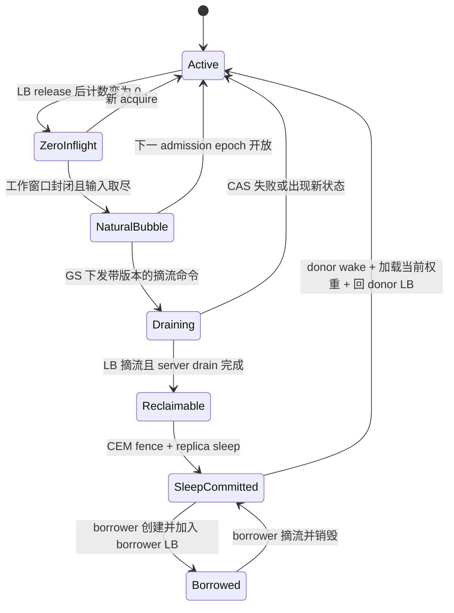
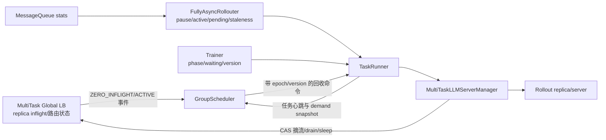
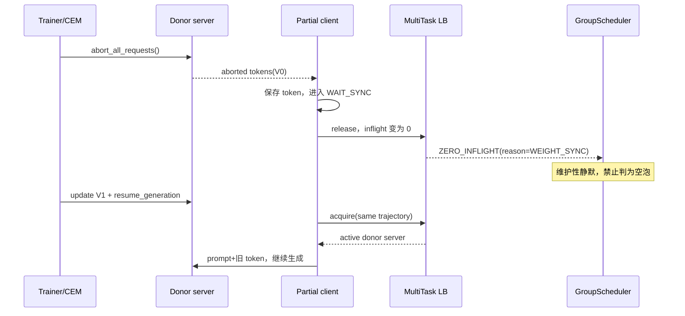
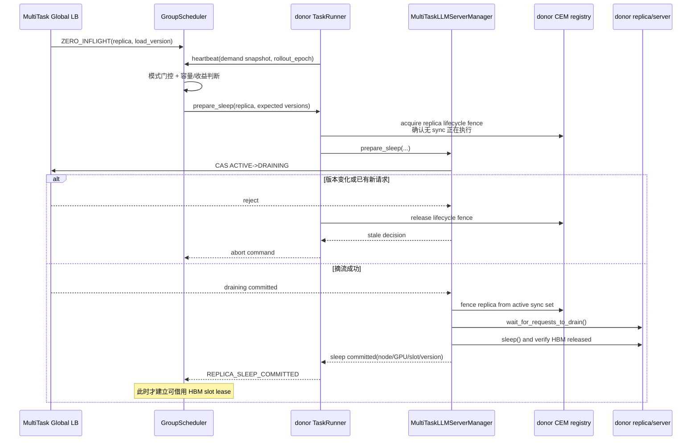

# verl v0.8.0 STANDALONE 各异步模式推理资源空泡识别

> 状态：待评审设计分析。
>
> 代码基线：`/Users/nyp/Documents/verl`，verl v0.8.0，commit `7aed6b23`。
>
> 模式分类以归档文档
> [`10-verl-separated-async-mode-overview.md`](archive/verl-v0.8.0/10-verl-separated-async-mode-overview.md)
> 为准。本文只讨论 STANDALONE 下 One-Step Off-Policy 和 FullyAsync 四种配置如何识别推理资源空泡；
> 识别后的 sleeping slot 复用和 borrower 创建流程沿用
> [`05-standalone-initialization-process.md`](05-standalone-initialization-process.md) 第 11 节。

## 1. 结论

五种异步模式不需要五套完全不同的检测器。它们共享同一个 **per-replica 空泡定义**，区别在于各模式用什么
有限工作窗口约束 rollout 生产，以及何时能证明这个窗口已经不再接纳新工作。

最重要的结论是：

1. `GlobalRequestLoadBalancer.inflight == 0` 只能证明 **瞬时无请求**，不能单独证明空泡；
2. FullyAsync 的结构性空泡来自有限 freshness/staleness budget：预算耗尽后 admission 关闭，当前窗口变为有限工作集合；
   没有这个上限或其他背压，Rollouter 会持续提交 sample，不会形成确定性的结构性空泡；
3. admission 关闭后，还要等当前窗口所有 generation 完成首次路由，并排除 partial retry、multi-turn 下一轮及其他潜在
   future acquire；随后各 replica 才随自己的 in-flight 归零而 **逐步** 进入空泡，不要求全局 `active_tasks==0`；
4. `active_tasks==0 && total_inflight==0` 只表示所有 rollout replicas 都已空闲，是全局空泡的最终状态，不是
   单 replica 空泡的定义；
5. Mode 4 的 `partial_rollout` 不制造空泡；它只允许同步时中断并续跑。abort 后 `inflight==0`、但 partial request
   即将重新 acquire 的间隙是伪空泡；
6. 空泡定义止于“当前窗口不会再给该 replica 新工作且它已无请求”。要把它变成可共享 HBM slot，还必须经过
   LB 原子摘流、server drain、Checkpoint Engine fencing 和真实 sleep；
7. “已经出现空泡”与“是否值得跨任务借用”是两个判断。若空闲时间不足以覆盖摘流、sleep、borrower 创建、权重加载、
   回收和 donor 恢复成本，即使 GPU 当前无计算，也不应调度。

五种模式的核心判断如下。

| 模式 | 有限 rollout 工作窗口 | admission 关闭条件 | 单 replica 自然空泡 | 主要误判风险 |
|---|---|---|---|---|
| One-Step | 当前完整 generation batch | batch 分发集合固定 | single-generate 下 `input_exhausted && replica.inflight==0` | 工具阶段结束后再次 generate；下一 batch 即将启动 |
| Mode 1：`T=1,S=0` | `R` 个 RolloutSample | 达到 `R` 的 freshness 上限 | `window_input_exhausted && replica.inflight==0` | 未首次 acquire 的已接纳 sample；同步维护窗口 |
| Mode 2：`T>1,S=0` | `R*T` 个 RolloutSample | 达到 `R*T` 的 freshness 上限 | 同 Mode 1，通常持续更久 | 窗口仍开放时的短暂零流量 |
| Mode 3：`S>0,P=false` | `int(R*T*(1+S))` 个 RolloutSample | 达到 staleness/MQ 上限 | 同 Mode 1，但未完成请求必须自然结束 | 同步 abort 截断请求；reset 后重新推送 |
| Mode 4：`S>0,P=true` | `int(R*T*(1+S))` 个 RolloutSample | 达到有限 staleness/MQ 上限 | 同 Mode 3，且必须没有可回到该 replica 的 partial retry | 把 abort→resume 间隙误认为空泡 |

其中 `R=ppo_mini_batch_size * require_batches`，`T=trigger_parameter_sync_step`，
`S=staleness_threshold`，`P=partial_rollout`。

表中的 FullyAsync 数值是每个 freshness/staleness 窗口的 **预算上限**。权重同步后
`reset_staleness()` 会用 `active_tasks + mq_queue_size` 作为新起点，遗留 backlog 会先占用预算，因此某个新 admission epoch
实际新增的 sample 数可能小于该上限。

## 2. 统一空泡定义与五层状态

资源空泡是 **per-replica、per-work-window** 的状态：

```text
Bubble(replica, window)
= WorkWindowClosed(window)
  && WindowInputExhausted(window)
  && NoFutureAcquire(replica, window)
  && OutstandingRequests(replica, window) == 0
```

- `WorkWindowClosed`：当前 batch/admission epoch 已封闭，不再增加新的 RolloutSample/trajectory；
- `WindowInputExhausted`：窗口内所有已接纳 trajectory 都已完成首次 LB acquire，不存在“已接纳但尚未路由”的请求；
- `NoFutureAcquire`：single-generate 可由 input exhausted 推导；multi-turn/partial 还需 trajectory terminal 或路由 fencing；
- `OutstandingRequests==0`：该 replica 的所有 endpoint in-flight 聚合为零。

空泡从窗口封闭且输入取尽后，该 replica 的最后一个请求完成时开始；在下一 admission epoch 打开、请求重新可以进入时结束。
其他 replicas 可以仍在处理长尾，所以 `active_tasks==0` 不是单 replica 空泡的必要条件。

“空泡存在”到“资源可以跨任务分配”还要经历生命周期事务，建议区分以下五层：

```text
ZERO_INFLIGHT
= LB 观测到该 server 当前 in-flight 为 0

NATURAL_BUBBLE
= WorkWindowClosed
  && WindowInputExhausted
  && NoFutureAcquire(replica)
  && replica.inflight == 0

RECLAIMABLE
= LB 已用 CAS 将 server 从 ACTIVE 切到 DRAINING
  && drain 后 in-flight 仍为 0
  && 不在权重同步/partial resume 等维护状态
  && TaskRunner 持有该 replica 的 lifecycle fence
  && 已从 donor 的 Checkpoint Engine 同步集合中 fencing

SLEEP_COMMITTED
= donor replica 已真实 sleep，权重/KV 所占 HBM 已释放
  && manager 已确认释放的 node/GPU slot

PROFITABLE_SHARED_SLOT
= SLEEP_COMMITTED
  && 预测空闲时长足够覆盖共享事务的完整成本
```

只有 `SLEEP_COMMITTED` 之后，GroupScheduler 才能把 4 张 GPU 对应的 HBM slot 标记为可供 borrower 使用。
`ZERO_INFLIGHT` 和 `NATURAL_BUBBLE` 都不能直接触发 borrower 创建。



## 3. 当前代码能观测什么

### 3.1 replica 级信号

`GlobalRequestLoadBalancer` 当前维护：

```text
server_id -> actor handle
server_id -> inflight count
request_id -> sticky server_id
```

`acquire_server()` 在选择 server 后加一，`release_server()` 在请求结束后减一；`get_status()` 能返回所有
server 的计数。代码位于：

- `verl/workers/rollout/llm_server.py:43-143`：LB、in-flight、动态 add/remove；
- `verl/workers/rollout/llm_server.py:170-220`：client acquire、server generate、finally release。

当前缺少：

- `idle_since`；
- `ACTIVE/DRAINING/SLEEPING` 路由状态；
- generation/window 标识；
- CAS 所需的 `routing_epoch/server_load_version`；
- zero-inflight 状态变化事件；
- 权重同步、partial resume 和 warmup 状态。

所以当前 `get_inflight_count()==0` 只能用于监控，不能作为跨任务复用协议。

### 3.2 FullyAsync 任务级信号

`FullyAsyncRollouter` 当前已有：

| 字段 | 含义 | 代码 |
|---|---|---|
| `paused` | processor 是否因 freshness/MQ 上限停止继续提交 | `fully_async_rollouter.py:504-507,848-893` |
| `active_tasks` | 已提交但尚未完成的 RolloutSample task 集合 | `:513-514,868-876,927-931` |
| `pending_queue.qsize()` | dataloader 已投递、processor 尚未取出的 sample | `:815-846,1101-1119` |
| `staleness_samples` | 当前版本窗口已提交量及 reset 后遗留 backlog | `:529-595,897` |
| `mq_queue_size` | 已完成、等待 Trainer 消费的 sample 数 | `:1077-1119` |
| `max_concurrent_samples` | sample task 并发上限，初始化后固定 | `:541-543` |

这里的 `active_tasks` 是 **sample task 数**，不是 replica in-flight 数；一个 sample 又可能展开为多个 trajectory，
一个 multi-turn trajectory 还可能多次调用 generate。

当前 `idle_ratio` 在 `reset_staleness()` 中按整个 Rollouter 从 drain 完成到恢复的时间计算
（`fully_async_rollouter.py:564-595`）。它是任务级、版本窗口级的回顾指标，不是单个 replica 的实时空泡证明。

### 3.3 Trainer 和 MessageQueue 信号

Trainer 每次从 MessageQueue 阻塞取满 `R` 个 sample，代码位于
`fully_async_trainer.py:275-332`。当前只在取样结束后记录 `total_wait_time`，没有暴露实时
`trainer_waiting_for_samples`。

MessageQueue 的 `get_statistics()` 只有 queue size、生产/消费总数和 drop 数，代码位于
`message_queue.py:85-119`；没有 consumer waiter 数和版本分布。

因此后续扩展需要显式补充“Trainer 正在等样本”和 queue 中样本版本分布，否则 GS 无法区分：

- Rollout 过快，GPU 暂时空闲且队列足够；
- Rollout 过慢，某个 replica 恰好为零但 Trainer 正在缺样本。

### 3.4 server drain、sleep 和维护窗口

- vLLM server 已有 `wait_for_requests_to_drain()`：
  `verl/workers/rollout/vllm_rollout/vllm_async_server.py:676-677`；
- STANDALONE 原生 `sleep()/wake_up()` 当前跳过：同文件 `:604-634`；
- Checkpoint Engine 的非 naive 更新固定执行
  `abort -> release KV -> update -> resume KV -> resume generation`：
  `verl/checkpoint_engine/base.py:470-515`。

所以本文的真实 sleep、按 replica fencing 和动态 HBM slot lease 都属于子仓扩展；STANDALONE 的 server
实现边界见 05 文档。

## 4. 公共判定模型

### 4.1 LB 只上报事实，GS 决定是否为空泡

沿用已确认的通信关系：`MultiTaskGlobalRequestLoadBalancer` 持有 GroupScheduler handle，直接上报 replica
状态变化；TaskRunner 心跳上报任务级需求和版本窗口状态。两条信息在 GS 内按
`task_id + task_session_id + rollout_epoch` 汇合，不增加额外通信组件。



LB 事件表示“这个实例现在为零”；GS 结合模式级 work-window 状态后，才能标记 `NATURAL_BUBBLE`。这样既保留 LB 直接、
低延迟上报，也避免让 LB 推断 Trainer/Rollouter 的算法状态。

### 4.2 瞬时空闲、自然空泡与预测性缩容

建议统一使用以下判定：

```text
zero_inflight(r)
= r.routing_state == ACTIVE && r.inflight == 0

window_input_exhausted(w)
= w.admission_closed
  && w.claimed_not_spawned == 0
  && w.first_acquire_pending == 0

no_waiting_inference(w)
= window_input_exhausted(w)
  && w.partial_retry_pending == 0
  && w.next_turn_pending == 0
  && w.future_turn_sources == 0

natural_bubble(r, w)
= zero_inflight(r)
  && no_waiting_inference(w)
  && no_future_acquire(r, w)
  && not maintenance_or_resume_pending(r)
```

`admission_closed` 的具体来源随模式变化：One-Step 来自 batch 集合固定；FullyAsync 来自有限
`max_required_samples` 或 MQ 背压使 processor 暂停提交。对于 single-generate，窗口输入取尽后不会再有后续 acquire；
对于 multi-turn 和 Mode 4 partial retry，还必须额外证明请求已经 terminal，或者目标 replica 已被路由 fencing。

下面的条件描述的是 **预测性缩容**，不是自然空泡：

```text
predicted_required_concurrency <= capacity_without(r)
```

它允许在 admission 仍开放时主动摘掉一个暂时为零的 replica，但会改变 donor 可用容量。本文不把这种状态计入 rollout
资源空泡；若后续支持，应单独命名为 `PREDICTIVE_RECLAIM_CANDIDATE`。

### 4.3 当前窗口“没有待推理样本”的公式

必须先按 `task_session_id + rollout_epoch` 把当前有限工作窗口 `w` 与 dataloader 为下一窗口预取的数据分开。定义：

```text
C_w = claimed_not_spawned
    = processor 已从 pending_queue 取出、尚未登记 trajectory 的首轮 generation unit 数

U_w = first_acquire_pending
    = 当前窗口已登记、但当前 generation 尚未首次调用 LB.acquire 的 trajectory 数

R_w = partial_retry_pending
    = abort 后等待续推、尚未重新 acquire 的 generation 数

N_w = next_turn_pending
    = multi-turn 已确定存在下一轮、尚未 acquire 的 generation 数

F_w = future_turn_sources
    = 尚未 terminal、当前或后续结果仍可能产生下一轮 acquire 的 multi-turn trajectory 数

Q_w = pending_inference = C_w + U_w + R_w + N_w + F_w

I_r = sum(endpoint.inflight for endpoint in replica r)
I_all = sum(I_r for r in task.replicas)
```

任务级状态为：

```text
NO_WAITING_INFERENCE(w) = WINDOW_CLOSED(w) && Q_w == 0

TASK_CLOSED_DRAIN(w) = NO_WAITING_INFERENCE(w) && I_all > 0

TASK_LONG_TAIL(w)
= TASK_CLOSED_DRAIN(w)

TASK_INFERENCE_IDLE(w) = NO_WAITING_INFERENCE(w) && I_all == 0
```

其中 `WINDOW_CLOSED` 还隐含“原生 Rollouter 的 pause 当前仍有效”。`_monitor_loop()` 在 MQ 水位下降或 staleness 条件解除后可以
设置 `paused=false` 并 `_resume_event.set()`（`fully_async_rollouter.py:1060-1099`）；一旦发生 resume，旧 epoch 的
`WINDOW_CLOSED/TASK_LONG_TAIL` 必须立刻失效，不能跨 epoch 复用。

`Q_w==0` 的含义是当前窗口的工作已经全部跨过 LB acquire 边界，不再有“在 Rollouter/AgentLoop 中等待、尚未交给推理实例”的
工作；`I_all>0` 表示仍有有限的已发送请求没有完成。本文按调度语义把这个封闭 drain 直接称为任务长尾：剩余工作只减不增。
刚进入长尾时可以尚无空闲 replica；请求完成时间出现差异后，`I_r` 归零的 replica 才逐个形成可利用尾部空泡。

这里不能使用 `pending_queue.qsize()==0` 代替 `Q_w==0`：`_feed_samples()` 独立预取数据，队列里可以有下一 epoch 的 sample；反过来，
processor 在 `pending_queue.get()` 后、创建 `active_task` 前还可能因并发上限等待，队列已经减少但 sample 尚未发给 AgentLoop。代码见
`verl/experimental/fully_async_policy/fully_async_rollouter.py:814-846,894-931`。同样，`active_tasks` 是 sample coroutine 集合，
而不是推理请求数：sample 在 AgentLoopWorker 中可以展开为多个 trajectory，见
`verl/experimental/agent_loop/agent_loop.py:473-560`。`prepare_single_generation_data()` 已按 `rollout.n` repeat，首轮
generation unit 数可以在 sample claim 时用 `len(full_batch)` 登记，见
`verl/experimental/fully_async_policy/detach_utils.py:42-71`。

原生 verl 没有 `C_w/U_w/R_w/N_w/F_w` 这些按 epoch 关联的计数器，必须在子仓扩展中新增 `RolloutWorkTracker`：

```python
def close_window(tracker, epoch):
    if not tracker.native_admission_paused(epoch):
        return "NOT_CLOSED"
    tracker.cas_state(epoch, "OPEN", "CLOSING")
    # 排空 processor 的 sample-claim 临界区，防止冻结集合后还有 trajectory 出现。
    tracker.wait_until(lambda x: x.claimed_not_spawned == 0)
    if not tracker.native_admission_paused(epoch):
        tracker.invalidate(epoch)
        return "REOPENED"
    tracker.freeze_accepted_trajectories(epoch)
    tracker.cas_state(epoch, "CLOSING", "CLOSED")
    return "CLOSED"


def on_native_resume(tracker, old_epoch):
    tracker.invalidate(old_epoch)
    tracker.open_next_epoch()


def pending_inference(s):
    return (
        s.claimed_not_spawned
        + s.first_acquire_pending
        + s.partial_retry_pending
        + s.next_turn_pending
        + s.future_turn_sources
    )


def classify_task(s):
    if s.admission_state != "CLOSED":
        return "OPEN_OR_CLOSING"
    if pending_inference(s) != 0:
        return "DISPATCHING"
    if s.total_inflight == 0:
        return "TASK_INFERENCE_IDLE"
    return "TASK_LONG_TAIL"


def classify_replica(r, s):
    if r.inflight != 0:
        return "BUSY"
    if s.admission_state != "CLOSED":
        return "ZERO_INFLIGHT_ONLY"
    if pending_inference(s) != 0:
        return "UNISSUED_WORK_EXISTS"
    if s.maintenance_or_resume_pending(r.id):
        return "MAINTENANCE_QUIESCED"
    if s.future_acquire_may_target(r.id):
        return "FUTURE_ACQUIRE_PENDING"
    return "NATURAL_BUBBLE"
```

`RolloutWorkTracker` 是 GS 内部普通状态，不是额外 Actor/通信组件。TaskRunner 心跳提供窗口/accepted 状态，LB 直接提供
acquire/release 事实；GS 按 generation key 汇合。sample claim 增加 `C_w`；trajectory 登记减少 `C_w`、增加 `U_w`；首次 LB
acquire 减少 `U_w`、增加 `I_r`；release 减少 `I_r`；可续推 abort 增加 `R_w`；multi-turn 非 terminal 时登记 `F_w`，确定下一轮
后转成 `N_w`。每个事件都要携带 `trajectory_id + turn_id + attempt_id` 并幂等去重。两个事件源的 watermark 未对齐时必须保守返回
`DISPATCHING`。

现有 `LLMServerClient` 无法直接生成这些完整事件：`release_server()` 只传 `server_id`，并且在 `finally` 中 fire-and-forget，见
`verl/workers/rollout/llm_server.py:93-99,170-220`。它既不携带 work key，也不区分 terminal、partial retry 和 multi-turn
中间结果。目标 LB API 至少需要：

```text
acquire_server(work_key, routing_epoch)
release_server(work_key, server_id,
               TERMINAL | PARTIAL_RETRY_PENDING | TURN_RESULT_PENDING)
resolve_turn(work_key, TRAJECTORY_TERMINAL | NEXT_TURN_READY)
```

前两个操作在 MultiTask LB Actor 内原子更新 generation 状态、replica inflight 和 `lb_event_seq`；`resolve_turn` 用于精确跟踪
multi-turn。若第一阶段不扩展 AgentLoop 的逐 turn 生命周期，则采用安全降级：只对 single-turn 做逐 replica 自然空泡判断；
multi-turn 必须等相关 `active_tasks==0`，或先将候选 replica 原子切到 DRAINING，才能把 `F_w` 清零。这样虽然损失一部分可共享
时间，但不会把工具调用期间的 zero-inflight 当成可捐赠空泡。

对于 single-turn 且 `partial_rollout=false`，`Q_w==0` 后不会再产生新 generation，因此可直接进入 drain/长尾判断。multi-turn
trajectory 的当前 generation 完成后可能再次调用
`LLMServerClient.generate()`（`verl/experimental/agent_loop/tool_agent_loop.py:208-240`），所以还要确保 trajectory terminal，或者
把候选 replica 路由 fence；Mode 4 则必须把 partial client 在 abort 后的重试计入 `R_w`，代码见
`verl/experimental/fully_async_policy/fully_async_rollouter.py:98-145`。

### 4.4 长尾形成例子

假设窗口 `w=42` 有 16 条 single-turn trajectory、4 个 replica，且 `partial_rollout=false`：

| 时刻 | `C/U/R/N/F` | `I_R0/I_R1/I_R2/I_R3` | completed | 状态 |
|---|---:|---:|---:|---|
| `t0`：16 条全部 acquire | `0/0/0/0/0` | `4/4/4/4` | 0 | 工作全部发出，任务进入 `TASK_LONG_TAIL`，但尚无 replica 空泡 |
| `t1`：短请求先结束 | `0/0/0/0/0` | `0/1/2/3` | 10 | 任务处于 `TASK_LONG_TAIL`，R0 形成自然空泡 |
| `t2` | `0/0/0/0/0` | `0/0/1/2` | 13 | R0、R1 均为空泡，剩余请求集中在 R2/R3 |
| `t3` | `0/0/0/0/0` | `0/0/0/0` | 16 | 整个任务窗口 `TASK_INFERENCE_IDLE` |

从 `t0` 起之所以能断言任务进入长尾，不是因为某个 replica 的计数碰巧为零，而是因为窗口已经关闭、accepted 集合已冻结、
所有 16 条 trajectory 都完成首次 acquire、没有 retry/下一轮/潜在 future-turn 请求，故剩余工作只会减少，不会补入新工作。到 `t1` 时剩余
6 条请求集中在 R1/R2/R3，R0 才形成第一个可利用尾部空泡。若 `pending_queue` 中还有
feed coroutine 预取的下一窗口 sample，它们不属于 `w=42`；直到下一次 admission epoch 打开才有资格进入推理侧。若场景是
multi-turn 且仍有下一轮可能，R0 只能是 `ZERO_INFLIGHT_ONLY`，不能据此共享。

### 4.5 是否值得借用

真正执行跨任务借用前还需满足：

```text
predicted_idle_horizon
>
  donor_drain_and_sleep
+ borrower_create
+ borrower_weight_load_from_DDR
+ borrower_warmup
+ borrower_drain_and_destroy
+ donor_wake_and_weight_restore
+ safety_margin
```

这里的空泡收益可统一统计为：

```text
bubble_gpu_seconds
= replica_gpu_count * confirmed_idle_duration

effective_shared_gpu_seconds
= replica_gpu_count * borrower_active_duration
```

如果只有几十或几百毫秒的请求间隙，而创建一套 4 卡 vLLM replica 需要更久，这不是可利用的跨任务空泡。

## 5. One-Step Off-Policy

### 5.1 空泡怎样形成

One-Step 任意时刻最多有一个下一批 generation future。一个 batch 内的 trajectory 长度不一致时，较早完成的
replica 会在最长 trajectory 结束前形成尾部空闲：

```text
生成 Bk ──────────────────────────┐
R0: [短请求][短请求]----idle------│
R1: [中等请求]----------idle------│  batch 尾部空泡
R2: [长请求----------------------]│
                                  └─ Bk future 完成
                                   权重同步 → 启动 Bk+1
```

代码事实是 `_async_gen_next_batch()` 必须等待整个
`AgentLoopManager.generate_sequences()` 返回，见
`one_step_off_policy/ray_trainer.py:207-258`；随后 `_fit_generate()` 先等待当前 future、同步权重，再启动下一
future，见同文件 `:390-413`。

### 5.2 single-generate 的精确判断

对每条 trajectory 只会调用一次 generate 的 AgentLoop，可复用归档文档
[`07-rollout-instance-idle-detection.md`](archive/verl-v0.8.0/07-rollout-instance-idle-detection.md)
中的 generation tracker：

```text
GenerationKey = (partition_id, global_steps, dispatch_id)
trajectory_id = (prompt_uid, rollout_index)

BATCH_INPUT_EXHAUSTED
= 当前 generation 的所有 expected trajectory_id
  都至少完成过一次 LB acquire

ONE_STEP_TASK_LONG_TAIL
= batch_expected_set_frozen
  && BATCH_INPUT_EXHAUSTED
  && no_partial_or_future_turn_acquire
  && total_inflight > 0
  && weight_sync_state == IDLE

ONE_STEP_REPLICA_IDLE(r)
= ONE_STEP_TASK_LONG_TAIL
  && generation.agent_capability == SINGLE_GENERATE
  && generation.input_exhausted
  && r.inflight == 0
```

`input_exhausted` 之后不会再有当前 batch 的首次请求进入；某个 replica 的最后一个请求 release 后，该实例就能
逐步成为尾部空泡，而无需等整个 batch future 返回。

### 5.3 multi-turn 的边界

对 tool/multi-turn Agent，`input_exhausted` 只表示所有 trajectory 完成过第一次 acquire。某个 trajectory 可能正在
CPU 工具阶段，稍后再次调用 generate。因此：

```text
input_exhausted && r.inflight == 0
```

只能标记 `ZERO_INFLIGHT_ONLY`，不能证明自然空泡。严格条件二选一：

1. 整个 batch 已 terminal，此时所有 trajectory 都不会再 acquire；
2. GS 决定缩掉该 replica 后，LB 对它执行原子 `ACTIVE -> DRAINING`，后续 turn 改路由到其余 donor replica，
   再等待该 server drain。

第二种方式会减少 donor 的在线容量，应额外通过容量预测证明其余 replica 足够；它是“安全摘流产生的可回收容量”，
不等于天然没有需求。

### 5.4 需要排除的时段

- batch 开始分发但 expected trajectory 尚未注册完成；
- 下一 batch future 已创建，新的 acquire 即将到达；
- Checkpoint Engine 正在 abort/update/resume；
- server 正在 wake、load weight 或 warmup；
- validation 与 train generation 使用同一 LB，但 generation key 未隔离。

如果 donor replica 仍属于原生 CEM 同步集合，借用 lease 必须在下一次权重同步前归还；若采用版本化 DDR 权重快照并把 sleeping
replica 从当前同步集合 fencing，则可以跨过该同步点，但 donor 恢复时必须加载最新 published version。

### 5.5 例子

假设 B7 有 8 条 single-turn trajectories 和 3 个 4 卡 replicas。所有 trajectory 已首次 acquire 后，R2 的请求先完成：

```text
input_exhausted = true
R0/R1/R2 inflight = 2/1/0
```

此时 `total_inflight=3>0`，所以 B7 已进入任务长尾；R2 同时形成自然空泡。若预计 R0 的长尾还需 40 秒，而完整共享事务成本为
12 秒，GS 可以摘流并复用 R2；若长尾只剩
3 秒，则只记录空闲指标，不执行 sleep/create。

## 6. FullyAsync Mode 1：On-Policy Pipeline

### 6.1 空泡怎样形成

Mode 1 配置 `T=1,S=0`：

```text
max_required_samples = R
max_queue_size = R
```

processor 提交到 R 个 sample 后达到 freshness 上限，不再提交下一窗口的 sample。这个上限关闭当前 admission epoch，
把持续生产流切成一个只有 R 个 RolloutSample 的有限集合。已接纳、但尚未进入 LB 的 trajectory 继续首次路由；随后各
replica 随自己的请求完成逐步进入空泡。Trainer 取齐 R 个 sample 后执行一次训练 update 和权重同步。

### 6.2 严格判断

Mode 1 的 per-replica 自然空泡条件是：

```text
MODE1_WINDOW_CLOSED
= rollouter.paused
  && pause_reason in {FRESHNESS_LIMIT, MQ_FULL}
  && (staleness_samples >= max_required_samples
      || mq_queue_size >= max_queue_size)
  && accepted_generation_set_frozen

MODE1_TASK_LONG_TAIL
= MODE1_WINDOW_CLOSED
  && PENDING_INFERENCE == 0
  && total_inflight > 0
  && weight_sync_state == IDLE

MODE1_REPLICA_BUBBLE(r)
= MODE1_TASK_LONG_TAIL
  && no_future_acquire(r)
  && r.inflight == 0
```

其中 `WINDOW_INPUT_EXHAUSTED` 不是 `active_tasks==0`，而是窗口内所有 expected trajectories 都完成了首次 LB acquire。
因此全局仍可有长尾 `active_tasks`，先完成工作的 replica 已经可以逐步进入空泡。

若任务声明所有 AgentLoop 为 `SINGLE_GENERATE`，可以在 `active_tasks` 尚未全部归零时按窗口内已提交 sample 的
trajectory tracker 逐 replica 发现尾部空泡。这里不能只看 `paused`：某个 sample 可能已经从 pending queue 取出，
但其 trajectory 尚未执行到 LB acquire。需要增加一个 admission epoch：

```text
1. processor 接纳 RolloutSample 时，先向 LB 注册它实际展开的 expected trajectory ids；
2. 完成注册后，才能创建 _process_single_sample_streaming task；
3. freshness/MQ 触发 pause 时，关闭当前 admission epoch，不再向其增加 expected ids；
4. 每条 trajectory 第一次 acquire 时加入 observed 集合；
5. admission_closed && observed == expected 时，得到 WINDOW_INPUT_EXHAUSTED；
6. SINGLE_GENERATE 下，WINDOW_INPUT_EXHAUSTED && replica.inflight==0
   才是可逐步上报的 per-replica 尾部空泡。
```

`expected` 必须按 sample 实际 `rollout.n` 展开，并在创建生成 task 前注册，避免“状态快照显示没有 active request，
但下一事件就是首次 acquire”的竞态。若是 multi-turn，或者无法证明整个 admission epoch 都是 single-generate，
`WINDOW_INPUT_EXHAUSTED` 不能推出 `no_future_acquire`；此时要么等相关 trajectories terminal，要么使用 LB 原子 DRAINING
阻止存活 task 再次进入目标 replica。

### 6.3 不能使用的简化判断

| 简化条件 | 为什么不成立 |
|---|---|
| `r.inflight==0` | processor 可能马上提交新 sample |
| `paused==true` | admission 虽已关闭，但可能有已接纳、尚未首次 acquire 的 trajectory |
| `active_tasks==0` | 若尚未 pause，processor 可以立即从 pending queue 继续取样 |
| `mq_queue_size==R` | queue 满只能说明生产领先，不能说明 server 已 drain |
| `idle_ratio>0` | 它是 reset 时生成的全局回顾指标，不是实时 per-replica 状态 |

### 6.4 例子

`R=4`、2 个 replicas。Rollouter 已提交 S1—S4，并因 `staleness_samples=4` 暂停。假设 S1—S4 的所有
trajectories 都已完成首次 acquire，此时窗口输入取尽。随后 R0 先完成自己的请求：

```text
admission_closed=true
window_input_exhausted=true
R0/R1 inflight=0/2
```

此时 R0 已进入自然空泡，R1 仍在处理长尾；不需要等待 `active_tasks==0`。等 R1 也归零后，才形成任务级全局空泡。
Trainer 是否已经取满 4 个 sample 影响空泡预计持续多久和是否值得借用，但不改变 R0 的 per-replica 空泡定义。

从 `window_input_exhausted=true && total_inflight=2` 开始，任务已经处于 Mode 1 长尾；`R0=0` 只进一步说明第一个
per-replica 尾部空泡已经出现。

Mode 1 的窗口通常只有一次 actor update 的时长，可能短于创建 borrower 的成本，所以它虽然最容易出现明确 barrier，
未必最容易获得正收益。

## 7. FullyAsync Mode 2：Stream Off-Policy Pipeline

### 7.1 空泡怎样形成

Mode 2 配置 `T>1,S=0`：

```text
max_required_samples = R * T
```

Rollouter 用同一发布版本最多提交 `R*T` 个 sample；Trainer 每取 R 个做一次本地 update，第 T 次完成后才同步。
达到 `R*T` 后关闭 admission，当前窗口变成有限集合。全部已接纳 trajectory 完成首次路由后，各 replica 随请求完成
逐步进入空泡。若 rollout 先完成整个窗口，空泡会覆盖 Trainer 剩余若干本地 update，因此比 Mode 1 更可能持续更久。

### 7.2 严格判断

任务长尾和 per-replica 自然空泡条件与 Mode 1 相同，只是窗口大小变为 `R*T`：

```text
MODE2_TASK_LONG_TAIL
= admission_closed(FRESHNESS_LIMIT or MQ_FULL)
  && (staleness_samples >= max_required_samples
      || mq_queue_size >= max_queue_size)
  && PENDING_INFERENCE == 0
  && total_inflight > 0
  && weight_sync_state == IDLE

MODE2_REPLICA_BUBBLE(r)
= MODE2_TASK_LONG_TAIL
  && no_future_acquire(r)
  && r.inflight == 0
```

Mode 2 额外提供了更好的空闲时长估计：

```text
remaining_local_updates
= T - completed_local_updates_in_current_publish_window

predicted_idle_horizon
≈ remaining_local_updates * p50_or_p90_update_time
  + expected_pre_sync_work
```

若继续使用原生 CEM 集合，预测窗口应截止到权重同步开始；目标 DDR 方案能否跨过同步点，取决于 replica 是否已 fencing
以及 donor 恢复协议。

### 7.3 负载不足与负载不均衡

当 `paused=false`、当前 admission epoch 仍开放时，单个 replica 为零通常只是 least-inflight 路由与请求长度差异造成的瞬时不均衡，
不能定义为结构性空泡。若仍希望回收，只能走独立的预测性缩容逻辑：
此时若仍要回收，只能在以下容量条件通过后，把它单列为预测性回收候选：

```text
predicted_required_concurrency
<= active_replica_capacity - candidate_replica_capacity
```

否则减少 replica 会延长 Trainer 等首批/后续 sample 的时间，反而扩大训练侧气泡。

### 7.4 例子

`R=4,T=4`，Rollouter 已将 16 个 sample 全部发出，`PENDING_INFERENCE=0`，3 个 replica 的
`inflight=0/1/3`，因此任务处于长尾且第一个 replica 已形成空泡。Trainer 刚完成第 2 次本地 update，MQ 中还有 8 个 sample。
若每次 update 约 20 秒，则推理侧预计还有约 40 秒无需生产。完整共享事务成本 12 秒时，这比 Mode 1 更适合借用。

注意：GS 只能使用 `T` 预测窗口，不能为了制造更长空泡擅自修改 `T`；它会改变 off-policy 语义。

## 8. FullyAsync Mode 3：Stale Samples，`partial_rollout=false`

### 8.1 空泡怎样形成

Mode 3 的预算为：

```text
max_required_samples = int(R * T * (1 + S)), S > 0
```

Rollouter 可以在基础训练窗口外预生成 stale sample。有限的 staleness budget 是结构性空泡形成的原因：达到
`max_required_samples`（或同容量 MQ 上限）后 processor 停止接纳新 sample，持续生产流被封闭成有限集合；等窗口内所有
trajectory 完成首次路由后，在 single-generate 或 `no_future_acquire` 已由 terminal/fence 证明的前提下，各 replica 随请求结束
逐步进入空泡。如果没有这个有限预算和 MQ 背压，Rollouter 会持续推送，短暂 `inflight==0` 不能算结构性空泡。

### 8.2 严格判断

```text
MODE3_TASK_LONG_TAIL
= admission_closed(FRESHNESS_LIMIT or MQ_FULL)
  && PENDING_INFERENCE == 0
  && total_inflight > 0
  && weight_sync_state == IDLE
  && quiesce_reason != WEIGHT_SYNC_ABORT

MODE3_REPLICA_BUBBLE(r)
= MODE3_TASK_LONG_TAIL
  && no_future_acquire(r)
  && r.inflight == 0
```

对 single-generate，`WINDOW_INPUT_EXHAUSTED` 可推出不会再有当前窗口请求；对 multi-turn，仍需 trajectory terminal
或路由 fencing。`active_tasks==0 && total_inflight==0` 只表示所有 replicas 的自然空泡都已经出现。

为了判断是否值得借用，还应计算：

```text
queue_coverage_time
= mq_queue_size / trainer_sample_consumption_rate

predicted_idle_horizon
= min(queue_coverage_time, time_until_next_rollouter_reset_or_resume)
```

MQ 中旧 sample 仍绑定其 rollout policy version；queue 够深代表 Trainer 短期不缺数据，但不是无限期空闲保证。
权重同步后的 `reset_staleness()` 会把 `active_tasks + mq_queue_size` 作为新起点，只要低于上限，Rollouter 就可能恢复提交。

### 8.3 `partial=false` 的特殊约束

Mode 3 不能为了快速释放 GPU 主动 abort 长请求。当前权重同步仍会无条件 abort；client 在
`partial_rollout=false` 时不续跑，代码没有显式 drop/regenerate 完整 sample。资源共享如果复用同样手段，会改变样本内容，
不能被视为无损摘流。

因此 Mode 3 只能：

1. 等目标 replica 自然 `inflight==0`；
2. 先从 LB 摘流，使新请求不再进入；
3. 等已有请求自然 drain；
4. 再 sleep。

权重同步 abort 后出现的 `inflight==0` 必须标记为 `MAINTENANCE_QUIESCED`，不能上报为空泡。

### 8.4 例子

`R=4,T=2,S=0.5`，最大预算 12，并假设都是 single-turn trajectory。Rollouter 接纳 S1—S12 后因 staleness 上限关闭 admission。所有 trajectory
完成首次路由后，假设 `inflight=0/1/3`，则任务已经进入长尾，R0 同时进入空泡；不需要等待其他 replicas drain。Trainer 已消费 S1—S8、MQ 中有
S9—S12 时，queue 能直接支撑下一次 R=4 的训练 batch，这会延长空泡的可利用时间，但不是空泡成立条件。

权重同步到 V1 后，MQ 中 4 个 V0 sample 使 reset 起点为 4，Rollouter 还可提交 8 个 V1 sample。因此 GS 必须在
TaskRunner 允许恢复生产前归还 donor 容量，或显式让 TaskRunner 以缩容后的 capacity 恢复，不能只依赖旧的 pause 事件。

## 9. FullyAsync Mode 4：Stale Samples + Partial Rollout

### 9.1 空泡由有限陈旧度预算产生

Mode 4 的生产端默认持续从 `pending_queue` 取 RolloutSample 并创建 generation task。使它停止持续推送的不是
`partial_rollout=true`，而是有限的 staleness/backlog 控制：

```text
max_required_samples = int(R * T * (1 + S))
max_queue_size = max_required_samples

pause_generation
= staleness_samples >= max_required_samples
   OR mq_queue_size >= max_queue_size
```

`staleness_samples` 在 processor 取出一个 sample、准备提交 generation 时增加。因此 Mode 4 的结构性空泡形成链路是：

```text
Rollouter 持续接纳并提交 sample
→ staleness_samples 达到有限上限，或 MQ 达到同容量上限
→ processor 暂停接纳新 sample，关闭当前 admission epoch
→ 已接纳但尚未首次路由的 trajectories 继续进入 LB
→ 当前 epoch 的全部 trajectories 完成首次 acquire
→ single-turn，或已证明没有 partial/next-turn/future-turn acquire
→ 各 replica 随自己的请求完成而逐步进入空泡
→ Trainer 更新/同步后 reset_staleness()
→ admission 重新打开，Rollouter 恢复推送
→ 空泡结束或对应 replica 保持被显式摘流
```

如果移除有限 `max_required_samples`，同时没有 MQ 上限或其他 admission 背压：

```text
pending_queue 持续提供 sample
→ processor 持续创建 generation task
→ LB 持续把新请求路由给空闲 replica
```

这时某个 replica 的 `inflight` 即使短暂变成 0，也只是两个请求之间的瞬时间隙，不是可由运行时结构证明的资源空泡。
所以 Mode 4 必须先由陈旧度控制把无限生产流切成有限工作窗口，才可能定义确定性空泡。

### 9.2 per-replica 空泡的精确条件

Mode 4 的 work window 是两次 admission 开放之间、受 `max_required_samples` 约束的一组 RolloutSamples，而不是传统的
同步 batch。建议为每个 admission epoch 维护：

```text
expected_trajectory_ids
observed_first_acquire_ids
admission_closed
```

processor 必须在创建 sample generation task 前注册其实际展开的 trajectories；达到 staleness/MQ 上限时，原子关闭
epoch，禁止继续增加 expected 集合。然后定义：

```text
MODE4_WINDOW_INPUT_EXHAUSTED
= admission_closed
  && observed_first_acquire_ids == expected_trajectory_ids

MODE4_TASK_LONG_TAIL
= MODE4_WINDOW_INPUT_EXHAUSTED
  && partial_resume_pending == 0
  && next_turn_pending == 0
  && future_turn_sources == 0
  && total_inflight > 0
  && weight_sync_state == IDLE

MODE4_REPLICA_NATURAL_BUBBLE(r)
= MODE4_TASK_LONG_TAIL
  && no_future_acquire(r, current_epoch)
  && r.inflight == 0
```

对于 single-generate trajectory，完成首次 acquire 后不会再请求，所以窗口 input exhausted 后，每个 replica 的最后一个请求
release 就会逐步形成空泡。此时其他 replicas 和 `active_tasks` 可以仍然非零：

```text
admission_closed=true
window_input_exhausted=true
R0/R1/R2 inflight=0/1/3

=> R0 已进入空泡，R1/R2 仍在处理窗口长尾
```

只有当 `active_tasks==0 && total_inflight==0` 时，才能说整个 rollout 集群都处于空泡；它不是 R0 空泡成立的前提。

对于 multi-turn trajectory，首次 acquire 后还可能在工具阶段结束时再次 generate；对于 partial trajectory，同步后还可能
resume。因此 `no_future_acquire(r)` 还需下列证据之一：

- 相关 trajectories 已 terminal；
- 当前 epoch 声明为 single-generate，且不处于 partial resume；
- LB 已把目标 replica 原子切为 DRAINING，后续 turn/retry 明确改路由到其他 donor replicas。

Mode 4 的自然空泡在 `reset_staleness()` 重新打开 admission、使新 sample 可以进入该 replica 时结束。当前代码 reset 后：

```text
staleness_samples = len(active_tasks) + mq_queue_size
paused = false
```

只要 reset 后计数低于 `max_required_samples`，Rollouter 就会继续推送；因此旧的 pause/空泡事件不能跨 reset epoch 直接复用。

### 9.3 partial rollout 不制造空泡

`partial_rollout=true` 的作用是允许权重同步中断 in-flight generation，并由 client 保存 token、等待后重新 acquire 继续生成：

权重同步时的真实顺序是：

```text
abort_all_requests
→ client 收到 aborted output，保存 token
→ release KV / update weights / resume
→ client 重新 acquire server
→ 继续生成剩余 token
```

在中间阶段，LB 可能显示所有 replica 的 `inflight==0`，但 `active_tasks>0`，且
`partial_resume_pending>0`。这些请求不是消失，而是在等待恢复。这一段是维护性暂停，不是由陈旧度窗口耗尽产生的空泡。



因此 LB 事件必须携带或能关联：

- `quiesce_reason=WEIGHT_SYNC/PARTIAL_PREEMPT/NATURAL_RELEASE`；
- `weight_sync_epoch`；
- `partial_resume_pending`；
- `routing_epoch` 和 `server_load_version`。

两种停止推理的现象必须分开统计：

| 现象 | 直接原因 | 当前窗口工作是否完成 | 是否自然空泡 |
|---|---|---:|---:|
| staleness/MQ 上限关 admission，实例完成自己的窗口请求 | 有限陈旧度/backlog 控制 | 对该 replica 是 | 是 |
| 权重同步 abort，client 等待新权重后续跑 | partial rollout | 否 | 否 |

### 9.4 主动抢占容量与自然空泡分离

Mode 4 的 partial 能力可以支持未来的主动抢占，但应单独分类：

```text
PREEMPTIBLE_CAPACITY
= partial_rollout == true
  && request_state 可在 client 侧持久保留
  && retry 被禁止返回目标 replica
  && 其余 donor replica 能加载兼容版本并承接 retry
```

它与自然空泡的区别是：自然空泡中的当前工作已经消费完；主动抢占则迁移或中断尚未完成的工作。后者会引入 retry、
prefix 重建、吞吐下降和 trajectory 跨版本成本，不能计入自然 bubble 指标。

若实现逐 replica 主动回收，可以在目标 replica 上执行：

```text
LB CAS: ACTIVE -> DRAINING
→ 新请求和 partial retry 不再进入目标 replica
→ 已有请求自然完成，或按任务配置允许的 partial 协议 abort
→ retry 路由到其余 donor replicas
→ 目标 replica drain
→ CEM fence
→ sleep
```

但只有当其余 replica 有容量、正确权重版本可用、client 中间状态不依赖被销毁 server 的 KV 时，这个过程才安全。
当前 partial 实现通过“原 prompt + 已生成 token”重新发请求，能重建上下文；仍需显式协议确认，而不能把
Checkpoint Engine 的全体 abort 直接等同于单 replica 弹性迁移。

### 9.5 完整例子

假设 `R=4,T=2,S=0.5`，所以 `max_required_samples=12`，且 S1—S12 都是 single-turn。Rollouter 持续接纳 S1—S12；接纳第 12 个
sample 后达到 staleness 上限，关闭 admission。S1—S12 的所有 trajectories 完成首次 acquire 后：

```text
R0/R1/R2 inflight = 0/1/3
partial_resume_pending = 0
weight_sync_state = IDLE
```

此时 `total_inflight=4>0`，任务已经进入长尾；R0 已进入自然空泡，R1/R2 仍在处理当前窗口。这个空泡的根因是 staleness
budget 已经关闭生产入口，而不是 `partial_rollout=true`。

随后 Trainer 触发同步。S11 在 R1 上生成 30 tokens 后因同步中断，R1 的 in-flight 归零，但 S11 的 client 正等待 V1，
`active_tasks=1, partial_resume_pending=1`。R1 的 zero-inflight 是同步导致的
伪空泡。若 GS 要回收 R1，必须先确保 S11 重试会被 LB 路由到仍为 donor 服务的 R0/R2，并且它们已加载 V1；否则会丢请求
或错误地进入 borrower server。

## 10. 五种模式的统一判定矩阵

| 信号/状态 | One-Step | Mode 1 | Mode 2 | Mode 3 | Mode 4 |
|---|---|---|---|---|---|
| replica `inflight` | 必需 | 必需 | 必需 | 必需 | 必需 |
| 有限工作窗口预算上限 | 完整 batch | `R` | `R*T` | `int(R*T*(1+S))` | `int(R*T*(1+S))` |
| admission 关闭来源 | batch 集合固定 | freshness 上限 | freshness 上限 | staleness/MQ 上限 | staleness/MQ 上限 |
| `WINDOW_INPUT_EXHAUSTED` | `BATCH_INPUT_EXHAUSTED` | 必需 | 必需 | 必需 | 必需 |
| 任务进入长尾 | batch frozen、无待发工作、`total_inflight>0` | window closed、`PENDING_INFERENCE=0`、`total_inflight>0`、sync idle | 同 Mode 1，窗口为 `R*T` | 同 Mode 1，且排除 sync abort | 同 Mode 3，且 partial/next/future pending 全为 0 |
| `active_tasks==0` | batch terminal 可提供更强证据 | 仅表示全局空泡 | 仅表示全局空泡 | 仅表示全局空泡 | 还需排除 partial pending，仍只表示全局状态 |
| MQ backlog | 无 | 通常接近 0 | 窗口内可有 | 重要的 coverage 信号 | 重要，但可能混合 partial |
| Trainer waiting | future 未完成即 rollout 短缺 | 为 true 时不宜缩 | 为 true 时不宜缩 | queue 空时不宜缩 | 同左 |
| pause 原因 | 无 | freshness/MQ | freshness/MQ | staleness/MQ | staleness/MQ |
| 权重同步期间 | 排除 | 排除 | 排除 | 排除 | 强制排除 aborted-zero |
| partial pending | 无 | 正常为 0 | 正常为 0 | 不续跑，但可能有 aborted task | 必须观测 |
| 空泡形成原因 | batch 有限且存在长尾 | freshness 预算关闭生产 | freshness 预算关闭生产 | 有限 staleness budget 关闭生产 | 有限 staleness budget 关闭生产 |
| partial 的作用 | 无 | 正常无收益 | 正常无收益 | 不续跑 | 中断续跑，不制造空泡 |
| 可主动抢占 | 仅 drain/reroute | 不建议 | 不建议 | 不得 abort 制造 | 可选，但单列为 preemptible |

### 10.1 统一决策伪代码

```python
def classify_replica(replica, task):
    if replica.inflight != 0:
        return "BUSY"

    if task.weight_sync_in_progress or replica.warming:
        return "MAINTENANCE_QUIESCED"

    if task.partial_resume_pending > 0 and task.may_retry_to(replica):
        return "RETRY_PENDING"

    if task.mode == "ONE_STEP":
        if task.single_generate and task.input_exhausted:
            return "NATURAL_BUBBLE"
        if task.batch_terminal:
            return "NATURAL_BUBBLE"
        return "ZERO_INFLIGHT_ONLY"

    if task.mode.startswith("FULLY_ASYNC"):
        if not task.admission_closed:
            return "ZERO_INFLIGHT_ONLY"
        if not task.window_input_exhausted:
            return "ADMITTED_REQUEST_NOT_ROUTED"
        if task.future_acquire_may_target(replica):
            return "FUTURE_ACQUIRE_PENDING"
        if task.partial_resume_may_target(replica):
            return "RETRY_PENDING"
        return "NATURAL_BUBBLE"

    return "ZERO_INFLIGHT_ONLY"
```

返回 `NATURAL_BUBBLE` 后仍要经过 GS 收益判断和 manager 的 CAS/drain/sleep 事务，不能直接创建 borrower。

## 11. 需要补充的事件和状态

### 11.1 LB replica 状态

```text
ReplicaLoadState {
  task_id
  task_session_id
  replica_id
  server_ids[]
  routing_state: ACTIVE | DRAINING | REMOVED | SLEEPING | WARMING
  inflight
  idle_since
  routing_epoch
  server_load_version
  quiesce_reason
  last_acquire_at
  last_release_at
}
```

一个 4 卡 replica 可能包含多个 server actor/DP endpoint。空泡判定的资源单位应是 **可整体 sleep 的 replica**；只有其全部
endpoint 都 drain，才能释放这一组 GPU 的 HBM。

### 11.2 TaskRunner 心跳中的需求快照

```text
RolloutDemandSnapshot {
  task_id
  task_session_id
  architecture: ONE_STEP | FULLY_ASYNC
  async_mode: ONE_STEP | MODE1 | MODE2 | MODE3 | MODE4
  rollout_epoch
  trainer_phase
  trainer_waiting_for_samples
  current_param_version
  weight_sync_state
  batch_terminal
  paused
  pause_reason
  admission_epoch
  admission_state: OPEN | CLOSING | CLOSED
  work_snapshot_version
  accepted_generation_count
  accepted_generation_digest
  claimed_not_spawned
  agent_capability
  active_tasks
  pending_queue_size
  mq_queue_size
  mq_version_histogram
  staleness_samples
  max_required_samples
  request_arrival_rate
  token_service_rate
}
```

One-Step 只填写 batch/generation 字段；FullyAsync 填写 queue/window 字段。使用同一个 envelope，GS 可以统一维护任务状态，
不需要为每种模式新增调度 actor。`observed acquire/release`、partial/next-turn disposition 来自 LB 事件，不要求 TaskRunner 再复制一份；
GS 内部 tracker 将其与 `accepted_generation_digest/work_snapshot_version` 对齐后，派生 `U_w/R_w/N_w/F_w` 和
`window_input_exhausted`。

### 11.3 事件幂等和 fencing

LB 向 GS 上报：

```text
GENERATION_ACQUIRED
GENERATION_RELEASED
GENERATION_DISPOSITION_RESOLVED
REPLICA_ZERO_INFLIGHT
REPLICA_ACTIVE_AGAIN
REPLICA_DRAIN_COMMITTED
REPLICA_SLEEP_COMMITTED
REPLICA_WAKE_COMMITTED
```

每个事件携带：

```text
(task_id, task_session_id, rollout_epoch, work_snapshot_version,
 trajectory_id, turn_id, attempt_id, disposition,
 replica_id, routing_epoch, server_load_version, event_seq)
```

GS 按版本丢弃迟到事件。尤其是 `release_server()` 当前为 fire-and-forget，扩展协议不能用一次轮询结果覆盖更新的 acquire；
必须在同一个 LB actor 内完成 generation 状态变换和 `expected_version + inflight==0 + ACTIVE` 的 CAS。TaskRunner 快照与 LB
事件的 generation key/watermark 尚未对齐时，GS 必须保持 `DISPATCHING`，不能发布空泡。

## 12. 从候选到 HBM 空泡的完整时序



TaskRunner 的 lifecycle fence 必须覆盖 CEM registry 修改、drain 和 sleep commit；否则一次权重同步可能在摘流过程中重新把
目标 replica 当作参与者。Mode 4 若走 partial preemption，`wait_for_requests_to_drain()` 前还要执行“保存请求状态、禁止 retry 回目标 replica、
确认 retry 已迁移”的子事务；不能复用自然 drain 的成功条件。

## 13. 对现有类的扩展点

| 组件 | 当前能力 | 空泡识别需要的最小扩展 |
|---|---|---|
| `MultiTaskGlobalRequestLoadBalancer` | sticky、least-inflight、add/remove、计数 | per-replica 聚合、idle_since、路由状态、版本化 CAS、zero/active 事件、generation tracker |
| One-Step trainer/TaskRunner | 一个 batch future | 分发前注册 expected trajectory；batch terminal；Trainer phase 和下一 admission 状态 |
| `FullyAsyncRollouter` | pause、active/pending/staleness/MQ stats | `pause_reason`、`admission_epoch`、实时 demand snapshot、partial pending、动态 capacity |
| `FullyAsyncTrainer` | 阻塞取 R 个样本、local step、同步 | 实时 `trainer_phase`、`waiting_for_samples`、下一同步 deadline |
| `MessageQueue` | size/produced/consumed/drop | 可选 waiter 数、sample policy-version histogram；不新增通信 actor |
| `MultiTaskLLMServerManager` | 目标设计中的生命周期执行器 | prepare/commit/abort sleep、LB CAS、drain、CEM fence、真实 sleep/wake |
| Checkpoint Engine registry | 静态 replica 列表全量同步 | 按 replica fence/unfence、sync epoch、sleeping replica 排除、恢复版本校验 |
| STANDALONE server | generate/drain；原生 sleep no-op | 真正释放/恢复 HBM，返回可验证的 memory/engine 状态 |
| TaskRunner | GS 双向控制入口 | 汇总模式级快照、执行 GS 命令、维护命令和 rollout epoch |

## 14. 不变量

实现时至少保持以下不变量：

1. `inflight>0` 的 replica 绝不能进入 sleep；
2. `DRAINING` 之后不能再有新的 routing lease 指向该 replica；
3. `REPLICA_SLEEP_COMMITTED` 之前，GS 不能把 GPU slot 分配给 borrower；
4. 处于 donor CEM active sync set 的 replica 不能同时由 borrower 使用 HBM；
5. Mode 3 不允许借资源流程通过 abort 截断请求；
6. Mode 4 的 partial retry 不能路由到 borrower LB 或错误权重版本；
7. 旧 `task_session_id/rollout_epoch/routing_epoch` 的事件和命令必须被拒绝；
8. FullyAsync 恢复 admission 前必须重新计算当前可用 replica 数和 `max_concurrent_samples`；
9. `staleness_threshold`、`trigger_parameter_sync_step`、`partial_rollout` 属于算法配置，GS 不得擅自修改；
10. Ray ResourcePool/PG 仍显示 GPU 归 donor；GroupScheduler 的 HBM slot lease 是额外资源真相，二者必须可审计关联。

## 15. 最小验证用例

1. One-Step single-turn：所有 trajectory 首次 acquire 后，短请求 replica 能逐步上报自然空泡；
2. One-Step multi-turn：工具阶段 `inflight=0` 不得直接 sleep，后续 turn 能正常 acquire；
3. Mode 1：admission 已关闭、window input exhausted 后，`active_tasks>0` 时先归零的 replica 能逐步形成空泡；
4. Mode 1：admission 已关闭但仍有 trajectory 未首次 acquire 时，零 in-flight replica 不能形成空泡；
5. Mode 2：达到 `R*T`、输入取尽后，空泡 horizon 能反映剩余 local updates；
6. Mode 3：达到有限 staleness 上限、输入取尽后能逐 replica 识别；reset 恢复前能撤销或续签 lease；
7. Mode 3：权重同步 abort 造成的 zero-inflight 被标为 maintenance，而不是空泡；
8. Mode 4：未达到 staleness/MQ 上限且 admission 持续开放时，短暂 zero-inflight 不计为空泡；
9. Mode 4：达到 staleness 上限、窗口输入取尽后，replicas 能随请求完成逐步形成空泡；
10. Mode 4：aborted partial request 等待重试时，`partial_resume_pending>0` 阻止误判；
11. Mode 4：目标 replica 摘流后，partial retry 只进入其余 donor replicas；
12. 任意模式：bubble 上报后发生新 acquire，旧 `server_load_version` 的 sleep 命令 CAS 失败；
13. replica 含多个 endpoints：仅当全部 endpoint drain 才能 sleep；
14. sleep 返回但 HBM 未达到释放阈值时，不发送 `SLEEP_COMMITTED`；
15. borrower 创建失败时，slot lease 回滚且 donor 能按正确版本恢复；
16. TaskRunner/LB/GS 任一重启后，旧 session 事件不污染新任务；
17. 扩缩后 `max_concurrent_samples` 和实际 active replica capacity 一致。
18. processor 已 `get()`、尚未 spawn task 时，`claimed_not_spawned>0` 阻止空泡误判；
19. pause barrier 完成后 MQ 水位下降触发 resume，旧 rollout epoch 的 long-tail/bubble 立即失效；
20. LB acquire/release 事件乱序或 TaskRunner snapshot 落后时，watermark 未对齐且 GS 保守保持 `DISPATCHING`；
21. multi-turn 没有逐 turn lifecycle hook 时，`active_tasks>0` 或 `future_turn_sources>0` 阻止自然空泡；DRAINING fence 后可安全改路由。

## 16. 评审要点

本文建议先确认以下设计选择，再进入接口和实现设计：

1. 是否接受“LB 上报事实、TaskRunner 上报需求、GS 合并判断”的职责划分；
2. 是否接受 FullyAsync 统一采用“有限预算关闭 admission → window input exhausted → replica in-flight 逐步归零”的定义；
3. 是否确认 `active_tasks==0` 只表示任务级全局空泡，不作为 per-replica 空泡前提；
4. 是否把 Mode 4 的 partial preemption 单列为 `PREEMPTIBLE_CAPACITY`，并确认 partial 不制造自然空泡；
5. 是否以真实 `SLEEP_COMMITTED` 而不是 `inflight==0` 作为可分配 HBM slot 的唯一入口；
6. 第一阶段是否只实现有限 staleness/freshness 窗口关闭后的自然空泡共享，暂不实现持续生产期间的预测性缩容和 Mode 4 主动抢占。

从正确性和最小实现面看，第 6 点建议选择“是”：先覆盖 One-Step single-generate 尾部，以及 FullyAsync
有限 admission epoch 输入取尽后的 per-replica 渐进空泡；持续生产中的容量预测和 partial preemption 放到后续阶段。

## 17. 代码与文档索引

- 模式总览：`archive/verl-v0.8.0/10-verl-separated-async-mode-overview.md`；
- One-Step：`archive/verl-v0.8.0/11-verl-separated-one-step-off-policy.md`；
- Mode 1：`archive/verl-v0.8.0/12-verl-fully-async-mode1-on-policy-pipeline.md`；
- Mode 2：`archive/verl-v0.8.0/13-verl-fully-async-mode2-stream-off-policy.md`；
- Mode 3：`archive/verl-v0.8.0/14-verl-fully-async-mode3-stale-samples.md`；
- Mode 4：`archive/verl-v0.8.0/15-verl-fully-async-mode4-partial-rollout.md`；
- LB：`verl/workers/rollout/llm_server.py:43-220`；
- One-Step batch/future：`verl/experimental/one_step_off_policy/ray_trainer.py:207-258,390-413`；
- FullyAsync freshness/pause/stats：
  `verl/experimental/fully_async_policy/fully_async_rollouter.py:529-595,815-950,1077-1119`；
- FullyAsync Trainer 取样/同步：
  `verl/experimental/fully_async_policy/fully_async_trainer.py:275-332,487-535`；
- MessageQueue：`verl/experimental/fully_async_policy/message_queue.py:26-119`；
- Checkpoint Engine：`verl/checkpoint_engine/base.py:430-515`；
- vLLM drain/STANDALONE sleep：
  `verl/workers/rollout/vllm_rollout/vllm_async_server.py:604-677`。
