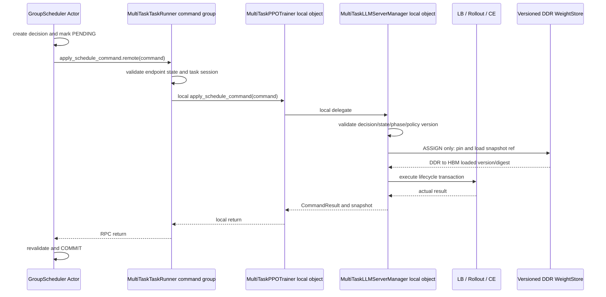

# GroupScheduler 与 TaskRunner 控制面设计

> 状态：当前方案。本文定义 `GroupScheduler` 与多个 `MultiTaskTaskRunner` 之间的注册、主动心跳和
> 规模调整控制面。rollout batch 输入取尽、LB 直报 GS、实例空闲判定和原子摘流见
> [`07-rollout-instance-idle-detection.md`](./07-rollout-instance-idle-detection.md)；动态 replica 的 DDR
> 权重加载见 [`08-versioned-ddr-weight-store.md`](./08-versioned-ddr-weight-store.md)。

## 1. 结论

`GroupScheduler` 与 `MultiTaskTaskRunner` 是一对多关系，并相互持有 ActorHandle。manager 仍是
TaskRunner 进程内由 trainer 持有的普通对象，不需要改成 Ray Actor。

```text
GroupScheduler [Ray Actor]
        ▲
        │ register resources / unregister
        │ heartbeat probe / schedule command
        ▼
MultiTaskTaskRunner [threaded Ray Actor]
        │
        │ local Python call
        ▼
MultiTaskPPOTrainer [普通对象]
        │
        │ local Python call
        ▼
MultiTaskLLMServerManager [普通对象]
        ├─ RolloutReplica / vLLM server Actors
        ├─ MultiTaskGlobalRequestLoadBalancer Actor
        └─ CheckpointEngineManager

MultiTaskGlobalRequestLoadBalancer [Ray Actor]
        │ report_step_idle_replicas.remote(event)
        ▼
GroupScheduler
```

对象所有权：

- TaskRunner 持有 GS ActorHandle、不可变 TaskContext 和 trainer；
- TaskRunner 不持有 manager；manager 只由 trainer 持有；
- GS 为每个已注册任务持有对应 TaskRunner ActorHandle，不持有 trainer/manager 的 Python 引用；
- LB 持有 GS ActorHandle 和不可变 TaskContext，直接上报本任务当前 step 已确定空闲的实例；
- GS 的资源调整命令只能经 TaskRunner→trainer→manager 执行，不能直接命令 LB 或 vLLM server；
- TaskRunner 是任务注册、心跳和规模调整的 RPC endpoint；LB 是独立的推理负载事实来源。

## 2. 为什么当前 TaskRunner 不能直推

verl v0.8.0 sync `TaskRunner` 是默认单并发 Ray Actor：

```python
@ray.remote
class TaskRunner:
    def run(self, config):
        trainer = PPOTrainer(...)
        trainer.init_workers()
        trainer.fit()
```

`run()` 在整个训练期间不返回。默认 Actor method 串行执行，所以 GS 调用：

```python
task_runner.apply_schedule_command.remote(command)
```

只会排队到 `trainer.fit()` 结束，无法在 rollout 内实时扩缩。

解决方式是 opt-in threaded TaskRunner，所有远程入口保持同步 `def`，按用途拆 concurrency group：

```python
@ray.remote(
    num_cpus=1,
    concurrency_groups={
        "training": 1,
        "heartbeat": 1,
        "command": 1,
    },
)
class MultiTaskTaskRunner:
    @ray.method(concurrency_group="training")
    def run(self, config): ...

    @ray.method(concurrency_group="heartbeat")
    def heartbeat(self, probe): ...

    @ray.method(concurrency_group="command")
    def apply_schedule_command(self, command): ...
```

- `training=1`：只运行一个训练主流程；
- `heartbeat=1`：响应 GS 主动探测，返回 endpoint 状态和最近 committed 资源快照；
- `command=1`：CREATE/ASSIGN/RECLAIM 等规模调整严格串行。

heartbeat 与 command 分组，避免耗时 create/destroy 阻塞活性检测。heartbeat 只能读取 trainer/manager
在提交点原子发布的不可变 snapshot，不能绕过生命周期锁遍历正在变化的容器。

不推荐把 TaskRunner 改成 AsyncActor。当前 `run()/trainer.fit()` 是同步长调用，会阻塞 AsyncActor 唯一
event loop，仍然无法实时响应其他 RPC。

## 3. TaskRunner 成员

```python
class MultiTaskTaskRunner:
    def __init__(self):
        # verl 原有成员
        self.role_worker_mapping = {}
        self.mapping = {}

        # 新增控制面成员
        self.group_scheduler = None
        self.task_context = None
        self._trainer = None
        self._control_state = TaskRunnerControlState.CREATED
        self._state_lock = threading.Lock()
```

| 成员 | 职责 |
|---|---|
| `group_scheduler` | TaskRunner 对外通信使用的 GS ActorHandle；初始化后只读 |
| `task_context` | 不可变 task id/task session id，用于 fencing |
| `_trainer` | 让 control method 访问 trainer 的窄控制接口 |
| `_control_state` | TaskRunner endpoint 状态，不等于 rollout phase |
| `_state_lock` | 保护上述对象的发布和读取 |

TaskRunner 不保存 manager、replicas、LB、CE、`state_version`、`decision_id` 或 manager lifecycle lock。

## 4. 初始化与注册

Task/session identity 由 TaskRunner 创建：

```python
@dataclass(frozen=True)
class TaskContext:
    task_id: str
    session_id: str
```

推荐流程：

```python
@ray.method(concurrency_group="training")
def run(self, config):
    self._set_control_state(TaskRunnerControlState.INITIALIZING)
    trainer = None
    registered = False

    try:
        group_scheduler = get_or_create_group_scheduler(...)
        task_context = TaskContext(
            task_id=config.multi_task.task_id,
            session_id=uuid4().hex,
        )
        self_handle = ray.get_runtime_context().current_actor

        trainer = MultiTaskPPOTrainer(
            ...,
            task_context=task_context,
            group_scheduler=group_scheduler,
        )
        self._publish_control_context(
            group_scheduler=group_scheduler,
            task_context=task_context,
            trainer=trainer,
        )

        trainer.init_workers()
        registration = trainer.build_task_registration(
            task_runner_handle=self_handle,
        )
        ray.get(self.group_scheduler.register_task.remote(registration))
        registered = True

        self._set_control_state(TaskRunnerControlState.CONTROL_READY)
        trainer.fit()
    except Exception:
        self._set_control_state(TaskRunnerControlState.FAILED)
        raise
    finally:
        self._set_control_state(TaskRunnerControlState.CLOSING)
        if trainer is not None:
            trainer.begin_close()
        try:
            if trainer is not None:
                trainer.close()
        finally:
            if registered:
                ray.get(self.group_scheduler.unregister_task.remote(self.task_context))
            self._set_control_state(TaskRunnerControlState.CLOSED)
```

`group_scheduler` 必须在 `trainer.init_workers()` 前传入，因为 manager 会在该阶段创建任务内 LB，
LB 必须从创建时就持有 GS handle 和 TaskContext。`task_runner_handle` 不需要传给 LB，只进入任务注册，
供 GS 保存并主动心跳、下发规模调整命令。

trainer 对 TaskRunner 只暴露窄接口：

```python
class MultiTaskPPOTrainer(PPOTrainer):
    def build_task_registration(self, task_runner_handle): ...
    def get_committed_scheduler_snapshot(self): ...
    def apply_schedule_command(self, command): ...
    def begin_close(self): ...
```

TaskRunner 不访问 `trainer.llm_server_manager` 字段；trainer 内部再委托它唯一持有的 manager。

## 5. GroupScheduler 与 TaskRunner 的两类交互

GS 与每个 TaskRunner 只通过以下两类协议交互：

```text
A. task/resource membership 与主动心跳
   TaskRunner → GS: register_task / unregister_task
   GS → TaskRunner: heartbeat

B. 推理实例规模调整
   GS → TaskRunner: apply_schedule_command
   TaskRunner → GS: CommandResult（原 RPC 返回）
```

LB 的空闲上报是独立的数据面事实链路：

```text
MultiTaskGlobalRequestLoadBalancer → GroupScheduler: report_step_idle_replicas
```

它不经过 TaskRunner，也不扩大 GS 对执行面的控制权限。

### 5.1 注册、主动心跳与注销

任务完成本地 ResourcePool、WorkerGroup、初始 replicas、LB 和 CE 初始化后，TaskRunner 将实际资源
注册到 GS：

```text
TaskRegistration
  task_id / task_session_id
  task_runner_handle
  worker inventory
  initial replica bindings
  topology/capabilities
  committed state_version
```

GS 保存 `task_id/session_id → TaskRunner ActorHandle`，在 heartbeat tick 中并发主动探测：

```python
replies = await asyncio.gather(
    *[
        task.task_runner_handle.heartbeat.remote(
            HeartbeatProbe(task.task_id, task.session_id, task.last_state_version)
        )
        for task in self.tasks.values()
    ],
    return_exceptions=True,
)
```

TaskRunner heartbeat 入口只返回 endpoint 状态和最近 committed snapshot：

```python
@ray.method(concurrency_group="heartbeat")
def heartbeat(self, probe):
    state, trainer, context = self._get_control_view()
    if probe.task_id != context.task_id or probe.task_session_id != context.session_id:
        return HeartbeatReply.stale_session(context, state)
    if trainer is None:
        return HeartbeatReply.endpoint_only(context, state)
    return HeartbeatReply(
        context=context,
        endpoint_state=state,
        snapshot=trainer.get_committed_scheduler_snapshot(),
    )
```

正常结束时 TaskRunner 显式 `unregister_task(task_context)`，GS 从任务表和可共享资源视图中注销该任务
资源。TaskRunner 异常消失时，heartbeat timeout 只把 session 标记为 suspect/fenced，并触发 Ray
actor/worker 事实核对；未确认物理资源已释放前不能直接重新分配。

### 5.2 推理实例规模调整

GS 基于 heartbeat snapshot 和 LB 空闲事件生成 versioned command，通过已注册的 TaskRunner handle
下发。TaskRunner 校验 endpoint/session 后，本地委托 trainer，再由 trainer 委托 manager。CREATE、
ASSIGN、RECLAIM、sleep/destroy 等动作都遵循这条路径。

ASSIGN 还携带 committed `WeightSnapshotRef`。TaskRunner 只透传；manager 使用本地 loader 让新 replica
从 DDR 加载到 HBM。Mooncake-like store 是权重数据面，不改变 GS↔TaskRunner 的控制路径，也不要求
TaskRunner 持有 store client。

TaskRunner 不解释调度策略，不直接访问 manager 字段，也不直接操作 replica/LB/CE。

## 6. 命令执行



TaskRunner 入口：

```python
@ray.method(concurrency_group="command")
def apply_schedule_command(self, command):
    state, trainer, context = self._get_control_view()
    if state != TaskRunnerControlState.CONTROL_READY:
        return CommandResult.rejected(command, f"TASK_RUNNER_{state.value}")
    if command.session_id != context.session_id:
        return CommandResult.rejected(command, "STALE_SESSION")
    return trainer.apply_schedule_command(command)
```

GS 使用 async method 等待 TaskRunner，不能在 GS actor 内同步 `ray.get()` 阻塞所有任务。命令采用：

```text
plan
→ 写入 PENDING
→ await TaskRunner RPC
→ 重新校验 task/session/expected_state_version
→ 根据 CommandResult COMMIT/PARTIAL/REJECTED
```

TaskRunner 直接返回 `CommandResult`，不能在 handler 中同步等待 GS `report_result`，避免 GS 等
TaskRunner、TaskRunner 又等 GS 的循环等待。

## 7. 并发和一致性

threaded TaskRunner 会让 training/command/heartbeat 线程同时访问 trainer/manager。以下状态只能在 manager 统一
生命周期锁下修改：

- rollout replicas 和 server registry；
- LB membership；
- CE replica 集合；
- worker lease/binding；
- phase、policy version、current snapshot ref、replica loaded digest、`state_version`；
- decision 幂等结果缓存。

trainer 主线程中的 wake/sleep、`update_weights()`、CE add/remove、phase 切换和 close 也使用同一把
生命周期锁。锁只覆盖生命周期事务，不能覆盖整个 PPO step，否则实时扩缩会退化为 step 边界执行。

TaskRunner endpoint 状态：

```text
CREATED
INITIALIZING
CONTROL_READY
CLOSING
CLOSED
FAILED
```

命令协议必须保留：

- `decision_id` 去重；
- task `session_id` fencing；
- `expected_state_version` 乐观校验；
- manager 侧最近命令结果缓存；
- GS 只根据实际 result/snapshot 提交账本。

长 create/destroy 会占用 `command=1`，但不应阻塞独立的 `heartbeat=1`。GS 对已知 PENDING command
使用 command deadline；heartbeat 仍可返回上一个 committed snapshot 和 PENDING 摘要，不能把“命令
尚未完成”误判为任务失联。

## 8. 子仓与 verl 边界

子仓实现：

- `MultiTaskTaskRunner` training/heartbeat/command concurrency groups 和 RPC；
- GS create-or-get、TaskContext、资源注册、主动心跳和注销；
- trainer 窄控制接口和 committed snapshot 发布；
- manager 生命周期锁、命令幂等和事务；
- trainer policy publish hook、VersionedWeightStore 和 manager snapshot loader；
- LB→GS rollout idle 直报，具体方案见 07；
- GS async dispatch、PENDING/COMMIT 和故障处理。

verl 当前 sync `TaskRunner` 已经被 `@ray.remote` 包装，子仓不能把它当普通 Python class 继承。RFC
建议拆成：

```python
class TaskRunnerImpl:
    ...

TaskRunner = ray.remote(TaskRunnerImpl)
```

子仓再 opt-in 包装为 threaded Actor。上游默认 TaskRunner 保持单并发，不改变普通单任务行为。

若上游暂时不提供 plain implementation，PoC 只能在子仓复制 sync TaskRunner 的必要 controller 编排；
可以验证架构，但不应成为长期集成方式。

## 9. 最小验证

1. `trainer.fit()` 运行时，heartbeat 和 command RPC 能及时进入；
2. 同时发送两个命令时，command group 严格串行；
3. 长 command 期间 heartbeat 仍能返回 endpoint 状态、旧 committed snapshot 和 PENDING 摘要；
4. TaskRunner 不保存或直接访问 manager；
5. policy snapshot publish/ref 切换期间，ASSIGN/RECLAIM 被阻塞或明确拒绝；
6. TaskRunner 重启后，旧 task session 的命令和旧 LB 事件全部失效；
7. 命令实际成功但 RPC 返回丢失时，重试不重复创建/销毁；
8. TaskRunner 退出时收敛在途事务并注销 session；
9. threaded controller 不破坏原生 TransferQueue、ReplayBuffer 和训练流程；
10. rollout 空闲识别专项用例全部通过 07 的验证清单。

## 10. 建议决策

若“不增加独立通信组件”是硬约束，采用：

```text
GroupScheduler = 全局调度 Actor
MultiTaskTaskRunner = 每任务注册、心跳和规模调整端点
MultiTaskPPOTrainer = TaskRunner 与 manager 的本地桥
MultiTaskLLMServerManager = 普通生命周期执行对象
MultiTaskGlobalRequestLoadBalancer = 持有 GS handle 的请求路由、step 空闲上报和原子摘流 Actor
```

threaded TaskRunner 必须在 `trainer.fit()` 期间低延迟响应 heartbeat/command RPC，并证明
training/command 通过局部生命周期锁保持 replica、LB、CE、policy version 和 snapshot ref 一致。LB 事件只提供事实，
GS 仍需通过 TaskRunner 命令结果提交资源变化。
