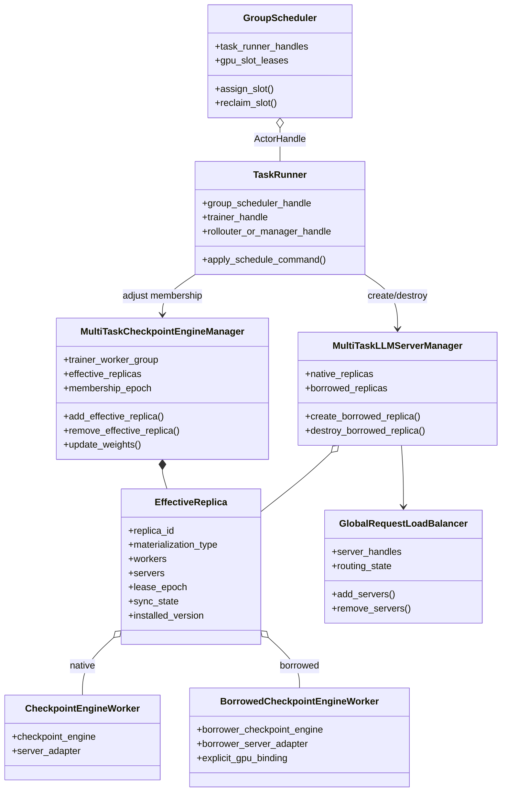
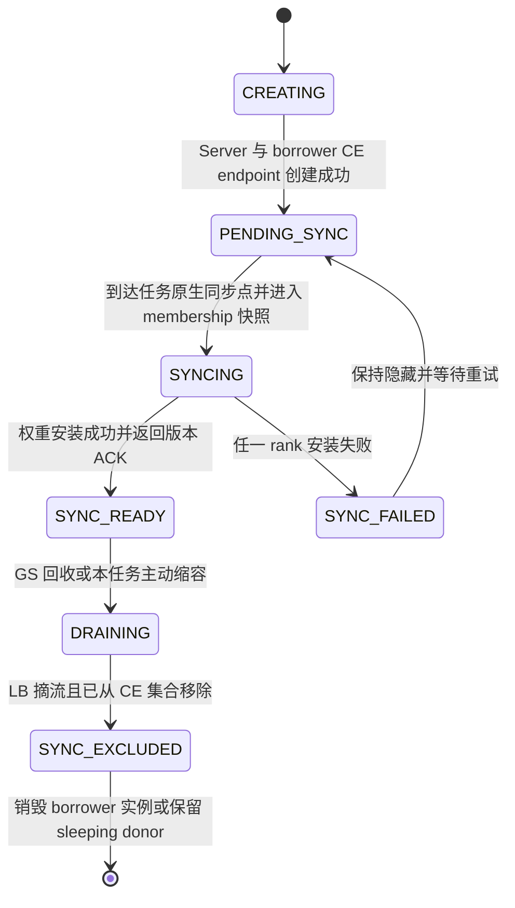
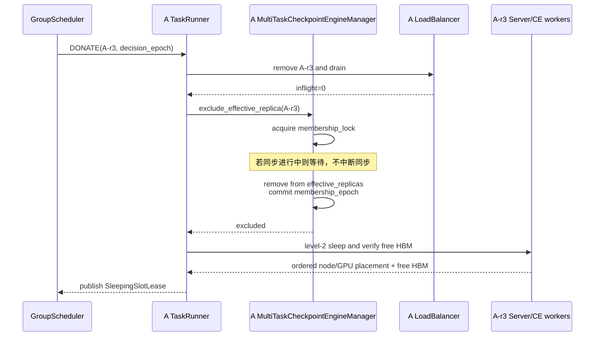
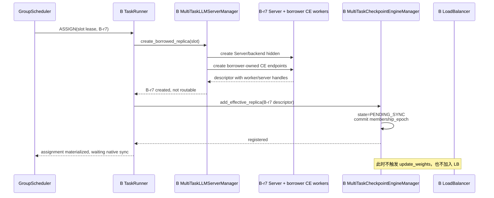
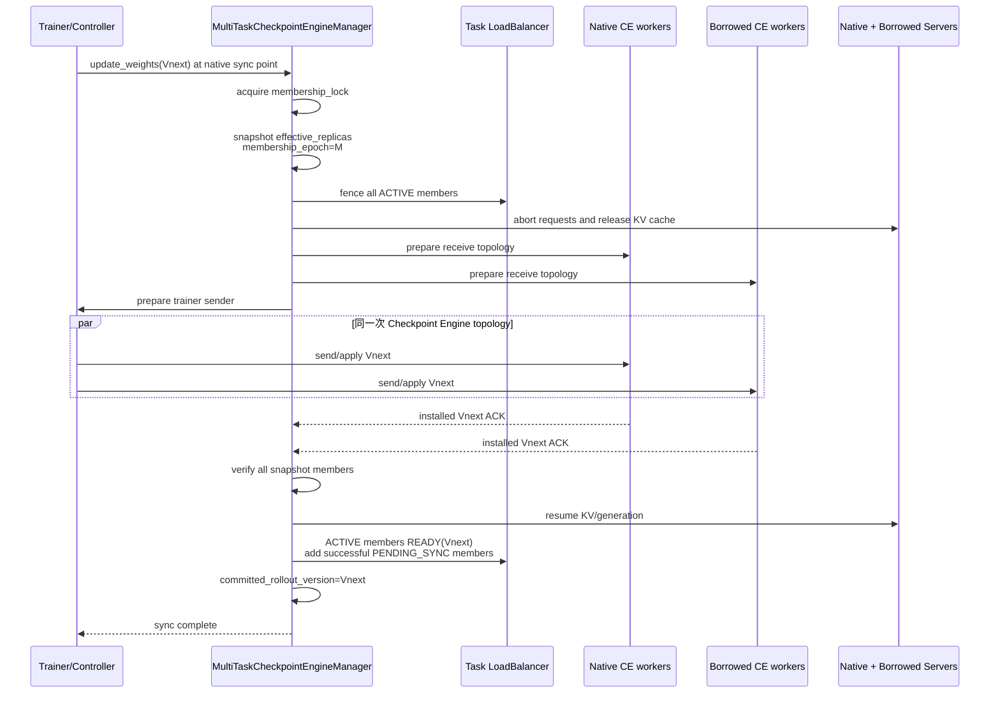

# verl v0.8.0 动态有效 Replica 参数同步方案

> 状态：待评审设计。
>
> 代码基线：`/Users/nyp/Documents/verl`，verl v0.8.0，commit `7aed6b23`。
>
> 适用范围：训推分离 STANDALONE 下的 One-Step Off-Policy 和 FullyAsync Mode 1—4。
>
> 本文只讨论 GroupScheduler 引入后，固有 replica、捐赠 replica 和受赠 replica 如何进入同一次参数同步。
> 本文不改变 verl 的参数同步时机，不让 GroupScheduler 触发参数同步，也暂不依赖 DDR 历史权重快照。

相关背景：

- STANDALONE 初始化和跨任务 GPU 借用见
  [`05-standalone-initialization-process.md`](05-standalone-initialization-process.md)；
- 各异步模式和原生同步时机见
  [`archive/verl-v0.8.0/10-verl-separated-async-mode-overview.md`](archive/verl-v0.8.0/10-verl-separated-async-mode-overview.md)。

## 1. 核心设计

方案只引入一个核心变化：

```text
CheckpointEngineManager.replicas
从“初始化时固定的原生 replicas”
扩展为“当前属于本任务的 effective_replicas”
```

其中：

```text
effective_replicas(task)
= 本任务当前仍持有的固有 replicas
+ GroupScheduler 已分配且本任务已成功物化、注册的受赠 replicas
```

尚未创建成功的 assignment 不进入集合；已经创建但尚未安装权重的受赠 replica 以 `PENDING_SYNC` 状态进入集合，等待
下一次原生同步。

GroupScheduler 的职责是改变这个集合，不是决定何时同步：

```text
GroupScheduler
→ TaskRunner Actor
→ 任务内 MultiTaskCheckpointEngineManager
→ add/remove effective replica
```

verl 到达原生参数同步点后，仍按原有调用链执行：

```text
One-Step/FullyAsync 原生训练循环
→ _fit_update_weights()
→ MultiTaskCheckpointEngineManager.update_weights(version)
→ 对本次 effective_replicas 快照同步
```

因此，GroupScheduler 只调整“同步谁”，不调整“何时同步”和“同步哪个版本”。

## 2. 对当前代码事实的修正

### 2.1 原生 CE 不是按 ResourcePool 自动发现 replica

原生 `CheckpointEngineManager` 构造时接收显式的 `replicas` 列表：

```python
CheckpointEngineManager(
    config=...,
    trainer=...,
    replicas=llm_server_manager.get_replicas(),
)
```

同步时，它遍历 `self.replicas`，收集每个 `replica.workers`，再用这些既有 ActorHandles 创建临时
`RayWorkerGroup`：

```python
workers = []
for replica in self.replicas:
    workers.extend(replica.workers)

rollout = RayWorkerGroup(worker_handles=workers, ...)
```

这段路径不会查询 ResourcePool、Placement Group 或 resource bundle，也不会从 LB 反向发现 Server。对应代码为：

- `verl/checkpoint_engine/base.py:345-385`；
- `verl/checkpoint_engine/base.py:470-490`。

所以，更准确的结论是：

> 原生 CE 的同步范围不是由 Ray 资源视图直接决定，而是由 CE 内部显式持有的 replica/worker handles 决定。

初始化时，这个列表恰好来自原生资源路径，因此看起来与 Ray 资源视图一致。动态借用后，两者不再天然一致，需要
GroupScheduler 经 TaskRunner 显式调整 CE 的 effective replicas。

### 2.2 原生 add/remove 还不足以直接使用

v0.8.0 已有：

```python
CheckpointEngineManager.add_replicas()
CheckpointEngineManager.remove_replicas()
```

但它们只直接修改 Python list，没有：

- stable replica ID；
- membership epoch；
- 与正在执行的 `update_weights()` 互斥；
- pending/active/excluded 状态；
- 逐 replica 安装版本；
- 与 LB 激活状态的提交关系。

因此需要在子仓实现 `MultiTaskCheckpointEngineManager`，扩展而不是旁路这套机制。

## 3. 三种权威视图和一个 CE 执行集合

动态借用后存在三种权威视图：

| 视图 | 权威组件 | 回答的问题 |
|---|---|---|
| verl 原生资源视图 | ResourcePool、PG、bundle、worker actors | 哪个任务在 Ray 中预留了物理 GPU |
| 推理路由视图 | GlobalRequestLoadBalancer | 哪些 Server 当前允许接收请求 |
| 全局物理租约视图 | GroupScheduler | 某个 node/GPU/HBM slot 当前授权给哪个任务使用 |

CE 的 `effective_replicas` 是由以上状态映射得到的参数同步执行集合，不新增另一套资源所有权：

| Replica 类型 | Ray 资源视图 | GS 租约视图 | 本任务 CE | 本任务 LB |
|---|---|---|---|---|
| 本任务固有且未借出 | 本任务持有 | 本任务使用 | 包含 | 同步成功后 ACTIVE |
| 本任务固有但已捐赠 | 仍由本任务 PG 预留 | 使用权给 borrower | donor CE 排除 | donor LB 排除 |
| 其他任务捐赠给本任务 | donor PG 预留 | 本任务持有 lease | borrower CE 包含 | 同步成功后 ACTIVE |
| 正在创建的受赠 replica | donor PG 预留 | 本任务持有 lease | `PENDING_SYNC` | 不可路由 |

必须保持：

```text
LB_ACTIVE(task)
⊆ CE_SYNC_READY(task, committed_rollout_version)
```

不能仅凭 Server 已启动或 GS lease 已生效就把受赠 replica 加入 LB。

## 4. 组件与引用关系



这里 `MultiTaskCheckpointEngineManager` 是 Trainer/controller 内的普通对象，不是 Ray Actor。GroupScheduler 不能直接持有
或调用它，只能通过 TaskRunner 和实际承载 Trainer 的 Actor/进程转发命令。

## 5. EffectiveReplica 模型

建议 CE 内部不要继续只保存裸 `list[RolloutReplica]`，而是按稳定 ID 保存状态：

```python
EffectiveReplica(
    task_id=...,
    task_session_id=...,
    replica_id=...,
    materialization_type="NATIVE" | "BORROWED",
    rollout_replica=...,
    worker_handles=(...),
    server_handles=(...),
    slot_id=None | ...,
    lease_epoch=None | ...,
    sync_state="PENDING_SYNC" | "SYNC_READY" | "SYNC_EXCLUDED",
    installed_version=None | ...,
)
```

状态机如下：



对固有 replica，初始化完成后可以直接进入 `PENDING_SYNC`，经初始参数同步后进入 `SYNC_READY`。

## 6. GroupScheduler 如何调整 CE replicas

GroupScheduler 只发出资源生命周期决策：

```text
DONATE(replica_id)
ASSIGN(slot_lease, borrower_task_id)
RECLAIM(slot_id)
RESTORE(replica_id)
```

TaskRunner 将它们翻译成本任务内部动作。

建议由 Trainer/控制器暴露以下接口，内部再调用 `MultiTaskCheckpointEngineManager`：

```text
exclude_effective_replica(replica_id, expected_membership_epoch)
add_effective_replica(replica_descriptor, expected_membership_epoch)
remove_effective_replica(replica_id, lease_epoch)
restore_effective_replica(replica_descriptor, expected_membership_epoch)
get_effective_replica_state(replica_id)
```

所有接口只更新 membership，不调用 `update_weights()`。

### 6.1 Membership 的提交规则

`update_weights()` 和 add/remove 必须共享同一把异步锁：

```text
membership_lock
```

规则如下：

1. add/remove 在同步开始前完成：本轮同步使用新集合；
2. add/remove 在本轮 snapshot 之后到达：等待同步结束，并在下一轮生效；
3. donor 正在同步时收到捐赠命令：等待本轮同步完成后才能排除和 sleep；
4. borrower 正在同步时收到回收命令：先禁止新流量，再等待同步退出后移除；
5. 每次 snapshot 生成单调递增的 `membership_epoch`，同步期间集合不可变。

GroupScheduler 可以在任意时刻下发扩缩命令，但不能打断已经开始的 CE 同步事务。

## 7. 受赠 Replica 的 CE 接收端

### 7.1 不能复用 donor CheckpointEngineWorker

donor worker 内部已经绑定 donor 的：

```text
rollout_config
model_config
CheckpointEngine backend state
ServerAdapter → donor inference server
```

如果 borrower 把 donor worker handles 放入自己的 CE 集合，borrower 权重最终会传给 donor adapter/server，语义错误。

因此，slot lease 中的 donor worker handles 只能用于：

- 证明 donor PG/worker 仍存活；
- 查询有序 node ID 和 GPU ID；
- 保存 PG/bundle provenance；
- 作为 borrower Server/receiver 的 placement anchor。

不能作为 borrower 的权重接收端。

### 7.2 Borrower-owned CE endpoint

受赠 replica 必须创建 borrower 自己的权重接收端：

```text
BorrowedCheckpointEngineWorker per rollout rank
├─ borrower rollout/model config
├─ borrower checkpoint backend
├─ explicit node/GPU binding from GS lease
└─ borrower ServerAdapter → borrower Server
```

由于 GPU 已被 donor PG 预留，该 worker 不能再申请一份 Ray GPU resource。建议在子仓中实现：

- hard `NodeAffinitySchedulingStrategy`；
- actor 不声明新的 `num_gpus`；
- 根据 lease 显式设置可见 GPU 和 local rank；
- actor/server 名称包含 borrower task/session/replica/lease epoch；
- 由 GS slot CAS 保证同一 HBM slot 不会出现第二个 borrower。

另一种实现是把 CE receiver 接口合入 borrower Server Actor，但这会提高 Server 与 Checkpoint Engine 的耦合，第一版不推荐。

## 8. 捐赠流程

假设任务 A 将固有 replica `A-r3` 捐赠出去：



顺序不能调整：

```text
donor LB 摘流
→ donor CE 排除
→ donor sleep
→ GS 发布 slot
```

如果先 sleep、后从 donor CE 排除，donor 原生参数同步可能重新唤醒或更新该 replica，占用 borrower 即将使用的 HBM。

借出期间：

- A-r3 的 ResourcePool、PG、bundles、CheckpointEngineWorker actors 继续存活；
- A-r3 不在 A-LB；
- A-r3 不在 A-CE `effective_replicas`；
- A 的后续原生参数同步只更新剩余有效 replicas；
- GroupScheduler 不参与这些同步调用。

## 9. 受赠与首次同步流程

假设任务 B 获得 A-r3 的 slot，并创建 `B-r7`：



新 replica 只有在 B 的下一次 verl 原生参数同步中安装成功，才从 `PENDING_SYNC` 变为 `SYNC_READY` 并加入 B-LB。

## 10. 原生同步点上的统一同步

### 10.1 同步入口保持不变

One-Step 仍在原有 `_fit_update_weights()` 执行同步：

- 初始化/恢复 checkpoint 后的首次同步；
- 上一批 generation 完成、下一批 generation 启动之前。

代码位于：

- `verl/experimental/separation/ray_trainer.py:645-650`；
- `verl/experimental/one_step_off_policy/ray_trainer.py:390-413`。

FullyAsync 仍由 `local_trigger_step` 和 `trigger_parameter_sync_step` 决定：

```text
local_trigger_step == 1
→ _fit_update_weights()
→ checkpoint_manager.update_weights(current_param_version)
```

代码位于 `verl/experimental/fully_async_policy/fully_async_trainer.py:487-535`。

GroupScheduler 不新增任何同步入口。

### 10.2 同步时使用 effective replicas 快照



关键点是 native 和 borrowed workers 进入同一个 CE topology，而不是额外创建一套由 GroupScheduler 触发的同步流程。

### 10.3 建议的扩展骨架

```python
class MultiTaskCheckpointEngineManager(CheckpointEngineManager):
    def __init__(self, *args, membership_notifier=None, **kwargs):
        super().__init__(*args, **kwargs)
        self._effective_replicas = {}
        self._membership_epoch = 0
        self._membership_lock = asyncio.Lock()
        self._membership_notifier = membership_notifier

    async def add_effective_replica(self, replica):
        async with self._membership_lock:
            self._effective_replicas[replica.replica_id] = replica
            replica.sync_state = "PENDING_SYNC"
            self._membership_epoch += 1

    async def remove_effective_replica(self, replica_id):
        async with self._membership_lock:
            replica = self._effective_replicas.pop(replica_id)
            replica.sync_state = "SYNC_EXCLUDED"
            self._membership_epoch += 1

    async def update_weights(self, global_steps=None):
        async with self._membership_lock:
            snapshot = tuple(self._effective_replicas.values())
            self.replicas = [item.rollout_replica for item in snapshot]
            await self._fence_routing(snapshot)
            await super().update_weights(global_steps=global_steps)
            await self._verify_and_commit(snapshot, global_steps)
```

这是接口语义示意，不是最终实现。实际实现还要处理 `auto_await`、失败时恢复、逐 replica ACK 和 FullyAsync 跨 Actor 回调。

## 11. FullyAsync 的特殊边界

FullyAsync 中：

- `MultiTaskLLMServerManager` 位于 `FullyAsyncRollouter` Actor；
- `CheckpointEngineManager` 位于 `FullyAsyncTrainer` Actor；
- Trainer 初始化时只调用一次 `rollouter.get_replicas.remote()`，得到普通对象副本；
- Rollouter 后续改变 `rollout_replicas` 不会自动修改 Trainer 内的 CE membership。

因此 GS 的 ASSIGN 流程必须经 TaskRunner 同时完成两件事：

```text
1. Rollouter 创建 borrower Server/CE endpoints，返回 EffectiveReplica descriptor
2. Trainer Actor 把 descriptor 加入 MultiTaskCheckpointEngineManager
```

不能只执行：

```text
rollouter.llm_server_manager.rollout_replicas.append(...)
```

否则 LB 可能看到新 Server，而 Trainer 内 CE 仍然不知道它。

One-Step 已支持通过配置注入自定义 Checkpoint Engine Manager：

```text
actor_rollout_ref.rollout.checkpoint_manager_class
```

代码位于 `verl/experimental/separation/ray_trainer.py:118-133`。

FullyAsync 的 `_setup_checkpoint_manager()` 目前硬编码 `CheckpointEngineManager`，见
`verl/experimental/fully_async_policy/fully_async_trainer.py:167-174`。第一版可以在子仓继承 `FullyAsyncTrainer` 并覆盖该方法；
后续 RFC 建议给 FullyAsync 增加与 One-Step 相同的 class injection 扩展点。

## 12. 归还与 donor 恢复

borrower 释放 B-r7：

```text
B-LB remove + drain
→ B-CE remove_effective_replica(B-r7)
→ 销毁 B-r7 borrower CE endpoints 和 Server
→ B TaskRunner 向 GS 释放 lease
```

donor A 收回 slot 后，A-r3 仍不能直接 wake 并加入 A-LB，因为借出期间它被排除在 A 的参数同步之外。

恢复流程为：

```text
A-r3 保持不可路由
→ A-CE restore_effective_replica(A-r3)，状态=PENDING_SYNC
→ 等 A 下一次原生参数同步
→ A-r3 与其他 A replicas 一起安装 Vnext
→ ACK 后 wake/warmup
→ 加回 A-LB
```

这同样不要求 GroupScheduler 触发参数同步。GS 只把 slot 使用权归还给 A；A-r3 何时重新可服务，由 A 的下一次原生 CE
同步决定。

## 13. 无历史快照时的生效边界

假设：

```text
committed rollout version = V3
Trainer 当前中间权重 = V3.2
```

此时刚创建的受赠 replica 不能立即安装 V3，因为原生 CE 从 Trainer 当前内存模型导出权重，不保存 V3 历史快照。

在“不让 GS 触发同步、不使用历史快照”的约束下，唯一安全路径是：

```text
受赠 replica 以 PENDING_SYNC 隐藏创建
→ 等 borrower 下一次原生同步点
→ 与所有 effective replicas 一起安装 V4
→ 加入 LB
```

因此以下三个目标不能同时满足：

1. GroupScheduler 不改变原生参数同步时间；
2. 不保存历史 rollout 权重版本；
3. 新受赠 replica 创建后立即接流。

本方案选择前两项，接受新 replica 在下一次自然同步后生效。

## 14. 动态 topology

受赠、归还会改变 CE rollout world size。

### 14.1 NCCL

NCCL backend 默认 `rebuild_group=false`。membership 变化后复用旧 group 会触发 rank/world-size 断言。

第一版必须配置：

```yaml
checkpoint_engine:
  backend: nccl
  engine_kwargs:
    nccl:
      rebuild_group: true
```

这样每次同步 finalize 后销毁 group，下次按当前 effective replicas 重建。

### 14.2 NIXL

NIXL 每次同步都会按当前 world size 构建 topology 并在 finalize 清理，更适合高频 membership 变化。但 NIXL 只解决数据面
拓扑，仍然需要本文定义的 membership lock、epoch、LB fence 和安装 ACK。

## 15. 版本提交与失败处理

### 15.1 版本不变量

```text
所有 LB ACTIVE replicas 的 installed_version
= committed_rollout_version
```

每条 rollout output 仍记录实际生成它的 behavior policy version。Mode 3 的 stale sample 和 Mode 4 的 partial trajectory
语义保持不变，GS 不参与陈旧度控制。

### 15.2 同步中单 replica 失败

如果 native 或 borrowed 任一 receiver 失败：

```text
不提交 Vnext
→ 本次 snapshot 中所有 replicas 保持不可路由
→ 失败 replica 保持 SYNC_FAILED/PENDING_SYNC
→ 在 verl 下一次重试路径或同一同步调用的恢复逻辑中全量重试
```

不能让同步成功的部分先恢复 LB，否则会出现混合版本 serving。

### 15.3 Membership 命令失败

- add 失败：受赠 Server 保持 hidden，清理 borrower 进程并释放 lease；
- donor exclude 失败：禁止 sleep 和发布 slot；
- remove 失败：先保持 LB 摘流，不释放 slot；
- 迟到命令：通过 task session、lease epoch、membership epoch 拒绝；
- TaskRunner 重启：从 CE、LB、GS 三方状态对账，无法证明一致的 replica 先保持不可路由。

## 16. 最小改造点

| 组件 | 当前行为 | 目标扩展 |
|---|---|---|
| `CheckpointEngineManager` | 固定 list；add/remove 无锁 | `MultiTaskCheckpointEngineManager`、effective map、epoch、lock、snapshot |
| `CheckpointEngineWorker` | 绑定初始化任务的 adapter/server | 保持固有 replica 使用；不跨任务复用 |
| borrower receiver | 不存在 | borrower-owned CE worker，显式 node/GPU binding |
| `MultiTaskLLMServerManager` | 管理本任务 Server | 创建/销毁 borrowed replica，返回 descriptor |
| One-Step Trainer | 支持 manager class injection | 配置使用子仓 manager |
| FullyAsync Trainer | 硬编码原生 manager | 子类覆盖或新增 class injection |
| TaskRunner | 启动训练任务 | 转发 GS 命令并协调 Rollouter/Trainer membership |
| LB | 仅维护 server handles/inflight | hidden、SYNCING、READY(version)、DRAINING 状态 |
| GroupScheduler | node/GPU lease | 只下发 add/remove 生命周期命令，不触发参数同步 |

## 17. 最小验证用例

1. 初始化后 CE effective replicas 与本任务固有 replicas 一致；
2. donor replica 被借出后仍存在于 Ray PG，但不再进入 donor CE topology；
3. donor 借出期间的原生参数同步不会唤醒或写入 sleeping donor replica；
4. borrower Server 创建成功但未同步时不出现在 LB active set；
5. borrower 的下一次原生同步同时覆盖固有和受赠 replicas；
6. borrower 权重只进入 borrower-owned adapter/server，不调用 donor adapter；
7. 受赠 replica 在同步成功后才加入 LB；
8. GS 命令不会直接调用 `_fit_update_weights()`；
9. add 在 membership snapshot 后到达时等待下一次原生同步；
10. donor 正在同步时，捐赠事务等待同步结束再排除；
11. NCCL membership 改变后按新 world size 重建 group；
12. 单个 borrower receiver 失败时，committed version 不推进且任何新旧 replica 都不提前接流；
13. borrower 释放后从 borrower CE/LB 同时消失；
14. donor 收回后先进入 `PENDING_SYNC`，下一次 donor 原生同步完成后才回 LB；
15. FullyAsync 中 Rollouter membership 改变会显式传播到 Trainer CE，而不是依赖序列化副本自动变化。

## 18. 待评审结论

本方案建议确认以下约束：

1. CE 是本任务所有有效推理 replicas 的统一参数同步入口；
2. `effective_replicas = 未借出的固有 replicas + 当前受赠 replicas`；
3. GroupScheduler 只经 TaskRunner 调整 CE membership，不触发参数同步；
4. add/remove 与 `update_weights()` 使用同一 membership lock；
5. 受赠 replica 必须具有 borrower-owned CE endpoint；
6. donor worker handle 只作 placement anchor，不能成为 borrower 权重接收端；
7. 新增和归还 replica 都在各自任务下一次 verl 原生同步后进入 LB；
8. STANDALONE 下 native 和 borrowed endpoints 进入同一个 CE topology；
9. 动态 NCCL topology 第一版启用 `rebuild_group=true`；
10. 不使用历史快照时，不承诺受赠 replica 创建后立即接流。

一句话总结：

> GroupScheduler 动态改变 CE 眼中的有效 replicas；CE 在 verl 原生时间点，对当时所有有效 replicas 执行统一参数同步。

## 19. 代码索引

- STANDALONE replica/CE worker 创建：`verl/workers/rollout/replica.py:189-239`；
- LLMServerManager replica/LB 初始化：`verl/workers/rollout/llm_server.py:266-363`；
- `CheckpointEngineWorker`：`verl/checkpoint_engine/base.py:278-340`；
- `CheckpointEngineManager`：`verl/checkpoint_engine/base.py:345-515`；
- CEM add/remove：`verl/checkpoint_engine/base.py:414-429`；
- CEM update 和 worker handles 聚合：`verl/checkpoint_engine/base.py:470-515`；
- training-side Checkpoint Engine：`verl/workers/engine_workers.py:620-704`；
- NCCL topology/rebuild：`verl/checkpoint_engine/nccl_checkpoint_engine.py:103-227`；
- NIXL topology：`verl/checkpoint_engine/nixl_checkpoint_engine.py:238-369`；
- One-Step manager class injection：`verl/experimental/separation/ray_trainer.py:118-133`；
- One-Step 原生同步入口：`verl/experimental/separation/ray_trainer.py:645-650`；
- One-Step rollout/sync 顺序：`verl/experimental/one_step_off_policy/ray_trainer.py:390-413`；
- FullyAsync CEM 初始化：`verl/experimental/fully_async_policy/fully_async_trainer.py:167-174,249-254`；
- FullyAsync 原生同步入口：`verl/experimental/fully_async_policy/fully_async_trainer.py:487-535`。
