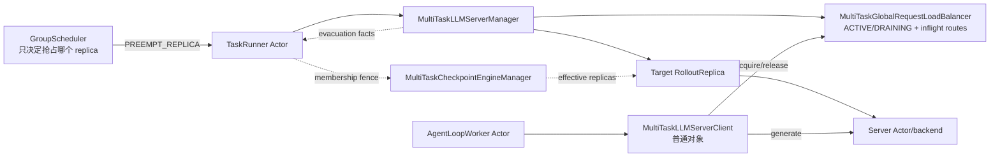
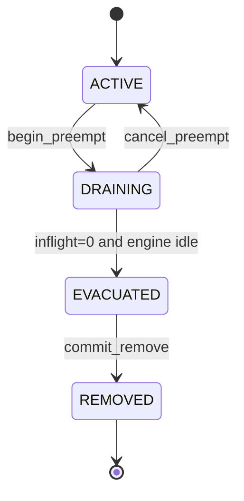
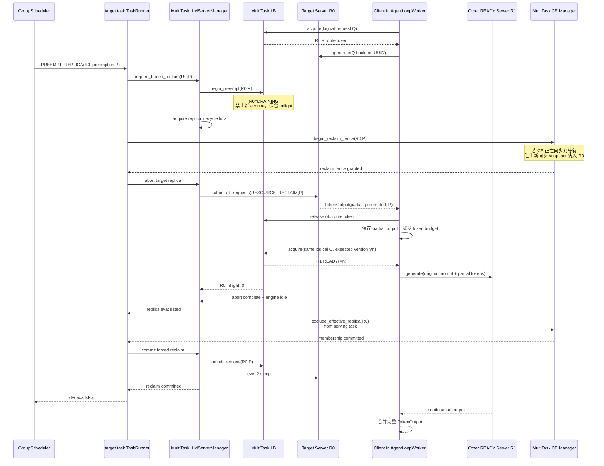

# verl v0.8.0 强制回收推理实例与请求跨实例续推分析

> 状态：待评审设计分析。
>
> 代码基线：`/Users/nyp/Documents/verl`，verl v0.8.0，commit `7aed6b23`。
>
> 适用范围：多任务 GroupScheduler 在异步 rollout 运行期间强制回收某个推理 replica；目标任务可能没有配置
> `partial_rollout=true`，但被回收 replica 上的 in-flight generation 不能丢失。
>
> 本文只分析请求中断、重新路由和续推，不重复讨论 GPU lease、CE effective replicas 和权重同步。后者见
> [`07-async-parameter-sync-checkpoint-engine.md`](07-async-parameter-sync-checkpoint-engine.md)。

本文所说的“目标 replica”是当前正在为某个任务接流、即将被该任务缩掉的 replica。它既可能是任务固有 replica，也可能是
任务当前使用的受赠 replica；两者的请求迁移机制相同，只有后续 GPU lease 归属不同。

## 1. 结论

GroupScheduler 可以复用 verl partial rollout 的底层机制，但不能原样复用，需要将其抽象为独立的
**scheduler-induced request continuation（调度抢占续推）**。

可以直接复用的能力：

- rollout Server 的 `abort_all_requests()`；
- Server 以 `TokenOutput(stop_reason="aborted")` 结束当前 generation；
- client 保存已经返回的 token、log prob 和剩余 token budget；
- client 用 `原 prompt + 已生成 token` 重新发起 generation；
- 每次重试重新通过 LB acquire Server；
- 原 sticky Server 已不可路由时，LB 选择其他有效 replica。

不能直接复用的部分：

- 当前 retry 只在任务级配置 `partial_rollout=true` 时发生；
- 当前 abort 没有区分“参数同步中断”和“资源强制回收”；
- 当前 LB `remove_servers()` 会立刻删除 in-flight counter，无法等待被抢占请求真正离开旧 Server；
- 当前没有 `ACTIVE/DRAINING` 两阶段摘流；
- 当前没有逐请求 preemption ID、route token 和迁移 ACK；
- 当前 vLLM abort 可能返回空 token，不能保证保留所有已计算但尚未返回的 token；
- 当前 FullyAsync partial rollout 不会把请求放回 pending queue、MessageQueue 或 TransferQueue。

所以推荐方案是：

```text
GS 下发 PREEMPT_REPLICA
→ TaskRunner/MultiTaskLLMServerManager 将目标 Server 置为 DRAINING
→ 禁止新请求路由到目标 Server
→ 对目标 replica 执行带 RESOURCE_RECLAIM 原因的 abort
→ 原 AgentLoop coroutine 收到 preempted output
→ client 无视任务的 partial_rollout 配置，强制进入续推循环
→ 再次 acquire LB，路由到其他 READY replica
→ 旧 Server in-flight 归零并确认 engine idle
→ 从 CE effective replicas 排除并 sleep/归还资源
```

GroupScheduler 只触发 replica 生命周期抢占，不接触请求内容，不维护重试队列，也不执行续推。

## 2. 当前 partial rollout 的真实机制

### 2.1 请求没有被放回队列

FullyAsync 当前涉及三个名字容易混淆的队列：

| 队列 | 内容 | 是否承载 aborted 请求 |
|---|---|---:|
| `FullyAsyncRollouter.pending_queue` | dataloader 已产生、尚未提交为 active task 的 `RolloutSample` | 否 |
| FullyAsync `MessageQueue` | 已完成并序列化、等待 Trainer 消费的 `RolloutSample` | 否 |
| verl TransferQueue 集成 | DataProto/tensor 数据传输和训练数据流水线 | 否 |

`pending_queue` 在 `fully_async_rollouter.py:814-930` 中使用。sample 一旦从 queue 取出，就创建
`_process_single_sample_streaming()` task 并进入 `active_tasks`。generation 被 abort 时，这个 task 并没有重新进入
`pending_queue`。

`MessageQueue` 只接收 `_process_single_sample_streaming()` 已经完成的结果，代码位于：

- `fully_async_rollouter.py:933-951`；
- `fully_async_policy/message_queue.py:25-119`。

TransferQueue 是另一套数据传输能力，当前 FullyAsync partial rollout 调用链没有使用它。

因此，“把请求放回 transfer queue”不是 v0.8.0 的代码事实。真实机制是：

> 原 AgentLoop coroutine 不退出；同一个 `FullyAsyncLLMServerClient.generate()` 在 while-loop 内重新调用 LB 和 Server。

### 2.2 当前 client 续推循环

`FullyAsyncLLMServerClient.generate()` 的核心逻辑为：

```text
调用父类 generate
→ 累积本次 token/log_probs
→ 减少 max_tokens/max_new_tokens
→ 如果 stop_reason=aborted 且 partial_rollout=true
   → sleep(1)
   → prompt = original_prompt + accumulated tokens
   → 再次调用父类 generate
→ 否则返回
```

代码位于 `verl/experimental/fully_async_policy/fully_async_rollouter.py:51-151`。

父类 `LLMServerClient.generate()` 每次都会：

```text
LB.acquire_server(logical request_id)
→ Server.generate(new backend UUID)
→ finally LB.release_server(server_id)
```

代码位于 `verl/workers/rollout/llm_server.py:165-220`。

外层 logical request ID 在 retry 中保持不变；发给 backend 的 request ID 每次是新的 UUID。

### 2.3 为什么当前 retry 通常回到原 Server

`GlobalRequestLoadBalancer` 保存：

```text
logical request_id → sticky server_id
```

所以参数同步 abort/resume 后，原 Server 仍在 LB 时，retry 会回到原 Server。若原 Server 已从 LB 有效集合删除，下一次
`acquire_server()` 会清除失效 sticky mapping，并选择其他 Server。

这已经具备跨实例续推的基本条件。

## 3. 两种 partial 语义必须分开

### 3.1 算法型 Partial Rollout

现有 `async_training.partial_rollout=true` 服务于参数同步：

```text
Vn 上生成前段 token
→ 参数同步 abort
→ rollout 更新到 Vn+1
→ Vn+1 上继续后段 token
```

它允许一条 trajectory 跨参数版本，属于算法语义，会影响：

- `min_global_steps/max_global_steps`；
- 逐 token rollout log prob；
- off-policy 程度；
- partial span 和训练精度评估。

因此不能由 GroupScheduler 隐式开启任务级 `partial_rollout`。

### 3.2 调度型 Request Continuation

强制回收的目标是把请求从物理实例 R0 迁到 R1：

```text
R0(Vn) 上生成前段
→ RESOURCE_RECLAIM abort
→ R1(Vn) 上继续后段
```

只要 R1 安装相同的 `committed_rollout_version=Vn`，这不是跨版本 partial rollout，而是同一行为策略下的请求抢占与续推。

因此两种机制应共享 token continuation 实现，但使用不同开关：

```text
should_continue =
    (abort_reason == PARAMETER_SYNC and config.partial_rollout)
    or
    (abort_reason == RESOURCE_RECLAIM and scheduler_preemption_resume_enabled)
```

`scheduler_preemption_resume_enabled` 是多任务运行时能力，不改变 `async_training.partial_rollout` 的算法配置。

## 4. 可复用性判断

| 当前能力 | GS 强制回收能否复用 | 说明 |
|---|---:|---|
| Server `abort_all_requests()` | 可以 | 需要增加 abort reason 和 preemption ID |
| `TokenOutput(stop_reason=aborted)` | 部分 | 需要明确 `RESOURCE_RECLAIM`，不能只有通用 aborted |
| FullyAsync client 的 token/logprob 合并 | 可以 | 抽成通用 continuation loop |
| client 再次调用 LB acquire | 可以 | 是跨 replica 迁移的关键 |
| sticky mapping 自动失效 | 可以 | 目标 Server 必须先进入 DRAINING |
| LB `remove_servers()` | 不可以直接使用 | 会立刻丢失 in-flight 计数 |
| `pending_queue` | 不需要 | active sample coroutine 仍然存在 |
| `MessageQueue` | 不需要 | 只承载已经完成的 sample |
| TransferQueue | 不适合 | 不保存 AgentLoop coroutine/future 和请求续推状态 |
| CE 的全体 replica abort | 不适合直接使用 | 强制回收只应 abort 目标 replica |
| replica `abort_all_requests()` | 可以 | 调用范围正好是目标 replica |

结论是：复用比例较高，但复用点在 **Server abort + client retry + LB re-acquire**，不在队列层。

## 5. 目标组件关系



调用关系：

```text
控制面：GS → TaskRunner → MultiTaskLLMServerManager → LB/Replica
                         ↘ MultiTaskCheckpointEngineManager
数据面：AgentLoop coroutine → Client → LB → Server
恢复面：Server aborted output → 原 Client coroutine → LB → 其他 Server
```

GS 不需要持有 Client、AgentLoopWorker、pending queue 或请求 future 的 handle。

## 6. LB 必须从立即删除改成两阶段摘流

### 6.1 当前 remove 的问题

当前 `GlobalRequestLoadBalancer.remove_servers()` 同时删除：

```text
_servers[server_id]
_inflight_requests[server_id]
```

删除后，即使旧请求仍未收到 abort output，`get_inflight_count()` 也已经无法观察它们；这些请求随后执行
`release_server()` 时，因为 server ID 不存在，release 会被忽略。

所以当前 remove 不能证明请求已安全迁出，更不能作为 sleep 条件。

### 6.2 目标路由状态



各状态语义：

| 状态 | 新 acquire | 已路由请求 | Server handle/inflight counter |
|---|---:|---|---|
| `ACTIVE` | 允许 | 正常执行 | 保留 |
| `DRAINING` | 禁止 | 等待完成或被 abort | 保留 |
| `EVACUATED` | 禁止 | 已全部离开 | 保留，供最终校验 |
| `REMOVED` | 禁止 | 不存在 | 删除 |

建议接口：

```text
begin_preempt(server_id, preemption_id, expected_routing_epoch)
get_preemption_status(server_id, preemption_id)
wait_inflight_zero(server_id, preemption_id)
commit_remove(server_id, preemption_id)
cancel_preempt(server_id, preemption_id)
```

当 sticky request 再次 acquire 时，如果原 server 为 `DRAINING`，必须清除 sticky mapping，并只在其他
`READY(committed_version)` replicas 中选路。

## 7. Abort 必须携带原因和事务 ID

当前 Server 只返回 `stop_reason="aborted"`，Client 无法知道该不该重试。

建议统一协议：

```python
PreemptionContext(
    reason="RESOURCE_RECLAIM",
    preemption_id=...,
    task_id=...,
    task_session_id=...,
    replica_id=...,
    routing_epoch=...,
    source_policy_version=...,
)
```

Server 输出：

```python
TokenOutput(
    token_ids=partial_tokens,
    log_probs=partial_log_probs,
    stop_reason="preempted",
    extra_fields={
        "abort_reason": "RESOURCE_RECLAIM",
        "preemption_id": ...,
        "source_server_id": ...,
        "global_steps": source_policy_version,
    },
)
```

Server wrapper 需要维护当前 generation request registry。Manager 发出 `abort_all_requests(context)` 时：

1. snapshot 当前 backend request IDs；
2. 为这些 IDs 记录相同 `PreemptionContext`；
3. 调用 backend abort/pause；
4. 每个 `generate()` 返回 aborted 时附加对应 context；
5. 所有结果已交付后清理 registry。

这也解决 vLLM backend request ID 是 Client 每次生成的新 UUID、LB sticky key 是外层 logical request ID 的身份断层。

## 8. Client 续推机制

### 8.1 推荐：保留原 coroutine，不引入请求队列

建议从 `FullyAsyncLLMServerClient` 抽取通用 `MultiTaskLLMServerClient`：

```python
while remaining_tokens > 0:
    output = await route_and_generate(
        logical_request_id,
        prompt_ids + accumulated_tokens,
        remaining_tokens,
    )
    append(output.tokens, output.log_probs, output.version)

    if output.abort_reason == "RESOURCE_RECLAIM":
        await acknowledge_preempted(output.preemption_id)
        continue

    if output.abort_reason == "PARAMETER_SYNC" and config.partial_rollout:
        continue

    break
```

优点：

- AgentLoop coroutine、future 和 sample task 都不迁移；
- single-turn 和 multi-turn 当前调用栈保持不变；
- tool loop 已完成的 tool state 仍在 AgentLoopWorker 内；
- 不需要新增 Ray queue actor；
- retry 对 AgentLoop 上层保持透明；
- 与现有 partial rollout 最接近。

### 8.2 不推荐：把 continuation request 放入中央队列

若真正把中断请求放入中央 queue，需要序列化：

- logical request ID；
- prompt、partial tokens、log probs；
- sampling params 和剩余 budget；
- multimodal inputs；
- AgentLoop future/completion callback；
- multi-turn/tool 环境状态；
- policy version 和 preemption epoch；
- exactly-once completion 状态。

现有 pending queue、MessageQueue 和 TransferQueue 都不具备这些语义。新建队列会把“透明 request retry”升级成“分布式
AgentLoop continuation 调度器”，复杂度和故障面显著增加，也与当前不引入额外通信组件的方向冲突。

除非后续要求 AgentLoopWorker 崩溃后仍能恢复 in-flight request，第一版不应引入中央 continuation queue。

## 9. 强制回收完整时序



这里不要求等待续推请求在 R1 上完全生成结束后才 sleep R0。安全释放 R0 的条件是：

```text
R0 不再接受新请求
&& R0 所有旧 generate RPC 已返回/释放 route token
&& R0 backend engine idle
&& R0 已从当前 serving task 的 CE effective replicas 排除
```

请求后续状态已经在 Client coroutine 中，R1 是否生成完成不再依赖 R0。

## 10. 两个不同的完成里程碑

强制回收应区分：

```text
SAFE_TO_SLEEP
= target DRAINING
  && target inflight == 0
  && backend abort/drain complete
  && target CE excluded

REQUESTS_RESUMED
= 每个 preempted logical request
  已在其他 READY replica 上重新 acquire 或已明确失败处理
```

第一版资源调度可以在 `SAFE_TO_SLEEP` 后释放 HBM，不必等待续推全部完成；但必须监控 `REQUESTS_RESUMED`，否则可能出现
资源已经成功回收、请求却因没有可用目标实例而长期等待。

若系统更强调请求完成保证，可以要求所有 preempted requests 至少完成 `REACQUIRED` ACK 后再提交 sleep，代价是回收延迟增加。

## 11. 与 CE 参数版本的关系

### 11.1 非 partial 任务必须同版本续推

对于 `partial_rollout=false` 的任务，调度抢占不应隐式制造跨版本 trajectory：

```text
destination.installed_version
= source.installed_version
= task.committed_rollout_version
```

LB 必须按 07 文档的版本状态，只从 `READY(committed_rollout_version)` replicas 中选择目的实例。

若没有同版本目的实例：

- client 等待 LB 出现有效实例；或
- GS 放弃/延迟本次强制回收；
- 不能把请求随意路由到不同版本并假装不是 partial rollout。

### 11.2 与正在执行的 CE 同步互斥

强制回收和 CE `update_weights()` 必须共享 replica lifecycle/membership fence：

- CE 已在同步：先将目标 LB 置为 DRAINING，再等待同步完成，然后执行 reclaim abort；
- reclaim 已取得锁：CE 下一次 snapshot 不再包含目标 replica；
- 不能在 receiver 正在安装权重时同时 sleep 或销毁 backend；
- 不能在目标已被当前任务移交后，让该任务的 CE 再次写入其 HBM。

GroupScheduler 不控制参数同步时机，只允许回收事务等待正在进行的同步退出。

### 11.3 partial_rollout=true 的任务

如果任务本来允许算法型 partial，调度抢占仍应记录独立 `abort_reason=RESOURCE_RECLAIM`。这样可以分别统计：

- 参数同步导致的跨版本 partial；
- 调度导致的同版本 replica migration；
- 调度期间恰逢版本切换导致的跨版本 continuation。

不能只看 `min_global_steps != max_global_steps` 推断资源抢占次数。

## 12. Backend 能力差异

### 12.1 vLLM

已有：

- `abort_all_requests()`；
- vLLM 新版本使用 `pause_generation(wait_for_inflight_requests=False)`；
- 旧版本为每个 request queue 注入 abort output；
- abort 后返回 request IDs；
- `resume_generation()`。

代码位于 `vllm_async_server.py:679-796`。

限制：vLLM abort 的最终 output 可能为空，当前 wrapper 会返回空 `token_ids`。这意味着已计算但未在最终 abort output 中保留的
token 可能丢失，Client 只能从原 prompt 重新生成当前 turn。语义仍可恢复，但计算无法完全复用。

目标扩展应尽量返回最后一个可见 partial output；如果 backend 无法保证，则显式上报：

```text
continuation_mode = PREFIX_CONTINUE | RESTART_TURN
```

### 12.2 SGLang

已有 `pause_generation(mode="abort")` 和 `continue_generation()`，代码位于
`sglang_rollout/async_sglang_server.py:685-690`。

当前 abort API 不返回 request IDs，需要在 verl Server wrapper 层自己维护 active request registry 和 preemption context。

### 12.3 TRT-LLM

已有 `pause_generation()`、engine idle 等待和 `resume_generation()`；取消的请求会返回 `stop_reason="aborted"`，并尽量携带已经生成的
token/log prob。代码位于 `trtllm_rollout/trtllm_async_server.py:340-407`。

三个 backend 的公共缺口都是：没有标准化的 abort reason、preemption ID 和逐 logical request 迁移回执。

## 13. 对各异步模式的适用性

| 模式 | 原生 partial 行为 | 强制回收能否续推 | 约束 |
|---|---|---:|---|
| One-Step Off-Policy | 使用普通 `LLMServerClient` | 可以，需换成 MultiTask client | 同一 batch 内透明 retry，不改变下一批同步时机 |
| FullyAsync Mode 1 | `partial_rollout=false` | 可以 | 必须同 committed version 迁移 |
| FullyAsync Mode 2 | 通常为 false | 可以 | 中间 Trainer 版本不能作为目的 rollout 版本 |
| FullyAsync Mode 3 | `S>0,P=false` | 可以 | 调度 continuation 与算法 partial 严格分开 |
| FullyAsync Mode 4 | `P=true` | 可以，最接近现有实现 | 仍需独立 abort reason 和回收事务 |

所以不需要为了支持 GS 强制回收，把所有任务都配置成 Mode 4。应把 continuation 能力下沉到多任务 Client/Server 协议，并由
`RESOURCE_RECLAIM` 原因按请求启用。

## 14. 精度与语义影响

即使 source/destination 使用相同权重，跨实例续推也不是迁移完整 engine execution state：

- 不迁移 KV cache；
- 不迁移 backend scheduler state；
- 不迁移 RNG state；
- destination 会重新 prefill `prompt + partial tokens`；
- 后续采样随机流可能变化；
- backend 不能返回 partial token 时可能重做整个 generation turn。

但在同一 policy version 下，从已有 token prefix 重新采样后续 token仍属于同一行为策略的条件分布。训练侧应继续使用每段实际返回的
rollout log prob，不能在 destination 重新计算并覆盖 source 部分的 log prob。

建议新增指标：

```text
scheduler_preemption_count
scheduler_preempted_requests
scheduler_prefix_continuations
scheduler_restart_turns
scheduler_reacquire_latency
scheduler_reclaim_latency
scheduler_resume_failures
scheduler_tokens_recomputed
```

## 15. 无可用目的 Replica 的处理

强制回收前，GS 应优先确认任务至少还有一个满足以下条件的目的 replica：

```text
LB state = READY
installed_version = committed_rollout_version
not target replica
capacity available or can queue reacquire
```

如果目标是任务唯一有效 replica，有三种选择：

1. 延迟回收，等待受赠/固有替代 replica READY；
2. abort 后让 Client 在 LB availability condition 上等待；
3. 放弃当前 sample 并从上游重新生成。

第一版建议使用 1；选项 2 需要 LB 的 `acquire_server()` 从“无实例立即报错”扩展为带 timeout 的条件等待；选项 3 会改变样本计数和
数据完整性，不应作为默认行为。

## 16. 失败处理

### 16.1 Abort 部分成功

若 replica 中部分 server/backend rank abort 失败：

```text
保持 DRAINING
→ 不 sleep
→ 查询 engine active requests
→ 在 deadline 内重试同一 preemption ID
→ 超时则回报 GS reclaim failed
```

不能因为 LB 已经摘流就假定 HBM 可以释放。

### 16.2 Client 没有收到 preemption output

LB route token 仍未 release，`inflight>0`，所以 `SAFE_TO_SLEEP` 不成立。若 AgentLoopWorker 已死亡，需要由任务级失败恢复处理；当前
in-memory continuation 机制不提供跨 Worker crash 恢复。

### 16.3 Reacquire 失败

Client 保留 accumulated output，在 LB availability condition 上等待或按 deadline 失败。旧 Server 只要已经满足
`SAFE_TO_SLEEP`，不需要为了 reacquire 失败重新唤醒。

### 16.4 GS 命令迟到或重复

`preemption_id + task_session_id + replica_id + routing_epoch + lease_epoch` 必须幂等。重复命令返回当前状态；旧 epoch 命令拒绝。

## 17. 建议接口

### 17.1 GroupScheduler → TaskRunner

```python
PreemptReplicaCommand(
    decision_id=...,
    task_id=...,
    task_session_id=...,
    replica_id=...,
    expected_lease_epoch=...,
    expected_routing_epoch=...,
    deadline=...,
)
```

### 17.2 MultiTaskLLMServerManager

```text
prepare_forced_reclaim(command)
abort_replica_requests(replica_id, preemption_context)
wait_replica_evacuated(replica_id, preemption_id)
commit_forced_reclaim(replica_id, preemption_id)
cancel_forced_reclaim(replica_id, preemption_id)
```

### 17.3 MultiTaskGlobalRequestLoadBalancer

```text
begin_preempt(server_ids, preemption_id, expected_epoch)
acquire_server(request_id, expected_version, wait_timeout)
release_route(route_token)
get_preemption_status(preemption_id)
commit_remove(server_ids, preemption_id)
```

### 17.4 MultiTaskLLMServerClient

```text
generate_with_continuation(...)
should_continue(output)
acknowledge_preemption(preemption_id, route_token)
```

### 17.5 Server/Replica

```text
abort_all_requests(preemption_context)
get_active_request_snapshot()
wait_for_requests_to_drain()
get_preemption_receipts(preemption_id)
```

## 18. 最小验证用例

1. `partial_rollout=false` 时，普通 parameter-sync abort 不自动续推；
2. `partial_rollout=false` 时，`RESOURCE_RECLAIM` abort 必须续推；
3. R0 进入 DRAINING 后，新 acquire 不再选择 R0；
4. 已路由到 R0 的请求仍保留 inflight counter，直到 Client release route token；
5. R0 abort 后，同一 logical request ID 在 R1 重新 acquire；
6. R1 与 R0 版本相同时，最终 `min_global_steps=max_global_steps`；
7. backend 返回 partial tokens 时，Client 使用 prefix continuation 并保留前段 log probs；
8. backend 返回空 abort output 时，Client 明确记录 `RESTART_TURN`；
9. R0 inflight 未归零时不能 sleep；
10. R0 engine 未 idle 时不能 sleep；
11. R0 未从当前 serving task 的 CE effective replicas 排除时不能发布 slot；
12. Client 在 R1 续推期间，R0 达到 `SAFE_TO_SLEEP` 后可以独立释放；
13. 没有其他 READY replica 时，GS 默认延迟回收；
14. LB 无实例等待路径不会忙循环或丢失 accumulated output；
15. Mode 4 中 parameter-sync partial 和 scheduler preemption 分别计数；
16. SGLang/vLLM/TRT-LLM 都返回统一 abort reason/preemption ID；
17. 重复 preemption 命令幂等；
18. reclaim 与 CE update 并发时，由 lifecycle/membership fence 串行化；
19. multi-turn 请求在一次 generation 抢占后，tool/AgentLoop 状态保持；
20. GS 全程不持有 request payload、Client future 或 continuation queue。

## 19. 待评审结论

建议确认：

1. GS 可以复用 partial rollout 的 abort/continuation 思路，但不直接依赖任务的 `partial_rollout` 开关；
2. 新语义命名为 scheduler-induced request continuation，而不是强制开启 Mode 4；
3. aborted 请求不进入现有 pending queue、MessageQueue 或 TransferQueue；
4. 第一版保留原 AgentLoop coroutine，在 Client 内透明 reacquire 和续推；
5. LB 必须支持 `ACTIVE → DRAINING → EVACUATED → REMOVED` 两阶段摘流；
6. Server abort 必须携带 `RESOURCE_RECLAIM + preemption_id`；
7. 非 partial 任务只能迁移到相同 committed rollout version 的 READY replica；
8. `SAFE_TO_SLEEP` 由旧 Server inflight=0、engine idle、CE excluded 共同证明；
9. GroupScheduler 只发出抢占命令，实际请求恢复完全留在任务本地数据面；
10. 第一版不引入中央 continuation queue，也不承诺 AgentLoopWorker crash 后恢复 in-flight request。

一句话总结：

> GroupScheduler 可以复用 verl partial rollout 的“abort 后由 Client 重新 acquire 并续推”机制，但需要把它从算法型跨版本
> partial rollout 中解耦，扩展成带抢占原因、LB 两阶段摘流和同版本约束的任务本地请求迁移协议。

## 20. 代码索引

- FullyAsync partial client：`verl/experimental/fully_async_policy/fully_async_rollouter.py:51-151`；
- pending queue/active tasks：`fully_async_rollouter.py:513-522,814-951`；
- MessageQueue：`verl/experimental/fully_async_policy/message_queue.py:25-119`；
- GlobalRequestLoadBalancer：`verl/workers/rollout/llm_server.py:43-143`；
- LLMServerClient acquire/generate/release：`verl/workers/rollout/llm_server.py:165-220`；
- RolloutReplica abort/resume：`verl/workers/rollout/replica.py:273-279`；
- vLLM generate/aborted output：`verl/workers/rollout/vllm_rollout/vllm_async_server.py:500-602`；
- vLLM abort/resume：`vllm_async_server.py:679-796`；
- vLLM replica abort 聚合：`vllm_async_server.py:1062-1101`；
- SGLang abort/resume：`verl/workers/rollout/sglang_rollout/async_sglang_server.py:685-690,830-840`；
- TRT-LLM abort/resume：`verl/workers/rollout/trtllm_rollout/trtllm_async_server.py:340-407`；
- 当前 FullyAsync add/remove replicas：`fully_async_rollouter.py:228-345`；
- Checkpoint Engine abort/sync/resume：`verl/checkpoint_engine/base.py:442-515`；
- partial 版本和指标：`fully_async_policy/detach_utils.py:130-177`；
- FullyAsync 模式说明：`docs/advance/fully_async.md:148-150,212-232`；
- TransferQueue 文档：`docs/data/transfer_queue.md`。
