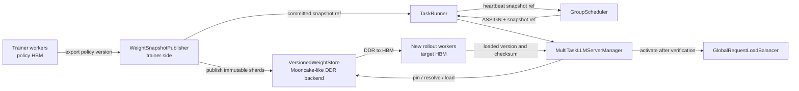
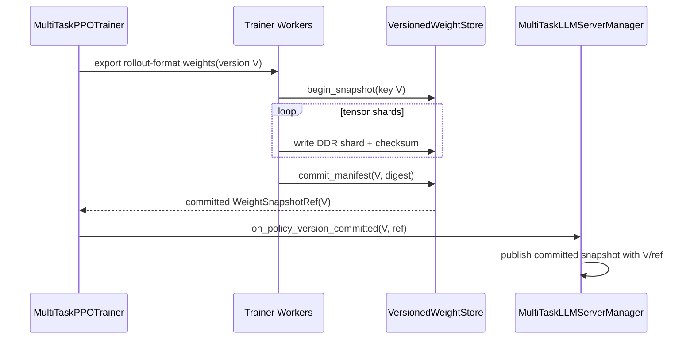
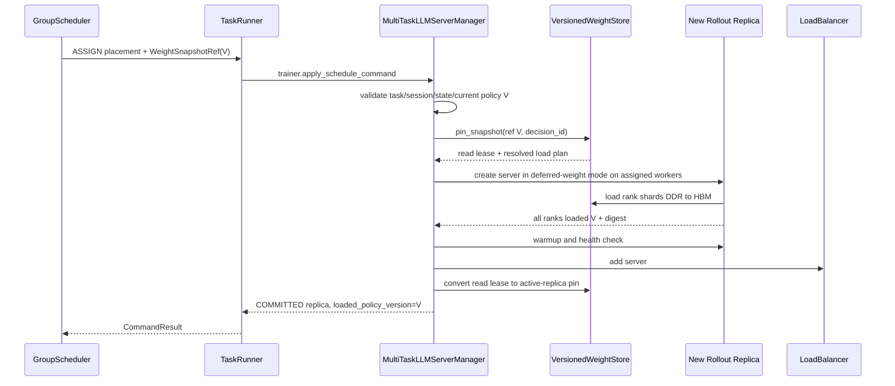

# 版本化 DDR 权重存储与动态推理实例加载

> 状态：当前方案。本文定义多任务动态扩容所需的权重数据面。控制命令仍遵循
> GS→TaskRunner→trainer→manager；本文引入的是 Mooncake-like 存储后端，不是新的调度或控制组件。

## 1. 问题与结论

在 HYBRID sync 路径中，原生权重同步假设 trainer 和既有 rollout replicas 在同步时同时可用。多任务
动态扩容破坏了这个假设：GS 可能在任务已经进入 rollout 后才为它分配新推理资源，此时训练侧正在
sleep、被调度占用，或无法重新参与一次面向新 replica 的 collective/P2P 权重同步。

当前方案改为：

```text
训练侧权重 HBM
  → 在 policy version 提交时发布一次
  → Mooncake-like VersionedWeightStore 的 DDR 快照
  → 动态推理实例按 snapshot ref 从 DDR 直接加载到自身 HBM
  → 校验版本/完整性
  → warmup
  → 加入 LB
```

由此得到四个不变量：

1. 训练侧只负责发布 immutable snapshot，不参与后续每个动态 replica 的加载。
2. GS 只传递 `WeightSnapshotRef`，不传输 tensor，也不管理 DDR 地址。
3. 新 replica 未确认加载目标 policy version 前不能加入 LB。
4. snapshot 在所有读者和在途 ASSIGN 释放 lease 前不能被回收。

## 2. verl v0.8.0 已有能力与缺口

v0.8.0 已包含 `MooncakeCheckpointEngine`：

- 使用 Mooncake `TransferEngine` 注册传输 buffer；
- trainer 与 rollout workers 通过 `StatelessProcessGroup` 交换 buffer metadata；
- receiver 使用 `transfer_sync_read()` 拉取数据；
- checkpoint backend registry 已支持外部 backend module。

但当前代码不能直接满足本方案：

| 当前 Mooncake checkpoint engine | 本方案需要 |
|---|---|
| trainer 与 rollout 同时构建临时 process group | snapshot 发布后 trainer 无需在线参与读取 |
| `CheckpointEngineManager.update_weights()` 同时调用 trainer send 和 rollout receive | 新 replica 可在 rollout 任意时刻独立 load |
| 非 naive 更新先 abort 全部 replicas、release 全部 KV，并为全部 workers 建组 | 只加载新增/待更新 replica，不中断正在服务的其他 replicas |
| buffer 默认位于 CUDA device | 权重以版本化 immutable 对象保存在 DDR |
| buffer/session 服务于一次同步拓扑 | snapshot 有稳定 key、manifest、lease 和 GC 生命周期 |
| 无全局 snapshot catalog | 可按 task/session/policy version 解析对象位置和分片 |
| `add_replicas()` 后仍需下一次 trainer 同步 | ASSIGN 创建后立即从已发布 snapshot 加载 |

因此 Mooncake TransferEngine、内存注册和 RDMA 能力可以复用，但需要在独立子仓实现 store-mode backend，
并向 verl 提交少量发布/加载扩展点。不能把当前 `checkpoint_engine.backend=mooncake` 直接视为已完成。

## 3. 组件与所有权



职责边界：

- `WeightSnapshotPublisher`：从训练模型导出 rollout 可消费格式，写入 DDR，最后原子提交 manifest。
- `VersionedWeightStore`：保存 immutable shards/manifest，提供 pin/read/release/GC；不参与 GS 策略。
- `GroupScheduler`：选择任务和资源，在 ASSIGN 中携带已提交 snapshot ref；不解析 tensor 分片。
- `MultiTaskLLMServerManager`：为新 replica 获取 read lease，组织 DDR→HBM 加载和校验。
- rollout checkpoint worker/adapter：按本 rank 的 shard plan 从 DDR 写入目标 HBM。
- `GlobalRequestLoadBalancer`：仍只处理请求路由和空闲上报，不接触 weight store。

## 4. 版本化对象模型

### 4.1 WeightSnapshotKey

```text
task_id
task_session_id              # fencing 旧 publisher；是否跨 session 复用后续再设计
policy_version               # 与 rollout generation 使用的版本一致
model_fingerprint
weight_format_version
rollout_dtype
```

同一个 key 的发布必须幂等。内容不同却使用相同 key 是硬错误，不能覆盖旧对象。

### 4.2 WeightSnapshotManifest

```text
snapshot_key
state                         # STAGING / COMMITTED / DELETING
tensor metadata[]             # name、shape、dtype、global offset
shards[]                      # object id、DDR locations、length、checksum
load_plan                     # TP/DP/PP rank 到 tensor slice 的映射
total_bytes
created_at / committed_at
publisher_epoch
content_digest
```

GS 和 manager 传递的是稳定 `WeightSnapshotRef`：

```text
snapshot_key
manifest_id
content_digest
store_backend
weight_format_version
```

物理 DDR 地址只由 store resolve，不能固化进 GS 资源账本或长期调度命令，以便副本迁移和后端重平衡。

## 5. 发布时序

训练侧在每次 actor policy commit 后、进入下一轮 rollout 前发布：



约束：

1. manifest 必须最后提交；读者看不到 STAGING snapshot。
2. 发布失败时不能把该 policy version 标为 `ROLLOUT_READY`。
3. 初次 checkpoint load 后也要发布初始 policy snapshot，保证首次动态扩容可用。
4. publisher 可以流水化 HBM→DDR copy，但 `policy_version` 只有在全部 shards 校验完成后才 committed。
5. 训练侧进入 rollout 后可以不再参与读取；DDR 数据生命周期由 store lease 管理。

## 6. 动态 ASSIGN 加载时序



失败语义：

- snapshot 不存在、未 committed 或 digest 不匹配：拒绝 ASSIGN，不启动流量。
- 某 rank 加载失败：整个 replica 不得 ACTIVE；清理已写 HBM 和 server，再返回 FAILED/PARTIAL。
- 加载期间任务 policy 已推进：若 command 的 V 已不再匹配目标 generation，返回 STALE_VERSION；不能
  静默改载 V+1 后服务 V 的 batch。
- LB add 前失败：释放 read lease 和 worker lease；不得留下可路由半成品。
- replica 更新到新 snapshot 或被销毁时，释放旧 active-replica pin。

动态创建最好提供 deferred-weight/empty-target 初始化：构造模型拓扑和 HBM 目标 buffer，但不先从模型
checkpoint 重复读取一遍再覆盖。若首版只能“正常加载后再覆盖”，功能上可验证，但必须单独计入磁盘
load 浪费，不能把它当作最终 DDR 直载性能。

## 7. 与 CheckpointEngineManager 的关系

第一阶段建议分开两种接口：

```python
class WeightSnapshotPublisher:
    def publish(self, policy_version) -> WeightSnapshotRef: ...

class WeightSnapshotLoader:
    async def load_into_replica(
        self, replica, snapshot_ref, expected_policy_version
    ) -> LoadResult: ...
```

现有 `CheckpointEngineManager` 仍可负责初始本地 replicas 的 native/naive 更新和 replica 集合管理；动态
replica 的首次权重加载必须使用 `WeightSnapshotLoader`。为避免长期存在两套权威来源，后续目标是所有
rollout replicas 都从同一个 committed snapshot ref 更新，CheckpointEngineManager 只负责触发和编排。

无论分阶段还是最终形态，manager snapshot 中每个 replica 都必须记录：

```text
loaded_policy_version
loaded_snapshot_ref
loaded_content_digest
```

## 8. snapshot 生命周期与 GC

至少需要三类引用：

- task current-policy pin：当前可生成 policy version；
- active-replica pin：已加载但可能需要重建/校验的 replica；
- decision read lease：正在执行的 ASSIGN。

删除条件：snapshot 不是 current/rollback 保留版本，且 active pin、decision lease 和恢复 lease 均为零。
TTL 只能用于清理泄漏 lease，不能覆盖仍有效的强引用。TaskRunner/session 异常时，GS 先 fencing；store
随后依据 session epoch 和资源核对结果回收 lease，不能因 heartbeat timeout 立即删除 DDR 数据。

容量不足时的保守策略：

1. 保留每个活跃任务的 current version；
2. 保留仍被 replica 或在途 command 引用的版本；
3. 再按版本年龄清理无引用历史 snapshot；
4. 若 current version 无法发布，阻止进入下一轮 ROLLOUT，而不是回退到未校验的 trainer 直传。

## 9. 对现有控制协议的调整

- `TaskRegistration.capabilities` 增加 store backend、支持格式和 DDR load 能力。
- `TaskStateSnapshot` 增加 `current_weight_snapshot_ref` 和每个 replica 的 loaded ref/digest。
- `ScheduleCommand.ASSIGN` 必须携带 `expected_policy_version + weight_snapshot_ref`。
- `CommandResult` 返回实际 loaded version/ref/digest。
- heartbeat 只传播 committed ref 和摘要，不传播 tensor 或物理 DDR 地址。
- GS 只有在 snapshot 为 COMMITTED 且与目标 generation policy version 一致时才下发 ASSIGN。

## 10. 子仓与 verl 边界

子仓实现：

- `VersionedWeightStore` 协议和 Mooncake-like backend；
- snapshot catalog、manifest、lease、校验和 GC；
- publisher/loader、指标、故障注入和配置；
- manager 的 load-before-activate 事务；
- GS 对 snapshot ref 的版本校验。

verl 需要提供的通用机制：

- trainer 按 policy version 导出 rollout-format tensor stream；
- policy commit 后、下一轮 rollout 前的 publish hook；
- rollout worker 按 manifest/load plan 将 DDR tensor 写入 HBM；
- replica/server 的 deferred-weight 初始化或可替换 weight loader，避免先从磁盘加载再覆盖；
- server adapter 返回实际 loaded version/digest；
- manager/LB/CE factory 和动态 replica 生命周期原语。

这些接口不要求 verl 理解多任务公平调度，也不把 Mooncake 固化成唯一实现。后端可以是 Mooncake、
其他 RDMA DDR store 或测试用内存实现，但必须遵守同一版本和生命周期语义。

## 11. 最小验证

1. trainer 发布完成后停止参与，新增 replica 仍能独立从 DDR 加载。
2. 同一 snapshot 可被多个并发 ASSIGN 读取，内容 digest 一致。
3. STAGING、缺 shard、checksum 错误和旧 session snapshot 均不能激活 replica。
4. policy V+1 发布不覆盖仍服务 generation V 的 snapshot。
5. 动态 replica 所有 ranks 报告 V 后才加入 LB。
6. 加载中失败不会泄漏 read lease、DDR object、server actor 或 worker lease。
7. TaskRunner/GS 重启后可从 manifest 和 replica snapshot 重建引用关系。
8. DDR 容量压力下不会删除 current 或仍被命令/replica 引用的 snapshot。
9. 与 native initial replicas 并存时，两条加载路径得到相同 content digest。
10. Mooncake backend 的性能收益覆盖 HBM→DDR 发布与 DDR→HBM 加载成本。

## 12. 代码事实索引

| 事实 | verl v0.8.0 位置 |
|---|---|
| Mooncake backend 注册 | `verl/checkpoint_engine/__init__.py:62-66` |
| TransferEngine、buffer 注册和默认 device | `verl/checkpoint_engine/mooncake_checkpoint_engine.py:23-78` |
| trainer/rollout 临时拓扑 | `verl/checkpoint_engine/mooncake_checkpoint_engine.py:89-132` |
| P2P send/receive | `verl/checkpoint_engine/mooncake_checkpoint_engine.py:155-278` |
| 非 naive 更新要求 trainer 与 rollout 同步参与 | `verl/checkpoint_engine/base.py:470-518` |
| backend 外部模块注入 | `verl/checkpoint_engine/base.py:287-303` |
