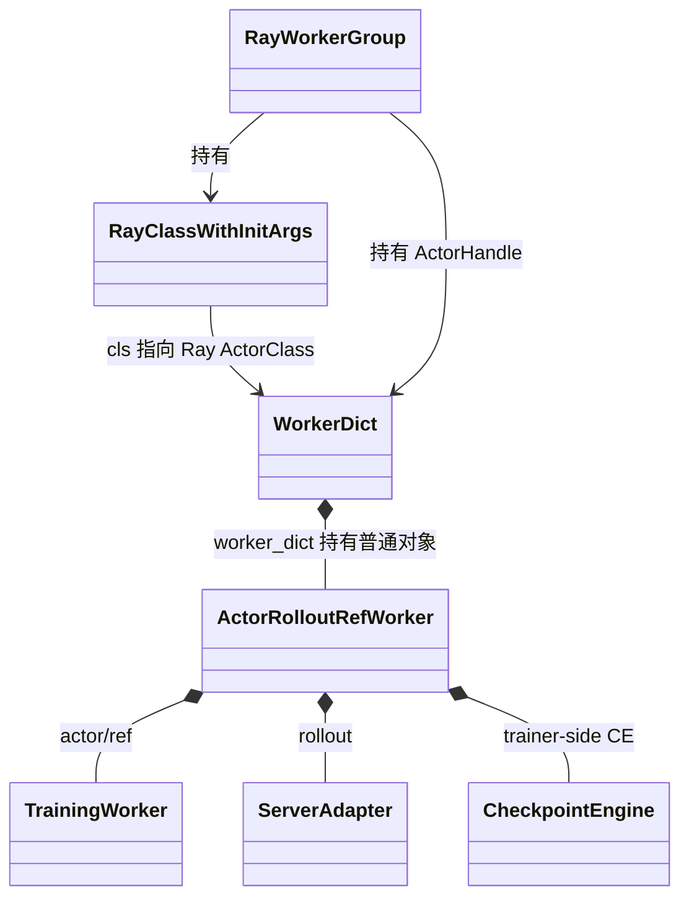
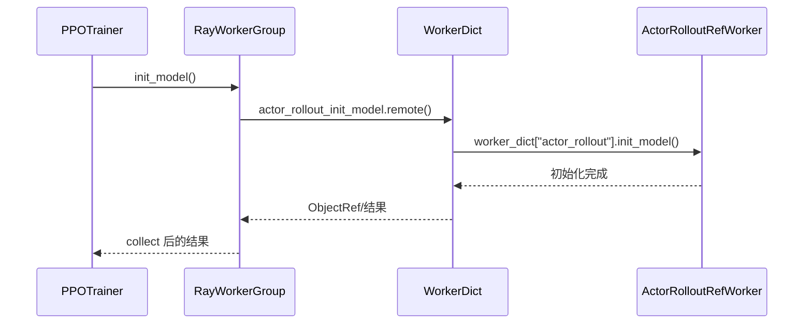
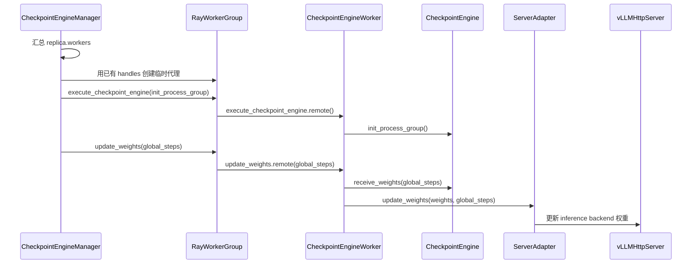

# verl v0.8.0 RayWorkerGroup 与实际 Ray Actor 关联机制

> 状态：待评审。
> 代码基线：`/Users/nyp/Documents/verl`，tag `v0.8.0`，commit `7aed6b23`。
> 本文合并并固化两部分代码分析：
> 1. `verl/single_controller/ray/base.py:689` 中 `cls` 的含义，以及 `RayWorkerGroup` 如何关联到实际拉起的类；
> 2. HYBRID 与 STANDALONE 对这套机制的共用部分、差异和各自的实际运行实体。

## 1. 结论

`verl/single_controller/ray/base.py:689` 中的 `cls` 是 `RayWorkerGroup` 类本身，不是 Ray 最终拉起的业务
Worker 类。当前调用链中：

```python
cls is RayWorkerGroup
```

该参数来自 `@classmethod` 的自动绑定；`from_detached()` 中的 `cls(...)` 只在 controller 进程内构造一个新的
`RayWorkerGroup` 普通对象，用于复用已有 ActorHandle 并生成角色级调用代理。

真正决定 Ray 拉起哪个 Actor 的是：

```python
RayClassWithInitArgs.cls
```

最终创建动作发生在：

```python
self.cls.options(**options).remote(*self.args, **self.kwargs)
```

HYBRID 与 STANDALONE 对这套机制的复用边界如下：

1. HYBRID 和 STANDALONE 的**训练侧**都完整复用
   `create_colocated_worker_cls() -> WorkerDict -> RayWorkerGroup -> spawn() -> from_detached()`。
2. STANDALONE 的**独立 rollout 侧**复用 `RayResourcePool + RayWorkerGroup + RayClassWithInitArgs` 的 Actor
   创建和方法代理基础设施，但不使用 `WorkerDict`、`spawn()` 和 `from_detached()`。
3. STANDALONE rollout 侧由 `RayWorkerGroup` 实际拉起的类是 `CheckpointEngineWorker`；HYBRID rollout 复用
   training `WorkerDict` ActorHandle，不再创建 rollout WorkerGroup。
4. HYBRID 和 STANDALONE 的 `vLLMHttpServer` 都不是由 `RayWorkerGroup` 创建，而是由 `vLLMReplica` 根据
   workers 的 node ID 和 accelerator ID 直接调用 Ray API 创建。
5. STANDALONE 参数同步时会把已有 `CheckpointEngineWorker` handles 临时包装成一个 `RayWorkerGroup`。该操作
   复用了“附着已有 ActorHandle”的底层分支，但没有调用 `from_detached()`，因此不会执行 `base.py:689`。

## 2. 必须区分的四种“类”

同一条初始化链中存在多个名字相近但语义不同的类变量：

| 名称 | HYBRID 典型值 | STANDALONE rollout 典型值 | 作用 |
|---|---|---|---|
| `from_detached(cls, ...)` 的 `cls` | `RayWorkerGroup` | rollout 初始化不经过该方法 | 创建 controller 侧的 WorkerGroup 代理 |
| 角色包装前的 `RayClassWithInitArgs.cls` | `ActorClass(ActorRolloutRefWorker)` | 不适用 | 保存角色类及其初始化参数 |
| 最终传给 WorkerGroup 的 `RayClassWithInitArgs.cls` | `ActorClass(WorkerDict)` | `ActorClass(CheckpointEngineWorker)` | 决定 `.remote()` 实际拉起的 Ray Actor 类 |
| `WorkerDict.worker_dict[key]` | `ActorRolloutRefWorker`、`TrainingWorker` 等普通对象 | rollout 侧没有 `WorkerDict` | 在一个 Ray Actor 进程内承载具体业务角色 |

由此可得：

```text
from_detached.cls
    != RayClassWithInitArgs.cls
    != WorkerDict 内层业务类
```

## 3. `base.py:689` 的 `cls` 如何生效

### 3.1 `@classmethod` 自动传入调用类

`RayWorkerGroup.from_detached()` 定义于 `verl/single_controller/ray/base.py:687-714`：

```python
@classmethod
def from_detached(
    cls,
    name_prefix=None,
    worker_names=None,
    worker_handles=None,
    ray_cls_with_init=None,
    **kwargs,
):
    worker_group = cls(
        resource_pool=None,
        ray_cls_with_init=ray_cls_with_init,
        name_prefix=name_prefix,
        worker_names=worker_names,
        worker_handles=worker_handles,
        **kwargs,
    )
    return worker_group
```

调用位置在 `RayWorkerGroup.spawn()`，代码位于 `verl/single_controller/ray/base.py:716-749`：

```python
new_worker_group = self.from_detached(
    name_prefix=self.name_prefix,
    worker_names=self._worker_names,
    worker_handles=self._workers,
    ray_cls_with_init=self.ray_cls_with_init,
    ...
)
```

因为 `from_detached()` 是 classmethod，Python 会将上述调用等价处理为：

```python
new_worker_group = type(self).from_detached(...)
```

并自动把 `type(self)` 作为第一个参数传入。因此当前代码路径中：

```python
cls = type(self) = RayWorkerGroup
```

如果将来由 `RayWorkerGroup` 的子类调用，`cls` 会是对应子类。这是使用 classmethod 而不是直接写死
`RayWorkerGroup(...)` 的多态意义。

### 3.2 `cls(...)` 不会创建 Ray Actor

`from_detached()` 中的：

```python
worker_group = cls(...)
```

当前等价于：

```python
worker_group = RayWorkerGroup(...)
```

它只创建 controller 进程中的普通 Python 对象。由于显式传入 `resource_pool=None`，
`RayWorkerGroup.__init__()` 会进入已有 handles 的附着分支：

```python
if self._is_init_with_detached_workers:
    self._init_with_detached_workers(
        worker_names=worker_names,
        worker_handles=worker_handles,
    )
```

对应代码：`verl/single_controller/ray/base.py:424-492`；`_is_init_with_detached_workers` 在父类
`WorkerGroup.__init__()` 中由 `resource_pool is None` 决定，代码位于
`verl/single_controller/base/worker_group.py:123-154`。

因此，这里不会调用 `.remote()`，不会申请新的 PG bundle，也不会创建新进程。

### 3.3 `from_detached` 名称不等于 Actor 一定是 detached

`spawn()` 显式传入了 `worker_handles=self._workers`。`_init_with_detached_workers()` 在已有 handles 存在时直接
附着这些 handles，并不要求它们一定是 Ray named/detached Actor。

因此这条路径更准确的语义是：

```text
attach existing ActorHandles
```

而不是：

```text
重新创建 detached Actors
```

同样，`spawn()` 在该路径中也没有 spawn 新 Actor；它创建的是角色级 `RayWorkerGroup` 调用视图。

## 4. 实际 Ray Actor 由 `RayClassWithInitArgs.cls` 决定

### 4.1 类和初始化参数的封装

`ClassWithInitArgs` 保存：

```python
self.cls
self.args
self.kwargs
```

代码位于 `verl/single_controller/base/worker_group.py:76-99`。

`RayClassWithInitArgs` 在此基础上增加 PG scheduling strategy、GPU/CPU 资源和 Ray Actor options。真正的 Actor
创建语句位于 `verl/single_controller/ray/base.py:394-413`：

```python
return self.cls.options(**options).remote(*self.args, **self.kwargs)
```

所以判断实际拉起类型时，应查看调用该语句时的 `self.cls`，不能查看
`from_detached()` 的 classmethod 参数 `cls`。

### 4.2 `RayWorkerGroup` 如何触发创建

当构造 `RayWorkerGroup` 时传入了 `resource_pool`，其初始化路径为：

```text
RayWorkerGroup.__init__
  -> _init_with_resource_pool
  -> RayResourcePool.get_placement_groups
  -> 遍历 PG 和 bundle
  -> _create_worker
  -> RayClassWithInitArgs.__call__
  -> ActorClass.options(...).remote(...)
```

相关代码位置：

- `RayWorkerGroup.__init__()`：`verl/single_controller/ray/base.py:424-492`；
- `_init_with_resource_pool()`：`verl/single_controller/ray/base.py:536-579`；
- `_create_worker()`：`verl/single_controller/ray/base.py:621-681`；
- `RayClassWithInitArgs.__call__()`：`verl/single_controller/ray/base.py:366-413`。

`_create_worker()` 最终执行：

```python
worker = ray_cls_with_init(
    placement_group=pg,
    placement_group_bundle_idx=local_rank,
    use_gpu=self.use_gpu,
    num_gpus=num_gpus,
    device_name=self.device_name,
)
self._workers.append(worker)
```

这里返回并保存的 `worker` 是实际 Ray ActorHandle。

## 5. HYBRID：从角色类到 `WorkerDict` Ray Actor

### 5.1 角色类首先被包装

HYBRID 同步入口先把 actor/rollout 角色注册为：

```python
self.role_worker_mapping[role] = ray.remote(ActorRolloutRefWorker)
```

代码位于 `verl/trainer/main_ppo_sync.py:1756-1779`。`PPOTrainer.init_workers()` 随后包装角色类：

```python
actor_rollout_cls = RayClassWithInitArgs(
    cls=self.role_worker_mapping[actor_role],
    config=self.config.actor_rollout_ref,
    distillation_config=self.config.get("distillation"),
    role=str(actor_role),
)
```

代码位于 `verl/trainer/main_ppo_sync.py:609-617`。

此时：

```text
actor_rollout_cls.cls = ActorClass(ActorRolloutRefWorker)
```

但这还不是最终由 Ray 拉起的 Actor 类。

### 5.2 `create_colocated_worker_cls()` 动态生成外层 Actor 类

`PPOTrainer.init_workers()` 按 resource pool 聚合角色后执行：

```python
worker_dict_cls = create_colocated_worker_cls(class_dict=class_dict)
wg_dict = RayWorkerGroup(
    resource_pool=resource_pool,
    ray_cls_with_init=worker_dict_cls,
    ...
)
```

调用代码：`verl/trainer/main_ppo_sync.py:653-663`。

`create_colocated_worker_cls()` 位于 `verl/single_controller/ray/base.py:986-1027`。它动态定义：

```python
class WorkerDict(worker_cls):
    def __init__(self):
        super().__init__()
        self.worker_dict = {}
        for key, user_defined_cls in cls_dict.items():
            user_defined_cls = _unwrap_ray_remote(user_defined_cls)
            self.worker_dict[key] = user_defined_cls(...)
```

最后执行：

```python
remote_cls = ray.remote(WorkerDict)
remote_cls = RayClassWithInitArgs(cls=remote_cls)
return remote_cls
```

因此传给 `RayWorkerGroup` 的最终类型是：

```text
worker_dict_cls.cls = ActorClass(WorkerDict)
```

实际运行实体关系为：



图中只有 `WorkerDict` 是该链路实际拉起的 Ray Actor；`ActorRolloutRefWorker`、`TrainingWorker`、
`ServerAdapter` 和 trainer-side `CheckpointEngine` 都是 `WorkerDict` Actor 进程内的普通对象。

## 6. 角色方法如何跨越 WorkerGroup、Actor 和内层业务对象

### 6.1 第一次绑定：业务对象方法绑定到 `WorkerDict`

例如 `ActorRolloutRefWorker.init_model()` 使用 `@register` 修饰，代码位于
`verl/workers/engine_workers.py:490-500`。

`create_colocated_worker_cls()` 调用 `_bind_workers_method_to_parent()`；该函数位于
`verl/single_controller/ray/base.py:918-963`。它在 `WorkerDict` 上生成带角色前缀的方法，例如：

```text
WorkerDict.actor_rollout_init_model
WorkerDict.actor_rollout_ref_init_model
```

生成的方法在 Actor 进程内转调：

```python
self.worker_dict[key].init_model(...)
```

### 6.2 第二次绑定：Actor 方法绑定到 `RayWorkerGroup`

`RayWorkerGroup.__init__()` 调用父类 `_bind_worker_method()`，扫描 Ray ActorClass 上带有注册元数据的方法，并在
controller 侧生成批量 dispatch/collect 代理。代码位置：

- 调用点：`verl/single_controller/ray/base.py:491-492`；
- `_bind_worker_method()`：`verl/single_controller/base/worker_group.py:185-253`；
- Ray 单 Worker 执行：`verl/single_controller/ray/base.py:780-797`。

最终远程执行形态为：

```python
remote_call = getattr(worker, method_name)
return remote_call.remote(*args, **kwargs)
```

### 6.3 `spawn()` 生成角色级 WorkerGroup 视图

初始 `wg_dict` 能看到带角色前缀的方法。`spawn(prefix_set)` 为每个角色调用 `from_detached()`，复用同一组
ActorHandle，并通过 `_rebind_actor_methods()` 去掉对应角色前缀：

```text
WorkerDict.actor_rollout_init_model
                  ↓
actor_rollout_wg.init_model
```

因此不同 WorkerGroup 可以指向完全相同的 Ray Actors：

```text
wg_dict._workers
actor_rollout_wg._workers
critic_wg._workers
    └── 可以是同一组 ActorHandle(WorkerDict)
```

`spawn()` 产生的是逻辑角色视图，不是新的一组 Worker 进程。

### 6.4 一次 `init_model()` 的完整调用链

`PPOTrainer` 在 `verl/trainer/main_ppo_sync.py:674-676` 调用：

```python
self.actor_rollout_wg.init_model()
```

完整链路如下：



这解释了 `RayWorkerGroup` 与实际拉起类之间的关联：

```text
RayWorkerGroup
    -> 持有 WorkerDict ActorHandles
    -> 调用 WorkerDict 的带前缀远程方法
    -> WorkerDict 转调内层 ActorRolloutRefWorker 普通对象
```

## 7. STANDALONE 是否复用上述机制

答案需要按训练侧与 rollout 侧分别判断。

### 7.1 训练侧：完整复用

STANDALONE 的 `SeparateRayPPOTrainer._init_worker_groups()` 仍执行：

```python
worker_dict_cls = create_colocated_worker_cls(class_dict=class_dict)
wg_dict = self.ray_worker_group_cls(
    resource_pool=resource_pool,
    ray_cls_with_init=worker_dict_cls,
    **wg_kwargs,
)
spawn_wg = wg_dict.spawn(prefix_set=class_dict.keys())
```

代码位于 `verl/experimental/separation/ray_trainer.py:197-230`。

STANDALONE 训练侧角色映射通常使用：

```python
role_worker_mapping = {
    train_role: ray.remote(DetachActorWorker),
    Role.Critic: ray.remote(TrainingWorker),
}
```

代码位于 `verl/experimental/separation/utils.py:62-92`。One-Step 路径只将 `Role.Actor` 添加到训练 Worker
classes，代码位于 `verl/experimental/one_step_off_policy/ray_trainer.py:142-150`。

所以 STANDALONE 训练侧仍然会执行 `spawn()` 和 `from_detached()`，也会执行 `base.py:689`。其实际 training
Ray Actor 仍然是 `WorkerDict`，`DetachActorWorker` 是 Actor 进程内的普通业务对象。

### 7.2 STANDALONE 触发条件：`LLMServerManager.worker_group is None`

STANDALONE 不是由 `RolloutMode.STANDALONE` 配置值直接选择。`LLMServerManager` 根据是否收到 training
WorkerGroup 决定初始化路径：

```python
if self.worker_group:
    await server.init_hybrid(self.worker_group)
else:
    await server.init_standalone()
```

代码位于 `verl/workers/rollout/llm_server.py:297-325`。

HYBRID 同步入口传入：

```python
LLMServerManager.create(
    config=self.config,
    worker_group=self.actor_rollout_wg,
    rollout_resource_pool=actor_rollout_resource_pool,
)
```

代码位于 `verl/trainer/main_ppo_sync.py:712-714`。

One-Step STANDALONE 只调用：

```python
self.llm_server_manager = LLMServerManager.create(config=self.config)
```

代码位于 `verl/experimental/one_step_off_policy/ray_trainer.py:170-196`。此时 `worker_group=None`，所以每个
`RolloutReplica` 进入 `init_standalone()`。

### 7.3 Rollout 侧：只复用 WorkerGroup 基础设施

`RolloutReplica.init_standalone()` 位于 `verl/workers/rollout/replica.py:189-226`。每个 replica 首先根据自身
world size 创建独立资源池：

```python
resource_pool_spec = {
    resource_pool_name: [self.gpus_per_replica_node] * self.nnodes,
}
resource_pool_manager = ResourcePoolManager(
    resource_pool_spec=resource_pool_spec,
    mapping=None,
    max_colocate_count=2,
)
resource_pool_manager.create_resource_pool()
```

随后直接创建 rollout WorkerGroup：

```python
worker_group = RayWorkerGroup(
    resource_pool=self.resource_pool,
    ray_cls_with_init=self.get_ray_class_with_init_args(),
    bin_pack=False,
    name_prefix=name_prefix,
    use_gpu=True,
    device_name=...,
)
self.workers = worker_group.workers
```

`get_ray_class_with_init_args()` 返回：

```python
rollout_worker_actor_cls = ray.remote(CheckpointEngineWorker)
return RayClassWithInitArgs(
    cls=rollout_worker_actor_cls,
    rollout_config=self.config,
    model_config=self.model_config,
    replica_rank=self.replica_rank,
)
```

代码位于 `verl/workers/rollout/replica.py:228-238`。

因此 STANDALONE rollout WorkerGroup 的实际类是：

```text
RayClassWithInitArgs.cls = ActorClass(CheckpointEngineWorker)
```

该路径只有一种角色类，`CheckpointEngineWorker` 的方法可以直接绑定到 `RayWorkerGroup`，所以不需要：

- `create_colocated_worker_cls()`；
- `WorkerDict`；
- 带角色前缀的方法；
- `spawn()`；
- `from_detached()`。

因此 STANDALONE rollout 初始化不会执行 `base.py:689`。

## 8. HYBRID 与 STANDALONE 的 rollout workers 来源

### 8.1 HYBRID：切分 training WorkerGroup 的 handles

`RolloutReplica.init_hybrid()` 位于 `verl/workers/rollout/replica.py:131-141`：

```python
self.workers = worker_group.workers[
    self.world_size * self.replica_rank :
    self.world_size * (self.replica_rank + 1)
]
await self.launch_servers()
```

这里不创建新的 rollout pool、Placement Group 或 Worker Actors。

```text
RolloutReplica.workers
    = ActorHandle(WorkerDict) 的切片
```

`WorkerDict` 内部的 `ActorRolloutRefWorker.init_model()` 创建 `ServerAdapter` 和 trainer-side
`CheckpointEngine`，对应代码：

- rollout adapter：`verl/workers/engine_workers.py:590-611`；
- trainer-side checkpoint engine：`verl/workers/engine_workers.py:618-629`。

### 8.2 STANDALONE：创建独立 `CheckpointEngineWorker` handles

STANDALONE 每个 replica 创建独立 resource pool 和 WorkerGroup：

```text
RolloutReplica.workers
    = ActorHandle(CheckpointEngineWorker)
```

`CheckpointEngineWorker` 定义于 `verl/checkpoint_engine/base.py:278-339`。每个 Actor 内包含：

- rollout-side `CheckpointEngine`；
- `ServerAdapter`；
- `update_weights()`；
- `execute_checkpoint_engine()`。

其 `update_weights()` 先从 checkpoint engine 接收参数，再调用：

```python
await self.server_adapter.update_weights(weights, global_steps=global_steps)
```

所以两种模式虽然都向 `RolloutReplica.workers` 保存 ActorHandle，但 handle 指向的真实类型不同：

| 模式 | `RolloutReplica.workers` 的 ActorHandle 指向 | 是否新建 rollout WorkerGroup |
|---|---|---|
| HYBRID | training `WorkerDict` | 否，复用 training WorkerGroup handles |
| STANDALONE | rollout `CheckpointEngineWorker` | 是，每个 replica 单独创建 |

## 9. `vLLMHttpServer` 创建方式是二者共性

HYBRID 和 STANDALONE 最终都调用 `vLLMReplica.launch_servers()`，代码位于
`verl/workers/rollout/vllm_rollout/vllm_async_server.py:968-1054`。

`vLLMReplica` 是 `LLMServerManager` 所在进程中的普通对象，它在构造时保存：

```python
self.server_class = ray.remote(vLLMHttpServer)
```

随后从 `self.workers` 查询真实 node ID 和 accelerator ID：

```python
worker.__ray_call__.remote(
    lambda self: (
        ray.get_runtime_context().get_node_id(),
        ray.get_runtime_context().get_accelerator_ids()[get_resource_name()][0],
    )
)
```

再直接调用 Ray API 创建 server Actor：

```python
server = self.server_class.options(
    scheduling_strategy=NodeAffinitySchedulingStrategy(
        node_id=node_id,
        soft=False,
    ),
    ...
).remote(
    workers=workers,
    cuda_visible_devices=node_cuda_visible_devices,
    rollout_mode=self.rollout_mode,
    ...
)
```

因此 `vLLMHttpServer`：

1. 是独立 Ray Actor；
2. 不在 `RayWorkerGroup.workers` 中；
3. 不经 `RayWorkerGroup._create_worker()` 创建；
4. 通过 hard node affinity 放到 workers 所在节点；
5. 通过显式 visible devices 使用 workers 对应的 GPU；
6. 持有该 replica 对应的 worker handles。

区别仅在 `workers` 的实际类型：

```text
HYBRID vLLMHttpServer.workers
    -> ActorHandle(WorkerDict)

STANDALONE vLLMHttpServer.workers
    -> ActorHandle(CheckpointEngineWorker)
```

## 10. STANDALONE 参数同步复用已有 ActorHandle

`CheckpointEngineManager.update_weights()` 在参数同步时汇总全部 replicas 的 workers，代码位于
`verl/checkpoint_engine/base.py:470-514`：

```python
workers = []
for replica in self.replicas:
    workers.extend(replica.workers)

rollout = RayWorkerGroup(
    worker_handles=workers,
    ray_cls_with_init=RayClassWithInitArgs(cls=_worker_cls),
)
```

这里没有传 `resource_pool`，所以新建的 `RayWorkerGroup` 进入已有 handles 附着分支，不创建任何
`CheckpointEngineWorker`。

这和 `from_detached()` 的底层行为相同，但调用关系不同：

```text
spawn 路径
  -> RayWorkerGroup.from_detached()
  -> RayWorkerGroup(resource_pool=None, worker_handles=...)
  -> _init_with_detached_workers()

STANDALONE 参数同步路径
  -> RayWorkerGroup(resource_pool=None, worker_handles=...)
  -> _init_with_detached_workers()
```

因此参数同步路径：

- 复用了已有 handles 附着机制；
- 没有调用 `from_detached()`；
- 没有执行 `base.py:689`；
- 没有使用 `spawn()`；
- 没有进行角色前缀重绑定。

临时 rollout WorkerGroup 随后统一执行：

```python
rollout.execute_checkpoint_engine(...)
rollout.update_weights(...)
```

完整控制流为：



## 11. HYBRID 与 STANDALONE 共性和差异总表

| 维度 | HYBRID | STANDALONE |
|---|---|---|
| 训练侧使用 `RayWorkerGroup` | 是 | 是 |
| 训练侧使用 `WorkerDict` | 是 | 是 |
| 训练侧执行 `spawn()/from_detached()` | 是 | 是 |
| 训练侧执行 `base.py:689` | 是 | 是 |
| rollout 使用 training Worker handles | 是 | 否 |
| rollout 独立创建 `RayResourcePool` | 否 | 是，每个 replica 一个 |
| rollout 独立创建 `RayWorkerGroup` | 否 | 是 |
| rollout worker 实际 Ray Actor 类 | training `WorkerDict` | `CheckpointEngineWorker` |
| rollout 初始化使用 `WorkerDict` | 已在 training 侧创建 | 否 |
| rollout 初始化执行 `spawn()/from_detached()` | 否 | 否 |
| 参数同步时临时聚合 rollout handles | naive backend 不需要 | 是 |
| `vLLMReplica` | 普通对象 | 普通对象 |
| `vLLMHttpServer` 创建者 | `vLLMReplica` | `vLLMReplica` |
| `vLLMHttpServer` 是否属于 WorkerGroup | 否 | 否 |
| training/rollout GPU | 同一批 GPU | 不同 GPU/PG |
| 主要权重同步路径 | training worker 内部直接同步 | trainer CE -> rollout CE -> `ServerAdapter` |

## 12. 数量示例

假设：

```text
training：2 节点 × 8 GPU = 16 training ranks
standalone rollout：2 节点 × 8 GPU = 16 rollout GPUs
每个 replica：TP=4, DP=1, PP=1
```

单个 replica 的 world size 为：

```text
rollout_world_size = TP × DP × PP = 4
```

replica 数量为：

```text
num_replicas = 16 / 4 = 4
```

### 12.1 HYBRID

```text
16 个 training WorkerDict Ray Actors
    ↓ 每 4 个 handles 切成一组
4 个 vLLMReplica 普通对象
    ↓ 每个单节点 replica 创建一个 server
4 个 vLLMHttpServer Ray Actors
```

不会额外创建 `CheckpointEngineWorker`，rollout 直接复用 16 个 training `WorkerDict` handles。

### 12.2 STANDALONE

```text
training 侧：
16 个 training WorkerDict Ray Actors

rollout 侧：
4 个 vLLMReplica 普通对象
每个 replica 创建 4 个 CheckpointEngineWorker Ray Actors
总计 16 个 CheckpointEngineWorker Ray Actors
每个单节点 replica 创建 1 个 vLLMHttpServer Ray Actor
总计 4 个 vLLMHttpServer Ray Actors
```

参数同步时，`CheckpointEngineManager` 将 4 个 replicas 中的 16 个 `CheckpointEngineWorker` handles 汇总成一个
临时 `RayWorkerGroup`，但不会重复创建这 16 个 Actors。

## 13. 最终边界判断

“STANDALONE 是否复用 RayWorkerGroup 与实际类的关联机制”需要拆成三层回答：

1. **Ray Actor 创建基础设施：复用。** 两种模式都通过 `RayClassWithInitArgs.cls` 决定实际类，并可由
   `RayWorkerGroup._create_worker()` 调用 `.remote()` 创建。
2. **多角色共置与角色代理机制：仅训练侧复用。** STANDALONE rollout 不使用 `WorkerDict + spawn +
   from_detached`，因为 rollout WorkerGroup 只管理一种 `CheckpointEngineWorker`。
3. **HTTP inference server 创建机制：不属于 RayWorkerGroup。** 两种模式都由 `vLLMReplica` 直接创建
   `vLLMHttpServer`，再通过 node affinity、visible devices 和 worker handles 建立与相应 GPU/控制 Worker 的关联。

所以不能笼统表述为“HYBRID 和 STANDALONE 都由 RayWorkerGroup 拉起 vLLM”。更准确的表述是：

> `RayWorkerGroup` 在 HYBRID 中管理 training `WorkerDict` Actors，在 STANDALONE rollout 中管理独立的
> `CheckpointEngineWorker` Actors；`vLLMHttpServer` 始终由 `vLLMReplica` 另行创建。
