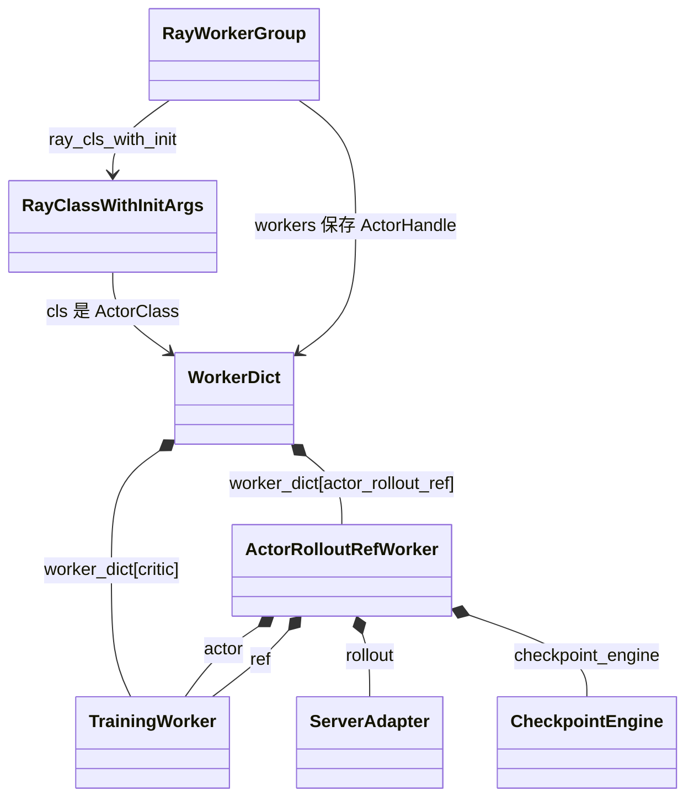
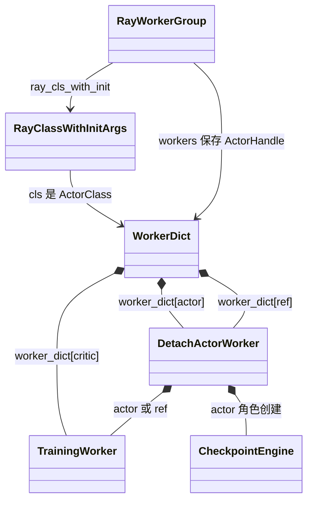
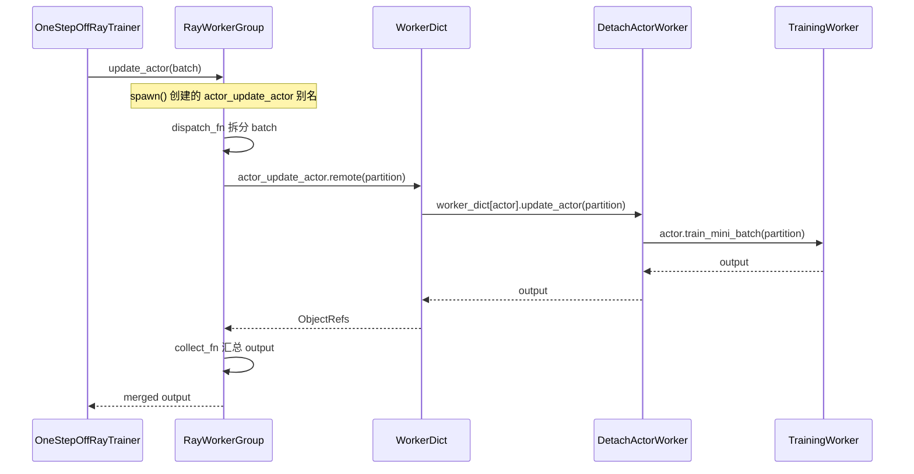

# verl v0.8.0 训练侧 RayWorkerGroup、WorkerDict 与业务 Worker 关联机制

> 状态：待评审。
> 代码基线：`/Users/nyp/Documents/verl`，tag `v0.8.0`，commit `7aed6b23`。
> 本文只分析 train 侧，分别以 HYBRID 和 STANDALONE 的实际初始化路径举例说明
> `RayWorkerGroup`、`RayClassWithInitArgs`、动态 `WorkerDict` 与业务 Worker 的关联；独立 rollout 资源池和
> `vLLMHttpServer` 只在辨析边界时提及。文中同时解释实现所依赖的关键 Python 语言机制。

## 1. 结论

从 train 侧看，HYBRID 和 STANDALONE 使用同一套外层机制：

```text
每角色一个 RayClassWithInitArgs
  -> 按 RayResourcePool 聚合为 class_dict
  -> create_colocated_worker_cls(class_dict)
  -> 动态生成 WorkerDict
  -> ray.remote(WorkerDict)
  -> 外层 RayClassWithInitArgs(cls=ActorClass(WorkerDict))
  -> RayWorkerGroup 创建并持有 WorkerDict ActorHandles
  -> spawn() 基于同一组 handles 生成角色级 RayWorkerGroup 代理
```

二者真正的区别不在外层 `RayWorkerGroup`，而在每个 `WorkerDict.worker_dict` 中装入的业务对象：

- HYBRID 使用 `ActorRolloutRefWorker(role="actor_rollout_ref")` 或
  `ActorRolloutRefWorker(role="actor_rollout")`。该业务对象会在 train Worker 进程内初始化 actor，并初始化
  rollout `ServerAdapter`；需要独立 ref 时也在同一业务对象内初始化 ref。
- STANDALONE 使用 `DetachActorWorker(role="actor")` 作为 train actor。它继承
  `ActorRolloutRefWorker`，但因为角色字符串不包含 `rollout`，不会初始化 rollout `ServerAdapter`。主 rollout
  由 train 侧以外的独立资源和进程承载。

因此：

> 两种模式的 train-side 实际 Ray Actor 都是动态 `WorkerDict`；`ActorRolloutRefWorker`、
> `DetachActorWorker` 和 `TrainingWorker` 都是 `WorkerDict` Actor 进程内的普通 Python 对象，而不是每个角色
> 各自一个 Ray Actor。

## 2. 统一示例配置

后文使用同一组资源规模进行对比：

```text
训练节点：2
每节点训练 GPU：8
training world size：16
启用 Actor：是
启用 Critic：是
启用独立 Reference Policy：是
LoRA/ref_in_actor：关闭
Actor、Critic、Ref 映射到同一个 training resource pool
```

资源池规格为：

```python
[8, 8]
```

这表示 training resource pool 包含 16 个 rank/bundle。只要多个角色映射到同一个 pool，
`create_colocated_worker_cls()` 就会把这些角色放进同一类 `WorkerDict` Actors，而不是为每个角色分别创建一套
Actors。

如果角色映射到不同 resource pool，`PPOTrainer` 会为每个 pool 分别生成 `WorkerDict` 类和
`RayWorkerGroup`；本文示例讨论 verl 两条入口的默认映射，即 train 角色共用一个 pool。

## 3. 四层对象不要混淆

| 层次 | 示例 | 类型 | 所在位置 | 作用 |
|---|---|---|---|---|
| 角色描述 | `RayClassWithInitArgs(cls=ActorClass(ActorRolloutRefWorker), ...)` | 普通对象 | controller | 保存一个业务角色的类和初始化参数 |
| 外层 Actor 描述 | `RayClassWithInitArgs(cls=ActorClass(WorkerDict))` | 普通对象 | controller | 保存最终要由 Ray 创建的 Actor 类 |
| Actor 集合代理 | `RayWorkerGroup` | 普通对象 | controller | 创建、持有、批量调用 ActorHandles |
| 实际 Ray Actor | 动态 `WorkerDict` | Ray Actor | training GPU 节点 | 每个 training rank 一个进程 |
| 业务实现 | `ActorRolloutRefWorker` 等 | 普通对象 | `WorkerDict` Actor 进程 | 执行 actor、rollout、critic、ref 业务 |

最核心的两条引用关系是：

```text
RayWorkerGroup.ray_cls_with_init
    -> RayClassWithInitArgs(cls=ActorClass(WorkerDict))

RayWorkerGroup.workers[i]
    -> ActorHandle(WorkerDict rank i)
```

而远端 Actor 内部是：

```text
WorkerDict.worker_dict[role_key]
    -> 对应业务 Worker 普通对象
```

## 4. HYBRID train 侧实例

### 4.1 角色映射

HYBRID 同步入口的 `TaskRunner.add_actor_rollout_worker()` 位于
`verl/trainer/main_ppo_sync.py:1764-1773`：

```python
role = Role.ActorRolloutRef if need_reference_policy(config) and not ref_in_actor else Role.ActorRollout
self.role_worker_mapping[role] = ray.remote(ActorRolloutRefWorker)
self.mapping[role] = "global_pool"
```

Critic 注册位于 `verl/trainer/main_ppo_sync.py:1775-1779`：

```python
self.role_worker_mapping[Role.Critic] = ray.remote(TrainingWorker)
self.mapping[Role.Critic] = "global_pool"
```

本例需要独立 reference policy 且 `ref_in_actor=False`，所以实际映射为：

```text
Role.ActorRolloutRef
    -> ActorClass(ActorRolloutRefWorker)
    -> global_pool

Role.Critic
    -> ActorClass(TrainingWorker)
    -> global_pool
```

`global_pool` 的规格由 `TaskRunner.init_resource_pool_mgr()` 构造，代码位于
`verl/trainer/main_ppo_sync.py:1781-1816`：

```python
resource_pool_spec = {
    "global_pool": [config.trainer.n_gpus_per_node] * config.trainer.nnodes,
}
```

本例得到：

```python
{"global_pool": [8, 8]}
```

### 4.2 角色级 `RayClassWithInitArgs`

`PPOTrainer.init_workers()` 为 actor/rollout/ref 角色创建延迟初始化描述，代码位于
`verl/trainer/main_ppo_sync.py:609-618`：

```python
actor_rollout_cls = RayClassWithInitArgs(
    cls=self.role_worker_mapping[Role.ActorRolloutRef],
    config=self.config.actor_rollout_ref,
    distillation_config=self.config.get("distillation"),
    role="actor_rollout_ref",
)
```

Critic 描述位于 `verl/trainer/main_ppo_sync.py:620-634`：

```python
critic_cls = RayClassWithInitArgs(
    cls=self.role_worker_mapping[Role.Critic],
    config=critic_worker_config,
)
```

按同一个 resource pool 聚合后，可以把实际 `class_dict` 简化表示为：

```python
class_dict = {
    "actor_rollout_ref": RayClassWithInitArgs(
        cls=ActorClass(ActorRolloutRefWorker),
        config=actor_rollout_ref_config,
        role="actor_rollout_ref",
    ),
    "critic": RayClassWithInitArgs(
        cls=ActorClass(TrainingWorker),
        config=critic_worker_config,
    ),
}
```

此时两个 `RayClassWithInitArgs` 只是 controller 内的普通对象，没有调用 `.remote()`，也没有创建 Actor。

### 4.3 从两个角色描述生成一个外层 Actor 类

`PPOTrainer.init_workers()` 在 `verl/trainer/main_ppo_sync.py:653-663` 执行：

```python
worker_dict_cls = create_colocated_worker_cls(class_dict=class_dict)
wg_dict = RayWorkerGroup(
    resource_pool=global_pool,
    ray_cls_with_init=worker_dict_cls,
)
spawn_wg = wg_dict.spawn(prefix_set=class_dict.keys())
```

`create_colocated_worker_cls()` 位于 `verl/single_controller/ray/base.py:986-1027`。它动态生成的每个远端
`WorkerDict` 可近似理解为：

```python
class WorkerDict(Worker):
    def __init__(self):
        super().__init__()
        self.worker_dict = {
            "actor_rollout_ref": ActorRolloutRefWorker(
                config=actor_rollout_ref_config,
                role="actor_rollout_ref",
            ),
            "critic": TrainingWorker(
                config=critic_worker_config,
            ),
        }
```

实际代码先调用 `_unwrap_ray_remote()` 把 `ActorClass(...)` 恢复成原始 Python 类，再通过普通构造函数在
`WorkerDict` Actor 进程内创建对象，代码位于 `verl/single_controller/ray/base.py:1009-1018`。

函数最终返回：

```python
remote_cls = ray.remote(WorkerDict)
return RayClassWithInitArgs(cls=remote_cls)
```

因此传给 `RayWorkerGroup` 的已经不是前面的两个角色描述，而是新的外层描述：

```text
worker_dict_cls
    = RayClassWithInitArgs(
          cls=ActorClass(WorkerDict)
      )
```

### 4.4 实际创建 16 个 `WorkerDict` Actors

`RayWorkerGroup` 根据 `[8, 8]` 的 16 个 bundles 创建 16 个 Actors。创建循环位于
`verl/single_controller/ray/base.py:536-579`，单个 Actor 的最终创建位于
`verl/single_controller/ray/base.py:621-681`：

```python
worker = ray_cls_with_init(
    placement_group=pg,
    placement_group_bundle_idx=local_rank,
    use_gpu=self.use_gpu,
    num_gpus=num_gpus,
    device_name=self.device_name,
)
self._workers.append(worker)
```

`ray_cls_with_init(...)` 最终调用：

```python
ActorClass(WorkerDict).options(...).remote()
```

所以不是创建：

```text
16 个 ActorRolloutRefWorker Ray Actors
+ 16 个 Critic TrainingWorker Ray Actors
```

而是创建：

```text
16 个 WorkerDict Ray Actors
```

每个 rank 的真实对象拓扑为：



### 4.5 为什么一个 `ActorRolloutRefWorker` 同时包含三种能力

`ActorRolloutRefWorker.__init__()` 根据角色字符串设置能力开关，代码位于
`verl/workers/engine_workers.py:441-455`：

```python
self._is_actor = self.role in ["actor", "actor_rollout", "actor_rollout_ref"]
self._is_rollout = self.role in ["rollout", "actor_rollout", "actor_rollout_ref"]
self._is_ref = self.role in ["ref", "actor_rollout_ref"]
```

本例传入：

```python
role = "actor_rollout_ref"
```

因此三个条件都为真。`init_model()` 会创建：

- ref `TrainingWorker`：`verl/workers/engine_workers.py:503-539`；
- actor `TrainingWorker`：`verl/workers/engine_workers.py:541-588`；
- rollout `ServerAdapter`：`verl/workers/engine_workers.py:590-611`；
- trainer-side `CheckpointEngine`：`verl/workers/engine_workers.py:618-629`。

这就是 HYBRID 的 train-side 业务对象中存在 rollout 能力的代码依据。

### 4.6 `spawn()` 只生成两个逻辑代理

HYBRID 本例调用：

```python
wg_dict.spawn({"actor_rollout_ref", "critic"})
```

返回：

```text
actor_rollout_wg: RayWorkerGroup
critic_wg: RayWorkerGroup
```

两个代理与原 `wg_dict` 复用相同的 16 个 handles：

```text
wg_dict._workers
actor_rollout_wg._workers
critic_wg._workers
    -> 同一组 ActorHandle(WorkerDict rank 0..15)
```

因此 `spawn()` 没有把一个 Actor 拆成两个进程，只是给同一组 Actors 提供两个调用入口。

## 5. STANDALONE train 侧实例

### 5.1 角色映射

分离架构的公共角色映射位于 `verl/experimental/separation/utils.py:62-92`：

```python
train_role = Role.Actor
role_worker_mapping = {
    train_role: ray.remote(DetachActorWorker),
    Role.Critic: ray.remote(TrainingWorker),
}

if need_reference_policy(config):
    role_worker_mapping[Role.RefPolicy] = ray.remote(DetachActorWorker)
```

`DetachActorWorker` 继承 `ActorRolloutRefWorker`，定义于
`verl/experimental/separation/engine_workers.py:36-58`。

本例的映射为：

```text
Role.Actor
    -> ActorClass(DetachActorWorker)
    -> trainer_pool

Role.Critic
    -> ActorClass(TrainingWorker)
    -> trainer_pool

Role.RefPolicy
    -> ActorClass(DetachActorWorker)
    -> trainer_pool
```

`create_resource_pool_manager()` 把 training roles 映射到 `trainer_pool`，代码位于
`verl/experimental/separation/utils.py:22-59`。本例资源规格为：

```python
{"trainer_pool": [8, 8]}
```

### 5.2 角色级 `RayClassWithInitArgs`

One-Step STANDALONE 创建 actor 描述的位置是
`verl/experimental/one_step_off_policy/ray_trainer.py:142-150`：

```python
role_cls = RayClassWithInitArgs(
    cls=self.role_worker_mapping[Role.Actor],
    config=self.config.actor_rollout_ref,
    role="actor",
)
```

Critic 和 ref 描述分别在：

- `verl/experimental/separation/ray_trainer.py:146-173`；
- `verl/experimental/separation/ray_trainer.py:175-185`。

本例按 `trainer_pool` 聚合后的 `class_dict` 近似为：

```python
class_dict = {
    "actor": RayClassWithInitArgs(
        cls=ActorClass(DetachActorWorker),
        config=actor_rollout_ref_config,
        role="actor",
    ),
    "critic": RayClassWithInitArgs(
        cls=ActorClass(TrainingWorker),
        config=critic_worker_config,
    ),
    "ref": RayClassWithInitArgs(
        cls=ActorClass(DetachActorWorker),
        config=actor_rollout_ref_config,
        role="ref",
    ),
}
```

### 5.3 同样生成外层 `ActorClass(WorkerDict)`

`SeparateRayPPOTrainer._init_worker_groups()` 位于
`verl/experimental/separation/ray_trainer.py:197-230`，仍然执行：

```python
worker_dict_cls = create_colocated_worker_cls(class_dict=class_dict)
wg_dict = RayWorkerGroup(
    resource_pool=trainer_pool,
    ray_cls_with_init=worker_dict_cls,
)
spawn_wg = wg_dict.spawn(prefix_set=class_dict.keys())
```

动态生成的远端对象可近似表示为：

```python
class WorkerDict(Worker):
    def __init__(self):
        super().__init__()
        self.worker_dict = {
            "actor": DetachActorWorker(
                config=actor_rollout_ref_config,
                role="actor",
            ),
            "critic": TrainingWorker(
                config=critic_worker_config,
            ),
            "ref": DetachActorWorker(
                config=actor_rollout_ref_config,
                role="ref",
            ),
        }
```

最终传给 `RayWorkerGroup` 的仍然是：

```text
RayClassWithInitArgs(cls=ActorClass(WorkerDict))
```

因此 `[8,8]` 的 `trainer_pool` 仍然只创建 16 个 `WorkerDict` Ray Actors。每个 rank 中有三个业务对象，而不是
创建三倍数量的 Ray Actors。

### 5.4 每个 STANDALONE training rank 的真实对象拓扑



展开单个 rank：

```text
WorkerDict Ray Actor
├── worker_dict["actor"]
│   └── DetachActorWorker(role="actor") 普通对象
│       ├── actor = TrainingWorker 普通对象
│       ├── rollout = None
│       ├── ref = None
│       └── checkpoint_engine = CheckpointEngine 普通对象
│
├── worker_dict["critic"]
│   └── TrainingWorker 普通对象
│
└── worker_dict["ref"]
    └── DetachActorWorker(role="ref") 普通对象
        ├── actor = None
        ├── rollout = None
        └── ref = TrainingWorker 普通对象
```

### 5.5 为什么 `DetachActorWorker` 没有初始化 rollout

`DetachActorWorker.__init__()` 调用父类：

```python
ActorRolloutRefWorker.__init__(self, config, role, ...)
```

本例 actor 对象传入：

```python
role = "actor"
```

因此父类中的状态为：

```python
self._is_actor = True
self._is_rollout = False
self._is_ref = False
```

`ActorRolloutRefWorker.init_model()` 的 rollout 分支要求：

```python
if "rollout" in self.role:
    ...
```

代码位于 `verl/workers/engine_workers.py:590-611`。对 `role="actor"` 来说条件为假，所以 train-side
`DetachActorWorker` 不创建 rollout `ServerAdapter`。

它仍会因为角色包含 `actor` 创建 trainer-side `CheckpointEngine`，用于把训练权重发送到独立 rollout 侧，代码
位于 `verl/workers/engine_workers.py:618-629`。

### 5.6 `actor_rollout_wg = actor_wg` 只是兼容别名

One-Step STANDALONE 在 `verl/experimental/one_step_off_policy/ray_trainer.py:166-168` 执行：

```python
self.actor_wg = self.all_wg[str(Role.Actor)]
self.actor_wg.init_model()
self.actor_rollout_wg = self.actor_wg
```

这只表示：

```text
actor_rollout_wg
actor_wg
    -> 同一个 RayWorkerGroup 普通对象或同一角色代理
```

它不改变远端 `worker_dict["actor"]` 的构造参数，也不会把 `role="actor"` 改成
`role="actor_rollout"`。因此变量名包含 `rollout` 不代表该 WorkerGroup 获得 HYBRID rollout 能力。

主 rollout 仍由 `LLMServerManager.create(config=self.config)` 在独立资源池创建；该调用没有传入 training
WorkerGroup，代码位于 `verl/experimental/one_step_off_policy/ray_trainer.py:170-196`。

### 5.7 `spawn()` 生成三个角色代理

STANDALONE 本例调用：

```python
wg_dict.spawn({"actor", "critic", "ref"})
```

得到：

```text
actor_wg: RayWorkerGroup
critic_wg: RayWorkerGroup
ref_policy_wg: RayWorkerGroup
```

三者复用同一组 16 个 `WorkerDict` ActorHandles：

```text
actor_wg._workers
critic_wg._workers
ref_policy_wg._workers
    -> ActorHandle(WorkerDict rank 0..15)
```

## 6. 两种模式的数量和引用对比

### 6.1 HYBRID

```text
controller
├── actor_rollout_wg: RayWorkerGroup
├── critic_wg: RayWorkerGroup
└── 两个代理复用 16 个 ActorHandle(WorkerDict)

training nodes
└── WorkerDict Ray Actor × 16
    ├── ActorRolloutRefWorker × 1
    │   ├── actor TrainingWorker × 1
    │   ├── ref TrainingWorker × 1
    │   ├── rollout ServerAdapter × 1
    │   └── CheckpointEngine × 1
    └── critic TrainingWorker × 1
```

### 6.2 STANDALONE

```text
controller
├── actor_wg: RayWorkerGroup
├── critic_wg: RayWorkerGroup
├── ref_policy_wg: RayWorkerGroup
└── 三个代理复用 16 个 ActorHandle(WorkerDict)

training nodes
└── WorkerDict Ray Actor × 16
    ├── DetachActorWorker(role=actor) × 1
    │   ├── actor TrainingWorker × 1
    │   ├── rollout = None
    │   └── CheckpointEngine × 1
    ├── critic TrainingWorker × 1
    └── DetachActorWorker(role=ref) × 1
        └── ref TrainingWorker × 1
```

### 6.3 对比表

| 维度 | HYBRID train 侧 | STANDALONE train 侧 |
|---|---|---|
| 外层实际 Ray Actor | `WorkerDict` | `WorkerDict` |
| Actor 数量 | training world size，本例 16 | training world size，本例 16 |
| `RayWorkerGroup.workers` | `ActorHandle(WorkerDict)` | `ActorHandle(WorkerDict)` |
| 外层 `RayClassWithInitArgs.cls` | `ActorClass(WorkerDict)` | `ActorClass(WorkerDict)` |
| actor 顶层业务对象 | `ActorRolloutRefWorker` | `DetachActorWorker(role="actor")` |
| train 业务对象是否初始化 rollout | 是 | 否 |
| ref 组织方式 | 通常在 `ActorRolloutRefWorker` 内 | 独立 `worker_dict["ref"]` |
| critic 组织方式 | 独立 `worker_dict["critic"]` | 独立 `worker_dict["critic"]` |
| 业务 Worker 是否是 Ray Actor | 否 | 否 |
| 是否调用 `create_colocated_worker_cls()` | 是 | 是 |
| 是否调用 `spawn()/from_detached()` | 是 | 是 |
| 角色 WorkerGroups 是否复用相同 handles | 是 | 是 |

## 7. 方法调用实例

### 7.1 HYBRID `init_model()`

`PPOTrainer` 调用：

```python
self.actor_rollout_wg.init_model()
```

实际调用链为：

```text
PPOTrainer
  -> actor_rollout_wg.init_model()
  -> 对全部 WorkerDict handles 调用 actor_rollout_ref_init_model.remote()
  -> WorkerDict.worker_dict["actor_rollout_ref"].init_model()
  -> ActorRolloutRefWorker.init_model()
  -> 创建 actor、ref、rollout ServerAdapter 和 CheckpointEngine
```

### 7.2 STANDALONE `update_actor()`

Trainer 调用：

```python
self.actor_wg.update_actor(batch)
```

实际调用链为：

```text
OneStepOffRayTrainer
  -> actor_wg.update_actor(batch)
  -> 对全部 WorkerDict handles 调用 actor_update_actor.remote(...)
  -> WorkerDict.worker_dict["actor"].update_actor(...)
  -> DetachActorWorker.update_actor(...)
  -> DetachActorWorker.actor.train_mini_batch(...)
```

`actor_wg.update_actor` 并没有作为显式方法定义在 `RayWorkerGroup` 源码里，它是后文所述的装饰器、反射和
运行时动态绑定共同生成的。

## 8. 关键 Python 机制一：类也是对象

Python 中类本身是一等对象，可以保存到字典、作为参数传递、作为返回值返回：

```python
class WorkerA:
    pass

classes = {"actor": WorkerA}
selected = classes["actor"]
obj = selected()
```

在 verl 中：

```python
self.role_worker_mapping[role] = ray.remote(ActorRolloutRefWorker)
```

保存的不是 `ActorRolloutRefWorker` 实例，而是 Ray 包装后的 ActorClass 对象。后续它可以继续被放入
`RayClassWithInitArgs` 和 `class_dict`，直到资源池、PG 和 bundle 都确定以后再创建实例。

这使“定义角色”和“实际拉起进程”可以分成两个阶段。

## 9. 关键 Python 机制二：`ray.remote()` 返回包装类

可用下面的简化模型理解：

```python
class BusinessWorker:
    pass

remote_cls = ray.remote(BusinessWorker)
```

此时：

```text
BusinessWorker
    = 原始 Python 类

remote_cls
    = Ray ActorClass(BusinessWorker)
```

只有执行：

```python
handle = remote_cls.remote()
```

才会创建 Ray Actor。

`create_colocated_worker_cls()` 需要在 `WorkerDict` Actor 进程内创建普通业务对象，而不是再次创建子 Ray
Actor，因此使用 `_unwrap_ray_remote()`，代码位于 `verl/single_controller/ray/base.py:966-969`：

```python
def _unwrap_ray_remote(cls):
    if hasattr(cls, "__ray_actor_class__"):
        cls = cls.__ray_actor_class__
    return cls
```

其效果近似为：

```text
ActorClass(ActorRolloutRefWorker)
    -> ActorRolloutRefWorker
```

随后调用普通构造函数：

```python
self.worker_dict[key] = user_defined_cls(...)
```

所以业务 Worker 与外层 `WorkerDict` 的关系是进程内对象组合，而不是嵌套 Ray Actor。

## 10. 关键 Python 机制三：`__call__` 让包装对象表现得像函数

`ClassWithInitArgs` 定义于 `verl/single_controller/base/worker_group.py:76-99`：

```python
class ClassWithInitArgs:
    def __init__(self, cls, *args, **kwargs):
        self.cls = cls
        self.args = args
        self.kwargs = kwargs

    def __call__(self):
        return self.cls(*self.args, **self.kwargs)
```

定义 `__call__` 后，实例可以像函数一样调用：

```python
factory = ClassWithInitArgs(MyClass, value=1)
obj = factory()  # 实际执行 MyClass(value=1)
```

`RayClassWithInitArgs` 重写了 `__call__()`，代码位于
`verl/single_controller/ray/base.py:336-413`。它先补充 placement group、bundle 和 GPU options，再执行：

```python
return self.cls.options(**options).remote(*self.args, **self.kwargs)
```

因此 `_create_worker()` 中看起来像普通函数调用的：

```python
worker = ray_cls_with_init(...)
```

实际展开为：

```python
worker = ActorClass(WorkerDict).options(...).remote(...)
```

这也是判断“实际拉起哪个类”必须查看 `ray_cls_with_init.cls` 的原因。

## 11. 关键 Python 机制四：函数内部动态定义类

Python 允许在函数运行时定义新类：

```python
def make_container(role_classes):
    class Container:
        def __init__(self):
            self.objects = {
                key: cls()
                for key, cls in role_classes.items()
            }

    return Container
```

每次调用 `make_container()` 都可以产生一个捕获不同 `role_classes` 的新类对象。

`create_colocated_worker_cls(class_dict)` 使用相同机制动态定义 `WorkerDict`：

```python
class WorkerDict(worker_cls):
    def __init__(self):
        super().__init__()
        self.worker_dict = {}
        for key, user_defined_cls in cls_dict.items():
            ...
```

其中 `cls_dict` 和 `init_args_dict` 来自外层函数作用域。`WorkerDict.__init__()` 在未来的 Ray Actor 进程中执行
时，仍能访问这些数据。这是 Python 闭包与 cloudpickle 序列化共同支撑的延迟构造模式。

HYBRID 调用生成的 `WorkerDict` 捕获：

```python
{
    "actor_rollout_ref": ActorClass(ActorRolloutRefWorker),
    "critic": ActorClass(TrainingWorker),
}
```

STANDALONE 调用生成的另一类 `WorkerDict` 捕获：

```python
{
    "actor": ActorClass(DetachActorWorker),
    "critic": ActorClass(TrainingWorker),
    "ref": ActorClass(DetachActorWorker),
}
```

虽然两个动态类在日志中都可能显示为 `WorkerDict`，但它们是两次函数调用产生的不同类对象，捕获的角色字典和
初始化参数不同。

## 12. 关键 Python 机制五：继承和 MRO 决定外层基类

`create_colocated_worker_cls()` 没有固定写成：

```python
class WorkerDict(Worker):
```

而是先构造各 Ray 角色类的原始类 MRO 列表：

```python
[cls.cls.__ray_actor_class__.__mro__ for cls in class_dict.values()]
```

然后 `_determine_fsdp_megatron_base_class()` **只遍历 `mros[0]`，即 `class_dict` 中第一个角色类的 MRO**，
从中选择最先遇到的 `MegatronWorker` 或 `Worker`。代码位于
`verl/single_controller/ray/base.py:972-996`：

```python
class WorkerDict(worker_cls):
    ...
```

Python 的 MRO（Method Resolution Order）表示属性和方法的继承查找顺序。例如：

```python
class Base:
    pass

class Child(Base):
    pass

print(Child.__mro__)
# (Child, Base, object)
```

因此当前实现不是对所有角色类计算“公共基类”，而是用第一个角色类决定外层 `WorkerDict` 基类。选出的
`MegatronWorker` 或 `Worker` 使外层 `WorkerDict` 自身具备相应的 rank、world size、master address 和
dispatch/collect 等基础能力；这也意味着同一 `class_dict` 中各角色的 Worker 基类必须与首个角色选出的外层
基类兼容。

`DetachActorWorker` 的继承也直接影响行为：

```text
DetachActorWorker
    -> ActorRolloutRefWorker
    -> Worker
```

它复用 `ActorRolloutRefWorker.init_model()`，但通过不同的 `role` 参数只启用 actor 或 ref 分支。

## 13. 关键 Python 机制六：装饰器把调度信息附着到函数

业务 Worker 方法使用 `@register`，例如：

```python
@register(dispatch_mode=Dispatch.ONE_TO_ALL)
def init_model(self):
    ...
```

`register()` 位于 `verl/single_controller/base/decorator.py:398-442`。它没有把方法登记到一个全局列表，而是：

1. 创建 wrapper；
2. 生成 dispatch、execute、blocking 元数据；
3. 使用 `setattr()` 把元数据写到 wrapper 函数对象。

核心代码是：

```python
attrs = {
    "dispatch_mode": dispatch_mode,
    "execute_mode": execute_mode,
    "blocking": blocking,
}
setattr(wrapper, MAGIC_ATTR, attrs)
```

函数在 Python 中也是对象，因此可以拥有自定义属性：

```python
def f():
    pass

f.routing = {"mode": "one_to_all"}
print(f.routing)
```

verl 后续只绑定具有 `MAGIC_ATTR` 的方法，未加 `@register` 的内部方法不会自动暴露给
`RayWorkerGroup`。

## 14. 关键 Python 机制七：反射和 `setattr` 动态生成 `WorkerDict` 方法

`_bind_workers_method_to_parent()` 位于 `verl/single_controller/ray/base.py:918-963`。它使用反射扫描业务类：

```python
for method_name in dir(user_defined_cls):
    method = getattr(user_defined_cls, method_name)
    if hasattr(method, MAGIC_ATTR):
        ...
```

对每个注册方法生成一个代理函数：

```python
def generate_function(name, key=key):
    def func(self, *args, **kwargs):
        return getattr(self.worker_dict[key], name)(*args, **kwargs)
    return func
```

然后动态补到 `WorkerDict` 类上：

```python
method_name_with_prefix = key + "_" + method_name
setattr(WorkerDict, method_name_with_prefix, func)
```

例如 HYBRID 会产生：

```python
WorkerDict.actor_rollout_ref_init_model
WorkerDict.actor_rollout_ref_update_actor
WorkerDict.critic_reset
```

STANDALONE 会产生：

```python
WorkerDict.actor_init_model
WorkerDict.actor_update_actor
WorkerDict.critic_reset
WorkerDict.ref_compute_ref_log_prob
```

这些方法在源码的 `class WorkerDict` 代码块中不可见，是运行时通过 `setattr()` 添加的。

### 14.1 为什么闭包参数写成 `key=key`

Python 闭包默认按变量引用捕获。错误写法：

```python
functions = []
for key in ["actor", "critic", "ref"]:
    def f():
        return key
    functions.append(f)

print([f() for f in functions])
# ['ref', 'ref', 'ref']
```

循环结束后，所有函数都读取同一个最终变量 `key="ref"`。

verl 使用默认参数冻结当前值：

```python
def generate_function(name, key=key):
    ...
```

其简化效果为：

```python
functions = []
for key in ["actor", "critic", "ref"]:
    def f(key=key):
        return key
    functions.append(f)

print([f() for f in functions])
# ['actor', 'critic', 'ref']
```

这保证 `WorkerDict.actor_update_actor()` 始终转发到 `worker_dict["actor"]`，不会错误转发到最后一个角色。

## 15. 关键 Python 机制八：把可调用代理动态绑定到 `RayWorkerGroup` 实例

在 `WorkerDict` 类获得带前缀方法后，`RayWorkerGroup.__init__()` 调用 `_bind_worker_method()`。调用点位于
`verl/single_controller/ray/base.py:491-492`，实现位于
`verl/single_controller/base/worker_group.py:185-253`。

它再次使用：

```python
dir(user_defined_cls)
getattr(user_defined_cls, method_name)
hasattr(method, MAGIC_ATTR)
```

读取 `@register` 元数据，确定：

- 参数如何分发给多个 workers；
- 调用全部 workers 还是特定 workers；
- 返回值如何收集；
- 是否立即 `ray.get()`。

随后 `func_generator()` 创建一个实现了 `__call__` 的代理对象，代码位于
`verl/single_controller/ray/base.py:48-66`：

```python
class Functor:
    def __call__(this, *args, **kwargs):
        args, kwargs = dispatch_fn(self, *args, **kwargs)
        output = execute_fn(method_name, *args, **kwargs)
        if blocking:
            output = ray.get(output)
        return collect_fn(self, output)
```

最后动态添加到某个 `RayWorkerGroup` 实例：

```python
setattr(self, method_name, func)
```

因此下面的调用能够成立：

```python
actor_wg.update_actor(batch)
```

尽管 `RayWorkerGroup` 类源码里没有显式定义 `update_actor()`。

执行逻辑是：

```text
调用动态绑定的可调用对象
  -> dispatch_fn 拆分输入
  -> execute_fn 遍历 WorkerDict ActorHandles
  -> getattr(actor_handle, "actor_update_actor").remote(...)
  -> collect_fn 汇总结果
```

`func_generator()` 还使用：

```python
type(method_name, (Functor,), {})()
```

动态创建一个类名等于远程方法名的 `Functor` 子类实例。这不会改变调用语义，主要让代理对象在日志、调试和
profiling 中具有更易识别的类型名称。

## 16. 关键 Python 机制九：`@classmethod` 和多态构造角色代理

`RayWorkerGroup.from_detached()` 定义于 `verl/single_controller/ray/base.py:687-714`：

```python
@classmethod
def from_detached(cls, worker_handles=None, ray_cls_with_init=None, **kwargs):
    return cls(
        resource_pool=None,
        worker_handles=worker_handles,
        ray_cls_with_init=ray_cls_with_init,
        **kwargs,
    )
```

classmethod 的简化示例：

```python
class Base:
    @classmethod
    def create(cls):
        return cls()

class Child(Base):
    pass

assert type(Base.create()) is Base
assert type(Child.create()) is Child
```

调用：

```python
self.from_detached(...)
```

等价于：

```python
type(self).from_detached(...)
```

所以 `base.py:689` 的 `cls` 当前是 `RayWorkerGroup`；如果以后使用其子类，返回的也会是子类实例。

`spawn()` 位于 `verl/single_controller/ray/base.py:716-749`。它把原 WorkerGroup 的 `_workers` 直接传给
`from_detached()`：

```python
new_worker_group = self.from_detached(
    worker_handles=self._workers,
    ray_cls_with_init=self.ray_cls_with_init,
    ...
)
```

因为 `resource_pool=None` 且已有 `worker_handles`，新 WorkerGroup 只附着 handles，不创建新 Actor。

## 17. 关键 Python 机制十：方法别名与绑定方法复用

`spawn()` 内部 `_rebind_actor_methods()` 使用：

```python
method = getattr(worker_group, prefixed_method_name)
setattr(worker_group, original_method_name, method)
```

例如：

```text
actor_rollout_ref_init_model
    -> 别名 init_model

critic_reset
    -> 别名 reset
```

简化示例：

```python
class Proxy:
    pass

p = Proxy()
p.actor_update = lambda x: x + 1
p.update = p.actor_update

assert p.update(1) == 2
```

因此：

```python
actor_wg.update_actor(batch)
```

实际调用的是原来动态绑定在该代理上的：

```python
actor_wg.actor_update_actor(batch)
```

角色级 WorkerGroup 由“同一组 handles + 不同方法别名”形成，不是由不同远端进程形成。

## 18. 从 Python 机制到一次完整远程调用

以 STANDALONE train-side `actor_wg.update_actor(batch)` 为例：



这条链同时依赖：

1. 类作为对象保存于 `role_worker_mapping`；
2. `RayClassWithInitArgs.__call__` 延迟创建 Actor；
3. 函数内动态定义 `WorkerDict`；
4. `_unwrap_ray_remote()` 恢复原始业务类；
5. `@register` 给函数附着调度元数据；
6. 反射找到注册方法；
7. 闭包生成角色转发函数；
8. `setattr` 给 `WorkerDict` 类补充远程方法；
9. `setattr` 给 `RayWorkerGroup` 实例补充可调用代理；
10. `spawn()/from_detached()` 复用 handles 并建立无前缀方法别名。

## 19. 最终判断

### 19.1 共性

HYBRID 和 STANDALONE train 侧都满足：

```text
一个 resource pool
  -> 一个动态 WorkerDict ActorClass
  -> 一个初始 RayWorkerGroup
  -> world_size 个 WorkerDict Ray Actors
  -> 多个角色级 RayWorkerGroup 代理
  -> 所有角色代理复用相同的 ActorHandles
```

### 19.2 差异

HYBRID 的核心业务组合是：

```text
WorkerDict.worker_dict["actor_rollout_ref"]
    -> ActorRolloutRefWorker(role="actor_rollout_ref")
    -> 同时初始化 actor、ref、rollout ServerAdapter
```

STANDALONE 的核心业务组合是：

```text
WorkerDict.worker_dict["actor"]
    -> DetachActorWorker(role="actor")
    -> 只初始化 actor 和 trainer-side CheckpointEngine
    -> 不初始化主 rollout ServerAdapter
```

因此不能仅根据“外层都是 `WorkerDict`”判断两种模式相同。准确表述应当是：

> HYBRID 和 STANDALONE 共用 train-side Ray Actor 编排机制；HYBRID 将 rollout adapter 组合进 train-side
> actor 业务对象，STANDALONE 只复用训练编排外壳，并通过角色参数和独立 rollout 初始化链把推理能力从
> training `WorkerDict` 中分离出去。
