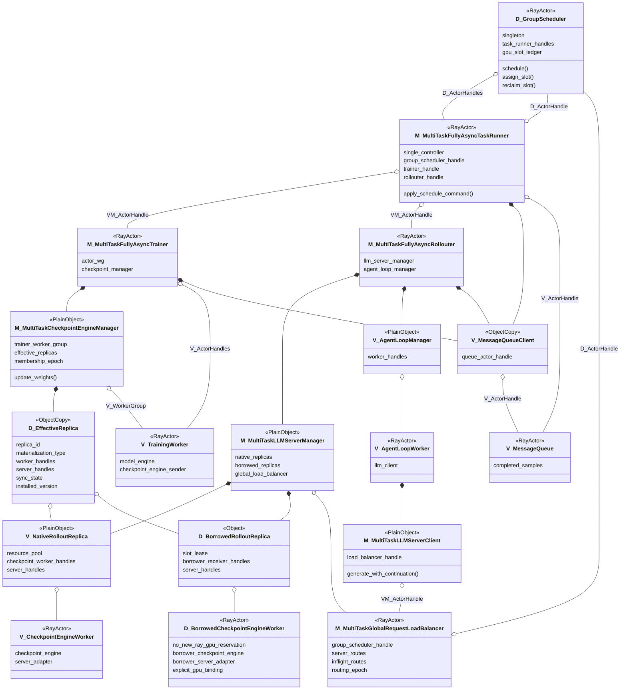
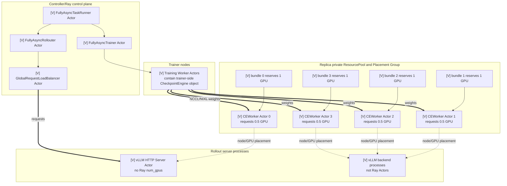
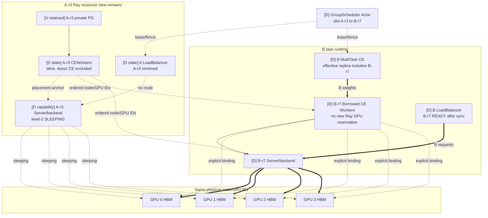
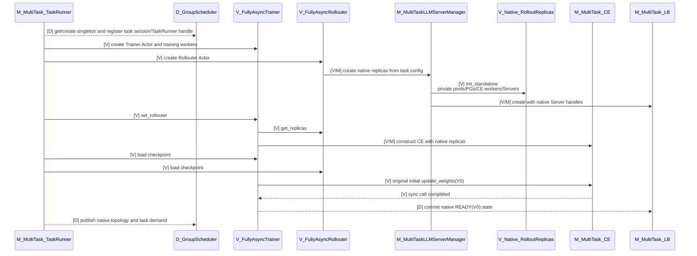
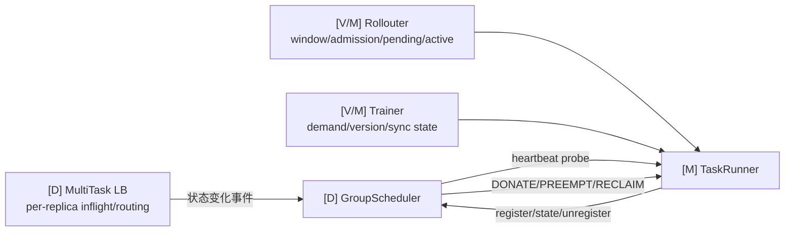
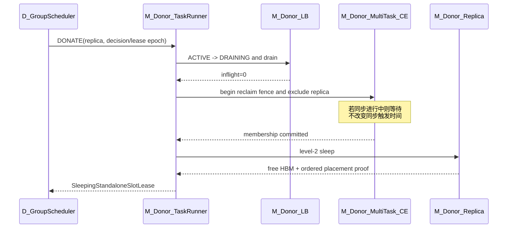
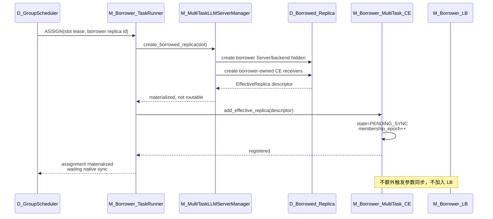
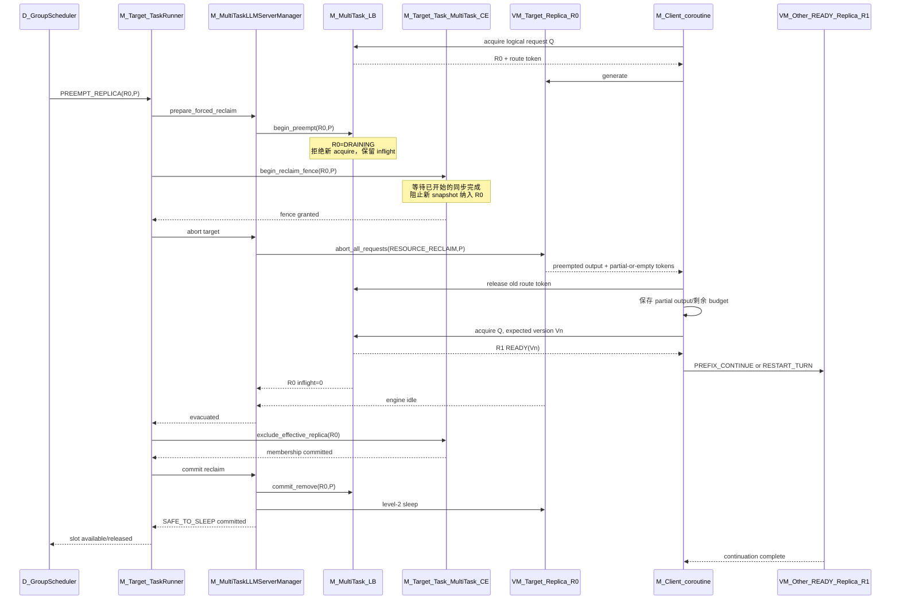
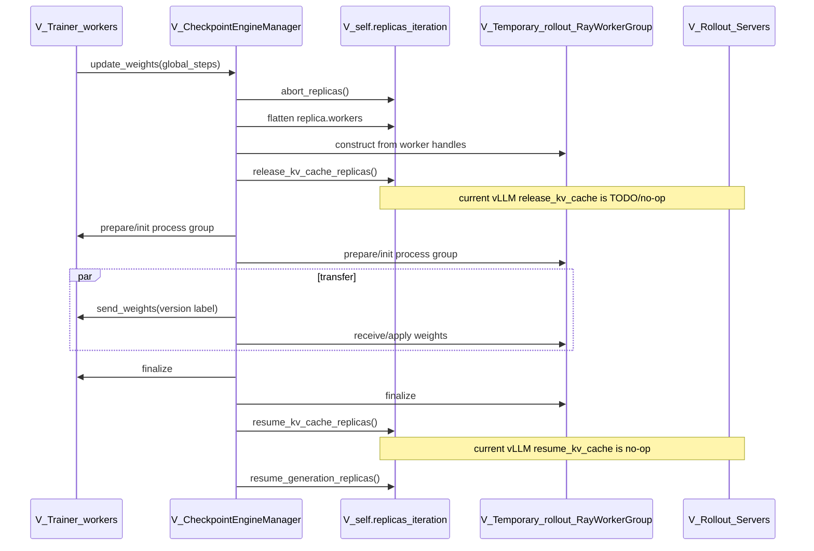
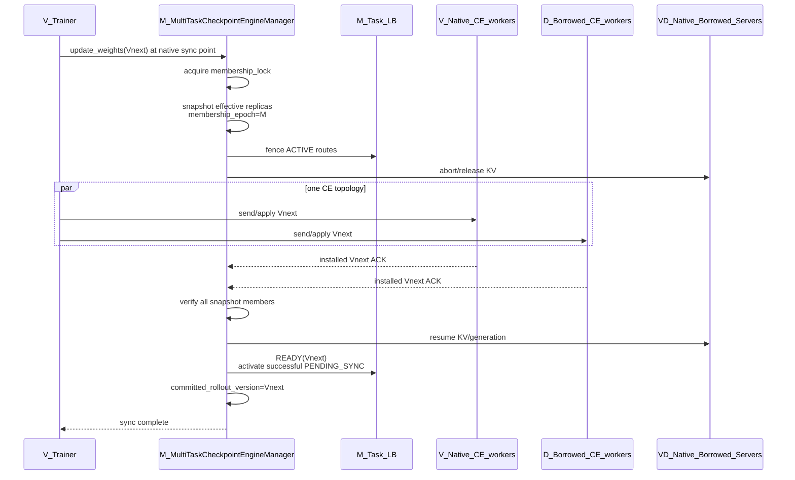

# STANDALONE 多任务推理资源共享方案

> 状态：经代码全量校对的待评审总体方案；不是实现现状说明。
>
> verl 代码基线：`/Users/nyp/Documents/verl`，verl v0.8.0，commit
> `7aed6b230776f963fa09509c10d9c3a767d1102c`。
>
> GroupScheduler 模拟器参考：`/Users/nyp/Documents/multi-rl-task-scheduler`，HEAD
> `7ac1396a60bc6d22b9f2e908f9440176781d3f3e`。校对时模拟器 worktree 有未提交修改；本文 `[S]` 只采用
> [`STANDALONE-CODE-AUDIT.md`](STANDALONE-CODE-AUDIT.md) 中列出的、经确认与该 HEAD 一致的源文件事实。
>
> 本文汇总 STANDALONE 模式下的多任务 rollout 资源共享方案。代码事实和下钻分析分别见：
>
> - [`03-hybrid-standalone-component-topology.md`](03-hybrid-standalone-component-topology.md)；
> - [`05-standalone-initialization-process.md`](05-standalone-initialization-process.md)；
> - [`06-standalone-inference-resource-bubble-detection.md`](06-standalone-inference-resource-bubble-detection.md)；
> - [`07-async-parameter-sync-checkpoint-engine.md`](07-async-parameter-sync-checkpoint-engine.md)；
> - [`08-forced-reclaim-request-continuation.md`](08-forced-reclaim-request-continuation.md)；
> - [`STANDALONE-CODE-AUDIT.md`](STANDALONE-CODE-AUDIT.md)：本文所有图、表、流程和技术断言的逐项代码校对矩阵。

本文所有内容使用以下事实层级：

| 标记 | 含义 |
|---|---|
| `[V]` | verl v0.8.0 已有代码事实 |
| `[S]` | GroupScheduler 模拟器已有抽象；不等于 verl/生产实现 |
| `[D]` | 本项目目标设计，当前尚无实现 |
| `[M]` | 可复用 verl/模拟器锚点，但仍需新增关键语义 |

verl 代码行号以文首 commit 为准；模拟器行号以校对清单列出的 HEAD 一致文件为准。没有生产代码的设计项必须给出扩展锚点，
但不得称为“已有实现”。

本文主图默认 `config.async_training.use_trainer_do_validate=false`，只分析长期运行的 STANDALONE rollout replicas。若该配置为
`true`，verl 还会在 Trainer GPU 上预创建一组仅用于 trainer-side validation 的 HYBRID replicas，并维护独立
`hybrid_checkpoint_manager`：`verl/experimental/fully_async_policy/fully_async_main.py:159-174`、
`verl/experimental/fully_async_policy/fully_async_rollouter.py:177-226`、
`verl/experimental/fully_async_policy/fully_async_trainer.py:176-243`。这组 validation replicas 不进入本文第一阶段 donor/borrower
集合；否则部署图和 CE 集合都必须再增加一条 HYBRID 支路。

# 问题

## 1. 单任务异步仍然存在 rollout GPU 空泡

RL 训练中的 rollout 请求具有明显的阶段性、长尾性和版本约束。即使单任务引入训推异步，也不能保证推理 GPU 持续满载：

1. rollout 生产受到 freshness/staleness budget 限制，达到上限后必须停止继续 admission；
2. Trainer 和 Rollouter 周期性进行参数同步，推理侧会 drain 或 abort 请求；
3. 同一批请求长度不同，短请求所在 replica 会先空闲，长尾 replica 仍在工作；
4. One-Step 在完整 batch 边界天然存在阶段性空闲；
5. FullyAsync 只能在允许的陈旧度窗口内继续生产，不能无限向前生成；
6. `partial_rollout` 可以降低等待长尾请求的时间，但会引入 trajectory 跨版本生成，不能无条件开启；
7. 单任务扩缩只能在本任务已有资源中调整，无法利用其他任务暂时空闲的 HBM。

因此，单任务训推异步能够压缩一部分空泡，但受算法陈旧度、参数版本和有限生产窗口约束，无法完全消除 rollout GPU 空闲。

> 代码校对：`[V]` FullyAsync admission 上界和 pause 条件见
> `verl/experimental/fully_async_policy/fully_async_rollouter.py:485-543,848-951,1077-1099`；参数同步触发见
> `verl/experimental/fully_async_policy/fully_async_trainer.py:487-524`；partial client 见
> `verl/experimental/fully_async_policy/fully_async_rollouter.py:51-150`。这里的“replica 逐个形成空泡”仍需 `[M]` 的 per-replica
> LB 状态才能确认。

## 2. verl 原生资源视图无法表达跨任务临时借用

STANDALONE 初始化时，每个 rollout replica 创建自己的：

```text
RayResourcePool
→ Placement Group
→ resource bundles
→ CheckpointEngineWorker Ray Actors
→ inference Server Actors/backend processes
```

Ray 资源视图会认为这些 GPU 在任务整个生命周期内始终被该 replica 占有。即使目标扩展让 Server 执行 level-2 sleep 并真实释放
模型权重和 KV cache HBM，Ray 仍不会把 PG 已预留的 GPU resource 重新分配给其他任务。当前 verl 的 STANDALONE sleep 实际是
no-op，见 `verl/workers/rollout/vllm_rollout/vllm_async_server.py:622-635`。

跨任务共享需要表达以下状态：

```text
Ray reservation owner       = donor task
temporary HBM usage owner   = borrower task
serving traffic owner       = borrower task LB
```

这不是原生 ResourcePool/PG/bundle 能独立表示的。

> 代码校对：`[V]` STANDALONE 创建 private ResourcePool/PG/worker 的路径见
> `verl/workers/rollout/replica.py:189-239`；PG 每 bundle 预留 1 GPU 见
> `verl/single_controller/ray/base.py:130-159`。`[D]` 跨任务 HBM 临时 owner/lease 不存在于 verl 代码。

## 3. 资源、路由和参数同步视图会发生分离

动态借用后至少存在三种权威视图：

1. verl/Ray 原生资源视图：ResourcePool、Placement Group、bundle 和 worker actor；
2. 推理负载均衡视图：LB 只通过 Server ActorHandle 分发请求；
3. GroupScheduler 全局物理视图：node ID、GPU ID、HBM slot 和跨任务 lease。

此外，Checkpoint Engine 需要维护当前任务的参数同步执行集合：

```text
effective_replicas(task)
= 本任务未借出的固有 replicas
+ 已成功物化并注册的受赠 replicas
```

如果只把受赠 Server 加入 LB、没有加入 borrower CE effective replicas，该实例会持续使用旧权重；如果 donor replica 已借出却仍在
donor CE 集合中，donor 参数同步可能重新占用其 HBM，与 borrower 冲突。

> 代码校对：`[V]` 原生 LB 只保存 server handle、inflight 和 sticky map，见
> `verl/workers/rollout/llm_server.py:60-143`；原生 CE 只保存显式 `replicas` list，见
> `verl/checkpoint_engine/base.py:374-429`。GS slot/lease 视图和 `effective_replicas` 都是 `[D]`。

## 4. 强制回收不能丢失 in-flight 请求

优先回收已经形成自然空泡的 replica 最安全，但全局调度可能因优先级、配额、故障或 donor reclaim deadline 强制回收仍有请求的
实例。此时需要：

```text
摘流
→ abort 目标 replica 的全部 in-flight generation
→ 请求在其他有效 replica 上重新 acquire
→ 使用已有 token prefix 继续生成或重启当前 turn
→ 目标 replica 完成 evacuation 后 sleep
```

这个过程类似 verl partial rollout，但不能要求所有任务都配置 `partial_rollout=true`，也不能让 GroupScheduler 持有请求内容或参与
AgentLoop 数据面。

> 代码校对：`[V]` abort、aborted output 和 partial client 重试骨架分别见
> `verl/workers/rollout/vllm_rollout/vllm_async_server.py:533-602,679-715,1062-1083` 和
> `verl/experimental/fully_async_policy/fully_async_rollouter.py:91-149`。`[D]` 原生没有资源回收 abort reason、同版本目的实例筛选或
> DRAINING 状态机；主模拟器还明确只回收 idle instance：
> `/Users/nyp/Documents/multi-rl-task-scheduler/src/multi_rl_task_scheduler/group_scheduler.py:212-237`。

# 动机

## 1. 在不改变单任务算法语义的前提下利用跨任务空泡

目标是在多个同时运行的 RL 任务之间临时共享 rollout HBM：

```text
donor rollout replica 空闲或被抢占
→ donor 保留原 ResourcePool/PG/bundles 和 sleeping Server（目标能力）
→ GroupScheduler 将释放的 HBM slot 临时租给 borrower
→ borrower 在同一 node/GPU 上创建自己的 inference replica
→ borrower 加入自己的参数同步集合和 LB
→ lease 到期后 borrower 退出，donor 在自己的下一次参数同步后恢复
```

共享单位是完整 replica footprint，而不是任意拼接的单卡：

```text
ReplicaTopology(tp, pp, dp)
+ ordered node/GPU placements
+ HBM capacity and safety margin
+ donor session/PG provenance
```

> 代码校对：上述整条 donor/borrower 链路是 `[D]`。模拟器的 `SleepRegistry` 仅提供整实例 ACTIVE/SLEEPING 原子状态参考，见
> `/Users/nyp/Documents/multi-rl-task-scheduler/group_scheduler/sleep_registry.py:12-62,118-258`，不能证明真实 vLLM HBM 已释放。

## 2. 最小化对 verl 的侵入

总体原则：

- GroupScheduler、TaskRunner 扩展、MultiTaskLLMServerManager、MultiTaskCheckpointEngineManager、扩展 LB 和 borrower
  replica 实现在独立子仓；
- 保留 verl 原生 STANDALONE 初始化过程；
- 初始化阶段每个任务仍按自身配置申请资源和创建 replicas，不由 GS 分配初始规模；
- 不改 One-Step/FullyAsync 的参数同步触发时机；
- GroupScheduler 只调整资源 lease、Server 生命周期和 CE effective replicas；
- 仅在缺少必要扩展点、动态 Server/receiver GPU binding 和 backend sleep/wake 处修改 verl；
- 不引入额外的 GS→manager 通信 Actor，所有命令经 TaskRunner 转发；
- LB 可以直接向 GS 上报实例负载事实，但不执行跨任务创建和回收。

> 扩展锚点：`[V]` verl 已支持通过配置替换 CheckpointEngineManager，见
> `verl/experimental/separation/ray_trainer.py:120-131`；LLMServerManager/LB 的创建见
> `verl/workers/rollout/llm_server.py:257-264,337-355`。MultiTask 组件、GS 通信和 borrowed replica 均为 `[D]`。

## 3. 保持任务层面对共享资源无感知

任务仍只声明自己的基础资源规模和算法配置。运行时新增的受赠实例由多任务运行时维护：

- Trainer 不改变 batch size、T、S 或 partial rollout 配置；
- Rollouter 不需要知道物理 GPU 原本属于哪个任务；
- AgentLoop 仍通过同一个 LB handle 请求 Server；
- 参数同步仍通过原生 `_fit_update_weights()` 入口；
- 样本仍记录实际 rollout policy version 和逐 token log prob；
- GroupScheduler 感知跨任务资源所有权，任务算法层不感知 donor/borrower 关系。

> 代码校对：`[V]` FullyAsync 样本记录 `min_global_steps/max_global_steps` 的 client 路径见
> `verl/experimental/fully_async_policy/fully_async_rollouter.py:96-149`，组 batch/统计 version 见
> `verl/experimental/fully_async_policy/detach_utils.py:151-166`。任务层对 donor/borrower 无感知是 `[D]` 的接口约束。

# 方案设计

## 逻辑视图

### 1. 总体组件关系



> 图 1 校对：这是“verl 原生骨架 + 目标扩展”的逻辑图，不是当前类图。原生引用链见
> `fully_async_main.py:77-103,117-157`、`fully_async_trainer.py:158-174,249-254`、
> `fully_async_rollouter.py:797-812`、`llm_server.py:304-355`、`agent_loop.py:1044-1099` 和
> `fully_async_policy/message_queue.py:26-134,180-234`。完整路径及每个节点/边的校对见校对文档 §3；所有 `D_` 类和 GS 相关边
> 当前均无实现。

### 2. One-Step 与 FullyAsync 的对象归属差异

上图以 FullyAsync 为主。One-Step 和 FullyAsync 复用相同的 GS、LB、replica lifecycle 和 CE effective-replica 语义，但
single-controller 内部拓扑不同：

| 维度 | One-Step Off-Policy | FullyAsync | 校对与代码依据 |
|---|---|---|---|
| TaskRunner | `[M]` `MultiTaskOneStepTaskRunner` Ray Actor | `[M]` `MultiTaskFullyAsyncTaskRunner` Ray Actor | 原类是 `[V]`：`one_step_off_policy/main_ppo.py:34-35`、`fully_async_policy/fully_async_main.py:35-36`；MultiTask 子类均 `[D]` |
| Trainer/controller | `[V]` TaskRunner 进程内普通 `OneStepOffRayTrainer` | `[V]` 独立 `FullyAsyncTrainer` Ray Actor | `one_step_off_policy/main_ppo.py:90-107`；`fully_async_policy/fully_async_main.py:138-156` |
| Rollouter | `[V]` 没有独立 Rollouter Actor，manager/AgentLoop 在 Trainer 内 | `[V]` 独立 `FullyAsyncRollouter` Ray Actor | `one_step_off_policy/ray_trainer.py:170-196`；`fully_async_policy/fully_async_rollouter.py:392-393` |
| LLMServerManager | `[V]` Trainer 进程内普通对象 | `[V]` Rollouter Actor 内普通对象 | `one_step_off_policy/ray_trainer.py:190-196`；`fully_async_policy/fully_async_rollouter.py:797-812` |
| CE manager | `[V]` Trainer 进程内普通对象 | `[V]` Trainer Actor 内普通对象 | `separation/ray_trainer.py:120-131`；`fully_async_policy/fully_async_trainer.py:167-174` |
| membership 调整 | `[D]` TaskRunner 本地编排扩展 CE | `[D]` TaskRunner 分别 RPC Rollouter 创建、Trainer 注册 | 原 CE 只有 list add/remove：`checkpoint_engine/base.py:414-429` |
| 参数同步入口 | `[V]` `SeparateRayPPOTrainer._fit_update_weights()` | `[V]` `FullyAsyncTrainer._fit_update_weights()` | `separation/ray_trainer.py:645-650`；`fully_async_policy/fully_async_trainer.py:501-524` |

因此 FullyAsync 不能只修改 Rollouter 中的 `rollout_replicas`；创建得到的 `EffectiveReplica` descriptor 必须由 TaskRunner 显式传给
Trainer Actor 内的 CE。One-Step 虽然可以本地完成，但仍应使用相同接口和 epoch，避免形成两套协议。

> 表 1 路径前缀均为 `verl/experimental/`，CE 文件前缀为 `verl/`。`EffectiveReplica` 和 epoch 是 `[D]`，原生 Trainer 当前
> 直接从 Rollouter `get_replicas()` 并构造 CE：`verl/experimental/fully_async_policy/fully_async_trainer.py:167-174`。

#### Ray ActorClass 的继承边界

图中的 `MultiTaskFullyAsyncTaskRunner/Trainer/Rollouter` 是目标逻辑角色，不代表可以直接写普通 Python 继承。三个原类分别在
`verl/experimental/fully_async_policy/fully_async_main.py:35-36`、`fully_async_trainer.py:52-53` 和
`fully_async_rollouter.py:392-393` 被 `@ray.remote` 装饰；导入符号是 Ray ActorClass，不是稳定的用户继承基类。

代码上只有两种清晰方案：

1. 上游把实现体抽成未装饰 base class，原生类和子仓 MultiTask 类分别在继承后调用 `ray.remote(...)`；
2. 保留原生 Actor，不新增 Trainer/Rollouter 子类，只在 verl 增加通用 manager-class 注入点和 CE/replica membership RPC，子仓提供
   manager 实现与自定义 TaskRunner 编排。

第一阶段更倾向方案 2，因为 FullyAsync 当前 CE 在 `fully_async_trainer.py:27,167-174` 直接引用/构造原生
`CheckpointEngineManager`，LLM manager 在 `fully_async_rollouter.py:803-812` 直接构造 `FullyAsyncLLMServerManager`；这两个位置正是
最小且明确的注入缺口。One-Step CE 已有 `checkpoint_manager_class` 配置钩子（
`verl/experimental/separation/ray_trainer.py:120-131`），但 LLM manager 仍在
`verl/experimental/one_step_off_policy/ray_trainer.py:170-196` 硬编码，需要相同注入点。

### 3. 新增和扩展组件

#### 3.1 `[D]` GroupScheduler

单例 Ray Actor，作为跨任务全局调度大脑：

- 保存 TaskRunner ActorHandles；
- 通过心跳维护任务、节点、GPU 和 lease 状态；
- 接收 LB 上报的 per-replica inflight/idle/routing 状态；
- 结合任务需求、空泡预测、优先级和成本生成 DONATE/ASSIGN/PREEMPT/RECLAIM 决策；
- 将决策发送给 donor/borrower TaskRunner；
- 使用 slot CAS 和 lease epoch 保证同一 HBM slot 不会被重复分配；
- 不直接调用普通对象 manager；
- 不触发参数同步；
- 不持有请求 payload、AgentLoop future 或权重数据。

模拟器参考仅是 `[S]`：普通 `GroupScheduler` 的注册、状态版本和 assign/reclaim 见
`/Users/nyp/Documents/multi-rl-task-scheduler/src/multi_rl_task_scheduler/group_scheduler.py:18-45,55-157`；它不是 Ray Actor，注册的也是
普通 `InferScheduler`（`interfaces.py:9-30`）。生产 Ray Actor 单例、TaskRunner handles、slot CAS 和 lease epoch 都需新增。

#### 3.2 `[M]` MultiTaskFullyAsyncTaskRunner

任务的 single controller Ray Actor：

- 创建或获取 GroupScheduler 单例 handle；
- 启动时向 GS 注册任务 session、基础资源和自身 ActorHandle；
- 持有 Trainer、Rollouter 和 GS handles；
- 响应 GS 主动 heartbeat probe，并通过 GS handle 上报注册/状态变化/注销、资源需求和同步/membership 摘要；
- 接收 GS 命令并编排 Trainer 与 Rollouter；
- donor 侧执行摘流、CE 排除、sleep 和 slot 发布；
- borrower 侧执行 Server/receiver 创建、CE 注册和 LB 激活；
- 任务结束时注销资源和 session。

TaskRunner 是 GS 进入任务内部的唯一控制入口。

可复用原类的 `components`、Trainer/Rollouter 创建和双 fit 监督：
`verl/experimental/fully_async_policy/fully_async_main.py:35-50,72-115,117-209`。GS handle、注册、心跳和命令 API 均为 `[D]`。

还必须修正 Actor 并发入口：原 FullyAsync TaskRunner 只有 `@ray.remote(num_cpus=1)`，同步 `run()` 会一直阻塞到 Trainer/Rollouter
结束（`fully_async_main.py:35-50,176-209`）。默认单并发下，GS 的 heartbeat/command RPC 会排队到任务结束，设计不可用。目标
TaskRunner 必须配置受控 `max_concurrency`/concurrency groups，或让 `run()` 只启动后台监督而不长期占用唯一方法槽，并用 task-level lock
串行化调度事务。One-Step 原 Actor 已配置 `max_concurrency=100`（`one_step_off_policy/main_ppo.py:34-35`），但 Trainer 只是 `run()` 的
局部变量（`:90-107`）；MultiTask 版本必须保存为 `self.trainer` 才能由命令方法访问。

#### 3.3 `[M]` MultiTaskLLMServerManager

位于 Rollouter Actor 内的普通对象，继承或组合 `FullyAsyncLLMServerManager`：

- 管理初始化时创建的 native replicas；
- 管理运行期创建的 borrowed replicas；
- 创建、销毁、sleep、wake、abort 和 warmup Server；
- 基于 donor placement anchors 查询有序 node/GPU IDs；
- 创建 borrower-owned Checkpoint Engine receiver；
- 返回可序列化的 `EffectiveReplica` descriptor 给 TaskRunner；
- 操作扩展 LB 的路由状态；
- 不制定跨任务调度策略；
- 不直接调用位于 Trainer Actor 内的 CE manager。

扩展锚点是 `verl/experimental/fully_async_policy/fully_async_rollouter.py:153-343,1134-1138` 和
`verl/workers/rollout/llm_server.py:223-364`。现有 `add_replicas()` 只激活初始化时预注册的 hybrid replica，不会运行期物化新的
STANDALONE/borrowed replica。

#### 3.4 `[M]` MultiTaskCheckpointEngineManager

位于 Trainer/controller 内的普通对象，扩展原生 `CheckpointEngineManager`：

```text
effective_replicas
= native replicas not donated
+ materialized borrowed replicas
```

职责：

- 使用 stable replica ID 保存有效集合；
- 使用 membership lock 串行化 add/remove 与 `update_weights()`；
- 为每次同步生成不可变 membership snapshot 和 epoch；
- 在 verl 原生同步点统一同步 native 和 borrowed CE endpoints；
- 保存每个 replica 的 sync state、installed version 和 ACK；
- 同步失败时阻止混合版本 replicas 接流；
- 不由 GS 直接调用，命令由 TaskRunner/Trainer Actor 转发。

`[V]` 原生 `CheckpointEngineManager` 的显式 `replicas` list、add/remove 和同步遍历见
`verl/checkpoint_engine/base.py:374-429,470-515`。stable ID、membership lock/snapshot、installed-version ACK、LB fence 和失败事务均为
`[D]`。

#### 3.5 `[M]` MultiTaskGlobalRequestLoadBalancer

扩展原生 `GlobalRequestLoadBalancer`：

- 维护 `server_id → ActorHandle`；
- 维护 per-server in-flight route 数；
- 维护 sticky logical request routing；
- 维护 `READY/DRAINING/SYNCING/SLEEPING` 状态和 routing epoch；
- 只向 `READY(committed_rollout_version)` Server 路由；
- 在 zero-inflight 等状态变化时向 GS 上报事实；
- 支持两阶段摘流，DRAINING 时拒绝新 acquire 但保留旧 route/inflight；
- 不根据单一 `inflight==0` 自行决定捐赠；
- 不执行跨任务 Server 创建。

`[V]` 原 LB 只有 server handle、sticky map、inflight counter 和即时 add/remove：
`verl/workers/rollout/llm_server.py:43-143`。READY/DRAINING/SYNCING/SLEEPING、routing epoch、policy version、两阶段摘流和 GS
上报全部为 `[D]`。

#### 3.6 `[D]` BorrowedRolloutReplica 和 BorrowedCheckpointEngineWorker

受赠 replica 不调用原生 `init_standalone()`，否则会再次申请 ResourcePool/PG/GPU。它使用 donor slot 中的 placement 信息：

```text
donor worker handles/PG provenance
→ ordered node IDs and GPU IDs
→ hard node affinity
→ explicit CUDA_VISIBLE_DEVICES/local rank
→ borrower Server/backend
→ borrower-owned CE receiver
```

donor `CheckpointEngineWorker` 只作为 placement anchor 和 PG 存活证明，不能作为 borrower 权重接收端。borrower receiver 必须绑定：

- borrower rollout/model config；
- borrower checkpoint backend；
- borrower ServerAdapter；
- borrower Server；
- borrower task/session/replica/lease identity。

`[V]` 可复用的 placement discovery/Server launch 在
`verl/workers/rollout/vllm_rollout/vllm_async_server.py:976-1054`，CE receive/apply 在
`verl/checkpoint_engine/base.py:278-325`。原 `init_standalone()` 必然新建 ResourcePool/PG/worker，见
`verl/workers/rollout/replica.py:189-239`，因此不能用于受赠实例。borrowed receiver 的无重复 Ray GPU 申请和显式设备绑定必须单独实现并
PoC 验证。

### 4. `[D]` 三种视图的目标映射

| 实例状态 | Ray/PG 视图 | GS node/GPU 视图 | LB 视图 | CE effective replicas | 性质 |
|---|---|---|---|---|---|
| native ACTIVE | owner task 预留 | owner task 使用 | owner LB READY | owner CE 包含 | `[M]` 原生只有 PG、LB active 集合和 CE list，无统一状态 |
| native natural bubble | owner task 预留 | owner task 使用 | 仍可能 READY | owner CE 包含 | `[D]` natural-bubble 联合判定 |
| native DRAINING | owner task 预留 | 回收事务中 | 禁止新 acquire | 回收 fence 中 | `[D]` |
| native SLEEPING/已捐赠 | donor task 预留 | lease 给 borrower | donor LB 排除 | donor CE 排除 | `[D]` |
| borrowed CREATING | donor task 预留 | borrower 持有 lease | hidden | 尚未注册 | `[D]` |
| borrowed PENDING_SYNC | donor task 预留 | borrower 持有 lease | hidden | borrower CE 包含 | `[D]` |
| borrowed READY | donor task 预留 | borrower 持有 lease | borrower LB READY | borrower CE 包含 | `[D]` |
| borrowed RECLAIMING | donor task 预留 | lease 回收中 | DRAINING | borrower CE 排除中 | `[D]` |

跨视图关联键至少包括：

```text
task_id
task_session_id
replica_id
slot_id
lease_epoch
membership_epoch
routing_epoch
policy_version
```

`[V]` 三个局部锚点分别是 PG：`verl/workers/rollout/replica.py:189-226`，LB：
`verl/workers/rollout/llm_server.py:60-143`，CE list：`verl/checkpoint_engine/base.py:374-429`。上述统一状态名和全部关联键当前均为
`[D]`。

### 5. `[D]` 核心不变量

```text
同一个 slot_id + lease_epoch 最多有一个 HBM 使用者

LB_READY(task)
⊆ CE_SYNC_READY(task, committed_rollout_version)

donated_native_replica
∉ donor LB
∉ donor CE effective replicas

borrowed_replica before sync ACK
∉ borrower LB READY

GroupScheduler command
≠ parameter sync trigger
```

这些是实现必须满足的目标断言，不是 verl 已有保证。可复用的 remove 接口见
`verl/workers/rollout/llm_server.py:115-126` 和 `verl/checkpoint_engine/base.py:422-429`；二者目前没有跨对象原子性。模拟器
`SleepRegistry` 的 per-worker 单 active instance 校验可作为 slot CAS 参考：
`/Users/nyp/Documents/multi-rl-task-scheduler/group_scheduler/sleep_registry.py:118-194,267-291`。

## 部署视图

### 1. `[V]` 原生 STANDALONE 部署

下面明确取单节点例子：`world_size=4`、`nnodes=1`、`gpus_per_replica_node=4`。此时一个 native rollout replica 在原生视图中拥有：



原生 `RolloutReplica.init_standalone()` 创建 private ResourcePool、PG 和 `CheckpointEngineWorker` actors；Server launch
路径再通过 worker handles 获取 node/GPU placement。代码边界见：

- `verl/workers/rollout/replica.py:189-239`；
- `verl/workers/rollout/vllm_rollout/vllm_async_server.py:968-1054`；
- `verl/checkpoint_engine/base.py:278-340`。

图 2 的两个精确资源语义：PG bundle 预留 1 GPU（`verl/single_controller/ray/base.py:143-155`），但 STANDALONE 使用
`max_colocate_count=2`，所以每个 `CheckpointEngineWorker` Actor 申请 0.5 GPU（
`verl/workers/rollout/replica.py:202-206`、`verl/single_controller/ray/base.py:621-678`）。Server Actor 的 `.options()` 没有
`num_gpus`，设备来自 worker accelerator ID 和 `cuda_visible_devices`（`vllm_async_server.py:976-1033`）。Trainer-side CE 是 Training
Worker 进程内对象（`verl/workers/engine_workers.py:618-629`），不是独立 Actor。

若 `nnodes>1`，`vLLMReplica.launch_servers()` 会按 node slice worker handles，并在每个 node 创建一个 Server Actor；LB 暴露/保存的是
第 0 个 Server 的 address/handle：`verl/workers/rollout/vllm_rollout/vllm_async_server.py:991-1054`。因此图 2 不能直接外推成“多节点也只有
一个 Server Actor”。

### 2. `[D]` 捐赠后的 donor/borrower 共卡目标部署

假设任务 A 的 native replica `A-r3` 使用 4 张 GPU，sleep 后临时借给任务 B 创建 `B-r7`：



Ray 仍认为 4 张 GPU 属于 A-r3 的 PG。B-r7 的 Server 和 CE receiver 不再声明新的 Ray GPU resource，而是根据 GS lease
显式绑定相同 GPU。在该 `[D]` 目标架构中，防止重叠使用的唯一全局权威必须是 GroupScheduler slot ledger。

> 图 3 校对：整张图是 `[D]` 目标部署。`[V]` 可复用的只有 worker node/GPU discovery 和无 `num_gpus` 的 Server Actor 创建
>（`verl/workers/rollout/vllm_rollout/vllm_async_server.py:976-1033`）、LB add/remove（
> `verl/workers/rollout/llm_server.py:100-126`）以及 CE 显式 replica list（`verl/checkpoint_engine/base.py:374-429`）。尤其要注意，
> 当前 STANDALONE `sleep()/wake_up()` 明确 skip：`vllm_async_server.py:604-635`。所以在 level-2 sleep、同 GPU 双进程隔离、borrowed
> receiver 无重复 Ray GPU 记账完成 PoC 前，不能宣称该部署可运行。

### 3. 运行实体和部署位置

| 实体 | 类型 | 所在位置 | GPU 资源语义 | 性质和代码依据 |
|---|---|---|---|---|
| GroupScheduler | Ray Actor 单例 | Ray 控制节点/任意 CPU node | 不占 GPU | `[D]`；模拟器只是普通类：`src/multi_rl_task_scheduler/group_scheduler.py:18-45` |
| MultiTaskFullyAsyncTaskRunner | Ray Actor | 每任务 single-controller 进程 | 不占 GPU | `[M]`；原类：`fully_async_main.py:35-50` |
| MultiTaskFullyAsyncTrainer | Ray Actor | 任务控制 Actor | 持有 training worker handles | `[M]`；原类：`fully_async_trainer.py:52-53,135-174` |
| MultiTaskFullyAsyncRollouter | Ray Actor | 任务 Rollouter 控制 Actor | 持有 manager/AgentLoop handles | `[M]`；原类：`fully_async_rollouter.py:392-515,797-812` |
| MultiTaskCheckpointEngineManager | 普通对象 | Trainer Actor 进程 | 不直接占 GPU | `[M]`；原类：`checkpoint_engine/base.py:345-385` |
| MultiTaskLLMServerManager | 普通对象 | Rollouter Actor 进程 | 不直接占 GPU | `[M]`；原类：`fully_async_rollouter.py:153-343` |
| MultiTaskGlobalRequestLoadBalancer | Ray Actor | CPU node | 不占 GPU | `[M]`；原 Actor：`llm_server.py:43-143` |
| MessageQueue | Ray Actor | CPU node | 不占 GPU | `[V]`：`message_queue.py:26-134` |
| MessageQueueClient | 普通对象副本 | TaskRunner、Trainer、Rollouter 所在进程 | 持有 MQ ActorHandle | `[V]`：`message_queue.py:180-234`、`fully_async_main.py:94-103` |
| AgentLoopManager | 普通对象 | Rollouter Actor 进程 | 不占 GPU | `[V]`：`agent_loop.py:1044-1077` |
| AgentLoopWorker | Ray Actor | CPU node soft affinity | 不占 rollout GPU | `[V]`：`agent_loop.py:1068-1099` |
| MultiTaskLLMServerClient | 普通对象 | AgentLoopWorker 进程 | 持有 LB handle | `[M]`；原 client：`llm_server.py:146-220` |
| Native CheckpointEngineWorker | Ray Actor | native private PG bundle | Actor 申请 0.5 GPU，PG 预留 1 GPU | `[V]`：`replica.py:202-239`、`ray/base.py:621-680` |
| Native Server/backend | Ray Actor + backend processes | native worker 所在 node/GPU | Server Actor 不申请 GPU，显式 visible devices | `[V]`：`vllm_async_server.py:976-1054` |
| Borrowed CheckpointEngineWorker | Ray Actor | donor worker 所在 node | 目标是不重复申请 Ray GPU | `[D]`；需新增创建/绑定路径 |
| Borrowed Server/backend | Ray Actor + backend processes | donor slot node/GPU | 目标由 GS 记账 HBM lease | `[D]`；复用 Server placement 锚点 |

表内省略的代码路径前缀依次为 `verl/experimental/fully_async_policy/`、`verl/workers/rollout/`、
`verl/checkpoint_engine/`、`verl/single_controller/ray/` 和 `verl/experimental/agent_loop/`；模拟器完整路径见校对文档 §2.2。

### 4. `[D]` 生命周期约束

- borrower lease 生命周期不能超过 donor task session、private PG 或 placement-anchor workers；
- donor replica 借出时不销毁 ResourcePool、PG、workers 和 Server，只执行 sleep；
- borrower 退出时销毁 borrower Server/receiver，不销毁 donor PG；
- donor TaskRunner 异常或 PG 即将销毁时，GS 必须优先回收所有 borrower leases；
- node/GPU ID 不能脱离 actor/PG provenance 单独长期使用，避免节点重启后旧 ID 被误用；
- 多节点 replica 必须保持 rank→node→GPU 的有序映射，不能由 GS 随意拼卡。

`[V]` 原生能提供的 provenance 是 `RolloutReplica.resource_pool/workers`（`verl/workers/rollout/replica.py:122-129`）以及按
worker 顺序切分的 node/GPU mapping（`vllm_async_server.py:976-998`）。session、lease、优先回收和 borrowed teardown 都需新增。

## 运行视图

### 1. `[M]` 初始化流程

初始化阶段不共享资源，任务仍按自身配置创建固定规模：



初始化时 GS 不决定 replica 数、不分配基础 GPU，只登记任务后续可共享的资源和 TaskRunner handle。

图 4 中 `[V]` 顺序严格来自 `verl/experimental/fully_async_policy/fully_async_main.py:72-115,117-157`：先建 Trainer，再建
Rollouter，随后 `trainer.set_rollouter()`；CE 在 set_rollouter 内从 Rollouter 取 replicas，见
`verl/experimental/fully_async_policy/fully_async_trainer.py:167-174,249-254`。原生没有“replica descriptor 返回 TaskRunner”或
“CE 通知 LB READY”调用；图中的 GS session/topology 注册和 READY commit 都是 `[D]` 扩展。

### 2. `[M]` 推理实例空闲状态判断

#### 1. `[V/M]` 不能只看 inflight=0

原生 LB 的 `inflight==0` 只表示瞬时没有正在执行的请求。只要 admission 仍然开放，下一条请求随时可能进入，因此不能直接
sleep 或捐赠。

建议分层定义：

```text
ZERO_INFLIGHT
= replica 当前 in-flight route 数为 0

NATURAL_BUBBLE
= 当前 rollout work window 已关闭
  && 已接纳输入完成首次路由
  && 不会再有同窗口 multi-turn/partial retry 回到该 replica
  && replica inflight == 0

RECLAIMABLE
= LB 已将 replica 切换为 DRAINING
  && lifecycle/CE fence 已取得
  && server/backend drain 完成

SLEEP_COMMITTED
= replica level-2 sleep
  && 释放 HBM 已验证
```

只有 `SLEEP_COMMITTED` 才能向 GS 发布可借用 slot。

`ZERO_INFLIGHT` 的原始计数可由 `[V]` LB 的 acquire/release 得到：`verl/workers/rollout/llm_server.py:68-99,128-143`；其余
`NATURAL_BUBBLE/RECLAIMABLE/SLEEP_COMMITTED` 是 `[D]` 联合状态。原生 backend drain 入口存在（
`verl/workers/rollout/vllm_rollout/vllm_async_server.py:676-677,1056-1060`），但原生 LB 没有 DRAINING fence，而且 STANDALONE
sleep 是 no-op（`verl/workers/rollout/vllm_rollout/vllm_async_server.py:622-635`），所以 `drained != HBM_RELEASED`。

#### 2. `[V/M]` 模式差异

符号：

```text
R = ppo_mini_batch_size * require_batches
T = trigger_parameter_sync_step
S = staleness_threshold
P = partial_rollout
```

| 模式 | admission 上界 | admission 关闭 | 空泡识别要点 | 校对 |
|---|---|---|---|---|
| One-Step | 当前完整 generation batch | batch 输入集合固定并取尽 | 防止 multi-turn 后续 generate；下一 batch 尚未开放 | `[V/M]` batch 流程：`one_step_off_policy/ray_trainer.py:207-235,390-409`；per-replica 判断需扩展 |
| FullyAsync Mode 1 `T=1,S=0` | `R` samples | freshness 上限达到 | 等已接纳 sample 完成并逐 replica 归零 | `[V/M]` 公式成立；不是“首次路由后”就完成 |
| Mode 2 `T>1,S=0` | `R*T` samples | 同一 rollout version 的生产上限达到 | 窗口更长，不能把中间零流量当空泡 | `[V/M]` |
| Mode 3 `S>0,P=false` | `int(R*T*(1+S))` | staleness/MQ budget 达到 | CE 同步仍会 abort；client 不 retry，不能把 abort 完成误判为自然空泡 | `[V/M]` |
| Mode 4 `S>0,P=true` | 同 Mode 3 | staleness/MQ budget 达到 | abort→retry 间隙不是空泡，需确认不会再路由回来 | `[V/M]` |

FullyAsync 公式和 pause 条件的直接代码依据是
`verl/experimental/fully_async_policy/fully_async_rollouter.py:485-543,848-951,1077-1099`；partial retry 开关见同文件
`:141-145`。上界限制的是新 sample admission，不代表已经接纳的 `active_tasks` 已完成。表中 One-Step 路径前缀为
`verl/experimental/`。无论 partial 配置为何，非 naive CE 都先 `abort_replicas()`（`verl/checkpoint_engine/base.py:470-484`）；
`P=false` 只意味着 client 收到 abort 后退出重试循环。

FullyAsync 的 `active_tasks` 是 sample task 数，不是 replica inflight 数；`pending_queue` 是尚未提交的 sample，也不能直接映射到
某个 replica。空泡判断必须结合：

- LB 的 per-replica inflight/routing state；
- Rollouter 的 paused、active tasks、pending queue 和 admission epoch；
- MessageQueue backlog；
- Trainer 是否等待样本；
- CE sync/partial retry/warmup 等维护状态。

#### 3. `[D]` 上报与决策链



LB 只上报事实，TaskRunner 上报任务级上下文，GS 组合后决定是否值得共享。除了能否回收，还应判断预计空闲时长是否覆盖：

```text
drain/abort
+ sleep
+ borrower create
+ borrower wait-for-sync
+ warmup
+ reclaim
+ donor wait-for-sync and restore
```

图 5 的所有主动上报/RPC 边当前都不存在。原 TaskRunner 只单向持有 Trainer/Rollouter handles：
`verl/experimental/fully_async_policy/fully_async_main.py:41-44,77-103`；原 LB 构造函数也没有 GS handle：
`verl/workers/rollout/llm_server.py:60-66`。模拟器的 report 接口只能作为 `[S]` 协议参考：
`/Users/nyp/Documents/multi-rl-task-scheduler/src/multi_rl_task_scheduler/interfaces.py:19-30`。

### 3. `[D]` 受赠推理实例创建

#### 1. `[D]` donor 发布 sleeping slot



slot 至少包含：

```text
slot_id/lease_epoch
donor task/session/replica
replica topology TP/PP/DP
ordered placement-anchor handles
node IDs/GPU IDs
PG IDs/bundle indices
donor Server handles and sleep epoch
measured free HBM and safety margin
lease deadline
```

图 6 的整条事务为 `[D]`。可复用锚点只有 LB count/remove（`verl/workers/rollout/llm_server.py:93-143`）、CE
`remove_replicas()`（`verl/checkpoint_engine/base.py:422-429`）和 placement discovery（
`verl/workers/rollout/vllm_rollout/vllm_async_server.py:976-989`）。原 LB remove 会立即丢掉计数，原 CE 无并发 fence，原
STANDALONE sleep no-op，因此三者都不能直接拼成安全捐赠事务。

#### 2. `[D]` borrower 创建 hidden replica



图 7 同样是 `[D]`。现有 `FullyAsyncLLMServerManager.add_replicas()` 只激活已在初始化阶段创建的 hybrid replicas（
`verl/experimental/fully_async_policy/fully_async_rollouter.py:153-275`），不是动态创建接口；原 CE add 只是 list extend（
`verl/checkpoint_engine/base.py:414-420`）；原 LB add 后立刻可 acquire（`verl/workers/rollout/llm_server.py:68-91,100-113`），没有
hidden/PENDING_SYNC。

#### 3. `[M]` 下一次原生同步后激活

如果 borrower 当前 committed rollout version 是 V3，而 Trainer 已处于 V3.2，中间没有 V3 历史快照，刚创建的 replica 无法立即
安装 V3。它保持 hidden，等待 borrower 下一次原生参数同步：

```text
borrower 原生 _fit_update_weights(V4)
→ CE snapshot = native + B-r7(PENDING_SYNC)
→ 所有 replicas 同步 V4
→ B-r7 installed-version ACK
→ B-r7 SYNC_READY(V4)
→ 加入 borrower LB
```

在“不让 GS 触发同步、不使用历史权重快照”的约束下，新 replica 不能保证创建后立即接流。

`[V]` 可复用的原生同步点是 `verl/experimental/fully_async_policy/fully_async_trainer.py:501-524`，CE 会遍历调用时的
`self.replicas` worker handles：`verl/checkpoint_engine/base.py:485-502`。PENDING_SYNC、版本 ACK 和同步后 LB 激活为 `[D]`。

#### 4. `[D]` 创建失败

- 任一 Server/receiver rank 创建失败：清理已经创建的 borrower actors/backend；
- CE 注册失败：borrower 保持 hidden，不加入 LB；
- lease 过期或 donor session 改变：拒绝 assignment；
- node/GPU placement 与 lease 不一致：立即失败，不尝试其他 GPU；
- 创建失败不改变 donor slot owner，TaskRunner 向 GS 返回失败，由 GS 决定释放或重试。

这些补偿分支当前均为 `[D]`；原 manager 的 batch add/remove 只捕获异常并返回 0，没有跨 Server/CE/LB 的事务回滚：
`verl/experimental/fully_async_policy/fully_async_rollouter.py:228-343`。

### 4. `[M]` 推理实例强行回收

#### 1. `[D]` 调度抢占与算法 partial rollout 分离

算法型 partial rollout：

```text
PARAMETER_SYNC abort
&& config.partial_rollout=true
→ 允许 trajectory 跨 Vn/Vn+1 续推
```

调度型 request continuation：

```text
RESOURCE_RECLAIM abort
→ 无论 config.partial_rollout 是否开启，都在同版本其他 replica 上续推
```

GroupScheduler 不修改任务的 `partial_rollout` 配置。续推判断应为：

```text
should_continue =
    (abort_reason == PARAMETER_SYNC and config.partial_rollout)
    or
    (abort_reason == RESOURCE_RECLAIM and scheduler_preemption_resume_enabled)
```

这里的 abort reason 和第二个条件均为 `[D]`。`[V]` client 目前只判断 stop reason 和全局
`config.async_training.partial_rollout`：`verl/experimental/fully_async_policy/fully_async_rollouter.py:141-145`。

#### 2. `[V/M]` 当前机制可复用范围

可以复用：

- Server `abort_all_requests()`；
- aborted `TokenOutput`；
- client 累积 partial token/log prob；
- `prompt + accumulated tokens` 和剩余 token budget；
- client 重新 acquire LB；
- sticky Server 不可用时改选其他实例。

对应代码依次为 `verl/workers/rollout/replica.py:273-279`、
`verl/workers/rollout/vllm_rollout/vllm_async_server.py:533-602,679-715,1062-1083`、
`verl/experimental/fully_async_policy/fully_async_rollouter.py:91-149` 和 `verl/workers/rollout/llm_server.py:68-91,202-220`。
但 vLLM abort 后允许返回空 `token_ids`（`vllm_async_server.py:547-556`），所以只能说“复用已返回的 partial token”；不能保证每次都能
prefix continue，必须允许 `RESTART_TURN`。

必须扩展：

- abort reason、preemption ID 和 source version；
- LB `ACTIVE→DRAINING→EVACUATED→REMOVED`；
- route token 和摘流后仍可观察的 in-flight counter；
- 只路由到相同 committed version 的目的 replica；
- backend partial output 能力和 `PREFIX_CONTINUE/RESTART_TURN` 标记；
- reclaim 与 CE update 的生命周期 fence。

现有 FullyAsync partial rollout 不会把请求放回 `pending_queue`、MessageQueue 或 TransferQueue。推荐保留原 AgentLoop coroutine，
由 MultiTaskLLMServerClient 在内部重试，不新增中央 continuation queue。

这个现状可由 client 内部 `while True`（`fully_async_rollouter.py:98-145`）和完整 sample 才写 MQ（同文件 `:933-950`）验证。

#### 3. `[M]` 强制回收目标时序



安全 sleep 条件：

```text
R0 routing state = DRAINING
&& R0 inflight routes = 0
&& R0 backend engine idle
&& R0 已从当前任务 CE effective replicas 排除
```

上述条件满足后才可以调用 sleep；调用完成还必须验证 `HBM_RELEASED`，才能向 GS 发布 slot。图 8 的 abort/client retry 是 `[V]` 骨架，
DRAINING、route token、abort reason、同版本筛选、CE fence 和 STANDALONE level-2 sleep 均为 `[D]`。主模拟器当前也不执行 busy
reclaim：`/Users/nyp/Documents/multi-rl-task-scheduler/src/multi_rl_task_scheduler/group_scheduler.py:212-237`。

不必等待请求在 R1 完整生成结束才释放 R0，因为请求状态已经回到 Client coroutine。

#### 4. `[D]` 无可用目的实例

非 partial 任务只能续推到：

```text
READY
&& installed_version = committed_rollout_version
&& replica != R0
```

如果 R0 是任务唯一有效 replica，优先策略是延迟回收，等待替代 replica READY。不能把请求路由到不同 policy version 并假装没有
partial，也不能默认丢弃 sample。

原 LB 的 least-loaded 选择不检查 version：`verl/workers/rollout/llm_server.py:68-91`。所以这里的 READY/version predicate 是必须新增的
LB acquire 参数和过滤条件。

### 5. `[M]` 参数同步

#### 1. `[D]` GroupScheduler 只调整 CE replicas，不触发同步

参数同步时机保持 verl 原生逻辑：

- One-Step：上一 batch 完成、下一 batch generation 启动前；
- FullyAsync：由 `local_trigger_step` 和 `trigger_parameter_sync_step` 决定；
- 初始同步：任务 checkpoint 恢复后由原生入口执行。

GS 只通过 TaskRunner 调整 CE 内部有效集合：

```text
donor replica 捐出
→ remove/exclude from donor effective_replicas

borrower replica 创建完成
→ add to borrower effective_replicas as PENDING_SYNC

replica 归还 donor
→ restore to donor effective_replicas as PENDING_SYNC
```

所有 membership 接口只修改集合，不调用 `_fit_update_weights()`。

`[V]` 原生时机：One-Step 在 await 上一 generation 后调用同步、再启动下一 generation，见
`verl/experimental/one_step_off_policy/ray_trainer.py:390-409`；FullyAsync 只在 `local_trigger_step==1` 时同步，见
`verl/experimental/fully_async_policy/fully_async_trainer.py:487-524`；initial sync 见
`verl/experimental/fully_async_policy/fully_async_main.py:105-110`。GS 不触发同步和 membership API 语义均为 `[D]` 约束。

#### 2. `[V]` 原生 CE 真实同步流程



图 9 是代码现状，完整实现见 `verl/checkpoint_engine/base.py:470-515`；rollout worker receive/apply 见同文件 `:322-325`，Trainer
sender 见 `verl/workers/engine_workers.py:666-700`。当前 vLLM KV release/resume 空方法见
`verl/workers/rollout/vllm_rollout/vllm_async_server.py:644-655`。

#### 3. `[M]` 原生同步点统一同步 native 和 borrowed replicas



原生 CE 并不按 ResourcePool 自动发现实例，而是遍历显式 `replicas` 的 worker handles。因此只要 borrowed replica 提供 borrower-owned
CE endpoints，就可以与 native replicas 进入同一个 topology。

> 图 10 校对：遍历显式 list 是 `[V]`（`verl/checkpoint_engine/base.py:374-429,485-502`）；borrowed worker、membership lock、
> snapshot epoch、LB fence、installed-version ACK 和 committed version 全是 `[D]`。`global_steps` 只是传输/输出携带的版本标签（
> `checkpoint_engine/base.py:323-325`、`vllm_async_server.py:558-602,672-674`）。原生 `ray.get(...)` 会等待全部 rollout
> `update_weights()` RPC 成功完成（`checkpoint_engine/base.py:498-502`），可作为 ACK 基础，但没有按 replica 持久化
> `installed_version`、LB commit 或失败回滚。

#### 4. `[D]` Membership 并发规则

add/remove 和 `update_weights()` 共享同一把 membership lock：

1. 命令在同步 snapshot 前提交：本轮使用新集合；
2. 命令在 snapshot 后到达：等待本轮同步结束，下一轮生效；
3. donor 正在同步时收到捐赠命令：等待同步完成再 exclude/sleep；
4. reclaim 已取得 fence：后续同步 snapshot 不再包含目标 replica；
5. 同步过程中 membership 不可变；
6. 每次变更携带 membership epoch、task session 和 lease epoch。

原 manager 无锁，`add_replicas()` 直接 extend、`remove_replicas()` 直接替换 list：
`verl/checkpoint_engine/base.py:414-429`。因此本节六条全部是新增并发语义。

#### 5. `[V/M]` 动态 topology

effective replica 数变化会改变 rollout world size。NCCL 默认 `rebuild_group=false`，旧 group 无法复用不同 rank/world size。

第一版配置：

```yaml
checkpoint_engine:
  backend: nccl
  engine_kwargs:
    nccl:
      rebuild_group: true
```

高频动态 membership 可评估 NIXL，但 backend topology 重建不能替代 membership lock、版本 ACK 和 LB fence。

`[V]` NCCL 默认值、finalize 和旧 world-size 断言见
`verl/checkpoint_engine/nccl_checkpoint_engine.py:103-170,200-225`，所以动态 world size 使用 NCCL 时必须
`rebuild_group=true`。NIXL 会根据当轮 metadata 构建链式 topology 并在 finalize 清理，见
`verl/checkpoint_engine/nixl_checkpoint_engine.py:288-369`。后端能力仍不提供 `[D]` 的 membership 事务。

#### 6. `[D]` 同步失败

如果任一 native 或 borrowed receiver 失败：

```text
不推进 committed_rollout_version
→ 本次 snapshot 保持不可路由
→ 不让成功部分提前回 LB
→ 对同一 target version 全量重试或进入任务失败恢复
```

必须保持：

```text
all LB READY replicas installed_version
= committed_rollout_version
```

原 CE 对 transfer/finalize 异常只会向上抛出，没有多 replica 版本回滚、LB 隔离或 committed-version 提交逻辑：
`verl/checkpoint_engine/base.py:495-515`。因此本节是必须新增的失败语义，不能视为现有保证。

### 6. `[D]` 归还与 donor 恢复

borrower 退出：

```text
borrower LB DRAINING/abort/drain
→ borrower CE exclude
→ destroy borrower CE receivers and Server
→ release GS lease
```

donor 原 Server、PG 和 checkpoint workers 一直保留，但借出期间没有接收 donor 的新权重。归还后不能直接 wake 接流：

```text
donor restore_effective_replica(state=PENDING_SYNC)
→ 等 donor 下一次原生参数同步
→ 安装 donor Vnext
→ ACK/warmup
→ 加回 donor LB
```

这同样不要求 GS 触发参数同步。

原生可复用点仍只有 CE/LB remove/add 和原生同步点；STANDALONE wake 当前 no-op：
`verl/workers/rollout/vllm_rollout/vllm_async_server.py:604-624`。完整 restore 状态机需新增。

### 7. `[D]` 任务结束与故障恢复

任务正常结束：

1. 停止新 rollout admission；
2. 回收本任务使用的 borrowed replicas；
3. 注销本任务捐出的 leases，必要时通知 borrowers 迁移；
4. 清理 LB/CE memberships；
5. 向 GS 注销 task session；
6. 最后销毁任务原生 workers/PGs。

TaskRunner 或节点异常时，GS 使用 task session、lease epoch 和心跳超时使旧命令失效。任何无法证明版本、路由或 lease 一致性的
replica 先保持不可路由；borrower placement anchor 失效时，立即停止该 borrower replica，不能根据缓存 node/GPU ID 继续运行。

模拟器已有 `[S]` 的 task unregister 和 state-version 防旧报告：
`/Users/nyp/Documents/multi-rl-task-scheduler/src/multi_rl_task_scheduler/group_scheduler.py:75-83,97-121`；它没有 task session、lease
epoch、borrower 通知或 Ray Actor/PG 故障处理。

### 8. `[D]` 第一阶段实施范围

第一阶段建议聚焦：

1. FullyAsync STANDALONE；
2. 同模型、相同 replica topology 的 donor/borrower slot；
3. 完整 replica footprint 借用；
4. donor Server/PG/workers 保留并 level-2 sleep；
5. borrower Server + borrower-owned CE receiver；
6. CE effective replicas + NCCL rebuild group；
7. LB 两阶段摘流和同版本续推；
8. 新增/归还实例等待各自任务下一次原生同步；
9. 不引入历史 DDR 权重快照；
10. 不提供 AgentLoopWorker crash 后的 in-flight request 持久化恢复。

进入正式实现前有四个阻断性 PoC gate：

1. 实现并实测 STANDALONE vLLM level-2 sleep/wake，确认 weights、KV cache、CUDA graph 等目标 HBM 真实释放且可恢复；
2. borrowed `CheckpointEngineWorker` 不重复申请 Ray GPU resource，同时正确绑定 donor slot 的 GPU；
3. donor sleeping 进程与 borrower active 进程在同一 GPU 上的 CUDA context、vLLM backend 和故障隔离可控；
4. native+borrowed world size 变化时 NCCL rebuild/NIXL topology、任一 receiver 失败和清理后无残留 group/HBM。

这些 gate 的必要性分别来自当前 STANDALONE sleep no-op（`vllm_async_server.py:622-635`）、native CE worker 通过 PG 申请 GPU（
`replica.py:217-239`、`ray/base.py:621-680`）以及 CE 动态 topology 代码（`checkpoint_engine/base.py:485-508`）。路径前缀均为
`verl/workers/rollout/`、`verl/single_controller/ray/` 或 `verl/checkpoint_engine/`。

后续阶段再评估：

- 跨模型/异构 topology 匹配；
- 高频 NIXL topology；
- 历史权重快照和任意时刻立即激活；
- durable continuation queue；
- 更复杂的优先级、抢占成本和收益预测；
- HYBRID 下 training/rollout phase 与 HBM lease 的联合 fencing。
