# STANDALONE 多任务推理资源共享方案

> 状态：经代码全量校对的待评审总体方案；不是实现现状说明。
>
> verl 代码基线：`/Users/nyp/Documents/verl`，verl v0.8.0，commit
> `7aed6b230776f963fa09509c10d9c3a767d1102c`。
>
> GroupScheduler 模拟器参考：`/Users/nyp/Documents/multi-rl-task-scheduler`，HEAD
> `7ac1396a60bc6d22b9f2e908f9440176781d3f3e`。校对时模拟器 worktree 有未提交修改；本文 `[S]` 只采用
> [`STANDALONE-CODE-AUDIT.md`](STANDALONE-CODE-AUDIT.md) 中列出的、经确认与该 HEAD 一致的源文件事实。
>
> 本文汇总 STANDALONE 模式下的多任务 rollout 资源共享方案。代码事实和下钻分析分别见：
>
> - [`03-hybrid-standalone-component-topology.md`](03-hybrid-standalone-component-topology.md)；
> - [`05-standalone-initialization-process.md`](05-standalone-initialization-process.md)；
> - [`06-standalone-inference-resource-bubble-detection.md`](06-standalone-inference-resource-bubble-detection.md)；
> - [`07-async-parameter-sync-checkpoint-engine.md`](07-async-parameter-sync-checkpoint-engine.md)；
> - [`08-forced-reclaim-request-continuation.md`](08-forced-reclaim-request-continuation.md)；
> - [`STANDALONE-CODE-AUDIT.md`](STANDALONE-CODE-AUDIT.md)：本文所有图、表、流程和技术断言的逐项代码校对矩阵。

本文所有内容使用以下事实层级：

| 标记 | 含义 |
|---|---|
| `[V]` | verl v0.8.0 已有代码事实 |
| `[S]` | GroupScheduler 模拟器已有抽象；不等于 verl/生产实现 |
| `[D]` | 本项目目标设计，当前尚无实现 |
| `[M]` | 可复用 verl/模拟器锚点，但仍需新增关键语义 |

verl 代码行号以文首 commit 为准；模拟器行号以校对清单列出的 HEAD 一致文件为准。没有生产代码的设计项必须给出扩展锚点，
但不得称为“已有实现”。

本文主图默认 `config.async_training.use_trainer_do_validate=false`，只分析长期运行的 STANDALONE rollout replicas。若该配置为
`true`，verl 还会在 Trainer GPU 上预创建一组仅用于 trainer-side validation 的 HYBRID replicas，并维护独立
`hybrid_checkpoint_manager`：`verl/experimental/fully_async_policy/fully_async_main.py:159-174`、
`verl/experimental/fully_async_policy/fully_async_rollouter.py:177-226`、
`verl/experimental/fully_async_policy/fully_async_trainer.py:176-243`。这组 validation replicas 不进入本文第一阶段 donor/borrower
集合；否则部署图和 CE 集合都必须再增加一条 HYBRID 支路。

# 问题

## 1. 单任务异步仍然存在 rollout GPU 空泡

RL 训练中的 rollout 请求具有明显的阶段性、长尾性和版本约束。即使单任务引入训推异步，也不能保证推理 GPU 持续满载：

1. rollout 生产受到 freshness/staleness budget 限制，达到上限后必须停止继续 admission；
2. Trainer 和 Rollouter 周期性进行参数同步，推理侧会 drain 或 abort 请求；
3. 同一批请求长度不同，短请求所在 replica 会先空闲，长尾 replica 仍在工作；
4. One-Step 在完整 batch 边界天然存在阶段性空闲；
5. FullyAsync 只能在允许的陈旧度窗口内继续生产，不能无限向前生成；
6. `partial_rollout` 可以降低等待长尾请求的时间，但会引入 trajectory 跨版本生成，不能无条件开启；
7. 单任务扩缩只能在本任务已有资源中调整，无法利用其他任务暂时空闲的 HBM。

因此，单任务训推异步能够压缩一部分空泡，但受算法陈旧度、参数版本和有限生产窗口约束，无法完全消除 rollout GPU 空闲。

> 代码校对：`[V]` FullyAsync admission 上界和 pause 条件见
> `verl/experimental/fully_async_policy/fully_async_rollouter.py:485-543,848-951,1077-1099`；参数同步触发见
> `verl/experimental/fully_async_policy/fully_async_trainer.py:487-524`；partial client 见
> `verl/experimental/fully_async_policy/fully_async_rollouter.py:51-150`。这里的“replica 逐个形成空泡”仍需 `[M]` 的 per-replica
> LB 状态才能确认。

## 2. verl 原生资源视图无法表达跨任务临时借用

STANDALONE 初始化时，每个 rollout replica 创建自己的：

```text
RayResourcePool
→ Placement Group
→ resource bundles
→ CheckpointEngineWorker Ray Actors
→ inference Server Actors/backend processes
```

Ray 资源视图会认为这些 GPU 在任务整个生命周期内始终被该 replica 占有。即使目标扩展让 Server 执行 level-2 sleep 并真实释放
模型权重和 KV cache HBM，Ray 仍不会把 PG 已预留的 GPU resource 重新分配给其他任务。当前 verl 的 STANDALONE sleep 实际是
no-op，见 `verl/workers/rollout/vllm_rollout/vllm_async_server.py:622-635`。

跨任务共享需要表达以下状态：

```text
Ray reservation owner       = donor task
temporary HBM usage owner   = borrower task
serving traffic owner       = borrower task LB
```

这不是原生 ResourcePool/PG/bundle 能独立表示的。

> 代码校对：`[V]` STANDALONE 创建 private ResourcePool/PG/worker 的路径见
> `verl/workers/rollout/replica.py:189-239`；PG 每 bundle 预留 1 GPU 见
> `verl/single_controller/ray/base.py:130-159`。`[D]` 跨任务 HBM 临时 owner/lease 不存在于 verl 代码。

## 3. 资源、路由和参数同步视图会发生分离

动态借用后至少存在三种权威视图：

1. verl/Ray 原生资源视图：ResourcePool、Placement Group、bundle 和 worker actor；
2. 推理负载均衡视图：LB 只通过 Server ActorHandle 分发请求；
3. GroupScheduler 全局物理视图：node ID、GPU ID、HBM slot 和跨任务 lease。

此外，Checkpoint Engine 需要维护当前任务的参数同步执行集合：

```text
effective_replicas(task)
= 本任务未借出的固有 replicas
+ 已成功物化并注册的受赠 replicas
```

如果只把受赠 Server 加入 LB、没有加入 borrower CE effective replicas，该实例会持续使用旧权重；如果 donor replica 已借出却仍在
donor CE 集合中，donor 参数同步可能重新占用其 HBM，与 borrower 冲突。

> 代码校对：`[V]` 原生 LB 只保存 server handle、inflight 和 sticky map，见
> `verl/workers/rollout/llm_server.py:60-143`；原生 CE 只保存显式 `replicas` list，见
> `verl/checkpoint_engine/base.py:374-429`。GS slot/lease 视图和 `effective_replicas` 都是 `[D]`。

## 4. 强制回收不能丢失 in-flight 请求

优先回收已经形成自然空泡的 replica 最安全，但全局调度可能因优先级、配额、故障或 donor reclaim deadline 强制回收仍有请求的
实例。此时需要：

```text
摘流
→ abort 目标 replica 的全部 in-flight generation
→ 请求在其他有效 replica 上重新 acquire
→ 使用已有 token prefix 继续生成或重启当前 turn
→ 目标 replica 完成 evacuation 后 sleep
```

这个过程类似 verl partial rollout，但不能要求所有任务都配置 `partial_rollout=true`，也不能让 GroupScheduler 持有请求内容或参与
AgentLoop 数据面。

> 代码校对：`[V]` abort、aborted output 和 partial client 重试骨架分别见
> `verl/workers/rollout/vllm_rollout/vllm_async_server.py:533-602,679-715,1062-1083` 和
> `verl/experimental/fully_async_policy/fully_async_rollouter.py:91-149`。`[D]` 原生没有资源回收 abort reason、同版本目的实例筛选或
> DRAINING 状态机；主模拟器还明确只回收 idle instance：
> `/Users/nyp/Documents/multi-rl-task-scheduler/src/multi_rl_task_scheduler/group_scheduler.py:212-237`。

# 动机

## 1. 在不改变单任务算法语义的前提下利用跨任务空泡

目标是在多个同时运行的 RL 任务之间临时共享 rollout HBM：

```text
donor rollout replica 空闲或被抢占
→ donor 保留原 ResourcePool/PG/bundles 和 sleeping Server（目标能力）
→ GroupScheduler 将释放的 HBM slot 临时租给 borrower
→ borrower 在同一 node/GPU 上创建自己的 inference replica
→ borrower 加入自己的参数同步集合和 LB
→ lease 到期后 borrower 退出，donor 在自己的下一次参数同步后恢复
```

共享单位是完整 replica footprint，而不是任意拼接的单卡：

```text
ReplicaTopology(tp, pp, dp)
+ ordered node/GPU placements
+ HBM capacity and safety margin
+ donor session/PG provenance
```

> 代码校对：上述整条 donor/borrower 链路是 `[D]`。模拟器的 `SleepRegistry` 仅提供整实例 ACTIVE/SLEEPING 原子状态参考，见
> `/Users/nyp/Documents/multi-rl-task-scheduler/group_scheduler/sleep_registry.py:12-62,118-258`，不能证明真实 vLLM HBM 已释放。

## 2. 最小化对 verl 的侵入

总体原则：

- GroupScheduler、TaskRunner 扩展、MultiTaskLLMServerManager、MultiTaskCheckpointEngineManager、
  MultiTaskCheckpointEngineWorker、扩展 LB 和 borrower replica 实现在独立子仓；
- 保留 verl 原生 STANDALONE 初始化过程；
- 初始化阶段每个任务仍按自身配置申请资源和创建 replicas，不由 GS 分配初始规模；
- 不改 One-Step/FullyAsync 的参数同步触发时机；
- GroupScheduler 只调整资源 lease、Server 生命周期和 CE effective replicas；
- 仅在缺少必要扩展点、动态 Server GPU binding、Checkpoint Engine endpoint 重绑定和 backend sleep/wake 处修改 verl；
- 不引入额外的 GS→manager 通信 Actor，所有命令经 TaskRunner 转发；
- LB 可以直接向 GS 上报实例负载事实，但不执行跨任务创建和回收。

> 扩展锚点：`[V]` verl 已支持通过配置替换 CheckpointEngineManager，见
> `verl/experimental/separation/ray_trainer.py:120-131`；LLMServerManager/LB 的创建见
> `verl/workers/rollout/llm_server.py:257-264,337-355`。MultiTask 组件、GS 通信和 borrowed replica 均为 `[D]`。

## 3. 保持任务层面对共享资源无感知

任务仍只声明自己的基础资源规模和算法配置。运行时新增的受赠实例由多任务运行时维护：

- Trainer 不改变 batch size、T、S 或 partial rollout 配置；
- Rollouter 不需要知道物理 GPU 原本属于哪个任务；
- AgentLoop 仍通过同一个 LB handle 请求 Server；
- 参数同步仍通过原生 `_fit_update_weights()` 入口；
- 样本仍记录实际 rollout policy version 和逐 token log prob；
- GroupScheduler 感知跨任务资源所有权，任务算法层不感知 donor/borrower 关系。

> 代码校对：`[V]` FullyAsync 样本记录 `min_global_steps/max_global_steps` 的 client 路径见
> `verl/experimental/fully_async_policy/fully_async_rollouter.py:96-149`，组 batch/统计 version 见
> `verl/experimental/fully_async_policy/detach_utils.py:151-166`。任务层对 donor/borrower 无感知是 `[D]` 的接口约束。

# 方案设计

## 逻辑视图

### 1. 总体组件关系

本文所有 Mermaid 图遵循同一命名规则：节点/participant 的展示名称必须是实体类名；`TR`、`CE`、`LB` 等只允许作为
Mermaid 内部 ID。donor/borrower、native/borrowed、目标实例等运行时角色由子图、正文或边说明表达，不拼入类名。唯一例外是
GPU、HBM、PG bundle 等物理资源节点，它们会显式标注为 resource，而不伪装成类。

#### 1.1 `[V]` verl 原生 FullyAsync STANDALONE 组件关系

下图只包含 verl v0.8.0 已有实体和引用，不包含 GroupScheduler、MultiTask 类、borrowed replica 或 effective-replica 语义。
它采用本文主场景 `use_trainer_do_validate=false`；因此不画 trainer GPU 上用于 validation 的 HYBRID replicas。

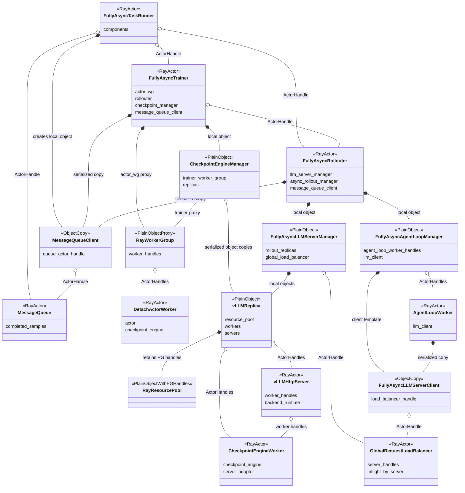

图 1A 的引用关系逐边对应如下：

1. `[V]` TaskRunner 创建并持有 Trainer、Rollouter、MessageQueue ActorHandle，同时创建普通 `MessageQueueClient` 后分别序列化给
   Trainer/Rollouter：`verl/experimental/fully_async_policy/fully_async_main.py:77-103,117-157`。
2. `[V]` Trainer 保存 Rollouter ActorHandle，从 Rollouter 取得 replica objects/copies，并在本 Actor 进程创建
   `CheckpointEngineManager(trainer=self.actor_wg, replicas=replicas)`：
   `verl/experimental/fully_async_policy/fully_async_trainer.py:158-174,249-254`、
   `verl/checkpoint_engine/base.py:374-385`。
3. `[V]` Rollouter 在自身 Actor 进程创建 `FullyAsyncLLMServerManager` 和 `FullyAsyncAgentLoopManager`，后者继承原生
   `AgentLoopManager`：`verl/experimental/fully_async_policy/fully_async_rollouter.py:369-389,797-812`。
4. `[V]` LLM manager 通过 registry 选择并创建本任务的具体 `vLLMReplica` objects、原生 Global LB Actor，并把 LB handle 注入 client：
   `verl/workers/rollout/llm_server.py:252-255,300-355`、`verl/workers/rollout/replica.py:322-325,383-396`。
5. `[V]` `vLLMReplica` 创建并保留 private ResourcePool/PG，取得 `CheckpointEngineWorker` ActorHandles，再按这些 worker 的
   node/GPU placement 创建 `vLLMHttpServer` Actors：`verl/workers/rollout/replica.py:189-239`、
   `verl/workers/rollout/vllm_rollout/vllm_async_server.py:952-1054`。
6. `[V]` `FullyAsyncAgentLoopManager` 在 Rollouter 进程持有 client template，并创建 `AgentLoopWorker` Actors；worker 得到序列化后的 client，
   client 通过 LB ActorHandle acquire/release server：`verl/experimental/agent_loop/agent_loop.py:393-413,1044-1099`、
   `verl/workers/rollout/llm_server.py:146-220`、
   `verl/experimental/fully_async_policy/fully_async_rollouter.py:369-389,797-812`。
7. `[V]` FullyAsync 的 actor role 被明确映射为 `ray.remote(DetachActorWorker)`；Trainer 的 `RayWorkerGroup` 持有这些
   `DetachActorWorker` ActorHandles，CE manager 则持有该 worker-group proxy。trainer-side CE 是
   `DetachActorWorker` 从 `ActorRolloutRefWorker` 继承的成员：`verl/experimental/separation/utils.py:62-90`、
   `verl/experimental/separation/engine_workers.py:36-57`、`verl/workers/engine_workers.py:618-629,666-700`、
   `verl/checkpoint_engine/base.py:345-411`。

> 图 1A 只表达引用/所有权，不把 Ray ActorHandle 画成独立对象。本文 vLLM 场景中的具体 `vLLMReplica` 在 Rollouter 和 Trainer Actor 间按 Ray
> 序列化复制，复制的是普通 Python descriptor，其中的 worker/server ActorHandles 仍指向相同远端 Actors；原生没有跨任务资源或
> 路由关系。

#### 1.2 `[V/M/D]` 多任务共享目标组件关系

下图所有实体都直接使用类名，不把 `[V]/[M]/[D]` 或 `V_/M_/D_` 拼进实体名。verl 已有类与本方案待新增类的
实现状态由图后的校对说明区分。

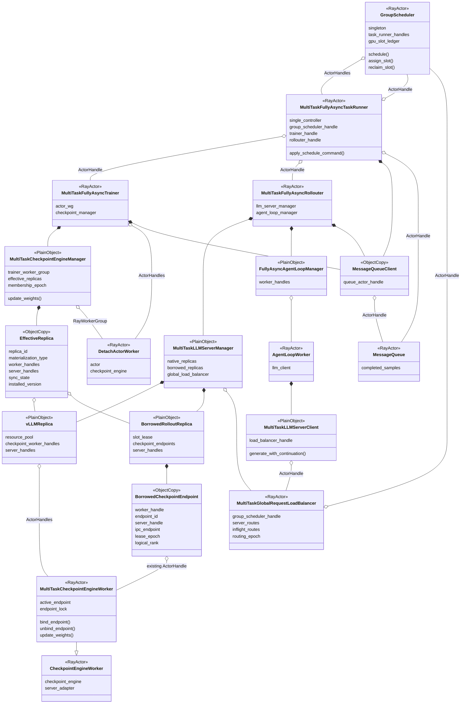

> 图 1B 校对：这是“verl 原生骨架 + 目标扩展”的逻辑图，不是当前类图。原生引用链见
> `fully_async_main.py:77-103,117-157`、`fully_async_trainer.py:158-174,249-254`、
> `fully_async_rollouter.py:797-812`、`llm_server.py:304-355`、`agent_loop.py:1044-1099` 和
> `fully_async_policy/message_queue.py:26-134,180-234`。完整路径及每个节点/边的校对见校对文档 §3。`GroupScheduler`、
> `MultiTask*`、`EffectiveReplica` 和 `Borrowed*` 是待新增类；其余节点是 verl 已有类。

### 2. One-Step 与 FullyAsync 的对象归属差异

上图以 FullyAsync 为主。One-Step 和 FullyAsync 复用相同的 GS、LB、replica lifecycle 和 CE effective-replica 语义，但
single-controller 内部拓扑不同：

| 维度 | One-Step Off-Policy | FullyAsync | 校对与代码依据 |
|---|---|---|---|
| TaskRunner | `[M]` `MultiTaskOneStepTaskRunner` Ray Actor | `[M]` `MultiTaskFullyAsyncTaskRunner` Ray Actor | 原类是 `[V]`：`one_step_off_policy/main_ppo.py:34-35`、`fully_async_policy/fully_async_main.py:35-36`；MultiTask 子类均 `[D]` |
| Trainer/controller | `[V]` TaskRunner 进程内普通 `OneStepOffRayTrainer` | `[V]` 独立 `FullyAsyncTrainer` Ray Actor | `one_step_off_policy/main_ppo.py:90-107`；`fully_async_policy/fully_async_main.py:138-156` |
| Rollouter | `[V]` 没有独立 Rollouter Actor，manager/AgentLoop 在 Trainer 内 | `[V]` 独立 `FullyAsyncRollouter` Ray Actor | `one_step_off_policy/ray_trainer.py:170-196`；`fully_async_policy/fully_async_rollouter.py:392-393` |
| LLMServerManager | `[V]` Trainer 进程内普通对象 | `[V]` Rollouter Actor 内普通对象 | `one_step_off_policy/ray_trainer.py:190-196`；`fully_async_policy/fully_async_rollouter.py:797-812` |
| CE manager | `[V]` Trainer 进程内普通对象 | `[V]` Trainer Actor 内普通对象 | `separation/ray_trainer.py:120-131`；`fully_async_policy/fully_async_trainer.py:167-174` |
| membership 调整 | `[D]` TaskRunner 本地编排扩展 CE | `[D]` TaskRunner 分别 RPC Rollouter 创建、Trainer 注册 | 原 CE 只有 list add/remove：`checkpoint_engine/base.py:414-429` |
| 参数同步入口 | `[V]` `SeparateRayPPOTrainer._fit_update_weights()` | `[V]` `FullyAsyncTrainer._fit_update_weights()` | `separation/ray_trainer.py:645-650`；`fully_async_policy/fully_async_trainer.py:501-524` |

因此 FullyAsync 不能只修改 Rollouter 中的 `rollout_replicas`；创建得到的 `EffectiveReplica` descriptor 必须由 TaskRunner 显式传给
Trainer Actor 内的 CE。One-Step 虽然可以本地完成，但仍应使用相同接口和 epoch，避免形成两套协议。

> 表 1 路径前缀均为 `verl/experimental/`，CE 文件前缀为 `verl/`。`EffectiveReplica` 和 epoch 是 `[D]`，原生 Trainer 当前
> 直接从 Rollouter `get_replicas()` 并构造 CE：`verl/experimental/fully_async_policy/fully_async_trainer.py:167-174`。

#### Ray ActorClass 的继承边界

图中的 `MultiTaskFullyAsyncTaskRunner/Trainer/Rollouter` 是目标逻辑角色，不代表可以直接写普通 Python 继承。三个原类分别在
`verl/experimental/fully_async_policy/fully_async_main.py:35-36`、`fully_async_trainer.py:52-53` 和
`fully_async_rollouter.py:392-393` 被 `@ray.remote` 装饰；导入符号是 Ray ActorClass，不是稳定的用户继承基类。

代码上只有两种清晰方案：

1. 上游把实现体抽成未装饰 base class，原生类和子仓 MultiTask 类分别在继承后调用 `ray.remote(...)`；
2. 保留原生 Actor，不新增 Trainer/Rollouter 子类，只在 verl 增加通用 manager-class 注入点和 CE/replica membership RPC，子仓提供
   manager 实现与自定义 TaskRunner 编排。

第一阶段更倾向方案 2，因为 FullyAsync 当前 CE 在 `fully_async_trainer.py:27,167-174` 直接引用/构造原生
`CheckpointEngineManager`，LLM manager 在 `fully_async_rollouter.py:803-812` 直接构造 `FullyAsyncLLMServerManager`；这两个位置正是
最小且明确的注入缺口。One-Step CE 已有 `checkpoint_manager_class` 配置钩子（
`verl/experimental/separation/ray_trainer.py:120-131`），但 LLM manager 仍在
`verl/experimental/one_step_off_policy/ray_trainer.py:170-196` 硬编码，需要相同注入点。

### 3. 新增和扩展组件

#### 3.1 `[D]` GroupScheduler

单例 Ray Actor，作为跨任务全局调度大脑：

- 保存 TaskRunner ActorHandles；
- 通过心跳维护任务、节点、GPU 和 lease 状态；
- 接收 LB 上报的 per-replica inflight/idle/routing 状态；
- 结合任务需求、空泡预测、优先级和成本生成 DONATE/ASSIGN/PREEMPT/RECLAIM 决策；
- 将决策发送给 donor/borrower TaskRunner；
- 使用 slot CAS 和 lease epoch 保证同一 HBM slot 不会被重复分配；
- 不直接调用普通对象 manager；
- 不触发参数同步；
- 不持有请求 payload、AgentLoop future 或权重数据。

模拟器参考仅是 `[S]`：普通 `GroupScheduler` 的注册、状态版本和 assign/reclaim 见
`/Users/nyp/Documents/multi-rl-task-scheduler/src/multi_rl_task_scheduler/group_scheduler.py:18-45,55-157`；它不是 Ray Actor，注册的也是
普通 `InferScheduler`（`interfaces.py:9-30`）。生产 Ray Actor 单例、TaskRunner handles、slot CAS 和 lease epoch 都需新增。

#### 3.2 `[M]` MultiTaskFullyAsyncTaskRunner

任务的 single controller Ray Actor：

- 创建或获取 GroupScheduler 单例 handle；
- 启动时向 GS 注册任务 session、基础资源和自身 ActorHandle；
- 持有 Trainer、Rollouter 和 GS handles；
- 响应 GS 主动 heartbeat probe，并通过 GS handle 上报注册/状态变化/注销、资源需求和同步/membership 摘要；
- 接收 GS 命令并编排 Trainer 与 Rollouter；
- donor 侧执行摘流、CE 排除、sleep 和 slot 发布；
- borrower 侧执行 Server 创建、donor CE Worker endpoint 重绑定、CE 注册和 LB 激活；
- 任务结束时注销资源和 session。

TaskRunner 是 GS 进入任务内部的唯一控制入口。

可复用原类的 `components`、Trainer/Rollouter 创建和双 fit 监督：
`verl/experimental/fully_async_policy/fully_async_main.py:35-50,72-115,117-209`。GS handle、注册、心跳和命令 API 均为 `[D]`。

还必须修正 Actor 并发入口：原 FullyAsync TaskRunner 只有 `@ray.remote(num_cpus=1)`，同步 `run()` 会一直阻塞到 Trainer/Rollouter
结束（`fully_async_main.py:35-50,176-209`）。默认单并发下，GS 的 heartbeat/command RPC 会排队到任务结束，设计不可用。目标
TaskRunner 必须配置受控 `max_concurrency`/concurrency groups，或让 `run()` 只启动后台监督而不长期占用唯一方法槽，并用 task-level lock
串行化调度事务。One-Step 原 Actor 已配置 `max_concurrency=100`（`one_step_off_policy/main_ppo.py:34-35`），但 Trainer 只是 `run()` 的
局部变量（`:90-107`）；MultiTask 版本必须保存为 `self.trainer` 才能由命令方法访问。

#### 3.3 `[M]` MultiTaskLLMServerManager

位于 Rollouter Actor 内的普通对象，继承或组合 `FullyAsyncLLMServerManager`：

- 管理初始化时创建的 native replicas；
- 管理运行期创建的 borrowed replicas；
- 创建、销毁、sleep、wake、abort 和 warmup Server；
- 基于 donor placement anchors 查询有序 node/GPU IDs；
- 不创建新的 CE Worker；通过 lease 将 donor 已存在的 `MultiTaskCheckpointEngineWorker` 临时绑定到 borrower Server endpoint；
- 返回可序列化的 `EffectiveReplica` descriptor 给 TaskRunner；
- 操作扩展 LB 的路由状态；
- 不制定跨任务调度策略；
- 不直接调用位于 Trainer Actor 内的 CE manager。

扩展锚点是 `verl/experimental/fully_async_policy/fully_async_rollouter.py:153-343,1134-1138` 和
`verl/workers/rollout/llm_server.py:223-364`。现有 `add_replicas()` 只激活初始化时预注册的 hybrid replica，不会运行期物化新的
STANDALONE/borrowed replica。

#### 3.4 `[M]` MultiTaskCheckpointEngineManager

位于 Trainer/controller 内的普通对象，扩展原生 `CheckpointEngineManager`：

```text
effective_replicas
= native replicas not donated
+ materialized borrowed replicas
```

职责：

- 使用 stable replica ID 保存有效集合；
- 使用 membership lock 串行化 add/remove 与 `update_weights()`；
- 为每次同步生成不可变 membership snapshot 和 epoch；
- 在 verl 原生同步点统一同步 native 和 borrowed CE endpoints；
- 保存每个 replica 的 sync state、installed version 和 ACK；
- 同步失败时阻止混合版本 replicas 接流；
- 不由 GS 直接调用，命令由 TaskRunner/Trainer Actor 转发。

`[V]` 原生 `CheckpointEngineManager` 的显式 `replicas` list、add/remove 和同步遍历见
`verl/checkpoint_engine/base.py:374-429,470-515`。stable ID、membership lock/snapshot、installed-version ACK、LB fence 和失败事务均为
`[D]`。

#### 3.5 `[M]` MultiTaskGlobalRequestLoadBalancer

扩展原生 `GlobalRequestLoadBalancer`：

- 维护 `server_id → ActorHandle`；
- 维护 per-server in-flight route 数；
- 维护 sticky logical request routing；
- 维护 `READY/DRAINING/SYNCING/SLEEPING` 状态和 routing epoch；
- 只向 `READY(committed_rollout_version)` Server 路由；
- 在 zero-inflight 等状态变化时向 GS 上报事实；
- 支持两阶段摘流，DRAINING 时拒绝新 acquire 但保留旧 route/inflight；
- 不根据单一 `inflight==0` 自行决定捐赠；
- 不执行跨任务 Server 创建。

`[V]` 原 LB 只有 server handle、sticky map、inflight counter 和即时 add/remove：
`verl/workers/rollout/llm_server.py:43-143`。READY/DRAINING/SYNCING/SLEEPING、routing epoch、policy version、两阶段摘流和 GS
上报全部为 `[D]`。

#### 3.6 `[D]` BorrowedRolloutReplica、MultiTaskCheckpointEngineWorker 和 BorrowedCheckpointEndpoint

受赠 replica 不调用原生 `init_standalone()`，否则会再次申请 ResourcePool/PG/GPU。它使用 donor slot 中的 placement 信息：

```text
donor worker handles/PG provenance
→ ordered node IDs and GPU IDs
→ hard node affinity
→ explicit CUDA_VISIBLE_DEVICES/local rank
→ borrower Server/backend
→ donor existing CE Worker binds borrower endpoint
```

这里不创建新的受赠 CE Worker。初始化阶段所有可捐赠 replica 都创建
`MultiTaskCheckpointEngineWorker`；它继承原生 `CheckpointEngineWorker`，仍是 donor private PG bundle 中已经存在的 Ray Actor。借出时，
borrower 只得到这些 ActorHandles 的临时使用权，并为每个 rank 建立 `BorrowedCheckpointEndpoint`：

- donor `MultiTaskCheckpointEngineWorker` ActorHandle；
- borrower Server ActorHandle 和显式 IPC endpoint；
- borrower rollout/model config 与逻辑 replica/rank；
- borrower task/session/replica/lease identity；
- endpoint state、lease epoch 和 installed version。

`BorrowedCheckpointEndpoint` 是可序列化普通描述对象，不是进程、Ray Actor 或新的 GPU resource owner。Worker 在任一时刻只能有一个
`active_endpoint`：native endpoint 或某个 borrower endpoint。donor replica 借出后必须先从 donor CE effective membership 排除，再切换
endpoint；borrower CE 使用的仍是同一组已经存在的 Worker ActorHandles。

为了让 native replica 从初始化开始就具备 endpoint 重绑定能力，需要给 `RolloutReplica.get_ray_class_with_init_args()` 增加通用 Worker
class/factory 注入点，由 `MultiTaskLLMServerManager` 注入 `MultiTaskCheckpointEngineWorker`。当前实现硬编码
`ray.remote(CheckpointEngineWorker)`（`verl/workers/rollout/replica.py:228-239`），这是必须补到 verl 的最小扩展点；不改变
`init_standalone()` 的 ResourcePool/PG/bundle 申请流程。

这要求扩展原生单 endpoint 实现：当前 `CheckpointEngineWorker` 只有一个 `server_adapter`，其 `update_weights()` 固定调用该 adapter（
`verl/checkpoint_engine/base.py:299-325`）；vLLM `ServerAdapter` 又从当前 Worker 的 rank、Ray job ID 和 actor name 推导 Server/ZMQ endpoint（
`verl/workers/rollout/vllm_rollout/vllm_rollout.py:77-108,119-153`）。因此 `MultiTaskCheckpointEngineWorker` 必须支持显式
`server_handle/ipc_endpoint`、bind/unbind、lease epoch 校验和 actor 内串行锁，不能只替换 `replica_rank`。

`[V]` 可复用的 placement discovery/Server launch 在
`verl/workers/rollout/vllm_rollout/vllm_async_server.py:976-1054`，CE receive/apply 在
`verl/checkpoint_engine/base.py:278-325`。原 `init_standalone()` 必然新建 ResourcePool/PG/worker，见
`verl/workers/rollout/replica.py:189-239`，因此不能用于受赠实例。原生 CE manager 已经会从现有 ActorHandles 构造临时
`RayWorkerGroup`，不会再次创建 Worker（`verl/checkpoint_engine/base.py:485-489`），这正是复用 donor Worker 的基础。

verl 也有接收已有 PG handles 的 `SubRayResourcePool`（`verl/single_controller/ray/base.py:163-178,474-480`），但它不等于现成的跨任务
lease 协议；本方案明确不把 donor ResourcePool/PG/bundle 暴露为 borrower 的 Worker 创建能力，避免 PG 生命周期、跨 job ownership 和
同卡额外 CE Actor。borrower 只复用已创建的 Worker ActorHandles。

### 4. `[D]` 三种视图的目标映射

| 实例状态 | Ray/PG 视图 | GS node/GPU 视图 | LB 视图 | CE effective replicas | 性质 |
|---|---|---|---|---|---|
| native ACTIVE | owner task 预留 | owner task 使用 | owner LB READY | owner CE 包含 | `[M]` 原生只有 PG、LB active 集合和 CE list，无统一状态 |
| native natural bubble | owner task 预留 | owner task 使用 | 仍可能 READY | owner CE 包含 | `[D]` natural-bubble 联合判定 |
| native DRAINING | owner task 预留 | 回收事务中 | 禁止新 acquire | 回收 fence 中 | `[D]` |
| native SLEEPING/已捐赠 | donor task 预留 | lease 给 borrower | donor LB 排除 | donor CE 排除 | `[D]` |
| borrowed CREATING | donor task 预留 | borrower 持有 lease | hidden | 尚未注册 | `[D]` |
| borrowed PENDING_SYNC | donor task 预留 | borrower 持有 lease | hidden | borrower CE 包含 | `[D]` |
| borrowed READY | donor task 预留 | borrower 持有 lease | borrower LB READY | borrower CE 包含 | `[D]` |
| borrowed RECLAIMING | donor task 预留 | lease 回收中 | DRAINING | borrower CE 排除中 | `[D]` |

跨视图关联键至少包括：

```text
task_id
task_session_id
replica_id
slot_id
lease_epoch
membership_epoch
routing_epoch
policy_version
```

`[V]` 三个局部锚点分别是 PG：`verl/workers/rollout/replica.py:189-226`，LB：
`verl/workers/rollout/llm_server.py:60-143`，CE list：`verl/checkpoint_engine/base.py:374-429`。上述统一状态名和全部关联键当前均为
`[D]`。

### 5. `[D]` 核心不变量

```text
同一个 slot_id + lease_epoch 最多有一个 HBM 使用者

LB_READY(task)
⊆ CE_SYNC_READY(task, committed_rollout_version)

donated_native_replica
∉ donor LB
∉ donor CE effective replicas

physical MultiTaskCheckpointEngineWorker
∈ at most one task's effective CE topology
&& active_endpoint.lease_epoch = GS slot lease_epoch

ASSIGN/RECLAIM
does not create or destroy MultiTaskCheckpointEngineWorker

borrowed_replica before sync ACK
∉ borrower LB READY

GroupScheduler command
≠ parameter sync trigger
```

这些是实现必须满足的目标断言，不是 verl 已有保证。可复用的 remove 接口见
`verl/workers/rollout/llm_server.py:115-126` 和 `verl/checkpoint_engine/base.py:422-429`；二者目前没有跨对象原子性。模拟器
`SleepRegistry` 的 per-worker 单 active instance 校验可作为 slot CAS 参考：
`/Users/nyp/Documents/multi-rl-task-scheduler/group_scheduler/sleep_registry.py:118-194,267-291`。

## 部署视图

### 1. `[V]` 原生 STANDALONE 部署

下面明确取单节点例子：`world_size=4`、`nnodes=1`、`gpus_per_replica_node=4`。此时一个 native rollout replica 在原生视图中拥有：

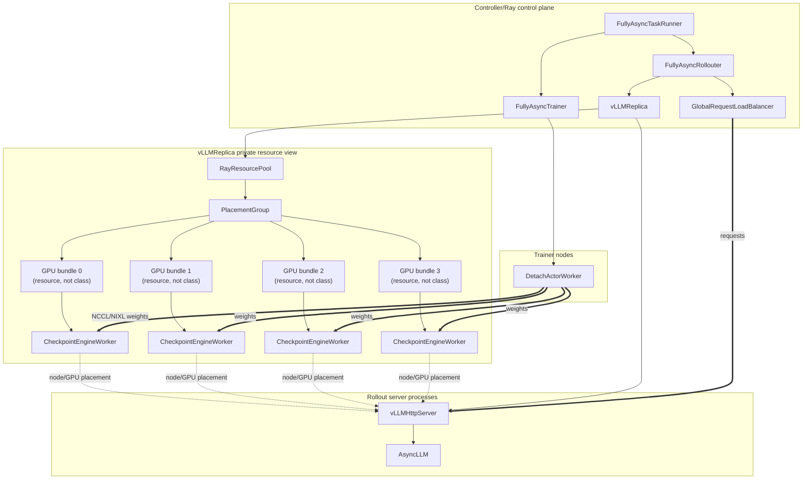

原生 `RolloutReplica.init_standalone()` 创建 private ResourcePool、PG 和 `CheckpointEngineWorker` actors；Server launch
路径再通过 worker handles 获取 node/GPU placement。代码边界见：

- `verl/workers/rollout/replica.py:189-239`；
- `verl/workers/rollout/vllm_rollout/vllm_async_server.py:968-1054`；
- `verl/checkpoint_engine/base.py:278-340`。

图中 `PlacementGroup` 是 Ray 的资源对象类型，`AsyncLLM` 是 `vLLMHttpServer` 实际持有的 vLLM engine 类；二者分别由
`verl/single_controller/ray/base.py:25,130-159` 和
`verl/workers/rollout/vllm_rollout/vllm_async_server.py:35,391-430` 引入/创建。GPU bundle 是资源描述，不是类。

图 2 的两个精确资源语义：PG bundle 预留 1 GPU（`verl/single_controller/ray/base.py:143-155`），但 STANDALONE 使用
`max_colocate_count=2`，所以每个 `CheckpointEngineWorker` Actor 申请 0.5 GPU（
`verl/workers/rollout/replica.py:202-206`、`verl/single_controller/ray/base.py:621-678`）。Server Actor 的 `.options()` 没有
`num_gpus`，设备来自 worker accelerator ID 和 `cuda_visible_devices`（`vllm_async_server.py:976-1033`）。Trainer-side CE 是
`DetachActorWorker` 从 `ActorRolloutRefWorker` 继承的进程内成员（`verl/experimental/separation/engine_workers.py:36-57`、
`verl/workers/engine_workers.py:618-629`），不是独立 Actor。

若 `nnodes>1`，`vLLMReplica.launch_servers()` 会按 node slice worker handles，并在每个 node 创建一个 Server Actor；LB 暴露/保存的是
第 0 个 Server 的 address/handle：`verl/workers/rollout/vllm_rollout/vllm_async_server.py:991-1054`。因此图 2 不能直接外推成“多节点也只有
一个 Server Actor”。

### 2. `[D]` 捐赠后的 donor/borrower 共卡目标部署

假设任务 A 的 native replica `A-r3` 使用 4 张 GPU，sleep 后临时借给任务 B 创建 `B-r7`：

```mermaid
flowchart TB
    GS["GroupScheduler"]

    subgraph DONOR[A-r3 Ray resource view remains]
        DTR["MultiTaskFullyAsyncTaskRunner"]
        PG["PlacementGroup"]
        DCW0["MultiTaskCheckpointEngineWorker"]
        DCW1["MultiTaskCheckpointEngineWorker"]
        DCW2["MultiTaskCheckpointEngineWorker"]
        DCW3["MultiTaskCheckpointEngineWorker"]
        DS["vLLMHttpServer"]
        DE["AsyncLLM"]
        DLB["MultiTaskGlobalRequestLoadBalancer"]
        PG --> DCW0
        PG --> DCW1
        PG --> DCW2
        PG --> DCW3
        DCW0 -. placement anchor .-> DS
        DCW1 -. placement anchor .-> DS
        DCW2 -. placement anchor .-> DS
        DCW3 -. placement anchor .-> DS
        DS --> DE
        DLB -. no route .-> DS
    end

    subgraph GPU[Same physical node/GPU IDs]
        G0["GPU 0 HBM<br/>(resource, not class)"]
        G1["GPU 1 HBM<br/>(resource, not class)"]
        G2["GPU 2 HBM<br/>(resource, not class)"]
        G3["GPU 3 HBM<br/>(resource, not class)"]
    end

    subgraph BORROWER[B task runtime]
        BTR["MultiTaskFullyAsyncTaskRunner"]
        BEP0["BorrowedCheckpointEndpoint"]
        BEP1["BorrowedCheckpointEndpoint"]
        BEP2["BorrowedCheckpointEndpoint"]
        BEP3["BorrowedCheckpointEndpoint"]
        BS["vLLMHttpServer"]
        BE["AsyncLLM"]
        BLB["MultiTaskGlobalRequestLoadBalancer"]
        BCE["MultiTaskCheckpointEngineManager"]
        BCE ==>|B weights| DCW0
        BCE ==>|B weights| DCW1
        BCE ==>|B weights| DCW2
        BCE ==>|B weights| DCW3
        BEP0 -. worker handle .-> DCW0
        BEP1 -. worker handle .-> DCW1
        BEP2 -. worker handle .-> DCW2
        BEP3 -. worker handle .-> DCW3
        BEP0 -. server and IPC endpoint .-> BS
        BEP1 -. server and IPC endpoint .-> BS
        BEP2 -. server and IPC endpoint .-> BS
        BEP3 -. server and IPC endpoint .-> BS
        DCW0 ==>|receive/apply| BS
        DCW1 ==>|receive/apply| BS
        DCW2 ==>|receive/apply| BS
        DCW3 ==>|receive/apply| BS
        BS --> BE
        BLB ==>|B requests| BS
    end

    DCW0 -. ordered node/GPU ID .-> BS
    DCW0 -. existing PG binding .-> G0
    DCW1 -. existing PG binding .-> G1
    DCW2 -. existing PG binding .-> G2
    DCW3 -. existing PG binding .-> G3
    BE ==> G0
    BE ==> G1
    BE ==> G2
    BE ==> G3
    DE -. sleeping .-> G0
    DE -. sleeping .-> G1
    DE -. sleeping .-> G2
    DE -. sleeping .-> G3
    DLB -. idle-state report .-> GS
    GS -. donation/reclaim command .-> DTR
    GS -. assignment/reclaim command .-> BTR
```

Ray 仍认为 4 张 GPU 属于 A-r3 的 PG。B-r7 只新建不声明 Ray GPU resource 的 Server/backend；权重接收复用 A-r3 初始化时已经存在的
`MultiTaskCheckpointEngineWorker` ActorHandles，通过 `BorrowedCheckpointEndpoint` 将其临时指向 B-r7。这里既不新建 borrower CE
Worker，也不把 donor PG/bundle 作为 borrower 的资源申请入口。在该 `[D]` 目标架构中，防止 HBM 重叠使用的唯一全局权威必须是
GroupScheduler slot ledger。

> 图 3 校对：整张图是 `[D]` 目标部署。`[V]` 可复用的只有 worker node/GPU discovery 和无 `num_gpus` 的 Server Actor 创建
>（`verl/workers/rollout/vllm_rollout/vllm_async_server.py:976-1033`）、LB add/remove（
> `verl/workers/rollout/llm_server.py:100-126`）以及 CE 显式 replica list（`verl/checkpoint_engine/base.py:374-429`）。尤其要注意，
> 当前 STANDALONE `sleep()/wake_up()` 明确 skip：`vllm_async_server.py:604-635`。所以在 level-2 sleep、同 GPU 双 vLLM backend 隔离、
> CE endpoint 安全重绑定和 backend topology 清理完成 PoC 前，不能宣称该部署可运行。

### 3. 运行实体和部署位置

| 实体 | 类型 | 所在位置 | GPU 资源语义 | 性质和代码依据 |
|---|---|---|---|---|
| GroupScheduler | Ray Actor 单例 | Ray 控制节点/任意 CPU node | 不占 GPU | `[D]`；模拟器只是普通类：`src/multi_rl_task_scheduler/group_scheduler.py:18-45` |
| MultiTaskFullyAsyncTaskRunner | Ray Actor | 每任务 single-controller 进程 | 不占 GPU | `[M]`；原类：`fully_async_main.py:35-50` |
| MultiTaskFullyAsyncTrainer | Ray Actor | 任务控制 Actor | 持有 training worker handles | `[M]`；原类：`fully_async_trainer.py:52-53,135-174` |
| MultiTaskFullyAsyncRollouter | Ray Actor | 任务 Rollouter 控制 Actor | 持有 manager/AgentLoop handles | `[M]`；原类：`fully_async_rollouter.py:392-515,797-812` |
| MultiTaskCheckpointEngineManager | 普通对象 | Trainer Actor 进程 | 不直接占 GPU | `[M]`；原类：`checkpoint_engine/base.py:345-385` |
| MultiTaskLLMServerManager | 普通对象 | Rollouter Actor 进程 | 不直接占 GPU | `[M]`；原类：`fully_async_rollouter.py:153-343` |
| MultiTaskGlobalRequestLoadBalancer | Ray Actor | CPU node | 不占 GPU | `[M]`；原 Actor：`llm_server.py:43-143` |
| MessageQueue | Ray Actor | CPU node | 不占 GPU | `[V]`：`message_queue.py:26-134` |
| MessageQueueClient | 普通对象副本 | TaskRunner、Trainer、Rollouter 所在进程 | 持有 MQ ActorHandle | `[V]`：`message_queue.py:180-234`、`fully_async_main.py:94-103` |
| FullyAsyncAgentLoopManager | 普通对象 | Rollouter Actor 进程 | 不占 GPU | `[V]`：`fully_async_rollouter.py:369-389,797-812`；基类：`agent_loop.py:1044-1077` |
| AgentLoopWorker | Ray Actor | CPU node soft affinity | 不占 rollout GPU | `[V]`：`agent_loop.py:1068-1099` |
| MultiTaskLLMServerClient | 普通对象 | AgentLoopWorker 进程 | 持有 LB handle | `[M]`；原 client：`llm_server.py:146-220` |
| CheckpointEngineWorker | Ray Actor | native private PG bundle（native instance） | Actor 申请 0.5 GPU，PG 预留 1 GPU | `[V]`：`replica.py:202-239`、`ray/base.py:621-680` |
| MultiTaskCheckpointEngineWorker | Ray Actor | 初始化时创建在 native private PG bundle | 借用期间不创建新 Actor、不申请新 GPU；切换 active endpoint | `[M]`；扩展原 `CheckpointEngineWorker` 的单 `server_adapter`：`checkpoint_engine/base.py:278-325` |
| vLLMHttpServer / AsyncLLM | Ray Actor + engine/backend processes | native worker 所在 node/GPU（native instance） | Server Actor 不申请 GPU，显式 visible devices | `[V]`：`vllm_async_server.py:35,84-135,391-430,976-1054` |
| BorrowedCheckpointEndpoint | 可序列化普通对象副本 | borrower Rollouter/Trainer 的 descriptor 中，引用 donor Worker handle | 不占 GPU，不是 Ray Actor | `[D]`；需新增 endpoint schema、lease/epoch 和显式 Server/IPC 绑定 |
| vLLMHttpServer / AsyncLLM | Ray Actor + engine/backend processes | donor slot node/GPU（borrowed instance） | 目标由 GS 记账 HBM lease | `[D]`；复用 Server placement 锚点 |

表内省略的代码路径前缀依次为 `verl/experimental/fully_async_policy/`、`verl/workers/rollout/`、
`verl/checkpoint_engine/`、`verl/single_controller/ray/` 和 `verl/experimental/agent_loop/`；模拟器完整路径见校对文档 §2.2。

### 4. `[D]` 生命周期约束

- borrower lease 生命周期不能超过 donor task session、private PG 或 placement-anchor workers；
- donor replica 借出时不销毁 ResourcePool、PG、workers 和 Server，只执行 sleep；
- borrower 退出时销毁 borrower Server/backend、删除 endpoint binding，不销毁 donor Worker 或 PG；
- donor TaskRunner 异常或 PG 即将销毁时，GS 必须优先回收所有 borrower leases；
- node/GPU ID 不能脱离 actor/PG provenance 单独长期使用，避免节点重启后旧 ID 被误用；
- 多节点 replica 必须保持 rank→node→GPU 的有序映射，不能由 GS 随意拼卡。

`[V]` 原生能提供的 provenance 是 `RolloutReplica.resource_pool/workers`（`verl/workers/rollout/replica.py:122-129`）以及按
worker 顺序切分的 node/GPU mapping（`vllm_async_server.py:976-998`）。session、lease、优先回收和 borrowed teardown 都需新增。

## 运行视图

### 1. `[M]` 初始化流程

初始化阶段不共享资源，任务仍按自身配置创建固定规模：

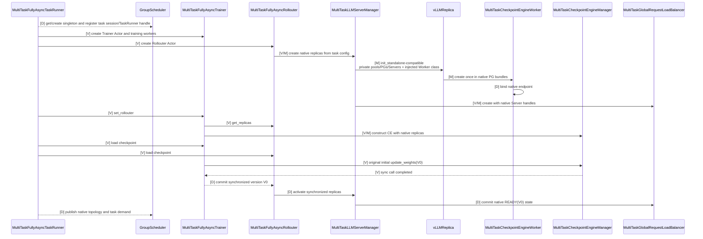

初始化时 GS 不决定 replica 数、不分配基础 GPU，只登记任务后续可共享的资源和 TaskRunner handle。

图 4 中 `[V]` 控制顺序严格来自 `verl/experimental/fully_async_policy/fully_async_main.py:72-115,117-157`：先建 Trainer，再建
Rollouter，随后 `trainer.set_rollouter()`；CE 在 set_rollouter 内从 Rollouter 取 replicas，见
`verl/experimental/fully_async_policy/fully_async_trainer.py:167-174,249-254`。原生没有“replica descriptor 返回 TaskRunner”或
“CE 通知 LB READY”调用；Worker class 注入、native endpoint 初始化、GS session/topology 注册和 READY commit 都是 `[D]` 扩展。

### 2. `[M]` 推理实例空闲状态判断

#### 1. `[V/M]` 不能只看 inflight=0

原生 LB 的 `inflight==0` 只表示瞬时没有正在执行的请求。只要 admission 仍然开放，下一条请求随时可能进入，因此不能直接
sleep 或捐赠。

需要先把三个容易混淆的状态分开：

```text
ZERO_INFLIGHT
= replica 当前 in-flight route 数为 0

TASK_CLOSED_DRAIN
= 当前 rollout 工作窗口已经封闭
  && 当前窗口不存在尚未送入 LB 的推理工作
  && 当前窗口仍有已发送、尚未完成的请求

TASK_LONG_TAIL
= TASK_CLOSED_DRAIN

NATURAL_BUBBLE
= TASK_LONG_TAIL
  && 不会再有同窗口 multi-turn/partial retry 路由到该 replica
  && replica inflight == 0

RECLAIMABLE
= LB 已将 replica 切换为 DRAINING
  && lifecycle/CE fence 已取得
  && server/backend drain 完成

SLEEP_COMMITTED
= replica level-2 sleep
  && 释放 HBM 已验证
```

只有 `SLEEP_COMMITTED` 才能向 GS 发布可借用 slot。

`ZERO_INFLIGHT` 的原始计数可由 `[V]` LB 的 acquire/release 得到：`verl/workers/rollout/llm_server.py:68-99,128-143`；其余
`NATURAL_BUBBLE/RECLAIMABLE/SLEEP_COMMITTED` 是 `[D]` 联合状态。原生 backend drain 入口存在（
`verl/workers/rollout/vllm_rollout/vllm_async_server.py:676-677,1056-1060`），但原生 LB 没有 DRAINING fence，而且 STANDALONE
sleep 是 no-op（`verl/workers/rollout/vllm_rollout/vllm_async_server.py:622-635`），所以 `drained != HBM_RELEASED`。

#### 2. `[D]` “没有待推理样本”的精确定义

判断必须限定在同一个 `rollout_epoch/work_window`。对窗口 `w` 和 replica `r` 定义：

```text
I_r(w, t) = sum(endpoint.inflight for endpoint in r)
I_all(w, t) = sum(I_r(w, t) for r in task.replicas)

C_w(t) = 已被 processor 取出、但尚未登记 trajectory 的首轮 generation unit 数
U_w(t) = 已接纳 trajectory 中，当前 generation 尚未发生首次 LB acquire 的数量
R_w(t) = abort 后允许 partial rollout、等待重新 acquire 的 generation 数
N_w(t) = multi-turn 中已经确定还要生成下一轮、但尚未 acquire 的 generation 数
F_w(t) = 尚未 terminal、当前或后续结果仍可能产生下一轮 acquire 的 multi-turn trajectory 数

PENDING_INFERENCE(w, t) = C_w(t) + U_w(t) + R_w(t) + N_w(t) + F_w(t)
```

于是任务级状态可以写成：

```text
WINDOW_CLOSED(w)
= 原生 Rollouter 仍处于 pause/停止 admission 状态
  && 当前 epoch 的 accepted trajectory 集合已经冻结

NO_WAITING_INFERENCE(w, t)
= WINDOW_CLOSED(w)
  && PENDING_INFERENCE(w, t) == 0

TASK_CLOSED_DRAIN(w, t)
= NO_WAITING_INFERENCE(w, t)
  && I_all(w, t) > 0

TASK_LONG_TAIL(w, t)
= TASK_CLOSED_DRAIN(w, t)

TASK_INFERENCE_IDLE(w, t)
= NO_WAITING_INFERENCE(w, t)
  && I_all(w, t) == 0
```

本文按调度语义把 `TASK_CLOSED_DRAIN` 直接定义为任务进入 `TASK_LONG_TAIL`：生产入口已经关上，窗口内工作已经全部发出，
剩余集合是有限且只减不增的。刚进入长尾时所有 replica 仍可能繁忙；随着完成时间分化，先归零的 replica 才出现可利用尾部空泡。
能够释放某个 replica 还要使用更强的 per-replica 条件：

```text
NO_FUTURE_ACQUIRE(r, w, t)
= 当前窗口没有尚未路由的 generation 可以选择 r
  && 没有 partial retry 可以选择 r
  && 没有 multi-turn 下一轮可以选择 r

NATURAL_BUBBLE(r, w, t)
= TASK_LONG_TAIL(w, t)
  && I_r(w, t) == 0
  && NO_FUTURE_ACQUIRE(r, w, t)
  && not maintenance_or_resume_pending(r, w)
```

对 single-turn、`partial_rollout=false` 的 trajectory，完成首次 acquire 后便不会产生下一轮，所以
`C_w=U_w=R_w=N_w=F_w=0` 足以证明当前窗口没有待推理工作。对 multi-turn，当前请求结束后可能经过工具调用再次 generate；仅有
“所有 trajectory 都完成首次 acquire”并不够，必须等 trajectory terminal，或先把候选 replica 从后续路由中 fence。Mode 4
还必须把 abort 后等待续推的请求计入 `R_w`。

#### 3. `[V/M]` 为什么不能用现有三个队列量直接代替公式

- `[V]` `pending_queue.qsize()` 表示 feed coroutine 已预取、processor 尚未取出的 `RolloutSample`；其中可以包含下一窗口数据，
  不能直接算作当前 `w` 的待推理量。feed 和 processor 代码见
  `verl/experimental/fully_async_policy/fully_async_rollouter.py:814-846,848-897`。
- `[V]` `active_tasks` 是 `_process_single_sample_streaming()` coroutine 集合，不是 replica 请求集合；一个 sample 可展开为多个
  trajectory，multi-turn trajectory 又可多次调用 generate。代码见
  `verl/experimental/fully_async_policy/fully_async_rollouter.py:913-950`、
  `verl/experimental/agent_loop/agent_loop.py:473-560`。FullyAsync 在准备 sample 时已经按 `rollout.n` repeat，因此首轮
  generation unit 数可由 `len(full_batch)` 登记，见
  `verl/experimental/fully_async_policy/detach_utils.py:42-71`。
- `[V]` processor 在 `pending_queue.get()` 并递增 `staleness_samples` 后，可能先等待 `max_concurrent_samples`，之后才创建
  `active_task`。因此只做 `pending_queue==0 && active_tasks` 快照会漏掉“已 claim、尚未 spawn”的 sample，即公式中的 `C_w`；
  代码见 `fully_async_rollouter.py:894-931`，路径前缀为 `verl/experimental/fully_async_policy/`。
- `[V]` LB `inflight` 只覆盖已经执行 `acquire_server()` 的 generation call，并在 client `finally` 中 release；它看不到尚未走到
  acquire 的 sample/trajectory。代码见 `verl/workers/rollout/llm_server.py:68-99,170-220`。

所以 `[D]` MultiTask 扩展必须增加按 epoch 记账的 `RolloutWorkTracker`，而不是用某个原生统计量近似：

```text
RolloutWorkTracker {
  rollout_epoch
  admission_state: OPEN | CLOSING | CLOSED
  accepted_samples
  claimed_not_spawned           # C_w
  accepted_trajectories
  first_acquire_pending          # U_w
  partial_retry_pending          # R_w
  next_turn_pending              # N_w
  future_turn_sources            # F_w
  completed_generations
}
```

该 tracker 是 `[D]` GS 内部的普通状态对象（或等价的物化状态），不是新的 Actor/通信组件：TaskRunner 心跳提供窗口和 accepted
状态，LB 直接向 GS 提供带 generation key 的 acquire/release 事件，GS 在 tracker 中汇合二者。

关闭窗口必须是一个 barrier：先阻止该 epoch 接纳新 sample，再等已经 claim 的 sample 完成 trajectory 登记，最后冻结
`accepted_trajectories`。这样 `PENDING_INFERENCE==0` 才不会与 processor 并发取样产生竞态。

#### 4. `[D]` 任务长尾和 replica 空泡判定伪码

```python
def close_work_window(tracker, epoch):
    # 1. 只响应原生 pause，不擅自改变 freshness/staleness 语义。
    if not tracker.native_admission_paused(epoch):
        return "NOT_CLOSED"
    tracker.cas_admission(epoch, expected="OPEN", new="CLOSING")

    # 2. 等待已 claim、尚未登记 trajectory 的临界区退出。
    tracker.wait_until(lambda s: s.claimed_not_spawned == 0)
    if not tracker.native_admission_paused(epoch):
        tracker.invalidate(epoch)         # MQ 被消费等原因使原生 Rollouter 提前恢复
        return "REOPENED"

    # 3. accepted trajectory 集合不再增长。
    tracker.freeze_accepted_set(epoch)
    tracker.cas_admission(epoch, expected="CLOSING", new="CLOSED")
    return "CLOSED"


def on_native_resume(tracker, old_epoch):
    tracker.invalidate(old_epoch)         # 撤销旧 epoch 的 long-tail/bubble 结论
    tracker.open_next_epoch()


def pending_inference(snapshot):
    return (
        snapshot.claimed_not_spawned
        + snapshot.first_acquire_pending
        + snapshot.partial_retry_pending
        + snapshot.next_turn_pending
        + snapshot.future_turn_sources
    )


def classify_task_rollout(snapshot):
    if snapshot.admission_state != "CLOSED":
        return "OPEN_OR_CLOSING"
    if pending_inference(snapshot) > 0:
        return "DISPATCHING"             # 仍有工作尚未送到推理实例
    if snapshot.total_inflight == 0:
        return "TASK_INFERENCE_IDLE"
    return "TASK_LONG_TAIL"              # 工作全部发出，只剩有限 in-flight


def classify_replica(replica, task_snapshot):
    if replica.inflight > 0:
        return "BUSY"
    if task_snapshot.admission_state != "CLOSED":
        return "ZERO_INFLIGHT_ONLY"
    if pending_inference(task_snapshot) > 0:
        return "UNISSUED_WORK_EXISTS"
    if task_snapshot.maintenance_or_resume_pending(replica.id):
        return "MAINTENANCE_QUIESCED"
    if task_snapshot.future_acquire_may_target(replica.id):
        return "FUTURE_ACQUIRE_PENDING"
    return "NATURAL_BUBBLE"
```

事件更新必须与请求状态对应：processor claim sample 时增加 `C_w`；trajectory task 登记时减少 `C_w` 并增加 `U_w`；LB 首次
acquire 时减少 `U_w` 并增加对应 `I_r`；release 时减少 `I_r`；abort 且允许续推时增加 `R_w`，重新 acquire 时再减少；multi-turn
trajectory 非 terminal 时登记 `F_w`，确定下一轮后转成 `N_w`，下一轮 acquire 时减少 `N_w`。事件需携带
`task_session_id + rollout_epoch + trajectory_id + turn_id + attempt_id` 并幂等去重，GS 必须丢弃旧 epoch 事件。跨 TaskRunner/LB
来源无法获得原子快照时，GS 只能保守等待 accepted generation key 集合与 acquire key 集合对齐，不能依据暂时的计数差判空。

上述事件不能由现有 `release_server(server_id)` 原样提供：原生 client 在 `finally` 中 fire-and-forget release，LB 只收到
`server_id`，不知道 `rollout_epoch/trajectory/turn`，也不知道请求是 terminal、等待 partial retry，还是可能进入下一轮；代码见
`verl/workers/rollout/llm_server.py:93-99,170-220`。最小扩展接口应为：

```text
acquire_server(work_key, routing_epoch)
release_server(work_key, server_id,
               disposition = TERMINAL
                           | PARTIAL_RETRY_PENDING
                           | TURN_RESULT_PENDING)
resolve_turn(work_key, disposition = TRAJECTORY_TERMINAL | NEXT_TURN_READY)
```

`acquire/release` 在 MultiTask LB Actor 内原子更新 generation 状态和 `I_r`，然后用同一个 `lb_event_seq` 上报 GS；
`resolve_turn` 只在 multi-turn 精确检测时需要。若不扩展 AgentLoop 生命周期，安全降级规则是：single-turn 可按上述公式逐 replica
发现长尾空泡；multi-turn 只有在相关 `active_tasks==0`（全部 trajectory terminal）或先对候选 replica 做 DRAINING fence 后，才能令
`F_w=0`。这会更保守，但不会把工具调用间隙误判为空泡。

#### 5. `[M]` 长尾形成的数值例子

假设当前窗口 `w=42` 接纳了 16 条 single-turn trajectory，使用 4 个 replica；`partial_rollout=false`。达到 freshness/staleness
预算后 admission 关闭，tracker 完成 barrier。这里 `pending_queue` 即使还预取了下一窗口的 sample，也不计入 `w=42`。

| 时刻 | `C_w/U_w/R_w/N_w/F_w` | `I_R0/I_R1/I_R2/I_R3` | 已完成 | 判断 |
|---|---:|---:|---:|---|
| `t0` 全部首次 acquire 后 | `0/0/0/0/0` | `4/4/4/4` | 0 | 任务进入 `TASK_LONG_TAIL`，但所有 replica 仍忙、尚无实例空泡 |
| `t1` 短请求完成后 | `0/0/0/0/0` | `0/1/2/3` | 10 | 任务保持 `TASK_LONG_TAIL`；R0 已是 `NATURAL_BUBBLE` |
| `t2` | `0/0/0/0/0` | `0/0/1/2` | 13 | R0、R1 先后形成尾部空泡，R2、R3 仍处理长请求 |
| `t3` | `0/0/0/0/0` | `0/0/0/0` | 16 | `TASK_INFERENCE_IDLE`，整个窗口结束 |

从 `t0` 起就可以说“任务已进入长尾排空阶段”，原因不是某个 replica 的 inflight 数，而是有一条可证明的因果链；到 `t1`
R0 才形成第一个可利用的尾部空泡：

```text
admission 已关闭
→ 当前窗口 accepted 集合已冻结
→ claimed_not_spawned == 0
→ first_acquire_pending == 0
→ partial/next-turn/future-turn pending == 0
→ 16 条工作均已进入过推理实例
→ t0 起剩余集合只会减少，不会再新增
→ t1 时已有 10 条完成，只剩 6 条
→ R0 已归零，而 R1/R2/R3 仍有长请求
```

因此 R0 的空闲不是两个请求之间的随机间隙，而是有限工作集合排空过程中的尾部空泡。下一次
`reset_staleness()` 或 MQ 水位下降触发原生 resume 前不会有 `w=42` 的新请求；一旦 admission 重新开放，旧的长尾结论立即失效，
必须以新 epoch 重新判断。原生 monitor 能在 pause 条件消失后调用 `_resume_event.set()`，见
`verl/experimental/fully_async_policy/fully_async_rollouter.py:1060-1099`。若例子改成 multi-turn，`N_w`、`F_w` 或
`future_acquire_may_target(R0)` 可能非零，此时 R0 仍只能标记
`ZERO_INFLIGHT_ONLY`，不能捐赠。

#### 6. `[V/M]` 模式差异

符号：

```text
R = ppo_mini_batch_size * require_batches
T = trigger_parameter_sync_step
S = staleness_threshold
P = partial_rollout
```

五种模式共享同一个任务级长尾公式，区别只在 `MODE_WINDOW_CLOSED_m` 如何成立：

```text
MODE_TASK_LONG_TAIL_m(w, t)
= MODE_WINDOW_CLOSED_m(w, t)
  && PENDING_INFERENCE(w, t) == 0
  && I_all(w, t) > 0
  && weight_sync_state == IDLE
```

`PENDING_INFERENCE==0` 沿用上一节的 `C_w+U_w+R_w+N_w+F_w==0`。它证明当前窗口没有留在 Rollouter、AgentLoop、partial
retry 或 multi-turn 状态机中的待推理工作；`I_all>0` 证明仍有已发送请求在执行。因此该任务已经从“持续生产”切换为“有限集合
排空”，即进入长尾。模式级条件汇总如下：

| 模式 | 当前窗口上限 | `MODE_WINDOW_CLOSED` | 进入长尾的额外排除条件 | 长尾结束/失效 |
|---|---:|---|---|---|
| One-Step | 当前 generation batch | batch expected 集合冻结，下一 batch future 尚未创建 | 当前 batch 无 multi-turn future acquire；CE 尚未开始同步 | 当前 batch 全部完成，或下一 batch 被打开 |
| Mode 1 `T=1,S=0` | `R` | 原生 pause 保持，原因是 `staleness>=R` 或 `MQ>=R`，accepted 集合冻结 | 无 partial/next-turn/future-turn；非同步维护 pause | `I_all=0`，或 monitor/reset 恢复 admission |
| Mode 2 `T>1,S=0` | `R*T` | 原生 pause 保持，原因是 `staleness>=R*T` 或 `MQ>=R*T` | 同 Mode 1 | 同左；通常还受下一次参数同步边界限制 |
| Mode 3 `S>0,P=false` | `floor(R*T*(1+S))` | 有限 staleness/MQ budget 触发原生 pause，accepted 集合冻结 | 必须自然完成；CE abort 产生的静默排除 | resume/reset、同步开始或 `I_all=0` |
| Mode 4 `S>0,P=true` | `floor(R*T*(1+S))` | 同 Mode 3 | `R_w=0`，且不在 abort→retry/WAIT_SYNC；partial 不制造长尾 | retry admission、resume/reset 或 `I_all=0` |

##### 6.1 `[V/M]` One-Step：固定 batch 的尾部

One-Step 不依赖 FullyAsync 的 staleness counter。`_async_gen_next_batch()` 先固定并 repeat 当前 generation batch，再 await
`AgentLoopManager.generate_sequences()`；`_fit_generate()` 等当前 future 完成和权重同步后，才创建下一 batch future：
`verl/experimental/one_step_off_policy/ray_trainer.py:207-258,390-413`。因此：

```text
ONE_STEP_WINDOW_CLOSED(Bk)
= expected_generation_keys(Bk) 已冻结
  && next_batch_future(Bk+1) 尚未创建

ONE_STEP_TASK_LONG_TAIL(Bk)
= ONE_STEP_WINDOW_CLOSED(Bk)
  && C_Bk + U_Bk + N_Bk + F_Bk == 0
  && I_all(Bk) > 0
  && weight_sync_state == IDLE
```

single-turn 时 `N_Bk=F_Bk=0`。若 B7 有 8 条 trajectory：

| 时刻 | `C/U/N/F` | `I_R0/I_R1/I_R2` | 判断 |
|---|---:|---:|---|
| 只发出 6 条 | `0/2/0/0` | `2/2/2` | 尚有 2 条待 acquire，不是长尾 |
| 8 条全部 acquire | `0/0/0/0` | `3/3/2` | B7 进入长尾，但还没有 replica 空泡 |
| 短请求完成 | `0/0/0/0` | `2/1/0` | 仍处长尾，R2 形成尾部空泡 |

multi-turn 下所有 trajectory “首次 acquire”后仍可能进入工具阶段再调用 generate，所以 `F_Bk>0`；没有逐 turn tracker 时只能等
batch terminal，或先把候选 replica DRAINING 后再判断。

##### 6.2 `[V/M]` Mode 1：`T=1,S=0` 的 on-policy 窗口

Mode 1 的窗口上限为：

```text
W1 = R

MODE1_WINDOW_CLOSED(w)
= rollouter.paused
  && (staleness_samples >= R || mq_queue_size >= R)
  && accepted_generation_set(w) 已冻结

MODE1_TASK_LONG_TAIL(w)
= MODE1_WINDOW_CLOSED(w)
  && PENDING_INFERENCE(w) == 0
  && I_all(w) > 0
  && weight_sync_state == IDLE
```

例如 `R=4`、2 个 replicas，都是 single-turn：

| 时刻 | `staleness/paused` | `PENDING_INFERENCE` | `I_R0/I_R1` | 判断 |
|---|---:|---:|---:|---|
| S1—S3 已接纳 | `3/false` | 0 | `1/2` | admission 仍开，不是结构性长尾 |
| S4 已接纳但尚未 acquire | `4/true` | 1 | `1/2` | 窗口已关但仍在分发，不是长尾 |
| S4 完成 acquire | `4/true` | 0 | `2/2` | 任务进入长尾 |
| R0 请求先结束 | `4/true` | 0 | `0/2` | 任务仍在长尾，R0 形成空泡 |

Mode 1 的 pause 可能很短，Trainer 取样或 reset 后会恢复 admission；所以“进入长尾”不等于“值得创建 borrower”。

##### 6.3 `[V/M]` Mode 2：`T>1,S=0` 的多本地更新窗口

Mode 2 把窗口扩大为：

```text
W2 = R * T

MODE2_TASK_LONG_TAIL(w)
= rollouter.paused
  && (staleness_samples >= W2 || mq_queue_size >= W2)
  && accepted_generation_set(w) 已冻结
  && PENDING_INFERENCE(w) == 0
  && I_all(w) > 0
  && weight_sync_state == IDLE
```

例如 `R=4,T=3`，窗口共 12 个 sample、3 个 replicas：

| 时刻 | `staleness/paused` | `PENDING_INFERENCE` | `I_R0/I_R1/I_R2` | 判断 |
|---|---:|---:|---:|---|
| 已接纳 8 个 | `8/false` | 0 | `2/3/3` | 窗口仍开放，R0 即使暂时归零也不是结构性长尾 |
| 第 12 个已 claim、未 acquire | `12/true` | 1 | `1/2/3` | 窗口关闭但仍在分发 |
| 全部工作发出 | `12/true` | 0 | `1/2/3` | 任务进入长尾 |
| R0 完成 | `12/true` | 0 | `0/2/3` | R0 形成尾部空泡 |

与 Mode 1 相比，Mode 2 的窗口更长，并可能覆盖 Trainer 剩余本地 updates；这是空闲时间可能更长的原因，不改变长尾成立公式。

##### 6.4 `[V/M]` Mode 3：有限 stale budget、`P=false`

Mode 3 的最大工作集合为：

```text
W3 = floor(R * T * (1 + S))

MODE3_TASK_LONG_TAIL(w)
= rollouter.paused
  && (staleness_samples >= W3 || mq_queue_size >= W3)
  && accepted_generation_set(w) 已冻结
  && PENDING_INFERENCE(w) == 0
  && I_all(w) > 0
  && weight_sync_state == IDLE
  && quiesce_reason != WEIGHT_SYNC_ABORT
```

例如 `R=4,T=2,S=0.5`，所以 `W3=12`，使用 3 个 replicas：

| 时刻 | `paused/PENDING` | `I_R0/I_R1/I_R2` | 同步状态 | 判断 |
|---|---:|---:|---|---|
| 12 个 sample 全部发出 | `true/0` | `1/2/3` | IDLE | 任务进入长尾 |
| R0 完成 | `true/0` | `0/2/3` | IDLE | R0 形成自然空泡 |
| CE 开始同步并 abort | `true/0` | `0/0/0` | SYNCING | 维护静默，不是自然长尾/空泡 |

`P=false` 时 client 收到 abort 后不会续推；因此不能为了资源共享主动复制 CE 的 abort 行为来“制造空闲”，否则会截断样本。

##### 6.5 `[V/M]` Mode 4：有限 stale budget、`P=true`

Mode 4 的窗口上限与 Mode 3 相同，但要额外跟踪 partial request：

```text
W4 = floor(R * T * (1 + S))

MODE4_TASK_LONG_TAIL(w)
= rollouter.paused
  && (staleness_samples >= W4 || mq_queue_size >= W4)
  && accepted_generation_set(w) 已冻结
  && C_w + U_w + R_w + N_w + F_w == 0
  && I_all(w) > 0
  && weight_sync_state == IDLE
```

仍取 `R=4,T=2,S=0.5`，`W4=12`：

| 时刻 | `C/U/R/N/F` | `I_R0/I_R1/I_R2` | 同步状态 | 判断 |
|---|---:|---:|---|---|
| 12 个 single-turn sample 全部发出 | `0/0/0/0/0` | `0/1/3` | IDLE | 任务处于长尾，R0 是自然空泡 |
| 同步 abort 两条请求 | `0/0/2/0/0` | `0/0/0` | SYNCING | 有 2 条等待续推；不是长尾，也不是空泡 |
| V1 ready，2 条重新 acquire | `0/0/0/0/0` | `1/1/0` | IDLE | 请求恢复执行；必须按当前 epoch 重新判断 |

Mode 4 的长尾来自有限 staleness/MQ budget 关闭 admission，不来自 `partial_rollout=true`。partial 只提供 abort 后续推能力；
`R_w>0` 的 zero-inflight 是伪空闲。

##### 6.6 `[V/M]` 代码依据和统一结论

FullyAsync 的窗口公式和 pause 条件见
`verl/experimental/fully_async_policy/fully_async_rollouter.py:485-543,848-951,1077-1099`；pause 条件消失后 monitor 可以提前
resume，见同文件 `:1060-1075`；partial retry 见 `:98-145`。上界限制的是新 sample admission，不代表已经接纳的
`active_tasks` 已完成。非 naive CE 参数同步会先 abort replicas，见 `verl/checkpoint_engine/base.py:470-484`。

因此五种模式的判断顺序始终是：

```text
先证明模式窗口已关闭
→ 再证明当前窗口没有未发送、retry 或潜在后续推理工作
→ 再确认仍有有限 in-flight，任务进入长尾
→ 某 replica 归零且不会再被路由，才形成实例空泡
→ drain/sleep 完成后，才形成可捐赠 HBM slot
```

`active_tasks`、`pending_queue`、MQ backlog 和 `inflight` 都只是其中一部分证据，任何单一统计量都不能替代整个判断链。

#### 7. `[D]` 上报与决策链

##### 7.1 对象持有与通信边界

- `GroupScheduler` 持有每个 `MultiTaskFullyAsyncTaskRunner` 的 ActorHandle，用于心跳、状态拉取和命令下发；
- `MultiTaskFullyAsyncTaskRunner` 持有 `GroupScheduler`、`MultiTaskFullyAsyncTrainer` 和
  `MultiTaskFullyAsyncRollouter` 的 ActorHandle；
- `MultiTaskGlobalRequestLoadBalancer` 持有 `GroupScheduler` ActorHandle，只上报路由事实、generation work disposition 和
  idle/busy 边沿，不上报请求 payload；
- `MultiTaskLLMServerManager` 和 `MultiTaskCheckpointEngineManager` 是 Rollouter/Trainer Actor 进程内普通对象，GS 和
  TaskRunner 都不能直接 RPC 它们；
- `GroupScheduler` 不查询请求 payload、不触发权重同步，也不把 LB 的 `inflight==0` 直接解释成可捐赠资源。

##### 7.2 注册、心跳、空闲候选与决策时序

###### 7.2.1 图 5A：注册、缓存刷新与心跳

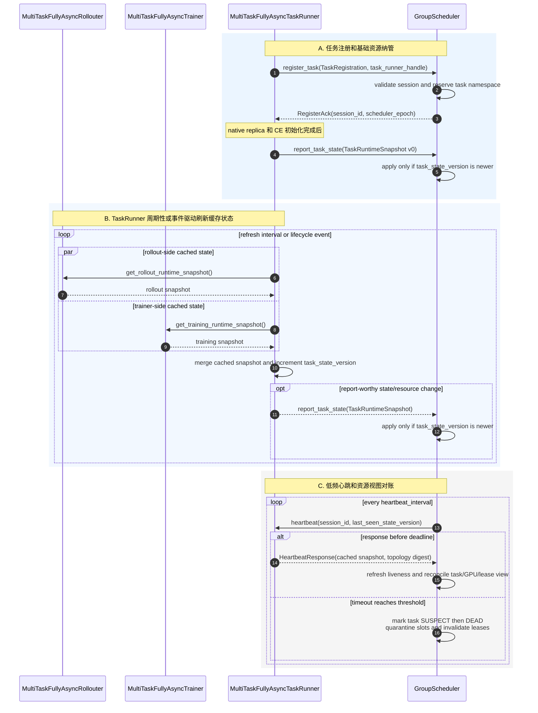

###### 7.2.2 图 5B：LB 路由事件、work disposition 与决策快照

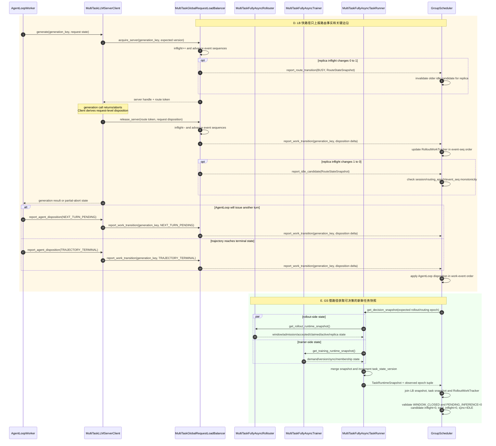

###### 7.2.3 图 5C：调度选择、命令执行与注销

```mermaid
sequenceDiagram
    autonumber
    participant DTR as MultiTaskFullyAsyncTaskRunner
    participant GS as GroupScheduler
    participant BTR as MultiTaskFullyAsyncTaskRunner
    participant ETR as MultiTaskFullyAsyncTaskRunner

    Note over DTR,ETR: DTR、BTR、ETR 是同一个类的不同任务 Actor 实例
    Note over GS: 输入为图 5B 已 join 的 candidate、task snapshot 和 tracker state

    alt stale or proof incomplete
        GS->>GS: reject candidate; wait for newer event/snapshot
    else valid bubble but sharing cost is not profitable
        GS->>GS: retain candidate as observation; emit no command
    else donor and borrower selected
        GS->>GS: create schedule_id and donor_command_id
        GS->>GS: CAS candidate to DONATION_PREPARING(schedule_id)
        GS->>DTR: apply_schedule_command(donor_command_id, DONATE or PREEMPT, expected epoch tuple)
        DTR-->>GS: CommandAccepted(donor_command_id)
        Note over DTR,GS: donor 事务详见图 6
        DTR-->>GS: CommandResult(donor_command_id, DONOR_READY,<br/>SleepingStandaloneSlotLease, endpoint=UNBOUND)
        alt donor result failed, stale, or cannot be reconciled
            GS->>GS: clear reservation or mark slot QUARANTINED<br/>never expose it as AVAILABLE
        else donor result verified
            GS->>GS: CAS DONATION_PREPARING to AVAILABLE(new lease_epoch)
            GS->>GS: create assign_command_id
            GS->>GS: CAS AVAILABLE to ASSIGNING(BTR session, lease_epoch)
            GS->>BTR: apply_schedule_command(assign_command_id, ASSIGN,<br/>slot lease, borrower expected epoch tuple)
            BTR-->>GS: CommandAccepted(assign_command_id)
            Note over GS,BTR: borrower 事务详见图 7
            BTR-->>GS: CommandResult(assign_command_id, PENDING_SYNC,<br/>endpoint=BORROWER, new state version)
            alt assignment result and endpoint binding verified
                GS->>GS: CAS ASSIGNING to BORROWED_PENDING_SYNC
                Note over GS,BTR: READY 由后续原生同步后的状态报告提交
            else assignment failed, timed out, or cleanup unproved
                GS->>GS: keep ASSIGNING or mark QUARANTINED<br/>do not reassign the slot
            end
        end
    end

    opt borrowed slot must be reclaimed
        GS->>GS: create reclaim_command_id
        GS->>GS: CAS BORROWED state to RECLAIMING(lease_epoch)
        GS->>BTR: apply_schedule_command(reclaim_command_id, RECLAIM, lease_epoch)
        BTR-->>GS: CommandAccepted(reclaim_command_id)
        BTR-->>GS: CommandResult(reclaim_command_id, endpoint=UNBOUND,<br/>borrower Server stopped, new state version)
        alt reclaim result verified and donor must restore
            GS->>GS: CAS RECLAIMING to RETURNING_TO_DONOR
            GS->>GS: create restore_command_id
            GS->>DTR: apply_schedule_command(restore_command_id, RESTORE,<br/>new lease_epoch, donor expected epoch tuple)
            DTR-->>GS: CommandAccepted(restore_command_id)
            DTR-->>GS: CommandResult(restore_command_id, PENDING_SYNC,<br/>endpoint=NATIVE, new state version)
            GS->>GS: CAS RETURNING_TO_DONOR to DONOR_PENDING_SYNC
        else reclaim result verified and slot remains shareable
            GS->>GS: CAS RECLAIMING to AVAILABLE(new lease_epoch)
        else reclaim failed, timed out, or cleanup unproved
            GS->>GS: keep RECLAIMING or mark QUARANTINED<br/>never restore or reassign
        end
    end

    opt any task exits normally
        ETR->>GS: begin_unregister(task_id, session_id, final_state_version)
        GS->>GS: CAS task session ACTIVE to UNREGISTERING<br/>reject new leases but keep session valid for cleanup
        GS-->>ETR: UnregisterAccepted(session_id)
        ETR-->>GS: ShutdownSnapshot(owned leases, borrowed leases,<br/>routes, membership, backend state)
        loop every owned or borrowed lease
            GS->>GS: drive the same RECLAIM, RESTORE, or QUARANTINE protocol<br/>through affected TaskRunner handles
        end
        GS->>ETR: finalize_unregister(expected session and state version)
        ETR-->>GS: UnregisterReady(no live route, membership, or backend use)
        GS->>GS: invalidate session and remove task only now
        GS-->>ETR: UnregisterAck
    end
```

心跳返回缓存快照，避免每次 liveness probe 都串行等待 Trainer/Rollouter；只有 LB 报出 idle candidate 或任务需求发生关键变化时，
GS 才走 `get_decision_snapshot()` 慢路径。慢路径中的两个状态 RPC 可以并发执行，但它们不是跨 Actor 原子快照，所以返回值必须携带
epoch tuple，并在真正执行命令时再次 CAS。

##### 7.3 上报和命令载荷

| 载荷 | 最小字段 | 语义 |
|---|---|---|
| `TaskRegistration` | `task_id/session_id/task_runner_handle/base_instances/declared_replica_topology` | 先注册任务身份、基础规模和声明拓扑；GS 不在初始化阶段重分配 replicas |
| `HeartbeatResponse` | `session_id/task_state_version/topology_digest/last_applied_command_id/cached_runtime_state` | 证明 TaskRunner 存活并对账资源视图；缓存状态本身不能直接证明 replica 可捐赠 |
| `RouteStateSnapshot` | `task_id/session_id/rollout_epoch/routing_epoch/routing_event_seq/work_event_seq/replica_id/route_state/per_replica_inflight/total_inflight/installed_version/work_state_digest` | LB 的权威路由事实；`1→0` 产生候选，后续 `0→1` 使旧候选失效；带 generation key 的 disposition delta 按序更新 GS tracker |
| `TaskRuntimeSnapshot` | `task_state_version/native_placements/topology_digest/rollout_epoch/admission_state/accepted_samples/claimed_not_spawned/accepted_trajectories/active_tasks/demand/current_param_version/committed_rollout_version/weight_sync_state/membership_epoch` | native 初始化后补报实际资源拓扑；后续由 TaskRunner 汇合 Rollouter/Trainer 的本地事实；不直接替 GS 判定 `U/R/N/F` |
| `ScheduleCommand` | `schedule_id/command_id/parent_command_id/action/task_session/replica_or_slot_id/expected_epoch_tuple/lease_epoch/deadline` | `schedule_id` 关联整次 donor→borrower 事务；每个 DONATE/ASSIGN/RECLAIM/RESTORE 动作使用不同 `command_id`，TaskRunner 只接受 session 和各 expected epoch 均匹配的命令 |
| `CommandResult` | `schedule_id/command_id/status/reason/new_state_version/observed_epoch_tuple/endpoint_state/cleanup_proof/slot_lease_or_effective_replica` | 区分“已接收”和“事务完成”；超时重试同一 command_id 不得重复执行副作用，GS 只有验证 endpoint/cleanup proof 后才能推进 slot CAS |
| `UnregisterRequest` | `task_id/session_id/final_state_version/shutdown_snapshot_digest` | `begin_unregister` 先把 session 置为 `UNREGISTERING` 并禁止新 lease；保留 session 供 lease 清理和结果回报使用 |
| `UnregisterReady` | `session_id/final_state_version/no_live_routes/no_effective_membership/no_backend_use` | 只有所有断言和跨任务 lease 对账完成后，GS 才真正 invalidate session 并返回 `UnregisterAck` |

`MultiTaskLLMServerClient` 不把 token、prompt 或完整 response 传给 GS，只在 acquire/release 时向 LB 附带 generation key 和
request-level 状态；`AgentLoopWorker` 判断是否存在下一轮或 trajectory 是否 terminal，再通过同一个 Client/LB 路径补充 agent-level
状态：

```text
FIRST_ACQUIRE             # U--，进入某 replica inflight
GENERATION_COMPLETE       # 当前 generation 完成；是否有下一轮仍由 AgentLoopWorker 判定
PARTIAL_RETRY_PENDING     # R++，abort 后等待重新 acquire
PARTIAL_REACQUIRE         # R--，续推重新进入 inflight
NEXT_TURN_PENDING         # N++，由 AgentLoopWorker 确认下一轮尚未 acquire
NEXT_TURN_ACQUIRE         # N--，下一轮进入 inflight
TRAJECTORY_TERMINAL       # F--，由 AgentLoopWorker 确认不再产生未来 generation
CANCELLED                 # 终止并附明确原因，不能静默当作成功完成
```

LB 将这些离散 transition 按 `work_event_seq` 转发给 GS；GS 的 `RolloutWorkTracker` 才是 `U/R/N/F` 的汇总者。

统一的比较元组为：

```text
expected_epoch_tuple = (
    task_session_id,
    task_state_version,
    rollout_epoch,
    routing_epoch,
    routing_event_seq,
    work_event_seq,
    membership_epoch,
    committed_rollout_version,
    lease_epoch,
)
```

任何一项不匹配都应返回 `STALE_COMMAND`/`STALE_CANDIDATE`，由 GS 获取新快照后重新决策，不能用旧 node/GPU ID、旧 idle 事件或
旧 membership 结果继续执行。

##### 7.4 调度触发、成本与故障规则

LB 只上报事实，TaskRunner 只上报任务上下文，GS 组合后决定是否值得共享。调度周期应由 idle/busy 边沿、任务 demand 变化、
命令完成或心跳对账差异触发，并做短窗口合并；不能让每个 acquire/release 都同步运行一次全局求解。

`CommandAccepted` 只表示 TaskRunner 已校验 session/epoch、完成 command-id 去重并接纳事务，不表示资源已经切换完成。同一
`schedule_id` 下的 donor、assign、reclaim、restore 各有独立 `command_id`，不能跨 TaskRunner/动作复用。实际事务在
task-level lock 下串行执行，完成后利用 TaskRunner 已持有的 GS handle 异步提交 `CommandResult`。heartbeat/read-only snapshot 必须放在
独立 concurrency group 或读取无锁缓存，不能被 DONATE/ASSIGN 等长事务阻塞。

slot ledger 必须先 CAS 到中间态再发送会产生副作用的命令：`DONATION_PREPARING → AVAILABLE → ASSIGNING →
BORROWED_PENDING_SYNC/READY`；回收使用 `RECLAIMING → RETURNING_TO_DONOR → DONOR_PENDING_SYNC`，或在确认 Worker `UNBOUND`
后回到 `AVAILABLE`。任何 timeout/失败若无法证明 backend 和 endpoint 已清理，只能进入 `QUARANTINED`，不能乐观重分配。

注销同样是两阶段协议。`begin_unregister` 只把 session 置为 `UNREGISTERING`，阻止新 lease；session 在 owned/borrowed lease、LB route、
CE membership 和 backend use 全部清零前仍然有效。若先 invalidate 再 reconcile，后续 RECLAIM/RESTORE 的 expected session 校验会失败。

除了能否回收，还应判断预计空闲时长是否覆盖：

```text
drain/abort
+ sleep
+ borrower create
+ borrower wait-for-sync
+ warmup
+ reclaim
+ donor wait-for-sync and restore
```

故障处理分两级：单次 heartbeat 超时只进入 `SUSPECT`，连续达到阈值才进入 `DEAD`；进入 `DEAD` 也不能立即把 GPU 当作可分配，
而应先 quarantine 相关 slot、使 lease 失效并通知 borrowers 停流，最后以 Ray Actor/PG 实际存活状态完成资源对账。正常退出先发送
`begin_unregister()` 进入 `UNREGISTERING`，在仍有效的 session 下处理 borrowed/donated leases，最后通过
`finalize_unregister()`/`UnregisterReady` 完成真正注销。

##### 7.5 代码事实与扩展边界

- `[V]` 原 TaskRunner 只有 `components`，持有 Trainer/Rollouter handles 并监督两个长期 `fit()` future：
  `verl/experimental/fully_async_policy/fully_async_main.py:35-44,77-103,176-209`；没有 GS handle、heartbeat、snapshot 或 command RPC；
- `[V]` 原 LB 只维护 `_servers`、`_inflight_requests` 和 sticky map，`acquire/release/get_status` 见
  `verl/workers/rollout/llm_server.py:60-99,128-143`；没有 GS handle、route epoch、event sequence 或 idle report；
- `[S]` 模拟器已有 `TaskStateReport.state_version`、注册/上报/注销和按版本防旧：
  `/Users/nyp/Documents/multi-rl-task-scheduler/src/multi_rl_task_scheduler/models.py:34-47`、
  `group_scheduler.py:55-121`、`interfaces.py:19-30`；但它注册的是普通 `InferScheduler`，没有 Ray ActorHandle、心跳、session、lease 或命令幂等；
- `[D]` 图 5 中所有新增 RPC、载荷、epoch/CAS、缓存快照和故障状态机都需要在子仓实现，并要求 verl 提供 manager 注入和必要的
  Trainer/Rollouter 状态 RPC 扩展点。

### 3. `[D]` 受赠推理实例创建

#### 1. `[D]` donor 发布 sleeping slot

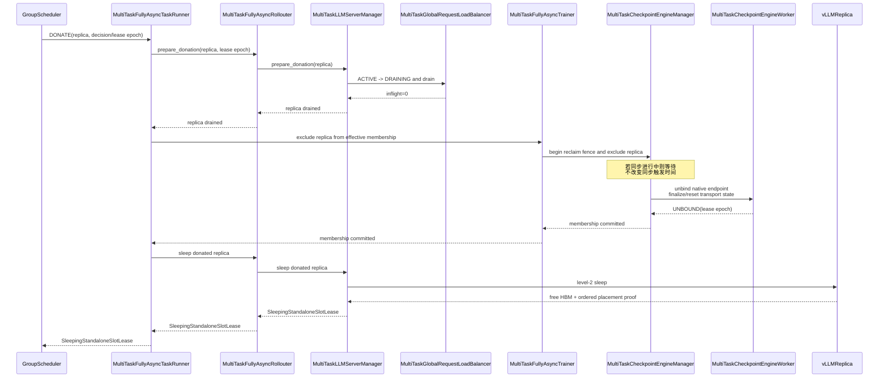

slot 至少包含：

```text
slot_id/lease_epoch
donor task/session/replica
replica topology TP/PP/DP
ordered placement-anchor handles
MultiTaskCheckpointEngineWorker ActorHandles
node IDs/GPU IDs
PG IDs/bundle indices
donor Server handles and sleep epoch
measured free HBM and safety margin
lease deadline
```

图 6 的整条事务为 `[D]`。可复用锚点只有 LB count/remove（`verl/workers/rollout/llm_server.py:93-143`）、CE
`remove_replicas()`（`verl/checkpoint_engine/base.py:422-429`）和 placement discovery（
`verl/workers/rollout/vllm_rollout/vllm_async_server.py:976-989`）。原 LB remove 会立即丢掉计数，原 CE 无并发 fence，原
STANDALONE sleep no-op，因此三者都不能直接拼成安全捐赠事务。

#### 2. `[D]` borrower 创建 hidden replica

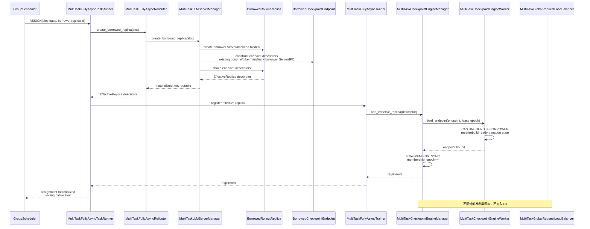

图 7 同样是 `[D]`。它不会新建 CE Worker：`BorrowedCheckpointEndpoint` 只是描述已有 donor Worker ActorHandle 如何指向 borrower
Server/IPC，真正的 bind 由 borrower Trainer 内的 CE manager 执行。现有 `FullyAsyncLLMServerManager.add_replicas()` 只激活已在初始化阶段创建的 hybrid replicas（
`verl/experimental/fully_async_policy/fully_async_rollouter.py:153-275`），不是动态创建接口；原 CE add 只是 list extend（
`verl/checkpoint_engine/base.py:414-420`）；原 LB add 后立刻可 acquire（`verl/workers/rollout/llm_server.py:68-91,100-113`），没有
hidden/PENDING_SYNC。

#### 3. `[M]` 下一次原生同步后激活

如果 borrower 当前 committed rollout version 是 V3，而 Trainer 已处于 V3.2，中间没有 V3 历史快照，刚创建的 replica 无法立即
安装 V3。它保持 hidden，等待 borrower 下一次原生参数同步：

```text
borrower 原生 _fit_update_weights(V4)
→ CE snapshot = native + B-r7(PENDING_SYNC)
→ 所有 replicas 同步 V4
→ B-r7 installed-version ACK
→ B-r7 SYNC_READY(V4)
→ 加入 borrower LB
```

在“不让 GS 触发同步、不使用历史权重快照”的约束下，新 replica 不能保证创建后立即接流。

`[V]` 可复用的原生同步点是 `verl/experimental/fully_async_policy/fully_async_trainer.py:501-524`，CE 会遍历调用时的
`self.replicas` worker handles：`verl/checkpoint_engine/base.py:485-502`。PENDING_SYNC、版本 ACK 和同步后 LB 激活为 `[D]`。

#### 4. `[D]` 创建失败

- 任一 Server rank 创建或 endpoint bind 失败：解绑已成功切换的 Worker，清理 borrower Server/backend；
- CE 注册失败：borrower 保持 hidden，不加入 LB；
- lease 过期或 donor session 改变：拒绝 assignment；
- node/GPU placement 与 lease 不一致：立即失败，不尝试其他 GPU；
- 创建失败不改变 donor slot owner，TaskRunner 向 GS 返回失败，由 GS 决定释放或重试。

这些补偿分支当前均为 `[D]`；原 manager 的 batch add/remove 只捕获异常并返回 0，没有跨 Server/CE/LB 的事务回滚：
`verl/experimental/fully_async_policy/fully_async_rollouter.py:228-343`。

### 4. `[M]` 推理实例强行回收

#### 1. `[D]` 调度抢占与算法 partial rollout 分离

算法型 partial rollout：

```text
PARAMETER_SYNC abort
&& config.partial_rollout=true
→ 允许 trajectory 跨 Vn/Vn+1 续推
```

调度型 request continuation：

```text
RESOURCE_RECLAIM abort
→ 无论 config.partial_rollout 是否开启，都在同版本其他 replica 上续推
```

GroupScheduler 不修改任务的 `partial_rollout` 配置。续推判断应为：

```text
should_continue =
    (abort_reason == PARAMETER_SYNC and config.partial_rollout)
    or
    (abort_reason == RESOURCE_RECLAIM and scheduler_preemption_resume_enabled)
```

这里的 abort reason 和第二个条件均为 `[D]`。`[V]` client 目前只判断 stop reason 和全局
`config.async_training.partial_rollout`：`verl/experimental/fully_async_policy/fully_async_rollouter.py:141-145`。

#### 2. `[V/M]` 当前机制可复用范围

可以复用：

- Server `abort_all_requests()`；
- aborted `TokenOutput`；
- client 累积 partial token/log prob；
- `prompt + accumulated tokens` 和剩余 token budget；
- client 重新 acquire LB；
- sticky Server 不可用时改选其他实例。

对应代码依次为 `verl/workers/rollout/replica.py:273-279`、
`verl/workers/rollout/vllm_rollout/vllm_async_server.py:533-602,679-715,1062-1083`、
`verl/experimental/fully_async_policy/fully_async_rollouter.py:91-149` 和 `verl/workers/rollout/llm_server.py:68-91,202-220`。
但 vLLM abort 后允许返回空 `token_ids`（`vllm_async_server.py:547-556`），所以只能说“复用已返回的 partial token”；不能保证每次都能
prefix continue，必须允许 `RESTART_TURN`。

必须扩展：

- abort reason、preemption ID 和 source version；
- LB `ACTIVE→DRAINING→EVACUATED→REMOVED`；
- route token 和摘流后仍可观察的 in-flight counter；
- 只路由到相同 committed version 的目的 replica；
- backend partial output 能力和 `PREFIX_CONTINUE/RESTART_TURN` 标记；
- reclaim 与 CE update 的生命周期 fence。

现有 FullyAsync partial rollout 不会把请求放回 `pending_queue`、MessageQueue 或 TransferQueue。推荐保留原 AgentLoop coroutine，
由 MultiTaskLLMServerClient 在内部重试，不新增中央 continuation queue。

这个现状可由 client 内部 `while True`（`fully_async_rollouter.py:98-145`）和完整 sample 才写 MQ（同文件 `:933-950`）验证。

#### 3. `[M]` 强制回收目标时序

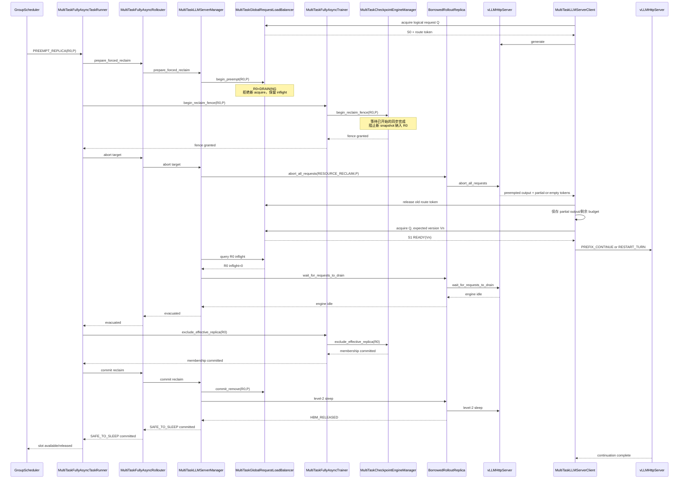

安全 sleep 条件：

```text
R0 routing state = DRAINING
&& R0 inflight routes = 0
&& R0 backend engine idle
&& R0 已从当前任务 CE effective replicas 排除
```

上述条件满足后才可以调用 sleep；调用完成还必须验证 `HBM_RELEASED`，才能向 GS 发布 slot。图 8 的 abort/client retry 是 `[V]` 骨架，
DRAINING、route token、abort reason、同版本筛选、CE fence 和 STANDALONE level-2 sleep 均为 `[D]`。主模拟器当前也不执行 busy
reclaim：`/Users/nyp/Documents/multi-rl-task-scheduler/src/multi_rl_task_scheduler/group_scheduler.py:212-237`。

不必等待请求在替代 `vLLMHttpServer`（图中 S1）完整生成结束才释放 R0，因为请求状态已经回到
`MultiTaskLLMServerClient.generate()` coroutine。

#### 4. `[D]` 无可用目的实例

非 partial 任务只能续推到：

```text
READY
&& installed_version = committed_rollout_version
&& replica != R0
```

如果 R0 是任务唯一有效 replica，优先策略是延迟回收，等待替代 replica READY。不能把请求路由到不同 policy version 并假装没有
partial，也不能默认丢弃 sample。

原 LB 的 least-loaded 选择不检查 version：`verl/workers/rollout/llm_server.py:68-91`。所以这里的 READY/version predicate 是必须新增的
LB acquire 参数和过滤条件。

### 5. `[M]` 参数同步

#### 1. `[D]` GroupScheduler 只调整 CE replicas，不触发同步

参数同步时机保持 verl 原生逻辑：

- One-Step：上一 batch 完成、下一 batch generation 启动前；
- FullyAsync：由 `local_trigger_step` 和 `trigger_parameter_sync_step` 决定；
- 初始同步：任务 checkpoint 恢复后由原生入口执行。

GS 只通过 TaskRunner 调整 CE 内部有效集合：

```text
donor replica 捐出
→ remove/exclude from donor effective_replicas

borrower replica 创建完成
→ add to borrower effective_replicas as PENDING_SYNC

replica 归还 donor
→ restore to donor effective_replicas as PENDING_SYNC
```

所有 membership 接口只修改集合，不调用 `_fit_update_weights()`。

`[V]` 原生时机：One-Step 在 await 上一 generation 后调用同步、再启动下一 generation，见
`verl/experimental/one_step_off_policy/ray_trainer.py:390-409`；FullyAsync 只在 `local_trigger_step==1` 时同步，见
`verl/experimental/fully_async_policy/fully_async_trainer.py:487-524`；initial sync 见
`verl/experimental/fully_async_policy/fully_async_main.py:105-110`。GS 不触发同步和 membership API 语义均为 `[D]` 约束。

#### 2. `[V]` 原生 CE 真实同步流程

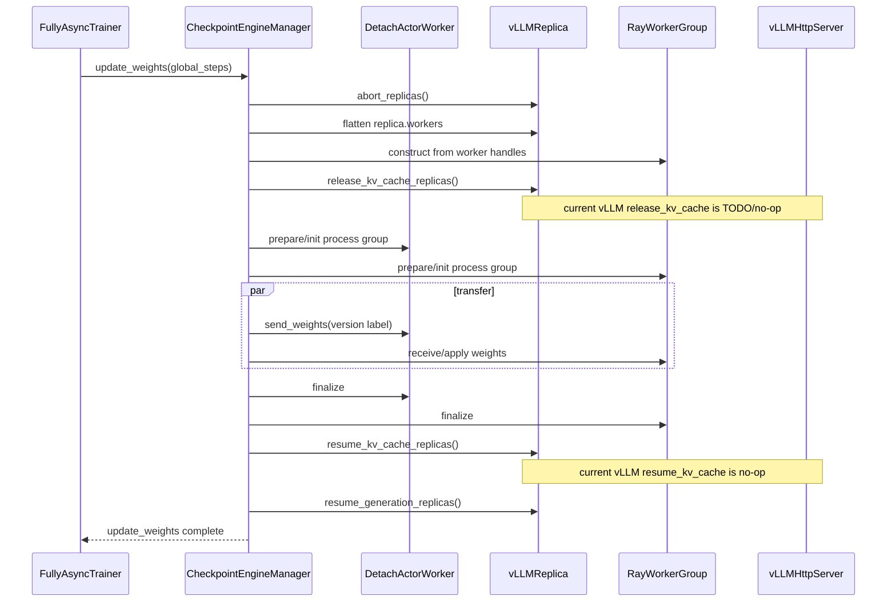

图 9 是代码现状，完整实现见 `verl/checkpoint_engine/base.py:470-515`；rollout worker receive/apply 见同文件 `:322-325`，Trainer
sender 见 `verl/workers/engine_workers.py:666-700`。当前 vLLM KV release/resume 空方法见
`verl/workers/rollout/vllm_rollout/vllm_async_server.py:644-655`。

#### 3. `[M]` 原生同步点统一同步 native 和 borrowed replicas

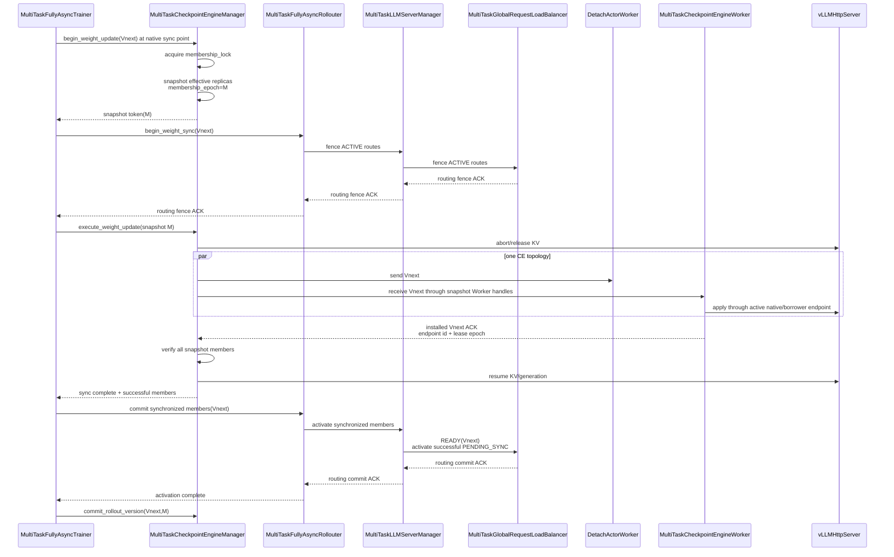

原生 CE 并不按 ResourcePool 自动发现实例，而是遍历显式 `replicas` 的 worker handles。因此 borrowed replica 不需要创建新的 Worker；
只要其 `EffectiveReplica` 提供已经绑定 borrower endpoint 的 donor `MultiTaskCheckpointEngineWorker` ActorHandles，就可以与其余 native
replicas 进入 borrower 本轮同一个 topology。

> 图 10 校对：遍历显式 list 和从已有 handles 构造临时 `RayWorkerGroup` 是 `[V]`（
> `verl/checkpoint_engine/base.py:374-429,485-502`）；Worker endpoint 重绑定、membership lock、
> snapshot epoch、LB fence、installed-version ACK 和 committed version 全是 `[D]`。`global_steps` 只是传输/输出携带的版本标签（
> `checkpoint_engine/base.py:323-325`、`vllm_async_server.py:558-602,672-674`）。原生 `ray.get(...)` 会等待全部 rollout
> `update_weights()` RPC 成功完成（`checkpoint_engine/base.py:498-502`），可作为 ACK 基础，但没有按 replica 持久化
> `installed_version`、LB commit 或失败回滚。

#### 4. `[D]` Membership 并发规则

add/remove 和 `update_weights()` 共享同一把 membership lock：

1. 命令在同步 snapshot 前提交：本轮使用新集合；
2. 命令在 snapshot 后到达：等待本轮同步结束，下一轮生效；
3. donor 正在同步时收到捐赠命令：等待同步完成再 exclude/sleep；
4. reclaim 已取得 fence：后续同步 snapshot 不再包含目标 replica；
5. 同步过程中 membership 不可变；
6. 每次变更携带 membership epoch、task session 和 lease epoch。

原 manager 无锁，`add_replicas()` 直接 extend、`remove_replicas()` 直接替换 list：
`verl/checkpoint_engine/base.py:414-429`。因此本节六条全部是新增并发语义。

#### 5. `[V/M]` 动态 topology

effective replica 数变化会改变 rollout world size。NCCL 默认 `rebuild_group=false`，旧 group 无法复用不同 rank/world size。

第一版配置：

```yaml
checkpoint_engine:
  backend: nccl
  engine_kwargs:
    nccl:
      rebuild_group: true
```

高频动态 membership 可评估 NIXL，但 backend topology 重建不能替代 membership lock、版本 ACK 和 LB fence。

`[V]` NCCL 默认值、finalize 和旧 world-size 断言见
`verl/checkpoint_engine/nccl_checkpoint_engine.py:103-170,200-225`，所以动态 world size 使用 NCCL 时必须
`rebuild_group=true`。NIXL 会根据当轮 metadata 构建链式 topology 并在 finalize 清理，见
`verl/checkpoint_engine/nixl_checkpoint_engine.py:288-369`。后端能力仍不提供 `[D]` 的 membership 事务。

#### 6. `[D]` 同步失败

如果任一 native Worker 或 borrowed endpoint 的 receive/apply 失败：

```text
不推进 committed_rollout_version
→ 本次 snapshot 保持不可路由
→ 不让成功部分提前回 LB
→ 对同一 target version 全量重试或进入任务失败恢复
```

必须保持：

```text
all LB READY replicas installed_version
= committed_rollout_version
```

原 CE 对 transfer/finalize 异常只会向上抛出，没有多 replica 版本回滚、LB 隔离或 committed-version 提交逻辑：
`verl/checkpoint_engine/base.py:495-515`。因此本节是必须新增的失败语义，不能视为现有保证。

### 6. `[D]` 归还与 donor 恢复

borrower 退出：

```text
borrower LB DRAINING/abort/drain
→ borrower CE exclude
→ unbind borrower endpoints and reset CE transport state
→ destroy borrower Server/backend
→ ACK GS: endpoint UNBOUND，slot remains RECLAIMING
```

donor 原 Server、PG 和 `MultiTaskCheckpointEngineWorker` 一直保留，但 Worker 借出期间绑定 borrower endpoint，没有接收 donor 的新权重。
归还后不能直接 wake 接流：

```text
GS commits RETURNING_TO_DONOR，不允许再次 ASSIGN
→ donor TaskRunner/CE bind native endpoint(new lease epoch)
→ donor restore_effective_replica(state=PENDING_SYNC)
→ 等 donor 下一次原生参数同步
→ 安装 donor Vnext
→ ACK/warmup
→ 加回 donor LB
```

这同样不要求 GS 触发参数同步。

如果 donor 暂不恢复、slot 继续对其他 borrower 开放，则 GS 只能在确认 Worker 为 `UNBOUND` 后把 slot 置为 `AVAILABLE`，下一次 ASSIGN
生成新的 lease epoch。无论走 RESTORE 还是再次 ASSIGN，都不能出现“旧 borrower 已释放、但新 owner 尚未 CAS bind”时被两边同时使用的
窗口。

原生可复用点仍只有 CE/LB remove/add 和原生同步点；STANDALONE wake 当前 no-op：
`verl/workers/rollout/vllm_rollout/vllm_async_server.py:604-624`。完整 restore 状态机需新增。

### 7. `[D]` 任务结束与故障恢复

任务正常结束：

1. 停止新 rollout admission；
2. 回收本任务使用的 borrowed replicas；
3. 注销本任务捐出的 leases，必要时通知 borrowers 迁移；
4. 清理 LB/CE memberships；
5. 向 GS 注销 task session；
6. 最后销毁任务原生 workers/PGs。

TaskRunner 或节点异常时，GS 使用 task session、lease epoch 和心跳超时使旧命令失效。任何无法证明版本、路由或 lease 一致性的
replica 先保持不可路由；borrower placement anchor 失效时，立即停止该 borrower replica，不能根据缓存 node/GPU ID 继续运行。

模拟器已有 `[S]` 的 task unregister 和 state-version 防旧报告：
`/Users/nyp/Documents/multi-rl-task-scheduler/src/multi_rl_task_scheduler/group_scheduler.py:75-83,97-121`；它没有 task session、lease
epoch、borrower 通知或 Ray Actor/PG 故障处理。

### 8. `[D]` 第一阶段实施范围

第一阶段建议聚焦：

1. FullyAsync STANDALONE；
2. 同模型、相同 replica topology 的 donor/borrower slot；
3. 完整 replica footprint 借用；
4. donor Server/PG/workers 保留并 level-2 sleep；
5. borrower Server + `BorrowedCheckpointEndpoint`，复用 donor 已有 `MultiTaskCheckpointEngineWorker` ActorHandles；
6. CE effective replicas + NCCL rebuild group；
7. LB 两阶段摘流和同版本续推；
8. 新增/归还实例等待各自任务下一次原生同步；
9. 不引入历史 DDR 权重快照；
10. 不提供 AgentLoopWorker crash 后的 in-flight request 持久化恢复。

进入正式实现前有四个阻断性 PoC gate：

1. 实现并实测 STANDALONE vLLM level-2 sleep/wake，确认 weights、KV cache、CUDA graph 等目标 HBM 真实释放且可恢复；
2. `MultiTaskCheckpointEngineWorker` 能在不重建 Actor、不复用 donor PG/bundle 创建能力的前提下，按 lease 原子切换
   native/borrower ServerHandle、IPC endpoint 和逻辑 rank；
3. donor sleeping vLLM backend、既有 CE Worker 与 borrower active backend 在同一 GPU 上的 CUDA context、显存和故障隔离可控；
4. endpoint 所属任务切换及 native+borrowed world size 变化时，NCCL rebuild/NIXL topology、任一 endpoint 失败和清理后无残留
   group/HBM。

这些 gate 的必要性分别来自当前 STANDALONE sleep no-op（`vllm_async_server.py:622-635`）、原生 Worker 的单 `server_adapter` 和
job-specific IPC 路径（`checkpoint_engine/base.py:299-325`、`vllm_rollout/vllm_rollout.py:77-108,119-153`）以及 CE 动态 topology
代码（`checkpoint_engine/base.py:485-508`）。路径前缀均为
`verl/workers/rollout/`、`verl/single_controller/ray/` 或 `verl/checkpoint_engine/`。

后续阶段再评估：

- 跨模型/异构 topology 匹配；
- 高频 NIXL topology；
- 历史权重快照和任意时刻立即激活；
- durable continuation queue；
- 更复杂的优先级、抢占成本和收益预测；
- HYBRID 下 training/rollout phase 与 HBM lease 的联合 fencing。
