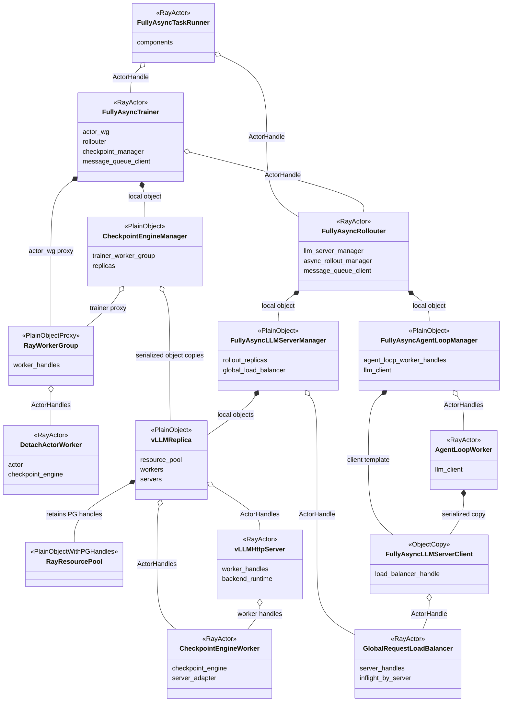
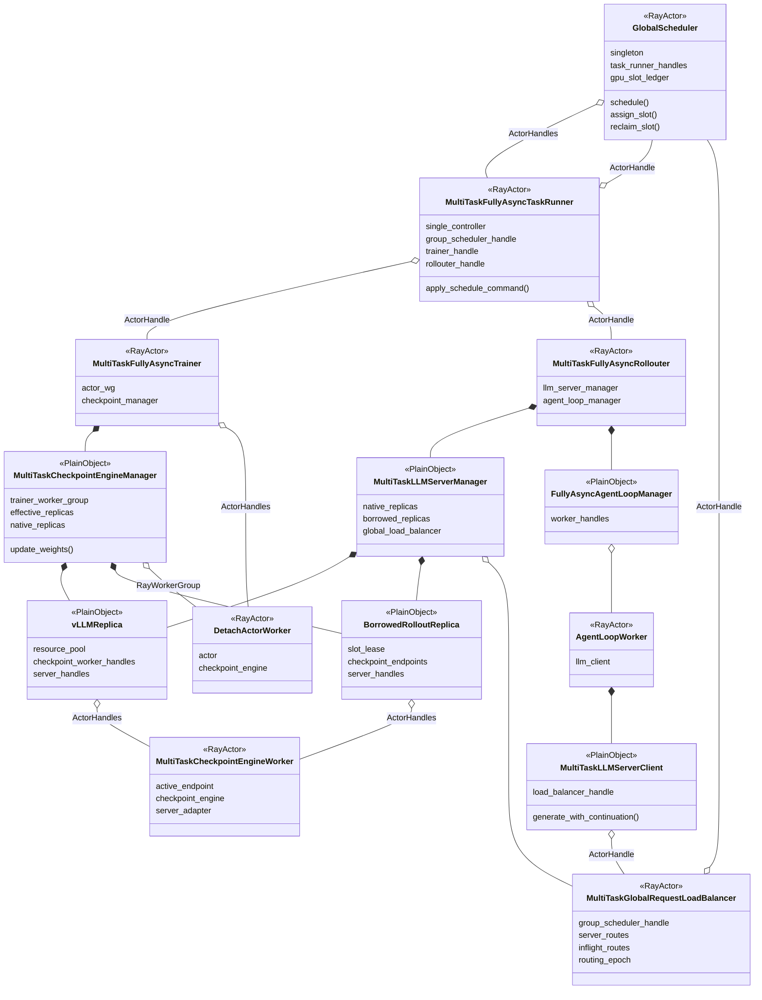
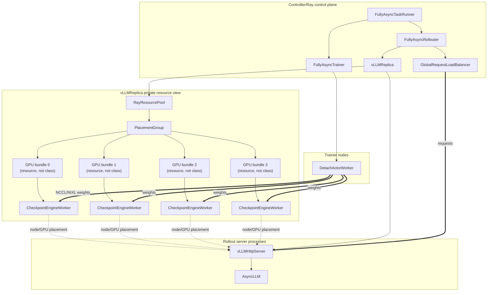
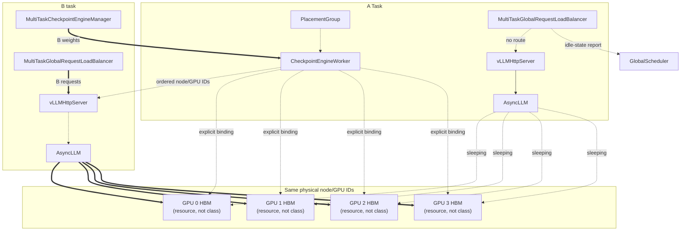
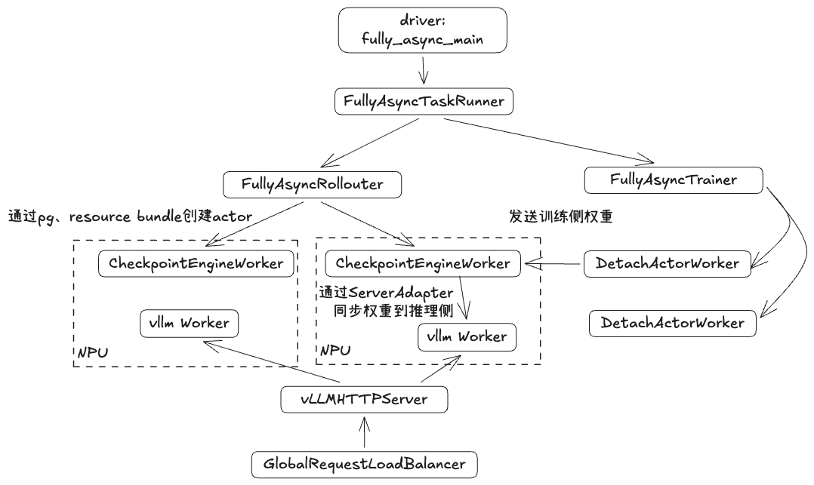
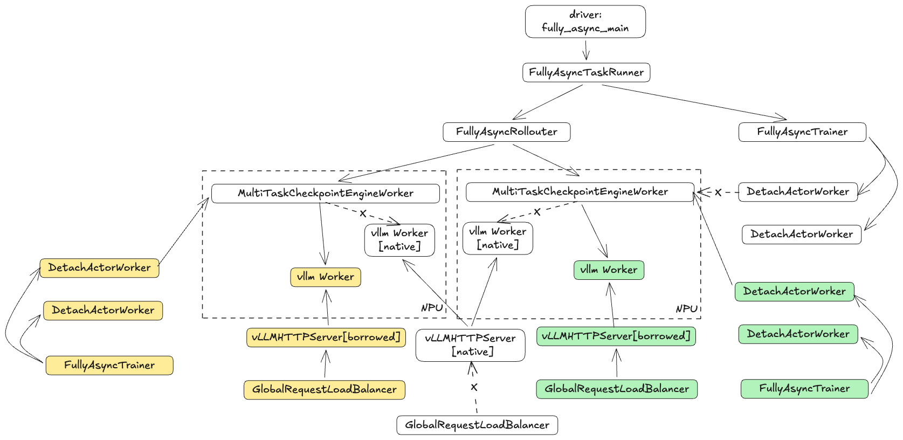
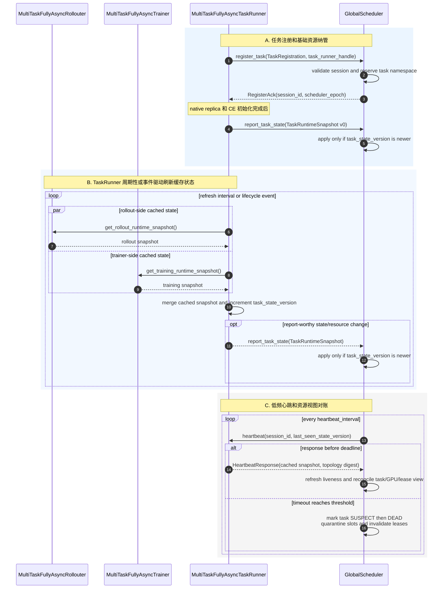
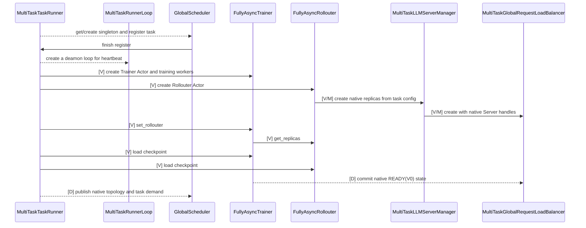

# 1. 问题：单任务异步仍然存在 rollout GPU 空泡

RL 训练中的 rollout 请求具有明显的阶段性、长尾性和版本约束。即使单任务引入训推异步，也不能保证推理 GPU 持续满载：

1. One-Step 在完整 batch 边界天然存在阶段性空闲；
2. FullyAsync 只能在允许的陈旧度窗口内继续生产，不能无限向前生成；
3. `partial_rollout` 可以降低等待长尾请求的时间，但会引入 trajectory 跨版本生成，不能无条件开启；

因此，单任务训推异步能够压缩一部分空泡，但受算法陈旧度、参数版本和有限生产窗口约束，无法完全消除 rollout GPU 空闲。

# 2. 动机：在不改变单任务算法语义的前提下利用跨任务空泡

- GlobalScheduler：协调多个RL实现rollout资源共享
- Donor任务：某个RL任务的rollout进入长尾阶段，即，该step内已没有待推理的sample，计划将其空闲卡共享给其他任务
- Borrower任务：某个RL任务的rollout仍在进行，需要更多实例，经GlobalScheduler协调获取空闲卡的任务

在多个同时运行的 RL 任务之间临时共享 rollout 卡资源：

```text
donor rollout replica 空闲或被抢占
→ donor 保留原 ResourcePool/PG/bundles 并休眠 Server
→ GlobalScheduler 将释放的卡资源临时租给 borrower
→ borrower 在同一 node/GPU 上创建自己的推理replica
→ borrower 将租借的 replica 加入自己的参数同步集合和 LB
```

# 3. 当前VERL架构无法支撑多任务

## 3.1 verl 原生资源视图无法表达跨任务临时卡租借

STANDALONE 初始化时，每个 rollout replica 创建自己的：

```text
RayResourcePool
→ Placement Group
→ resource bundles
→ CheckpointEngineWorker Ray Actors
→ inference server actors/processes
```

- Ray 资源视图会认为这些 GPU 在任务整个生命周期内始终被该 replica 占有。即使目标扩展让 Server 执行 level-2 sleep 并真实释放
- 模型权重和 KV cache HBM，Ray 仍不会把 PG 已预留的 GPU resource 重新分配给其他任务。
## 3.2 资源、路由和参数同步视图会发生分离

动态借用后存在三种权威视图：

1. verl/Ray 原生资源视图：ResourcePool、Placement Group、bundle 和 worker actor；
2. 推理负载均衡视图：LB 只通过 Server ActorHandle 分发请求；
3. GlobalScheduler 全局物理视图：node ID、GPU ID、HBM slot 和跨任务租借。

此外，Checkpoint Engine 需要维护当前任务的参数同步执行集合：

```text
effective_replicas(task)
= 本任务未借出的固有 native replicas
+ 已成功物化并注册的受赠 borrowed replicas
```

- 如果只把受赠 Server 加入 LB、没有加入 Checkpoint Engine effective replicas，该实例会持续使用旧权重。
- 如果 borrowed replica 已借出却仍在donor CE 集合中，donor 参数同步可能重新占用其 HBM，与 borrower 冲突。

## 3.3 强制回收不能丢失 in-flight 请求

优先回收已经形成自然空泡的 replica 最安全，但全局调度可能因公平性原因强制回收仍有请求的租借实例。此时需要：

```text
摘流
→ abort 目标 replica 的全部 in-flight generation
→ 请求在其他有效 replica 上重新 acquire
→ 使用已有 token prefix 继续生成或重启当前 turn
→ 目标 replica 完成 evacuation 后 sleep
```

这个过程类似 verl partial rollout，但不能要求所有任务都配置 `partial_rollout=true`。

# 4. 方案设计

## 4.1逻辑视图

### 4.1.1 AS-IS



### 4.1.2 TO-BE

其中，MultiTaskCheckpointEngineWorker部分简化，未画出vLLMHttpServer。所有的vLLMHttpServer均会加入MultiTaskGlobalReqeustLoadBalancer。

### 4.1.3. 新增和扩展组件

#### GlobalScheduler

单例 Ray Actor，作为跨任务全局调度大脑：

- 保存 TaskRunner ActorHandles；
- 通过心跳维护任务、节点、GPU 和 资源租借状态；
- 接收 LB 上报的 per-replica inflight/idle/routing 状态；
- 结合任务需求、空泡预测、优先级和成本生成 DONATE/ASSIGN/PREEMPT/RECLAIM 等决策；
- 将决策发送给 donor/borrower TaskRunner；
- 使用本地维护的全局资源视图保证同一卡被有限次重复分配；
- 不直接调用RL任务的普通对象 manager，通过TaskRunner下发指令执行；
- 不触发参数同步；

#### MultiTaskFullyAsyncTaskRunner

扩展的任务的 single controller Ray Actor：

- 创建或获取 GlobalScheduler 单例 handle；
- 启动时向 GlobalScheduler 注册任务、基础资源和自身 ActorHandle；
- 持有 Trainer、Rollouter 和 GlobalScheduler handles；
- 响应 GlobalScheduler 主动 heartbeat probe，并通过 GS handle 上报注册/状态变化/注销、资源需求和同步；
- donor 侧执行摘流、CheckpointEngine 排除、sleep 和 卡释放；
- borrower 侧执行 Server 创建、donor CheckpointEngine Worker endpoint 重绑定、CheckpointEngine 注册和 GlobalRequestLoadBalancer 激活；
- 任务结束时注销资源。

> TaskRunner 是 GlobalScheduler 进入任务内部的唯一控制入口。

#### MultiTaskLLMServerManager

位于 Rollouter Actor 内的普通对象，继承或组合 `FullyAsyncLLMServerManager`：

- 管理初始化时创建的 native replicas；
- 管理运行期创建的 borrowed replicas；
- 对replica执行创建、销毁、sleep、wake、abort等操作；
- 基于MultiTaskCheckpointEngineWorker查询有序 node/GPU IDs；
- 不创建新的MultiTaskCheckpointEngineWorker，将已存在的 `MultiTaskCheckpointEngineWorker` 临时关联到borrowed replica；
- 操作扩展 LB 的路由后端 replica 状态；
- 不制定跨任务调度策略；
- 不直接调用位于 Trainer Actor 内的 CE manager。

#### MultiTaskCheckpointEngineManager

位于 Trainer/controller 内的普通对象，扩展原生 `CheckpointEngineManager`：

```text
effective_replicas
= native replicas (not donated)
+ borrowed replicas
```

职责：

- 维护 replica 有效集合；
- 使用 lock 串行化 add/remove 与 `update_weights()`；
- 为每次同步生成不可变 replica snapshot 和 epoch；
- 同步失败时阻止混合版本 replicas 接流；
- 不由 GlobalScheduler 直接调用，命令由 TaskRunner/Trainer Actor 转发。

#### MultiTaskGlobalRequestLoadBalancer

扩展原生 `GlobalRequestLoadBalancer`：

- 维护 `server_id → ActorHandle`；
- 维护 per-server in-flight 请求数；
- 维护 `READY/DRAINING/SYNCING/SLEEPING` 状态和 routing epoch；
- 只向 `READY Server` 分发请求；
- 在 zero-inflight 等状态变化时向 GlobalScheduler 上报事实；
- 支持 Server 摘流；
- 不根据单一 `inflight==0` 自行决定捐赠；
- 不执行跨任务 Server 创建。

#### MultiTaskCheckpointEngineWorker

受赠 replica 不调用原生 `init_standalone()`，否则会再次申请 ResourcePool/PG/GPU，而是使用 donor 节点和卡信息：

```text
donor worker handles/PG provenance
→ ordered node IDs and GPU IDs
→ hard node affinity
→ explicit CUDA_VISIBLE_DEVICES/local rank
→ borrower Server/backend
```

这里不创建新的受赠 CheckpointEngineWorker。初始化阶段所有可捐赠 replica 都创建
`MultiTaskCheckpointEngineWorker`；它继承原生 `CheckpointEngineWorker`，仍是 donor private PG bundle 中已经存在的 Ray Actor。借出时，borrower 只得到这些 MultiTaskCheckpointEngineWorker 的临时使用权。

## 4.2 部署视图

### 4.2.1 AS-IS



### 4.2.2 TO-BE




### 4.2.3 简化图





## 待讨论点

1. 对verl扩展较多，社区是否接受
2. verl原生不支持rollout-rollout参数同步路径，当前只能基于train-rollout路径扩展，是否需要跟社区提新的参数同步路径
3. 可靠性，verl本身支持较弱，子仓需强化

## 运行视图

### 心跳、状态上报


### 推理实例空闲状态判断

### 受赠推理实例创建



### 推理实例强行回收

### 参数同步
