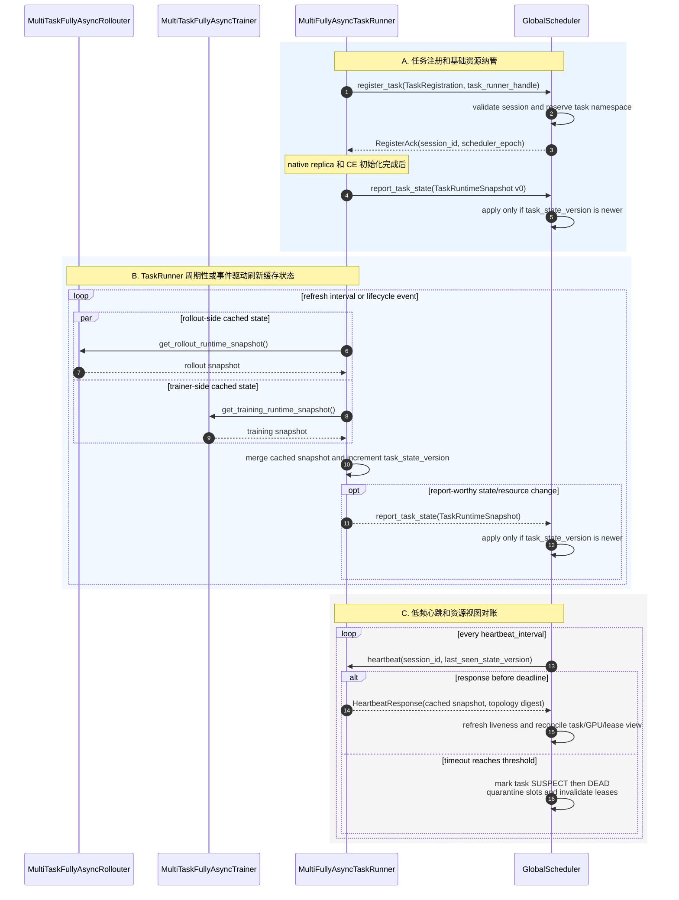
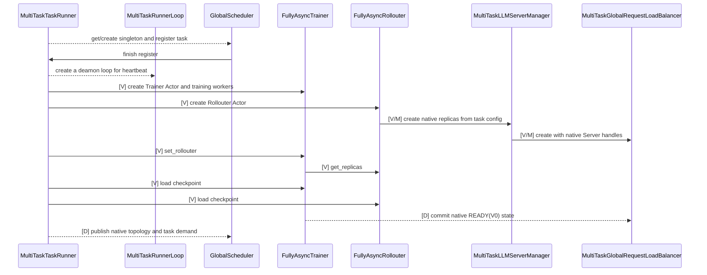

## 4.3 关键流程

### 4.3.1 scaling 原子性保证

### 4.3.2 scaling 阶段互斥保证

## 4.4 运行视图

### 心跳、状态上报

```mermaid
sequenceDiagram
    autonumber
    participant R as MultiTaskFullyAsyncRollouter
    participant T as MultiTaskFullyAsyncTrainer
    participant DTR as MultiFullyAsyncTaskRunner
    participant GS as GlobalScheduler

    rect rgb(235, 245, 255)
        Note over DTR,GS: A. 任务注册和基础资源纳管
        DTR->>GS: register_task(TaskRegistration, task_runner_handle)
        GS->>GS: validate session and reserve task namespace
        GS-->>DTR: RegisterAck(session_id, scheduler_epoch)
        Note over DTR: native replica 和 CE 初始化完成后
        DTR->>GS: report_task_state(TaskRuntimeSnapshot v0)
        GS->>GS: apply only if task_state_version is newer
    end

    rect rgb(242, 248, 255)
        Note over R,DTR: B. TaskRunner 周期性或事件驱动刷新缓存状态
        loop refresh interval or lifecycle event
            par rollout-side cached state
                DTR->>R: get_rollout_runtime_snapshot()
                R-->>DTR: rollout snapshot
            and trainer-side cached state
                DTR->>T: get_training_runtime_snapshot()
                T-->>DTR: training snapshot
            end
            DTR->>DTR: merge cached snapshot and increment task_state_version
            opt report-worthy state/resource change
                DTR-->>GS: report_task_state(TaskRuntimeSnapshot)
                GS->>GS: apply only if task_state_version is newer
            end
        end
    end

    rect rgb(245, 245, 245)
        Note over DTR,GS: C. 低频心跳和资源视图对账
        loop every heartbeat_interval
            GS->>DTR: heartbeat(session_id, last_seen_state_version)
            alt response before deadline
                DTR-->>GS: HeartbeatResponse(cached snapshot, topology digest)
                GS->>GS: refresh liveness and reconcile task/GPU/lease view
            else timeout reaches threshold
                GS->>GS: mark task SUSPECT then DEAD<br/>quarantine slots and invalidate leases
            end
        end
    end
```

### 受赠推理实例创建

```mermaid
sequenceDiagram
    participant TR as MultiTaskTaskRunner
    participant TR_LOOP as MultiTaskRunnerLoop
    participant GS as GlobalScheduler
    participant T as FullyAsyncTrainer
    participant R as FullyAsyncRollouter
    participant M as MultiTaskLLMServerManager
    participant LB as MultiTaskGlobalRequestLoadBalancer

    TR-->>GS: get/create singleton and register task
    GS->>TR: finish register
    TR-->>TR_LOOP: create a deamon loop for heartbeat
    TR->>T: [V] create Trainer Actor and training workers
    TR->>R: [V] create Rollouter Actor
    R->>M: [V/M] create native replicas from task config
    M->>LB: [V/M] create with native Server handles
    TR->>T: [V] set_rollouter
    T->>R: [V] get_replicas
    TR->>T: [V] load checkpoint
    TR->>R: [V] load checkpoint
    T-->>LB: [D] commit native READY(V0) state
    TR-->>GS: [D] publish native topology and task demand
```

### 推理实例空闲状态判断

### 推理实例强行回收

### 参数同步
