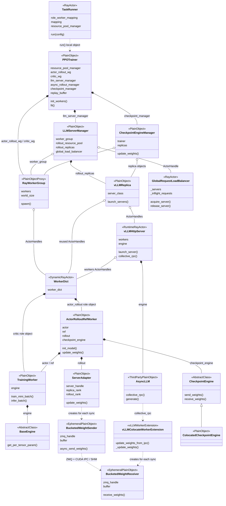
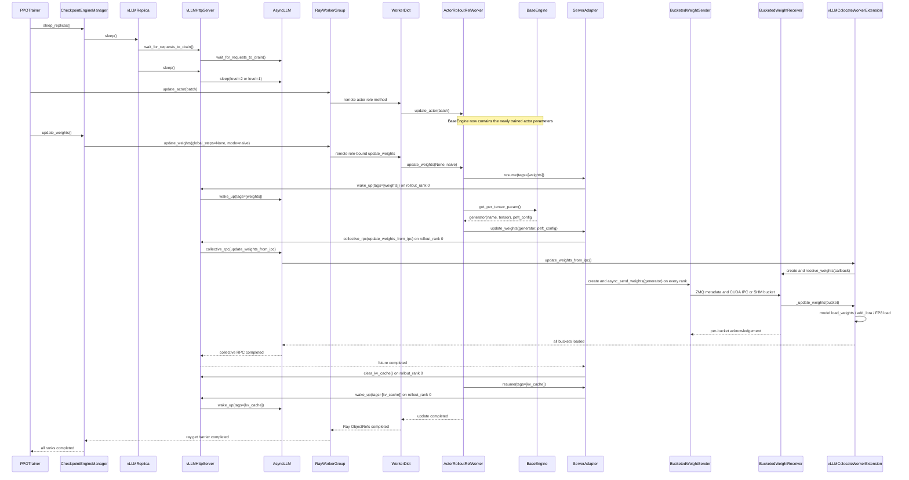

# verl v0.8.0 HYBRID AS-IS 类图

> 代码基线：`/Users/nyp/Documents/verl`，tag/branch `v0.8.0`。
> 分析范围：`verl.trainer.main_ppo_sync`、native async rollout、vLLM、`RolloutMode.HYBRID`。
> 本图聚焦 actor/rollout/ref、可选 critic、请求路由和权重同步主链；Reward、Teacher、GRM 等条件分支不展开。

## 1. 阅读约定

图中的每一个实体名称都是代码中真实存在的类名：

- `TaskRunner`、`WorkerDict`、`GlobalRequestLoadBalancer`、`AgentLoopWorkerTQ` 和运行时的
  `vLLMHttpServer` 是 Ray Actor 类或被动态转换为 Ray Actor 的类；
- `PPOTrainer`、各类 Manager、Replica、WorkerGroup 和 Client 是普通 Python 对象；
- `ActorRolloutRefWorker`、`TrainingWorker`、`ServerAdapter`、`CheckpointEngine` 位于
  `WorkerDict` Ray Actor 进程内，但自身不是独立 Ray Actor；
- `PlacementGroup` 是 Ray 的资源调度类，不是进程；
- GPU resource bundle 的代码表示是 `dict`，不是类，因此不作为类图实体。

关系含义：

| 符号    | 含义                       |     |
| ----- | ------------------------ | --- |
| `*--` | owner 在本进程内创建并持有对象       |     |
| `o--` | 持有引用、ActorHandle、代理或共享对象 |     |
| `..>` | 临时创建、调用依赖或调度约束           |     |
| `<    | --`                      | 类继承 |

## 2. HYBRID AS-IS 全量类图



## 3. 图中最关键的代码事实

### 3.1 `PPOTrainer` 位于 `TaskRunner` Actor 进程内

`TaskRunner.run()` 使用局部变量直接构造 `PPOTrainer`，没有创建 Trainer Actor，也没有把 trainer 保存成
`TaskRunner` 成员。因此图中使用临时依赖 `TaskRunner ..> PPOTrainer`，而不是 ActorHandle 关联。

代码位置：

- [`TaskRunner`](/Users/nyp/Documents/verl/verl/trainer/main_ppo_sync.py:1756)
- [`TaskRunner.run()` 构造 `PPOTrainer`](/Users/nyp/Documents/verl/verl/trainer/main_ppo_sync.py:1818)
- [`PPOTrainer`](/Users/nyp/Documents/verl/verl/trainer/main_ppo_sync.py:501)

### 3.2 多个角色融合为一个 `WorkerDict` Ray Actor

`PPOTrainer.init_workers()` 先按 `RayResourcePool` 聚合 role class，再调用
`create_colocated_worker_cls(class_dict)`。该函数动态声明真实类 `WorkerDict`，在其 `worker_dict` 中直接构造
`ActorRolloutRefWorker` 和可选 critic `TrainingWorker` 普通对象，最后执行 `ray.remote(WorkerDict)`。

因此，同一个 bundle 上的 actor/rollout/ref/critic 角色不是多组独立 Ray Actor：

```text
WorkerDict Ray Actor
├── ActorRolloutRefWorker
│   ├── TrainingWorker：actor
│   ├── TrainingWorker：ref（条件）
│   ├── ServerAdapter：rollout
│   └── ColocatedCheckpointEngine：默认 naive backend
└── TrainingWorker：critic（条件）
```

`RayWorkerGroup.spawn()` 只是为不同角色创建指向同一批 `WorkerDict` ActorHandles 的逻辑代理，不会重新创建
Ray Actor。

代码位置：

- [`PPOTrainer.init_workers()` 聚合角色并创建 WorkerGroup](/Users/nyp/Documents/verl/verl/trainer/main_ppo_sync.py:609)
- [`WorkerDict` 动态类与内部 role 对象](/Users/nyp/Documents/verl/verl/single_controller/ray/base.py:986)
- [`RayWorkerGroup` 每个 PG bundle 创建 Worker Actor](/Users/nyp/Documents/verl/verl/single_controller/ray/base.py:536)
- [`RayWorkerGroup.spawn()` 复用 ActorHandles](/Users/nyp/Documents/verl/verl/single_controller/ray/base.py:716)

### 3.3 HYBRID 不创建 `CheckpointEngineWorker`

`LLMServerManager` 收到非空 `worker_group=self.actor_rollout_wg` 后，为每个 `vLLMReplica` 调用
`init_hybrid()`。`RolloutReplica.init_hybrid()` 只从既有 `RayWorkerGroup.workers` 中切出一段
`WorkerDict` ActorHandles，然后直接启动 server。

`CheckpointEngineWorker` 只在 `init_standalone()`/`init_colocated()` 通过新的 `RayWorkerGroup` 创建；它不是
HYBRID actor/rollout 主链实体，所以没有出现在类图中。HYBRID 的训练模型、`ServerAdapter` 和默认
`ColocatedCheckpointEngine` 都已经位于 `ActorRolloutRefWorker` 所在的 `WorkerDict` 进程内。

代码位置：

- [`LLMServerManager` 选择 `init_hybrid()`](/Users/nyp/Documents/verl/verl/workers/rollout/llm_server.py:297)
- [`RolloutReplica.init_hybrid()` 复用 workers](/Users/nyp/Documents/verl/verl/workers/rollout/replica.py:131)
- [`ActorRolloutRefWorker.init_model()` 创建 rollout 与 checkpoint engine](/Users/nyp/Documents/verl/verl/workers/engine_workers.py:500)

### 3.4 `vLLMHttpServer` 是独立 Ray Actor，但复用相同节点和 GPU

`vLLMReplica` 把真实类 `vLLMHttpServer` 动态转换为 Ray Actor 类。启动时先从既有 `WorkerDict` Actors
查询 node ID 和 accelerator ID，再用硬 `NodeAffinitySchedulingStrategy` 在相同节点创建
`vLLMHttpServer`，并设置相同 GPU 可见性。

因此 HYBRID 是“训练进程与推理进程共享 GPU”，不是把 `vLLMHttpServer` 对象直接放进
`WorkerDict` 进程。`vLLMHttpServer` 内部再创建第三方 `AsyncLLM` 普通对象。

代码位置：

- [`vLLMReplica` 与 `ray.remote(vLLMHttpServer)`](/Users/nyp/Documents/verl/verl/workers/rollout/vllm_rollout/vllm_async_server.py:952)
- [`vLLMReplica.launch_servers()`](/Users/nyp/Documents/verl/verl/workers/rollout/vllm_rollout/vllm_async_server.py:968)
- [`vLLMHttpServer`](/Users/nyp/Documents/verl/verl/workers/rollout/vllm_rollout/vllm_async_server.py:84)

### 3.5 请求链与权重链使用不同引用

请求链：

```text
AgentLoopWorkerTQ
→ LLMServerClient
→ GlobalRequestLoadBalancer ActorHandle
→ vLLMHttpServer ActorHandle
```

权重链在默认 `checkpoint_engine.backend=naive` 时：

```text
CheckpointEngineManager
→ actor_rollout_wg.update_weights()
→ WorkerDict / ActorRolloutRefWorker
→ TrainingWorker 持有的 BaseEngine 导出参数
→ ServerAdapter.update_weights()
├─控制面→ vLLMHttpServer → AsyncLLM → vLLMColocateWorkerExtension
└─数据面→ BucketedWeightSender → BucketedWeightReceiver → vLLMColocateWorkerExtension
```

`GlobalRequestLoadBalancer` 不参与权重同步；`CheckpointEngineManager` 不参与请求路由。

代码位置：

- [`LLMServerClient` 与 `GlobalRequestLoadBalancer`](/Users/nyp/Documents/verl/verl/workers/rollout/llm_server.py:44)
- [`AgentLoopManagerTQ` 与 `AgentLoopWorkerTQ`](/Users/nyp/Documents/verl/verl/trainer/main_ppo_sync.py:297)
- [`CheckpointEngineManager`](/Users/nyp/Documents/verl/verl/checkpoint_engine/base.py:345)
- [`ServerAdapter`](/Users/nyp/Documents/verl/verl/workers/rollout/vllm_rollout/vllm_rollout.py:61)

## 4. HYBRID 参数同步机制

### 4.1 范围与结论

本节分析 `verl v0.8.0` 在下列条件下执行的原生参数同步链：

- `RolloutMode.HYBRID` 让训练 Worker 与 vLLM 推理进程共用同一组 GPU；
- 默认配置把 `checkpoint_engine.backend` 设置为 `naive`；
- `PPOTrainer` 使用 `main_ppo_sync.py` 的同步训练循环。

默认配置见 [`rollout.yaml:263-270`](/Users/nyp/Documents/verl/verl/trainer/config/rollout/rollout.yaml:263)。

该链路具有四个关键事实：

1. `PPOTrainer` 决定参数同步时机，规划中的 `GroupScheduler`、`LLMServerManager` 和
   `GlobalRequestLoadBalancer` 都不决定参数同步时机。
2. `CheckpointEngineManager` 在 `naive` 分支中直接调用
   `RayWorkerGroup.update_weights()`；`CheckpointEngineManager` 不创建
   `CheckpointEngineWorker`，也不构建临时 rollout `RayWorkerGroup`。
3. `ActorRolloutRefWorker` 从 `TrainingWorker.engine` 导出参数，并把参数生成器交给
   `ServerAdapter`。`ServerAdapter` 使用 ZMQ 协议交换控制信息和张量元数据，并优先使用 CUDA IPC
   暴露 GPU bucket；不支持设备 IPC 时，`ServerAdapter` 使用共享内存作为回退通道。
4. `PPOTrainer` 等待全部训练 rank 完成参数装载和 KV cache 恢复之后，才会进入下一轮 rollout。

上述第二个事实直接来自
[`CheckpointEngineManager.update_weights():470-480`](/Users/nyp/Documents/verl/verl/checkpoint_engine/base.py:470)。
`CheckpointEngineManager` 只在非 `naive` 分支中创建临时 rollout `RayWorkerGroup`、构建进程组并调度
`CheckpointEngineWorker`，相关分支位于
[`base.py:482-514`](/Users/nyp/Documents/verl/verl/checkpoint_engine/base.py:482)。

### 4.2 参与实体及其职责

下表把每条职责写成“主语—动作—宾语”，并区分常驻实体与单次同步期间创建的临时实体。

| 主语 | 动作 | 宾语 | 运行位置与代码依据 |
|---|---|---|---|
| `PPOTrainer` | 创建并持有 | `CheckpointEngineManager` | `TaskRunner` Ray Actor 进程；[`main_ppo_sync.py:730-740`](/Users/nyp/Documents/verl/verl/trainer/main_ppo_sync.py:730) |
| `PPOTrainer` | 调用并等待 | `CheckpointEngineManager.update_weights()` | `TaskRunner` Ray Actor 进程；[`main_ppo_sync.py:1604-1606`](/Users/nyp/Documents/verl/verl/trainer/main_ppo_sync.py:1604)、[`main_ppo_sync.py:1649-1651`](/Users/nyp/Documents/verl/verl/trainer/main_ppo_sync.py:1649) |
| `CheckpointEngineManager` | 持有并调用 | actor/rollout `RayWorkerGroup` 代理 | `TaskRunner` Ray Actor 进程；[`checkpoint_engine/base.py:374-385`](/Users/nyp/Documents/verl/verl/checkpoint_engine/base.py:374)、[`base.py:477-480`](/Users/nyp/Documents/verl/verl/checkpoint_engine/base.py:477) |
| `RayWorkerGroup` | 把一次方法调用分发给 | 全部 `WorkerDict` ActorHandles | `TaskRunner` Ray Actor 进程中的普通代理；[`ray/base.py:48-56`](/Users/nyp/Documents/verl/verl/single_controller/ray/base.py:48)、[`ray/base.py:780-797`](/Users/nyp/Documents/verl/verl/single_controller/ray/base.py:780) |
| `WorkerDict` | 把绑定后的角色方法委托给 | 内部 `ActorRolloutRefWorker` | 每个训练 rank 对应的 Ray Actor 进程；[`ray/base.py:1006-1025`](/Users/nyp/Documents/verl/verl/single_controller/ray/base.py:1006) |
| `ActorRolloutRefWorker` | 持有 | actor `TrainingWorker`、`ServerAdapter` 和 `ColocatedCheckpointEngine` | `WorkerDict` 进程；[`engine_workers.py:434-452`](/Users/nyp/Documents/verl/verl/workers/engine_workers.py:434)、[`engine_workers.py:585-629`](/Users/nyp/Documents/verl/verl/workers/engine_workers.py:585) |
| `TrainingWorker` | 持有 | 具体 `BaseEngine` 实现 | `WorkerDict` 进程；[`engine_workers.py:76-134`](/Users/nyp/Documents/verl/verl/workers/engine_workers.py:76) |
| `BaseEngine` | 生成 | `(参数名, 参数张量)` 迭代流和可选 `peft_config` | `WorkerDict` 进程的训练 GPU；接口见 [`engine/base.py:150-159`](/Users/nyp/Documents/verl/verl/workers/engine/base.py:150) |
| `ActorRolloutRefWorker` | 调用 | `BaseEngine.get_per_tensor_param()` 和 `ServerAdapter.update_weights()` | 每个训练 rank 的 `WorkerDict` 进程；[`engine_workers.py:710-731`](/Users/nyp/Documents/verl/verl/workers/engine_workers.py:710) |
| `ServerAdapter` | 取得并持有 | 本 replica 的 `vLLMHttpServer` ActorHandle | 只有 `rollout_rank == 0` 的 adapter 取得 handle；[`vllm_rollout.py:119-153`](/Users/nyp/Documents/verl/verl/workers/rollout/vllm_rollout/vllm_rollout.py:119) |
| `ServerAdapter` | 创建并驱动 | `BucketedWeightSender` | 每个 rollout rank 的 `WorkerDict` 进程；[`vllm_rollout.py:169-191`](/Users/nyp/Documents/verl/verl/workers/rollout/vllm_rollout/vllm_rollout.py:169) |
| `vLLMHttpServer` | 把 collective RPC 转发给 | `AsyncLLM` | 独立的 server Ray Actor 进程；[`vllm_async_server.py:191-203`](/Users/nyp/Documents/verl/verl/workers/rollout/vllm_rollout/vllm_async_server.py:191) |
| `AsyncLLM` | 在 vLLM worker 中调用 | `vLLMColocateWorkerExtension.update_weights_from_ipc()` | vLLM 推理进程；verl 注入的 extension 见 [`vllm_rollout/utils.py:106-118`](/Users/nyp/Documents/verl/verl/workers/rollout/vllm_rollout/utils.py:106) |
| `vLLMColocateWorkerExtension` | 创建并驱动 | `BucketedWeightReceiver` | vLLM worker 进程；[`vllm_rollout/utils.py:197-241`](/Users/nyp/Documents/verl/verl/workers/rollout/vllm_rollout/utils.py:197) |
| `BucketedWeightSender` | 把参数张量写入并发布 | CUDA IPC GPU bucket 或共享内存 bucket | 单次同步期间创建；[`bucketed_weight_transfer.py:74-159`](/Users/nyp/Documents/verl/verl/workers/rollout/vllm_rollout/bucketed_weight_transfer.py:74) |
| `BucketedWeightReceiver` | 重建张量视图并回调 | `vLLMColocateWorkerExtension._update_weights()` | 单次同步期间创建；[`bucketed_weight_transfer.py:233-294`](/Users/nyp/Documents/verl/verl/workers/rollout/vllm_rollout/bucketed_weight_transfer.py:233) |
| `vLLMColocateWorkerExtension` | 把收到的权重装载到 | vLLM 内部模型 | vLLM worker 进程；标准权重、LoRA 和 FP8 分支见 [`vllm_rollout/utils.py:262-288`](/Users/nyp/Documents/verl/verl/workers/rollout/vllm_rollout/utils.py:262) |
| `vLLMReplica` | 等待请求排空并休眠 | 该 replica 的全部 `vLLMHttpServer` | `TaskRunner` 进程中的普通对象；[`vllm_async_server.py:1056-1060`](/Users/nyp/Documents/verl/verl/workers/rollout/vllm_rollout/vllm_async_server.py:1056) |

`ColocatedCheckpointEngine` 是一个特殊实体。`ActorRolloutRefWorker.init_model()` 根据 `naive` backend
创建并持有 `ColocatedCheckpointEngine`，见
[`engine_workers.py:618-629`](/Users/nyp/Documents/verl/verl/workers/engine_workers.py:618)。但是，当前
`naive` 执行路径没有调用 `ColocatedCheckpointEngine.send_weights()` 和
`ColocatedCheckpointEngine.receive_weights()`；当前执行路径直接调用 `BaseEngine` 和 `ServerAdapter`。
因此，本节把 `ColocatedCheckpointEngine` 标记为“已实例化但未进入本次数据通路”，而不是把它误画成权重中继。

### 4.3 参数同步的三个原生触发点

| 触发点 | 主语、动作与宾语 | 参数来源 | 代码依据 |
|---|---|---|---|
| checkpoint 加载之后 | `PPOTrainer` 加载 checkpoint，然后调用 `CheckpointEngineManager.update_weights()`，把 checkpoint 恢复后的 actor 参数同步给 rollout | checkpoint 恢复后的 actor | [`main_ppo_sync.py:1604-1606`](/Users/nyp/Documents/verl/verl/trainer/main_ppo_sync.py:1604) |
| 每轮 actor 更新之后 | `PPOTrainer.step()` 更新 actor；`PPOTrainer.fit()` 在 `step()` 返回后调用 `CheckpointEngineManager.update_weights()`，把本轮新参数同步给 rollout | 本轮 `_update_actor()` 之后的 actor | [`main_ppo_sync.py:1748-1753`](/Users/nyp/Documents/verl/verl/trainer/main_ppo_sync.py:1748)、[`main_ppo_sync.py:1637-1651`](/Users/nyp/Documents/verl/verl/trainer/main_ppo_sync.py:1637) |
| 共置 reward validation 之后 | `PPOTrainer` 先休眠 rollout，再运行共置 reward 计算，最后调用 `CheckpointEngineManager.update_weights()`，恢复 rollout 权重和 KV cache 可用状态 | 当前 actor | [`main_ppo_sync.py:873-890`](/Users/nyp/Documents/verl/verl/trainer/main_ppo_sync.py:873) |

`PPOTrainer.step()` 在训练前先从 `ReplayBuffer` 取得本轮完整 batch，然后调用
`CheckpointEngineManager.sleep_replicas()`，见
[`main_ppo_sync.py:1706-1712`](/Users/nyp/Documents/verl/verl/trainer/main_ppo_sync.py:1706)。
`CheckpointEngineManager` 随后调用每个 `vLLMReplica.sleep()`，见
[`checkpoint_engine/base.py:431-434`](/Users/nyp/Documents/verl/verl/checkpoint_engine/base.py:431)。
`vLLMReplica` 先让第一个 `vLLMHttpServer` 等待请求排空，再让全部 server 进入 sleep，见
[`vllm_async_server.py:1056-1060`](/Users/nyp/Documents/verl/verl/workers/rollout/vllm_rollout/vllm_async_server.py:1056)。
`vLLMHttpServer` 在 HYBRID 模式下调用 `AsyncLLM.sleep()`；全量权重通常使用 level 2，LoRA/NPU 分支使用
level 1，见 [`vllm_async_server.py:625-634`](/Users/nyp/Documents/verl/verl/workers/rollout/vllm_rollout/vllm_async_server.py:625)
和 [`vllm_async_server.py:932-949`](/Users/nyp/Documents/verl/verl/workers/rollout/vllm_rollout/vllm_async_server.py:932)。

### 4.4 实体调用关系

下图只使用代码中真实存在的类名。实线表示控制调用，粗线表示参数数据流，虚线表示对象虽然存在但默认
`naive` 分支没有调用它。

```mermaid
flowchart LR
    PPOTrainer[PPOTrainer]
    CheckpointEngineManager[CheckpointEngineManager]
    RayWorkerGroup[RayWorkerGroup]
    WorkerDict[WorkerDict]
    ActorRolloutRefWorker[ActorRolloutRefWorker]
    TrainingWorker[TrainingWorker]
    BaseEngine[BaseEngine]
    ServerAdapter[ServerAdapter]
    vLLMHttpServer[vLLMHttpServer]
    AsyncLLM[AsyncLLM]
    vLLMColocateWorkerExtension[vLLMColocateWorkerExtension]
    BucketedWeightSender[BucketedWeightSender]
    BucketedWeightReceiver[BucketedWeightReceiver]
    ColocatedCheckpointEngine[ColocatedCheckpointEngine]

    PPOTrainer -->|update_weights| CheckpointEngineManager
    CheckpointEngineManager -->|update_weights mode=naive| RayWorkerGroup
    RayWorkerGroup -->|remote calls| WorkerDict
    WorkerDict -->|delegates role method| ActorRolloutRefWorker
    ActorRolloutRefWorker -->|owns actor| TrainingWorker
    TrainingWorker -->|owns engine| BaseEngine
    ActorRolloutRefWorker -->|get_per_tensor_param| BaseEngine
    ActorRolloutRefWorker -->|resume and update_weights| ServerAdapter
    ServerAdapter -->|wake_up collective_rpc clear_kv_cache| vLLMHttpServer
    vLLMHttpServer -->|wake_up and collective_rpc| AsyncLLM
    AsyncLLM -->|update_weights_from_ipc| vLLMColocateWorkerExtension

    BaseEngine ==>|parameter generator| BucketedWeightSender
    ServerAdapter -->|creates| BucketedWeightSender
    BucketedWeightSender ==>|ZMQ metadata plus CUDA IPC or SHM tensors| BucketedWeightReceiver
    vLLMColocateWorkerExtension -->|creates| BucketedWeightReceiver
    BucketedWeightReceiver ==>|bucket callback| vLLMColocateWorkerExtension

    ActorRolloutRefWorker -.->|instantiates but naive path bypasses| ColocatedCheckpointEngine
```



调用关系对应以下代码事实：

1. `CheckpointEngineManager` 调用 `RayWorkerGroup.update_weights(global_steps=None, mode="naive")`，并用
   `ray.get()` 等待全部远程结果，见
   [`checkpoint_engine/base.py:470-480`](/Users/nyp/Documents/verl/verl/checkpoint_engine/base.py:470)。
2. `RayWorkerGroup` 生成动态代理方法，并把该方法调度到每个 `WorkerDict` ActorHandle，见
   [`ray/base.py:48-56`](/Users/nyp/Documents/verl/verl/single_controller/ray/base.py:48) 和
   [`ray/base.py:780-797`](/Users/nyp/Documents/verl/verl/single_controller/ray/base.py:780)。
3. `WorkerDict` 把带角色前缀的方法绑定到内部 `ActorRolloutRefWorker`，见
   [`ray/base.py:1006-1025`](/Users/nyp/Documents/verl/verl/single_controller/ray/base.py:1006)。
4. `ActorRolloutRefWorker` 调用 `self.actor.engine.get_per_tensor_param()`，然后把生成器作为
   `weights` 宾语传给 `self.rollout.update_weights()`，见
   [`engine_workers.py:710-731`](/Users/nyp/Documents/verl/verl/workers/engine_workers.py:710)。
5. `ServerAdapter` 让 rank 0 adapter 调用 `vLLMHttpServer.collective_rpc()`，同时让每个 adapter rank
   创建 `BucketedWeightSender` 并发送本 rank 导出的参数流，见
   [`vllm_rollout.py:169-197`](/Users/nyp/Documents/verl/verl/workers/rollout/vllm_rollout/vllm_rollout.py:169)。
6. `vLLMHttpServer` 把 `update_weights_from_ipc` collective RPC 转发给 `AsyncLLM`，见
   [`vllm_async_server.py:191-203`](/Users/nyp/Documents/verl/verl/workers/rollout/vllm_rollout/vllm_async_server.py:191)。
7. `vLLMColocateWorkerExtension` 创建 `BucketedWeightReceiver`，并让 receiver 按 bucket 回调
   `_update_weights()`，见
   [`vllm_rollout/utils.py:197-241`](/Users/nyp/Documents/verl/verl/workers/rollout/vllm_rollout/utils.py:197)。

### 4.5 一轮完整参数同步时序

下图从“本轮 rollout batch 已经取完”开始，到“下一轮 rollout 可以使用新权重”结束。图中的每个参与者名称
都是实际类名。



这段时序包含以下顺序约束：

1. `PPOTrainer` 先让 `vLLMReplica` 排空请求并释放推理显存，然后让 actor 使用同一组 GPU 执行训练。
2. `PPOTrainer` 完成 `_update_actor()` 之后才调用 `CheckpointEngineManager.update_weights()`，所以
   `BaseEngine` 导出的参数属于刚完成的 actor 更新。
3. `ActorRolloutRefWorker` 先让 `ServerAdapter` 唤醒 vLLM 的 weights 内存，再让 `BaseEngine` 导出参数。
4. rank 0 `ServerAdapter` 先启动 `update_weights_from_ipc` collective RPC，让接收端进入等待状态；每个
   `ServerAdapter` rank 随后启动 `BucketedWeightSender`，从而避免发送端在没有接收端时发送参数。
5. `BucketedWeightSender` 收到每个 bucket 的确认之后才复用通信 buffer；`BucketedWeightReceiver` 在模型完成
   本 bucket 的装载之后才返回确认。
6. `ServerAdapter` 等待 collective RPC 完成之后清理 prefix/KV cache；`ActorRolloutRefWorker` 最后恢复
   KV cache。
7. `CheckpointEngineManager` 等待全部 `WorkerDict` rank 返回之后才把控制权交还给 `PPOTrainer`。

### 4.6 控制面与数据面的流转

#### 4.6.1 控制面

| 主语 | 控制动作 | 宾语 | 承载机制 |
|---|---|---|---|
| `PPOTrainer` | 请求同步并等待完成 | `CheckpointEngineManager` | 本地 Python 调用 |
| `CheckpointEngineManager` | 向全部训练 rank 分发 `update_weights` | `RayWorkerGroup` | 本地代理调用加 `ray.get()` barrier |
| `RayWorkerGroup` | 发送远程方法调用 | `WorkerDict` | Ray Actor RPC |
| `WorkerDict` | 委托角色方法 | `ActorRolloutRefWorker` | Actor 进程内 Python 调用 |
| rank 0 `ServerAdapter` | 唤醒 weights、启动 collective RPC、清理 KV cache、唤醒 KV cache | `vLLMHttpServer` | Ray Actor RPC |
| `vLLMHttpServer` | 转发 collective RPC 和内存生命周期操作 | `AsyncLLM` | server 进程内 Python/async 调用 |
| `AsyncLLM` | 调用参数接收入口 | `vLLMColocateWorkerExtension` | vLLM collective RPC |

`GlobalRequestLoadBalancer` 不出现在这张表中，因为 `ServerAdapter` 通过命名 Ray Actor 查找
`vLLMHttpServer`，而不是通过 LB 查找 server。`ServerAdapter._ensure_server_handle()` 的查找逻辑位于
[`vllm_rollout.py:119-127`](/Users/nyp/Documents/verl/verl/workers/rollout/vllm_rollout/vllm_rollout.py:119)。

#### 4.6.2 数据面

| 数据 | 主语 | 动作 | 宾语 | 代码依据 |
|---|---|---|---|---|
| `(name, tensor)` 参数流 | `BaseEngine` | 逐 tensor 生成 | `ActorRolloutRefWorker` | [`engine/base.py:150-159`](/Users/nyp/Documents/verl/verl/workers/engine/base.py:150) |
| 参数流 | `ActorRolloutRefWorker` | 原样传入 | `ServerAdapter.update_weights()` | [`engine_workers.py:710-731`](/Users/nyp/Documents/verl/verl/workers/engine_workers.py:710) |
| 参数字节 | `BucketedWeightSender` | 把 tensor 复制到固定大小的 GPU/SHM bucket | 通信 buffer | [`bucketed_weight_transfer.py:120-157`](/Users/nyp/Documents/verl/verl/workers/rollout/vllm_rollout/bucketed_weight_transfer.py:120) |
| CUDA IPC handle 或 SHM 名称 | `BucketedWeightSender` | 通过 ZMQ 发送 | `BucketedWeightReceiver` | [`bucketed_weight_transfer.py:172-190`](/Users/nyp/Documents/verl/verl/workers/rollout/vllm_rollout/bucketed_weight_transfer.py:172)、[`bucketed_weight_transfer.py:301-315`](/Users/nyp/Documents/verl/verl/workers/rollout/vllm_rollout/bucketed_weight_transfer.py:301) |
| tensor 名称、shape、dtype、offset | `BucketedWeightSender` | 通过 ZMQ 按 bucket 发送 | `BucketedWeightReceiver` | [`bucketed_weight_transfer.py:128-157`](/Users/nyp/Documents/verl/verl/workers/rollout/vllm_rollout/bucketed_weight_transfer.py:128) |
| 重建后的 tensor 视图 | `BucketedWeightReceiver` | 按 bucket 回调 | `vLLMColocateWorkerExtension` | [`bucketed_weight_transfer.py:261-292`](/Users/nyp/Documents/verl/verl/workers/rollout/vllm_rollout/bucketed_weight_transfer.py:261) |
| 标准权重、LoRA 或 FP8 权重 | `vLLMColocateWorkerExtension` | 装载 | vLLM 内部模型 | [`vllm_rollout/utils.py:262-288`](/Users/nyp/Documents/verl/verl/workers/rollout/vllm_rollout/utils.py:262) |

CUDA IPC 路径不是“训练参数张量直接成为 vLLM 参数张量”。`BucketedWeightSender` 先把训练参数复制到
GPU bucket，`BucketedWeightReceiver` 再根据 IPC handle 重建 bucket 视图，最后
`vLLMColocateWorkerExtension` 调用 vLLM 的权重装载逻辑。ZMQ 传输的是握手、handle 和 tensor 元数据；
CUDA IPC 暴露的是 GPU bucket。设备不支持 IPC 时，sender 和 receiver 使用 POSIX 共享内存，并由
receiver 把 tensor 复制到目标设备，见
[`bucketed_weight_transfer.py:172-188`](/Users/nyp/Documents/verl/verl/workers/rollout/vllm_rollout/bucketed_weight_transfer.py:172)
和 [`bucketed_weight_transfer.py:301-313`](/Users/nyp/Documents/verl/verl/workers/rollout/vllm_rollout/bucketed_weight_transfer.py:301)。

### 4.7 完成条件、版本语义与缓存一致性

#### 4.7.1 完成条件

`ServerAdapter` 只有在 `BucketedWeightSender` 完成全部 bucket 发送、vLLM collective RPC 返回、rank 0
清理 KV cache 之后，才会从 `update_weights()` 返回，见
[`vllm_rollout.py:176-197`](/Users/nyp/Documents/verl/verl/workers/rollout/vllm_rollout/vllm_rollout.py:176)。
`ActorRolloutRefWorker` 只有在 `ServerAdapter` 完成参数装载并恢复 KV cache 之后，才会从
`update_weights()` 返回，见
[`engine_workers.py:729-745`](/Users/nyp/Documents/verl/verl/workers/engine_workers.py:729)。
`CheckpointEngineManager` 只有在 `ray.get()` 收齐全部 `WorkerDict` rank 的返回值之后，才会从
`update_weights()` 返回，见
[`checkpoint_engine/base.py:477-480`](/Users/nyp/Documents/verl/verl/checkpoint_engine/base.py:477)。

因此，下一轮 rollout 不会看到“部分 rank 已经装载新权重、部分 rank 仍然装载旧权重”的中间状态。

#### 4.7.2 版本语义

`ServerAdapter.update_weights()` 支持把非空 `global_steps` 写入 `vLLMHttpServer`，见
[`vllm_rollout.py:193-197`](/Users/nyp/Documents/verl/verl/workers/rollout/vllm_rollout/vllm_rollout.py:193)。
但是，`main_ppo_sync.py` 的三个调用点都使用 `CheckpointEngineManager.update_weights()` 的默认参数，
因此它们向下传递的 `global_steps` 是 `None`。`ServerAdapter` 不会在这些调用中执行
`vLLMHttpServer.set_global_steps()`。

HYBRID 同步训练依靠以下顺序关系保证版本正确，而不是依靠显式版本号选择权重：

```text
本轮 rollout 完成
→ vLLM 请求排空并 sleep
→ actor 完成本轮 update
→ 全部 rank 阻塞式装载该次 update 产生的参数
→ KV cache 清理并恢复
→ 下一轮 rollout 开始
```

换言之，`PPOTrainer` 的单控制器顺序和 `ray.get()` barrier 共同保证“下一轮 rollout 使用最近一次已完成
actor update 的权重”。`vLLMHttpServer.global_steps` 在该默认路径中不是同步正确性的判据。

#### 4.7.3 KV cache 与 prefix cache

权重变化会让旧权重生成的 KV/prefix cache 失效。`ServerAdapter` 在参数装载结束后调用
`vLLMHttpServer.clear_kv_cache()`，见
[`vllm_rollout.py:190-197`](/Users/nyp/Documents/verl/verl/workers/rollout/vllm_rollout/vllm_rollout.py:190)。
`vLLMHttpServer` 把该调用转换为 `AsyncLLM.reset_prefix_cache()`，见
[`vllm_async_server.py:636-642`](/Users/nyp/Documents/verl/verl/workers/rollout/vllm_rollout/vllm_async_server.py:636)。
`ActorRolloutRefWorker` 最后让 `ServerAdapter` 恢复 KV cache，见
[`engine_workers.py:740-742`](/Users/nyp/Documents/verl/verl/workers/engine_workers.py:740)。

### 4.8 不参与默认 HYBRID 参数数据流的实体

| 实体 | 结论 | 代码依据 |
|---|---|---|
| `ColocatedCheckpointEngine` | `ActorRolloutRefWorker` 创建该对象，但 `naive` 分支没有调用该对象的 `send_weights()` 或 `receive_weights()` | 创建：[`engine_workers.py:618-629`](/Users/nyp/Documents/verl/verl/workers/engine_workers.py:618)；naive 分支：[`engine_workers.py:693-731`](/Users/nyp/Documents/verl/verl/workers/engine_workers.py:693) |
| `CheckpointEngineWorker` | HYBRID naive 链不创建该 Worker；非 naive 分支才把 rollout workers 组织为临时 `RayWorkerGroup` | 定义：[`checkpoint_engine/base.py:278`](/Users/nyp/Documents/verl/verl/checkpoint_engine/base.py:278)；非 naive 分支：[`checkpoint_engine/base.py:482-514`](/Users/nyp/Documents/verl/verl/checkpoint_engine/base.py:482) |
| `LLMServerManager` | `PPOTrainer` 使用该对象初始化 replica 和 server，但参数同步调用不经过该对象 | 初始化 manager：[`main_ppo_sync.py:711-714`](/Users/nyp/Documents/verl/verl/trainer/main_ppo_sync.py:711)；同步入口：[`main_ppo_sync.py:1649-1651`](/Users/nyp/Documents/verl/verl/trainer/main_ppo_sync.py:1649) |
| `GlobalRequestLoadBalancer` | 请求生成链使用该 Actor，参数同步链不使用该 Actor | `ServerAdapter` 直接获取 server ActorHandle：[`vllm_rollout.py:119-153`](/Users/nyp/Documents/verl/verl/workers/rollout/vllm_rollout/vllm_rollout.py:119) |
| `vLLMReplica` | 该对象参与请求排空和 sleep 生命周期管理，但权重字节不经过该对象；`ServerAdapter` 直接执行后续 wake-up | sleep：[`vllm_async_server.py:1056-1060`](/Users/nyp/Documents/verl/verl/workers/rollout/vllm_rollout/vllm_async_server.py:1056)；wake-up：[`vllm_rollout.py:155-162`](/Users/nyp/Documents/verl/verl/workers/rollout/vllm_rollout/vllm_rollout.py:155)；实际发送：[`vllm_rollout.py:169-188`](/Users/nyp/Documents/verl/verl/workers/rollout/vllm_rollout/vllm_rollout.py:169) |

## 5. 类名校验表

| 类名 | 代码定义 | HYBRID 中的运行形态 |
|---|---|---|
| `TaskRunner` | `verl/trainer/main_ppo_sync.py:1756` | Ray Actor |
| `PPOTrainer` | `verl/trainer/main_ppo_sync.py:501` | TaskRunner 进程内普通对象 |
| `ResourcePoolManager` | `verl/single_controller/ray/base.py:182` | TaskRunner 进程内普通对象 |
| `RayResourcePool` | `verl/single_controller/ray/base.py:112` | 普通对象，持有 PG handles |
| `PlacementGroup` | Ray 类 | 资源调度对象 |
| `RayWorkerGroup` | `verl/single_controller/ray/base.py:416` | 普通代理对象，持有 ActorHandles |
| `WorkerDict` | `verl/single_controller/ray/base.py:1006` | 动态生成的 Ray Actor 类 |
| `ActorRolloutRefWorker` | `verl/workers/engine_workers.py:434` | WorkerDict 内普通对象 |
| `TrainingWorker` | `verl/workers/engine_workers.py:76` | WorkerDict 内普通对象 |
| `BaseEngine` | `verl/workers/engine/base.py:29` | TrainingWorker 持有的具体 engine 基类 |
| `BaseRollout` | `verl/workers/rollout/base.py:29` | rollout adapter 抽象基类 |
| `ServerAdapter` | `verl/workers/rollout/vllm_rollout/vllm_rollout.py:61` | WorkerDict 内普通对象 |
| `BucketedWeightSender` | `verl/workers/rollout/vllm_rollout/bucketed_weight_transfer.py:74` | 单次参数同步期间在 WorkerDict 内创建的普通对象 |
| `BucketedWeightReceiver` | `verl/workers/rollout/vllm_rollout/bucketed_weight_transfer.py:233` | 单次参数同步期间在 vLLM worker 内创建的普通对象 |
| `vLLMColocateWorkerExtension` | `verl/workers/rollout/vllm_rollout/utils.py:106` | 注入 vLLM worker 的 extension 类 |
| `CheckpointEngine` | `verl/checkpoint_engine/base.py:96` | checkpoint backend 抽象基类 |
| `ColocatedCheckpointEngine` | `verl/checkpoint_engine/base.py:221` | 默认 naive backend 普通对象 |
| `LLMServerManager` | `verl/workers/rollout/llm_server.py:223` | TaskRunner 进程内普通对象 |
| `RolloutReplica` | `verl/workers/rollout/replica.py:70` | Replica 抽象基类 |
| `vLLMReplica` | `verl/workers/rollout/vllm_rollout/vllm_async_server.py:952` | TaskRunner 进程内普通对象 |
| `vLLMHttpServer` | `verl/workers/rollout/vllm_rollout/vllm_async_server.py:84` | 运行时动态转换为 Ray Actor |
| `AsyncLLM` | vLLM 类 | vLLMHttpServer Actor 内普通对象 |
| `GlobalRequestLoadBalancer` | `verl/workers/rollout/llm_server.py:44` | Ray Actor |
| `LLMServerClient` | `verl/workers/rollout/llm_server.py:146` | 普通对象及序列化副本 |
| `AgentLoopManager` | `verl/experimental/agent_loop/agent_loop.py:1044` | TaskRunner 进程内普通对象 |
| `AgentLoopManagerTQ` | `verl/trainer/main_ppo_sync.py:452` | 默认具体 Manager 普通对象 |
| `AgentLoopWorker` | `verl/experimental/agent_loop/agent_loop.py:393` | AgentLoopWorkerTQ 基类 |
| `AgentLoopWorkerTQ` | `verl/trainer/main_ppo_sync.py:298` | Ray Actor |
| `ReplayBuffer` | `verl/trainer/main_ppo_sync.py:194` | TaskRunner 进程内普通对象 |
| `CheckpointEngineManager` | `verl/checkpoint_engine/base.py:345` | TaskRunner 进程内普通对象 |
