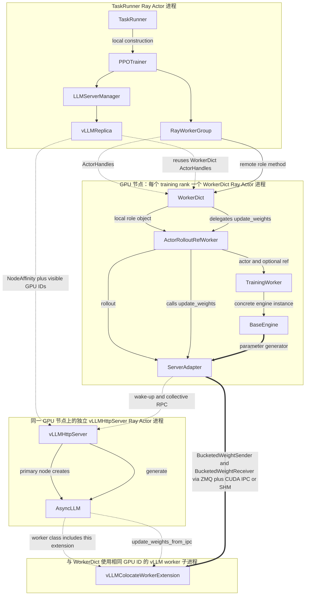

# verl v0.8.0 HYBRID AS-IS 简化部署视图

> 代码基线：`/Users/nyp/Documents/verl`，tag/branch `v0.8.0`。
> 分析范围：`main_ppo_sync.py`、native async rollout、vLLM、`RolloutMode.HYBRID`。
> 本文只保留 rollout 和参数同步直接相关的进程、Ray Actor 与关键普通对象。

## 1. 图例

图中的每个实体框都使用代码中真实存在的类名。部署区域表示进程位置，不是代码实体。

| 线型 | 含义 |
|---|---|
| `-->` | 创建、持有或控制调用 |
| `-.->` | ActorHandle、代理或部署绑定关系 |
| `==>` | rollout 请求或权重数据流 |

## 2. HYBRID AS-IS 部署图



## 3. 进程与实体说明

| 部署位置 | 实体类 | 运行形态 | 作用 |
|---|---|---|---|
| controller | `TaskRunner` | Ray Actor | 承载本任务 single controller |
| `TaskRunner` 进程 | `PPOTrainer` | 普通对象 | 决定 rollout、训练和参数同步时机 |
| `TaskRunner` 进程 | `RayWorkerGroup` | 普通代理对象 | 持有并调用 `WorkerDict` ActorHandles |
| `TaskRunner` 进程 | `LLMServerManager`、`vLLMReplica` | 普通对象 | 复用 training WorkerHandles，并创建 server Actors |
| `TaskRunner` 进程 | `CheckpointEngineManager` | 普通对象 | 编排 sleep 和参数同步 |
| training GPU | `WorkerDict` | 每个 training rank 一个 Ray Actor | Ray GPU resource owner |
| `WorkerDict` 进程 | `ActorRolloutRefWorker`、`TrainingWorker`、`BaseEngine`、`ServerAdapter` | 普通对象 | 训练 actor，并把权重注入 vLLM |
| `WorkerDict` 进程 | `ColocatedCheckpointEngine` | 普通对象 | 默认 `naive` backend 会创建该对象，但实际直传路径绕过该对象 |
| inference GPU 节点 | `vLLMHttpServer` | 独立 Ray Actor | 接收生成请求，并控制 vLLM runtime |
| `vLLMHttpServer` 主节点进程 | `AsyncLLM` | vLLM 普通对象 | 调度 vLLM 推理和 collective RPC |
| vLLM worker 子进程 | `vLLMColocateWorkerExtension` | vLLM worker extension | 接收并装载新权重 |
| CPU 节点 | `GlobalRequestLoadBalancer` | Ray Actor | 保存 server handles，并返回请求应使用的 server |
| CPU 节点 | `AgentLoopWorkerTQ` | Ray Actor | 执行 sample/agent loop |
| `AgentLoopWorkerTQ` 进程 | `LLMServerClient` | 普通对象 | 调用 LB，并向选中的 server 发送生成请求 |

## 4. Rollout 请求链

```text
AgentLoopWorkerTQ
→ LLMServerClient
→ GlobalRequestLoadBalancer.acquire_server()
← vLLMHttpServer ActorHandle
→ vLLMHttpServer.generate.remote()
→ AsyncLLM
→ vLLM worker
```

`GlobalRequestLoadBalancer` 只选择 server 并返回 ActorHandle。`LLMServerClient` 才是
`vLLMHttpServer.generate.remote()` 的调用主体。

代码依据：

- `GlobalRequestLoadBalancer` 和 `LLMServerClient`：
  [`llm_server.py:43-220`](/Users/nyp/Documents/verl/verl/workers/rollout/llm_server.py:43)；
- `AgentLoopWorkerTQ`：
  [`main_ppo_sync.py:297-449`](/Users/nyp/Documents/verl/verl/trainer/main_ppo_sync.py:297)；
- `vLLMHttpServer`：
  [`vllm_async_server.py:84-205`](/Users/nyp/Documents/verl/verl/workers/rollout/vllm_rollout/vllm_async_server.py:84)。

## 5. 参数同步链

参数同步包含控制链和数据链。

控制链：

```text
PPOTrainer
→ CheckpointEngineManager
→ RayWorkerGroup
→ WorkerDict
→ ActorRolloutRefWorker
→ ServerAdapter
→ vLLMHttpServer
→ AsyncLLM
→ vLLMColocateWorkerExtension
```

数据链：

```text
BaseEngine.get_per_tensor_param()
→ ServerAdapter
→ BucketedWeightSender
→ ZMQ + CUDA IPC；不支持 IPC 时使用 SHM
→ BucketedWeightReceiver
→ vLLMColocateWorkerExtension
→ vLLM 模型
```

`CheckpointEngineManager` 在默认 `naive` 分支中直接调用 trainer `RayWorkerGroup.update_weights()`。
`ActorRolloutRefWorker` 随后从 `BaseEngine` 导出参数并调用 `ServerAdapter.update_weights()`。因此
`ColocatedCheckpointEngine` 虽然存在于 `WorkerDict` 进程，但它不承载该路径的权重数据。

代码依据：

- `CheckpointEngineManager` 的 `naive` 分支：
  [`checkpoint_engine/base.py:470-480`](/Users/nyp/Documents/verl/verl/checkpoint_engine/base.py:470)；
- `ActorRolloutRefWorker` 导出并同步权重：
  [`engine_workers.py:667-745`](/Users/nyp/Documents/verl/verl/workers/engine_workers.py:667)；
- `ServerAdapter` 通过 ZMQ/CUDA IPC 或 SHM 发送权重：
  [`vllm_rollout.py:169-197`](/Users/nyp/Documents/verl/verl/workers/rollout/vllm_rollout/vllm_rollout.py:169)；
- vLLM worker 接收并装载权重：
  [`vllm_rollout/utils.py:197-288`](/Users/nyp/Documents/verl/verl/workers/rollout/vllm_rollout/utils.py:197)。

## 6. HYBRID 部署的核心事实

`vLLMReplica` 复用 `RayWorkerGroup` 中既有的 `WorkerDict` ActorHandles。`vLLMReplica` 查询这些 Actors 的
node ID 和 GPU ID，然后使用硬 NodeAffinity 和显式可见设备配置创建 `vLLMHttpServer`。

因此：

- `WorkerDict` 和 `vLLMHttpServer` 是两个独立 Ray Actor 进程；
- `WorkerDict` 是 Ray 资源视图中的 GPU resource owner；
- `vLLMHttpServer` 和 vLLM workers 使用 `WorkerDict` 所在的同一节点和同一组物理 GPU；
- HYBRID 不为 rollout 创建独立 `CheckpointEngineWorker`。

代码依据：

- `vLLMReplica` 复用 training worker handles：
  [`replica.py:131-141`](/Users/nyp/Documents/verl/verl/workers/rollout/replica.py:131)；
- `vLLMReplica` 查询并复用 node/GPU：
  [`vllm_async_server.py:968-1034`](/Users/nyp/Documents/verl/verl/workers/rollout/vllm_rollout/vllm_async_server.py:968)。
