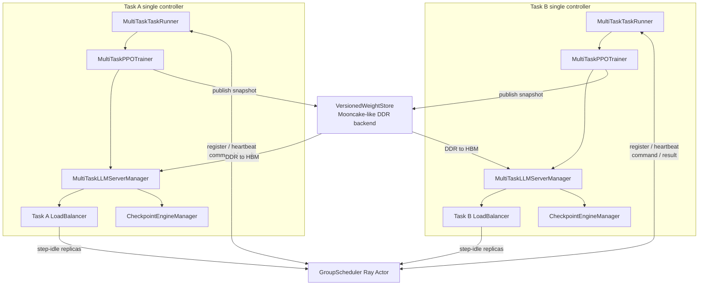
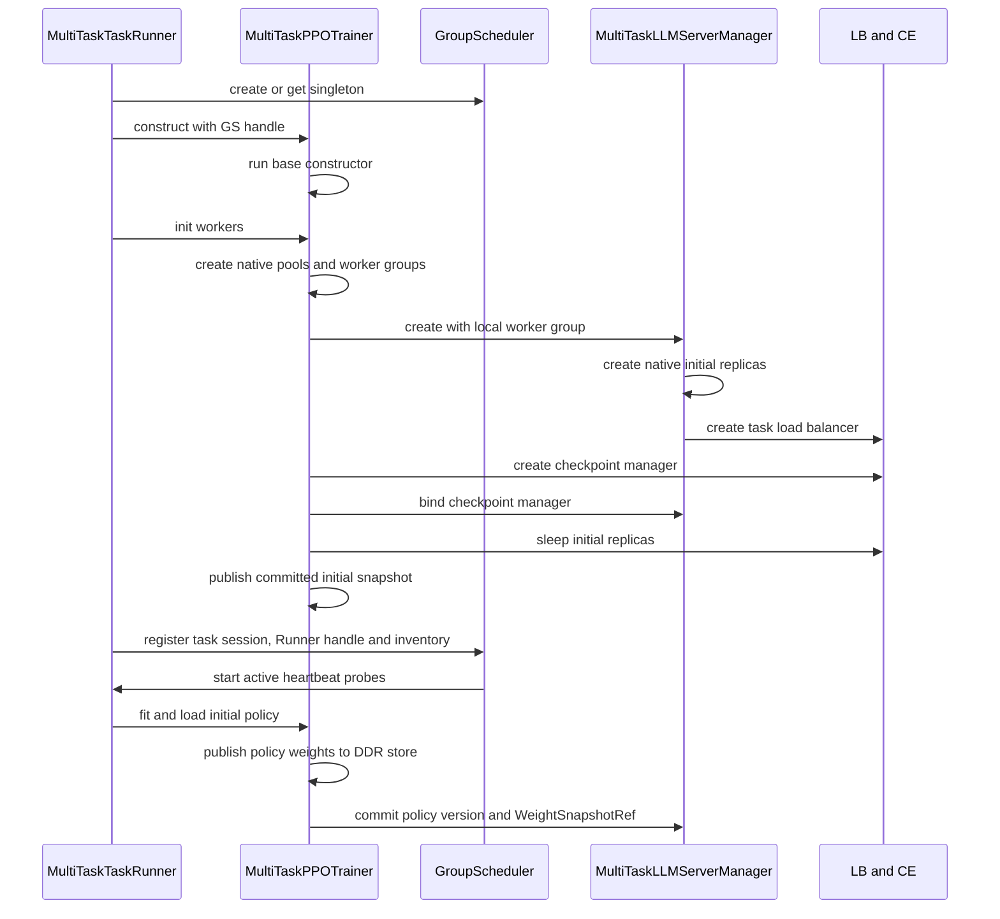
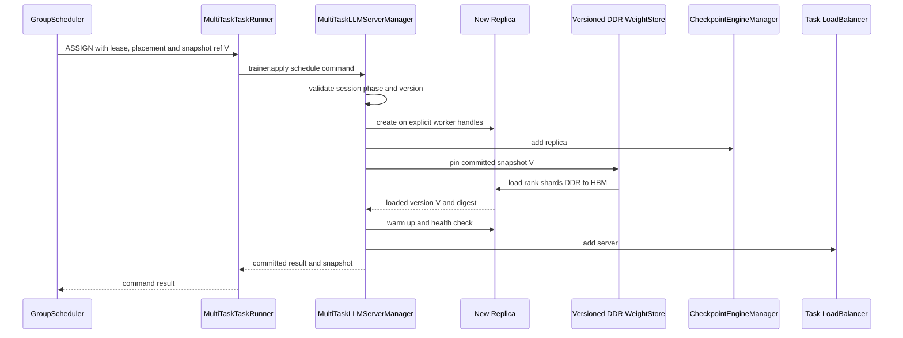
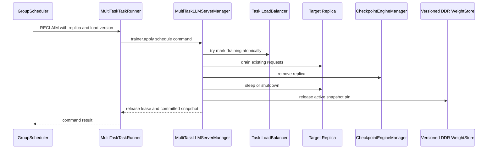

# 多任务推理资源共享：verl HYBRID 运行时扩展设计

> 基线：verl v0.8.0，commit `7aed6b23`。
>
> [`03-verl-hybrid-runtime-baseline.md`](./03-verl-hybrid-runtime-baseline.md) 记录未经改造的 verl 代码事实；本文不重复替代该基线，
> 而是在其上描述多任务场景的目标行为、改造前后差异、子仓扩展方式和需要 verl 提供的通用机制。

## 1. 已确认的设计约束

1. 第一阶段使用 verl 原生 `GRPO + on-policy + sync + HYBRID` 路径（与
   [`00`](../../00-project-alignment.md#1-项目目标) 的单一事实来源一致）。
2. `GroupScheduler`、多任务协议和扩展类主要位于独立子仓，不新增通信组件。
3. 每个训练任务仍有独立的 single controller，不把 `PPOTrainer` 或任务级 manager 改成全局对象。
4. 子仓提供 `MultiTaskTaskRunner`、`MultiTaskPPOTrainer(PPOTrainer)`、
   `MultiTaskLLMServerManager(LLMServerManager)` 和扩展 `GlobalRequestLoadBalancer`。
5. 初始化阶段不共享资源，GS 不决定初始 replica placement。每个任务完全按照自己的
   ResourcePool、WorkerGroup 和 rollout 并行配置创建初始 replicas。
6. 每个任务的 `base_instances` 严格大于 1，表示本任务原生规模和活动 ROLLOUT 的需求基线，
   不是永久不可借 ownership。初始化完成后，任务把实际资源规模、worker inventory 和 replica
   状态注册到 GS。
7. 资源共享从运行期开始。GS 主动 heartbeat TaskRunner，并经 TaskRunner 下发扩缩命令；manager 只做
   本地执行，不运行 poll。命令可以在 rollout 中执行，不等待整轮 step 结束。
8. PPO/GRPO 算法、dataset、AgentLoop 和调用方不感知资源来自本任务还是其他任务；感知 GS 的边界
   限定在 TaskRunner 控制面、`MultiTaskPPOTrainer` lifecycle bridge、扩展 LB 空闲上报和 manager
   本地执行面。
9. GS 是全局决策者；Ray 仍负责 actor/placement group 的物理调度，任务级 LB 仍负责本任务请求路由。

## 2. 未改造基线

基线的完整对象拓扑、启动调用链和一轮迭代流程见：

- [路径、术语与迭代边界](./03-verl-hybrid-runtime-baseline.md#1-路径术语与迭代边界)；
- [进程、Actor 与普通对象拓扑](./03-verl-hybrid-runtime-baseline.md#2-进程actor-与普通对象拓扑)；
- [完整启动调用时序](./03-verl-hybrid-runtime-baseline.md#5-完整启动调用时序)；
- [一轮完整迭代调用关系](./03-verl-hybrid-runtime-baseline.md#7-一轮完整迭代调用关系)；
- [对象所有权边界](./03-verl-hybrid-runtime-baseline.md#9-当前对象所有权边界)。

与本文最相关的基线事实是：

```text
run_ppo
└─ TaskRunner Ray Actor
   └─ PPOTrainer 普通 Python 对象
      ├─ actor/ref/critic WorkerGroups
      ├─ LLMServerManager 普通 Python 对象
      ├─ AgentLoopManager
      └─ CheckpointEngineManager
```

`PPOTrainer.init_workers()` 当前把 `LLMServerManager.create(...)` 写死在初始化流程中；
`LLMServerManager.create()` 自动按本任务 `actor_rollout_wg` 创建全部初始 replicas，并创建任务内 LB。

## 3. 改造前后总览

| 维度 | verl v0.8.0 | 多任务扩展后 |
|---|---|---|
| single controller | `TaskRunner` | 子仓 `MultiTaskTaskRunner`，仍是每任务一个 Ray Actor |
| trainer | `PPOTrainer` | `MultiTaskPPOTrainer(PPOTrainer)` |
| rollout manager | 内置 `LLMServerManager` | `MultiTaskLLMServerManager(LLMServerManager)` |
| 初始资源 | 本任务 ResourcePool/WorkerGroup | 不变 |
| 初始 replica 数量 | 本任务 WG world size 除以 replica world size | 不变；GS 不参与 |
| 初始 placement | `init_hybrid()` 连续切本任务 WG | 不变 |
| 初始 LB/client/CE | 任务内创建 | 不变，沿用多态 manager 返回值 |
| 全局对象 | 无 | named detached `GroupScheduler` Ray Actor |
| GS/任务 endpoint | 无 | GS 与多个 TaskRunner 互持 ActorHandle；GS 主动 heartbeat 并下发命令 |
| GS 注册时机 | 无 | 本任务初始 replicas、LB、CE 都已完成后 |
| GS 初始决策 | 无 | 注册调用不返回 placement；注册成功后资源进入运行期共享 inventory |
| 运行期资源规模 | 固定 | rollout 中可实时增删 borrowed replicas |
| 请求路由 | 固定 server 集合 | 同一个 LB handle，动态 add/remove servers |
| CE 参与集合 | 初始化时固定 | 随 replica 生命周期 add/remove |
| phase 信息 | trainer 内隐含 | trainer 显式通知 manager；TaskRunner heartbeat 返回 committed snapshot |
| step 空闲事实 | LB 只做单任务路由 | LB 持有 GS handle，直接上报 `STEP_IDLE_REPLICAS` |
| policy version | trainer/权重同步内部使用 | trainer 发布版本化 DDR snapshot；GS 传 ref，新增 replica 直接 DDR→HBM |
| 退出 | TaskRunner 关闭 TQ/RB | 额外 drain、释放 lease、unregister session；不销毁 GS |

这里的“任务层面不感知”不是指 controller 中完全没有多任务代码，而是指训练算法和请求调用链保持：

```text
PPOTrainer/AgentLoop → LLMServerClient → 本任务 LB → 当前可用 replicas
```

AgentLoop 始终使用同一个 LB actor handle，不需要知道某个 replica 的 worker 原本属于哪个任务。

## 4. 改造后的对象拓扑



GS 不持有 trainer 或 manager 的本地对象引用。GS 保存注册时提交的 TaskRunner ActorHandle；TaskRunner
保存 GS ActorHandle。LB 另持有 GS handle，但只报告 rollout 事实。命令的唯一执行链是
GS→TaskRunner→trainer→manager。

## 5. 初始化流程：改造前后差异

### 5.1 改造前

原始初始化顺序以 [第 5 节启动时序](./03-verl-hybrid-runtime-baseline.md#5-完整启动调用时序) 为准：

```text
TaskRunner
→ PPOTrainer.__init__
→ PPOTrainer.init_workers
→ 创建训练 WorkerGroups
→ 初始化 reward/teacher managers
→ LLMServerManager.create
   → 根据本任务 WG 自动创建全部 replicas
   → 创建任务内 LB
→ 创建 AgentLoopManager
→ 创建 CheckpointEngineManager
→ sleep 初始 replicas
→ fit
```

### 5.2 改造后



初始化阶段有两个明确的不变量：

1. GS 不返回 placement，也不改变任务根据自身配置得到的初始 replica 数量。
2. 注册使用实际创建结果，不把“期望数量”当成事实。`base_instances` 应与
   `len(llm_server_manager.get_replicas())` 一致；不一致时任务初始化失败，而不是向 GS 注册错误基线。

### 5.3 为什么先创建 GS、后注册任务

`MultiTaskTaskRunner` 在构造 trainer 前 create-or-get GS handle：

- 失败可以在创建 GPU workers 之前暴露；
- 多个任务能够拿到同一个 named detached actor；
- 此时还没有 worker handles 和 replica 实态，因此不能完成注册。

TaskRunner 将 handle 传给 trainer，并把任务注册推迟到 `init_workers()` 尾部：

- actor/ref workers 已经创建；
- 初始 replicas、server addresses 和 worker bindings 已经确定；
- LB 和 CE 已经存在；
- trainer/manager 可以发布一份原子、可验证的 committed snapshot；
- TaskRunner 可以把自身 ActorHandle 连同该 snapshot 注册给 GS。

## 6. 子仓类如何扩展 verl

### 6.1 `MultiTaskTaskRunner`

verl 已支持 `run_ppo(config, task_runner_class=...)` 注入自定义 TaskRunner，因此 driver 不需要修改。

当前 `TaskRunner.run()` 直接构造具体 `PPOTrainer`，而且 `TaskRunner` 已经被 `@ray.remote` 装饰，
模块中导出的符号是 Ray `ActorClass`，不能直接作为普通 Python 基类继承。子仓原型需要定义新的
runner implementation，再将它包装成 remote actor。

> 下面的代码是子仓原型的建议写法。verl v0.8.0 的 sync `TaskRunner` 是默认单并发 Ray Actor（裸
> `@ray.remote`，无 concurrency groups），`@ray.method(concurrency_group=...)` 与
> `concurrency_groups={...}` 都是子仓新增的控制面扩展，不是上游现状；背景与并发隔离论证见
> [`06`](./06-taskrunner-direct-control-plane.md#2-为什么当前-taskrunner-不能直推)。

```python
class MultiTaskTaskRunnerImpl:
    def __init__(self):
        self.role_worker_mapping = {}
        self.mapping = {}
        self.group_scheduler = None
        self.task_context = None
        self.trainer = None

    @ray.method(concurrency_group="training")
    def run(self, config):
        # 复用或移植原 TaskRunner 的 role mapping、resource pool 和 TQ 编排。
        ...
        self.group_scheduler = get_or_create_group_scheduler(config)
        self.task_context = TaskContext.new(config)
        trainer = self.trainer = MultiTaskPPOTrainer(
            config=config,
            role_worker_mapping=self.role_worker_mapping,
            resource_pool_manager=self.resource_pool_manager,
            group_scheduler=self.group_scheduler,
            task_context=self.task_context,
        )
        trainer.init_workers()
        registration = trainer.build_registration(
            task_runner_handle=ray.get_runtime_context().current_actor,
        )
        ray.get(self.group_scheduler.register_task.remote(registration))
        try:
            trainer.fit()
        finally:
            try:
                trainer.close()
            finally:
                ray.get(self.group_scheduler.unregister_task.remote(
                    self.task_context.task_id, self.task_context.session_id
                ))

    @ray.method(concurrency_group="heartbeat")
    def heartbeat(self, probe):
        if self.trainer is None:
            return HeartbeatReply.endpoint_only(probe, "INITIALIZING")
        return HeartbeatReply.from_snapshot(
            probe, self.trainer.get_committed_scheduler_snapshot()
        )

    @ray.method(concurrency_group="command")
    def apply_schedule_command(self, command):
        return self.trainer.apply_schedule_command(command)

MultiTaskTaskRunner = ray.remote(
    num_cpus=1,
    max_concurrency=3,
    concurrency_groups={"training": 1, "heartbeat": 1, "command": 1},
)(MultiTaskTaskRunnerImpl)
run_ppo(config, task_runner_class=MultiTaskTaskRunner)
```

原型需要移植的只是 TaskRunner 的 controller 编排，不复制 PPO/GRPO 算法。RFC 更适合让上游
`TaskRunner.run()` 通过配置 FQN 或 factory 选择 trainer class；另一种方式是把未装饰的
TaskRunner implementation 与 remote wrapper 分开暴露，使子仓可以正常继承。

### 6.2 `MultiTaskPPOTrainer`

`PPOTrainer.__init__()` 可完整复用。GS handle 由 TaskRunner 注入，trainer 不重复 create-or-get：

```python
class MultiTaskPPOTrainer(PPOTrainer):
    def __init__(self, config, role_worker_mapping, resource_pool_manager, group_scheduler, task_context):
        self.task_context = task_context
        self.group_scheduler = group_scheduler
        self.weight_snapshot_publisher = create_weight_snapshot_publisher(config, task_context)
        self.weight_snapshot_loader = create_weight_snapshot_loader(config, task_context)
        super().__init__(
            config=config,
            role_worker_mapping=role_worker_mapping,
            resource_pool_manager=resource_pool_manager,
        )

    def _create_llm_server_manager(self, *, worker_group, rollout_resource_pool):
        return MultiTaskLLMServerManager.create(
            config=self.config,
            worker_group=worker_group,
            rollout_resource_pool=rollout_resource_pool,
            load_balancer_kwargs={
                "group_scheduler": self.group_scheduler,
                "task_context": self.task_context,
            },
        )

    def init_workers(self):
        super().init_workers()
        self.llm_server_manager.bind_checkpoint_manager(self.checkpoint_manager)
        self.llm_server_manager.bind_weight_snapshot_loader(self.weight_snapshot_loader)
        self.llm_server_manager.publish_committed_snapshot()

    def on_policy_version_committed(self, policy_version):
        snapshot_ref = self.weight_snapshot_publisher.publish(policy_version)
        self.llm_server_manager.on_policy_version_committed(policy_version, snapshot_ref)
        return snapshot_ref

    def get_committed_scheduler_snapshot(self):
        return self.llm_server_manager.get_committed_snapshot()

    def apply_schedule_command(self, command):
        return self.llm_server_manager.apply_schedule_command(command)
```

上述写法依赖 `PPOTrainer.init_workers()` 把当前硬编码的 `LLMServerManager.create(...)` 提取成
`_create_llm_server_manager(...)`。这是初始化阶段最小、最通用的 verl 扩展点。

`MultiTaskPPOTrainer` 还承担 lifecycle bridge：

```python
self.llm_server_manager.on_phase_change(
    phase=Phase.ROLLOUT_READY,
    policy_version=self.global_steps,
    weight_snapshot_ref=committed_snapshot_ref,
)
```

它不读取 GS placement，也不直接执行 add/remove；只把 TaskRunner 收到的资源命令交给 manager。

### 6.3 `MultiTaskLLMServerManager`

本节给出总体职责；状态机、事务和测试细节见
[`05-multitask-llm-server-manager.md`](./05-multitask-llm-server-manager.md)。

初始化阶段继续复用父类 `create()`、`_initialize_llm_servers()`、`_init_global_load_balancer()`、
`get_client()` 和 `get_replicas()`。子类增加的是本地生命周期执行能力：

```python
class MultiTaskLLMServerManager(LLMServerManager):
    def bind_checkpoint_manager(self, checkpoint_manager): ...
    def on_phase_change(self, phase, policy_version, weight_snapshot_ref=None): ...
    def on_policy_version_committed(self, policy_version, snapshot_ref): ...
    def publish_committed_snapshot(self): ...
    def bind_weight_snapshot_loader(self, loader): ...
    def get_committed_snapshot(self): ...
    def apply_schedule_command(self, command): ...

    async def execute_assign(self, command): ...
    async def execute_reclaim(self, command): ...
    async def close(self): ...
```

建议至少维护以下本地状态：

```text
task_id / session_id
state_version / last_applied_decision_id
phase / policy_version
owned_worker_inventory
replica_id -> replica object
replica_id -> worker lease and binding
replica_id -> server address and handle
replica_id -> lifecycle state / loaded policy version / snapshot ref / digest
current committed WeightSnapshotRef
command_id -> execution result
LB handle / CheckpointEngineManager / lifecycle lock
```

manager 不持有 GS handle。创建 LB 时可以接收 GS handle 作为构造参数并将其注入 LB Actor，但 manager
后续跨 Actor 通信职责到此结束。

### 6.4 `GroupScheduler`

GS 在子仓中实现为 named detached Ray Actor。create-or-get helper 需要固定 actor name 和 namespace，
并在取得已有 actor 后校验协议版本与不可变调度配置。

模拟器的算法和账本语义可以复用，但 callback 目标需要改为 TaskRunner ActorHandle。

> 模拟器仓库 `/Users/nyp/Documents/multi-rl-task-scheduler` 存在两个 `GroupScheduler` 实现：
> 生产模拟器 `group_scheduler/group_scheduler.py`（`@yr.instance`，benchmark 使用）和协议骨架
> `src/multi_rl_task_scheduler/`（对齐 spec 的最小骨架）。下面"原有接口"指骨架的 callback
> 模式；生产模拟器的 `register_task(config)` 无 `scheduler` 参数，assign/reclaim 走
> `TaskInfo.assign.invoke` 的 yr callable（方法名 `concurrent_assign/concurrent_reclaim`），且**没有
> `unregister_task`**。算法和账本语义两者一致，但接口形态不同。完整映射见
> [`02`](../../02-group-scheduler-protocol.md#1-模拟器原型到-verl-的映射)。

骨架原有的 callback 接口为：

```text
register_task(config, scheduler)
scheduler.assign(...)
scheduler.reclaim(...)
```

调整为 TaskRunner 双向控制协议和 LB 单向事实协议（均为子仓目标设计，模拟器当前未实现
heartbeat/command/step-idle/session fencing）：

```text
register_task(registration_with_task_runner_handle) -> registration_result
TaskRunner.heartbeat(probe) -> heartbeat_reply
LB.report_step_idle_replicas(event) -> accepted
TaskRunner.apply_schedule_command(command) -> command_result
unregister_task(task_id, session_id)
```

GS 构造时也不应一次性接收最终 worker 集合（骨架在 `__init__` 接收 worker 列表，生产模拟器在
`create()` 一次性生成全量 worker；两者都不支持任务动态加入）。训练任务会动态加入公共 Ray 集群，
worker inventory 随每个 task/session 注册和退出而变化。

## 7. 可直接复用与需要调整的接口

### 7.1 可直接复用

| verl 接口/对象 | 多任务场景中的用法 |
|---|---|
| `run_ppo(..., task_runner_class=...)` | 注入子仓 TaskRunner |
| `PPOTrainer.__init__()` | tokenizer、dataset、dataloader、ReplayBuffer 等全部继承 |
| TaskRunner role mapping/resource pool | 保持本任务训练资源声明 |
| `RayResourcePool` / `RayWorkerGroup` / WorkerDict | 保持训练 worker 创建和调用 |
| actor/ref/critic、reward、teacher 初始化 | 不改变 |
| 父类 `LLMServerManager.create()` | 创建本任务初始 replicas 和 LB |
| `LLMServerManager.get_client()` | AgentLoop 获得稳定 LB handle |
| LB `add_servers/remove_servers/get_status` | 运行期修改本任务可路由 server 集合 |
| CE `add_replicas/remove_replicas` | 维护运行期 replica 参与集合 |
| replica sleep/wake/abort/resume | 生命周期事务中的局部操作 |
| `RolloutReplica.name_suffix` | 加入 task/session/replica 唯一标识 |
| `RayWorkerGroup(worker_handles=...)` | 对显式 worker handles 构造调用视图 |

### 7.2 需要调整或新增

| 位置 | 当前限制 | 需要的通用机制 |
|---|---|---|
| `TaskRunner.run()` | trainer class 写死，导出的 TaskRunner 已是 Ray ActorClass | trainer FQN/factory，或公开未 remote 的可继承 implementation |
| `PPOTrainer.init_workers()` | manager class 写死 | `_create_llm_server_manager()` factory |
| LB 构造 | LB class 与构造参数固定 | LB factory/FQN，可选注入 GS handle 与 TaskContext |
| 生成请求标识 | LB 无法证明一个 step 的预期样本已取尽 | 透传 generation key、prompt uid 和 rollout index |
| `PPOTrainer.step/fit/_validate` | phase 仅由调用位置隐含 | 轻量 lifecycle listener/hook |
| `RolloutReplica.init_hybrid()` | 按 replica rank 连续切一个 WG | 接受显式 worker handles/placement |
| replica 命名 | rank 在跨任务 namespace 中可能冲突 | 强制 task/session/replica suffix |
| replica teardown | 缺少通用 drain/shutdown | 显式 shutdown，清理 server actor 和子进程 |
| manager/LB/CE 状态 | 三处独立修改 | 由扩展 manager 实现统一生命周期事务 |
| TaskRunner finally | 只关闭 RB/TQ | trainer/manager close hook |

这些机制不包含 GS 算法、租约策略或多租户数据模型，适合成为 verl RFC 的窄扩展面。

## 8. Rollout 中实时扩缩

### 8.1 “实时”的定义

实时扩缩表示 GS 命令可以在本轮 rollout 尚未全部完成时生效，而不是等到
`PPOTrainer.step()` 返回或下一轮 rollout 开始：

```text
Task B 正在生成本轮 prompts
Task A 释放可借资源
GS 生成 ASSIGN 给 Task B
Task B 在当前 rollout 内创建并上线新 replica
剩余请求立即可以被路由到新 replica
```

PPOTrainer 仍按原来的同步 step 等待本轮全部样本；只有底层 LB 的服务集合在生成期间变化。
对于第一阶段 SINGLE_GENERATE，LB 在该 generation 的预期样本均已 acquire 且实例 inflight 降到零时，
直接把实例上报 GS；精确定义见
[`07-rollout-instance-idle-detection.md`](./07-rollout-instance-idle-detection.md)。

### 8.2 控制路径与并发

`MultiTaskLLMServerManager` 是普通 Python 对象，不能由 GS 直接远程回调，也不需要额外控制循环。
实时命令沿现有 Actor 边界进入：

```text
LB → GS: STEP_IDLE_REPLICAS                    # 事实
GS → TaskRunner: apply_schedule_command        # 决策
TaskRunner → trainer → manager                 # 本地执行
manager → trainer → TaskRunner → GS            # 实际结果
```

改造后的 `MultiTaskTaskRunner` 将划分 `training=1`、`heartbeat=1`、`command=1` 三个 concurrency
groups（verl v0.8.0 现状是单并发裸 `@ray.remote`，无此分组；详见
[`06`](./06-taskrunner-direct-control-plane.md#2-为什么当前-taskrunner-不能直推)）。command 与 trainer
主线程会同时触及 manager、LB 和 CE，因此必须共享生命周期锁/串行命令队列；phase 切换、权重同步和
replica 事务不能并发修改 CE 集合。heartbeat 只读取最近 committed immutable snapshot，不进入
manager 的耗时生命周期事务。

### 8.3 实时扩容事务



提交顺序必须保证：新 replica 在权重版本正确、服务健康并进入 CE 账本之前，不对 AgentLoop 可见。
LB add 是对请求面的最后一步。

### 8.4 实时缩容事务



LB 原子摘流必须先于 drain，且要用空闲事件中的 server-load-version 防止观察后的竞争 acquire。
`base_instances > 1` 保证初始化时 LB
非空；活动 ROLLOUT 期间的调度还必须维持可服务下限。进入 TRAIN 且没有生成请求时，LB 活跃集合
可以暂时为空，但下一次 ROLLOUT 前必须先恢复至少一个已加载正确权重版本的可路由 replica。

### 8.5 phase 与实时命令的关系

建议 trainer 至少发出以下事件：

| 事件 | 代码边界 | manager 行为 |
|---|---|---|
| `ROLLOUT_READY` | policy V 的 DDR manifest committed，现有 replicas 也已就绪 | 允许执行 ASSIGN，新增 replica 必须按 ref 加载 V |
| `ROLLOUT_RUNNING` | 开始调用 AgentLoopManager | 持续实时扩缩；RECLAIM 只处理可安全 drain 的实例 |
| `ROLLOUT_DRAINED` | 本轮 ReplayBuffer 已收齐 | 停止接收新的扩容提交，收敛进行中事务 |
| `TRAIN` | replicas sleep 完成 | 不激活推理实例；上报资源实际可借条件 |
| `WEIGHT_SYNC` | actor 更新后、DDR snapshot 和现有 rollout 更新完成前 | 冻结 CE 集合变化和 policy ref 切换 |
| `EXITING` | TaskRunner finally | 停止新命令并清理 session |

这里仍需区分“phase”与“GPU 可借”：HYBRID GPU 在 TRAIN 阶段可能正在执行训练计算，不能仅因
rollout replica 已 sleep 就标记为空闲。manager 上报的 worker capability 必须同时反映训练占用、
rollout lifecycle 和未完成的权重同步。

## 9. 版本化 DDR 权重数据面

### 9.1 为什么不能在扩容时再找 trainer

初始化 replicas 位于本任务自己的 ActorRolloutRefWorkers 上，原生 naive 路径可以在固定 worker/adapter
间进程内同步。但 GS 可能在任务进入 rollout 后才分配新 worker；此时 trainer 的权重 HBM、训练
collective 或 ServerAdapter 往往不可用。动态 ASSIGN 不能要求训练侧重新参与一次同步。

v0.8.0 的 `MooncakeCheckpointEngine` 已有 TransferEngine 和远程 read 能力，但当前
`CheckpointEngineManager.update_weights()` 仍同时组织 trainer 与 rollout 临时拓扑，buffer 默认也在
CUDA device。它不是可供未来 replica 按版本独立读取的 DDR store。

### 9.2 目标路径

```text
actor policy V 在 trainer HBM commit
→ WeightSnapshotPublisher 导出 rollout-format shards
→ 写入 Mooncake-like VersionedWeightStore DDR
→ 原子 commit manifest，得到 WeightSnapshotRef(V)
→ trainer 可以进入 rollout，不再参与读路径
→ GS 的 ASSIGN 携带 ref(V)
→ 新 replica 按 rank load plan 从 DDR 直接加载到 HBM
→ 校验 loaded version/content digest
→ warmup
→ LB add
```

`WeightSnapshotRef` 至少绑定 task/session、policy version、model fingerprint、manifest id 和 content
digest。GS 只转发 ref，不解析 tensor，也不保存物理 DDR 地址。

### 9.3 发布和可服务门槛

trainer 在每次 actor policy commit 后、进入下一轮 rollout 前发布 immutable snapshot。manifest 最后
原子提交；STAGING、缺 shard 或 checksum 失败的版本不可见。首次 checkpoint load 后也必须发布初始
snapshot。

新 replica 只有同时满足以下条件才算 ASSIGN COMMITTED：

```text
snapshot.state == COMMITTED
snapshot.policy_version == command.expected_policy_version
all rollout ranks loaded successfully
loaded_content_digest == snapshot.content_digest
server health and warmup passed
LB add succeeded
```

policy 在加载期间推进时，旧 command 返回 `STALE_VERSION`；不能静默改载新版本后服务旧 generation。

### 9.4 snapshot 生命周期

store 为 current policy、active replicas 和在途 ASSIGN 提供 pin/read lease。只有 snapshot 既不是保留
版本，又没有 replica/decision/recovery 引用时才可 GC。TaskRunner heartbeat timeout 只触发 fencing 和
引用核对，不能立即删除 DDR 数据。

第一阶段允许已有本地 replicas 继续使用 native CE 更新、动态 replica 首次加载使用 DDR store，但两条
路径必须得到同一 policy version/content digest。长期目标是所有 rollout replicas 都从同一 committed
snapshot ref 更新，消除双重权威来源。

完整对象、时序和故障语义见
[`08-versioned-ddr-weight-store.md`](./08-versioned-ddr-weight-store.md)。

## 10. 注册、状态和命令模型

### 10.1 初始化注册

初始化注册至少包含：

```text
task_id / session_id
task_runner_handle             # GS 主动 heartbeat 和下发命令的 endpoint
protocol_version
base_instances                 # > 1
actual_initial_instances
rollout footprint              # TP/DP/PP，必要时含 PD 拓扑
owned worker inventory
initial replica bindings
server lifecycle states
phase=INITIALIZED
policy_version=UNINITIALIZED
task endpoint / manager / LB capabilities
weight store backend / weight format version / DDR load capability
state_version
```

`workers_per_instance` 不能只照搬模拟器的 `tp × pp`。verl 的普通 rollout 至少包含
`tp × dp × pp`；开启 disaggregation 后还要包含 prefill/decode footprint。

### 10.2 首次权重同步后

`fit()` 加载 checkpoint 后先发布初始 DDR snapshot，再完成已有 replicas 的首次更新。manifest 与
replicas 都 committed 后，manager 发布新的状态；GS 在后续 TaskRunner heartbeat 中看到：

```text
phase=ROLLOUT_READY
policy_version=global_steps
current_weight_snapshot_ref
每个初始 replica 的 loaded_policy_version / loaded_snapshot_digest
```

只有这份状态提交后，任务才可接收运行期 ASSIGN。

### 10.3 GS 主动 heartbeat

完整快照至少包含：

```text
task/session/state version
phase and policy version
owned and borrowed worker leases
replica lifecycle and worker bindings
replica loaded policy versions
current WeightSnapshotRef and replica loaded digests
LB in-flight counts
pending lifecycle transaction
last decision and result
training/rollout resource availability
```

GS 调用 TaskRunner heartbeat 获取这份快照。LB 的 `STEP_IDLE_REPLICAS` 是独立的低延迟事件，不能替代
完整 snapshot。命令至少携带 `decision_id`、`expected_state_version`、`session_id`、目标
server-load-version 和 lease fencing token。ASSIGN 还必须携带与目标 generation 匹配的 committed
`WeightSnapshotRef`。

## 11. 退出和故障路径

当前 sync TaskRunner finally 只关闭 ReplayBuffer 和 TransferQueue。多任务扩展需要在其之前调用：

```text
MultiTaskPPOTrainer.close
└─ MultiTaskLLMServerManager.close
   ├─ phase = EXITING
   ├─ 停止接收新命令
   ├─ 从 LB 移除 borrowed servers
   ├─ drain borrowed replicas
   ├─ 从 CE 移除动态 replicas
   ├─ sleep/shutdown borrowed replicas
   ├─ 释放 worker leases
   └─ 发布最终 committed 快照
TaskRunner
├─ 等待或拒绝未完成 command
├─ unregister(task_id, session_id)
└─ 关闭 ReplayBuffer / TransferQueue
```

任务退出不销毁 detached GS。任务异常消失时，由 GS 对 TaskRunner 的 heartbeat timeout 和 session
fencing 防止旧 endpoint、旧 LB 或旧命令继续更新状态；超时本身不能证明 Ray actor/子进程已经清理。

## 12. 子仓与 verl 的最终边界

### 12.1 子仓实现

- `MultiTaskTaskRunner`；
- `MultiTaskPPOTrainer`；
- `MultiTaskLLMServerManager`；
- 扩展 `GlobalRequestLoadBalancer`；
- VersionedWeightStore 协议、Mooncake-like backend、publisher/loader、manifest/lease/GC；
- GroupScheduler actor 和 create-or-get helper；
- task/session/worker/replica/lease/decision 协议模型；
- TaskRunner 注册/注销、heartbeat/command endpoint 与 concurrency groups；
- LB→GS `STEP_IDLE_REPLICAS` 上报；
- 实时 ASSIGN/RECLAIM 事务与本地一致性；
- GS 调度算法、公平策略、状态账本和故障恢复策略；
- 多任务配置、指标、recipe、测试和模拟器适配。

### 12.2 verl 提供的通用机制

- TaskRunner trainer FQN/factory，或未 remote 的可继承 implementation；
- PPOTrainer LLMServerManager factory；
- GlobalRequestLoadBalancer factory 和 generation/request identity 透传；
- phase/policy-version lifecycle listener；
- rollout-format tensor export、policy publish hook 和 DDR→HBM load/verify hook；
- 显式 worker handles/placement 的 HYBRID replica 初始化；
- deferred-weight/可替换 weight source，避免动态 replica 先从磁盘加载再被 DDR snapshot 覆盖；
- replica drain/shutdown；
- LB 和 CE 已有动态集合原语；
- rollout adapter 返回实际 loaded policy version/content digest 的机制；
- trainer/manager close hook。

verl 不需要理解 GroupScheduler、跨任务公平算法或 lease 策略。

## 13. 建议实施顺序

1. 增加 MultiTaskTaskRunner、MultiTaskPPOTrainer 和 manager factory，保持单任务行为不变。
2. 使用父类逻辑创建初始 replicas；完成 GS singleton、TaskRunner 注册/注销和 GS 主动 heartbeat。
3. 增加 phase/policy-version hook、LB generation 账本和 LB→GS 空闲上报。
4. 实现 VersionedWeightStore 的 HBM→DDR publish 与独立 DDR→HBM load PoC。
5. 打通 GS→TaskRunner→trainer→manager 命令链；先实现预创建 replica 的 activate/deactivate，验证并发与原子摘流。
6. 实现显式 worker placement 的动态 replica 创建、DDR snapshot 加载和完整 shutdown。
7. 实现完整实时 ASSIGN/RECLAIM、snapshot lease/GC 和 session fencing。
8. 最后接入调度算法和多任务 benchmark，对比固定资源基线。

## 14. 验收条件

- 多个任务获取同一个 GS actor，但保持各自独立 single controller。
- 初始化期间没有跨任务 placement；每个任务的初始 replica 数量与原生配置一致。
- GS 注册的基线来自实际 worker/replica 状态，且 `base_instances > 1`。
- GS 与多个 TaskRunner 互持正确 handle；`fit()` 期间 heartbeat 和 command endpoint 仍能响应。
- LB 仅在 SINGLE_GENERATE 的 step 输入取尽且 inflight 为零时直接上报 GS；LB 不执行调度决策。
- AgentLoop 和 PPO/GRPO 算法不需要识别 owned/borrowed replica。
- trainer 发布 snapshot 后即使不参与读路径，rollout 中新增 replica 仍可独立从 DDR 加载到 HBM。
- 新 replica 只有 loaded policy version/content digest 与 ASSIGN ref 一致后才加入 LB。
- rollout 尚未结束时，可回收 replica 能够停止接收新请求、drain 后释放，而其他 replicas 继续服务。
- 动态 replica 在 manager、LB、CE、GS 和 weight-store pin 中最终一致。
- TRAIN/WEIGHT_SYNC/publish 与实时生命周期操作不会并发破坏 CE、snapshot ref 或权重版本。
- task/session 重启、重复/乱序 LB 事件、重复命令和 heartbeat 超时不会破坏全局资源账本。
- 任务退出只注销自己的 session 和资源，不销毁 GS。
