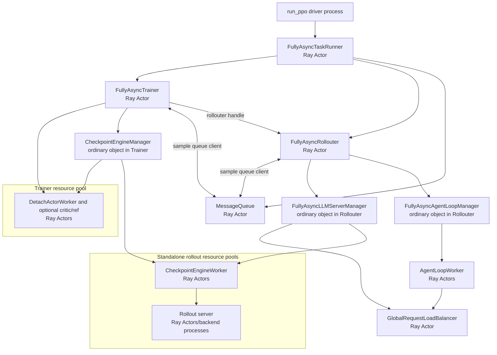
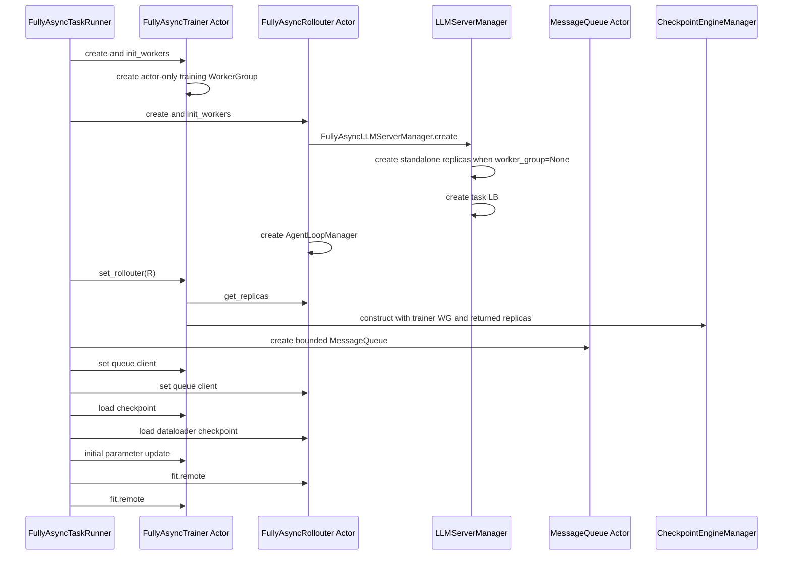
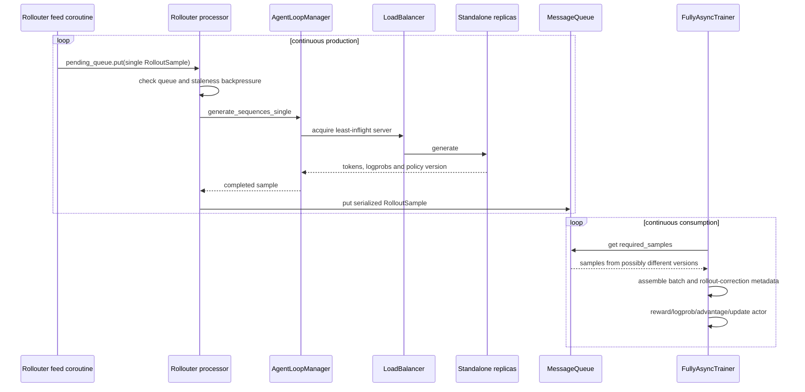
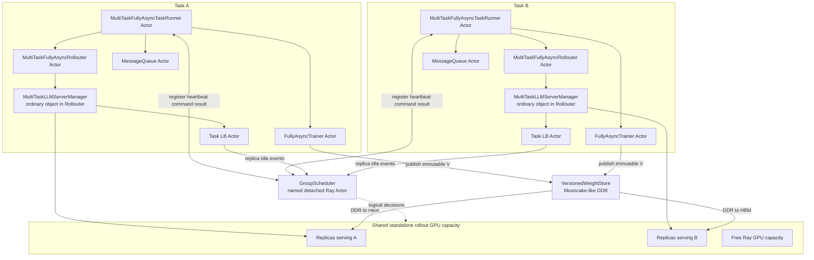
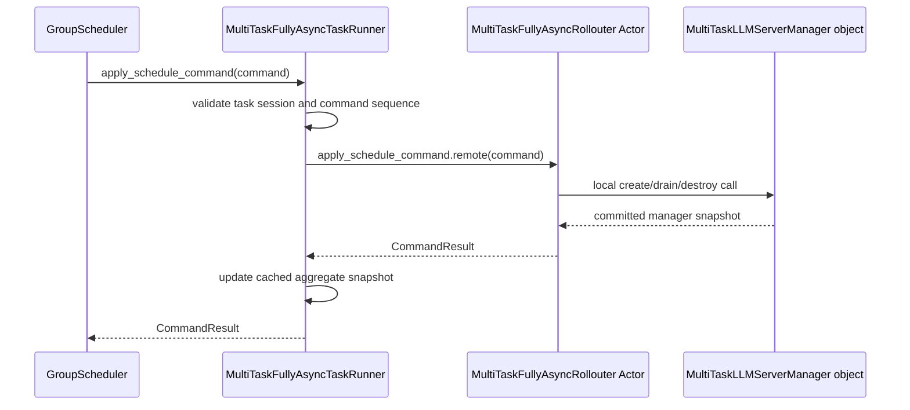
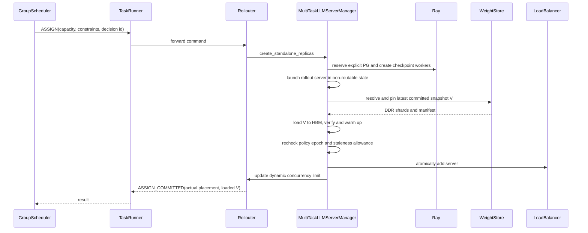
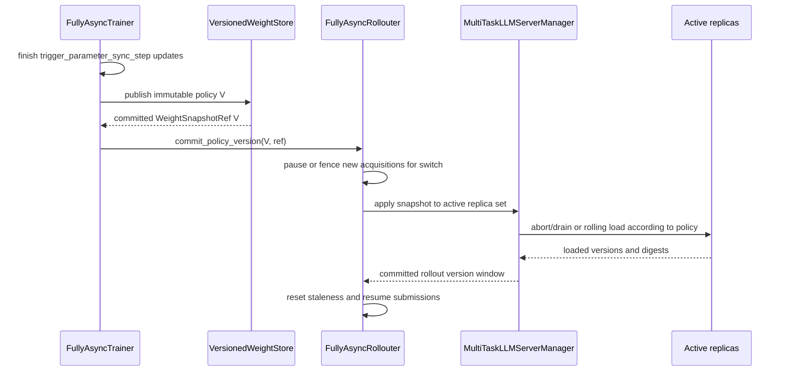

# verl 异步训练下的分离式多任务推理资源共享调研

> 基线：verl v0.8.0，commit `7aed6b23`。
>
> 本文只讨论训练 GPU 与 rollout GPU 分离，并对接 verl 异步训练机制的方案。同步训练与分离部署的组合
> 不在本文范围内，也不作为实施前置阶段。
>
> “分离”指 `RolloutMode.STANDALONE`，不指 SGLang prefill/decode disaggregation。

## 1. 结论先行

分离架构应以 `verl/experimental/fully_async_policy` 为主要对接基线，而不是把
`main_ppo_sync.PPOTrainer` 改造成 STANDALONE。原因是 fully-async 已经具备目标架构所需的关键骨架：

```text
FullyAsyncTaskRunner Ray Actor
├─ FullyAsyncTrainer Ray Actor
│  └─ actor-only training WorkerGroup
├─ FullyAsyncRollouter Ray Actor
│  ├─ FullyAsyncLLMServerManager 普通对象
│  ├─ standalone rollout replicas
│  └─ AgentLoop workers
└─ MessageQueue Ray Actor
```

Trainer 和 Rollouter 并发运行，通过 MessageQueue 解耦；Rollouter 连续生成单样本，Trainer 按所需数量
消费；参数按 `trigger_parameter_sync_step` 周期更新，系统用 rollout version、staleness 和 rollout
correction 接受异步数据，而不是要求每个训练 batch 与唯一当前 policy 严格对齐。

多任务扩展应建立在这个语义上：

```text
GroupScheduler
  → MultiTaskFullyAsyncTaskRunner
  → FullyAsyncRollouter Actor
  → MultiTaskLLMServerManager 普通对象
  → create / drain / destroy standalone replicas
```

同时保留：

- TaskRunner 持有 `group_scheduler` handle，负责注册、heartbeat、命令转发和任务生命周期；
- LB 持有 GS handle，直接上报 replica 的瞬时空闲/摘流事实；
- Trainer 发布版本化 DDR 权重 snapshot；
- Rollouter 内 manager 让存量或新增 replica 从 DDR 加载，不再要求 Trainer 持有全部动态 replica 对象。

需要特别修改上一版的两个假设：

1. 异步流没有“当前 step 的全部 sample 已取尽”这个统一边界。空闲判据改为某个 replica 当前
   `inflight == 0`，并由 LB 原子阻止新请求进入。
2. 调度不能只看 replica idle。扩缩决策还必须看 MessageQueue 水位、Trainer 消费速度、Rollouter
   active tasks、staleness budget 和参数切换状态。

## 2. verl v0.8.0 的三层“异步”

代码中至少有三种不同含义的异步，不能混为一谈。

### 2.1 AgentLoop 请求异步

`rollout.mode=async`、`AgentLoopManager` 和 `LLMServerClient` 让多个 AgentLoopWorker 并发向 rollout
servers 发请求。即使上层 trainer 按 batch 等待，这一层也可以异步执行工具调用和多轮生成。

它解决的是请求并发，不决定训练样本是否允许陈旧。

### 2.2 one-step-off-policy

`OneStepOffRayTrainer` 使用独立 rollout GPU，并把下一批生成与当前批训练重叠：

```text
等待 batch N 生成完成
→ 同步当前 trainer 权重到 rollout
→ 立即启动 batch N+1 生成
→ 使用 batch N 更新 actor
```

因此 batch N+1 使用 actor 更新前的 policy，是固定的一步 off-policy。它证明了 actor-only trainer、
standalone rollout 和异步 AgentLoop 可以组合，但仍是以 batch future 驱动的单 controller 循环：

- 没有独立 Trainer/Rollouter Actor；
- 没有跨二者的 MessageQueue；
- 没有连续 backlog/staleness backpressure；
- 资源需求随单个 future 波动，难以形成稳定的全局调度信号。

它适合作为底层接口参考，不是多任务共享的首选运行时。

### 2.3 fully-async policy

`FullyAsyncTaskRunner` 创建独立的 `FullyAsyncTrainer`、`FullyAsyncRollouter` 和 `MessageQueue` Ray Actors，
然后同时启动两个 `fit.remote()`。这是本文推荐的基线。

其语义是：

- Rollouter 持续从 dataloader feed 单样本到本地 `pending_queue`；
- processor 按并发上限创建生成 tasks；
- 每个完成的 `RolloutSample` 写入 MessageQueue；
- Trainer 每次从 MessageQueue 取 `required_samples` 组成训练 batch；
- Trainer 每训练 `trigger_parameter_sync_step` 次才推进一次 `current_param_version` 并更新 rollout；
- Rollouter 根据 queue 上限和 staleness 样本预算暂停/恢复生成；
- sample 保存 `min_global_steps/max_global_steps`，允许 partial rollout 跨参数版本恢复。

这是“持续生产—持续消费”的系统，而不是离散 rollout step 与 training step 串行切换。

## 3. v0.8.0 fully-async 代码拓扑

### 3.1 进程、Actor 与普通对象



| 组件 | v0.8.0 类型 | 所在进程 | 关键职责 |
|---|---|---|---|
| `FullyAsyncTaskRunner` | Ray Actor | single-controller CPU 进程 | 创建组件、接线、并发启动和收尾 |
| `FullyAsyncTrainer` | Ray Actor | 独立 CPU controller 进程 | 消费样本、训练、触发参数版本更新 |
| `FullyAsyncRollouter` | Ray Actor | 独立 CPU controller 进程 | feed、并发生成、backpressure、rollout lifecycle |
| `MessageQueue` | Ray Actor | 独立 CPU 进程 | Trainer/Rollouter 之间有界样本队列 |
| `FullyAsyncLLMServerManager` | 普通对象 | Rollouter Actor 进程 | 创建 replicas、LB 和任务内 server 集合 |
| `RolloutReplica` | 普通对象 | Rollouter Actor 进程 | 持有 rollout worker/server handles |
| training workers | Ray Actors | trainer GPU | actor/critic/ref 计算 |
| checkpoint workers | Ray Actors | standalone rollout GPU | 权重接收与 server 设备锚点 |
| rollout servers | Ray Actors/backend 进程 | rollout 节点/GPU | 实际生成 |
| LB | Ray Actor | CPU | sticky、least-inflight 和 server handles |
| AgentLoop workers | Ray Actors | CPU | 单样本/多轮 agent 执行 |
| `CheckpointEngineManager` | 普通对象 | Trainer Actor 进程 | 当前实现中的 Trainer→rollout 权重同步 |

关键边界：manager 不在 TaskRunner 进程，也不是 Actor。TaskRunner 要控制它，必须先调用 Rollouter Actor
方法，再由 Rollouter 本地调用 manager。

### 3.2 初始化调用链



在纯分离模式下应保持 `async_training.use_trainer_do_validate=False`，不注入 trainer WG，也不创建
fully-async 代码中可选的 HYBRID validation replicas。

### 3.3 连续生成与训练数据流



MessageQueue 满时当前实现会删除最旧样本；Rollouter 也会在 queue 达到上限或 staleness 样本数达到
`max_required_samples` 时暂停提交。多任务调度必须在发生 drop 前利用这些水位信号缩容，而不是把样本
丢弃当作正常流控。

## 4. 参数版本、staleness 与 partial rollout

### 4.1 当前版本推进方式

Trainer 的 `local_trigger_step` 每完成一个训练 batch 加一。达到
`trigger_parameter_sync_step` 时：

```text
current_param_version += 1
→ CheckpointEngineManager.update_weights(version)
→ Rollouter.reset_staleness()
```

当前非-naive CE 更新会 abort 所有 replicas、构建 Trainer 与所有 rollout workers 的通信拓扑、传输权重，
然后恢复请求。Rollouter 的 `staleness_samples` 被重置为：

```text
len(active_tasks) + MessageQueue.queue_size
```

配置中的 `staleness_threshold` 并不是直接比较 `current_version - sample_version` 的硬版本差；当前代码把它
代入：

```text
max_required_samples = required_samples
                     × (staleness_threshold + 1)
                     × trigger_parameter_sync_step
```

用于控制可积压样本总量。Trainer 会统计旧 trajectory，但不会在取样时按版本硬拒绝。

### 4.2 partial rollout

当权重同步 abort 正在生成的请求，`FullyAsyncLLMServerClient` 可在 `partial_rollout=True` 时重新请求剩余
tokens。一个最终 response 可能跨版本，代码记录：

```text
min_global_steps
max_global_steps
```

并在 batch 中统计 partial span。这个机制也可以复用于 GS 的抢占式缩容：被回收 replica 上的请求先
abort，client 到其他 replica 继续生成。但它意味着抢占可能产生跨版本 trajectory，必须受现有 staleness
与 rollout-correction 约束，而不能继续使用 strict on-policy 假设。

### 4.3 off-policy 数据和算法控制

当前 FullyAsync 默认保留每个 token 实际生成时的 `rollout_log_probs`。Partial resume 会把各版本生成片段的
token 和 log prob 分段追加，因此跨版本 trajectory 没有被错误标记成单一行为策略。默认 recipe 使用：

```text
use_rollout_log_probs = true
bypass_mode = true
loss_type = ppo_clip
rollout_is = null
rollout_rs = null
```

即 `π_old=π_rollout`，使用 `π_current/π_rollout` ratio 和 PPO clipping；额外 IS/RS 默认未启用。可选
Rollout Correction 包括 token/sequence TIS、rejection sampling 和 `bypass_mode=false` 的 Decoupled PPO。
IS 会向 actor loss 添加权重，RS 会修改 `response_mask`，比单纯的版本号更直接地处理策略分布差异。

必须区分硬控制和观测：

| 机制 | 当前是否阻止数据进入训练 |
|---|---|
| `max_required_samples` / MQ 上限 | 是，限制继续生产；MQ 满时丢最老元素 |
| stale trajectory count | 否，仅指标 |
| `partial_ratio/max_partial_span` | 否，仅指标 |
| PPO clipping | 会限制 loss ratio，但不拒绝旧 sample |
| 配置后的 Rollout IS | 会加权梯度 |
| 配置后的 Rollout RS | 会通过 mask 排除 token/sequence |

v0.8.0 没有 `max_policy_version_gap`、`max_partial_version_span`、version-aware dequeue 或过旧 sample
drop/regenerate。并且 stale trajectory 使用 `max_global_steps` 判断，V0→V1 partial trajectory 在当前 V1
消费时可能不计 stale，只计 partial。完整代码基线见 [10](10-verl-separated-async-mode-overview.md#9-陈旧度与-off-policy-控制全景)
和 [15](15-verl-fully-async-mode4-partial-rollout.md#10-陈旧度与-off-policy-控制逻辑)。

### 4.4 对多任务调度的含义

- 新 replica 不需要匹配一个离散 step；它应加载 Rollouter 当前允许服务的最新 committed version。
- 正在创建实例期间若 Trainer 发布新版本，manager 可在激活前重载最新版本，而不是为了旧 command 强行
  激活陈旧版本。
- replica 上报的 `loaded_policy_version`、请求输出的 min/max version 和 Trainer current version 必须分开。
- GS 不决定算法可接受的 staleness，只读取任务提交的预算和当前余量。

## 5. 多任务异步分离目标拓扑



不新增控制通信组件。MessageQueue 是 verl fully-async 自带的数据面 Actor，不是本项目新增的 GS relay。

## 6. GS 与异步 TaskRunner 的控制链

### 6.1 TaskRunner 必须能在 run 期间响应 RPC

当前 `FullyAsyncTaskRunner.run()` 会阻塞在 `ray.wait()`，Actor 没有 heartbeat/command concurrency group。
若原样使用，GS 在训练运行期间无法调用它。

子仓需要 `MultiTaskFullyAsyncTaskRunner`：

```text
self.group_scheduler              # GS ActorHandle，必须保留
self.components[trainer]          # FullyAsyncTrainer ActorHandle
self.components[rollouter]        # MultiTaskFullyAsyncRollouter ActorHandle
self.components[message_queue]    # MessageQueue ActorHandle
self.task_context
self.last_committed_snapshot
```

并至少划分：

```text
training concurrency group   → run / component supervision
heartbeat concurrency group  → aggregate cached runtime snapshot
command concurrency group    → forward command to Rollouter
```

命令链：



GS 不应直接持有 Rollouter 或 manager。TaskRunner 是任务级 fencing、故障归属和命令审计边界。

### 6.2 Rollouter 的并发边界

`FullyAsyncRollouter` 已是 `max_concurrency=100` 的异步 Ray Actor，生成、monitor 和外部控制 RPC 可以并发。
扩缩接口必须使用同一个 `asyncio.Lock` 或单独 lifecycle lock 保护：

- active tasks 集合；
- manager replica registry；
- LB active/draining servers；
- policy update epoch；
- dynamic concurrency limit。

不能在持锁期间等待完整 engine 启动、DDR load 或 Ray PG ready；应使用 prepare/commit 状态机，避免阻塞
生成主循环。

## 7. 异步场景下的资源需求与空闲信号

### 7.1 删除 step-idle 语义

fully-async 没有统一当前 batch。`STEP_IDLE_REPLICAS` 和“该 step 全部样本已消耗”不适用于本文方案。

可以复用 [07](./07-rollout-instance-idle-detection.md) 中 LB 的 per-server inflight 计数和原子摘流思想，但
事件改为：

```text
ASYNC_REPLICA_IDLE
  task/session
  replica_id / server_id
  inflight == 0
  routing_state == ACTIVE
  observed_policy_version
  idle_since
  event_seq
```

它只说明“此刻可以无损摘流”，不说明任务不再需要该 replica。GS 必须结合需求信号再决定是否回收。

### 7.2 TaskRunner heartbeat 聚合信号

heartbeat 应聚合 Trainer、Rollouter、MessageQueue 和 manager 的 committed snapshot：

```text
Trainer
  current_param_version
  local_trigger_step / trigger_parameter_sync_step
  required_samples
  sample_wait_time / consumption_rate
  is_waiting_for_samples

Rollouter
  pending_queue_size
  active_tasks
  paused / pause_reason
  production_rate
  staleness_samples / max_required_samples
  max_concurrent_samples

MessageQueue
  queue_size / max_queue_size
  produced / consumed / dropped

Manager and LB
  ACTIVE / DRAINING / CREATING replicas
  per-replica inflight and loaded version
  latest_committed_snapshot_ref
```

TaskRunner 不应在每次 heartbeat 中串行 `ray.get()` 所有组件。Rollouter/Trainer 定期把小型 snapshot push
或返回给 TaskRunner 缓存；heartbeat 只读取最近一次 committed aggregate，并附带 snapshot age。

### 7.3 扩缩决策方向

可用于策略层的基本方向：

| 状态 | 调度含义 |
|---|---|
| Trainer 等样本、MQ 低水位、staleness 余量大 | rollout 供给不足，倾向扩容 |
| pending_queue 高、replicas 全忙、MQ 未积压 | rollout 仍有有效扩容空间 |
| MQ 高水位或 Rollouter 因 staleness 暂停 | 供给过量，优先回收 idle replicas |
| active tasks 正在 drain、Trainer 仍可消费 MQ | 可以继续释放，不必等待训练停止 |
| 参数更新进行中 | 暂停激活新实例，或让新实例直接加载新版本 |
| MQ 已空且 active replicas 为 0 | Trainer 将阻塞，必须先恢复最小 ready capacity |

当前 `max_concurrent_samples = len(initial_replicas) × 16`，并被 `min(..., max_required_samples)`
封顶（`fully_async_rollouter.py:541-542`），只在初始化时计算。动态扩缩后必须改为可更新的
并发 limiter；否则新增 replica 不会获得足够请求，缩容后又可能保留过高 active task 上限，且
`max_required_samples` 封顶值也不会随容量变化重新评估。

## 8. 动态扩容

### 8.1 当前能力与缺口

`FullyAsyncLLMServerManager` 当前的 `add_replicas(resource_ids)` 只会激活初始化时预注册的 HYBRID
replicas。它不会创建新的 standalone PG、workers 或 servers。

多任务分离需要新增物理创建事务：



若创建期间 V 推进到 V+1：

- 尚未进入 LB：直接加载/补载 V+1 后再激活；
- V 仍在任务允许的 rollout version window 内：可按配置激活 V，但必须显式记录；
- 超过 window：不得激活旧实例。

## 9. 动态缩容与 partial rollout

### 9.1 无损缩容

默认优先选择 LB 已上报 `inflight=0` 的 replica：

```text
mark DRAINING and remove from new selection atomically
→ recheck inflight == 0
→ remove server from manager/LB active registry
→ terminate backend/server actors
→ terminate checkpoint workers
→ remove placement group
→ release snapshot pin
→ update dynamic concurrency limit
→ report RELEASE_COMMITTED
```

原生 `RolloutReplica`、`LLMServerManager` 仍缺 server/worker/PG 的完整 teardown，必须向 verl 补通用
lifecycle 接口。只从 LB 删除 server 不会释放 Ray GPU。

### 9.2 抢占式缩容

在高优先级任务急需资源且 donor 没有 idle replica 时，可以利用 fully-async partial rollout：

```text
LB mark target DRAINING
→ abort target replica 上的 in-flight requests
→ FullyAsyncLLMServerClient 保留已生成 tokens
→ client 从其他 ACTIVE replica 继续剩余生成
→ target drain to zero
→ destroy and release PG
```

约束：

1. `partial_rollout=True` 才允许。
2. 必须至少保留可恢复请求的其他 ACTIVE capacity，或者先暂停 feed 并等待 receiver/本任务新实例 ready。
3. response 的 min/max version span 必须进入 sample metadata。
4. abort/retry 要有次数和超时上限，不能把资源抢占变成无限重试。
5. 多轮 sticky session 在 server 移除后允许重新选择，但必须验证 AgentLoop 每轮传入完整可恢复上下文。

## 10. 权重同步改造

### 10.1 为什么不能保留 Trainer 持有动态 replica 列表

当前初始化时 Trainer 调用 `rollouter.get_replicas.remote()`，取得 `RolloutReplica` 普通对象的序列化副本，
再构造本地 `CheckpointEngineManager`。动态实例由 Rollouter 内 manager 创建后：

- Trainer 的 replica list 不会自动更新；
- Trainer 和 Rollouter 各持一份普通对象状态，registry 容易分叉；
- CE 更新会 abort 并重建包含全部 replicas 的临时通信拓扑；
- 新实例创建时 Trainer 可能正在训练，无法立即参加权重发送。

因此多任务动态分离不应继续把 Trainer CE 的 replica list 作为权威集合。

### 10.2 推荐的数据面

复用 [08](./08-versioned-ddr-weight-store.md)，但触发点改成 fully-async 参数版本提交：



职责变为：

- Trainer 只发布 immutable snapshot，不持有 rollout replica 拓扑；
- Rollouter 是 rollout version window 和 replica registry 的权威；
- manager 负责 DDR→HBM 与 load-before-route；
- GS 只在 ASSIGN 中传递任务已提交的 latest snapshot ref 或 version epoch，不传 tensor。

### 10.3 版本切换策略

首版建议先保持与当前 fully-async CE 相近的 stop-the-world 语义：暂停新提交、abort/保存 partial requests、
全部存量 replicas 加载 V、恢复生成。这样只替换权重数据面，不同时引入 rolling mixed-version 集群。

后续可支持 rolling update：逐个 DRAINING→load V→ACTIVE，期间 V-1/V 并存。rolling 模式必须让 LB
暴露每个 server 的版本，并限制允许的 version window；算法侧仍通过 rollout logprobs、min/max version
和 correction 处理异步样本。

### 10.4 snapshot 生命周期补充

异步场景的 GC fence 还要考虑：

- 正在加载或 ACTIVE replica 的 snapshot pin；
- in-flight partial rollout 的 min version；
- 允许的 rollout version window；
- 在途 ASSIGN/weight-switch decision lease；
- 故障恢复保留版本。

MessageQueue 中的 trajectory 通常不需要重新读取 rollout 权重，但其最老版本可作为审计/回滚保留水位；
不能只按 Trainer current version 立即删除前一版。

## 11. 初始化与退出

### 11.1 初始化

仍遵循已确认原则：初始 standalone replicas 数量由本任务配置决定，GS 不分配初始规模。

推荐顺序：

```text
TaskRunner create/get GS and store self.group_scheduler
→ create FullyAsyncTrainer Actor and actor-only workers
→ create MultiTaskFullyAsyncRollouter Actor
→ Rollouter create task-defined standalone replicas
→ create MessageQueue and connect both sides
→ Trainer load checkpoint and publish initial snapshot V0
→ Rollouter load V0 into all initial replicas
→ TaskRunner register actual trainer/rollout inventory and own ActorHandle
→ start Trainer.fit and Rollouter.fit concurrently
```

注册必须包含实际创建结果、版本和 queue/staleness 配置。`base_instances > 1` 表示初始任务规模；运行期
由 GS 感知资源变化，训练算法不感知实例来自哪个任务。

### 11.2 退出

```text
stop Rollouter feed
→ drain or persist active tasks according to shutdown policy
→ close MessageQueue after Trainer consumes/terminates
→ destroy all standalone replicas and PGs
→ release snapshot leases
→ TaskRunner unregister session from GS
→ terminate Trainer/Rollouter actors
```

当前 fully-async checkpoint 注释已经承认 dataloader checkpoint 会丢失 in-flight samples。多任务版本不能
把任务迁移/缩容与完整任务 checkpoint 混为一谈；资源缩容应由 partial rollout 或 drain 保证，任务级恢复
仍需单独补 pending/active/MQ 状态持久化。

## 12. 可复用、需扩展与不再采用的内容

### 12.1 可复用

| 能力 | v0.8.0 组件 |
|---|---|
| Trainer/Rollouter/Queue 拆分 | `FullyAsyncTaskRunner` |
| actor-only training | `FullyAsyncTrainer` + `DetachActorWorker` |
| continuous generation/backpressure | `FullyAsyncRollouter` |
| async sample data plane | `MessageQueue` / `MessageQueueClient` |
| partial request resume | `FullyAsyncLLMServerClient` |
| sample version metadata | `min_global_steps/max_global_steps` |
| standalone startup | `LLMServerManager` + `RolloutReplica.init_standalone` |
| dynamic LB server set | `GlobalRequestLoadBalancer.add/remove_servers` |
| rollout correction | fully-async config and PPO correction path |
| TaskRunner class injection | `run_ppo(..., task_runner_class=...)` |

### 12.2 需要扩展

| 改造点 | 目标 |
|---|---|
| TaskRunner concurrency groups | run 期间可 heartbeat 和接收 GS command |
| fully-async component factory | 可注入 TaskRunner/Trainer/Rollouter/manager 子类 |
| Rollouter schedule RPC | 将 GS command 转成本地 manager lifecycle |
| explicit standalone placement | manager 使用 resource lease，而不是 replica 私建不可管理 pool |
| physical create/destroy | 动态创建/销毁 server、workers 和 PG |
| drain/abort protocol | 同时支持 idle 无损回收和 partial 抢占回收 |
| dynamic concurrency limiter | replica 数变化后更新生成并发 |
| async runtime snapshot | queue、staleness、active tasks、versions 和 replicas 的原子摘要 |
| DDR publisher/loader | Trainer 与动态 replica 解耦 |
| policy switch fence | 扩缩与参数切换并发时保持版本窗口一致 |

`FullyAsyncTrainer`、`FullyAsyncRollouter` 当前都已经被 `@ray.remote` 包装，子仓不能像普通 Python 类一样
直接继承导出的 ActorClass；而 manager 在 Rollouter 内又被写死为 `FullyAsyncLLMServerManager`。RFC 应优先
推动 verl 暴露未包装 implementation class 或 component factory，避免子仓复制整份 experimental 代码。

### 12.3 不再采用

- 不改造 `main_ppo_sync.PPOTrainer` 来打通 STANDALONE。
- 不把 strict on-policy generation gate 当作本方案正确性边界。
- 不使用“当前 step 样本全部取尽”作为 replica 释放条件。
- 不要求新增 replica 加载某个已封闭 step 的唯一版本；使用异步允许的 rollout version window。
- 不让 GS 直接持有 manager 或 Rollouter handle。

## 13. 子仓与 verl 边界

### 子仓实现

- `GroupScheduler` 调度策略、资源账本和跨任务 RELEASE/ASSIGN；
- `MultiTaskFullyAsyncTaskRunner` 的 GS lifecycle、heartbeat、command forwarding；
- `MultiTaskFullyAsyncRollouter` 的调度 RPC、runtime snapshot 和 backpressure bridge；
- `MultiTaskLLMServerManager` 的动态 standalone lifecycle；
- 扩展 LB 的 idle push、draining 和版本感知；
- VersionedWeightStore、publisher/loader、lease 和 GC；
- 异步资源策略：queue/staleness/demand 估计、抢占成本和冷启动收益。

### 建议提交 verl 的通用扩展

- fully-async TaskRunner/Trainer/Rollouter implementation 与 Ray wrapper 解耦；
- component/manager factory；
- `RolloutReplica` 显式 placement 与完整 shutdown；
- LB drain/abort 接口；
- dynamic concurrency 接口；
- rollout version/runtime snapshot 标准结构；
- store-mode checkpoint publisher/loader hook。

这些能力不包含多任务策略，社区可以独立使用。

## 14. 推荐实施顺序

### A0：fully-async 原生基线

- 纯 standalone，`use_trainer_do_validate=False`；
- 跑通 Trainer/Rollouter/MessageQueue；
- 验证 version、staleness、partial rollout 和 correction 指标；
- 不引入同步训练路径。

### A1：单任务动态 standalone lifecycle

- Rollouter 内增删真实 standalone replicas；
- LB idle drain 与 partial preemption；
- server/worker/PG 完整释放；
- dynamic concurrency limiter；
- 重复 create→serve→destroy 无资源泄漏。

### A2：DDR 参数数据面

- Trainer 发布 V0/V1...；
- Rollouter 管理 version window；
- 存量与新增实例统一 DDR→HBM；
- 去除 Trainer 对动态 replica 普通对象列表的依赖。

### A3：GS 多任务共享

- TaskRunner 注册和 concurrency groups；
- heartbeat 聚合异步 demand；
- LB→GS idle push；
- GS 两阶段 RELEASE/ASSIGN；
- 两任务 queue/staleness 驱动的容量转移。

### A4：性能与策略

- graceful 与 preemptive reclaim 成本模型；
- 冷启动、PG ready、DDR load 预取；
- rolling weight update；
- 基于 Trainer starvation 风险和 staleness headroom 的预测调度；
- 任务异常后的 in-flight/MQ 恢复。

## 15. 正确性与验收不变量

### 异步算法语义

1. 每个 sample 必须携带实际 rollout min/max version 和 rollout logprobs。
2. Trainer current version、replica loaded version、trajectory version 不得复用一个字段。
3. 超过任务 version window/staleness policy 的 replica 不得接收新请求。
4. partial resume 必须保留已生成 tokens，并记录跨版本 span。
5. queue drop、stale sample 和 correction 指标必须可观测。

### 资源生命周期

1. LB 摘流不等于 GPU 释放；只有 server、workers 和 PG 全部清理后才能 `RELEASE_COMMITTED`。
2. ASSIGN 只有在 snapshot load、版本校验、health/warmup 后才能加入 LB。
3. 扩缩与 weight switch 必须由 policy epoch fencing，避免半旧半新实例无记录地服务。
4. command 以 task session、decision id、command seq 幂等。
5. TaskRunner、Rollouter、manager、LB 和 Ray state 的 replica 数必须可对账。

### 异步调度

1. scale-in 不应把 MQ 降到长期饥饿，除非是显式高优先级抢占。
2. scale-out 后 dynamic concurrency 必须真正增加，不能只增加 idle server。
3. paused Rollouter 的资源可释放，但恢复前必须保证最小 ready capacity。
4. MessageQueue 高水位应触发减产/缩容，而不是依赖满队列丢最老样本。

## 16. 需要评审的设计选择

1. 首版缩容只允许 idle graceful reclaim，还是同时支持 `partial_rollout` 抢占？建议 A1 先 graceful，A3
   再启用抢占。
2. 参数切换首版采用 stop-the-world 还是 rolling update？建议先与当前 CE 语义对齐，使用前者。
3. staleness 继续采用当前“积压样本预算”，还是增加明确的 `max_policy_version_gap` 硬门禁？建议两者分开：
   backlog 控流，version gap 保正确性。
4. 是否允许 paused Rollouter 暂时降到 0 replica？建议允许，但 GS 必须在恢复条件到来前预留启动时间。
5. 是否允许 MessageQueue 满时删除最老样本？建议多任务模式改为显式 backpressure/reject，不静默 drop。

## 17. 代码索引

| 结论 | v0.8.0 代码 |
|---|---|
| fully-async 组件装配 | `verl/experimental/fully_async_policy/fully_async_main.py` |
| Trainer Actor/版本推进 | `verl/experimental/fully_async_policy/fully_async_trainer.py` |
| Rollouter Actor/连续生成 | `verl/experimental/fully_async_policy/fully_async_rollouter.py` |
| fully-async client/partial resume | `FullyAsyncLLMServerClient` |
| 当前 hybrid activate/deactivate 示例 | `FullyAsyncLLMServerManager` |
| MessageQueue/backpressure 数据面 | `verl/experimental/fully_async_policy/message_queue.py` |
| RolloutSample/version metadata | `verl/experimental/fully_async_policy/detach_utils.py` |
| actor-only worker | `verl/experimental/separation/engine_workers.py::DetachActorWorker` |
| one-step 对照路径 | `verl/experimental/one_step_off_policy/ray_trainer.py` |
| standalone replica 创建 | `verl/workers/rollout/replica.py::RolloutReplica.init_standalone` |
| LB server registry | `verl/workers/rollout/llm_server.py::GlobalRequestLoadBalancer` |
| 当前 CE 权重同步 | `verl/checkpoint_engine/base.py::CheckpointEngineManager` |

## 18. 最终建议

异步分离方案的推荐主线是：

```text
verl FullyAsyncTaskRunner / Trainer / Rollouter / MessageQueue
  + pure STANDALONE rollout
  + GS → TaskRunner → Rollouter → local manager
  + LB → GS instantaneous idle events
  + queue/staleness-driven elastic scheduling
  + partial-rollout-aware drain/preemption
  + versioned DDR weight snapshots
```

对 verl 的核心改造目标也随之变化：不再是“让同步 PPOTrainer 支持 STANDALONE”，而是“让 fully-async
runtime 的组件可扩展、standalone replica 可动态创建/销毁、参数版本与动态拓扑解耦”。这与多任务推理
资源共享的持续供需模型更一致。
