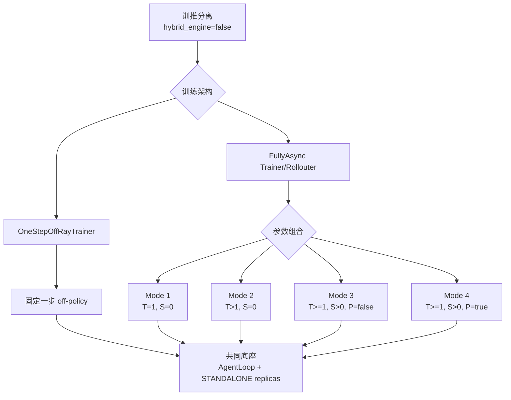
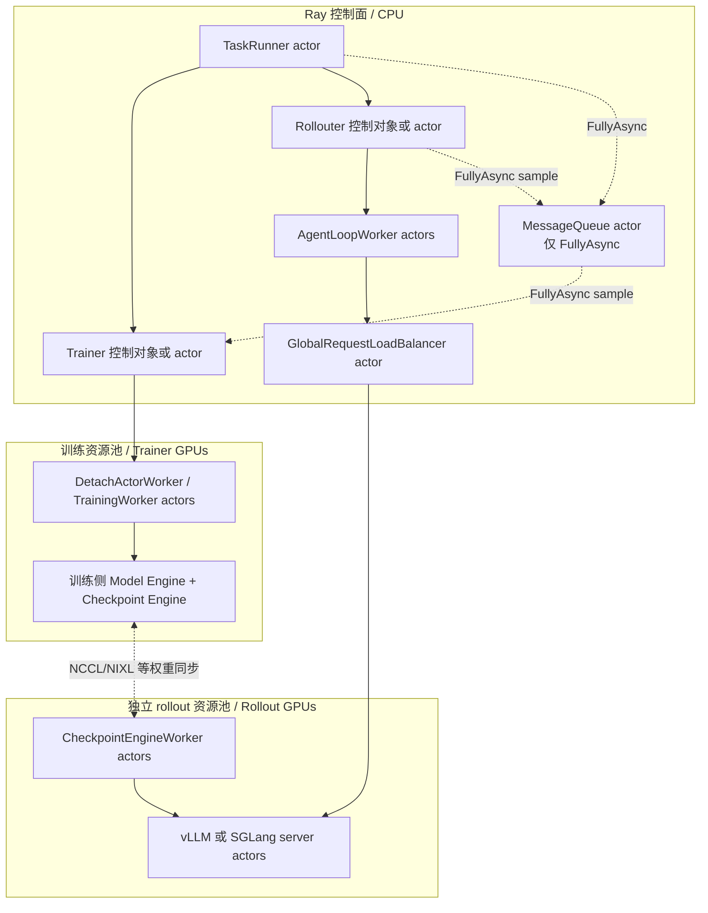
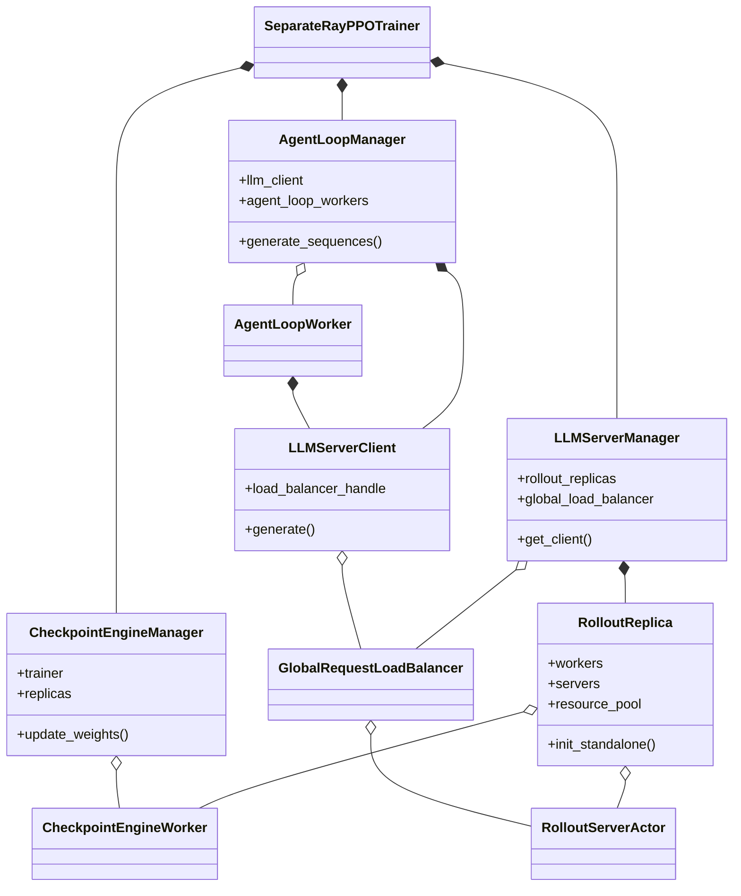
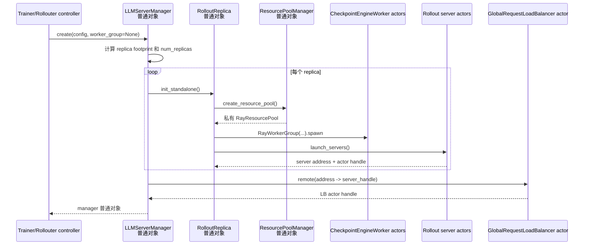
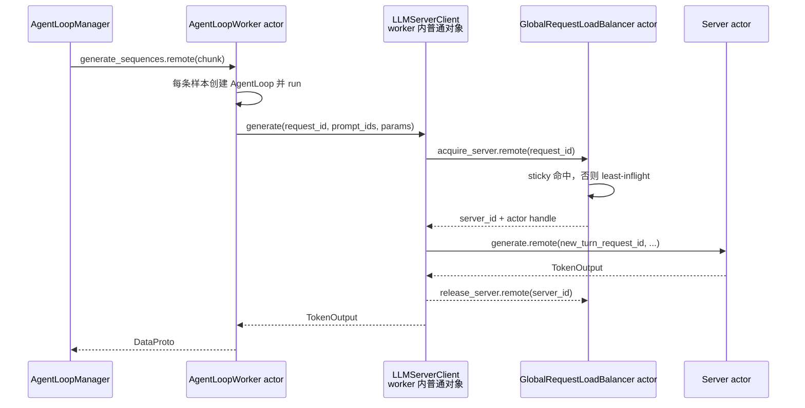
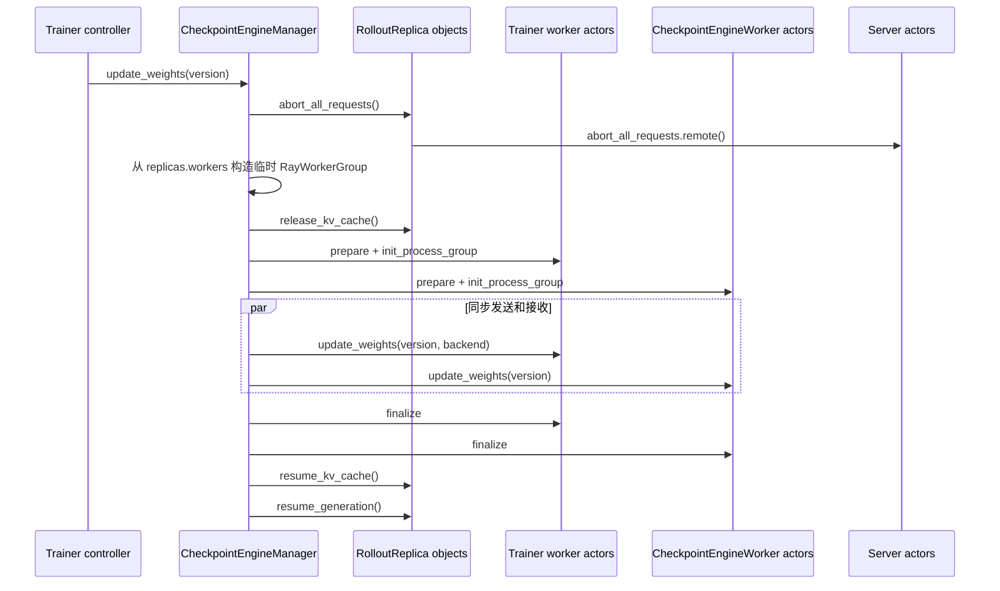
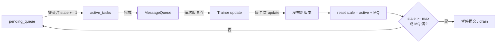

# verl v0.8.0 训推分离异步模式总览

> 基线：`/Users/nyp/Documents/verl`，tag `v0.8.0`，commit
> `7aed6b230776f963fa09509c10d9c3a767d1102c`。本文只描述代码中已经存在的运行路径；后续多任务资源共享设计见
> [09-verl-async-standalone-runtime-research.md](09-verl-async-standalone-runtime-research.md)。

## 1. 结论：两层模式，不是五条互不相关的实现

verl v0.8.0 的训推分离异步实现分为两层：

1. **训练架构**有两条代码入口：
   - `OneStepOffRayTrainer`：最多只有一个下一批生成 future，形成固定的一步 off-policy；
   - `FullyAsyncTrainer + FullyAsyncRollouter + MessageQueue`：生产者和消费者独立运行，按 sample 流式解耦。
2. **FullyAsync 参数子模式**由三个参数组合得到 4 种行为：
   - Mode 1：on-policy pipeline；
   - Mode 2：stream off-policy pipeline；
   - Mode 3：async stream pipeline with stale samples；
   - Mode 4：async stream pipeline with partial rollout。

`actor_rollout_ref.rollout.mode=async` 只是共同的 **AgentLoop 请求执行底座**，表示请求通过
`AgentLoopWorker → LLMServerClient → GlobalRequestLoadBalancer → server actor` 执行；它本身不等于训推异步。



符号：`T=trigger_parameter_sync_step`，`S=staleness_threshold`，`P=partial_rollout`。

## 2. 文档拆分

| 文档 | 模式 | 核心差异 |
|---|---|---|
| [11](11-verl-separated-one-step-off-policy.md) | One-Step Off-Policy | batch future 与训练固定错开一步，无 MessageQueue |
| [12](12-verl-fully-async-mode1-on-policy-pipeline.md) | FullyAsync Mode 1 | `T=1,S=0`，每个训练小批后同步 |
| [13](13-verl-fully-async-mode2-stream-off-policy.md) | FullyAsync Mode 2 | `T>1,S=0`，多次本地更新后同步 |
| [14](14-verl-fully-async-mode3-stale-samples.md) | FullyAsync Mode 3 | `S>0,P=false`，允许跨版本完整 sample 缓冲 |
| [15](15-verl-fully-async-mode4-partial-rollout.md) | FullyAsync Mode 4 | `S>0,P=true`，同步中断后续生成并允许单 trajectory 跨版本 |

## 3. 共同部署底座

纯训推分离应设置 `actor_rollout_ref.hybrid_engine=false`；FullyAsync 还应设置
`async_training.use_trainer_do_validate=false`，否则会额外在训练 worker group 上初始化用于验证的 HYBRID replicas，
不再是纯粹的训练 GPU / rollout GPU 隔离。



关键点：每个 `RolloutReplica.init_standalone()` 都自己创建一个私有 `ResourcePoolManager`、placement group 和
`CheckpointEngineWorker` worker group。`LLMServerManager` 没有创建一个覆盖全部 rollout GPU 的公共资源池。

## 4. 共同类和引用关系

下图中的 `*--` 表示对象持有，`o--` 表示持有 actor handle 或可跨进程序列化的引用，`..>` 表示调用依赖。



`LLMServerManager`、`RolloutReplica`、`AgentLoopManager`、`LLMServerClient`、`CheckpointEngineManager` 都是创建它们的
controller 进程中的普通 Python 对象；LB、AgentLoopWorker、CheckpointEngineWorker 和推理 server 才是 Ray actor。

## 5. STANDALONE replica 启动调用链



replica 数量的基础公式为：

```text
replica_world_size = TP * DP * PP
num_replicas = (rollout.nnodes * rollout.n_gpus_per_node) / replica_world_size
```

开启 PD disaggregation 时 footprint 改为 prefill/decode 两部分之和，代码在
`LLMServerManager._initialize_llm_servers()` 中重新计算。

## 6. 共同请求调用链



LB 的 `request_id → server_id` 是跨 turn 的 sticky 映射；发给 server 的每一 turn 使用新的 request id。LB 只统计
in-flight 请求数，不拥有 replica 生命周期，也不执行权重同步。

## 7. 权重同步共同调用链

One-Step 和 FullyAsync 都通过 `CheckpointEngineManager.update_weights()` 将训练权重推到独立 rollout workers：
其 backend 拓扑、两跳数据面、控制面状态机及与 HYBRID naive 分支的差异，详见
[17-verl-checkpoint-engine-runtime.md](17-verl-checkpoint-engine-runtime.md)。



这里的临时 `RayWorkerGroup` 只是包装已有 worker handles，并不新建 GPU actors。`backend=naive` 是例外：它直接调用
trainer worker 的 `update_weights`，主要服务共卡/验证路径；纯分离配置使用 NCCL 等非 naive backend。

## 8. 模式对比

| 维度 | One-Step | FullyAsync Mode 1 | Mode 2 | Mode 3 | Mode 4 |
|---|---|---|---|---|---|
| 控制器 | 一个 TaskRunner actor 内的普通 trainer | Trainer actor + Rollouter actor + Queue actor | 同左 | 同左 | 同左 |
| 传输单位 | 完整 batch future | 单 sample 入队，训练端拼批 | 同左 | 同左 | 同左 |
| 训练/生成重叠 | 固定下一 batch | 流式，但每小批后同步 | 流式、多小批后同步 | 允许旧版本缓冲 | 允许旧版本缓冲和跨版本 trajectory |
| stale 上限 | 固定约一步 | `S=0` | `S=0`，但同一 rollout 版本支撑多个 trainer 更新 | `S>0` | `S>0` |
| partial resume | 不使用 FullyAsync client | 无实际收益 | 无实际收益 | 关闭 | 开启 |
| 背压 | 等待单个 future | queue / `staleness_samples` | 同左 | 同左 | 同左 |
| 动态扩缩原生程度 | 无物理 create/destroy | FullyAsync manager 仅能激活预注册 HYBRID replicas | 同左 | 同左 | 同左 |

## 9. 陈旧度与 off-policy 控制全景

陈旧度控制和 off-policy 修正不是同一件事。前者限制 rollout 相对 Trainer 领先多少；后者处理已经进入训练 batch 的行为策略数据
与当前训练策略之间的分布差异。

### 9.1 三个策略版本

```text
π_rollout：实际生成 token 并输出 rollout_log_probs 的行为策略
π_old：PPO proximal anchor
π_θ：正在执行 optimizer update 的当前训练策略
```

- FullyAsync recipe 默认 `bypass_mode=true`，令 `π_old=π_rollout`，使用两策略 PPO；
- `bypass_mode=false` 时 Trainer 重新计算 `old_log_probs`，形成 `π_rollout → π_old → π_θ` 三策略 Decoupled 路径；
- temporal lag、不同推理/训练 backend 和 partial trajectory 都可能使 `π_rollout != π_θ`。

### 9.2 系统侧 freshness/backlog 控制

FullyAsync 定义：

```text
R = ppo_mini_batch_size * require_batches
T = trigger_parameter_sync_step
S = staleness_threshold
max_required_samples = int(R * T * (1 + S))
max_queue_size = max_required_samples
```

`staleness_samples` 在 Rollouter 从 `pending_queue` 取出一个 sample、准备提交 generation 时加一。达到
`max_required_samples`，或 MessageQueue 达到 `max_queue_size` 后，processor 停止提交并进入 pause/drain。权重同步后：

```text
staleness_samples = len(active_tasks) + message_queue_size
```

上一版本的 active tasks 和 MQ backlog 会占用下一版本的预算。MessageQueue 满时会丢弃最老 sample，但它按容量而非 policy
version 丢弃。



这是一种 **sample 数量预算**，不是严格版本界限：没有 `max_policy_version_lag`，一个超长 partial trajectory 也可能跨多个版本。

### 9.3 版本记录与监控

FullyAsync client 为每段生成读取 server 返回的 `global_steps`：

- `min_global_steps`：trajectory 第一段生成版本；
- `max_global_steps`：最后一段生成版本；
- `max_partial_span=max-min`：跨版本跨度；
- `trajectory_param_versions=max_global_steps`：Trainer 用来判断 stale trajectory 的版本；
- `current_param_version - trajectory_version >= 1` 时累计 `stale_trajectory_processed`。

这些字段只用于 batch metadata 和指标。v0.8.0 没有在 Trainer 出队时按版本过滤、拒绝或重新生成 sample，也没有根据
`max_partial_span` 阻止训练。

### 9.4 数据侧行为策略保真

所有分离模式要求 rollout 计算 `rollout_log_probs`。Partial resume 会按生成片段追加 token 和对应 log prob，因此跨 V0/V1 的
trajectory 仍保留逐 token 的行为策略概率，而不是把整条 trajectory 假装成同一版本。

### 9.5 默认算法保护

FullyAsync recipe 默认：

```yaml
actor_rollout_ref:
  rollout:
    calculate_log_probs: true
  actor:
    use_rollout_log_probs: true
algorithm:
  rollout_correction:
    bypass_mode: true
    rollout_is: null
    rollout_rs: null
    loss_type: ppo_clip
```

`apply_bypass_mode()` 设置 `old_log_probs=rollout_log_probs`，actor 使用
`ratio=π_θ/π_rollout` 的 PPO clipped objective。PPO clipping 限制单次策略更新，但不能把 stale 数据变成 on-policy，也不是版本
跨度的硬保证。

### 9.6 可选 Rollout Correction

`algorithm.rollout_correction` 还支持：

| 机制 | 配置 | 真正作用 |
|---|---|---|
| Token/Sequence TIS | `rollout_is=token/sequence` | 按 `π_target/π_rollout` 计算并截断 IS 权重 |
| IcePop 风格双边界 | `rollout_is_threshold=lower_upper` | 超界权重置零，区间内使用 IS |
| Rejection Sampling | `rollout_rs=...` | 修改 `response_mask`，真正排除异常 token/sequence |
| Decoupled PPO | `bypass_mode=false` | 单独计算 `π_old`，修正 `π_rollout→π_old`，再由 PPO 约束 `π_old→π_θ` |
| Bypass PPO | `bypass_mode=true,loss_type=ppo_clip` | 默认两策略路径，PPO ratio/clipping |
| Bypass PG | `bypass_mode=true,loss_type=reinforce` | 使用显式 IS 权重的 policy gradient |

在 Decoupled 路径中，`SeparateRayPPOTrainer._fit_compute_advantage()` 调用
`compute_rollout_correction_and_add_to_batch()`，将 IS 权重加入 batch，并通过 rejection mask 修改 `response_mask`。在 bypass
路径中，actor 的 `bypass_mode` loss 根据当前 `π_θ/π_rollout` 计算 correction 和指标。

### 9.7 各模式实际控制能力

| 模式 | sample 数量陈旧度 | 版本陈旧度 | partial span | 默认算法保护 |
|---|---|---|---|---|
| One-Step | 单 future，结构上固定落后一步 | 无显式版本阈值 | 不支持 partial | rollout log prob + PPO/correction 配置 |
| Mode 1 | `S=0,T=1`，每批暂停同步 | 无出队版本过滤 | 正常无 in-flight | bypass PPO-clip |
| Mode 2 | `S=0,T>1`，窗口内 R×T | 同一 rollout 版本支撑 T 次更新 | 正常无 in-flight | bypass PPO-clip，可选 Decoupled/IS/RS |
| Mode 3 | `S>0`，允许额外完整 stale samples | 只观测、不拒收 | partial=false，不续跑 | 同上 |
| Mode 4 | `S>0`，active + MQ 共同占预算 | 只观测、不拒收 | 记录 span，但无上限 | 同上，逐 token 保留分段 log prob |

### 9.8 v0.8.0 没有提供的硬控制

- 没有 `max_sample_policy_lag`；
- 没有 `max_partial_version_span`；
- 没有 version-aware MessageQueue admission/dequeue；
- 没有过旧 sample 的 drop/regenerate；
- 没有根据 IS divergence、ESS 或 partial span 自动暂停 rollout；
- 默认没有启用额外 IS/RS（均为 `null`）。

因此项目当前是“有界 backlog + 行为 log-prob + PPO/可选 correction + 指标观测”，而不是严格的最大版本陈旧度协议。

## 10. 对多任务资源共享边界的直接含义

1. **控制入口不同**：One-Step 的 manager 在 `OneStepTaskRunner` actor 内；FullyAsync 的 manager 在
   `FullyAsyncRollouter` actor 内。GroupScheduler 的命令必须落到真正持有 manager 的 actor。
2. **FullyAsync 没有 step 级“本批全部取尽”语义**：它持续从 `pending_queue` 提交单 sample；可观测信号应使用
   `active_tasks`、MessageQueue 长度、LB in-flight 和 freshness，而不是 HYBRID 文档中的 batch exhaustion。
3. **原生弹性不是 standalone 物理扩缩**：`FullyAsyncLLMServerManager.add_replicas/remove_replicas` 操作的是初始化时绑定到
   trainer worker group 的 HYBRID replicas；基础 manager 仍只在初始化时创建 standalone replicas。
4. **权重同步持有 replica 快照**：FullyAsync Trainer 在 `set_rollouter()` 时远程获取 replica 列表后创建
   `CheckpointEngineManager`。运行期若物理增删，Rollouter 的路由集合与 Trainer 的同步集合必须原子协调更新。

## 11. 代码索引

- 两种分离训练语义：`verl/experimental/separation/ray_trainer.py:42-49`
- STANDALONE 创建：`verl/workers/rollout/llm_server.py:223-343`、`verl/workers/rollout/replica.py:189-226`
- 请求路由：`verl/workers/rollout/llm_server.py:43-220`
- AgentLoop 分发：`verl/experimental/agent_loop/agent_loop.py:393-610,1044-1125`
- 权重同步：`verl/checkpoint_engine/base.py:345-515`
- One-Step 入口：`verl/experimental/one_step_off_policy/main_ppo.py:34-104`
- FullyAsync 入口：`verl/experimental/fully_async_policy/fully_async_main.py:35-210`
- FullyAsync 四模式说明：`docs/advance/fully_async.md:190-238`
- freshness/backlog：`verl/experimental/fully_async_policy/fully_async_rollouter.py:529-595,848-932,1077-1100`
- partial 版本记录：`fully_async_rollouter.py:51-151`、`detach_utils.py:145-170`
- stale 指标：`fully_async_trainer.py:751-768`
- 默认/可选 correction：`verl/experimental/separation/ray_trainer.py:499-610`、
  `verl/trainer/ppo/rollout_corr_helper.py:779-1140`、`docs/algo/rollout_corr.md`
