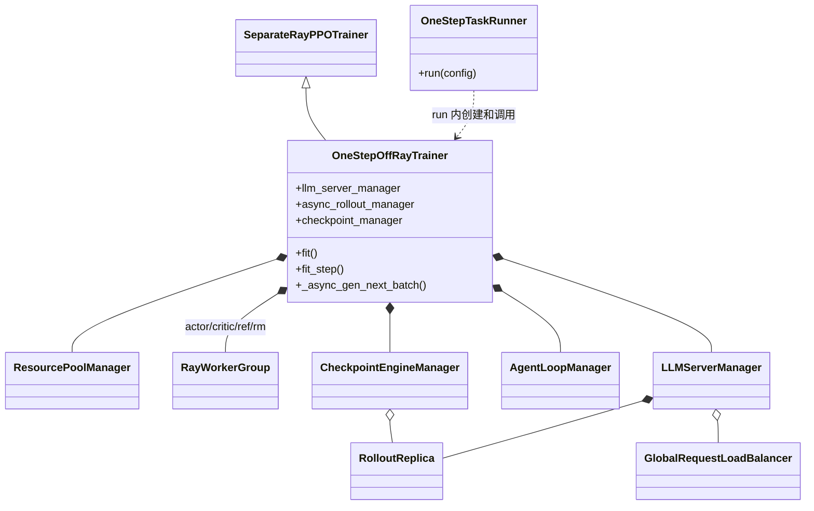
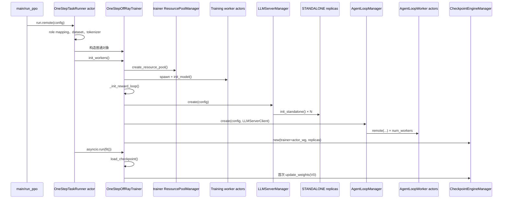
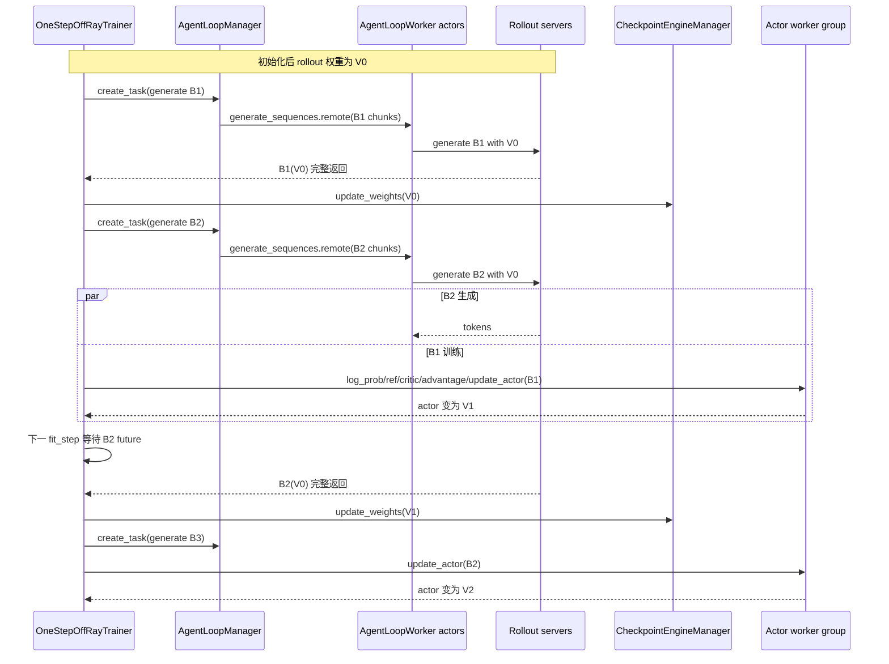

# verl v0.8.0 训推分离模式：One-Step Off-Policy

> 本文对应 `verl/experimental/one_step_off_policy/`。共同的 STANDALONE replica、AgentLoop、LB 和权重同步底座见
> [10-verl-separated-async-mode-overview.md](10-verl-separated-async-mode-overview.md)。

## 1. 模式语义

One-Step 的核心不是“每个请求异步”，而是控制器始终只维护一个 **下一批生成 future**：

- 等待 batch `k` 生成完成；
- 先把当前 trainer 权重同步到 rollout；
- 立即启动 batch `k+1` 生成；
- 同时用 batch `k` 更新 trainer。

所以 batch `k+1` 使用的是训练 batch `k` **之前**的权重，固定落后一次 actor update。它没有样本队列，也不允许 rollout
任意领先训练多个 batch。

```text
初始 rollout 权重 V0
生成 B1(V0) → 启动 B2(V0) ∥ 训练 B1 得到 V1
等待 B2     → 同步 V1 → 启动 B3(V1) ∥ 训练 B2 得到 V2
```

## 2. 配置和入口

入口是 `main_ppo.py → run_ppo(config, task_runner_class=OneStepTaskRunner)`。`main()` 会把顶层
`rollout.nnodes/n_gpus_per_node` 复制到 `actor_rollout_ref.rollout`，将 rollout GPU 与 trainer GPU 分开声明。

必要配置：

| 配置 | 代码要求/作用 |
|---|---|
| `actor_rollout_ref.hybrid_engine=false` | 构造函数直接断言；训练和推理 GPU 分离 |
| `actor_rollout_ref.rollout.mode=async` | `_init_async_rollout_manager()` 断言，启用 AgentLoop server path |
| `rollout.nnodes`, `rollout.n_gpus_per_node` | 独立 rollout GPU 规模 |
| `rollout.checkpoint_engine.backend=nccl` | 默认 recipe 的跨资源池权重同步 |
| `rollout.free_cache_engine=false` | recipe 明确要求，避免破坏同步路径 |
| `rollout.calculate_log_probs=true` | rollout 输出训练所需 log probs |
| `algorithm.rollout_correction.bypass_mode=true` | 直接使用 rollout log probs |

## 3. 组件和部署图

```mermaid
flowchart TB
    subgraph D[提交进程 / Ray driver]
        MAIN[Hydra main + run_ppo]
    end

    subgraph C[OneStepTaskRunner Ray actor / CPU]
        TR[OneStepTaskRunner]
        T[OneStepOffRayTrainer<br/>普通对象]
        LSM[LLMServerManager<br/>普通对象]
        ALM[AgentLoopManager<br/>普通对象]
        CEM[CheckpointEngineManager<br/>普通对象]
        RPM[trainer ResourcePoolManager<br/>普通对象]
    end

    subgraph A[Ray CPU actors]
        ALW[AgentLoopWorker actors]
        LB[GlobalRequestLoadBalancer actor]
        RW[RewardLoopWorker actors<br/>条件组件]
    end

    subgraph TG[Trainer GPUs]
        ACT[DetachActorWorker actors]
        CRIT[Critic TrainingWorker actors<br/>条件组件]
        REF[RefPolicy actors<br/>条件组件]
        RM[RewardModel actors<br/>条件组件]
    end

    subgraph RG[Rollout GPUs]
        CEW[CheckpointEngineWorker actors]
        SV[Rollout server actors]
    end

    MAIN --> TR
    TR *-- T
    T *-- RPM
    T *-- LSM
    T *-- ALM
    T *-- CEM
    RPM --> ACT
    RPM --> CRIT
    RPM --> REF
    RPM --> RM
    ALM --> ALW
    ALW --> LB
    LB --> SV
    LSM --> CEW
    LSM --> SV
    CEM -. weights .-> ACT
    CEM -. weights .-> CEW
    ALM -. optional .-> RW
```

`OneStepTaskRunner` 是 `@ray.remote(num_cpus=10,max_concurrency=100)`；但其 `run()` 是同步方法，trainer 只是该 actor
进程中的局部变量，TaskRunner 没有保存 `self.trainer`，也没有额外控制 RPC。

## 4. 类和引用关系



直接引用关系：

| 持有者 | 被持有对象/handle | 用途 |
|---|---|---|
| TaskRunner 的 `run()` 栈 | `OneStepOffRayTrainer` 普通对象 | 初始化和驱动完整训练 |
| trainer | `actor_wg/critic_wg/ref_policy_wg/rm_wg` | 训练计算 RPC |
| trainer | `LLMServerManager` | rollout replica 与 LB 初始化 |
| trainer | `AgentLoopManager` | 完整 batch 生成 |
| trainer | `CheckpointEngineManager` | trainer→rollout 权重同步 |
| manager | `RolloutReplica` 普通对象列表 | worker/server handles 与资源池 |
| AgentLoopManager/Worker | `LLMServerClient` | 请求 LB 和 server |
| CheckpointEngineManager | trainer WG + replica 列表 | 构建同步参与者集合 |

## 5. 初始化调用时序



`role_worker_mapping.pop(Role.Rollout)` 后，trainer 资源池只创建 Actor/Critic/Ref/RM；rollout 不通过该资源池创建，而由每个
`RolloutReplica.init_standalone()` 自己申请 placement group。

## 6. 单轮与跨轮完整时序



重要顺序来自 `_fit_generate()`：先 `await batch_data_future`，再 `_fit_update_weights()`，再创建下一 generation task；
actor update 则发生在返回 `_fit_generate()` 之后。因此 B2 必然看不到 B1 的训练结果。

## 7. 贯穿例子：连续三个 batch 如何生成和更新

为了与 FullyAsync 四种模式横向比较，使用一组小参数：

```text
每个 dataloader batch = 4 条 prompt
rollout.n = 2
每个 batch = 4 个 prompt group = 8 条 trajectories
初始 trainer/rollout 权重 = V0
```

这里没有 `RolloutSample` 和 MessageQueue。“取 sample”是 TaskRunner 进程内的 trainer 直接对 dataloader iterator 调用
`next()`，一次取出完整 batch：

1. `_async_gen_next_batch()` 从 dataloader 取 `P1…P4`，为每条 prompt 生成 `uid`；
2. `repeat(n=2)` 得到 `P1a,P1b,…,P4a,P4b` 共 8 条 trajectory；
3. AgentLoopManager 把这 8 条切给 AgentLoopWorkers，LB 再路由到 rollout replicas；
4. 必须等 8 条全部完成，future `B1` 才返回；不存在“先返回 4 条就训练”的路径；
5. trainer 取得完整 `B1` 后，先同步当前 rollout 权重，再启动下一完整 batch 的 future，最后训练 `B1`。

三个 batch 的版本变化如下：

| 时间 | dataloader/rollout | Trainer 取到什么 | Trainer 动作 | 版本结果 |
|---|---|---|---|---|
| 0 | 生成 `B1={P1…P4}×2` | 等完整 B1 | 不训练 | B1 由 V0 生成 |
| 1 | B1 完成 | 取完整 B1 | 再次同步 V0，启动 B2 | rollout 仍为 V0 |
| 2 | B2 与 B1 训练并行 | 持有 B1 | 用 B1 更新 | trainer V0→V1，B2 仍由 V0 生成 |
| 3 | B2 完成 | 取完整 B2 | 同步 V1，启动 B3 | rollout V0→V1 |
| 4 | B3 与 B2 训练并行 | 持有 B2 | 用 B2 更新 | trainer V1→V2，B3 由 V1 生成 |
| 5 | B3 完成 | 取完整 B3 | 同步 V2，启动 B4 | rollout V1→V2 |

### 7.1 陈旧度如何控制

One-Step 没有显式 stale counter。陈旧度由控制流结构限定：

- 任意时刻最多只有一个 `batch_data_future`；
- batch `k+1` 必须在 batch `k` 的 actor update 之前启动；
- 因而 batch `k+1` 相对训练完成后的模型固定落后一次 actor update；
- 不存在可让 rollout 连续领先两批、三批的 MessageQueue。

这里的“固定一步”以 **完整训练 batch** 为单位，不是单 trajectory，也不是 optimizer 内部的 mini-batch 次数。

### 7.2 partial rollout 如何处理

此模式不使用 `FullyAsyncLLMServerClient`，也没有 `partial_rollout` 配置语义。权重同步发生在上一完整 batch 已返回、下一 batch 尚未
启动的间隙，所以正常路径中没有需要 abort-resume 的当前 generation。某一条 trajectory 很长时，整个 B1 future 仍会等待它；
不能先训练已经完成的其他 trajectories。

因此该模式缓解的是 **B2 与训练 B1 的阶段气泡**，没有消除单个 batch 内最慢 trajectory 导致的 barrier。

## 8. 陈旧度与 off-policy 控制逻辑

### 8.1 结构性陈旧度上限

One-Step 没有 `staleness_threshold` 和 stale counter。它通过单个 `batch_data_future` 将领先量固定为一个完整 batch：

```text
等待 Bk 完成
→ 同步当前 Trainer 权重
→ 只启动一个 Bk+1 future
→ 用 Bk 更新 Trainer
```

因此 `Bk+1` 最多落后一次 actor update，且不会继续生成 `Bk+2`。这是控制流保证，不是运行时版本检查；代码没有
`current_version-sample_version` 的拒收逻辑，也没有 stale/partial 指标。

### 8.2 行为策略 log prob

rollout 必须设置 `calculate_log_probs=true`。每条 trajectory 携带生成它的 `rollout_log_probs`，默认
`rollout_correction.bypass_mode=true` 时：

```text
old_log_probs = rollout_log_probs
PPO ratio = π_current / π_rollout
```

例如 B2 由 V0 生成、Trainer 已是 V1 时，PPO 使用 B2 中 V0 的实际 log prob，而不是把 V1 错当成行为策略。

### 8.3 PPO clipping 与可选 correction

- 默认 `loss_type=ppo_clip`，clip ratio 限制 V1 相对 V0 的单次更新幅度；
- `rollout_is` 和 `rollout_rs` 默认仍为 `null`，没有额外 TIS/RS；
- 可配置 `bypass_mode=false`，重新计算 `π_old`，再启用 token/sequence IS 或 rejection sampling；
- rejection sampling 会修改 `response_mask`，IS 会为 actor loss 增加 `rollout_is_weights`。

One-Step 的固定一步结构降低了 temporal lag，但 backend/精度差异仍可能产生 rollout/trainer policy mismatch，所以算法 correction
与陈旧度结构控制是互补关系。

### 8.4 不存在 partial rollout

该模式不使用 `FullyAsyncLLMServerClient`。权重同步位于上一 batch 已完整返回、下一 batch 尚未启动的空档，不会把一条 trajectory
切成多版本片段；长尾请求只能让完整 batch future 继续等待。

## 9. 对动态资源共享的边界

1. **真正控制点在 TaskRunner actor 进程内**，但当前 `run()` 没有把 trainer/manager 提升为成员；外部无法直接命令 manager。
2. **batch future 是同步边界**：扩缩影响下一次请求分发最容易；若要求请求中实时扩缩，需要 LB 和 server 生命周期支持。
3. **没有生产者队列**：可用于调度的需求信号主要是当前 batch 未完成数、LB in-flight、下一批是否已启动，而不是 queue 深度。
4. **standalone replica 只有初始化创建**：基础 manager 没有物理 create/destroy；其文档注释中的 elastic 职责尚未由基础类接口兑现。
5. **同步集合需同步变化**：新增 replica 除了加入 LB，还必须加入 `CheckpointEngineManager.replicas` 并加载正确版本权重。

## 10. 代码索引

- TaskRunner：`verl/experimental/one_step_off_policy/main_ppo.py:34-104`
- trainer 构造与角色：`verl/experimental/one_step_off_policy/ray_trainer.py:50-169`
- manager 初始化：`verl/experimental/one_step_off_policy/ray_trainer.py:170-197`
- batch 生成：`verl/experimental/one_step_off_policy/ray_trainer.py:207-260`
- fit 主循环：`verl/experimental/one_step_off_policy/ray_trainer.py:266-389`
- 下一批启动的精确顺序：`verl/experimental/one_step_off_policy/ray_trainer.py:390-417`
- 分离 trainer 公共初始化：`verl/experimental/separation/ray_trainer.py:42-110`
- recipe 配置：`verl/experimental/one_step_off_policy/config/one_step_off_ppo_trainer.yaml`
- off-policy 数据路径：`verl/experimental/separation/ray_trainer.py:499-610`
- Rollout Correction：`verl/trainer/ppo/rollout_corr_helper.py:779-1140`、`docs/algo/rollout_corr.md`
