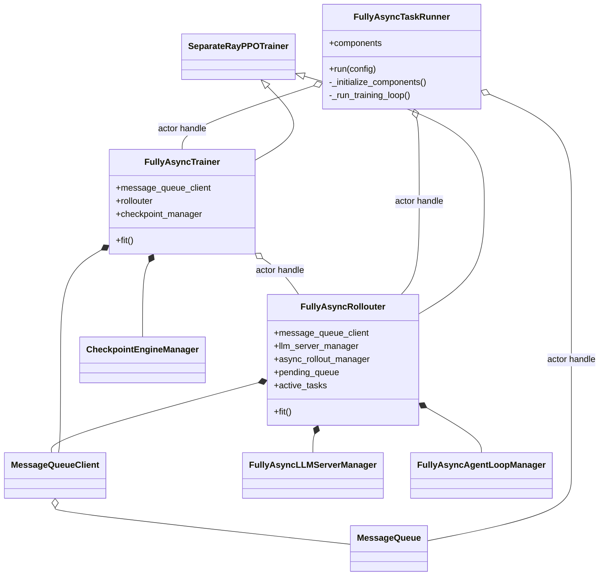
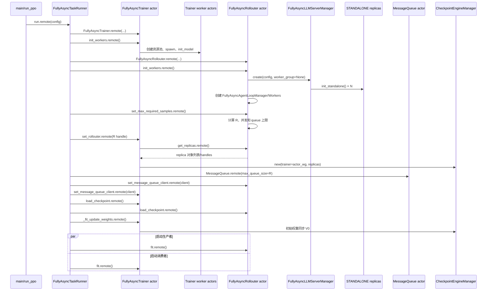
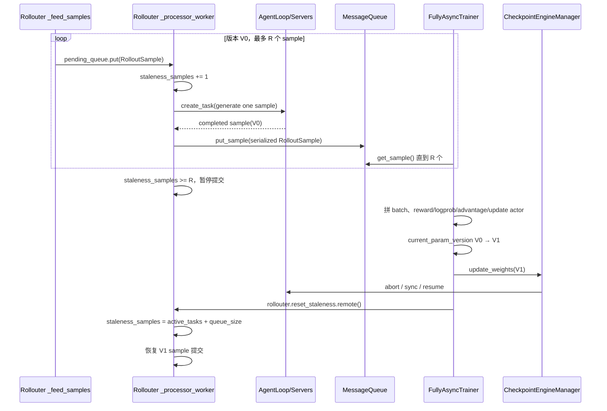
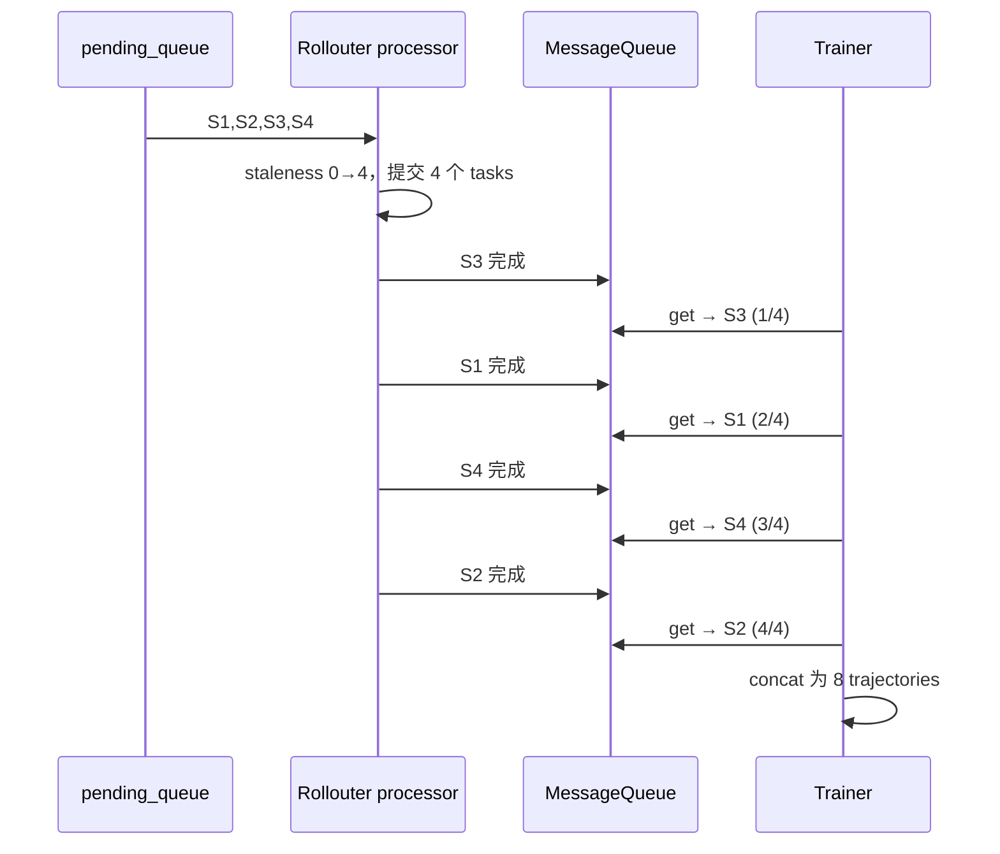

# verl v0.8.0 FullyAsync Mode 1：On-Policy Pipeline

> 参数：`trigger_parameter_sync_step=1`、`staleness_threshold=0`。`partial_rollout` 在这个模式下没有实际作用。
> 共同底座和模式层级见 [10-verl-separated-async-mode-overview.md](10-verl-separated-async-mode-overview.md)。

## 1. 模式语义

Mode 1 使用 FullyAsync 的独立 Trainer actor、Rollouter actor 和 MessageQueue，但每产生/消费一个训练批次就同步权重。
它是 FullyAsync 架构中最接近 on-policy 的配置：不允许为下一参数版本预留额外 stale sample。

定义：

```text
R = actor.ppo_mini_batch_size * async_training.require_batches
T = trigger_parameter_sync_step = 1
S = staleness_threshold = 0
max_required_samples = R * (S + 1) * T = R
max_queue_size = R
max_concurrent_samples = min(initial_replica_count * 16, R)
```

Rollouter 每个版本最多提交 `R` 个 sample；Trainer 收齐 `R` 个 sample 后更新一次 actor 并立刻同步新权重。

## 2. 部署图与进程边界

```mermaid
flowchart TB
    subgraph D[提交进程 / Ray driver]
        MAIN[fully_async_main.main + run_ppo]
    end

    subgraph C[控制面 Ray actors]
        TR[FullyAsyncTaskRunner<br/>1 CPU]
        T[FullyAsyncTrainer<br/>10 CPUs]
        R[FullyAsyncRollouter<br/>10 CPUs, max_concurrency=100]
        Q[MessageQueue<br/>2 CPUs, max_concurrency=20]
        LB[GlobalRequestLoadBalancer]
        ALW[AgentLoopWorker actors]
    end

    subgraph TG[Trainer GPU placement group]
        AW[DetachActorWorker actors]
        CW[Critic workers<br/>条件组件]
        FW[RefPolicy workers<br/>条件组件]
    end

    subgraph RG[独立 Rollout GPU placement groups]
        CEW[CheckpointEngineWorker actors]
        SV[vLLM/SGLang server actors]
    end

    MAIN --> TR
    TR o-- T
    TR o-- R
    TR o-- Q
    T o-- R
    T --> Q
    R --> Q
    T --> AW
    T --> CW
    T --> FW
    R --> ALW
    ALW --> LB
    LB --> SV
    R --> CEW
    T -. CheckpointEngineManager 权重同步 .-> CEW
```

纯分离配置下 `use_trainer_do_validate=false`。若设为 true，TaskRunner 会取出 trainer actor worker group，注入 Rollouter，
再初始化一组绑定训练 GPU 的 HYBRID 验证 replicas；这不属于本图的纯分离范围。

## 3. 类图和相互引用



引用的建立顺序很重要：TaskRunner 先创建 Trainer，后创建 Rollouter；随后调用
`trainer.set_rollouter(rollouter_handle)`，Trainer 才能远程取 replicas 并构造 `CheckpointEngineManager`。最后创建一个
MessageQueue actor，并把包装同一 queue handle 的 `MessageQueueClient` 传给两端。

## 4. 完整初始化时序



## 5. sample 生产、消费与同步时序



因为 `S=0`，freshness 上限只覆盖当前训练批次。正常稳定路径中，Trainer 收齐 R 个完成 sample 时，Rollouter 已达到上限并
停止追加；因此下一批不能在权重同步前用 V0 大量预生成。

## 6. 请求级调用流程

每个 `RolloutSample` 的调用链为：

```text
_processor_worker
  → _process_single_sample_streaming
  → FullyAsyncAgentLoopManager.generate_sequences_single
  → 一个 AgentLoopWorker.generate_sequences.remote
  → AgentLoop.run
  → FullyAsyncLLMServerClient.generate
  → GlobalRequestLoadBalancer.acquire_server
  → rollout server.generate
  → LB.release_server
  → MessageQueue.put_sample
```

`FullyAsyncAgentLoopManager` 对 AgentLoopWorkers 做 round-robin；真正选择 rollout server 的是全局 LB，采用 sticky +
least-inflight。

## 7. 贯穿例子：四个 sample 形成一次 on-policy 更新

统一使用以下小参数：

```text
ppo_mini_batch_size = 4
require_batches = 1
R = 4 个 RolloutSample
rollout.n = 2
T = 1, S = 0
standalone replicas = 2
max_required_samples = 4
max_concurrent_samples = min(2 * 16, 4) = 4
```

一个 `RolloutSample` 对应 dataloader 的一条原始 prompt；`prepare_single_generation_data()` 会先按 `rollout.n=2` 展开，所以每个
sample 内含两条 trajectories。Trainer 一次取 4 个 `RolloutSample`，最终拼成 8 条 trajectories。

### 7.1 sample 如何产生和取出

假设输入依次为 `S1,S2,S3,S4,S5…`：

1. `_feed_samples()` 把 S1… 放进 Rollouter actor 内的 `pending_queue`；
2. `_processor_worker()` 取出 S1 时就执行 `staleness_samples += 1`，然后创建单 sample generation task；
3. 同样提交 S2、S3、S4，计数变成 4；最多同时有 4 个 generation tasks；
4. S3 若最先生成完成，就最先 `MessageQueue.put_sample(S3)`；MQ 顺序是 **完成顺序**，不保证是输入顺序；
5. Trainer 的 `_get_samples_from_queue()` 连续调用 `get_sample()`，例如依次取到
   `S3,S1,S4,S2`；取满 4 个才调用 `assemble_batch_from_rollout_samples()`；
6. 每个 sample 有 2 条 trajectories，所以训练 batch 共 8 条 trajectories，并按需要执行 balance batch。



### 7.2 如何更新和同步

| 阶段 | rollout 版本 | Trainer 操作 | 结果 |
|---|---|---|---|
| 生成 | V0 | 等待取满 4 个 sample | S1—S4 都由 V0 生成 |
| 训练 | V0 | reward、log prob、advantage、actor update | trainer V0→V1 |
| 版本推进 | V0 | `local_trigger_step` 达到 T=1，`current_param_version += 1` | 发布版本变成 V1 |
| 同步 | V0 | `CheckpointEngineManager.update_weights(V1)` | rollout V0→V1 |
| 恢复 | V1 | `rollouter.reset_staleness()` | 开始提交 S5—S8 |

### 7.3 陈旧度如何控制

`S=0,T=1` 时 `max_required_samples=4`。计数发生在 sample 从 pending queue 取出并准备提交时，因此提交 S1—S4 后即达到上限，
processor 不会继续提交 S5。Trainer 能取满 4 个说明这 4 个 sample 已完成；正常路径下同步时 `active_tasks=0`、MQ 也已被取空，
`reset_staleness()` 得到 0，下一窗口从 S5 开始。

如果 Trainer 取满时 MQ 又并发进入了额外 sample，那会在 reset 时以 `queue_size` 计入下一窗口；但 S=0 的提交上限本身就是用来
阻止这种正常超前。

### 7.4 partial rollout 是否生效

即使配置写成 `partial_rollout=true`，在 `S=0` 的正常流程中也没有实际收益：权重同步要等 Trainer 取满当前 4 个已完成 sample，
Rollouter 又已停止提交新任务，因此通常没有 in-flight 请求可恢复。CheckpointEngineManager 仍会调用 abort RPC，但目标集合为空闲。

## 8. 陈旧度与 off-policy 控制逻辑

### 8.1 `S=0,T=1` 的 sample 预算

```text
max_required_samples = R
max_queue_size = R
```

Rollouter 从 pending queue 提交 R 个 sample 时，`staleness_samples` 已达到上限，processor 暂停继续取样。Trainer 必须从 MQ 取满
这 R 个完成 sample 才能更新并同步。因此正常路径中没有为下一版本提前生成的完整 stale sample。

同步后 `reset_staleness()` 使用 `active_tasks + MQ size`，而不是无条件归零。若异常并发留下 active/MQ backlog，它仍会占用下一
窗口预算。

### 8.2 版本记录和监控

每条 trajectory 仍携带 `min_global_steps/max_global_steps`，batch assembly 生成
`trajectory_param_versions=max_global_steps`。Trainer 会累计：

```text
current_param_version - trajectory_version >= 1
```

的 stale trajectories。Mode 1 正常应接近 0；该指标只是观测，不是出队过滤。MQ 若满会丢最老 sample，但按队列位置而非版本。

### 8.3 默认 off-policy 保护

- rollout 计算逐 token `rollout_log_probs`；
- `use_rollout_log_probs=true`；
- `bypass_mode=true` 设置 `old_log_probs=rollout_log_probs`；
- 默认 bypass PPO-clip 使用 `π_current/π_rollout` ratio；
- `rollout_is=null, rollout_rs=null`，额外 IS/RS 默认没有启用。

“on-policy pipeline”只表示每个同步窗口不额外预留 stale sample，并不保证 vLLM/SGLang 与训练 backend 的数值概率完全一致。
若对 backend mismatch 敏感，仍可启用 Rollout Correction 的 IS/RS。

### 8.4 可选强化控制

设置 `bypass_mode=false` 后，Trainer 重新计算稳定的 `π_old`；可进一步配置 token/sequence TIS 或 rejection sampling，分别对偏离
数据加权或修改 `response_mask` 予以排除。这会增加 old-log-prob forward 成本。

### 8.5 partial 边界

即使 `partial_rollout=true`，`S=0` 正常也没有 active 请求跨同步点。代码没有单独禁止 partial span，但 Mode 1 的 R-sample
barrier 使其通常为 0；若出现非零 `max_partial_span`，应视为需要排查的异常时序，而不是该模式的设计目标。

## 9. 对资源共享的含义

1. 调度信号应取自 Rollouter 的 `active_tasks`、pending queue、MessageQueue 和 LB，而不是 Trainer step。
2. 当前 `max_concurrent_samples` 只在初始化时按初始 replica 数计算；运行时扩容不会自动提升提交并发。
3. `S=0` 使 rollout 在每个版本更容易形成明确暂停窗口，适合作为 FullyAsync 动态生命周期的低风险起点。
4. 物理增删 standalone replicas 仍需补齐 placement group、LB、CheckpointEngineManager 和权重版本的一致更新。

## 10. 代码索引

- TaskRunner 编排：`verl/experimental/fully_async_policy/fully_async_main.py:35-210`
- Rollouter 初始化/上限计算：`fully_async_rollouter.py:393-590`
- Rollouter worker 初始化：`fully_async_rollouter.py:686-814`
- 流式生产：`fully_async_rollouter.py:815-1037`
- freshness 判断：`fully_async_rollouter.py:1048-1100`
- Trainer 取样和训练：`fully_async_trainer.py:275-536`
- MessageQueue：`message_queue.py:26-145`
- recipe：`config/fully_async_ppo_trainer.yaml`
- 版本/partial 指标：`detach_utils.py:145-170`、`fully_async_trainer.py:751-768`
- off-policy 数据路径：`verl/experimental/separation/ray_trainer.py:499-610`
- Rollout Correction：`verl/trainer/ppo/rollout_corr_helper.py:779-1140`、`docs/algo/rollout_corr.md`
