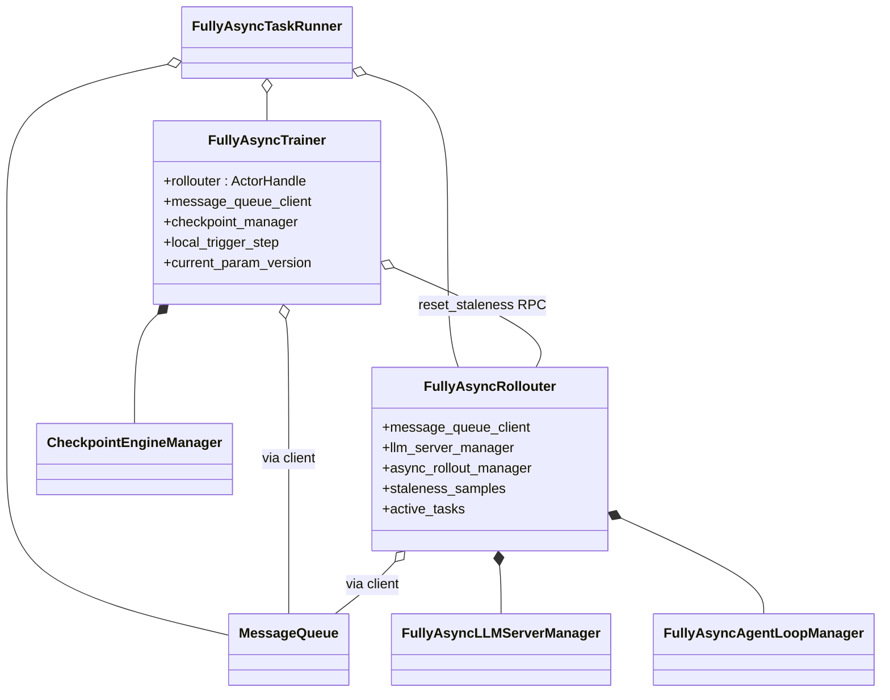
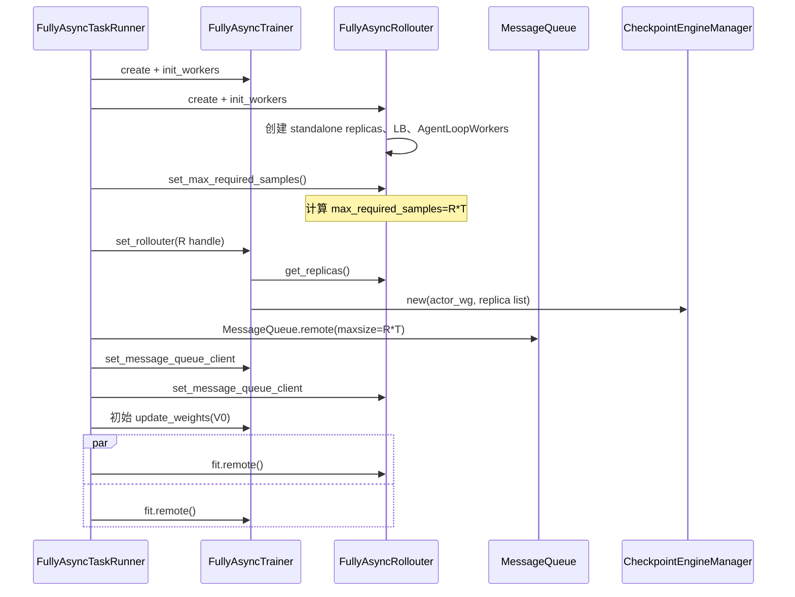
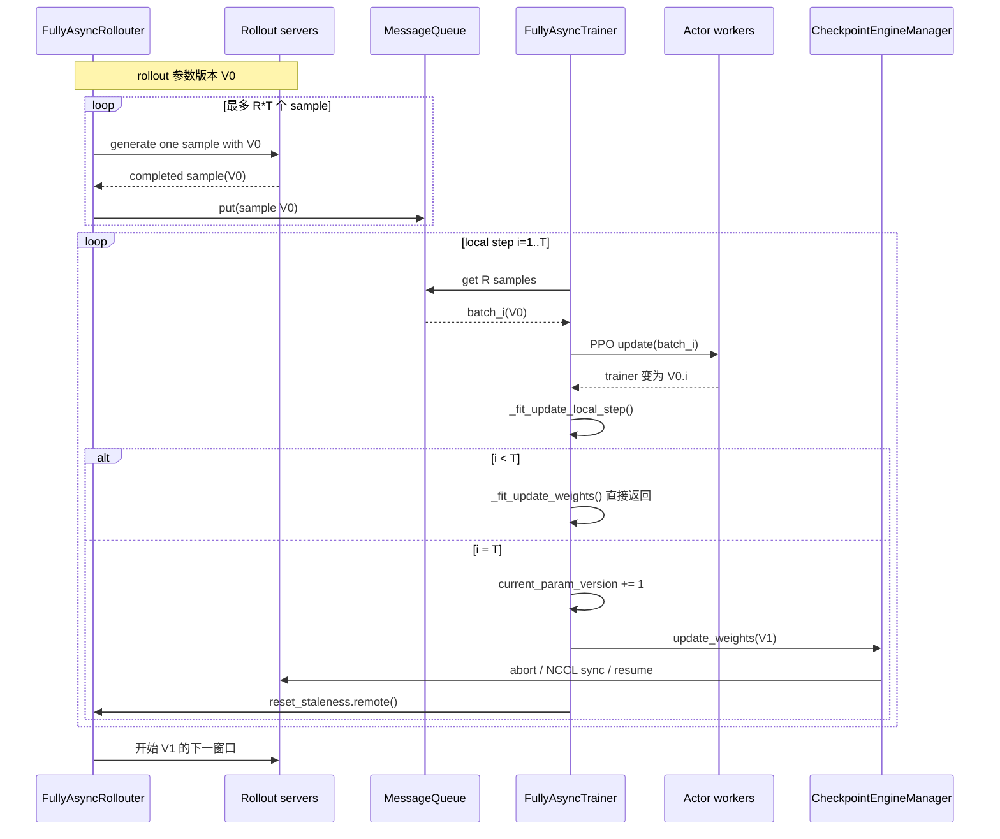
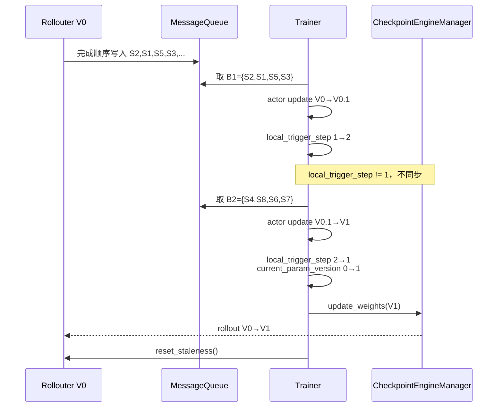

# verl v0.8.0 FullyAsync Mode 2：Stream Off-Policy Pipeline

> 参数：`trigger_parameter_sync_step=T>1`、`staleness_threshold=0`。共同组件和启动底座见
> [10](10-verl-separated-async-mode-overview.md)，与每批同步的对照见
> [12](12-verl-fully-async-mode1-on-policy-pipeline.md)。

## 1. 模式语义

Mode 2 在一个 rollout 权重版本内执行 `T` 次 Trainer 本地更新，完成后才把最新权重同步给 Rollouter。它是
**流式传样 + 同步版本窗口 + 窗口内 off-policy**：

```text
R = ppo_mini_batch_size * require_batches
max_required_samples = R * T
max_queue_size = R * T
max_concurrent_samples = min(initial_replica_count * 16, R * T)
```

Rollouter 用 V0 生成最多 `R*T` 个 sample；Trainer 每收齐 R 个就更新一次：V0→V0.1→…→V1。第 T 次更新后才执行
rollout 权重同步。`staleness_threshold=0` 不代表窗口内每次更新都 on-policy，而是禁止再额外跨窗口积累 stale sample。

## 2. 部署图

```mermaid
flowchart LR
    subgraph CONTROL[Ray 控制 actors]
        TR[FullyAsyncTaskRunner]
        RO[FullyAsyncRollouter]
        MQ[MessageQueue]
        TE[FullyAsyncTrainer]
    end
    subgraph ROLLOUT[独立 Rollout GPUs]
        CEW[CheckpointEngineWorkers]
        SERVERS[Rollout servers V0]
    end
    subgraph TRAIN[Trainer GPUs]
        ACT[Actor workers<br/>V0 → V0.1 → ... → V1]
        OTHER[Critic / Ref workers<br/>条件组件]
    end
    subgraph REQUEST[请求面 CPU actors]
        ALW[AgentLoopWorkers]
        LB[GlobalRequestLoadBalancer]
    end

    TR o-- RO
    TR o-- TE
    TR o-- MQ
    RO --> ALW --> LB --> SERVERS
    RO --> MQ
    MQ --> TE
    TE --> ACT
    TE --> OTHER
    TE -. 第 T 次更新后同步 .-> CEW
    CEW --> SERVERS
```

Trainer 与 Rollouter 的 GPU、placement group 和进程完全分离；两者唯一的 sample 数据通道是 MessageQueue，权重通道是
Trainer 持有的 `CheckpointEngineManager`。

## 3. 类图与引用关系



Mode 2 不增加新类；它只改变 Rollouter 的 freshness 上限和 Trainer 的版本推进频率。`local_trigger_step` 在 1…T 之间循环，
只有回到 1 时 `_fit_update_weights()` 才真正执行。

## 4. 初始化调用流程

初始化和 Mode 1 使用同一条代码路径：



## 5. 一个完整参数窗口的时序



Rollouter 与 Trainer 可以在窗口内并行：Trainer 不必等 `R*T` 全部生成后才开始，队列每积累 R 个就能开始一次本地更新。
但同步仍只发生在第 T 次更新结束后。

## 6. 两个等待气泡

Mode 2 的典型窗口有两个边界气泡：

```mermaid
gantt
    title T=4 的一个版本窗口（示意，非等比例）
    dateFormat X
    axisFormat %s
    section Rollouter
    首批生成/Trainer 等待 :r1, 0, 2
    持续生成 V0          :r2, 2, 8
    达 freshness 上限等待同步:r3, 8, 10
    section Trainer
    等首批 R sample      :t0, 0, 2
    local update 1       :t1, 2, 4
    local update 2       :t2, 4, 6
    local update 3       :t3, 6, 8
    local update 4 + sync:t4, 8, 10
```



- 窗口开始时，Trainer 需要等第一批 R 个完成 sample；
- Rollouter 较快时会先达到 `R*T` freshness 上限，等待 Trainer 做完最后几次更新和权重同步。

相比 Mode 1，较大的生产窗口更容易用短请求填充长尾造成的空闲，但代价是后续本地更新使用更旧的 rollout policy 数据。

## 7. 贯穿例子：同一 rollout 版本支撑两次 Trainer 更新

统一使用以下参数：

```text
ppo_mini_batch_size = 4
require_batches = 1
R = 4 个 RolloutSample
rollout.n = 2
T = 2, S = 0
standalone replicas = 2
max_required_samples = R * T = 8
max_concurrent_samples = min(2 * 16, 8) = 8
```

一个版本窗口最多提交 S1—S8 共 8 个 `RolloutSample`，每个 sample 内有 2 条 trajectories。Trainer 每次只取 4 个 sample，即
每次用 8 条 trajectories 更新；一个窗口更新两次。

### 7.1 sample 如何流入两个训练批次

Rollouter 用 V0 并发生成 S1—S8。假设完成顺序为：

```text
S2, S1, S5, S3, S4, S8, S6, S7
```

MessageQueue 和 Trainer 的取样结果就是：

| Trainer batch | 从 MQ 取出的 RolloutSample | trajectory 数 | rollout 参数版本 |
|---|---|---:|---|
| B1 | S2、S1、S5、S3 | 8 | 全部 V0 |
| B2 | S4、S8、S6、S7 | 8 | 全部 V0 |

这里没有按 prompt id 重排后再划批；`get_sample()` 按 MQ deque 的完成顺序逐个 `popleft()`，每取满 R=4 个就拼成一次训练 batch。

### 7.2 两次更新如何发生



B2 虽然在 Trainer 已更新到 V0.1 后才被使用，但它仍由 rollout V0 生成。因此 `S=0` 只表示没有跨同步窗口的额外 stale buffer，
并不让窗口内第二次更新变成 on-policy。

### 7.3 陈旧度如何控制

Rollouter 从 pending queue 取出 S1—S8 时，`staleness_samples` 从 0 增至 8；达到
`max_required_samples=8` 后停止提交 S9。Trainer 取完 B1 不会 reset，只有完成 B2、发布 V1 后才 reset。

正常情况下：

```text
同步前：active_tasks = 0，MQ queue_size = 0
reset 后：staleness_samples = 0
下一窗口：S9—S16 使用 V1
```

如果 rollout 比 Trainer 慢，Trainer 可能在等待 B2 的后几个 sample；如果 rollout 更快，它会先达到 8 的上限等待同步。无论哪种
情况，代码都不允许再为下一窗口额外提交第 9 个 sample。

### 7.4 partial rollout 是否生效

与 Mode 1 相同，`S=0` 时 partial rollout 没有正常收益。Rollouter 已用固定 8 个 sample 填满窗口并在暂停分支 drain；Trainer 只有
取齐这 8 个完成 sample 才能做完第二次更新。因此同步点通常没有 in-flight 请求。该模式的 off-policy 来源是 **一次 rollout
版本对应多次 Trainer 更新**，不是单条 trajectory 跨版本。

## 8. 陈旧度与 off-policy 控制逻辑

### 8.1 `S=0` 只限制跨窗口 backlog

Mode 2 的上限是：

```text
max_required_samples = R * T
```

达到上限后 Rollouter 不再为下一发布版本额外提交 sample；同步后 reset 仍会把 active/MQ backlog 带入下一窗口。但是同一
`π_rollout=V0` 会支撑 T 次 actor update，所以 B2…BT 相对正在变化的 `π_θ` 越来越 off-policy。

### 8.2 `current_param_version` 的观测盲区

`current_param_version` 只在完成第 T 次本地更新、准备同步时加一。它表示 **已发布到 Rollouter 的窗口版本**，不记录每次 optimizer
update：

```text
B1 前：rollout=V0，trainer=V0，current_param_version=0
B1 后：rollout=V0，trainer=V0.1，current_param_version 仍为 0
B2 取样：trajectory version=0，因此 stale 指标仍判定为非 stale
```

所以 `stale_trajectory_processed` 无法反映窗口内 V0→V0.1→… 的 optimizer drift。Mode 2 的主要 off-policy 程度应同时观察
rollout correction 的 ratio/KL/ESS 指标，而不能只看版本差。

### 8.3 默认 bypass PPO

每条 trajectory 保留 V0 的逐 token `rollout_log_probs`。默认：

```text
old_log_probs = rollout_log_probs(V0)
ratio = π_current(V0.i) / π_rollout(V0)
loss = PPO clipped objective
```

因此第二次及后续更新会直接用当前训练策略与真实行为策略的 ratio；PPO clipping 限制更新，但不消除使用旧数据带来的偏差。
默认 `rollout_is/rollout_rs` 仍为 `null`。

### 8.4 Decoupled PPO 的窗口内 anchor

当 `bypass_mode=false` 时，`FullyAsyncTrainer._compute_old_log_prob()` 在 local step 1 保存 proximal 模型；local step 2…T 会：

```text
保存当前训练模型
→ 恢复窗口第一步 proximal 模型
→ 计算 old_log_probs
→ 恢复当前训练模型
```

随后 `compute_rollout_correction_and_add_to_batch()` 可用 IS 修正 `π_rollout→π_old`，PPO 再约束 `π_old→π_θ`。这是项目针对
多次本地更新提供的更强 off-policy 路径，但会增加 CPU 模型保存/恢复和 forward 成本。

### 8.5 可选 IS/RS

- `rollout_is=token/sequence`：生成截断 IS 权重并参与 actor loss；
- `rollout_rs=...`：按 ratio/KL 类统计修改 `response_mask`，真正拒绝偏离 token/sequence；
- `rollout_is_threshold` 和 `rollout_rs_threshold` 控制权重截断/拒绝边界；
- ESS、ratio fraction、masked fraction 等指标可观察窗口内漂移。

### 8.6 partial 边界

`S=0` 的正常路径在同步前已取齐 R×T 个完成 sample，所以 partial resume 没有预期作用。该模式的 off-policy 来源是一个 rollout
版本支撑 T 次 Trainer 更新，而不是 trajectory 跨版本。

## 9. 对资源共享的含义

1. 一个版本窗口有 `R*T` 的明确预算，可作为 rollout 需求和容量规划单位。
2. `S=0` 时 Rollouter 到达预算会暂停并 drain active tasks，形成相对安全的扩缩/同步窗口。
3. 扩容时除了增加 server，还需重算或动态维护 `max_concurrent_samples`；原生值初始化后固定。
4. 缩容不能只从 LB 删除：还要等 in-flight 归零、更新 Rollouter replica registry 和 Trainer checkpoint 同步集合。
5. T 越大，吞吐潜力和可调度窗口越大，但策略陈旧度也越大；GroupScheduler 不应擅自改变 T，因为它改变算法语义。

## 10. 代码索引

- freshness 公式：`verl/experimental/fully_async_policy/fully_async_rollouter.py:529-552`
- 流式提交与并发：`fully_async_rollouter.py:815-951`
- 暂停判断：`fully_async_rollouter.py:1077-1100`
- Trainer 取 R 个 sample：`fully_async_trainer.py:275-332`
- local step / 同步门控：`fully_async_trainer.py:487-535`
- old log prob 版本保存：`fully_async_trainer.py:465-486`
- 上游 Mode 2 说明：`docs/advance/fully_async.md:200-210`
- 版本/partial 指标：`detach_utils.py:145-170`、`fully_async_trainer.py:751-768`
- off-policy 数据路径：`verl/experimental/separation/ray_trainer.py:499-610`
- Rollout Correction：`verl/trainer/ppo/rollout_corr_helper.py:779-1140`、`docs/algo/rollout_corr.md`
