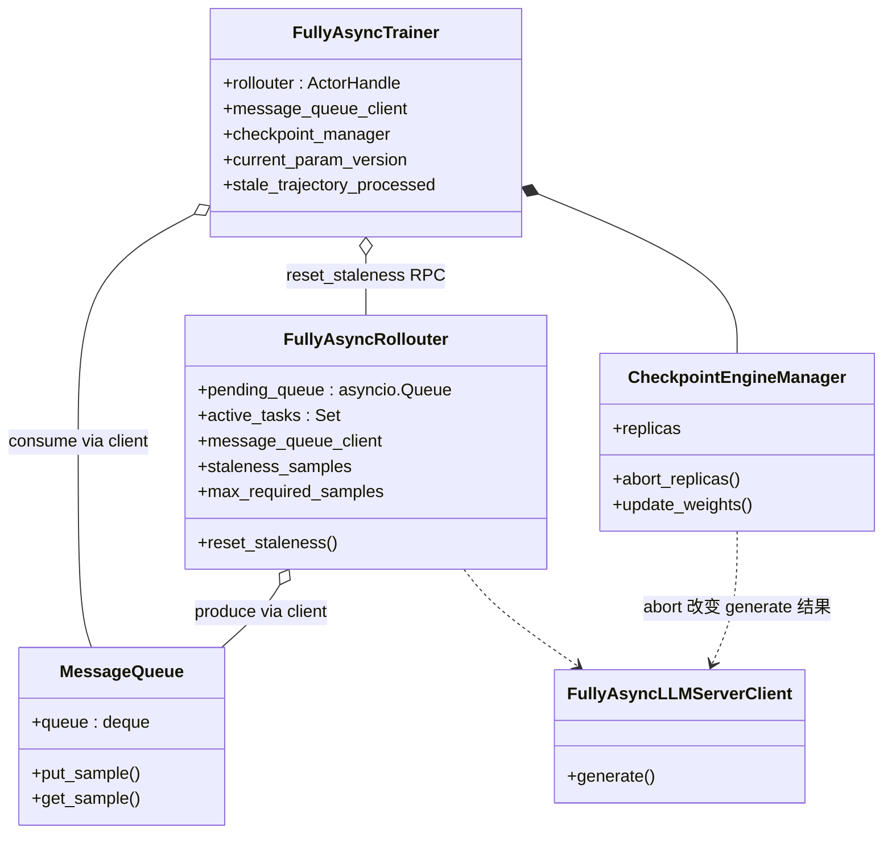
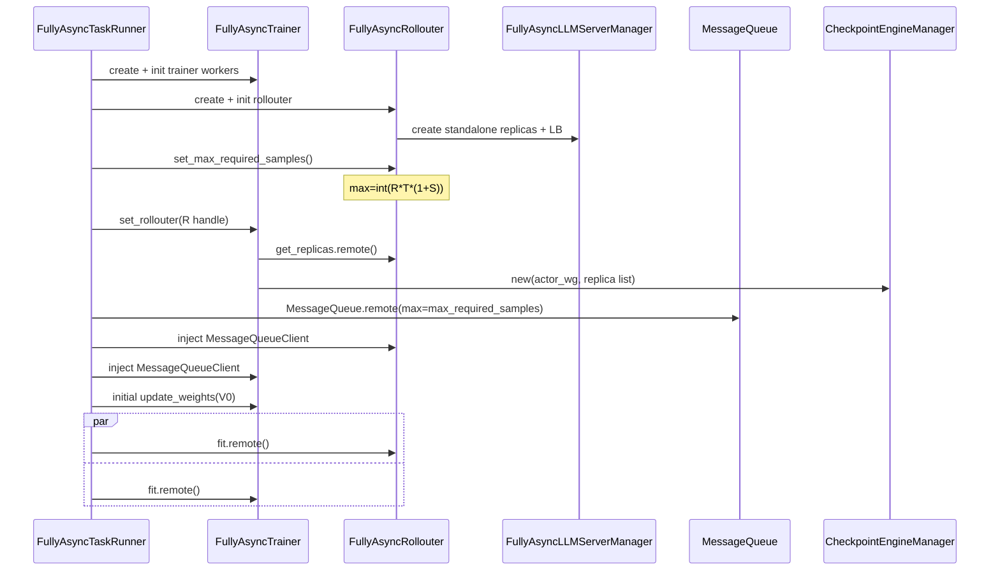
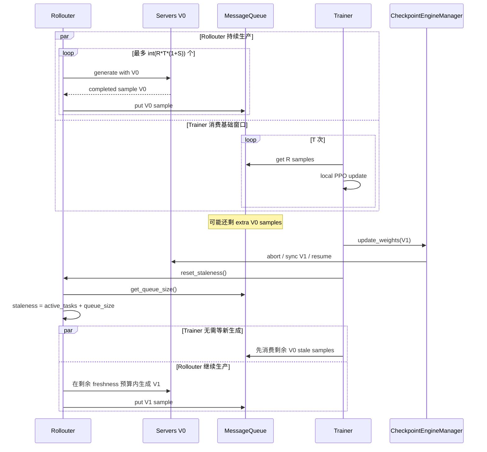
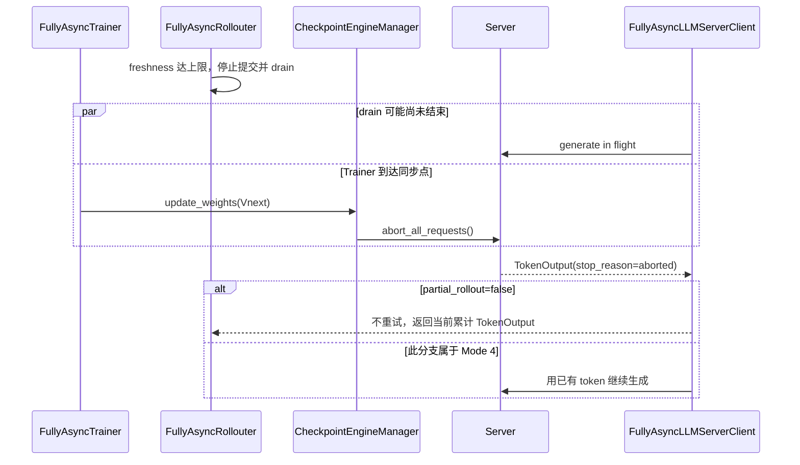
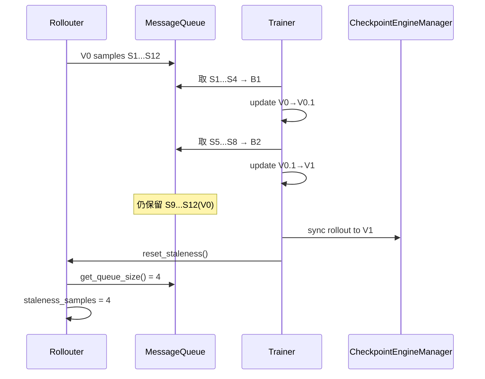

# verl v0.8.0 FullyAsync Mode 3：Async Stream with Stale Samples

> 参数：`trigger_parameter_sync_step=T>=1`、`staleness_threshold=S>0`、`partial_rollout=false`。
> 本文以 v0.8.0 代码行为为准，并单独标出 recipe 文字与调用链之间的差异。

## 1. 模式语义

Mode 3 允许 Rollouter 在当前训练窗口所需 sample 之外，再预生成一定比例的 sample。权重同步后，这些已完成 sample 保留在
MessageQueue 中，Trainer 可以直接消费，从而减少新版本窗口开头等待第一批生成的气泡。

```text
R = ppo_mini_batch_size * require_batches
基础窗口 = R * T
max_required_samples = int(R * (S + 1) * T)
额外 stale 预算 ≈ R * T * S
```

`reset_staleness()` 在每次权重同步后执行：

```text
staleness_samples = len(active_tasks) + message_queue_size
```

因此上一版本留下的 queue sample 和仍在执行的 task 会占用新窗口的 freshness 预算，不会每次同步后无条件清零。

## 2. 部署图

```mermaid
flowchart LR
    subgraph CTRL[控制面 Ray actors]
        TR[FullyAsyncTaskRunner]
        RO[FullyAsyncRollouter]
        MQ[MessageQueue<br/>跨版本 sample buffer]
        TE[FullyAsyncTrainer]
    end
    subgraph REQUEST[请求面]
        ALW[AgentLoopWorker actors]
        LB[GlobalRequestLoadBalancer]
    end
    subgraph RG[Rollout GPUs]
        SV[Rollout server actors]
        CEW[CheckpointEngineWorker actors]
    end
    subgraph TG[Trainer GPUs]
        AW[Actor/Critic/Ref workers]
    end

    TR o-- RO
    TR o-- TE
    TR o-- MQ
    RO --> ALW --> LB --> SV
    RO --> MQ
    MQ --> TE
    TE --> AW
    TE -. update_weights .-> CEW
    CEW --> SV
    MQ -. 同步后仍可能保留 V_old sample .-> TE
```

与 Mode 2 的部署完全相同；差异在于 MQ 被有意用作跨参数版本的 stale sample buffer。

## 3. 类图和状态引用



关键共享状态并不在一个进程：Trainer 只通过 actor handle 调 `rollouter.reset_staleness()`；MessageQueue 自己维护 deque；
Rollouter 自己维护 `active_tasks/staleness_samples`。三者没有共享内存。

## 4. 初始化调用流程



## 5. stale sample 流动时序



下一训练 batch 可以混合多个 rollout 参数版本。batch assembly 把每条 trajectory 的 `max_global_steps` 汇总到
`trajectory_param_versions`；Trainer 以 `current_param_version - trajectory_version >= 1` 统计 stale trajectory。

## 6. 同步期间 in-flight 请求：意图与代码事实

### 6.1 recipe 描述的意图

`docs/advance/fully_async.md` 把 Mode 3 描述为：Rollouter 达 freshness 上限后不再加新任务，等待 active tasks 完成，之后再同步；
Mode 4 才会中断并续跑。

Rollouter 代码确实有 drain 行为：`_processor_worker()` 在 `paused` 时等待 `active_tasks` 逐步完成，并且不再从
`pending_queue` 提交新 sample。

### 6.2 v0.8.0 调用链能证明的行为

Trainer 与 Rollouter 没有“active_tasks 已清零”的显式握手。Trainer 完成第 T 次更新后直接调用
`CheckpointEngineManager.update_weights()`；非 naive backend 的第一步无条件调用所有 replicas 的
`abort_all_requests()`。



也就是说，正常负载配平时 drain 可能在 Trainer 同步前完成；但代码没有强制保证。若仍有请求被 abort，
`FullyAsyncLLMServerClient.generate()` 在 `partial_rollout=false` 时跳出循环并返回当前累计输出，代码中没有显式“丢弃并重做
整个 sample”的分支。这一点在设计多任务缩容和权重同步协议时不能依赖 recipe 的简化描述。

## 7. 贯穿例子：旧版本 sample 如何跨窗口被消费

统一使用以下参数：

```text
ppo_mini_batch_size = 4
require_batches = 1
R = 4 个 RolloutSample
rollout.n = 2
T = 2, S = 0.5
partial_rollout = false
standalone replicas = 2
基础训练窗口 = R * T = 8 samples
max_required_samples = int(8 * 1.5) = 12 samples
```

相比 Mode 2，每个 rollout 版本多出 4 个 sample 的 stale 预算。

### 7.1 V0 窗口如何产生和取 sample

Rollouter 可以用 V0 提交 S1—S12。假设前 8 个完成 sample 被 Trainer 分成两个 batch：

| Trainer batch | 取出的 sample | Trainer 更新 | 是否触发同步 |
|---|---|---|---|
| B1 | S1—S4（完成顺序示意） | V0→V0.1 | 否，local step 1/2 |
| B2 | S5—S8 | V0.1→V1 | 是，发布 V1 |

与此同时 S9—S12 也已由 V0 完成并进入 MQ。它们没有被清空；在 V1 发布时成为可供下一训练窗口使用的 stale samples。



### 7.2 V1 窗口如何控制陈旧度

reset 后不是从 0 开始，而是从 MQ 中 4 个旧 sample 开始：

```text
reset 起点 = active_tasks(0) + MQ size(4) = 4
本窗口还能提交 = max_required_samples(12) - 4 = 8 个 V1 sample
```

因此 Rollouter 最多再提交 S13—S20，而不是再提交 12 个。这个“旧样本占用新预算”的规则阻止 stale backlog 无界增长。

Trainer 的下一批 B3 会立即从 MQ 取 S9—S12：

| Trainer batch | sample 的生成版本 | Trainer 当前发布版本 | stale 判定 | 更新结果 |
|---|---|---|---|---|
| B3 | V0 | V1 | `1-0>=1`，8 条 trajectories 都 stale | trainer V1→V1.1 |
| B4 | 通常为随后完成的 V1 sample | V1 | 非 stale | trainer V1.1→V2，并发布 V2 |

实际 B4 也可能混入不同版本，因为 MQ 按完成顺序取样；代码不要求一个训练 batch 内的
`trajectory_param_versions` 完全一致。

### 7.3 sample-level 陈旧度记录在哪里

- Rollouter 的 `staleness_samples` 是 **容量控制计数**：已提交 active tasks 加 MQ backlog；
- sample/trajectory 的版本来自 rollout 输出中的 `global_steps`；
- batch assembly 把每条 trajectory 的 `max_global_steps` 写入 `trajectory_param_versions`；
- Trainer 用 `current_param_version - trajectory_version >= 1` 累计 `stale_trajectory_processed`。

这两个“stale”不能混用：前者限制生产领先量，后者统计训练实际消费了多少旧策略 trajectory。

### 7.4 partial rollout=false 时同步碰到长请求

理想情况下，Rollouter 达 12 的上限后暂停提交并 drain active tasks，S1—S12 全部完成后再同步。但 Trainer 没有等待
`active_tasks==0` 的显式 RPC。假设 S12 仍在生成，已产生 30 tokens 时 Trainer 开始同步：

1. `CheckpointEngineManager` 调用 server 的 `abort_all_requests()`；
2. server 返回 `stop_reason=aborted` 和当前 30 tokens；
3. `FullyAsyncLLMServerClient` 看到 `partial_rollout=false`，不会基于这 30 tokens 重试；
4. 当前代码把累计输出返回给 AgentLoop，随后该 `RolloutSample` 仍可能进入 MQ；没有“丢弃 S12 并从原 prompt 重做”的显式分支。

所以 Mode 3 的 partial 控制含义是“不跨版本续生成”，不能简单等同于“同步一定等所有请求自然完成”。

## 8. Queue、背压和丢弃语义

- `max_queue_size=max_required_samples`，MessageQueue 使用 `deque(maxlen=...)`。
- `put_sample()` 发现满队列会先 `popleft()` 丢最老 sample，再 append 新 sample，并返回 `False`。
- Rollouter 同时以 queue size 和 `staleness_samples` 判断暂停；这降低但不消除并发条件下的溢出可能。
- `pending_queue` 固定 `maxsize=128`，属于 dataloader→processor 的 actor 内部背压，与跨 actor MessageQueue 不同。
- `max_concurrent_samples` 初始化后不随 replica 数动态变化。

## 9. 陈旧度与 off-policy 控制逻辑

### 9.1 sample 数量级 freshness

Mode 3 真正执行的硬控制是：

```text
max_required_samples = int(R * T * (1 + S))
暂停条件 = staleness_samples >= max_required_samples 或 MQ 已满
同步后 staleness_samples = active_tasks + MQ size
```

这限制了旧完整 sample 的数量 backlog。`S<1` 是项目文档的经验建议，不是代码断言；只要 `S>=0` 都能通过构造函数校验。

### 9.2 版本观测而非版本准入

每条 trajectory 记录 `min/max_global_steps`，Trainer 使用 `max_global_steps` 判断
`current_param_version-trajectory_version>=1` 并累计 stale 指标。但 `_get_samples_from_queue()` 只按完成顺序取满 R 个 sample：

- 不检查最大 policy lag；
- 不按版本分桶；
- 不拒绝过旧 sample；
- 不保证一个 batch 版本一致；
- `param_version_diversity` 和 stale count 都只是指标。

MQ 满时丢最老元素可以间接减少最旧数据，但它只看 deque 顺序，不比较版本。

### 9.3 默认 bypass PPO-clip

旧完整 sample 仍携带生成版本的逐 token `rollout_log_probs`。默认设置
`old_log_probs=rollout_log_probs`，用 `π_current/π_rollout` PPO ratio 和 clip 限制更新。它保留了真实行为概率，但没有把 stale
sample 变成 on-policy；默认也未启用额外 IS/RS。

### 9.4 可选 Decoupled/IS/RS

对于较大的 S，可设置 `bypass_mode=false`：Trainer 计算 `π_old`，再使用 token/sequence IS 修正
`π_rollout→π_old`；rejection sampling 则会修改 `response_mask`，排除偏离过大的 token/sequence。相比只看版本号，这些机制直接
根据策略概率差异控制 off-policy 风险。

项目没有把 `staleness_threshold` 自动映射为 IS/RS threshold；两组参数需要分别配置和调优。

### 9.5 `partial_rollout=false` 的边界

Mode 3 不跨版本续生成，但 checkpoint 同步仍无条件 abort server 请求。若 drain 尚未完成，client 返回当前 aborted 输出，代码中
没有显式 drop/regenerate。因而 Mode 3 的主要硬控制仍是 sample 数量预算，而非“只接收自然完成 trajectory”的保证。

## 10. 对资源共享的含义

1. MQ 中的 sample 已绑定生产它的 policy version；资源迁移不能把 stale 只理解成“请求等待时间”。
2. 扩缩或同步前要同时观察 LB in-flight、Rollouter active tasks、MQ 长度和版本分布。
3. Mode 3 不提供严格的“等全部 active 完成再同步”RPC barrier；若资源回收需要该保证，必须新增握手或 fencing。
4. Queue 中的 sample 不因 rollout replica 回收而失效，但新 replica 必须先装载可接受版本再加入 LB。
5. `staleness_threshold` 是算法策略，不是 GroupScheduler 可随意扩大的一般容量旋钮。

## 11. 代码索引

- freshness 公式和 reset：`verl/experimental/fully_async_policy/fully_async_rollouter.py:529-595`
- pause/drain：`fully_async_rollouter.py:848-932`
- pause 条件：`fully_async_rollouter.py:1077-1100`
- MessageQueue 丢最老样本：`message_queue.py:26-104`
- Trainer 同步触发：`fully_async_trainer.py:487-535`
- 无条件 abort 的权重同步：`verl/checkpoint_engine/base.py:470-515`
- partial=false 的 client 终止判断：`fully_async_rollouter.py:51-151`
- stale/partial 指标汇总：`detach_utils.py:100-177`
- recipe Mode 3 描述：`docs/advance/fully_async.md:212-222`
- off-policy 数据路径：`verl/experimental/separation/ray_trainer.py:499-610`
- Rollout Correction：`verl/trainer/ppo/rollout_corr_helper.py:779-1140`、`docs/algo/rollout_corr.md`
