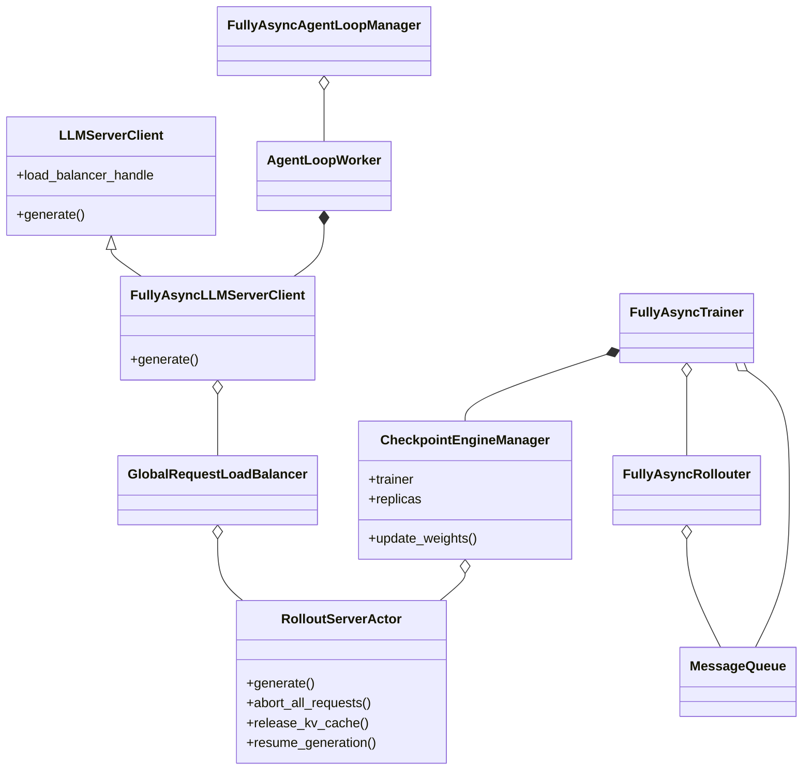
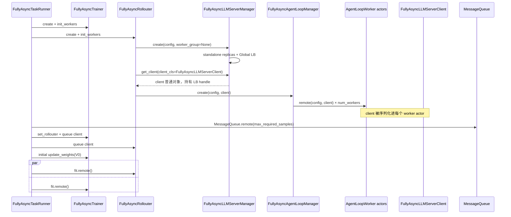
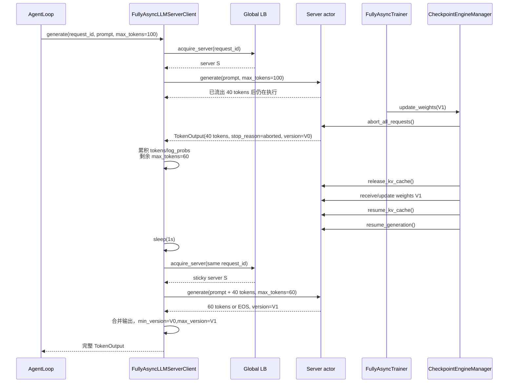
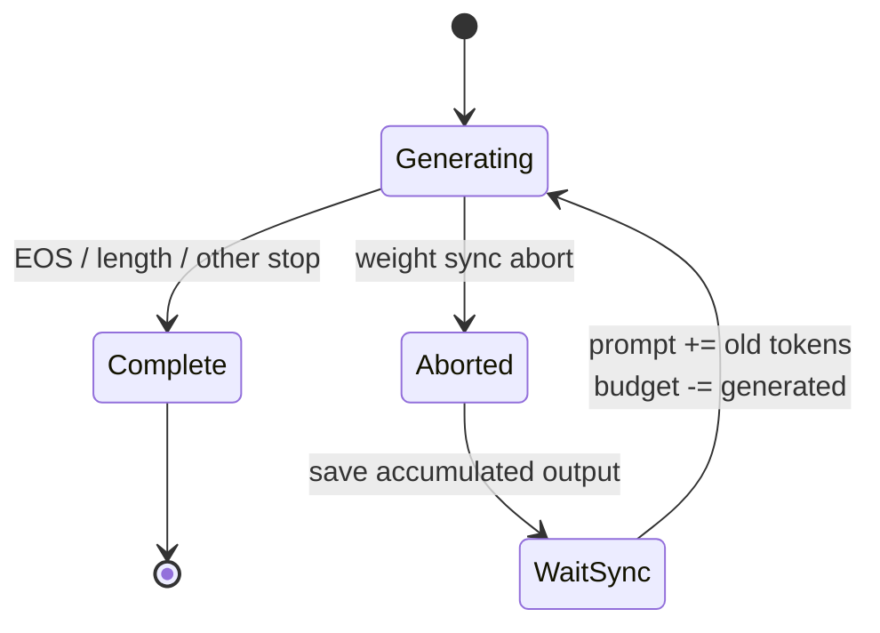
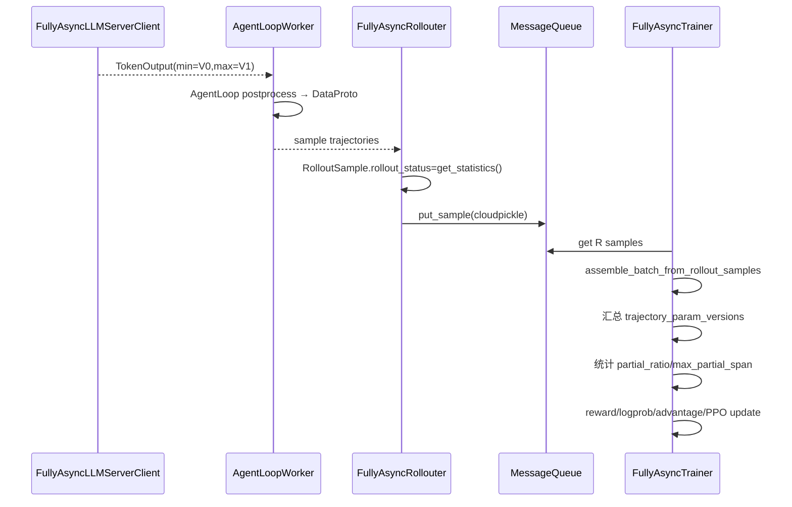

# verl v0.8.0 FullyAsync Mode 4：Async Stream with Partial Rollout

> 参数：`trigger_parameter_sync_step=T>=1`、`staleness_threshold=S>0`、`partial_rollout=true`。
> 这是 v0.8.0 FullyAsync 中解耦程度最高的模式：不仅已完成 sample 可以跨版本留在队列，单次 generation 也可以在权重同步后续跑。

## 1. 模式语义

Mode 4 继承 Mode 3 的 stale sample buffer，并在权重同步时主动中断 in-flight generation。client 保存已生成 token，等待同步
完成后重新发起请求，使用剩余 token budget 继续生成。因此一条 trajectory 可能同时包含 V0 和 V1 生成的 token。

```text
R = ppo_mini_batch_size * require_batches
max_required_samples = int(R * T * (1 + S))
partial_rollout = true
```

这里有两种不同的陈旧性：

- **sample-level stale**：完整 sample 由旧版本生成，留在 MessageQueue 中被新版本 Trainer 消费；
- **token-level partial**：同一 trajectory 的前半段和后半段由不同 rollout 参数版本生成。

## 2. 部署图

```mermaid
flowchart LR
    subgraph CTRL[Ray 控制 actors]
        TR[FullyAsyncTaskRunner]
        RO[FullyAsyncRollouter]
        MQ[MessageQueue]
        TE[FullyAsyncTrainer]
    end
    subgraph AGENT[AgentLoop CPU actors]
        ALW[AgentLoopWorkers]
        CLIENT[FullyAsyncLLMServerClient<br/>每个 worker 内普通对象]
        LB[GlobalRequestLoadBalancer]
    end
    subgraph ROLLOUT[独立 Rollout GPUs]
        CEW[CheckpointEngineWorkers]
        SV[Rollout server actors<br/>abort/resume]
    end
    subgraph TRAIN[Trainer GPUs]
        AW[Actor workers]
    end

    TR o-- RO
    TR o-- TE
    TR o-- MQ
    RO --> ALW
    ALW *-- CLIENT
    CLIENT --> LB --> SV
    RO --> MQ --> TE
    TE --> AW
    TE -. CheckpointEngineManager .-> CEW
    CEW --> SV
```

`FullyAsyncLLMServerClient` 不是 actor；它随 AgentLoopManager 构造参数序列化到每个 AgentLoopWorker actor，内部持有同一个 LB actor
handle。

## 3. 类图和引用关系



两条调用路径会在 server actor 汇合：AgentLoopWorker 的数据路径调用 `generate()`，Trainer 侧
CheckpointEngineManager 的控制路径调用 `abort/release KV/update/resume`。

## 4. 初始化和 client 注入



## 5. partial rollout 核心时序



client 每次进入重试都会调用父类 `LLMServerClient.generate()`：父类负责 acquire/release LB；传给 server 的 turn request id 每次是
新 UUID，但用来 acquire LB 的外层 `request_id` 不变，因此正常情况下保持 sticky。若该 server 已从 LB 删除，sticky 缓存会失效并
选择新的 server。

## 6. token、log prob 和版本如何合并

`FullyAsyncLLMServerClient.generate()` 维护一个 `final_output`：

1. 下一次 prompt 是 `original_prompt_ids + final_output.token_ids`；
2. 新返回的 `token_ids` 和 `log_probs` 追加到已有列表；
3. 若有 routed experts，按本次新增 token 数追加；
4. `num_preempted` 累加；
5. 原始 `max_tokens/max_new_tokens` 减去已生成 token 数；
6. 记录第一次响应的 `min_global_steps` 和最后一次响应的 `max_global_steps`；
7. 只有 stop reason 为 `abort/aborted` 且 `partial_rollout=true` 才再次循环。



这不是在 server 内透明恢复同一个请求对象，而是 client 以已有 token 作为扩展 prompt 重新调用 generate；server 侧的
`resume_generation()` 与 client 重试共同构成恢复路径。

## 7. sample 进入 Trainer 的流程



`trajectory_param_versions` 使用每条 trajectory 的 `max_global_steps`；partial 指标由
`abs(max_global_steps-min_global_steps)` 计算。因此 Trainer 能识别一条 trajectory 是否跨版本以及跨度，但 batch 本身仍可同时包含
旧完整 sample、新完整 sample 和 partial sample。

## 8. 贯穿例子：完整 stale sample 与 partial sample 混合取样

继续使用与 Mode 3 相同的参数：

```text
ppo_mini_batch_size = 4
require_batches = 1
R = 4 个 RolloutSample
rollout.n = 2
T = 2, S = 0.5
partial_rollout = true
max_required_samples = 12
每条 trajectory 的 max_tokens = 100
```

### 8.1 同步前的状态

Rollouter 使用 V0 提交 S1—S12。Trainer 已取 S1—S8，完成两次更新并准备发布 V1；此时：

```text
MessageQueue：S9、S10 已完整生成，版本 V0
active_tasks：S11、S12 仍在生成
S11：两条 trajectories 各已产生约 30 tokens
S12：两条 trajectories 各已产生约 50 tokens
```

S9、S10 是 sample-level stale 候选；S11、S12 是将被 partial rollout 处理的 in-flight samples。

### 8.2 权重同步如何中断并续跑

Trainer 完成 B2 后按以下顺序执行：

| 步骤 | S11/S12 状态 | rollout 权重 |
|---|---|---|
| `abort_all_requests()` | server 返回当前 tokens、log probs 和 `stop_reason=aborted` | V0 |
| client 累积输出 | S11 保存前 30 tokens，S12 保存前 50 tokens | V0 |
| release KV + checkpoint sync | generation 暂停 | V0→V1 |
| resume KV/generation | client 进入下一次 generate | V1 |
| S11 重试 | prompt 追加前 30 tokens，`max_tokens=70` | V1 |
| S12 重试 | prompt 追加前 50 tokens，`max_tokens=50` | V1 |
| 最终完成 | 拼接 V0/V1 两段 tokens 和 log probs | V1 |

最终每条 trajectory 的版本字段为：

```text
S9, S10: min_global_steps=0, max_global_steps=0
S11, S12: min_global_steps=0, max_global_steps=1
```

### 8.3 reset 后还能提交多少新 sample

`CheckpointEngineManager.update_weights()` 返回后，S11/S12 可能已经恢复但尚未完成。假设 reset 时：

```text
active_tasks = 2（S11、S12）
MessageQueue size = 2（S9、S10）
staleness_samples = 2 + 2 = 4
```

Rollouter 在 V1 窗口最多再提交 `12-4=8` 个新 sample。partial task 和已完成 stale sample 都占 freshness 预算，因此
abort-resume 不会绕过陈旧度上限。

### 8.4 Trainer 下一批具体取到什么

假设 MQ 后续完成顺序为 `S9,S10,S11,S12`，Trainer 的 B3 正好取到这 4 个 sample，即 8 条 trajectories：

| sample | token 生成版本 | Trainer 当前版本 V1 下的 stale 统计 | partial 统计 |
|---|---|---|---|
| S9、S10 | 全部 V0 | `max_version=0`，计为 stale | `min=max=0`，不是 partial |
| S11、S12 | 前段 V0、后段 V1 | `max_version=1`，不按 stale trajectory 计数 | `min=0,max=1`，计为 partial |

这个细节很重要：Trainer 的 stale trajectory 指标使用 `max_global_steps`；一条 V0→V1 的 partial trajectory 在当前 V1 被消费时，
不计为 stale，但会进入 `partial_ratio/max_partial_span`。因此监控必须同时看 stale 指标和 partial 指标。

Trainer 随后使用 B3 中每个 token 对应的 rollout log prob 计算 PPO/GRPO 数据流，把 actor 从 V1 更新到 V1.1。因为 T=2，此时不
同步；再取 B4 更新到 V2 后才发布下一版本。

### 8.5 如果 partial_rollout=false 会怎样

同样的 S11/S12 在 Mode 3 中收到 aborted 输出后就结束 client 循环，不会用 `prompt+已有 tokens` 继续请求。当前 v0.8.0 代码也
没有显式把该 sample 丢弃并重新生成。Mode 4 的实质差异正是：保留前段输出、减少剩余 token budget，并在新版本上补完。

因此“trajectory 跨版本生成”和“完整 sample 被晚一个版本消费”是两个独立维度，分别由 partial 指标和 stale 指标描述。

## 9. 权重同步与请求控制关系

`CheckpointEngineManager.update_weights()` 的非 naive 路径顺序固定为：

```text
abort requests
→ 汇集所有 replica.workers 构造临时 RayWorkerGroup
→ release KV cache
→ trainer/rollout prepare + build process group
→ 同步 update_weights
→ finalize
→ resume KV cache
→ resume generation
```

它同步的是 `CheckpointEngineManager.replicas` 中的全部 replicas。运行期新增 server 若只加入 LB 而没有加入该列表，请求可能被路由到
旧权重实例；反之只加入同步列表而未加入 LB，则消耗同步资源却不接流量。

## 10. 陈旧度与 off-policy 控制逻辑

### 10.1 sample 数量预算仍然生效

Partial Rollout 没有绕过 `staleness_threshold`：

```text
max_required_samples = int(R * T * (1 + S))
reset = len(active_tasks) + MQ size
```

一条被中断后续跑的 trajectory 所属 `RolloutSample` 在 `active_tasks` 中仍占 1 个预算；已经完成的旧 sample 在 MQ 中也占 1 个。
达到上限后不再提交新 sample。

但计数与生成时长、token 数和跨版本数无关：一条请求跨 V0→V1 和跨 V0→V3 都只占一个 active sample。

### 10.2 partial 版本记录

client 为每条 trajectory 记录：

```text
min_global_steps = 第一段 rollout 版本
max_global_steps = 最后一段 rollout 版本
partial_span = abs(max-min)
```

batch 汇总 `partial_ratio/max_partial_span`，但没有阈值判断。v0.8.0 不会因为 span>1 而停止续跑、丢弃或重新生成。

### 10.3 stale 指标可能低估 partial 的旧前段

Trainer 将 `trajectory_param_versions` 设置为 `max_global_steps`。所以当前版本 V1 消费一条 V0→V1 trajectory 时：

```text
stale 判断：current(1)-max(1)=0 → 非 stale
partial 判断：max(1)-min(0)=1 → partial
```

旧的 V0 token 不体现在 stale count 中，只体现在 partial 指标里。必须联合观察
`stale_trajectory_processed`、`partial_ratio`、`max_partial_span` 和 `param_version_diversity`。

### 10.4 逐 token 行为 log prob

Partial client 在每次 resume 后追加新 token 及其 `log_probs`；最终 trajectory 中：

```text
V0 生成的 token → V0 rollout_log_prob
V1 生成的 token → V1 rollout_log_prob
```

默认 `bypass_mode=true` 将这些逐 token 行为 log probs 作为 `old_log_probs`，actor 使用当前策略对各 token 的
`π_θ/π_rollout_token` ratio 和 PPO clipping。这样不会把整条混合 trajectory 错标成单一行为策略，但仍不构成无偏或严格
on-policy 保证。

### 10.5 默认与可选算法保护

默认 recipe：

| 配置 | 默认值 | 作用 |
|---|---|---|
| `calculate_log_probs` | `true` | 保存行为策略逐 token 概率 |
| `use_rollout_log_probs` | `true` | 使用 rollout 概率参与 loss |
| `bypass_mode` | `true` | `π_old=π_rollout` |
| `loss_type` | `ppo_clip` | ratio + clipping |
| `rollout_is` | `null` | 没有额外 TIS |
| `rollout_rs` | `null` | 没有额外拒绝 |

可选强化包括：

- `bypass_mode=false`：重新计算 `π_old`，形成 Decoupled PPO；
- `rollout_is=token/sequence`：为偏离数据添加截断 IS 权重；
- `rollout_rs=...`：按 ratio/KL 类统计修改 `response_mask`；
- `rollout_is_threshold/rollout_rs_threshold`：控制截断和拒绝强度；
- ESS、ratio fraction、masked fraction：直接衡量概率分布差，而不仅是版本号。

项目 FullyAsync 文档把 Mode 4 + `bypass_mode=false` + Rollout IS 描述为近似 AReaL Decoupled PPO，但这不是默认启用路径。

### 10.6 当前硬边界与实验材料

当前没有：

- `max_sample_policy_lag`；
- `max_partial_version_span`；
- Trainer 出队版本过滤；
- 过旧 sample drop/regenerate；
- 根据 IS/ESS/partial span 自动调低生产速率。

`docs/advance/fully_async.md` 提供 7B/30B、staleness=0/0.1/0.3/0.5 和 multi-turn partial 实验。结果用于经验验证，且文档明确
提到 response length 变化和训练不稳定仍需进一步优化，因此不应将现有机制表述为严格精度保证。

## 11. 对动态资源共享的含义

1. **缩容必须维护 sticky 语义**：LB 删除 server 后会使 sticky request 重新选路；partial retry 因而可以迁移到新 server，但新
   server 必须已加载兼容权重。
2. **不能用“in-flight 非零”直接判定不可同步**：Mode 4 的设计就是允许 abort-resume；但物理销毁还需确认恢复所需状态不只存在于
   被销毁 server。
3. **版本化权重存储更重要**：动态实例可能需要服务正在跨版本恢复的请求，必须明确它加载哪个 published version。
4. **并发上限仍是静态值**：扩容 replicas 不会自动增加 `max_concurrent_samples`。
5. **多任务调度不能隐式开启 partial**：它改变 trajectory 的生成分布与 log-prob/version 语义，必须由任务配置和算法接受。
6. **优先回收无 in-flight replica** 仍然更稳妥；abort-resume 是同步机制，不等于已具备无状态物理迁移协议。

## 12. 代码索引

- FullyAsync client：`verl/experimental/fully_async_policy/fully_async_rollouter.py:51-151`
- client 注入：`fully_async_rollouter.py:775-814`
- 单 sample 流程：`fully_async_rollouter.py:933-951`
- 权重 abort/sync/resume：`verl/checkpoint_engine/base.py:442-515`
- LB sticky 和动态删除：`verl/workers/rollout/llm_server.py:43-143`
- batch 版本和 partial 指标：`fully_async_policy/detach_utils.py:100-177`
- Trainer stale 指标：`fully_async_trainer.py:751-770`
- recipe Mode 4：`docs/advance/fully_async.md:224-232`
- freshness/backlog：`fully_async_rollouter.py:529-595,1077-1100`
- correction 数据路径：`verl/experimental/separation/ray_trainer.py:499-610`
- Rollout Correction：`verl/trainer/ppo/rollout_corr_helper.py:779-1140`、`docs/algo/rollout_corr.md`
