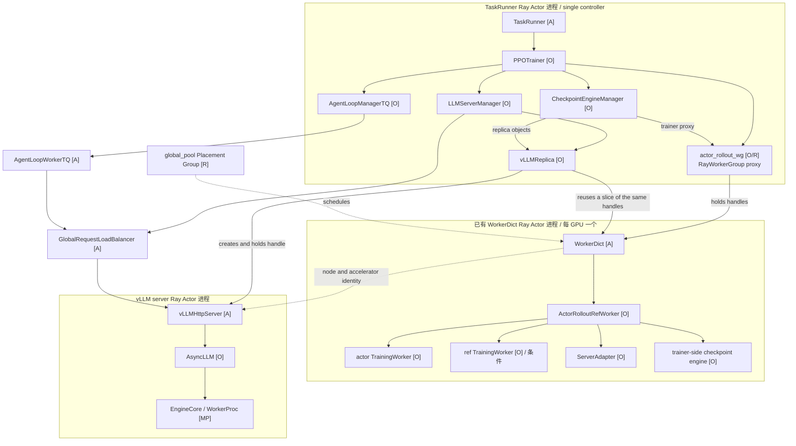
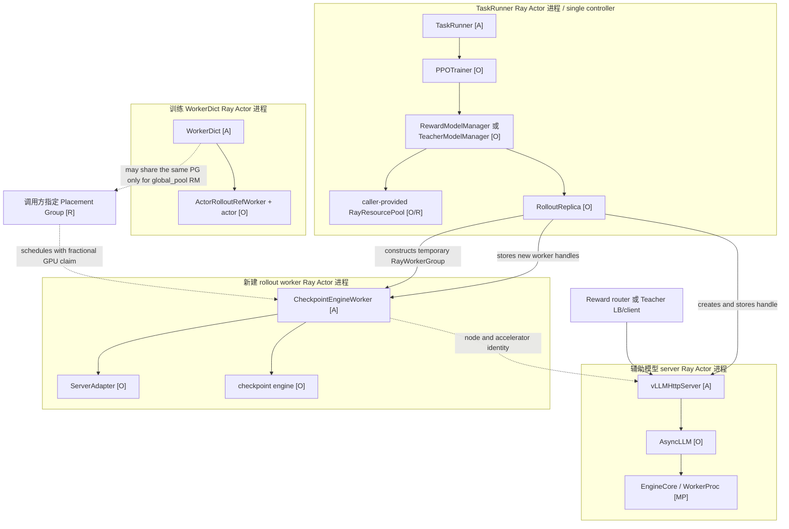
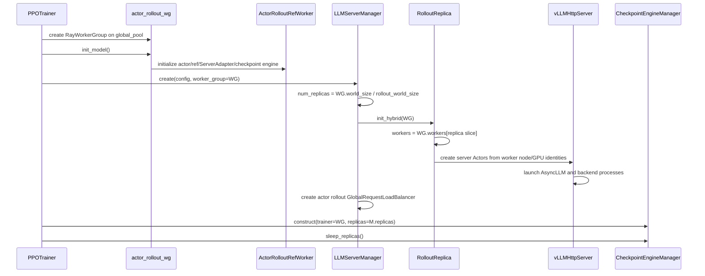
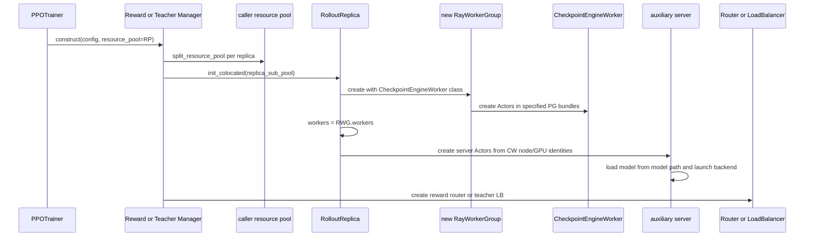
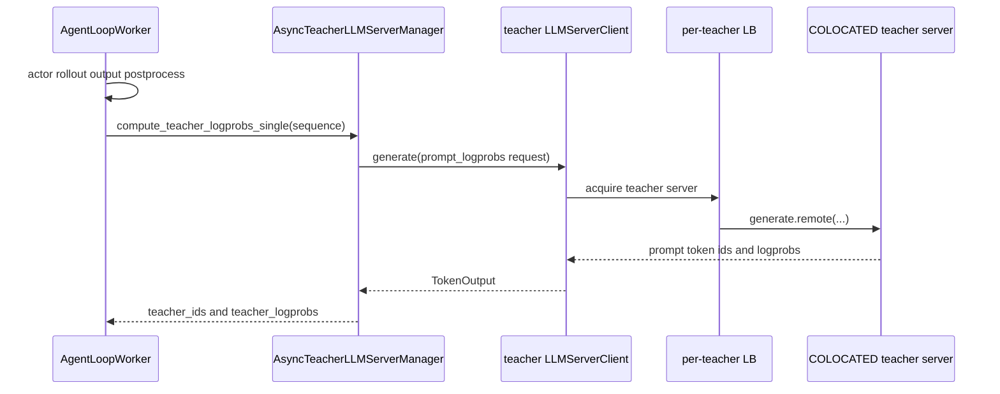
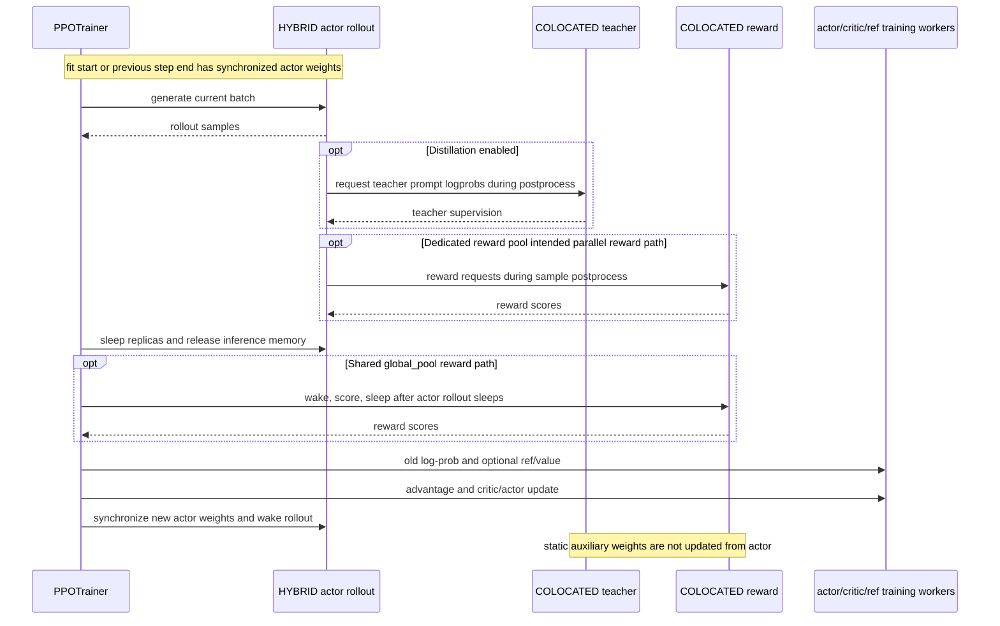
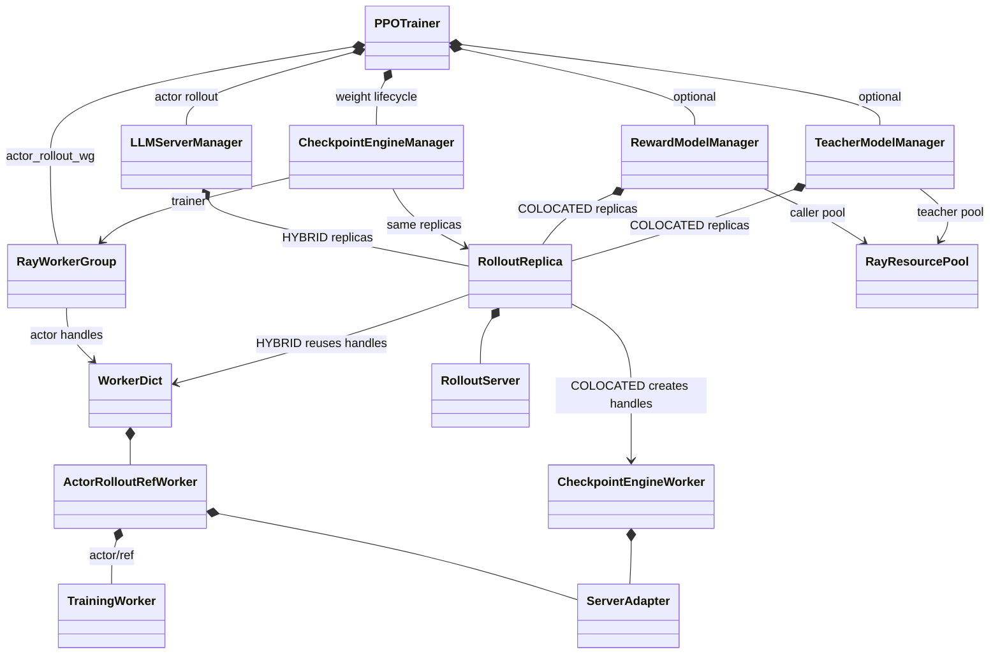

# verl v0.8.0 HYBRID 与 COLOCATED 运行时对比

> 代码基线：`/Users/nyp/Documents/verl`，tag `v0.8.0`，commit `7aed6b23`。
>
> 本文以 `main_ppo_sync`、native async rollout 和 vLLM 主路径为基准；SGLang 在部署模式上的
> 组件边界相同，但后端进程和显存控制细节不同。本文比较的是 `RolloutMode` 部署拓扑，
> 不是 `actor_rollout_ref.rollout.mode=sync/async` 请求模式。

## 1. 结论先行

HYBRID 与 COLOCATED 的本质区别不是“是否使用同一块 GPU”，而是 **rollout 依附于谁、是否复用训练
Worker、模型权重由谁维护**：

| 维度 | `HYBRID` | `COLOCATED` |
|---|---|---|
| rollout worker 来源 | 直接复用已有 `actor_rollout_wg.workers` | 在调用方传入的 `RayResourcePool` 中新建 `CheckpointEngineWorker` Actors |
| 与训练 Worker 的关系 | replica 持有训练 Worker handles 的一个切片 | replica 不持有训练 Worker；持有新建 rollout worker handles |
| actor 训练对象 | 同一 `ActorRolloutRefWorker` 内同时有 actor `TrainingWorker`、`ServerAdapter` 和 checkpoint engine | rollout worker 进程内只有 `CheckpointEngineWorker`、`ServerAdapter` 和 checkpoint engine，没有 actor optimizer/训练引擎 |
| vLLM server 进程 | 独立 `vLLMHttpServer` Ray Actor 进程 | 同样是独立 `vLLMHttpServer` Ray Actor 进程 |
| GPU/Placement Group | 必然锚定 actor 训练 Worker 所在 GPU | 锚定调用者传入的 pool；可能是训练 `global_pool`，也可能是独立 reward/teacher pool |
| 初始模型来源 | 默认允许 `load_format=dummy`，随后由 actor 权重覆盖 | 非 HYBRID 时 `dummy` 会被改成 `auto`，server 从模型路径加载 |
| 运行期权重关系 | actor 每轮更新后必须同步到 rollout | 当前 Reward/Teacher 用法是静态辅助模型，不跟随 actor 更新 |
| sleep/wake 语义 | 为训练释放推理显存；wake 与权重同步相连 | 切换独立辅助推理进程的占用；wake 恢复原权重，不执行 actor→rollout 同步 |
| v0.8.0 实际调用者 | PPO actor rollout 的 `LLMServerManager` | `RewardModelManager`、`TeacherModelManager` |
| 典型用途 | on-policy actor rollout | GRM、LLM judge、teacher inference 等辅助推理 |

因此，在 v0.8.0 代码里，它们不是普通 PPO actor rollout 的两个等价配置选项：

```text
PPO actor rollout
  └─ LLMServerManager(worker_group=actor_rollout_wg)
       └─ init_hybrid()

Reward / Teacher auxiliary inference
  └─ RewardModelManager / TeacherModelManager(resource_pool=...)
       └─ init_colocated()
```

`LLMServerManager._initialize_llm_servers()` 只在“有训练 WorkerGroup”时选 HYBRID，在“没有 WorkerGroup”
时选 STANDALONE；它不会选择真正的 COLOCATED。COLOCATED 由 Reward/Teacher manager 显式调用。

## 2. 先消除三个命名歧义

### 2.1 native async 下的 HYBRID 不代表所有代码都在一个 OS 进程

`RolloutMode` 注释把 HYBRID 描述为训练引擎与 rollout 引擎 fused in same process。对 v0.8.0
native async + vLLM 主路径，更精确的进程事实是：

- actor `TrainingWorker`、trainer-side `ServerAdapter` 和 checkpoint engine 是
  `ActorRolloutRefWorker` 内的普通对象，运行在已有 `WorkerDict` Ray Actor 进程中；
- 实际 `AsyncLLM` 和 HTTP 服务运行在另一个 `vLLMHttpServer` Ray Actor 进程中；
- vLLM 还会创建自己的 `EngineCore/WorkerProc` 子进程；
- 训练 Worker 和 vLLM server 通过相同节点、相同可见 GPU、CUDA IPC/共享内存及 Ray handle 协作。

所以 HYBRID 的稳定含义是 **复用训练 Worker 作为 rollout 的 worker/control anchor，并共享训练 GPU**，
不能把它简化成“整个推理栈与训练在同一个 PID”。

### 2.2 COLOCATED 不保证与 actor 训练共卡

`init_colocated(resource_pool)` 只保证新建 rollout workers 使用调用方提供的 Placement Group bundles。
当前调用方有三种实际资源位置：

| 调用场景 | 传入的 pool | 是否与 actor 训练共卡 |
|---|---|---|
| Reward Model，`enable_resource_pool=false` | `global_pool` | 是 |
| Reward Model，`enable_resource_pool=true` | 独立 `reward_pool` | 否 |
| Teacher Model | 独立 `teacher_pool` | 否 |

因此 COLOCATED 更准确的定义是：**rollout server 与新建的 rollout/checkpoint worker 共同锚定到指定
资源池，但 rollout worker 与训练 Worker 是不同进程、不同 Actor**。

### 2.3 `init_hybrid_colocated()` 仍然是 HYBRID

TRT-LLM 的 `init_hybrid_colocated(worker_group, resource_pool)` 虽然方法名含 `colocated`，但代码设置的是：

```python
self.rollout_mode = RolloutMode.HYBRID
```

它仍复用 `worker_group.workers`，只是额外保存 resource pool 和 bundle indices 供 TRT-LLM server 放置。
本文中的 COLOCATED 专指 `init_colocated()` 设置的 `RolloutMode.COLOCATED`。

## 3. HYBRID 组件拓扑

### 3.1 进程、Actor 与普通对象



标记：`[A]` Ray Actor，`[O]` 普通 Python 对象，`[R]` 资源/handle/proxy，`[MP]` 非 Ray 子进程。

### 3.2 关键引用关系

| 持有者 | 持有内容 | 引用性质 | 作用 |
|---|---|---|---|
| `PPOTrainer` | `actor_rollout_wg` | `RayWorkerGroup` 本地代理 | 训练、log-prob、保存和权重导出 |
| `PPOTrainer` | `LLMServerManager` | 同进程普通对象 | 初始化并管理 actor rollout replicas、LB |
| `LLMServerManager` | `worker_group` | 指向 `actor_rollout_wg` | 计算 replica 数量并选择 HYBRID |
| `LLMServerManager` | `rollout_replicas` | 普通对象列表 | 生命周期编排 |
| `RolloutReplica` | `workers` | 已有 WorkerDict Actor handles 的切片 | 将每个 replica 绑定到对应训练 ranks/GPU |
| `RolloutReplica` | `servers` | 新建 server Actor handles | wake、sleep、generate、cache 控制 |
| `CheckpointEngineManager` | `trainer` | 同一个 `actor_rollout_wg` 代理 | 从 actor 导出权重 |
| `CheckpointEngineManager` | `replicas` | 与 manager 同一批 replica 普通对象 | sleep/wake 和权重同步编排 |
| `ActorRolloutRefWorker` | actor、ref、`ServerAdapter`、checkpoint engine | 同 WorkerDict 进程内普通对象 | 训练计算与 rollout 控制面的融合点 |
| `vLLMHttpServer` | `workers` | 训练 Worker Actor handles | 获取拓扑/协同控制；server 本身仍是独立 Actor |

这里不存在“再创建一组 HYBRID rollout workers”。`init_hybrid()` 的关键语句是从已有
`worker_group.workers` 中按 replica rank 切片。

## 4. COLOCATED 组件拓扑

### 4.1 通用拓扑



COLOCATED 的 `RayWorkerGroup` 只在 `init_colocated()` 内局部创建；replica 最终保存的是
`worker_group.workers` handles。与 HYBRID 相比，多出了一整组 `CheckpointEngineWorker` Ray Actors，
并且这些 Actors 不含 actor 模型和 optimizer。

Ray 调度时，每个新 worker 请求 `1 / resource_pool.max_colocate_count` 个 GPU 资源份额，并被指定到
对应 PG bundle；server 再读取这些 workers 的 node id 和 accelerator id，在同节点、同可见 GPU 上启动。
这里的 fractional GPU 是 Ray 的调度占位，不是 GPU 显存硬隔离。

### 4.2 当前两个实际调用拓扑

#### Reward Model

```text
PPOTrainer
  └─ RewardLoopManager
       ├─ RewardModelManager
       │    ├─ RolloutReplica objects
       │    ├─ CheckpointEngineWorker Actors
       │    ├─ reward server Actors
       │    └─ reward router process
       └─ RewardLoopWorker Actors
            └─ HTTP → reward router → reward server
```

- `enable_resource_pool=false`：Reward role 映射到 `global_pool`，与 actor 训练共卡；
- `enable_resource_pool=true`：创建独立 `reward_pool`，不与训练共卡，但内部初始化仍叫 COLOCATED；
- Reward 请求通过独立 router 进程转发，不使用 actor rollout 的 GlobalRequestLoadBalancer。

#### Teacher Model

```text
PPOTrainer
  └─ MultiTeacherModelManager
       └─ TeacherModelManager per teacher
            ├─ RolloutReplica objects
            ├─ CheckpointEngineWorker Actors
            ├─ teacher server Actors
            └─ per-teacher GlobalRequestLoadBalancer Actor

AgentLoopWorker
  └─ AsyncTeacherLLMServerManager
       └─ LLMServerClient → teacher LB → teacher server
```

Teacher 使用独立 `teacher_pool`。它与 actor rollout 的请求协议相似，但拥有独立的 replica、LB 和静态
teacher 权重，不加入 actor 的 `CheckpointEngineManager`。

### 4.3 关键引用关系

| 持有者 | 持有内容 | 与 HYBRID 的差异 |
|---|---|---|
| `RewardModelManager` / `TeacherModelManager` | caller-provided resource pool | pool 决定位置，不继承 actor WorkerGroup |
| manager | `RolloutReplica` 普通对象 | 由辅助模型 manager 自己管理，不属于 actor `LLMServerManager` |
| `RolloutReplica` | 新建 `CheckpointEngineWorker` Actor handles | 不是训练 Worker handles 的切片 |
| `RolloutReplica` | server Actor handles | 与 HYBRID 都有 server Actors，但模型和生命周期独立 |
| `CheckpointEngineWorker` | `ServerAdapter`、checkpoint engine | 不含 actor/ref/optimizer；当前静态辅助推理不接 actor 更新链 |
| Teacher manager | per-teacher LB handle | 与 actor rollout LB 分离 |
| AgentLoopWorker | 序列化后的 teacher client | 直接走 teacher LB，不经过 `PPOTrainer` 热路径 |
| RewardLoopWorker | reward router address | HTTP 访问 reward servers |

## 5. 初始化调用关系对比

### 5.1 HYBRID actor rollout 初始化



初始化结束时：

- actor 权重已经存在于训练 Worker；
- rollout 的初始权重可以是 dummy；
- `fit()` 开头必须调用 `checkpoint_manager.update_weights()`，把正确 actor 权重放入 rollout；
- update 完成后 rollout 被唤醒，才进入验证或训练生成。

### 5.2 COLOCATED 辅助模型初始化



初始化结束时：

- 辅助模型从自己的 `model_path` 加载，不等待 actor 权重覆盖；
- 新建 `CheckpointEngineWorker` 主要提供进程、GPU placement 和 server adapter/checkpoint 能力；
- 当前 Reward/Teacher manager 没有构造一个“actor trainer → auxiliary replicas”的
  `CheckpointEngineManager`，所以它们不随 PPO actor step 更新。

## 6. 调用关系与热路径对比

### 6.1 HYBRID 的生成热路径

```mermaid
sequenceDiagram
    participant T as PPOTrainer
    participant ALM as AgentLoopManagerTQ
    participant AW as AgentLoopWorker
    participant CL as LLMServerClient
    participant LB as actor rollout LB
    participant S as HYBRID server

    T->>ALM: generate_sequences(batch)
    ALM->>AW: generate_sequences.remote(chunks)
    AW->>CL: generate(prompt, sampling params)
    CL->>LB: acquire server and account inflight
    LB->>S: generate.remote(...)
    S-->>LB: TokenOutput
    LB-->>CL: release routing state
    CL-->>AW: tokens/logprobs/global_steps
    AW-->>T: write TransferQueue; ReplayBuffer becomes sampleable
```

`LLMServerManager` 和 `RolloutReplica` 不在逐请求热路径上；它们负责初始化、控制和生命周期。逐请求路径
是 AgentLoopWorker → client → LB → server。

### 6.2 COLOCATED Teacher 的生成热路径



COLOCATED Teacher 不参与 actor token 生成，也不被 actor rollout LB 管理。它是在同一条 sample 的
postprocess 阶段提供蒸馏监督信号。

### 6.3 COLOCATED Reward 的调用路径

Reward 路径不是 Teacher 的 LB 模型，而是：

```text
RewardLoopWorker
  → HTTP request
  → reward router process
  → COLOCATED reward server
  → score
```

`RewardLoopManager.compute_rm_score()` 在调用前 wake reward replicas，完成后 sleep。从资源拓扑和
`reward_loop_worker_handles` 属性的设计意图看，独立 `reward_pool` 用于与 actor rollout 并行，映射到
`global_pool` 时应与 actor rollout/训练错峰。

但 `main_ppo_sync` 的实际接线还要进一步区分“设计意图”和“当前调用”：

- `RewardLoopManager.reward_loop_worker_handles` 属性只在无 Reward Model 或使用独立 reward pool 时返回
  workers；共用 global pool 时返回 `None`；
- 但 `PPOTrainer.init_workers()` 传给 AgentLoopManager 的是原始成员 `reward_loop_workers`，不是上述属性，
  因而当前代码对两种 pool 都给 AgentLoopWorker 非空 handles；
- AgentLoopWorker 的逐 sample `_compute_score()` 直接调用 RewardLoopWorker，不经过
  `RewardLoopManager.compute_rm_score()`，因此也没有经过该方法中的显式 wake/sleep；
- RewardModelManager 默认在初始化末尾 sleep，而这条逐 sample 路径中没有看到对应的 manager wake；
- 共用 global pool 时，`PPOTrainer.step()` 还会依据上述属性进入 `_compute_reward_colocate()`，但 v0.8.0
  的这个方法直接抛出 `NotImplementedError`。

因此，COLOCATED Reward 的资源布局和组件调用框架已经存在，但不能把当前
`main_ppo_sync + free_cache_engine=true` 下的完整 Reward 训练链描述成已经闭合。Teacher 是 v0.8.0 中
更清晰、完整的 COLOCATED 调用样例。

## 7. 一轮训练流程中的位置

### 7.1 主流程全景

下面展示 v0.8.0 sync PPO 中 HYBRID actor rollout 与条件 COLOCATED 辅助模型的相对位置：



### 7.2 HYBRID 在每轮 step 中的职责

1. step 开始时，HYBRID server 持有上次同步完成的 actor 权重；首次进入训练前，`fit()` 已执行一次同步。
2. AgentLoop workers 通过 actor LB 消耗当前 batch，产生 response、rollout log-prob 和版本字段。
3. ReplayBuffer 等到该 global step 的 sample 完整后返回 batch。
4. `checkpoint_manager.sleep_replicas()` 等待请求排空，并让 vLLM 释放推理显存。
5. 训练 workers 执行 old/ref log-prob、value、advantage、critic update 和 actor update。
6. step 末尾 `checkpoint_manager.update_weights()` 将新 actor 权重同步到 rollout，并恢复下一轮生成能力。

HYBRID 因而形成严格的权重闭环：

```text
actor weights Vk
  → rollout with Vk
  → PPO update
  → actor weights Vk+1
  → mandatory sync to HYBRID rollout
```

### 7.3 COLOCATED 在每轮 step 中的职责

COLOCATED 辅助模型形成的是旁路，而不是 actor 权重闭环：

```text
static reward/teacher weights Wr or Wt
  → score actor rollout / produce teacher logprobs
  → result joins training batch
  → actor updates
  → Wr or Wt remains unchanged
```

- Teacher 请求发生在 AgentLoop output postprocess，结果写入同一个 sample；
- Reward 的资源设计允许在独立 pool 上与生成并行，或在共用 pool 时错峰执行；当前
  `main_ppo_sync` 的 handles 选择、wake/sleep 与后处理调用尚未形成闭合链路；
- COLOCATED server 的 wake 只恢复其自身模型，不会从 actor 侧同步权重；
- COLOCATED replicas 不在 actor `CheckpointEngineManager.replicas` 中，所以 actor step 末尾的
  `update_weights()` 不会触达它们。

## 8. 权重、显存和生命周期差异

### 8.1 HYBRID：动态 policy 权重

HYBRID 默认 `load_format=dummy` 是可行的，因为正确权重由训练侧在运行前覆盖。默认 naive checkpoint
backend 下：

```text
CheckpointEngineManager.update_weights()
  → actor_rollout_wg.update_weights(mode="naive")
  → ActorRolloutRefWorker local actor exports tensors
  → local ServerAdapter sends via CUDA IPC/shared memory
  → vLLM server updates weights and clears KV/prefix cache
```

在每轮训练前，HYBRID vLLM `sleep()` 使用更强的释放语义；普通全量权重路径采用 level 2，目标是给同 GPU
上的 FSDP/Megatron forward/backward/optimizer 腾出空间。下一次 update 先恢复 weight buffers，再写入新权重。

### 8.2 COLOCATED：静态辅助模型权重

server 构造时，如果 mode 不是 HYBRID 且配置为 `load_format=dummy`，代码会把它改为 `auto`。这保证
Reward/Teacher 从模型路径加载有效权重。

COLOCATED vLLM：

- `sleep()` 调用 `engine.sleep(level=1)`；
- `wake_up()` 直接恢复 engine 的 weights/KV cache，并清理 prefix cache；
- wake 中没有 trainer→server 权重同步；
- 当前 Reward/Teacher manager 没有每 step 参数更新流程。

所以“switch context without weight synchronization”的含义是：辅助 server 可以 sleep/wake 与其他进程
错峰占用 GPU，但恢复的是同一份静态辅助模型，不是新 actor policy。

### 8.3 资源隔离差异

| 问题 | HYBRID | COLOCATED |
|---|---|---|
| Ray GPU 资源归属 | 已由训练 Worker 占用 | 新 rollout worker 以 fractional GPU claim 加入指定 bundle |
| 显存隔离 | 无硬隔离，靠 sleep/wake 和阶段切换 | 同样无硬隔离；独立 pool 才提供物理 GPU 隔离 |
| 故障边界 | 训练 Worker 是 rollout 控制/权重链的一部分 | rollout worker 与训练 Worker 独立，但 server/backend 故障仍影响辅助结果 |
| 扩缩 worker | 不能脱离训练 Worker 数量随意新增 HYBRID replica | 可在已有 pool bundles 中新建 worker，但受 pool 容量、PG 和 GPU 显存约束 |
| 模型版本 | 必须与当前 actor step 对齐 | 当前静态模型不存在 actor policy version 对齐 |

## 9. 类关系对比



图中同一个 `RolloutReplica` 类有两种初始化后的引用形态：

```text
HYBRID:    replica.workers → existing WorkerDict / ActorRolloutRefWorker handles
COLOCATED: replica.workers → newly created CheckpointEngineWorker handles
```

这正是两种模式最核心的代码分叉。

## 10. 对多任务资源共享设计的影响

### 10.1 不能用 COLOCATED 直接替换 HYBRID actor rollout

如果把动态 actor inference replica 从 HYBRID 改成 COLOCATED，会同时改变：

- worker 所有权：从复用训练 Worker 变成新建 `CheckpointEngineWorker`；
- 权重初始化：从 dummy + actor 覆盖变成需要可用 checkpoint/snapshot；
- 权重更新：必须建立训练侧到独立 rollout worker/server 的数据面；
- 生命周期：不能再假设 replica 数量由 `actor_rollout_wg.world_size` 唯一决定；
- 显存切换：需要同时协调训练 Worker、独立 rollout worker 和 server，而非只控制 server；
- 故障和版本状态：独立 replica 必须自行记录 ready/draining/weight_version。

因此 COLOCATED 不是一个只改 `RolloutMode` 的低成本开关。

### 10.2 当前 HYBRID-first 方案的边界

对本项目当前基于共卡模式的方案，应继续把初始化基线定义为：

```text
base replicas
  = HYBRID
  = derived from this task's actor_rollout_wg
  = actor policy updated every training step
```

如果运行期实时扩容创建的 replica 使用独立进程，并从 DDR snapshot 加载权重，则它已经不再满足现有
`init_hybrid()` 的 worker 引用模型。它在进程拓扑上更接近 COLOCATED/STANDALONE，但在语义上又不同于
当前静态 Reward/Teacher COLOCATED：它仍然需要 actor policy version、动态更新、请求摘流和销毁协议。

因此后续设计需要明确区分：

| 类型 | Worker 来源 | 资源位置 | 权重语义 |
|---|---|---|---|
| base HYBRID replica | 复用 actor workers | 本任务训练 GPU | 每 step 跟随 actor |
| existing COLOCATED auxiliary replica | 新建 checkpoint workers | caller pool | 静态 reward/teacher |
| proposed dynamic shared actor replica | 新建独立 workers | GS 分配的共享 GPU/PG | 从版本化 DDR snapshot 加载并跟随 actor version |

第三类不能仅复用 `RewardModelManager.init_colocated()`；可以复用 `RolloutReplica.init_colocated()` 的
placement/worker 创建思路，但需要由 `MultiTaskLLMServerManager` 补齐 actor snapshot、版本、LB 注册、
drain 和事务化销毁语义。

## 11. 代码依据索引

| 代码事实 | v0.8.0 位置 |
|---|---|
| 三种 `RolloutMode` 定义及语义 | `verl/workers/rollout/replica.py:54-67` |
| HYBRID 复用 `worker_group.workers` 切片 | `verl/workers/rollout/replica.py:131-141` |
| TRT-LLM 特殊入口仍设置 HYBRID | `verl/workers/rollout/replica.py:143-157` |
| COLOCATED 新建 `RayWorkerGroup` | `verl/workers/rollout/replica.py:159-187` |
| COLOCATED worker class 为 `CheckpointEngineWorker` | `verl/workers/rollout/replica.py:228-239` |
| LLMServerManager 只选择 HYBRID/STANDALONE | `verl/workers/rollout/llm_server.py:266-325` |
| vLLM server 从 workers 读取 node/GPU 并启动 Actor | `verl/workers/rollout/vllm_rollout/vllm_async_server.py:968-1054` |
| HYBRID/COLOCATED 不同 wake/sleep | `verl/workers/rollout/vllm_rollout/vllm_async_server.py:604-634` |
| HYBRID level 2/level 1 sleep 选择 | `verl/workers/rollout/vllm_rollout/vllm_async_server.py:932-947` |
| 非 HYBRID 的 dummy load 被改成 auto | `verl/workers/rollout/vllm_rollout/vllm_async_server.py:138-140` |
| ActorRolloutRefWorker 内构造 actor/rollout/checkpoint engine | `verl/workers/engine_workers.py:500-632` |
| naive actor→rollout 权重更新 | `verl/workers/engine_workers.py:667-730` |
| CheckpointEngineManager 持有 trainer 与 replicas | `verl/checkpoint_engine/base.py:345-385` |
| PPO 初始化 HYBRID actor rollout 和 checkpoint manager | `verl/trainer/main_ppo_sync.py:711-740` |
| PPO 一轮 rollout、sleep、训练、step 末同步 | `verl/trainer/main_ppo_sync.py:1633-1652,1688-1753` |
| Reward Model 显式调用 `init_colocated()` | `verl/experimental/reward_loop/reward_model.py:50-92` |
| Reward global/dedicated pool 选择 | `verl/trainer/main_ppo_sync.py:1784-1803` |
| Reward 并行条件与 wake/score/sleep | `verl/experimental/reward_loop/reward_loop.py:292-348` |
| PPO 传入原始 reward workers 而非条件属性 | `verl/trainer/main_ppo_sync.py:721-726` |
| AgentLoop 直接调用 RewardLoopWorker | `verl/experimental/agent_loop/agent_loop.py:839-898` |
| Teacher 显式调用 `init_colocated()` 并建独立 LB | `verl/experimental/teacher_loop/teacher_model.py:62-101,146-151` |
| Teacher 请求发生在 AgentLoop postprocess | `verl/trainer/main_ppo_sync.py:379-399` |
| global-pool Reward 后处理入口尚未实现 | `verl/trainer/main_ppo_sync.py:1207-1210,1714-1717` |

## 12. 最终判断

一句话归纳：

```text
HYBRID = 复用训练 Worker + 共享训练 GPU + actor 权重逐轮同步
COLOCATED = 新建独立 rollout Worker + 锚定调用方资源池 + 当前用于静态辅助模型
```

二者都可能在同一块物理 GPU 上运行，也都有独立的 vLLM server Actor；真正决定边界的是
`replica.workers` 指向已有训练 Worker，还是指向新建 `CheckpointEngineWorker`，以及该模型是否进入 actor
权重更新闭环。

Checkpoint Engine 在 HYBRID 中为何默认走 `naive` 旁路、非 naive 时 trainer→checkpoint worker→推理
server 的两跳数据流，以及 COLOCATED Reward/Teacher 为什么“创建了 `CheckpointEngineWorker` 但未使用在线
权重同步链”，详见 [17-verl-checkpoint-engine-runtime.md](17-verl-checkpoint-engine-runtime.md)。
