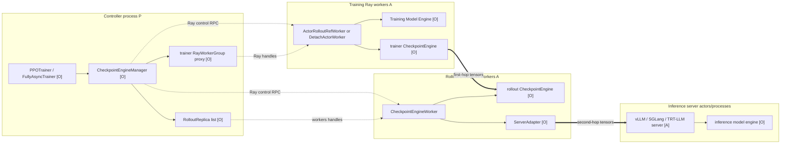
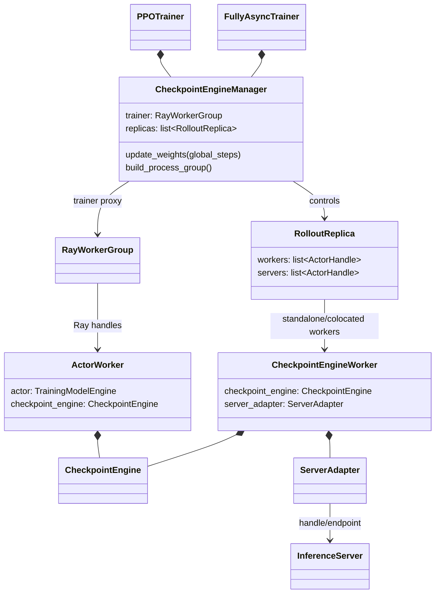
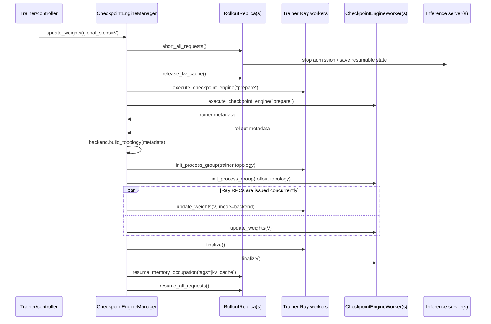
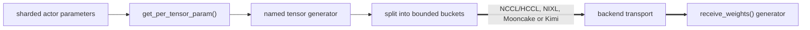
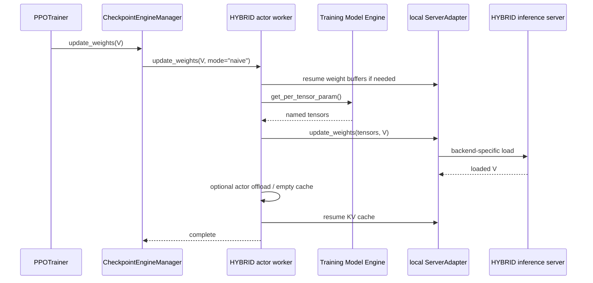
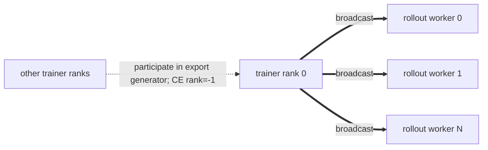
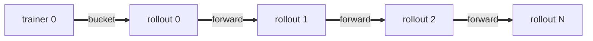
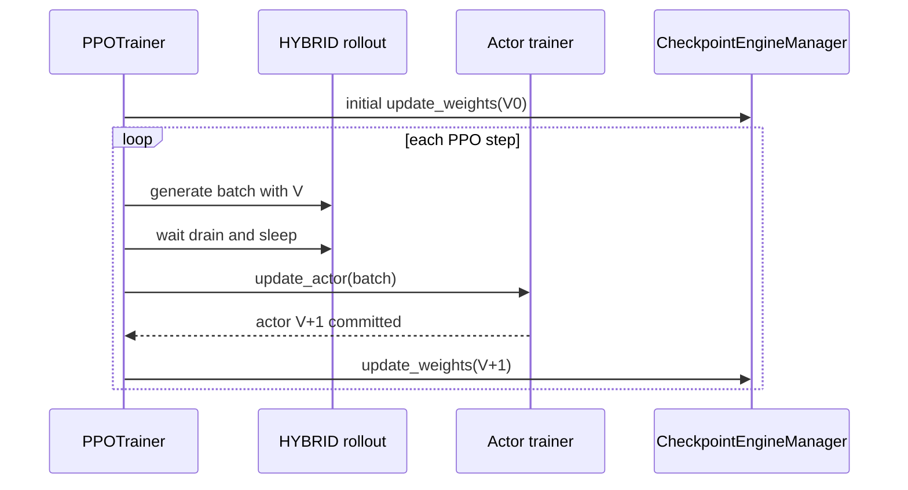
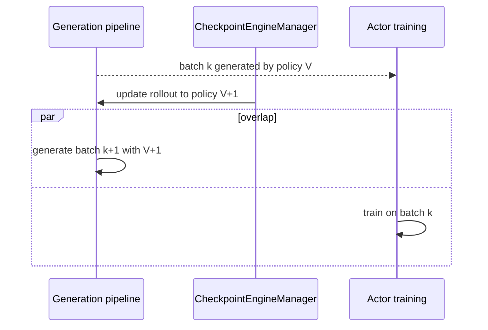
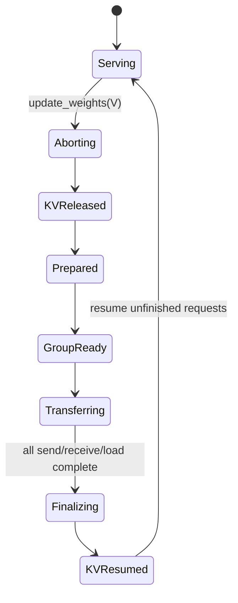

# verl v0.8.0 Checkpoint Engine 工作原理与使用场景

> 代码基线：`/Users/nyp/Documents/verl`，tag `v0.8.0`，commit `7aed6b23`。
> 本文中的 checkpoint engine 专指 **训练引擎到在线 rollout 引擎的权重同步机制**，不是
> `PPOTrainer._save_checkpoint()` 所代表的断点落盘/恢复机制。

## 1. 先给结论

verl 的 `CheckpointEngine` 解决的是：训练完成一次参数更新后，如何把训练引擎中的分片参数转换成
rollout 能识别的 named tensors，并更新到 vLLM、SGLang 或 TensorRT-LLM 的模型显存中。

它由三层组成：

1. `CheckpointEngineManager`：控制面编排者，决定何时停请求、建传输拓扑、并发发送/接收及恢复服务。
2. trainer-side / rollout-side `CheckpointEngine`：第一段权重数据通道，将参数从训练 workers 送到
   rollout checkpoint workers。
3. `ServerAdapter`：第二段权重数据通道，将 checkpoint worker 收到的 tensors 写入真实推理 server。

非 `naive` 后端的完整数据路径是两跳，而不是一次 RPC：

```text
Training Model Engine HBM
  -- get_per_tensor_param() --> named tensor stream
  -- CheckpointEngine backend --> rollout CheckpointEngineWorker
  -- ServerAdapter --> vLLM / SGLang / TRT-LLM model HBM
```

`naive` 是重要特例：在默认 sync + HYBRID 中，训练 worker 本身就是 rollout 的控制锚点，manager
直接调用 trainer worker 的 `update_weights(mode="naive")`，不构建跨 worker checkpoint 拓扑。

## 2. 它不是什么

| 容易混淆的能力 | 是否由 Checkpoint Engine 提供 |
|---|---|
| PPO 训练断点的持久化保存/恢复 | 否，由 trainer checkpoint manager 等负责 |
| actor 参数转换为 rollout named tensors | 是，由各 Training Model Engine 的 `get_per_tensor_param()` 提供 |
| trainer→rollout 在线权重传输 | 是，核心职责 |
| rollout checkpoint worker→推理 server 加载 | 间接负责，由 `ServerAdapter` 完成 |
| rollout 样本陈旧度判断、丢弃或 importance correction | 否，由异步 trainer/数据协议控制 |
| policy version 生成 | 否；manager 只把 `global_steps` 透传给 server |
| 版本化、可长期读取的 DDR 权重快照 | v0.8.0 没有完整实现 |
| 新 replica 在 trainer 不在线时独立拉取权重 | v0.8.0 没有完整实现 |

`CheckpointEngineWithCache.get_weights()` 已在抽象层预留，但 v0.8.0 没有具体 backend 实现或生产调用。

## 3. 核心接口与职责

### 3.1 `CheckpointEngine`

每个参与权重传输的 worker 进程中都有一个 backend 实例。其关键接口是：

| 接口 | 调用者 | 含义 |
|---|---|---|
| `prepare()` | manager 通过 Ray RPC 调用所有参与者 | 分配/注册 bucket，并返回节点、设备或传输 agent metadata |
| `build_topology()` | manager 本地调用 backend class method | 根据 trainer/rollout metadata 生成每个 worker 的 rank、邻居或地址配置 |
| `init_process_group()` | manager 通过 Ray RPC 调用 | 创建 collective、P2P 或传输组 |
| `send_weights()` | trainer worker | 消费 named tensor generator 并发送 |
| `receive_weights()` | rollout checkpoint worker | 接收并产出 named tensor generator |
| `finalize()` | manager 通过 Ray RPC 调用 | 释放一次同步的 bucket/注册内存等临时资源 |

`TensorMeta` 携带 tensor 名、shape、dtype、chunk offset/size 等信息。大 tensor 会由
`split_weight_chunks()` 按 bucket 大小切为 `uint8` chunks，接收端再由 `merge_weight_chunks()` 还原。

### 3.2 `CheckpointEngineManager`

它是 controller 内的普通 Python 对象，不是 Ray Actor。它持有：

```text
trainer  -> RayWorkerGroup proxy
replicas -> list[RolloutReplica]
config   -> CheckpointEngineConfig
```

它负责控制面生命周期和一次 update 的全局编排，但不亲自承载 tensor 数据。

### 3.3 `CheckpointEngineWorker`

在 COLOCATED/STANDALONE 初始化中，它是新建的 Ray Actor；在其中持有：

```text
CheckpointEngineWorker [Ray Actor]
  ├─ checkpoint_engine [ordinary backend object]
  ├─ server_adapter [ordinary object]
  └─ rollout/model config
```

收到 `update_weights(global_steps)` 后，它执行：

```python
weights = checkpoint_engine.receive_weights()
await server_adapter.update_weights(weights)
```

因此它既是第一跳的接收端，也是第二跳的发起端。

### 3.4 trainer worker 与 Training Model Engine

actor worker 在 `init_model()` 中创建 trainer-side checkpoint backend。同步时：

- FSDP engine 会把 DTensor/FSDP 参数 materialize 为完整 tensor，并转换到 rollout/HF 命名；
- Megatron engine 通过 bridge 导出 HF 权重；
- AutoModel、TorchTitan、VeOmni 等 engine 提供相同的 named tensor 迭代接口；
- 非 `naive` 时所有必要 rank 必须迭代生成器，因为完整 tensor 的形成可能包含 collective。

## 4. 进程、Actor 与普通对象拓扑

图例：`[P]` 为本地 controller OS 进程，`[A]` 为 Ray Actor/远端 worker 进程，`[O]` 为普通对象。



HYBRID + `naive` 中没有单独的 `CheckpointEngineWorker` 第一跳：`replica.workers` 复用已有训练 worker
handles，actor worker 内的 `ServerAdapter` 直接更新推理 server。

## 5. 组件引用关系



关键边界：

- manager 持有 handles/proxies，不持有模型参数；
- trainer-side 与 rollout-side backend 互不持有对方 Python 对象，通过 backend topology 通信；
- `RolloutReplica` 是 controller 普通对象，保存 worker/server Actor handles；
- `ServerAdapter` 隔离 vLLM、SGLang、TRT-LLM 的具体加载协议。

## 6. 非 naive：控制面和数据面的完整流向

### 6.1 控制面



`CheckpointEngineManager` 会把所有 `replica.workers` 临时展平为一个 `RayWorkerGroup` 代理；这不会创建新
worker。`add_replicas()`/`remove_replicas()` 只改变列表，真正拓扑在后续 `update_weights()` 时重建。

### 6.2 第一跳数据面：trainer→rollout checkpoint worker



这里的 Ray RPC 只触发远端方法；大权重不经 controller 返回。tensor bytes 走 backend 自己的数据通道。

### 6.3 第二跳数据面：checkpoint worker→真实 inference engine

| Rollout backend | 第二跳大致路径 |
|---|---|
| vLLM | `ServerAdapter` 找到本 replica/node 的 server Actor；通过本机 ZMQ 发送 bucket 描述，优先 CUDA IPC、否则 shared memory；server worker extension 重建 tensor 并 load |
| SGLang | adapter 按 bucket 调用 `update_weights_from_tensor`，server 侧写入模型，然后 flush cache、记录版本 |
| TensorRT-LLM | worker 为 bucket 创建 IPC handles，汇总后由 leader 通知 server worker extension 加载 |

两跳结束后，server 才真正拥有版本 `V`。`global_steps=V` 会被 adapter 写入 server，供生成结果标识
policy version；它不是 Checkpoint Engine 自己生成的事务版本号。

## 7. naive：HYBRID 默认旁路

`backend=naive` 时，`CheckpointEngineManager.update_weights()` 直接执行：

```text
trainer.update_weights(global_steps, mode="naive")
```

manager 不执行全体 abort、prepare、build topology、receive 或 finalize。训练 worker 内部完成导出与更新：



这个分支依赖 trainer 与 rollout 的 HYBRID 共卡/共 worker 锚点。同步 PPO 在调用它之前已经等待 rollout
排空并 sleep，因此 manager 自身不再重复 abort。`naive` 不适合真正训推分离的 `DetachActorWorker`：后者
没有可被直接更新的本地 rollout 成员。

## 8. backend 的传输拓扑

| backend | 第一跳主要拓扑 | metadata/control 通道 | tensor data 通道 | 动态拓扑特点 |
|---|---|---|---|---|
| `naive` | 无独立第一跳 | Ray 调 trainer worker | 本 worker adapter→server | 适合 HYBRID 固定映射 |
| `nccl` | trainer rank 0 广播到所有 rollout workers | ZeroMQ PUB/SUB | NCCL broadcast | 默认固定组；变更 world size 需正确启用重建 |
| HCCL 实现 | 与 NCCL 同类，面向 Ascend | ZeroMQ | HCCL broadcast | v0.8.0 条件注册名仍为 `nccl`，不是独立稳定的 `hccl` key |
| `nixl` | trainer 0→rollout 0→rollout 1→…的链式转发 | ZeroMQ PUSH/PULL | NIXL registered-memory transfer | 每次可按当前 replicas 生成前驱/后继，弹性更好 |
| `mooncake` | 链式/ring P2P | `StatelessProcessGroup` object messages | Mooncake `TransferEngine` | 仍是一次同步会话，不是长期 DDR snapshot store |
| `kimi_ckpt_engine` | trainer 侧 CPU offload/参数服务，rollout 侧再广播 | process-group/参数服务 metadata | Mooncake + NCCL/HCCL | 参与者仍按本次同步组织 |

NCCL 广播拓扑：



NIXL/Mooncake 链式拓扑：



默认 bucket 为 2048 MiB。NCCL、NIXL 等实现会准备双 buffer，因此调大 bucket 能减少调度次数，但也会
显著增加每个参与者同步期间的显存/注册内存占用。

## 9. verl 哪些场景真正使用了它

### 9.1 sync PPO + HYBRID：默认主路径

`PPOTrainer` 初始化 actor rollout replicas 后创建 manager；`fit()` 开始前先同步初始权重，之后在每轮
actor update 完成后同步新版本。



默认是 `naive`。也可以配置非 naive，但 HYBRID 的低侵入优势正来自训练 worker 可直接控制同卡 rollout。

### 9.2 `SeparateRayPPOTrainer` + STANDALONE：训推分离同步底座

actor 使用 `DetachActorWorker`，rollout 使用独立 `CheckpointEngineWorker` 与 server。初始化和每轮训练后
调用 manager，因此必须选择能跨 worker 传输的非 naive backend。

```text
DetachActorWorker(s)
  -- non-naive Checkpoint Engine --> standalone CheckpointEngineWorker(s)
  -- ServerAdapter --> standalone inference server(s)
```

### 9.3 One-Step Off-Policy：同步器不变，调用位置改变

该模式复用 separated trainer，E2E 配置使用 `nccl`。生成 batch `k` 后先把新权重同步到 rollout，立即启动
batch `k+1` 的生成，再用 batch `k` 训练，从而形成固定一步重叠。



Checkpoint Engine 只完成 `V+1` 的切换；“一步 off-policy”的调度、样本版本和训练语义由 trainer 控制。

### 9.4 Fully Async：版本切换点和 partial rollout 协调

`FullyAsyncTrainer` 持有面向 STANDALONE replicas 的主 manager。当异步策略判断需要发布新参数版本时：

1. manager abort 正在执行的 rollout 请求；
2. server/client 层保留可恢复的 partial trajectory 状态；
3. 非 naive engine 同步新权重并写入新 `global_steps`；
4. 恢复 KV cache 与未完成请求；
5. 后续 token 可能跨 policy version，样本协议再据此处理陈旧度。

```mermaid
sequenceDiagram
    participant F as FullyAsyncTrainer
    participant C as CheckpointEngineManager
    participant Q as in-flight rollout requests
    participant W as trainer/rollout workers

    F->>F: update trigger reached; advance parameter version V
    F->>C: update_weights(V)
    C->>Q: abort and preserve resumable state
    C->>W: build topology and transfer V
    C->>Q: resume under V
    Note over F,Q: staleness bounds/off-policy handling are outside Checkpoint Engine
```

Fully Async 还可为 trainer-side validation 建第二个、强制 `naive` 的 hybrid manager；它在验证前同步验证
replicas，临时加入 LB，验证后摘除并 sleep。这与主 STANDALONE manager 是两条独立权重链。

### 9.5 COLOCATED Reward/Teacher：对象存在，但在线同步链未使用

Reward/Teacher 的 `init_colocated()` 会新建 `CheckpointEngineWorker`，worker 内也会实例化 backend，主要是
复用统一的 rollout worker/server 初始化框架。但 v0.8.0 的 manager 没有为这些静态辅助模型创建
`CheckpointEngineManager`，PPO actor update 也不会更新它们；其模型从配置的 `model_path` 初始加载。

因此应区分：

```text
CheckpointEngineWorker 被创建  !=  CheckpointEngine 在线权重同步被调用
```

## 10. 如何配置与扩展

### 10.1 内置 backend

```yaml
actor_rollout_ref:
  rollout:
    checkpoint_engine:
      backend: nccl
      update_weights_bucket_megabytes: 2048
      engine_kwargs:
        rebuild_group: true
```

- sync + HYBRID 默认使用 `naive`；
- STANDALONE/训推分离应使用 `nccl`、`nixl`、`mooncake` 或项目验证过的其他非 naive backend；
- replicas 数量会变化时，不能假定旧 NCCL world size 可继续使用；要选择支持拓扑变化的 backend，或正确
  配置 collective group 重建。

### 10.2 独立子仓注册自定义 backend

配置 `custom_backend_module` 后，该 Python module 会在 trainer 和 rollout worker 进程中 import，模块可通过
`CheckpointEngineRegistry.register()` 注册实现：

```yaml
actor_rollout_ref:
  rollout:
    checkpoint_engine:
      backend: my_backend
      custom_backend_module: multi_task_verl.checkpoint_backend
```

自定义 backend 必须同时处理 send/receive 两端、bucket 生命周期、拓扑 metadata 和失败清理。

### 10.3 替换 manager

标准和 separated trainer 都支持：

```yaml
actor_rollout_ref:
  rollout:
    checkpoint_manager_class: multi_task_verl.checkpoint_manager.MultiTaskCheckpointEngineManager
```

这适合改变 abort 范围、只更新部分 replicas、拓扑重建策略或接入外部 snapshot 生命周期。只换 backend
无法改变 base manager“abort 全部 replicas，并把 trainer 和全部 rollout workers 纳入同一次更新”的语义。

## 11. 生命周期、并发与失败边界

### 11.1 一次非 naive update 的状态机



只有 `ServerAdapter.update_weights()` 全部返回，manager 才会进入 finalize/resume。现有实现没有跨所有 server
的持久化 two-phase commit、自动 rollback 或版本 catalog；中途失败时需要上层把 rollout 视为不可安全
服务并执行恢复，而不能假设所有 replicas 已原子切换。

### 11.2 replica 变化

`add_replicas()` 与 `remove_replicas()` 本身不搬运权重，只影响下一次 update 的参与者集合。这意味着：

- 新 replica 在完成某次 update 前不能进入 LB；
- 删除 replica 应先 drain/摘流，避免 manager 正在对已经销毁的 handle 建组；
- base manager 的更新粒度是其当前 `replicas` 全集，不是单 replica 增量更新；
- NCCL/HCCL 的 world-size 变化需要真正重建 group；仅修改 manager 列表不够。

## 12. 对多任务实时扩缩方案的含义

原生 Checkpoint Engine 可复用的部分：

- Training Model Engine 的 named tensor 导出与格式转换；
- backend registry 与 `custom_backend_module` 扩展点；
- `CheckpointEngineWorker` 和 `ServerAdapter` 的第二跳加载能力；
- `checkpoint_manager_class` 替换点；
- `RolloutReplica` worker/server handles 与显存 sleep/wake 生命周期。

但原生非 naive manager 与当前目标有三个冲突：

| v0.8.0 原生语义 | 多任务实时扩缩目标 |
|---|---|
| 每次更新要求 trainer send 与 rollout receive 同时在线 | rollout 阶段新增 replica 可在 trainer 不可用时加载 |
| abort manager 中的全部 replicas | 只影响新建/目标 replica，不打断其他在线实例 |
| 一次传输拓扑中的临时 buffers/session | immutable、版本化、可 lease/GC 的 DDR snapshot |

特别需要明确：`backend=mooncake` 只是使用 Mooncake TransferEngine 完成当前同步会话的数据搬运；它仍由
base manager 同时驱动 trainer 与 rollout、建本次拓扑、传完即 finalize。它不等于
[版本化 DDR 权重存储](08-versioned-ddr-weight-store.md)定义的“发布一次、多个新 replica 后续独立拉取”。

因此子仓中的合理扩展组合是：

```text
复用 get_per_tensor_param()
  + 自定义 snapshot publisher/backend
  + 自定义 CheckpointEngineManager（缩小 abort/update 范围）
  + 复用/扩展 CheckpointEngineWorker 与 ServerAdapter
  + 每个 replica 显式记录 loaded_policy_version
```

长期可以把 `CheckpointEngineWithCache.get_weights()` 落成真正的 cache/store pull 模式，但 v0.8.0 当前没有
可直接启用的实现，不能只靠改配置完成。

## 13. 代码依据索引

| 代码事实 | v0.8.0 位置 |
|---|---|
| 抽象接口、registry、naive 和 cache 抽象 | `verl/checkpoint_engine/base.py:33-275` |
| `CheckpointEngineWorker` 接收后调用 adapter | `verl/checkpoint_engine/base.py:278-339` |
| manager 引用、建组、生命周期和 update 编排 | `verl/checkpoint_engine/base.py:345-514` |
| tensor chunk split/merge | `verl/checkpoint_engine/base.py:517-585` |
| Checkpoint Engine 概览与 backend 表 | `verl/checkpoint_engine/README.md:1-30` |
| actor worker 创建 backend 和 naive/non-naive 分支 | `verl/workers/engine_workers.py:618-756` |
| FSDP named tensor 导出 | `verl/workers/engine/fsdp/transformer_impl.py:794-846` |
| Megatron named tensor 导出 | `verl/workers/engine/megatron/transformer_impl.py:720-749` |
| AutoModel named tensor 导出 | `verl/workers/engine/automodel/transformer_impl.py:423-437` |
| rollout checkpoint 配置和 manager 扩展点 | `verl/workers/config/rollout.py:142-157,244-247` |
| NCCL topology/send/receive | `verl/checkpoint_engine/nccl_checkpoint_engine.py:159-271` |
| NIXL dynamic chain topology | `verl/checkpoint_engine/nixl_checkpoint_engine.py:288-441` |
| Mooncake backend | `verl/checkpoint_engine/mooncake_checkpoint_engine.py` |
| Kimi backend | `verl/checkpoint_engine/kimi_checkpoint_engine.py:222-475` |
| vLLM adapter 与 IPC 更新 | `verl/workers/rollout/vllm_rollout/vllm_rollout.py:90-200` |
| vLLM worker extension 接收并加载 | `verl/workers/rollout/vllm_rollout/utils.py:197-241` |
| SGLang adapter 更新 | `verl/workers/rollout/sglang_rollout/sglang_rollout.py:295-360` |
| TRT-LLM adapter 更新 | `verl/workers/rollout/trtllm_rollout/trtllm_rollout.py:450-550` |
| sync PPO 创建 manager 与每 step 调用 | `verl/trainer/main_ppo_sync.py:731-740,1606,1651` |
| separated trainer 创建/调用 manager | `verl/experimental/separation/ray_trainer.py:106-131,295-297,645-650` |
| one-step update 与下一轮生成衔接 | `verl/experimental/one_step_off_policy/ray_trainer.py:390-409` |
| Fully Async 主/验证 manager 与更新 | `verl/experimental/fully_async_policy/fully_async_trainer.py:167-243,501-596` |

## 14. 一句话总结

```text
CheckpointEngineManager 管何时、谁参与和生命周期；
CheckpointEngine backend 管 trainer→rollout worker 的第一跳；
ServerAdapter 管 rollout worker→推理模型 HBM 的第二跳；
异步陈旧度、持久 checkpoint 和版本化 DDR snapshot 都不属于现有 Checkpoint Engine 的完整职责。
```
