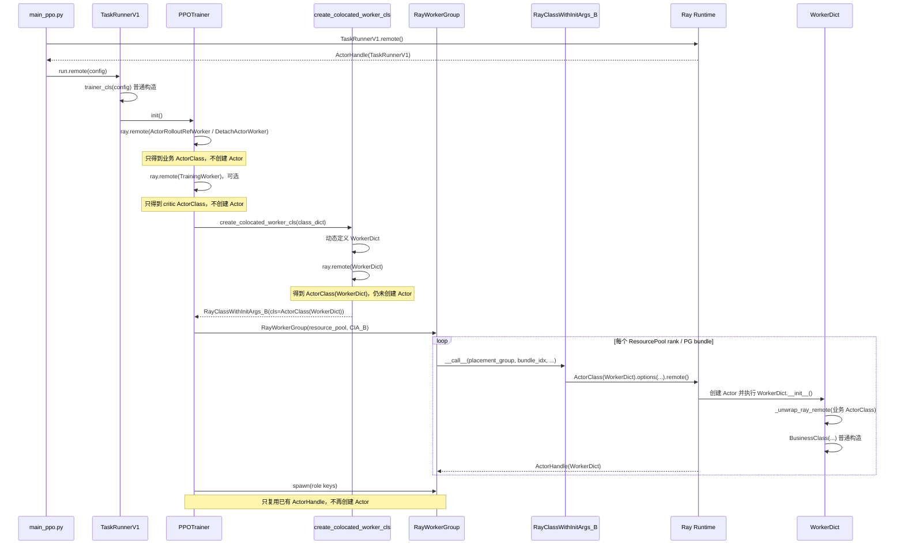

# verl v0.9.0 训练侧 WorkerDict Ray Actor 创建调用链

> 状态：待评审。
>
> 代码基线：`/Users/nyp/Documents/verl`，`v0.9.0-1-g88512193`，commit `88512193`。
>
> 分析范围：verl V1 PPO Trainer 的训练侧 Worker 创建路径。本文重点回答：调用
> `return self.cls.options(**options).remote(...)` 时，`self.cls` 到底是哪一个类；
> `WorkerDict`、`ActorRolloutRefWorker`、`DetachActorWorker` 和 `TrainingWorker` 中，哪些只是被
> `ray.remote()` 包装，哪些真正产生了 Ray Actor 进程。

## 1. 结论

当前训练侧调用路径中，真正通过 `.remote()` 创建并成为 Ray Actor 运行实体的是动态生成的
`WorkerDict`：

```text
ActorClass(WorkerDict).options(...).remote()
```

`ActorRolloutRefWorker`、`DetachActorWorker` 和作为独立 critic 角色注册的 `TrainingWorker` 虽然先经过
`ray.remote(BusinessClass)`，但这个包装结果只被当作“角色类描述”传给
`create_colocated_worker_cls()`。该函数随后将它们解包为原始 Python 类，并在 `WorkerDict` Actor
进程内用普通构造函数实例化：

```text
ActorRolloutRefWorker(...)
DetachActorWorker(...)
TrainingWorker(...)
```

所以，在这条调用路径中它们不是独立 Ray Actor。

必须区分以下两个动作：

| 代码 | 结果 | 是否已经创建 Ray Actor 进程 |
|---|---|---:|
| `actor_class = ray.remote(SomeClass)` | 得到 `ActorClass(SomeClass)` 类描述 | 否 |
| `handle = actor_class.options(...).remote(...)` | 得到 `ActorHandle`，Ray 创建 Actor 实例/进程 | 是 |

`verl/single_controller/ray/base.py:415` 是通用代码，并没有写死 `WorkerDict`。在训练侧当前这一次调用中，
执行该行的 `self` 是包装 `ActorClass(WorkerDict)` 的第二层 `RayClassWithInitArgs`，所以该行实际创建
`WorkerDict` Ray Actor。不能拿第一层业务类包装对象的 `self.cls` 代入第二层对象。

## 2. 运行实体总览

### 2.1 HYBRID / 共卡训练侧

```mermaid
flowchart TB
    TR["TaskRunnerV1<br/>Ray Actor"]
    PT["PPOTrainerColocateAsync<br/>普通对象"]
    RWG["RayWorkerGroup<br/>普通代理对象"]
    WD["WorkerDict<br/>Ray Actor"]
    ARW["ActorRolloutRefWorker<br/>Actor 内普通对象"]
    CTW["TrainingWorker<br/>critic 角色普通对象，可选"]
    ATW["TrainingWorker<br/>actor/ref 内层普通对象"]

    TR --> PT
    PT --> RWG
    RWG -->|ActorHandle| WD
    WD -->|worker_dict[actor_rollout_ref]| ARW
    WD -->|worker_dict[critic]| CTW
    ARW -->|actor/ref| ATW
```

### 2.2 STANDALONE / `separate_async` 训练侧

`PPOTrainerSeparateAsync` 会将训练侧角色类从 `ActorRolloutRefWorker` 替换为
`DetachActorWorker`，但外层创建机制不变：

```mermaid
flowchart TB
    TR["TaskRunnerV1<br/>Ray Actor"]
    PT["PPOTrainerSeparateAsync<br/>普通对象"]
    RWG["RayWorkerGroup<br/>普通代理对象"]
    WD["WorkerDict<br/>Ray Actor"]
    DAW["DetachActorWorker<br/>Actor 内普通对象"]
    CTW["TrainingWorker<br/>critic 角色普通对象，可选"]
    ATW["TrainingWorker<br/>actor/ref 内层普通对象"]

    TR --> PT
    PT --> RWG
    RWG -->|ActorHandle| WD
    WD -->|worker_dict[actor_rollout 或 actor_rollout_ref]| DAW
    WD -->|worker_dict[critic]| CTW
    DAW -->|actor/ref| ATW
```

独立 rollout 侧的 `CheckpointEngineWorker` 不在本文这条训练侧 `WorkerDict` 创建链内。它由 standalone
rollout 的另一个 `RayWorkerGroup` 创建，是独立 Ray Actor。

## 3. 调用链总图

图中用两种标记区分 Ray 的“类包装”和“实例创建”：

- `ray.remote(Class)`：只生成 `ActorClass`；
- `ActorClass.remote()`：真正创建 Actor。



## 4. 逐步调用路径与每一步的 remote 对象

### 4.1 第 0 步：创建 `TaskRunnerV1` Ray Actor

V1 入口将 `TaskRunnerV1` 传给 `run_ppo()`：

```python
if config.trainer.use_v1:
    run_ppo(config, task_runner_class=TaskRunnerV1)
```

代码位置：`verl/trainer/main_ppo.py:184-185`。

`TaskRunnerV1` 本身通过装饰器声明为 Ray Actor 类：

```python
@ray.remote
class TaskRunnerV1:
    ...
```

代码位置：`verl/trainer/main_ppo.py:103-104`。

`run_ppo()` 真正调用 `.remote()`：

```python
runner = task_runner_class.remote()
ray.get(runner.run.remote(config))
```

代码位置：`verl/trainer/main_ppo.py:93-94`。

此时的具体类型和动作是：

```text
task_runner_class = ActorClass(TaskRunnerV1)
task_runner_class.remote()
→ 真正创建 TaskRunnerV1 Ray Actor
→ runner = ActorHandle(TaskRunnerV1)
```

这是整个流程中的 single controller 进程。后续 `PPOTrainer`、`RayWorkerGroup` 等 controller 侧普通对象
都在这个 `TaskRunnerV1` Actor 进程内创建。

### 4.2 第 1 步：在 `TaskRunnerV1` 内普通构造 Trainer

`TaskRunnerV1.run()` 获取 Trainer 类并直接调用普通构造函数：

```python
trainer_cls = get_trainer_cls(config.trainer.v1.trainer_mode)
self.trainer = trainer_cls(config=config)
self.trainer.init()
```

代码位置：`verl/trainer/main_ppo.py:140-154`。

这里没有 `ray.remote()`：

```text
trainer_cls(config=config)
→ PPOTrainerSync / PPOTrainerColocateAsync / PPOTrainerSeparateAsync 普通对象
```

Trainer 不是独立 Ray Actor，而是 `TaskRunnerV1` Actor 进程内的普通对象。

### 4.3 第 2 步：Trainer 进入训练 Worker 初始化

`PPOTrainer.init()` 调用 `_setup()`：

```python
def init(self):
    self._setup()
    self.on_init_end()
```

代码位置：`verl/trainer/ppo/v1/trainer_base.py:217-227`。

`_setup()` 首先调用 `_init_resource_pool_mgr()`，然后创建原生 ResourcePool：

```python
self._init_resource_pool_mgr()
self.resource_pool_manager.create_resource_pool()
```

代码位置：`verl/trainer/ppo/v1/trainer_base.py:229-235`。

这一步本身不创建训练 Worker Actor，它只是准备角色类映射和 Placement Group 等资源描述。

### 4.4 第 3 步：对业务 Worker 类调用 `ray.remote()`，但不创建 Actor

基础 Trainer 注册 actor/rollout/ref 角色：

```python
role = Role.ActorRolloutRef if need_reference_policy(config) and not ref_in_actor else Role.ActorRollout
self.role_worker_mapping[role] = ray.remote(ActorRolloutRefWorker)
```

代码位置：`verl/trainer/ppo/v1/trainer_base.py:740-748`。

如果启用 critic，还会执行：

```python
self.role_worker_mapping[Role.Critic] = ray.remote(TrainingWorker)
```

代码位置：`verl/trainer/ppo/v1/trainer_base.py:750-753`。

此时具体结果是：

```text
role_worker_mapping[actor_role]
    = ActorClass(ActorRolloutRefWorker)

role_worker_mapping[Role.Critic]
    = ActorClass(TrainingWorker)
```

这里调用的是：

```python
ray.remote(BusinessClass)
```

不是：

```python
ray.remote(BusinessClass).remote(...)
```

所以此时只产生 Ray Actor 类描述，没有 `ActorHandle`，也没有启动
`ActorRolloutRefWorker` 或 `TrainingWorker` Actor 进程。

### 4.5 第 3A 步：`separate_async` 将业务类替换为 `DetachActorWorker`

在 STANDALONE rollout 对应的 `PPOTrainerSeparateAsync` 中，子类先调用父类完成上述映射，再将 actor 角色
替换为：

```python
if Role.ActorRolloutRef in self.role_worker_mapping:
    self.role_worker_mapping[Role.ActorRolloutRef] = ray.remote(DetachActorWorker)
elif Role.ActorRollout in self.role_worker_mapping:
    self.role_worker_mapping[Role.ActorRollout] = ray.remote(DetachActorWorker)
```

代码位置：`verl/trainer/ppo/v1/trainer_separate_async.py:71-79`。

此时：

```text
role_worker_mapping[actor_role]
    = ActorClass(DetachActorWorker)
```

同样只是调用 `ray.remote(DetachActorWorker)` 得到 ActorClass，没有调用其 `.remote()`，因此没有创建独立的
`DetachActorWorker` Ray Actor。

### 4.6 第 4 步：创建第一层 `RayClassWithInitArgs`——业务类描述

`PPOTrainer._setup()` 将 actor 业务 ActorClass 和初始化参数放入
`RayClassWithInitArgs`：

```python
actor_rollout_cls = RayClassWithInitArgs(
    cls=self.role_worker_mapping[actor_role],
    config=self.config.actor_rollout_ref,
    distillation_config=self.config.get("distillation"),
    role=str(actor_role),
)
```

代码位置：`verl/trainer/ppo/v1/trainer_base.py:237-246`。

如果启用 critic，还会创建：

```python
critic_cls = RayClassWithInitArgs(
    cls=self.role_worker_mapping[Role.Critic],
    config=worker_cfg,
)
```

代码位置：`verl/trainer/ppo/v1/trainer_base.py:248-271`。

`ClassWithInitArgs` 只是保存三个成员：

```python
self.cls = cls
self.args = args
self.kwargs = kwargs
```

代码位置：`verl/single_controller/base/worker_group.py:76-99`。

把 actor 这一层对象记为 `CIA_A`：

```text
HYBRID / 共卡：
CIA_A.cls    = ActorClass(ActorRolloutRefWorker)
CIA_A.kwargs = {config, distillation_config, role}

separate_async：
CIA_A.cls    = ActorClass(DetachActorWorker)
CIA_A.kwargs = {config, distillation_config, role}
```

critic 的第一层对象可记为 `CIA_C`：

```text
CIA_C.cls    = ActorClass(TrainingWorker)
CIA_C.kwargs = {config=worker_cfg}
```

这一阶段没有调用任何 ActorClass 的 `.remote()`，仍然没有创建训练 Worker Actor。

### 4.7 第 5 步：按 ResourcePool 聚合第一层业务类描述

actor 描述被写入：

```python
self.resource_pool_to_cls[actor_rollout_resource_pool][str(actor_role)] = actor_rollout_cls
```

代码位置：`verl/trainer/ppo/v1/trainer_base.py:239-246`。

critic 描述被写入同类结构：

```python
self.resource_pool_to_cls[resource_pool][str(Role.Critic)] = critic_cls
```

代码位置：`verl/trainer/ppo/v1/trainer_base.py:269-271`。

默认情况下 actor 和 critic 都映射到 `global_pool`，映射代码位于
`verl/trainer/ppo/v1/trainer_base.py:746-759`。因此一次循环中的 `class_dict` 可近似表示为：

```python
class_dict = {
    "actor_rollout_ref": CIA_A,
    "critic": CIA_C,  # 启用 critic 时
}
```

`Role.__str__()` 将角色枚举转换成 `actor_rollout`、`actor_rollout_ref`、`critic` 等 key，代码位置为
`verl/trainer/ppo/utils.py:42-56`。

这里仍然只是在 controller 中聚合普通对象。

### 4.8 第 6 步：动态定义 `WorkerDict`，保存业务类和构造参数

Trainer 对每个 ResourcePool 调用：

```python
worker_dict_cls = create_colocated_worker_cls(class_dict=class_dict)
```

代码位置：`verl/trainer/ppo/v1/trainer_base.py:290-293`。

`create_colocated_worker_cls()` 首先从第一层包装对象中取出业务 ActorClass 和构造参数：

```python
for key, cls in class_dict.items():
    cls_dict[key] = cls.cls
    init_args_dict[key] = {"args": cls.args, "kwargs": cls.kwargs}
```

代码位置：`verl/single_controller/ray/base.py:1001-1004`。

此时闭包数据为：

```text
cls_dict[actor_role] = ActorClass(ActorRolloutRefWorker)
                    或 ActorClass(DetachActorWorker)

cls_dict[critic]     = ActorClass(TrainingWorker)，可选

init_args_dict       = 对应业务类的初始化参数
```

随后动态定义外层 Python 类：

```python
class WorkerDict(worker_cls):
    def __init__(self):
        ...
```

代码位置：`verl/single_controller/ray/base.py:1007-1020`。

注意：执行到这里时只是完成 Python 类定义，并没有实例化 `WorkerDict`，也没有执行
`WorkerDict.__init__()`。

### 4.9 第 7 步：给 `WorkerDict` 绑定业务方法

`create_colocated_worker_cls()` 将业务类上使用 `@register` 标记的方法绑定到外层 `WorkerDict`：

```python
for key, user_defined_cls in cls_dict.items():
    user_defined_cls = _unwrap_ray_remote(user_defined_cls)
    _bind_workers_method_to_parent(WorkerDict, key, user_defined_cls)
```

代码位置：`verl/single_controller/ray/base.py:1022-1025`。

生成的外层方法最终调用：

```python
return getattr(self.worker_dict[key], name)(*args, **kwargs)
```

代码位置：`verl/single_controller/ray/base.py:920-965`，核心委托位于 `937-943`。

例如，内层 `ActorRolloutRefWorker.init_model()` 会形成类似的外层方法：

```text
WorkerDict.actor_rollout_ref_init_model(...)
    → WorkerDict.worker_dict["actor_rollout_ref"].init_model(...)
```

该步骤只是动态修改 `WorkerDict` Python 类，没有创建 Actor。

### 4.10 第 8 步：对 `WorkerDict` 调用 `ray.remote()`，得到第二层包装对象

这是调用链发生类身份切换的关键位置：

```python
remote_cls = ray.remote(WorkerDict)
remote_cls = RayClassWithInitArgs(cls=remote_cls)
return remote_cls
```

代码位置：`verl/single_controller/ray/base.py:1027-1029`。

第一行执行后：

```text
remote_cls = ActorClass(WorkerDict)
```

但还没有调用 `ActorClass(WorkerDict).remote()`，所以此时仍未创建 `WorkerDict` Actor。

第二行又创建了一个新的 `RayClassWithInitArgs`。将它记为 `CIA_B`：

```text
CIA_B.cls    = ActorClass(WorkerDict)
CIA_B.args   = ()
CIA_B.kwargs = {}
```

这与第一层 `CIA_A` 是两个不同对象：

| 对象 | `self.cls` | 用途 |
|---|---|---|
| `CIA_A` | `ActorClass(ActorRolloutRefWorker)` 或 `ActorClass(DetachActorWorker)` | 描述内层 actor 业务类 |
| `CIA_C` | `ActorClass(TrainingWorker)` | 描述内层 critic 业务类，可选 |
| `CIA_B` | `ActorClass(WorkerDict)` | 交给 `RayWorkerGroup`，真正创建外层 Ray Actor |

### 4.11 第 9 步：`RayWorkerGroup` 接收的是 `CIA_B`

Trainer 创建 `RayWorkerGroup`：

```python
wg_dict = RayWorkerGroup(
    resource_pool=resource_pool,
    ray_cls_with_init=worker_dict_cls,
    **wg_kwargs,
)
```

代码位置：`verl/trainer/ppo/v1/trainer_base.py:293-298`。

变量代入后为：

```text
worker_dict_cls              = CIA_B
wg_dict.ray_cls_with_init    = CIA_B
wg_dict.ray_cls_with_init.cls = ActorClass(WorkerDict)
```

不是：

```text
wg_dict.ray_cls_with_init = CIA_A
```

`RayWorkerGroup.__init__()` 保存该对象：

```python
self.ray_cls_with_init = ray_cls_with_init
```

代码位置：`verl/single_controller/ray/base.py:426-456`，具体赋值在 `455`。

因为传入了非空 `resource_pool`，父类将 `_is_init_with_detached_workers` 设置为 `False`：

```python
self._is_init_with_detached_workers = resource_pool is None
```

代码位置：`verl/single_controller/base/worker_group.py:123-140`，具体判断在 `132`。

因此 `RayWorkerGroup.__init__()` 进入创建新 Worker 的分支：

```python
self._init_with_resource_pool(...)
```

代码位置：`verl/single_controller/ray/base.py:474-491`，普通 ResourcePool 分支在 `485-491`。

### 4.12 第 10 步：为每个 PG bundle 调用 `_create_worker()`

`_init_with_resource_pool()` 获取 Placement Groups 和 world size：

```python
pgs = resource_pool.get_placement_groups(...)
world_size = resource_pool.world_size
```

代码位置：`verl/single_controller/ray/base.py:538-560`。

然后按 PG 和 local rank 调用 `_create_worker()`：

```python
for pg_idx, pg in enumerate(...):
    for local_rank in range(local_world_size):
        self._create_worker(
            ...,
            ray_cls_with_init=ray_cls_with_init,
        )
```

代码位置：`verl/single_controller/ray/base.py:563-581`。

传入 `_create_worker()` 的 `ray_cls_with_init` 仍然是 `CIA_B`。因此每一个 ResourcePool rank 都会创建
一个 `WorkerDict` Actor，而不是分别创建一个 actor Actor 和一个 critic Actor。

### 4.13 第 11 步：真正执行 `ActorClass(WorkerDict).remote()`

`_create_worker()` 配置 Actor 名称、环境变量、PG bundle 和 GPU 资源后执行：

```python
worker = ray_cls_with_init(
    placement_group=pg,
    placement_group_bundle_idx=local_rank,
    use_gpu=self.use_gpu,
    num_gpus=num_gpus,
    device_name=self.device_name,
)
```

代码位置：`verl/single_controller/ray/base.py:623-681`，调用发生在 `675-681`。

这里等价于：

```python
worker = CIA_B(...)
```

进入 `RayClassWithInitArgs.__call__()` 后，代码构造
`PlacementGroupSchedulingStrategy` 和 GPU options：

```python
options = {
    "scheduling_strategy": PlacementGroupSchedulingStrategy(
        placement_group=placement_group,
        placement_group_bundle_index=placement_group_bundle_idx,
    )
}
```

代码位置：`verl/single_controller/ray/base.py:369-410`。

最终实际创建语句为：

```python
return self.cls.options(**options).remote(*self.args, **self.kwargs)
```

代码位置：`verl/single_controller/ray/base.py:415`。

因为这里的 `self` 是 `CIA_B`，所以变量替换后的实际语义是：

```python
return ActorClass(WorkerDict).options(**options).remote()
```

只有这一行才真正请求 Ray 创建训练 Worker Actor，并返回：

```text
ActorHandle(WorkerDict)
```

如果将第一层 `CIA_A` 错误代入这里，才会得到
`ActorClass(ActorRolloutRefWorker).remote(...)`；但训练侧没有把 `CIA_A` 传给当前
`RayWorkerGroup`，所以这不是实际调用路径。

### 4.14 第 12 步：Ray 在远端执行 `WorkerDict.__init__()`，普通构造业务对象

Ray 创建 `WorkerDict` Actor 后，才在远端 Actor 进程中执行此前定义的
`WorkerDict.__init__()`：

```python
self.worker_dict = {}
for key, user_defined_cls in cls_dict.items():
    user_defined_cls = _unwrap_ray_remote(user_defined_cls)
    with temp_env_var("DISABLE_WORKER_INIT", "1"):
        self.worker_dict[key] = user_defined_cls(
            *init_args_dict[key].get("args", ()),
            **init_args_dict[key].get("kwargs", {}),
        )
```

代码位置：`verl/single_controller/ray/base.py:1008-1020`。

`_unwrap_ray_remote()` 实现为：

```python
def _unwrap_ray_remote(cls):
    if hasattr(cls, "__ray_actor_class__"):
        cls = cls.__ray_actor_class__
    return cls
```

代码位置：`verl/single_controller/ray/base.py:968-971`。

因此 HYBRID / 共卡的实际执行过程是：

```text
ActorClass(ActorRolloutRefWorker)
    → _unwrap_ray_remote
    → ActorRolloutRefWorker
    → ActorRolloutRefWorker(...)
```

`separate_async` 训练侧为：

```text
ActorClass(DetachActorWorker)
    → _unwrap_ray_remote
    → DetachActorWorker
    → DetachActorWorker(...)
```

启用 critic 时为：

```text
ActorClass(TrainingWorker)
    → _unwrap_ray_remote
    → TrainingWorker
    → TrainingWorker(...)
```

这些调用都没有 `.remote()`，所以创建的是 `WorkerDict` Actor 进程内的普通 Python 对象。

### 4.15 第 13 步：保存 `WorkerDict` ActorHandle

`RayClassWithInitArgs.__call__()` 返回 `ActorHandle(WorkerDict)` 后，`_create_worker()` 将它保存到
`RayWorkerGroup._workers`：

```python
self._workers.append(worker)
self._worker_names.append(name)
```

代码位置：`verl/single_controller/ray/base.py:682-683`。

此时：

```text
RayWorkerGroup._workers[i] = ActorHandle(WorkerDict rank i)
```

`RayWorkerGroup` 本身仍是 `TaskRunnerV1` 进程中的普通代理对象。

### 4.16 第 14 步：`spawn()` 复用已有句柄，不再创建 Actor

Trainer 随后执行：

```python
spawn_wg = wg_dict.spawn(prefix_set=class_dict.keys())
```

代码位置：`verl/trainer/ppo/v1/trainer_base.py:299`。

`spawn()` 将现有 `_workers` 直接传给 `from_detached()`：

```python
new_worker_group = self.from_detached(
    worker_names=self._worker_names,
    worker_handles=self._workers,
    ray_cls_with_init=self.ray_cls_with_init,
    ...
)
```

代码位置：`verl/single_controller/ray/base.py:718-750`，传递句柄位于 `740-747`。

`from_detached()` 创建的是 controller 侧新的 `RayWorkerGroup` 普通对象：

```python
worker_group = cls(
    resource_pool=None,
    worker_handles=worker_handles,
    ...
)
```

代码位置：`verl/single_controller/ray/base.py:689-716`。

这里 `resource_pool=None`，因此走“附着已有 WorkerHandle”路径，不进入 `_init_with_resource_pool()`，不会到达
`RayClassWithInitArgs.__call__()`，也就不会执行新的 `.remote()`。

所以 `spawn()` 的真实含义是：

```text
一组 WorkerDict ActorHandle
    → actor_rollout_wg 角色调用视图
    → critic_wg 角色调用视图
```

多个角色级 `RayWorkerGroup` 可以持有同一组 `WorkerDict` ActorHandle。

## 5. `init_model()` 调用最终落到哪个对象

Trainer 从 `spawn_wg` 取得 actor 角色代理并调用：

```python
self.actor_rollout_wg = all_wg[str(actor_role)]
self.actor_rollout_wg.init_model()
```

代码位置：`verl/trainer/ppo/v1/trainer_base.py:311-314`。

方法调用链为：

```text
PPOTrainer
  → RayWorkerGroup.init_model()                 controller 侧动态代理
  → ActorHandle(WorkerDict).<role>_init_model.remote()
  → WorkerDict.<role>_init_model()              Ray Actor 中的方法
  → WorkerDict.worker_dict[role].init_model()
  → ActorRolloutRefWorker.init_model()
     或 DetachActorWorker 继承的 init_model()
```

相关代码依据：

1. `WorkerDict` 角色方法委托到 `self.worker_dict[key]`：
   `verl/single_controller/ray/base.py:920-965`；
2. `spawn()` 将带角色前缀的方法在角色代理上重新绑定为无前缀方法：
   `verl/single_controller/ray/base.py:730-750`；
3. `RayWorkerGroup` 对 ActorHandle 调用远端方法：
   `verl/single_controller/ray/base.py:782-799`；
4. `ActorRolloutRefWorker.init_model()` 定义：
   `verl/workers/engine_workers.py:532-533`。

这解释了为什么 controller 可以写：

```python
self.actor_rollout_wg.init_model()
```

但远端并不存在一个独立的 `ActorRolloutRefWorker` ActorHandle；调用首先进入
`WorkerDict` Actor，再由 `WorkerDict` 委托给进程内业务对象。

## 6. `ActorRolloutRefWorker` 内部的 actor/ref 仍不是 Ray Actor

`ActorRolloutRefWorker` 类定义位于：

```text
verl/workers/engine_workers.py:446-470
```

它将 `actor_worker_cls` 和 `ref_worker_cls` 都设置为 `TrainingWorker`：

```python
actor_worker_cls = TrainingWorker
ref_worker_cls = TrainingWorker
```

代码位置：`verl/workers/engine_workers.py:453-454`。

执行 `init_model()` 时，ref 和 actor 也是普通构造：

```python
self.ref = self.ref_worker_cls(config=ref_training_config)
self.actor = self.actor_worker_cls(config=actor_training_config)
```

代码位置：

- ref：`verl/workers/engine_workers.py:581`；
- actor：`verl/workers/engine_workers.py:638`。

因此完整嵌套关系是：

```text
WorkerDict Ray Actor 进程
  ├── ActorRolloutRefWorker / DetachActorWorker 普通对象
  │     ├── TrainingWorker(actor) 普通对象
  │     └── TrainingWorker(ref) 普通对象，可选
  └── TrainingWorker(critic role) 普通对象，可选
```

不存在以下进程拓扑：

```text
WorkerDict Ray Actor
  → ActorRolloutRefWorker Ray Actor
      → TrainingWorker Ray Actor
```

## 7. 对 `base.py:415` 的变量快照

为了消除 `self.cls` 的歧义，下面给出调用到
`verl/single_controller/ray/base.py:415` 时的准确变量快照。

### 7.1 HYBRID / 共卡

```python
# 第一层，已经被 create_colocated_worker_cls 消费，不是当前 self
CIA_A.cls = ActorClass(ActorRolloutRefWorker)

# 第二层，实际进入 RayClassWithInitArgs.__call__ 的对象
self = CIA_B
self.cls = ActorClass(WorkerDict)
self.args = ()
self.kwargs = {}

# 实际执行
ActorClass(WorkerDict).options(**options).remote()
```

### 7.2 STANDALONE / `separate_async` 训练侧

```python
# 第一层，已经被 create_colocated_worker_cls 消费，不是当前 self
CIA_A.cls = ActorClass(DetachActorWorker)

# 第二层与 HYBRID 相同
self = CIA_B
self.cls = ActorClass(WorkerDict)

# 实际执行
ActorClass(WorkerDict).options(**options).remote()
```

### 7.3 STANDALONE rollout 侧对照

独立 rollout 初始化直接将下面的对象传给另一个 `RayWorkerGroup`：

```python
RayClassWithInitArgs(
    cls=ray.remote(CheckpointEngineWorker),
    ...,
)
```

代码位置：`verl/workers/rollout/replica.py:228-239`。

这条路径没有经过 `create_colocated_worker_cls()`，所以在 rollout 侧调用同一个
`base.py:415` 时：

```text
self.cls = ActorClass(CheckpointEngineWorker)
```

实际创建：

```python
ActorClass(CheckpointEngineWorker).options(...).remote(...)
```

这进一步说明 `base.py:415` 是通用创建点，不能脱离“哪个
`RayClassWithInitArgs` 被传给当前 `RayWorkerGroup`”来判断 `self.cls`。

## 8. 数量示例

假设：

```text
训练节点数 = 2
每节点训练 GPU = 8
global_pool = [8, 8]
启用 actor
启用独立 critic
actor 和 critic 均映射到 global_pool
```

`RayWorkerGroup._init_with_resource_pool()` 遍历 16 个 resource ranks，因此调用
`ActorClass(WorkerDict).remote()` 16 次，得到：

```text
WorkerDict Ray Actor                 16 个
ActorHandle(WorkerDict)              16 个
ActorRolloutRefWorker 独立 Ray Actor  0 个
DetachActorWorker 独立 Ray Actor      0 个
TrainingWorker 独立 Ray Actor         0 个
```

HYBRID 模式下，每个 `WorkerDict` Actor 内部包含：

```text
ActorRolloutRefWorker 普通对象 1 个
TrainingWorker critic 普通对象 1 个
ActorRolloutRefWorker.init_model() 后：
  TrainingWorker actor 普通对象 1 个
  TrainingWorker ref 普通对象 0 或 1 个
```

`separate_async` 训练侧则将第一个对象替换为 `DetachActorWorker`。

actor 角色 `RayWorkerGroup` 和 critic 角色 `RayWorkerGroup` 都可以引用同一组 16 个
`WorkerDict` ActorHandle；它们不是各自拥有 16 个不同 Actor。

## 9. 逐步判定表

| 步骤 | 代码位置 | 代码动作 | 涉及的具体类 | 创建 Ray Actor？ |
|---:|---|---|---|---:|
| 0 | `main_ppo.py:103-104` | `@ray.remote class TaskRunnerV1` | `TaskRunnerV1` | 否，只声明 ActorClass |
| 1 | `main_ppo.py:93` | `task_runner_class.remote()` | `TaskRunnerV1` | 是 |
| 2 | `main_ppo.py:153` | `trainer_cls(config)` | 某个 `PPOTrainer` 子类 | 否，普通对象 |
| 3 | `trainer_base.py:747` | `ray.remote(ActorRolloutRefWorker)` | `ActorRolloutRefWorker` | 否，只得到 ActorClass |
| 3A | `trainer_separate_async.py:76-79` | `ray.remote(DetachActorWorker)` | `DetachActorWorker` | 否，只得到 ActorClass |
| 4 | `trainer_base.py:752` | `ray.remote(TrainingWorker)` | critic `TrainingWorker` | 否，只得到 ActorClass |
| 5 | `trainer_base.py:240-245` | 创建 `CIA_A` | 业务 ActorClass + 参数 | 否 |
| 6 | `trainer_base.py:293` | `create_colocated_worker_cls()` | 生成动态 `WorkerDict` 类 | 否 |
| 7 | `base.py:1027` | `ray.remote(WorkerDict)` | `WorkerDict` | 否，只得到 ActorClass |
| 8 | `base.py:1028` | 创建 `CIA_B` | `ActorClass(WorkerDict)` | 否 |
| 9 | `trainer_base.py:294-298` | 创建 `RayWorkerGroup` 普通对象 | `RayWorkerGroup` | 否 |
| 10 | `base.py:675-681` | 调用 `CIA_B.__call__()` | `CIA_B` | 尚未，进入通用创建函数 |
| 11 | `base.py:415` | `self.cls.options(...).remote()` | `WorkerDict` | **是** |
| 12 | `base.py:1012-1020` | 解包并普通构造业务类 | `ActorRolloutRefWorker` / `DetachActorWorker` / `TrainingWorker` | 否 |
| 13 | `base.py:682` | 保存 `ActorHandle` | `ActorHandle(WorkerDict)` | 不创建新 Actor |
| 14 | `base.py:718-750` | `spawn()` 生成角色代理 | `RayWorkerGroup` 普通对象 | 不创建新 Actor |
| 15 | `engine_workers.py:581,638` | 普通构造 actor/ref | `TrainingWorker` | 否 |

## 10. 最终判断规则

以后看到下面的通用代码：

```python
return self.cls.options(**options).remote(...)
```

应该沿调用链回答三个问题：

1. 当前 `RayWorkerGroup` 构造时收到的 `ray_cls_with_init` 是哪个对象？
2. 这个对象是否经过 `create_colocated_worker_cls()` 再包装？
3. 到达 `RayClassWithInitArgs.__call__()` 时，这个具体对象的 `self.cls` 是什么？

当前训练侧答案为：

```text
RayWorkerGroup.ray_cls_with_init
    = create_colocated_worker_cls() 返回的 CIA_B

CIA_B.cls
    = ActorClass(WorkerDict)

所以：
base.py:415 创建 WorkerDict Ray Actor
```

当前 standalone rollout 侧答案为：

```text
RayWorkerGroup.ray_cls_with_init.cls
    = ActorClass(CheckpointEngineWorker)

所以：
base.py:415 创建 CheckpointEngineWorker Ray Actor
```

不能只看到前面存在 `ray.remote(ActorRolloutRefWorker)`，就推断最终创建的是
`ActorRolloutRefWorker` Actor；必须确认这个 ActorClass 是否被直接交给创建 Actor 的
`RayWorkerGroup`。训练侧当前代码先把它装入 `WorkerDict`，最终交给
`RayWorkerGroup` 的已经是 `ActorClass(WorkerDict)`。
