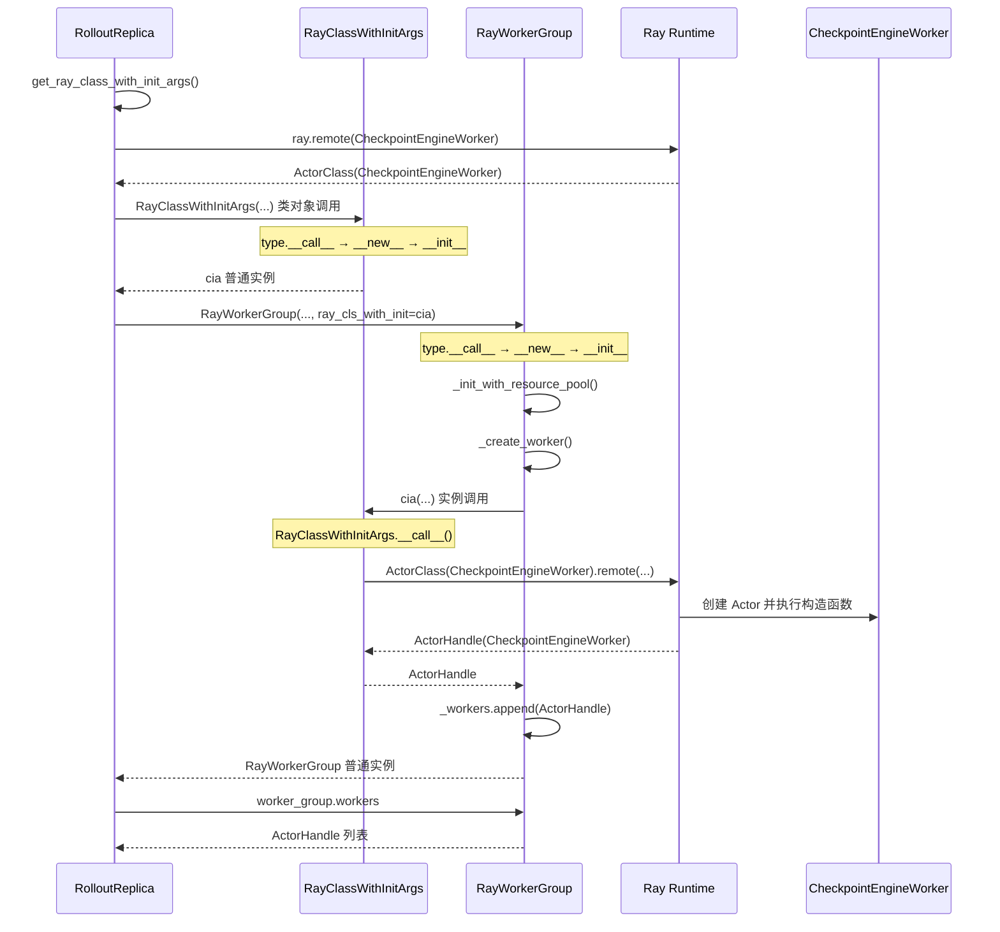

# Python 类调用、实例调用与 RayClassWithInitArgs 执行机制

> 状态：待评审。
>
> 代码基线：`/Users/nyp/Documents/verl`，`v0.9.0-1-g88512193`，commit `88512193`。
>
> 分析范围：解释 `verl/workers/rollout/replica.py:234` 为什么执行
> `RayClassWithInitArgs.__init__()` 而不是 `RayClassWithInitArgs.__call__()`，以及
> `verl/single_controller/ray/base.py:675` 如何调用实例的 `__call__()` 并最终创建
> `CheckpointEngineWorker` Ray Actor。

## 1. 结论

下面两段代码虽然都有括号，但调用对象不同，因此执行的特殊方法不同：

```python
# 调用类对象：创建 RayClassWithInitArgs 实例
cia = RayClassWithInitArgs(...)

# 调用 cia 实例：执行 RayClassWithInitArgs.__call__()
actor_handle = cia(...)
```

对应到 verl：

```text
replica.py:234
    RayClassWithInitArgs(...)
    → 调用类对象
    → type.__call__()
    → __new__() + __init__()
    → 返回 RayClassWithInitArgs 实例
    → 不创建 Ray Actor

base.py:675
    ray_cls_with_init(...)
    → ray_cls_with_init 是 RayClassWithInitArgs 实例
    → 调用 RayClassWithInitArgs.__call__()
    → base.py:415 执行 ActorClass.options(...).remote(...)
    → 创建 CheckpointEngineWorker Ray Actor
    → 返回 ActorHandle
```

因此：

- `replica.py:234` 没有调用 `RayClassWithInitArgs.__call__()`；
- `base.py:675` 才调用 `RayClassWithInitArgs.__call__()`；
- `base.py:415` 中的 `.remote()` 确实创建 Ray Actor；
- ActorHandle 是 `RayWorkerGroup.__init__()` 内部产生的中间结果；
- `replica.py:217` 整个 `RayWorkerGroup(...)` 表达式最终返回的仍是 controller 侧
  `RayWorkerGroup` 普通对象。

## 2. Python 的统一调用规则

对于任意表达式：

```python
target(*args, **kwargs)
```

Python 的特殊方法查找可以近似理解为：

```python
type(target).__call__(target, *args, **kwargs)
```

关键问题不是“有没有括号”，而是括号前面的 `target` 到底是什么对象。

| 调用形式 | 括号前对象 | `type(target)` | 实际语义 |
|---|---|---|---|
| `SomeClass(...)` | 类对象 | 通常是元类 `type` | 调用 `type.__call__()`，创建 `SomeClass` 实例 |
| `some_instance(...)` | `SomeClass` 实例 | `SomeClass` | 调用 `SomeClass.__call__(some_instance, ...)` |

### 2.1 类对象调用

执行：

```python
obj = SomeClass(...)
```

如果 `SomeClass` 使用默认元类 `type`，可近似展开为：

```python
obj = type.__call__(SomeClass, ...)
```

`type.__call__()` 内部大致执行：

```python
obj = SomeClass.__new__(SomeClass, ...)
SomeClass.__init__(obj, ...)
return obj
```

其中：

- `__new__()` 负责创建实例；
- `__init__()` 负责初始化已经创建的实例；
- `__init__()` 必须返回 `None`；
- 类调用表达式最终返回的是 `__new__()` 创建的实例。

类体中定义的实例方法 `SomeClass.__call__()` 不参与这次对象创建。

### 2.2 实例调用

已有实例：

```python
obj = SomeClass(...)
```

再次执行：

```python
result = obj(...)
```

这时括号前面的对象是 `SomeClass` 实例，可以近似展开为：

```python
result = SomeClass.__call__(obj, ...)
```

只有这一阶段才进入类体中定义的实例方法：

```python
class SomeClass:
    def __call__(self, ...):
        ...
```

## 3. 最小 Python 示例

```python
class Factory:
    def __new__(cls, value):
        print("Factory.__new__")
        return super().__new__(cls)

    def __init__(self, value):
        print("Factory.__init__")
        self.value = value

    def __call__(self, increment):
        print("Factory.__call__")
        return self.value + increment
```

第一次调用类对象：

```python
factory = Factory(10)
```

输出：

```text
Factory.__new__
Factory.__init__
```

此时没有执行 `Factory.__call__()`。

第二次调用实例：

```python
result = factory(20)
```

输出：

```text
Factory.__call__
```

返回：

```python
result == 30
```

两次调用可表示为：

```text
Factory(10)
  → type.__call__
  → Factory.__new__
  → Factory.__init__
  → 返回 factory 实例

factory(20)
  → Factory.__call__
  → 返回业务结果 30
```

## 4. `replica.py:234` 调用的是类对象

`RolloutReplica.get_ray_class_with_init_args()` 定义于：

```text
verl/workers/rollout/replica.py:228-239
```

代码为：

```python
def get_ray_class_with_init_args(self) -> RayClassWithInitArgs:
    from verl.checkpoint_engine.base import CheckpointEngineWorker

    rollout_worker_actor_cls = ray.remote(CheckpointEngineWorker)

    return RayClassWithInitArgs(
        cls=rollout_worker_actor_cls,
        rollout_config=self.config,
        model_config=self.model_config,
        replica_rank=self.replica_rank,
    )
```

### 4.1 `ray.remote(CheckpointEngineWorker)` 的结果

代码位置：`verl/workers/rollout/replica.py:230-232`。

执行：

```python
rollout_worker_actor_cls = ray.remote(CheckpointEngineWorker)
```

得到：

```text
ActorClass(CheckpointEngineWorker)
```

这里只生成 Ray Actor 类描述，没有调用该 ActorClass 的 `.remote()`，所以没有创建
`CheckpointEngineWorker` Actor。

### 4.2 `RayClassWithInitArgs(...)` 的结果

代码位置：`verl/workers/rollout/replica.py:234-239`。

括号前面的对象是类对象：

```python
RayClassWithInitArgs
```

因此近似执行：

```python
type.__call__(
    RayClassWithInitArgs,
    cls=rollout_worker_actor_cls,
    rollout_config=self.config,
    model_config=self.model_config,
    replica_rank=self.replica_rank,
)
```

随后执行 `RayClassWithInitArgs.__new__()` 和
`RayClassWithInitArgs.__init__()`。该类没有自定义 `__new__()`，使用继承的默认对象创建逻辑。

`RayClassWithInitArgs.__init__()` 定义于
`verl/single_controller/ray/base.py:347-351`：

```python
def __init__(self, cls, *args, **kwargs) -> None:
    super().__init__(cls, *args, **kwargs)
    self._options = {}
    self._additional_resource = {}
```

父类 `ClassWithInitArgs.__init__()` 定义于
`verl/single_controller/base/worker_group.py:83-95`：

```python
self.cls = cls
self.args = args
self.kwargs = kwargs
```

所以 `replica.py:234` 最终返回：

```python
cia = RayClassWithInitArgs实例
```

其状态为：

```python
cia.cls = ActorClass(CheckpointEngineWorker)
cia.args = ()
cia.kwargs = {
    "rollout_config": self.config,
    "model_config": self.model_config,
    "replica_rank": self.replica_rank,
}
```

这一阶段没有执行：

```python
RayClassWithInitArgs.__call__()
```

也没有创建 Ray Actor。

## 5. `replica.py:219` 只是取得上述实例

standalone 初始化代码位于：

```text
verl/workers/rollout/replica.py:189-226
```

其中：

```python
worker_group = RayWorkerGroup(
    resource_pool=self.resource_pool,
    ray_cls_with_init=self.get_ray_class_with_init_args(),
    bin_pack=False,
    name_prefix=name_prefix,
    use_gpu=True,
    device_name=get_device_name(),
)
```

代码位置：`verl/workers/rollout/replica.py:217-224`。

按照 Python 参数求值顺序，可以拆成：

```python
# 调用 RolloutReplica 的普通方法
cia = self.get_ray_class_with_init_args()

# 调用 RayWorkerGroup 类对象，创建 RayWorkerGroup 实例
worker_group = RayWorkerGroup(
    resource_pool=self.resource_pool,
    ray_cls_with_init=cia,
    ...,
)
```

所以 `replica.py:219` 的括号属于：

```python
self.get_ray_class_with_init_args()
```

这里调用的是绑定方法 `get_ray_class_with_init_args()`，其返回值是 `RayClassWithInitArgs` 实例。

它不是下面这种实例调用：

```python
cia(...)
```

因此 line 219 同样没有调用 `RayClassWithInitArgs.__call__()`。

## 6. `RayWorkerGroup(...)` 调用的是 `RayWorkerGroup.__init__()`

`replica.py:217` 中括号前面的对象是类：

```python
RayWorkerGroup
```

因此 Python 通过元类 `type.__call__()`：

```text
RayWorkerGroup(...)
  → type.__call__
  → RayWorkerGroup.__new__
  → RayWorkerGroup.__init__
  → 返回 RayWorkerGroup 实例
```

`RayWorkerGroup.__init__()` 定义于：

```text
verl/single_controller/ray/base.py:426-496
```

它将前一步返回的 `cia` 保存为：

```python
self.ray_cls_with_init = ray_cls_with_init
```

代码位置：`verl/single_controller/ray/base.py:455`。

此时：

```python
worker_group.ray_cls_with_init is cia
worker_group.ray_cls_with_init.cls is ActorClass(CheckpointEngineWorker)
```

因为传入了非空 `resource_pool`，构造函数继续进入：

```python
self._init_with_resource_pool(...)
```

代码位置：`verl/single_controller/ray/base.py:485-491`。

## 7. `base.py:675` 才调用实例的 `__call__()`

`RayWorkerGroup._init_with_resource_pool()` 遍历 Placement Group bundle，并调用
`_create_worker()`。核心代码位于：

```text
verl/single_controller/ray/base.py:538-581
```

`_create_worker()` 中执行：

```python
worker = ray_cls_with_init(
    placement_group=pg,
    placement_group_bundle_idx=local_rank,
    use_gpu=self.use_gpu,
    num_gpus=num_gpus,
    device_name=self.device_name,
)
```

代码位置：`verl/single_controller/ray/base.py:675-681`。

此时括号前面的 `ray_cls_with_init` 是前面创建的实例：

```python
ray_cls_with_init is cia
type(ray_cls_with_init) is RayClassWithInitArgs
```

所以：

```python
ray_cls_with_init(...)
```

才近似等价于：

```python
RayClassWithInitArgs.__call__(ray_cls_with_init, ...)
```

`RayClassWithInitArgs.__call__()` 定义于：

```text
verl/single_controller/ray/base.py:369-415
```

## 8. `base.py:415` 的 `.remote()` 创建 Ray Actor

`RayClassWithInitArgs.__call__()` 最终执行：

```python
return self.cls.options(**options).remote(
    *self.args,
    **self.kwargs,
)
```

代码位置：`verl/single_controller/ray/base.py:415`。

此时：

```python
self is cia
self.cls is ActorClass(CheckpointEngineWorker)
```

代入后实际执行的是：

```python
ActorClass(CheckpointEngineWorker).options(
    scheduling_strategy=PlacementGroupSchedulingStrategy(...),
    num_gpus=...,
    runtime_env=...,
    name=...,
).remote(
    rollout_config=self.config,
    model_config=self.model_config,
    replica_rank=self.replica_rank,
)
```

该 `.remote()` 会：

1. 请求 Ray 创建 `CheckpointEngineWorker` Actor；
2. 在指定 Placement Group bundle 上调度 Actor；
3. 向 Actor 构造函数传递已保存的 `kwargs`；
4. 返回 `ActorHandle(CheckpointEngineWorker)`。

所以：

```python
worker = ray_cls_with_init(...)
```

执行完成后：

```text
worker = ActorHandle(CheckpointEngineWorker)
```

## 9. ActorHandle 为什么不是 `RayWorkerGroup(...)` 的返回值

`RayClassWithInitArgs.__call__()` 返回的 ActorHandle 被
`RayWorkerGroup._create_worker()` 保存：

```python
self._workers.append(worker)
self._worker_names.append(name)
```

代码位置：`verl/single_controller/ray/base.py:682-683`。

`RayWorkerGroup.__init__()` 没有、也不能返回这个 ActorHandle；Python 要求 `__init__()` 返回
`None`。类调用：

```python
worker_group = RayWorkerGroup(...)
```

最终返回的是 `RayWorkerGroup.__new__()` 创建的 `RayWorkerGroup` 实例。

构造完成后的对象关系为：

```text
worker_group
  = RayWorkerGroup 普通对象

worker_group._workers
  = [
      ActorHandle(CheckpointEngineWorker rank 0),
      ActorHandle(CheckpointEngineWorker rank 1),
      ...
    ]
```

随后 `replica.py:225` 执行：

```python
self.workers = worker_group.workers
```

`RayWorkerGroup.workers` 属性定义于
`verl/single_controller/ray/base.py:904-906`，返回 `_workers` 列表。因此：

```text
RolloutReplica.workers
  = list[ActorHandle(CheckpointEngineWorker)]
```

## 10. 完整时序



## 11. 三类对象和返回值对照

| 表达式 | 括号前对象类型 | 调用的方法 | 返回值 | 创建 Ray Actor？ |
|---|---|---|---|---:|
| `ray.remote(CheckpointEngineWorker)` | 普通函数 `ray.remote` | `ray.remote()` | `ActorClass(CheckpointEngineWorker)` | 否 |
| `RayClassWithInitArgs(...)` | 类对象 | `type.__call__ → __new__ → __init__` | `RayClassWithInitArgs` 实例 | 否 |
| `cia(...)` | `RayClassWithInitArgs` 实例 | `RayClassWithInitArgs.__call__` | `ActorHandle(CheckpointEngineWorker)` | 是 |
| `RayWorkerGroup(...)` | 类对象 | `type.__call__ → __new__ → __init__` | `RayWorkerGroup` 实例 | 构造内部有创建 Actor 的副作用 |
| `worker_group.workers` | `RayWorkerGroup` 实例 | property getter | ActorHandle 列表 | 否 |

## 12. 自定义元类时的例外

如果一个类使用了自定义元类：

```python
class CustomMeta(type):
    def __call__(cls, *args, **kwargs):
        print("CustomMeta.__call__")
        return super().__call__(*args, **kwargs)

class Example(metaclass=CustomMeta):
    def __init__(self):
        print("Example.__init__")

    def __call__(self):
        print("Example instance __call__")
```

执行：

```python
example = Example()
```

首先调用的是：

```python
CustomMeta.__call__(Example)
```

元类通常再调用 `Example.__new__()` 和 `Example.__init__()`。

执行：

```python
example()
```

才调用：

```python
Example.__call__(example)
```

`RayClassWithInitArgs` 当前没有配置自定义元类，因此类对象调用采用默认
`type.__call__()` 语义。

## 13. 判断口诀

看到：

```python
X(...)
```

不要只看括号，应先判断 `X` 的运行时身份：

```text
X 是类对象
  → 元类 __call__
  → 通常执行 X.__new__ + X.__init__
  → 返回 X 的实例

X 是实例
  → type(X).__call__(X, ...)
  → 返回实例调用的业务结果
```

在当前 verl 代码中的准确代入为：

```text
RayClassWithInitArgs(...)
  → X 是类对象
  → 创建 cia 实例

ray_cls_with_init(...)
  → X 是 cia 实例
  → 调用 RayClassWithInitArgs.__call__
  → 创建 CheckpointEngineWorker Ray Actor
  → 返回 ActorHandle
```
