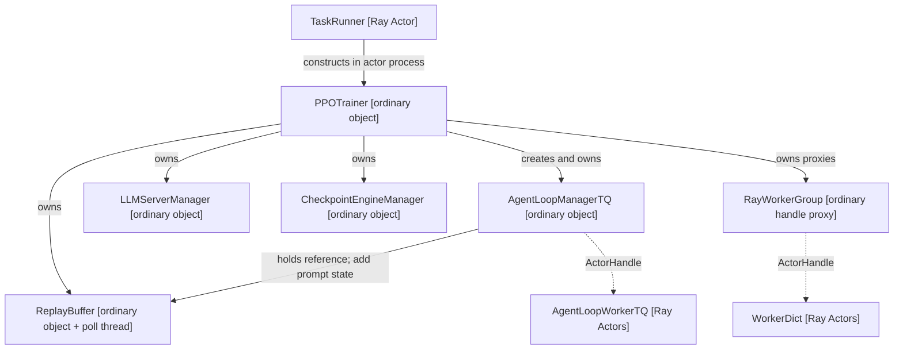
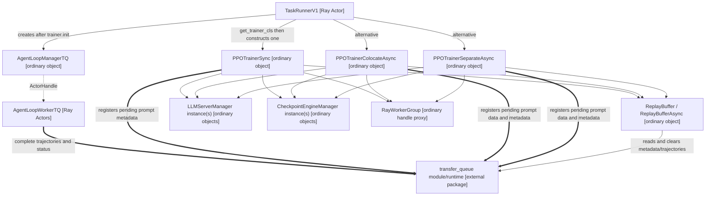
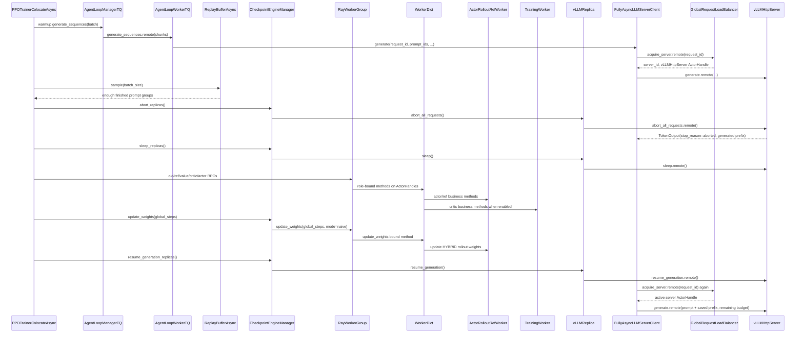
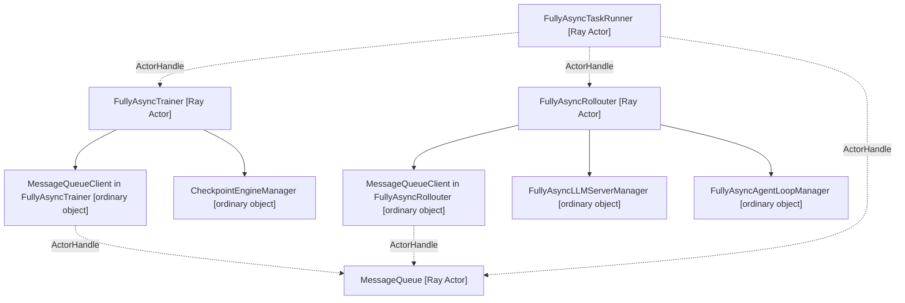
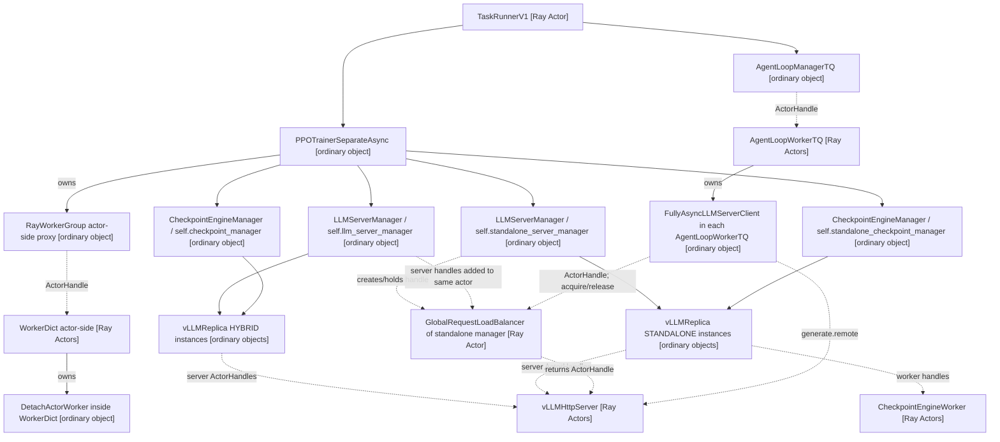

# verl v0.8.0 到 v0.9.0 的 HYBRID/STANDALONE 架构差异

> 状态：待评审。
>
> 文档性质：AS-IS 版本差异分析；第 10 章单独说明对多任务 RFC 的影响，不把影响分析写成已实现能力。
>
> 分析日期：2026-08-29。
>
> verl 源码目录：`/Users/nyp/Documents/verl`。
>
> 精确对比基线：v0.8.0 tag `7aed6b23`，v0.9.0 tag `483b8a00`。
>
> 当前 checkout：`v0.9.0-1-g88512193`，commit `88512193`。当前 checkout 比 v0.9.0 tag 多一个提交，
> 该提交只修改 `verl/checkpoint_engine/hccl_checkpoint_engine.py`；本文的版本差异结论以两个精确 tag 为准，
> 当前 checkout 的额外提交不改变本文分析的 Trainer、rollout、LB 或 CE manager 主控制链。
>
> 分析范围：只以 `RolloutMode.HYBRID` 和 `RolloutMode.STANDALONE` 为部署主轴。仅在澄清命名时提及
> `RolloutMode.COLOCATED`，不将其作为本项目第三种主部署模式。
>
> 控制链范围：以 v0.8.0 已标记为替代入口的 `main_ppo_sync.py` 及其 experimental 分离异步路径，对比
> v0.9.0 默认启用的 V1 Trainer。v0.9.0 的 `trainer.use_v1=false` 兼容路径单独说明，不把它混入 V1 差异。

## 1. 结论摘要

v0.9.0 的核心变化不是重新定义 HYBRID/STANDALONE，而是重构两种部署模式之上的 Trainer 控制层：

1. `RolloutMode.HYBRID`、`RolloutMode.STANDALONE` 的枚举、`RolloutReplica.init_hybrid()`、
   `RolloutReplica.init_standalone()` 和底层 Ray 资源组织没有本质变化。
2. v0.8.0 的 `main_ppo_sync.py` 单体实现被拆分为 V1 `PPOTrainer` 抽象基类和三个运行模式子类；
   `main_ppo.py` 根据 `trainer.v1.trainer_mode` 选择具体 Trainer。v0.9.0 仍保留
   `main_ppo_v0.TaskRunner + RayPPOTrainer` 兼容入口，但默认 `trainer.use_v1=true`。
3. v0.9.0 的 HYBRID 不再只有完整 step 屏障：新增 `PPOTrainerColocateAsync`，通过
   `FullyAsyncLLMServerClient + ReplayBufferAsync + abort/sleep/resume` 支持共卡 partial rollout。
4. v0.8.0 的分离异步主要存在于 `experimental/one_step_off_policy` 和
   `experimental/fully_async_policy`；v0.9.0 新增进入 V1 主链的 `PPOTrainerSeparateAsync`。
5. v0.9.0 的 `separate_async` 不是纯 STANDALONE-only：它先创建训练侧 HYBRID replicas，再创建独立
   STANDALONE replicas，并把两组 server 合入 standalone manager 的同一个 LB；但当前常规训练中的
   HYBRID 再激活策略仍是空实现。
6. Checkpoint Engine 的核心对象和 abort/resume 能力在 v0.8.0 已存在；v0.9.0 主要是把它正式接入 V1
   两种异步模式，增加 delta wire format、同步指标，并在 separate 模式中创建 hybrid/standalone 两套 manager。
7. v0.9.0 experimental fully-async 另新增 `DynamicResourceController` 和可插拔 policy。它是单任务内部的
   HYBRID/STANDALONE 动态切换，不是跨任务 GroupScheduler，不能与 V1 `PPOTrainerSeparateAsync` 混为一条主链。

对多任务项目最重要的结论是：v0.9.0 已经提供了一组可复用的任务内执行原语——动态 LB add/remove、
abort、partial retry、sleep/resume、CE replica add/remove——但没有提供跨任务 node/GPU 物理所有权、命令路由和
三视图一致性。GroupScheduler 仍然必要。

## 2. 必须分开的两个维度

### 2.1 部署/资源维度：`RolloutMode`

两个版本中的枚举定义一致：

| `RolloutMode` | 训练与 rollout 进程/GPU 关系 | 本项目是否作为主轴 | v0.8→v0.9 |
|---|---|---|---|
| `HYBRID` | rollout engine 与训练 engine 复用训练 Worker/GPU，按阶段切换 | 是 | 定义不变 |
| `STANDALONE` | rollout 使用独立 GPU、独立 ResourcePool/PG/WorkerGroup | 是 | 定义不变 |
| `COLOCATED` | 同 PG/GPU 上的独立 rollout 进程 | 否 | 定义仍存在，但不属于本文主轴 |

代码证据：

- v0.8.0：`verl/workers/rollout/replica.py:54-67`；
- v0.9.0：`verl/workers/rollout/replica.py:54-67`；
- HYBRID 初始化：两个版本均为 `replica.py:131-141`；
- STANDALONE 初始化：两个版本均为 `replica.py:189-226`。

### 2.2 Trainer 执行维度：v0.9.0 V1 `trainer_mode`

v0.9.0 新增另一条正交维度：

| `trainer.v1.trainer_mode` | 实际 rollout 资源组织 | 训练/推理能否同时使用不同 GPU | Partial rollout |
|---|---|---|---|
| `sync` | HYBRID | 否，阶段串行 | 否 |
| `colocate_async` | HYBRID | 否，同卡仍分时；样本和请求异步 | 是 |
| `separate_async` | STANDALONE 为主，并初始化训练侧 HYBRID | 是，standalone rollout 可与训练并行 | 是 |

配置证据：`v0.9.0:verl/trainer/config/ppo_trainer.yaml:221-257`。

必须避免以下错误等式：

```text
trainer_mode = colocate_async
    != RolloutMode.COLOCATED

PPOTrainerColocateAsync
    → PPOTrainer._setup()
    → LLMServerManager.create(worker_group=self.actor_rollout_wg, ...)
    → RolloutReplica.init_hybrid(worker_group)
    → RolloutMode.HYBRID
```

代码证据：`v0.9.0:trainer_base.py:350-362`、`replica.py:131-141`。

## 3. 底层组件和运行实体：哪些没有变

| 类/运行时对象 | 运行类型 | v0.8.0 与 v0.9.0 的共同事实 |
|---|---|---|
| `TaskRunner`/`TaskRunnerV1` | Ray Actor | 每个训练任务的 single controller |
| `PPOTrainer*` | controller Actor 进程内普通对象 | 组织资源、训练和 rollout 生命周期，本身不是 Actor |
| `LLMServerManager` | controller Actor 进程内普通对象 | 创建和持有 replicas、server handles、LB handle；不是 Actor |
| `RolloutReplica`/`vLLMReplica` | controller Actor 进程内普通对象 | 保存 worker/server handles 和 replica 资源信息；不是 Actor |
| `RayWorkerGroup` | 普通代理对象/ActorHandle 集合 | 自身不是一组 Ray Actor；`workers` 才是 ActorHandle |
| `WorkerDict` | Ray Actor | 远端进程内持有 `ActorRolloutRefWorker`、`TrainingWorker` 等普通业务对象 |
| `AgentLoopManagerTQ` | 普通对象 | 创建并持有 `AgentLoopWorkerTQ` handles |
| `AgentLoopWorkerTQ` | Ray Actor | 执行 prompt/agent loop，把完整 trajectory 写入 TransferQueue |
| `transfer_queue` module/runtime | 外部 package 的共享数据通道，不是 verl Ray Actor 类 | 保存 prompt metadata、trajectory 和状态，供 AgentLoop 与 ReplayBuffer 交换数据 |
| `GlobalRequestLoadBalancer` | 运行时 Ray Actor | 保存 server ActorHandle，并执行 sticky/least-inflight 路由 |
| `CheckpointEngineManager` | controller Actor 进程内普通对象 | 持有 actor WG proxy 和有效 replica 普通对象列表 |
| `CheckpointEngineWorker` | STANDALONE 下的 Ray Actor | 与 rollout backend worker 同 GPU，接收权重并调用 `ServerAdapter` |
| backend-specific `ServerAdapter` | `CheckpointEngineWorker` Actor 内普通对象 | 把 CE 收到的权重应用到 vLLM/SGLang/TRT-LLM backend |
| `vLLMHttpServer` | Ray Actor | 对外提供生成 RPC，创建/持有 vLLM backend runtime |

`GlobalRequestLoadBalancer` 有一项 Python 定义方式变化：

- v0.8.0：类定义直接使用 `@ray.remote`，`llm_server.py:44`；
- v0.9.0：类本身是普通 Python class，`llm_server.py:46`；
- v0.9.0 在 `_init_global_load_balancer()` 中执行
  `ray.remote(load_balancer_cls).remote(...)`，`llm_server.py:600-611`。

所以 v0.9.0 中“class 定义是普通类”和“运行时实例是 Ray Actor”同时成立。变化的目的是允许注入/继承 LB
class，并没有把 LB 变成 controller 本地普通对象。

LB 能力也有几项具体增强：v0.8.0 的构造函数拒绝空 server 集合，但已经具有 `add_servers()`、
`remove_servers()`；v0.9.0 允许空集合启动，并新增 `full_determinism` 路由、`clear_sticky_cache()`、
`get_total_inflight()`，同时允许向 `LLMServerManager` 注入 LB 子类。代码分别见
`v0.8.0:llm_server.py:43-143`、`v0.9.0:llm_server.py:46-194,464-629`。这些变化增强了任务内动态路由，
但没有增加跨任务物理资源所有权管理。

## 4. 总体控制架构差异

### 4.1 v0.8.0 推荐共卡主链



图中实体对应 `v0.8.0:verl/trainer/main_ppo_sync.py`：

- `ReplayBuffer`：`194-295`；
- `PPOTrainer`：`501-1753`；
- `TaskRunner`：`1756-1840`；
- `PPOTrainer.init_workers()` 创建 manager：`599-742`。

v0.8.0 的 `TaskRunner` 先构造 `role_worker_mapping` 和 `ResourcePoolManager`，再把两者传给
`PPOTrainer(config, role_worker_mapping, resource_pool_manager)`，见 `main_ppo_sync.py:1764-1836`。

### 4.2 v0.9.0 V1 主链



图中三种 Trainer 是互斥选择，不是同时创建。`TaskRunnerV1.run()` 的实际顺序是：

```text
get_trainer_cls(config.trainer.v1.trainer_mode)
→ trainer_cls(config)
→ trainer.init()
→ TaskRunnerV1.init_agent_loop_manager()
→ trainer.fit(agent_loop_manager)
```

代码证据：`v0.9.0:verl/trainer/main_ppo.py:103-164`。

与 v0.8.0 相比还有三个边界变化：

1. `PPOTrainer` 构造函数只接收 `config`；role mapping 和资源池构造下沉到
   `PPOTrainer._init_resource_pool_mgr()`，`trainer_base.py:733-787`。
2. AgentLoopManager 不再在 Trainer `_setup()` 中创建。`TaskRunnerV1` 在 `trainer.init()` 后调用
   `trainer.get_llm_client()` 创建 `AgentLoopManagerTQ`，再把同一个 manager 对象传给 `fit()`，
   `main_ppo.py:112-156`、`trainer_base.py:387-394`。
3. v0.8.0 的 `AgentLoopManagerTQ` 直接持有 `ReplayBuffer`，在派发前调用 `replay_buffer.add()`；v0.9.0
   删除这条对象引用，由 Trainer 先把 pending prompt 写入 `transfer_queue`，`AgentLoopWorkerTQ` 再更新 running/
   terminal 状态，`ReplayBuffer` 从同一通道重建状态快照。代码分别见
   `v0.8.0:main_ppo_sync.py:452-495,711-727`、`v0.9.0:trainer_base.py:1345-1366`、
   `v0.9.0:agent_loop_tq.py:107-148`、`v0.9.0:replay_buffer.py:188-223`。

### 4.3 总体差异表

| 维度 | v0.8.0 | v0.9.0 |
|---|---|---|
| 推荐入口 | `main_ppo_sync.py` | `main_ppo.py` + `trainer.use_v1=true` |
| 兼容入口 | deprecated `main_ppo.py` + `RayPPOTrainer` | `trainer.use_v1=false` → `main_ppo_v0.TaskRunner` + `RayPPOTrainer` |
| Trainer 组织 | 单体 `PPOTrainer` | 抽象基类 + registry + 三个模式子类 |
| 模式扩展 | 需要改/继承单体 Trainer 或使用 experimental 入口 | 通过 `register_trainer()` 和生命周期 hooks 扩展 |
| role/resource 构造者 | `TaskRunner` 构造并注入 Trainer | `PPOTrainer._init_resource_pool_mgr()` 内部构造 |
| AgentLoopManager owner | Trainer 初始化阶段创建 | TaskRunnerV1 创建，传给 Trainer.fit；fit 后两者均持有引用 |
| AgentLoopManager 与 ReplayBuffer | manager 直接持有 ReplayBuffer 并写入 prompt 状态 | 无直接引用；Trainer/AgentLoop/ReplayBuffer 经 `transfer_queue` 解耦 |
| ReplayBuffer | 单体文件中的完整 step 屏障 | 独立模块，sync/async 两种策略 |
| 分离异步 | experimental 多套入口 | 新增 V1 `separate_async`，experimental 仍保留 |
| 异步恢复 | fully-async 有在途样本恢复缺口 | V1 异步模式条件性保存 TQ，并重新提交 pending/running prompt |

## 5. HYBRID 共卡模式差异

### 5.1 初始化拓扑基本不变

两个版本的共卡初始化都沿以下链路：

```text
PPOTrainer
→ ResourcePoolManager.create_resource_pool()
→ create_colocated_worker_cls(class_dict)
→ RayWorkerGroup(...)
→ WorkerDict Ray Actors
→ actor_rollout_wg.init_model()
→ LLMServerManager.create(worker_group=actor_rollout_wg)
→ RolloutReplica.init_hybrid(actor_rollout_wg)
→ launch vLLMHttpServer/SGLangHttpServer/TRTLLMHttpServer
→ GlobalRequestLoadBalancer Ray Actor
→ CheckpointEngineManager
```

v0.9.0 的 base HYBRID manager 明确把 Checkpoint Engine backend 强制改为 `naive`，然后创建
`CheckpointEngineManager(actor_wg=self.actor_rollout_wg, replicas=...)`，见
`trainer_base.py:350-367`。v0.8.0 使用配置中的 backend，默认值同样是 `naive`。

### 5.2 v0.8.0：完整 step 屏障

```mermaid
sequenceDiagram
    participant PPOTrainer
    participant AgentLoopManagerTQ
    participant AgentLoopWorkerTQ
    participant transfer_queue as transfer_queue module/runtime
    participant ReplayBuffer
    participant CheckpointEngineManager
    participant RayWorkerGroup
    participant WorkerDict
    participant ActorRolloutRefWorker
    participant TrainingWorker

    PPOTrainer->>AgentLoopManagerTQ: generate_sequences(current step prompts)
    AgentLoopManagerTQ->>ReplayBuffer: add(partition_id, running prompt metadata)
    AgentLoopManagerTQ->>AgentLoopWorkerTQ: generate_sequences.remote(chunks)
    AgentLoopWorkerTQ->>transfer_queue: kv_put status and complete trajectories
    PPOTrainer->>ReplayBuffer: sample(global_steps=current)
    loop any request of this step is running
        ReplayBuffer->>transfer_queue: kv_list and poll metadata
        transfer_queue-->>ReplayBuffer: running/success/finished tags
    end
    ReplayBuffer-->>PPOTrainer: all successful trajectories of this step
    PPOTrainer->>CheckpointEngineManager: sleep_replicas()
    PPOTrainer->>RayWorkerGroup: actor/ref RPCs; critic RPCs when enabled
    RayWorkerGroup->>WorkerDict: role-bound methods on ActorHandles
    WorkerDict->>ActorRolloutRefWorker: actor/ref business methods
    WorkerDict->>TrainingWorker: critic business methods when enabled
    PPOTrainer->>CheckpointEngineManager: update_weights()
```

`ReplayBuffer.sample()` 只要发现同一 `global_steps` 下任一条 metadata 为 `running`，就继续等待；没有 running
后才返回所有 `success` keys，见 `v0.8.0:main_ppo_sync.py:261-295`。

因此 v0.8.0 共卡阶段的资源行为是：

- 快 replica 处理完分配给它的请求后逐步空闲；
- Trainer 仍等待最后一个请求结束；
- 只有整批完成后才能 sleep rollout 并训练；
- 不会 abort 长尾请求，不产生 partial trajectory continuation；
- 不存在跨 step 完成样本池和版本陈旧度选择。

### 5.3 v0.9.0 `sync`：流程语义基本保留

`PPOTrainerSync` 把旧流程拆成生命周期 hooks：

| hook | 主语与动作 | 代码位置 |
|---|---|---|
| `on_init_end()` | `PPOTrainerSync` 调用 `checkpoint_manager.update_weights(global_steps)` | `trainer_sync.py:31-33` |
| `on_sample_end()` | 完整样本取出后 sleep 所有 HYBRID replicas | `trainer_sync.py:40-42` |
| `on_step_end()` | actor 更新后同步下一版本权重 | `trainer_sync.py:35-38` |

普通 sync 配置仍只预提交本 step batch，因此 `ReplayBuffer.sample(batch_size=...)` 虽然接口改为按 batch size
选择 terminal prompt groups，正常语义仍等价于完整当前批屏障。v0.9.0 同时增加 DAPO refill、failure 处理等通用
能力，但没有改变“完整 trajectory 才进入 PPO、无 partial rollout”的核心事实。

### 5.4 v0.9.0 `colocate_async`：新增共卡 partial rollout



该时序以 vLLM backend 为例；其他 backend 会替换 `vLLMReplica` 和 `vLLMHttpServer`，partial client、LB 与
Checkpoint Engine manager 的主控制链保持同形，backend 内部实现不同。

对应实现：

- 使用 `FullyAsyncLLMServerClient`：`trainer_colocate_async.py:32-34`；
- warmup：`trainer_colocate_async.py:40-46`；
- 取够完整样本后 abort + sleep：`trainer_colocate_async.py:55-59`；
- 更新权重后 resume：`trainer_colocate_async.py:48-53`；
- client 经全局 LB 取得 server handle：`llm_server.py:221-289`；
- CE manager 经运行时 `vLLMReplica` 转发 abort/sleep/resume：`checkpoint_engine/base.py:447-465`、
  `vllm_async_server.py:1102-1227`；
- 客户端 partial merge/retry：`llm_server.py:292-461`。

partial 状态的真实保存位置如下：

| 状态 | 保存组件 | 是否已经作为 PPO 样本进入 ReplayBuffer |
|---|---|---|
| 原始 `prompt_ids` | `FullyAsyncLLMServerClient.generate()` 协程局部变量 | 否 |
| 已生成 `token_ids/log_probs` | 同一客户端协程的 `final_output` | 否 |
| 剩余 token budget | 客户端协程重写后的 `sampling_params` | 否 |
| `min_global_steps/max_global_steps` | 客户端协程累计，最终写入 trajectory tags | 结束前否，完整结束后是 |
| 服务端 KV cache | sleep 前释放；不跨 sleep 依赖 | 否 |
| 完整 trajectory | `AgentLoopWorkerTQ` 写入 TransferQueue | 是，可被 ReplayBuffer 选择 |

所以 v0.9.0 共卡 partial rollout 仍然只把完整 trajectory 交给 PPO；“partial”表示一次生成请求可被中断并
在下一权重版本上续推，不表示使用半条 response 更新模型。

### 5.5 “async”不表示共卡 GPU 同时训练和推理

`PPOTrainerColocateAsync` 中请求提交、AgentLoop 协程和 TQ 数据流可以跨 step 存活，但 HYBRID rollout 和
training engine 使用同一批 GPU。`on_sample_end()` 必须 abort/sleep rollout 后才能执行训练，故 GPU 数据面仍是：

```text
rollout phase
→ abort unfinished requests
→ sleep/free rollout memory
→ training phase
→ update weights
→ resume rollout phase
```

它解决的是长尾请求复用和样本流水线问题，不是把同一张 GPU 同时分给训练 kernel 与推理 kernel。

## 6. STANDALONE 分离模式差异

### 6.1 v0.8.0：存在底层 STANDALONE，但控制架构分散

v0.8.0 已经具备 `RolloutReplica.init_standalone()`、`CheckpointEngineWorker` 和非 naive CE，不能写成
“v0.9.0 才支持 STANDALONE”。版本差异在 Trainer/控制链：

| v0.8.0 路径 | controller 架构 | 采样/训练关系 |
|---|---|---|
| `experimental/one_step_off_policy` | `OneStepTaskRunner` + `OneStepOffRayTrainer` | 下一批 generation future 与当前批训练重叠 |
| `experimental/fully_async_policy` | `FullyAsyncTaskRunner` + 独立 Trainer/Rollouter actors + `MessageQueue` actor | rollout 持续生产单样本，trainer 按 required samples 消费 |
| `experimental/separation` | 公共 Worker/Trainer 基类 | 为上述模式提供独立 actor/rollout 资源组织 |

Fully async 的主要运行实体为：



代码证据：

- `FullyAsyncTaskRunner`：`v0.8.0:fully_async_main.py:35-110`；
- `FullyAsyncTrainer`：`fully_async_trainer.py:52-173`；
- `FullyAsyncRollouter`：`fully_async_rollouter.py:392-516`；
- `MessageQueue`：`message_queue.py:26-134`；
- 两个 actor 并发进入 `fit()`：`fully_async_main.py:176-209`。

v0.8.0 fully async 已经在 experimental 文件内实现 `FullyAsyncLLMServerClient` partial continuation，见
`fully_async_rollouter.py:51-150`。v0.9.0 是把这一能力推广到通用 `verl/workers/rollout/llm_server.py` 并接入 V1，
而不是从零新增 partial client 思想。

### 6.2 v0.9.0：新增 V1 `PPOTrainerSeparateAsync`

V1 separate 主链不再创建 `FullyAsyncTrainer`、`FullyAsyncRollouter` 和 `MessageQueue` 三个控制 Actor。
它在一个 `TaskRunnerV1` Actor 进程内持有普通 `PPOTrainerSeparateAsync` 和 AgentLoopManager，通过独立 rollout
Ray Actors 与 TransferQueue 实现数据面并行。



该图以本项目重点使用的 vLLM backend 为例，因此把 `RolloutReplica` 的运行时子类和 server 分别标为
`vLLMReplica`、`vLLMHttpServer`；使用 SGLang/TRT-LLM 时替换为对应 backend 类，manager/LB/CE 的主控制关系
保持同形，backend 内部实现不同。

这里两个 `LLMServerManager` 和两个 `CheckpointEngineManager` 是同一个 Python 类的不同普通对象实例，
不是新增类，也不是 Ray Actor。

### 6.3 V1 separate 初始化流程

`PPOTrainerSeparateAsync._setup()` 的实际步骤是：

1. 调用 `super()._setup()`。
2. 基类在 training `actor_rollout_wg` 上创建 HYBRID `self.llm_server_manager`。
3. 基类创建 backend 被强制为 `naive` 的 `self.checkpoint_manager`。
4. separate 子类创建不传 `worker_group` 的 `self.standalone_server_manager`，因此进入
   `RolloutReplica.init_standalone()`。
5. `start_rank` 使用 HYBRID replica 数，避免同一任务中两组 server 的 named actor rank 冲突。
6. 子类创建 `self.standalone_checkpoint_manager(actor_wg, standalone replicas)`；配置要求 backend 不能为 naive。
7. 子类把 HYBRID manager 的 server addresses/handles 加入 standalone manager 创建的全局 LB。
8. `on_init_end()` 分别同步 standalone 与 hybrid 两组权重。

代码证据：`v0.9.0:trainer_separate_async.py:46-101,129-136,194-203`。

### 6.4 V1 separate 一轮参数版本周期

```mermaid
sequenceDiagram
    participant PPOTrainerSeparateAsync
    participant AgentLoopManagerTQ
    participant AgentLoopWorkerTQ
    participant FullyAsyncLLMServerClient
    participant ReplayBufferAsync
    participant GlobalRequestLoadBalancer
    participant vLLMHttpServer
    participant ActorRayWorkerGroup as RayWorkerGroup (actor-side proxy)
    participant RolloutRayWorkerGroup as RayWorkerGroup (temporary rollout proxy)
    participant HybridCheckpointManager as CheckpointEngineManager (hybrid instance)
    participant StandaloneCheckpointManager as CheckpointEngineManager (standalone instance)
    participant CheckpointEngineWorker
    participant vLLMServerAdapter as ServerAdapter (vLLM backend)

    PPOTrainerSeparateAsync->>AgentLoopManagerTQ: warmup generate_sequences(batches)
    AgentLoopManagerTQ->>AgentLoopWorkerTQ: generate_sequences.remote(chunks)
    AgentLoopWorkerTQ->>FullyAsyncLLMServerClient: generate(request_id, ...)
    FullyAsyncLLMServerClient->>GlobalRequestLoadBalancer: acquire_server.remote(request_id)
    GlobalRequestLoadBalancer-->>FullyAsyncLLMServerClient: server_id, vLLMHttpServer ActorHandle
    FullyAsyncLLMServerClient->>vLLMHttpServer: generate.remote(...)
    Note over GlobalRequestLoadBalancer: initial registry contains standalone and hybrid server handles
    loop parameter_sync_step local PPO updates
        PPOTrainerSeparateAsync->>ReplayBufferAsync: sample(sample_batch_size)
        ReplayBufferAsync-->>PPOTrainerSeparateAsync: complete prompt groups
        alt current_mode is ROLLOUT
            PPOTrainerSeparateAsync->>GlobalRequestLoadBalancer: remove_servers.remote(hybrid addresses)
            PPOTrainerSeparateAsync->>HybridCheckpointManager: abort_replicas()
            PPOTrainerSeparateAsync->>HybridCheckpointManager: sleep_replicas()
            Note over FullyAsyncLLMServerClient,GlobalRequestLoadBalancer: aborted hybrid attempts call acquire_server again; removed hybrid IDs cannot be selected
        end
        PPOTrainerSeparateAsync->>ActorRayWorkerGroup: old/ref/value/critic/actor RPCs
    end
    PPOTrainerSeparateAsync->>StandaloneCheckpointManager: update_weights(global_steps)
    StandaloneCheckpointManager->>ActorRayWorkerGroup: actor-side update_weights (send)
    StandaloneCheckpointManager->>RolloutRayWorkerGroup: rollout-side update_weights (receive)
    RolloutRayWorkerGroup->>CheckpointEngineWorker: update_weights via existing ActorHandles
    CheckpointEngineWorker->>vLLMServerAdapter: update_weights(...)
    Note over StandaloneCheckpointManager: also aborts requests, releases/restores KV cache, and resumes generation through vLLMReplica
```

`train_batch_size` 必须等于 `parameter_sync_step * ppo_mini_batch_size`，见
`trainer_separate_async.py:46-54`。基类 `step()` 把一个全局 step 切为 `parameter_sync_step` 个局部更新，
见 `trainer_base.py:509-534`。

`DetachActorWorker` 提供 `save_model_to_cpu()/restore_model_from_cpu()/clear_cpu_model()`，使一个同步周期内的多个
mini-batch 可以用同一个稳定 `π_old` 重算 old log probability，调用位于
`trainer_separate_async.py:103-127`。

图中的 actor-side `RayWorkerGroup` 是 Trainer 长期持有的普通代理；rollout-side `RayWorkerGroup` 是
`CheckpointEngineManager.update_weights()` 基于已有 `CheckpointEngineWorker` ActorHandles 临时构造的普通代理，
不会重复创建 Ray Actor，见 `checkpoint_engine/base.py:501-518`。vLLM 的 `ServerAdapter` 是每个
`CheckpointEngineWorker` Actor 内的普通对象，实际应用收到的权重，见 `checkpoint_engine/base.py:283-341`、
`workers/rollout/vllm_rollout/vllm_rollout.py:49-247`。

### 6.5 AS-IS GAP：V1 的常规 HYBRID 再激活策略尚未实现

`PPOTrainerSeparateAsync` 注释称 trainer idle 时可以切到 rollout，但精确 tag 的实际实现为：

```python
def should_switch_to_rollout(self):
    # TODO: Implement switch strategy by checking replay buffer and switch overhead
    return False
```

代码位置：`v0.9.0:trainer_separate_async.py:205-207`。

因此不能把类注释直接画成已经闭环的每步动态切换：

- 初始化和 warmup 阶段，HYBRID server 被加入 standalone LB；
- 第一次 sample 完成后，`on_sample_end()` 调用 `switch_to_trainer()`，移除、abort、sleep HYBRID replicas；
- 后续普通 `on_sample_begin()` 不会重新激活它们；
- validation 的 `on_validate_begin()` 可以显式切回 rollout；
- 常规训练中根据 replay buffer 缺口自动切回 rollout 仍是 GAP。

### 6.6 v0.8 与 v0.9 分离异步陈旧度控制差异

| 维度 | v0.8.0 experimental fully async | v0.9.0 V1 async |
|---|---|---|
| 样本通道 | `MessageQueue` Ray Actor | TransferQueue + `ReplayBufferAsync` |
| prompt 生产/refill | `FullyAsyncRollouter` 连续迭代 dataloader，并经本地 `pending_queue` 流式提交 | Trainer 获取 prompt；异步模式把 `gen_batch_size` 约束为 1，并由 ReplayBuffer callback 精确补充 |
| 主要反压量 | queue size、active task 数、`staleness_samples` | prompt 的提交模型版本与当前模型版本差 |
| 配置 | `staleness_threshold` 浮点比例 | `max_off_policy_threshold` 正整数版本跨度 |
| 上限公式 | `required_samples * (threshold + 1) * trigger_parameter_sync_step` | `global_steps - prompt_global_steps + 1` 与 threshold 比较 |
| 过期策略 | 达到样本/队列上限后 pause；队列满时丢最旧元素 | `drop` terminal stale groups 并 refill，或 `wait` 阻止继续 sample |
| partial 跨版本 | 记录 min/max 版本，主要用于指标 | 记录 min/max 版本并输出 trajectory span/staleness 指标 |

v0.9.0 `ReplayBufferAsync` 的过滤条件以 prompt group 的提交版本为准：

```text
span = current_global_steps - prompt_global_steps + 1
```

- `drop` 在 terminal group 的 `span > max_off_policy_threshold` 时淘汰并补 prompt；
- `wait` 在 pending/running group 的 `span >= max_off_policy_threshold` 时暂停选训练 batch，等待其完成。

代码证据：`v0.9.0:replay_buffer.py:497-579`。

prompt 生产差异的代码证据为 `v0.8.0:fully_async_rollouter.py:766-846` 与
`v0.9.0:trainer_base.py:672-688,1320-1373`。这说明 V1 separate 不只是把 `MessageQueue` 替换成
TransferQueue；dataloader owner、refill 发起者和反压闭环也一起移到了 Trainer/ReplayBuffer 一侧。

需要注意：`min_global_steps/max_global_steps` 描述 trajectory token 实际跨越的 rollout 权重版本；当前内置 stale
淘汰主要使用 prompt 提交版本，两者不是同一个量。

### 6.7 异步 checkpoint 恢复

v0.8.0 fully async 的 `FullyAsyncRollouter.save_checkpoint()` 明确说明 pending/cancel/result queue 和 MessageQueue
中的在途样本可能丢失，见 `v0.8.0:fully_async_rollouter.py:612-617`。

v0.9.0 V1 在 TransferQueue 版本支持 checkpoint 时：

1. async mode 保存 TQ state，包含 finished trajectory 和 pending/running prompt 数据；
2. load 时恢复 TQ；
3. `fit()` 开始后重新提交 pending/running prompt；
4. 重新提交前清理这些 prompt 旧的中间 trajectory keys；
5. 以当前 `global_steps` 标记新的 dispatch attempt。

代码证据：`v0.9.0:trainer_base.py:839-883,938-946`。这是条件能力：如果 TransferQueue 版本不提供
`save_checkpoint/load_checkpoint`，V1 会跳过该路径。

## 7. 组件增删、迁移与复用清单

| 组件 | v0.8.0 | v0.9.0 | 判断 |
|---|---|---|---|
| `PPOTrainer` | `main_ppo_sync.py` 单体具体类 | `trainer_base.py` 抽象基类 | 重构，不是简单改名 |
| `PPOTrainerSync` | 不存在 | V1 sync 子类 | 新增 |
| `PPOTrainerColocateAsync` | 不存在 | V1 HYBRID partial 子类 | 新增 |
| `PPOTrainerSeparateAsync` | 不存在 | V1 separate 子类 | 新增 |
| `ReplayBuffer` | 单体文件、完整 step 屏障 | 独立模块、扩展 terminal/refill 策略 | 重构增强 |
| `ReplayBufferAsync` | 不存在于 sync 主链 | V1 async sampler | 新增 |
| `AgentLoopManagerTQ/WorkerTQ` | 单体文件中 | 独立 `agent_loop_tq.py` | 迁移增强 |
| `FullyAsyncLLMServerClient` | experimental fully async 内已有 | 通用 `llm_server.py` | 提升到公共组件并增强 |
| `DetachActorWorker` | experimental separation 已有 | V1 separate 正式复用 | 不是新类，主链接入是新增 |
| `CheckpointEngineManager` | 已有 | 仍复用，参数名/指标/wire format 增强 | 非新组件 |
| `DynamicResourceController` | 不存在 | experimental fully async 新增 | 新增，但非 V1 主链 |
| `GlobalRequestLoadBalancer` | 直接 `@ray.remote` | 可注入普通 class，创建时 remote | 运行类型不变，可扩展性增强 |
| `LLMServerManager.start_rank` | 通用 constructor 无该字段 | 支持 hybrid/standalone 两组 rank 错开 | 新增通用能力 |
| `delta_sharded` CE | 不存在 | 新增 delta backend/wire format | 后端扩展 |
| `vLLMPDReplica` | 不存在 | 新增 vLLM prefill/decode disaggregation | backend 内部部署扩展 |

`vLLMPDReplica` 和 delta CE 只有在对应配置启用时才改变推理 backend 或权重数据面，不改变本文的
HYBRID/STANDALONE 主部署分类。

表中的 V1 `PPOTrainer` 变化不表示 v0.9.0 删除了全部旧 Trainer：`main_ppo.py:184-193` 在
`trainer.use_v1=false` 时仍选择 `main_ppo_v0.TaskRunner`，后者构造 `RayPPOTrainer`，见
`main_ppo_v0.py:137-234`。该兼容链不是本文后续多任务扩展的目标主链。

## 8. Checkpoint Engine 的版本差异

### 8.1 核心控制面没有重写

两个版本的非 naive `CheckpointEngineManager.update_weights()` 都执行：

```text
abort all in-flight requests
→ collect replica.workers ActorHandles
→ construct temporary RayWorkerGroup over existing handles
→ release rollout KV cache
→ prepare/build/init communication topology
→ actor worker group sends weights
→ CheckpointEngineWorker receives weights
→ ServerAdapter updates inference backend
→ finalize communication topology
→ restore KV cache
→ resume unfinished requests
```

v0.8.0 代码：`verl/checkpoint_engine/base.py:470-514`；
v0.9.0 代码：`verl/checkpoint_engine/base.py:486-538`。

临时执行：

```python
RayWorkerGroup(worker_handles=workers, ...)
```

只创建 controller-side proxy，复用已有 `CheckpointEngineWorker` ActorHandles，不会每次同步都 remote 新的
CheckpointEngineWorker actors。

### 8.2 v0.9.0 的具体增强

- 构造参数/字段由泛化的 `trainer` 改名为 `actor_wg`；
- `CheckpointEngineWorker.update_weights()` 向 `ServerAdapter` 透传 `wire_format`；
- `CheckpointEngineManager.update_weights()` 汇总 backend 返回的同步指标；
- 新增 `delta_sharded` 及相关 sparse/delta 传输实现；
- V1 `PPOTrainerSeparateAsync` 显式持有 hybrid/standalone 两套 manager；
- V1 `PPOTrainerColocateAsync` 在 naive 同卡同步前后，通过 Trainer hook 补齐 abort/sleep/resume 控制。

`CheckpointEngineManager.add_replicas()` 和 `remove_replicas()` 在 v0.8.0 已存在，v0.9.0 仍保留，见
`base.py:430-445`。因此“让 CE 感知有效 replica 集合”的基本接口不是版本升级后才出现的；v0.9.0 的主要价值是
异步 Trainer 已经围绕这组能力形成更清楚的生命周期。

## 9. v0.9.0 experimental 动态资源控制：与 V1 分开看

v0.9.0 在 `experimental/fully_async_policy/dynamic_schedule` 新增：

- `DynamicResourceController`；
- `DynamicSchedulePolicyBase`；
- `DefaultDynamicSchedulePolicy`；
- `StaticFullyAsyncPolicy`；
- `FixedRatioDynamicSchedulePolicy`。

其状态机是单任务内部：

```text
STANDALONE_ONLY <-> HYBRID_ACTIVE
```

`DynamicResourceController` 持有：

- `FullyAsyncRollouter` ActorHandle；
- hybrid `CheckpointEngineManager` 普通对象；
- task-local scheduling policy。

下线顺序：

```text
FullyAsyncRollouter.remove_replicas.remote(resource_ids)
→ hybrid_checkpoint_manager.abort_replicas()
→ hybrid_checkpoint_manager.sleep_replicas()
```

上线顺序：

```text
先同步 hybrid 权重
→ FullyAsyncRollouter.add_replicas.remote(resource_ids)
→ hybrid_checkpoint_manager.resume_generation_replicas()
```

代码证据：`v0.9.0:dynamic_resource_controller.py:51-160`。

这部分对本项目有三个可复用事实：

1. 从 LB 删除必须先于 abort，避免 partial retry 又路由到正在下线的 replica；
2. 新激活 replica 必须先完成目标版本权重同步，再接入 LB；
3. partial retry 可以在 server 被移除后重新 acquire 其他 active server。

但它不能替代 GroupScheduler：

- 只处理一个训练任务自己的 HYBRID/STANDALONE 资源；
- 不维护 donor/borrower、node ID/GPU ID、跨任务 lease；
- 不解决 borrower 在 donor Ray 原生资源视图外创建新 Worker/replica；
- 不处理多个 TaskRunner 的注册、心跳和命令路由；
- 与 V1 `PPOTrainerSeparateAsync` 是并行代码路径，V1 没有调用该 controller。

还要区分 `LLMServerManager` 的类注释和已实现接口：v0.9.0 注释包含 “Elastic launch/tear-down new
replicas”，但精确 tag 的通用 manager 只有初始化时 `_initialize_llm_servers()` 和 get/profile 等接口，
没有公开的运行时 `add_replica()/remove_replica()` 创建销毁闭环，见 `llm_server.py:464-647`。现有动态 controller
切换的是已经初始化好的 HYBRID replicas；不能据此推导它能够按 donor GPU 即时创建 borrower replica。

## 10. 对多任务资源共享 RFC 的影响

本章是基于 AS-IS 得出的扩展边界判断，不表示以下类已经存在于 verl。

### 10.1 Trainer 扩展方式需要调整

v0.8.0 方案中“一个 `MultiTaskPPOTrainer(PPOTrainer)` 覆盖全部流程”的假设在 v0.9.0 下不再充分：

- `PPOTrainer` 已是抽象基类；
- `on_step_end()` 和 `on_sample_end()` 必须由模式子类实现；
- sync、共卡 partial 和 separate 的 manager 数量、同步时机与回收语义不同。

可评审的扩展方向应改为：

```text
MultiTaskTrainerMixin (Proposed, shared control/reporting logic)
  + PPOTrainerSync
  + PPOTrainerColocateAsync
  + PPOTrainerSeparateAsync
```

或者分别注册三个 Proposed Trainer 类。当前项目先实现共卡时，必须明确选择：

- 以 `PPOTrainerSync` 为基类：不具备请求中断续推；
- 以 `PPOTrainerColocateAsync` 为基类：可以复用原生 partial rollout，适合实时强制回收讨论。

### 10.2 GroupScheduler 的创建位置仍可保持

`TaskRunnerV1` 仍是每个任务的 single controller Ray Actor，适合 create-or-get GroupScheduler 并持有其
ActorHandle。v0.9.0 的本地访问关系可以是：

```text
GroupScheduler Actor
→ Proposed MultiTaskTaskRunnerV1 Actor method
→ self.trainer narrow method
→ trainer-owned Proposed MultiTaskLLMServerManager ordinary object
```

这与“不增加额外通信 Actor”“GroupScheduler 不直接调用普通 manager”的既定约束一致。

### 10.3 可直接参考或复用的 v0.9.0 原语

| 多任务需求 | v0.9.0 可复用能力 | 仍缺少的跨任务能力 |
|---|---|---|
| 从 borrower LB 摘流 | `GlobalRequestLoadBalancer.remove_servers()` | command/session/lease 原子性 |
| 新 server 加入 borrower LB | `add_servers()` | 新实例创建失败回滚和三视图提交 |
| 强制中断并续推 | `abort_replicas()` + `FullyAsyncLLMServerClient` | 跨 replica/故障恢复语义证明 |
| donor 释放 HBM | `sleep_replicas()` | 跨任务 GPU 排他性和归还确认 |
| 参数同步覆盖动态实例 | `CheckpointEngineManager.add/remove_replicas()` | 动态 CE Worker 创建和并发一致性 |
| 重分布请求 | sticky cache 自动失效、`clear_sticky_cache()` | 全局调度和任务隔离 |
| 单任务 hybrid/standalone 切换 | experimental `DynamicResourceController` 顺序 | 多 TaskRunner、donor/borrower、node/GPU ledger |

### 10.4 分离模式必须区分两套有效 replica 集合

在 V1 separate 中：

- `self.checkpoint_manager.replicas` 是训练侧 HYBRID replicas；
- `self.standalone_checkpoint_manager.replicas` 是独立 STANDALONE replicas；
- AgentLoop 请求统一进入 standalone manager 的 LB，该 LB 可以同时包含两组 server handles。

因此多任务 borrower replica 不能只加入 LB。设计必须明确它属于哪一个 CE manager 的有效集合。对于独立
borrower rollout Worker，通常应进入 borrower 的 standalone CE 视图；如果创建的是训练 Worker 上的 HYBRID
replica，则属于 naive hybrid CE 视图。两种对象不能仅凭 server address 混用。

### 10.5 V1 的 task-local 动态切换不能被误写成全局共享

`PPOTrainerSeparateAsync.add_replicas_to_balancer()` 和 experimental `DynamicResourceController` 都只是把
本任务预先创建/注册的 HYBRID server 加入本任务 LB。它们没有执行以下多任务步骤：

```text
donor sleep native replica
→ GroupScheduler 提交 sleeping GPU slot
→ borrower 在 donor 物理卡创建自己的 CheckpointEngineWorker/backend/server
→ 加载 borrower 权重
→ 加入 borrower LB
```

所以 v0.9.0 降低了请求中断、续推和 LB 生命周期的新增成本，但没有消除动态 borrower Actor 创建这一主要 GAP。

## 11. 代码证据索引

### 11.1 v0.8.0 历史 tag

| 结论 | 代码位置 |
|---|---|
| `RolloutMode` 和两种 init | `verl/workers/rollout/replica.py:54-67,131-141,189-226` |
| sync `ReplayBuffer` 屏障 | `verl/trainer/main_ppo_sync.py:194-295` |
| sync `PPOTrainer.init_workers()` | `verl/trainer/main_ppo_sync.py:599-742` |
| sync `fit()/step()` | `verl/trainer/main_ppo_sync.py:1589-1753` |
| sync `TaskRunner` | `verl/trainer/main_ppo_sync.py:1756-1840` |
| fully async controller | `verl/experimental/fully_async_policy/fully_async_main.py:35-209` |
| fully async trainer | `verl/experimental/fully_async_policy/fully_async_trainer.py:52-173,275-332,376-524` |
| fully async rollouter/partial client | `verl/experimental/fully_async_policy/fully_async_rollouter.py:51-150,392-516,775-950,1011-1046` |
| `MessageQueue` | `verl/experimental/fully_async_policy/message_queue.py:26-234` |
| CE manager update | `verl/checkpoint_engine/base.py:345-515` |

### 11.2 v0.9.0 精确 tag/当前同主链文件

| 结论 | 代码位置 |
|---|---|
| V1 入口和 Trainer 选择 | `verl/trainer/main_ppo.py:103-164,184-193` |
| 非 V1 兼容入口 | `verl/trainer/main_ppo_v0.py:30-234` |
| Trainer mode 配置 | `verl/trainer/config/ppo_trainer.yaml:221-272` |
| V1 base setup/fit/step/hooks | `verl/trainer/ppo/v1/trainer_base.py:118-188,217-369,387-635` |
| V1 prompt 注册与派发 | `verl/trainer/ppo/v1/trainer_base.py:1320-1373` |
| V1 内部 role/resource 构造 | `verl/trainer/ppo/v1/trainer_base.py:733-787` |
| sync hooks | `verl/trainer/ppo/v1/trainer_sync.py:24-42` |
| colocate async partial hooks | `verl/trainer/ppo/v1/trainer_colocate_async.py:25-59` |
| separate 双 manager 和切换 | `verl/trainer/ppo/v1/trainer_separate_async.py:34-207` |
| async off-policy sampler | `verl/trainer/ppo/v1/replay_buffer.py:497-579` |
| TQ AgentLoop 状态和版本 tags | `verl/trainer/ppo/v1/agent_loop_tq.py:52-227` |
| partial client | `verl/workers/rollout/llm_server.py:292-461` |
| LB 创建和动态 server 接口 | `verl/workers/rollout/llm_server.py:46-194,464-629` |
| vLLM replica/server 创建和生命周期转发 | `verl/workers/rollout/vllm_rollout/vllm_async_server.py:1102-1227` |
| CE Worker/Manager | `verl/checkpoint_engine/base.py:283-355,361-538` |
| task-local 动态 controller | `verl/experimental/fully_async_policy/dynamic_schedule/dynamic_resource_controller.py:51-160` |

## 12. 评审要点

建议评审时重点确认：

1. 多任务第一阶段共卡实现，应基于 `PPOTrainerSync` 还是 `PPOTrainerColocateAsync`；
2. 是否接受“一个 MultiTask mixin + 多个模式子类”，替代单一 `MultiTaskPPOTrainer` 覆盖全部模式；
3. V1 separate 中训练侧 HYBRID replicas 是否进入多任务共享范围，还是第一阶段只管理 standalone replicas；
4. experimental `DynamicResourceController` 只作为执行顺序参考，还是计划抽取一部分 task-local executor；
5. 后续哪些 v0.8 主文档需要按本差异结论重写，哪些保留为历史背景。
