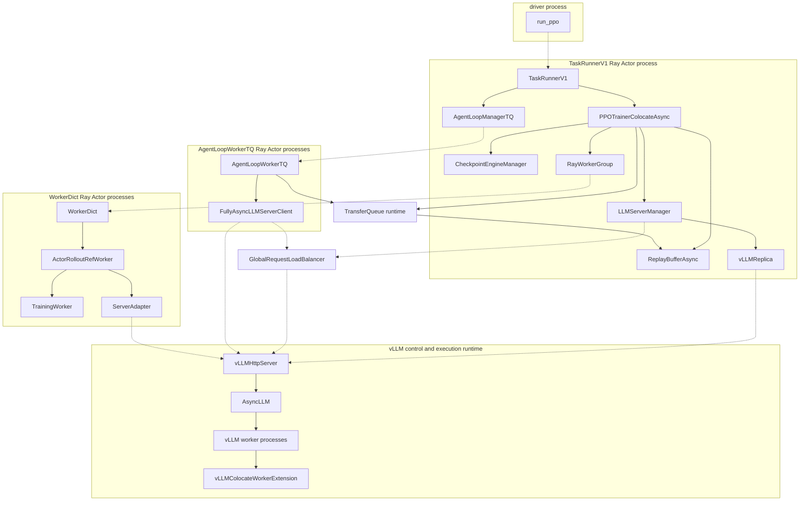
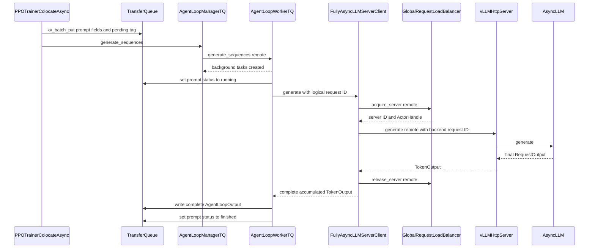
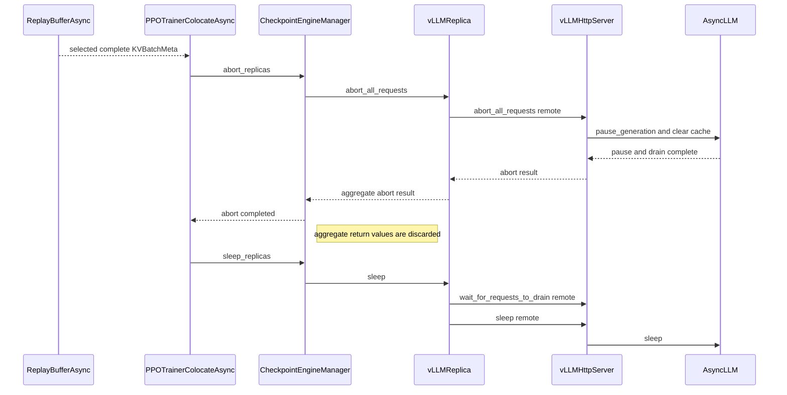
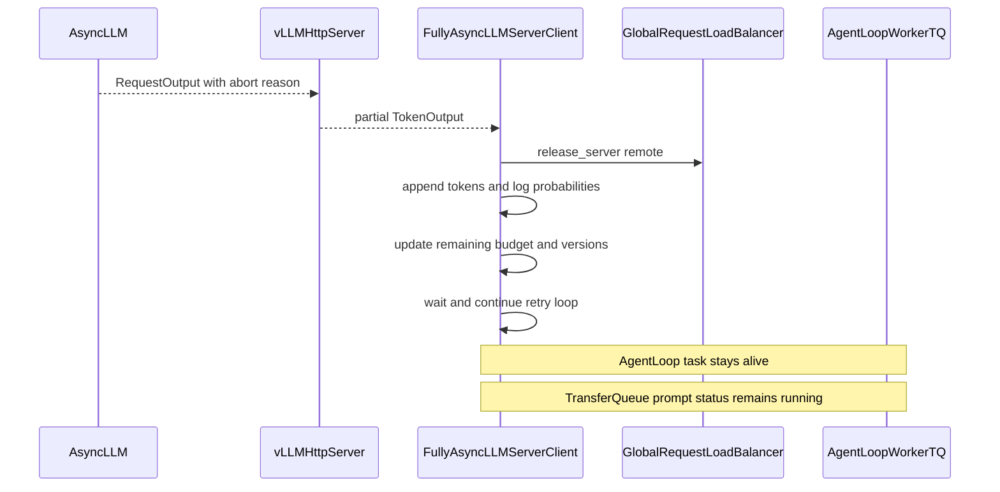
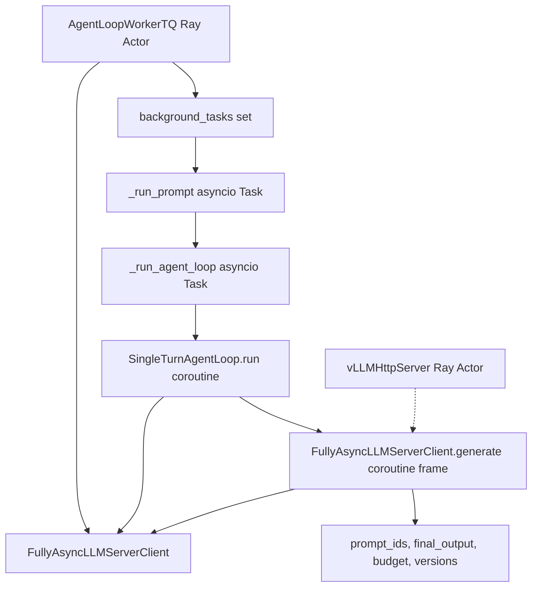
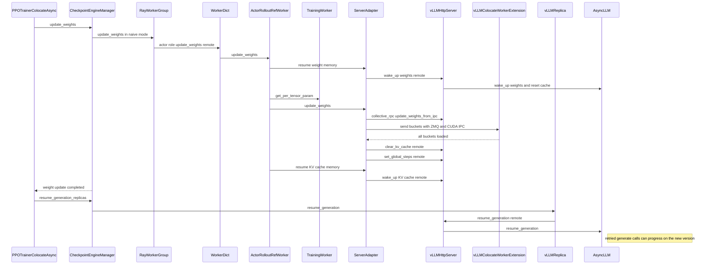
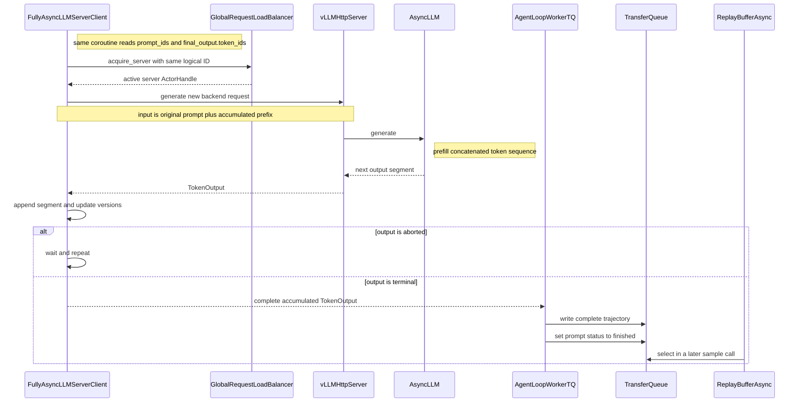

# verl v0.9 共卡 partial rollout：推理中断与重新续推流程

> 状态：待评审。
>
> 文档性质：以当前代码为准的 AS-IS 分析；第 13 章单独列出面向多任务资源共享的 GAP，不把 GAP 写成
> verl 已实现能力。
>
> 分析日期：2026-08-31。
>
> verl 源码目录：`/Users/nyp/Documents/verl`。
>
> 当前 checkout：`v0.9.0-1-g88512193`，commit
> `88512193628b95f24916c0898d51a8a877d09203`。该 checkout 比 tag `v0.9.0` 多一个只修改 HCCL
> Checkpoint Engine 的提交，不影响本文分析的 Trainer、vLLM、TransferQueue、LB 或 partial rollout 主链。
>
> 分析范围：V1 `trainer.v1.trainer_mode=colocate_async`、`RolloutMode.HYBRID`、vLLM backend。SGLang 和
> TRT-LLM 具有同形的 manager/client 控制层，但 backend 的 abort、sleep 和输出实现不同，本文不据 vLLM
> 实现替它们下结论。
>
> 外部依赖边界：verl 当前声明 `vllm>=0.18.0`，见 `setup.py:55`。本地分析环境未安装 vLLM，因此本文已逐行
> 校验到 verl 调用 `AsyncLLM` 的边界；`AsyncLLM.pause_generation()` 内部实现不冒充 verl 本仓代码事实。
>
> 图表验证：使用 `@mermaid-js/mermaid-cli 11.16.0` 对本文 7 个 Mermaid block 实际生成 SVG 和 PNG，7/7 均成功，
> 并完成 PNG 视觉检查；渲染产物仅用于校验，不纳入仓库。

正文中的源码路径均相对 `/Users/nyp/Documents/verl`。为避免重复，首次给出完整路径后会使用短名，例如
`trainer_base.py` 表示 `verl/trainer/ppo/v1/trainer_base.py`，`vllm_async_server.py` 表示
`verl/workers/rollout/vllm_rollout/vllm_async_server.py`；第 14 章汇总完整调用阶段和行号。

## 1. 结论摘要

共卡 partial rollout 的真实机制可以压缩为下面这条链：

```text
ReplayBufferAsync 已经凑够本次训练所需的完整 prompt groups
→ PPOTrainerColocateAsync 中断仍在 vLLM 中运行的请求
→ vLLM 返回中断前已经生成的 token 前缀，随后保持 generation paused
→ FullyAsyncLLMServerClient 在原协程内累计 token、logprob、剩余预算和版本范围
→ HYBRID rollout sleep，释放同卡训练所需的显存
→ Trainer 只使用已完整结束的 trajectories 完成 PPO 更新
→ ActorRolloutRefWorker 把新权重同步到共卡 vLLM runtime
→ vLLM generation 恢复
→ 原客户端协程以「原 prompt + 已生成前缀」重新发起一次 backend 请求
→ 新请求重新 prefill，继续生成剩余 token
→ 整条 trajectory 完成后才写入 TransferQueue，并在后续 step 被采样训练
```

需要特别明确八点：

1. `colocate_async` 是 Trainer 运行模式；其 rollout 初始化仍走 `RolloutMode.HYBRID`，不是
   `RolloutMode.COLOCATED`。
2. 中断条件不是“当前 step 所有请求完成”，而是 `ReplayBufferAsync` 已经找到足够多的**完整** prompt groups；
   此时其他 prompt 可以仍为 `pending/running`。
3. 当前 hook 调用 `CheckpointEngineManager.abort_replicas()`，作用域是 manager 中的**所有 replicas**，不是某一个
   指定空闲或待回收 replica。
4. 中断请求不会作为 partial trajectory 写回 TransferQueue；它对应的 prompt group 仍保持 `running`。
5. 原始 `prompt_ids`、已生成前缀、剩余预算和版本范围都保存在 `AgentLoopWorkerTQ` Ray Actor 进程内、该请求的
   `FullyAsyncLLMServerClient.generate()` **活协程帧**中；client 对象没有单独的 per-request 状态表。
6. 正常续推不从 TransferQueue“取回中断 prompt”。`resume_generation_replicas()` 只解除服务端 pause；同一客户端
   while-loop 直接读取自己的 `prompt_ids` 和 `final_output.token_ids`，拼成下一次 backend 输入。
7. 续推不是恢复旧 KV cache。abort/sleep/weight update 会清理或重建缓存，客户端把 token 前缀拼回输入，backend
   重新 prefill。
8. PPO 始终只消费完整 trajectory；partial 指“生成过程可跨中断、跨权重版本继续”，不指“用半条 response 训练”。

## 2. 两个维度必须分开

### 2.1 Trainer 模式

配置入口为：

```yaml
trainer:
  v1:
    trainer_mode: colocate_async
    colocate_async:
      num_warmup_batches: 1
```

默认项及三个 V1 Trainer mode 见 `verl/trainer/config/ppo_trainer.yaml:221-257`。

`PPOTrainerColocateAsync` 通过 `@register_trainer("colocate_async")` 注册，并覆盖四个关键 hook：

- `get_llm_client()` 返回 `FullyAsyncLLMServerClient`；
- `on_train_begin()` 预热提交 generation batch；
- `on_sample_end()` 执行 abort + sleep；
- `on_step_end()` 执行 weight update + resume generation。

代码：`verl/trainer/ppo/v1/trainer_colocate_async.py:25-59`。

### 2.2 Rollout 部署模式

`PPOTrainer._setup()` 把训练侧 `actor_rollout_wg` 传给 `LLMServerManager.create()`：

```text
PPOTrainer._setup()
→ LLMServerManager.create(worker_group=self.actor_rollout_wg, ...)
→ LLMServerManager._initialize_llm_servers()
→ vLLMReplica.init_hybrid(worker_group)
→ RolloutMode.HYBRID
```

代码：

- manager 创建：`verl/trainer/ppo/v1/trainer_base.py:350-362`；
- 有 `worker_group` 时选择 `init_hybrid()`：`verl/workers/rollout/llm_server.py:549-577`；
- `init_hybrid()` 设置 `RolloutMode.HYBRID` 并切分训练 Worker handles：
  `verl/workers/rollout/replica.py:131-141`。

因此本文讨论的准确名称是：

```text
Trainer mode: PPOTrainerColocateAsync / colocate_async
Rollout mode: RolloutMode.HYBRID
资源语义: 训练和 rollout 使用同一批 GPU，分阶段复用
```

## 3. 参与类、运行实体和所在进程

### 3.1 实体表

| 类或运行时实体 | 运行类型 | 所在位置/持有关系 | 与中断续推的职责 | 代码证据 |
|---|---|---|---|---|
| `TaskRunnerV1` | Ray Actor | single-controller Actor 进程 | 创建 Trainer、TransferQueue 和 AgentLoop manager，承载本任务控制面 | `main_ppo.py:103-164` |
| `PPOTrainerColocateAsync` | `TaskRunnerV1` 内普通对象 | `TaskRunnerV1.trainer` | 定义何时 abort、sleep、同步权重和 resume | `trainer_colocate_async.py:25-59` |
| `ReplayBufferAsync` | controller 普通对象 | `PPOTrainer.replay_buffer` | 只选择 terminal prompt groups；凑够训练 batch 后解除 `sample()` 阻塞 | `trainer_base.py:142-188`、`replay_buffer.py:497-579` |
| `AgentLoopManagerTQ` | controller 普通对象 | `TaskRunnerV1.agent_loop_manager` | 把 prompt chunks 远程分发给 AgentLoop actors | `agent_loop_tq.py:230-257` |
| `AgentLoopWorkerTQ` | Ray Actor | 分布在 Ray 节点上的 CPU Actor | 为每个 prompt/session 保持后台 AgentLoop task；未完成请求的客户端协程就在此 Actor 内存活 | `agent_loop_tq.py:52-148` |
| `FullyAsyncLLMServerClient` | `AgentLoopWorkerTQ` Actor 内普通对象 | 创建 AgentLoop actors时被序列化传入 | 每次 `generate()` 调用的活协程帧保存 partial 状态；client 对象循环重新 acquire/generate | `llm_server.py:292-461`、`agent_loop.py:1201-1221` |
| `GlobalRequestLoadBalancer` | 运行时 Ray Actor | `LLMServerManager` 保存 ActorHandle | 根据逻辑 `request_id` 做 sticky/least-inflight 路由，返回 server ActorHandle | 类定义 `llm_server.py:46-194`；Actor 创建 `600-611` |
| `LLMServerManager` | controller 普通对象 | `PPOTrainer.llm_server_manager` | 创建 replicas、server Actor 和 LB；不直接保存单请求 partial 状态 | `llm_server.py:464-637` |
| `vLLMReplica` | controller 普通对象 | `LLMServerManager.rollout_replicas` | 保存训练 Worker handles 和 vLLM server ActorHandles；批量转发 abort/sleep/resume | `vllm_async_server.py:1102-1227` |
| `vLLMHttpServer` | Ray Actor | 每个 replica 所跨节点各一个 Actor；LB 只登记 node-rank 0 handle | 接收 token-in/token-out Ray RPC，调用 `AsyncLLM`，把 abort 输出封装为 `TokenOutput` | 类 `vllm_async_server.py:77-180`；Actor 创建 `1116,1159-1178` |
| `AsyncLLM` | vLLM 外部依赖中的普通 runtime 对象 | node-rank 0 `vLLMHttpServer` Actor 内 | 真正执行 generate、pause、sleep、wake 和 resume generation | `vllm_async_server.py:434-486,615-628,852-897` |
| vLLM worker processes | 外部 runtime 子进程，不是 Ray Actor | 与训练 Worker 绑定同一组可见 GPU | 执行 vLLM model kernels；`distributed_executor_backend="mp"` | `vllm_async_server.py:288-312` |
| `CheckpointEngineManager` | controller 普通对象 | `PPOTrainer.checkpoint_manager` | 统一遍历 replicas 做 abort/sleep/resume；naive 模式经 actor WG 更新权重 | `checkpoint_engine/base.py:361-401,447-496` |
| `RayWorkerGroup` | controller 普通代理对象 | `PPOTrainer.actor_rollout_wg` | 保存训练 Worker ActorHandles，并将 `update_weights` 分发给远端 Actors | `single_controller/ray/base.py:418-498,782-894` |
| `WorkerDict` | 动态创建的 Ray Actor | 训练 Worker Actor 进程 | 对外暴露带 role 前缀的方法，内部委托给 `ActorRolloutRefWorker` | `single_controller/ray/base.py:988-1029` |
| `ActorRolloutRefWorker` | `WorkerDict` Actor 内普通业务对象 | `WorkerDict.worker_dict[...]` | 持有训练 `TrainingWorker` 和 rollout `ServerAdapter`，执行 HYBRID naive 权重同步 | `engine_workers.py:446-470,630-680,719-805` |
| `TrainingWorker` | `WorkerDict` Actor 内普通业务对象 | `ActorRolloutRefWorker.actor` | 持有训练 model engine，导出待同步权重 | `engine_workers.py:453-466,638-640,769-790` |
| `ServerAdapter` | `ActorRolloutRefWorker` 内普通对象 | `ActorRolloutRefWorker.rollout` | 经 server ActorHandle 和 ZMQ/CUDA IPC 唤醒 vLLM、传权重、清 cache、设置版本 | `vllm_rollout.py:49-63,152-243` |
| `vLLMColocateWorkerExtension` | vLLM worker 子进程中的扩展对象 | vLLM model worker | 接收 bucketed IPC 权重并加载到 vLLM model | `utils.py:127-139,232-330` |
| TransferQueue runtime | 外部共享数据通道 | `transfer_queue` package/runtime | 保存 prompt 状态、异步恢复所需 prompt 数据，以及**完整** trajectory | `replay_buffer.py:63-128`、`agent_loop_tq.py:150-227` |

### 3.2 运行实体与引用拓扑



图例：虚线表示 ActorHandle/远程调用关系；实线主要表示同进程持有关系，指向或来自 `TransferQueueRuntime` 的实线表示
TransferQueue 数据流。图中不再把调用文字写进边标签，以兼容较旧的 Mermaid 渲染器；具体方法名由下文时序图给出。

图中最容易误判的是：

- `LLMServerManager`、`vLLMReplica`、`CheckpointEngineManager` 都是 `TaskRunnerV1` Actor 进程内的普通对象；
- `GlobalRequestLoadBalancer` 和 `vLLMHttpServer` 才是独立 Ray Actor；
- 每个 `AgentLoopWorkerTQ` Actor 拥有一份反序列化后的 `FullyAsyncLLMServerClient` 普通对象；
- partial 状态不是保存在 controller 中，而是保存在具体 AgentLoop Actor 的具体请求协程中；
- token-in/token-out 主链调用的是 `vLLMHttpServer.generate.remote()`，并不经过 HTTP 网络接口，尽管该类也启动
  uvicorn server。调用点见 `llm_server.py:262-289`。

### 3.3 共卡的真实进程含义

`RolloutMode.HYBRID` 的枚举注释写着训练 engine 与 rollout engine “fused in same process”，见
`replica.py:54-58`。但对当前 vLLM 实现，不能把这句注释字面化成“所有训练和推理对象都在同一 Python 进程”：

1. `ActorRolloutRefWorker` 和 `ServerAdapter` 位于 `WorkerDict` 训练 Ray Actor 进程；
2. `vLLMReplica.launch_servers()` 读取这些训练 Actors 的 node ID 和 accelerator ID；
3. 它按相同 node/GPU 可见性创建独立 `vLLMHttpServer` Ray Actor；
4. `vLLMHttpServer` 又以 `distributed_executor_backend="mp"` 拉起 vLLM runtime 子进程。

证据：`vllm_async_server.py:1124-1178,288-312,434-486`。

创建 `vLLMHttpServer` Actor 的 `.options()` 只有 hard NodeAffinity、runtime env、name 和 max concurrency，没有请求新的
Ray GPU resource；具体 GPU 可见性来自训练 Worker 返回的 accelerator IDs，并作为
`cuda_visible_devices` 构造参数写入 server 进程环境，见 `vllm_async_server.py:1124-1177`。

所以 vLLM 路径的准确描述是：**HYBRID 复用训练 Worker 的 GPU 绑定和物理 GPU，同卡分时运行；控制对象和 backend
runtime 并非全部处于一个 Python 进程。**

## 4. 初始化：partial 能力如何接入共卡主链

### 4.1 Trainer 和 ReplayBuffer 选择

`run_ppo()` 创建 `TaskRunnerV1` Ray Actor并调用 `run.remote(config)`，见 `main_ppo.py:77-94`。

`TaskRunnerV1.run()` 的顺序为：

```text
get_trainer_cls(config.trainer.v1.trainer_mode)
→ PPOTrainerColocateAsync(config)
→ trainer.init()
→ init_agent_loop_manager()
→ trainer.fit(agent_loop_manager)
```

代码：`main_ppo.py:134-156`。

`PPOTrainer.__init__()` 根据 `trainer_mode != "sync"` 选择 `ReplayBufferAsync`，见
`trainer_base.py:125-188`。

### 4.2 HYBRID replicas 和 server Actors

`PPOTrainer._setup()` 先创建训练 `RayWorkerGroup` 和 `WorkerDict` Actors，再创建 `LLMServerManager`。manager 根据
rollout 并行度计算：

```text
rollout_world_size = TP × DP × PP
num_replicas = actor_rollout_wg.world_size / rollout_world_size
```

普通非 PD vLLM 路径见 `llm_server.py:528-567`。

每个 `vLLMReplica`：

- 持有 `rollout_world_size` 个训练 Worker ActorHandles；
- `gpus_per_replica_node = min(n_gpus_per_node, rollout_world_size)`；
- `nnodes = rollout_world_size / gpus_per_replica_node`；
- 每个 replica-node 创建一个 `vLLMHttpServer` Ray Actor；
- LB 只登记该 replica 的 `servers[0]`，即 node-rank 0 head ActorHandle。

代码：`replica.py:93-129,131-141`、`vllm_async_server.py:1118-1198`、
`llm_server.py:579-611`。

例如，训练 WorkerGroup 有 16 个 GPU ranks，rollout `TP=4, DP=1, PP=1`，每节点 8 卡：

```text
rollout_world_size = 4
num_replicas = 16 / 4 = 4
每个 replica 只跨 1 个节点
每个 replica 创建 1 个 vLLMHttpServer Actor
LB 中有 4 个 server IDs
```

如果单 replica 的 `rollout_world_size=16`、每节点 8 卡，则该 replica 跨 2 节点，创建 2 个
`vLLMHttpServer` Actors，但 LB 仍只登记 node-rank 0 的一个入口。

### 4.3 Checkpoint manager 初始状态

`PPOTrainer._setup()` 强制把共卡 Checkpoint Engine backend 设为 `naive`，并将同一批
`vLLMReplica` 普通对象交给 `CheckpointEngineManager`。随后先 sleep replicas，再加载 checkpoint，见
`trainer_base.py:355-367`。

`PPOTrainerColocateAsync.on_init_end()` 调用 `update_weights(global_steps)`，把已加载训练权重装入 rollout，见
`trainer_colocate_async.py:36-38`。这是训练开始前的初次权重就绪，不是一次 partial resume。

### 4.4 FullyAsync client 的真实落点

`TaskRunnerV1.init_agent_loop_manager()` 调用：

```text
self.trainer.get_llm_client()
→ LLMServerManager.get_client(client_cls=FullyAsyncLLMServerClient)
→ FullyAsyncLLMServerClient(config, GlobalRequestLoadBalancer ActorHandle)
```

代码：`main_ppo.py:112-132`、`trainer_colocate_async.py:32-34`、`llm_server.py:613-629`。

随后 `AgentLoopManager._init_agent_loop_workers()` 把这个 client 作为构造参数传给每个
`AgentLoopWorkerTQ.options(...).remote(...)`，见 `agent_loop.py:1201-1221`。跨 Ray 边界后，每个 AgentLoop Actor
得到自己的 client 对象副本。因此：

```text
一条 partial 请求的状态归属
= 某个 AgentLoopWorkerTQ Actor
  内某个 asyncio task
  内某次 FullyAsyncLLMServerClient.generate() 调用
```

## 5. 中断前：prompt 如何进入正在运行状态

### 5.1 提交 prompt

`PPOTrainerColocateAsync.on_train_begin()` 默认先提交一个 warmup batch，见
`trainer_colocate_async.py:40-46`。每个训练 step 开始时，`PPOTrainer.step()` 又调用一次
`_add_batch_to_generate()`，见 `trainer_base.py:509-526`。

`_submit_batch_to_rollout()` 做两件事：

1. 向 TransferQueue 写入 prompt key、`status=pending`、`global_steps` 和异步 checkpoint 恢复所需的 prompt
   fields；
2. 调用 `AgentLoopManagerTQ.generate_sequences(batch)`。

代码：`trainer_base.py:1345-1361`。

### 5.2 fire-and-forget AgentLoop

`AgentLoopManagerTQ.generate_sequences()` 对每个 `AgentLoopWorkerTQ` 调用
`generate_sequences.remote(chunk)`。这里的 `ray.get()` 只等远端方法完成“创建后台 tasks”，不等待实际生成结束，见
`agent_loop_tq.py:243-257`。

`AgentLoopWorkerTQ.generate_sequences()` 为每个 prompt 创建 `asyncio.create_task(self._run_prompt(...))` 并立即返回，
见 `agent_loop_tq.py:59-105`。

`_run_prompt()`：

1. 将 prompt group 状态改成 `running`；
2. 根据 `rollout.n` 为该 prompt 创建多个 session tasks；
3. 等所有 session settle；
4. 只有全部成功时才把 prompt group 改为 `finished`。

代码：`agent_loop_tq.py:107-148`。

因此 `rollout.n > 1` 时，某几个 response 完成不代表 prompt group 已可训练；必须等同一个 uid 的所有 session 都结束。

### 5.3 一次正常 generate 的调用链

以下以默认 single-turn AgentLoop 为例：



关键实现：

- single-turn AgentLoop 创建逻辑 request ID并调用 client：
  `experimental/agent_loop/single_turn_agent_loop.py:63-76`；
- LB acquire/release 和 server Ray RPC：`llm_server.py:221-289`；
- vLLM generate、等待 async generator 最终输出：`vllm_async_server.py:510-628`；
- 完整 `AgentLoopOutput` 写 TQ：`agent_loop_tq.py:150-227`。

这里存在两层 request ID：

| ID | 生成位置 | 用途 | retry 时是否相同 |
|---|---|---|---|
| logical `request_id` | AgentLoop，例如 single-turn 的 `uuid4().hex` | LB sticky session key | 同一次 `FullyAsyncLLMServerClient.generate()` 的各 attempt 相同 |
| backend vLLM `request_id` | `LLMServerClient._vllm_request_id()` | vLLM engine 内请求标识 | 默认每个 attempt 新 UUID；`full_determinism=true` 时复用 logical ID |

代码：`single_turn_agent_loop.py:66-68`、`llm_server.py:231-237,274-283`。

## 6. 何时触发中断：已经够训练，不等于所有请求都完成

### 6.1 ReplayBufferAsync 的判定

`ReplayBufferAsync.sample()` 每轮从 TransferQueue 同步四类 prompt keys：

```text
pending_keys
running_keys
finished_keys
failure_keys
```

状态解析见 `replay_buffer.py:188-223`。

定义：

```text
terminal = finished ∪ failure
sampleable = terminal - stale - dapo_filtered - evicted_failure
age(uid, g) = g - prompt_global_steps[uid] + 1
```

异步 `drop` 策略下：

```text
ready_drop = |sampleable| >= sample_batch_size
```

异步 `wait` 策略下：

```text
ready_wait =
    |sampleable| >= sample_batch_size
    AND 对所有 uid ∈ (pending ∪ running)，age(uid, current_global_steps) < threshold
```

对应代码：

- stale terminal 判定：`replay_buffer.py:503-512`；
- `wait` 对 in-flight prompt 的阻塞条件：`replay_buffer.py:524-539`；
- 选择足量 terminal groups：`replay_buffer.py:541-579`。

除 `wait` 策略达到陈旧度阈值的特殊阻塞外，`sample()` 并不要求：

```text
pending_keys == ∅
running_keys == ∅
```

这就是共卡 partial rollout 能切掉长尾的根本原因：先完成的完整样本凑够本次训练 batch 后，Trainer 不再等待其余
长请求。

### 6.2 hook 的精确触发位置

`PPOTrainer._step_once()` 的顺序为：

```text
batch = ReplayBufferAsync.sample(...)
→ batch 已经是完整、可物化的 trajectories
→ on_sample_end()
→ reward / old_log_prob / ref / values / advantage
→ update critic
→ update actor
```

代码：`trainer_base.py:536-586`。

`PPOTrainerColocateAsync.on_sample_end()` 随即执行：

```python
self.checkpoint_manager.abort_replicas()
self.checkpoint_manager.sleep_replicas()
```

代码：`trainer_colocate_async.py:55-59`。

`abort_replicas()` 和 `sleep_replicas()` 使用 `@auto_await`。它们在当前同步 Trainer hook 中被直接调用时，wrapper
会运行并等待 coroutine 完成，而不是创建一个无人等待的 coroutine；`auto_await` 语义见
`verl/utils/ray_utils.py:97-137`。

## 7. 中断控制链：从 Trainer 到 vLLM，再返回 partial token

### 7.1 控制链与 partial 数据链

中断控制 RPC 与原有 `generate.remote()` 的返回数据属于两条并发链。为了避免用复杂 `par/and` 语法造成 Mermaid
兼容问题，下面拆成两张时序图；两张图发生在同一次 `on_sample_end()` 中。

控制链：



原有 generate RPC 的 partial 数据返回链：



### 7.2 manager 和 replica 的作用域

`CheckpointEngineManager.abort_replicas()` 对 `self.replicas` 全量 `asyncio.gather()`：

```python
await asyncio.gather(*[r.abort_all_requests() for r in self.replicas])
```

代码：`checkpoint_engine/base.py:457-465`。

`vLLMReplica.abort_all_requests()` 又对该 replica 的 `self.servers` 全量调用
`server.abort_all_requests.remote()`，并聚合 aborted count 与 backend request IDs，见
`vllm_async_server.py:1206-1223`。

所以当前 AS-IS scope 是：

```text
一个 PPOTrainerColocateAsync 的 on_sample_end
→ 该 CheckpointEngineManager 当前持有的所有 replicas
→ 每个 replica 持有的所有 vLLMHttpServer Actors
→ 每个 head AsyncLLM 中所有 in-flight requests
```

它不是“只中断某一个长尾 request”，也不是“只中断某一个待捐赠 replica”。虽然 vLLM server/replica 还定义了
`abort_request()`，见 `vllm_async_server.py:899-937,1229-1240`，`PPOTrainerColocateAsync` 当前没有走这条路径。

### 7.3 vLLMHttpServer 如何产生 partial 输出

`vLLMHttpServer.abort_all_requests()`：

1. 从 `self.engine.output_processor.request_states` 快照 backend request IDs；
2. 调用 `self.engine.pause_generation(wait_for_inflight_requests=False, clear_cache=True)`；
3. 返回 aborted count 和 request IDs；
4. 捕获异常后只返回 `{"error": ...}`，不向上抛异常。

代码：`vllm_async_server.py:852-891`。

仍在等待 `generate.remote()` 的另一条调用链会从 `AsyncLLM.generate()` 的 async generator 取得最终
`RequestOutput`。verl 的包装逻辑为：

- `final_res.outputs` 为空：返回空 `token_ids` 和 `stop_reason="aborted"`；
- `finish_reason == "abort"`：保留 `final_res.outputs[0].token_ids/logprobs`，并映射成
  `stop_reason="aborted"`；
- 同时在 `extra_fields["global_steps"]` 中携带当前 rollout 权重版本。

代码：`vllm_async_server.py:615-664,689-696`。

因此 abort RPC 返回的控制结果和 generate RPC 返回的 token 数据是两条不同的数据流：

```text
control result:
vLLMHttpServer.abort_all_requests()
→ vLLMReplica aggregate dict
→ CheckpointEngineManager 当前丢弃

partial data:
outstanding vLLMHttpServer.generate.remote()
→ TokenOutput(partial tokens, logprobs, aborted, global_steps)
→ FullyAsyncLLMServerClient.generate() 协程
```

### 7.4 sleep 如何释放同卡显存

abort 完成后，`vLLMReplica.sleep()` 先让 head server 等待请求 drain，再并行调用每个 server 的 `sleep.remote()`，见
`vllm_async_server.py:1200-1204`。

HYBRID vLLM 的 `_sleep_hybrid()`：

- MTP rollout、LoRA adapter 或 NPU 场景使用 sleep level 1；
- 其他普通 full-weight 场景使用 level 2；
- 最后 reset encoder cache。

代码：`vllm_async_server.py:1071-1099`。

`vLLMHttpServer.sleep()` 在 `free_cache_engine=False` 时会直接返回，见 `vllm_async_server.py:791-800`；所以释放
rollout 显存依赖 `rollout.free_cache_engine=True`。当前 rollout 默认配置为 `True`，见
`verl/trainer/config/rollout/rollout.yaml:61`，`RolloutConfig.enable_sleep_mode` 默认也为 `True`，见
`verl/workers/config/rollout.py:268`。

这一步使同一批 GPU 可以转入训练阶段。共卡 async 的“async”指 host 侧 AgentLoop/TQ/request 生命周期可以跨 step
重叠，不表示同一批 GPU 同时执行 training kernels 和 rollout kernels。

## 8. 中断结果保存在什么组件，恢复如何拿到 prompt

### 8.1 直接结论：正常续推没有“从队列取回”动作

中断时必须区分原始 prompt、tokenized prompt 和 partial output：

| 数据 | 运行时形态 | 实际保存位置 | 正常 partial resume 是否从这里读取 |
|---|---|---|---|
| 数据集原始 prompt 记录 | TransferQueue key=`uid` 的 tag + fields | TransferQueue runtime | 否；它用于状态追踪和 checkpoint/restart |
| 当前 prompt group 输入 | `_run_prompt()` 的 `prompt: dict` | `AgentLoopWorkerTQ` 的活 task/coroutine | 间接保活 session task，但不负责拼接 partial token |
| 当前 LLM turn 的 tokenized prompt | `prompt_ids: list[int]` | `FullyAsyncLLMServerClient.generate()` 活协程帧 | 是，下一轮循环直接读取局部变量 |
| 中断前已经生成的输出 | `final_output: TokenOutput` | 同一个 `generate()` 活协程帧 | 是，读取 `final_output.token_ids` 作为前缀 |
| 剩余预算和版本范围 | `sampling_params`、`original_max_tokens`、`min_global_steps/max_global_steps` | 同一个活协程帧 | 是 |
| 完整 trajectory | `AgentLoopOutput` 转换后的 TransferQueue trajectory record | 只在整个 AgentLoop 完成后写入 TransferQueue | 中断当下尚不存在 |

因此准确说法是：**partial output 位于 `AgentLoopWorkerTQ` Ray Actor 进程中的 Python coroutine frame，不在
TransferQueue、`vLLMReplica`、`CheckpointEngineManager` 或 `GlobalRequestLoadBalancer` 中。**

### 8.2 哪条引用链让协程状态在中断后继续存活



图中 `asyncio Task`、coroutine frame 和 `PartialState` 是 Python 运行时实体，不是 verl 新增类：

1. `AgentLoopWorkerTQ.__init__()` 创建 `self.background_tasks: set`，每个 prompt 的 `_run_prompt` task 被加入该集合，
   完成后才移除，见 `agent_loop_tq.py:52-57,100-105`。
2. `_run_prompt()` 的局部 `tasks` 列表持有各 session 的 `_run_agent_loop` task，并等待它们全部 settle，见
   `agent_loop_tq.py:107-143`。
3. `_run_agent_loop()` 构造具体 AgentLoop，并等待 `agent_loop.run()` 返回，见
   `experimental/agent_loop/agent_loop.py:675-708`。
4. `SingleTurnAgentLoop.run()` 等待 `self.server_manager.generate()`；这里的 `server_manager` 实际是传入 Actor 的
   `FullyAsyncLLMServerClient` 普通对象，见 `single_turn_agent_loop.py:63-76`、`agent_loop.py:219-233`。
5. `FullyAsyncLLMServerClient.generate()` 在收到非 abort 的终止原因之前不会返回，所以以上 task/coroutine 引用链持续
   保有其局部变量。

图中用默认 `SingleTurnAgentLoop` 展示一条 session。对于多轮 AgentLoop，每一个正在进行的 LLM turn 都会形成独立的
`FullyAsyncLLMServerClient.generate()` 调用和独立 coroutine frame；verl 没有按 prompt-group UID 集中保存所有 turn
partial state 的公共对象。

`FullyAsyncLLMServerClient` 由 controller 创建，再作为 Ray Actor 构造参数传给每个 `AgentLoopWorkerTQ`；每个 Actor
获得一份反序列化后的普通对象，见 `trainer_colocate_async.py:32-34`、`llm_server.py:613-629`、
`experimental/agent_loop/agent_loop.py:1166-1221`。但是 client 对象本身只有配置和 LB ActorHandle，见
`llm_server.py:204-220`；它没有 `dict[request_id, partial_state]` 一类成员。

### 8.3 partial output 和 TransferQueue prompt record 的具体数据结构

vLLM server 返回的对象是 Pydantic `TokenOutput`：

```python
class TokenOutput(BaseModel):
    token_ids: list[int]
    log_probs: Optional[list[float]] = None
    routed_experts: Optional[Any] = None
    stop_reason: Optional[str] = None
    num_preempted: Optional[int] = None
    extra_fields: dict[str, Any] = {}
```

定义见 `verl/workers/rollout/replica.py:39-51`。abort attempt 返回时，vLLM adapter 将
`RequestOutput.outputs[0].token_ids/logprobs` 写入该对象，把 `finish_reason="abort"` 映射成
`stop_reason="aborted"`，并把 rollout 版本写入 `extra_fields["global_steps"]`；如果 outputs 为空，则返回空 token
列表，见 `vllm_async_server.py:624-664,689-696`。

一次活跃 client 调用的完整恢复状态不是具名类，而是一组 coroutine locals，可概念化为：

```python
# Conceptual only: verl 中不存在 PartialCallState 类
PartialCallState = {
    "request_id": str,                  # logical request ID
    "prompt_ids": list[int],            # 本 LLM turn 的原始 tokenized prompt
    "sampling_params": dict,            # 已复制；max_tokens 会改成剩余预算
    "original_max_tokens": int | None,
    "final_output": TokenOutput(        # 多次 attempt 的累计输出
        token_ids=[...],
        log_probs=[...],
        routed_experts=...,
        stop_reason="aborted",
        num_preempted=...,
    ),
    "min_global_steps": int | None,
    "max_global_steps": int | None,
    "image_data/video_data/audio_data": ...,
}
```

这些变量对应 `llm_server.py:346-402,404-461`。其中 `final_output.extra_fields` 的版本字段是在整个 while-loop 结束时
才统一补齐；循环过程中版本上下界首先存在独立局部变量中，见 `434-460`。

TransferQueue 中的 prompt record 是另一套结构：

```python
key = uid
tag = {
    "is_prompt": True,
    "status": "pending" | "running" | "finished" | "failure",
    "global_steps": submitted_step,
}
fields = TensorDictRow(...)  # 原 batch 中除 NonTensorData 外的字段
```

异步 Trainer 在提交时用 `fields=batch.select(...)` 持久化 prompt 数据，见 `trainer_base.py:1345-1360`。实际 CPU
测试证明一个最小 batch 写入的 fields 是 `uid`、`raw_prompt` 和 `index`，见
`tests/trainer/ppo/v1/test_reissue_inflight_on_cpu.py:180-188`；真实数据集还可以包含同批次的其他 tensor 或
`NonTensorStack` 字段。`global_steps` 是 `NonTensorData`，不在 fields 中，而是放在 tag 并在重发时重新赋值。

只有 AgentLoop 完整返回后才会创建 trajectory record：

```text
key    = {uid}_{session_id}_{index}
fields = prompts, responses, response_mask, rollout_log_probs, extra_fields, ...
tag    = status=success, prompt_len, response_len, min/max_global_steps, ...
```

代码：`agent_loop_tq.py:150-227`。因此 prompt record 的 `status="running"` 只能说明任务仍在执行，不能从中取得 partial
token 前缀。

### 8.4 abort 后 partial output 如何进入协程状态

数据流依次是：

1. `AsyncLLM.generate()` 的现有 async generator 因 abort 产出最终 `RequestOutput`；
2. `vLLMHttpServer.generate()` 将它转换为 `TokenOutput`；
3. 基类 `LLMServerClient.generate()` 等待 `server.generate.remote()` 返回，并在 `finally` 中释放 LB inflight 计数，见
   `llm_server.py:262-289`；
4. 外层 `FullyAsyncLLMServerClient.generate()` 把 segment 的 token、logprob、routing 和 preemption 数据 append 到
   `final_output`，更新剩余预算和版本上下界，见 `llm_server.py:417-445`；
5. 当 `stop_reason` 是 `aborted/abort` 时，协程只执行 `await asyncio.sleep(1)`，然后继续同一个 while-loop，见
   `llm_server.py:447-456`。

此时 `SingleTurnAgentLoop.run()` 仍停在 `await self.server_manager.generate(...)`；它还没有得到最终 `TokenOutput`，
`AgentLoopWorkerTQ._agent_loop_postprocess()` 也不会执行，所以没有 partial `AgentLoopOutput` 写入 TransferQueue。

### 8.5 正常恢复时如何“取出”中断 prompt

正常恢复其实是同一个 coroutine frame 的下一轮循环，等价伪码为：

```python
while True:
    attempt_prompt_ids = prompt_ids + final_output.token_ids
    output = await LLMServerClient.generate(
        request_id=request_id,
        prompt_ids=attempt_prompt_ids,
        sampling_params=sampling_params,
    )
    merge_into(final_output, output)
    sampling_params[limit_key] = original_max_tokens - len(final_output.token_ids)
    if output.stop_reason not in ("aborted", "abort"):
        break
    await asyncio.sleep(1)
```

这里没有 lookup key，也没有 `tq.kv_get()`：

- 原始 tokenized prompt 直接来自协程参数 `prompt_ids`；
- 中断输出直接来自同一帧的 `final_output.token_ids`；
- 二者在 `llm_server.py:404-415` 拼接成新的 backend 输入；
- logical `request_id` 保持不变，但基类默认在每个 attempt 生成新的 backend vLLM UUID，见
  `llm_server.py:231-237,406-415`；
- `resume_generation_replicas()` 只沿 CE → replica → server 调用 `AsyncLLM.resume_generation()`，没有 client ActorHandle，
  也不读取 client 状态，见 `checkpoint_engine/base.py:462-465`、`vllm_async_server.py:893-897,1225-1227`。

客户端的 1 秒重试计时器与 Trainer 的 resume RPC 没有直接握手。下一次 `generate.remote()` 可能在 server 恢复前或恢复后
提交；从 verl 可见边界能确认的是，它始终使用同一协程内的 `prompt_ids + final_output.token_ids`，而 generation 只有在
backend 被 resume 后才能继续取得新 token。

CPU 测试直接记录了每次 attempt 收到的 prompt：初始 `[1,2,3]`，第一次 abort 后变成
`[1,2,3,101,102]`，第二次 abort 后变成 `[1,2,3,101,102,103]`，见
`tests/workers/rollout/test_llm_server_routed_experts_on_cpu.py:65-89,98-132`。累计 response budget 的测试还验证每次
attempt 只获得剩余 token 配额，见 `tests/workers/rollout/test_llm_server_response_length_cap_on_cpu.py:60-82,109-135`。

### 8.6 checkpoint/restart 才会从 TransferQueue 取原始 prompt

如果 `AgentLoopWorkerTQ` 或其进程退出，上述 task、AgentLoop 实例和 client coroutine frame 都会消失，
`final_output.token_ids` 无法恢复。checkpoint/restart 走的是另一条路径：

1. Trainer 用 `tq.kv_list()` 查找 tag 为 `is_prompt=True` 且 status 为 `pending/running` 的 UID；
2. 用 `tq.kv_batch_get(keys=inflight_uids)` 读取这些 UID 对应的原始 prompt fields，返回一个 batch；
3. 清理同 UID 下可能残留的旧 trajectory keys；
4. 给 batch 写入当前 `global_steps`，把 prompt tag 重置为 `pending`；
5. 调用 `AgentLoopManagerTQ.generate_sequences(batch)` 从原 prompt 重新创建 tasks。

代码：`trainer_base.py:847-883`；调用点为 `fit()` 的 `trainer_base.py:425-432`。CPU 测试验证了重发 batch 保留
`raw_prompt`，但使用恢复后的新 `global_steps`，见
`tests/trainer/ppo/v1/test_reissue_inflight_on_cpu.py:236-288`。

| 场景 | 数据来源 | partial token 是否保留 | 恢复语义 |
|---|---|---|---|
| 正常 abort/sleep/resume | 活 client coroutine frame | 是 | `prompt_ids + final_output.token_ids` 重新 prefill |
| Task/Actor 进程故障后的 checkpoint reissue | TransferQueue prompt record | 否 | 读取 `raw_prompt` 等原始 fields，从头重新生成 |

`RolloutReplica.abort_all_requests()` 的 docstring 使用“abort and save”措辞，见 `replica.py:273-275`，但该实现只并发
调用 server abort。真正的“save”是正常进程存活时 client coroutine 对 `final_output` 的内存累计，不是 replica 保存请求，
更不是 TransferQueue 的 partial checkpoint。

## 9. 训练、参数同步与重新开放 generation

### 9.1 GPU 训练阶段

`on_sample_end()` 完成 abort + sleep 后，`PPOTrainer._step_once()` 才依次计算 reward、old/ref logprob、values、
advantage，并更新 critic/actor，见 `trainer_base.py:550-586`。

此时：

- 当前训练 batch 中的 trajectories 已完整存在于 TransferQueue；
- 其他 prompt 的 AgentLoop asyncio tasks 仍在 `AgentLoopWorkerTQ` Actors 中；
- 它们的 partial token 前缀仍在客户端 coroutine 内存中；
- rollout GPU memory 已 sleep，不能继续产 token；
- training engine 使用同一批 GPU 执行 PPO。

### 9.2 on_step_end 的顺序

`PPOTrainer.fit()` 在 `step()` 返回后可能先保存 checkpoint，然后调用 `on_step_end()`，见
`trainer_base.py:448-464`。

`PPOTrainerColocateAsync.on_step_end()`：

```python
self.checkpoint_manager.update_weights(self.global_steps)
self.checkpoint_manager.resume_generation_replicas()
```

代码：`trainer_colocate_async.py:48-53`。

顺序不能颠倒：先保证 rollout 权重和 cache memory 已按新版本就绪，再解除 generation pause。

### 9.3 naive HYBRID 权重同步控制链和数据流



代码证据：

- naive manager 分支：`checkpoint_engine/base.py:485-496`；
- `RayWorkerGroup` 的代理最终执行 ActorHandle method `.remote()`：
  `single_controller/ray/base.py:49-67,782-799,866-894`；
- `WorkerDict` 把注册接口委托给 `ActorRolloutRefWorker`：
  `single_controller/ray/base.py:920-965,1008-1028`；
- `ActorRolloutRefWorker.update_weights()`：`engine_workers.py:719-805`；
- vLLM `ServerAdapter.resume/update_weights()`：`vllm_rollout.py:152-243`；
- vLLM worker 侧接收权重：`vllm_rollout/utils.py:232-330`；
- generation resume：`checkpoint_engine/base.py:462-465`、
  `vllm_async_server.py:1225-1227,893-897`。

注意：naive 分支并不创建独立 `CheckpointEngineWorker` Ray Actor。权重同步入口是训练 `WorkerDict` Actor 中的
`ActorRolloutRefWorker.update_weights()`，数据由 `ServerAdapter` 通过 IPC 写入同卡 vLLM worker。

## 10. 重新续推：不是恢复旧请求，而是带前缀重发新 backend 请求

### 10.1 续推时序



### 10.2 路由是否一定回到原 replica

同一次 `FullyAsyncLLMServerClient.generate()` 的 logical request ID 不变。`GlobalRequestLoadBalancer` 默认保存
`logical request_id → server_id` sticky mapping；server 仍在 active pool 时会回到同一 server，见
`llm_server.py:83-114`。

当前 `PPOTrainerColocateAsync` 的 abort/sleep/resume 流程没有从 LB 移除 servers，所以原生路径通常仍路由到原
replica。但算法正确性不依赖旧 KV：输入已经包含生成前缀，而且 abort/wake/update 路径会 reset cache。

这也意味着 LB 的 `inflight` 视图不等价于“GPU 正在 decode”：aborted attempt release 后，client 等待 1 秒即可再次
acquire 同一个仍处于 LB active pool 的 server；新 `generate.remote()` 可能已经计入 inflight，但 backend 在
`resume_generation()` 之前仍为 paused、不能继续产 token。多任务空闲/捐赠判断不能只读这一瞬时计数。

LB 代码同时规定：如果 sticky 指向的 server 已被移除，则删除旧映射并重新选择 active server，见
`llm_server.py:89-113`。这说明 client token-prefix 机制在数据形态上具备重新路由基础；但跨任务、跨 replica 权重兼容
与所有权协议不属于当前原生共卡流程，不能由这段代码直接推导为已支持。

### 10.3 一条 trajectory 可以跨模型版本

假设某请求：

```text
attempt 1: rollout version 10，生成 tokens t1..t5，随后 aborted
attempt 2: rollout version 11，以 prompt+t1..t5 重新 prefill，生成 t6..t12，正常结束
```

最终 client 返回：

```text
token_ids         = [t1, ..., t12]
log_probs         = [version-10 logprobs for t1..t5,
                     version-11 logprobs for t6..t12]
global_steps      = 11
min_global_steps  = 10
max_global_steps  = 11
```

`AgentLoopWorkerTQ` 在完整结束后把 `global_steps/min_global_steps/max_global_steps` 写进 trajectory tags，见
`agent_loop_tq.py:205-219`。

Trainer 后续记录：

```text
trajectory_spans = max_global_steps - min_global_steps + 1
trajectory_staleness = (current_global_steps - 1) - max_global_steps
trajectory_staleness_worst = (current_global_steps - 1) - min_global_steps
```

代码：`trainer_base.py:1805-1831`。

需要区分“记录”和“筛选”：`min/max_global_steps` 当前主要进入 metrics；`ReplayBufferAsync` 的 drop/wait 控制使用
prompt 提交时的 `prompt_global_steps` 计算 age，见 `replay_buffer.py:503-539`，不是直接按 trajectory 的
`min/max_global_steps` 做 token 级过滤。

## 11. 完整数值示例

设定：

```text
train_batch_size = 4
parameter_sync_step = 1
num_warmup_batches = 1
rollout.n = 1
response_length = 16
当前 rollout 权重版本 = 20
```

### 11.1 为什么会在仍有请求运行时中断

训练开始前 warmup 提交 4 个 prompts；进入 step 后又提交 4 个，所以最多已有 8 个 prompt groups 在流水线中。

某一时刻状态为：

| uid | TQ prompt status | 当前情况 |
|---|---|---|
| P0 | finished | 完整 response 已写 TQ |
| P1 | finished | 完整 response 已写 TQ |
| P2 | finished | 完整 response 已写 TQ |
| P3 | finished | 完整 response 已写 TQ |
| P4 | finished | 已完成但较晚，本 step 未必选中 |
| P5 | running | 已生成 5/16 tokens |
| P6 | running | 已生成 9/16 tokens |
| P7 | running | 正在 prefill/decode |

`ReplayBufferAsync.sample(batch_size=4)` 已能选 P0-P3，所以返回当前训练 batch；它不需要等 P5-P7，也不要求把 P4
一并训练。

随后 `on_sample_end()`：

1. abort 所有 replicas 当前仍在 engine 中的 requests；
2. P5/P6 的 outstanding generate RPC 分别返回 5、9 个 partial tokens（P7 也可能返回 0 个）；
3. P5-P7 对应 client coroutines 累计各自前缀，TQ prompt status 仍为 `running`；
4. rollout sleep；
5. Trainer 只用 P0-P3 更新 actor；P4 留在 TQ，后续 step 仍可采样。

请求可能在 ReplayBuffer snapshot 与实际 abort 之间自然完成。这样的完整结果会写入 TQ，但如果没有进入本次
`KVBatchMeta`，仍只会在后续 `sample()` 被选择；abort 不会把已经结束的请求变回 partial。

### 11.2 一个请求如何跨版本续推

以 P5 为例：

```text
original prompt tokens: [p0, p1, ..., p99]
original response budget: 16

version 20 attempt:
  output = [a, b, c, d, e]
  stop_reason = aborted
  accumulated = 5
  remaining = 16 - 5 = 11

训练完成并同步 version 21 后：
  new backend input = [p0..p99, a, b, c, d, e]
  max_tokens = 11
  backend 重新 prefill 106 个 token
  output = [f, g, h, i] + EOS

最终 response:
  [a, b, c, d, e, f, g, h, i]
  min_global_steps = 20
  max_global_steps = 21
```

如果 version 21 生成时再次被中断，同一 while-loop 会继续累计，再以剩余 budget 第三次提交。

## 12. 正常恢复和进程故障恢复不是一回事

### 12.1 正常 abort/sleep/resume

正常流程要求以下对象一直存活：

```text
AgentLoopWorkerTQ Ray Actor
→ background AgentLoop asyncio task
→ FullyAsyncLLMServerClient.generate() coroutine frame
→ final_output / sampling_params / min-max versions
```

只要这些 host-side 对象没有退出，vLLM backend 的 KV cache 可以被释放，客户端仍可凭 token 前缀重新发起请求。

### 12.2 checkpoint/restart 路径

异步 Trainer 可以把 TransferQueue 状态保存到 checkpoint；pending/running prompts 在恢复后被重新提交，见
`trainer_base.py:938-946,839-877`。

但 `_reissue_inflight_prompts()` 的实际行为是：

1. 从 TQ 找出 `pending/running` prompt uids；
2. 读取持久化的原始 prompt batch；
3. 清理这些 uids 已存在的旧 trajectory keys；
4. 把 prompt 状态重置为 `pending`；
5. 从 prompt 重新调用 `agent_loop_manager.generate_sequences(batch)`。

它不恢复原 `FullyAsyncLLMServerClient.generate()` coroutine，也没有读取 partial token 前缀。因此：

```text
正常 pause/resume = 从 client 内存中的 token 前缀续推
Task/Actor 进程故障后 checkpoint reissue = 从持久化 prompt 重新生成
```

不能把后者描述为 partial token checkpoint recovery。

### 12.3 仓内测试对上述语义的覆盖

verl 仓内已有五组直接证据：

1. `tests/workers/rollout/rollout_vllm/test_vllm_abort.py:141-212` 并发启动 generation，调用
   `abort_all_requests.remote()`，检查所有请求均能返回，并打印/统计 `stop_reason="aborted"` 请求已生成的 partial
   token 数。
2. `tests/checkpoint_engine/test_special_server_adapter.py:126-175` 用
   `FullyAsyncLLMServerClient` 启动请求，在请求运行期间多次调用 `checkpoint_manager.update_weights()`；最终断言请求不以
   aborted 结束，且 `min_global_steps` 是旧版本、`max_global_steps` 已跨到新版本。
3. `tests/workers/rollout/test_llm_server_response_length_cap_on_cpu.py:109-135` 模拟多次 abort，验证各 attempt 获得的
   remaining budget 总和不超过配置的 `response_length`。
4. `tests/workers/rollout/test_llm_server_routed_experts_on_cpu.py:65-89,98-132` 记录三次 attempt 的输入，直接断言后续输入
   是原始 `prompt_ids` 加已经累计的 token 前缀。
5. `tests/trainer/ppo/v1/test_reissue_inflight_on_cpu.py:236-288` 验证 checkpoint reissue 只重发 pending/running UID，
   从 TQ 恢复 `raw_prompt` 并重置 `global_steps`，不会恢复 partial token。

本次环境没有安装 vLLM 或 GPU runtime，系统 Python 也没有 `pytest` 模块，因此上述测试均未在本机执行；本文对 verl
实现和测试断言完成了静态核对，不把“存在测试代码”写成“本次运行验证通过”。

## 13. 当前 AS-IS 的实现边界和多任务复用 GAP

### 13.1 已经可以复用的原语

| 能力 | 当前原语 | 代码位置 |
|---|---|---|
| 全 replica 中断并 pause | `CheckpointEngineManager.abort_replicas()` | `checkpoint_engine/base.py:457-460` |
| backend 返回已生成前缀 | `vLLMHttpServer.generate()` 对 abort output 的封装 | `vllm_async_server.py:624-664` |
| token 前缀续推 | `FullyAsyncLLMServerClient.generate()` | `llm_server.py:345-461` |
| sleep 释放共卡 rollout memory | `vLLMReplica.sleep()` / `_sleep_hybrid()` | `vllm_async_server.py:1075-1099,1200-1204` |
| 同卡 naive 权重更新 | `ActorRolloutRefWorker.update_weights()` + `ServerAdapter` | `engine_workers.py:719-805`、`vllm_rollout.py:194-243` |
| 重新开放 generation | `resume_generation_replicas()` | `checkpoint_engine/base.py:462-465` |
| 动态路由表变更 | `GlobalRequestLoadBalancer.add_servers/remove_servers()` | `llm_server.py:123-149` |

### 13.2 不能直接当成多任务强制回收协议的部分

1. **中断粒度过大。** 当前 Trainer hook 对 Checkpoint manager 的全部 replicas 执行 abort；多任务调度通常需要只回收
   指定 donor replica。
2. **没有摘流协议。** 原生 `colocate_async` 在 abort/sleep 时不从 LB 删除 server。LB 仍把它视为 active；这适合同一
   任务短暂停顿，但不满足 donor GPU 转交前的三视图一致性。
3. **partial 状态不持久。** AgentLoop Actor 或其进程失败会丢失 `final_output`，TQ 只能从原 prompt 重发。
4. **abort 结果没有向上闭环。** `vLLMHttpServer` 捕获异常并返回 error，`vLLMReplica` 虽聚合结果，
   `CheckpointEngineManager.abort_replicas()` 却丢弃返回值；Trainer 随后仍进入 sleep。
5. **backend request IDs 无法直接映射 TQ uid。** abort 返回的是默认每 attempt 新建的 vLLM UUID，而 TQ 使用 prompt uid；
   当前没有显式映射表暴露给调度器。
6. **权重版本兼容没有跨任务保证。** 原生流程由同一个 Trainer 在同一时间点同步自己的新版本；跨任务重新路由需要另行
   保证目标 replica 的模型、tokenizer、并行配置和 committed version 均兼容。
7. **跨 replica 只具备数据形态基础。** client 可以重发 `prompt+prefix`，LB 也能在 server 被移除后重选，但原生共卡
   hook 没有实现 donor 摘流、borrower 选址、权重安装和失败回滚事务。
8. **multi-node vLLM 需要额外校验。** `vLLMReplica.abort_all_requests()` 会调用每个 node server，而
   `vLLMHttpServer.run_headless()` 未设置 node-rank 非 0 Actor 的 `self.engine`；`abort_all_requests()` 又没有
   `node_rank` early return，只会捕获错误并返回 error。代码见
   `vllm_async_server.py:488-509,852-891,1206-1223`。单节点 replica 不受此点影响；多节点下必须通过实测确认 head
   pause 的广播效果与 aggregate error 的处理。
9. **LB inflight 不等于 backend 活跃。** server 在 pause/sleep 时没有从 LB 摘除，client retry 仍可先 acquire 并增加
   inflight；因此原生计数不能直接作为 donor 安全释放条件。

### 13.3 代码注释与实现不一致之处

| 位置 | 注释/文档表述 | 当前实现事实 |
|---|---|---|
| `replica.py:273-275` | abort and save unfinished requests | replica 只转发 abort；token 保存发生在 client coroutine |
| `vllm_async_server.py:855-860` | vLLM `<0.12` 手工 abort | 当前函数没有版本分支，始终调用 `pause_generation()`；项目依赖已是 `vllm>=0.18.0` |
| `replica.py:54-58` | HYBRID engine fused in same process | 当前 vLLM backend 创建独立 server Actor 和 `mp` worker runtime，但绑定相同训练 GPU |

## 14. 关键代码索引

| 阶段 | 文件与行号 |
|---|---|
| 创建并运行 `TaskRunnerV1` | `verl/trainer/main_ppo.py:77-94,103-164` |
| Trainer 注册和选择 | `verl/trainer/ppo/v1/trainer_colocate_async.py:25-30`；`trainer_base.py:1835-1862` |
| 选择 `ReplayBufferAsync` | `verl/trainer/ppo/v1/trainer_base.py:142-188` |
| 创建 HYBRID manager/replicas/CE | `trainer_base.py:229-367` |
| 创建 `vLLMHttpServer` Actors并绑定 node/GPU | `vllm_async_server.py:1102-1198` |
| 创建 `GlobalRequestLoadBalancer` Ray Actor | `llm_server.py:600-611` |
| 创建 `AgentLoopWorkerTQ` Actors并传入 client 普通对象 | `agent_loop.py:1166-1221` |
| 提交原始 prompt fields 到 TQ | `trainer_base.py:1345-1360` |
| 创建后台 prompt/session tasks | `agent_loop_tq.py:52-148` |
| single-turn 调用 client | `single_turn_agent_loop.py:63-76` |
| client acquire/server/release | `llm_server.py:221-289` |
| `TokenOutput` 数据结构 | `replica.py:39-51` |
| coroutine 内 partial merge、预算和重试 | `llm_server.py:345-461` |
| ReplayBufferAsync 何时返回 | `replay_buffer.py:497-579` |
| Trainer abort/sleep hook | `trainer_colocate_async.py:55-59` |
| CE 遍历 replicas | `checkpoint_engine/base.py:447-465` |
| vLLM pause/abort | `vllm_async_server.py:852-891,1206-1223` |
| abort output 转 `TokenOutput` | `vllm_async_server.py:615-696` |
| HYBRID sleep | `vllm_async_server.py:1071-1099,1200-1204` |
| PPO 训练段 | `trainer_base.py:536-586` |
| naive 权重同步 | `checkpoint_engine/base.py:485-496`；`engine_workers.py:719-805` |
| ServerAdapter 权重数据面 | `vllm_rollout.py:194-243`；`vllm_rollout/utils.py:232-330` |
| generation resume | `trainer_colocate_async.py:48-53`；`vllm_async_server.py:893-897,1225-1227` |
| 完整 trajectory 写 TQ | `agent_loop_tq.py:150-227` |
| 版本跨度 metrics | `trainer_base.py:1805-1831` |
| TQ checkpoint save/load | `trainer_base.py:839-845,938-946` |
| 从 TQ 取原始 prompt 并重发 | `trainer_base.py:425-432,847-883` |

## 15. 评审结论

从当前代码可以确认：verl v0.9 的共卡 partial rollout 已经形成一条闭环的**进程内透明续推机制**：Trainer 在完整样本
足够时全量 pause rollout，活 client coroutine frame 保存原始 `prompt_ids` 和 partial token 前缀，GPU 转入训练，
权重更新后 backend 解除 pause，同一 coroutine 用 `prompt+prefix` 重发并最终产出完整 trajectory。

它最适合被理解为：

```text
同一任务、活跃 AgentLoop Actor 不退出、HYBRID replicas 短暂停顿、允许 trajectory 跨版本
```

它还不能直接等价为：

```text
指定 replica 的多任务强制回收
或把 partial 请求持久化回 TransferQueue 后由任意实例领取
```

后续若把它用于 GroupScheduler 驱动的资源捐赠/回收，应复用 token-prefix continuation 和 backend abort/resume 原语，
但必须另行评审 per-replica targeting、LB 摘流、版本门禁、partial 状态持久化、三视图事务和失败回滚。
