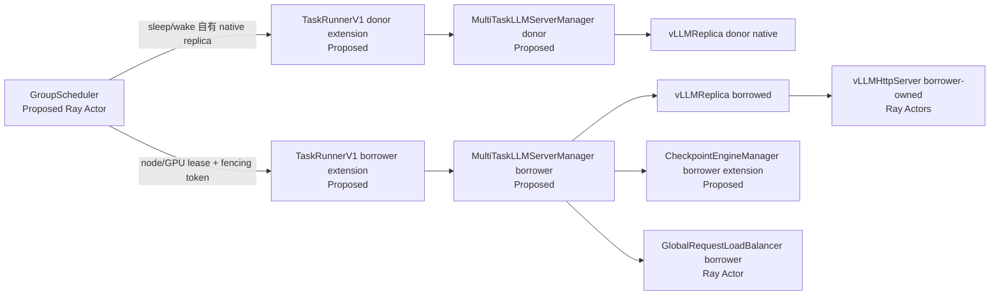
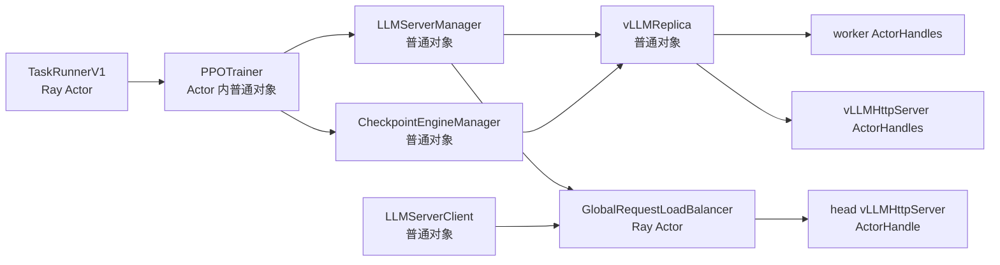
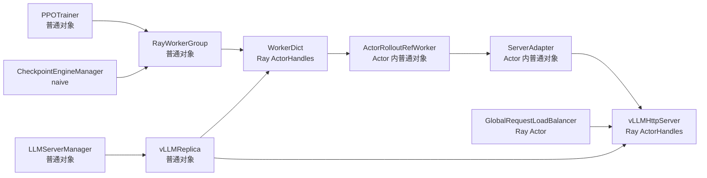
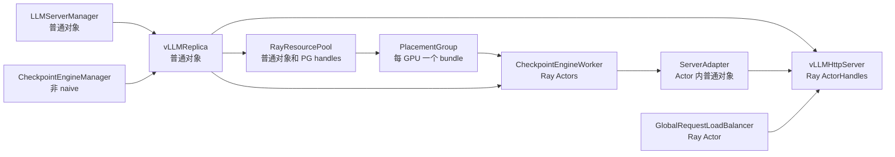
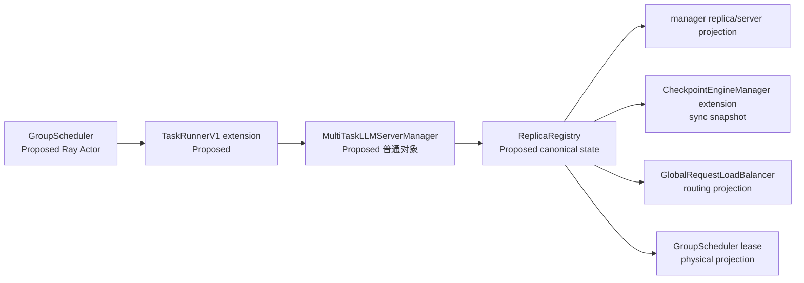
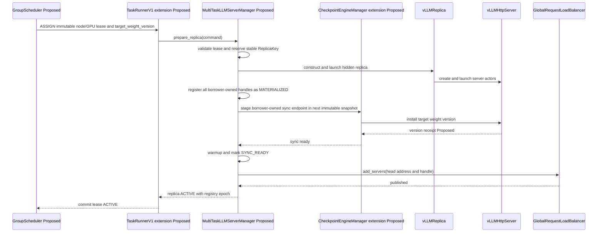

# verl v0.9.0 HYBRID / STANDALONE 动态 replica 视图与引用评审

> 状态：待评审，独立评审材料。
>
> 本文不会修改或替代 `multi_task_scheduler/【WIP】多RL任务资源共享调度RFC.md`。只有结论经评审确认后，
> 才考虑合并到正式 RFC。
>
> 源码目录：`/Users/nyp/Documents/verl`。
>
> 源码基线：`v0.9.0-1-g88512193`，commit
> `88512193628b95f24916c0898d51a8a877d09203`，工作区干净。
>
> 分析日期：2026-08-31。

## 1. 评审问题和直接结论

本文评审的问题不是“怎样多创建一个 `vLLMHttpServer`”，而是：

> 在训练运行期间，为一个任务动态增加一个真正可用、可同步、可路由、可回收的 rollout replica 时，
> HYBRID 和 STANDALONE 分别有哪些对象持有 replica 本身或其派生引用；哪些视图必须一起变化；
> verl v0.9.0 已经提供了哪些接口，哪些能力仍然缺失。

### 1.1 “动态添加完成”的判定

只有同时满足以下条件，才能把一次动态添加判定为完成：

1. 目标 node/GPU 已被唯一租约保护，不会被第二个任务同时使用；
2. `vLLMReplica`、`vLLMHttpServer` 及必要的 worker/adapter 实体已经创建或激活；
3. 参数同步链能够覆盖该 replica；
4. replica 已安装命令指定的权重版本；
5. `GlobalRequestLoadBalancer` 已经发布该 replica 的 head server；
6. 后续 abort、sleep、wake、更新权重、摘流和回收能够找到同一 replica；
7. 任一步失败时，可以把已经更新的视图反向撤销。

只创建 Ray Actor、只向 `LLMServerManager.rollout_replicas` 追加对象、只调用
`CheckpointEngineManager.add_replicas()` 或只调用 LB 的 `add_servers()`，都不满足以上定义。

### 1.2 核心结论：borrower 内部三处必接，任务外部一处必记

按照本轮确认后的方案，borrowed replica 创建完成后，**受赠任务内部不只是修改 Checkpoint Engine 和 LB 两处**，
还必须先进入受赠任务自己的运行时所有权/生命周期 registry。完整边界是：

1. **M：运行时所有权与生命周期，必须接入。**`MultiTaskLLMServerManager`（Proposed）应成为 borrowed replica
   的 canonical owner，保存 stable replica ID、`vLLMReplica`、受赠任务自建的同步 endpoint、全部
   `vLLMHttpServer` handles、head server handle/address、node/GPU binding、权重版本、生命周期状态和 lease ID。
   否则后续 abort、sleep、摘流、销毁、重试和回滚找不到同一个逻辑实例。
2. **C：参数同步，必须接入。**Checkpoint Engine 侧需要看到 effective replica snapshot，并能到达新 replica
   对应的、**由 borrower 创建并拥有**的实际 receiver/`ServerAdapter` endpoint。STANDALONE 非 `naive` 路径会
   遍历 `replicas[*].workers`；HYBRID `naive` 路径只调用固定 `actor_wg`，所以 HYBRID 不能只靠
   `CheckpointEngineManager.add_replicas()` 完成同步。
3. **L：rollout 路由，必须接入。**权重版本校验和 warmup 完成后，只把该 replica 的 **head
   `vLLMHttpServer` address/ActorHandle** 发布到 borrower 的 `GlobalRequestLoadBalancer`。LB 不应持有完整 replica。
4. **G：物理 node/GPU lease，任务外部必须记录。**GroupScheduler 负责 node/GPU 的 reserve、fencing、排他和释放，
   但不参与 verl 原生的参数同步时机，也不拥有 borrower 的 server/worker runtime handles。
5. **O：容量和观测是派生更新。**Fully Async 的并发上限、active server count、Prometheus/RLInsight 等应在发布后
   刷新；它们影响新 replica 是否真正被利用，但不应成为物理分配事实来源。
6. **R：Ray 原生资源视图刻意不修改。**borrowed replica 通过 GroupScheduler 给出的 immutable
   `node_id + GPU IDs`、NodeAffinity 和显式可见设备创建；不再次申请 borrower ResourcePool/PG/bundle，也不复用
   donor 的 ResourcePool、PG、bundle、RayWorkerGroup 或 worker handles。
7. **donor 不管理 borrowed replica。**donor 只管理自己的 native sleeping replica，并在借出前完成摘流和 HBM
   释放；borrowed replica 从创建开始完全归 borrower 所有。donor manager、CE、`CheckpointEngineWorker`、
   `ServerAdapter` 和 LB 均不登记 borrowed replica 的任何引用。

原生 `LLMServerManager` 仍缺少通用动态物化事务；experimental
`FullyAsyncLLMServerManager.add_replicas()` 只激活初始化时已经存在的 HYBRID replica。当前 list alias、跨 Actor
序列化副本和 identity-based remove 也不能承担一致性协议，因此仍需要 stable identity、immutable snapshot 和显式
发布/回滚顺序。

### 1.3 最新确认的所有权边界



图中刻意不存在 `DonorManager -> BorrowedReplica`、donor CE/worker/adapter 到 borrower server 的边。GroupScheduler
可以同时持有 donor/borrower `TaskRunnerV1` ActorHandle 并分别下发命令，但它交给 borrower 的创建输入只有经 fencing
保护的物理绑定和策略元数据，不包含 donor runtime handle。

| 组件 | 对 borrowed replica 持有什么 | 明确不持有什么 |
|---|---|---|
| donor 任务 | 无；只保留自己的 dormant native replica | borrowed replica/server/worker/adapter/LB 引用 |
| `GroupScheduler`（Proposed） | lease、task/session、stable replica ID、node/GPU、epoch/state | server、CE worker、adapter 等任务内 runtime handle |
| borrower `MultiTaskLLMServerManager`（Proposed） | 完整 canonical `ReplicaRecord` 及全部 borrower-owned handles | donor PG、bundle、worker 或 adapter handle |
| borrower `CheckpointEngineManager` extension（Proposed） | effective snapshot 和 borrower-owned sync endpoint | donor `CheckpointEngineWorker`/`ServerAdapter` |
| borrower `GlobalRequestLoadBalancer` | head server 的 address/ActorHandle、inflight/sticky 状态 | 完整 `vLLMReplica`、全部 node servers、CE worker |

上述拆分与 AS-IS 引用形态一致：`vLLMReplica` 保存全部 node server handles，并单独保存第一个 head server，见
`verl/workers/rollout/replica.py:122-129` 和
`verl/workers/rollout/vllm_rollout/vllm_async_server.py:1178-1198`；manager 只把每个 replica 的 head handle/address
汇总给 LB，见 `verl/workers/rollout/llm_server.py:556-580,600-611`；LB 的动态接口保存
`server_id -> ActorHandle`，见 `llm_server.py:123-149`。

因此以下对象不需要接收 per-replica 更新：

- 已有 `LLMServerClient` 只持有 LB ActorHandle，并在请求时向 LB acquire server，见
  `llm_server.py:197-224`；使用该 client 的 AgentLoop/rollout 调用方无需逐个感知新 server；
- donor manager、donor CE、donor LB 不更新；
- donor/borrower 原生 ResourcePool、PG、bundle 和既有 `RayWorkerGroup` 不更新。borrowed overlay 的资源真实性由 G
  平面负责，不把这一事实伪装回 Ray 原生视图。

### 1.4 与当前 WIP RFC 的一致项和待修订项

本文只记录差异，不修改 RFC：

- RFC `:36-39` 已经表达正确主干：donor 保留自己的原生资源实体，borrower 基于相同 node/GPU 创建自己的 replica，
  再加入 borrower 的同步集合与 LB。
- RFC `:51-61` 把若干组件描述成“活跃 server 列表”需要细化。真实类名是
  `CheckpointEngineManager` 和 `CheckpointEngineWorker`；不存在 `CheckpointEngineManagerWorker`。
  `CheckpointEngineWorker` 内部持有 `ServerAdapter`，并不维护一份通用 active server list，见
  `verl/checkpoint_engine/base.py:283-341`。
- RFC `:129-130,142-143,171-184` 仍写有 donor `CheckpointEngineWorker` endpoint 重绑定、临时关联或使用权。
  这与最新前提冲突：这些段落后续应改为“borrower 仅接收 node/GPU lease，自建并独占 runtime/sync endpoint”。
- RFC `:197-198` 已经区分 HYBRID DDR 路径与 STANDALONE Checkpoint Engine 扩展；本文暂不重新选择 HYBRID
  数据面，只校验“无论采用哪种同步方案，endpoint 都属于 borrower，不能复用 donor handle”。

## 2. 范围、术语与模式边界

### 2.1 本文范围

- 主部署轴只分析 `RolloutMode.HYBRID` 和 `RolloutMode.STANDALONE`；枚举定义见
  `verl/workers/rollout/replica.py:54-67`。
- backend 重点分析 vLLM，使用标准、非 PD-disaggregation replica。PD 模式还会增加 prefill/decode server 和
  peer handle，不能直接套用本文的“一 replica 一个 LB head”简化模型。
- `trainer.v1.trainer_mode=sync`、`colocate_async`、`separate_async` 是 Trainer 运行模式；它们不等同于
  `RolloutMode`。本文在需要解释对象所在进程时才区分这些入口。
- experimental Fully Async 的动态调度只作为现有扩展能力样本，不把它等同于本项目的跨任务动态创建。

### 2.2 三种容易混淆的“添加”

| 动作 | 含义 | 是否创建新运行实体 |
|---|---|---|
| 预创建 replica 激活 | replica、server、adapter 在初始化时已经存在；运行期只 wake/加入 LB | 否 |
| 原生新增 STANDALONE replica | 用空闲 Ray GPU 创建新的 pool、PG、`CheckpointEngineWorker` 和 server | 是 |
| 跨任务 borrowed replica 物化 | borrower 仅使用 GS 租约中的 node/GPU binding，绕过第二次 Ray GPU 申请并自建全部 borrower 实体 | 是 |

本项目要解决的重点是第三种。verl experimental 当前直接覆盖的是第一种；第二种有可复用的初始化原语，但没有完整的
运行期事务接口。

### 2.3 对象状态术语

```text
MATERIALIZED：运行实体存在，但尚未保证权重版本，也不接流
SYNC_READY：指定权重版本已安装并校验
ROUTABLE：已进入 LB，可接收新请求
DRAINING：已禁止新 acquire，等待或中断在途请求
DORMANT：实体保留但不接流，并已释放项目要求释放的 HBM
DESTROYED：borrower 临时实体已销毁；donor 原生实体不进入该状态
```

## 3. 四个正确性平面、一个派生平面和一个刻意不变的视图

从“创建完成后要加到哪里”看，M/C/L 是 borrower 任务内部的三个必需正确性平面，G 是跨任务的物理排他平面；
O 是运行效率与可观测性派生平面；R 在 borrowed overlay 下刻意不更新。六者不能合并为一张 replica list：

| 编号 | 视图/投影 | 主要对象或字段 | 事实含义 | 动态添加是否必须处理 |
|---|---|---|---|---|
| R | verl/Ray 原生资源视图 | `RayResourcePool.pgs`、PG bundles、`RayWorkerGroup._workers` | Ray 认为 donor 仍预约 GPU、原生 Actor 放在哪里 | borrowed overlay **不修改**；不得把它误当实际 HBM 使用者视图 |
| M | borrower 运行时所有权 registry | `MultiTaskLLMServerManager` canonical `ReplicaRecord`（Proposed）及原生 manager 投影 | 谁拥有、管理、销毁 borrowed replica 及全部 handles | **必须先处理** |
| C | borrower 参数同步/生命周期投影 | `CheckpointEngineManager.replicas`、`actor_wg`、borrower worker 内 `ServerAdapter` | 哪些实例收到哪个版本，以及 abort/sleep/wake 作用到谁 | **必须**；HYBRID/STANDALONE 机制不同 |
| L | borrower 推理路由视图 | `GlobalRequestLoadBalancer._servers`、`_inflight_requests`、sticky cache | 新请求可以路由到哪些 head server | **必须最后发布** |
| G | GroupScheduler 全局物理视图（Proposed） | task/session、replica、node/GPU、lease epoch、fencing state | 跨任务 GPU 排他性和当前 HBM 使用权 | **必须最先 reserve、最后 commit** |
| O | 容量和观测派生视图 | Prometheus targets、RLInsight、并发上限、active count | 新容量是否被发压和被观测 | 生产使用时更新；不是分配事实来源 |

这里的 M 是此前“两部分”之外容易遗漏的第三部分。原生 `LLMServerManager` 的多个 list 只是 AS-IS 投影，不能继续作为
唯一事实；C 和 L 也不能互相推导：CE 能同步不代表 LB 会路由，LB 有 server handle 也不代表该 server 已安装正确权重。

## 4. AS-IS：谁持有 replica，谁只持有派生引用

### 4.1 总体引用图



文字解释：

- `TaskRunnerV1` 是真实 Ray Actor；它把具体 `PPOTrainer` 子类构造成 Actor 进程内普通对象并保存到
  `self.trainer`，见 `verl/trainer/main_ppo.py:103-109,140-156`。
- `LLMServerManager` 和 `CheckpointEngineManager` 都是该 controller/Actor 进程中的普通对象，不是 Ray Actor。
- `GlobalRequestLoadBalancer` 的类定义本身是普通 Python 类；manager 使用 `ray.remote(...).remote(...)` 创建实际
  LB Actor，见 `verl/workers/rollout/llm_server.py:46-54,600-611`。
- `vLLMReplica` 是普通对象；`vLLMHttpServer` 才是通过 `.remote()` 创建的 Ray Actor，见
  `verl/workers/rollout/vllm_rollout/vllm_async_server.py:1102-1117,1159-1178`。

### 4.2 直接持有 `RolloutReplica` 对象的地方

| 持有者 | 类型/位置 | 字段 | 代码证据 | 是否决定权重目标 |
|---|---|---|---|---|
| `LLMServerManager` | controller 普通对象 | `rollout_replicas` | `llm_server.py:556-580,635-637` | 否；主要是运行时和生命周期入口 |
| `CheckpointEngineManager` | controller 普通对象 | `replicas` | `checkpoint_engine/base.py:390-401` | STANDALONE：是；HYBRID naive：否 |
| `FullyAsyncLLMServerManager` | `FullyAsyncRollouter` Actor 内普通对象 | `hybrid_replicas`、`alive_replicas`、继承的 `rollout_replicas` | `fully_async_rollouter.py:54-72,78-142` | 不直接决定；需对应 Trainer Actor 内 CE |
| `FullyAsyncTrainer` 中两个 CE manager | 另一个 Ray Actor 内普通对象 | 从 Rollouter RPC 返回的 replica 副本 | `fully_async_trainer.py:217-224,258-283` | 分别覆盖 standalone 和预注册 hybrid |

### 4.3 只持有派生引用的地方

| 持有者 | 持有内容 | 不等价于什么 | 代码证据 |
|---|---|---|---|
| `LLMServerManager.server_handles` | 每个 replica 的 head server ActorHandle | 完整 replica 或全部 node servers | `llm_server.py:579-580` |
| `LLMServerManager.server_addresses` | 每个 replica 的 head 地址 | 参数同步成员 | `llm_server.py:579-580` |
| `GlobalRequestLoadBalancer` | `address -> head server ActorHandle`，以及 inflight/sticky 状态 | `RolloutReplica` 对象、worker 或 PG | `llm_server.py:69-81,123-149` |
| `LLMServerClient` | LB ActorHandle | server 列表；因此 client 无需逐个刷新 | `llm_server.py:204-224,262-275` |
| `RolloutReplica` | worker handles、所有 server handles、head handle/address、可选 resource pool | manager/CE 成员资格 | `replica.py:93-129` |
| `vLLMHttpServer` | 本 node 的 worker ActorHandles、replica/node rank | replica 普通对象 | `vllm_async_server.py:84-96,148-156` |
| `ServerAdapter` | replica/rank 映射和惰性缓存的 server ActorHandle | manager 的 replica registry | `vllm_rollout.py:55-87,152-166` |
| `RayResourcePool` | PG handles | replica ID、LB server 或权重版本 | `single_controller/ray/base.py:113-163` |
| `RayWorkerGroup` | worker ActorHandles | replica；HYBRID 时一组 worker 可被切片为多个 replicas | `single_controller/ray/base.py:418-495,905-910` |

### 4.4 同进程 list alias 是偶然行为，不是可依赖协议

V1 `PPOTrainer._setup()` 把 `llm_server_manager.get_replicas()` 直接传给 CE；getter 返回原 list，而 CE 构造器也直接
保存传入对象，见：

- `verl/trainer/ppo/v1/trainer_base.py:350-362`；
- `verl/workers/rollout/llm_server.py:635-637`；
- `verl/checkpoint_engine/base.py:390-401`。

因此初始化后通常满足：

```python
checkpoint_manager.replicas is llm_server_manager.rollout_replicas
```

但原生动态方法的行为并不对称：

```python
# 修改原 list：仍会通过 alias 影响 manager
self.replicas.extend(replicas)                 # add_replicas

# 重新绑定 CE 字段：立即打破 alias，manager 仍保留旧 list
self.replicas = [r for r in self.replicas ...] # remove_replicas
```

对应代码为 `verl/checkpoint_engine/base.py:430-445`。由此得到两个约束：

1. manager 和 CE 两边都执行 append，可能重复加入同一个 replica；
2. 先调用 CE remove 后，manager 与 CE 可能看到不同集合。

正确扩展必须拥有一个 canonical registry，并为 manager、CE 和 LB 生成显式快照，不能把 Python list alias 当作一致性机制。

### 4.5 跨 Ray Actor 时不存在上述 alias

Fully Async 中 `FullyAsyncRollouter` 和 `FullyAsyncTrainer` 是两个 Ray Actor，分别定义于
`fully_async_rollouter.py:329-330` 和 `fully_async_trainer.py:53-54`。Trainer 通过
`await self.rollouter.get_replicas.remote()` 获取 replica 结果，再构造本地 CE，见
`fully_async_trainer.py:217-223`。

这里 replica 普通对象经过 Ray 序列化，Trainer 持有的是对象副本；副本内部的 Ray ActorHandle 仍指向同一远端 Actor。
而 `RolloutReplica` 没有实现 stable `replica_id`、`__eq__` 或 `__hash__`，CE remove 使用对象集合进行 identity 比较，见
`checkpoint_engine/base.py:438-445`。因此稍后从 Rollouter 再取一个“同一逻辑 replica”的新副本，不能保证从 Trainer
已有 CE list 中删除成功。

### 4.6 不同 Trainer 入口下，应该修改的 owner 不相同

| 入口 | canonical manager/LB 在哪里 | CE 在哪里 | 动态 STANDALONE 添加必须落到哪里 |
|---|---|---|---|
| V1 `sync` / `colocate_async` 的 HYBRID 路径 | `TaskRunnerV1` Actor 内的具体 `PPOTrainer` 对象 | 同一个 Trainer 对象 | 不存在主 STANDALONE manager；这里只适用 HYBRID 结论 |
| V1 `separate_async` | 同一个 Trainer 对象同时持有原生 HYBRID `llm_server_manager` 和 `standalone_server_manager`；client 使用后者的 LB | `checkpoint_manager` 管 HYBRID，`standalone_checkpoint_manager` 管 STANDALONE | `standalone_server_manager`、`standalone_checkpoint_manager` 和 standalone LB，不能误改 HYBRID 三件套 |
| experimental Fully Async | `FullyAsyncRollouter` Ray Actor 内的 `FullyAsyncLLMServerManager` 和 LB | `FullyAsyncTrainer` Ray Actor 内持有 replica 副本的 CE managers | 先在 Rollouter 物化/登记，再把 stable-ID 对应副本交给 Trainer 更新 CE；需要跨 Actor 事务 |

V1 `separate_async` 的双 manager 创建、client 选择以及把 HYBRID servers 临时加入 standalone LB 的代码分别在
`verl/trainer/ppo/v1/trainer_separate_async.py:81-101,129-136,180-203`。Fully Async 的两个 Actor 创建顺序和引用注入
见 `verl/experimental/fully_async_policy/fully_async_main.py:77-110,117-156`。

## 5. HYBRID：资源、运行时、同步与路由引用

### 5.1 AS-IS 初始化和持有关系



1. Trainer 用 `create_colocated_worker_cls()` 动态生成 `WorkerDict`，再创建训练 `RayWorkerGroup`；最终被 remote 的外层
   Actor 是 `WorkerDict`，业务 `ActorRolloutRefWorker` 是其进程内普通对象。调用点见
   `trainer_base.py:290-313`，包装实现见 `single_controller/ray/base.py:988-1029`。
2. `RolloutReplica.init_hybrid()` 按固定 `world_size * replica_rank` 从训练 `RayWorkerGroup.workers` 中切片，见
   `replica.py:131-141`。所以 replica 的 worker 引用实际是 `WorkerDict` ActorHandles。
3. `vLLMReplica.launch_servers()` 向这些 workers 查询 node ID 和 accelerator ID，再用硬 NodeAffinity 与显式
   `cuda_visible_devices` 创建每 node 一个 `vLLMHttpServer` Actor；server 创建没有再次声明 Ray GPU 数量，见
   `vllm_async_server.py:1120-1178`。
4. manager 保存 replica、head handles 和地址，再用这些 head handles 初始化 LB，见
   `llm_server.py:556-580,600-611`。
5. V1 base trainer 把 Checkpoint Engine backend 强制设为 `naive`，见 `trainer_base.py:355-362`。

### 5.2 HYBRID 参数同步为什么不由 `CE.replicas` 决定

HYBRID `naive` 更新执行：

```text
CheckpointEngineManager.update_weights()
  -> actor_wg.update_weights(mode="naive")
  -> WorkerDict Ray Actor 代理方法
  -> ActorRolloutRefWorker.update_weights()
  -> self.rollout.update_weights()
  -> ServerAdapter 按训练 rank 推导 replica_rank
  -> ray.get_actor("vllm_server_<replica>_<node>")
  -> vLLMHttpServer.collective_rpc("update_weights_from_ipc")
```

证据链：

- `CheckpointEngineManager` 在 `backend == "naive"` 时直接调用 `actor_wg.update_weights()` 并返回，完全不遍历
  `self.replicas`：`checkpoint_engine/base.py:486-496`；
- `ActorRolloutRefWorker` 在初始化时创建 `ServerAdapter`：`engine_workers.py:643-664`；
- `ActorRolloutRefWorker.update_weights()` 从 training engine 取 tensor，再调用 `self.rollout.update_weights()`：
  `engine_workers.py:719-805`；
- `ServerAdapter` 用训练全局 rank 和 rollout world size 推导 `replica_rank`，并通过固定 named-actor 规则惰性取得
  server handle：`vllm_rollout.py:65-87,152-166`。

所以：

> 向 `CheckpointEngineManager.replicas` 追加一个新 HYBRID `vLLMReplica`，最多能让 CE 的通用
> abort/sleep/wake 生命周期遍历到它；它不会自动增加 training ranks，也不会建立新的 `ServerAdapter -> server` 权重通道。

这是此前“GroupScheduler 只调整 CE 内 effective replicas”思路在 HYBRID 下需要修正的地方。GroupScheduler 仍然不应决定
同步时机，但任务内扩展必须同时调整真正的 adapter/sync endpoint 投影。

### 5.3 两种 HYBRID 动态添加必须分开讨论

#### A. 激活初始化时已创建的 HYBRID replica

experimental `FullyAsyncLLMServerManager` 在初始化时先用父类创建所有 HYBRID replicas，然后把它们移入
`hybrid_replicas` 并清空 active list，见 `fully_async_rollouter.py:78-103`。运行期 `add_replicas()` 做的是：

1. 从 `hybrid_replicas` 查找已经存在的对象；
2. 调用 LB `add_servers()`；
3. 把对象加入 `rollout_replicas`、`alive_replicas`、handles 和 addresses。

代码见 `fully_async_rollouter.py:144-200`。所有 WorkerDict、ServerAdapter、vLLM server 和 hybrid CE 副本在初始化阶段
已经存在，因此这种 activation 不需要创建新的同步 endpoint。这部分可借鉴“隐藏后发布”的思路，但它不是本项目的
borrowed materialization。

#### B. 在运行期真正物化一个新 HYBRID replica

原生路径存在两个独立阻塞：

1. `init_hybrid()` 只能按 `replica_rank` 从固定训练 WorkerGroup 切片。如果原 worker 数已经全部分配，再使用更高
   replica rank 会得到空 worker list，随后 `vLLMReplica.launch_servers()` 在
   `len(self.workers) == self.world_size` 断言失败，见 `replica.py:137-141` 和
   `vllm_async_server.py:1118-1122`。
2. 即使扩展 `init_borrowed(node_gpu_bindings, lease, ...)`，用 GroupScheduler 给出的 immutable node/GPU binding
   成功创建了 borrower server，borrower 的 `actor_wg.update_weights()` 仍只调用 borrower 原训练 workers 内既有的
   `ServerAdapter`，不会覆盖新 server。donor worker handles 不应成为该 API 的参数。

因此，一个真正的新 borrowed HYBRID replica 至少还需要一个由 borrower 创建并拥有的权重接收方案：预创建 borrower
endpoint、运行期扩展 borrower adapter endpoint，或 RFC 当前保留的 DDR 数据面。无论选择哪一种，都不能重绑定 donor
adapter，也不能只修改 `CE.replicas`。

### 5.4 HYBRID 动态添加要处理的视图

| 投影 | 预创建 replica 激活 | 真正新建 borrowed replica | 代码/原因 |
|---|---|---|---|
| R：Ray pool/PG/WG | 不变 | donor 原预约保持不变；borrower 不复用也不修改 donor PG/WG | 固定 worker slice：`replica.py:131-141` |
| M：manager registry | 加入 active/effective 集合 | 先以 `MATERIALIZED` 登记，再发布为 effective | base manager 只有初始化 list：`llm_server.py:518-580` |
| C1：CE lifecycle list | 已预注册时无需新增 | 需要纳入 abort/sleep/wake，但不能把它误认为权重通道 | `checkpoint_engine/base.py:447-483` |
| C2：training adapter mapping | 不变 | **必须解决**；当前是按 training rank 静态映射 | `vllm_rollout.py:65-87,152-166` |
| L：LB | `add_servers()` | 权重校验和 warmup 后最后 add | `llm_server.py:123-136` |
| G：物理 lease | 同任务原生 activation 可不新增跨任务 lease | 必须登记 donor/borrower/node/GPU/epoch | Proposed |
| O：容量/指标 | 更新 active count | 更新地址、容量和监控 | `fully_async_rollouter.py:1274-1294`；`rollout/utils.py:141-220` |

## 6. STANDALONE：资源、运行时、同步与路由引用

### 6.1 AS-IS 初始化和持有关系



1. manager 在 `worker_group is None` 时按配置 GPU 总数计算 replica 数，并调用每个 replica 的
   `init_standalone()`，见 `llm_server.py:518-577`。
2. 每个 replica 创建自己的 `ResourcePoolManager`、`RayResourcePool` 和 PG；再创建一个
   `RayWorkerGroup`，其业务 ActorClass 是 `CheckpointEngineWorker`，见 `replica.py:189-239`。
3. PG bundle 声明一个 GPU；`RayWorkerGroup` 在 PG bundle 上真正 remote
   `CheckpointEngineWorker`，见 `single_controller/ray/base.py:131-163,538-581,623-682`。
4. `init_standalone()` 没有保存局部 `ResourcePoolManager` 和 `RayWorkerGroup` 对象，只把
   `RayResourcePool` 保存在 `replica.resource_pool`，把 worker ActorHandles 保存在 `replica.workers`，见
   `replica.py:202-225`。
5. `vLLMReplica` 再从这些 worker handles 查询 node/GPU，并以 NodeAffinity 和显式可见设备创建 server，流程与
   HYBRID 共用 `vllm_async_server.py:1124-1198`。

### 6.2 STANDALONE 参数同步由 `CE.replicas[*].workers` 决定

非 `naive` 更新执行：

```text
CheckpointEngineManager.replicas snapshot
  -> flatten every replica.workers
  -> temporary RayWorkerGroup
  -> build_process_group(actor workers, rollout workers)
  -> actor_wg.update_weights() sends
  -> CheckpointEngineWorker.update_weights() receives
  -> CheckpointEngineWorker.server_adapter.update_weights()
  -> vLLMHttpServer installs weights and sets global_steps
```

证据链：

- CE 展平 `replica.workers` 并创建临时 `RayWorkerGroup`：`checkpoint_engine/base.py:498-505`；
- CE 构建通信拓扑并同时调用 sender/receiver 更新：`checkpoint_engine/base.py:508-530`；
- `CheckpointEngineWorker` 接收权重并调用其 `server_adapter`：`checkpoint_engine/base.py:283-341`；
- `ServerAdapter` 把权重发给 server，并在完成后设置 `global_steps`：
  `vllm_rollout.py:208-246`；
- server 将 `global_steps` 带入每个生成结果：`vllm_async_server.py:620-640,845-847`。

因此 STANDALONE 可以把 CE 的 replica 集合扩展为 effective replicas，但前提是新增 replica 的 `workers` 真正指向
**borrower 创建并拥有、且 borrower 权重能够使用的 sync endpoints**。这些 handles 不能来自 donor。
原生 STANDALONE 唯一被代码证明的接收端是通过 private ResourcePool/PG 创建的
`CheckpointEngineWorker/ServerAdapter`；在“不复用 donor PG/worker、也不再次申请同一 GPU”的 borrowed overlay 下，
如何构造等价的 borrower-owned receiver 仍是待设计 GAP。把 replica 加进 CE list 是必要条件，但不是 endpoint 已存在的证明。

### 6.3 原生新增与 borrowed overlay 的差异

#### A. Ray 集群确有未预约 GPU

可以复用 `vLLMReplica(...); await replica.init_standalone()` 创建新 private pool、PG、CE workers 和 servers。
但 base `LLMServerManager` 没有把单个新 replica 原子接入 manager/CE/LB 的公共 API，也没有对应的 server/worker/PG
teardown API；其公开方法到 profiling 为止，见 `llm_server.py:631-647`。所以初始化原语可复用，运行期事务仍需扩展。

#### B. 使用 donor 已预约但希望临时释放 HBM 的 GPU

borrower 不能调用原生 `init_standalone()`：它会再次创建 PG 并向 Ray 申请同一 GPU，而 Ray 原生视图仍认为该 GPU 被
donor PG 预约。项目需要 `init_borrowed(node_gpu_bindings, lease, sync_endpoint_spec, ...)` 一类 Proposed 路径，绕过新的
PG/GPU 申请，仅使用 GroupScheduler 租约中的不可变 node/GPU metadata 做放置定位。donor PG、bundle、worker handles
和 adapter handles 都不是该接口的输入。

但是当前代码还有三个必须先解决的 GAP：

1. `vLLMHttpServer.sleep()` 在 `RolloutMode.STANDALONE` 下明确 `skip sleep in standalone mode`，wake 也跳过，见
   `vllm_async_server.py:770-800`。所以 donor 调用原生 sleep 后不能据此宣称权重/KV HBM 已释放。
   `release_kv_cache()`/`resume_kv_cache()` 当前也只有条件判断，没有实际释放或恢复动作，见
   `vllm_async_server.py:813-823`。
2. 原生 `CheckpointEngineWorker` 由 `RayWorkerGroup` 在 private PG GPU bundle 上 remote，见
   `replica.py:202-225` 和 `single_controller/ray/base.py:623-682`。当前没有“只给 node/GPU IDs、且不复用 donor
   resource handles”就创建 borrower CE receiver 的公共路径；该 receiver 的实体形态和创建机制必须单独设计，不能用
   donor endpoint 重绑定代替。
3. 新 borrowed server 若采用 task/session suffix，原生 `ServerAdapter` 仍按
   `vllm_server_<replica_rank>_<node_rank>` 查找并缓存 handle，没有 suffix 或直接 handle 注入接口，见
   `vllm_rollout.py:152-166`；server 创建端却会把 `name_suffix` 放进 Actor name，见
   `vllm_async_server.py:1147-1153`。borrower endpoint 需要直接 ActorHandle/endpoint-key 注入扩展，但不能重绑定 donor
   `ServerAdapter`。

### 6.4 STANDALONE 动态添加要处理的视图

| 投影 | 原生空闲 GPU 新增 | node/GPU borrowed overlay | 代码/原因 |
|---|---|---|---|
| R：Ray pool/PG/WG | 新建 private pool、PG、CE workers | donor reservation 保持不变；borrower 不登记、不复用 donor handles，也不再次申请 GPU | `replica.py:189-225` |
| M：manager registry | 加入新 replica/handles/addresses | borrower manager 以稳定 ID 登记临时 replica | `llm_server.py:556-580` |
| C：CE effective snapshot | 加入新 replica workers | 只有存在 borrower-owned sync endpoints 才能加入；endpoint 创建当前是 GAP | `checkpoint_engine/base.py:498-518` |
| adapter handle | 新 CE workers 自动构造 adapter，但仍需唯一 rank/name | borrower endpoint 必须支持唯一 key 或直接 handle 注入；禁止 donor adapter rebind | `checkpoint_engine/base.py:323-330`；`vllm_rollout.py:152-166` |
| L：LB | 权重就绪后 add head server | 权重就绪后 add borrower head server | `llm_server.py:123-136` |
| G：物理 lease | 登记原生新资源结果 | **必须**维护 donor reservation 与 borrower HBM 使用叠加关系 | Proposed |
| O：容量/指标 | 更新 | 更新 | `rollout/utils.py:141-220` |

## 7. 双模式修改矩阵

图例：`Y` 为必须处理；`N` 为不需要修改；`GAP` 为当前没有可直接复用的闭环能力。

| 视图/对象 | HYBRID 预创建激活 | HYBRID 新 borrowed | STANDALONE 原生新增 | STANDALONE borrowed |
|---|---:|---:|---:|---:|
| Ray ResourcePool/PG/bundle | N | N，donor Ray reservation 不变，borrower 不接入 | Y | N，donor Ray reservation 不变，borrower 不接入 |
| `RayWorkerGroup` worker 集合 | N | GAP：固定训练 WG 不会长出 borrower ranks | Y，新建 CE WG | N；不复用 donor handles，borrower sync endpoint 另行管理 |
| canonical replica registry（Proposed） | Y | Y | Y | Y |
| `LLMServerManager` replica/handle/address 投影 | Y | Y | Y | Y |
| `CheckpointEngineManager.replicas` 生命周期集合 | 通常已预注册 | Y | Y | Y，但需有效 receiver endpoints |
| 实际参数同步 endpoint | N，已存在 | **GAP** | Y，由新 CE workers 提供 | **GAP** |
| `ServerAdapter` handle/name 映射 | N | **GAP** | 需确保 rank/name 唯一 | **GAP** |
| `GlobalRequestLoadBalancer` | Y | Y | Y | Y |
| GroupScheduler node/GPU lease | 非跨任务时 N | Y | Y，作为登记/对账 | Y |
| Prometheus/active capacity | Y | Y | Y | Y |
| teardown/rollback | 只需 deactivate | **GAP** | **GAP** | **GAP** |

## 8. experimental 动态能力能复用什么，不能证明什么

### 8.1 可以复用的原生接口

| 能力 | 可复用点 | 限制 |
|---|---|---|
| LB 动态发布 | `GlobalRequestLoadBalancer.add_servers()` / `remove_servers()`，`llm_server.py:123-149` | 只改变路由；不处理权重、资源和 manager list |
| CE 成员 mutation | `CheckpointEngineManager.add_replicas()` / `remove_replicas()`，`checkpoint_engine/base.py:430-445` | 无锁、无 epoch、remove 会打破 list alias |
| STANDALONE receiver 拓扑重建 | 每次 update 从当前 replicas 重建临时 WG，`checkpoint_engine/base.py:498-518` | 需要真实可用的 CE worker endpoints |
| HYBRID 预创建激活 | `FullyAsyncLLMServerManager.add_replicas()`，`fully_async_rollouter.py:144-200` | 仅限已经物化的 `hybrid_replicas` |
| 安全摘流顺序参考 | `DynamicResourceController` 先 LB remove，再 abort/sleep，`dynamic_resource_controller.py:138-159` | STANDALONE sleep 仍是 no-op；不是跨任务协议 |
| 添加后的请求重平衡 | 清 sticky cache，再 abort/drain/resume，`fully_async_rollouter.py:1211-1270` | 会中断现有请求；应由策略决定，不是每次 add 的必要条件 |

LB `add_servers()` 会让新地址以 inflight=0 进入 least-loaded 候选，但不会清理已有
`request_id -> old_server` sticky 映射，见 `llm_server.py:89-114,123-136`。因此：

- 新 request ID 会自然优先选择负载为 0 的新 replica；
- 已有 sticky request 不会只因为 add 自动迁移；
- 如果调度目标要求立刻把 partial/inflight 请求搬到新增 replica，需要显式 clear sticky、abort、等待 release 计数归零并
  retry。这个动作影响请求连续性，不应隐藏在普通 registry append 中。

### 8.2 experimental 代码不是完整动态创建事务

1. `FullyAsyncLLMServerManager.add_replicas()` 先把 servers 加入 LB，随后才更新本地 lists/maps；若后续本地更新抛错，
   except 只返回 0，没有从 LB 反向删除，见 `fully_async_rollouter.py:177-204`。
2. remove 同样先更新 LB 再修改本地状态，没有跨两步事务日志，见
   `fully_async_rollouter.py:232-259`。
3. 它没有创建新的 worker/server/PG，也没有销毁 API。
4. hybrid CE 在初始化阶段就登记全部预创建 replicas，见
   `fully_async_trainer.py:270-295`；所以运行期 LB activation 没有验证“新 CE endpoint 动态加入”这件事。
5. 当前 active 统计本身有一致性问题：add 会把 hybrid replica 追加到 `rollout_replicas`，同时加入
   `alive_replicas`；`get_active_server_count()` 又把两者长度相加，可能重复计数；
   `get_standalone_replicas()` 也直接返回已经混入 active hybrid 的 `rollout_replicas`，见
   `fully_async_rollouter.py:181-192,280-290`。

因此 experimental 实现可以作为 API 和顺序参考，但不能当作“跨任务动态 materialization 已经被 verl 支持”的证据。

## 9. TO-BE：建议的单一 registry 与投影关系

以下是评审建议，不是 verl AS-IS 类。



建议 `MultiTaskLLMServerManager` 内部用 stable key 维护唯一事实，例如：

```text
ReplicaKey = task_id + task_session_id + replica_id + incarnation

ReplicaRecord:
  key
  owner_task_id
  kind = NATIVE | BORROWED
  rollout_mode = HYBRID | STANDALONE
  lifecycle_state
  sync_state
  weight_version
  rollout_replica
  worker_handles                 # 仅 borrower-owned sync endpoints
  all_server_handles
  head_server_handle
  head_server_address
  placement_lease_id
  node_gpu_bindings
  registry_epoch
```

这里的 registry 是 Proposed 普通对象状态，不要求增加通信 Actor。跨任务命令仍按已确认边界：

```text
GroupScheduler Ray RPC
  -> TaskRunnerV1 extension
  -> 同进程 MultiTaskLLMServerManager
  -> 同进程 CheckpointEngineManager extension / LB Ray RPC
```

GroupScheduler 不直接持有 manager 普通对象，也不直接触发参数同步；它只提交带 fencing token 的目标状态命令。
它也不保存 donor 或 borrower 的 server/worker/adapter runtime handles；物理 lease 与任务内 registry 通过
`ReplicaKey + lease_epoch` 关联。

## 10. TO-BE：动态添加发布事务

### 10.1 建议时序



### 10.2 发布顺序约束

1. **先在 G 视图占住 lease，再创建任何 borrower HBM 实体。**否则两个 borrower 可能同时看见同一空泡。
2. **新 replica 必须先 hidden。**它可以出现在 manager 的 `MATERIALIZED` registry，但不能出现在 LB。
3. **同步使用不可变 effective snapshot。**一次 update 从开始到 finalize 都使用同一 replica/worker 集合；不能在
   `checkpoint_engine/base.py:502-505` 展平 workers 后，又让后续 lifecycle 方法读取一份已变化的 list。
4. **权重版本成功并 warmup 后才发布到 LB。**当前 server 能给生成结果附带 `global_steps`，但没有独立
   `get_global_steps()` 或结构化 sync receipt；建议扩展一个可校验回执，而不是用“RPC 没抛异常”代替版本证明。
5. **LB 是最后一个面向请求的数据面发布点。**LB add 成功才允许把 record 标记为 `ROUTABLE`。
6. **GroupScheduler 最后 commit ACTIVE。**TaskRunner 返回 `ReplicaKey + registry_epoch + lease_epoch`，避免旧命令覆盖
   新实例。

### 10.3 两种模式在第 4 步的不同实现

| 模式 | “stage sync endpoint”实际含义 |
|---|---|
| HYBRID 预创建 | endpoint 已存在；确认该 replica 在 hybrid CE/lifecycle 集合中，执行原生同步后激活 |
| HYBRID 真新建 | 不能只 stage `CE.replicas`；必须先建立可从 borrower training weights 到新 server 的 adapter endpoint |
| STANDALONE 原生新增 | 把新 replica 的 `CheckpointEngineWorker` handles 加入下一 sync snapshot |
| STANDALONE borrowed | 必须先创建 borrower-owned receiver endpoint，再加入 snapshot；不得传入或重绑定 donor worker/adapter；当前创建机制尚未闭环 |

## 11. 失败回滚与回收顺序

### 11.1 添加失败回滚

| 失败位置 | 必须执行的补偿 |
|---|---|
| lease 校验失败 | 不创建实体，释放 PENDING record |
| 部分 server 创建失败 | 杀掉仅属于 borrower 的已创建 server/backend；donor 原生 server 不销毁 |
| sync endpoint 注册失败 | 从下一 sync snapshot 移除；解绑并销毁 borrower-owned endpoint；不进 LB；donor endpoint 不受影响 |
| 权重更新或版本校验失败 | replica 保持 hidden；释放其 HBM；删除 borrower 临时实体 |
| LB add 失败 | replica 保持 SYNC_READY 但不可路由，随后重试或销毁；不得把 GS lease commit 为 ACTIVE |
| LB add 成功、manager commit 失败 | 立即 LB remove，abort/drain，再反向清理 C/M/G；原生 experimental 目前没有这项补偿 |

### 11.2 回收顺序

```text
LB remove / mark DRAINING
  -> 等待 inflight 归零，或复用 partial rollout abort 机制迁移请求
  -> 从下一次 CE effective snapshot 排除
  -> 等待正在进行的 sync epoch 完成
  -> borrower manager 销毁自己持有的 server/backend/sync endpoint 并释放 HBM
  -> GroupScheduler 释放 borrower lease
  -> GroupScheduler 可另行命令 donor 唤醒自己的 native replica
  -> donor 按自身最新版本同步并重新进入 donor LB
```

donor 原生 replica、原生 PG、WorkerDict/CheckpointEngineWorker 和原生 server 仍由 donor 拥有；回收 borrower 时不能把
这些实体一起销毁。上述最后两步是 donor 自己的恢复事务，不是把 borrower runtime handle “归还”给 donor。

## 12. 数值例子：同一组 4 卡在三种视图中的不同表达

假设任务 A 有 2 个节点，每节点 8 卡；一个 vLLM replica 使用 4 卡。A 的 `A-r2` 位于：

```text
node-1 / GPU 4,5,6,7
```

任务 B 希望在这 4 张卡上创建 `B-br7`。

### 12.1 HYBRID donor

```text
R 视图：A 的训练 RayResourcePool/PG bundles 和 4 个 WorkerDict Actors 仍预约 GPU 4..7
G 视图：lease(A-r2 -> B-br7, node-1/GPU4..7, epoch=31)
M 视图：A 只保留 dormant A-r2；B manager 独占 B-br7 及其全部 runtime handles
C 视图：A 的 adapter/CE 只管理 A-r2；B 必须创建并持有自己的权重 endpoint
L 视图：A 地址已摘除；B 权重就绪后加入 B 的 LB
```

把 `B-br7` 普通对象追加到 B 的 `CheckpointEngineManager.replicas` 不会让 B 的四个新推理 ranks 出现在
`actor_wg.update_weights()` 中，所以 HYBRID 仍缺同步 endpoint。

### 12.2 STANDALONE donor

```text
R 视图：A-r2 private PG 和 4 个 CheckpointEngineWorker Actors 仍预约 GPU 4..7
G 视图：同样记录 A-r2 -> B-br7 的物理 lease
M 视图：A manager 只管理 A-r2；B manager 根据 lease 中的 node/GPU IDs 创建并独占 B-br7
C 视图：A 的 CheckpointEngineWorker/ServerAdapter 只属于 A，句柄不会传给 B；B 必须有自己的 sync endpoint
L 视图：A-r2 head server 已从 A LB 摘除；B-br7 完成版本同步后才把 B 的 head server 加入 B LB
```

而且在当前 v0.9.0 代码中，A-r2 的 STANDALONE `sleep()` 是 no-op。必须先实现并验证真正的 HBM 释放，才能把这四张卡
标记为 `BORROWABLE`。即使 HBM 已释放，A 的 CE worker handles 也不是 B 的 placement anchor 或同步端；A 和 B 之间传递的
只有 GroupScheduler 受 fencing 保护的 node/GPU lease。

## 13. 需要评审确认的设计决策

在更新正式 RFC 前，建议依次确认：

1. 是否同意把“预创建激活”和“真正动态物化”定义为两种不同能力；本项目主目标是后者。
2. 是否同意引入 `ReplicaKey + ReplicaRecord + registry_epoch`，不再让 manager/CE 共享裸 list 作为一致性协议。
3. 是否同意 LB 始终最后发布，GroupScheduler lease 始终最先 reserve、最后 commit。
4. HYBRID borrowed replica 的权重 endpoint 采用哪一种方案；在该问题解决前，不能声称
   `CE.add_replicas()` 已支持 HYBRID 动态扩容。
5. STANDALONE 如何实现真实 HBM release；原生 `sleep()` 不能复用为当前定义的 donor 释放动作。
6. STANDALONE borrowed 的 borrower-owned sync endpoint 采用什么实体形态，如何在不申请第二份 Ray GPU、也不复用 donor
   PG/worker/adapter 的条件下创建，并如何被 CE snapshot 引用。
7. 是否为 `ServerAdapter` 增加直接 ActorHandle/endpoint key 注入，避免仅依赖固定 named-actor 字符串和缓存。
8. borrower server/backend/sync endpoint 的 teardown 由 manager 如何负责，如何确认 HBM 已释放后再归还 lease。
9. Fully Async 的 canonical replica 位于 Rollouter Actor、CE 副本位于 Trainer Actor 时，TaskRunner 如何用 stable ID
   原子更新两边，而不是传递对象 identity。

## 14. 最终评审结论

对本项目的 borrowed replica，创建完成后在 borrower 内部必须接入三处：

1. **`MultiTaskLLMServerManager` canonical registry**：拥有 replica 及全部 borrower runtime handles，负责生命周期；
2. **Checkpoint Engine/sync projection**：持有 effective snapshot 和 borrower-owned receiver endpoint，负责原生时机下的
   指定版本同步；
3. **`GlobalRequestLoadBalancer` routing projection**：只登记完成同步的 head server，负责 rollout 请求路由。

此外，**GroupScheduler** 在任务外维护 node/GPU lease、fencing 和排他性；容量/监控是发布后的派生更新。Ray 原生资源视图
在 borrowed overlay 下刻意不变：

- 使用真正空闲的 Ray GPU 原生创建 STANDALONE replica：R 必须新增 pool/PG/bundles；
- 使用 donor 已预约 GPU 做 borrowed overlay：R 只保留 donor 原预约，G 负责表达实际 HBM 使用者；borrower 不复用 donor
  ResourcePool、PG、bundle、RayWorkerGroup、CheckpointEngineWorker 或 ServerAdapter；
- 激活预创建 HYBRID replica：R 和同步 endpoint 都已经存在，只修改 active registry、LB 和容量投影；
- 真正新建 HYBRID borrowed replica：当前缺少可动态扩展的 training `ServerAdapter`/权重 endpoint，仅修改 CE list
  不能完成参数同步。

因此，用户提出的“Checkpoint Engine + Load Balancer 两部分”方向正确，但缺少前置的 manager ownership/lifecycle registry；
准确答案是 **borrower 内部三部分 + GroupScheduler 外部 lease 一部分**。下一步不应直接实现一个通用
`add_replica()`，而应先确定 HYBRID 和 STANDALONE 各自的 borrower-owned sync endpoint 方案，再把 lease reserve、hidden
materialization、版本同步、LB publish 和 rollback 封装成同一状态机的模式化分支。

## 15. 关键代码索引

| 主题 | 代码位置 |
|---|---|
| `TaskRunnerV1` 创建 Trainer | `verl/trainer/main_ppo.py:103-109,134-156` |
| V1 Trainer 创建 WG、manager、CE | `verl/trainer/ppo/v1/trainer_base.py:229-300,311-367` |
| `LLMServerManager` 初始化和列表 | `verl/workers/rollout/llm_server.py:464-637` |
| LB registry/add/remove | `verl/workers/rollout/llm_server.py:46-81,123-149` |
| client 只持 LB handle | `verl/workers/rollout/llm_server.py:197-224,262-275` |
| `RolloutReplica` 字段及 HYBRID/STANDALONE 初始化 | `verl/workers/rollout/replica.py:93-157,189-239` |
| vLLM server 放置、创建和引用 | `verl/workers/rollout/vllm_rollout/vllm_async_server.py:1102-1198` |
| vLLM STANDALONE sleep no-op | `verl/workers/rollout/vllm_rollout/vllm_async_server.py:770-800` |
| training `ActorRolloutRefWorker` 与 rollout adapter | `verl/workers/engine_workers.py:446-470,643-682,719-805` |
| `ServerAdapter` rank/name/handle/更新 | `verl/workers/rollout/vllm_rollout/vllm_rollout.py:49-166,208-246` |
| CE worker、成员方法和同步分支 | `verl/checkpoint_engine/base.py:283-355,361-538` |
| RayResourcePool/PG | `verl/single_controller/ray/base.py:113-215` |
| RayWorkerGroup 创建 workers | `verl/single_controller/ray/base.py:418-495,538-682` |
| WorkerDict 动态类和 remote | `verl/single_controller/ray/base.py:988-1029` |
| V1 separate async standalone manager/CE | `verl/trainer/ppo/v1/trainer_separate_async.py:81-101,129-203` |
| Fully Async 双 Actor replica 副本 | `verl/experimental/fully_async_policy/fully_async_trainer.py:217-295` |
| experimental manager add/remove | `verl/experimental/fully_async_policy/fully_async_rollouter.py:54-72,78-290` |
| experimental 动态控制顺序 | `verl/experimental/fully_async_policy/dynamic_schedule/dynamic_resource_controller.py:88-159` |
