# verl v0.9.0 三种运行模式下动态 replica 扩缩容时机与互斥协议评审

> 状态：持续评审；STANDALONE + Fully Async 第一版使用唯一 `effective_replicas` 和 replica-sync gate；HYBRID partial borrowed
> replica 可跨 step 保留，并继续以 H4 immutable effective snapshot 为同步边界。
>
> 本文承接
> `16-verl-v0.9-dynamic-replica-view-and-reference-audit.md` 已确认的 M/C/L/G 四类视图，只分析动态 replica 的
> **创建、加入参数同步集合、加入 LB、摘流、退出参数同步集合、销毁**分别应在哪个时间点发生，以及它们与 rollout、
> training、参数同步、validation 等阶段如何互斥。
>
> 本文不会修改或替代 `multi_task_scheduler/多RL任务资源共享调度对接VERL - 架构及组件.md` 与
> `multi_task_scheduler/[WIP] 多RL任务资源共享调度对接VERL - 关键流程.md`。
>
> 源码目录：`/Users/nyp/Documents/verl`。
>
> 源码基线：`v0.9.0-1-g88512193`，commit
> `88512193628b95f24916c0898d51a8a877d09203`，分析时工作区干净。
>
> 分析日期：2026-09-01。

## 1. 本轮问题、范围和结论

### 1.1 本文必须分成三种运行模式

本轮不再只按“HYBRID / STANDALONE”两个部署标签给出一个通用时机，而按三条真实运行主链分别分析：

1. **STANDALONE + Fully Async**：入口是 `fully_async_main.py`，实际运行实体是并发执行的
   `FullyAsyncTrainer` 和 `FullyAsyncRollouter` 两个 Ray Actor；
2. **HYBRID + partial rollout**：V1 `PPOTrainerColocateAsync`；
3. **HYBRID + 同步 rollout**：V1 `PPOTrainerSync`。

本文把 **partial rollout** 定义为“推理请求被 abort 后，client 保存已生成 token 前缀，并在可用 server 上重新提交
`prompt + prefix` 继续生成”的机制。Trainer 仍然只使用完整 trajectory 更新 PPO；partial rollout 不表示 Trainer 使用半条
trajectory 训练。

这里有一个必须先纠正的边界：本文的 STANDALONE Fully Async **不是** V1
`PPOTrainerSeparateAsync`。`fully_async_main.main()` 把 `FullyAsyncTaskRunner` 传给 `run_ppo()`，见
`verl/experimental/fully_async_policy/fully_async_main.py:222-239`；后者创建 `FullyAsyncTrainer`、
`FullyAsyncRollouter` 和 `MessageQueue`，再让 trainer 与 rollouter 并发运行，见
`fully_async_main.py:77-110,117-157,186-210`。

### 1.2 “一个训练 step”在三种模式中不是同一个时间轴

| 模式 | 一个训练 step 的实际含义 | rollout 是否包含在同一顺序链中 | 原生参数同步边界 |
|---|---|---:|---|
| STANDALONE + Fully Async | `FullyAsyncTrainer.fit_step()` 从 `MessageQueue` 取一批完整样本并完成一次训练更新 | 否；`FullyAsyncRollouter.fit()` 在另一个 Actor 中持续运行 | 每累计 `trigger_parameter_sync_step=K` 个训练 step 后一次 |
| HYBRID + partial | `PPOTrainer.fit()` 外层 step 内，投递 prompt、异步采样、abort/sleep、训练、step-end sync | 是 | 每个外层 step 的 `on_step_end()` |
| HYBRID + 同步 | `PPOTrainer.fit()` 外层 step 内，投递 prompt、等请求自然完成、sleep、训练、step-end sync | 是 | 每个外层 step 的 `on_step_end()` |

Fully Async 中，`FullyAsyncTrainer.fit_step()` 的真实顺序是取样、reward/logprob/critic/actor update、更新本地版本计数、
条件参数同步，见 `fully_async_trainer.py:536-604`；只有 `_fit_update_local_step()` 把
`local_trigger_step` 重置为 1 时，`_fit_update_weights()` 才不再是 no-op，见
`fully_async_trainer.py:676-701`。因此 Fully Async 必须同时使用：

```text
训练 step 轴：T(i,1) -> T(i,2) -> ... -> T(i,K)
参数版本轴：  weight version i --sync--> weight version i+1
rollout 轴：  在上述全过程并行生成、被 sync abort、再自动续推
```

### 1.3 对“scaling 操作需要与参数同步互斥”的审视

本文把 **bootstrap** 定义为“只把一个新 replica 追平到任务当前已发布权重版本的初始化同步”。本文把 **verl 原生参数同步**
定义为“verl 在原有训练 hook 中发布下一个权重版本，并更新当时全部有效 replica 的同步”。两种同步具有不同的触发源和版本语义：

```text
BOOTSTRAPPING
  = 只把新 replica 追平到 current serving version
  = 不发布新任务权重版本

VERL_NATIVE_SYNC
  = 在 verl 原生 hook 发布 next serving version
  = 更新当时全部 CE effective replica
```

本文按运行模式使用不同的 task-local 互斥模型：

- **STANDALONE + Fully Async 第一版使用 replica-sync gate（replica 同步门）**。`FullyAsyncTrainer` 使用这一把 gate 串行
  bootstrap、CE 有效集合变更、LB `ROUTABLE` 提交或回滚以及 verl 原生参数同步。原生参数同步从进入
  `CheckpointEngineManager.update_weights()` 前一直持有 gate，直到 abort、process-group 构建、传权、finalize、resume 和版本发布
  全部返回。因此原生同步期间，CE 的唯一 `effective_replicas` 集合不会变化；第一版不额外维护 membership gate、desired
  membership 或 `native_sync_snapshot`。
- **HYBRID 当前仍使用 weight-version gate（权重版本门）和 membership gate（成员集合门）**。weight-version gate 串行
  bootstrap 数据面与 H4 原生参数同步数据面；membership gate 串行有效成员提交与 H4 接收端快照冻结。本文把 HYBRID 的
  **immutable sync snapshot（不可变同步快照）**定义为 H4 开始时冻结的 replica 元组；H4 的传权、finalize、发布和 resume 使用
  同一个元组。

两种同步在业务语义和触发源上相互独立，但两种同步不能并发传输权重。`TaskRunner` 可以提前创建隐藏 runtime。STANDALONE ADD
获得 replica-sync gate 后，必须一直持有该 gate，直到新 replica 完成 Checkpoint Engine（CE）有效集合提交和负载均衡器
（Load Balancer，LB）`ROUTABLE` 提交或失败回滚。verl 原生 hook 可以按原时机产生同步请求，但同步请求只能进入 `PENDING`，
不能开始构建 process group 或传输权重。

本文把 **effective replica（有效 replica）**定义为已经完成明确版本 bootstrap、并且具备参数同步接收端的 replica。
STANDALONE CE 直接在 `effective_replicas` 中维护这些对象；HYBRID CE 从有效成员集合冻结 H4 immutable sync snapshot。LB 是否
已经把该 replica 标为 `ROUTABLE` 是另一项独立状态。

HYBRID + partial 不构成例外。borrowed replica 可以在 borrower 的 `on_sample_end()` 中随其他 replica 一起 abort/sleep，但其
manager/CE/LB 引用、runtime 和 GroupScheduler lease 可以继续保留。该 replica 可以参与本 step 末尾的原生参数同步，并在 resume
后继续生成。正确性边界不是“`on_sample_end()` 前销毁”，而是原生参数同步开始前在 membership gate 下冻结 immutable sync
snapshot。第 4.3 节把该同步阶段记为 H4，把发布和恢复阶段记为 H5。

| 动作 | 本文缩写 | 与原生参数同步的关系 |
|---|---|---|
| 创建 borrower runtime，但保持不可路由 | CREATE | 可以并行，不持有当前模式的同步 gate |
| 只给新 replica 同步当前 serving version | BOOTSTRAP | STANDALONE 使用 replica-sync gate；HYBRID 使用 weight-version gate；不递增版本、不 reset staleness |
| 把新 replica 提交到 CE 有效集合 | CE EFFECTIVE COMMIT | 必须在 bootstrap 成功后、释放当前模式的 gate 前完成；后续原生同步必须覆盖它 |
| 把已追平的 server 发布进 LB | LB ADD / ROUTABLE COMMIT | 必须校验明确版本回执，并在释放 gate 前完成 |
| 停止给目标 server 分配新请求 | LB REMOVE / begin-drain | 可先执行；只改路由，不得立即丢掉 inflight 证据 |
| 从 CE 有效集合排除 | CE REMOVE | STANDALONE 必须获得 replica-sync gate 后直接删除；HYBRID 由 membership gate 决定 REMOVE 与 H4 snapshot freeze 的先后 |
| 销毁 borrower runtime | DESTROY | 必须等待 request、sync 和 lifecycle 引用全部归零 |

本文把 `PublishedWeightSnapshot(V)` 定义为“能够按明确版本 V 重放、并且在传输期间保持不可变的已发布权重逻辑接口”。该接口是
TO-BE 设计要求，不是 verl v0.9.0 已存在的类；本文不预设该接口使用内存、磁盘、共享内存或其他存储介质。

直接结论是：

1. **GroupScheduler 可以实时决策，但不调用 CE、也不发布权重版本。**TaskRunner 只把 ADD 转换成 task-local bootstrap 事务。
2. **BOOTSTRAP 只更新新 replica。**它读取不可变的 `PublishedWeightSnapshot(V_serving)`，不能把尚未发布的 trainer live
   weights 冒充为当前 serving version。
3. **原生同步触发时机不变，实际执行受 gate 约束。**STANDALONE bootstrap 已经持有 replica-sync gate 时，原生同步请求等待到
   新 replica 成为 `ROUTABLE`；原生同步随后直接遍历已经包含该 replica 的 `effective_replicas`。STANDALONE native sync 先获得
   gate 时，ADD 等同步发布最新 serving version 后再 bootstrap。HYBRID 继续按第 4 节和第 5 节的 snapshot 规则执行。
4. **CREATE 可以提前隐藏执行，LB ADD 不能提前。**新 replica 的全部 Tensor Parallel（TP，张量并行）和 Pipeline Parallel
   （PP，流水线并行）receiver 返回同一版本回执后，LB 才能向该 replica 分配请求。
5. **remove 是两阶段事务。**STANDALONE 先 begin-drain，再获得 replica-sync gate 并从 `effective_replicas` 删除目标；原生同步持锁
   时，REMOVE 等同步返回。borrower 随后等待 `LB inflight=0` 和 backend queued/running=0，再 finish-remove 和销毁。HYBRID 仍需
   等待 H4 sync pin 和 lifecycle pin。
6. **partial 与同步模式的核心差异在强制回收。**三种模式使用相同的 bootstrap/native 串行语义，但 STANDALONE 使用
   replica-sync gate，HYBRID 使用 weight-version/membership gate；partial 可以 abort 后续推，同步模式只能自然 drain。
   borrower 的 `on_sample_end()` 不是租约到期点。
7. **HYBRID 还有物理 GPU 安全条件。**donor 恢复训练前，borrowed replica 必须停止计算并释放足够 High Bandwidth Memory
   （HBM，高带宽显存）。GroupScheduler lease 决定 borrower 是否保留 sleeping runtime；`on_sample_end()` 不决定 runtime 是否销毁。
8. **AS-IS CE 尚不具备完整的 targeted bootstrap + 已发布版本重放能力。**HYBRID naive 又只覆盖固定 `actor_wg`，两者都是
   后续实现 GAP，不能把本节 TO-BE 协议写成现有能力。

### 1.4 本次文档组织调整

第 3 节和第 4 节统一采用以下结构：

1. AS-IS 类图说明组件和引用关系；
2. AS-IS 流程图说明训练、rollout 和原生参数同步的先后关系；
3. TO-BE 互斥规则说明 scaling 操作可以执行、必须等待或只能记录目标状态的条件；
4. TO-BE ADD 和 REMOVE 时序图说明动态 replica 的完整提交过程；
5. 数值例子和 GAP 清单验证上述规则。

本文删除第 3 节和第 4 节原有的时机矩阵。时机矩阵把“AS-IS 已经支持”和“TO-BE 条件允许”放在同一单元格中，读者容易把
“允许”误解成现有接口已经可达。删除时机矩阵不会删除技术约束；第 3.3 节和第 4.3 节将矩阵中的全部唯一信息迁移为分阶段规则、
冲突处理和竞态例子。

本文也不再单独罗列“关键线性化点”。ADD 时序中的 CE 有效集合提交和 LB `ROUTABLE` 回执将直接说明 replica 何时进入同步视图和
路由视图；REMOVE 时序中的 STANDALONE replica-sync gate、HYBRID snapshot unpin、LB inflight 清零和 runtime 销毁回执将直接说明
replica 何时退出这些视图。编号流程保留了原有原子性语义，同时避免引入未解释的并发术语。

## 2. 通用术语、状态和安全谓词

### 2.1 哪一个 replica 被创建或销毁

本文把 **runtime** 定义为一个 replica 在运行期间所需的普通对象、Ray ActorHandle、HTTP server Actor、vLLM 子进程和参数同步
receiver 的集合。Mermaid 时序图使用 `GS` 作为 `GroupScheduler` participant 的短名称；正文优先使用完整类名。

本文严格区分：

- **donor native replica**：donor 任务初始化时创建；捐出时摘流、abort/drain、sleep，但不销毁；
- **borrower temporary replica**：borrower 根据 `GroupScheduler` 租约中的 immutable node ID/GPU IDs 新建；回收时由
  borrower 销毁；
- donor 不持有 borrower temporary replica 的 manager、CE endpoint、server handle 或 LB 引用。

因此本文的 `DESTROY` 只指 borrower temporary replica。donor native replica 的对应终态是 `DORMANT`；资源归还后，donor 也必须
把它视为待重新纳入的 replica：先 target-only bootstrap 到 donor 当前 serving version，再提交 CE effective/LB `ROUTABLE`，后续
原生同步才会继续覆盖它。

### 2.2 Proposed `ReplicaRecord` 状态

以下状态是 TO-BE，不是 verl 现有类或字段：

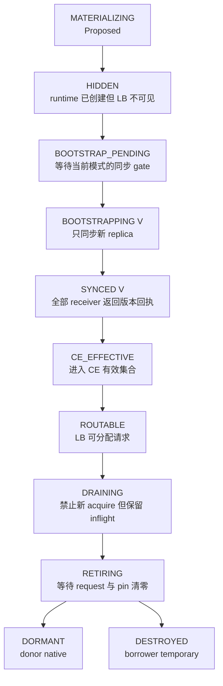

状态之外还必须保存以下正交字段。不同模式不要求保存完全相同的字段：

```text
sync_pins[replica_id, sync_epoch]
lifecycle_pins[replica_id, operation_id]
operation_id
sync_epoch
routing_epoch
lease_epoch
last_synced_weight_version
bootstrap_target_version
native_sync_block_token
replica_sync_gate_owner
```

本文对上述字段作如下定义：

- `operation_id` 是 `TaskRunner` 为一次 ADD 或 REMOVE 事务保存的幂等标识；重试同一事务时，该标识保持不变；
- `lease_epoch` 是 `GroupScheduler` 为同一组 node ID/GPU IDs 递增的租约代次；任务必须拒绝旧代次命令和回执；
- `routing_epoch` 是 LB 每次提交 server 集合变化后返回的路由代次；调用方使用该代次识别过期路由回执；
- `sync_epoch`、`sync_pins` 和 `native_sync_block_token` 服务 HYBRID 的 immutable sync snapshot 与 weight-version gate；
- `lifecycle_pins` 记录生命周期操作仍持有的 replica 引用；
- `replica_sync_gate_owner` 记录 STANDALONE + Fully Async 当前持有 replica-sync gate 的 operation ID、操作类型和超时信息；该字段
  不是 Ray ActorHandle，也不是新的通信组件。

本文把 **fencing（代次隔离）**定义为组件依据 task session、operation ID、lease epoch 或 routing epoch 拒绝旧命令、旧回执和旧
wake 请求的校验机制。fencing 不负责加锁；fencing 只阻止过期操作修改当前状态。

本文把 **effective membership（有效成员集合）**定义为已经完成明确版本 bootstrap、并且具备参数同步接收端的 replica ID 集合。
STANDALONE + Fully Async 第一版只把该集合实现为 CE 内唯一的 `effective_replicas`。ADD/REMOVE 命令在等待 gate 时保存在 TaskRunner
operation journal 中，不再复制为 CE desired membership。HYBRID 章节继续使用 **desired membership（目标成员集合）**记录下一次
H4 希望使用的成员，并从 effective membership 冻结 immutable sync snapshot。

本文把 **lifecycle snapshot（生命周期快照）**定义为一次 abort/sleep/wake 操作开始前冻结的 replica 元组。lifecycle snapshot
只保护本次生命周期遍历，不决定下一次参数同步的权重接收端，也不隐含 CE/LB REMOVE 或 runtime 销毁。

`BOOTSTRAPPING` 不代表已经有正确权重，`CE_EFFECTIVE` 不代表 LB 已经可路由，`DRAINING` 也不代表没有请求；这些状态不能
互相代替。bootstrap 失败、超时或 LB ADD 失败时，新 replica 必须保持 `HIDDEN/FAILED`，回滚 effective membership 并释放当前
模式的 gate owner，不能无限阻塞原生同步。

### 2.3 必须成立的安全谓词

记：

- `E`：已经完成 bootstrap、可被原生参数同步遍历的 effective membership；
- `D`：仅 HYBRID 使用的 CE desired membership；
- `S(e)`：仅 HYBRID 使用的 sync epoch `e` immutable replica snapshot；
- `I(r)`：LB 对 replica `r` 记录的 inflight 数；
- `Q(r)`、`R(r)`：backend queued / running request 数；
- `P_sync(r)`、`P_life(r)`：HYBRID sync pin 与通用 lifecycle pin 数；
- `W(r)`：replica 已确认权重版本；
- `V_serving`：当前所有稳定 `ROUTABLE` replica 使用的已发布权重版本；
- `G_standalone`：STANDALONE + Fully Async task-local replica-sync gate；
- `B_hybrid`：HYBRID task-local weight-version gate。

新 replica 的 bootstrap 数据源约束：

```text
BootstrapSource(r, V_serving) = PublishedWeightSnapshot(V_serving)
BootstrapSource(r, V_serving) != CurrentTrainerLiveWeights(t)
```

`PublishedWeightSnapshot` 的定义见第 1.3 节。两类 gate 都是 TO-BE task-local 协议。

除非能够证明自 `V_serving` 发布后 trainer 没有发生任何参数更新，否则 live weights 不能作为同版本 bootstrap 数据源。

ROUTABLE 提交条件：

```text
CanCommitRoutable(r, V_serving) =
    LeaseValid(r)
    and RuntimeHealthy(r)
    and State(r) == SYNCED
    and W(r) == V_serving
    and BootstrapTarget(r) == V_serving
    and r in E
    and RoutingState(r) == HIDDEN
    and not ValidationTopologyFrozen
    and HoldsModeSyncGate(r)
```

`HoldsModeSyncGate(r)` 表示 ADD 事务持有该模式规定的同步 gate：STANDALONE 持有 `G_standalone`，HYBRID 持有
`B_hybrid` 及其模式要求的 membership/rollout-admission token。

STANDALONE + Fully Async 的单集合不变量是：

```text
Holds(G_standalone, native_sync)
  => E 在 update_weights() 从入口到返回期间不变

Holds(G_standalone, add(r)) 且 LB 已返回 ROUTABLE
  => r in E

Holds(G_standalone, remove(r)) 且 CE REMOVE 已返回
  => r not in E
```

STANDALONE native sync 不创建或维护独立 `native_sync_snapshot`。`CheckpointEngineManager.update_weights()` 在持有
`G_standalone` 的整个区间内直接遍历同一个 `effective_replicas`；任何 ADD、REMOVE 和回滚都必须等待 gate。STANDALONE 的
`NativeSyncReceipt(V)` 只需要记录目标版本、完成状态和必要指标，不需要保存第二份成员集合。

HYBRID 仍在 H4 冻结：

```text
S(e_native) = immutable_tuple(E)
```

本文把 HYBRID 的 `NativeSyncReceipt(V, S)` 定义为一次原生参数同步的 Proposed 完成回执。该回执至少记录目标版本 V、immutable
sync snapshot S、sync epoch 和每个 receiver subset 的完成状态。borrower 只有在该回执表明全部 subset 成功后，才能发布新的
`V_serving`。

HYBRID partial temporary replica 同样遵守 `r in E`。只要它在 H4 snapshot freeze 前仍为 effective，就必须进入
`S(e_native)`，并与 native replica 在同一个 `NativeSyncReceipt` 中原子发布。snapshot 已经冻结后到达的 ADD 或 REMOVE 只能影响
下一个 snapshot，不能修改当前 `S(e_native)`。

STANDALONE 物理销毁条件：

```text
CanDestroyStandalone(r) =
    IsBorrowerTemporary(r)
    and RoutingState(r) == DRAINING
    and NewAcquireDisabled(r)
    and I(r) == 0
    and Q(r) == 0
    and R(r) == 0
    and P_life(r) == 0
    and r not in E
    and CEEffectiveRemoveReceipt(r)
```

`CEEffectiveRemoveReceipt(r)` 只能由持有 `G_standalone` 的 REMOVE 事务返回。native sync 也在整个
`CheckpointEngineManager.update_weights()` 期间持有同一把 gate，所以 REMOVE 获得该回执时，不存在仍在使用 r 的 STANDALONE
native sync。HYBRID 的销毁条件仍额外要求 `P_sync(r)==0`、`r not in D` 和 `r not in any_live_sync_snapshot`。

HYBRID donor 进入训练还需额外满足：

```text
CanEnterHybridTraining(donor_gpu_set) =
    DonorNativeReplicaSlept(donor_gpu_set)
    and NoBorrowerActiveComputeOn(donor_gpu_set)
    and (
        NoBorrowerRuntimeOn(donor_gpu_set)
        or BorrowerRuntimeSleepingAndCoexistenceVerified(donor_gpu_set)
    )
    and ResidualHBMWithinDonorTrainingBudget(donor_gpu_set)
    and GroupSchedulerAllowsTrainingEpoch(donor_gpu_set)
```

这里显式允许保留 sleeping borrowed runtime；但“sleep RPC 返回”本身不等于已证明可以与 donor training 共存。任何一个条件无法证明，
都只能返回 `DEFERRED` 或 `REJECTED`，不能把“命令已收到”解释为“GPU 已安全复用”。

### 2.4 AS-IS 为什么还不满足这些谓词

1. `CheckpointEngineManager.add_replicas()` / `remove_replicas()` 直接修改 `self.replicas`，见
   `verl/checkpoint_engine/base.py:430-445`；`update_weights()` 又在 abort、展平 worker、KV lifecycle、传权、finalize、resume
   多次重新读取该 list，见 `base.py:498-536`。STANDALONE 第一版可以保留这一份 list，但必须在外层使用 replica-sync gate 覆盖
   `update_weights()` 的整个调用区间，并禁止任何绕过 gate 的 ADD/REMOVE。HYBRID 仍缺少自己的 immutable `S(e)` 和 gate。
2. 非 naive sender 每次从 `self.actor.engine.get_per_tensor_param()` 读取 trainer 当前 live weights，见
   `verl/workers/engine_workers.py:749-758`；manager 没有 `bootstrap_replica(target, published_version)` 接口。代码虽定义
   `CheckpointEngineWithCache.get_weights()` 抽象，见 `checkpoint_engine/base.py:208-222`，当前 manager 主链没有按版本向指定新
   replica 重放权重的协议。
3. `GlobalRequestLoadBalancer.remove_servers()` 直接删除 server 和 inflight entry，见
   `verl/workers/rollout/llm_server.py:138-149`；client 的 release 又是 fire-and-forget，见
   `llm_server.py:226-229,288-289`，所以 entry 不存在不能证明 `I(r)=0`。
4. STANDALONE vLLM server 的 `sleep()` / `wake_up()` 当前明确跳过，见
   `vllm_async_server.py:770-800`；`release_kv_cache()` 也只有 TODO 空实现，见
   `vllm_async_server.py:813-823`，不能把 RPC 返回当作 HBM 已释放的证据。
5. 新 `vLLMHttpServer` 的 `global_steps` 初始为 `None`，见 `vllm_async_server.py:148-156`；`ServerAdapter` 只有在权重发送完成后
   才调用 `set_global_steps(global_steps)`，见 `vllm_rollout.py:232-243`。因此“runtime 已创建”本身不能作为版本正确或可路由回执。

## 3. 场景一：STANDALONE + Fully Async

本节讨论强制回收时，假定 `async_training.partial_rollout=True`；verl 的 Fully Async 示例配置默认如此，见
`verl/experimental/fully_async_policy/config/fully_async_ppo_trainer.yaml:21-23`。如果显式设为 `False`，
`FullyAsyncLLMServerClient` 在 aborted output 后不会 retry，见 `llm_server.py:448-454`，其物理回收约束应按第 5 节同步模式的
“只允许自然 drain”处理。

### 3.1 AS-IS 类图和组件引用关系

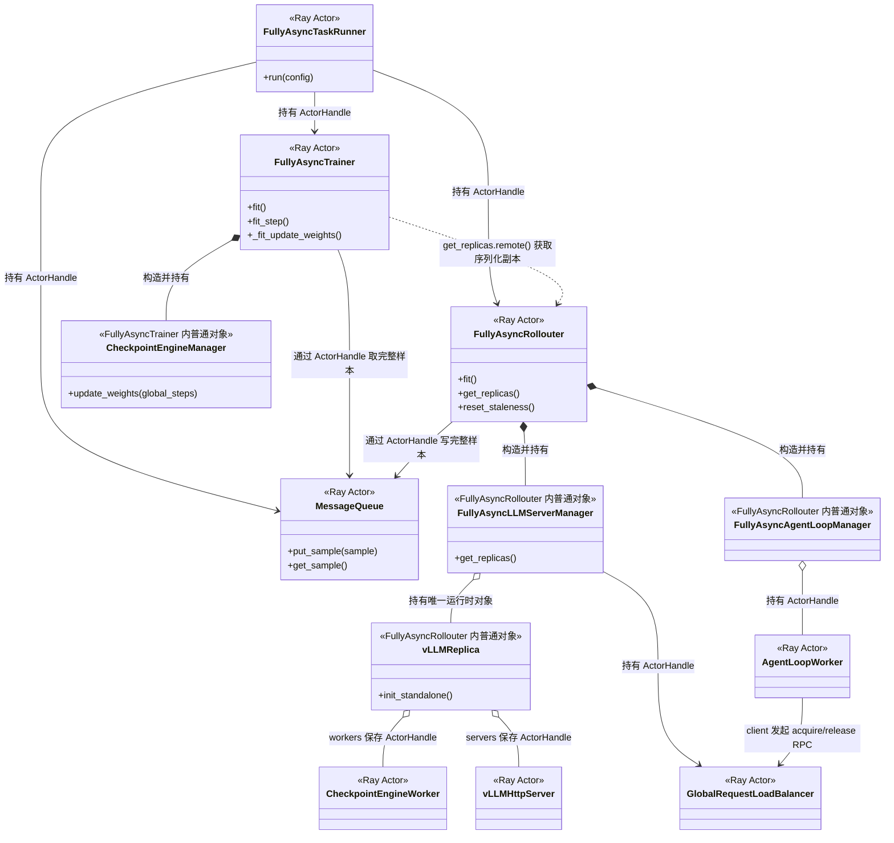

图中的每个实体都使用 verl AS-IS 的真实类名。图中的实线表示对象持有或 ActorHandle 持有，虚线表示一次远程调用产生的数据复制：

- `FullyAsyncTaskRunner` 是 `@ray.remote(num_cpus=1)`，见 `fully_async_main.py:35-49`；
- `FullyAsyncTrainer` 是 Ray Actor，见 `fully_async_trainer.py:53-58`；
- `FullyAsyncRollouter` 是 `max_concurrency=100` 的 Ray Actor，见 `fully_async_rollouter.py:329-335`；
- `MessageQueue` 是 Ray Actor，见 `message_queue.py:26-53`；
- `FullyAsyncLLMServerManager` 位于 `FullyAsyncRollouter` Actor 内。该 manager 持有唯一可执行的 runtime 对象和 server
  ActorHandle，见
  `fully_async_rollouter.py:819-856`；
- `FullyAsyncRollouter` 构造 `FullyAsyncAgentLoopManager`，见 `fully_async_rollouter.py:305-326,841-856`。该 manager 继承
  `AgentLoopManager`；基类把 `AgentLoopWorker` 包成 Ray ActorClass，再执行 `.remote()` 创建 worker Actor，见
  `verl/experimental/agent_loop/agent_loop.py:1166-1221`；
- `FullyAsyncTrainer` 通过 `await self.rollouter.get_replicas.remote()` 得到序列化的 `RolloutReplica` 副本，再构造本 Actor 内的
  `CheckpointEngineManager`，见 `fully_async_trainer.py:217-224`。

最后一条引用关系决定了 Fully Async 不能通过一个普通对象修改全部视图。`FullyAsyncRollouter` 持有 manager/LB 运行时视图，
`FullyAsyncTrainer` 持有 CE 同步视图。TO-BE 扩缩容协议必须让现有两个 Actor 交换带 operation ID 的准备回执和提交回执；该协议
不需要新增通信 Actor。

### 3.2 AS-IS 训练、rollout 与参数同步流程

设 `K = async_training.trigger_parameter_sync_step`。AS-IS 时序是：

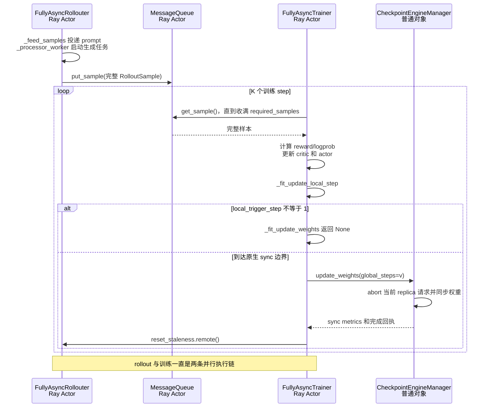

图中的流程按以下顺序执行：

1. `FullyAsyncRollouter._feed_samples()` 把 dataloader prompt 放入 `pending_queue`，见
   `fully_async_rollouter.py:859-890`。
2. `FullyAsyncRollouter._processor_worker()` 按 `max_concurrent_samples` 创建生成任务，见
   `fully_async_rollouter.py:902-990`。`FullyAsyncRollouter` 只把完整 `RolloutSample` 写入 `MessageQueue`，见
   `fully_async_rollouter.py:991-1015`。
3. `FullyAsyncTrainer` 从 `MessageQueue` 收满 `required_samples` 后组装训练 batch，见
   `fully_async_trainer.py:375-452,643-652`。
4. `FullyAsyncTrainer` 在第 K 次训练更新后递增参数版本，并调用 `CheckpointEngineManager.update_weights()`，见
   `fully_async_trainer.py:676-701,729-756`。
5. 非 naive STANDALONE `CheckpointEngineManager` abort 当前 replica 集合、创建临时 `RayWorkerGroup`、传输权重、finalize
   接收端并恢复生成，见 `checkpoint_engine/base.py:486-538`。
6. 参数同步返回后，`FullyAsyncTrainer` 调用 `FullyAsyncRollouter.reset_staleness()`。`FullyAsyncRollouter` 根据仍在执行的生成任务和
   `MessageQueue` backlog 重置 `staleness_samples`，然后解除 pause，见 `fully_async_rollouter.py:594-638`。

rollouter 还有显式 backpressure：

```text
max_required_samples = int(
    required_samples * (staleness_threshold + 1) * K
)
```

`FullyAsyncRollouter` 在 `fully_async_rollouter.py:491-507` 定义并计算该上限。队列满或
`staleness_samples >= max_required_samples` 时，`FullyAsyncRollouter` 停止继续投递，见
`fully_async_rollouter.py:1142-1164`。因此 Fully Async 会持续并发执行 rollout，但 backpressure 会限制在途样本数量。动态扩缩容
还必须让 `FullyAsyncRollouter` 同步更新实际并发容量 `max_concurrent_samples`。

### 3.3 TO-BE scaling 互斥规则和实现方式

STANDALONE + Fully Async 第一版只新增两个核心对象：

- **`effective_replicas`（有效 replica 集合）**：`FullyAsyncTrainer` 进程内 CE 唯一维护的成员集合。该集合只包含已经完成明确版本
  bootstrap、并且具备参数同步接收端的 replica；
- **`replica-sync gate`（replica 同步门）**：`FullyAsyncTrainer` 持有的 task-local 排他锁。bootstrap、CE ADD/REMOVE、ADD 的
  LB `ROUTABLE` 提交或回滚以及 verl 原生参数同步都必须获得同一把 gate。

第一版不维护 CE desired membership，不维护独立 membership gate，也不为 native sync 复制 `native_sync_snapshot`。
实现可以直接把 `CheckpointEngineManager.self.replicas` 封装为本文的 `effective_replicas`；两个名称指向同一份 CE 成员状态，不是
两份集合。
`MultiTaskFullyAsyncTaskRunner`（Proposed）仍在 operation journal 中保存等待执行的 ADD/REMOVE 命令；operation journal 记录控制事务，
但 operation journal 不是第二份 CE 成员集合。

#### 3.3.1 第一版执行规则

1. **CREATE 只创建隐藏 runtime。**`FullyAsyncRollouter` 可以在 rollout、trainer 取样、trainer 计算或原生参数同步期间创建隐藏
   runtime。CREATE 不修改 `effective_replicas`、LB 或并发容量，所以 CREATE 不获取 replica-sync gate。`GroupScheduler` 必须在
   CREATE 前为目标 node ID/GPU IDs 建立排他 lease。
2. **原生参数同步端到端持有 gate。**`FullyAsyncTrainer` 在调用 `CheckpointEngineManager.update_weights()` 前获得 replica-sync
   gate。`FullyAsyncTrainer` 只有在 CE 完成 abort、worker 展平、KV lifecycle、process-group 构建、传权、finalize、resume 和
   `V_serving` 发布后才释放 gate。CE 在该区间内可以多次读取同一个 `effective_replicas`，因为任何 ADD/REMOVE 都不能修改该集合。
3. **ADD 等待正在执行的原生同步。**ADD 可以提前完成隐藏 runtime 创建。ADD 只有在获得 replica-sync gate 后才能确定
   `V_serving`、执行 target-only bootstrap、把新 replica 加入 `effective_replicas` 并提交 LB `ROUTABLE`。原生参数同步先持有 gate
   时，ADD 等原生同步发布 `V_next`，然后只把新 replica bootstrap 到最新 `V_next`。
4. **ADD 在同一个 gate 区间内提交或回滚。**`FullyAsyncTrainer` 先验证全部 bootstrap receiver 回执，再把新 replica 加入
   `effective_replicas`。`FullyAsyncRollouter` 随后校验 runtime health、提交 LB 和更新 `max_concurrent_samples`。LB 提交失败时，
   `FullyAsyncTrainer` 必须在释放 gate 前从 `effective_replicas` 删除该 replica；任何原生同步都看不到半提交成员。
5. **REMOVE 先摘流，再等待 gate。**`FullyAsyncRollouter` 可以在任意时刻让 LB 把目标 server 标为 `DRAINING`。borrower 随后通过
   partial abort 或自然 drain 等待 LB inflight 和 backend queued/running 归零。`FullyAsyncTrainer` 最后获得 replica-sync gate，
   直接从 `effective_replicas` 删除目标 replica，并返回 CE remove receipt。原生参数同步正在执行时，REMOVE 等该同步完整返回；
   REMOVE 不需要 desired membership、sync pin 或 snapshot unpin。
6. **DESTROY 依赖 CE remove receipt 和请求排空。**`FullyAsyncRollouter` 只有同时收到 CE remove receipt、LB inflight=0、backend
   queued/running=0 和 lifecycle operation 完成证明后，才能删除 LB entry、销毁 borrower temporary runtime 并减少
   `max_concurrent_samples`。CE remove receipt 证明当前 native sync 已经结束，后续 native sync 也不会再遍历该 replica。
7. **validation 默认冻结可见拓扑。**validation 期间，`FullyAsyncRollouter` 可以准备隐藏 runtime，TaskRunner 可以在 operation
   journal 中记录 ADD/REMOVE；ADD 不提交 `ROUTABLE`，REMOVE 不删除 validation 仍使用的最后一个 LB entry。

三类竞态可以验证上述规则：

- native sync 先获得 replica-sync gate 时，ADD 等同步发布 `V_next` 后只给新 replica bootstrap `V_next`，再把新 replica 加入
  `effective_replicas` 和 LB；
- ADD 先获得 replica-sync gate 时，ADD 先把新 replica bootstrap 到当前 `V_serving`，再提交 CE 和 LB。native sync 随后获得 gate，
  直接遍历已经包含新 replica 的 `effective_replicas`，并把全部成员更新到 `V_next`；
- REMOVE 在 native sync 期间到达时，LB 可以先停止向目标 server 分配新请求。CE REMOVE 等 native sync 释放 gate 后才从
  `effective_replicas` 删除目标 replica；REMOVE 获得 CE remove receipt 后不再等待 sync pin。

#### 3.3.2 第一版成立约束

第一版单集合、单 gate 模型必须满足以下约束：

1. `FullyAsyncTrainer` 是 `effective_replicas` 的唯一写入者。`FullyAsyncRollouter`、TaskRunner 和 `GroupScheduler` 都不能直接修改
   该集合。
2. CE ADD、CE REMOVE、ADD 失败回滚和 native sync 必须通过同一个 `replica-sync gate` 入口。任何代码都不能绕过该入口直接调用
   `CheckpointEngineManager.add_replicas()` 或 `remove_replicas()`。
3. native sync 必须在整个 `CheckpointEngineManager.update_weights()` 调用期间持有 gate。只在 worker 展平前短暂读取或锁住 list
   不能满足该约束。
4. ADD 必须在 bootstrap 成功后才写入 `effective_replicas`，并且必须在 LB `ROUTABLE` 成功或完成回滚后才释放 gate。
5. REMOVE 必须在请求排空后获得 gate，并删除 CE member。runtime teardown 必须等待 CE remove receipt；否则 Rollouter 可能销毁仍被
   Trainer CE 使用的 worker ActorHandle。
6. `effective_replicas` 必须由 CE 自己封装，并使用稳定 replica ID 执行幂等 ADD/REMOVE。外部代码不能保存并原地修改该集合的 list
   alias；当前 `remove_replicas()` 会重新绑定 `self.replicas`，见 `checkpoint_engine/base.py:438-445`。
7. `PublishedWeightSnapshot(V_serving)` 仍必须提供稳定的 bootstrap 数据源。replica-sync gate 只串行同步事务；该 gate 本身不能把可能
   领先的 trainer live weights 变成旧 serving version。
8. `FullyAsyncTrainer` 持锁等待 `FullyAsyncRollouter` 的 LB 回执时，Rollouter 不能同步回调一个需要同一把 gate 的 Trainer 方法。
   TaskRunner 必须使用 operation ID、lease epoch、超时和幂等查询避免跨 Actor 循环等待与不确定提交。
9. 单 gate 会串行多个 ADD、REMOVE 和 native sync。第一版接受这项吞吐代价，以换取更小的状态空间和更清晰的失败回滚。

#### 3.3.3 下一步改进方向

第一版实现和压测完成后，项目可以按以下顺序演进：

1. 项目先记录 `replica_sync_gate_wait_seconds`、native sync duration、bootstrap duration、pending scaling count 和最长 gate owner。
   指标能够证明单 gate 是否真正成为吞吐瓶颈。
2. TaskRunner 可以把同一时刻到达的多个 ADD/REMOVE 合并成一个批量事务，在一次 gate 区间内更新 `effective_replicas` 和 LB，减少
   重复 process-group 与跨 Actor RPC 开销。
3. 项目只有在单 gate 的等待时间不可接受时，才引入独立 epoch snapshot、membership gate、desired membership 和 sync pin。届时
   native sync 可以冻结 immutable snapshot 后允许下一轮 CE 成员变更，但实现必须重新解决 snapshot 生命周期、runtime pin、失败
   恢复和两轮成员视图并存问题。
4. 参数同步后端若能证明 PublishedWeightSnapshot 不可变、target receiver topology 相互独立且通信资源不冲突，项目可以进一步评估
   多个 target-only bootstrap 并行执行。该优化不能从“receiver 不同”直接推导，必须验证 sender、NCCL/process group 和 HBM 带宽
   是否共享。
5. 项目应把 operation journal 持久化或加入 Actor restart reconcile。恢复逻辑需要比较 manager registry、
   `effective_replicas`、LB routing epoch 和 GroupScheduler lease epoch，再决定重放、回滚或隔离未完成事务。

verl AS-IS 尚未提供 replica-sync gate 和跨 Actor operation journal。当前 `CheckpointEngineManager.update_weights()` 在一次调用中多次
读取可变 `self.replicas`，见 `checkpoint_engine/base.py:498-536`。第一版不要求修改该方法以创建第二份 snapshot；子仓只需要保证
外层 gate 覆盖完整调用，并把所有成员变更收口到同一入口。

### 3.4 Fully Async ADD：跨 Trainer / Rollouter Actor 的提交协议

以下时序描述 TO-BE ADD 事务。本文把 **sync descriptor（同步描述）**定义为 CE 定位一个 replica 全部权重接收端所需的可序列化
标识和 ActorHandle 集合。`PreparedReplica`（已准备 replica 描述）是 Proposed 数据结构；该描述携带 replica ID、server
ActorHandle 和 sync descriptor，但不转移 runtime ownership。`BootstrapReceipt`（bootstrap 回执）也是 Proposed 数据结构；该回执
记录 replica ID、目标权重版本、operation ID、lease epoch 和全部接收端的完成状态。

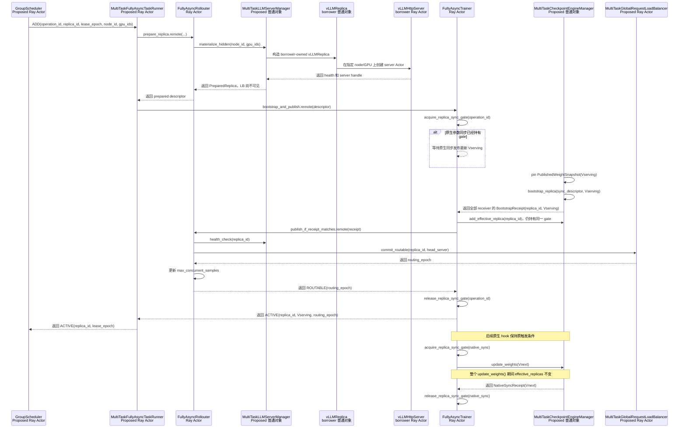

图中的流程按以下顺序提交新 replica：

1. `GroupScheduler` 把 node ID/GPU IDs 租约和幂等 operation ID 发送给 `MultiTaskFullyAsyncTaskRunner`。
2. `MultiTaskFullyAsyncTaskRunner` 调用 `FullyAsyncRollouter`。`FullyAsyncRollouter` 再调用其进程内的
   `MultiTaskLLMServerManager`，让 manager 创建 borrower-owned `vLLMReplica` 和 `vLLMHttpServer`。manager 只登记隐藏 runtime，
   不把 server 加入 LB。`PreparedReplica` 只携带可序列化的 replica ID、server ActorHandle 和 sync descriptor；该数据结构不会把
   runtime ownership 从 `FullyAsyncRollouter` 转移给 `FullyAsyncTrainer`。
3. `FullyAsyncTrainer` 获得 replica-sync gate。原生参数同步已经持有 gate 时，`FullyAsyncTrainer` 等待原生参数同步完成，并把
   bootstrap 目标改为最新 `V_serving`。
4. `MultiTaskCheckpointEngineManager` pin `PublishedWeightSnapshot(V_serving)`，并且只向新 replica 的接收端传输该版本。
5. 全部接收端返回同一版本后，`MultiTaskCheckpointEngineManager` 生成 `BootstrapReceipt`。`FullyAsyncTrainer` 在仍持有同一把
   replica-sync gate 时把新 replica 加入 `effective_replicas`。
6. `FullyAsyncTrainer` 把 bootstrap 回执发送给 `FullyAsyncRollouter`。`FullyAsyncRollouter` 校验 operation ID、lease epoch 和
   runtime health，然后让 LB 把 head server 提交为 `ROUTABLE`。
7. LB 返回 `routing_epoch` 后，`FullyAsyncRollouter` 增加 `max_concurrent_samples`。在此之前，隐藏 runtime 不计入可分配容量。
8. `FullyAsyncTrainer` 收到 `ROUTABLE` 回执后释放 replica-sync gate。下一次 verl 原生参数同步获得该 gate 后，直接遍历已经包含
   新 replica 的 `effective_replicas`。
9. `MultiTaskFullyAsyncTaskRunner` 只在上述步骤全部成功后向 `GroupScheduler` 返回 `ACTIVE`。任何步骤失败时，TaskRunner 都必须让
   borrower 回滚 LB entry 和 CE effective membership，并保持 lease 不可复用，直到 runtime teardown 返回明确回执。

该流程复用 `FullyAsyncTaskRunner`、`FullyAsyncTrainer`、`FullyAsyncRollouter` 和 LB 的现有通信关系。子仓只扩展这些 Actor 的
接口和 task-local 普通对象，不引入新的通信 Actor。`FullyAsyncTrainer` 负责版本和 CE 提交；`FullyAsyncRollouter` 负责 runtime、
LB 和容量提交；`MultiTaskFullyAsyncTaskRunner` 使用同一个 operation ID 串联两个 Actor 的回执。

### 3.5 Fully Async REMOVE：摘流、续推和销毁

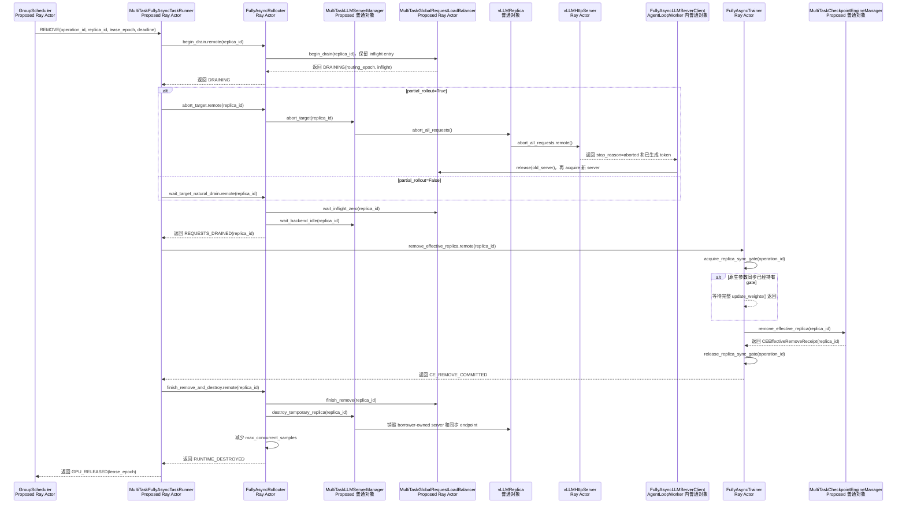

图中的 REMOVE 流程包含以下约束：

1. `MultiTaskGlobalRequestLoadBalancer.begin_drain()` 先停止新 acquire，但该方法保留 server handle 和 inflight counter。后到的
   client release 仍然能够把 inflight 计数减到 0。
2. `async_training.partial_rollout=True` 时，`FullyAsyncRollouter` 对目标 replica 执行 abort；
   `FullyAsyncLLMServerClient` 把已生成 token 保存在当前 Python coroutine frame，并通过 LB 选择其他非 DRAINING server 续推。该复用要求
   `async_training.partial_rollout=True`，见 `llm_server.py:345-461`。
3. `async_training.partial_rollout=False` 时，`FullyAsyncRollouter` 不强制 abort；该 Actor 等目标 replica 的请求自然结束。
4. `FullyAsyncRollouter` 同时等待 LB inflight 归零和 backend queued/running 归零。任一计数非零时，TaskRunner 都不会请求 CE
   REMOVE，也不会让 manager 销毁 runtime。
5. `FullyAsyncTrainer` 获得 replica-sync gate。原生参数同步已经持有 gate 时，REMOVE 等整个 `update_weights()` 返回。
   `MultiTaskCheckpointEngineManager` 随后直接从 `effective_replicas` 删除目标 replica，并返回 CE remove receipt。该流程不创建
   desired membership，也不等待 sync snapshot unpin。
6. `FullyAsyncRollouter` 只有收到 CE remove receipt 后，才让 LB 删除 draining entry、让 manager 销毁 borrower temporary
   replica，并减少
   `max_concurrent_samples`。
7. `MultiTaskFullyAsyncTaskRunner` 收到 runtime 销毁回执后，才通知 `GroupScheduler` 释放物理 GPU lease。

现有 `CheckpointEngineManager.update_weights()` 会在末尾恢复当前 `self.replicas`，见 `checkpoint_engine/base.py:532-536`。
REMOVE 如果在原生同步期间先执行 begin-drain，当前同步仍可能在返回前恢复目标 replica；LB 的 DRAINING 状态必须继续阻止新 acquire。
REMOVE 等请求再次排空并获得 replica-sync gate 后，才能删除 CE member。verl AS-IS 没有该两阶段状态判断。

### 3.6 数值例子：版本 20 bootstrap、版本 21 原生同步、版本 22 缩容

假设 borrower 任务配置：

```text
2 个 STANDALONE replica：R0、R1
每个 replica = 4 GPU
concurrent_samples_per_replica = 16
required_samples = 32
K = trigger_parameter_sync_step = 4
staleness_threshold = 0.25
max_required_samples = int(32 * 1.25 * 4) = 160
初始 max_concurrent_samples = 2 * 16 = 32
```

扩容例子：

1. 当前 rollout serving version 是 `v20`，trainer 已执行本周期第 2 个训练 step；因此 trainer live weights 通常已经不等于
   `PublishedWeightSnapshot(v20)`，R0、R1 仍以 `v20` 并行生成。
2. `GroupScheduler` 为 donor GPU `[node-D, GPU4..7]` 签发 lease。borrower 的 `MultiTaskLLMServerManager` 创建 B2，但 manager 让
   B2 保持 `HIDDEN`。
3. `FullyAsyncTrainer` 获得 replica-sync gate。`MultiTaskCheckpointEngineManager` pin `v20`，并且只向 B2 的全部 receiver 重放
   `v20`。R0/R1 不被 abort，也不参与本次传输。
4. B2 的全部 receiver 返回 `W(B2)=v20` 后，`FullyAsyncTrainer` 在同一 gate 区间内把 B2 加入 `effective_replicas`，再请求 LB ADD
   和容量更新。LB 把 B2 标为 `ROUTABLE`，`FullyAsyncRollouter` 把 `max_concurrent_samples` 从 32 更新为 48。
5. 第 4 个训练 step 结束后，`FullyAsyncTrainer._fit_update_weights()` 仍按 K 周期请求同步 `v21`。
   `FullyAsyncTrainer` 获得 replica-sync gate 后，`MultiTaskCheckpointEngineManager` 在整个 `update_weights()` 中直接遍历
   `effective_replicas={R0,R1,B2}`，并把三个 replica 一起更新到 `v21`。
6. 如果原生 `v21` sync 先获得 gate，B2 bootstrap 等该同步完成，再只向 B2 重放最新 `v21`，随后提交为 `ROUTABLE`。B2 不等待
   `v22`；bootstrap 也不会把 trainer 尚未发布的 live weights 标成 `v21`。

缩容例子：

1. 在权重 `v22` 下，B2 有 5 个 inflight 请求，分别已经产生 `64/80/96/128/160` 个 token。
2. LB 对 B2 执行 begin-drain 后不再向 B2 分配新请求，但 LB 保留 `I(B2)=5`。
3. borrower 对 B2 执行 targeted abort。五个 `FullyAsyncLLMServerClient.generate()` 协程把 token prefix 保存在各自 Python
   coroutine frame，随后从 LB 重新 acquire R0/R1；已完成并进入 `MessageQueue` 的 32 个训练样本不受影响。
4. 五个旧 attempt 的 fire-and-forget release 全部到达后 `I(B2)=0`，backend 也确认 `Q(B2)=R(B2)=0`。
5. `FullyAsyncTrainer` 请求 replica-sync gate。原生同步正在执行时，REMOVE 等整个 `update_weights()` 返回；随后 CE 直接从
   `effective_replicas` 删除 B2。REMOVE 不创建 desired membership，也不等待 snapshot unpin。
6. `MultiTaskLLMServerManager` 销毁 B2，`FullyAsyncRollouter` 把 `max_concurrent_samples` 从 48 调回 32，随后
   `MultiTaskFullyAsyncTaskRunner` 通知 `GroupScheduler` 释放 GPU lease。

这个例子同时说明：`MessageQueue.queue_size==0`、`LB inflight==0`、`active_tasks==0` 是不同观测；其中任何一个单独为 0 都不足以
证明 runtime 可销毁。

### 3.7 当前实现能复用什么，缺什么

| 项目 | AS-IS 可复用能力 | GAP / TO-BE |
|---|---|---|
| 持续 rollout 与训练并行 | `FullyAsyncTrainer` / `FullyAsyncRollouter` 双 Actor | 需要跨 Actor scaling transaction ID 和回执 |
| partial abort/retry | `partial_rollout=True` 时复用 `FullyAsyncLLMServerClient`，`llm_server.py:345-461` | 需要 per-replica 摘流、请求 drain 证据；关闭 partial 时不得强制 abort |
| 原生参数同步 | STANDALONE 非 naive CE，`checkpoint_engine/base.py:486-538` | 第一版由 replica-sync gate 覆盖整个调用并直接遍历唯一 `effective_replicas`；不另建 native snapshot |
| 新实例 bootstrap | 无 target-only manager API；sender 读取 trainer live weights | 需要按 `V_serving` 重放的 published snapshot、target receiver topology 和 bootstrap/native gate |
| 版本语义 | server 输出携带 `global_steps` | bootstrap 不递增版本、不 reset staleness；native publish 才改变 `V_serving` |
| 动态容量计数 | `FullyAsyncRollouter._update_max_concurrent_samples()`，`fully_async_rollouter.py:1274-1294` | true-new STANDALONE add/remove 也必须调用；当前只连到既有接口 |
| manager add/remove | experimental manager 支持预注册 HYBRID replica，`fully_async_rollouter.py:144-259` | `FullyAsyncLLMServerManager` 只从 `hybrid_replicas` 取对象，不会动态创建 STANDALONE runtime |
| HBM donation | 有 STANDALONE server 对象 | vLLM STANDALONE sleep/wake 是 no-op，无法证明显存已让出 |
| 控制 RPC | `FullyAsyncTaskRunner` 持有 trainer/rollouter handles | `FullyAsyncTaskRunner` 是同步 Ray Actor，`run()` 长时间阻塞；需 control concurrency group 或等价可达入口 |

## 4. 场景二：HYBRID + partial rollout

该场景固定为 `trainer.v1.trainer_mode=colocate_async` 与 `RolloutMode.HYBRID` 的组合。前者选择
`PPOTrainerColocateAsync` 并启用 partial client，后者说明训练和 native rollout engine 位于同一组训练 worker 进程/GPU；不能因
trainer mode 名称包含 `colocate` 就把该 trainer mode 写成 `RolloutMode.COLOCATED`。注册与 client 选择见
`verl/trainer/ppo/v1/trainer_colocate_async.py:25-34`，HYBRID replica 分支见
`verl/workers/rollout/llm_server.py:549-577`、`verl/workers/rollout/replica.py:131-141`。

本节采用用户最新确认的 **persistent-borrow policy（跨 step 保留策略）**：borrower temporary replica 可以跨过 borrower 的
`on_sample_end()`、training、H4 参数同步和外层 step。`on_sample_end()` 只让当时 lifecycle snapshot 中的 replica abort/sleep。
只要 `GroupScheduler` 没有发出 recall 且 lease 仍有效，borrowed replica 的 manager/CE/LB 引用、runtime 和 lease 都可以保留。H4
必须冻结包含 fixed native 与 effective borrowed replica 的 immutable sync snapshot；H4 联合更新成功后，H5 resume retained
borrowed replica，下一 step 继续复用该 runtime。

### 4.1 AS-IS 类图和组件引用关系

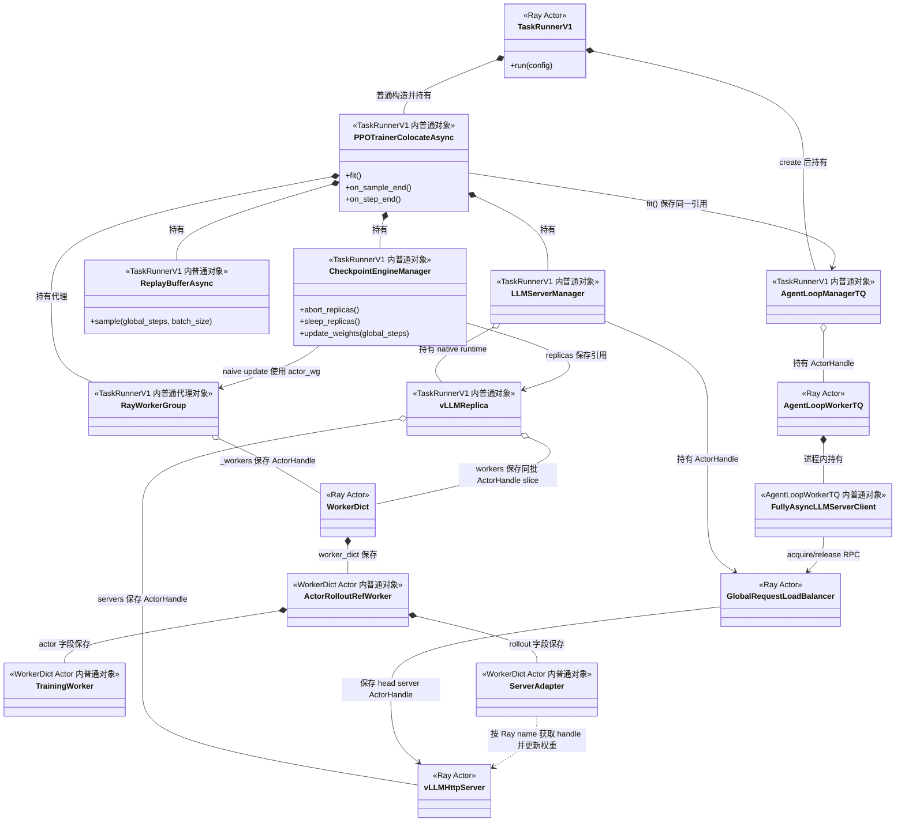

图中只有 `TaskRunnerV1`、`WorkerDict`、`AgentLoopWorkerTQ`、`vLLMHttpServer` 和运行时包装后的
`GlobalRequestLoadBalancer` 是 Ray Actor。其他实体是 Ray Actor 进程内普通对象或本地代理对象；类名包含 worker、manager 或
trainer 不会使 Python 对象自动成为 Ray Actor：

- `run_ppo()` 创建 `TaskRunnerV1` Actor 并等待 `run.remote()`；`run()` 在该 Actor 进程内普通构造
  `PPOTrainerColocateAsync`、初始化 `AgentLoopManagerTQ` 并调用 `fit()`，见
  `verl/trainer/main_ppo.py:77-94,103-156`；
- `TaskRunnerV1` 把 `AgentLoopManagerTQ` 保存到 `self.agent_loop_manager`，然后把同一个普通对象传给
  `PPOTrainerColocateAsync.fit()`；`PPOTrainer.fit()` 再把该引用保存到 `self.agent_loop_manager`，见
  `main_ppo.py:107-132,153-156`、`trainer_base.py:387-393`；
- `PPOTrainer` 在本进程构造 `ReplayBufferAsync`，见 `trainer_base.py:125-188`；初始化时构造
  `RayWorkerGroup`、`LLMServerManager` 与 `CheckpointEngineManager`，见 `trainer_base.py:217-299,311-369`；
- `create_colocated_worker_cls()` 动态定义并 `ray.remote(WorkerDict)`；`WorkerDict.__init__()` 再普通构造
  `ActorRolloutRefWorker`，见 `verl/single_controller/ray/base.py:988-1029`；后者在同一 Actor 进程内构造
  `TrainingWorker` 和 `ServerAdapter`，见 `engine_workers.py:446-470,585-682`；
- `LLMServerManager` 持有 `vLLMReplica` 普通对象。`vLLMReplica.init_hybrid()` 从 `RayWorkerGroup.workers` 切出同一批
  `WorkerDict` ActorHandle，再按这些 worker 的 node ID/GPU ID 创建 `vLLMHttpServer` Actor，见
  `replica.py:93-141`、`vllm_async_server.py:1116-1198`；
- `LLMServerManager._init_global_load_balancer()` 才执行 `ray.remote(load_balancer_cls).remote(...)`，所以实际运行的 LB 是
  Ray Actor，见 `llm_server.py:600-612`；
- `AgentLoopManagerTQ` 是 TaskRunner 内普通对象；`AgentLoopManagerTQ` 创建 `AgentLoopWorkerTQ` Actor，并把
  `FullyAsyncLLMServerClient` 序列化进这些 Actor，见 `agent_loop_tq.py:230-257`、
  `experimental/agent_loop/agent_loop.py:1166-1221`。

HYBRID 没有分离的 `FullyAsyncTrainer` 和 `FullyAsyncRollouter` 两个控制 Actor。manager、CE、trainer 和
`RayWorkerGroup` 代理都位于同一个 `TaskRunnerV1` Actor 进程。因此 ADD 不需要跨两个控制 Actor 提交。ADD 仍然必须等待远端
LB/server 回执，并且必须保护 lifecycle hook、扩缩容事务和原生参数同步共同访问的任务内状态。

该 AS-IS 类图只描述初始化创建的 native replica。borrower 按 node ID/GPU IDs 新建的 external replica 属于 TO-BE。该 replica 不属于
固定 `actor_rollout_wg`；该 replica 进入 effective membership 后，borrower 的 CE 扩展必须把该 replica 加入后续 immutable sync
snapshot。

### 4.2 AS-IS 外层 step、partial rollout 与参数同步流程

设 `P = trainer.v1.colocate_async.parameter_sync_step`。AS-IS 的一个外层 `global_steps=g` 包含 `P` 次 local PPO update，但只在
外层 step 末尾发布一次新 rollout 权重版本：

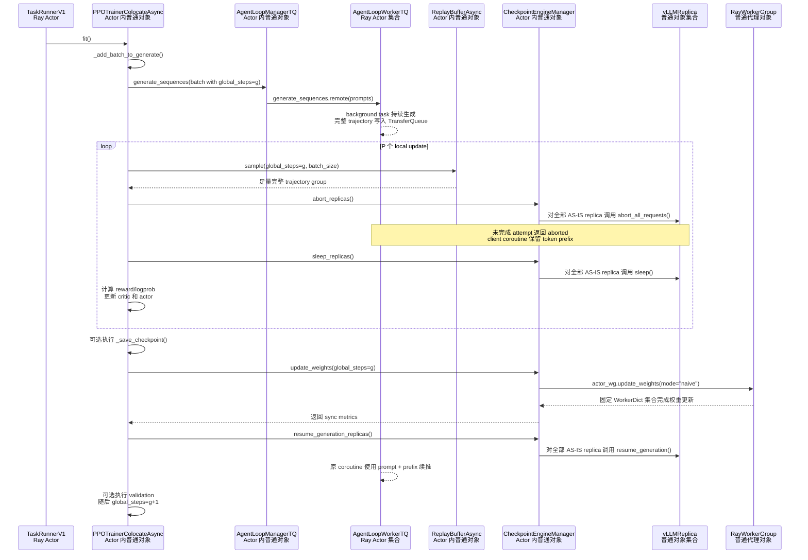

图中的 AS-IS 流程按以下顺序执行：

1. `PPOTrainer.fit()` 按 `step -> optional checkpoint -> on_step_end -> optional validation` 的顺序执行，见
   `trainer_base.py:441-476`。
2. `PPOTrainer.step()` 先把一批 prompt 交给 `AgentLoopManagerTQ`，再循环执行 P 次 `_step_once()`，见
   `trainer_base.py:509-534`。
3. `AgentLoopWorkerTQ.generate_sequences()` 启动 background task。所有 session 完成后，`AgentLoopWorkerTQ` 才把 prompt 标记为
   `finished`，并把完整 trajectory 写入 TransferQueue，见 `agent_loop_tq.py:52-148,177-227`。
4. 每次 `_step_once()` 只从 `ReplayBufferAsync` 取完整样本。`PPOTrainerColocateAsync.on_sample_end()` 随后让
   `CheckpointEngineManager` abort 并 sleep 全部 AS-IS replica，见 `trainer_base.py:536-586`、
   `trainer_colocate_async.py:55-59`。partial trajectory 不会直接进入 PPO batch。
5. `PPOTrainerColocateAsync` 完成 reward、logprob、critic 和 actor update 后进入下一次 local update。P 次 local update 全部完成后，
   `PPOTrainer.fit()` 可以保存 checkpoint。
6. `PPOTrainerColocateAsync.on_step_end()` 调用 `CheckpointEngineManager.update_weights(global_steps=g)`。初始化代码已经把 CE
   backend 强制设为 `naive`，见 `trainer_base.py:350-362`。naive manager 只调用固定
   `actor_wg.update_weights()`，见 `checkpoint_engine/base.py:486-496`。
7. `RayWorkerGroup` 把 `update_weights()` 远程调用分发到固定 `WorkerDict` Actor。`ActorRolloutRefWorker.update_weights()` 在
   `WorkerDict` Actor 进程内从 `TrainingWorker` 取得权重，并让 `ServerAdapter` 更新共进程 vLLM engine，见
   `engine_workers.py:719-805`、`vllm_rollout.py:209-243`。
8. 参数同步返回后，`PPOTrainerColocateAsync.on_step_end()` 调用 `resume_generation_replicas()`，见
   `trainer_colocate_async.py:48-53`。活跃的 `FullyAsyncLLMServerClient.generate()` coroutine 使用原 prompt 和已累计 prefix 续推。

源码中的 `on_sample_end()` 没有调用 `remove_replicas()`、LB `remove_servers()` 或 runtime teardown。因此
`on_sample_end()` 只改变 replica 的运行状态，不能注销 borrowed replica。TO-BE manager 必须把原生“遍历可变
`self.replicas`”替换为第 2.2 节定义的 lifecycle snapshot。lifecycle snapshot 解除 pin 后，borrowed replica 仍可保留在
effective membership 中。

如果当前 serving version 为 `v(g-1)`，本外层 step 投递的 prompt tag 已是 `global_steps=g`，直到 H4 才发布 `v(g)`。两类版本字段
不能混用：

```text
prompt tag global_steps
  = prompt 在哪个 trainer outer step 被投递

TokenOutput global_steps / min_global_steps / max_global_steps
  = 每个 generation attempt 实际使用的 rollout 权重版本
```

`FullyAsyncLLMServerClient` 在每次 attempt 后累计实际版本范围，见 `llm_server.py:397-460`；但
`ReplayBufferAsync` 当前的 off-policy 判定使用 prompt tag，而不是 `max_global_steps-min_global_steps`：

```text
prompt_age(g_train, g_prompt) = g_train - g_prompt + 1

drop:
  terminal prompt 在 prompt_age > max_off_policy_threshold 时淘汰

wait:
  pending/running prompt 在 prompt_age >= max_off_policy_threshold 时阻止取新 batch
```

实现见 `replay_buffer.py:497-579`。因此 `min/max_global_steps` 是真实跨版本观测证据，但 AS-IS sampler 的 staleness gate 不是直接按
该跨度计算；设计文档不能把二者写成同一个公式。

当 `P>1` 时，第一次 local update 的 `on_sample_end()` 已让当前 lifecycle snapshot 中的 replica sleep；后续 local update 依赖 warmup
或此前并发生成积累的完整样本。warmup 在 `on_train_begin()` 投递，见 `trainer_colocate_async.py:40-46`。这只改变 replica 的运行
状态，不改变其 effective membership：同一个 borrowed replica 可以在 P 次 local update 期间保持 sleeping，在 H4 被更新，在 H5
resume，并进入下一外层 step。

本文把 **rollout 准入**定义为 borrower 是否允许 ADD 把一个新 server 发布进本任务 rollout 路由拓扑的任务级状态。该状态只约束
动态 server 的加入，不替代 LB 对已有 server 的逐请求 acquire/release。TaskRunner 可以在 step 的任意阶段接收 ADD 命令，manager
也可以先创建隐藏 runtime；ADD 只能在 rollout 准入打开时开始 bootstrap 和 CE/LB commit。
bootstrap 与 H4 原生参数同步共享 weight-version gate。现有 FSDP/Megatron sender 读取 trainer live weights；H2 已经更新 actor 后，
sender 不能把 live weights 标成旧 `V_serving`。因此 TO-BE bootstrap 仍需要明确版本的 published snapshot 或等价数据源；
`on_sample_end()` 的 sleep 不能提供该版本数据源。

### 4.3 TO-BE scaling 互斥规则和实现方式

本文使用以下阶段名称描述 borrower 任务的外层 step。H1/H2 会随 P 次 local update 重复，但 `on_sample_end()` 不会清空 replica
membership：

```text
H0 ROLLOUT_DISPATCH_AND_COLLECT：投递和收集 rollout，serving version 通常为 v(g-1)
loop P 次：
  H1 LIFECYCLE_ABORT_AND_SLEEP：冻结 lifecycle snapshot，执行 abort/sleep，保留 membership/runtime/lease
  H2 LOCAL_PPO_UPDATE：使用完整 trajectory 更新训练模型
H3 SAVE_CHECKPOINT：可选保存训练 checkpoint
H4 NATIVE_SYNC：冻结 immutable sync snapshot S(g)，更新 native 和 effective borrowed replica
H5 PUBLISH_AND_RESUME：发布 v(g)，恢复非 DRAINING replica
H6 VALIDATING：可选 validation
```

HYBRID partial 除了复用第 1.3 节定义的 weight-version gate、membership gate、immutable sync snapshot 和 pin，还需要一个
**rollout-admission gate（rollout 准入门）**。该 task-local gate 保护两个相互冲突的动作：ADD 把新 server 提交为 `ROUTABLE`；
`on_sample_end()` 关闭本任务的 rollout 准入并冻结 lifecycle snapshot。

本方案按以下规则实现互斥：

1. **CREATE 可以隐藏执行。**`MultiTaskLLMServerManager` 可以在 H0–H6 创建隐藏 runtime。CREATE 不修改 CE effective membership，
   也不把 server 加入 LB。`GroupScheduler` 必须保证目标 GPU lease 与 donor 当前物理使用状态允许 CREATE。
2. **ADD 激活只能在 rollout 准入打开时开始。**ADD 在 H0 获得 rollout-admission token 后，依次完成 bootstrap、CE effective
   commit 和 LB `ROUTABLE` commit。本文把 `rollout-admission token` 定义为 ADD 在激活期间持有的短期许可；
   `on_sample_end()` 必须等待所有 token 释放后才能关闭 rollout 准入。
3. **`on_sample_end()` 先关闭准入时，ADD 只保留隐藏 runtime。**ADD 不能在 H1–H4 获得 rollout-admission token，也不能在这些
   阶段持有 weight-version gate 等待 H5。ADD 必须等待 H5 完成原生参数同步并重新打开准入，然后 bootstrap 最新
   `V_serving`。该顺序避免 H4 等 ADD 释放 weight-version gate、ADD 又等 H5 开放路由的循环等待。

   ```text
   禁止的等待环：
   ADD 持有 weight-version gate -> ADD 等 H5 发布路由
   H4 等 weight-version gate      -> H5 又必须等 H4 完成
   ```

   本文不把“已经进入 CE effective membership、但 LB 仍未提交 `ROUTABLE`”视为 ADD 成功，也不让 ADD 在该中间状态释放
   weight-version gate。该约束保留了“bootstrap、CE commit、LB commit 完成后，原生参数同步才继续执行”的已确认原则。因此 H1–H4
   到达的 ADD 必须在取得 weight-version gate 前等待 H5，而不是先提交一半视图。

4. **ADD 先获得准入时，`on_sample_end()` 等 ADD 提交或回滚。**ADD 在 weight-version gate 内完成 bootstrap、CE effective commit
   和 LB `ROUTABLE` commit。ADD 释放 rollout-admission token 后，`on_sample_end()` 冻结的 lifecycle snapshot 必须包含该
   effective replica。`on_sample_end()` 随后 abort/sleep 该 replica，但不删除其 manager、CE、LB 或 lease 状态。
5. **H4 原生参数同步冻结独立的 immutable sync snapshot。**`MultiTaskCheckpointEngineManager` 获得 weight-version gate 后，
   在 membership gate 内把当前 effective membership 复制成 `S(g)` 并增加 sync pin。H4 的 native subset 和 borrowed subset 都使用
   `S(g)`。两个 subset 全部返回成功后，manager 才发布一个 `NativeSyncReceipt(V_next, S(g))`。
6. **REMOVE 可以提前摘流。**LB `begin_drain()` 可以在 H0–H5 阻止目标 server 接收新请求。REMOVE 在 H4 冻结 `S(g)` 前完成 CE
   effective remove 时，`S(g)` 不包含目标 replica。REMOVE 在 H4 冻结后到达时，目标 replica 仍然完成本轮同步；manager 只能把
   REMOVE 写入 desired membership，并等待 sync pin 解除。
7. **DESTROY 同时等待 request、sync 和 lifecycle 条件。**manager 必须确认 LB inflight、backend queued/running、sync pin 和
   lifecycle pin 全部归零。`on_sample_end()` 已经 pin 目标 replica 时，REMOVE 可以记录目标状态，但不能销毁该 replica。
8. **H5 只恢复非 DRAINING replica。**AS-IS `resume_generation_replicas()` 遍历全部 `self.replicas`，见
   `checkpoint_engine/base.py:462-465`。TO-BE manager 必须使用 `S(g)` 和当前路由状态过滤 `DRAINING` replica，避免 H5 把已摘流
   replica 再次恢复为可服务状态。
9. **H6 默认冻结路由拓扑。**本文把 **validation topology gate（验证拓扑门）**定义为 validation 与可见 LB 拓扑变更之间的
   task-local 互斥协议。validation 期间，manager 可以保留隐藏 runtime 和 desired membership；ADD 不提交 `ROUTABLE`，REMOVE
   不删除最后的 LB entry。validation 先获得该 gate 时，ADD/REMOVE 等 validation 完成；ADD/REMOVE 已经开始提交可见拓扑时，
   validation 等该事务提交或回滚后再冻结 server 集合。

`GroupScheduler` 感知 borrower 是否处于 rollout 阶段可以减少无效命令，但该信息不能单独保证互斥。`GroupScheduler` 读取阶段状态后，
命令在网络和 Ray mailbox 中仍可能延迟；命令到达时，`PPOTrainerColocateAsync` 可能已经进入 `on_sample_end()` 或 H4。因此
`MultiTaskTaskRunnerV1` 必须以 task-local rollout-admission gate、weight-version gate 和 membership gate 作为正确性边界。

四种到达顺序说明了上述规则：

- ADD 先于 `on_sample_end()` 获得 rollout-admission token 时，`on_sample_end()` 等 ADD 成为 `ROUTABLE` 或完成回滚，然后冻结包含
  新 replica 的 lifecycle snapshot。
- `on_sample_end()` 先关闭 rollout 准入时，ADD 只创建隐藏 runtime。H4 发布 `V_next` 且 H5 重新打开准入后，ADD 只给新 replica
  bootstrap `V_next`，然后提交 CE 和 LB。
- REMOVE 在 H4 冻结 `S(g)` 前完成 CE effective remove 时，本轮参数同步不再包含目标 replica。
- REMOVE 在 H4 冻结 `S(g)` 后到达时，LB 可以先把目标 server 标为 `DRAINING`。目标 replica 必须完成本轮参数同步；manager
  等 H4 解除 sync pin 后再删除 CE effective member 和销毁 runtime。

borrower 的 `on_sample_end()` 不是 lease deadline，也不会自动触发 `GroupScheduler` recall。只要 lease 仍然有效，borrowed replica
可以在 H1–H4 保留 runtime、manager 引用、CE membership 和 LB entry，并在下一 step 继续使用。donor 需要在同一组 GPU 上训练时，
`GroupScheduler` 还必须确认 borrowed runtime 没有 active compute，并且 sleeping runtime 释放的 HBM 满足 donor 训练预算。

### 4.4 HYBRID partial ADD：同 Actor 控制对象的提交协议

以下时序描述 TO-BE ADD 事务。HYBRID partial 与 Fully Async 使用相同的 bootstrap/native-sync 串行语义，但 HYBRID 使用
weight-version gate。HYBRID 的 Trainer、manager 和 CE 位于同一个
`TaskRunnerV1` Actor 进程，因此 `MultiTaskTaskRunnerV1` 只需要把命令委托给
`MultiTaskPPOTrainerColocateAsync`，不需要把 manager 保存为 TaskRunner 的新增成员变量。

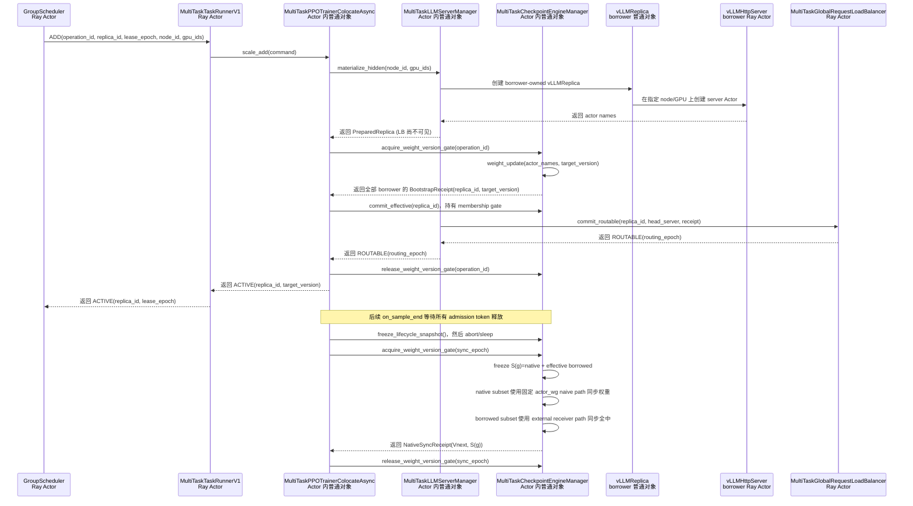

图中的流程按以下顺序提交新 replica：

1. `GroupScheduler` 把 ADD 命令发送给 `MultiTaskTaskRunnerV1`。`MultiTaskTaskRunnerV1` 调用其持有的
   `MultiTaskPPOTrainerColocateAsync`；TaskRunner 不直接持有 manager 或 CE。
2. `MultiTaskPPOTrainerColocateAsync` 调用 `MultiTaskLLMServerManager` 创建隐藏的 borrower-owned `vLLMReplica` 和
   `vLLMHttpServer`。manager 在该阶段不修改 LB。
3. rollout 准入打开后，`MultiTaskPPOTrainerColocateAsync` 获得 rollout-admission token 和 weight-version gate。manager 在该
   token 有效期间不能进入 `on_sample_end()`。
4. `MultiTaskPPOTrainerColocateAsync` 在 membership gate 内把新 replica 加入 effective membership。随后
   `MultiTaskLLMServerManager` 校验 runtime health，并让 LB 把 head server 提交为 `ROUTABLE`。
5. LB 返回 `routing_epoch` 后，`MultiTaskPPOTrainerColocateAsync` 先释放 weight-version gate，再释放 rollout-admission token。
   `on_sample_end()` 随后冻结的 lifecycle snapshot 将包含该 replica。
6. `on_sample_end()` 可以 abort/sleep borrowed replica，但 `on_sample_end()` 不删除该 replica 的 manager、CE、LB 或 lease 状态。
7. 后续 H4 在 weight-version gate 和 membership gate 下冻结 `S(g)`。只要 borrowed replica 仍属于 effective membership，H4 就必须
   把该 replica 加入 borrowed subset。H4 只有在 fixed native subset 和 borrowed subset 全部成功后，才返回统一的
   `NativeSyncReceipt(V_next, S(g))`。

如果 ADD 在 H0 内提交成功，后续 H4 的 `S(g)` 必须包含新 replica。如果 `on_sample_end()` 先关闭 rollout 准入，H4 先更新既有集合；
ADD 在 H5 后只把新 replica bootstrap 到最新版本，再提交 CE 和 LB。两种顺序都不会让旧版本新 replica 接收请求。

HYBRID 的关键 GAP 比 STANDALONE 更明确：`CheckpointEngineManager.update_weights()` 在 `backend="naive"` 时只调用固定
`actor_wg.update_weights()` 并立即返回，不读取动态 `self.replicas`，见 `checkpoint_engine/base.py:493-496`。真正按 node ID/GPU ID
新建的 B 不属于初始化时的 `actor_wg`，所以只执行 `add_replicas([B])` 既不能 bootstrap B，也不能让 H4 更新 B。TO-BE 同时需要
target-only bootstrap 与后续 mixed-subset native publish：

```text
bootstrap_replica(B, PublishedWeightSnapshot(Vserving))
  -> 只更新 borrower-owned external receiver

update_weights(S(g))
  -> native subset 走 actor_wg.update_weights(mode="naive")
  -> borrowed subset 走 borrower-owned external receiver path
  -> 两边都成功才发布一个 NativeSyncReceipt(Vnext, S(g))
```

如何创建 borrower-owned external receiver、如何让一次 H4 publish 原子覆盖 fixed/borrowed 两个数据面，以及如何重放明确
`Vserving`，仍是关键 GAP。`on_sample_end()` 把 B sleep 只提供运行状态前提，不会自动把 B 接入 naive `actor_wg`。

### 4.5 HYBRID partial REMOVE：摘流、partial 续推和销毁

`on_sample_end()` 和 REMOVE 是两条独立流程。没有 `GroupScheduler` recall 时，`on_sample_end()` 只 abort/sleep lifecycle snapshot 中的
replica；borrowed replica 可以保留到下一 step。只有 `GroupScheduler` 发出带 operation ID 和 lease epoch 的 REMOVE 命令时，borrower
才执行以下 TO-BE 流程：

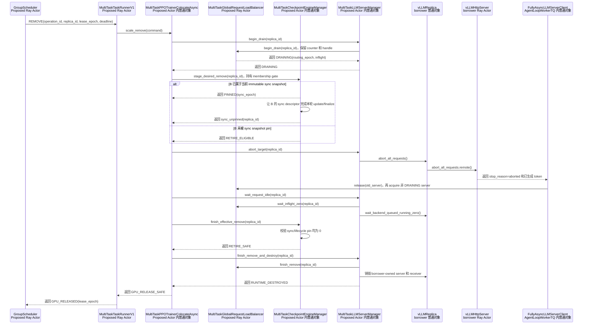

图中的 REMOVE 流程按以下顺序执行：

1. `MultiTaskPPOTrainerColocateAsync` 让 `MultiTaskLLMServerManager` 对目标 server 执行 `begin_drain()`。LB 停止向该 server
   分配新请求，但 LB 保留 server handle 和 inflight counter。
2. `MultiTaskCheckpointEngineManager` 在 membership gate 内把目标 replica 从 desired membership 排除。如果 H4 的 `S(g)` 已经
   pin 该 replica，manager 让该 replica 完成本轮 update 和 finalize；REMOVE 不能改变 `S(g)`。
3. sync pin 解除后，`MultiTaskLLMServerManager` 对目标 replica 执行 `abort_all_requests()`。`vLLMReplica` 再向该 replica 的全部
   `vLLMHttpServer` Actor 发送 abort RPC。
4. `vLLMHttpServer` 把 `stop_reason=aborted` 和本次 attempt 已生成的 token 返回给
   `FullyAsyncLLMServerClient.generate()`。该活 coroutine frame 保存原始 `prompt_ids`、累计
   `final_output.token_ids/log_probs`、剩余 token budget 和 `min/max_global_steps`，见 `llm_server.py:372-460`。
5. `FullyAsyncLLMServerClient` 先向 LB release 旧 server，再 acquire 一个非 DRAINING server。client 把
   `prompt_ids + accumulated prefix` 发送给新 server。正常续推不会把 partial prompt 放回 TransferQueue；TransferQueue 只保存
   prompt/group 状态和完成后的 trajectory，见 `replay_buffer.py:63-112`、`agent_loop_tq.py:177-227`。
6. `MultiTaskLLMServerManager` 同时等待 LB inflight 归零和 backend queued/running 归零。任一计数非零时，manager 都不能销毁
   runtime。
7. `MultiTaskCheckpointEngineManager` 确认 sync pin 和 lifecycle pin 均为 0，然后在 membership gate 内删除 CE effective member。
8. `MultiTaskLLMServerManager` 让 LB 删除 draining entry，并销毁 borrower-owned server 和同步 receiver。
9. `MultiTaskTaskRunnerV1` 收到 runtime 销毁回执后，才通知 `GroupScheduler` 释放物理 GPU lease。

verl 可以复用的目标级原语是 `vLLMReplica.abort_all_requests()`。该方法聚合该 replica 全部 server 的 abort 结果，见
`vllm_async_server.py:1206-1223`。verl 不能直接复用 `CheckpointEngineManager.abort_replicas()` 完成目标级回收，因为该方法遍历
全部 `self.replicas`，见 `checkpoint_engine/base.py:457-465`。TO-BE manager 仍需补充 replica ID 不变的 per-replica recall、LB
`begin_drain/finish_remove`、backend idle 证据和 lifecycle/sync pin。

### 4.6 数值例子：B2 跨过 `on_sample_end()` 并参与版本 31 同步

假设 borrower 任务有：

```text
native HYBRID replica：R0、R1
每个 replica = 4 GPU
parameter_sync_step P = 2
outer step g = 31，当前 serving version = v30
本 step 投递 24 个 prompt group
两个 local update 各需要 8 个完整 group
max_off_policy_threshold = 2
temporary borrowed replica：B2，4 GPU
GroupScheduler lease 在 step 31 和 step 32 均有效
```

完整流程：

1. H0 中 R0/R1 使用 `v30` 生成；prompt 在 TransferQueue 的 tag 是 `global_steps=31`。
2. `GroupScheduler` 给出 `[node-D, GPU4..7]` lease。`MultiTaskLLMServerManager` 创建 B2 和 HTTP server，并让 B2 保持
   `HIDDEN`。
3. ADD 事务在 H0 获得 rollout-admission token 和 weight-version gate。`MultiTaskCheckpointEngineManager` 只把 `v30` 发送给 B2；
   R0/R1 不 abort，也不重复接收权重。B2 的全部 receiver 返回 `W(B2)=v30` 后，borrower 把 B2 提交到 CE effective membership
   和 LB。LB 把 B2 标为 `ROUTABLE` 并开始向 B2 分配请求。
4. 第一批 8 个完整 group 足够后，`MultiTaskPPOTrainerColocateAsync.on_sample_end()` 冻结
   `{R0,R1,B2}` lifecycle snapshot。`MultiTaskCheckpointEngineManager` 对三个 replica 执行 abort + sleep；但 B2 仍留在 manager
   registry、CE effective set、LB server view 和 GroupScheduler lease 中，没有执行 REMOVE/DESTROY。
5. B2 上两个 unfinished attempt 已累计 96 和 144 token。两个 client coroutine 保留 prefix；由于 server paused，两个 coroutine
   等待 H5，
   不会把 partial prompt 放回 TransferQueue。
6. `P=2` 的两个 local update 完成后，`MultiTaskPPOTrainerColocateAsync` 在 H4 获得 weight-version gate。
   `MultiTaskCheckpointEngineManager` 在 membership gate 下冻结 `S(31)={R0,R1,B2}`。native subset `{R0,R1}` 使用固定
   `actor_wg` naive path；borrowed subset `{B2}` 使用 TO-BE external receiver path。
7. 只有两个 subset 都返回成功，CE 才发布一个 `NativeSyncReceipt(v31,{R0,R1,B2})`；此时
   `W(R0)=W(R1)=W(B2)=v31`。同步期间即使 `GroupScheduler` 发来 REMOVE B2，borrower 也只能先执行 begin-drain 并记录 desired
   REMOVE；borrower 不能把 B2 从 `S(31)` 中删除，也不能销毁 B2。
8. `MultiTaskCheckpointEngineManager` 在 H5 resume `{R0,R1,B2}` 中的非 DRAINING 成员。B2 在 step 32 继续接流，因此 borrower
   无需重新 CREATE 或重新 bootstrap B2。
9. resumed trajectory 可以记录 `min_global_steps=30,max_global_steps=31`。`ReplayBufferAsync` 仍按 prompt age 判断是否接收该
   trajectory：
   在 trainer step 32 时 `32-31+1=2`；`drop` 阈值 2 仍允许，step 33 时 age=3 才淘汰。`wait` 则在 step 32 发现仍在
   pending/running 且 age>=2 时阻止取新 batch。这个判定不是直接比较 `31-30`。

两个 ADD 到达顺序进一步说明 rollout-admission gate 的作用：

- **ADD 先获得 rollout-admission token**：B3 在 H0 完成 bootstrap、CE effective commit 和 LB `ROUTABLE` commit。
  `on_sample_end()` 等 ADD 释放 token 后冻结 lifecycle snapshot；后续 H4 的 `S(31)` 必须包含 B3。
- **`on_sample_end()` 先关闭 rollout 准入**：B3 只保持 `HIDDEN`，并且不持有 weight-version gate。H4 先把既有集合发布到
  `v31`；H5 打开 rollout 准入后，ADD 只给 B3 bootstrap 最新 `v31`，再把 B3 提交为 effective 和 `ROUTABLE`。B3 不会以旧
  `v30` 进入 LB，也不会修改已经完成的 `S(31)`。

### 4.7 当前实现能复用什么，缺什么

| 项目                          | AS-IS 可复用能力                                                                    | GAP / TO-BE                                                                                  |
| --------------------------- | ------------------------------------------------------------------------------ | -------------------------------------------------------------------------------------------- |
| 单控制 Actor 内的对象关系            | Trainer、manager、CE、`RayWorkerGroup` 代理都位于 `TaskRunnerV1` Actor                 | 需要 thread-safe registry、membership gate、immutable snapshot 和 pin；不能依赖共享裸 list alias          |
| partial abort/retry         | `FullyAsyncLLMServerClient` 累计 prefix 并在 aborted 后重试，`llm_server.py:372-460`   | 需要 per-replica 摘流、target abort、旧 attempt release 与 backend idle 闭环                           |
| 完整样本边界                      | `ReplayBufferAsync` 只 materialize terminal group，`replay_buffer.py:497-579`    | partial frame 不在 TQ；进程故障不能恢复 prefix                                                          |
| off-policy 控制               | `drop/wait` 使用 prompt age，`replay_buffer.py:503-577`                           | `min/max_global_steps` 已记录，但 AS-IS gate 不直接按实际版本跨度判断                                         |
| native 参数同步                 | fixed `actor_wg` 的 naive in-process update，`checkpoint_engine/base.py:493-496` | retained borrowed 必须进入 immutable `S(g)`；需要 fixed/borrowed mixed-subset publish 与单一原子 receipt |
| 新实例 bootstrap               | 无 target-only external API；sender 读取 live trainer weights                      | 需要 borrower-owned receiver、明确版本 replay，以及与 H4 共用 weight-version gate                         |
| `on_sample_end()` lifecycle | `_step_once()` 在训练前同步调用全量 abort/sleep，`trainer_base.py:536-586`                | 需要冻结短期 lifecycle snapshot/pin；完成后保留 borrowed membership/runtime/lease                        |
| runtime ownership           | `LLMServerManager` 持有 native `vLLMReplica` / server handles                    | base manager 没有按 node ID/GPU IDs 动态 materialize/teardown external replica 的通用 API            |
| LB 动态集合                     | 原生 `add_servers/remove_servers`，`llm_server.py:123-149`                        | remove 会立即丢 counter；需要 staged/ROUTABLE commit 与两阶段 drain                                     |
| 容量投影                        | 请求能力主要由 LB ACTIVE server 集合体现                                                  | 不复用 Fully Async 的 `max_concurrent_samples`；仍需同步监控、空闲与 GroupScheduler 上报视图                    |
| 控制 RPC                      | `TaskRunnerV1` 是现有入口                                                           | `run()` 长期占用 actor；需要 control concurrency group、journal 与 lifecycle/sync-hook reconcile      |
| 跨 step lease                | `sleep_replicas()` 可释放 weights/KV，但不注销对象                                       | sleeping borrowed runtime 与 donor training 共存所需的无计算、残余 HBM 和 wake fencing 仍需实测证明             |
|                             |                                                                                |                                                                                              |

## 5. 场景三：HYBRID + 同步 rollout

### 5.1 AS-IS 一个外层 step 的真实顺序

`PPOTrainerSync` 使用默认 `LLMServerClient`，不启用 partial retry；初始化和每个 `on_step_end()` 做 naive 参数同步，
`on_sample_end()` 只调用 `sleep_replicas()`，见 `verl/trainer/ppo/v1/trainer_sync.py:24-42`。

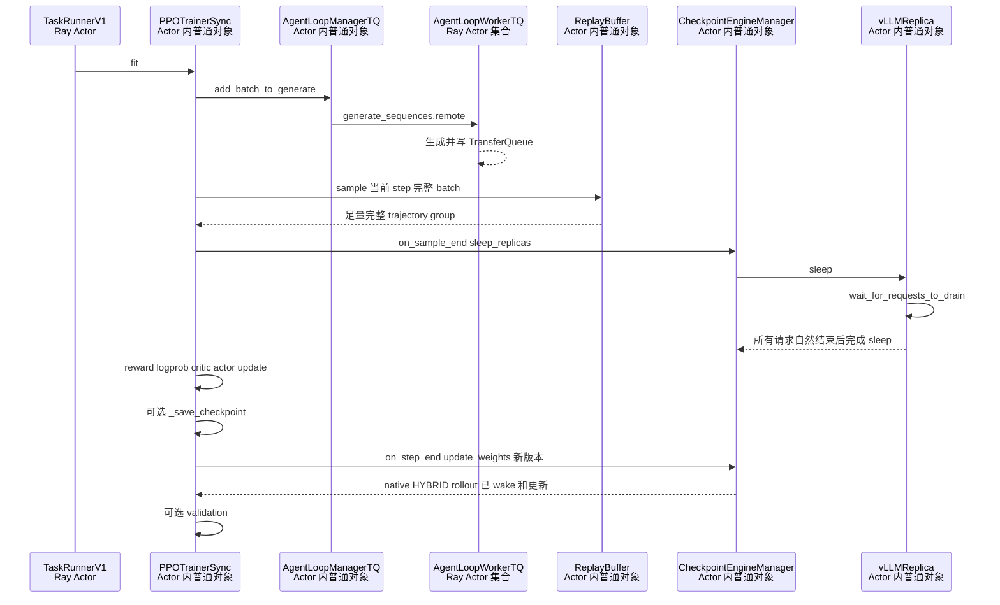

`vLLMReplica.sleep()` 在调用所有 server sleep 前，先通过 head server 等请求 drain，见
`vllm_async_server.py:1200-1204`。worker 侧 naive update 又要求 rollout 在调用前已经 sleep，并在 update 后恢复 weights/KV，见
`engine_workers.py:719-805`。这构成同步模式最强的自然静止点：`on_sample_end()` 返回时，当前 manager 集合的 backend 请求应已
自然结束且 replica 已 sleep。

同步 ReplayBuffer 也不会使用 async off-policy drop/wait；类选择见 `trainer_base.py:142-188`。在启用 DAPO group filtering 时，
它取得足量 sample 后还会停止 speculative dispatch 并等 pending/running prompt 清零，见
`replay_buffer.py:404-475`。无论是否启用该分支，之后的 `sleep_replicas()` 仍是进入训练前的最终 drain barrier。

### 5.2 主要操作在同步 step 中的时机矩阵

定义 phase：

```text
S0 ROLLOUT_DISPATCH_AND_COLLECT
S1 NATURAL_DRAIN_AND_SLEEP
S2 TRAINING
S3 SAVE_CHECKPOINT（可选）
S4 SYNCING
S5 POST_SYNC_PUBLISH
S6 VALIDATING（可选）
```

| 动作 | S0 rollout | S1 natural drain/sleep | S2 training | S3 save | S4 native sync | S5 post-sync | S6 validation |
|---|---|---|---|---|---|---|---|
| CREATE hidden runtime | 允许，但不能在未 bootstrap 时接流 | 允许准备 | 允许；目标是 leased 外部 GPU | 允许 | 可创建，bootstrap 等 gate | 允许 | 仅准备 |
| BOOTSTRAP new only | 允许；目标为当前 serving version | drain 集合稳定后允许 | 允许；通常只为下一 step 准备容量 | 允许 | 与 S4 互斥；先获 gate 者先执行 | S4 后以最新版本允许 | 默认等待 |
| CE EFFECTIVE COMMIT | bootstrap 成功后、同一 gate 内允许 | 同左 | 同左 | 同左 | 禁止修改 frozen native snapshot | native sync 后允许 | 仅准备 |
| LB ADD / ROUTABLE | bootstrap、CE commit 后允许；只会接收尚未 dispatch 的请求 | 允许 | 允许，但本 step 通常已无 rollout 流量 | 允许 | 禁止插入 native lifecycle | native receipt 后按最新版本允许 | 默认等待 |
| LB REMOVE begin-drain | 允许；未来请求改投其他 replica | 允许并等待自然结束 | 允许；此时原集合已 sleep | 允许 | 仅摘流 | 与 publish 串行 | 默认等待 |
| CE REMOVE desired | 允许 | 允许 | 允许 | 允许 | 当前 snapshot 已 pin 时只影响下一 epoch | 允许 | 仅记录 desired |
| DESTROY borrower runtime | **只能等自然 drain；禁止强制 abort** | drain、sleep、pin 清零后允许 | 条件满足允许 | 条件满足允许 | 当前 snapshot 成员禁止 | 与 publish 串行 | 默认等待 |

同步模式并不是“只能在 step 边界开始 remove”。LB begin-drain 可以在 S0 实时执行，让之后的 prompt 改投其他 replica；但
`DESTROY` 必须等待 S1 的自然完成。真正不能做的是：为满足 deadline 在 S0 强制 abort，然后假设请求会自动续推。

### 5.3 同步模式为何不能直接复用 partial 强制回收

默认 `LLMServerClient.generate()` 只有一次 backend 调用；无论成功还是异常，finally 都只 release server，见
`llm_server.py:239-289`。它没有 `final_output.token_ids` 累加和 `stop_reason=aborted` retry loop；该逻辑只在
`FullyAsyncLLMServerClient` 中，见 `llm_server.py:292-461`。

因此同步模式的安全策略是：

```text
begin_drain(target)
-> 不再给 target 新请求
-> 已分配请求自然完成
-> LB inflight == 0
-> backend queued/running == 0
-> sleep target
-> 从下一 CE snapshot 排除
-> sync/lifecycle pin == 0
-> destroy borrower target
```

如果 donor 给出的 reclaim deadline 小于最长请求剩余时间，任务必须返回 `DEFERRED`/`CANNOT_MEET_DEADLINE`；要获得强制中断
能力，就需要把该路径改成 partial-capable client 和完备的重试语义，这已经是运行模式改变，不是一个普通 scale hook。

### 5.4 同步 REMOVE 的数值例子

假设本任务有 R0、R1 两个 native HYBRID replica，以及 B0 一个 4-GPU borrowed temporary replica：

```text
当前版本 v40
本 step 共投递 16 个 prompt group
13 个已经完成
B0 上仍有 2 个请求，R1 上仍有 1 个请求
GroupScheduler reclaim deadline = 5 秒
```

1. borrower 立即把 B0 改为 DRAINING；新的请求只能发给 R0/R1。
2. B0 的两个请求估计还需 2 秒和 30 秒。因为本模式没有 transparent continuation，不能在第 5 秒 kill B0。
3. 若 30 秒请求确实运行到结束，B0 的 LB inflight 和 backend running 才都归零；`on_sample_end()` 的
   `sleep_replicas()` 也会等待这一事实。
4. 如果 B0 未被即将开始的 sync snapshot 纳入，borrower 可在 S1/S2 retire 并销毁 B0；如果已经被 S4 snapshot pin，只能等
   sync finalize。
5. 对这次 5 秒 deadline，正确回复是不能按期强制回收；错误做法是删除 LB entry 后把“查询返回 0”误判为 drain 完成。

这个例子也解释了“某个 replica 当前 inflight=0”与“任务进入长尾、可捐赠”并不等价。只有确认本 step 所有 prompt 已提交、
上游不再补充、该 replica queued/running 都为 0，且该 GPU 的训练回收 deadline 可满足时，才形成真实的 tail bubble。

### 5.5 同步 ADD 的版本例子

假设 B1 在 S0 的 `v40` rollout 期间完成 runtime 创建：

1. B1 获得 weight-version gate 后，只同步 `PublishedWeightSnapshot(v40)`；R0/R1 不参与这次 bootstrap；
2. B1 返回 `W(B1)=v40` 后，事务在同一 gate 内完成 CE effective commit 和 LB ADD，B1 成为 `ROUTABLE(v40)`；
3. 如果本 step 仍有尚未 dispatch 的 prompt，LB 可以把它们交给 B1；如果所有 prompt 已经发完，B1 只会从下一 step 开始产生收益；
4. S4 原生同步请求如果在 bootstrap 中到达必须等待。bootstrap 完成后，S4 冻结 `{R0,R1,B1}`，把三者一起更新为 `v41`；
5. 如果 S4 先获得 gate，B1 等 S4 完成后只 bootstrap 最新 `v41`，随后进入 LB；它不需要等待 `v42`。

HYBRID naive endpoint GAP 与 partial 场景完全相同：固定 `actor_wg` 不会因为 `self.replicas` 增加而多出一个外部 receiver。这个
时机方案成立的前提，是后续实现 borrower-owned dynamic receiver、当前已发布版本重放以及 native sync 对 effective borrowed
subset 的覆盖。

### 5.6 同步模式的 AS-IS / TO-BE / GAP 总结

| 结论 | 分类 | 证据或约束 |
|---|---|---|
| `on_sample_end()` 自然 drain 后 sleep | AS-IS | `trainer_sync.py:40-42`、`vllm_async_server.py:1200-1204` |
| 默认 client 不支持 aborted prefix 自动续推 | AS-IS | `llm_server.py:239-289` 与 `292-461` 对比 |
| S0 可 begin-drain，S1 才能证明 request 已结束 | TO-BE | LB 与 backend 双重回执 |
| deadline 不足时允许强杀且不损失 sample | **不成立** | 没有 partial retry 状态 |
| 新 borrowed replica 可直接加入 naive CE list 完成同步 | **不成立 / GAP** | naive path 只覆盖固定 `actor_wg` |
| B1 必须等 step-end native sync 才能获得可服务权重 | **不成立** | target-only bootstrap 应立即追平当前 serving version |
| bootstrap 可以和 S4 native sync 并发 | **不成立** | 两者共享 weight-version gate；native 请求可 pending，数据面不能并发 |

## 6. 三种模式的横向对比

### 6.1 架构和时间语义对比

| 对比项 | STANDALONE + Fully Async | HYBRID + partial | HYBRID + 同步 |
|---|---|---|---|
| 训练主类 | `FullyAsyncTrainer` Ray Actor | `PPOTrainerColocateAsync` 普通对象，位于 `TaskRunnerV1` Actor | `PPOTrainerSync` 普通对象，位于 `TaskRunnerV1` Actor |
| rollout 主类 | `FullyAsyncRollouter` Ray Actor | `AgentLoopManagerTQ` + `AgentLoopWorkerTQ` | `AgentLoopManagerTQ` + `AgentLoopWorkerTQ` |
| manager 位置 | `FullyAsyncRollouter` Actor 内 | `TaskRunnerV1` Actor 内 | `TaskRunnerV1` Actor 内 |
| CE 位置 | `FullyAsyncTrainer` Actor 内，持有 replica 序列化副本 | 与 trainer 同一 Actor 内 | 与 trainer 同一 Actor 内 |
| 完整 sample 载体 | `MessageQueue` 中序列化 `RolloutSample` | TransferQueue trajectory/group | TransferQueue trajectory/group |
| partial prefix 位置 | `AgentLoopWorker` 中 client coroutine | `AgentLoopWorkerTQ` 中 client coroutine | 不存在 transparent partial retry 状态 |
| 原生 CE backend | STANDALONE 非 naive | HYBRID naive | HYBRID naive |
| 参数同步频率 | 每 K 个 trainer `fit_step()` | 每个外层 step 末尾 | 每个外层 step 末尾 |
| bootstrap 触发 | 新 runtime ready 后事件驱动，只更新 new replica | 新 runtime ready 后事件驱动，只更新 new replica | 新 runtime ready 后事件驱动 |
| bootstrap 目标 | current serving version，不是 trainer live weights | current serving version，不是 H2 中正在变化的 trainer live weights | current serving version |
| bootstrap/native 关系 | 业务独立；replica-sync gate 同时保护唯一 `effective_replicas` 和数据面，不另建 native snapshot | 业务独立、数据面经 weight-version gate 串行；borrowed 进入 H4 immutable snapshot | 业务独立、数据面经 weight-version gate 串行 |
| rollout 与训练并行 | 是 | 否，同卡阶段切换 | 否，同卡阶段切换 |
| 强制回收可行性 | `partial_rollout=True` 时可复用 partial，但需 per-replica 协议；否则只能自然 drain | 可复用 partial，但需 per-replica 协议 | 不可透明强制；只能自然 drain |
| 新实例最早 LB ADD | target-only bootstrap、CE effective commit 成功后立即 | rollout 准入打开时执行 bootstrap 和 CE effective commit，然后提交 LB；准入已关闭时等 H5 后同步最新版本 | target-only bootstrap、CE effective commit 后；若 prompt 已全 dispatch，实际从下一 step 获益 |
| 新实例能否处理旧 partial | 可以，发布后被 retry 选中 | 可以，发布后被 retry 选中 | 不存在旧 partial retry；从下一 step 服务 |
| 额外容量状态 | 必须同步更新 `max_concurrent_samples` | 主要由 LB 路由集合体现 | 主要由 LB 路由集合体现 |
| 物理硬屏障 | rollout GPU 与 trainer 分离；仍需 donor lease/CE 隔离 | borrower `on_sample_end()` 不是 lease deadline；donor training 前须证明 B 已 sleep、无计算且残余 HBM 可共存，或显式 recall/destroy | donor 若为 HYBRID，同样需满足 sleeping coexistence 或自然 drain 后 recall |

### 6.2 各类动作的最早安全时机

| 动作 | STANDALONE + Fully Async | HYBRID + partial | HYBRID + 同步 |
|---|---|---|---|
| CREATE | lease 生效后可随时 hidden materialize | lease 生效后可 hidden materialize；需避开物理 GPU/HBM 冲突 | lease 生效后可在 S0/S2 hidden materialize |
| BOOTSTRAP | runtime ready 后立即请求；若 native sync 已持 gate 则等最新版本 | H0 rollout 准入打开时立即请求；H1–H4 只保留 hidden runtime，H5 后同步最新版本 | runtime ready 后立即请求；可在 S0/S2 执行 |
| CE EFFECTIVE COMMIT | bootstrap receipt 后、释放 gate 前 | rollout-admission token 和 weight-version gate 有效期间，在 bootstrap receipt 后提交 | bootstrap receipt 后、释放 gate 前 |
| LB ADD | bootstrap、CE commit、health check 后，释放 gate 前 | CE commit 后且 rollout-admission token 仍有效时提交；H1–H4 不发布新 server | bootstrap、CE commit 后；只处理尚未 dispatch 或下一 step 请求 |
| LB REMOVE | 任意时刻 begin-drain；target lifecycle 与 sync 分开 | 任意时刻 begin-drain；普通 `on_sample_end()` 不自动 remove | collecting 可 begin-drain |
| CE REMOVE | request/backend 排空后请求 replica-sync gate；若 native sync 正在执行则等待，获得 gate 后直接删除 `effective_replicas` | sync cut 前排除本轮，cut 后只影响下一 snapshot；当前 pin 不失效 | sync cut 前排除当前，cut 后排除下一 epoch |
| DESTROY | CE remove receipt + drain + backend idle + lifecycle 操作完成；不需要 native snapshot pin | 仅显式 recall/lease expiry；drain + backend idle + sync/lifecycle pin 归零 | 只能等自然 drain；deadline 不足则推迟/拒绝 |

### 6.3 哪些事情真正互斥

| 资源或门禁 | 必须互斥的双方 | 不必互斥的动作 |
|---|---|---|
| STANDALONE replica-sync gate | `BOOTSTRAPPING -> effective_replicas ADD -> ROUTABLE/rollback`、CE REMOVE 与整个 verl native `update_weights()` | hidden CREATE、LB begin-drain、GroupScheduler 决策、普通监控上报 |
| HYBRID weight-version gate | `BOOTSTRAPPING -> CE_EFFECTIVE -> ROUTABLE` 与 H4 native snapshot/transfer/publish | hidden CREATE、GroupScheduler 决策、普通监控上报 |
| HYBRID CE membership gate | effective ADD/REMOVE 串行提交与 `S(e)` snapshot freeze | desired 更新可先记录；hidden CREATE 可继续 |
| HYBRID rollout-admission gate | ADD 的 LB `ROUTABLE` commit 与 `on_sample_end()` 关闭 rollout 准入 | hidden CREATE；已经 DRAINING 的 replica 等待 request 清零 |
| per-replica lifecycle gate | target 的 abort/sleep/wake/destroy 与当前 sync 对 target 的 abort/KV/update/finalize/resume | LB begin-drain 只改路由，可先执行 |
| HYBRID sync pin | DESTROY 与任何已发出的 worker/update/finalize RPC | CE desired REMOVE 可以先记录 |
| publish fence | BootstrapReceipt、CE effective commit 和 LB ADD 的版本/lease epoch 条件提交与同一 replica retire | 其他不相关 replica 的 CREATE |
| validation topology gate | LB ADD、finish-remove、abort 和物理销毁与 validation | hidden CREATE、desired 记录可延期提交 |
| HYBRID GPU safety gate | donor training 与同 GPU 上仍有 active compute/未释放足够 HBM 的 borrower runtime | 已验证可共存的 sleeping runtime；borrower 在其他 GPU 上的计算 |
| GroupScheduler lease fence | 两个 task 对同 node ID/GPU IDs 的 runtime 创建 | CE/LB 的 task-local metadata 操作 |

因此不应从 `CREATE` 开始就持有全局锁，也不应让 remove 从 begin-drain 一直独占到 DESTROY。STANDALONE ADD 一旦从已发布版本 pin
进入 `BOOTSTRAPPING`，就必须持有 task-local replica-sync gate，直到 `effective_replicas` 与 LB `ROUTABLE` 提交或失败回滚；
STANDALONE native sync 在整个 `update_weights()` 期间持有同一把 gate。HYBRID ADD 继续使用 weight-version gate 和 membership gate。
HYBRID partial 的 `on_sample_end()` 会关闭 rollout 准入，直到 H5 完成发布和 resume；该关闭动作只阻止 ADD 激活，不阻止 hidden
CREATE，也不清空 borrowed membership。`on_sample_end()` 仍然只为本次 abort/sleep 短暂 pin lifecycle snapshot。

## 7. TO-BE 最小互斥协议

### 7.1 STANDALONE 单集合协议与 HYBRID snapshot 协议

以下伪码描述 STANDALONE + Fully Async 第一版的 TO-BE 语义，不是 verl 当前实现：

```python
async def standalone_update_weights_at_native_boundary(weight_version: int):
    # verl 原生 hook 仍按原条件调用本函数；若 ADD/REMOVE 持有 gate，本调用在这里等待。
    async with replica_sync_gate:
        # 不创建 native_sync_snapshot；CE 在整个区间内直接读取唯一 effective_replicas。
        await checkpoint_view.abort_replicas(effective_replicas)
        rollout_wg = checkpoint_view.build_rollout_worker_group(effective_replicas)
        await checkpoint_view.release_kv(effective_replicas)
        await transfer_live_trainer_weights(rollout_wg, weight_version)
        await checkpoint_view.finalize(effective_replicas)
        await checkpoint_view.resume_replicas(effective_replicas)
        set_serving_version(weight_version)
        await reset_staleness()
        return NativeSyncReceipt(weight_version=weight_version)
```

现有 `CheckpointEngineManager.update_weights()` 的 abort 位于 `checkpoint_engine/base.py:498-500`，worker flatten 位于 `501-505`，
release KV 位于 `508-509`，传权位于 `511-518`，finalize 位于 `526-530`，resume 位于 `532-536`。该方法多次读取
`self.replicas` 本身不是问题；问题是成员变更可能在这些读取之间发生。第一版让外层 replica-sync gate 覆盖整个方法，并让所有
ADD/REMOVE 使用同一把 gate，所以 `effective_replicas` 在整个同步期间保持不变。

HYBRID 继续使用独立 snapshot：

```python
async def hybrid_update_weights_at_native_boundary(weight_version: int):
    async with weight_version_gate:
        async with membership_gate:
            sync_epoch = next_sync_epoch()
            snapshot = tuple(effective_members.values())
            pin_sync(snapshot, sync_epoch)

        try:
            native_subset = tuple(r for r in snapshot if r.origin == "NATIVE_FIXED")
            borrowed_subset = tuple(r for r in snapshot if r.origin == "BORROWED")
            native_receipt = await update_fixed_actor_wg(native_subset, weight_version)
            borrowed_receipt = await update_external_receivers(borrowed_subset, weight_version)
            receipt = combine_atomically(native_receipt, borrowed_receipt, expected_snapshot=snapshot)
            set_serving_version(weight_version, receipt)
            await resume_non_draining_members(snapshot)
            return receipt
        finally:
            unpin_sync(snapshot, sync_epoch)
```

HYBRID partial 和 HYBRID 同步都允许 borrowed replica 跨过 `on_sample_end()` 并进入同步边界。native fixed `actor_wg` 与 true-new
borrower endpoint 的数据面不同；上述 `snapshot` 是统一控制语义，后续实现必须把一个 native publish 拆成两个 receiver subset：

```text
native_hybrid_subset -> actor_wg.update_weights(mode="naive")
effective_borrowed_subset -> 尚待设计的 borrower-owned receiver path
两边都成功 -> 合并成一个 NativeSyncReceipt(weight_version=v)
任一失败 -> 不发布新的 serving version，进入恢复/隔离流程
```

这不是说当前 CE 已支持 mixed backend，而是明确时机设计对 receiver 实现提出的接口要求。“原子发布”只指控制面在两个 subset
都成功前不推进 `V_serving`，不表示已经写入某些 HBM 的 tensor 可以自动回滚；任一 subset 失败时，相关 replica 必须保持 paused，
通过重试/修复追平到同一版本后才能重新路由。

第 4 节 HYBRID partial 不是例外：`on_sample_end()` 只让 B sleep，不把 B 从 effective membership 删除。只要 B 在 H4 snapshot freeze
时仍有效，它就属于 `effective_borrowed_subset`；H4 必须等待 fixed/borrowed 两个 subset 都成功后才能发布新 serving version。

### 7.2 ADD 事务伪码

```python
async def admit_add(command):
    assert command.lease_epoch == current_lease_epoch(command.replica_id)
    # CREATE 不阻塞 verl 原生参数同步。
    record = await runtime_manager.materialize_hidden(command.node_id, command.gpu_ids)
    record.state = "BOOTSTRAP_PENDING"
    # Fully Async 返回 task-local 普通 token；HYBRID partial 在 H1-H4 等待 H5 重新打开 rollout 准入。
    admission_token = await acquire_mode_specific_add_admission(command.operation_id)
    try:
        return await bootstrap_and_publish(record, command)
    finally:
        release_mode_specific_add_admission(admission_token)

async def bootstrap_and_publish(record, command):
    # STANDALONE 返回 replica_sync_gate；HYBRID 返回 weight_version_gate。
    gate = mode_sync_gate()
    async with gate, record.lifecycle_gate:
        assert command.lease_epoch == current_lease_epoch(record.replica_id)
        target_version = serving_version()
        source = pin_published_weight_snapshot(target_version)
        capacity_token = None
        record.state = "BOOTSTRAPPING"

        try:
            # 只同步 new replica 的全部 TP/PP receiver；不触碰已有 replica。
            receipt = await checkpoint_view.bootstrap_replica(
                target=record.sync_descriptor,
                source=source,
                weight_version=target_version,
            )
            assert receipt.all_receiver_ranks_succeeded
            assert receipt.weight_version == target_version
            record.state = "SYNCED"
            record.last_synced_weight_version = target_version

            # 原生 sync 被 gate 阻挡，所以 serving_version 在本事务内不能变化。
            assert serving_version() == target_version
            if mode == "STANDALONE_FULLY_ASYNC":
                # 第一版只有这一份 CE 成员集合；当前 replica_sync_gate 同时保护成员和数据面。
                effective_replicas.add_idempotently(
                    record.replica_id,
                    record.sync_descriptor,
                    operation_id=command.operation_id,
                )
                record.state = "CE_EFFECTIVE"
            else:
                # HYBRID 保留 membership gate 和 H4 snapshot 设计。
                async with membership_gate:
                    checkpoint_view.commit_effective_add(record.sync_descriptor)
                    record.state = "CE_EFFECTIVE"

            await record.health_check()
            # 先准备可回滚的派生容量；LB commit 返回后，新 acquire 才能看到该 server。
            capacity_token = await prepare_mode_specific_capacity_add(record)
            routing_receipt = await load_balancer.commit_routable_idempotently(
                record.head_server,
                operation_id=command.operation_id,
                expected_weight_version=target_version,
                lease_epoch=command.lease_epoch,
            )
            assert routing_receipt.state == "ACTIVE"
            record.routing_state = "ROUTABLE"
            return ActiveReceipt(record.replica_id, target_version, command.lease_epoch)
        except Exception:
            # commit timeout 必须用同一 operation_id 查询/重放，不能盲删一个可能已接流的 entry。
            await load_balancer.rollback_hidden_prepare_if_uncommitted(command.operation_id)
            await rollback_mode_specific_capacity_if_present(capacity_token)
            if mode == "STANDALONE_FULLY_ASYNC":
                effective_replicas.remove_if_operation_matches(record.replica_id, command.operation_id)
            else:
                async with membership_gate:
                    checkpoint_view.rollback_effective_add(record.sync_descriptor)
            record.state = "FAILED"
            raise
        finally:
            unpin_published_weight_snapshot(source)
```

这里的 `bootstrap_replica()` 和原生 `update_weights()` 是两个接口：前者只追平 new replica，不递增
`current_param_version`、不调用全局 `reset_staleness()`；后者才发布下一版本并更新全部 effective replica。
`commit_routable_idempotently()` 返回后，普通 acquire 才能选中新 server。在该方法返回前，manager 即使已经持有 server handle，
LB 也必须让 server 保持隐藏。该方法必须以 `operation_id + lease_epoch` 做 Compare-And-Swap（CAS，比较并交换）校验和幂等重放：
RPC 超时时，调用方先查询或重放同一个 operation，不能盲目删除一个可能已经接流的 entry。Fully Async 容量是派生视图；
`FullyAsyncRollouter` 先准备可回滚的 capacity 变更，再提交 LB，避免出现“LB 已接流但容量事务失败”的半发布状态。

`GroupScheduler` 只通过 TaskRunner 提交 ADD。TaskRunner/Trainer 执行 bootstrap；原生 sync hook 仍由 verl 自己触发：

- Fully Async 原生同步：包装 `FullyAsyncTrainer._fit_update_weights()`，代码边界是
  `fully_async_trainer.py:690-788`；
- HYBRID partial 原生同步：包装 `PPOTrainerColocateAsync.on_step_end()`，代码边界是
  `trainer_colocate_async.py:48-53`；
- HYBRID sync 原生同步：包装 `PPOTrainerSync.on_step_end()`，代码边界是 `trainer_sync.py:35-38`。

Fully Async hook 到达时请求 `replica_sync_gate`。若 bootstrap 尚未完成，原生同步等待；获得 gate 后，CE 直接遍历唯一
`effective_replicas`，不创建 `native_sync_snapshot`。HYBRID partial 与 HYBRID sync hook 到达时请求 `weight_version_gate`，并按各自
章节的 membership/snapshot 规则冻结 H4 接收端集合。两种实现都保证刚完成 `ROUTABLE` 提交的 borrowed replica 会参与后续原生同步。

HYBRID partial 还必须在调用 `bootstrap_and_publish()` 前获得 rollout-admission token。H1–H4 期间，
`acquire_mode_specific_add_admission()` 只能等待，不能预先占有 weight-version gate。H5 发布并恢复现有 replica 后，Trainer 重新
打开 rollout 准入；ADD 随后 bootstrap 最新 `V_serving`。该顺序避免 ADD 和 H4 形成循环等待。

#### 7.2.1 HYBRID partial 的 retained-borrowed 特化伪码

```python
async def hybrid_partial_on_sample_end():
    # 等待正在激活的 ADD 提交或回滚，然后关闭 rollout 准入；H5 前的新 ADD 只能保留 hidden runtime。
    await rollout_admission_gate.close_after_active_tokens()

    # 只为本次 abort/sleep 冻结短生命周期 snapshot；不改变 effective membership。
    async with membership_gate:
        lifecycle_epoch = next_lifecycle_epoch()
        lifecycle_snapshot = tuple(effective_members.values())
        pin_lifecycle(lifecycle_snapshot, lifecycle_epoch)

    try:
        await checkpoint_view.abort_snapshot(lifecycle_snapshot)
        await checkpoint_view.sleep_snapshot(lifecycle_snapshot)
    finally:
        unpin_lifecycle(lifecycle_snapshot, lifecycle_epoch)

    # 特别注意：这里没有 CE REMOVE、LB REMOVE、runtime DESTROY 或 lease release。
    return LifecycleReceipt(lifecycle_epoch, stable_ids(lifecycle_snapshot), state="SLEEPING")

async def hybrid_partial_on_step_end(next_weight_version):
    async with weight_version_gate:
        async with membership_gate:
            sync_epoch = next_sync_epoch()
            snapshot = tuple(effective_members.values())
            pin_sync(snapshot, sync_epoch)

        native_subset = tuple(r for r in snapshot if r.origin == "NATIVE_FIXED")
        borrowed_subset = tuple(r for r in snapshot if r.origin == "BORROWED")
        try:
            native_receipt = await update_fixed_actor_wg(native_subset, next_weight_version)
            borrowed_receipt = await update_external_receivers(borrowed_subset, next_weight_version)
            receipt = combine_atomically(native_receipt, borrowed_receipt, expected_snapshot=snapshot)
            assert receipt.all_succeeded
            set_serving_version(next_weight_version, receipt)
            await resume_non_draining_members(snapshot)
            rollout_admission_gate.open()
            return receipt
        finally:
            unpin_sync(snapshot, sync_epoch)
```

这里有两个 snapshot，但用途不同：`lifecycle_snapshot` 只保证本次 abort/sleep 遍历稳定，用完即 unpin；`snapshot` 是 H4 的版本
receiver 集合，从 freeze 到 update/finalize/publish 全程不可变。前者不会注销 borrowed replica，后者必须包含 freeze 时仍有效的
borrowed replica。`update_fixed_actor_wg()` 与 `update_external_receivers()` 是否可并行取决于实际通信后端；伪码只要求两者归并成同一
原子发布回执，不预设并行执行。

### 7.3 REMOVE 事务伪码

```python
async def admit_remove(command):
    record = registry.require(command.replica_id, command.lease_epoch)

    # begin_drain 返回后，LB 不再分配新请求，但 LB 必须保留 handle 和 inflight counter。
    await load_balancer.begin_drain(record.server_id)
    record.routing_state = "DRAINING"

    if mode != "STANDALONE_FULLY_ASYNC":
        # HYBRID 可以先记录下一目标集合；该操作不撤销已经存在的 sync pin。
        await checkpoint_view.stage_remove(record.sync_descriptor)
        if record.sync_pins:
            return Deferred(until="sync_unpin")

    async with record.lifecycle_gate:
        if mode_supports_partial_retry:
            await record.replica.abort_all_requests()
        else:
            await record.replica.wait_for_requests_to_drain()

        await wait_until(
            lb_inflight(record) == 0
            and backend_queued(record) == 0
            and backend_running(record) == 0
            and not record.lifecycle_pins
        )

        if mode == "STANDALONE_FULLY_ASYNC":
            # native sync 正在执行时，本调用等待整个 update_weights() 返回。
            async with replica_sync_gate:
                effective_replicas.remove_idempotently(record.replica_id)
                ce_remove_receipt = CEEffectiveRemoveReceipt(record.replica_id)
        else:
            # HYBRID 仍使用 desired membership、snapshot pin 和 membership gate。
            async with membership_gate:
                checkpoint_view.finish_effective_remove(record.sync_descriptor)
                ce_remove_receipt = CEEffectiveRemoveReceipt(record.replica_id)

        assert ce_remove_receipt.replica_id == record.replica_id
        # request/backend 已归零且 CE REMOVE 已提交后，LB 才删除 entry；此后不应再有合法 release 到达。
        await load_balancer.finish_remove(record.server_id)

        if record.origin == "BORROWED_TEMPORARY":
            await runtime_manager.destroy(record)
        else:
            await runtime_manager.mark_dormant(record)
```

同步模式的 `wait_for_requests_to_drain()` 分支没有 deadline 内强制成功保证；partial 两种模式也只有在至少还有一个可路由 server、
client coroutine 存活且 retry 没有被 staleness/drop 策略取消时，才可以宣称 request continuation。

STANDALONE 分支不返回 `Deferred(until="sync_unpin")`。replica-sync gate 本身让 CE REMOVE 排在当前 native sync 之后；CE REMOVE
获得 gate 并删除 `effective_replicas` 后，不存在仍在使用该 replica 的 STANDALONE native sync。

第 4 节 HYBRID partial 仍允许 `Deferred(until="sync_unpin")`：普通 `on_sample_end()` 可以先对 lifecycle snapshot abort/sleep，然后
进入 H2；如果 B 已被 H4 snapshot pin，REMOVE 只能保持 DRAINING 并等待本轮 update/finalize/unpin，随后再
finish-remove/destroy。`on_sample_end()` 不接管显式 REMOVE，也不要求 B 在 H2 前消失。

### 7.4 `begin_drain()` 为什么不能等价于当前 `remove_servers()`

当前 LB 的数据结构只有：

```text
_servers[server_id] -> ActorHandle
_inflight_requests[server_id] -> count
_request_id_to_server[request_id] -> sticky server_id
```

见 `llm_server.py:69-81`。当前 `remove_servers()` 同时 pop 前两项，见 `llm_server.py:138-149`；旧 client 稍后执行
`release_server()` 时，因为 key 已不存在而直接 return，见 `llm_server.py:116-121`。TO-BE 至少需要：

```text
ACTIVE:    可 acquire，保留 handle/counter
DRAINING:  不可新 acquire，仍保留 handle/counter，旧 release 继续计数
REMOVED:   counter==0 且 backend==0 后才删除 handle/counter
```

sticky cache 命中 DRAINING server 时必须删除旧 sticky 选择并重新选 ACTIVE server；否则 partial retry 仍可能回到待销毁实例。

## 8. GroupScheduler 与 TaskRunner 的实时命令可达性

### 8.1 两条主链都存在 TaskRunner 长方法阻塞

V1 HYBRID 中，`run_ppo()` 创建 TaskRunner Actor 并同步等待 `runner.run.remote(config)`，见
`verl/trainer/main_ppo.py:77-94`；`TaskRunnerV1.run()` 在同一个 method 中完成 trainer init 和整个 `fit()`，见
`main_ppo.py:103-110,134-164`。

Fully Async 中，`FullyAsyncTaskRunner.run()` 调用初始化和 `_run_training_loop()`，后者又长期等待 trainer/rollouter futures，见
`fully_async_main.py:35-49,186-210`。

两者都是同步 Ray Actor class，没有为 GroupScheduler command method 声明独立 concurrency group。仅新增
`scale_replica.remote()` 会让 RPC 在 `run()` 后排队，无法满足实时扩缩容。

### 8.2 不新增通信 Actor 的扩展方式

TO-BE `MultiTaskTaskRunner` 可以给控制方法配置独立 concurrency group。入口 method 先做：

```text
校验 task session / command ID / lease epoch / deadline
-> 写入幂等 command journal 或 task-local mailbox
-> 返回 ACCEPTED / DEFERRED / STALE / REJECTED
```

它不能在并发线程里直接修改 `PPOTrainer`、`CheckpointEngineManager.self.replicas` 或 manager 裸 list。完成准入后有两种不新增
通信 Actor 的执行方式：

- HYBRID partial：TaskRunner control method 使用 task session、operation ID 和 lease epoch 拒绝过期命令，并启动进程内 lifecycle
  job。hidden CREATE 可以继续。bootstrap/effective/LB commit 必须同时获得 rollout-admission token 和 weight-version gate；
  `on_sample_end()` 关闭 rollout 准入并冻结 lifecycle snapshot，H4 hook 冻结 native + borrowed effective snapshot；
- HYBRID sync：同样在 S0/S1/S2-entry/S4/S5 的许可点 reconcile mailbox，并使用 immutable published snapshot、membership gate 和
  weight-version gate；
- Fully Async：TaskRunner 控制路径通过现有 `FullyAsyncTrainer` / `FullyAsyncRollouter` ActorHandle 执行跨 Actor 提交。
  `FullyAsyncTrainer` 是 `effective_replicas` 的唯一写入者，并使用 replica-sync gate 串行 CE 变更与 native sync；
  `FullyAsyncRollouter` 独立提交 runtime、LB 和容量视图。两个 Actor 通过 operation ID 和回执关联事务，不能互相同步回调持锁方法；
- GroupScheduler 仍只和 TaskRunner 通信，没有引入新的中转 Actor。

Ray concurrency group 的运行语义可参考官方文档：
[Limiting Concurrency Per-Method with Concurrency Groups](https://docs.ray.io/en/latest/ray-core/actors/concurrency_group_api.html)。

## 9. donor 物理 GPU 交接时机

前面各表主要描述 borrower 任务如何更新自己的 M/C/L 视图。跨任务共享还必须在 donor 侧证明物理 GPU 已可借出。

### 9.1 HYBRID donor：runtime 可跨 step 保留，active GPU 使用仍受物理 gate 约束

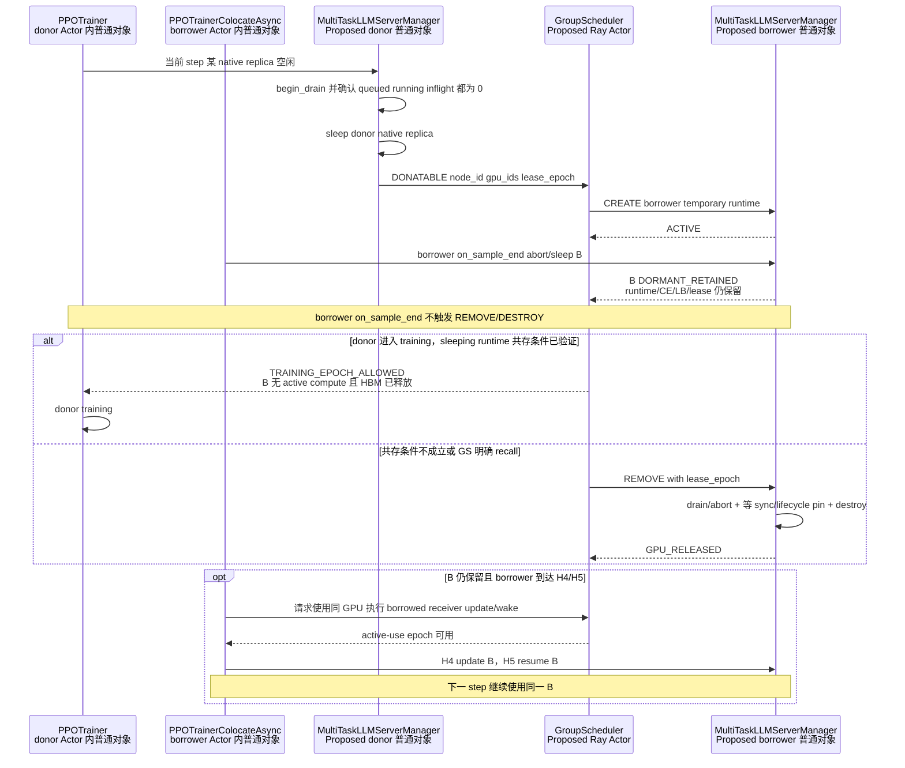

图中的 donor `PPOTrainer` 是 verl 的真实基类。实际运行对象根据 trainer mode 分别是 `PPOTrainerColocateAsync` 或
`PPOTrainerSync`；时序图使用基类名表达两种 HYBRID donor 共享的训练入口。

HYBRID 训练和 rollout 使用同一 worker/GPU；`RolloutReplica.init_hybrid()` 直接切片
`actor_rollout_wg.workers`，见 `replica.py:131-141`。`PPOTrainer._step_once()` 又在 `on_sample_end()` 返回后马上做 logprob、critic、
actor update，见 `trainer_base.py:536-586`。因此 donor 进入训练前，borrowed replica 不能继续执行 active kernel；borrower manager
还必须把 weights/KV 占用降到 donor 训练可以接受的范围。该条件不要求 borrower 一定销毁 runtime。若 external vLLM 的 sleep 能够
释放足够 HBM 并停止计算，`GroupScheduler` 可以保留 lease 和进程，并把 borrowed replica 标成 `DORMANT_RETAINED`。下一次
active-use epoch 可以直接 update/wake 该 runtime，避免重复 CREATE。

这里必须区分两个 gate：CE 的 immutable snapshot gate 保护“本次参数同步包含谁”；`GroupScheduler` 的 physical activity gate
保护“此刻谁可以在这些 GPU 上执行计算或重新加载权重”。`GroupScheduler` 不选择参数版本，也不改变 verl 的 H4 hook；但如果
donor 正在同 GPU training，
borrower 对 retained B 的 receiver update/wake 必须等待物理 gate。后续实现必须证明这种等待不会造成跨任务循环依赖。

verl 当前代码只证明原生 HYBRID replica 可以被 sleep；verl 当前代码没有证明按 node ID/GPU ID 新建的外部 vLLM 进程在 sleeping 状态下与另一个任务的
训练进程安全共存。因此“保留 B 跨 step”是本轮确认的设计语义，残余 HBM、CUDA context、NCCL communicator 和 wake fencing 仍是
必须实测的实现 GAP。

### 9.2 STANDALONE donor：租约可以跨 donor training，但不能绕过 donor replica-sync gate

STANDALONE rollout GPU 不参与本任务 trainer compute，因此 donor native replica 安全 sleep 后，lease 可以覆盖 donor 的训练阶段。
但 donor 仍可能在原生参数同步时访问该 native replica；所以安全顺序是：

```text
donor LB begin_drain
-> partial abort 或自然 drain
-> donor native replica 真实 sleep 并验证 HBM 释放
-> donor 获得 replica-sync gate；正在执行的 native sync 先完整返回
-> donor 从唯一 effective_replicas 删除 native replica，并释放 gate
-> GS 激活物理 lease
-> borrower CREATE / target-only bootstrap / CE effective / LB ROUTABLE / serve
-> borrower LB REMOVE / CE REMOVE / DESTROY
-> GS 归还 lease
-> donor 获得 replica-sync gate
-> donor target-only bootstrap 到当前 serving version
-> donor effective_replicas ADD / wake / LB ROUTABLE；释放 gate
-> donor 后续原生 sync 将它与其他 effective replica 一起更新
```

donor native replica 不销毁，也不能在 lease 有效期间继续留在 donor 的 `effective_replicas`。donor CE REMOVE 必须与 donor native
sync 使用同一把 replica-sync gate；CE REMOVE receipt 返回后，当前 native sync 已经结束，后续 native sync 也不会访问该 replica。
当前 STANDALONE server sleep 是 no-op，所以“真实释放 HBM”仍是实现前置 GAP，而不是一个已经存在的 RPC guarantee。

## 10. validation、checkpoint、初始化和 shutdown

### 10.1 validation 默认冻结路由拓扑

V1 `PPOTrainer.fit()` 在 step 结束后按频率调用 `_validate()`，见 `trainer_base.py:466-476`；validation 复用同一
AgentLoop/LB，见 `trainer_base.py:959-999`。Fully Async 也只在参数版本边界按频率调用 rollouter validation，见
`fully_async_trainer.py:812-830`。

默认建议在 validation 期间：

- 禁止 LB ADD、finish-remove、target abort 和 runtime destroy；
- 允许不改变可见拓扑的 hidden CREATE，前提是没有 GPU/HBM 冲突；
- STANDALONE 把等待执行的 CE ADD/REMOVE 保存在 TaskRunner operation journal 中，不创建 CE desired set；validation 结束后，
  ADD/REMOVE 再获得 replica-sync gate 并修改 `effective_replicas`；
- HYBRID 可以把 CE ADD/REMOVE 记录进 desired set，但 effective membership 与 LB 可见性只在 validation 结束后的
  snapshot/publish gate 生效。

这是为了让一次 validation 使用固定的 server 集合、sticky routing 和故障面。若以后允许 elastic validation，需要另设 validation
topology epoch，不能默认沿用训练流量的即时伸缩。

### 10.2 checkpoint save 不是 replica membership 提交点

V1 在训练完成后、`on_step_end()` 参数同步前执行 `_save_checkpoint()`，见 `trainer_base.py:448-464`。Fully Async 在
`fit_step()` 的 validation 后调用 `_fit_save_checkpoint()`，见 `fully_async_trainer.py:598-604,873-898`。这些路径主要保存训练
worker/model、优化器和 dataloader 状态，不给新 rollout replica 产生权重版本回执。

因此：

- hidden CREATE 可以与普通 checkpoint save 并行，前提是没有同 GPU/HBM 冲突；HYBRID partial checkpoint 前后都可能保留
  sleeping borrowed runtime，但 checkpoint 本身不持久化这些动态 ActorHandle；
- checkpoint 完成不能作为 LB ADD 的依据；
- task checkpoint 不应持久化临时 Ray ActorHandle。恢复后 borrowed capacity 必须重新向 `GroupScheduler` 协商并重建；
- shutdown/session epoch 变化时，旧 scaling receipt 全部失效。

### 10.3 初始化和 shutdown

- HYBRID 两个 Trainer 都在 `on_init_end()` 做第一次参数同步，见
  `trainer_sync.py:31-33`、`trainer_colocate_async.py:36-38`；
- Fully Async 在 trainer/rollouter、MessageQueue 和 CE 建好后，在 fit 前调用一次 `_fit_update_weights()`，见
  `fully_async_main.py:77-110`；
- 任务只有在初始 sync、manager/LB 初始化和 `GroupScheduler` 注册都成功后才应报告 `TASK_READY`；
- shutdown 后拒绝新 ADD，先 drain/retire borrower runtime，再注销 `GroupScheduler` lease，最后关闭 TransferQueue/MessageQueue；不能让 task
  session 结束后遗留可路由 server。

## 11. 需要扩展的代码边界

| 边界 | 当前类/位置 | 本轮要求 | 优先归属 |
|---|---|---|---|
| 实时命令入口 | `TaskRunnerV1`、`FullyAsyncTaskRunner` | control concurrency group、fencing、幂等 mailbox | 子仓自定义 TaskRunner |
| HYBRID lifecycle/sync hook | `PPOTrainerColocateAsync` / `PPOTrainerSync` hooks | `on_sample_end()` 冻结 lifecycle snapshot 并保留 borrowed；`on_step_end()` 冻结 native + borrowed weight snapshot | 子仓 Trainer subclass/mixin |
| Fully Async transaction | `FullyAsyncTrainer` / `FullyAsyncRollouter` 两个 Actor | stage、receipt、publish、retire 的跨 Actor RPC | 子仓扩展；可能需少量 verl hook |
| 运行时主登记表 | `LLMServerManager` / `FullyAsyncLLMServerManager` | 持久 replica ID、origin、lease、routing 和 lifecycle 状态；HYBRID 另需 sync pin | `MultiTaskLLMServerManager` Proposed |
| LB drain | `GlobalRequestLoadBalancer` | `ACTIVE/DRAINING/REMOVED`、保留 counter/handle | 自定义 LB subclass |
| STANDALONE replica-sync gate | 原生没有统一 gate | `FullyAsyncTrainer` 使用一把 gate 串行 target bootstrap、唯一 `effective_replicas` ADD/REMOVE、LB commit/rollback 和整个 native `update_weights()` | Trainer/CE extension |
| HYBRID bootstrap/native gate | 原生没有统一 gate | weight-version gate 串行 ADD 与 H4 native snapshot/transfer/publish | Trainer/CE extension |
| STANDALONE CE membership | `CheckpointEngineManager.self.replicas` | 第一版只维护一个封装的 `effective_replicas`，不维护 desired set、membership gate 或 native snapshot | CE subclass/wrapper |
| HYBRID CE membership/snapshot | `CheckpointEngineManager` | desired/effective 分层；lifecycle snapshot 与 native weight snapshot 分开冻结和 pin | subclass 或 verl 扩展点 |
| bootstrap version source | sender 当前读取 trainer live weights | 需要 published-version replay；H2 live weights 不能冒充 `V_serving` | 关键 GAP |
| HYBRID true-new sync | naive fixed `actor_wg` | partial 与 sync 均需 native publish 汇合 fixed/borrowed subsets | 关键 GAP，预计有侵入 |
| STANDALONE true-new sync | `RolloutReplica.workers` + non-naive CE | target-only receiver topology；bootstrap 成功后把 new 加入唯一 `effective_replicas` | 关键 GAP，另行设计 |
| per-replica lifecycle | CE 当前只有全量 helper | stable-ID targeted abort/sleep/wake | 子仓 manager wrapper 可起步 |
| Fully Async capacity | `_update_max_concurrent_samples()` | LB publish/finish-remove 同事务更新 | 扩展 `FullyAsyncRollouter` |
| STANDALONE HBM release | vLLM server sleep/wake no-op | 可验证的真正 offload/sleep | verl/backend 改造 |

本轮只确定这些边界和时机，不在本文选择动态 receiver 的具体创建方案。

## 12. 已确认原则与剩余 GAP

本轮已确认：

1. 分析固定为 STANDALONE Fully Async、HYBRID partial、HYBRID sync 三条运行主链。
2. `BOOTSTRAPPING` 与 verl 原生参数同步是独立操作：前者只追平 new replica 到 `V_serving`，后者发布 `V_next` 给全部
   effective replica。
3. 原生同步的 hook/触发条件保持不变。STANDALONE bootstrap 与 native sync 使用同一把 replica-sync gate；native sync 先持锁时，
   ADD 等整个 `update_weights()` 返回后 bootstrap 最新 serving version。HYBRID 继续使用 weight-version gate 和 H4 snapshot。
4. bootstrap 只更新 new replica，不递增任务参数版本、不 reset 全局 staleness、不 abort 现有 replica。
5. STANDALONE + Fully Async 第一版只维护 CE 的唯一 `effective_replicas`，不维护 desired membership、独立 membership gate 或
   `native_sync_snapshot`。所有 CE ADD/REMOVE、回滚和 native sync 必须经过同一把 replica-sync gate。
6. HYBRID partial borrowed replica 可以跨过 `on_sample_end()` 和外层 step；`on_sample_end()` 只 abort/sleep lifecycle snapshot，
   不隐含 REMOVE、DESTROY 或 lease release。
7. HYBRID H4 必须冻结 native + effective borrowed immutable snapshot。snapshot 中的 B 必须参与本轮同步并保持到 finalize/unpin；
   ADD/REMOVE 只能更新下一目标集合，不能修改已经冻结的 snapshot。
8. HYBRID partial 可以复用 client coroutine 的 prefix retry；HYBRID sync 不能强制 abort 后透明续推。
9. GroupScheduler 只下发物理 lease、recall 和 active-use 许可，不持有 runtime handle、不调用 CE、不决定原生权重版本。borrower
   `on_sample_end()` 不是 lease deadline。

仍待设计或实现证明：

1. 当前已发布版本的不可变重放源放在哪里、保留多久，以及如何 pin/unpin；本文不预设 DDR/Mooncake。
2. STANDALONE backend 如何只给新 replica 建 receiver topology，而不触碰正在服务的 replica。
3. HYBRID 如何创建 borrower-owned external receiver，并让 H4 fixed/borrowed subsets 形成单一原子发布回执。
4. Fully Async 的 Trainer/Rollouter 跨 Actor 事务如何记录有超时、可恢复的 replica-sync gate owner，避免 bootstrap 或 LB RPC
   失败后永久阻塞原生参数同步。
5. retained sleeping B 与 donor training 共存时的残余 HBM、CUDA context、NCCL communicator 和 active-use fencing。
6. validation 默认冻结 LB 可见拓扑；checkpoint save 不产生 bootstrap 版本回执。
7. 第一版压测需要确认 replica-sync gate 的等待时间是否可接受；只有指标证明单 gate 成为瓶颈后，才评估独立 epoch snapshot、
   membership gate、desired membership 和 sync pin。

## 13. 最终结论

动态 replica 的安全时机不是 `on_sample_end()` 这一单一 step 边界。STANDALONE 和 HYBRID 使用不同的 CE 成员互斥协议：

```text
STANDALONE ADD：hidden CREATE -> replica-sync gate -> BOOTSTRAPPING
                -> effective_replicas ADD -> ROUTABLE/rollback -> release gate
STANDALONE NATIVE SYNC：replica-sync gate -> update_weights(effective_replicas)
                        -> publish -> release gate
STANDALONE REMOVE：LB begin-drain -> request/backend drain -> replica-sync gate
                   -> effective_replicas REMOVE -> CE remove receipt -> finish-remove/destroy

HYBRID ADD：weight-version gate -> BOOTSTRAPPING -> CE_EFFECTIVE -> ROUTABLE
HYBRID NATIVE SYNC：weight-version gate -> immutable S(e)
                    -> update/finalize -> atomic publish -> unpin
HYBRID ON_SAMPLE_END：immutable lifecycle snapshot -> abort/sleep -> unpin；membership/runtime/lease 保留
HYBRID REMOVE：LB begin-drain -> desired REMOVE -> wait request/backend/sync/lifecycle pin -> finish-remove/destroy

共同路由约束：LB begin-drain 后停止新 acquire；LB publish 返回后允许新 acquire
共同销毁条件：request drain + backend idle + CE remove receipt + GroupScheduler lease fence
```

- STANDALONE Fully Async 中，新实例 ready 后立即 target-only bootstrap 当前 serving version，再跨 Trainer/Rollouter Actor 提交
  `effective_replicas` 和 `ROUTABLE`；原生 K-step sync 随后在同一把 replica-sync gate 内直接遍历该集合。移除实例在 partial 开启时
  可续推，否则自然 drain。第一版不创建 native membership snapshot。
- HYBRID partial 中，B 可以在 H1 abort/sleep 后继续保留。ADD 激活必须获得 rollout-admission token；H1–H4 只允许 hidden
  CREATE。H4 snapshot freeze 时仍 effective 的 B 必须与 fixed native subset 一起更新；H5 resume 后，原 client coroutine 使用
  prefix 续推，下一 step 继续使用同一 runtime。
- HYBRID 同步中，bootstrap 原则相同；若当前 step 的 prompt 已全部 dispatch，新容量从下一 step 才产生实际收益。LB 可实时
  begin-drain，但物理回收只能等请求自然结束。

在三种模式中，GroupScheduler 都只决定目标状态、物理 lease、recall 和 active-use epoch，不改变 verl 原生同步触发条件。
STANDALONE replica-sync gate 可以延迟原生 hook 的数据面，并让唯一 `effective_replicas` 在整个 native sync 中保持稳定；HYBRID
weight-version/membership gate 继续保护 H4 snapshot。TaskRunner、manager、CE extension 和 LB subclass 分别完成命令准入、runtime
ownership、版本投影和路由投影。整个事务不需要新增通信 Actor，但仍需补齐 published-version replay、target-only bootstrap、LB
两阶段 drain、HYBRID immutable snapshot 与 mixed dynamic endpoint、sleeping-runtime coexistence 证明和 STANDALONE 真实 HBM
release。

## 14. 关键代码索引

| 主题 | 代码位置 |
|---|---|
| `run_ppo()` 创建并等待 TaskRunner | `verl/trainer/main_ppo.py:33-41,77-94` |
| `TaskRunnerV1.run()` 长生命周期 | `verl/trainer/main_ppo.py:103-110,134-164` |
| Fully Async 入口和 TaskRunner | `verl/experimental/fully_async_policy/fully_async_main.py:35-49,77-157,186-239` |
| `FullyAsyncTrainer` Actor 和版本字段 | `fully_async_trainer.py:53-58,135-175` |
| Fully Async CE 从 rollouter 获取 replica 副本 | `fully_async_trainer.py:217-224,346-354` |
| Fully Async 训练 step 和参数同步 | `fully_async_trainer.py:536-604,643-788` |
| Fully Async validation / checkpoint | `fully_async_trainer.py:812-898` |
| `FullyAsyncRollouter` Actor、队列和生成 task | `fully_async_rollouter.py:329-476,819-1015,1076-1164` |
| Fully Async staleness reset | `fully_async_rollouter.py:491-507,594-638` |
| experimental pre-registered HYBRID add/remove | `fully_async_rollouter.py:54-72,78-259,1199-1209` |
| Fully Async request rebalance 和容量更新 | `fully_async_rollouter.py:1211-1294` |
| `MessageQueue` Actor | `message_queue.py:26-119,180-216` |
| V1 Trainer fit/step/sample/train 顺序 | `verl/trainer/ppo/v1/trainer_base.py:387-586` |
| ReplayBuffer 类选择 | `trainer_base.py:142-188` |
| `WorkerDict` Ray Actor 动态类创建 | `verl/single_controller/ray/base.py:988-1029` |
| `ActorRolloutRefWorker` 内部 `TrainingWorker` / rollout / Checkpoint Engine | `verl/workers/engine_workers.py:446-470,585-682` |
| `AgentLoopManagerTQ` 创建并调用 `AgentLoopWorkerTQ` | `verl/trainer/ppo/v1/agent_loop_tq.py:230-257` |
| HYBRID partial hooks | `verl/trainer/ppo/v1/trainer_colocate_async.py:25-59` |
| HYBRID sync hooks | `verl/trainer/ppo/v1/trainer_sync.py:24-42` |
| `AgentLoopWorkerTQ` background task 和 TQ 输出 | `verl/trainer/ppo/v1/agent_loop_tq.py:52-148,177-227` |
| `ReplayBuffer` / `ReplayBufferAsync` | `verl/trainer/ppo/v1/replay_buffer.py:63-180,404-475,497-579` |
| CE list mutation 和完整 update lifecycle | `verl/checkpoint_engine/base.py:430-538` |
| CE cache abstraction（尚未接入 manager target replay） | `verl/checkpoint_engine/base.py:208-222` |
| 非 naive sender 读取 trainer live weights | `verl/workers/engine_workers.py:749-758` |
| LB acquire/release/add/remove | `verl/workers/rollout/llm_server.py:46-165,197-289` |
| partial client prefix retry | `verl/workers/rollout/llm_server.py:292-461` |
| manager 初始化和自定义 LB 注入 | `verl/workers/rollout/llm_server.py:464-637` |
| HYBRID 固定 worker slice | `verl/workers/rollout/replica.py:93-141` |
| STANDALONE ResourcePool/worker 创建 | `verl/workers/rollout/replica.py:189-239` |
| HYBRID naive worker 侧同步 | `verl/workers/engine_workers.py:719-805` |
| vLLM server 初始权重版本 | `verl/workers/rollout/vllm_rollout/vllm_async_server.py:148-156` |
| vLLM server 写入同步后的 `global_steps` | `verl/workers/rollout/vllm_rollout/vllm_rollout.py:239-244` |
| vLLM server node/GPU 绑定和创建 | `verl/workers/rollout/vllm_rollout/vllm_async_server.py:1116-1198` |
| vLLM sleep/wake/abort/drain | `vllm_async_server.py:770-823,849-897,1075-1099,1200-1227` |
