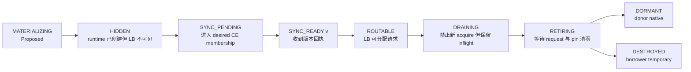
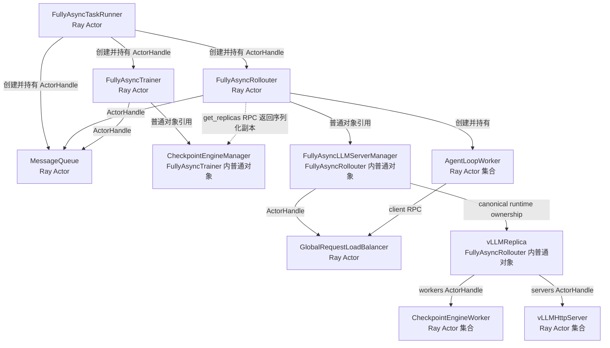
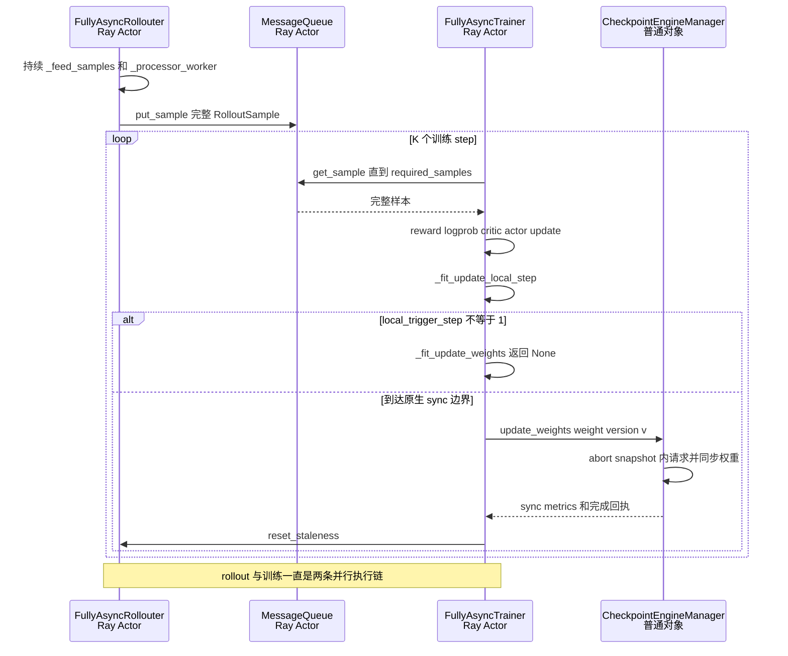
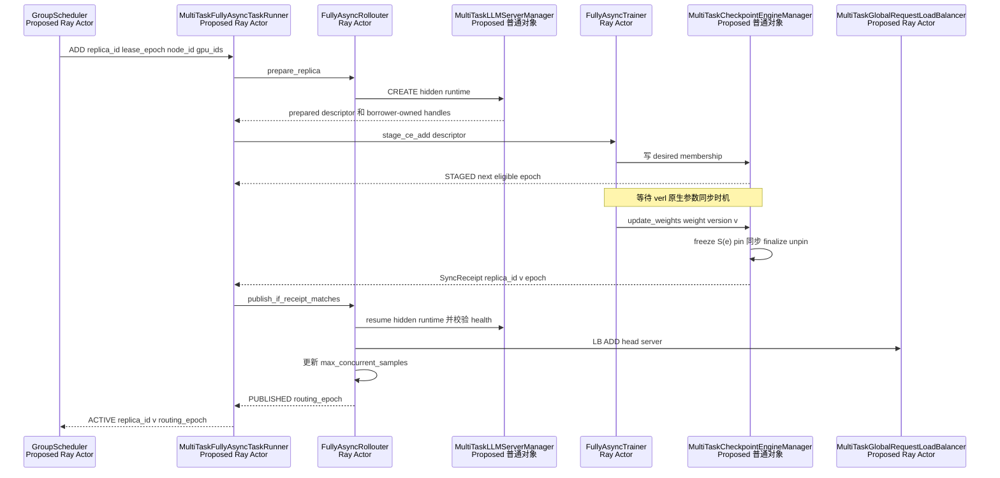
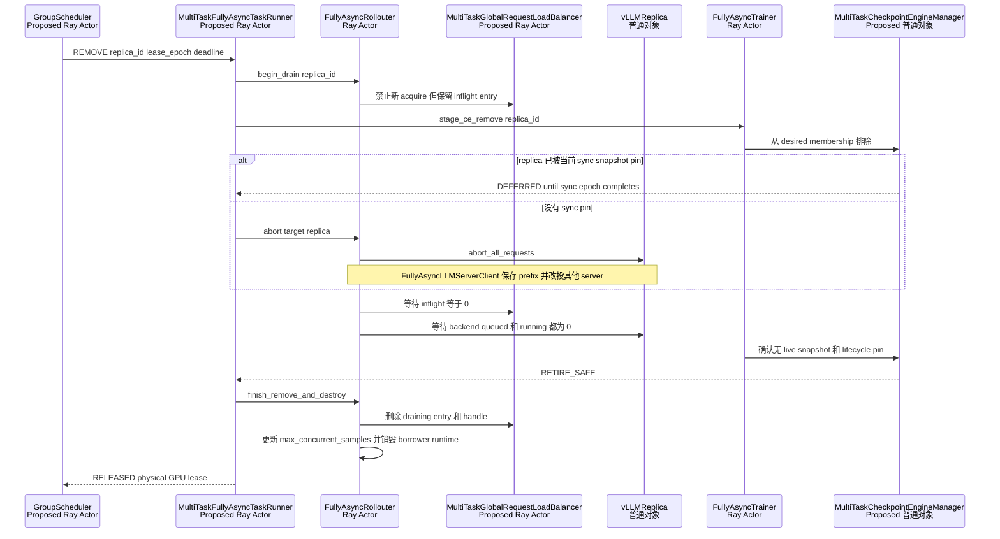
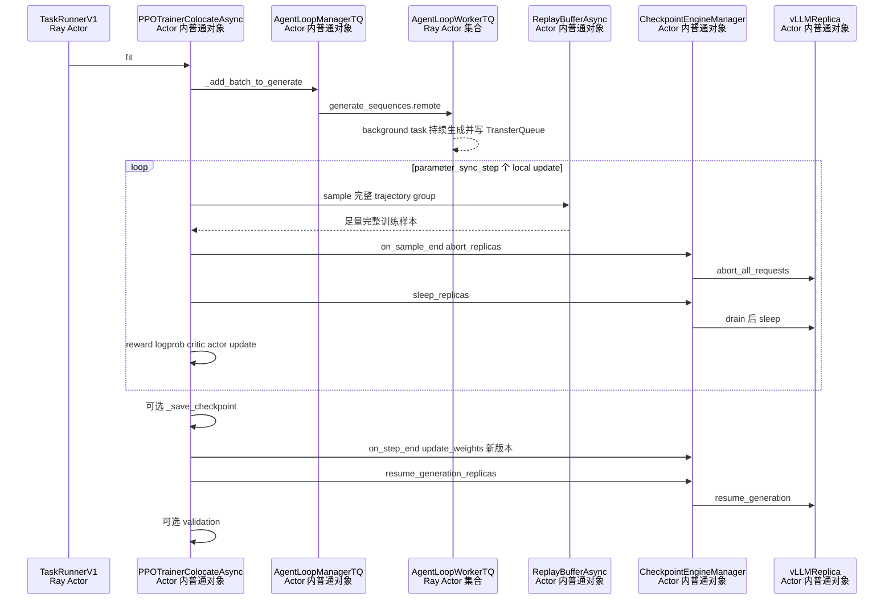
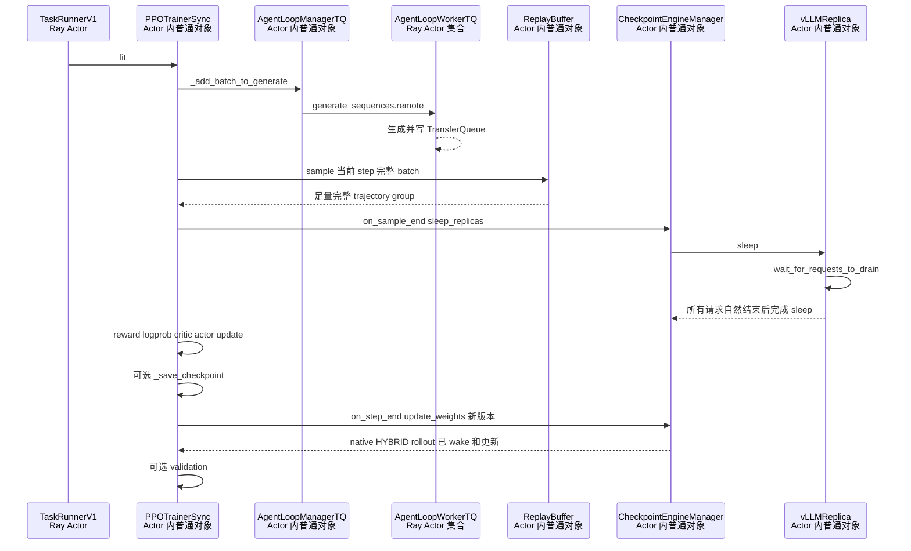
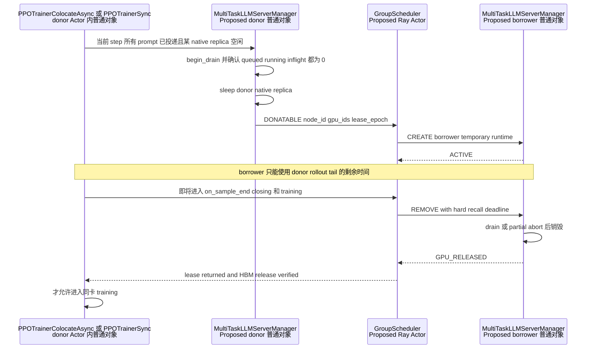

# verl v0.9.0 三种运行模式下动态 replica 扩缩容时机与互斥协议评审

> 状态：待评审，独立评审材料。
>
> 本文承接
> `16-verl-v0.9-dynamic-replica-view-and-reference-audit.md` 已确认的 M/C/L/G 四类视图，只分析动态 replica 的
> **创建、加入参数同步集合、加入 LB、摘流、退出参数同步集合、销毁**分别应在哪个时间点发生，以及它们与 rollout、
> training、参数同步、validation 等阶段如何互斥。
>
> 本文不会修改或替代 `multi_task_scheduler/【WIP】多RL任务资源共享调度RFC.md`。
>
> 源码目录：`/Users/nyp/Documents/verl`。
>
> 源码基线：`v0.9.0-1-g88512193`，commit
> `88512193628b95f24916c0898d51a8a877d09203`，分析时工作区干净。
>
> 分析日期：2026-09-01。

## 1. 本轮问题、范围和结论

### 1.1 本文必须分成三种运行模式

本轮不再只按“HYBRID / STANDALONE”两个部署标签给出一个通用时机，而按三条真实运行主链分别分析：

1. **STANDALONE + Fully Async**：入口是 `fully_async_main.py`，实际运行实体是并发执行的
   `FullyAsyncTrainer` 和 `FullyAsyncRollouter` 两个 Ray Actor；
2. **HYBRID + partial rollout**：V1 `PPOTrainerColocateAsync`；
3. **HYBRID + 同步 rollout**：V1 `PPOTrainerSync`。

这里有一个必须先纠正的边界：本文的 STANDALONE Fully Async **不是** V1
`PPOTrainerSeparateAsync`。`fully_async_main.main()` 把 `FullyAsyncTaskRunner` 传给 `run_ppo()`，见
`verl/experimental/fully_async_policy/fully_async_main.py:222-239`；后者创建 `FullyAsyncTrainer`、
`FullyAsyncRollouter` 和 `MessageQueue`，再让 trainer 与 rollouter 并发运行，见
`fully_async_main.py:77-110,117-157,186-210`。

### 1.2 “一个训练 step”在三种模式中不是同一个时间轴

| 模式 | 一个训练 step 的实际含义 | rollout 是否包含在同一顺序链中 | 原生参数同步边界 |
|---|---|---:|---|
| STANDALONE + Fully Async | `FullyAsyncTrainer.fit_step()` 从 `MessageQueue` 取一批完整样本并完成一次训练更新 | 否；`FullyAsyncRollouter.fit()` 在另一个 Actor 中持续运行 | 每累计 `trigger_parameter_sync_step=K` 个训练 step 后一次 |
| HYBRID + partial | `PPOTrainer.fit()` 外层 step 内，投递 prompt、异步采样、abort/sleep、训练、step-end sync | 是 | 每个外层 step 的 `on_step_end()` |
| HYBRID + 同步 | `PPOTrainer.fit()` 外层 step 内，投递 prompt、等请求自然完成、sleep、训练、step-end sync | 是 | 每个外层 step 的 `on_step_end()` |

Fully Async 中，`FullyAsyncTrainer.fit_step()` 的真实顺序是取样、reward/logprob/critic/actor update、更新本地版本计数、
条件参数同步，见 `fully_async_trainer.py:536-604`；只有 `_fit_update_local_step()` 把
`local_trigger_step` 重置为 1 时，`_fit_update_weights()` 才不再是 no-op，见
`fully_async_trainer.py:676-701`。因此 Fully Async 必须同时使用：

```text
训练 step 轴：T(i,1) -> T(i,2) -> ... -> T(i,K)
参数版本轴：  weight version i --sync--> weight version i+1
rollout 轴：  在上述全过程并行生成、被 sync abort、再自动续推
```

### 1.3 对“scaling 操作需要与参数同步互斥”的审视

这个方向只在**同步成员快照、发布和销毁**层面正确。把从创建到发布的完整 scaling 事务与参数同步用一把大锁互斥，会无端
阻塞训练和 rollout。六类动作应拆开：

| 动作 | 本文缩写 | 与参数同步的关系 |
|---|---|---|
| 创建 borrower runtime，但保持不可路由 | CREATE | 可以与其他 replica 的 sync 并行；不能在当前 snapshot cut 之后加入当前 sync |
| 写入 CE 下一目标集合 | CE ADD | 与 snapshot cut 线性化；sync 期间写入只影响下一 epoch |
| 把已同步 server 发布进 LB | LB ADD | 必须拿到明确版本回执，并与下一次 sync 的开始短暂互斥 |
| 停止给目标 server 分配新请求 | LB REMOVE / begin-drain | 可与 sync 并行；只改路由，不得立即丢掉 inflight 证据 |
| 从 CE 下一目标集合排除 | CE REMOVE | 与 snapshot cut 线性化；当前 snapshot 已 pin 时只影响下一 epoch |
| 销毁 borrower runtime | DESTROY | 必须等待 request、sync 和 lifecycle 引用全部归零；不得与引用目标的 sync 并行 |

直接结论是：

1. **GroupScheduler 可以实时决策，但命令只能先进入 task-local desired state；是否立即生效由当前模式的 phase gate 决定。**
2. **CREATE 可以提前隐藏执行，LB ADD 不能提前。**真正新建的 replica 必须收到版本为 `v` 的成功同步回执后才能接流。
3. **remove 是两阶段事务。**先 begin-drain，等 `LB inflight=0`、backend queued/running=0、sync pin=0，再 finish-remove 和销毁。
4. **partial 与同步模式的核心差异在强制回收。**partial 可以 abort 后以 `prompt + token prefix` 续推；同步模式只能自然 drain，
   否则会把未完成 sample 丢掉。
5. **HYBRID 还有物理 GPU 硬屏障。**donor 的训练引擎准备恢复计算前，使用其 GPU 的 borrower runtime 必须已销毁并释放 HBM。
6. **Fully Async 没有统一的 step-end rollout 静止点。**它必须通过跨 `FullyAsyncTrainer` / `FullyAsyncRollouter` Actor 的
   版本回执与 drain 回执完成事务。
7. **HYBRID 当前 naive Checkpoint Engine 不能只靠 `replicas.append()` 同步真正新建的 borrower endpoint。**这是当前方案的
   关键 GAP，不能把 CE ADD 写成已经可用的 AS-IS 能力。

## 2. 通用术语、状态和安全谓词

### 2.1 哪一个 replica 被创建或销毁

本文严格区分：

- **donor native replica**：donor 任务初始化时创建；捐出时摘流、abort/drain、sleep，但不销毁；
- **borrower temporary replica**：borrower 根据 `GroupScheduler` 租约中的 immutable node ID/GPU IDs 新建；回收时由
  borrower 销毁；
- donor 不持有 borrower temporary replica 的 manager、CE endpoint、server handle 或 LB 引用。

因此本文的 `DESTROY` 只指 borrower temporary replica。donor native replica 的对应终态是 `DORMANT`，资源归还后再由 donor
按自己的原生参数同步时机更新权重并唤醒。

### 2.2 Proposed `ReplicaRecord` 状态

以下状态是 TO-BE，不是 verl 现有类或字段：



状态之外还必须保存正交引用：

```text
sync_pins[replica_id, sync_epoch]
lifecycle_pins[replica_id, operation_id]
routing_epoch
lease_epoch
last_synced_weight_version
```

`DRAINING` 不代表没有请求，`SYNC_PENDING` 不代表已经有正确权重，`self.replicas` 中存在也不代表 LB 能路由；这三个概念不能
互相代替。

### 2.3 必须成立的安全谓词

记：

- `D`：CE desired membership；
- `S(e)`：sync epoch `e` 开始时冻结的 immutable replica snapshot；
- `I(r)`：LB 对 replica `r` 记录的 inflight 数；
- `Q(r)`、`R(r)`：backend queued / running request 数；
- `P_sync(r)`、`P_life(r)`：sync / lifecycle pin 数；
- `W(r)`：replica 已确认权重版本；
- `V_task`：borrower 当前准备发布的参数版本。

发布条件：

```text
CanPublish(r, V_task) =
    LeaseValid(r)
    and RuntimeHealthy(r)
    and W(r) == V_task
    and r in D
    and P_sync(r) == 0
    and RoutingState(r) == HIDDEN
    and not ValidationTopologyFrozen
```

物理销毁条件：

```text
CanDestroy(r) =
    IsBorrowerTemporary(r)
    and RoutingState(r) == DRAINING
    and NewAcquireDisabled(r)
    and I(r) == 0
    and Q(r) == 0
    and R(r) == 0
    and P_sync(r) == 0
    and P_life(r) == 0
    and r not in D
    and r not in any_live_sync_snapshot
```

HYBRID donor 进入训练还需额外满足：

```text
CanEnterHybridTraining(donor_gpu_set) =
    DonorNativeReplicaSlept(donor_gpu_set)
    and NoBorrowerRuntimeOn(donor_gpu_set)
    and LeaseReturnedToDonor(donor_gpu_set)
    and HBMReleaseVerified(donor_gpu_set)
```

任何一个条件无法证明，都只能返回 `DEFERRED` 或 `REJECTED`，不能把“命令已收到”解释为“scaling 已完成”。

### 2.4 AS-IS 为什么还不满足这些谓词

1. `CheckpointEngineManager.add_replicas()` / `remove_replicas()` 直接修改 `self.replicas`，见
   `verl/checkpoint_engine/base.py:430-445`；`update_weights()` 又在 abort、展平 worker、KV lifecycle、传权、finalize、resume
   多次重新读取该 list，见 `base.py:498-536`，没有 immutable `S(e)`。
2. `GlobalRequestLoadBalancer.remove_servers()` 直接删除 server 和 inflight entry，见
   `verl/workers/rollout/llm_server.py:138-149`；client 的 release 又是 fire-and-forget，见
   `llm_server.py:226-229,288-289`，所以 entry 不存在不能证明 `I(r)=0`。
3. STANDALONE vLLM server 的 `sleep()` / `wake_up()` 当前明确跳过，见
   `vllm_async_server.py:770-800`；`release_kv_cache()` 也只有 TODO 空实现，见
   `vllm_async_server.py:813-823`，不能把 RPC 返回当作 HBM 已释放的证据。

## 3. 场景一：STANDALONE + Fully Async

本节讨论强制回收时，假定 `async_training.partial_rollout=True`；verl 的 Fully Async 示例配置默认如此，见
`verl/experimental/fully_async_policy/config/fully_async_ppo_trainer.yaml:21-23`。如果显式设为 `False`，
`FullyAsyncLLMServerClient` 在 aborted output 后不会 retry，见 `llm_server.py:448-454`，其物理回收约束应按第 5 节同步模式的
“只允许自然 drain”处理。

### 3.1 AS-IS 运行实体和引用位置



图中所有 AS-IS 实体都来自真实类：

- `FullyAsyncTaskRunner` 是 `@ray.remote(num_cpus=1)`，见 `fully_async_main.py:35-49`；
- `FullyAsyncTrainer` 是 Ray Actor，见 `fully_async_trainer.py:53-58`；
- `FullyAsyncRollouter` 是 `max_concurrency=100` 的 Ray Actor，见 `fully_async_rollouter.py:329-335`；
- `MessageQueue` 是 Ray Actor，见 `message_queue.py:26-53`；
- canonical `FullyAsyncLLMServerManager` 位于 rollouter Actor 内，见
  `fully_async_rollouter.py:819-856`；
- `AgentLoopManager` 把 `AgentLoopWorker` 包成 Ray ActorClass，再执行 `.remote()` 创建 worker Actor，见
  `verl/experimental/agent_loop/agent_loop.py:1166-1221`；
- trainer 通过 `await self.rollouter.get_replicas.remote()` 得到序列化的 `RolloutReplica` 副本，再构造本 Actor 内的
  `CheckpointEngineManager`，见 `fully_async_trainer.py:217-224`。

最后一点决定了 Fully Async 不能在一个普通对象里完成原子更新：manager/LB 视图在 `FullyAsyncRollouter`，CE 视图在
`FullyAsyncTrainer`，必须做跨 Actor 的两阶段提交，但不需要新增通信 Actor。

### 3.2 一个训练 step 与一个参数版本周期

设 `K = async_training.trigger_parameter_sync_step`。AS-IS 时序是：



代码对应关系：

- rollouter 的 feeder 把 dataloader prompt 放入 `pending_queue`，见
  `fully_async_rollouter.py:859-890`；processor 按 `max_concurrent_samples` 创建生成 task，见
  `fully_async_rollouter.py:902-990`；完整结果才进入 `MessageQueue`，见
  `fully_async_rollouter.py:991-1015`；
- trainer 一次收满 `required_samples` 后才组 batch，见
  `fully_async_trainer.py:375-452,643-652`；
- 第 K 次训练后版本递增并执行参数同步，见
  `fully_async_trainer.py:676-701,729-756`；
- 非 naive STANDALONE 同步会 abort 当前 CE replica 集合、建临时 worker group、传权、finalize、resume，见
  `checkpoint_engine/base.py:486-538`；
- 同步后 rollouter 把 `staleness_samples` 重置为“仍在 active 的任务 + MessageQueue backlog”，并解除 pause，见
  `fully_async_rollouter.py:594-638`。

rollouter 还有显式 backpressure：

```text
max_required_samples = int(
    required_samples * (staleness_threshold + 1) * K
)
```

定义和计算见 `fully_async_rollouter.py:491-507`；队列满或 `staleness_samples >= max_required_samples` 时停止继续投递，见
`fully_async_rollouter.py:1142-1164`。这说明 Fully Async 虽持续运行，但不是无界推理；scaling 还必须同步更新实际容量
`max_concurrent_samples`。

### 3.3 六类操作在 Fully Async 周期中的时机矩阵

图例：`允许`表示可以完成该动作；`仅准备`表示可以创建或写 desired state，但不能对当前 epoch 生效；`仅摘流`表示只能停止新
请求；`等待`表示必须等该阶段结束。

| 动作 | F0 rollouter 正常生成 | F1 trainer 等待/取样 | F2 trainer 计算 | F3 snapshot cut + 参数同步 | F4 sync 回执后 | F5 validation |
|---|---|---|---|---|---|---|
| CREATE hidden runtime | 允许，前提是 GS lease 独占 GPU | 允许 | 允许 | 允许创建，但不能加入已 cut 的 snapshot | 允许 | 仅准备，不改验证拓扑 |
| CE ADD desired | 允许，等待下个 snapshot | 允许 | 允许 | **仅影响下一 epoch** | 允许，等下次原生 sync | 仅准备 |
| LB ADD | 禁止；没有本 epoch 回执 | 禁止 | 禁止 | 禁止 | **允许：版本回执 + publish gate** | 默认等待 validation 结束 |
| LB REMOVE begin-drain | 允许 | 允许 | 允许 | 允许只摘流，不能碰 sync lifecycle | 允许 | 默认等待 validation 结束 |
| CE REMOVE desired | 允许 | 允许 | 允许 | **仅影响下一 epoch；当前 snapshot 保持 pin** | 允许 | 仅记录 desired |
| DESTROY borrower runtime | drain/pin 全清零后允许 | 同左 | 同左 | **禁止销毁当前 snapshot 成员** | 条件满足后允许 | 默认等待 validation 结束 |

这里最容易出现的误解是“CE ADD 在 F2 完成，所以新 replica 能立刻服务”。F2 只写 `D`；真正权重版本只有 F3 的
`S(e)` 同步完成后才产生。若 ADD 晚于 snapshot cut，新 replica 必须等待下一参数版本周期，即再等 K 个训练 step。

### 3.4 Fully Async ADD：跨 Trainer / Rollouter Actor 的提交协议

以下是 TO-BE 时序，所有新增类均明确标为 Proposed：



这个协议没有增加通信组件：`FullyAsyncTaskRunner`、`FullyAsyncTrainer`、`FullyAsyncRollouter`、LB 都是该模式本来就有的 Actor；
子仓只扩展其接口和 task-local 普通对象。

关键线性化点有三个：

1. `stage_ce_add` 与 snapshot cut 在 CE membership gate 上二选一：cut 前进入当前 `S(e)`，cut 后进入下一 `S(e+1)`；
2. `SyncReceipt` 必须包含 stable replica ID、weight version、sync epoch 和 lease epoch；旧命令回执不能发布新 lease；
3. `LB ADD` 与下一次 sync 开始短暂互斥，避免刚接流的 replica 同时进入 abort/update lifecycle。

### 3.5 Fully Async REMOVE：摘流、续推和销毁



如果 REMOVE 在 sync 过程中到达，LB begin-drain 仍可立即执行，因为它只阻止新 acquire；但 target abort、sleep、CE endpoint
销毁必须等当前 sync lifecycle 结束。现有 `CheckpointEngineManager.update_weights()` 会在末尾 resume 当前集合，见
`checkpoint_engine/base.py:532-536`；TO-BE manager 必须保证 DRAINING 成员不会在同步结束后重新变成可路由状态，或者在 sync
完成后由 retire 流程再次 pause。当前 AS-IS 没有这个状态判断。

### 3.6 数值例子：版本 20 扩容、版本 22 缩容

假设 borrower 任务配置：

```text
2 个 STANDALONE replica：R0、R1
每个 replica = 4 GPU
concurrent_samples_per_replica = 16
required_samples = 32
K = trigger_parameter_sync_step = 4
staleness_threshold = 0.25
max_required_samples = int(32 * 1.25 * 4) = 160
初始 max_concurrent_samples = 2 * 16 = 32
```

扩容例子：

1. 当前 rollout 权重是 `v20`，trainer 正在执行本周期第 2 个训练 step；R0、R1 仍在并行生成。
2. GS 给出 donor GPU `[node-D, GPU4..7]` 的 lease；borrower manager 创建 B2，但 B2 保持 `HIDDEN`。
3. B2 在 `v21` snapshot cut 前完成 CE ADD，因此 `S(21)={R0,R1,B2}`。
4. 第 4 个训练 step 结束后，原生 `_fit_update_weights()` 同步 `v21`。B2 返回 `W(B2)=v21` 的成功回执。
5. task-local publish gate 先让 B2 backend ready，再把 B2 head server 加入 LB，并把
   `max_concurrent_samples` 从 32 更新为 48。
6. 如果第 3 步晚于 `v21` snapshot cut，B2 即使已经创建完成也只能等 `v22`；它不能用未证明版本参加 `v21` rollout。

缩容例子：

1. 在权重 `v22` 下，B2 有 5 个 inflight 请求，分别已经产生 `64/80/96/128/160` 个 token。
2. LB begin-drain 后不再给 B2 新请求，但保留 `I(B2)=5`。
3. 如果 B2 没有被当前 sync pin，borrower 对 B2 执行 targeted abort。五个
   `FullyAsyncLLMServerClient.generate()` 协程把 token prefix 保存在各自 Python coroutine frame，随后从 LB 重新 acquire R0/R1；
   已完成并进入 `MessageQueue` 的 32 个训练样本不受影响。
4. 五个旧 attempt 的 fire-and-forget release 全部到达后 `I(B2)=0`，backend 也确认 `Q(B2)=R(B2)=0`。
5. CE REMOVE 已使下一 snapshot 不含 B2；若当前 snapshot 曾 pin B2，还需等 finalize/unpin。
6. manager 销毁 B2，并把 `max_concurrent_samples` 从 48 调回 32，最后通知 GS 释放 GPU lease。

这个例子同时说明：`MessageQueue.queue_size==0`、`LB inflight==0`、`active_tasks==0` 是不同观测；其中任何一个单独为 0 都不足以
证明 runtime 可销毁。

### 3.7 当前实现能复用什么，缺什么

| 项目 | AS-IS 可复用能力 | GAP / TO-BE |
|---|---|---|
| 持续 rollout 与训练并行 | `FullyAsyncTrainer` / `FullyAsyncRollouter` 双 Actor | 需要跨 Actor scaling transaction ID 和回执 |
| partial abort/retry | `partial_rollout=True` 时复用 `FullyAsyncLLMServerClient`，`llm_server.py:345-461` | 需要 per-replica 摘流、请求 drain 证据；关闭 partial 时不得强制 abort |
| 参数同步 | STANDALONE 非 naive CE，`checkpoint_engine/base.py:486-538` | 一次 sync 必须固定 immutable snapshot |
| 动态容量计数 | `FullyAsyncRollouter._update_max_concurrent_samples()`，`fully_async_rollouter.py:1274-1294` | true-new STANDALONE add/remove 也必须调用；当前只连到既有接口 |
| manager add/remove | experimental manager 支持预注册 HYBRID replica，`fully_async_rollouter.py:144-259` | 它只从 `hybrid_replicas` 取对象，不会动态创建 STANDALONE runtime |
| HBM donation | 有 STANDALONE server 对象 | vLLM STANDALONE sleep/wake 是 no-op，无法证明显存已让出 |
| 控制 RPC | `FullyAsyncTaskRunner` 持有 trainer/rollouter handles | 它本身是同步 Ray Actor，`run()` 长时间阻塞；需 control concurrency group 或等价可达入口 |

## 4. 场景二：HYBRID + partial rollout

### 4.1 AS-IS 一个外层 step 的真实顺序

该模式由 `PPOTrainerColocateAsync` 实现。类本身明确启用 `FullyAsyncLLMServerClient`，见
`verl/trainer/ppo/v1/trainer_colocate_async.py:25-34`；`PPOTrainer` 初始化 manager 时把
`actor_rollout_wg` 传给 `LLMServerManager.create()`，replica 最终走 `RolloutReplica.init_hybrid()`，见
`trainer_base.py:350-362`、`llm_server.py:549-577`、`replica.py:131-141`。因此这里的 rollout mode 是 HYBRID，不是
`RolloutMode.COLOCATED`。



代码证据：

- 外层 `fit()` 在 `step()` 后先可选保存 checkpoint，再调用 `on_step_end()` 参数同步，最后才可选 validation，见
  `trainer_base.py:441-476`；
- `step()` 先投递一批 prompt，再执行 `parameter_sync_step` 个 `_step_once()`，见
  `trainer_base.py:509-534`；
- 每个 `_step_once()` 从 `ReplayBufferAsync` 取得完整样本，随后立刻调用 `on_sample_end()`，再做训练计算，见
  `trainer_base.py:536-586`；非 sync trainer 选择 `ReplayBufferAsync`，见 `trainer_base.py:142-188`；
- `PPOTrainerColocateAsync.on_sample_end()` 先 abort 全部 replica 再 sleep，`on_step_end()` 更新权重后 resume，见
  `trainer_colocate_async.py:48-59`；
- `AgentLoopWorkerTQ.generate_sequences()` 创建 fire-and-forget background task，见
  `agent_loop_tq.py:52-105`；一个 prompt 的所有 session 结束后才把状态写为 `finished`，见
  `agent_loop_tq.py:107-148`。

当 `parameter_sync_step > 1` 时，第一次 local update 的 `on_sample_end()` 已让 rollout 进入 sleep，后续 local update 依赖此前
warmup/并发生成积累在 TransferQueue 中的完整样本；`on_train_begin()` 的 warmup 投递见
`trainer_colocate_async.py:40-46`。参数同步和 resume 仍只发生在整个外层 step 末尾。

### 4.2 六类操作在 partial step 中的时机矩阵

先定义 borrower 任务本地 phase：

```text
H0 ROLLOUT_COLLECTING
H1 ROLLOUT_CLOSING = abort + drain + sleep
H2 TRAINING
H3 SAVE_CHECKPOINT（可选）
H4 SYNCING
H5 PUBLISH_AND_RESUME
H6 VALIDATING（可选）
```

| 动作 | H0 collecting | H1 abort/sleep | H2 training | H3 save | H4 sync | H5 publish/resume | H6 validation |
|---|---|---|---|---|---|---|---|
| CREATE hidden runtime | 允许，前提是 lease 有效 | 仅准备，不能与同一 target 的 lifecycle RPC 并发 | 允许；目标是外部 leased GPU | 允许 | 允许创建但错过 snapshot 后只能等下一 step | 仅准备 | 仅准备 |
| CE ADD desired | 允许 | 允许 | 允许 | 允许 | cut 前进入当前 snapshot；cut 后只进下一 snapshot | 等下一次 sync | 仅记录 desired |
| LB ADD | 禁止 | 禁止 | 禁止 | 禁止 | 禁止 | **成功同步、target resume 后允许** | 默认等待 |
| LB REMOVE begin-drain | 允许；可以立即阻止新 acquire | 应并入本轮 closing，必须早于 abort | 允许；replica 已 sleep 时更简单 | 允许 | 仅摘流，retire 等 sync 结束 | 与 publish 串行 | 默认等待 |
| CE REMOVE desired | 允许 | 允许 | 允许 | 允许 | 当前 snapshot 已 cut 时仅影响下一 epoch | 允许 | 仅记录 desired |
| DESTROY borrower runtime | targeted abort/drain 和 pin 清零后允许 | closing 完成后允许 | 条件满足即允许 | 条件满足即允许 | 当前 snapshot 成员禁止 | 与 publish/lifecycle gate 串行 | 默认等待 |

表中 H2“允许 DESTROY”只描述 borrower **本地**引用已经清空的临时实体；它不表示可以忽略 donor 任务的 GPU phase。若该 GPU
来自一个 HYBRID donor，borrower 的销毁 deadline 是 donor 的 `CanEnterHybridTraining` barrier，见第 7 节。

### 4.3 partial 模式怎样复用中断与续推

`FullyAsyncLLMServerClient.generate()` 的状态不是放在 vLLM server 或 TransferQueue 中，而是保存在每个活跃 client
coroutine frame：

```text
original prompt_ids
final_output.token_ids
final_output.log_probs
remaining max_tokens
min_global_steps
max_global_steps
```

每次 attempt 都发送 `prompt_ids + final_output.token_ids`；如果返回 `stop_reason=aborted/abort`，协程等待后重新 acquire server
并续推，见 `verl/workers/rollout/llm_server.py:372-456`。vLLM server 的 `abort_all_requests()` 会 pause engine、abort、等待
drain 并清 cache，见 `vllm_async_server.py:849-897`。

因此强制回收一个 target replica 的安全顺序应是：

```text
LB begin_drain(target)             # retry 不再选回 target
-> mark CE desired remove(target)
-> acquire lifecycle pin(target)
-> target.abort_all_requests()     # 不是 manager 全量 abort
-> 等旧 attempt 的 release 到 LB
-> 等 backend queued/running == 0
-> 等 current sync pin == 0
-> finish_remove(target)
-> destroy borrower runtime
```

当前 hook `CheckpointEngineManager.abort_replicas()` 会遍历 `self.replicas` 全量 abort，见
`checkpoint_engine/base.py:457-465`；它不是 per-replica API。`vLLMReplica.abort_all_requests()` 自身已经是单 replica 方法，见
`vllm_async_server.py:1206-1227`，所以子仓 manager 可以复用底层能力，但必须补 target stable ID、LB 两阶段 drain 和并发门禁。

TransferQueue 在这里保存的是 prompt/group 状态以及**完成后的 trajectory**，见
`replay_buffer.py:63-112`、`agent_loop_tq.py:177-227`；被 abort 的中间 token prefix 仍在
`AgentLoopWorkerTQ` 进程中的 client coroutine。scale-down 不能通过“把 partial prompt 放回 TransferQueue”来描述 AS-IS 行为。

### 4.4 partial ADD 的最佳提交点

新 borrower replica 可以在 H0 或 H2 期间 hidden materialize，并在 H4 snapshot cut 前进入 desired membership；但其最佳
LB publish 点是 H5：

```text
H4：原生 step-end weight sync
-> borrowed endpoint 返回 W(new)=v
-> 新 backend 在仍不可路由时 resume/health-check
-> LB ADD(new)
-> 更新 manager/routing epoch
-> resume 其他被 abort 的 replica
-> partial client retry 可选择 new
```

这个顺序让新 replica 不可能在版本未就绪时接流，同时允许上一 step 被中断的 logical request 在新实例上续推。它**不能改变已经
取走并用于本轮训练的 batch**，但可以加速下一轮样本以及跨版本 continuation。

必须强调当前 HYBRID GAP：`PPOTrainer.init()` 强制把 CE backend 设为 `naive`，见
`trainer_base.py:355-362`；naive `CheckpointEngineManager.update_weights()` 直接调用固定的
`actor_wg.update_weights()` 并返回，不读取动态 `self.replicas`，见 `checkpoint_engine/base.py:493-496`。worker 侧再把训练权重
更新到同进程 rollout engine，见 `engine_workers.py:719-805`。

因此真正按 node ID/GPU ID 新建的 borrower runtime 不属于固定 `actor_wg`。仅执行
`checkpoint_manager.add_replicas([new])` **不会**给它同步权重。HYBRID TO-BE 必须把 native HYBRID subset 与 borrower-owned
external endpoint subset 分开处理，并在同一个版本回执中汇合；具体 receiver 创建方式仍是后续设计问题。

### 4.5 partial REMOVE 的数值例子

假设 borrower 当前有：

```text
native HYBRID replicas：R0、R1
temporary borrowed replica：B0，4 GPU
当前 rollout weight version：v30
本次已投递 24 个 prompt group
训练只需先取得 16 个完整 group
```

流程如下：

1. `ReplayBufferAsync.sample()` 已取得 16 个完整 group；另外 8 个仍在生成。
2. B0 上有两个 unfinished request，分别已经生成 96 和 144 token；R0/R1 上还有其余 unfinished request。
3. GS 要在 donor 进入训练前收回 B0 的 4 GPU。borrower 先对 B0 begin-drain，使新的 acquire 和 sticky retry 都不能选 B0。
4. 在 H1，现有 `PPOTrainerColocateAsync.on_sample_end()` 会全量 abort；TO-BE retire 流程把 B0 纳入这次 abort/drain，但把它标为
   `DRAINING`，不能在 H5 被重新发布。
5. B0 的两个 client coroutine 分别保存 96/144-token prefix。当前 16 个完整 group 进入 v30 的训练；未完成 group 不在本批次。
6. B0 从下一 CE desired set 排除，待 LB release、backend drain 和 sync pin 全部清零后销毁，并在 donor barrier 前归还 GPU。
7. 训练产生 `v31` 后，R0/R1 完成原生同步并 resume。两个 coroutine 以
   `original_prompt + 96/144-token prefix` 改投 R0/R1 或另一个已发布的新 replica。
8. 最终 trajectory 的 `min_global_steps=30`、`max_global_steps=31`；该版本跨度由 client 在
   `llm_server.py:434-460` 记录，后续由异步采样策略按 off-policy 配置处理。

反例：如果 B0 已开始被 H4 的 sync snapshot 使用，GS 即使要求“立即销毁”，borrower 也只能先 begin-drain，等待 H4 finalize；
直接 kill B0 会使训练侧已经发出的 update/finalize RPC 失败。

### 4.6 partial 模式的 AS-IS / TO-BE / GAP 总结

| 结论 | 分类 | 证据或约束 |
|---|---|---|
| abort 后同一 logical request 可以以 token prefix 续推 | AS-IS | `llm_server.py:397-460` |
| `on_sample_end()` 全量 abort + sleep | AS-IS | `trainer_colocate_async.py:55-59` |
| scale-down 应复用 targeted abort，但先摘 LB | TO-BE | 底层 `vLLMReplica.abort_all_requests()` 可复用；LB 缺 drain |
| H5 是新实例发布和旧请求重路由的最佳窗口 | TO-BE | H4 已产生明确版本，H5 原生执行 resume |
| naive CE 能动态同步 true-new borrower replica | **不成立 / GAP** | naive path 只调用固定 `actor_wg` |
| partial prefix 已持久化进 TransferQueue | **不成立** | prefix 在活 coroutine；TQ 收完成 trajectory |

## 5. 场景三：HYBRID + 同步 rollout

### 5.1 AS-IS 一个外层 step 的真实顺序

`PPOTrainerSync` 使用默认 `LLMServerClient`，不启用 partial retry；初始化和每个 `on_step_end()` 做 naive 参数同步，
`on_sample_end()` 只调用 `sleep_replicas()`，见 `verl/trainer/ppo/v1/trainer_sync.py:24-42`。



`vLLMReplica.sleep()` 在调用所有 server sleep 前，先通过 head server 等请求 drain，见
`vllm_async_server.py:1200-1204`。worker 侧 naive update 又要求 rollout 在调用前已经 sleep，并在 update 后恢复 weights/KV，见
`engine_workers.py:719-805`。这构成同步模式最强的自然静止点：`on_sample_end()` 返回时，当前 manager 集合的 backend 请求应已
自然结束且 replica 已 sleep。

同步 ReplayBuffer 也不会使用 async off-policy drop/wait；类选择见 `trainer_base.py:142-188`。在启用 DAPO group filtering 时，
它取得足量 sample 后还会停止 speculative dispatch 并等 pending/running prompt 清零，见
`replay_buffer.py:404-475`。无论是否启用该分支，之后的 `sleep_replicas()` 仍是进入训练前的最终 drain barrier。

### 5.2 六类操作在同步 step 中的时机矩阵

定义 phase：

```text
S0 ROLLOUT_DISPATCH_AND_COLLECT
S1 NATURAL_DRAIN_AND_SLEEP
S2 TRAINING
S3 SAVE_CHECKPOINT（可选）
S4 SYNCING
S5 POST_SYNC_PUBLISH
S6 VALIDATING（可选）
```

| 动作 | S0 rollout | S1 natural drain/sleep | S2 training | S3 save | S4 sync | S5 post-sync | S6 validation |
|---|---|---|---|---|---|---|---|
| CREATE hidden runtime | 允许，但不能接流 | 仅准备 | 允许；目标是 leased 外部 GPU | 允许 | 允许创建但错过 cut 后等下一 step | 仅准备 | 仅准备 |
| CE ADD desired | 允许 | 允许 | 允许 | 允许 | cut 前进入当前；cut 后进入下一 epoch | 等下一 sync | 仅记录 desired |
| LB ADD | 禁止 | 禁止 | 禁止 | 禁止 | 禁止 | **版本回执后允许** | 默认等待 |
| LB REMOVE begin-drain | 允许；未来请求改投其他 replica | 允许并等待自然结束 | 允许；此时原集合已 sleep | 允许 | 仅摘流 | 与 publish 串行 | 默认等待 |
| CE REMOVE desired | 允许 | 允许 | 允许 | 允许 | 当前 snapshot 已 pin 时只影响下一 epoch | 允许 | 仅记录 desired |
| DESTROY borrower runtime | **只能等自然 drain；禁止强制 abort** | drain、sleep、pin 清零后允许 | 条件满足允许 | 条件满足允许 | 当前 snapshot 成员禁止 | 与 publish 串行 | 默认等待 |

同步模式并不是“只能在 step 边界开始 remove”。LB begin-drain 可以在 S0 实时执行，让之后的 prompt 改投其他 replica；但
`DESTROY` 必须等待 S1 的自然完成。真正不能做的是：为满足 deadline 在 S0 强制 abort，然后假设请求会自动续推。

### 5.3 同步模式为何不能直接复用 partial 强制回收

默认 `LLMServerClient.generate()` 只有一次 backend 调用；无论成功还是异常，finally 都只 release server，见
`llm_server.py:239-289`。它没有 `final_output.token_ids` 累加和 `stop_reason=aborted` retry loop；该逻辑只在
`FullyAsyncLLMServerClient` 中，见 `llm_server.py:292-461`。

因此同步模式的安全策略是：

```text
begin_drain(target)
-> 不再给 target 新请求
-> 已分配请求自然完成
-> LB inflight == 0
-> backend queued/running == 0
-> sleep target
-> 从下一 CE snapshot 排除
-> sync/lifecycle pin == 0
-> destroy borrower target
```

如果 donor 给出的 reclaim deadline 小于最长请求剩余时间，任务必须返回 `DEFERRED`/`CANNOT_MEET_DEADLINE`；要获得强制中断
能力，就需要把该路径改成 partial-capable client 和完备的重试语义，这已经是运行模式改变，不是一个普通 scale hook。

### 5.4 同步 REMOVE 的数值例子

假设本任务有 R0、R1 两个 native HYBRID replica，以及 B0 一个 4-GPU borrowed temporary replica：

```text
当前版本 v40
本 step 共投递 16 个 prompt group
13 个已经完成
B0 上仍有 2 个请求，R1 上仍有 1 个请求
GS reclaim deadline = 5 秒
```

1. borrower 立即把 B0 改为 DRAINING；新的请求只能发给 R0/R1。
2. B0 的两个请求估计还需 2 秒和 30 秒。因为本模式没有 transparent continuation，不能在第 5 秒 kill B0。
3. 若 30 秒请求确实运行到结束，B0 的 LB inflight 和 backend running 才都归零；`on_sample_end()` 的
   `sleep_replicas()` 也会等待这一事实。
4. 如果 B0 未被即将开始的 sync snapshot 纳入，borrower 可在 S1/S2 retire 并销毁 B0；如果已经被 S4 snapshot pin，只能等
   sync finalize。
5. 对这次 5 秒 deadline，正确回复是不能按期强制回收；错误做法是删除 LB entry 后把“查询返回 0”误判为 drain 完成。

这个例子也解释了“某个 replica 当前 inflight=0”与“任务进入长尾、可捐赠”并不等价。只有确认本 step 所有 prompt 已提交、
上游不再补充、该 replica queued/running 都为 0，且该 GPU 的训练回收 deadline 可满足时，才形成真实的 tail bubble。

### 5.5 同步 ADD 的版本例子

假设 B1 在 S0 的 `v40` rollout 期间完成 runtime 创建：

1. B1 没有 `v40` 权重回执，不能参加当前 16 个 prompt 的路由；
2. B1 在 S4 snapshot cut 前完成 CE ADD，才有资格在 step-end 接收 `v41`；
3. 成功回执 `W(B1)=v41` 后，S5 把 B1 加入 LB；它从下一 step 开始服务；
4. 若 B1 晚于 S4 snapshot cut，必须等 `v42`，不能给它贴一个推测版本号后提前发布。

HYBRID naive endpoint GAP 与 partial 场景完全相同：固定 `actor_wg` 不会因为 `self.replicas` 增加而多出一个外部 receiver。这个
时机方案成立的前提，是后续先实现 borrower-owned 动态同步 endpoint。

### 5.6 同步模式的 AS-IS / TO-BE / GAP 总结

| 结论 | 分类 | 证据或约束 |
|---|---|---|
| `on_sample_end()` 自然 drain 后 sleep | AS-IS | `trainer_sync.py:40-42`、`vllm_async_server.py:1200-1204` |
| 默认 client 不支持 aborted prefix 自动续推 | AS-IS | `llm_server.py:239-289` 与 `292-461` 对比 |
| S0 可 begin-drain，S1 才能证明 request 已结束 | TO-BE | LB 与 backend 双重回执 |
| deadline 不足时允许强杀且不损失 sample | **不成立** | 没有 partial retry 状态 |
| 新 borrowed replica 可直接加入 naive CE list 完成同步 | **不成立 / GAP** | naive path 只覆盖固定 `actor_wg` |

## 6. 三种模式的横向对比

### 6.1 架构和时间语义对比

| 对比项 | STANDALONE + Fully Async | HYBRID + partial | HYBRID + 同步 |
|---|---|---|---|
| 训练主类 | `FullyAsyncTrainer` Ray Actor | `PPOTrainerColocateAsync` 普通对象，位于 `TaskRunnerV1` Actor | `PPOTrainerSync` 普通对象，位于 `TaskRunnerV1` Actor |
| rollout 主类 | `FullyAsyncRollouter` Ray Actor | `AgentLoopManagerTQ` + `AgentLoopWorkerTQ` | `AgentLoopManagerTQ` + `AgentLoopWorkerTQ` |
| manager 位置 | `FullyAsyncRollouter` Actor 内 | `TaskRunnerV1` Actor 内 | `TaskRunnerV1` Actor 内 |
| CE 位置 | `FullyAsyncTrainer` Actor 内，持有 replica 序列化副本 | 与 trainer 同一 Actor 内 | 与 trainer 同一 Actor 内 |
| 完整 sample 载体 | `MessageQueue` 中序列化 `RolloutSample` | TransferQueue trajectory/group | TransferQueue trajectory/group |
| partial prefix 位置 | `AgentLoopWorker` 中 client coroutine | `AgentLoopWorkerTQ` 中 client coroutine | 不存在 transparent partial retry 状态 |
| 原生 CE backend | STANDALONE 非 naive | HYBRID naive | HYBRID naive |
| 参数同步频率 | 每 K 个 trainer `fit_step()` | 每个外层 step 末尾 | 每个外层 step 末尾 |
| rollout 与训练并行 | 是 | 否，同卡阶段切换 | 否，同卡阶段切换 |
| 强制回收可行性 | `partial_rollout=True` 时可复用 partial，但需 per-replica 协议；否则只能自然 drain | 可复用 partial，但需 per-replica 协议 | 不可透明强制；只能自然 drain |
| 新实例最早 LB ADD | 下一次包含它的 native sync 回执后 | 当前 step-end sync 回执后 | 当前 step-end sync 回执后 |
| 新实例能否处理旧 partial | 可以，发布后被 retry 选中 | 可以，发布后被 retry 选中 | 不存在旧 partial retry；从下一 step 服务 |
| 额外容量状态 | 必须同步更新 `max_concurrent_samples` | 主要由 LB 路由集合体现 | 主要由 LB 路由集合体现 |
| 物理硬屏障 | rollout GPU 与 trainer 分离；仍需 donor lease/CE 隔离 | donor 若为 HYBRID，borrower 必须在 donor training 前离场 | 同左，且只能等自然 drain |

### 6.2 六类动作的最早安全时机

| 动作 | STANDALONE + Fully Async | HYBRID + partial | HYBRID + 同步 |
|---|---|---|---|
| CREATE | lease 生效后可随时 hidden materialize | lease 生效后可在 collecting/training hidden materialize | 同 partial |
| CE ADD | 在任意时刻写 desired；snapshot cut 决定本 epoch/下 epoch | step-end sync cut 前完成可进本 step sync | 同 partial |
| LB ADD | native sync receipt 后，跨 Actor publish | step-end sync 后、resume 窗口 | step-end sync 后、下一 step 前 |
| LB REMOVE | 任意时刻 begin-drain；target lifecycle 与 sync 分开 | collecting 可 begin-drain，closing 前完成路由摘除最佳 | collecting 可 begin-drain |
| CE REMOVE | 任意时刻写 desired；当前 pin 不失效 | sync cut 前排除当前，cut 后排除下一 epoch | 同 partial |
| DESTROY | drain + backend idle + sync/lifecycle pin 归零 | partial abort/drain 后；若 donor recall，必须赶在 donor training barrier 前 | 只能等自然 drain；deadline 不足则推迟/拒绝 |

### 6.3 哪些事情真正互斥

| 资源或门禁 | 必须互斥的双方 | 不必互斥的动作 |
|---|---|---|
| CE membership gate | `CE ADD/REMOVE` 的线性化提交与 `S(e)` snapshot cut | snapshot cut 结束后，hidden CREATE 可继续；desired 更新可记录给下一 epoch |
| per-replica lifecycle gate | target 的 abort/sleep/wake/destroy 与当前 sync 对 target 的 abort/KV/update/finalize/resume | LB begin-drain 只改路由，可先执行 |
| sync pin | DESTROY 与任何已发出的 worker/update/finalize RPC | CE desired REMOVE 可以先记录 |
| publish gate | LB ADD 与下一 sync start、同一 replica 的 retire | 其他不相关 replica 的 CREATE |
| validation topology gate | LB ADD、finish-remove、abort 和物理销毁与 validation | hidden CREATE、desired 记录可延期提交 |
| HYBRID GPU phase gate | donor training 与同 GPU 上任意 borrower runtime | borrower 在其他节点/GPU 上的普通训练计算 |
| GS lease fence | 两个 task 对同 node ID/GPU IDs 的 runtime 创建 | CE/LB 的 task-local metadata 操作 |

因此不应存在一把覆盖 `CREATE -> sync -> LB ADD` 或 `begin-drain -> DESTROY` 全生命周期的长持有全局锁。正确做法是短暂冻结
membership、用 pin 保护异步 RPC，再用 per-replica lifecycle gate 收敛。

## 7. TO-BE 最小互斥协议

### 7.1 CE 每个 epoch 必须只使用一个 immutable snapshot

以下伪码描述 TO-BE 语义，不是 verl 当前实现：

```python
async def update_weights_at_native_boundary(weight_version: int):
    async with membership_gate:
        sync_epoch = next_sync_epoch()
        snapshot = tuple(
            record
            for record in desired_members.values()
            if record.runtime_ready and record.lease_valid
        )
        pin_sync(snapshot, sync_epoch)

    try:
        # 下列每一步只能使用 snapshot，禁止重新读取 mutable desired_members。
        await abort_for_sync(snapshot)
        rollout_wg = build_rollout_worker_group(snapshot)
        await release_kv(snapshot)
        await transfer_weights(rollout_wg, weight_version)
        await finalize(snapshot)
        await resume_non_draining_members(snapshot)
        return SyncReceipt(sync_epoch, weight_version, stable_ids(snapshot))
    finally:
        unpin_sync(snapshot, sync_epoch)
```

现有实现的问题正是上述各步重新读取 `self.replicas`：abort 在 `checkpoint_engine/base.py:498-500`，worker flatten 在
`501-505`，release KV 在 `508-509`，传权在 `511-518`，finalize 在 `526-530`，resume 在 `532-536`。只给
`add_replicas()` / `remove_replicas()` 外面加普通 list lock 仍不够，整个 epoch 必须持有同一个对象 tuple 和对应 pin。

对于 HYBRID naive：native fixed `actor_wg` 与 true-new borrower endpoint 的数据面不同。上述 `snapshot` 是统一控制语义，后续实现
可能需要：

```text
native_hybrid_subset -> actor_wg.update_weights(mode="naive")
borrowed_endpoint_subset -> 尚待设计的 borrower-owned receiver path
两边都成功 -> 合并成一个 SyncReceipt(weight_version=v)
任一失败 -> borrowed replica 保持 HIDDEN，不做 LB ADD
```

这不是说当前 CE 已支持 mixed backend，而是明确时机设计对 receiver 实现提出的接口要求。

### 7.2 ADD 事务伪码

```python
async def admit_add(command):
    assert command.lease_epoch == current_lease_epoch(command.replica_id)
    record = await runtime_manager.materialize_hidden(command.node_id, command.gpu_ids)
    await checkpoint_view.stage_add(record.sync_descriptor)
    return Accepted(wait_for_native_sync=True)

async def on_native_sync_receipt(receipt):
    for replica_id in receipt.replica_ids:
        record = registry[replica_id]
        if not record.desired or record.lease_epoch != receipt.lease_epoch:
            continue  # 命令已被 supersede，禁止发布旧实例
        if receipt.weight_version != trainer_current_publish_version():
            continue
        async with publish_gate, record.lifecycle_gate:
            await record.resume_and_health_check()
            await load_balancer.add_server(record.head_server)
            record.routing_state = "ROUTABLE"
            await update_mode_specific_capacity()
```

`GroupScheduler` 不调用第二个函数。它只提交目标状态；回调由 verl 原生 sync hook 完成后触发：

- Fully Async：包装 `FullyAsyncTrainer._fit_update_weights()` 的成功返回，代码边界是
  `fully_async_trainer.py:690-788`；
- HYBRID partial：包装 `PPOTrainerColocateAsync.on_step_end()`，代码边界是
  `trainer_colocate_async.py:48-53`；
- HYBRID sync：包装 `PPOTrainerSync.on_step_end()`，代码边界是 `trainer_sync.py:35-38`。

### 7.3 REMOVE 事务伪码

```python
async def admit_remove(command):
    record = registry.require(command.replica_id, command.lease_epoch)

    # 线性化点 1：以后不再分配新请求，但必须保留 handle 和 inflight counter。
    await load_balancer.begin_drain(record.server_id)
    record.routing_state = "DRAINING"

    # 只改变下一目标集合；不撤销已经存在的 sync pin。
    await checkpoint_view.stage_remove(record.sync_descriptor)

    if record.sync_pins:
        return Deferred(until="sync_unpin")

    async with record.lifecycle_gate:
        if mode_supports_partial_retry:
            await record.replica.abort_all_requests()
        else:
            await record.replica.wait_for_requests_to_drain()

        await wait_until(
            lb_inflight(record) == 0
            and backend_queued(record) == 0
            and backend_running(record) == 0
            and not record.sync_pins
            and not record.lifecycle_pins
        )

        # 线性化点 2：此后 release 不会再合法地到达该 entry。
        await load_balancer.finish_remove(record.server_id)

        if record.origin == "BORROWED_TEMPORARY":
            await runtime_manager.destroy(record)
        else:
            await runtime_manager.mark_dormant(record)
```

同步模式的 `wait_for_requests_to_drain()` 分支没有 deadline 内强制成功保证；partial 两种模式也只有在至少还有一个可路由 server、
client coroutine 存活且 retry 没有被 staleness/drop 策略取消时，才可以宣称 request continuation。

### 7.4 `begin_drain()` 为什么不能等价于当前 `remove_servers()`

当前 LB 的数据结构只有：

```text
_servers[server_id] -> ActorHandle
_inflight_requests[server_id] -> count
_request_id_to_server[request_id] -> sticky server_id
```

见 `llm_server.py:69-81`。当前 `remove_servers()` 同时 pop 前两项，见 `llm_server.py:138-149`；旧 client 稍后执行
`release_server()` 时，因为 key 已不存在而直接 return，见 `llm_server.py:116-121`。TO-BE 至少需要：

```text
ACTIVE:    可 acquire，保留 handle/counter
DRAINING:  不可新 acquire，仍保留 handle/counter，旧 release 继续计数
REMOVED:   counter==0 且 backend==0 后才删除 handle/counter
```

sticky cache 命中 DRAINING server 时必须删除旧 sticky 选择并重新选 ACTIVE server；否则 partial retry 仍可能回到待销毁实例。

## 8. GroupScheduler 与 TaskRunner 的实时命令可达性

### 8.1 两条主链都存在 TaskRunner 长方法阻塞

V1 HYBRID 中，`run_ppo()` 创建 TaskRunner Actor 并同步等待 `runner.run.remote(config)`，见
`verl/trainer/main_ppo.py:77-94`；`TaskRunnerV1.run()` 在同一个 method 中完成 trainer init 和整个 `fit()`，见
`main_ppo.py:103-110,134-164`。

Fully Async 中，`FullyAsyncTaskRunner.run()` 调用初始化和 `_run_training_loop()`，后者又长期等待 trainer/rollouter futures，见
`fully_async_main.py:35-49,186-210`。

两者都是同步 Ray Actor class，没有为 GroupScheduler command method 声明独立 concurrency group。仅新增
`scale_replica.remote()` 会让 RPC 在 `run()` 后排队，无法满足实时扩缩容。

### 8.2 不新增通信 Actor 的扩展方式

TO-BE `MultiTaskTaskRunner` 可以给控制方法配置独立 concurrency group，但控制 method 只做：

```text
校验 task session / command ID / lease epoch / deadline
-> 写入幂等 command journal 或 task-local mailbox
-> 返回 ACCEPTED / DEFERRED / STALE / REJECTED
```

它不能在并发线程里直接修改 `PPOTrainer`、`CheckpointEngineManager.self.replicas` 或 manager 裸 list。

- HYBRID：Trainer phase hook 在 H0/H1/H4/H5 或 S0/S1/S4/S5 的许可点串行 reconcile mailbox；
- Fully Async：TaskRunner 通过现有 `FullyAsyncTrainer` / `FullyAsyncRollouter` ActorHandle 执行两阶段 RPC，两个 Actor 各自在自己的
  lock/gate 中提交本地视图；
- GroupScheduler 仍只和 TaskRunner 通信，没有引入新的中转 Actor。

Ray concurrency group 的运行语义可参考官方文档：
[Limiting Concurrency Per-Method with Concurrency Groups](https://docs.ray.io/en/latest/ray-core/actors/concurrency_group_api.html)。

## 9. donor 物理 GPU 交接时机

前面各表主要描述 borrower 任务如何更新自己的 M/C/L 视图。跨任务共享还必须在 donor 侧证明物理 GPU 已可借出。

### 9.1 HYBRID donor：只存在 rollout tail 内的短租约窗口



HYBRID 训练和 rollout 使用同一 worker/GPU；`RolloutReplica.init_hybrid()` 直接切片
`actor_rollout_wg.workers`，见 `replica.py:131-141`。`PPOTrainer._step_once()` 又在 `on_sample_end()` 返回后马上做 logprob、critic、
actor update，见 `trainer_base.py:536-586`。因此 borrowed runtime 未退出时，donor 不能越过训练 barrier。

该架构约束带来一个必须审视的现实问题：true-new vLLM runtime 的创建和销毁开销都要从 tail bubble 中扣除。如果典型 tail 只有数秒，
动态新建可能没有正收益；这不影响协议正确性，但后续策略必须用收益模型过滤无效租约。

partial donor 可以对未完成请求 abort/retry；同步 donor 只能自然 drain。因此同样的 hard recall deadline 在同步 donor 上更容易失败。

### 9.2 STANDALONE donor：租约可以跨 donor training，但不能跨 donor CE snapshot

STANDALONE rollout GPU 不参与本任务 trainer compute，因此 donor native replica 安全 sleep 后，lease 可以覆盖 donor 的训练阶段。
但 donor 仍可能在原生参数同步时访问该 native replica；所以安全顺序是：

```text
donor LB begin_drain
-> partial abort 或自然 drain
-> donor native replica 真实 sleep 并验证 HBM 释放
-> donor CE desired REMOVE
-> 等所有重叠 sync snapshot unpin
-> GS 激活物理 lease
-> borrower CREATE / sync / LB ADD / serve
-> borrower LB REMOVE / CE REMOVE / DESTROY
-> GS 归还 lease
-> donor CE desired ADD
-> donor 下一次原生 sync 获得 donor 当前权重
-> donor LB ADD / wake
```

donor native replica 不销毁，也不能在 lease 有效期间继续出现在 donor 的 sync snapshot。当前 STANDALONE server sleep 是 no-op，
所以“真实释放 HBM”仍是实现前置 GAP，而不是一个已经存在的 RPC guarantee。

## 10. validation、checkpoint、初始化和 shutdown

### 10.1 validation 默认冻结路由拓扑

V1 `PPOTrainer.fit()` 在 step 结束后按频率调用 `_validate()`，见 `trainer_base.py:466-476`；validation 复用同一
AgentLoop/LB，见 `trainer_base.py:959-999`。Fully Async 也只在参数版本边界按频率调用 rollouter validation，见
`fully_async_trainer.py:812-830`。

默认建议在 validation 期间：

- 禁止 LB ADD、finish-remove、target abort 和 runtime destroy；
- 允许不改变可见拓扑的 hidden CREATE；
- 允许把 CE ADD/REMOVE 记录进 desired set，但只在 validation 结束后的 snapshot/publish gate 生效。

这是为了让一次 validation 使用固定的 server 集合、sticky routing 和故障面。若以后允许 elastic validation，需要另设 validation
topology epoch，不能默认沿用训练流量的即时伸缩。

### 10.2 checkpoint save 不是 replica membership 提交点

V1 在训练完成后、`on_step_end()` 参数同步前执行 `_save_checkpoint()`，见 `trainer_base.py:448-464`。Fully Async 在
`fit_step()` 的 validation 后调用 `_fit_save_checkpoint()`，见 `fully_async_trainer.py:598-604,873-898`。这些路径主要保存训练
worker/model、优化器和 dataloader 状态，不给新 rollout replica 产生权重版本回执。

因此：

- hidden CREATE 可以与普通 checkpoint save 并行，前提是没有同 GPU/HBM 冲突；
- checkpoint 完成不能作为 LB ADD 的依据；
- task checkpoint 不应持久化临时 Ray ActorHandle。恢复后 borrowed capacity 必须重新向 GS 协商并重建；
- shutdown/session epoch 变化时，旧 scaling receipt 全部失效。

### 10.3 初始化和 shutdown

- HYBRID 两个 Trainer 都在 `on_init_end()` 做第一次参数同步，见
  `trainer_sync.py:31-33`、`trainer_colocate_async.py:36-38`；
- Fully Async 在 trainer/rollouter、MessageQueue 和 CE 建好后，在 fit 前调用一次 `_fit_update_weights()`，见
  `fully_async_main.py:77-110`；
- 任务只有在初始 sync、manager/LB 初始化和 GS 注册都成功后才应报告 `TASK_READY`；
- shutdown 后拒绝新 ADD，先 drain/retire borrower runtime，再注销 GS lease，最后关闭 TransferQueue/MessageQueue；不能让 task
  session 结束后遗留可路由 server。

## 11. 需要扩展的代码边界

| 边界 | 当前类/位置 | 本轮要求 | 优先归属 |
|---|---|---|---|
| 实时命令入口 | `TaskRunnerV1`、`FullyAsyncTaskRunner` | control concurrency group、fencing、幂等 mailbox | 子仓自定义 TaskRunner |
| HYBRID phase hook | `PPOTrainerColocateAsync` / `PPOTrainerSync` hooks | 在 closing、sync receipt、validation 周围 reconcile | 子仓 Trainer subclass/mixin |
| Fully Async transaction | `FullyAsyncTrainer` / `FullyAsyncRollouter` 两个 Actor | stage、receipt、publish、retire 的跨 Actor RPC | 子仓扩展；可能需少量 verl hook |
| canonical registry | `LLMServerManager` / `FullyAsyncLLMServerManager` | stable ID、origin、lease、routing、sync/lifecycle pin | `MultiTaskLLMServerManager` Proposed |
| LB drain | `GlobalRequestLoadBalancer` | `ACTIVE/DRAINING/REMOVED`、保留 counter/handle | 自定义 LB subclass |
| CE snapshot | `CheckpointEngineManager` | desired membership、immutable snapshot、pin、receipt | subclass 或 verl 扩展点 |
| HYBRID true-new sync | naive fixed `actor_wg` | borrower-owned dynamic receiver；native/borrowed receipt 汇合 | 关键 GAP，预计有侵入 |
| STANDALONE true-new sync | `RolloutReplica.workers` + non-naive CE | 不复用 donor PG 的 borrower-owned receiver | 关键 GAP，另行设计 |
| per-replica lifecycle | CE 当前只有全量 helper | stable-ID targeted abort/sleep/wake | 子仓 manager wrapper 可起步 |
| Fully Async capacity | `_update_max_concurrent_samples()` | LB publish/finish-remove 同事务更新 | 扩展 `FullyAsyncRollouter` |
| STANDALONE HBM release | vLLM server sleep/wake no-op | 可验证的真正 offload/sleep | verl/backend 改造 |

本轮只确定这些边界和时机，不在本文选择动态 receiver 的具体创建方案。

## 12. 待评审结论

1. 是否同意把分析固定为三种运行模式，而不是用一个“HYBRID/standalone step boundary”概括全部场景。
2. 是否同意 Fully Async 的最小调度单位必须是“训练 step + 参数版本周期 + 并行 rollout”三条时间轴。
3. 是否同意六类动作拆分：CREATE 和 begin-drain 可提前；CE membership 与 snapshot cut 线性化；LB ADD 等版本回执；DESTROY 等
   request/pin 全清零。
4. 是否同意 HYBRID partial 可以复用 client coroutine 的 prefix retry，但必须新增 per-replica 摘流和 target abort；不能声称
   partial prompt 已被放回 TransferQueue。
5. 是否同意 HYBRID 同步模式不能强制 abort 后透明续推；deadline 不满足时必须 defer/reject。
6. 是否同意 HYBRID true-new borrower replica 目前不能通过简单 `CE.add_replicas()` 完成参数同步，必须先解决固定
   `actor_wg` 之外的动态 endpoint。
7. 是否同意 Fully Async 的 manager 与 CE 分属两个 Ray Actor，因此需要 TaskRunner 协调两阶段提交和版本回执，而不是共享一份
   Python list。
8. 是否同意 HYBRID donor 的 hard barrier 是“borrower runtime 完全退出并验证 HBM 释放”之后才能进入训练；STANDALONE donor
   虽可跨训练借出，但必须从所有重叠 CE snapshot 排除。
9. 是否同意 validation 默认冻结 LB 可见拓扑，checkpoint save 不产生可发布的 rollout 权重版本。

## 13. 最终结论

动态 replica 的安全时机不是一个统一的“step 边界”，而是三类模式各自的阶段门禁与两个共同线性化点：

```text
共同线性化点 A：CE desired membership <-> immutable sync snapshot cut
共同线性化点 B：LB begin-drain / publish <-> request routing epoch
共同保护条件：request drain + backend idle + sync/lifecycle pin + GS lease fence
```

- STANDALONE Fully Async 中，CREATE/REMOVE 可以与 trainer compute 并行，但 CE 和 LB 分处两个 Actor；新增实例等下一次原生 sync
  receipt，移除实例用 partial retry 后再跨 Actor retire。
- HYBRID partial 中，最自然的 remove commit 点是 `on_sample_end()` 的 abort/sleep closing，最自然的 add publish 点是
  `on_step_end()` 的 sync/resume 窗口；旧 partial 可以在新实例上续推。
- HYBRID 同步中，LB 可实时 begin-drain，但物理回收只能等请求自然结束；不存在强制 deadline 的透明 continuation。

在三种模式中，GroupScheduler 都只决定目标状态和物理 lease，不改变 verl 原生参数同步时机；task-local TaskRunner、manager、CE
extension 和 LB subclass 分别完成命令准入、runtime ownership、版本投影和路由投影。整个事务不需要新增通信 Actor，但必须补齐
TaskRunner 命令可达性、CE immutable snapshot、LB 两阶段 drain、HYBRID dynamic sync endpoint 和 STANDALONE 真实 HBM release。

## 14. 关键代码索引

| 主题 | 代码位置 |
|---|---|
| `run_ppo()` 创建并等待 TaskRunner | `verl/trainer/main_ppo.py:33-41,77-94` |
| `TaskRunnerV1.run()` 长生命周期 | `verl/trainer/main_ppo.py:103-110,134-164` |
| Fully Async 入口和 TaskRunner | `verl/experimental/fully_async_policy/fully_async_main.py:35-49,77-157,186-239` |
| `FullyAsyncTrainer` Actor 和版本字段 | `fully_async_trainer.py:53-58,135-175` |
| Fully Async CE 从 rollouter 获取 replica 副本 | `fully_async_trainer.py:217-224,346-354` |
| Fully Async 训练 step 和参数同步 | `fully_async_trainer.py:536-604,643-788` |
| Fully Async validation / checkpoint | `fully_async_trainer.py:812-898` |
| `FullyAsyncRollouter` Actor、队列和生成 task | `fully_async_rollouter.py:329-476,819-1015,1076-1164` |
| Fully Async staleness reset | `fully_async_rollouter.py:491-507,594-638` |
| experimental pre-registered HYBRID add/remove | `fully_async_rollouter.py:54-72,78-259,1199-1209` |
| Fully Async request rebalance和容量更新 | `fully_async_rollouter.py:1211-1294` |
| `MessageQueue` Actor | `message_queue.py:26-119,180-216` |
| V1 Trainer fit/step/sample/train 顺序 | `verl/trainer/ppo/v1/trainer_base.py:387-586` |
| ReplayBuffer 类选择 | `trainer_base.py:142-188` |
| HYBRID partial hooks | `verl/trainer/ppo/v1/trainer_colocate_async.py:25-59` |
| HYBRID sync hooks | `verl/trainer/ppo/v1/trainer_sync.py:24-42` |
| `AgentLoopWorkerTQ` background task 和 TQ 输出 | `verl/trainer/ppo/v1/agent_loop_tq.py:52-148,177-227` |
| `ReplayBuffer` / `ReplayBufferAsync` | `verl/trainer/ppo/v1/replay_buffer.py:63-180,404-475,497-579` |
| CE list mutation和完整 update lifecycle | `verl/checkpoint_engine/base.py:430-538` |
| LB acquire/release/add/remove | `verl/workers/rollout/llm_server.py:46-165,197-289` |
| partial client prefix retry | `verl/workers/rollout/llm_server.py:292-461` |
| manager 初始化和自定义 LB 注入 | `verl/workers/rollout/llm_server.py:464-637` |
| HYBRID 固定 worker slice | `verl/workers/rollout/replica.py:93-141` |
| STANDALONE ResourcePool/worker 创建 | `verl/workers/rollout/replica.py:189-239` |
| HYBRID naive worker 侧同步 | `verl/workers/engine_workers.py:719-805` |
| vLLM server node/GPU 绑定和创建 | `verl/workers/rollout/vllm_rollout/vllm_async_server.py:1116-1198` |
| vLLM sleep/wake/abort/drain | `vllm_async_server.py:770-823,849-897,1075-1099,1200-1227` |
