#### 4.2.1.3 AS-IS 部署视图

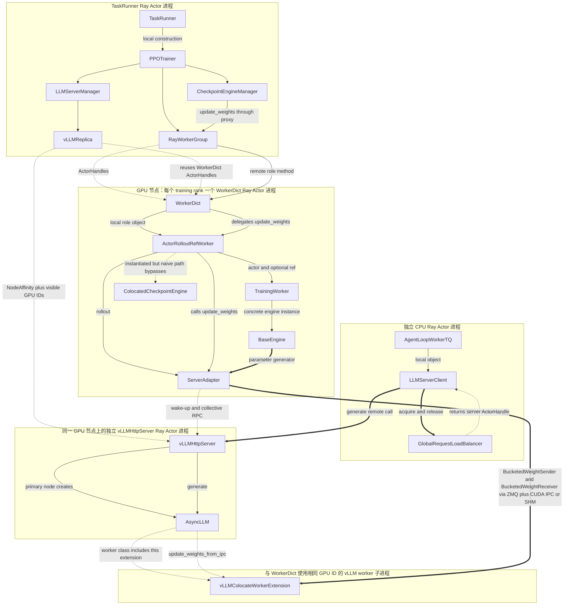
```mermaid
flowchart TB
    subgraph ControllerProcess["TaskRunner Ray Actor 进程"]
        TaskRunner["TaskRunner"]
        PPOTrainer["PPOTrainer"]
        RayWorkerGroup["RayWorkerGroup"]
        LLMServerManager["LLMServerManager"]
        vLLMReplica["vLLMReplica"]
        CheckpointEngineManager["CheckpointEngineManager"]

        TaskRunner -->|local construction| PPOTrainer
        PPOTrainer --> RayWorkerGroup
        PPOTrainer --> LLMServerManager
        LLMServerManager --> vLLMReplica
        PPOTrainer --> CheckpointEngineManager
    end

    subgraph RequestActorProcesses["独立 CPU Ray Actor 进程"]
        AgentLoopWorkerTQ["AgentLoopWorkerTQ"]
        LLMServerClient["LLMServerClient"]
        GlobalRequestLoadBalancer["GlobalRequestLoadBalancer"]

        AgentLoopWorkerTQ -->|local object| LLMServerClient
        LLMServerClient ==>|acquire and release| GlobalRequestLoadBalancer
        GlobalRequestLoadBalancer -.->|returns server ActorHandle| LLMServerClient
    end

    subgraph TrainingActorProcess["GPU 节点：每个 training rank 一个 WorkerDict Ray Actor 进程"]
        WorkerDict["WorkerDict"]
        ActorRolloutRefWorker["ActorRolloutRefWorker"]
        TrainingWorker["TrainingWorker"]
        BaseEngine["BaseEngine"]
        ServerAdapter["ServerAdapter"]
        ColocatedCheckpointEngine["ColocatedCheckpointEngine"]

        WorkerDict -->|local role object| ActorRolloutRefWorker
        ActorRolloutRefWorker -->|actor and optional ref| TrainingWorker
        TrainingWorker -->|concrete engine instance| BaseEngine
        ActorRolloutRefWorker -->|rollout| ServerAdapter
        ActorRolloutRefWorker -.->|instantiated but naive path bypasses| ColocatedCheckpointEngine
    end

    subgraph ServerActorProcess["同一 GPU 节点上的独立 vLLMHttpServer Ray Actor 进程"]
        vLLMHttpServer["vLLMHttpServer"]
        AsyncLLM["AsyncLLM"]

        vLLMHttpServer -->|primary node creates| AsyncLLM
    end

    subgraph vLLMWorkerProcess["与 WorkerDict 使用相同 GPU ID 的 vLLM worker 子进程"]
        vLLMColocateWorkerExtension["vLLMColocateWorkerExtension"]
    end

    RayWorkerGroup -.->|ActorHandles| WorkerDict
    vLLMReplica -.->|reuses WorkerDict ActorHandles| WorkerDict
    vLLMReplica -.->|NodeAffinity plus visible GPU IDs| vLLMHttpServer

    LLMServerClient ==>|generate remote call| vLLMHttpServer
    vLLMHttpServer -->|generate| AsyncLLM
    AsyncLLM -.->|worker class includes this extension| vLLMColocateWorkerExtension

    CheckpointEngineManager -->|update_weights through proxy| RayWorkerGroup
    RayWorkerGroup -->|remote role method| WorkerDict
    WorkerDict -->|delegates update_weights| ActorRolloutRefWorker
    ActorRolloutRefWorker -->|calls update_weights| ServerAdapter
    BaseEngine ==>|parameter generator| ServerAdapter
    ServerAdapter -.->|wake-up and collective RPC| vLLMHttpServer
    AsyncLLM -.->|update_weights_from_ipc| vLLMColocateWorkerExtension
    ServerAdapter ==>|BucketedWeightSender and BucketedWeightReceiver via ZMQ plus CUDA IPC or SHM| vLLMColocateWorkerExtension
```

#### 4.2.1.4 TO-BE 部署视图

#### 4.2.2.3 AS-IS 部署视图

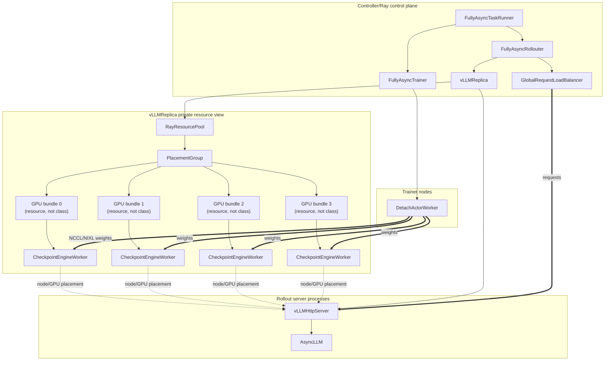
```mermaid
flowchart TB
    subgraph CTRL[Controller/Ray control plane]
        TR["FullyAsyncTaskRunner"]
        T["FullyAsyncTrainer"]
        R["FullyAsyncRollouter"]
        LB["GlobalRequestLoadBalancer"]
        REP["vLLMReplica"]
    end

    subgraph TRAIN[Trainer nodes]
        TW["DetachActorWorker"]
    end

    subgraph RPG[vLLMReplica private resource view]
        RP["RayResourcePool"]
        PG["PlacementGroup"]
        B0["GPU bundle 0<br/>(resource, not class)"]
        B1["GPU bundle 1<br/>(resource, not class)"]
        B2["GPU bundle 2<br/>(resource, not class)"]
        B3["GPU bundle 3<br/>(resource, not class)"]
        CW0["CheckpointEngineWorker"]
        CW1["CheckpointEngineWorker"]
        CW2["CheckpointEngineWorker"]
        CW3["CheckpointEngineWorker"]
    end

    subgraph SERVE[Rollout server processes]
        HTTP["vLLMHttpServer"]
        ENG["AsyncLLM"]
    end

    TR --> T
    TR --> R
    T --> TW
    R --> LB
    R --> REP
    REP --> RP
    RP --> PG
    PG --> B0
    PG --> B1
    PG --> B2
    PG --> B3
    B0 --> CW0
    B1 --> CW1
    B2 --> CW2
    B3 --> CW3
    CW0 -. node/GPU placement .-> HTTP
    CW1 -. node/GPU placement .-> HTTP
    CW2 -. node/GPU placement .-> HTTP
    CW3 -. node/GPU placement .-> HTTP
    TW ==>|NCCL/NIXL weights| CW0
    TW ==>|weights| CW1
    TW ==>|weights| CW2
    TW ==>|weights| CW3
    REP --> HTTP
    HTTP --> ENG
    LB ==>|requests| HTTP
```

#### 4.2.2.4 TO-BE 部署视图

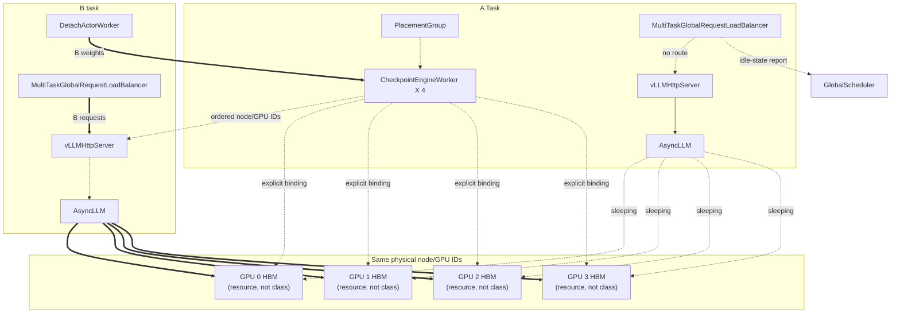
```mermaid
flowchart TB
    GS["GlobalScheduler"]

    subgraph DONOR[A Task]
        PG["PlacementGroup"]
        DCW["CheckpointEngineWorker X 4"]
        DS["vLLMHttpServer"]
        DE["AsyncLLM"]
        DLB["MultiTaskGlobalRequestLoadBalancer"]
        PG -.-> DCW
        DS --> DE
        DLB -. no route .-> DS
    end

    subgraph GPU[Same physical node/GPU IDs]
        G0["GPU 0 HBM<br/>(resource, not class)"]
        G1["GPU 1 HBM<br/>(resource, not class)"]
        G2["GPU 2 HBM<br/>(resource, not class)"]
        G3["GPU 3 HBM<br/>(resource, not class)"]
    end

    subgraph BORROWER[B task]
        BS["vLLMHttpServer"]
        BE["AsyncLLM"]
        BLB["MultiTaskGlobalRequestLoadBalancer"]
        BCE["DetachActorWorker"]
        BCE ==>|B weights| DCW
        BS -.-> BE
        BLB ==>|B requests| BS
    end

    DCW -. ordered node/GPU IDs .-> BS
    DCW -. explicit binding .-> G0
    DCW -. explicit binding .-> G1
    DCW -. explicit binding .-> G2
    DCW -. explicit binding .-> G3
    BE ==> G0
    BE ==> G1
    BE ==> G2
    BE ==> G3
    DE -. sleeping .-> G0
    DE -. sleeping .-> G1
    DE -. sleeping .-> G2
    DE -. sleeping .-> G3
    DLB -. idle-state report .-> GS
```


### 3.3 TO-BE scaling 互斥规则和实现方式

STANDALONE + Fully Async 模式下新增两个核心对象：

- **`effective_replicas`（有效 replica 集合）**：`FullyAsyncTrainer` 进程内 CheckpointEngine 唯一维护的成员集合，该集合只包含已经完成明确版本权重同步的replica、并且具备参数同步接收端的 replica；
- **`replica-sync gate`（replica 同步门）**：`FullyAsyncTrainer` 持有的修改effective_replicas 的排他锁。初始化 Borrowed replica、CE ADD/REMOVE、LB ADD 的提交或回滚、 verl 原生参数同步都必须获得同一把 gate。

#### 3.3.1 第一版执行规则

1. **CREATE 只创建隐藏 runtime。**`FullyAsyncRollouter` 可以在 rollout、trainer 取样、trainer 计算或原生参数同步期间创建隐藏
   runtime。CREATE 不修改 `effective_replicas`、LB 或并发容量，所以 CREATE 不获取 replica-sync gate。`GroupScheduler` 必须在
   CREATE 前为目标 node ID/GPU IDs 建立排他 lease。
2. **原生参数同步端到端持有 gate。**`FullyAsyncTrainer` 在调用 `CheckpointEngineManager.update_weights()` 前获得 replica-sync
   gate。`FullyAsyncTrainer` 只有在 CE 完成 abort、worker 展平、KV lifecycle、process-group 构建、传权、finalize、resume 和
   `V_serving` 发布后才释放 gate。CE 在该区间内可以多次读取同一个 `effective_replicas`，因为任何 ADD/REMOVE 都不能修改该集合。
3. **ADD 等待正在执行的原生同步。**ADD 可以提前完成隐藏 runtime 创建。ADD 只有在获得 replica-sync gate 后才能确定
   `V_serving`、执行 target-only bootstrap、把新 replica 加入 `effective_replicas` 并提交 LB `ROUTABLE`。原生参数同步先持有 gate
   时，ADD 等原生同步发布 `V_next`，然后只把新 replica bootstrap 到最新 `V_next`。
4. **ADD 在同一个 gate 区间内提交或回滚。**`FullyAsyncTrainer` 先验证全部 bootstrap receiver 回执，再把新 replica 加入
   `effective_replicas`。`FullyAsyncRollouter` 随后校验 runtime health、提交 LB 和更新 `max_concurrent_samples`。LB 提交失败时，
   `FullyAsyncTrainer` 必须在释放 gate 前从 `effective_replicas` 删除该 replica；任何原生同步都看不到半提交成员。
5. **REMOVE 先摘流，再等待 gate。**`FullyAsyncRollouter` 可以在任意时刻让 LB 把目标 server 标为 `DRAINING`。borrower 随后通过
   partial abort 或自然 drain 等待 LB inflight 和 backend queued/running 归零。`FullyAsyncTrainer` 最后获得 replica-sync gate，
   直接从 `effective_replicas` 删除目标 replica，并返回 CE remove receipt。原生参数同步正在执行时，REMOVE 等该同步完整返回；
   REMOVE 不需要 desired membership、sync pin 或 snapshot unpin。
6. **DESTROY 依赖 CE remove receipt 和请求排空。**`FullyAsyncRollouter` 只有同时收到 CE remove receipt、LB inflight=0、backend
   queued/running=0 和 lifecycle operation 完成证明后，才能删除 LB entry、销毁 borrower temporary runtime 并减少
   `max_concurrent_samples`。CE remove receipt 证明当前 native sync 已经结束，后续 native sync 也不会再遍历该 replica。
7. **validation 默认冻结可见拓扑。**validation 期间，`FullyAsyncRollouter` 可以准备隐藏 runtime，TaskRunner 可以在 operation
   journal 中记录 ADD/REMOVE；ADD 不提交 `ROUTABLE`，REMOVE 不删除 validation 仍使用的最后一个 LB entry。

三类竞态可以验证上述规则：

- native sync 先获得 replica-sync gate 时，ADD 等同步发布 `V_next` 后只给新 replica bootstrap `V_next`，再把新 replica 加入
  `effective_replicas` 和 LB；
- ADD 先获得 replica-sync gate 时，ADD 先把新 replica bootstrap 到当前 `V_serving`，再提交 CE 和 LB。native sync 随后获得 gate，
  直接遍历已经包含新 replica 的 `effective_replicas`，并把全部成员更新到 `V_next`；
- REMOVE 在 native sync 期间到达时，LB 可以先停止向目标 server 分配新请求。CE REMOVE 等 native sync 释放 gate 后才从
  `effective_replicas` 删除目标 replica；REMOVE 获得 CE remove receipt 后不再等待 sync pin。

#### 3.3.2 第一版成立约束

第一版单集合、单 gate 模型必须满足以下约束：

1. `FullyAsyncTrainer` 是 `effective_replicas` 的唯一写入者。`FullyAsyncRollouter`、TaskRunner 和 `GroupScheduler` 都不能直接修改
   该集合。
2. CE ADD、CE REMOVE、ADD 失败回滚和 native sync 必须通过同一个 `replica-sync gate` 入口。任何代码都不能绕过该入口直接调用
   `CheckpointEngineManager.add_replicas()` 或 `remove_replicas()`。
3. native sync 必须在整个 `CheckpointEngineManager.update_weights()` 调用期间持有 gate。只在 worker 展平前短暂读取或锁住 list
   不能满足该约束。
4. ADD 必须在 bootstrap 成功后才写入 `effective_replicas`，并且必须在 LB `ROUTABLE` 成功或完成回滚后才释放 gate。
5. REMOVE 必须在请求排空后获得 gate，并删除 CE member。runtime teardown 必须等待 CE remove receipt；否则 Rollouter 可能销毁仍被
   Trainer CE 使用的 worker ActorHandle。
6. `effective_replicas` 必须由 CE 自己封装，并使用稳定 replica ID 执行幂等 ADD/REMOVE。外部代码不能保存并原地修改该集合的 list
   alias；当前 `remove_replicas()` 会重新绑定 `self.replicas`，见 `checkpoint_engine/base.py:438-445`。
7. `PublishedWeightSnapshot(V_serving)` 仍必须提供稳定的 bootstrap 数据源。replica-sync gate 只串行同步事务；该 gate 本身不能把可能
   领先的 trainer live weights 变成旧 serving version。
8. `FullyAsyncTrainer` 持锁等待 `FullyAsyncRollouter` 的 LB 回执时，Rollouter 不能同步回调一个需要同一把 gate 的 Trainer 方法。
   TaskRunner 必须使用 operation ID、lease epoch、超时和幂等查询避免跨 Actor 循环等待与不确定提交。
9. 单 gate 会串行多个 ADD、REMOVE 和 native sync。第一版接受这项吞吐代价，以换取更小的状态空间和更清晰的失败回滚。

#### 3.3.3 下一步改进方向

第一版实现和压测完成后，项目可以按以下顺序演进：

1. 项目先记录 `replica_sync_gate_wait_seconds`、native sync duration、bootstrap duration、pending scaling count 和最长 gate owner。
   指标能够证明单 gate 是否真正成为吞吐瓶颈。
2. TaskRunner 可以把同一时刻到达的多个 ADD/REMOVE 合并成一个批量事务，在一次 gate 区间内更新 `effective_replicas` 和 LB，减少
   重复 process-group 与跨 Actor RPC 开销。
3. 项目只有在单 gate 的等待时间不可接受时，才引入独立 epoch snapshot、membership gate、desired membership 和 sync pin。届时
   native sync 可以冻结 immutable snapshot 后允许下一轮 CE 成员变更，但实现必须重新解决 snapshot 生命周期、runtime pin、失败
   恢复和两轮成员视图并存问题。
4. 参数同步后端若能证明 PublishedWeightSnapshot 不可变、target receiver topology 相互独立且通信资源不冲突，项目可以进一步评估
   多个 target-only bootstrap 并行执行。该优化不能从“receiver 不同”直接推导，必须验证 sender、NCCL/process group 和 HBM 带宽
   是否共享。
5. 项目应把 operation journal 持久化或加入 Actor restart reconcile。恢复逻辑需要比较 manager registry、
   `effective_replicas`、LB routing epoch 和 GroupScheduler lease epoch，再决定重放、回滚或隔离未完成事务。

verl AS-IS 尚未提供 replica-sync gate 和跨 Actor operation journal。当前 `CheckpointEngineManager.update_weights()` 在一次调用中多次
读取可变 `self.replicas`，见 `checkpoint_engine/base.py:498-536`。第一版不要求修改该方法以创建第二份 snapshot；子仓只需要保证
外层 gate 覆盖完整调用，并把所有成员变更收口到同一入口。

### 3.4 Fully Async ADD：跨 Trainer / Rollouter Actor 的提交协议

`PreparedReplica`：初始化完成的replica，但是尚未加入 Borrowed 任务。
`BootstrapReceipt`：记录 replica ID、目标权重版本、operation ID、lease epoch 和全部接收端的完成状态。

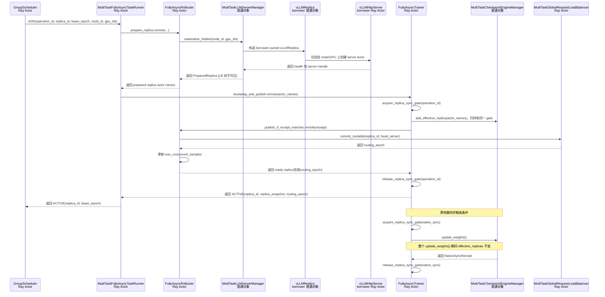
```mermaid
sequenceDiagram
    participant GS as GroupScheduler<br/> Ray Actor
    participant TR as MultiTaskFullyAsyncTaskRunner<br/> Ray Actor
    participant FAR as FullyAsyncRollouter<br/>Ray Actor
    participant M as MultiTaskLLMServerManager<br/> 普通对象
    participant R as vLLMReplica<br/>borrower 普通对象
    participant H as vLLMHttpServer<br/>borrower Ray Actor
    participant FAT as FullyAsyncTrainer<br/>Ray Actor
    participant C as MultiTaskCheckpointEngineManager<br/> 普通对象
    participant L as MultiTaskGlobalRequestLoadBalancer<br/> Ray Actor

    GS->>TR: ADD(operation_id, replica_id, lease_epoch, node_id, gpu_ids)
    TR->>FAR: prepare_replica.remote(...)
    FAR->>M: materialize_hidden(node_id, gpu_ids)
    M->>R: 构造 borrower-owned vLLMReplica
    R->>H: 在指定 node/GPU 上创建 server Actor
    H-->>M: 返回 health 和 server handle
    M-->>FAR: 返回 PreparedReplica (LB 尚不可见)
    FAR-->>TR: 返回 prepared replica actor names
    TR->>FAT: bootstrap_and_publish.remote(actor_names)
    FAT->>FAT: acquire_replica_sync_gate(operation_id)
    FAT->>C: add_effective_replica(actor_names)，仍持有同一 gate
    FAT->>FAR: publish_if_receipt_matches.remote(receipt)
    FAR->>L: commit_routable(replica_id, head_server)
    L-->>FAR: 返回 routing_epoch
    FAR->>FAR: 更新 max_concurrent_samples
    FAR-->>FAT: 返回 ready replica信息(routing_epoch)
    FAT->>FAT: release_replica_sync_gate(operation_id)
    FAT-->>TR: 返回 ACTIVE(replica_id, replica_snapshot, routing_epoch)
    TR-->>GS: 返回 ACTIVE(replica_id, lease_epoch)
    Note over FAT,C: 原参数同步触发条件
    FAT->>FAT: acquire_replica_sync_gate(native_sync)
    FAT->>C: update_weights()
    Note over FAT,C: 整个 update_weights() 期间 effective_replicas 不变
    C-->>FAT: 返回 NativeSyncReceipt
    FAT->>FAT: release_replica_sync_gate(native_sync)
```

图中的流程按以下顺序提交新 replica：

1. `GroupScheduler` 把 node ID/GPU IDs 租约和 operation ID 发送给`MultiTaskFullyAsyncTaskRunner`。
2. `MultiTaskFullyAsyncTaskRunner` 调用 `FullyAsyncRollouter`。`FullyAsyncRollouter` 再调用其进程内的
   `MultiTaskLLMServerManager`，让 manager 创建 borrower-owned `vLLMReplica` 和 `vLLMHttpServer`。不把 server 加入 LB。`PreparedReplica` 只携带可序列化的 replica ID、server ActorHandle 和 actor names。
3. `FullyAsyncTrainer` 获得 replica-sync gate。原生参数同步已经持有 gate 时，`FullyAsyncTrainer` 等待原生参数同步完成。
4. 全部接收端返回同一版本后，`MultiTaskCheckpointEngineManager` 生成 `BootstrapReceipt`。`FullyAsyncTrainer` 在仍持有同一把
   replica-sync gate 时把新 replica 加入 `effective_replicas`。
5. `FullyAsyncTrainer` 把回执发送给 `FullyAsyncRollouter`。`FullyAsyncRollouter` 校验 operation ID、lease epoch，然后让 LB 把 head server 提交为 `ROUTABLE`。
6. LB 返回 `routing_epoch` 后，`FullyAsyncRollouter` 增加 `max_concurrent_samples`。
7. `FullyAsyncTrainer` 收到 `ready replica` 回执后释放 replica-sync gate。下一次 verl 原生参数同步获得该 gate 后，直接遍历已经包含 borrowd replica 的 `effective_replicas`。
8. `MultiTaskFullyAsyncTaskRunner` 只在上述步骤全部成功后向 `GroupScheduler` 返回 `ACTIVE`。

### 3.5 Fully Async REMOVE：摘流、续推和销毁

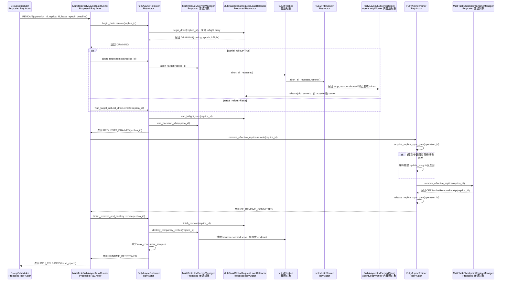
```mermaid
sequenceDiagram
    participant GS as GroupScheduler<br/>Proposed Ray Actor
    participant TR as MultiTaskFullyAsyncTaskRunner<br/>Proposed Ray Actor
    participant FAR as FullyAsyncRollouter<br/>Ray Actor
    participant M as MultiTaskLLMServerManager<br/>Proposed 普通对象
    participant L as MultiTaskGlobalRequestLoadBalancer<br/>Proposed Ray Actor
    participant R as vLLMReplica<br/>普通对象
    participant H as vLLMHttpServer<br/>Ray Actor
    participant FC as FullyAsyncLLMServerClient<br/>AgentLoopWorker 内普通对象
    participant FAT as FullyAsyncTrainer<br/>Ray Actor
    participant C as MultiTaskCheckpointEngineManager<br/>Proposed 普通对象

    GS->>TR: REMOVE(operation_id, replica_id, lease_epoch, deadline)
    TR->>FAR: begin_drain.remote(replica_id)
    FAR->>L: begin_drain(replica_id)，保留 inflight entry
    L-->>FAR: 返回 DRAINING(routing_epoch, inflight)
    FAR-->>TR: 返回 DRAINING
    alt partial_rollout=True
        TR->>FAR: abort_target.remote(replica_id)
        FAR->>M: abort_target(replica_id)
        M->>R: abort_all_requests()
        R->>H: abort_all_requests.remote()
        H-->>FC: 返回 stop_reason=aborted 和已生成 token
        FC->>L: release(old_server)，再 acquire 新 server
    else partial_rollout=False
        TR->>FAR: wait_target_natural_drain.remote(replica_id)
    end
    FAR->>L: wait_inflight_zero(replica_id)
    FAR->>M: wait_backend_idle(replica_id)
    FAR-->>TR: 返回 REQUESTS_DRAINED(replica_id)
    TR->>FAT: remove_effective_replica.remote(replica_id)
    FAT->>FAT: acquire_replica_sync_gate(operation_id)
    alt 原生参数同步已经持有 gate
        FAT-->>FAT: 等待完整 update_weights() 返回
    end
    FAT->>C: remove_effective_replica(replica_id)
    C-->>FAT: 返回 CEEffectiveRemoveReceipt(replica_id)
    FAT->>FAT: release_replica_sync_gate(operation_id)
    FAT-->>TR: 返回 CE_REMOVE_COMMITTED
    TR->>FAR: finish_remove_and_destroy.remote(replica_id)
    FAR->>L: finish_remove(replica_id)
    FAR->>M: destroy_temporary_replica(replica_id)
    M->>R: 销毁 borrower-owned server 和同步 endpoint
    FAR->>FAR: 减少 max_concurrent_samples
    FAR-->>TR: 返回 RUNTIME_DESTROYED
    TR-->>GS: 返回 GPU_RELEASED(lease_epoch)
```

图中的 REMOVE 流程包含以下约束：

1. `MultiTaskGlobalRequestLoadBalancer.begin_drain()` 先停止新 acquire，但该方法保留 server handle 和 inflight counter。后到的
   client release 仍然能够把 inflight 计数减到 0。
2. `async_training.partial_rollout=True` 时，`FullyAsyncRollouter` 对目标 replica 执行 abort；
   `FullyAsyncLLMServerClient` 把已生成 token 保存在当前 Python coroutine frame，并通过 LB 选择其他非 DRAINING server 续推。该复用要求
   `async_training.partial_rollout=True`，见 `llm_server.py:345-461`。
3. `async_training.partial_rollout=False` 时，`FullyAsyncRollouter` 不强制 abort；该 Actor 等目标 replica 的请求自然结束。
4. `FullyAsyncRollouter` 同时等待 LB inflight 归零和 backend queued/running 归零。任一计数非零时，TaskRunner 都不会请求 CE
   REMOVE，也不会让 manager 销毁 runtime。
5. `FullyAsyncTrainer` 获得 replica-sync gate。原生参数同步已经持有 gate 时，REMOVE 等整个 `update_weights()` 返回。
   `MultiTaskCheckpointEngineManager` 随后直接从 `effective_replicas` 删除目标 replica，并返回 CE remove receipt。该流程不创建
   desired membership，也不等待 sync snapshot unpin。
6. `FullyAsyncRollouter` 只有收到 CE remove receipt 后，才让 LB 删除 draining entry、让 manager 销毁 borrower temporary
   replica，并减少
   `max_concurrent_samples`。
7. `MultiTaskFullyAsyncTaskRunner` 收到 runtime 销毁回执后，才通知 `GroupScheduler` 释放物理 GPU lease。

现有 `CheckpointEngineManager.update_weights()` 会在末尾恢复当前 `self.replicas`，见 `checkpoint_engine/base.py:532-536`。
REMOVE 如果在原生同步期间先执行 begin-drain，当前同步仍可能在返回前恢复目标 replica；LB 的 DRAINING 状态必须继续阻止新 acquire。
REMOVE 等请求再次排空并获得 replica-sync gate 后，才能删除 CE member。verl AS-IS 没有该两阶段状态判断。

## 3. 场景一：STANDALONE + Fully Async

本节讨论强制回收时，假定 `async_training.partial_rollout=True`；verl 的 Fully Async 示例配置默认如此，见
`verl/experimental/fully_async_policy/config/fully_async_ppo_trainer.yaml:21-23`。如果显式设为 `False`，
`FullyAsyncLLMServerClient` 在 aborted output 后不会 retry，见 `llm_server.py:448-454`，其物理回收约束应按第 5 节同步模式的
“只允许自然 drain”处理。

### 3.1 AS-IS 类图和组件引用关系

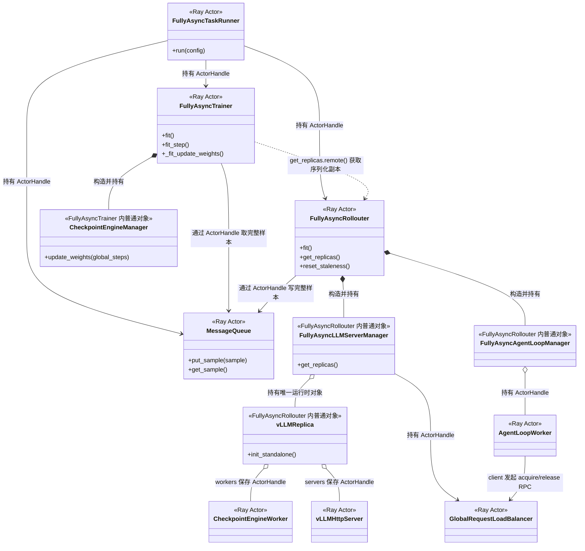
```mermaid
classDiagram
    class FullyAsyncTaskRunner {
        <<Ray Actor>>
        +run(config)
    }
    class FullyAsyncTrainer {
        <<Ray Actor>>
        +fit()
        +fit_step()
        +_fit_update_weights()
    }
    class FullyAsyncRollouter {
        <<Ray Actor>>
        +fit()
        +get_replicas()
        +reset_staleness()
    }
    class MessageQueue {
        <<Ray Actor>>
        +put_sample(sample)
        +get_sample()
    }
    class CheckpointEngineManager {
        <<FullyAsyncTrainer 内普通对象>>
        +update_weights(global_steps)
    }
    class FullyAsyncLLMServerManager {
        <<FullyAsyncRollouter 内普通对象>>
        +get_replicas()
    }
    class FullyAsyncAgentLoopManager {
        <<FullyAsyncRollouter 内普通对象>>
    }
    class AgentLoopWorker {
        <<Ray Actor>>
    }
    class GlobalRequestLoadBalancer {
        <<Ray Actor>>
    }
    class vLLMReplica {
        <<FullyAsyncRollouter 内普通对象>>
        +init_standalone()
    }
    class CheckpointEngineWorker {
        <<Ray Actor>>
    }
    class vLLMHttpServer {
        <<Ray Actor>>
    }

    FullyAsyncTaskRunner --> FullyAsyncTrainer : 持有 ActorHandle
    FullyAsyncTaskRunner --> FullyAsyncRollouter : 持有 ActorHandle
    FullyAsyncTaskRunner --> MessageQueue : 持有 ActorHandle
    FullyAsyncTrainer *-- CheckpointEngineManager : 构造并持有
    FullyAsyncTrainer --> MessageQueue : 通过 ActorHandle 取完整样本
    FullyAsyncTrainer ..> FullyAsyncRollouter : get_replicas.remote() 获取序列化副本
    FullyAsyncRollouter *-- FullyAsyncLLMServerManager : 构造并持有
    FullyAsyncRollouter *-- FullyAsyncAgentLoopManager : 构造并持有
    FullyAsyncRollouter --> MessageQueue : 通过 ActorHandle 写完整样本
    FullyAsyncLLMServerManager o-- vLLMReplica : 持有唯一运行时对象
    FullyAsyncLLMServerManager --> GlobalRequestLoadBalancer : 持有 ActorHandle
    vLLMReplica o-- CheckpointEngineWorker : workers 保存 ActorHandle
    vLLMReplica o-- vLLMHttpServer : servers 保存 ActorHandle
    FullyAsyncAgentLoopManager o-- AgentLoopWorker : 持有 ActorHandle
    AgentLoopWorker --> GlobalRequestLoadBalancer : client 发起 acquire/release RPC
```

图中的每个实体都使用 verl AS-IS 的真实类名。图中的实线表示对象持有或 ActorHandle 持有，虚线表示一次远程调用产生的数据复制：

- `FullyAsyncTaskRunner` 是 `@ray.remote(num_cpus=1)`，见 `fully_async_main.py:35-49`；
- `FullyAsyncTrainer` 是 Ray Actor，见 `fully_async_trainer.py:53-58`；
- `FullyAsyncRollouter` 是 `max_concurrency=100` 的 Ray Actor，见 `fully_async_rollouter.py:329-335`；
- `MessageQueue` 是 Ray Actor，见 `message_queue.py:26-53`；
- `FullyAsyncLLMServerManager` 位于 `FullyAsyncRollouter` Actor 内。该 manager 持有唯一可执行的 runtime 对象和 server
  ActorHandle，见
  `fully_async_rollouter.py:819-856`；
- `FullyAsyncRollouter` 构造 `FullyAsyncAgentLoopManager`，见 `fully_async_rollouter.py:305-326,841-856`。该 manager 继承
  `AgentLoopManager`；基类把 `AgentLoopWorker` 包成 Ray ActorClass，再执行 `.remote()` 创建 worker Actor，见
  `verl/experimental/agent_loop/agent_loop.py:1166-1221`；
- `FullyAsyncTrainer` 通过 `await self.rollouter.get_replicas.remote()` 得到序列化的 `RolloutReplica` 副本，再构造本 Actor 内的
  `CheckpointEngineManager`，见 `fully_async_trainer.py:217-224`。

最后一条引用关系决定了 Fully Async 不能通过一个普通对象修改全部视图。`FullyAsyncRollouter` 持有 manager/LB 运行时视图，
`FullyAsyncTrainer` 持有 CE 同步视图。TO-BE 扩缩容协议必须让现有两个 Actor 交换带 operation ID 的准备回执和提交回执；该协议
不需要新增通信 Actor。

### 3.2 AS-IS 训练、rollout 与参数同步流程

设 `K = async_training.trigger_parameter_sync_step`。AS-IS 时序是：

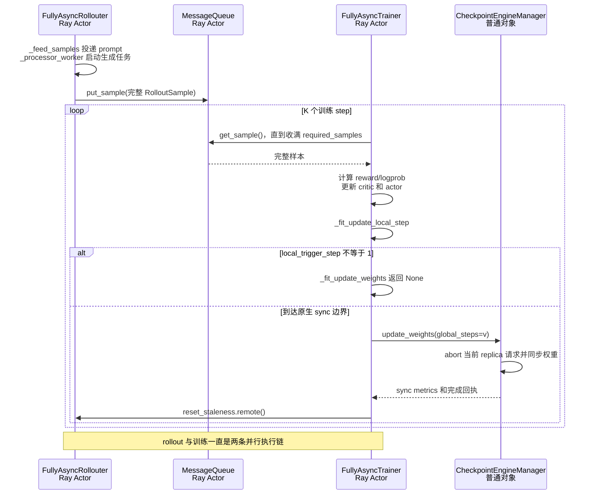
```mermaid
sequenceDiagram
    participant FAR as FullyAsyncRollouter<br/>Ray Actor
    participant MQ as MessageQueue<br/>Ray Actor
    participant FAT as FullyAsyncTrainer<br/>Ray Actor
    participant CE as CheckpointEngineManager<br/>普通对象

    FAR->>FAR: _feed_samples 投递 prompt<br/>_processor_worker 启动生成任务
    FAR->>MQ: put_sample(完整 RolloutSample)
    loop K 个训练 step
        FAT->>MQ: get_sample()，直到收满 required_samples
        MQ-->>FAT: 完整样本
        FAT->>FAT: 计算 reward/logprob<br/>更新 critic 和 actor
        FAT->>FAT: _fit_update_local_step
        alt local_trigger_step 不等于 1
            FAT->>FAT: _fit_update_weights 返回 None
        else 到达原生 sync 边界
            FAT->>CE: update_weights(global_steps=v)
            CE->>CE: abort 当前 replica 请求并同步权重
            CE-->>FAT: sync metrics 和完成回执
            FAT->>FAR: reset_staleness.remote()
        end
    end
    Note over FAR,FAT: rollout 与训练一直是两条并行执行链
```

图中的流程按以下顺序执行：

1. `FullyAsyncRollouter._feed_samples()` 把 dataloader prompt 放入 `pending_queue`，见
   `fully_async_rollouter.py:859-890`。
2. `FullyAsyncRollouter._processor_worker()` 按 `max_concurrent_samples` 创建生成任务，见
   `fully_async_rollouter.py:902-990`。`FullyAsyncRollouter` 只把完整 `RolloutSample` 写入 `MessageQueue`，见
   `fully_async_rollouter.py:991-1015`。
3. `FullyAsyncTrainer` 从 `MessageQueue` 收满 `required_samples` 后组装训练 batch，见
   `fully_async_trainer.py:375-452,643-652`。
4. `FullyAsyncTrainer` 在第 K 次训练更新后递增参数版本，并调用 `CheckpointEngineManager.update_weights()`，见
   `fully_async_trainer.py:676-701,729-756`。
5. 非 naive STANDALONE `CheckpointEngineManager` abort 当前 replica 集合、创建临时 `RayWorkerGroup`、传输权重、finalize
   接收端并恢复生成，见 `checkpoint_engine/base.py:486-538`。
6. 参数同步返回后，`FullyAsyncTrainer` 调用 `FullyAsyncRollouter.reset_staleness()`。`FullyAsyncRollouter` 根据仍在执行的生成任务和
   `MessageQueue` backlog 重置 `staleness_samples`，然后解除 pause，见 `fully_async_rollouter.py:594-638`。

rollouter 还有显式 backpressure：

```text
max_required_samples = int(
    required_samples * (staleness_threshold + 1) * K
)
```

`FullyAsyncRollouter` 在 `fully_async_rollouter.py:491-507` 定义并计算该上限。队列满或
`staleness_samples >= max_required_samples` 时，`FullyAsyncRollouter` 停止继续投递，见
`fully_async_rollouter.py:1142-1164`。因此 Fully Async 会持续并发执行 rollout，但 backpressure 会限制在途样本数量。动态扩缩容
还必须让 `FullyAsyncRollouter` 同步更新实际并发容量 `max_concurrent_samples`。

### 3.3 TO-BE scaling 互斥规则和实现方式

本节使用以下四个 TO-BE 设计名词：

- **desired membership（目标成员集合）**：`FullyAsyncTrainer` 计划在下一次参数同步中使用的 replica ID 集合；
- **effective membership（有效成员集合）**：已经完成明确版本 bootstrap，并且具备参数同步接收端的 replica ID 集合；
- **immutable sync snapshot（不可变同步快照）**：一次原生参数同步开始时从 effective membership 冻结出的 replica 元组；该次同步
  的 abort、process-group 构建、传权、finalize 和 resume 都使用同一个元组；
- **pin（引用钉住）**：任务内组件为正在执行的同步或生命周期操作增加的引用计数。manager 只能在计数归零后销毁 replica runtime。

Fully Async 需要以下 task-local 互斥对象和状态。这里的 task-local 表示对象只服务一个 borrower 任务，不是全局锁：

1. `FullyAsyncTrainer` 持有 weight-version gate。bootstrap 和 verl 原生参数同步必须先获得该 gate，任一数据面完成或回滚后才释放
   该 gate。
2. `FullyAsyncTrainer` 持有 membership gate。CE 有效集合提交、目标集合删除和 immutable sync snapshot 冻结必须在该 gate 内完成。
3. `FullyAsyncRollouter` 为每个 server 保存 `HIDDEN`、`ROUTABLE` 或 `DRAINING` 路由状态。LB 只把 `ROUTABLE` server 返回给新
   acquire 请求。
4. `MultiTaskFullyAsyncTaskRunner`（Proposed）为每条 ADD/REMOVE 命令保存 operation ID、lease epoch、当前阶段和最后回执。
   operation ID 用于幂等重试；lease epoch 用于拒绝已经过期的租约命令。
5. `FullyAsyncRollouter` 只在 LB 提交或删除 server 后更新 `max_concurrent_samples`。隐藏 runtime 不能提前增加并发容量，正在
   draining 的 runtime 不能继续计入可分配容量。

上述对象按以下规则约束每类 scaling 操作：

1. **CREATE 只创建隐藏 runtime。**`FullyAsyncRollouter` 可以在 rollout、trainer 取样、trainer 计算或原生参数同步期间创建隐藏
   runtime。CREATE 不修改 CE、LB 或并发容量，因此 CREATE 不需要持有 weight-version gate。`GroupScheduler` 必须在 CREATE 前
   为目标 node ID/GPU IDs 建立排他 lease。
2. **BOOTSTRAP 与原生参数同步互斥。**如果原生参数同步已经获得 weight-version gate，ADD 事务必须等待该同步发布最新
   `V_serving`，然后只向新 replica 重放该版本。如果 ADD 事务先获得 gate，原生同步请求可以到达，但原生同步不能冻结 receiver
   集合或传输权重。
3. **ADD 先更新同步视图，再更新路由视图。**`FullyAsyncTrainer` 收到全部 bootstrap receiver 的版本回执后，在 membership gate
   内把新 replica 加入 effective membership。随后 `FullyAsyncRollouter` 校验 runtime health，并把 server 提交为
   `ROUTABLE`。ADD 事务收到 LB 回执后才能释放 weight-version gate。
4. **原生参数同步只使用一个 immutable sync snapshot。**`FullyAsyncTrainer` 获得 weight-version gate 后，在 membership gate
   内冻结并 pin effective membership。`CheckpointEngineManager` 必须把该 snapshot 作为参数传给 abort、worker 展平、传权、
   finalize 和 resume。并发 ADD/REMOVE 只能更新 desired membership，不能修改该 snapshot。
5. **REMOVE 可以先摘流，但不能提前销毁。**`FullyAsyncRollouter` 可以在原生参数同步期间把目标 server 标为 `DRAINING`，从而
   阻止 LB 分配新请求。如果 immutable sync snapshot 已经包含该 replica，`CheckpointEngineManager` 仍然必须让该 replica 完成
   本轮同步。manager 必须等待 LB inflight、backend queued/running、sync pin 和 lifecycle pin 全部归零后再销毁 runtime。
6. **validation 默认冻结可见拓扑。**validation 期间，`FullyAsyncRollouter` 可以准备隐藏 runtime，`FullyAsyncTrainer` 也可以记录
   desired membership；ADD 事务不得提交 `ROUTABLE`，REMOVE 事务不得删除最后的 LB entry，直到 validation 结束。

三类竞态可以验证这些规则：

- 原生参数同步先获得 gate 时，新 replica 不进入已经冻结的 snapshot。ADD 等原生同步发布 `V_next` 后，只给新 replica
  bootstrap `V_next`，然后提交 CE 和 LB。
- ADD 先获得 gate 时，ADD 先把新 replica bootstrap 到当前 `V_serving`，再提交 CE 和 LB。随后原生参数同步冻结的 snapshot
  必须包含该 replica，并把全部有效 replica 更新到 `V_next`。
- REMOVE 在原生参数同步期间到达时，LB 可以立即停止向目标 server 分配新请求。CE 只能把 REMOVE 写入 desired membership；CE
  必须等当前 snapshot 完成并解除 pin 后，才允许 manager 销毁目标 runtime。

verl AS-IS 尚未提供上述 gate、immutable snapshot、pin 和跨 Actor operation journal。当前
`CheckpointEngineManager.update_weights()` 在一次调用中多次读取可变 `self.replicas`，见
`checkpoint_engine/base.py:498-536`；因此子仓必须扩展 task-local 状态和现有 Actor 接口，不能把 AS-IS 的裸 list 修改当作互斥实现。

### 3.4 Fully Async ADD：跨 Trainer / Rollouter Actor 的提交协议

以下时序描述 TO-BE ADD 事务。本文把 **sync descriptor（同步描述）**定义为 CE 定位一个 replica 全部权重接收端所需的可序列化
标识和 ActorHandle 集合。`PreparedReplica`（已准备 replica 描述）是 Proposed 数据结构；该描述携带 replica ID、server
ActorHandle 和 sync descriptor，但不转移 runtime ownership。`BootstrapReceipt`（bootstrap 回执）也是 Proposed 数据结构；该回执
记录 replica ID、目标权重版本、operation ID、lease epoch 和全部接收端的完成状态。

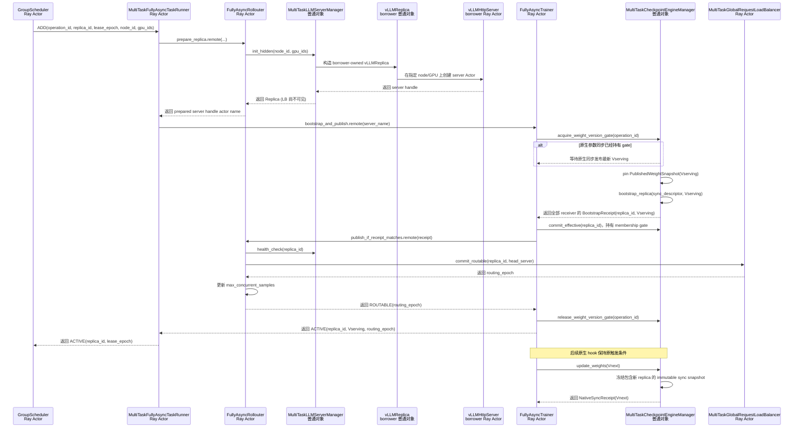
```mermaid
sequenceDiagram
    participant GS as GroupScheduler<br/> Ray Actor
    participant TR as MultiTaskFullyAsyncTaskRunner<br/> Ray Actor
    participant FAR as FullyAsyncRollouter<br/>Ray Actor
    participant M as MultiTaskLLMServerManager<br/> 普通对象
    participant R as vLLMReplica<br/>borrower 普通对象
    participant H as vLLMHttpServer<br/>borrower Ray Actor
    participant FAT as FullyAsyncTrainer<br/>Ray Actor
    participant C as MultiTaskCheckpointEngineManager<br/> 普通对象
    participant L as MultiTaskGlobalRequestLoadBalancer<br/> Ray Actor

    GS->>TR: ADD(operation_id, replica_id, lease_epoch, node_id, gpu_ids)
    TR->>FAR: prepare_replica.remote(...)
    FAR->>M: init_hidden(node_id, gpu_ids)
    M->>R: 构造 borrower-owned vLLMReplica
    R->>H: 在指定 node/GPU 上创建 server Actor
    H-->>M: 返回 server handle
    M-->>FAR: 返回 Replica (LB 尚不可见)
    FAR-->>TR: 返回 prepared server handle actor name
    TR->>FAT: bootstrap_and_publish.remote(server_name)
    FAT->>C: acquire_weight_version_gate(operation_id)
    alt 原生参数同步已经持有 gate
        C-->>FAT: 等待原生同步发布最新 Vserving
    end
    C->>C: pin PublishedWeightSnapshot(Vserving)
    C->>C: bootstrap_replica(sync_descriptor, Vserving)
    C-->>FAT: 返回全部 receiver 的 BootstrapReceipt(replica_id, Vserving)
    FAT->>C: commit_effective(replica_id)，持有 membership gate
    FAT->>FAR: publish_if_receipt_matches.remote(receipt)
    FAR->>M: health_check(replica_id)
    FAR->>L: commit_routable(replica_id, head_server)
    L-->>FAR: 返回 routing_epoch
    FAR->>FAR: 更新 max_concurrent_samples
    FAR-->>FAT: 返回 ROUTABLE(routing_epoch)
    FAT->>C: release_weight_version_gate(operation_id)
    FAT-->>TR: 返回 ACTIVE(replica_id, Vserving, routing_epoch)
    TR-->>GS: 返回 ACTIVE(replica_id, lease_epoch)
    Note over FAT,C: 后续原生 hook 保持原触发条件
    FAT->>C: update_weights(Vnext)
    C->>C: 冻结包含新 replica 的 immutable sync snapshot
    C-->>FAT: 返回 NativeSyncReceipt(Vnext)
```

图中的流程按以下顺序提交新 replica：

1. `GroupScheduler` 把 node ID/GPU IDs 租约和幂等 operation ID 发送给 `MultiTaskFullyAsyncTaskRunner`。
2. `MultiTaskFullyAsyncTaskRunner` 调用 `FullyAsyncRollouter`。`FullyAsyncRollouter` 再调用其进程内的
   `MultiTaskLLMServerManager`，让 manager 创建 borrower-owned `vLLMReplica` 和 `vLLMHttpServer`。manager 只登记隐藏 runtime，
   不把 server 加入 LB。`PreparedReplica` 只携带可序列化的 replica ID、server ActorHandle 和 sync descriptor；该数据结构不会把
   runtime ownership 从 `FullyAsyncRollouter` 转移给 `FullyAsyncTrainer`。
3. `FullyAsyncTrainer` 获得 weight-version gate。原生参数同步已经持有 gate 时，`FullyAsyncTrainer` 等待原生参数同步完成，并把
   bootstrap 目标改为最新 `V_serving`。
4. `MultiTaskCheckpointEngineManager` pin `PublishedWeightSnapshot(V_serving)`，并且只向新 replica 的接收端传输该版本。
5. 全部接收端返回同一版本后，`MultiTaskCheckpointEngineManager` 生成 `BootstrapReceipt`。`FullyAsyncTrainer` 在 membership
   gate 内把新 replica 加入 effective membership。
6. `FullyAsyncTrainer` 把 bootstrap 回执发送给 `FullyAsyncRollouter`。`FullyAsyncRollouter` 校验 operation ID、lease epoch 和
   runtime health，然后让 LB 把 head server 提交为 `ROUTABLE`。
7. LB 返回 `routing_epoch` 后，`FullyAsyncRollouter` 增加 `max_concurrent_samples`。在此之前，隐藏 runtime 不计入可分配容量。
8. `FullyAsyncTrainer` 收到 `ROUTABLE` 回执后释放 weight-version gate。下一次 verl 原生参数同步冻结 effective membership 时，
   该 snapshot 必须包含新 replica。
9. `MultiTaskFullyAsyncTaskRunner` 只在上述步骤全部成功后向 `GroupScheduler` 返回 `ACTIVE`。任何步骤失败时，TaskRunner 都必须让
   borrower 回滚 LB entry 和 CE effective membership，并保持 lease 不可复用，直到 runtime teardown 返回明确回执。

该流程复用 `FullyAsyncTaskRunner`、`FullyAsyncTrainer`、`FullyAsyncRollouter` 和 LB 的现有通信关系。子仓只扩展这些 Actor 的
接口和 task-local 普通对象，不引入新的通信 Actor。`FullyAsyncTrainer` 负责版本和 CE 提交；`FullyAsyncRollouter` 负责 runtime、
LB 和容量提交；`MultiTaskFullyAsyncTaskRunner` 使用同一个 operation ID 串联两个 Actor 的回执。

### 3.5 Fully Async REMOVE：摘流、续推和销毁

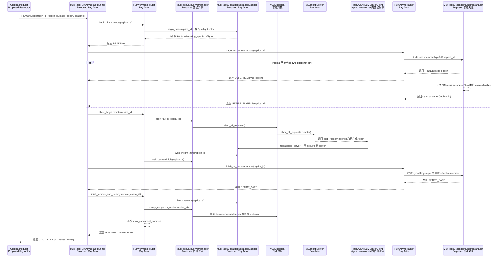
```mermaid
sequenceDiagram
    participant GS as GroupScheduler<br/>Proposed Ray Actor
    participant TR as MultiTaskFullyAsyncTaskRunner<br/>Proposed Ray Actor
    participant FAR as FullyAsyncRollouter<br/>Ray Actor
    participant M as MultiTaskLLMServerManager<br/>Proposed 普通对象
    participant L as MultiTaskGlobalRequestLoadBalancer<br/>Proposed Ray Actor
    participant R as vLLMReplica<br/>普通对象
    participant H as vLLMHttpServer<br/>Ray Actor
    participant FC as FullyAsyncLLMServerClient<br/>AgentLoopWorker 内普通对象
    participant FAT as FullyAsyncTrainer<br/>Ray Actor
    participant C as MultiTaskCheckpointEngineManager<br/>Proposed 普通对象

    GS->>TR: REMOVE(operation_id, replica_id, lease_epoch, deadline)
    TR->>FAR: begin_drain.remote(replica_id)
    FAR->>L: begin_drain(replica_id)，保留 inflight entry
    L-->>FAR: 返回 DRAINING(routing_epoch, inflight)
    FAR-->>TR: 返回 DRAINING
    TR->>FAT: stage_ce_remove.remote(replica_id)
    FAT->>C: 从 desired membership 排除 replica_id
    alt replica 已被当前 sync snapshot pin
        C-->>FAT: 返回 PINNED(sync_epoch)
        FAT-->>TR: 返回 DEFERRED(sync_epoch)
        C->>C: 让序列化 sync descriptor 完成本轮 update/finalize
        C-->>FAT: 返回 sync_unpinned(replica_id)
        FAT-->>TR: 返回 RETIRE_ELIGIBLE(replica_id)
    end
    TR->>FAR: abort_target.remote(replica_id)
    FAR->>M: abort_target(replica_id)
    M->>R: abort_all_requests()
    R->>H: abort_all_requests.remote()
    H-->>FC: 返回 stop_reason=aborted 和已生成 token
    FC->>L: release(old_server)，再 acquire 新 server
    FAR->>L: wait_inflight_zero(replica_id)
    FAR->>M: wait_backend_idle(replica_id)
    TR->>FAT: finish_ce_remove.remote(replica_id)
    FAT->>C: 校验 sync/lifecycle pin 并删除 effective member
    C-->>FAT: 返回 RETIRE_SAFE
    FAT-->>TR: 返回 RETIRE_SAFE
    TR->>FAR: finish_remove_and_destroy.remote(replica_id)
    FAR->>L: finish_remove(replica_id)
    FAR->>M: destroy_temporary_replica(replica_id)
    M->>R: 销毁 borrower-owned server 和同步 endpoint
    FAR->>FAR: 减少 max_concurrent_samples
    FAR-->>TR: 返回 RUNTIME_DESTROYED
    TR-->>GS: 返回 GPU_RELEASED(lease_epoch)
```

图中的 REMOVE 流程包含以下约束：

1. `MultiTaskGlobalRequestLoadBalancer.begin_drain()` 先停止新 acquire，但该方法保留 server handle 和 inflight counter。后到的
   client release 仍然能够把 inflight 计数减到 0。
2. `FullyAsyncTrainer` 在 membership gate 内把 replica 从 desired membership 排除。当前 immutable sync snapshot 已经 pin 该
   replica 时，`CheckpointEngineManager` 仍然让该 replica 完成本轮 update 和 finalize；REMOVE 不能修改当前 snapshot。
3. 当前 snapshot 解除 pin 后，`FullyAsyncRollouter` 才对目标 replica 执行 abort。`FullyAsyncLLMServerClient` 把已生成 token
   保存在当前 Python coroutine frame，并通过 LB 选择其他非 DRAINING server 续推。该复用要求
   `async_training.partial_rollout=True`，见 `llm_server.py:345-461`。
4. `FullyAsyncRollouter` 同时等待 LB inflight 归零和 backend queued/running 归零。任一计数非零时，manager 都不能销毁 runtime。
5. `FullyAsyncTrainer` 在 membership gate 内删除 effective member，并确认 sync pin 和 lifecycle pin 均为 0。
6. `FullyAsyncRollouter` 先让 LB 删除 draining entry，再让 manager 销毁 borrower temporary replica，最后减少
   `max_concurrent_samples`。
7. `MultiTaskFullyAsyncTaskRunner` 收到 runtime 销毁回执后，才通知 `GroupScheduler` 释放物理 GPU lease。

现有 `CheckpointEngineManager.update_weights()` 会在末尾恢复当前 `self.replicas`，见 `checkpoint_engine/base.py:532-536`。
TO-BE manager 必须跳过 `DRAINING` replica，或者让 retire 流程在同步完成后再次暂停该 replica。verl AS-IS 没有该状态判断。

### 3.6 数值例子：版本 20 bootstrap、版本 21 原生同步、版本 22 缩容

假设 borrower 任务配置：

```text
2 个 STANDALONE replica：R0、R1
每个 replica = 4 GPU
concurrent_samples_per_replica = 16
required_samples = 32
K = trigger_parameter_sync_step = 4
staleness_threshold = 0.25
max_required_samples = int(32 * 1.25 * 4) = 160
初始 max_concurrent_samples = 2 * 16 = 32
```

扩容例子：

1. 当前 rollout serving version 是 `v20`，trainer 已执行本周期第 2 个训练 step；因此 trainer live weights 通常已经不等于
   `PublishedWeightSnapshot(v20)`，R0、R1 仍以 `v20` 并行生成。
2. `GroupScheduler` 为 donor GPU `[node-D, GPU4..7]` 签发 lease。borrower 的 `MultiTaskLLMServerManager` 创建 B2，但 manager 让
   B2 保持 `HIDDEN`。
3. `MultiTaskCheckpointEngineManager` 获得 weight-version gate、pin `v20`，并且只向 B2 的全部 receiver 重放 `v20`。R0/R1 不被
   abort，也不参与本次传输。
4. B2 的全部 receiver 返回 `W(B2)=v20` 后，borrower 在 gate 内提交 CE effective membership、LB ADD 和容量更新。LB 把 B2 标为
   `ROUTABLE`，`FullyAsyncRollouter` 把 `max_concurrent_samples` 从 32 更新为 48。
5. 第 4 个训练 step 结束后，`FullyAsyncTrainer._fit_update_weights()` 仍按 K 周期请求同步 `v21`。
   `MultiTaskCheckpointEngineManager` 冻结 `S(21)={R0,R1,B2}`，并把三个 replica 一起更新到 `v21`。
6. 如果原生 `v21` sync 先获得 gate，B2 bootstrap 等该同步完成，再只向 B2 重放最新 `v21`，随后提交为 `ROUTABLE`。B2 不等待
   `v22`；bootstrap 也不会把 trainer 尚未发布的 live weights 标成 `v21`。

缩容例子：

1. 在权重 `v22` 下，B2 有 5 个 inflight 请求，分别已经产生 `64/80/96/128/160` 个 token。
2. LB 对 B2 执行 begin-drain 后不再向 B2 分配新请求，但 LB 保留 `I(B2)=5`。
3. 如果当前 sync snapshot 没有 pin B2，borrower 对 B2 执行 targeted abort。五个
   `FullyAsyncLLMServerClient.generate()` 协程把 token prefix 保存在各自 Python coroutine frame，随后从 LB 重新 acquire R0/R1；
   已完成并进入 `MessageQueue` 的 32 个训练样本不受影响。
4. 五个旧 attempt 的 fire-and-forget release 全部到达后 `I(B2)=0`，backend 也确认 `Q(B2)=R(B2)=0`。
5. CE REMOVE 使下一 snapshot 不再包含 B2。当前 snapshot 曾经 pin B2 时，borrower 还必须等待 CE 完成 finalize 并解除 pin。
6. `MultiTaskLLMServerManager` 销毁 B2，`FullyAsyncRollouter` 把 `max_concurrent_samples` 从 48 调回 32，随后
   `MultiTaskFullyAsyncTaskRunner` 通知 `GroupScheduler` 释放 GPU lease。

这个例子同时说明：`MessageQueue.queue_size==0`、`LB inflight==0`、`active_tasks==0` 是不同观测；其中任何一个单独为 0 都不足以
证明 runtime 可销毁。

### 3.7 当前实现能复用什么，缺什么

| 项目 | AS-IS 可复用能力 | GAP / TO-BE |
|---|---|---|
| 持续 rollout 与训练并行 | `FullyAsyncTrainer` / `FullyAsyncRollouter` 双 Actor | 需要跨 Actor scaling transaction ID 和回执 |
| partial abort/retry | `partial_rollout=True` 时复用 `FullyAsyncLLMServerClient`，`llm_server.py:345-461` | 需要 per-replica 摘流、请求 drain 证据；关闭 partial 时不得强制 abort |
| 原生参数同步 | STANDALONE 非 naive CE，`checkpoint_engine/base.py:486-538` | 一次 native sync 必须固定 effective immutable snapshot |
| 新实例 bootstrap | 无 target-only manager API；sender 读取 trainer live weights | 需要按 `V_serving` 重放的 published snapshot、target receiver topology 和 bootstrap/native gate |
| 版本语义 | server 输出携带 `global_steps` | bootstrap 不递增版本、不 reset staleness；native publish 才改变 `V_serving` |
| 动态容量计数 | `FullyAsyncRollouter._update_max_concurrent_samples()`，`fully_async_rollouter.py:1274-1294` | true-new STANDALONE add/remove 也必须调用；当前只连到既有接口 |
| manager add/remove | experimental manager 支持预注册 HYBRID replica，`fully_async_rollouter.py:144-259` | `FullyAsyncLLMServerManager` 只从 `hybrid_replicas` 取对象，不会动态创建 STANDALONE runtime |
| HBM donation | 有 STANDALONE server 对象 | vLLM STANDALONE sleep/wake 是 no-op，无法证明显存已让出 |
| 控制 RPC | `FullyAsyncTaskRunner` 持有 trainer/rollouter handles | `FullyAsyncTaskRunner` 是同步 Ray Actor，`run()` 长时间阻塞；需 control concurrency group 或等价可达入口 |

## 4. 场景二：HYBRID + partial rollout

该场景固定为 `trainer.v1.trainer_mode=colocate_async` 与 `RolloutMode.HYBRID` 的组合。前者选择
`PPOTrainerColocateAsync` 并启用 partial client，后者说明训练和 native rollout engine 位于同一组训练 worker 进程/GPU；不能因
trainer mode 名称包含 `colocate` 就把该 trainer mode 写成 `RolloutMode.COLOCATED`。注册与 client 选择见
`verl/trainer/ppo/v1/trainer_colocate_async.py:25-34`，HYBRID replica 分支见
`verl/workers/rollout/llm_server.py:549-577`、`verl/workers/rollout/replica.py:131-141`。

本节采用用户最新确认的 **persistent-borrow policy（跨 step 保留策略）**：borrower temporary replica 可以跨过 borrower 的
`on_sample_end()`、training、H4 参数同步和外层 step。`on_sample_end()` 只让当时 lifecycle snapshot 中的 replica abort/sleep。
只要 `GroupScheduler` 没有发出 recall 且 lease 仍有效，borrowed replica 的 manager/CE/LB 引用、runtime 和 lease 都可以保留。H4
必须冻结包含 fixed native 与 effective borrowed replica 的 immutable sync snapshot；H4 联合更新成功后，H5 resume retained
borrowed replica，下一 step 继续复用该 runtime。

### 4.1 AS-IS 类图和组件引用关系

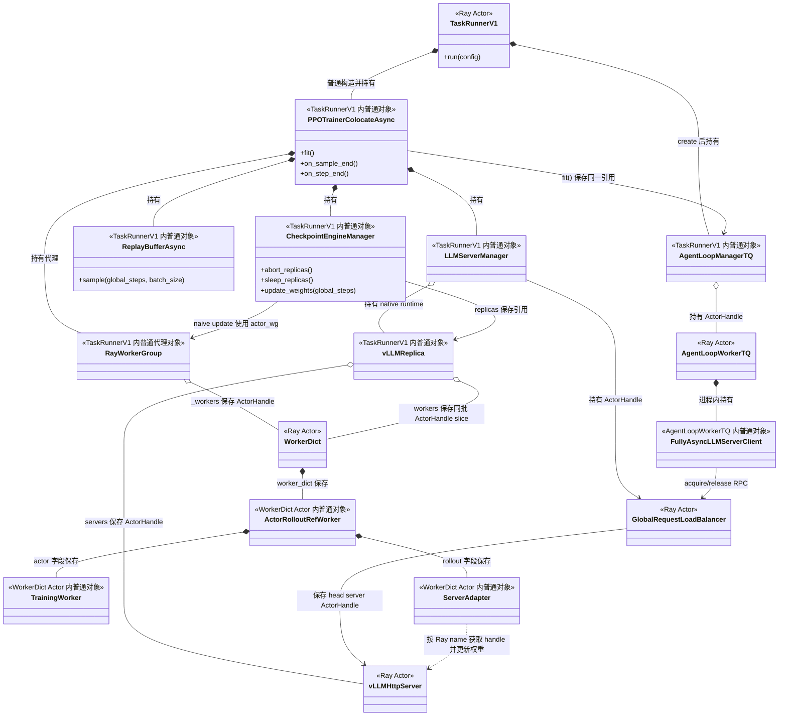
```mermaid
classDiagram
    class TaskRunnerV1 {
        <<Ray Actor>>
        +run(config)
    }
    class PPOTrainerColocateAsync {
        <<TaskRunnerV1 内普通对象>>
        +fit()
        +on_sample_end()
        +on_step_end()
    }
    class AgentLoopManagerTQ {
        <<TaskRunnerV1 内普通对象>>
    }
    class ReplayBufferAsync {
        <<TaskRunnerV1 内普通对象>>
        +sample(global_steps, batch_size)
    }
    class LLMServerManager {
        <<TaskRunnerV1 内普通对象>>
    }
    class CheckpointEngineManager {
        <<TaskRunnerV1 内普通对象>>
        +abort_replicas()
        +sleep_replicas()
        +update_weights(global_steps)
    }
    class RayWorkerGroup {
        <<TaskRunnerV1 内普通代理对象>>
    }
    class WorkerDict {
        <<Ray Actor>>
    }
    class ActorRolloutRefWorker {
        <<WorkerDict Actor 内普通对象>>
    }
    class TrainingWorker {
        <<WorkerDict Actor 内普通对象>>
    }
    class ServerAdapter {
        <<WorkerDict Actor 内普通对象>>
    }
    class vLLMReplica {
        <<TaskRunnerV1 内普通对象>>
    }
    class vLLMHttpServer {
        <<Ray Actor>>
    }
    class GlobalRequestLoadBalancer {
        <<Ray Actor>>
    }
    class AgentLoopWorkerTQ {
        <<Ray Actor>>
    }
    class FullyAsyncLLMServerClient {
        <<AgentLoopWorkerTQ 内普通对象>>
    }

    TaskRunnerV1 *-- PPOTrainerColocateAsync : 普通构造并持有
    TaskRunnerV1 *-- AgentLoopManagerTQ : create 后持有
    PPOTrainerColocateAsync --> AgentLoopManagerTQ : fit() 保存同一引用
    PPOTrainerColocateAsync *-- ReplayBufferAsync : 持有
    PPOTrainerColocateAsync *-- LLMServerManager : 持有
    PPOTrainerColocateAsync *-- CheckpointEngineManager : 持有
    PPOTrainerColocateAsync *-- RayWorkerGroup : 持有代理
    RayWorkerGroup o-- WorkerDict : _workers 保存 ActorHandle
    WorkerDict *-- ActorRolloutRefWorker : worker_dict 保存
    ActorRolloutRefWorker *-- TrainingWorker : actor 字段保存
    ActorRolloutRefWorker *-- ServerAdapter : rollout 字段保存
    LLMServerManager o-- vLLMReplica : 持有 native runtime
    LLMServerManager --> GlobalRequestLoadBalancer : 持有 ActorHandle
    CheckpointEngineManager --> vLLMReplica : replicas 保存引用
    CheckpointEngineManager --> RayWorkerGroup : naive update 使用 actor_wg
    vLLMReplica o-- WorkerDict : workers 保存同批 ActorHandle slice
    vLLMReplica o-- vLLMHttpServer : servers 保存 ActorHandle
    AgentLoopManagerTQ o-- AgentLoopWorkerTQ : 持有 ActorHandle
    AgentLoopWorkerTQ *-- FullyAsyncLLMServerClient : 进程内持有
    FullyAsyncLLMServerClient --> GlobalRequestLoadBalancer : acquire/release RPC
    GlobalRequestLoadBalancer --> vLLMHttpServer : 保存 head server ActorHandle
    ServerAdapter ..> vLLMHttpServer : 按 Ray name 获取 handle 并更新权重
```

图中只有 `TaskRunnerV1`、`WorkerDict`、`AgentLoopWorkerTQ`、`vLLMHttpServer` 和运行时包装后的
`GlobalRequestLoadBalancer` 是 Ray Actor。其他实体是 Ray Actor 进程内普通对象或本地代理对象；类名包含 worker、manager 或
trainer 不会使 Python 对象自动成为 Ray Actor：

- `run_ppo()` 创建 `TaskRunnerV1` Actor 并等待 `run.remote()`；`run()` 在该 Actor 进程内普通构造
  `PPOTrainerColocateAsync`、初始化 `AgentLoopManagerTQ` 并调用 `fit()`，见
  `verl/trainer/main_ppo.py:77-94,103-156`；
- `TaskRunnerV1` 把 `AgentLoopManagerTQ` 保存到 `self.agent_loop_manager`，然后把同一个普通对象传给
  `PPOTrainerColocateAsync.fit()`；`PPOTrainer.fit()` 再把该引用保存到 `self.agent_loop_manager`，见
  `main_ppo.py:107-132,153-156`、`trainer_base.py:387-393`；
- `PPOTrainer` 在本进程构造 `ReplayBufferAsync`，见 `trainer_base.py:125-188`；初始化时构造
  `RayWorkerGroup`、`LLMServerManager` 与 `CheckpointEngineManager`，见 `trainer_base.py:217-299,311-369`；
- `create_colocated_worker_cls()` 动态定义并 `ray.remote(WorkerDict)`；`WorkerDict.__init__()` 再普通构造
  `ActorRolloutRefWorker`，见 `verl/single_controller/ray/base.py:988-1029`；后者在同一 Actor 进程内构造
  `TrainingWorker` 和 `ServerAdapter`，见 `engine_workers.py:446-470,585-682`；
- `LLMServerManager` 持有 `vLLMReplica` 普通对象。`vLLMReplica.init_hybrid()` 从 `RayWorkerGroup.workers` 切出同一批
  `WorkerDict` ActorHandle，再按这些 worker 的 node ID/GPU ID 创建 `vLLMHttpServer` Actor，见
  `replica.py:93-141`、`vllm_async_server.py:1116-1198`；
- `LLMServerManager._init_global_load_balancer()` 才执行 `ray.remote(load_balancer_cls).remote(...)`，所以实际运行的 LB 是
  Ray Actor，见 `llm_server.py:600-612`；
- `AgentLoopManagerTQ` 是 TaskRunner 内普通对象；`AgentLoopManagerTQ` 创建 `AgentLoopWorkerTQ` Actor，并把
  `FullyAsyncLLMServerClient` 序列化进这些 Actor，见 `agent_loop_tq.py:230-257`、
  `experimental/agent_loop/agent_loop.py:1166-1221`。

HYBRID 没有分离的 `FullyAsyncTrainer` 和 `FullyAsyncRollouter` 两个控制 Actor。manager、CE、trainer 和
`RayWorkerGroup` 代理都位于同一个 `TaskRunnerV1` Actor 进程。因此 ADD 不需要跨两个控制 Actor 提交。ADD 仍然必须等待远端
LB/server 回执，并且必须保护 lifecycle hook、扩缩容事务和原生参数同步共同访问的任务内状态。

该 AS-IS 类图只描述初始化创建的 native replica。borrower 按 node ID/GPU IDs 新建的 external replica 属于 TO-BE。该 replica 不属于
固定 `actor_rollout_wg`；该 replica 进入 effective membership 后，borrower 的 CE 扩展必须把该 replica 加入后续 immutable sync
snapshot。

### 4.2 AS-IS 外层 step、partial rollout 与参数同步流程

设 `P = trainer.v1.colocate_async.parameter_sync_step`。AS-IS 的一个外层 `global_steps=g` 包含 `P` 次 local PPO update，但只在
外层 step 末尾发布一次新 rollout 权重版本：

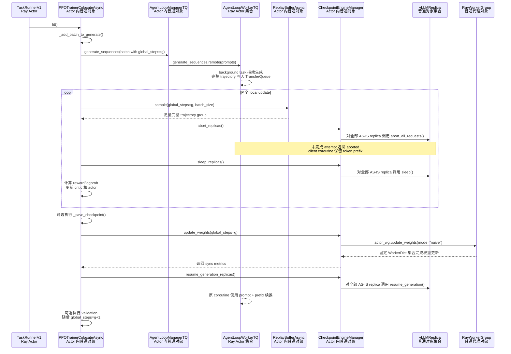
```mermaid
sequenceDiagram
    participant TR as TaskRunnerV1<br/>Ray Actor
    participant PT as PPOTrainerColocateAsync<br/>Actor 内普通对象
    participant AM as AgentLoopManagerTQ<br/>Actor 内普通对象
    participant AW as AgentLoopWorkerTQ<br/>Ray Actor 集合
    participant RB as ReplayBufferAsync<br/>Actor 内普通对象
    participant CE as CheckpointEngineManager<br/>Actor 内普通对象
    participant RR as vLLMReplica<br/>普通对象集合
    participant WG as RayWorkerGroup<br/>普通代理对象

    TR->>PT: fit()
    PT->>PT: _add_batch_to_generate()
    PT->>AM: generate_sequences(batch with global_steps=g)
    AM->>AW: generate_sequences.remote(prompts)
    AW-->>AW: background task 持续生成<br/>完整 trajectory 写入 TransferQueue
    loop P 个 local update
        PT->>RB: sample(global_steps=g, batch_size)
        RB-->>PT: 足量完整 trajectory group
        PT->>CE: abort_replicas()
        CE->>RR: 对全部 AS-IS replica 调用 abort_all_requests()
        Note over AW,RR: 未完成 attempt 返回 aborted<br/>client coroutine 保留 token prefix
        PT->>CE: sleep_replicas()
        CE->>RR: 对全部 AS-IS replica 调用 sleep()
        PT->>PT: 计算 reward/logprob<br/>更新 critic 和 actor
    end
    PT->>PT: 可选执行 _save_checkpoint()
    PT->>CE: update_weights(global_steps=g)
    CE->>WG: actor_wg.update_weights(mode="naive")
    WG-->>CE: 固定 WorkerDict 集合完成权重更新
    CE-->>PT: 返回 sync metrics
    PT->>CE: resume_generation_replicas()
    CE->>RR: 对全部 AS-IS replica 调用 resume_generation()
    AW-->>AW: 原 coroutine 使用 prompt + prefix 续推
    PT->>PT: 可选执行 validation<br/>随后 global_steps=g+1
```

图中的 AS-IS 流程按以下顺序执行：

1. `PPOTrainer.fit()` 按 `step -> optional checkpoint -> on_step_end -> optional validation` 的顺序执行，见
   `trainer_base.py:441-476`。
2. `PPOTrainer.step()` 先把一批 prompt 交给 `AgentLoopManagerTQ`，再循环执行 P 次 `_step_once()`，见
   `trainer_base.py:509-534`。
3. `AgentLoopWorkerTQ.generate_sequences()` 启动 background task。所有 session 完成后，`AgentLoopWorkerTQ` 才把 prompt 标记为
   `finished`，并把完整 trajectory 写入 TransferQueue，见 `agent_loop_tq.py:52-148,177-227`。
4. 每次 `_step_once()` 只从 `ReplayBufferAsync` 取完整样本。`PPOTrainerColocateAsync.on_sample_end()` 随后让
   `CheckpointEngineManager` abort 并 sleep 全部 AS-IS replica，见 `trainer_base.py:536-586`、
   `trainer_colocate_async.py:55-59`。partial trajectory 不会直接进入 PPO batch。
5. `PPOTrainerColocateAsync` 完成 reward、logprob、critic 和 actor update 后进入下一次 local update。P 次 local update 全部完成后，
   `PPOTrainer.fit()` 可以保存 checkpoint。
6. `PPOTrainerColocateAsync.on_step_end()` 调用 `CheckpointEngineManager.update_weights(global_steps=g)`。初始化代码已经把 CE
   backend 强制设为 `naive`，见 `trainer_base.py:350-362`。naive manager 只调用固定
   `actor_wg.update_weights()`，见 `checkpoint_engine/base.py:486-496`。
7. `RayWorkerGroup` 把 `update_weights()` 远程调用分发到固定 `WorkerDict` Actor。`ActorRolloutRefWorker.update_weights()` 在
   `WorkerDict` Actor 进程内从 `TrainingWorker` 取得权重，并让 `ServerAdapter` 更新共进程 vLLM engine，见
   `engine_workers.py:719-805`、`vllm_rollout.py:209-243`。
8. 参数同步返回后，`PPOTrainerColocateAsync.on_step_end()` 调用 `resume_generation_replicas()`，见
   `trainer_colocate_async.py:48-53`。活跃的 `FullyAsyncLLMServerClient.generate()` coroutine 使用原 prompt 和已累计 prefix 续推。

源码中的 `on_sample_end()` 没有调用 `remove_replicas()`、LB `remove_servers()` 或 runtime teardown。因此
`on_sample_end()` 只改变 replica 的运行状态，不能注销 borrowed replica。TO-BE manager 必须把原生“遍历可变
`self.replicas`”替换为第 2.2 节定义的 lifecycle snapshot。lifecycle snapshot 解除 pin 后，borrowed replica 仍可保留在
effective membership 中。

如果当前 serving version 为 `v(g-1)`，本外层 step 投递的 prompt tag 已是 `global_steps=g`，直到 H4 才发布 `v(g)`。两类版本字段
不能混用：

```text
prompt tag global_steps
  = prompt 在哪个 trainer outer step 被投递

TokenOutput global_steps / min_global_steps / max_global_steps
  = 每个 generation attempt 实际使用的 rollout 权重版本
```

`FullyAsyncLLMServerClient` 在每次 attempt 后累计实际版本范围，见 `llm_server.py:397-460`；但
`ReplayBufferAsync` 当前的 off-policy 判定使用 prompt tag，而不是 `max_global_steps-min_global_steps`：

```text
prompt_age(g_train, g_prompt) = g_train - g_prompt + 1

drop:
  terminal prompt 在 prompt_age > max_off_policy_threshold 时淘汰

wait:
  pending/running prompt 在 prompt_age >= max_off_policy_threshold 时阻止取新 batch
```

实现见 `replay_buffer.py:497-579`。因此 `min/max_global_steps` 是真实跨版本观测证据，但 AS-IS sampler 的 staleness gate 不是直接按
该跨度计算；设计文档不能把二者写成同一个公式。

当 `P>1` 时，第一次 local update 的 `on_sample_end()` 已让当前 lifecycle snapshot 中的 replica sleep；后续 local update 依赖 warmup
或此前并发生成积累的完整样本。warmup 在 `on_train_begin()` 投递，见 `trainer_colocate_async.py:40-46`。这只改变 replica 的运行
状态，不改变其 effective membership：同一个 borrowed replica 可以在 P 次 local update 期间保持 sleeping，在 H4 被更新，在 H5
resume，并进入下一外层 step。

本文把 **rollout 准入**定义为 borrower 是否允许 ADD 把一个新 server 发布进本任务 rollout 路由拓扑的任务级状态。该状态只约束
动态 server 的加入，不替代 LB 对已有 server 的逐请求 acquire/release。TaskRunner 可以在 step 的任意阶段接收 ADD 命令，manager
也可以先创建隐藏 runtime；ADD 只能在 rollout 准入打开时开始 bootstrap 和 CE/LB commit。
bootstrap 与 H4 原生参数同步共享 weight-version gate。现有 FSDP/Megatron sender 读取 trainer live weights；H2 已经更新 actor 后，
sender 不能把 live weights 标成旧 `V_serving`。因此 TO-BE bootstrap 仍需要明确版本的 published snapshot 或等价数据源；
`on_sample_end()` 的 sleep 不能提供该版本数据源。

### 4.3 TO-BE scaling 互斥规则和实现方式

本文使用以下阶段名称描述 borrower 任务的外层 step。H1/H2 会随 P 次 local update 重复，但 `on_sample_end()` 不会清空 replica
membership：

```text
H0 ROLLOUT_DISPATCH_AND_COLLECT：投递和收集 rollout，serving version 通常为 v(g-1)
loop P 次：
  H1 LIFECYCLE_ABORT_AND_SLEEP：冻结 lifecycle snapshot，执行 abort/sleep，保留 membership/runtime/lease
  H2 LOCAL_PPO_UPDATE：使用完整 trajectory 更新训练模型
H3 SAVE_CHECKPOINT：可选保存训练 checkpoint
H4 NATIVE_SYNC：冻结 immutable sync snapshot S(g)，更新 native 和 effective borrowed replica
H5 PUBLISH_AND_RESUME：发布 v(g)，恢复非 DRAINING replica
H6 VALIDATING：可选 validation
```

HYBRID partial 除了复用第 3.3 节定义的 weight-version gate、membership gate、immutable sync snapshot 和 pin，还需要一个
**rollout-admission gate（rollout 准入门）**。该 task-local gate 保护两个相互冲突的动作：ADD 把新 server 提交为 `ROUTABLE`；
`on_sample_end()` 关闭本任务的 rollout 准入并冻结 lifecycle snapshot。

本方案按以下规则实现互斥：

1. **CREATE 可以隐藏执行。**`MultiTaskLLMServerManager` 可以在 H0–H6 创建隐藏 runtime。CREATE 不修改 CE effective membership，
   也不把 server 加入 LB。`GroupScheduler` 必须保证目标 GPU lease 与 donor 当前物理使用状态允许 CREATE。
2. **ADD 激活只能在 rollout 准入打开时开始。**ADD 在 H0 获得 rollout-admission token 后，依次完成 bootstrap、CE effective
   commit 和 LB `ROUTABLE` commit。本文把 `rollout-admission token` 定义为 ADD 在激活期间持有的短期许可；
   `on_sample_end()` 必须等待所有 token 释放后才能关闭 rollout 准入。
3. **`on_sample_end()` 先关闭准入时，ADD 只保留隐藏 runtime。**ADD 不能在 H1–H4 获得 rollout-admission token，也不能在这些
   阶段持有 weight-version gate 等待 H5。ADD 必须等待 H5 完成原生参数同步并重新打开准入，然后 bootstrap 最新
   `V_serving`。该顺序避免 H4 等 ADD 释放 weight-version gate、ADD 又等 H5 开放路由的循环等待。

   ```text
   禁止的等待环：
   ADD 持有 weight-version gate -> ADD 等 H5 发布路由
   H4 等 weight-version gate      -> H5 又必须等 H4 完成
   ```

   本文不把“已经进入 CE effective membership、但 LB 仍未提交 `ROUTABLE`”视为 ADD 成功，也不让 ADD 在该中间状态释放
   weight-version gate。该约束保留了“bootstrap、CE commit、LB commit 完成后，原生参数同步才继续执行”的已确认原则。因此 H1–H4
   到达的 ADD 必须在取得 weight-version gate 前等待 H5，而不是先提交一半视图。

4. **ADD 先获得准入时，`on_sample_end()` 等 ADD 提交或回滚。**ADD 在 weight-version gate 内完成 bootstrap、CE effective commit
   和 LB `ROUTABLE` commit。ADD 释放 rollout-admission token 后，`on_sample_end()` 冻结的 lifecycle snapshot 必须包含该
   effective replica。`on_sample_end()` 随后 abort/sleep 该 replica，但不删除其 manager、CE、LB 或 lease 状态。
5. **H4 原生参数同步冻结独立的 immutable sync snapshot。**`MultiTaskCheckpointEngineManager` 获得 weight-version gate 后，
   在 membership gate 内把当前 effective membership 复制成 `S(g)` 并增加 sync pin。H4 的 native subset 和 borrowed subset 都使用
   `S(g)`。两个 subset 全部返回成功后，manager 才发布一个 `NativeSyncReceipt(V_next, S(g))`。
6. **REMOVE 可以提前摘流。**LB `begin_drain()` 可以在 H0–H5 阻止目标 server 接收新请求。REMOVE 在 H4 冻结 `S(g)` 前完成 CE
   effective remove 时，`S(g)` 不包含目标 replica。REMOVE 在 H4 冻结后到达时，目标 replica 仍然完成本轮同步；manager 只能把
   REMOVE 写入 desired membership，并等待 sync pin 解除。
7. **DESTROY 同时等待 request、sync 和 lifecycle 条件。**manager 必须确认 LB inflight、backend queued/running、sync pin 和
   lifecycle pin 全部归零。`on_sample_end()` 已经 pin 目标 replica 时，REMOVE 可以记录目标状态，但不能销毁该 replica。
8. **H5 只恢复非 DRAINING replica。**AS-IS `resume_generation_replicas()` 遍历全部 `self.replicas`，见
   `checkpoint_engine/base.py:462-465`。TO-BE manager 必须使用 `S(g)` 和当前路由状态过滤 `DRAINING` replica，避免 H5 把已摘流
   replica 再次恢复为可服务状态。
9. **H6 默认冻结路由拓扑。**本文把 **validation topology gate（验证拓扑门）**定义为 validation 与可见 LB 拓扑变更之间的
   task-local 互斥协议。validation 期间，manager 可以保留隐藏 runtime 和 desired membership；ADD 不提交 `ROUTABLE`，REMOVE
   不删除最后的 LB entry。validation 先获得该 gate 时，ADD/REMOVE 等 validation 完成；ADD/REMOVE 已经开始提交可见拓扑时，
   validation 等该事务提交或回滚后再冻结 server 集合。

`GroupScheduler` 感知 borrower 是否处于 rollout 阶段可以减少无效命令，但该信息不能单独保证互斥。`GroupScheduler` 读取阶段状态后，
命令在网络和 Ray mailbox 中仍可能延迟；命令到达时，`PPOTrainerColocateAsync` 可能已经进入 `on_sample_end()` 或 H4。因此
`MultiTaskTaskRunnerV1` 必须以 task-local rollout-admission gate、weight-version gate 和 membership gate 作为正确性边界。

四种到达顺序说明了上述规则：

- ADD 先于 `on_sample_end()` 获得 rollout-admission token 时，`on_sample_end()` 等 ADD 成为 `ROUTABLE` 或完成回滚，然后冻结包含
  新 replica 的 lifecycle snapshot。
- `on_sample_end()` 先关闭 rollout 准入时，ADD 只创建隐藏 runtime。H4 发布 `V_next` 且 H5 重新打开准入后，ADD 只给新 replica
  bootstrap `V_next`，然后提交 CE 和 LB。
- REMOVE 在 H4 冻结 `S(g)` 前完成 CE effective remove 时，本轮参数同步不再包含目标 replica。
- REMOVE 在 H4 冻结 `S(g)` 后到达时，LB 可以先把目标 server 标为 `DRAINING`。目标 replica 必须完成本轮参数同步；manager
  等 H4 解除 sync pin 后再删除 CE effective member 和销毁 runtime。

borrower 的 `on_sample_end()` 不是 lease deadline，也不会自动触发 `GroupScheduler` recall。只要 lease 仍然有效，borrowed replica
可以在 H1–H4 保留 runtime、manager 引用、CE membership 和 LB entry，并在下一 step 继续使用。donor 需要在同一组 GPU 上训练时，
`GroupScheduler` 还必须确认 borrowed runtime 没有 active compute，并且 sleeping runtime 释放的 HBM 满足 donor 训练预算。

### 4.4 HYBRID partial ADD：同 Actor 控制对象的提交协议

以下时序描述 TO-BE ADD 事务。HYBRID partial 与 Fully Async 使用相同的 bootstrap/native-sync gate 语义；HYBRID 的 Trainer、
manager 和 CE 位于同一个 `TaskRunnerV1` Actor 进程，因此 `MultiTaskTaskRunnerV1` 只需要把命令委托给
`MultiTaskPPOTrainerColocateAsync`，不需要把 manager 保存为 TaskRunner 的新增成员变量。

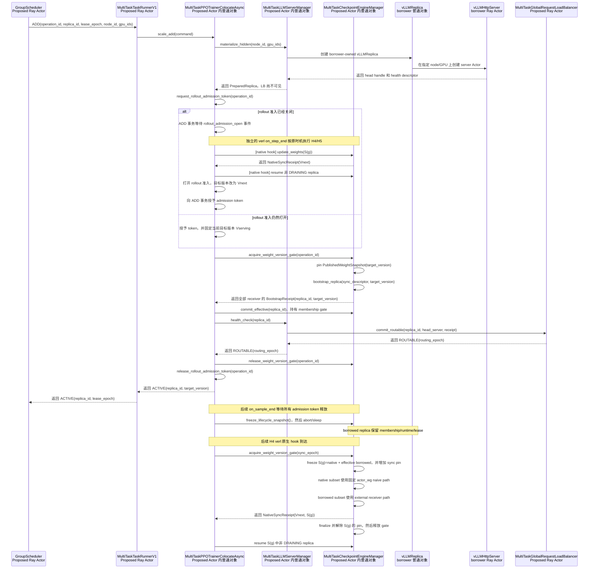
```mermaid
sequenceDiagram
    participant GS as GroupScheduler<br/>Proposed Ray Actor
    participant TR as MultiTaskTaskRunnerV1<br/>Proposed Ray Actor
    participant PT as MultiTaskPPOTrainerColocateAsync<br/>Proposed Actor 内普通对象
    participant M as MultiTaskLLMServerManager<br/>Proposed Actor 内普通对象
    participant C as MultiTaskCheckpointEngineManager<br/>Proposed Actor 内普通对象
    participant R as vLLMReplica<br/>borrower 普通对象
    participant H as vLLMHttpServer<br/>borrower Ray Actor
    participant L as MultiTaskGlobalRequestLoadBalancer<br/>Proposed Ray Actor

    GS->>TR: ADD(operation_id, replica_id, lease_epoch, node_id, gpu_ids)
    TR->>PT: scale_add(command)
    PT->>M: materialize_hidden(node_id, gpu_ids)
    M->>R: 创建 borrower-owned vLLMReplica
    R->>H: 在指定 node/GPU 上创建 server Actor
    H-->>M: 返回 head handle 和 health descriptor
    M-->>PT: 返回 PreparedReplica，LB 尚不可见
    PT->>PT: request_rollout_admission_token(operation_id)
    alt rollout 准入已经关闭
        PT->>PT: ADD 事务等待 rollout_admission_open 事件
        Note over PT,C: 独立的 verl on_step_end 按原时机执行 H4/H5
        PT->>C: [native hook] update_weights(S(g))
        C-->>PT: 返回 NativeSyncReceipt(Vnext)
        PT->>C: [native hook] resume 非 DRAINING replica
        PT->>PT: 打开 rollout 准入，目标版本改为 Vnext
        PT->>PT: 向 ADD 事务授予 admission token
    else rollout 准入仍然打开
        PT->>PT: 授予 token，并固定当前目标版本 Vserving
    end
    PT->>C: acquire_weight_version_gate(operation_id)
    C->>C: pin PublishedWeightSnapshot(target_version)
    C->>C: bootstrap_replica(sync_descriptor, target_version)
    C-->>PT: 返回全部 receiver 的 BootstrapReceipt(replica_id, target_version)
    PT->>C: commit_effective(replica_id)，持有 membership gate
    PT->>M: health_check(replica_id)
    M->>L: commit_routable(replica_id, head_server, receipt)
    L-->>M: 返回 ROUTABLE(routing_epoch)
    M-->>PT: 返回 ROUTABLE(routing_epoch)
    PT->>C: release_weight_version_gate(operation_id)
    PT->>PT: release_rollout_admission_token(operation_id)
    PT-->>TR: 返回 ACTIVE(replica_id, target_version)
    TR-->>GS: 返回 ACTIVE(replica_id, lease_epoch)

    Note over PT,C: 后续 on_sample_end 等待所有 admission token 释放
    PT->>C: freeze_lifecycle_snapshot()，然后 abort/sleep
    Note over C,R: borrowed replica 保留 membership/runtime/lease
    Note over PT,C: 后续 H4 verl 原生 hook 到达
    PT->>C: acquire_weight_version_gate(sync_epoch)
    C->>C: freeze S(g)=native + effective borrowed，并增加 sync pin
    C->>C: native subset 使用固定 actor_wg naive path
    C->>C: borrowed subset 使用 external receiver path
    C-->>PT: 返回 NativeSyncReceipt(Vnext, S(g))
    C->>C: finalize 并解除 S(g) 的 pin，然后释放 gate
    PT->>C: resume S(g) 中非 DRAINING replica
```

图中的流程按以下顺序提交新 replica：

1. `GroupScheduler` 把 ADD 命令发送给 `MultiTaskTaskRunnerV1`。`MultiTaskTaskRunnerV1` 调用其持有的
   `MultiTaskPPOTrainerColocateAsync`；TaskRunner 不直接持有 manager 或 CE。
2. `MultiTaskPPOTrainerColocateAsync` 调用 `MultiTaskLLMServerManager` 创建隐藏的 borrower-owned `vLLMReplica` 和
   `vLLMHttpServer`。manager 在该阶段不修改 LB。
3. `MultiTaskPPOTrainerColocateAsync` 请求 rollout-admission token。如果 `on_sample_end()` 已经关闭 rollout 准入，ADD 等 H4
   发布新版本并由 H5 重新打开准入。ADD 不在等待期间持有 weight-version gate。
4. rollout 准入打开后，`MultiTaskPPOTrainerColocateAsync` 获得 rollout-admission token 和 weight-version gate。manager 在该
   token 有效期间不能进入 `on_sample_end()`。
5. `MultiTaskCheckpointEngineManager` pin 当前 `PublishedWeightSnapshot(target_version)`，并只向新 replica 的 borrower-owned
   external receiver 发送权重。全部接收端返回同一版本后，manager 生成 `BootstrapReceipt`。
6. `MultiTaskPPOTrainerColocateAsync` 在 membership gate 内把新 replica 加入 effective membership。随后
   `MultiTaskLLMServerManager` 校验 runtime health，并让 LB 把 head server 提交为 `ROUTABLE`。
7. LB 返回 `routing_epoch` 后，`MultiTaskPPOTrainerColocateAsync` 先释放 weight-version gate，再释放 rollout-admission token。
   `on_sample_end()` 随后冻结的 lifecycle snapshot 将包含该 replica。
8. `on_sample_end()` 可以 abort/sleep borrowed replica，但 `on_sample_end()` 不删除该 replica 的 manager、CE、LB 或 lease 状态。
9. 后续 H4 在 weight-version gate 和 membership gate 下冻结 `S(g)`。只要 borrowed replica 仍属于 effective membership，H4 就必须
   把该 replica 加入 borrowed subset。H4 只有在 fixed native subset 和 borrowed subset 全部成功后，才返回统一的
   `NativeSyncReceipt(V_next, S(g))`。

如果 ADD 在 H0 内提交成功，后续 H4 的 `S(g)` 必须包含新 replica。如果 `on_sample_end()` 先关闭 rollout 准入，H4 先更新既有集合；
ADD 在 H5 后只把新 replica bootstrap 到最新版本，再提交 CE 和 LB。两种顺序都不会让旧版本新 replica 接收请求。

HYBRID 的关键 GAP 比 STANDALONE 更明确：`CheckpointEngineManager.update_weights()` 在 `backend="naive"` 时只调用固定
`actor_wg.update_weights()` 并立即返回，不读取动态 `self.replicas`，见 `checkpoint_engine/base.py:493-496`。真正按 node ID/GPU ID
新建的 B 不属于初始化时的 `actor_wg`，所以只执行 `add_replicas([B])` 既不能 bootstrap B，也不能让 H4 更新 B。TO-BE 同时需要
target-only bootstrap 与后续 mixed-subset native publish：

```text
bootstrap_replica(B, PublishedWeightSnapshot(Vserving))
  -> 只更新 borrower-owned external receiver

update_weights(S(g))
  -> native subset 走 actor_wg.update_weights(mode="naive")
  -> borrowed subset 走 borrower-owned external receiver path
  -> 两边都成功才发布一个 NativeSyncReceipt(Vnext, S(g))
```

如何创建 borrower-owned external receiver、如何让一次 H4 publish 原子覆盖 fixed/borrowed 两个数据面，以及如何重放明确
`Vserving`，仍是关键 GAP。`on_sample_end()` 把 B sleep 只提供运行状态前提，不会自动把 B 接入 naive `actor_wg`。

### 4.5 HYBRID partial REMOVE：摘流、partial 续推和销毁

`on_sample_end()` 和 REMOVE 是两条独立流程。没有 `GroupScheduler` recall 时，`on_sample_end()` 只 abort/sleep lifecycle snapshot 中的
replica；borrowed replica 可以保留到下一 step。只有 `GroupScheduler` 发出带 operation ID 和 lease epoch 的 REMOVE 命令时，borrower
才执行以下 TO-BE 流程：

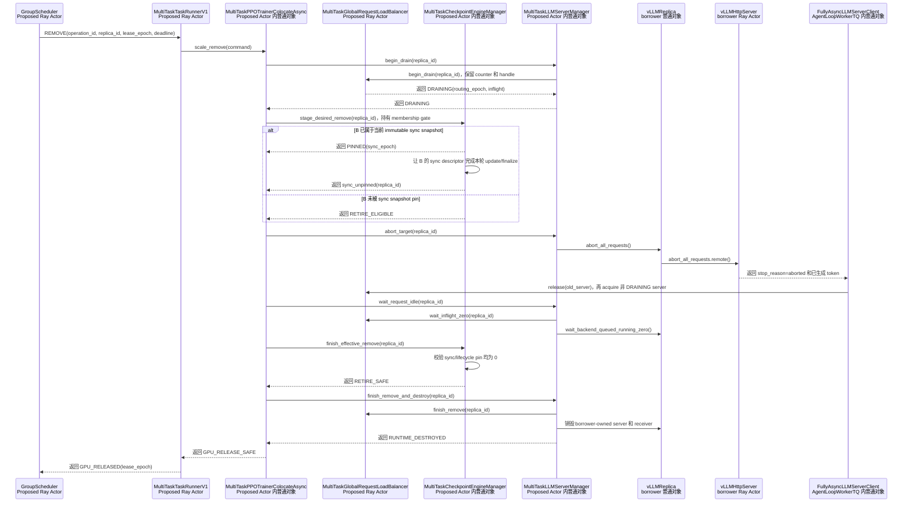
```mermaid
sequenceDiagram
    participant GS as GroupScheduler<br/>Proposed Ray Actor
    participant TR as MultiTaskTaskRunnerV1<br/>Proposed Ray Actor
    participant PT as MultiTaskPPOTrainerColocateAsync<br/>Proposed Actor 内普通对象
    participant L as MultiTaskGlobalRequestLoadBalancer<br/>Proposed Ray Actor
    participant C as MultiTaskCheckpointEngineManager<br/>Proposed Actor 内普通对象
    participant M as MultiTaskLLMServerManager<br/>Proposed Actor 内普通对象
    participant R as vLLMReplica<br/>borrower 普通对象
    participant H as vLLMHttpServer<br/>borrower Ray Actor
    participant FC as FullyAsyncLLMServerClient<br/>AgentLoopWorkerTQ 内普通对象

    GS->>TR: REMOVE(operation_id, replica_id, lease_epoch, deadline)
    TR->>PT: scale_remove(command)
    PT->>M: begin_drain(replica_id)
    M->>L: begin_drain(replica_id)，保留 counter 和 handle
    L-->>M: 返回 DRAINING(routing_epoch, inflight)
    M-->>PT: 返回 DRAINING
    PT->>C: stage_desired_remove(replica_id)，持有 membership gate
    alt B 已属于当前 immutable sync snapshot
        C-->>PT: 返回 PINNED(sync_epoch)
        C->>C: 让 B 的 sync descriptor 完成本轮 update/finalize
        C-->>PT: 返回 sync_unpinned(replica_id)
    else B 未被 sync snapshot pin
        C-->>PT: 返回 RETIRE_ELIGIBLE
    end
    PT->>M: abort_target(replica_id)
    M->>R: abort_all_requests()
    R->>H: abort_all_requests.remote()
    H-->>FC: 返回 stop_reason=aborted 和已生成 token
    FC->>L: release(old_server)，再 acquire 非 DRAINING server
    PT->>M: wait_request_idle(replica_id)
    M->>L: wait_inflight_zero(replica_id)
    M->>R: wait_backend_queued_running_zero()
    PT->>C: finish_effective_remove(replica_id)
    C->>C: 校验 sync/lifecycle pin 均为 0
    C-->>PT: 返回 RETIRE_SAFE
    PT->>M: finish_remove_and_destroy(replica_id)
    M->>L: finish_remove(replica_id)
    M->>R: 销毁 borrower-owned server 和 receiver
    M-->>PT: 返回 RUNTIME_DESTROYED
    PT-->>TR: 返回 GPU_RELEASE_SAFE
    TR-->>GS: 返回 GPU_RELEASED(lease_epoch)
```

图中的 REMOVE 流程按以下顺序执行：

1. `MultiTaskPPOTrainerColocateAsync` 让 `MultiTaskLLMServerManager` 对目标 server 执行 `begin_drain()`。LB 停止向该 server
   分配新请求，但 LB 保留 server handle 和 inflight counter。
2. `MultiTaskCheckpointEngineManager` 在 membership gate 内把目标 replica 从 desired membership 排除。如果 H4 的 `S(g)` 已经
   pin 该 replica，manager 让该 replica 完成本轮 update 和 finalize；REMOVE 不能改变 `S(g)`。
3. sync pin 解除后，`MultiTaskLLMServerManager` 对目标 replica 执行 `abort_all_requests()`。`vLLMReplica` 再向该 replica 的全部
   `vLLMHttpServer` Actor 发送 abort RPC。
4. `vLLMHttpServer` 把 `stop_reason=aborted` 和本次 attempt 已生成的 token 返回给
   `FullyAsyncLLMServerClient.generate()`。该活 coroutine frame 保存原始 `prompt_ids`、累计
   `final_output.token_ids/log_probs`、剩余 token budget 和 `min/max_global_steps`，见 `llm_server.py:372-460`。
5. `FullyAsyncLLMServerClient` 先向 LB release 旧 server，再 acquire 一个非 DRAINING server。client 把
   `prompt_ids + accumulated prefix` 发送给新 server。正常续推不会把 partial prompt 放回 TransferQueue；TransferQueue 只保存
   prompt/group 状态和完成后的 trajectory，见 `replay_buffer.py:63-112`、`agent_loop_tq.py:177-227`。
6. `MultiTaskLLMServerManager` 同时等待 LB inflight 归零和 backend queued/running 归零。任一计数非零时，manager 都不能销毁
   runtime。
7. `MultiTaskCheckpointEngineManager` 确认 sync pin 和 lifecycle pin 均为 0，然后在 membership gate 内删除 CE effective member。
8. `MultiTaskLLMServerManager` 让 LB 删除 draining entry，并销毁 borrower-owned server 和同步 receiver。
9. `MultiTaskTaskRunnerV1` 收到 runtime 销毁回执后，才通知 `GroupScheduler` 释放物理 GPU lease。

verl 可以复用的目标级原语是 `vLLMReplica.abort_all_requests()`。该方法聚合该 replica 全部 server 的 abort 结果，见
`vllm_async_server.py:1206-1223`。verl 不能直接复用 `CheckpointEngineManager.abort_replicas()` 完成目标级回收，因为该方法遍历
全部 `self.replicas`，见 `checkpoint_engine/base.py:457-465`。TO-BE manager 仍需补充 replica ID 不变的 per-replica recall、LB
`begin_drain/finish_remove`、backend idle 证据和 lifecycle/sync pin。

### 4.6 数值例子：B2 跨过 `on_sample_end()` 并参与版本 31 同步

假设 borrower 任务有：

```text
native HYBRID replica：R0、R1
每个 replica = 4 GPU
parameter_sync_step P = 2
outer step g = 31，当前 serving version = v30
本 step 投递 24 个 prompt group
两个 local update 各需要 8 个完整 group
max_off_policy_threshold = 2
temporary borrowed replica：B2，4 GPU
GroupScheduler lease 在 step 31 和 step 32 均有效
```

完整流程：

1. H0 中 R0/R1 使用 `v30` 生成；prompt 在 TransferQueue 的 tag 是 `global_steps=31`。
2. `GroupScheduler` 给出 `[node-D, GPU4..7]` lease。`MultiTaskLLMServerManager` 创建 B2 和 HTTP server，并让 B2 保持
   `HIDDEN`。
3. ADD 事务在 H0 获得 rollout-admission token 和 weight-version gate。`MultiTaskCheckpointEngineManager` 只把 `v30` 发送给 B2；
   R0/R1 不 abort，也不重复接收权重。B2 的全部 receiver 返回 `W(B2)=v30` 后，borrower 把 B2 提交到 CE effective membership
   和 LB。LB 把 B2 标为 `ROUTABLE` 并开始向 B2 分配请求。
4. 第一批 8 个完整 group 足够后，`MultiTaskPPOTrainerColocateAsync.on_sample_end()` 冻结
   `{R0,R1,B2}` lifecycle snapshot。`MultiTaskCheckpointEngineManager` 对三个 replica 执行 abort + sleep；但 B2 仍留在 manager
   registry、CE effective set、LB server view 和 GroupScheduler lease 中，没有执行 REMOVE/DESTROY。
5. B2 上两个 unfinished attempt 已累计 96 和 144 token。两个 client coroutine 保留 prefix；由于 server paused，两个 coroutine
   等待 H5，
   不会把 partial prompt 放回 TransferQueue。
6. `P=2` 的两个 local update 完成后，`MultiTaskPPOTrainerColocateAsync` 在 H4 获得 weight-version gate。
   `MultiTaskCheckpointEngineManager` 在 membership gate 下冻结 `S(31)={R0,R1,B2}`。native subset `{R0,R1}` 使用固定
   `actor_wg` naive path；borrowed subset `{B2}` 使用 TO-BE external receiver path。
7. 只有两个 subset 都返回成功，CE 才发布一个 `NativeSyncReceipt(v31,{R0,R1,B2})`；此时
   `W(R0)=W(R1)=W(B2)=v31`。同步期间即使 `GroupScheduler` 发来 REMOVE B2，borrower 也只能先执行 begin-drain 并记录 desired
   REMOVE；borrower 不能把 B2 从 `S(31)` 中删除，也不能销毁 B2。
8. `MultiTaskCheckpointEngineManager` 在 H5 resume `{R0,R1,B2}` 中的非 DRAINING 成员。B2 在 step 32 继续接流，因此 borrower
   无需重新 CREATE 或重新 bootstrap B2。
9. resumed trajectory 可以记录 `min_global_steps=30,max_global_steps=31`。`ReplayBufferAsync` 仍按 prompt age 判断是否接收该
   trajectory：
   在 trainer step 32 时 `32-31+1=2`；`drop` 阈值 2 仍允许，step 33 时 age=3 才淘汰。`wait` 则在 step 32 发现仍在
   pending/running 且 age>=2 时阻止取新 batch。这个判定不是直接比较 `31-30`。

两个 ADD 到达顺序进一步说明 rollout-admission gate 的作用：

- **ADD 先获得 rollout-admission token**：B3 在 H0 完成 bootstrap、CE effective commit 和 LB `ROUTABLE` commit。
  `on_sample_end()` 等 ADD 释放 token 后冻结 lifecycle snapshot；后续 H4 的 `S(31)` 必须包含 B3。
- **`on_sample_end()` 先关闭 rollout 准入**：B3 只保持 `HIDDEN`，并且不持有 weight-version gate。H4 先把既有集合发布到
  `v31`；H5 打开 rollout 准入后，ADD 只给 B3 bootstrap 最新 `v31`，再把 B3 提交为 effective 和 `ROUTABLE`。B3 不会以旧
  `v30` 进入 LB，也不会修改已经完成的 `S(31)`。

### 4.7 当前实现能复用什么，缺什么

| 项目                          | AS-IS 可复用能力                                                                    | GAP / TO-BE                                                                                  |
| --------------------------- | ------------------------------------------------------------------------------ | -------------------------------------------------------------------------------------------- |
| 单控制 Actor 内的对象关系            | Trainer、manager、CE、`RayWorkerGroup` 代理都位于 `TaskRunnerV1` Actor                 | 需要 thread-safe registry、membership gate、immutable snapshot 和 pin；不能依赖共享裸 list alias          |
| partial abort/retry         | `FullyAsyncLLMServerClient` 累计 prefix 并在 aborted 后重试，`llm_server.py:372-460`   | 需要 per-replica 摘流、target abort、旧 attempt release 与 backend idle 闭环                           |
| 完整样本边界                      | `ReplayBufferAsync` 只 materialize terminal group，`replay_buffer.py:497-579`    | partial frame 不在 TQ；进程故障不能恢复 prefix                                                          |
| off-policy 控制               | `drop/wait` 使用 prompt age，`replay_buffer.py:503-577`                           | `min/max_global_steps` 已记录，但 AS-IS gate 不直接按实际版本跨度判断                                         |
| native 参数同步                 | fixed `actor_wg` 的 naive in-process update，`checkpoint_engine/base.py:493-496` | retained borrowed 必须进入 immutable `S(g)`；需要 fixed/borrowed mixed-subset publish 与单一原子 receipt |
| 新实例 bootstrap               | 无 target-only external API；sender 读取 live trainer weights                      | 需要 borrower-owned receiver、明确版本 replay，以及与 H4 共用 weight-version gate                         |
| `on_sample_end()` lifecycle | `_step_once()` 在训练前同步调用全量 abort/sleep，`trainer_base.py:536-586`                | 需要冻结短期 lifecycle snapshot/pin；完成后保留 borrowed membership/runtime/lease                        |
| runtime ownership           | `LLMServerManager` 持有 native `vLLMReplica` / server handles                    | base manager 没有按 node ID/GPU IDs 动态 materialize/teardown external replica 的通用 API            |
| LB 动态集合                     | 原生 `add_servers/remove_servers`，`llm_server.py:123-149`                        | remove 会立即丢 counter；需要 staged/ROUTABLE commit 与两阶段 drain                                     |
| 容量投影                        | 请求能力主要由 LB ACTIVE server 集合体现                                                  | 不复用 Fully Async 的 `max_concurrent_samples`；仍需同步监控、空闲与 GroupScheduler 上报视图                    |
| 控制 RPC                      | `TaskRunnerV1` 是现有入口                                                           | `run()` 长期占用 actor；需要 control concurrency group、journal 与 lifecycle/sync-hook reconcile      |
| 跨 step lease                | `sleep_replicas()` 可释放 weights/KV，但不注销对象                                       | sleeping borrowed runtime 与 donor training 共存所需的无计算、残余 HBM 和 wake fencing 仍需实测证明             |

## 4.3 关键流程

### 4.3.1 scaling 原子性保证
### 10.1 建议时序

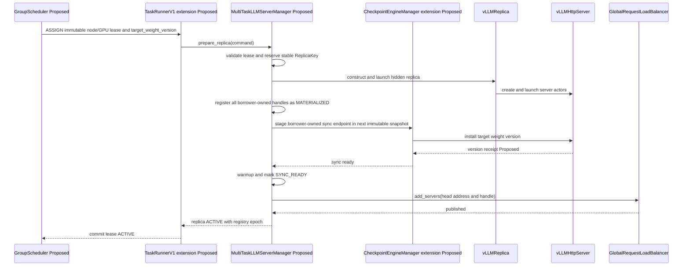
```mermaid
sequenceDiagram
    participant GS as GroupScheduler Proposed
    participant TR as TaskRunnerV1 extension Proposed
    participant MM as MultiTaskLLMServerManager Proposed
    participant CE as CheckpointEngineManager extension Proposed
    participant VR as vLLMReplica
    participant HS as vLLMHttpServer
    participant LB as GlobalRequestLoadBalancer

    GS->>TR: ASSIGN immutable node/GPU lease and target_weight_version
    TR->>MM: prepare_replica(command)
    MM->>MM: validate lease and reserve stable ReplicaKey
    MM->>VR: construct and launch hidden replica
    VR->>HS: create and launch server actors
    MM->>MM: register all borrower-owned handles as MATERIALIZED
    MM->>CE: stage borrower-owned sync endpoint in next immutable snapshot
    CE->>HS: install target weight version
    HS-->>CE: version receipt Proposed
    CE-->>MM: sync ready
    MM->>MM: warmup and mark SYNC_READY
    MM->>LB: add_servers(head address and handle)
    LB-->>MM: published
    MM-->>TR: replica ACTIVE with registry epoch
    TR-->>GS: commit lease ACTIVE
```

### 10.2 发布顺序约束

1. **先在 G 视图占住 lease，再创建任何 borrower HBM 实体。**否则两个 borrower 可能同时看见同一空泡。
2. **新 replica 必须先 hidden。**它可以出现在 manager 的 `MATERIALIZED` registry，但不能出现在 LB。
3. **同步使用不可变 effective snapshot。**一次 update 从开始到 finalize 都使用同一 replica/worker 集合；不能在
   `checkpoint_engine/base.py:502-505` 展平 workers 后，又让后续 lifecycle 方法读取一份已变化的 list。
4. **权重版本成功并 warmup 后才发布到 LB。**当前 server 能给生成结果附带 `global_steps`，但没有独立
   `get_global_steps()` 或结构化 sync receipt；建议扩展一个可校验回执，而不是用“RPC 没抛异常”代替版本证明。
5. **LB 是最后一个面向请求的数据面发布点。**LB add 成功才允许把 record 标记为 `ROUTABLE`。
6. **GroupScheduler 最后 commit ACTIVE。**TaskRunner 返回 `ReplicaKey + registry_epoch + lease_epoch`，避免旧命令覆盖
   新实例。

## 11. 失败回滚与回收顺序

### 11.1 添加失败回滚

| 失败位置 | 必须执行的补偿 |
|---|---|
| lease 校验失败 | 不创建实体，释放 PENDING record |
| 部分 server 创建失败 | 杀掉仅属于 borrower 的已创建 server/backend；donor 原生 server 不销毁 |
| sync endpoint 注册失败 | 从下一 sync snapshot 移除；解绑并销毁 borrower-owned endpoint；不进 LB；donor endpoint 不受影响 |
| 权重更新或版本校验失败 | replica 保持 hidden；释放其 HBM；删除 borrower 临时实体 |
| LB add 失败 | replica 保持 SYNC_READY 但不可路由，随后重试或销毁；不得把 GS lease commit 为 ACTIVE |
| LB add 成功、manager commit 失败 | 立即 LB remove，abort/drain，再反向清理 C/M/G；原生 experimental 目前没有这项补偿 |

### 11.2 回收顺序

```text
LB remove / mark DRAINING
  -> 等待 inflight 归零，或复用 partial rollout abort 机制迁移请求
  -> 从下一次 CE effective snapshot 排除
  -> 等待正在进行的 sync epoch 完成
  -> borrower manager 销毁自己持有的 server/backend/sync endpoint 并释放 HBM
  -> GroupScheduler 释放 borrower lease
  -> GroupScheduler 可另行命令 donor 唤醒自己的 native replica
  -> donor 按自身最新版本同步并重新进入 donor LB
```

donor 原生 replica、原生 PG、WorkerDict/CheckpointEngineWorker 和原生 server 仍由 donor 拥有；回收 borrower 时不能把
这些实体一起销毁。上述最后两步是 donor 自己的恢复事务，不是把 borrower runtime handle “归还”给 donor。

### 4.3.2 scaling 阶段互斥保证

### 3.4 Fully Async ADD：跨 Trainer / Rollouter Actor 的提交协议

以下是 TO-BE 时序，所有新增类均明确标为 Proposed：

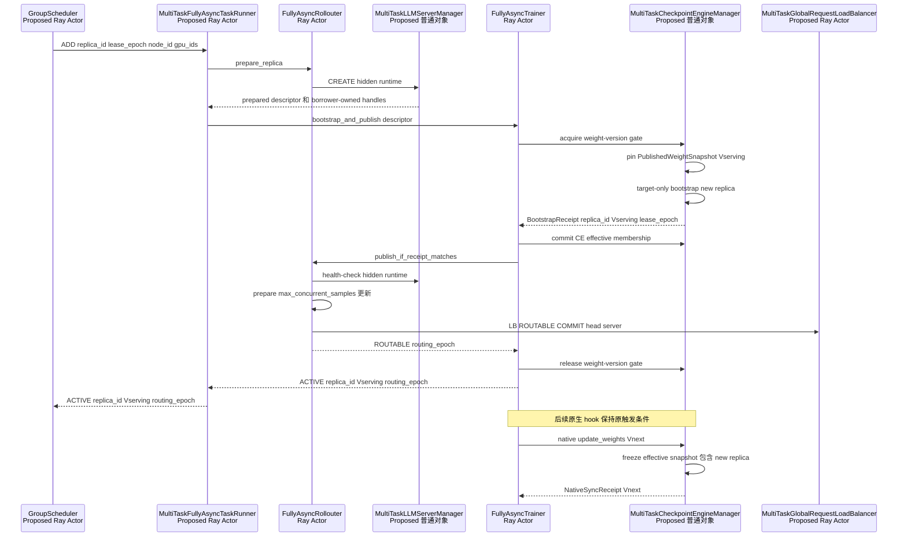
```mermaid
sequenceDiagram
    participant GS as GroupScheduler<br/>Proposed Ray Actor
    participant TR as MultiTaskFullyAsyncTaskRunner<br/>Proposed Ray Actor
    participant FAR as FullyAsyncRollouter<br/>Ray Actor
    participant M as MultiTaskLLMServerManager<br/>Proposed 普通对象
    participant FAT as FullyAsyncTrainer<br/>Ray Actor
    participant C as MultiTaskCheckpointEngineManager<br/>Proposed 普通对象
    participant L as MultiTaskGlobalRequestLoadBalancer<br/>Proposed Ray Actor

    GS->>TR: ADD replica_id lease_epoch node_id gpu_ids
    TR->>FAR: prepare_replica
    FAR->>M: CREATE hidden runtime
    M-->>TR: prepared descriptor 和 borrower-owned handles
    TR->>FAT: bootstrap_and_publish descriptor
    FAT->>C: acquire weight-version gate
    C->>C: pin PublishedWeightSnapshot Vserving
    C->>C: target-only bootstrap new replica
    C-->>FAT: BootstrapReceipt replica_id Vserving lease_epoch
    FAT->>C: commit CE effective membership
    FAT->>FAR: publish_if_receipt_matches
    FAR->>M: health-check hidden runtime
    FAR->>FAR: prepare max_concurrent_samples 更新
    FAR->>L: LB ROUTABLE COMMIT head server
    FAR-->>FAT: ROUTABLE routing_epoch
    FAT->>C: release weight-version gate
    FAT-->>TR: ACTIVE replica_id Vserving routing_epoch
    TR-->>GS: ACTIVE replica_id Vserving routing_epoch
    Note over FAT,C: 后续原生 hook 保持原触发条件
    FAT->>C: native update_weights Vnext
    C->>C: freeze effective snapshot 包含 new replica
    C-->>FAT: NativeSyncReceipt Vnext
```

这个协议没有增加通信组件：`FullyAsyncTaskRunner`、`FullyAsyncTrainer`、`FullyAsyncRollouter`、LB 都是该模式本来就有的 Actor；
子仓只扩展其接口和 task-local 普通对象。

关键线性化点有四个：

1. bootstrap 获得 gate 后固定 `V_serving`；原生同步的控制请求可到达，但数据面等待；
2. `BootstrapReceipt` 必须包含 stable replica ID、target version、operation ID 和 lease epoch；
3. CE effective commit 与 LB ROUTABLE commit 都发生在释放 gate 前，旧命令回执不能发布新 lease；
4. gate 释放后的下一次 native snapshot 必须包含新 replica；它与原有 replica 一起更新到 `V_next`。

Fully Async 中 canonical manager/LB 位于 `FullyAsyncRollouter` Actor，CE 和 gate 位于 `FullyAsyncTrainer` Actor，因此图中的
`bootstrap_and_publish` 是跨 Actor 事务。它可以由 Trainer 在持有 gate 时调用 rollouter publish RPC，也可以由 TaskRunner 使用有
超时的 block token 协调；不能用两个没有共同 fencing token 的裸 list 修改代替。

### 3.5 Fully Async REMOVE：摘流、续推和销毁

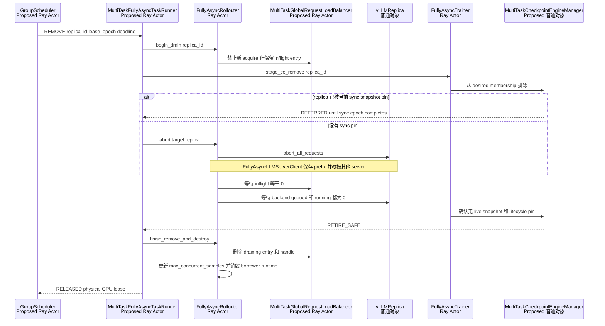
```mermaid
sequenceDiagram
    participant GS as GroupScheduler<br/>Proposed Ray Actor
    participant TR as MultiTaskFullyAsyncTaskRunner<br/>Proposed Ray Actor
    participant FAR as FullyAsyncRollouter<br/>Ray Actor
    participant L as MultiTaskGlobalRequestLoadBalancer<br/>Proposed Ray Actor
    participant R as vLLMReplica<br/>普通对象
    participant FAT as FullyAsyncTrainer<br/>Ray Actor
    participant C as MultiTaskCheckpointEngineManager<br/>Proposed 普通对象

    GS->>TR: REMOVE replica_id lease_epoch deadline
    TR->>FAR: begin_drain replica_id
    FAR->>L: 禁止新 acquire 但保留 inflight entry
    TR->>FAT: stage_ce_remove replica_id
    FAT->>C: 从 desired membership 排除
    alt replica 已被当前 sync snapshot pin
        C-->>TR: DEFERRED until sync epoch completes
    else 没有 sync pin
        TR->>FAR: abort target replica
        FAR->>R: abort_all_requests
        Note over FAR,R: FullyAsyncLLMServerClient 保存 prefix 并改投其他 server
    end
    FAR->>L: 等待 inflight 等于 0
    FAR->>R: 等待 backend queued 和 running 都为 0
    FAT->>C: 确认无 live snapshot 和 lifecycle pin
    C-->>TR: RETIRE_SAFE
    TR->>FAR: finish_remove_and_destroy
    FAR->>L: 删除 draining entry 和 handle
    FAR->>FAR: 更新 max_concurrent_samples 并销毁 borrower runtime
    TR-->>GS: RELEASED physical GPU lease
```

如果 REMOVE 在 sync 过程中到达，LB begin-drain 仍可立即执行，因为它只阻止新 acquire；但 target abort、sleep、CE endpoint
销毁必须等当前 sync lifecycle 结束。现有 `CheckpointEngineManager.update_weights()` 会在末尾 resume 当前集合，见
`checkpoint_engine/base.py:532-536`；TO-BE manager 必须保证 DRAINING 成员不会在同步结束后重新变成可路由状态，或者在 sync
完成后由 retire 流程再次 pause。当前 AS-IS 没有这个状态判断。

## 4.4 运行视图

### 心跳、状态上报

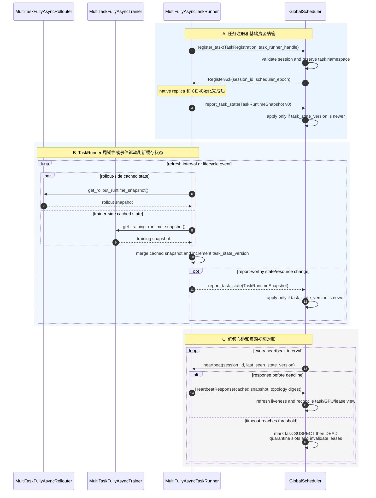
```mermaid
sequenceDiagram
    autonumber
    participant R as MultiTaskFullyAsyncRollouter
    participant T as MultiTaskFullyAsyncTrainer
    participant DTR as MultiFullyAsyncTaskRunner
    participant GS as GlobalScheduler

    rect rgb(235, 245, 255)
        Note over DTR,GS: A. 任务注册和基础资源纳管
        DTR->>GS: register_task(TaskRegistration, task_runner_handle)
        GS->>GS: validate session and reserve task namespace
        GS-->>DTR: RegisterAck(session_id, scheduler_epoch)
        Note over DTR: native replica 和 CE 初始化完成后
        DTR->>GS: report_task_state(TaskRuntimeSnapshot v0)
        GS->>GS: apply only if task_state_version is newer
    end

    rect rgb(242, 248, 255)
        Note over R,DTR: B. TaskRunner 周期性或事件驱动刷新缓存状态
        loop refresh interval or lifecycle event
            par rollout-side cached state
                DTR->>R: get_rollout_runtime_snapshot()
                R-->>DTR: rollout snapshot
            and trainer-side cached state
                DTR->>T: get_training_runtime_snapshot()
                T-->>DTR: training snapshot
            end
            DTR->>DTR: merge cached snapshot and increment task_state_version
            opt report-worthy state/resource change
                DTR-->>GS: report_task_state(TaskRuntimeSnapshot)
                GS->>GS: apply only if task_state_version is newer
            end
        end
    end

    rect rgb(245, 245, 245)
        Note over DTR,GS: C. 低频心跳和资源视图对账
        loop every heartbeat_interval
            GS->>DTR: heartbeat(session_id, last_seen_state_version)
            alt response before deadline
                DTR-->>GS: HeartbeatResponse(cached snapshot, topology digest)
                GS->>GS: refresh liveness and reconcile task/GPU/lease view
            else timeout reaches threshold
                GS->>GS: mark task SUSPECT then DEAD<br/>quarantine slots and invalidate leases
            end
        end
    end
```

### 受赠推理实例创建

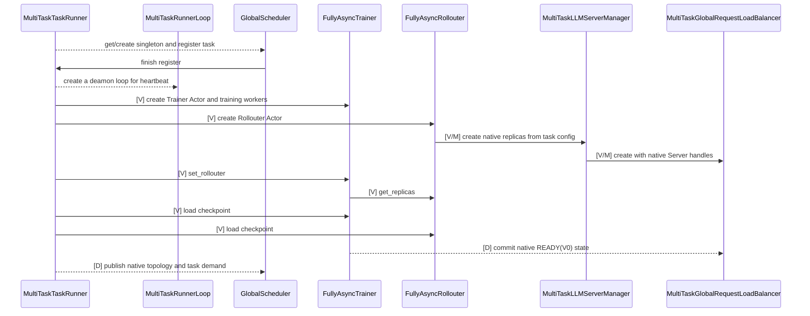
```mermaid
sequenceDiagram
    participant TR as MultiTaskTaskRunner
    participant TR_LOOP as MultiTaskRunnerLoop
    participant GS as GlobalScheduler
    participant T as FullyAsyncTrainer
    participant R as FullyAsyncRollouter
    participant M as MultiTaskLLMServerManager
    participant LB as MultiTaskGlobalRequestLoadBalancer

    TR-->>GS: get/create singleton and register task
    GS->>TR: finish register
    TR-->>TR_LOOP: create a deamon loop for heartbeat
    TR->>T: [V] create Trainer Actor and training workers
    TR->>R: [V] create Rollouter Actor
    R->>M: [V/M] create native replicas from task config
    M->>LB: [V/M] create with native Server handles
    TR->>T: [V] set_rollouter
    T->>R: [V] get_replicas
    TR->>T: [V] load checkpoint
    TR->>R: [V] load checkpoint
    T-->>LB: [D] commit native READY(V0) state
    TR-->>GS: [D] publish native topology and task demand
```

### 推理实例空闲状态判断

### 推理实例强行回收

### 参数同步
