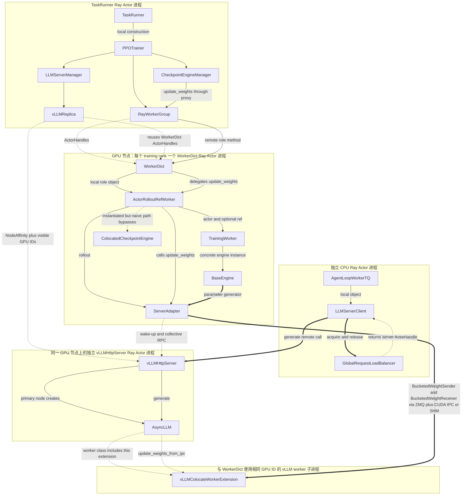
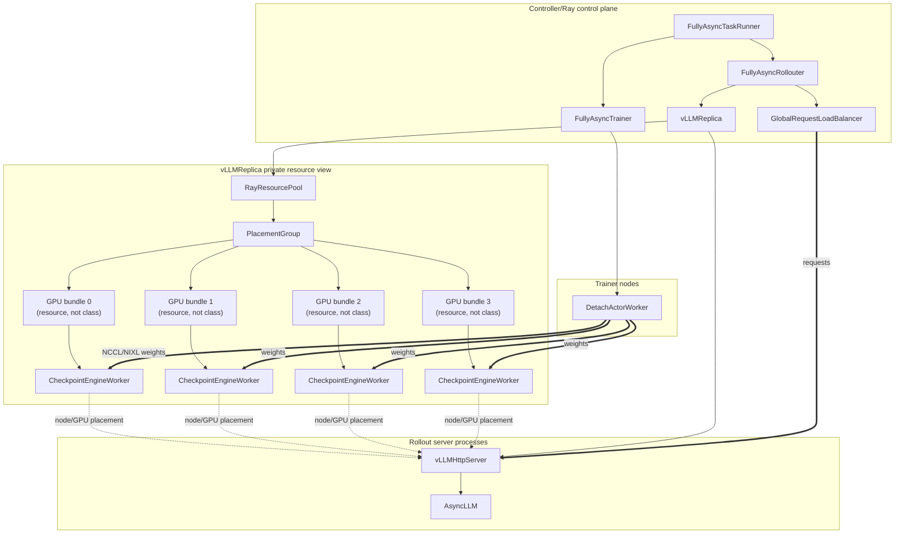
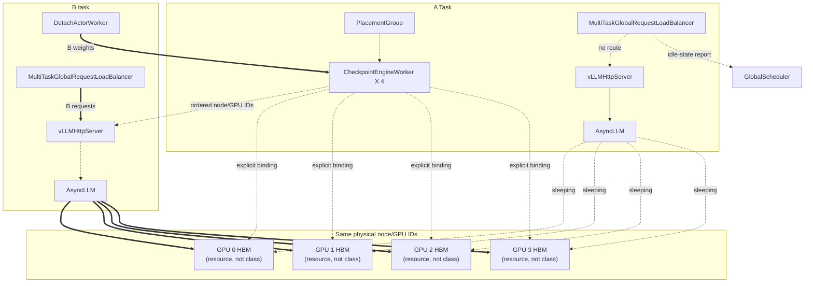

#### 4.2.1.3 AS-IS 部署视图

```mermaid
flowchart TB
    subgraph ControllerProcess["TaskRunner Ray Actor 进程"]
        TaskRunner["TaskRunner"]
        PPOTrainer["PPOTrainer"]
        RayWorkerGroup["RayWorkerGroup"]
        LLMServerManager["LLMServerManager"]
        vLLMReplica["vLLMReplica"]
        CheckpointEngineManager["CheckpointEngineManager"]

        TaskRunner -->|local construction| PPOTrainer
        PPOTrainer --> RayWorkerGroup
        PPOTrainer --> LLMServerManager
        LLMServerManager --> vLLMReplica
        PPOTrainer --> CheckpointEngineManager
    end

    subgraph RequestActorProcesses["独立 CPU Ray Actor 进程"]
        AgentLoopWorkerTQ["AgentLoopWorkerTQ"]
        LLMServerClient["LLMServerClient"]
        GlobalRequestLoadBalancer["GlobalRequestLoadBalancer"]

        AgentLoopWorkerTQ -->|local object| LLMServerClient
        LLMServerClient ==>|acquire and release| GlobalRequestLoadBalancer
        GlobalRequestLoadBalancer -.->|returns server ActorHandle| LLMServerClient
    end

    subgraph TrainingActorProcess["GPU 节点：每个 training rank 一个 WorkerDict Ray Actor 进程"]
        WorkerDict["WorkerDict"]
        ActorRolloutRefWorker["ActorRolloutRefWorker"]
        TrainingWorker["TrainingWorker"]
        BaseEngine["BaseEngine"]
        ServerAdapter["ServerAdapter"]
        ColocatedCheckpointEngine["ColocatedCheckpointEngine"]

        WorkerDict -->|local role object| ActorRolloutRefWorker
        ActorRolloutRefWorker -->|actor and optional ref| TrainingWorker
        TrainingWorker -->|concrete engine instance| BaseEngine
        ActorRolloutRefWorker -->|rollout| ServerAdapter
        ActorRolloutRefWorker -.->|instantiated but naive path bypasses| ColocatedCheckpointEngine
    end

    subgraph ServerActorProcess["同一 GPU 节点上的独立 vLLMHttpServer Ray Actor 进程"]
        vLLMHttpServer["vLLMHttpServer"]
        AsyncLLM["AsyncLLM"]

        vLLMHttpServer -->|primary node creates| AsyncLLM
    end

    subgraph vLLMWorkerProcess["与 WorkerDict 使用相同 GPU ID 的 vLLM worker 子进程"]
        vLLMColocateWorkerExtension["vLLMColocateWorkerExtension"]
    end

    RayWorkerGroup -.->|ActorHandles| WorkerDict
    vLLMReplica -.->|reuses WorkerDict ActorHandles| WorkerDict
    vLLMReplica -.->|NodeAffinity plus visible GPU IDs| vLLMHttpServer

    LLMServerClient ==>|generate remote call| vLLMHttpServer
    vLLMHttpServer -->|generate| AsyncLLM
    AsyncLLM -.->|worker class includes this extension| vLLMColocateWorkerExtension

    CheckpointEngineManager -->|update_weights through proxy| RayWorkerGroup
    RayWorkerGroup -->|remote role method| WorkerDict
    WorkerDict -->|delegates update_weights| ActorRolloutRefWorker
    ActorRolloutRefWorker -->|calls update_weights| ServerAdapter
    BaseEngine ==>|parameter generator| ServerAdapter
    ServerAdapter -.->|wake-up and collective RPC| vLLMHttpServer
    AsyncLLM -.->|update_weights_from_ipc| vLLMColocateWorkerExtension
    ServerAdapter ==>|BucketedWeightSender and BucketedWeightReceiver via ZMQ plus CUDA IPC or SHM| vLLMColocateWorkerExtension
```

#### 4.2.1.4 TO-BE 部署视图

#### 4.2.2.3 AS-IS 部署视图

```mermaid
flowchart TB
    subgraph CTRL[Controller/Ray control plane]
        TR["FullyAsyncTaskRunner"]
        T["FullyAsyncTrainer"]
        R["FullyAsyncRollouter"]
        LB["GlobalRequestLoadBalancer"]
        REP["vLLMReplica"]
    end

    subgraph TRAIN[Trainer nodes]
        TW["DetachActorWorker"]
    end

    subgraph RPG[vLLMReplica private resource view]
        RP["RayResourcePool"]
        PG["PlacementGroup"]
        B0["GPU bundle 0<br/>(resource, not class)"]
        B1["GPU bundle 1<br/>(resource, not class)"]
        B2["GPU bundle 2<br/>(resource, not class)"]
        B3["GPU bundle 3<br/>(resource, not class)"]
        CW0["CheckpointEngineWorker"]
        CW1["CheckpointEngineWorker"]
        CW2["CheckpointEngineWorker"]
        CW3["CheckpointEngineWorker"]
    end

    subgraph SERVE[Rollout server processes]
        HTTP["vLLMHttpServer"]
        ENG["AsyncLLM"]
    end

    TR --> T
    TR --> R
    T --> TW
    R --> LB
    R --> REP
    REP --> RP
    RP --> PG
    PG --> B0
    PG --> B1
    PG --> B2
    PG --> B3
    B0 --> CW0
    B1 --> CW1
    B2 --> CW2
    B3 --> CW3
    CW0 -. node/GPU placement .-> HTTP
    CW1 -. node/GPU placement .-> HTTP
    CW2 -. node/GPU placement .-> HTTP
    CW3 -. node/GPU placement .-> HTTP
    TW ==>|NCCL/NIXL weights| CW0
    TW ==>|weights| CW1
    TW ==>|weights| CW2
    TW ==>|weights| CW3
    REP --> HTTP
    HTTP --> ENG
    LB ==>|requests| HTTP
```

#### 4.2.2.4 TO-BE 部署视图

```mermaid
flowchart TB
    GS["GlobalScheduler"]

    subgraph DONOR[A Task]
        PG["PlacementGroup"]
        DCW["CheckpointEngineWorker X 4"]
        DS["vLLMHttpServer"]
        DE["AsyncLLM"]
        DLB["MultiTaskGlobalRequestLoadBalancer"]
        PG -.-> DCW
        DS --> DE
        DLB -. no route .-> DS
    end

    subgraph GPU[Same physical node/GPU IDs]
        G0["GPU 0 HBM<br/>(resource, not class)"]
        G1["GPU 1 HBM<br/>(resource, not class)"]
        G2["GPU 2 HBM<br/>(resource, not class)"]
        G3["GPU 3 HBM<br/>(resource, not class)"]
    end

    subgraph BORROWER[B task]
        BS["vLLMHttpServer"]
        BE["AsyncLLM"]
        BLB["MultiTaskGlobalRequestLoadBalancer"]
        BCE["DetachActorWorker"]
        BCE ==>|B weights| DCW
        BS -.-> BE
        BLB ==>|B requests| BS
    end

    DCW -. ordered node/GPU IDs .-> BS
    DCW -. explicit binding .-> G0
    DCW -. explicit binding .-> G1
    DCW -. explicit binding .-> G2
    DCW -. explicit binding .-> G3
    BE ==> G0
    BE ==> G1
    BE ==> G2
    BE ==> G3
    DE -. sleeping .-> G0
    DE -. sleeping .-> G1
    DE -. sleeping .-> G2
    DE -. sleeping .-> G3
    DLB -. idle-state report .-> GS
```
