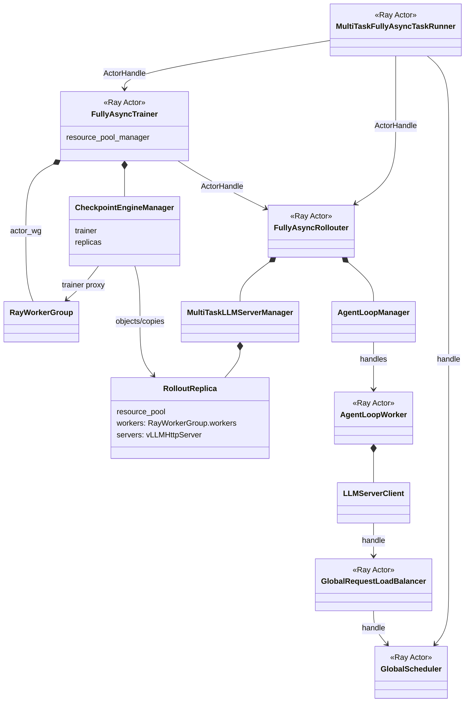

# 问题

1. RL任务训推同步模式rollout期间GPU空泡严重
2. 解决GPU空泡的常规思路：通过单任务内训推异步挤出空泡，能够一定程度上挤出空泡，但受限于陈旧度/rollout权重版本差异影响，无法完全异步，仍有空泡

# 动机

通过多个RL任务间rollout资源共享，将rollout出现空泡任务的GPU借给仍有待采样请求的任务

# 方案设计

## 逻辑视图

系统新增及扩展的组件：

1. **GlobalScheduler**：全局调度器，单例，Ray Actor
    - 维护集群状态和所有任务状态
    - 生成调度算法
    - 向MultiTaskMultiTaskFullyAsyncTaskRunner发送Reclaim/Assign指令
2. **MultiTaskMultiTaskFullyAsyncTaskRunner**：single controller，继承MultiTaskFullyAsyncTaskRunner，Ray Actor
	- 创建及获取全局调度器单例引用
	- 上报任务内资源视图及心跳
	- 接收GlobalScheduler的指令，创建并添加受赠推理实例
3. **MultiTaskMultiTaskLLMServerManager**：任务级调度器，每个任务一个，继承MultiTaskLLMServerManager，不承担全局策略
    - 管理该任务的推理实例，包括通过worker group创建的实例及临时受赠的实例
    - 执行GroupScheduler的Reclaim/Assign请求，创建推理实例
4. **MultiTaskGlobalRequestLoadBalancer**：负载均衡器，继承GlobalRequestLoadBalancer
	- 持有GlobalScheduler句柄，向GroupScheduler上报推理实例状态

## 部署视图

## 运行视图

### 推理实例空闲状态判断

### 受赠推理实例创建

### 推理实例强行回收

### 参数同步
