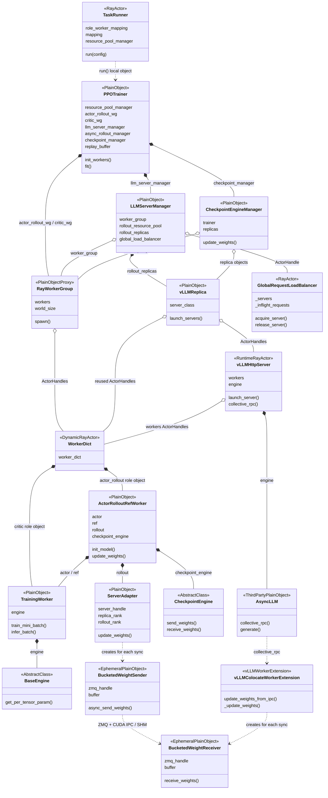
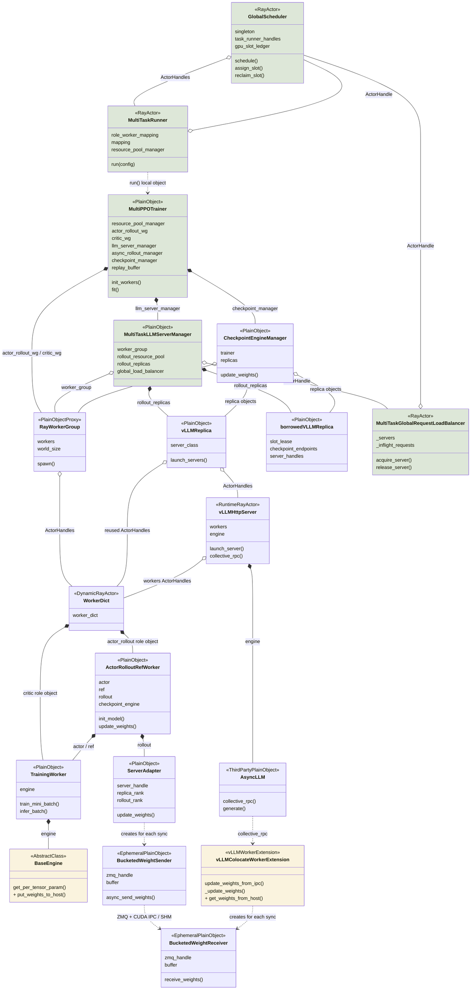
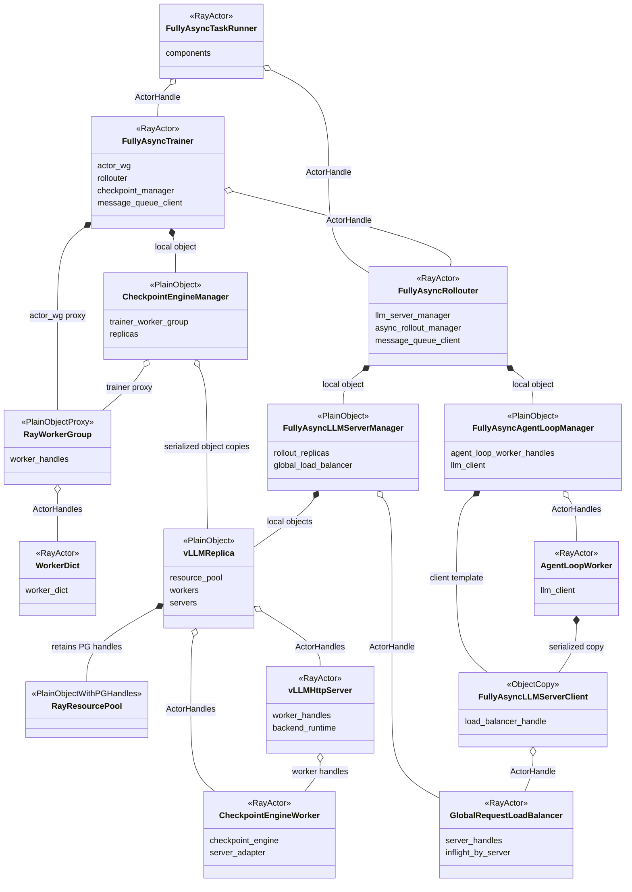
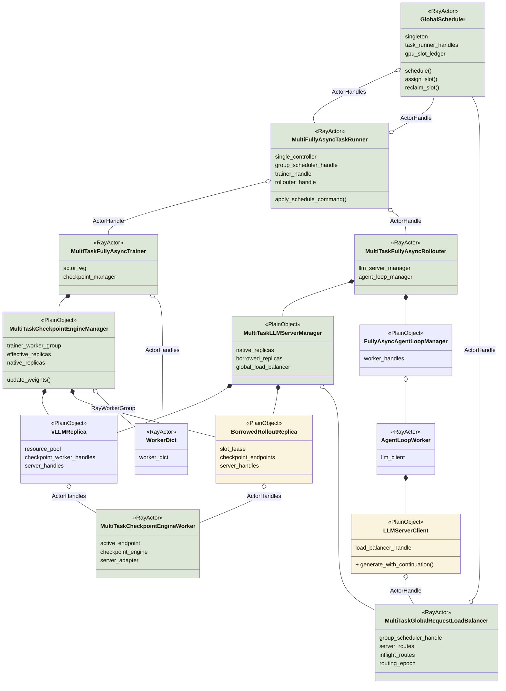
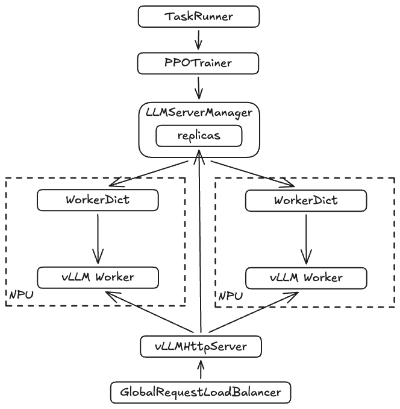
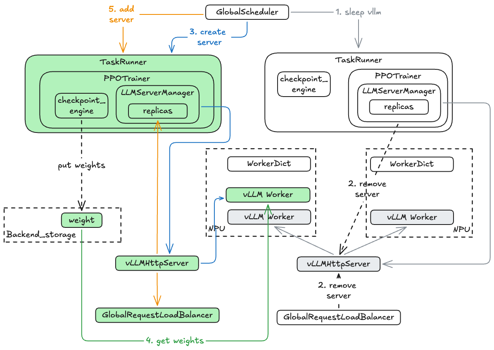
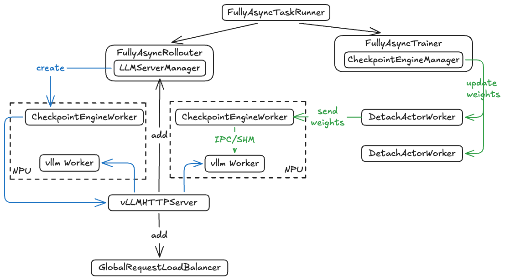
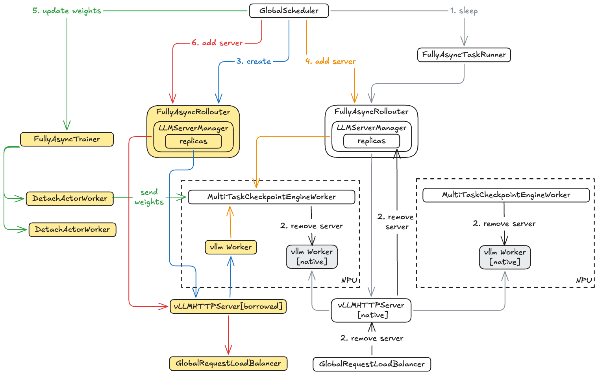
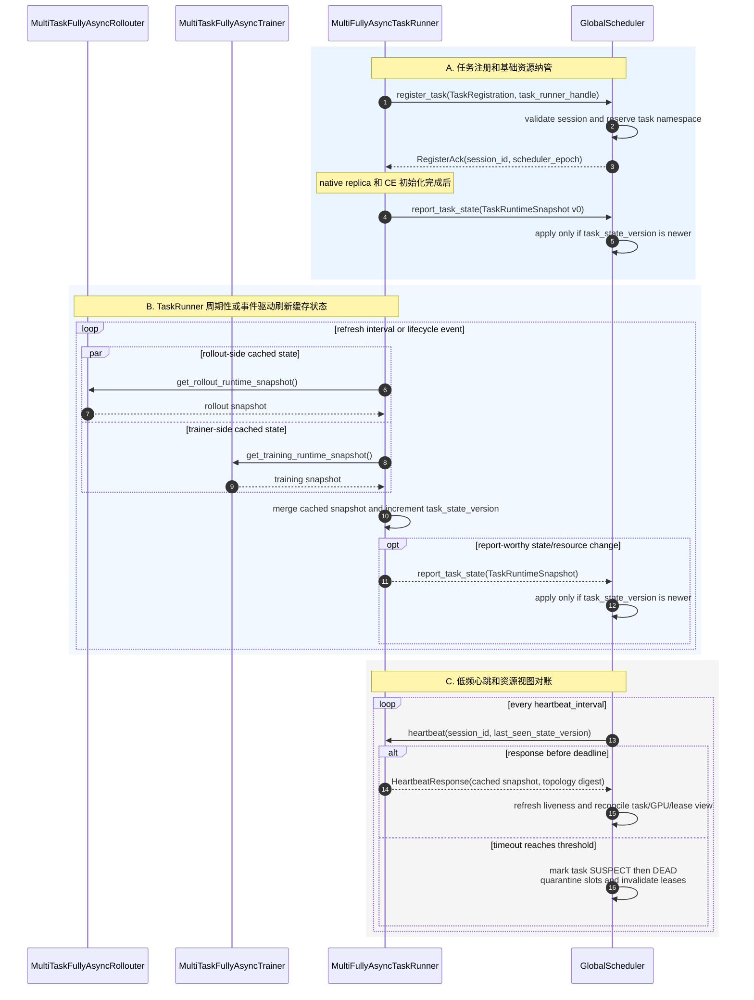
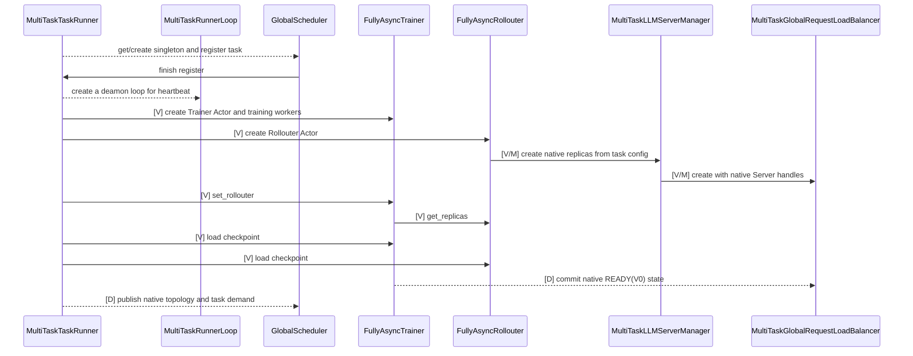

# 1. 问题：单RL任务存在 rollout GPU 空泡

同步模式下，训推存在严格先后顺序，一旦 rollout 阶段存在长尾请求，则rollout阶段 GPU 资源会出现严重的空泡，在长程任务场景下尤甚。

为了解决空泡问题，RL 框架往往采用训推异步挤出空泡。然而，即使单任务在训推异步模式下，也不能保证推理 GPU 持续满载：

1. One-Step-Off 在完整 batch 边界天然存在资源空泡；
2. FullyAsync 只能在允许的陈旧度窗口内继续生产，不能无限向前生成；
3. `partial_rollout` 可以降低等待长尾请求的时间，但会引入 trajectory 跨版本生成，不能无条件开启；

因此，单任务训推异步能够压缩一部分空泡，但受算法陈旧度、参数版本和有限生产窗口约束，无法完全消除 rollout GPU 空闲。

# 2. 动机：在不改变单任务算法语义的前提下跨任务共享空泡卡资源

## 2.1 名词定义

- GlobalScheduler：新增组件，协调多个RL实现rollout资源共享
- Donor任务：某个RL任务的rollout进入长尾阶段，即该step内已没有待推理的sample，计划将其空闲卡共享给其他任务
- Borrower任务：某个RL任务的rollout仍在进行，需要更多实例，经GlobalScheduler协调获取空闲卡的任务

## 2.3 基本思路

多任务资源共享遵循以下原则：

1. 只有当卡资源出现空闲时才能够将其进行共享
2. 任务基于原生资源创建的进程均不销毁，受赠任务的进程允许
3. 当 donor 任务需要卡时，通过强行中断推理进行回收

在多个同时运行的 RL 任务之间临时共享 rollout 卡资源基本流程：

```text
donor 任务感知并向GlobalScheduler上报空泡卡资源
→ GlobalScheduler 生成全局空泡卡资源信息，根据各个任务当前的rollout卡资源现状生成捐/借卡策略
→ GlobalScheduler 向各个任务下发卡释放和占用指令
→ donor 保留原 ResourcePool/PG/bundles 并休眠 Server
→ GlobalScheduler 将释放的卡资源临时租给 borrower
→ borrower 在同一 node/GPU 上创建自己的推理replica
→ borrower 将租借的 replica 加入自己的参数同步集合和 LB
```


## 2.3 用户界面

用户通过新增 $[request, limit]$ 配置控制资源共享程度，且 RL 自带的卡资源规模需配置为$\frac{request + limit}{2}$。其中，`request` 为用户给 RL 任务配置的资源下限，GlobalScheduler 调度过程中不得使 RL 任务卡资源低于 `request` 指定的卡数；`limit` 为用户给 RL 任务配置的资源上限。例如当rollout共有16张卡，共享范围设置为`[8, 24]`，这意味着该任务rollout资源出现空泡时，最多会将8张卡共享给其他任务。同时，当该任务需要加速时，最多会得到其他任务共享的8张卡。综上，该任务在rollout期间的卡数变化范围是`[8, 24]`。

## 2.4 调度流程

1. 任务 X 拉起后向 GlobalScheduler 注册，将本任务期望共享的卡规模以及资源视图上报，GlobalScheduler 将任务 X 允许进行共享的资源纳入全局视图进行管理
2. 任务 X 启动训练进入 rollout 阶段，当任务 X 的推理资源感知到空泡（同步模式下：该 step 内样本已经全部消耗完毕，出现空闲推理实例；异步模式下：受陈旧度等控制，进入等待长尾请求完成阶段，出现空闲实例），任务 X 执行一下操作：
	- 将空闲推理实例从 GlobalRequestLoadBalancer移除
	- 将闲推理实例从 CheckpointEngineManager、CheckpointEngineManagerWorker、LLMServerManager 等组件中的活跃server列表中移除，加入 inactive server 列表
	- 将空闲推理实例进行休眠，卸载其权重及 KV Cache
	- 向 GlobalScheduler 上报空泡卡资源
3. GlobalScheduler 根据空卡资源规模及当前全局任务忙闲程度，确定受捐任务集合 S 及各个任务的卡分配策略
4. GlobalScheduler 向受捐任务下发创建推理实例指令，受捐任务基于NODE ID、GPU ID信息通过 NodeAffinity 创建推理实例
5. 推理实例创建完成后，GlobalScheduler 向受捐任务下发指令，将新创建的推理实例加入CheckpointEngineManager、CheckpointEngineManagerWorker、LLMServerManager 等组件中的活跃server列表
6. 当任务 X 重新需要推理实例时（同步模式：重新进入 rollout 阶段；异步模式：长尾请求等待结束，继续异步rollout），该任务向 GlobalScheduler 上报卡缺口（当前卡规模和基线卡规模的差值）
7. GlobalScheduler 基于资源视图生成回收策略（回收任务 X 捐赠的卡），分别向相关的受捐任务下发回收指令
8. 受捐任务中断回收实例，销毁或休眠推理实例，将其从GlobalRequestLoadBalancer、CheckpointEngineManager、CheckpointEngineManagerWorker、LLMServerManager 等组件中移除
9. GlobalScheduler 向任务 X 下发指令，将回收实例唤醒，完成参数同步，恢复GlobalRequestLoadBalancer、CheckpointEngineManager、CheckpointEngineManagerWorker、LLMServerManager 等组件对推理实例的索引

# 3. 多任务资源共享下 VERL 的架构 GAP

## 3.1 VERL 原生资源创建流程无法表达跨任务资源分配

单任务内 VERL 通过 RAY 完成资源占用和绑定，基于资源的Actor创建完成后默认资源是被任务独占的，无法在多任务间进行共享。
- Ray 资源视图会认为这些 GPU 在任务整个生命周期内始终被该 replica 占有
- Ray 不会把 PG 已预留的 GPU resource 重新分配给其他任务

解决方案：以单任务基于 Ray resource bundle 创建的 Actor 为锚点，创建推理后端进程。

## 3.2 单任务内资源、路由和参数同步视图完全互斥，无法表达多任务资源共享复用

原生 VERL 中存在 3 种资源视图：
1. verl/Ray 资源创建视图：ResourcePool、Placement Group、bundle 和 worker actor；
2. 推理负载均衡视图：LB 只通过 Server ActorHandle 分发请求；
3. 训推参数同步视图：Checkpoint Engine 需要维护当前任务的参数同步训推后端执行集合；

解决方案：引入 GlobalScheduler 实现动态借用后引入第四种资源视图

> GlobalScheduler 全局物理视图：维护 node ID、GPU ID、HBM slot 和跨任务租借。

此外，对现存资源视图及流程的影响：
1. verl/Ray 资源创建视图：无影响
2. 推理负载均衡视图和训推参数同步视图：需要动态感知捐赠和租借的实例effective_replicas
>effective_replicas = 本任务未借出的固有 native replicas + 已成功初始化并注册的受捐 borrowed replicas
3. 调整推理实例规模（scaling）需确保原子性，即同时确保负载均衡和参数同步原子性；同时scaling时段必须与参数同步阶段互斥

## 3.3 强制回收不能丢失 in-flight 请求

优先回收已经形成自然空泡的 replica 最安全，但全局调度可能因公平性原因强制回收仍有请求的租借实例，此时需确保中断的请求推理能够续推。

解决方案：复用 VERL partial rollout机制

```text
摘流
→ abort 目标 replica 的全部 in-flight generation
→ 请求在其他有效 replica 上重新 acquire
→ 使用已有 token prefix 继续生成或重启当前 turn
→ 目标 replica 完成 evacuation 后 sleep
```

# 4. 方案设计

## 4.1 新增和扩展组件

### 4.1.1 GlobalScheduler

单例 Ray Actor，作为跨任务全局调度大脑：

- 保存 TaskRunner ActorHandles；
- 通过心跳维护任务、节点、GPU 和 资源租借状态；
- 接收 LB 上报的 per-replica inflight/idle/routing 状态；
- 结合任务需求、空泡预测、优先级和初始化开销生成 DONATE/ASSIGN/PREEMPT/RECLAIM 等决策；
- 将决策发送给 donor/borrower TaskRunner；
- 使用本地维护的全局资源视图保证同一卡被有限次重复分配；
- 不直接调用 RL 任务的普通对象，通过TaskRunner下发指令执行；
- 不触发参数同步；

### 4.1.2 MultiFullyAsyncTaskRunner / MulitOneStepTaskRunner / MulitTaskRunner

扩展的任务的 single controller Ray Actor：

- 创建或获取 GlobalScheduler 单例 handle；
- 启动时向 GlobalScheduler 注册任务、基础资源和自身 ActorHandle；
- 持有 Trainer、Rollouter 和 GlobalScheduler handles；
- 响应 GlobalScheduler 主动 heartbeat probe，并通过 GS handle 上报注册/状态变化/注销、资源需求和同步；
- donor 侧执行摘流、CheckpointEngine 排除、sleep 和 卡释放；
- borrower 侧执行 Server 创建、donor CheckpointEngine Worker endpoint 重绑定、CheckpointEngine 注册和 GlobalRequestLoadBalancer 激活；
- 任务结束时注销资源。

> TaskRunner 是 GlobalScheduler 进入任务内部的唯一控制入口。

### 4.1.3 MultiTaskLLMServerManager

位于 Rollouter Actor 内的普通对象，继承或组合 `FullyAsyncLLMServerManager`：

- 管理初始化时创建的 native replicas；
- 管理运行期创建的 borrowed replicas；
- 对replica执行创建、销毁、sleep、wake、abort等操作；
- 基于 `MultiTaskCheckpointEngineWorker` 查询有序 node/GPU IDs；
- 不创建新的MultiTaskCheckpointEngineWorker，将已存在的 `MultiTaskCheckpointEngineWorker` 临时关联到borrowed replica；
- 操作扩展 LB 的路由后端 replica 状态；
- 不制定跨任务调度策略；
- 不直接调用位于 Trainer Actor 内的 CE manager。

### 4.1.4 MultiTaskCheckpointEngineManager

位于 Trainer/controller 内的普通对象，扩展原生 `CheckpointEngineManager`：

- 维护 replica 有效集合；
- 使用 lock 串行化 add/remove 与 `update_weights()`；
- 为每次同步生成不可变 replica snapshot 和 epoch；
- 同步失败时阻止混合版本 replicas 接流；
- 不由 GlobalScheduler 直接调用，命令由 TaskRunner/Trainer Actor 转发。

### 4.1.5 MultiTaskGlobalRequestLoadBalancer

扩展原生 `GlobalRequestLoadBalancer`：

- 维护 `server_id → ActorHandle`；
- 维护 per-server in-flight 请求数；
- 维护 `READY/DRAINING/SYNCING/SLEEPING` 状态和 routing epoch；
- 只向 `READY Server` 分发请求；
- 在 zero-inflight 等状态变化时向 GlobalScheduler 上报事实；
- 支持 Server 摘流；
- 不根据单一 `inflight==0` 自行决定捐赠；
- 不执行跨任务 Server 创建。

### 4.1.6 MultiTaskCheckpointEngineWorker

受赠 replica 不调用原生 `init_standalone()`，否则会再次申请 ResourcePool/PG/GPU，而是使用 donor 节点和卡信息：

```text
donor worker handles/PG provenance
→ ordered node IDs and GPU IDs
→ hard node affinity
→ explicit CUDA_VISIBLE_DEVICES/local rank
→ borrower Server/backend
```

这里不创建新的受赠 CheckpointEngineWorker。初始化阶段所有可捐赠 replica 都创建
`MultiTaskCheckpointEngineWorker`；它继承原生 `CheckpointEngineWorker`，仍是 donor private PG bundle 中已经存在的 Ray Actor。借出时，borrower 只得到这些 MultiTaskCheckpointEngineWorker 的临时使用权。

## 4.2 逻辑视图

VERL支持 HYBRID 和 STANDALONE 两种模式，两种模式下资源初始化扩展原则是一致的，参数同步有差异。

公共部分：

1. 引入 GlobalScheduler 单例，被 TaskRunner 和 GlobalRequestLoadBalancer 持有，他们分别向 GlobalScheduler 上报资源、Replica忙闲等信息
2. 扩展 Rollouter、LLMServerManager、GlobalRequestLoadBalancer，打通 BorrowedReplica 的创建、初始化、添加、移除操作

差异部分（参数同步）：

- HYBRID 模式：扩展 vLLMColocateWorkerExtension、BaseEngine，新增 TrainWorker将权重卸载到DDR，BorrowedReplica 通过 DDR 同步参数
- STANDALONE 模式：扩展 CheckpointEngineWorker，支持将 BorrowedReplica 纳入 STANDALONE 参数同步流程

### 4.2.1 HYBRID 模式

#### 4.2.1.1 AS-IS



#### 4.2.2.2 TO-BE



### 4.2.2 STANDALONE 模式
#### 4.2.2.1 AS-IS



####  4.2.2.2 TO-BE


> 其中，MultiTaskCheckpointEngineWorker部分简化，未画出vLLMHttpServer。所有的vLLMHttpServer均会加入MultiTaskGlobalRequestLoadBalancer。

## 4.2 部署视图

### 4.2.1 HYBRID模式

#### 4.2.1.1 AS-IS



#### 4.2.1.2 TO-BE



### 4.2.2 STANDALONE 模式

#### 4.2.2.1 AS-IS



#### 4.2.2.2 TO-BE



## 4.3 关键流程

### 4.3.1 scaling 原子性保证

### 4.3.2 scaling 阶段互斥保证


## 4.4 运行视图

### 心跳、状态上报



### 受赠推理实例创建



### 推理实例空闲状态判断

### 推理实例强行回收

### 参数同步
